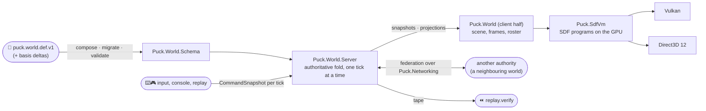

# Puck

Puck is an everything-as-data game engine written from scratch in C# (.NET 10).
A versioned JSON document describes what runs — a world, its screens, its
entities, its neighbours, and how it composes over other documents — and the
engine renders, simulates, validates, and replays it deterministically on either
GPU backend, Vulkan or Direct3D 12. The live game is `Puck.World`: a hub world
where four ground worlds meet at a corner, four portals leave for the dungeons,
and every player owns a world of their own that is an ordinary instance of the
same document.

Puck is deliberately a dumb terminal *beneath* engines: no engine framework, no
binding library, no scene graph, no floating point in simulation state. Signed
distance fields are the geometry all the way down; fixed-point maths is the
arithmetic all the way down; the console over stdin/stdout is the control plane;
and where the whole thing ends up is left open on purpose. Nothing outside this
repository consumes it yet, so names, shapes, and documents change freely — the
only stability contract is observable behavior under the gates.

## ✨ Key features

- *Everything as data:* one document family (`puck.world.def.v1`) carries the
  world, its screens, entities, adjacencies, admission, market, and metadata; a
  document may be a delta over a `basis`, so similar worlds compose instead of
  restating everything. One thick validator gates every instance before it swaps
  in, and the same composition path serves a file on disk and a copy in the
  cloud.
- *Deterministic to the bit:* fixed-point maths (`Puck.Maths`), per-tick
  command snapshots (`Puck.Commands`), and a replay tape are engine primitives.
  Same document + same input → identical state on every machine and backend;
  the mapping is pinned, not the values, so a deliberate correction moves hashes
  and gets re-recorded in the same change.
- *SDF-native rendering on two backends:* scenes are programs for a small SDF
  virtual machine marched in compute shaders — Vulkan and Direct3D 12 share one
  HLSL source, and `puck parity` compares the same composed frame across both.
- *Worlds federate, and worlds are users:* an authority owns each world
  instance; travellers cross invisible reciprocal seams by reserve-then-commit
  handoff; a neighbour can prove its border with an attestation rather than by
  handing over its document, and a derived corner is proven from resolved
  documents or verified attestations, never from an unsigned copy. A world's
  identity is its owner's platform identity — game clients are users, never app
  registrations.
- *Deterministic physics on the same arithmetic:* fixed-point gravity solvers,
  analytic and SDF contact, a soft-step rigid solver with persistent manifolds,
  friction, and a two-body kernel — every kernel bit-identical for identical
  ordered inputs.
- *Emulators as first-class machines:* the GB/GBC and GBA cores
  (`Puck.HumbleGamingBrick`, `Puck.AdvancedGamingBrick`) are deterministic,
  snapshot- and fork-able machines a world can host on a screen, link across
  worlds, and drive as instruments; each carries its own conformance battery.
- *Verified by running:* the game is verified by running it — canaries drive
  the real executable over stdin and require a discriminating leg that goes red;
  the architecture ledger, the determinism laws, and the emulator batteries are
  the enforced gates.

## 📐 How a run works



The document is composed, migrated, and validated once; the authoritative
server folds one `CommandSnapshot` per tick and never reads a clock; presentation
consumes snapshots and never writes state; another world's authority is reached
over the wire with an admission door and signed claims; and the tape lets any run
be re-driven and compared byte for byte.

## 🚀 Quick start

Requires Windows, .NET 10, `dxc` on `PATH` (it ships with the Vulkan SDK and the
Windows SDK), and a GPU with Vulkan 1.3 or Direct3D 12 Shader Model 6.6.

```powershell
# The hub world — the game, and the default with no flags at all:
dotnet run --project src/Puck.World -c Release

# Bound the run and drive it over stdin (the console is the control plane):
dotnet run --project src/Puck.World -c Release -- --exit-after-seconds 10
```

The repository's own tooling is the `puck` CLI (`src/Puck.Cli`):

```powershell
dotnet publish src/Puck.Cli -c Release -o src/Puck.Cli/publish
dotnet src/Puck.Cli/publish/Puck.Cli.dll search -M 0 "<regex>" src   # content search
dotnet src/Puck.Cli/publish/Puck.Cli.dll references <SimpleName>      # who references a symbol
dotnet src/Puck.Cli/publish/Puck.Cli.dll architecture                 # the layering ledger
dotnet src/Puck.Cli/publish/Puck.Cli.dll canary                       # the automatic canaries
dotnet src/Puck.Cli/publish/Puck.Cli.dll parity                       # cross-backend frame check
```

## 🗺️ The projects

Every feature lives in a focused `Puck.*` project that describes itself in its
own README; [docs/project-map.md](docs/project-map.md) states the layering
rules and generates the layering block from each project's own declaration.

| Family | Projects | What they are |
|---|---|---|
| The world | `Puck.World.Schema` · `Puck.World.Protocol` · `Puck.World.Server` · `Puck.World.Addons` · `Puck.World` | what a world *is* (document model, validator, composition), what it *says* (wire and tape vocabulary), what it *does* (the authoritative fold), the guest runtime it hosts, and the composition root that runs the game |
| Documents and authoring | `Puck.World.Forge` | the authoring document families a world embeds (creations, audio, synth patches) and the ROM forge behind the emulator cartridges |
| Numerics and physics | `Puck.Maths` · `Puck.Physics` | deterministic fixed-point arithmetic, exact fields, reproducible randomness; gravity, contact, and rigid-body kernels on it |
| Rendering | `Puck.SdfVm` · `Puck.Shaders` · `Puck.Vulkan(.Presentation)` · `Puck.DirectX(.Presentation)` · `Puck.Overlays` · `Puck.Text` | the SDF virtual machine and world renderer, shader loading, the two backends and their presentation wrappers, overlays, and the MSDF/OpenType text pipeline |
| Substrate | `Puck.Abstractions` · `Puck.Hosting` · `Puck.Launcher` · `Puck.Commands` · `Puck.Input` · `Puck.Platform` · `Puck.Networking` · `Puck.Attestation` · `Puck.Storage` · `Puck.Assets` · `Puck.Recording` | contracts, hosting and clocks, the host loop, commands and input, the OS layer, the dialect-agnostic wire, signed attestations, cloud storage, asset bytes and codecs, capture and muxing |
| Emulators | `Puck.HumbleGamingBrick` · `Puck.AdvancedGamingBrick` · `Puck.GamingBricks` · the two `.Post` batteries | the GB/GBC and GBA cores, their shared instance/fork/snapshot scaffold, and the conformance and determinism batteries that gate them |
| Tooling | `Puck.Cli` · `Puck.Analyzers` | the `puck` verbs, the verified-code and architecture analyzers |

`experimental/` holds quarantined trees (`Puck.Demo`, `Puck.Post`, `Puck.Bench`,
`Puck.BareMetal`, `Puck.Platform.Switch`, and `scripts/`): read as prior art,
never built, run, or revived in place — see
[experimental/README.md](experimental/README.md).

## 📦 Packages

Blessed libraries pack as `ByteTerrace.Puck.*` and ship in lockstep at one shared
prerelease version (`build/Packaging.targets`): `Abstractions`, `AdvancedGamingBrick`, `Audio`,
`Assets`, `Attestation`, `Commands`, `DirectX`, `GamingBricks`, `Hosting`,
`HumbleGamingBrick`, `Maths`, `Physics`, `Recording`, `Scripting`, `Shaders`,
`SignedDistance`, `Text`, `Vulkan`. Assemblies and namespaces stay `Puck.*`; each
package carries its README and the license files.

## 🧪 Verification

The gates prove observable behavior, never internal structure:

```powershell
dotnet build Puck.slnx -c Release          # warnings are errors
dotnet test Puck.slnx -c Release           # every project; the Maths coverage ratchet is one of them
dotnet src/Puck.Cli/publish/Puck.Cli.dll architecture   # exact-equality layering ledger
dotnet src/Puck.Cli/publish/Puck.Cli.dll canary         # headless proofs against the real Puck.World
dotnet src/Puck.Cli/publish/Puck.Cli.dll parity         # the same composed frame on both backends
```

Game and world changes are verified by running `Puck.World`; emulator changes by
the `.Post` batteries; maths by the law suite in `tests/Puck.Maths.Tests`. A
verification artifact must state what would falsify it — a canary carries a
discriminating leg that goes red, a law is run against the unfixed code first.

## Where to go next

Read [docs/vision.md](docs/vision.md) (what Puck is and refuses to be), then
[docs/campaign.md](docs/campaign.md) (what we are collectively building, where it
stands, what is next), then the [guide for contributors and agents](docs/agent-guide.md).
Beside them: the [SDF handbook](docs/sdf-handbook/README.md), the
[SDF](docs/sdf-wiki/README.md) and [AGB](docs/agb-wiki/README.md) research wikis,
[document examples](docs/examples), and the [docfx API reference](docs/api/index.md)
(git-ignored build output of `dotnet docfx docs/api/docfx.json`).

Standing on many shoulders — see [ACKNOWLEDGMENTS.md](ACKNOWLEDGMENTS.md).

## License

Puck is **source-available and dual-licensed** — not open source. Noncommercial
use (including by individuals, schools, universities, and government bodies) is
free under the [PolyForm Noncommercial License 1.0.0](LICENSE.md); commercial use
requires a paid license. See [LICENSING.md](LICENSING.md) for who needs what and
how to obtain a commercial license.
