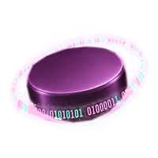

# Branding

This directory owns Puck's maintained visual assets and the map of their
consumers. Use it when you need the product mark, a browser icon, the palette,
or the distribution check. The manifest records the byte hash and intended
variant for every maintained asset; the rasters are retained from the existing
site, dashboard, and editor consumers without pixel edits.

## Canonical assets

The stable source names live under [`assets/`](assets). `puck-logo-200.png` is
the primary product mark for the documentation site and NuGet package. The
dashboard portal uses the authored `puck-logo-256.png` header variant, and the
VS Code extension retains its separate `puck-editor-icon-128.png` variant.
The favicon, touch icon, and dark application icons are canonicalized by size.
Choose the smallest supplied size that matches the consumer's declared slot;
do not resize a raster in a source change.

The site palette and light/dark tokens live in
[`tokens.css`](tokens.css). The checked-in
[`docs/site/_theme/tokens.css`](../docs/site/_theme/tokens.css) is its staged
copy for the deployed site. The site theme and the DocFX adapter import that
copy while keeping their layout rules local; the dashboard imports the
canonical file directly and adds only Mantine bindings. The existing self-hosted
Lora and JetBrains Mono files remain under
[`docs/site/_theme/fonts/`](../docs/site/_theme/fonts/); their existing font
license and provenance treatment is unchanged.

The shared `--font-body` and `--font-code` stacks live beside the palette. Site
and DocFX consume them directly; the dashboard keeps its longer code fallback
where its local component rules require it.

| Variant | Preview | Use |
| --- | --- | --- |
| Primary 200 |  | Documentation site and package icon |
| Portal 256 |  | Dashboard header |
| Editor 128 |  | VS Code extension; integration deferred |

## Distribution map

`docs/site` is the source for the staged documentation site and its `_theme`
directory is copied beside the generated API reference by `puck docs build`.
The NuGet pack target consumes the canonical 200px mark directly as `icon.png`.
The dashboard host serves the shared favicon, touch icon, and app-icon sizes;
its portal keeps the 256px header variant. The editor extension currently
consumes the 128px variant. Its implementation and manifest are being changed
in a separate task, so any further editor integration remains deferred.

## Updating an asset

Replace the canonical bytes deliberately, update the corresponding `sha256` in
[`manifest.json`](manifest.json), and update or add copy entries for every
consumer. Keep a distinct manifest asset when a consumer's authored dimensions
or treatment are intentional. Run the deterministic check from the repository
root:

```powershell
puck branding --check
```

Run `puck branding` after changing a canonical file to update every
non-deferred copy from the manifest, then run the read-only check again:

```text
puck branding
puck branding --check
```

The command validates every canonical hash and every destination path before it
writes. `--check` fails on a missing canonical or active consumer file, a
changed canonical hash, or drift in an active distributed copy. Deferred
consumers are counted and retain path validation, but their files are not
synchronized or required to exist. The verification workflow runs this check
with the candidate CLI; see [CI and releases](../docs/development/ci.md).

## Documentation

📚 [Writing documentation](../docs/development/documentation.md) · 🛠️ [Development](../docs/development/README.md)
