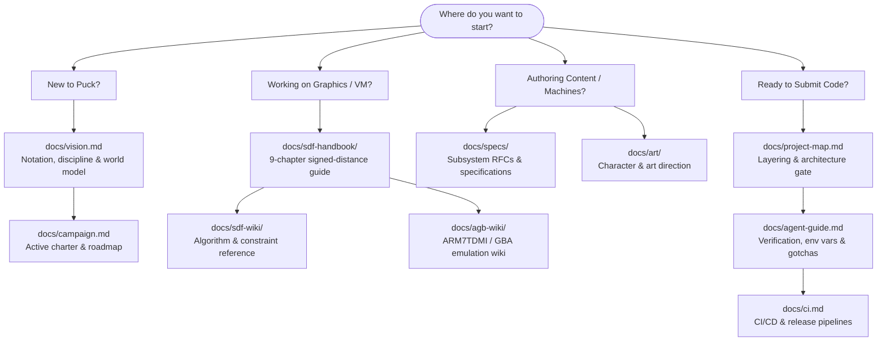

# Puck Documentation Vault

Welcome to the Puck documentation vault. This directory is the authoritative knowledge base for the Puck engine, the `Puck.World` reference game, and its underlying mathematical and rendering foundations. It is structured for reading front-to-back in an editor, navigating via tools like Obsidian, and guiding autonomous coding agents.

---

## 🗺️ Reading Paths & Orientation

Select the path that matches your goal:

### 1. New to Puck?
1. **[vision.md](vision.md)** — **Start here.** What Puck is (a closed data notation) and what it refuses to be. The core invariants, determinism doctrine, and the world model.
2. **[campaign.md](campaign.md)** — What we are collectively building. The binding charter, project rulings, and current arc.
3. **[project-map.md](project-map.md)** — How the solution's split `Puck.*` projects layer, what each owns, and the dependency rules enforced by `puck architecture --check`.

### 2. Working on Engine, Maths, or Shaders?
- **[sdf-handbook/](sdf-handbook/README.md)** — A complete, 9-chapter pedagogical book explaining how signed distance fields become lit pixels across 5 GPU compute passes while holding bit-identical determinism.
- **[sdf-wiki/](sdf-wiki/README.md)** — Compact reference on SDF algorithms, Lipschitz bounds, ray-marching acceleration, normal calculation, and rejected techniques.
- **[agb-wiki/](agb-wiki/README.md)** — Hardware accuracy reference for the Game Boy Advance (`Puck.AdvancedGamingBrick`) emulation core, Direct Sound FIFO, DMA scheduling, and test corpora.
- **[citations.md](citations.md)** — Full evidence citations for GBA hardware research and `Puck.Maths` theorems.

### 3. Implementing Features or Subsystems?
- **[specs/](specs/README.md)** — The catalog of subsystem specifications, RFCs, and implementation briefs:
  - [Screens and machine extensions](specs/machine-extensions.md) — Machine hosting, screen mirrors, and hardware control.
  - [Groups and cooperative matchmaking](specs/group-finder.md) — In-world matchmaking, portable membership, and recovery.
  - [Retail-scale cartridges](specs/retail-scale-cartridges.md) — Capacity evaluation for large RPG data files.
  - [World runtime consolidation](specs/world-runtime-consolidation.md) — Engine refactoring and facade design.
  - [Abstract-machine costing](specs/abstract-machine-costing.md) — Deterministic pricing models across platforms.
  - [Puck MCP plan](specs/puck-mcp-plan.md) — Model Context Protocol architecture and safety boundaries.
  - [State duplication](specs/state-duplication.md) — Analysis of state evaluation consolidation.
- **[art/](art/armored-chibi-hero-brief.md)** — Visual design briefs and concept packs:
  - [Armored chibi hero brief](art/armored-chibi-hero-brief.md) — Main character design, proportions, and motion rules.
  - [Moth concept pack](art/moth-concept-pack-2026-09-09/README.md) — Six concept model sheets and generation prompts.

### 4. Contributing Code & Verifying?
- **[agent-guide.md](agent-guide.md)** — Essential guide for humans and AI agents: semantic C# tools (`puck references`, `puck search`), test execution, hardware gotchas, and verification recipes.
- **[ci.md](ci.md)** — Detailed specification of GitHub Actions workflows, release builds, package publishing, and Azure deployment.
- **[verification/manual/](verification/manual/README.md)** — Hand-run `SendInput` desktop harnesses for pointer gestures and camera orbit focus loss.

---

## 📚 Information Architecture

| Directory / File | Description | Audience |
|---|---|---|
| **[vision.md](vision.md)** | Foundational philosophy, closed vocabulary, determinism, world model. | Everyone |
| **[project-map.md](project-map.md)** | Subsystem ownership, stability, and layering block (gated by CLI). | Developers, Agents |
| **[agent-guide.md](agent-guide.md)** | Contributor orientation, verification procedures, environment gotchas. | Contributors, Agents |
| **[campaign.md](campaign.md)** | Shipped game charter, current milestone shape, and active work plan. | Everyone |
| **[campaign-milestones.md](campaign-milestones.md)** | Historical verification log and dated milestone validation runs. | Reference |
| **[ci.md](ci.md)** | CI/CD automation, `puck` CLI actions, artifact generation, Azure deploy. | DevOps, Agents |
| **[citations.md](citations.md)** | External hardware research and mathematical theorem evidence citations. | Reference |
| **[world-name-registry.md](world-name-registry.md)** | Autogenerated document field registry (gated by `puck registry --check`). | Generated Reference |
| **[sdf-handbook/](sdf-handbook/README.md)** | 9-chapter textbook on the SDF VM, pipeline passes, lighting, and baking. | Students, Engineers |
| **[sdf-wiki/](sdf-wiki/README.md)** | Encyclopedia of SDF techniques, mathematical proofs, and technique verdicts. | Graphics Engineers |
| **[agb-wiki/](agb-wiki/README.md)** | GBA emulation wiki: timing, PPU, APU, DMA, save types, and test ROMs. | Emulation Engineers |
| **[specs/](specs/README.md)** | Subsystem RFCs, architectural design briefs, and costing models. | System Architects |
| **[art/](art/armored-chibi-hero-brief.md)** | Character briefs, model sheets, animation guides, and generation prompts. | Artists, Designers |
| **[verification/manual/](verification/manual/README.md)** | Manual OS input injection test harnesses (`SendInput`). | QA, Developers |
| **[api/](api/index.md)** | DocFX API reference configuration and overview. | API Consumers |

---

## ⚖️ Tree Documentation Laws

All documentation in this repository follows strict quality rules:

1. **Single Home per Fact (The No-Drift Law):** Every fact has exactly one owning document. Other surfaces summarize and link out.
2. **State No Status in Living References:** Living architectural documents describe *what the system is*, never transient progress. The code answers what is built.
3. **Audience Registers:**
   - **`docs/` and `README.md`:** Narrative prose, accessible to motivated middle- and high-school students.
   - **Code XML Comments:** Precise API reference for developers in IDEs.
   - **`CLAUDE.md` and `.claude/`:** Operational instructions for agents.
4. **Mechanical Verification:** Links, citations, layering blocks, and registries are validated mechanically by CLI tools (`puck doc-links`, `puck architecture --check`, `puck registry --check`).
