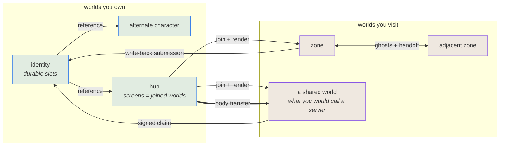

# Worlds and federation

This manual describes how Puck represents worlds, validates their documents, runs
authoritative simulation, transfers state, and presents snapshots. Federation,
presence, and scale follow six invariants and a small set of relationships.
The platform supplies transport security and identity-key issuance. Each identity
receives signing and sealing P-256 key pairs during onboarding; key identifiers
include the issuer, subject, algorithm, and SHA-256 public-key hash. An identity
without keys cannot carry a claim, and an unverifiable claim is refused.

## Engine flow and boundaries

The engine has a one-way flow with explicit ownership at each boundary:

1. **Document.** A versioned `puck.world.definition.v1` document is the durable input.
   The [world data guide](../../src/Puck.World/README.md#the-world-as-data)
   and [schema guide](../../src/Puck.World.Schema/README.md#puckworlddefinitionv1the-world-definition)
   describe its fields and serialization.
2. **Validation.** `WorldDefinitionValidator` checks the complete composed
   candidate document before it can become live. Builders consume a valid
   document and do not repeat semantic validation.
3. **Simulation.** The authoritative server advances the document state in
   fixed ticks, accepts ordered submissions, and owns each body authority.
   See the [server tick](../../src/Puck.World.Server/README.md#the-tick-worldservercs)
   and [simulation authority](../../src/Puck.World.Server/README.md#simulation-authority)
   sections.
4. **Snapshots and replay.** The server publishes ordered snapshots and the
   protocol carries submissions, revisions, and replay data. The [protocol
   guide](../../src/Puck.World.Protocol/README.md) and [deterministic replay
   guide](../../src/Puck.World.Server/README.md#deterministic-replay-worldreplaytapecs-worldreplaytapedrivecs-worldreplaysnapshotcs)
   own those wire and tape details.
5. **Presentation.** A client consumes delivered snapshots, binds cameras and
   surfaces, and submits input; it does not become a second authority. The
   [client guide](../../src/Puck.World.Client/README.md#the-entity-view)
   covers the projection boundary, while [SDF rendering](../../src/Puck.SdfVm/README.md#the-render-pipeline)
   and [graphics options](../../src/Puck.World/README.md#graphics-options)
   own renderer details.

The document boundary owns durable intent, validation owns semantic admission,
the server owns accepted simulation state, snapshots own transportable observations, and
presentation owns timing and visual choices. A layer may consume the previous
layer output through its contract, but it does not reach around that contract
to mutate another layer state.

## Paths a document names

Every relative path a world document authors resolves beside that document,
through one resolver (`WorldDocumentPaths`): a `basis` or `imports` entry, a
`references` row, the music, table, tune and patch rows' `source`, an addon's
`modulePath`, a `views.graphs` row's `source`, a probe's `track`, a machine's
configured content, `host.icon`, and a `schedule` instance's `document`. An
absolute path is honored as written. A document and its files therefore move
together: the build copies the `Assets` tree beside the executable with its
layout intact, a staged composition or test world re-expresses its paths from
its source directory to the staging directory, and `world.save` to another
directory re-expresses them from the loaded document's directory to the
target's. `puck compile --output` to another directory re-expresses a compiled
document's paths from its source's directory to where it lands. Inside a
`.puck` source, a module's relative file path, written plainly or as
`asset "…"`, resolves beside the module that writes it, whichever source uses
the module, and the compiled document names the file from its own directory.

A loaded definition carries its directory as `WorldDefinition.DocumentDirectory`:
the file's directory for a document read from disk, the source's directory for
a compiled `.puck` world, and the recorded document's directory for a replay
re-drive. It is not document content, so it never enters a hash, a pin, or a
compiled world's key. A document with no directory (standard input, an
in-memory build, a hosted or peer-delivered document) resolves only absolute
paths: validation refuses a relative asset row by name, and mounting refuses a
relative addon module by name. When a basis or an import in another directory
is merged, its file paths are re-expressed relative to the document that merges
it, so each path still names the file its author meant; that covers asset rows,
addon modules, graph sources, probe tracks, text fonts, and the
window icon. Document names (`references`, `schedule` instances) stay as
written: worlds staged together reach each other by name. A `captures`
directory the document names also resolves beside it. A `schedule` names no
output directory at all: `--schedule-dir` both arms it and says where it writes.

Files the engine ships (the default world, fonts, shaders, probe kinds) resolve
beside the executable through `PuckPaths.Shipped`. Neither resolver falls back
to the other.

## Compiled worlds

A compiled world stores what a boot derives from a document, so a later boot of
the same document can take it instead of deriving it again. It is a cache with a
strong key, never a source of truth: the document stays the durable input, and a
boot that finds no compiled world derives everything and runs the same world.

**The file.** A compiled world is a [chunk container](../reference/assets.md#chunk-containers)
with the magic `PWLD` and format version 1, named `<name>.puckb` after its
document (`moth.puck` and `moth.world.json` both map to `moth.puckb`). Its header
holds, in order, four keys, and a boot whose own four keys differ ignores the
whole file:

| Key | Holds |
|---|---|
| Engine build | The `sha256-64` pin over the module version id of every `Puck.*` assembly the document model's assembly reaches, so any change to code a derivation can run moves it. |
| Catalog fingerprint | The composition fingerprint of the machine catalog the document composed under. |
| Definition hash | The 64-bit content hash of the composed, undrawn definition's canonical JSON (`WorldDefinitionSerialization.Serialize`), the same `sha256-64` pin every other door computes over a definition. A `.puck` source and the document it compiles to key one compiled world. |
| Instance identity | The instance the definition's draws were seeded for; the desktop boot and `puck compile` use `boot`. |

Each chunk is one registered derivation's product, and each code appears once.
A chunk records the version of its derivation and the content hash of every
input it read beyond the definition, and a boot keeps a stored chunk only while
its version is the derivation's own, every input still reads as recorded, and
no chunk it depends on was derived afresh. Otherwise the boot derives that chunk
and keeps the rest, except a chunk too heavy for a boot's critical path, which
declares that it does not derive on boot: a boot that finds no compiled world
holding it leaves it out of the boot and of the compiled world it writes, and
names it as deferred. Nothing is repaired or adapted.

| Code | Holds | Inputs |
|---|---|---|
| `DEFN` | The drawn, resolved definition as compact canonical JSON: the composed definition after its first-fill draws and the state references they fill, before host overrides, which every boot applies. Loading it parses the JSON in place of drawing again. | None |
| `ASST` | For every music, table, tune, and patch row, in order of family then name: the family, row name, authored source, and the source file's 64-bit content hash, or its absence. | Each distinct asset source, by its authored spelling, read beside the document ([paths a document names](#paths-a-document-names)) |
| `BAKE` | The path of the bake pack relative to the document's directory, then every distinct bake key of the drawn definition's prototypes at the standard tier, as the key's pin, in ordinal order. The outcomes live in the pack, not here ([creation bakes](#creation-bakes)). Its version is the baker's. It does not derive on boot. | None; it reads `DEFN` |

`CompiledWorldChunks` lists the derivations in the order they derive and load,
`DEFN` first; a later package registers its chunk with `With`, and the
container and header do not change. Live and per-device products are never
stored: GPU objects, machine instances, mounted addons, adjacency projections
and neighbour solids, and the live scene program.

**Where compiled worlds come from.** `puck compile` writes one beside each world
document it writes, and a `.world.json` path given to it contributes its compiled
world alone. The game's build runs the same compile over every shipped world
(`build/WorldAssets.targets`) and ships each compiled world beside its document
in `Assets/worlds`. A module fragment, which does not parse and draw as a world
on its own, has none. A boot looks beside its document first and then in the
per-user `compiled-worlds` cache, which every boot on the device shares whatever
its [state root](../../src/Puck.World/README.md), takes the first compiled world
whose header is its own, and, when it derived any chunk, writes the whole
compiled world into that cache, named by the `sha256-64` hex of
the document's full path; it never writes beside the document. A file that
cannot be read or written costs a derivation and nothing else. The boot prints
one `[world] compiled world:` line after its `[world] definition:` line, naming
where it read the compiled world, the chunks it kept, derived and deferred, and
where it wrote one.

**What a boot counts.** The `world.boot` work source counts
`world.boot.compiled-hits`, one per boot whose drawn definition came from a
`DEFN` chunk, and `world.boot.chunk-derivations`, one per chunk derived afresh.
Both depend on what a boot finds on disk, so both are pacing-class. Every
deterministic-class count reads the same whether or not a boot finds a compiled
world: the `DEFN` load's parse belongs to the hit and is not a
`world.boot.parses`. `puck counters` relies on that, because its two backend
legs share one per-user cache and only the first can miss it.

A boot from a compiled world still validates the definition and compiles its
rules, and still composes, parses and serializes the authored document to
compute the definition hash, so `DEFN` saves the draw alone. The hosted
asynchronous load and the replay drive draw without a compiled world. The work
still open, and the chunks that follow, are in
[the runtime and delivery plan](../plans/runtime-and-delivery.md#compiled-worlds).

### Creation bakes

A creation bake is a prototype's presentation assets: an indexed mesh, its
surface textures, and an octahedral impostor
([prototype bakes](../rendering/sdf/handbook/bricks-and-baking.md#prototype-bakes)). It is
keyed by the creation's pin (the prototype row's hash), the baker's version, and
the quality tier, and one key is one set of bytes. Bakes are presentation only:
contact, queries and simulation keep reading the field, and nothing draws a bake
yet.

A build output ships each bake once. `puck compile --tree` writes one bake pack,
`bakes.puckbake`, at the root of its output: a chunk container
(`WorldBakePack`, magic `PWBK`) holding, for each key the run's compiled worlds
name, the encoded bake or the refusal of a creation that has none. Each
compiled world's `BAKE` chunk names only its keys and the pack's path, so a
creation many worlds share is baked once per run and stored once. A compile
without `--tree` writes the pack beside the compiled world and keeps the
outcomes an earlier compile left in it. The same tree run writes the
[package store](../reference/shaders.md#the-builds-package-store), `packages/`,
holding the compiled shader package of every source its worlds'
`views.graphs` rows name, so a released world compiles no shader on the
player's device either.

One cache, `WorldBakeStore`, is filled two ways. A boot that keeps a `BAKE` chunk
holds, in memory and without copying, every outcome it names that the pack
beside it carries, so a released world bakes nothing on the player's device. A
key the pack lacks, or a pack that is missing or unreadable, is left to the
presentation. A presentation's `WorldBakeSchedule` looks up every prototype's
key whenever the delivered definition changes and queues each one the cache
lacks. It resolves the queue one key at a time on the thread pool: a key an
earlier run kept in the per-user `bakes` cache is read back, and any
other is baked and kept there, so editing one prototype bakes that prototype
alone. A prototype draws through its field until its bake is ready. The
`sdf.bakes` work source counts the keys the cache held, the keys scheduled, the
bakes made, the refusals, and the field evaluations spent; every kind is
pacing-class, because what the cache already holds decides it.

## World relationships

The world model represents zones, player identities, alternate characters,
hubs, and games using the same document model. Ownership, joining, and movement
between them are relationships expressed through document fields, capabilities,
and submissions. The terms below explain how those relationships fit together.

| Relationship | What it means | Where it lives |
|---|---|---|
| **Ownership** | you hold authority over a document | identity, derived from the hosting platform's stable per-user id |
| **Joining** | you have the document, a snapshot, and the stream; you can see it | session admission |
| **Embodiment** | you have a *body* in it—strictly separate from joining | population entry |
| **Reference** | a world names another definition/address without asserting reachability | document row |
| **Destination** | a world selects a scoped identity/generation over one reference | document row |
| **Attestation** | a world signs a claim another world carries | issuer-signed slot |
| **Transfer** | a body moves from one world's authority to another's | submission |
| **Display** | a surface shows what a camera produces, in this world or a joined one | placement facet |

Frames use a producer and consumer relationship: a camera produces an image,
and a placement with a display facet consumes it. The pairing is document data.
A display facet is an optional property of a placement, alongside properties
such as solidity and emission; it does not introduce a separate content type.

Displaying another world's live view requires joining that world and rendering
its delivered state. Crossing into it acquires a body, a separate operation from
joining. A participant who has joined without acquiring a body can observe the
world without a separate spectator mode.

The authority decides what an observer receives through grants. It can provide
a full replica, a redacted projection, or rendered frames when state cannot be
shared. These are different fidelities of the same observation relationship.

## Terms

Client and server describe roles relative to a world. A host can be the authority
for an identity world while following four other worlds at the same time. The
role therefore belongs to a world relationship, rather than permanently to a
machine.

| Term | Means |
|---|---|
| **World** | a document and the simulation it defines—instantiated when something needs to run it, and durable when nothing does |
| **Instance** | a running copy of a world's simulation on some machine |
| **Authority** | the one instance of a world whose results define the accepted state |
| **Replica** | any other instance of it, ticking the same inputs, whose results are not |
| **Host** | the machine or process running instances |
| **Participant** | someone joined to a world; *embodied* if they hold a body in it |

An authority and a replica run the same simulation code and recorded inputs.
Only the authority decides the accepted state. Determinism allows that shared
execution model to support command-streamed screens, prediction, spectators,
and another engine presenting the simulation.

Common networking terms remain useful, with the following qualifications:

| You would say | Here it is | Where the analogy breaks |
|---|---|---|
| server | a host running an authority others accept | any world can be one, and nothing marks it as such |
| dedicated server | a host whose authorities have no embodied participant | otherwise identical to any other host |
| listen / player-hosted server | a host that is both an authority and embodied | the ordinary case, not a lesser one |
| client | a host running replicas, usually embodied | a replica runs the *same* simulation, not a thin viewer |
| zone, shard, realm | a world |—|
| dungeon instance | another world booted from the same document | needs no instancing system |
| character, alt | a world you own |—|
| account | the set of worlds you own | there is no tier above them |
| spectator | a participant joined but not embodied | not a mode |
| item, inventory | durable slots on a world you own | the engine never learns what an item is |

The following terms describe the simulation and its document:

| Word | Means |
|---|---|
| **tick** | one fixed simulation step; everything deterministic is counted in ticks, never seconds |
| **taped** | recorded on the replay tape, so the same inputs reproduce the same state exactly |
| **submission** | a tick-stamped request into a world—intent, a command, a document change |
| **slot** | a named value on a body or a world; *durable* ones persist for a participant |
| **placement** | an instance of authored geometry positioned in a world |
| **facet** | an optional property a placement carries—solid, emitting, a region, a display |
| **grant** | permission for a principal to act on a subject; deny by default |
| **domain** | an issuing authority—*is* its root key's fingerprint, never a name |

## Invariants

The model requires the following six invariants.

1. **Exactly one world simulates a given body at a time.** Authority is never shared, never
   overlapped, never negotiated mid-tick.
2. **Foreign and nondeterministic state enters at one boundary**, tick-stamped and taped—never a
   mid-tick read of another document, of storage, or of a clock.
3. **The engine ships mechanisms; the game supplies names.** No `health`, no `lootTable`, no `quest`,
   no `aggro` in the schema. A level is a durable counter someone called a level.
4. **Never two mechanisms for one decision.** Two sources for one value compose by a stated rule.
5. **Meaning is bilateral.** The engine never adjudicates trust. It carries proof and enforces
   capabilities; whether a claim *counts* is the receiving world's policy.
6. **A world authorises its own inhabitants; the grant table gates outsiders.** An entity driven by
   an authored intent program has no principal, so entity-to-entity effects are authorised by what
   the world's own programs declare. Grants keep gating peers, addons and the console. Neither
   mechanism reaches into the other's half.



## Portal composition

Portal is a game-facing name, not an engine primitive:

```text
destination selection
+ joined-world display (optional)
+ embodiment transfer (optional)
+ trigger, geometry and presentation
= portal
```

Display without transfer is a television, spectator surface or scrying view. Transfer without
display is a blind transition, respawn or concealed doorway. Destination resolution without either
serves matchmaking and scripts. A conventional visible portal composes both consumers over one
resolution. Camera and surface remain producer and consumer; traveler selection remains a transfer
concern. Neither belongs in destination selection.

The same composition supports a display-only surface, a scripted transition,
matchmaking, or a visible portal. A visible portal resolves its destination once
and lets its display and transfer consumers address that same resolved session.

## Adjacency and crossing

Portals describe authored transitions between worlds. Continuous topology is authored independently,
through reciprocal `adjacencies` rows: each names a global persisted destination, the neighbour's
counterpart row, and an invisible rectangular boundary, and the validator fetches the neighbour
document and refuses by name an unreachable destination, a missing reverse edge, mismatched extents,
or a non-reciprocal frame. When two edge neighbours independently converge on the same fourth
authority, the compiler derives that corner peer and validation proves both two-hop reciprocal paths
— observation and interaction interest, never a diagonal ownership edge.

Authors declare physical and interaction envelopes; they never guess a transport strip. The compiler
derives one symmetric overlap depth from both bodies' reach, interaction/targeting reach, and two
slower-side delivery periods of closing speed, rounding outward—so weapon reach reaches topology
at author time rather than in production.

Ownership changes at the far side of a derived deadband, never at the authored plane, so an arrival
starts that far inside its new writer and the reciprocal pair closes. The deadband is derived from
whichever envelope the boundary's own geometry closes against—a wall against two body reaches plus
contact skin, a floor or ceiling against one authority step of the fastest vertical travel a kit's
holds admit, gravity over a step or a hold's terminal speed, plus contact skin. Those derived minima
cannot be reduced by a document. An adjacency may declare a non-negative `hysteresis` to widen its
deadband; both reciprocal rows must agree, and direct and corner projections widen their overlap
to cover it. The effective threshold is the larger of the authored value and the derived minimum.
The floor deadband grows as the authority rate falls, and at the default rate it is comparable
to a body's height, so a destination needs that much clear space past the plane. A body settling or
hovering under its holds never crosses back in one step, so it changes writer at most once; a body
descending on purpose clears the deadband in a few steps, with the neighbour's field serving its
contact meanwhile. Vertical motion no hold bounds, a full-lift row or a vertical-velocity effect,
can pass the deadband in one step, and then the body is handed over once, because the sweep tests
the whole step.

Crossing maps a traveler through the pair's isometry, a distance-preserving
transformation. The point where its swept segment intersects the boundary maps
to the corresponding point on the other side. This preserves off-center arrival
and continuous terrain without adding a separate crossing transform.

That isometry is a rotation about world up — the validator refuses a pair whose map is anything else
— and the turn it applies is `counterpartYaw - thisYaw - 180` degrees. Two faces pointing at each
other are 180 degrees apart and map as the identity, so a body arrives at the same world point,
keeping its heading and its velocity, and any other authored pair turns it by the remainder. A
boundary's rectangle takes its right axis from its yaw whatever its pitch, so the formula holds
unchanged for a boundary lying flat: there the yaw no longer contributes to the outward direction
and becomes the rectangle's roll about the vertical, which means an untwisted floor seam authors its
two yaws 180 degrees apart exactly as a wall pair does — pitch -90 above facing down, pitch +90 and
the opposite yaw below facing up. A flat pair authored at one yaw on both sides is a seam with a
half turn in it, and a body dropped off the rim arrives on the far side of the plane's centre facing
backwards. `world.adjacencies` echoes the turn in force (`turn=`) beside the ownership threshold
(`threshold=`) so an author can read a twisted seam off the console rather than off a body.
The depth past the threshold carries through unchanged: a deliberate continuity property. Scanning
is swept per actual step, so a high-speed body cannot tunnel through a face between samples, and a
body crossing several faces in one step resolves to exactly one winner. The neighbour arrives over
the session-mirror observation plane—wire-shaped delivered data, never a reach into a sibling
instance's live objects.

## References, destinations, and sessions

`WorldReference` is the authored naming/address layer. It asserts naming intent, not durable
identity, existence, reachability or authority; a document path is a local bootstrap locator, not a
remote address. The reference/resolver boundary answers which durable definition or authority is
meant without pretending path spelling is identity.

`WorldDestination` layers scoped selection over exactly one reference:

```text
WorldDestination
  name
  reference                 # names exactly one WorldReference
  durability                # ephemeral | persisted
  scope                     # user | group | global
  groupSelector             # required iff scope=group; $type union below
  generation policy         # target-resolved; never a source-host counter

WorldGroupSelector
  {$type: named,  group: <group-id>}
  {$type: tagged, tag: <tag>}
```

It never repeats `WorldReference.Document`. Several destinations may select one definition
differently: a fresh group dungeon, a persisted user workshop and a shared global zone can all point
at the same reference. Future group-selection forms widen `WorldGroupSelector` with another `$type`
arm rather than adding parallel optional fields. Destinations are boot-authored document data;
making them live-editable is a complete mutation-axis addition, never an accidental consequence of
the row existing.

`ResolvedWorldSession` is target-issued runtime state, never authored:

```text
ResolvedWorldSession
  destination id
  durable world id
  current authority/session id and epoch
  unembodied session authority
  resolved scope key
  target-issued generation id
  destination presentation clock
```

Locality is absent from authored selection. A resolver may reach an in-process authority, start or
hydrate one locally, or connect to a remote authority. A durable world id is opaque, target-issued
and namespaced by the target authority domain. For a persisted world it remains stable across
suspend, hydration, restart and migration. A locator, process-local instance name and source-host
counter are resolution evidence at most; none is durable identity.

## Resolve once; consume with separate lifetimes

Display and crossing share one resolver-owned identity. They independently acquire it; a
transfer-only portal has no display object to own a session. Resolving an ephemeral destination once
for display and again for transfer could show dungeon A and enter dungeon B.

```text
Resolve(destination, verified claims) -> ResolvedWorldSession

ResolvedWorldSession.Observe(projection request) -> ObserveLease
ResolvedWorldSession.PrepareEntry(cohort)          -> EntryReservation
EntryReservation.Commit()                         -> embodied participants
```

The consumers do not share one disposable lease. An observation lease is reference-counted and
disposable. An entry reservation is transactional, survives display teardown, and supports abort
and target-clock timeout. Closing a view cannot cancel a transfer already preparing; a failed
transfer cannot leak an observation or population slot.

## Durability, scope, and generation

`ephemeral|persisted` describes world identity:

- **Ephemeral** creates a target-issued generation that is not recovered after its lifecycle ends.
- **Persisted** names durable simulation state that may unload, hydrate or move between hosts. It
  does not mean “retain this process object.”

`user|group|global` chooses the scoped identity/generation:

- **User** resolves locally to the entering seat's owned-identity world—the identity is the user. An
  anonymous seat refuses by name rather than minting an identity. Federated, the equivalent key is
  the authenticated platform user id.
- **Group / named** (`{$type:named, group:<group-id>}`) assigns the destination to exactly one
  authored group. Every traveler must prove membership in that group.
- **Group / tagged** (`{$type:tagged, tag:<tag>}`) selects the traveler's unique verified membership
  claim carrying the authored tag. Group rows/claims therefore gain a taggable member. Zero matching
  memberships and multiple matching memberships are distinct named refusals; the engine never picks
  one silently.
- **Global** selects the destination's shared key.

Scope is not permission. A global destination can remain private; a user destination can refuse its
user. Seat indices, peer indices and unqualified local group strings are not portable scope keys.
One entry reservation addresses one resolved scope key. A multi-user party entering a user-scoped
destination therefore receives a named scope-mismatch refusal. A named-group party proceeds only
when every member proves that named group. A tagged-group party proceeds only when each member's
unique tagged claim resolves to the same issuer-qualified group key. The engine does not silently
choose the triggering seat's user world or split one allegedly atomic cohort across worlds.

For an ephemeral destination, passive observation neither mints a new generation on every lookup nor
keeps a completed generation alive forever:

1. the target issues a candidate on first scoped resolution;
2. display and entry reservations address that candidate;
3. first committed entry claims it, and later entries in the scope join it;
4. target-authored completion/abandonment policy makes it terminal once no entry reservation or
   embodied participant remains;
5. observers may retain its terminal projection, while the next resolve receives a new generation.

An explicit reset ends a generation through the same target decision. Releasing an observation lease
alone never advances it.

## Authored per-world time

Each world declares its simulation rate in the document (`simulation.rateHz`); the compiler derives
every step-dependent value and refuses an invalid declaration. Rate is an integer hertz value. Zero
is valid and means a static world that does not advance. Every nonzero rate must divide
`FixedTickConversion.TicksPerSecond` (50400) exactly, so one simulation step is an integral number of
engine ticks. There is no conventional-rate enum or whitelist: 45 Hz and 90 Hz are required rates,
and every other positive divisor is equally expressible.

The divisibility rule stops at the engine-time boundary. A consumer whose own clock does not divide
evenly by the world rate carries its remainder across steps; it never constrains the authored rate to
make its own division convenient. Continuous audio stepping therefore uses a remainder-carry
accumulator (`AudioMixer.AdvanceStepFrames`) so 90 Hz emits the exact long-run 533, 533, 534, …
frame sequence rather than rounding or refusing the rate; the fixed 240 Hz
`AudioMixer.FramesPerSimStep` is exact only at that rate. The
same rule applies to every derived subsystem.

Authors express motion, acceleration, durations and other time quantities in seconds (`u/s`,
`u/s²`), never as per-tick values or raw tick counts. The compiler owns discretization against each
world's rate. Physics/interactivity floors and other compiler-derived bands bind only while a world
ticks; rate zero has no step and therefore no active per-step floor.

Pause/resume is a live authority/operator lever over the authored rate. `world.rate pause` makes the
effective rate zero without overwriting the declared rate; `world.rate resume` restores that exact
declared rate. This live pause is deliberately not persisted: it is an operational hold, and keeping
the declaration intact makes resume lossless. Durable stopped state uses the document mechanism by
writing `simulation.rateHz = 0`, so save/reload remains stopped. A nonzero document rate write is a
durable live rate change and atomically recompiles every rate-derived table before the new step width
takes effect.

Pause is never view-driven. Closing, hiding or throttling a portal view releases presentation work
but cannot pause an embodied destination. Only the destination authority/operator can pause it.
`world.rate` reads back declared rate, effective rate, paused state, step width (or `stopped`), and
the compiler-derived admissible band/floors with their named constraints; derivation is queryable,
not only a validator refusal.

Every live world owns its scheduling accumulator, deadline, step ordinal and elapsed engine time.
Changing step width preserves monotonic step ordinal and elapsed engine time; it never recomputes an
ordinal as `elapsedTicks / stepTicks`. A rate-zero world remains resident and observable but receives
no simulation steps until its effective rate becomes nonzero.

At rate zero, reconnect parking uses an explicit state with no expiration. A parked body's
`ParkedRemainingTicks` is `null` when no simulation tick can expire it, `world.parked` reads that as
`remaining=never deadline=never`, and the reserved `$parked:` rule fact compares as positive
infinity: equal to another forever fact, greater than every finite value, and never less than or
equal to one. Copying a forever fact into a numeric state cell does not fire because there is no
representable value to store. No `int.MaxValue` or other finite sentinel participates in comparison,
copy, deadline or persistence arithmetic.

## Joining, authority, and admission

An unembodied joined session is the ordinary shape behind a portal display. The target chooses a full
replica, redacted state projection or frames. Body-indexed principals cannot represent that
participant: admission must materialize a non-body, session-scoped principal or capability handle
before projection. Its epoch, revocation, budget and grant lifetime end with the session; embodiment
may add concrete body authority without turning observation into a body.

Crossing asks for embodiment. Successful target admission allocates a population entry and produces
concrete `Drive/body:<allocated-id>` authority. Do not add `Enter`: the capability vocabulary is the
settled five verbs.

A destination declaration grants nothing. Resolution is bilateral:

```text
source-authored destination
+ verified source/user/group claims
+ target-authored admission and disclosure policy
= materialized session capabilities
```

Verified claims are evidence normalized by the local or remote authentication boundary, never ids
asserted by a serialized request. Remote evidence carries issuer-qualified authority, document, user
and group identities plus audience, expiry, replay protection or channel binding, and membership
proof. The target reads its own durable policy before any participant authority exists.

Admission policy needs explicit algebra. Predicates within one selector are conjunctive;
alternatives are explicit alternatives. Acceptance derives the session's capabilities and resource
limits together: permitted durability/scope combinations, capacity, quotas, generation rate,
projection fidelity and backpressure. These are not fields forced into a per-tick grant budget and
not a second trust list that can disagree with grants.

Disclosure fidelity is authored on the `admission` row as one of three tiers, decided once at
admission and read by every remote egress: `frames` (pixels only, no document), `presentation`
(`puck.world.projection.v1` — the visitor's rendered and embodied-from state, with no member to
carry the logic or authority sections), or `replica` (the whole world document, the sanctioned
download). An absent tier resolves to `presentation`, so a world authored before the field existed
hands out no replica. A traveler crossing a seam discloses an identity projection: appearance,
the two motion rates, and the capacity-one record pools explicitly selected by `identity.records`.
The rest of its owned document remains private. A counterpart proves a border with a signed
attestation over the crossing rather than by handing over its world; assembling a derived corner from
several such proofs ranks a resolved document over a verified attestation over a plain one,
first-of-kind winning, so only the first two ever complete a corner. Snapshot delivery separately
carries a per-observer disclosure policy applied at the output hub's sink boundary, defaulting to
disclose-all.

A world names a cross-owner neighbour without reaching its storage directly — worlds are users, so one
owner's storage container is never reachable from another's. A cross-owner reference resolves through
an API counterpart resolver that fetches the named owner's published claim, verifies its chain against
the reading world's own admission entries, and binds the verified subject to the reference's named
owner before it can ever return a verified attestation.

## Observation and display

An observation feed provides:

- disposable subscriptions;
- a retained, non-consuming primer containing at least live definition/projection metadata and the
  current snapshot;
- ordered revisions plus authority/session epoch;
- per-sink exception isolation with detach-on-fault;
- bounded queues and backpressure;
- redaction and fidelity enforcement at every projection/read door, including queries;
- the destination presentation clock and step width.

A joined-world projection renders the destination from the destination's own delivered snapshots and
its own measured clock, never through the host's presentation clock—independently scheduled or
remote worlds do not share a presentation coordinate. A nested screen inside a projected destination
binds dark: the explicit depth-one policy.

User/group-scoped destinations make images viewer-dependent. One image per screen index cannot show
different destinations to split-screen viewers; per-viewport bindings or distinct render passes are
required.

## Transfer, determinism, and replay

Entry is one transaction over an already-resolved session:

```text
resolve
-> authenticate and prepare the complete cohort
-> reserve destination capacity
-> commit an idempotent handoff
-> acknowledge arrival
-> release source embodiment
```

The reservation carries transfer id, source/destination epochs, cohort, a deadline in the target
authority's monotonic elapsed engine ticks, and retry state. Expiry happens at a target tick boundary
and enters its ordered domain; it never reads wall clock or compares raw tick ordinals from worlds
with different rates. Abort restores each body's original pose/state, not merely source spawn. The
source releases authority only after destination acknowledgement.

Resolution and transfer are ordered authority events, not untaped host side effects. Generation ids
issue from a counter in the target resolver's ordered domain, recorded before they are exposed—a
pure function of event order. Wall time, UUIDs and discovery order never decide identity. A
remote-issued id enters the source as a verified foreign value at a named tape boundary.

Each authority tape records the initial authored rate and every ordered rate write, pause and resume
that changes which steps occur. Replay drives from the tape's recorded rate history and refuses a
definition/rate disagreement by name before stepping. A missing or mismatched rate must never fall
through into a plausible-looking ordinary determinism `MISMATCH`. Rate and rate changes are part of
the simulation input contract, not an out-of-band launcher setting.

## Federated transfer

**Remote is the interface; colocation is an optimization underneath it, never a second path.** A
transfer is implemented remote-first and short-circuits its transport when both instances happen to
share a process. Building the local path first is what binds transfer authority to a host, which is
the defect to avoid rather than the shape to extend.

**Reserve then commit, with exactly-once effect settlement.** The reservation is a **lease the
destination is bound by**, not a hint the source may withdraw: "on failure the body stays at the source" holds only before
commit, since a destination that commits with a lost acknowledgement would otherwise duplicate the
body. The destination may not commit after the lease deadline and the source may not resurrect before
it, so the deadline partitions every history into exactly-one-authority outcomes. The deadline is
denominated in the source's own ticks and converted across rates by the exact 50400 bridge.

**Policy is authorable; the guarantee is not.** Hold duration, queue-or-refuse, party all-or-nothing
and per-border capacity are document fields. Atomicity is not: a field that could break "the body
exists in exactly one authority at every instant" is a defect with a schema entry.

**A reservation attests more than the destination's face existing**—reciprocal topology, envelope
and frame compatibility, and the crossing record—so a lying destination cannot admit a traveller at
the wrong size. It rides the trust tiers rather than adding a second trust list.

**A vanished source needs no reaper at the destination.** The body is the source's until commit, so
transfer durability is the source journal's durability, and a reservation held for a source that dies
expires at its deadline with capacity released. What dies with a host is in-world body state only:
identity and its attested facts—items, currency, achievements—live on the identity document, so a
player loses position rather than possessions.

For population-backed admission, the connection receives a body index, so its
principal and body arrive together. During transfer, the source authority holds
the lease, and the traveler's identity is carried as attested reservation data.
A spectator can use an `Observe` grant without `Drive` over an admitted body.
This policy assumes that spectators and queued travelers may consume population
capacity. Slot-free observation instead needs the session-scoped authority
described under joining and admission above; the population-backed policy cannot
represent it without that additional admission support.
**Projection is the crossing record plus the tape's per-tick records**, and the two record kinds stay
distinct: a definition revision is delivered once, and per-tick records name the revision they were
produced against. Folding them ships the neighbour's geometry every tick.

## Scale and authority

**A "server" is a role, not a type.** Any world with the capacity, the acceptance of others, and
claims others honour is one; the trust tiers are social rather than structural. Players hosting their
own authoritative worlds is a goal, so nothing here stops a group agreeing to author a home world for
two hundred and fifty six bodies and holding a war in it.

Authored capacity must fit the host's available processing time. If the world
falls behind, its entire simulation step falls behind, so all participants share
the same delay; input holds preserve their intent across those steps. A cluster's
authority is selected at formation and is not reconsidered when participants
arrive. A participant who does not accept that authority cannot join.
**What sharding does not buy.** At a genuine melee—everyone within interaction range of everyone —
co-location puts the whole cluster under one authority, so four zones around a junction distribute
nothing at exactly the place with the most contention. That follows from concentrating a connected
interaction graph under one authority, which is this model's rule rather than a law: distributed
lockstep, ordered cross-owner effects and transactional interaction resolution all keep one authority
per body without simulating twice. They are slower and more complex, which is why they were not
chosen—not impossible. Clusters also grow by *transitive closure* of the interaction graph, so a
chain of engagements can sweep in players beyond the visible fight. Both are why bounding the
cluster, reserving headroom and co-hosting neighbours are work rather than polish—and why the
authoring guidance is not "put a world wherever people fight", which is reactive topology, but "do
not run an authority boundary through a place designed to be contested".

## Signed attestation

*Issuer-signed slots* and *an authored trust list* both rest on one mechanism: a signed attestation
whose design rationale, normative wire specification, and reference implementation all live with the
project that implements them—[src/Puck.Attestation](../../src/Puck.Attestation/README.md). The world model owns the boundary: the engine carries proof and enforces capabilities, while whether a claim *counts*
stays the receiving world's policy (invariant 5); minting is randomised and happens outside the tick,
while offline verification runs outside the simulation tick at the admission
boundary with the verdict tick-stamped and taped as state like any other (invariant 2).

## Compositions supported by the model

These are compositions of existing mechanisms; they do not require new engine
concepts.

- **A library, a shelf, a rental desk, a trading post.** Durable slots, targeted effects, regions and
  write-back. The engine stays ignorant of what an item is.
- **Cross-game avatars.** A creation is hash-pinned content and an identity is a world; wearing your
  own appearance elsewhere is a per-slot read grant, and a body can collide as the shape it is
  wearing, so it is physical rather than cosmetic. The visited world clamps what it accepts, so
  "bring your own" and "everyone wears our art" are the same switch at different settings.
- **Cross-designer conventions.** Slot, part and register names are chosen by games, so a cooperating
  group interoperates with no engine involvement. Declared envelopes let a visited world *normalize* a
  foreign value rather than merely clamp it—the difference between conventions that survive contact
  and conventions that corrupt state quietly.
- **A fidelity ladder for hub screens.** A distant cabinet shows a loop, approaching escalates it to a
  live session. Regions and their enter/exit events already express it.
- **Possession.** A mind-control skill, a remote vehicle, a camera drone: a targeted effect plus
  routing. The engine never learns what possession is.
- **Loadout presets.** A named set of slot values and something that applies them—authored data plus
  a batch of writes.
- **Audio for a multi-viewer.** Authored mixing. A diegetic room gives a spatial mix for free; a
  screen-space quad has no natural answer and should not be given an invented one.

## Decisions and exclusions

The following approaches are excluded from the current design. A principled exclusion
follows from an invariant; a contingent exclusion names the condition that would
reopen it.

### Authority and presence

| Rejected | Why |
|---|---|
| **Overlapping simulation at borders** | reintroduces the authority ambiguity every other rule exists to prevent |
| **An engine trust ladder** ("never migrate authority downward") | trust is bilateral and known; replaced by an acceptance capability |
| **Any other rule for choosing a cluster's authority** | defender-authoritative was offered for a variant not chosen, and where a defender already visits a server world the two coincide anyway; majority-anchor re-evaluates as people join and cascades re-migration. Acceptance plus a deterministic tie-break already decides this, and a third mechanism for it would contradict one of them |
| **Co-locating on the first effect** | puts the migration on the first swing, the most latency-sensitive moment in the game; preemptive binding moves it to walking |

### Document model

| Rejected | Why |
|---|---|
| **Engine-defined item semantics** | it never needs to; carrying, trading and lending are compositions (see above). This once read as a refusal of *carryable* things, which was a missing primitive recorded as a decision—the magazine is the direct way to say a fixture has several configurations, never a limit on what authors can build |
| **A separate per-player container document** | a second document family for durable state; profile-as-world subsumes it |
| **An account tier above worlds** | the set of worlds you own already is the account; arrangement is authoring |
| **Classifying addons cooperative / adversarial** | unenforceable self-declaration, and the grant table already decides what an addon may do |
| **Unifying magazines with draws via typed element sets** | *Superseded.* The contingency ("reopens if a second typed set appears") landed: the generator row—weighted alternatives, each naming the context it moves into—is that second typed set. Draws were incorporated into it: a flat weighted draw is a degenerate one-context generator sampling a real `Pcg32XshRr` stream whose position lives in the document. Magazines remain separate: a magazine advances through `screen.select`—a player/gesture-driven screen operation carrying real side effects (auto-insert boot, the save-time fold-back into `Selected`)—while a draw site advances its own cursor under a seeked PRNG. The shared shape is real; folding them would put screen-op state under a sampler that knows nothing about booting a cart |

### Destinations, sessions, and portals

| Rejected | Why |
|---|---|
| **Portal as a rendering subsystem** | display, transfer and destination are independently useful relationships |
| **Destination encoded as a grant** | grants decide authority; they do not carry routing, durability, scope or generation selection |
| **A destination row repeating `WorldReference.Document`** | two mechanisms would decide identity and eventually disagree |
| **Resolving separately for display and transfer** | an ephemeral preview and crossing could select different generations |
| **One shared disposable observation/entry lease** | display teardown could cancel transfer, while entry lifetime could leak rendering resources |
| **Source-host fresh counters as federated identity** | they collide after restart and cannot coordinate remote or multi-source resolution |
| **Persisted meaning retained in memory** | durable identity must survive unload, hydration and host migration |
| **Global meaning public** | scope selects shared identity; target admission still decides authority |
| **Local seat/group ids as federated identity** | they are authority-local and unauthenticated |
| **`Enter` as a sixth capability** | the five-verb vocabulary is settled; pre-allocation needs enforceable subject/admission semantics under it |
| **Socket connection meaning join** | compatibility, authenticated session authority and projection permission are different facts |
| **Host interpolation for destination views** | independently scheduled or remote worlds do not share a presentation coordinate |

### Rendering, content, and transport

| Rejected | Why |
|---|---|
| **Merging cameras with screens** | they are producer and consumer, not one thing; the real duplication is that a screen is a placement |
| **A foreign engine as a render backend** | Hosting a complete engine inside a render backend duplicates the frame loop and requires converting every world into its scene graph. Integration with another engine instead uses the client protocol beneath that host |
| **Video as the default screen source** | *Contingent.* Submissions are smaller, allow a free camera, and render natively. Video remains correct wherever hidden information forbids handing over the tape |
| **Embedding ROMs in the world file** | creations are embedded because they are small and authored in-engine; a cartridge is large and externally produced, so an address plus a hash gives verifiability and travel without the weight |

### Trust and attestation

Attestation's rejected shapes live in its reference:
[Offline attestation, "Ruled out"](../reference/attestation.md#ruled-out).
