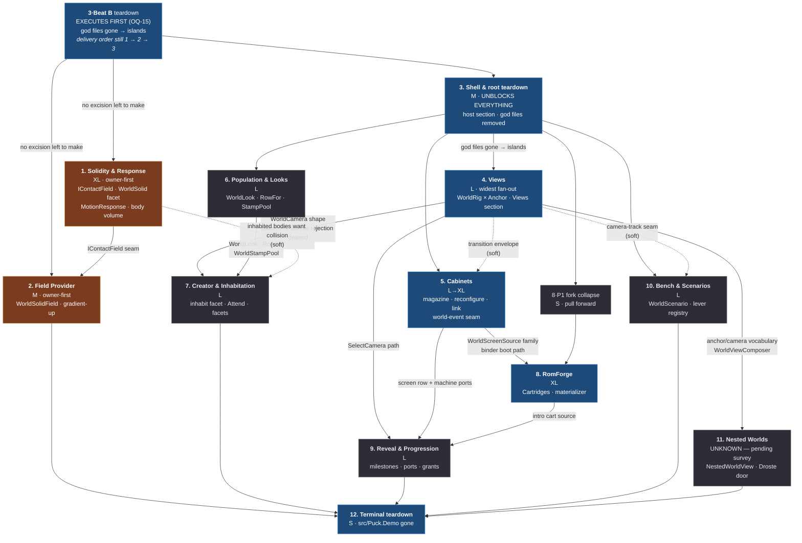

# Demo → World port plan

`src/Puck.Demo` is retired into `src/Puck.World` and the shared libraries across
twelve arcs. This document is the execution order, the shared contract every arc
obeys, and the per-arc specification. When it lands, `src/Puck.Demo` does not
exist.

This is not a port in the file-copy sense. Every arc names what the Demo original
got *wrong* or got *specific* about, and what the World version does instead. An
arc whose diff is a namespace change has failed.

**Where to start.** Arcs 1–7 have landed. **[Arc 8 Phase P1 (fork
collapse)](#arc-8--romforge) is the next action** — it depends only on the landed
teardown. Before touching an arc:

1. Read the [owner constraints](#owner-constraints) and the [target
   model](#the-target-model). They apply to every arc without restatement.
2. Read the [standing rulings](#standing-rulings). An arc that re-opens one is
   re-litigating a settled question. **Start with
   [R18](#r18--goldens-are-not-a-gate):** goldens, byte-identity, and the
   ouroboros round-trip are **not gates**, and R18 outranks any verification step
   in this document that still reads like one.
3. Build the [shared primitives](#shared-primitives) in the arcs that own them
   before feature work. Most are consumed by three or more arcs.
4. Read the [open questions](#open-questions). **None is a gate** — every arc may
   start on its own dependencies — but each names a forcing point, and three are
   owner decisions.
5. **Check the [carried tracks](#carried-tracks) before starting an arc.**
   [Track C](#track-c--world-native-defects) rows are defects in code your arc is
   about to extend or inherit — most urgently **largechange-03/04/17 at or before
   the Arc 3 + 8·P1 fork collapse**. The rule is always the same: fix before the
   arc grows a new consumer.
6. Before Arc 12, close the [unassigned remainder](#the-unassigned-remainder).

**This document has two halves, and they are independent of each other.**

| Half | What it is | Who runs it |
|---|---|---|
| **[Port arcs](#arc-sequence)** (front) | Twelve sequenced arcs that retire `src/Puck.Demo` into `src/Puck.World`, plus the [deletion ledger](#deletion-ledger) and the [open questions](#open-questions) that govern them. Ordered, interdependent, terminating in the Demo not existing. | One team, in order |
| **[Carried tracks](#carried-tracks)** (back) | **140 rows / 139 distinct commitments that are not the port**, plus a chartered 25-finding GPU-sync pass — engine-lifetime bugs, SDF renderer work, defects in already-landed World code, emulator accuracy, honest opens, retired-plan deferrals, README-embedded work. Unordered, mutually independent. | A different team, in parallel |

Where a carried row touches an arc, **the per-track collision notes are the
complete list of coupling between the two halves**. There is no global count;
read the per-track notes. Two tracks carry a gate of their own:
[Track B](#track-b--sdf-vm-render-and-perf) cannot be sized until `sdf-01` (the
Phase 0 re-baseline) is done — **all historical SDF perf numbers in this repo are
owner-ruled dirty** — and [Track D](#track-d--emulator-and-fleet)'s four
trigger-gated rows are parked with named conditions, not queued work.

**Traps that will bite.**

- **The build trap.** `dotnet build` fails while `Puck.World` is running (the exe
  is locked). Passing `--no-build` to get around it silently runs the **stale**
  binary, so a change appears to have no effect — or an already-fixed bug appears
  to persist. Close the process, build, then run.
- **Verification scripts lie silently.** A stdin script written against a world
  that no longer boots that way fails invisibly and reads as a product
  regression. Assert on `wire.errors`, and build a control from the accused
  commit's parent before blaming code.
- **A worktree can spawn from a stale base.** Verify the HEAD you actually have
  before concluding a landed change is missing.
- **Stale shader bytecode.** Cherry-picking leaves stale `.spv`/`.dxil`; test in
  a fresh worktree when GPU output looks wrong for no reason.

**Two things this document deliberately does not contain:** bare-metal work
(excluded by owner ruling — see the [baremetal
exclusion](#baremetal-exclusion--a-deliberate-ruling-not-an-oversight)) and
anything from the orientation docs (`capability-catalog.md`, `project-map.md`,
`agent-guide.md`, `docs/README.md`, `docs/sdf-wiki/`), which describe what Puck
**is** and what has already been ruled on. Those are never absorbed here and
never retired by this plan.

Line numbers are current as of branch
`claude/puck-realtime-world-editing-4fd13f`. Re-grep before relying on an exact
line in a live edit.

## State

**Branch `claude/puck-realtime-world-editing-4fd13f`. Nothing is merged to
`main`; `git log` is authoritative for history.**

**LANDED — the owner-set path, in execution order:** Arc 3 Beat B (root
teardown + the R17 survey), Arc 1 (Solidity & Response), Arc 3 Beat A (host
section), Arc 2 (Field Provider), Arc 4 (Views), Arc 6 (Population & Looks),
Arc 5 (Cabinets), Arc 7 (Creator & Inhabitation). Landed alongside them: ruling
**R-A** (true deterministic replay), ruling **R-C** (inhabitants are players),
and the greenfield refactor units **U1/U6/U7**. What each arc binds on a future
arc is in [Landed arcs — binding facts](#landed-arcs--binding-facts).

**REMAINING:** Arcs **8** (RomForge), **9** (Reveal & Progression), **10** (Bench
& Scenarios), **11** (Nested Worlds), **12** (Terminal teardown), plus the
[carried tracks](#carried-tracks) — largely unstarted, and a different team's.

**`src/Puck.Demo` is a library that does not run** (R0/OQ-11). It compiles so its
surviving files build, and **Arc 12's `git rm -r` is blocked work**: the survivors
are not islands. `OverworldFrameSource*` is a mid-graph hub consumed as a concrete
type by `Bench/BenchInstaller.cs` (Arc 10), `Forge/ForgeSubject.cs` +
`CreatorForgeCommand.cs` (Arc 8), and `Overworld/MetaVictoryWatch.cs` (Arc 9); it
in turn pins `OverworldWorld.cs`, `OverworldRoom.cs`, the `World/` subtree, and
`Town/`. `OverworldSnapshotProjection.cs` is pinned by `RouterIntentSource` (←
`BindingBarAdapter`); `Museum/MuseumRenderer.cs` is HELD for Arc 11;
`ConsoleFeed.cs`/`ProceduralFeed.cs` are HELD for Arc 5's deferred live feed. **The
fork dies when arcs 8–11 remove those consumers, not before.**

**The (c)-disposition rule, which every landed arc used and every future arc
inherits.** An arc that finds its Demo deletion target still consumed by a
surviving file does **not** excise it — it records a `(c)` disposition naming the
pinning consumer, lands its World-side capability whole, and leaves the carcass to
the arc that retires the consumer. Deleting out from under a survivor breaks the
Demo library build, which the constraints forbid. The inverse also holds: a file
whose only inbound references are `<see cref>` doc comments is **not** pinned — a
`roslyn-first-analysis` `FindReferencesAsync` pass over `Puck.slnx`, not grep, is
what tells the two apart.

### Owed to the owner as a decision

| # | Decision | Forced at |
|---|---|---|
| **OQ-3** | The overlay/UI tier's disposition and therefore its sizing — the plan's largest sizing unknown | Before Arc 12 can honestly run |
| **OQ-4** | The seven deferred games (≈16 970 lines). **A game with no answer defaults to *delete*, and that default must be stated to the owner before Arc 8 closes** rather than discovered at Arc 12 | Arc 8's exit |
| **OQ-6** | The two `Puck.Post` deletions (R14) — `VictoryGateStage` and the `RunDocumentStage` `HostDocument` retirement | The Arc 9 and Arc 12 reviews |

### Owed as work — the standing deferral ledger

Nothing here is lost work; each row names what would close it.

| Owed | Where it stands | Closes when |
|---|---|---|
| **P7 world-event channel seam** + `ScreenEngageDirector` + `ActionEffect.EmitWorldEvent` | Arc 5 shipped the route's `EngageChannel`/`CycleChannel` fields as validated data, so no schema surgery is left — only the intern table + `ushort` body latch, which threads an argument through all of kit compilation | **Arc 9** inherits the decision (P7 is its milestone-trigger seam) |
| **Console live feed** (OQ-13) | The `console` screen source, its validator, the at-most-one-live ceiling, and the grant path ship as data; a declared `console` source renders the procedural **no-signal** fallback. The 817-line producer is GDI-atlas + `Puck.Text` + `Puck.Demo.DevConsole`-coupled | The `ConsoleFeed.cs`/`ProceduralFeed.cs` port lands; both files stay in `src/Puck.Demo/Overworld/` until then |
| **Live cross-worker cable-link co-stepping** | All link data landed (records, validator, `Links` mutation, verbs, session-capture fold, `ReconcileLinks`, teardown-ordering guards). `GamingBrickEngine.TryLink` returns a **named dormant reason**; the binder reports links dormant — spec-legal | A `Puck.HumbleGamingBrick` seam that safely lends two cores (each on its own `QueuedMachineWorker` thread) to `SerialLinkSession`'s single-thread pair-stepper |
| **The live machine reconfigure is proven-built, not proven-live** | The whole path (S1/S3/S3b/S4/S5 + binder + `screen.options`) compiles and is wired end-to-end on the SM83 `MachineHost`; the peek-same-byte-across-swap assertion has never been *run* | World ships a bundled SM83 cartridge (the default is asset-free) |
| **`machine.rewind`/`snapshot`/`restore` verb port** (hole H9) | The time-travel/rewind deck still lives on the standing `GamingBrickChildNode` | With that file's deletion |
| **Derived-face SDF slab + live handle** | Derived faces resolve (screen 24, correct `View` source) and the reserved range re-points live; the slab is **not** emitted into the SDF program, so a face wired to a *derived* camera reads `no-signal`. A face on a *document* camera binds live today | The derived screen enters the render program **with its own probe reservation** — deliberately not shipped uncapped |
| **`WorldLookResolver` reroute** of the 5 humanoid-role call sites (`WorldAudioDirector` ×2, `WorldEditorTargeting` ×2, the binder site) | A humanoid-**leaf** anchor on a creation-look body resolves through the catalog rig — never black, never crash, but a lantern-fish has no left shin | A bounded degradation refinement; no blocker |
| **largechange-15's validator-side representable-radius bounds** | The mixer-side saturation (`SaturatingSquareQ16` through `Int128`) is the substantive overflow containment and landed; the radius-ceiling validator pass did not | A clean follow-up sitting |
| **A real resize/format-change GPU exercise** for the two HIGH GPU-sync fixes | Both are FIXED and confirmed by reading + clean build + boot smoke on each backend; neither has been forced down the rebuild path | Before either is called proven on GPU |
| **Arc 10's render-envelope measurement** (OQ-7) | Arcs 6 and 7 measured and reserve nothing; Arc 10's scenario workload is unmeasured — `MaxWorkloadInstances`' default may need to be **0** rather than 1024 if the floor is tight | Arc 10, and re-measure the construction probe at each of 6 → 7 → 10 |
| **Arc 2's SDF contact cost at scale** (OQ-8) | Mitigations landed; verified on a single-walker planetoid, **not at 128 bodies**. Do **not** pre-build the `BakedWorldQuery` escape tier | A 128-body measurement, before assuming the SDF path is the default at high body counts |
| **The `InternalsVisibleTo` check** (OQ-9) | Whether `Bake/BakeRasterizer.cs` or `SceneForge.Render` reach `internal` `Puck.SdfVm` surface. If so, a read-only seam becomes an API-widening one | A five-minute grep and a compile-only spike at Arc 8 P1 |
| **Full per-body record-start replay rehydration** | A boot-anchored capture MATCHes; a mid-session capture honestly reports MISMATCH because the fresh re-drive starts from the definition boot image | The identified next lever; the live-tail reference hash is the honesty backstop meanwhile |
| **Tick introspection is an explicit, recorded capability loss** | `tick.explain` / `tick.watch` / `hash.mark` / divergence bisection are **not ported**. Building the Replay Reel (`closeout-15`) does **not** close this — the Reel replaces the *demonstration* capability, not the *introspection* one | Follows later or is dropped separately, as its own decision |
| **`--emit-schema` retargeting** | The generator moved to `tools/` emitting what it emits today. `puck.world.def.v1` still has **no schema generator at all** | Separate, unscheduled work — a future author proposes it as its own change and must not smuggle it into another |
| **`PUCK_RAY_QUERY` env fallback deletion** | World passes an explicit `SdfWorldRenderSpec.RayQuery`, so the fallback is dead for World; the physical deletion waits on its `DiegeticUiInstaller` caller | Arc 12's verification sweep |
| **Feel constants are unmeasured** | The default world's three-row response table is a scaling of the Demo's numbers through `DefaultActionScale` — defensible first values, not tuned ones | A feel pass |
| **Contact-solver known limits** | Single-pass resolution can wedge a body between two adjacent slabs within one tick (stated in `WorldColliderSet`'s doc comment; the fix — two passes, or push-order by penetration depth — is cheap and additive). Cost is O(bodies × solid rows) with no broadphase; a Y-sorted array + swept-bounds AABB reject is the cheap first cull, a real broadphase goes behind `IContactField` with no signature change | Profiling demands it |
| **Two Demo files still owe a check before deletion** | `SdfParityProducers.cs` against `Puck.Post`'s parity path (if Post consumes its shape it is not Demo-only); `BindingProfileDocuments.cs` + `BindingProfileDocumentStore.cs` against World's layered player-document bindings (expected: superseded, delete) | Whichever arc deletes them |
| **Arc 11's size is UNKNOWN** | Nobody has surveyed what `NestedWorldView` requires. It hangs off Arc 4 and nothing depends on it, so it is not on the critical path — but it is the one arc that could join it once measured | The survey |
| **The carried tracks** | 140 rows + a chartered 25-finding GPU-sync pass, all sized and anchored | See [Carried tracks](#carried-tracks) |

## Owner constraints

Quoted verbatim; these outrank every recommendation in this document.

1. **"NOT A 1:1 CLONE! Code that is ported must be refactored to fit our new
   model and stricter abstract standards."** Every arc must name what the Demo
   original got wrong or got specific about, and what the World version does
   instead. A port that is a file copy with a namespace change is a FAILED
   design.
2. **"Do not alter the default world, except for adding collision and updating
   the motion."** `Assets/worlds/default.world.json` is FROZEN apart from the
   locomotion/collision arc. No arc may bake its feature into the default world.
3. **"Do ensure that authors could use any of these capabilities if they so
   choose."** Every ported capability MUST be author-reachable: a world-document
   field (`puck.world.def.v1`), a console verb, and where relevant a grant.
   Opt-in, discoverable, documented. A capability that only exists as C# an
   author cannot reach has not been ported.
4. Each arc DELETES its `Puck.Demo` source in the same change. The plan
   terminates in `src/Puck.Demo` being gone. Nothing outside this repo consumes
   Puck (supergreen): no compat aliases, no deprecation shims, no migration
   tolerance for old data shapes.
5. `Puck.World` scope discipline: arcs edit `src/Puck.World` and its libraries.
   Engine seams (`Puck.SdfVm`, `Puck.Scene`, `Puck.Maths`, `Puck.Platform`,
   `Puck.Commands`) may be touched but each such touch must be called out
   explicitly as a flagged seam in the arc.
6. Verification is by RUNNING `Puck.World`, not by adding `Puck.Post` gates.
   Never propose a new Post stage or a `--validate-*` flag for a World feature.
   Console verbs over stdin are the scripted-test surface.
7. No `PUCK_*` environment variables for configuration, ever. Durable values are
   world-document fields; live operations are console verbs.
8. Determinism posture: `Puck.World` is deliberately NOT determinism-obsessed by
   owner order. Simulation bodies use fixed-point (`Puck.Maths` `FixedQ4816`)
   because the existing `WorldBody` does; follow the surrounding code's posture
   rather than importing `Puck.Post`'s stricter contract. Do not propose
   determinism gates.
9. Comments are minimum-viable facts; XML docs follow Microsoft .NET style.

## The target model

A ported capability lands in `Puck.World` as the same seven-step ritual the
codebase already performs twenty-one times. Deviations must be argued for in the
arc, not assumed.

| Step | Where | Contract |
|---|---|---|
| 1. Document row | `WorldDefinition.cs:1063` (the `WorldDefinition(` record header; the file is 1 299 lines) | A named, typed property on the flat aggregate. Row families use closed `$type` polymorphism with variants nested inside the abstract base. |
| 2. Validation | `WorldDefinitionValidator.cs:51` (`public static void Validate`; the file is 1 268 lines) | One private `ValidateX`, called at the point in `Validate` where its cross-references resolve, threading resolved id-sets forward. Every closed switch carries a loud unknown-kind branch. |
| 3. Mutation | `Protocol/WorldMutation.cs:17` | Whole-row `Upsert<Row>`/`Remove<Row>` keyed on the stable field, or a whole-section `Set<Section>`. Never a field poke, never a delta. |
| 4. Apply pipeline | `Server/WorldServer.cs:406` | grant → compose → validate → capacity fit → install → journal. Failure at any step leaves `m_definition` byte-identical. |
| 5. Grant | `Protocol/WorldGrant.cs:29` (the `WorldSection` enum; the file is 154 lines) | A new `WorldSection` member and, where authority crosses principals, a `GrantSubject`. **Never a fifth `WorldCapability`.** |
| 6. Console verb | an `ICommandModule` | `Simulation` routing for anything that changes the document or drives a body; `Immediate` for reads and client-local levers. Mutation verbs return `CommandResult.None`; the server prints the loud accept/reject. |
| 7. Session capture | `WorldSessionCapture.cs` | Any live lever with a document home folds back at `world.save`, and reports as session drift in `world.status`. |

### Author-surface token spelling

Pinned once here so eight arcs do not each invent a convention.

- **Grant section tokens are lower-case**: `world.grant addon:physics mutate
  section:collision exclusive`. `WorldGrantCommandModule.cs:195-196` parses with
  `StartsWith(…, OrdinalIgnoreCase)` + `Enum.TryParse(ignoreCase: true)`, so
  `section:Looks` *is* accepted — this is a **house-style pin, not a correctness
  rule**. Every author-facing example, verb description, and doc comment in this
  plan uses the lower-case form.
- **Verb arguments are strictly positional.** No verb in `src/Puck.World` takes a
  `--flag`, and no arc introduces one. An optional argument is a bare token in a
  fixed slot; `-` is the plan-wide **clear-to-absent** token (Arc 1's
  `world.scene.solid <id> off` and Arc 7's `world.placement.inhabit <id> -` are the
  two shapes: a named off-word where the field is a facet, `-` where the slot is a
  value).
- **Enum-valued fields serialize camelCase** (`WorldDefinitionSerialization`'s
  converters), so a document token is `"firstPerson"`, `"humbleColor"`,
  `"ordered4x4"` — and a verb that takes the same value takes the same spelling.

### Layering

- **`Server/`** owns `WorldDefinition`, the 128-body table, intent producers,
  the grant table. Never reads render/GPU/client state.
- **`Client/`** owns seats, the frame source, the screen binder, machines,
  render settings. Poses flow in via snapshots only.
- **`Protocol/`** is closed record/enum vocabulary plus `IServerLink`/`IClientSink`.
  No behavior.

A new write path is added interface-first: `IServerLink` → `LoopbackTransport`
→ `WorldServer`, in that order.

### Numerics

Decide SIM-AFFECTING vs PRESENTATION-ONLY *before* writing the record
(`WorldDefinitionValidator.cs:9-25`).

- **SIM-AFFECTING** — read by `WorldBody.Advance` or an intent producer.
  Authored as `float`, quantized exactly once at a named `Fixed*.Compile`
  boundary, never re-read as `float`. Validated for finiteness and physical sign
  only.
- **PRESENTATION-ONLY** — read by `WorldFrameSource`/`WorldScreenBinder`/the
  audio director. Stays `float`/`Vector3` forever. Validated for structural GPU
  safety (finite frames, bounded extents, non-degenerate bases).

Across the twelve arcs, only Arcs 1, 2, 6, and 7 introduce SIM-AFFECTING fields.
Arcs 3, 4, 5, 8, 9, 10, 11 are PRESENTATION-ONLY in their entirety and introduce no
`Fixed*` boundary — state that in the arc rather than adding one out of reflex.

### Live vs next boot

Default is LIVE on delivery. A field that is genuinely boot-consumed (a
swapchain format, a frozen render-envelope probe) says so **per field** in its
doc comment, following `WorldAuthoringDefaults`' mixed-consumption ritual
(`WorldDefinition.cs:948-965`). Silently mixing boot-consumed and live-consumed
fields in one row without narrating the split is the anti-pattern that ritual
exists to prevent.

### Verification

By running `Puck.World` and driving stdin. The `Process` + `OutputCollector` +
`Ctx` driver shape at `scripts/proof.cs:4020` is the scripted form; a `proof.cs`
subcommand is a developer script, **not** a Post gate — it adds no stage and no
flag. The FIFO stdin barrier (`Puck.Commands/CommandRegistry.cs:373`) makes
every mutate-then-read pair deterministic with no sleep, which is why every
mutation verb is `Simulation` and every read verb is `Immediate`.

**The `player.*` grammar every arc's script is written against.** Read from
`PlayerCommandModule.cs:109-160`; get this wrong and the arc's acceptance criteria
do not execute.

| Verb | Grammar |
|---|---|
| `player.join` | `[2..4]` — a **seat count**, not an index. Seat 1 always exists |
| `player.warp` | `<x> <z> [player]` — **two** coordinates; `WarpHandler` submits `Position: new Vector3(x, 0f, z)` (`:383`), so a warp **cannot name an altitude** |
| `player.pose` | `<x> <y> <z> <yawDeg> <pitchDeg> <rollDeg> [player]` — the full 6DOF teleport, and **the only way to place a body off the ground plane** |
| `player.run` | `<forward> <strafe> <turn> <seconds> [player]` |
| `player.where` | `[player]` |
| `player.stop` | `[player]` |

> **The player index is TRAILING, 1-BASED, and ranges 1..128** — 1..4 are the local
> seats, 5..128 the simulated population entries. It defaults to 1 when omitted.
> **There is no player 0.** Every script in this document obeys that; a script
> written as `player.where 0` or `player.warp 0 -4 0 0.5` names a nonexistent
> player and mis-parses its own arguments.

**Placing a body at an altitude** (Arc 1's stand-on-a-slab check, Arc 2's
planetoid walk) uses `player.pose`, never `player.warp`. `player.pose`'s doc says
*"a grounded entity re-pins Y … on its next step"* — and **Arc 1 changes what that
sentence means**: re-pinning stops being a snap to `MotionTuning.GroundY` and
becomes a resolve against the contact field, so a pose above a solid slab settles
onto the slab instead of the floor. Arc 1 must state that reclassification in
`player.pose`'s description alongside the `ResetVertical` momentum reset (Arc 1
risk 5), because it is the same code path.

## Standing rulings

These resolve the eleven places where two arc designs shaped the same concept
differently, plus two process rulings. An arc that wants to re-open one raises
it with the owner rather than diverging quietly.

### R0 — Demo runnability is not preserved across the port

**Owner ruling: the Demo stops RUNNING after Arc 3 and keeps COMPILING until
Arc 12.** Because Beat B executes first, it stopped running before Arc 1
delivered. No arc may reopen this by proposing to keep the Demo runnable "just for
this one check."

`src/Puck.Demo` must keep **compiling** (so `dotnet build` stays green) until its
final removal. It is **not** required to keep **running** after Arc 3.
Constraint 6 makes `Puck.World` the verification target for every arc; the Demo
is never verified by running after the shell arc.

This is the consequence of the plan's load-bearing structural finding:

> **Delete top-down, not bottom-up.** Nine of the ten arc designs concluded "my
> Demo deletion is blocked on the shell arc"; the shell design concluded "Beat B
> blocks on every other arc." That is a cycle, and it is an artifact of reading
> the dependency graph backwards. Demo's flow is composition root → god files →
> feature files, and deleting a *consumer* is always safe. Remove `Program.cs`,
> `DemoHost.cs`, `DemoRunRegistrar.cs`, `GraphBuilder.cs`, `HostSettings.cs`,
> `DemoRunDocuments.cs` and the three god files (`OverworldWorld`,
> `OverworldRenderNode`, `OverworldFrameSource*`) **early**. Every remaining Demo
> file becomes an unreferenced island its owning arc can `git rm` with zero
> cross-arc excision.

This collapses roughly two thirds of the ordering constraints the ten designs
carry.

### R1 — Read before delete

Once a god file is gone its algorithms exist only in git history. The ten arc
designs, with their file:line anchors, are the durable record; keep them in
`docs/reviews/` until the arc that consumes each has landed. An arc that finds
its design under-captured the original **stops and reads history** rather than
guessing.

### R2 — Contact resolution is one seam with two members, not a third motion model

`design-collision` proposed `MotionModel.Field` (a third integrator);
`design-locomotion` proposed an `IContactField` provider seam with `MotionModel`
staying two-wide. Both authors argued against the other's shape; neither proposed
the synthesis this plan adopts:

```csharp
internal interface IContactField {
    bool Resolve(ref FixedVector3 position, ref FixedVector3 velocity, FixedQ4816 radius, FixedQ4816 height);
    bool TryUp(in FixedVector3 position, out FixedVector3 up);
}
```

`TryUp` is the load-bearing addition. Locomotion's one-member seam is
insufficient — a planetoid walker needs an up axis while *falling*, not only
while in contact — and that insufficiency is exactly what pushed the collision
design toward a third `MotionModel`. With the axis behind the seam:
`Grounded` reads its up from `TryUp`; the analytic provider returns constant
`+Y`; the SDF provider returns `−gradient`, which for a flat ground plane *is*
`+Y`. One integrator covers both worlds with no branch.

Consequences: **`MotionModel` stays two members.** Arc 1 owns the seam and the
analytic provider; Arc 2 is a second provider behind it and re-plumbs nothing.
Arc 1 becomes XL (two L designs merged, minus duplicated halves); Arc 2 drops to
M — the third motion model, the `SetModel`/`Warp`/`Reconcile` branches, and the
`FixedQuaternion` composition all evaporate.

> **ACCEPTED by owner ruling.** The synthesis stands as written: the third `MotionModel` is dead, and planetoid walking is a data
> choice — a provider token on `WorldCollision`, not an integrator kind. Arc 1
> stays **XL**, Arc 2 stays **M**. The fallback this ruling used to carry (two
> arcs with a fork in the integrator) is off the table and is not an option any
> arc may reach for.

### R3 — Solidity is a per-row facet, not a section of booleans

`design-collision`'s `collision.sceneRows`/`.screens`/`.placements` booleans are
**deleted**. `design-locomotion`'s per-row `WorldSolid?` facet — mirroring the
landed `WorldEmission?` precedent at `WorldDefinition.cs:498` — wins: per-row
granularity, one authoring axis, no second vocabulary. Extend the facet
uniformly to `WorldScreen` and `WorldPlacement`. `WorldCollision` keeps
`Enabled`, `ContactSkin`, `MaxIterations`, gains a provider discriminator
(`analytic` | `field`), and gains the two solver knobs an author must be able to
reach (`MaxSlopeDegrees`, `GradientProbe` — see R2's seam and Arc 2 risk 3).

**A facet with no consumer is a schema lie — so the two providers' coverage is
pinned here, not left to each arc.** The facet is legal on three row families; the
*analytic* provider can only derive an honest convex proxy for two of them:

| Row family | `analytic` (Arc 1) | `field` (Arc 2) |
|---|---|---|
| `WorldSceneRow.Boulder` | `Sphere(Radius + Margin)` | SDF sphere, smooth-unioned |
| `WorldSceneRow.Slab` | `Box(HalfExtents + Margin)` | SDF box, smooth-unioned |
| `WorldScreen` | `Box` derived from the slab's `Origin`/`Right`/`Up`/`HalfWidth`/`HalfHeight`/`HalfDepth`, each extent + `Margin` | the picker's face-normal-offset box |
| `WorldPlacement` | **rejected at validation, by name** | reach-sized proxy sphere |

`solid` on a `WorldPlacement` under `provider: "analytic"` is a **loud validator
error** — *"placements.\[i\].solid needs the field contact provider; set
collision.provider to 'field' or drop the facet"* — because a creation stamp has
no honest convex proxy the document alone can derive. **Arc 1 lands that rejection
in the same change as the facet; Arc 2 deletes the rejection when it lands the
provider that can answer.** No arc ships an authorable field that silently does
nothing, and no arc ships one whose only diagnosis is "it didn't work."

### R4 — Body volume lives on `WorldKit` as `WorldCollider?`

Not on `MotionTuning`. Volume is not feel; it wants its own validation
(`height >= 2 * radius`) and its own verb (`world.kit.collider`), not an overload
of `world.kit.tune`. One home only. `MotionResponse` is locomotion's, unchanged —
collision cedes accel/decel to it.

### R5 — One `WorldPlacementInhabit`, owned by Arc 7

`design-population` and `design-creator` both declare a record of that name, both
delete `WorldPlacement.Role`, both add placement mutations to `AffectsPopulation`,
both reserve slots downward from 127. Merged:

```csharp
internal sealed record WorldPlacementInhabit(string? Kit, string? Look, IntentSource Source, int Count, float Radius);
```

`Count` defaults to 1. `Kit == null` resolves the creation's
`Behavior.Locomotion` token as a kit name (creator's rule). `Look == null` wears
an implicit creation look on the placement's own `CreationId` (population's
rule). **Arc 7 owns** the record, the reconciler, slot reservation, and
`IntentSource.Attend`; **Arc 6 owns** `WorldLook` and contributes the `Look`
field's vocabulary. Sequence 6 → 7 so `Inhabit` lands whole, once.
`WorldPlacement.Role` is deleted exactly once, by Arc 7.

### R6 — RETIRED, superseded by R-C: inhabitants are players

**Owner ruling.** There is no census-fit validator rule. `networkPlayers` is a
remote **admission cap**, not a boot reservation; the boot census is **zero**.
An inhabitant JOINs a free peer slot over the loopback link exactly as a peer
does, so total occupancy is bounded by the 128-slot entity table itself and a
genuinely full table is rejected **loudly at JOIN time** — a runtime fact no
static validator can know. `MaxSimulated` survives as the *live* census ceiling
(the inhabitant floor, moved only by physical occupancy), never as a validation
rule. See the [R-C binding facts](#arc-7--creator--inhabitation-landed).

### R7 — `WorldStampPool` is Arc 6's, generalized once

`design-population`'s `WorldStampPool` rename (with a root discriminator) and
`design-creator`'s `int? BodyIndex` on `Registration` are the same change under
two names. Arc 6 owns it; Arc 7 consumes the generalized pool. Names:
`WorldStampPool`, `MaxStampRegistrations`.

### R8 — The collapsed `WorldCamera` wins; Views strictly precedes Creator

`design-views` collapses `WorldCamera` from a `Fixed`/`Anchored` union into one
record carrying `Anchor?` + `WorldRig`; `design-creator` emits the retired
`WorldCamera.Anchored` shape. Supergreen forbids read-side tolerance for the old
`$type`, so the collapsed record wins and creation-derived cameras emit it.
Creator *also* depends on Views deleting the placement-anchored-camera rejection
at `WorldDefinitionValidator.cs:136-139`, without which creation-derived cameras
cannot exist at all.

**There is no read-side tolerance for the retired `anchored`/`fixed` `$type`s
anywhere.** The three shipped worlds' camera rows were re-encoded to the collapsed
shape instead.

### R9 — Arc 4 owns `ScreenLayoutDirector` and `ScreenSlotLedger`

Views deletes both (replacing the director with `WorldViewLayout` +
`WorldViewComposer`); Cabinets lists both as explicit non-ports; Reveal excises
`ScreenLayoutDirectorMode.Immersed`/`.Revealed`/`BeginReveal`. **Arc 4 owns the
files and their deletion.** Cabinets strikes them from its table; Reveal's mode
members die with the file. Arc 4 also *supplies* the transition mechanism that
Cabinets' pane-focus choreography and Reveal's fourth-wall break both want, so
nobody reimplements it.

### R10 — Machine ports and save slots belong on `WorldScreen`, not on `WorldScreenSource.Machine`

`design-reveal` hangs `Ports` and `SaveSlot` off the `Machine` source variant.
They are properties of *the slot's hosted machine*, not of the source recipe:
putting them on `Machine` means a `Cartridge`-sourced screen (Arc 8) cannot have
ports, which is exactly the intro-ROM case Reveal needs. Move them onto
`WorldScreen`. Sequence 5 → 8 → 9 for the three arcs that edit the screen row.

### R11 — `AvatarDefinition.cs` is Arc 8's, as a move

Three arcs claim it. Arc 8 (RomForge) moves it to `Puck.Forge/Avatar/`; Arc 7
strikes it from its deletion table; Arc 6 already declines it.

### R12 — RETIRED by R18 and U1

A world-document section is a **plain non-nullable member with a real default**.
There is no nullable-plus-`JsonIgnore(WhenWritingNull)`-plus-`??`-at-every-read
idiom; absence resolves in exactly one place (a validator error naming the missing
section — see [U7](#u7--world-loader-incomplete-documents-reject-loudly)).

Constraint 2 is unaffected: *"do not bake YOUR FEATURE into the default world"*
still holds. It never meant "the file may not gain a key."

### R13 — `AffectsPopulation` / `CompileFixedTables` are sequential, never parallel

Arc 1 adds scene mutations, Arc 6 placement mutations, Arc 7 placement + creation
mutations to the same switches. The conflict is semantic, not textual. Order
1 → 6 → 7; each arc re-runs the crowd census check — `world.population 124`
**first** (the peer slice boots EMPTY, so per-kit counts are all 0 until a crowd
is summoned), **then** the per-kit counts, unchanged before/after — as its own
regression.

### R14 — Post-stage deletions are surfaced to the owner, not buried

Arc 9 deletes `Puck.Post/Stages/VictoryGateStage.cs`; Arc 12 edits
`Puck.Post/Stages/RunDocumentStage.cs:117` to retire `Puck.Scene.HostDocument`.
Both are legitimate — they remove stages and literals whose *subject* has died,
which is not the same as weakening a gate, and constraint 6 forbids only
*adding* Post stages for World features. But deleting a Post stage is a bigger
act than deleting Demo code: surface both as an explicit owner decision at the
Arc 9 and Arc 12 reviews, not silently inside a large diff.

### R15 — The verbatim-move exemption is granted case by case, with written justification

Constraint 1 says a port that is a file copy with a namespace change is a FAILED
design. The exemption from it:

> A port **may** move code verbatim where **the arc author argues in writing that
> the code was already correct.** The refactor thesis for such a move is literally
> *"this one was right"* — that is an acceptable thesis, and it is the only
> acceptable one for a verbatim move.
>
> **The exemption is CASE BY CASE and must be EXPLICIT AND REVIEWABLE IN THE ARC —
> never silent.** A verbatim move with no written justification is a constraint-1
> failure exactly as before. There is no blanket subtree grant and no precedent
> inheritance: a later arc citing "R15 covers this" without its own written case
> has not claimed the exemption.
>
> The shape of a sufficient justification: what the code's subject is (hardware
> encoding or authored content, versus engine mechanism), why the new model has
> nothing for it to fit, and the evidence it is already correct (zero executable
> drift, no float, no env vars, no demo state, dependency-free, or the equivalent
> for its subject).

**Arc 8's ≈6 300-line move estimate stands and P3/P4 need no re-scoping.** The
components expected to claim the exemption, **each owing its own written case in
the arc**: `Forge/Bake/` (17 files), `Forge/Brickfall/` (6), `Forge/AvatarForge.cs`,
and `Forge/AvatarDefinition.cs` (R11). The phase-P1 dead fork (`Sm83Emitter`,
`HgbImage`, `Framework/`, `Tune/`) is a **deletion**, not a move, and claims
nothing.

Explicitly **not** covered, and still owed an ordinary refactor thesis:
`HgbCartridge.cs` (split, not moved), `RomForge`,
`ForgeSubject`/`ForgeRegistry`/`ForgeContext`, `ForgeCliSeams`, `ForgeHost`.

**OQ-4's ≈16 970 lines inherit nothing.** If the owner keeps games, each title's
move is its own case with its own written justification.

### R16 — `FeatureSwitchRegistry` dies on the document side and survives on the runtime side

Arc 3 deletes `host.features` + `FeatureSwitchRegistry` as *"a confession that the
typed section was under-specified"*; Arc 10 registers a `FeatureSwitchDescriptor`
roster in `Puck.World` and hangs `bench.sweep` and `world.levers` on it. Both are
right about different halves, and neither cites the other.

> **The document-side `features` map — an untyped `string→string` escape hatch for
> setting composition values — is dead and is not ported (Arc 3).** The
> **registry** survives in World as a *runtime lever roster derived from the verb
> surface*: each descriptor's `Name` **is** a console verb name, and its
> `Get`/`Set` close over the same object the verb handler writes (Arc 10).

Arc 3's deletion table strikes only the document surface and the
`HostFeatureApplier` hosted service; it does **not** remove
`src/Puck.Commands/FeatureSwitches/`, and it does not remove
`Puck.World.csproj`'s reference to `Puck.Commands`. Arc 10's seam S8 cites this
ruling. The distinction that makes both true: Arc 3 kills *document-driven switch
overrides*; Arc 10 uses the registry as a *runtime introspection and sweep
surface*. `Puck.Commands.FeatureSwitchCommandModule` stays unregistered in World
either way — it would be a redundant third spelling.

### R17 — The remainder survey is Arc 3 Beat B's deliverable, not a precondition nobody owns

Arc 12's stated precondition is that every subtree and root file in the
[unclaimed remainder](#the-unassigned-remainder) has an owning arc. As the plan was
first written, **no arc was chartered to produce that answer**, so Arc 12 could
never legally start — a blocked precondition, not a terminal arc.

> **Arc 3 Beat B owns the survey and ships it as a deliverable in the same
> change.** Beat B is what makes those files unreferenced islands, so it is the
> only point in the sequence where the question is cheap to answer and answering
> it is unavoidable anyway.

The survey is a `roslyn-first-analysis` find-all-references pass, not a grep, and
produces exactly one of three dispositions per path: **(a)** superseded by a
landed World surface → Arc 3 deletes it in Beat B; **(b)** a capability World does
not have → it becomes a named row in the remainder table with an owning arc or an
open question; **(c)** consumed by something outside `Puck.Demo` → it is not Demo
code and does not move. Beat B's deletion table then lists every path it took, so
Arc 12's precondition is checkable by reading one table rather than by re-deriving
the measurement.

### R18 — Goldens are not a gate

**This ruling OUTRANKS every conflicting verification step elsewhere in this
document.** Where an arc, a risk, a precondition, or an acceptance list still
reads as though a byte-identity check must pass before work lands, R18 is the
answer and that step is informational.

> **The owner:** *"As far as goldens are concerned: we don't actually
> have any. That's a feature you keep rebuilding, which I love by the way, but
> it's just not something we're ready to depend on yet. Goldens keep getting in
> the way of feature development at this stage. Keep the idea around, but stop
> chaining yourself to goldens for the time being."*

**The operative rules.**

1. **Byte-identity is not an acceptance criterion.** The ouroboros load→save
   round-trip (`scripts/proof.cs worlddoc`), `git diff --exit-code` on the
   shipped worlds, and any "re-golden the baseline" step are **no longer gates,
   preconditions, or acceptance criteria** for `Puck.World` feature work. They
   are observations a developer may make, and nothing blocks on them.
2. **Verification is by RUNNING `Puck.World`** and exercising behavior over
   stdin verbs (constraint 6). That is the whole contract.
3. **A shipped world's JSON moving as a side effect of a landing is FINE.** Note
   it in the arc's execution record and move on. No exception ceremony, no owner
   sign-off ritual for the diff itself.
4. **The frozen-default-world constraint (constraint 2) still means "do not bake
   YOUR FEATURE into the default world."** It never meant "the bytes may not
   move." A feature that authors itself into `default.world.json` is still a
   constraint-2 violation; a mechanical re-encoding or a new non-null field
   landing in the file is not.
5. **KEEP THE IDEA.** Golden replays and baselines become worth building **when
   the data settles** — record that as a future lever, not a current gate. The
   deterministic replay capability built under ruling R-A (`replay.verify` /
   `WorldReplaySnapshot`) stays exactly as built: it is a **capability**, not a
   golden gate. Only "the hash must match a stored baseline" stops being a
   landing requirement.
6. **`Puck.Post` is a separate thing and is untouched.** The engine-tier
   batteries — the cross-backend render contract, the SDF VM ISA, the
   run-document schema, the deterministic numerics, and the GamingBrick
   batteries — are not weakened, relaxed, or reinterpreted by this ruling. R18
   governs World feature work only.

**What this retires, concretely.** The two "named exceptions" ceremony around
the frozen worlds — Arc 4's OQ-12 camera re-encoding and Arc 7's `autoInsert`
re-golden — is **moot going forward**. Both were taken and both are recorded
below as history; neither would require sign-off today, and no future arc owes
one for moving world bytes.

## World document invariants

Three units of the greenfield refactor reshaped the world document. They are
stated here because a new section, a new loader path, or a new motion field must
obey them.

### U1 — World document: sections are present, not absent-to-protect-bytes

**Retires R12.** `Collision`, `Host`, `Views`, `Looks`, `LookAssignment`, and
`Links` are plain non-nullable `WorldDefinition` members with real defaults
(`WorldCollision.None`, `WorldHostDefaults.Default`, `WorldViewDefaults.Default`,
`[]`, `WorldRowAssignment.Hash`, `[]`), matching the sibling sections that
already worked that way. `MotionTuning.Response` and
`WorldPopulationDefaults.SpawnPolicy` lost the same nullability — their own doc
comments admitted null *was* the default. All eight
`JsonIgnore(WhenWritingNull)` attributes and 26 duplicated `?? Default` / `?? []`
/ `?? None` reads are gone; absence resolves once — a top-level section that is
absent is a validator error naming it (U7, below), and a nested collection
coalesces in its declaring type's `init` accessor (source generation builds
record structs through the parameterless constructor, so a property initializer
would not have run).

`WorldSessionCapture.CaptureHost` folds honestly instead of computing the folded
value and discarding it to keep a `host` key absent; `CaptureLinks` and
`LinksDrifted` lost their null guards.

**Shipped-world JSON changed** (R18 rule 3): all three worlds gained
`response: []` on every kit tuning and on `motion`, plus `population.spawnPolicy`;
`expo` and `kart-remap` additionally gained `collision`, and all three gained
`host`, `views`, `looks`, `lookAssignment`, and `links`. The files were
regenerated by booting each one and running `world.save` — the real canonical
writer, not a hand edit.

### U7 — World loader: incomplete documents reject loudly

`WorldDefinitionLoader.Normalize` claimed *"Required sections stay null → the
validator reports them → loud fallback"* while silently defaulting every section
it touched, before the validator could ever see one missing. The class header
promises the opposite: *"ANY failure … falls back LOUDLY to the baked default."*

`Normalize` is deleted. `WorldDefinitionValidator.RequireSections` runs first and
names every missing section:

```
[world] definition: baked default (…\incomplete.world.json: Incomplete WorldDefinition:
 - storage is required.  - looks is required.  - links is required.)
```

**Which sections are structural.** All 24 of them — every section the canonical
writer emits. There is no "optional-by-design" bucket left at the document's top
level: each section is either policy that changes how the world behaves
(`motion`, `collision`, `host`, `views`, `audio`, `storage`, `authoring`,
`render`, `population`, `assignment`, `lookAssignment`, `wander`,
`defaultSeatKit`) or a row set whose *presence* the writer always states, empty
or not (`scene`, `spawnPoints`, `screens`, `cameras`, `kits`, `addons`,
`bindingOverlays`, `creations`, `placements`, `speakers`, `tunes`, `patches`,
`looks`, `links`). A file missing one is truncated, not terse. `Extensions`
(`[JsonExtensionData]`) remains genuinely optional — it is the unknown-member
round-trip seam, not a section.

Emptiness is still legal everywhere it was: `"looks": []` and `"links": []` load
exactly as before. Only *absence* changed meaning.

**Nested collections** keep their invariant on the declaring type rather than in
a loader pass — `WorldRowAssignment.Table` joined `MotionTuning.Response` and
`WorldPopulationDefaults.SpawnPolicy` in coalescing inside its `init` accessor,
which is the one place every construction path crosses.

### U6 — Motion: the tuning a body actually reads

Of the eleven fields on the top-level `motion` section, runtime read exactly
three: `groundY` (the ground plane, `WorldColliderSet`/`WorldSolidField`),
`moveSpeed` and `turnSpeed` (the profileless stand-in fallback,
`WorldPopulation`). `jumpSpeed`, `riseGravity`, `fallGravity`, `maxFallSpeed`,
`jumpCutMultiplier`, `coyoteTime`, `jumpBufferTime` and `response` were
validated, round-tripped, and carried in every shipped world for zero effect —
every body integrates under its **kit's** `MotionTuning`. This plan's own Arc 1
record admitted it: `motion` *"keeps the table too (harmless fallback)"*. A
half-migration, kept for schema shape after the substance moved to per-kit
tuning.

`WorldDefinition.Motion` is now `WorldMotionDefaults(MoveSpeed, TurnSpeed,
GroundY)` with its own `FixedMotionDefaults` compile. `MotionTuning` survives
unchanged where it is real — `WorldKit.Tuning` — and `world.kit.tune` is the
only surface that moves jump feel.

**`definition.Motion` did not die.** Its three live fields have no other home:
`groundY` is a world fact, not a kit's, and the profileless speeds are the
fallback for a body with no seated profile. The vestigial eight died.

`WorldMotionDefaults` carries `[JsonUnmappedMemberHandling(Disallow)]`, so
`world.motion.set {"…","jumpSpeed":7}` now answers *"The JSON property
'jumpSpeed' could not be mapped to any .NET member contained in type
'Puck.World.WorldMotionDefaults'"* instead of silently accepting a value nothing
reads. The three shipped worlds' `motion` sections shrank to three keys.

## Arc sequence

Twelve arcs. Owner ruling pins #1–#2; every other position is justified by
dependency.

> **Delivery order is not execution order (R0/OQ-15).** The owner's "collision and
> locomotion first" ruling pins **delivery**: Arcs 1 and 2 are what ships first,
> and this table is that order. Execution ran Arc 3 Beat B's teardown ahead of
> them. A reader who sees Beat B first has not found an overridden ruling.

**Status column:** ✅ DONE (see [State](#state) for
commits) · ⏳ remaining.

| # | ✓ | Arc | Delivers | Size | Position justified by |
|---|---|---|---|---|---|
| 1 | ✅ | [Solidity & Response](#arc-1--solidity--response-landed) | scene-row `solid` facet, body volume, `MotionResponse` table, `IContactField` seam, analytic collider set | **XL** | Owner ruling. Holds the owner's *named* `default.world.json` exception (collision + motion). Lands 4 of the 10 shared primitives. |
| 2 | ✅ | [Field Provider](#arc-2--field-provider-landed) | SDF-derived contact field, planetoid / arbitrary-up walking | **M** | Owner ruling. Second because it is a *second implementation* of Arc 1's seam. |
| 3 | ✅ | [Shell & root teardown](#arc-3--shell--root-teardown-landed-both-beats) | `host` world-document section + `world.host.*`; deletes the Demo composition root and the three god files; **R17 remainder survey** | **M** | R0. Beat A depends on nothing; Beat B is the unblocking act for every remaining arc and the only arc that can close the remainder. **Beat B EXECUTES FIRST (OQ-15)**, ahead of Arcs 1–2, while Arcs 1–2 remain the shipped-first deliverable. |
| 4 | ✅ | [Views](#arc-4--views-landed) | `WorldRig` × `WorldAnchor`, `WorldAnchor.Group`, `Views` section, `WorldViewComposer` | **L** | Highest downstream fan-out of the remaining arcs (Creator, Reveal, + soft Cabinets/Bench). Re-encoded the camera rows of `default`, `expo`, and `kart-remap`. |
| 5 | ✅ | [Cabinets](#arc-5--cabinets-landed-spine-first) | screen magazine, live machine reconfigure, machine link, world-event channel seam | **L→XL** | Owns `WorldScreenSource`/`WorldScreenBinder`/the machine capability family that Arcs 8 and 9 both extend. |
| 6 | ✅ | [Population & Looks](#arc-6--population--looks-landed) | `WorldLook`, `WorldRowAssignment`/`RowFor`, `WorldSpawnPolicy`, `WorldStampPool` | **L** | Independent of 4/5 — runs in parallel. Before Creator because Creator consumes all three. |
| 7 | ✅ | [Creator & Inhabitation](#arc-7--creator--inhabitation-landed) | placement `inhabit` facet, `IntentSource.Attend`, creation camera/face derivation | **L** | Needs 4 (camera shape), 6 (looks, stamp pool, `RowFor`), soft 1 (an inhabited body wants collision). |
| 8 | ⏳ | [RomForge](#arc-8--romforge) | `Cartridges` section, `WorldCartridgeSource` union, `ISm83GameSource`, frame-spread materializer | **XL** | Needs 5. Precedes 9 so the intro cart is a `WorldCartridgeSource.Game`. Phase P1 pulls forward beside Arc 3. |
| 9 | ⏳ | [Reveal & Progression](#arc-9--reveal--progression) | `WorldProgression` milestones, machine ports, withheld grants, save slots | **L** | Needs 5, 4, 8. Depended on by nothing. |
| 10 | ⏳ | [Bench & Scenarios](#arc-10--bench--scenarios) | `WorldScenario` section, one generic `IBenchSceneController`, lever registry derived from verbs | **L** | Independent after Arc 3. Soft dependency on 4 for the camera-track seam. |
| 11 | ⏳ | [Nested Worlds](#arc-11--nested-worlds) | `NestedWorldView` reached from a world document — a second world server rendered into a screen; preserves `MuseumRenderer` and the Droste door as a capability | **UNKNOWN — pending survey** | Owner ruling (OQ-2): nested worlds are carved into their own arc rather than approximated or deleted. Needs 4 (camera/anchor vocabulary, `WorldViewComposer`). Depended on by nothing. |
| 12 | ⏳ | [Terminal teardown](#arc-12--terminal-teardown) | `git rm -r src/Puck.Demo`, `.sln`, `Puck.Scene` Demo-only surface, doc sweep | **S** | Terminal by definition. |

### Dependency graph



### Critical path

**Arc 3 → Arc 5 → Arc 8 → Arc 9 → Arc 12** — five arcs, roughly
M + XL + XL + L + S. Arc 1 (XL, owner-first *delivery*) and Arc 4 (L, widest
fan-out) run beside it, not on it: OQ-15 removed the 1→3 edge, and 4→5 is soft.
**Arc 11 (Nested Worlds) is not on it** — it hangs
off Arc 4 and nothing depends on it — but its size is UNKNOWN pending survey, so
it is the one arc that could join the path once measured.

| Arc | Directly blocks | Why it gates |
|---|---|---|
| **3 Shell** | 4, 5, 6, 10, 8·P1 | R0. The single highest-leverage arc and the cheapest of the blockers (M). **Beat B executes first, ahead of Arcs 1–2 (OQ-15)** — the owner's arc-1-first ruling pins delivery, not execution, so nothing has to wait for it. |
| **5 Cabinets** | 8, 9 | Sole owner of `WorldScreenSource` / `WorldScreenBinder` / the machine capability family. |
| **4 Views** | 7, 9, 11 (+soft 5, 10) | Sole owner of the camera vocabulary four arcs derive rows into. |
| **8 RomForge** | 9 | The longest single arc sitting late on the path — the schedule risk. |
| **1 Solidity** | 2 (+soft 7) | Owner-first in *delivery*; its seam is what stops Arc 2 forking the integrator. It no longer gates Arc 3 — OQ-15 removed that edge along with the excision that created it. |

### Parallel lanes

Four lanes open the moment Arc 3 lands — and under OQ-15 that moment is the
**start** of the plan, not after Arcs 1–2, because Beat B executes first:

- **Lane A (camera/authoring):** 4 → 7, with 4 → 11 (Nested Worlds) as a second
  tail. Creator additionally waits on 6.
- **Lane B (machines):** 5 → 8 → 9. The longest lane; it is the critical path.
- **Lane C (crowd):** 6, then feeds Creator. Independent of A/B.
- **Lane D (instrumentation):** 10. Touches `Puck.Bench` and Demo's `Bench/`
  + `SdfDebug/` subtrees, which no other arc reads.
- **Lane E:** 2, after 1. Independent of all of the above.

**Where the lanes are *not* independent, stated rather than implied.** Two
cross-lane couplings exist and neither is a hard block:

- **A → B, soft (R9).** Arc 5's *pane-focus choreography* — the diegetic boot's
  camera framing — is authored against Arc 4's transition mechanism. Arc 5's four
  actual deliverables (magazine, live reconfigure, machine link, world-event seam)
  need nothing from Arc 4, so the lanes genuinely run in parallel; **the pane-focus
  rows are the severable tail of Arc 5 that waits on 4.** Say so in the commit
  rather than discovering it at integration.
- **C → A, hard.** 6 → 7 is inside Lane A's tail, not a cross-lane edge — Arc 7 is
  in Lane A and waits on Lane C's Arc 6. The dependency graph already carries it.

Earlier drafts of the shared-primitives table claimed two further cross-lane edges
(P6 consumed by Arc 8, P7 consumed by Arc 7). **Both were over-claims** — neither
Arc 8's nor Arc 7's specification consumes the primitive named — and the table has
been corrected rather than the graph grown to match it.

### Known collision surfaces between lanes

Merge-conflict adjacency, not semantic blocks, except where marked.

| Shared file | Touched by | Mitigation |
|---|---|---|
| `WorldDefinition.cs` root record | every arc adds ≥1 section property | Each arc lands its section property + validator coalesce as its **first, tiny commit**, before feature work. Shrinks the conflict window to minutes. |
| `WorldServer.cs` `TryCompose` / `SectionOf` / `IsDocumentDefaults` | every arc | Same discipline; each is a 1–3 line switch arm. |
| `WorldServer.AffectsPopulation` | 1, 6, 7 | **Semantic** — R13. Do not parallelize 6 and 7. |
| `WorldPopulation.CompileFixedTables` / `Rebuild` | 1, 6, 7 | Same. Sequence, do not parallelize. |
| `Protocol/WorldGrant.cs` `WorldSection` enum | every arc appends a member | Append-only; trivially resolvable. |
| `Puck.SdfVm/Debug/SdfBenchScene.cs`, `SdfDebugController.cs` doc comments | 4 and 10 both rewrite the same `ScreenLayoutDirector` references | Give the edit to **Arc 4**; Arc 10 verifies and moves on. |
| `Client/WorldFrameSource.cs` construction probe | 6, 7, 10 all reserve headroom in it | **Semantic** — the frozen render floor must stay honest across all three. Land 6 → 7 → 10 in that order and **re-measure the probe each time**. |

## Shared primitives

Ten abstractions that two or more arcs need. Building them three times is the
specific failure the abstractions-not-specifics doctrine exists to prevent.

| # | Primitive | Built in | Consumed by | Why it must not be rebuilt |
|---|---|---|---|---|
| **P1** | ~~The optional-section idiom (R12)~~ — **RETIRED** by R18/U1. A new section is a plain non-nullable member with a real default; absence resolves once (loader or validator), never at each read. | **Arc 1** (+ README) | *all ten arcs* | Constraint 2 ("do not bake YOUR FEATURE into the default world") still holds and never needed the nullable mechanism to hold. |
| **P2** | `IContactField` (`Resolve` + `TryUp`) | **Arc 1** | 2 (SDF provider), 7 (inhabited bodies) | R2. Without `TryUp` on the seam, Arc 2 forks the integrator with a third `MotionModel`. |
| **P3** | Console verb sugar: `internal static class WorldVerbSugar` in `src/Puck.World/` — `Row<T>`, `NamedRow<T>`, and the read-patch-resubmit `With<T>` pattern (see the [P3 contract](#p3--the-console-verb-sugar-contract) below) | **Arc 1** (a new shared file; Arc 1 also de-duplicates the two existing private copies into it) | 4, 5, 6, 7, 8, 9, 10 | Seven arcs independently describe the same helper shapes, and **each builds its own `ICommandModule`** — a private factory in the mutation module reaches none of them. Also carries the known `kit.tune` RMW hazard (two same-tick sugar verbs on one row: last writer wins) into one documented place instead of seven. |
| **P4** | `WorldRowAssignment` + `RowFor(index, rowCount, stream)` — the renamed, stream-parameterized low-discrepancy assignment | **Arc 6** | 6 (kits + looks), 7 | `WorldKitAssignment` is misnamed for a policy with nothing kit-specific in it. The `stream` parameter is load-bearing: without it the look bucket is a monotone function of the kit bucket and the crowd visibly bands. `stream: 0` reproduces today's kit mapping bit-identically. |
| **P5** | Creation-facet derivation — one `Client/WorldCreationFacets.Derive` entry point at the delivery boundary | **Arc 6** (the entry point + the `looks` facet) · **Arc 7** (extends it with `Cameras` + `Faces`) | 6 (looks), 7 (cameras + faces) | Three facets (`Sounds` landed, `Cameras`, `Faces`) plus looks are the same pass: `(placements × creations) → derived rows, never written to the document`. **Built in Arc 6, not Arc 7** — Arc 6 must resolve creation → look (R5's "`Look == null` wears an implicit creation look"), which *is* this walk, and the sequence is 6 → 7. Building it in 7 would either invert the sequence or make Arc 6 fork the walk. |
| **P6** | `WorldStampPool` — the pose-rooted stamp pool (authored transform *or* body index as root) | **Arc 6** | 7 (inhabited bodies) | R7. Also the single largest line-count win in the plan: generalizing it *deletes* `CompanionRenderer.cs` (512) rather than porting it. **Arc 8 is not a consumer** — an earlier draft listed it for "bake preview", but Arc 8's materializer builds an `SdfProgram` through `BakePipeline` and never touches the stamp pool. |
| **P7** | World-event channel seam — `ActionEffect.EmitWorldEvent(channel)` + `WorldEventChannels` intern table + a `ushort` latch on `WorldBody` | **Arc 5** | 5 (the two channels a screen route names), 9 (milestone triggers) | `ActionEffect`'s own doc comment reserves this seam by name (`WorldDefinition.cs:151-154`). Cabinets' fallback (a bespoke `ActionEffect.EngageScreen`) would have to be un-built when the real seam lands, and Reveal would grow a second one. **Arc 7 is not a consumer** — an earlier draft listed it for "attend hand-offs", but Arc 7's attend producer is a server-side `IntentSource` that never reads a channel. |
| **P8** | The machine capability-interface convention in `Puck.Abstractions.Machines`: optional interfaces with default-`false` members, engine owns its vocabulary, host forwards opaque strings | **Arc 5** | 9 (`TryReadPort`/`TryWritePort`) | Two arcs add capability interfaces to the same folder in the same style. Fixing the *convention* once — including "reject an unknown probe by returning false, never by throwing" — stops Reveal inventing a second shape. |
| **P9** | `WorldAnchor` as the one placeable vocabulary (+ the `Group` case) and **one shared anchor resolver** used by cameras, speakers, and stamps alike | **Arc 4** | 4 (cameras), 7 (placement-anchored derived cameras), 9 (port feeds), landed audio | Cameras and speakers currently resolve anchors through *different* code, which is why the validator has to reject placement-anchored cameras. One resolver deletes that rejection instead of growing it. |
| **P10** | `SectionOf` fallback hardening — replace `_ => WorldSection.Kits` (`WorldServer.cs:589`) with a loud throw | **Arc 1** (one line) | *all ten arcs* | A new mutation kind that forgets its `SectionOf` row **silently acquires `Kits` authority**. Eight arcs add mutation kinds. One line prevents up to eight latent authorization bugs. |

### P3 — the console verb sugar contract

Twenty-odd verbs across eight arcs are specified as "via `Row<T>`" or "RMW sugar
(P3)". Both shapes exist in the tree **twice**, privately, and neither is
reachable from a second module. Arc 1 lands them once, as
`internal static class WorldVerbSugar` in `src/Puck.World/`, and rewrites
`WorldMutationCommandModule.cs:348` and `WorldAudioCommandModule.cs:204` to call
it — supergreen, no alias, both private copies deleted in the same change.

```csharp
/// <summary>A whole-row mutation verb: the argument is one compact JSON object deserialized through
/// <paramref name="info"/> and handed to <paramref name="toMutation"/>. Simulation-routed; returns
/// CommandResult.None — the server prints the loud accept/reject.</summary>
internal static CommandDefinition Row<T>(string name, string description, JsonTypeInfo<T> info,
    Func<T, WorldMutation> toMutation);

/// <summary>A KEYED whole-row mutation verb: the FIRST token is the row's stable key, the remainder is
/// the compact JSON body. The key is passed to <paramref name="toMutation"/> alongside the parsed row so
/// a verb can reject a body whose embedded key disagrees with the token.</summary>
internal static CommandDefinition NamedRow<T>(string name, string description, JsonTypeInfo<T> info,
    Func<string, T, WorldMutation> toMutation);

/// <summary>The read-patch-resubmit (RMW) sugar shape: read the current row from the SERVER DEFINITION by
/// key, apply <paramref name="patch"/> to it, resubmit the whole row through <paramref name="toMutation"/>.
/// <paramref name="patch"/> returns false with a reason for an unknown field token or an unparseable value.</summary>
internal static CommandDefinition With<TRow>(string name, string description,
    Func<WorldDefinition, string, TRow?> read, PatchRow<TRow> patch, Func<TRow, WorldMutation> toMutation);

internal delegate bool PatchRow<TRow>(ref TRow row, ReadOnlySpan<char> field, ReadOnlySpan<char> value,
    out string reason);
```

**The RMW rules, stated once and inherited by every `*.tune` / `*.set` sugar verb
in the plan** — Arc 1 (`world.collision.skin`, `world.kit.collider`,
`world.kit.model`, `world.kit.response`, `world.scene.solid`,
`world.collision.slope`), Arc 3 (`world.host.tune`), Arc 6 (`world.look.tune`,
`world.population.spawn`), Arc 7 (`world.placement.inhabit`, `world.placement.face`,
`world.kit.attend`), Arc 8 (`cart.from.*`, `screen.cart`), Arc 9
(`world.milestone.raise`, `world.milestone.clear`):

1. **The read source is the server's current `WorldDefinition`**, never a client
   cache and never the last value the verb itself wrote — matching the landed
   `world.kit.tune` precedent (`WorldMutationCommandModule.cs:78-90`).
2. **A missing row is a loud named rejection**, in `world.kit.tune`'s exact
   shape: `no <family> row named '<key>'` followed by the keys that do exist. It
   is never an implicit insert — a sugar verb patches, it does not create.
3. **An unknown field token is a loud rejection listing every accepted token.**
   The token set is the row's camelCase JSON member names, so the verb and the
   document agree by construction.
4. **`-` clears a nullable field to absent**; a facet-shaped field additionally
   accepts a named off-word (`off`, `none`) where that reads better. A field that
   is not nullable rejects both by name rather than coercing to a zero value.
5. **Last writer wins within a tick.** Two sugar verbs patching one row in the
   same tick each read the *pre-tick* definition, so the second clobbers the
   first's field. This is the known `kit.tune` hazard; it lives in
   `WorldVerbSugar`'s doc comment and in every sugar verb's description, once.

**Also worth centralizing, but not a primitive:** the render-envelope construction
probe. Arcs 6, 7, 10 each reserve headroom in it. They need no shared
abstraction, but the frozen floor must stay honest across all three — measure the
current headroom **before Arc 6 starts** (Arc 10 R5 flags it as undetermined) and
re-measure at each of 6 → 7 → 10.

---
---

# Landed arcs — binding facts

Arcs 1–7 are done. What follows is only what binds a future arc: where reality
differs from what the spec said, the seams a later arc must respect, and the
deferrals each arc still owes (those are collected in the [deferral
ledger](#owed-as-work--the-standing-deferral-ledger) as well, so a resuming agent
finds them from either direction). The shipped code is the authority; read it
before re-deriving anything here.

## Arc 1 — Solidity & Response (LANDED)

Landed `IContactField` (`Resolve` + `TryUp`, R2) and `Server/WorldColliderSet.cs`
— the analytic provider: sphere from a solid boulder, box from a solid slab,
AABB-bounded box from a solid screen frame, the ground plane, vertical-capsule
depenetration, a compiled `cos(maxSlope)` grounded test, and `TryUp` returning
`+Y`. `WorldBody`'s grounded integrator split two-stage (Shape = the response
ramp; Resolve = `IContactField` deriving `grounded`); an empty response table
stays byte-identical. `WorldSolid?` threads through `WorldSceneRow` →
`Boulder`/`Slab`, `WorldScreen`, and `WorldPlacement`; `WorldCollider?` sits on
`WorldKit` (R4). The R3 analytic-placement rejection is validated by name.

**Binding facts.**

1. **The response table lives on grounded kits, not on `motion` alone.** Bodies
   read their **kit** tuning (`WorldBody.m_tuning = FixedMotionTuning.Compile(kit.Tuning)`);
   the profileless `motion` is never a body tuning, because seats and peers
   construct from kit rows. A facet authored only on `motion` would have no body
   consumer — the R3 schema lie. `jumper`/`runner`/`kart` carry colliders and the
   response table.
2. **`m_planarVelocity` is simulation state that must reset wherever pose does.**
   `Warp`, `Reconcile`, `SetModel`, and `ResetVertical` all route through
   `ResetVertical`, which zeroes it; `RecompileKit` resets the recency clocks but
   **keeps** `m_planarVelocity` deliberately. A fifth authoritative-reposition
   path that does not route through `ResetVertical` would carry momentum through a
   teleport — the single most likely correctness bug in this area.
3. **`FlattenPredicate` is `internal`, not `private`** — `FixedMotionResponse`
   reuses the lane predicate slotting rather than forking it.
4. **`player.pose`'s re-pin changed meaning.** A grounded entity re-pinning Y is
   no longer a snap to `MotionTuning.GroundY`; it is a resolve against the contact
   field, so a pose above a solid slab settles onto the slab.

**Demo deletion: `(c)`, not executed.** `PlatformerBody.cs` defines
`FixedRoom`/`FixedConsole`/`PlatformerBody` — the entire collision substrate of
the surviving `OverworldWorld` (`m_collision` is read at ~40 sites; every
`PlayerSlot.Body` is a `PlatformerBody`). `PlatformerTuning.cs` and
`FixedWalkGrid.cs` share its fate. `WalkGridBaker.cs` co-locates
`WalkOverrideInput` and `WalkGridKind`, consumed by four surviving files. All four
fall to the arc that retires `OverworldWorld`.

## Arc 2 — Field Provider (LANDED)

`Server/WorldSolidField.cs` is the SDF-backed `IContactField`: `TryBuild` walks the
document like `WorldEditorPicker.Build` (ground half-space, boulders as
**smooth-union** spheres carrying their `Smooth` radius, slabs as smooth-union
boxes, solid screens as oriented-frame boxes, solid placements as reach-sized
proxy spheres) and wraps the program in an `SdfFieldEvaluator`, forwarding the
constructor's `ArgumentException` message verbatim as the reject reason. It is
immutable and shared by reference; the evaluator holds no unmanaged handle, so a
swap needs no disposal. `WorldServer` owns the lifecycle: `m_solids` +
`m_solidRevision`, `AffectsSolidField`, `TryBuildSolids`, and a step-4b
build-before-install so a bad field rejects loudly with no partial application.

**Binding facts.**

1. **`TryUp` returns `+gradient`.** `IFieldEvaluator`'s gradient points AWAY from
   the surface (= up); gravity is `−up`. Any text saying `−gradient` is a sign
   error.
2. **The SDF plane offset is `−GroundY`** (`SdfProgramBuilder.Plane`'s offset is
   the negated ground height, SDF `= p.y − GroundY`). Passing `+GroundY` puts the
   plane at `+1000` and swamps the field.
3. **The R3 validator rejection is UNCHANGED, not deleted.** It is gated to
   `provider == Analytic` already; Arc 2 makes the *field* side resolve solid
   placements. Deleting it would re-open the analytic schema lie R3 exists to
   prevent.
4. **`Revision` lives on `WorldServer`, not on the field.** The immutable shared
   field carries no revision. The server assigns `m_solids` unconditionally on a
   solid-affecting boundary — a guarded `if (solids is not null)` swap cannot
   express the switch-to-analytic → null-field case.
5. **The up-aware integrator reduces exactly at `up == +Y`.** One guard on the
   orientation line keeps the analytic/flat path byte-identical; `m_up` defaults to
   `+Y`. `FixedQuaternion.FromTo`'s existing antipodal branch handles `up == −Y`
   with no `Puck.Maths` change.
6. **`SdfFieldEvaluator.TryFieldGradient(position, epsilon, out gradient)`** is an
   additive overload; the interface method delegates at the baked default, so
   `WorldCollision.GradientProbe` is a real per-call lever (`0` = default).

**Evidence a contact check discriminates** — worth reproducing when extending the
provider. A planetoid walk must show the position magnitude pinned at the surface
while Y swings through it (a flat-plane model cannot produce that signature), and
a smooth-union point must read solid where both raw primitives are ~0.3 units
outside (the analytic provider cannot). A check that passes on a flat world proves
nothing.

**Demo deletion: `(c)`.** `Overworld/FieldWalkerBody.cs`, `FieldWalkerTuning.cs`,
`OverworldFrameSource.Gravity.cs`, `Gravity/GravityScenario.cs`,
`WalkerInstanceEmitter.cs`, `PlanetoidEmitter.cs` — pinned by the surviving
`OverworldWorld`/`OverworldFrameSource`, which folds the field-walker members into
its determinism `HashState`.

## Arc 3 — Shell & root teardown (LANDED, both beats)

Beat B deleted the composition root (`Program.cs`, `DemoHost.cs`,
`DemoRunDocuments.cs`, `DemoRunRegistrar.cs`, `GraphBuilder.cs`,
`PresentRateCommandModule.cs`), the god file `Overworld/OverworldRenderNode.cs`,
and their satellite and residue islands — 18 files. Beat A landed the `host`
world-document section and `world.host`/`.set`/`.tune`.

**Binding facts.**

1. **The R0 premise "the god-file act frees everything below" is FALSE for
   `OverworldFrameSource`.** It is a mid-graph hub, not a top-of-tree island —
   see [State](#state) for the consumer closure it pins. This is why every later
   arc's Demo deletion is a `(c)` disposition.
2. **Two extractions exist because god files co-located shared declarations.**
   `--emit-schema` was `DemoRunRegistrar.EmitSchema`, extracted to
   `SchemaEmitter.cs` and then relocated into `tools/Tools.cs` as the `schema`
   command, calling `Puck.Scene.RunDocumentSchema.Export()` through a
   `#:project ../src/Puck.Scene/Puck.Scene.csproj` directive (`tools/` is a set of
   file-based .NET 10 apps, not a multi-file project). `ICreatorModeHost` — the
   `creator`/`tracker`/`sdf`/`agb`/`mode` host seam consumed by ~17 command
   modules across Arcs 5–10 — lived at the tail of `OverworldRenderNode.cs` and is
   now `Overworld/ICreatorModeHost.cs`.
3. **No teardown-window `<NoWarn>` was needed.** No orphaned-island analyzer
   diagnostic fires against the surviving islands under this repo's analyzer set.
   The Demo project is `OutputType=Library`.
4. **Enum members serialize PascalCase in the world document** (`"shadows": "Off"`,
   `"model": "Grounded"`, `"presentMode": "Immediate"`). `UseStringEnumConverter`
   carries no camelCase policy. `SurfaceFormat` and `WorldBackendPreference` are
   the exceptions — they get explicit lowercase converters via `WorldHostTokens`,
   shared with the `world.host.tune` grammar. Author-facing verbs parse
   case-insensitively either way.
5. **`host` is a present, non-nullable section** with a real default (U1), carried
   by all three shipped worlds. The World host section carries no `features`
   escape-hatch map — R16 is satisfied by construction, because the untyped
   surface simply is not ported.
6. **`kiosk.world.json` ships** — `default` with one `world.host.set` folded in,
   authored through the author path. World-document paths resolve against the
   process cwd.

## Arc 4 — Views (LANDED)

The collapsed `WorldCamera(Name, Anchor?, Offset, Rig, RenderWidth, RenderHeight)`
(R8), the `WorldRig` union (`chase`/`firstPerson`/`orbit`/`lookAt`/`dolly`),
`WorldAnchor.Group`, the `views` section
(`WorldViewDefaults`/`WorldViewLayout`/`WorldViewSlot`), `WorldRigCompiler`,
`Client/WorldGroupAnchors`, `Client/WorldViewComposer` (consuming the engine
`ViewTransition`), a bounded `MaxCameras = 64`, `WorldSection.Views` +
`GrantSubject.Composition`, and `WorldViewCommandModule`. **The validator's
placement-anchored-camera rejection is deleted** — a placement-anchored camera
resolves, which is what makes Arc 7's creation-derived cameras possible at all.

**Binding facts.**

1. **P9 landed as `WorldAnchorGeometry` + `ResolveCameraAnchorPose`, not one
   monolithic resolver.** The audio director, the binder's offscreen views, and
   the main-window composer all resolve a *placement* anchor through
   `WorldAnchorGeometry.StaticPlacementPosition` (the audio director's private copy
   was deleted and delegates). Entity/leaf poses still come from each consumer's
   own pose source — the binder's `ISdfAnchorSource`, the frame source's
   `WorldClient` — because those are genuinely different live-pose seams.
2. **`SelectCamera`/`SetActiveLayout` ride a `WorldComposition` union on
   `IServerLink.SubmitComposition` → `IClientSink.DeliverComposition`**, not on
   `WorldCommand` (whose base requires an `EntityIndex` these do not have). The
   server grant-checks `Control`/`Composition` and pushes to the client's shared
   `WorldCompositionState`. **Arc 9's `MilestoneEffect.SelectCamera` emits a
   `WorldComposition.SelectCamera` into this existing seam — nothing new.**
3. **`Vector3` fields ride the existing `Vector3JsonConverter` (array form).** A
   `world.view.rig` / `world.camera.set` JSON argument spells offsets as
   `[x,y,z]`, matching every other authored coordinate. The object form
   `{"x":..,"y":..}` is refused synchronously and by name.
4. **Binder camera re-registration keys on RENDER DIMENSIONS only.** Any
   pose/aim/FOV/rig/anchor edit — including a rig `$type` swap — re-wires the live
   view in place via `ConfigureCameraView`; only a `RenderWidth`/`RenderHeight`
   change recreates the offscreen render target.
5. **The seat rig is `WorldViewDefaults.Default.SeatRig` compiled through
   `WorldRigCompiler`**, reproducing `OrientedFollowRig`'s own field defaults;
   `world.view.rig` recompiles every seat rig on the views delivery.
6. **`world.view.state`'s transition fraction advances only across produced
   frames.** Consecutive `Immediate` reads drain in one command window and return
   identical composer state; a following-frame read needs a `Simulation` command
   between reads. A same-frame burst of reads is not a regression — it is how the
   FIFO barrier works.
7. **`Puck.Demo.World.CameraEye` and `Puck.Demo.Overworld.ScreenLayoutDirector`
   still exist**, so the `Puck.SdfVm` doc comments that `<c>`-reference them are
   not dangling and were left untouched. The
   `SdfCameraRig`/`ViewStack`/`SdfAnchorKind`/`SdfBenchScene`/`SdfDebugController`
   doc-comment refresh belongs to whichever of Arcs 5/10/12 removes those Demo
   types.

**Supplies mechanism to:** Arc 5 (pane-focus choreography is a layout whose slot
occupant is a placement-anchored camera), Arc 9 (the fourth-wall break is a
`ViewTransition` between two authored layouts), Arc 10 (a bench scene is an
authored dolly camera plus a single-slot layout, not a bespoke scene type).

## Arc 5 — Cabinets (LANDED, spine-first)

**Engine seams, all built.** `IReconfigurableMachine` (S1) and
`IMachineLink`/`IMachineLinkingEngine` (S2) in `Puck.Abstractions.Machines`;
`MachineHost` implements `IReconfigurableMachine` with `m_model` un-`readonly`
(S3); `GamingBrickEngine.ParseOptions` hoisted to an internal shared parser with a
`FormatOptions` inverse (S4); `ConsoleModeRecipes.cs` born engine-side in
`Puck.HumbleGamingBrick` (S5). **S3b:** `QueuedMachineWorker` gained a
`WorkKind.Reconfigure` + `ReconfigureRequest`, marshaled exactly like the proven
`MemoryRequest`/`TimeTravelRequest` pattern — it FIFO-orders behind accepted steps,
so no explicit pre-drain is needed to satisfy "never mid-step"; the rewind ring
drops and the frame re-stages on a successful swap.

**Document and behavior.** `WorldScreenMagazine` and `WorldScreenLink` records;
`WorldScreenRoute` gained `AutoInsert`/`EngageChannel`/`CycleChannel`;
`WorldScreen` gained `Magazine`; `WorldDefinition` gained `Links`;
`WorldScreenSource.Console(Rows=24, Columns=64, Procedural=false)`.
`ValidateScreenSource` is extracted and called for the declared source **and every
magazine entry**; `ValidateRoute` requires a finite non-negative radius (the real
`NaN`→`MathF.Sqrt` gap) and kebab channel names, and rejects a channel on a
non-engageable route; the at-most-one-live-console ceiling and `ValidateLinks`
(≥2 screens, every index declared, no dup within a link, no screen in two links)
hold. Verbs: `screen.select`, `screen.options`,
`screen.link`/`.unlink`/`.links`, `world.link.set`/`.remove`; `route.autoInsert`
is consumed by `player.engage`.

**Binding facts.**

1. **Teardown ordering is written into the code:** `TryEject`, `TrySelect`, the
   reconcile removal pass, and `Dispose` all leave a member's link **first**.
2. **The console principal holds `Control/All` from `SeedDomain`.** Revoking a
   *concrete* subject (`world.revoke console control screen:0`) leaves the
   wildcard and denies nothing; a genuine denial requires revoking the wildcard
   (`world.revoke console control all`). An exclusive `screen:0` grant is
   meaningful against OTHER principals, not the console's own access. The grant
   subject token is one token — `screen:0`, not `screen 0`.
3. **Session drift compares by content, not by reference.** A purely-declared link
   set reports NO links drift, so a save that reproduces the file is honest. Drift
   surfaces as the `session-drift` token of `world.status`; there is no standalone
   `session-drift` command.
4. **Four deferrals** — P7, the console live feed, cross-worker link co-stepping,
   and the unrun reconfigure assertion — are in the [deferral
   ledger](#owed-as-work--the-standing-deferral-ledger). A dormant link **must
   name why**; it never silently no-ops.

## Arc 6 — Population & Looks (LANDED)

`WorldLook` / `WorldLookSource` (`Catalog`/`Creation`) / `WorldLookMotion` /
`WorldSpawnPolicy` (`Phyllotaxis`/`PointCycle`) + `FixedSpawnPolicy.Compile`; the
P4 rename `WorldKitAssignment → WorldRowAssignment` and
`WorldPopulation.KitFor → RowFor(index, rowCount, stream)`; the `looks` /
`lookAssignment` sections and `WorldPopulationDefaults.SpawnPolicy`;
`ValidateLooks` / `ValidateLookAssignment` / `ValidateSpawnPolicy` with the
`MaxLookScale` GPU-safety ceiling; the three look mutations and
`WorldSection.Looks`; the `EntitySnapshot.Look` byte; `WorldLookCommandModule`;
and the catalog-look render integration in `WorldFrameSource`/`WorldAvatarCatalog`
— `Scale` (shape sizes, anchor offsets, bound radius), `GaitAmplitude` (0 stills
the limbs), and the `Catalog(Index)` **rig pin** (geometry sourced from the pinned
rig, written to the entity's own frozen slot range clamped to its leaf count, so a
pin never grows the frozen capacity).

**Binding facts.**

1. **The nested spawn-policy type is `PointCycle`, not `Points`** — a C# record
   property cannot share its record type's name. The wire discriminator stays
   `points` and the list member stays `points`.
2. **`stream` is load-bearing.** `stream: 0` reproduces the kit mapping
   bit-identically; the look table uses a distinct stream so it is not a monotone
   image of the kit bucket (otherwise the crowd visibly bands).
3. **`ActiveLookCounts` counts the local seats too**, so a census of 12 peers
   reads 16 on a four-seat world.
4. **Catalog looks reserve zero render-envelope headroom** — measured on the boot
   probe, `ProgramWordCapacity 407 172`, `InstanceCapacity 2 241`,
   `DynamicTransformCapacity 2 237` on the default world; `Scale`/`GaitAmplitude`/
   the clamped pin change no instruction or instance *count*. Measure before
   reserving; do not reserve out of reflex.
5. **`AffectsPopulation` and `AffectsRenderEnvelope` are sequential switches
   (R13).** Arc 6 added the three look mutations plus `UpsertPlacement`/
   `RemovePlacement` and `SetPopulationDefaults`. Do not parallelize 6 and 7.

## Arc 7 — Creator & Inhabitation (LANDED)

The merged `WorldPlacementInhabit(Kit?, Look?, Source, Count, Radius)` facet (R5)
with **`WorldPlacement.Role` deleted exactly once**; `WorldPlacementFace(Face,
Source)` + `FaceSources`; `IntentSource.Attend` and
`AttendTarget`/`AttendFlavor`/`FixedAttendFlavor` on `WorldKit`;
`ReconcileInhabitants`; the `ProduceAttendIntent` server producer (an O(active)
nearest-target scan over squared fixed-point distances, notice/release hysteresis,
approach/orbit/turn-to-face deflection, wander fall-through — all `FixedQ4816`,
`SinCos`/`Atan2`, no libm); the P6 `WorldPlacementAnimator → WorldStampPool`
generalization with a `BodyIndex` root; and the P5 `Client/WorldCreationFacets.Derive`
entry point deriving CAMERAS (`WorldCamera` on `WorldAnchor.Placement` with a
`FirstPerson` rig) and FACES.

**Binding facts.**

1. **`WorldBody.NextIntent` admits the producer image under `SourceNamesProducer`
   (Wander OR Attend).** It was `Wander`-only, which froze every inhabited Attend
   body. A future intent source that produces server-side must join that test.
2. **Inhabitant slots are an inhabitant-FLOOR peer ceiling, not a contiguous-top
   model.** Inhabitants claim slots downward from 127, peers pack up from 4, and
   the floor keeps existing inhabitant slots stable while making collision
   impossible (peers decline the gap below the floor). Placement-anchored derived
   cameras key on **placement id**, not slot index, so they survive renumbering
   regardless.
3. **`InhabitantHeadroom` does not exist.** It was authored, validated, and
   documented BOOT-CONSUMED yet read by nothing — the stamp pool is the
   compile-time `MaxStampRegistrations = 8` const (4 animated + 4 body-rooted),
   sized by a field initializer that runs before any definition loads, so a
   per-world field can never size it.
4. **`DerivedFaceScreens` is bounded `0..8`** (`MaxScreenSurfaces − DerivedFaceBase`);
   `0..16` admits a value that places a reserved face slot at index ≥ 32 and throws
   on the first frame. **The reserved derived-face index range
   `[DerivedFaceBase=24, +DerivedFaceScreens)` is carved out of the authored
   screen-index space in the validator** — a document screen at index 24 previously
   collided with the reserved placeholder. The binder reserves that key range at
   construction, so a face re-points a slot that already exists.
5. **Creation-look bodies render their actual creation geometry.** Arc 6's
   "degrades to a catalog avatar" path is gone; `WorldPlacementStamper.IsStaticStamp`
   excludes inhabited rows from the furniture stamp so nothing double-renders.
6. **An inhabited peer holds `Control/all` but NOT `Drive`.** Its attend producer
   needs no grant; explicit possession is `world.grant … drive body:<index>`.
7. **Derived cameras and faces are never written to the document** — the
   derivation stays a derivation, and `world.save` gains no derived rows.

### R-C — inhabitants are players (owner ruling; supersedes R6)

An inhabitant is a `PopulationKind.NetworkPeer` whose `Entry.PlacementId` is
non-null. `PopulationKind.Inhabitant` does not exist; every `Kind == Inhabitant`
test is a `PlacementId is not null` test.

- **Admission is a peer join**, bounded only by the 128-slot table.
  `ReconcileInhabitants` mints inhabited bodies into the highest free slots (127
  downward, stable across reconciles), tags the peer with its placement, and drives
  it by its kit's attend producer. A full table rejects **loudly at join time**.
- **`networkPlayers` is the remote admission cap** (`m_remoteCap`), applied when
  `world.population` raises the live census. **The boot census is zero** — the
  constructor does not call `SetSimulatedCount(networkPlayers)`.
- **`SetSimulatedCount` clamps against `min(networkPlayers cap, MaxSimulated)`**, so
  census peers (bottom-up from slot 4) and inhabitants (top-down from 127) never
  collide.
- **`CapturePopulation` does not fold the live census into `networkPlayers`.** The
  cap is durable document config; the running census is transient.
- **The default world boots showing only the joined seats; the crowd is summoned
  with `world.population <n>`.** This is accepted, blessed behavior of the shipped
  default world — not an open question. Any regression written against a populated
  boot must summon a crowd first, or there is nothing to observe.

## Deterministic replay — ruling R-A (LANDED)

**A capability, not a golden gate** (R18 rule 5). Three files:

- **`src/Puck.World/WorldReplaySnapshot.cs`** — the snapshot format and shadow
  driver. A recording embeds the record-start `WorldDefinition` (canonical JSON),
  the active seats, the **live** tail pose hash (sampled off the running session),
  and the per-tick server-input stream (intent submissions + authority commands).
  `Drive` rehydrates a FRESH `WorldServer`/`WorldPopulation` from the definition
  **boot image** and re-drives the stream offline, returning the per-tick pose-hash
  trace.
- **`src/Puck.World/WorldReplayTape.cs`** — the record side. `BeginRecording`
  snapshots the starting state and attaches the loopback taps; `NoteTick` (from
  `WorldSimulation.Step`) closes each captured tick and samples the live tail hash;
  `StopRecording` persists and re-drives once; `Verify` runs the offline replay and
  compares.
- **`src/Puck.World/WorldReplayCommandModule.cs`** —
  `replay.record`/`.stop`/`.cancel`/`.verify`/`.list`/`.status`. There is no
  `replay.play`; live re-injection was removed deliberately and must not come back
  as a second overlapping story.

`LoopbackTransport` carries `IntentTap`/`CommandTap` (null pass-throughs, set only
while recording). `WorldDefinitionSerialization.Deserialize` is the in-memory
round-trip twin of `Serialize`.

**Honest scope, and it is binding.** The captured state is the authoritative
SERVER simulation only. The population body state at record-start is the
deterministic **boot image** of the captured definition, so no per-body pose is
serialized. Screen machines and their pixels, cameras, overlays, and audio are
PRESENTATION and are EXCLUDED — re-derived from the definition each frame, never
fed back into simulation. A replay reproduces the authoritative population
trajectory bit-for-bit, not the emulated cabinets or the redrawn HUD.

**Why the verdict is not tautological, and what a good check looks like.** The
reference hash is the LIVE session's tail, not a second fresh re-drive, so a MATCH
proves the re-drive reproduces the actual live session. The check
**discriminates**: a boot-anchored capture MATCHes on both backends with an
identical tail hash (the offline drive is CPU-only and backend-independent, so
differing tick counts settle to the same resting pose); a mid-session capture
honestly reports MISMATCH; and a tape doctored by one flipped byte in the stored
reference hash is caught and returns `IsError`. A replay check that cannot fail is
not a check.

**Determinism discipline.** The hashed pose state is fixed-point or an exact
integer tick — no wall-clock, no float in the hashed pose. The serialized command
stream carries recorded commands' authored float fields verbatim; floats
round-trip bit-exactly and convert to fixed-point deterministically, so the
on-disk form is not float-free but the guarantee holds. The step duration
(`EngineTicks.PerRate(240)`) is identical on both sides.

## Arc 8 — RomForge

**XL, decomposable into four independently landable phases** · lane B · needs 5 ·
precedes 9 · **pull P1 forward beside Arc 3**

> **⏳ NOT LANDED — design intent.** Every type, verb, JSON payload, and console
> session in this section describes a surface that does not exist yet
> (`WorldCartridgeSource`, `cart.*`). Nothing below is a runnable instruction; a
> scripted line copied from here is refused by the current build.

### Intent

An author who has sculpted something in the World editor declares **one line of
JSON** naming it as a **cartridge**, and a diegetic screen in their world boots it
as a real, playable Humble GamingBrick game: their creation, crushed to 2bpp tiles
and a fitted CGB palette, walking around on a CRT inside the world they built it
in. The same declaration boots a hand-authored SM83 game, an authored tune as a
playable jukebox cart, or a plain `.gbc` from disk. Live, through console verbs,
with no restart, no CLI tool mode, and no `.gbc` file on disk unless they
explicitly ask for one (`cart.export`). Cartridges are world assets like creations
and tunes already are: id-addressed, hash-pinned, journaled, undoable, and saved
with `world.save`.

### Survey corrections this design rests on

Four load-bearing claims in the area survey are wrong, and correcting them changes
the design and the size.

1. **"`Puck.Forge`'s copy is already stale relative to Demo's" — backwards.**
   Every shared file was diffed with namespace and CRLF normalized:

   | file | diff lines | nature |
   |---|---|---|
   | `Framework/AssetLinker.cs`, `PbakBundle.cs`, `SaveModule.cs`, `RomDataBuilder.cs`, `VictoryModule.cs`, … | **0** | identical |
   | `Framework/FrameworkKernel.cs` | 4 | doc comment only; Forge's is cleaner |
   | `Framework/GameFramework.cs` | 5 | doc comment only; Forge's is cleaner |
   | `Framework/TextModule.cs` | 8 | doc comment only; **Forge documents `'.'`, Demo does not** |
   | `Sm83Emitter.cs` | 7 | doc comment only; Forge drops a stale remark, fixes a path |
   | `Framework/GameManifest.cs` | 17 | doc comment only; **Forge adds 12 lines of missing `<param>` docs** |

   **Zero executable drift.** `TextModule.GlyphCount == 40` in both; `'.' => 39` in
   both. `Puck.Forge` is strictly the newer, better-documented copy in every case.
   Reconciliation is therefore near-free: **delete the Demo's copies, they are the
   dead fork.** This removes the "fork reconciliation must precede everything"
   blocker entirely and becomes **phase P1**, which should be pulled forward to land
   alongside Arc 3.
2. **"World has no live-mutable machine content" — false.**
   `WorldScreenBinder.TryInsert(index, contentPath, engineId, options)` (`:366`)
   exists, is exposed as `screen.insert` (`ScreenCommandModule.cs:32`), already
   boots the machine with mixer-rate audio, and already sets
   `slot.MachineContentPath` (`:407`). **The gap is not mutability. The gap is that
   content is addressed by a `string` filesystem path** — `TryReadContent` is
   literally `File.Exists` + `File.ReadAllBytes` (`:1582-1600`). That is the real
   seam to break.
3. **"World has no precedent for producing a ROM" — false, and this is the
   keystone.** `src/Puck.World/Audio/TuneMachineSource.cs` takes a `WorldTune`
   row's `AudioDocument`, calls `TuneRom.Build(document)`, and boots the resulting
   32 KiB cart on a real Humble core, cycle-exactly, inside `Pull`. Its class doc
   states the doctrine outright: *"hosting is a runtime derivation, never a data
   concept."* **World already forges a GamingBrick cartridge at runtime from a
   declarative document row.** This arc generalizes that one precedent instead of
   importing the Demo's.
4. **"~8 300 lines must port" — overstated.** ~2 800 lines are **deleted and
   replaced by data + verbs**, not moved.

One latent hazard found while reading, not in the survey:
`WorldServer.SectionOf`'s switch ends `_ => WorldSection.Kits`
(`WorldServer.cs:589`). A new mutation kind that forgets its mapping **silently
acquires `Kits` authority.** That is **P10**, hardened in Arc 1.

### Refactor thesis

**The Demo's primitive is the ROM file**, and every symptom follows from that:

- `RomForge.cs` (1 088 lines, 13+ `Run*Async` tool modes) exists because producing
  a cartridge is *a process invocation that writes a file and returns an exit code*
  (`return 0`). Its `PrepareDefaultSavePath` (`:864-870`) hand-resolves
  `%LOCALAPPDATA%\Puck\Demo\<name>.sav` via `Environment.SpecialFolder`, bypassing
  `Puck.Storage` entirely. Its `PUCK_FORGE_RAW` / `PUCK_FLAGSHIPS_REGENERATE` env
  gates (`:96`, `:533`, `AvatarForge.cs:96`) exist because a CLI tool has no verb
  surface to ask on.
- `ForgeHost.cs` (97 lines) exists *only* to stand up a one-shot headless GPU
  device, because the bake is a process, not a session.
- `ForgeSubject.cs` — `record ForgeSubject(int CartType, string Kind, bool NeedsGpu,
  Func<ForgeContext, byte[]?> Forge)` — makes "which thing gets forged" a **C#
  lambda keyed on an integer slot in the overworld render node's ROM table**
  (`:22-23`, verbatim: *"its slot in the render node's ROM table"*). `ForgeRegistry`
  is a `Dictionary<int, ForgeSubject>`. **An author cannot add a row to a
  `Dictionary<int, Func<>>`.** This is the deepest coupling in the tree:
  `ForgeContext` is a `readonly ref struct` carrying `OverworldFrameSource`.

Stated plainly, the Demo's model is: *a forge is a function that writes bytes to a
path, and the path is handed to a numbered slot.* Files, paths, integers, lambdas,
exit codes, env vars.

**The World primitive is the cartridge RECIPE, not the cartridge.** A cartridge is
a declarative document row describing *what a ROM is made of*; the 32 KiB image is
an **ephemeral runtime derivation** materialized on demand and never persisted,
exactly as `TuneMachineSource` already materializes a `WorldTune`'s cart on every
boot. **The row is the asset; the bytes are a cache.**

| Demo mechanism | World primitive |
|---|---|
| `Func<ForgeContext, byte[]?>` keyed on `int CartType` | `WorldCartridgeSource` — a **closed `$type` union** (`game`/`creation`/`tune`). "Which subject" becomes a JSON discriminator an author types. |
| `ForgeRegistry : Dictionary<int, ForgeSubject>` | `ISm83GameSource`, a **DI-collected, id-keyed interface** resolved exactly like `IScreenMachineEngine` already is (`WorldScreenBinder.TryResolveEngine`, `:1550`). New game = a registration + a row, not a new integer. |
| `WorldScreenSource.Machine(Engine, **ContentPath**, Options)` | `WorldScreenSource.Cartridge(CartridgeId, Options)` — a **reference into the world's own `Cartridges` section**, resolved by id like `WorldPlacement.CreationId` resolves against `Creations`. |
| `RomForge`'s 13 tool modes + `ForgeHost` + env vars | Nothing. Materialization is a client-side job on the live device; `cart.export` is the one verb that produces a file, and only when asked. |

**There is exactly one spelling for "boot this ROM file on this screen", and it is
`WorldScreenSource.Machine`.** An earlier draft kept `Machine` *and* added
`WorldCartridgeSource.File(Path)` — *"the escape hatch for foreign content"* — as
a second route to the identical act, reached through
`WorldScreenSource.Cartridge`. After Arc 5 both are legal entries in one screen's
magazine, so an author would have two ways to say one thing and `screen.insert` /
`screen.cart` would be two verbs for it. Rule 5 forbids parallel paths, and
"`Machine` is narrower" was asserted without naming a case `File` could not
express.

**`WorldCartridgeSource.File` is deleted from this design.** The union is
`game` | `creation` | `tune` — three *derived* sources, which is the section's
actual subject: **a cartridge row is a recipe the world owns and materializes.**
An already-built image on disk is not a recipe and not world-owned; it is external
content, and `WorldScreenSource.Machine(Engine, ContentPath, Options)` already
declares exactly that, with the engine named because nothing about a foreign file
implies one.

The division is stated in both doc comments so it cannot drift: **`Machine` = a
file the world points at; `Cartridge` = content the world derives.**
`screen.insert`'s description says "external content by path — for a cartridge the
world declares, use `screen.cart`", and `screen.cart`'s says the inverse. Chosen
over the alternative (retire `Machine`, migrate everything to cartridge rows)
because that would rewrite `default.world.json`'s one machine screen — a larger
change to remove a smaller redundancy. (Rewriting it is *allowed* under R18; it is
declined here on design grounds, not on a byte-freeze one.)

**The forge stops being a noun.** It becomes the verb `cart.build`, and a
*materializer* is an implementation detail of the screen binder.

**What is already right and is kept unchanged.** Honesty matters more than novelty
here, and a large fraction of this tree is genuinely good:

- **`Sm83Emitter`, `HgbImage`, `Framework/*` (21 files) are already correct and
  already ported.** Zero executable drift. Pure integer, no float, no env vars, no
  demo state, dependency-free by design. **They move by deleting the Demo's dead
  copies. Do not "refactor to fit the new model" — there is nothing to fit; they
  are hardware encoders.** That last sentence is a **constraint-1 exemption**,
  and **R15 grants it — case by case, with written justification**. The thesis for a verbatim move is *"this one was right,"* stated
  explicitly in the arc where a reviewer can see it. (This particular set is a
  *deletion* of a dead fork, so it claims nothing; `Bake/`, `Brickfall/`,
  `AvatarForge.cs`, and `AvatarDefinition.cs` are the moves that claim, and **each
  owes its own written case** — the exemption does not travel by precedent.)
- **`Bake/` is already data-shaped.** `BakeStyle` (`Bake/BakeStyle.cs:26`) is a
  record whose doc says *"Styles are DATA — the pipeline never branches on a style
  name, only on these fields"* — verified true. `BakePipeline` already splits GPU
  `Rasterize(device, gpu, plan, viewIndex)` (one view at a time) from pure-CPU
  worker-safe `RunCpu(plan, views, …)` (`:48`, `:85`) — **precisely the shape a
  frame-spread live materializer needs.** The only thing wrong with `Bake/` is that
  its style *table* is two hardcoded statics an author cannot reach. That becomes
  an authored field, not a rewrite.
- **`BakedAssetBundle.ToBlob()` / PBAK chunk order** is a wire contract whose
  reader is already in `Puck.Forge`. **Preserve it byte-for-byte.**

**What genuinely must be redesigned, not moved.** `ForgeSubject`/`ForgeRegistry`/
`ForgeContext`/`CreatorForgeCommand`/`ForgeCliSeams`/`ForgeHost`/`RomForge` —
deleted, replaced by data + verbs. `HgbCartridge.cs` (749 lines) is **split**, not
moved: hardware-shaped header/logo/checksum/trampoline assembly (reusable, ~250
lines) separates from "which SM83 main routine gets baked for which content"
(`Build`/`BuildWorldLens`/`BuildOverworld`), which is a *layout* choice and becomes
an authored enum field. `BuildOverworld`'s `MovementMode` coupling to
`OverworldProtocol`'s cabinet/cart-type vocabulary dies with the overworld.
`AvatarForge.WalkPose` (`:39-43`) is a hardcoded `Vector3[]` used as the procedural
fallback when a `CreationDocument` has no timeline frames — it stays as the
fallback (a sane default) but is *documented* as presentation-only fallback data,
with the authored path (`CreationDocument.Frames`) primary, which it already is.

### Target shape

```csharp
/// <summary>The hardware generation a cartridge targets — the costume of the ONE GamingBrick machine its
/// bake fits (palette depth, tile budget, header flags).</summary>
internal enum WorldCartridgeTarget : byte { Humble, HumbleColor, Advanced }

/// <summary>The SM83 main routine a CREATION-sourced cartridge bakes around — the ROM's shape, not its
/// art. A new layout is a new case ONLY when it needs a genuinely different routine; a different LOOK is
/// a different WorldBakeStyle.</summary>
internal enum WorldCartridgeLayout : byte { Still, Walker }

internal enum WorldBakeDither : byte { None, Ordered4x4 }

/// <summary>One named bake recipe: the deterministic grading, dither, outline and supersample choices that
/// give a bake its look. The pipeline NEVER branches on the name — only on these fields.</summary>
internal sealed record WorldBakeStyle(string Name, WorldBakeDither Dither, float DitherStrength,
    float Contrast, float Gamma, float SaturationBoost, bool ExtractOutline, float OutlineThreshold,
    int SupersampleFactor, int MaxBackgroundPalettes, int MaxObjectPalettes) {
    /// <summary>The clean, readable hand-pixelled look — the default when a cartridge names no style.</summary>
    public static WorldBakeStyle Classic { get; } = new("classic", WorldBakeDither.None, 0f, 1.15f, 1.0f, 0f, true, 0.35f, 2, 8, 8);
    /// <summary>The chunky, textured demo-scene look.</summary>
    public static WorldBakeStyle Bold { get; } = new("bold", WorldBakeDither.Ordered4x4, 0.6f, 1.3f, 0.9f, 0.15f, false, 0.35f, 4, 8, 8);
}

/// <summary>What a cartridge is MADE OF. The bytes are never carried here — a source is a RECIPE the
/// binder materializes on demand.</summary>
[JsonDerivedType(typeof(WorldCartridgeSource.Game),     typeDiscriminator: "game")]
[JsonDerivedType(typeof(WorldCartridgeSource.Creation), typeDiscriminator: "creation")]
[JsonDerivedType(typeof(WorldCartridgeSource.Tune),     typeDiscriminator: "tune")]
[JsonPolymorphic(TypeDiscriminatorPropertyName = "$type")]
internal abstract record WorldCartridgeSource {
    private WorldCartridgeSource() { }
    /// <summary>A hand-authored SM83 game, resolved against the registered ISm83GameSource set by id —
    /// the world never names a concrete C# type.</summary>
    internal sealed record Game(string GameId, string? Options) : WorldCartridgeSource;
    /// <summary>A world CREATION row baked into a playable cart — the sculpt-to-cartridge path.</summary>
    internal sealed record Creation(string CreationId, WorldCartridgeLayout Layout, WorldBakeStyle? Style) : WorldCartridgeSource;
    /// <summary>A world TUNE row compiled to a playable jukebox cart (the same compile TuneMachineSource
    /// performs headlessly, made visible on a screen).</summary>
    internal sealed record Tune(string TuneId) : WorldCartridgeSource;
}

/// <summary>One cartridge ASSET row — a ROM described by RECIPE, addressed by its stable Id. The 32 KiB
/// image is an EPHEMERAL runtime derivation the screen binder materializes on demand and drops when
/// orphaned; it is never carried in the document and never written to disk unless cart.export asks.
/// Hash is a provenance PIN, not a content address: when present, materialization compares and faults the
/// slot loudly on mismatch; when absent, materialization records it and world.save folds it back. It
/// cannot be validated at load time because a creation bake needs a GPU.</summary>
/// <param name="Title">The 11-character cartridge header title (upper-case ASCII).</param>
internal sealed record WorldCartridge(string Id, string Title, WorldCartridgeTarget Target,
    WorldCartridgeSource Source,
    [property: JsonIgnore(Condition = JsonIgnoreCondition.WhenWritingNull)] string? Hash = null);

// New variant on the existing WorldScreenSource family (:620):
/// <summary>A world CARTRIDGE row booted on a screen-machine — the in-world content path. The engine is
/// DERIVED from the cartridge's Target, so a screen never re-states it. While the cartridge is still
/// materializing the slot reads unbound and the engine lights its no-signal card (never black, never a stall).</summary>
internal sealed record Cartridge(string CartridgeId, string? Options) : WorldScreenSource;

// New section on WorldDefinition, per P1:
    IReadOnlyList<WorldCartridge>? Cartridges
```

**Numerics ruling:** the entire `Cartridges` section is **PRESENTATION-ONLY**. No
field is read by `WorldBody.Advance`, the wander producer, or anything on the
per-tick path. No `Fixed*` compile step. **`Puck.Maths` is not involved — stated
so nobody adds it out of reflex.**

**Validator.** New `ValidateCartridges(cartridges, creationIds, tuneIds, gameIds,
errors) → HashSet<string>`, called after creations *and* tunes (both id sets
resolved) and **before** screens (so `WorldScreenSource.Cartridge` resolves).

- duplicate/empty `Id`; empty `Title`; `Title` longer than 11 chars is an **error
  naming the ceiling** — the header field is fixed-width and silent truncation is
  the anti-pattern;
- `Target` in-enum; `Source` switch with the mandatory unknown-kind branch;
- (there is no `file` source — an already-built image on disk is
  `WorldScreenSource.Machine`, per the thesis above);
- `Game.GameId` in the registered game-id set (threaded in from DI), with the
  unknown-id error listing the registered choices, matching `TryResolveEngine`'s
  style;
- `Creation.CreationId` in `creationIds`; `Layout` in-enum; `Style` through
  `ValidateBakeStyle` (`RequireFinite`/`RequirePositive`/`RequireNonNegative` on the
  floats; `RequireIntRange` on `SupersampleFactor` 1..4 and both palette ceilings
  1..8);
- `Tune.TuneId` in `tuneIds`;
- `Hash` if present: exactly 64 lowercase hex. **Not compared to a computed
  hash** — unlike `ValidateTunes` (`:297`) and `ValidatePatches` (`:350`), a
  cartridge's canonical hash is not computable without a GPU bake. **This asymmetry
  is deliberate and must be stated in the record doc and in the validator's own
  comment.**
- In `ValidateScreens`: `Cartridge.CartridgeId` must resolve.
- **Removal guard** mirroring `DescribeSpeakersAnchoredTo` (`WorldServer.cs:592`):
  removing a cartridge a screen sources rejects loudly, naming the screens.
- **`Advanced` with a `Game` or `Creation` source is rejected** until an AGB layout
  exists. `Advanced` remains legal on the row so the engine derivation
  (`Advanced` -> `advanced-gaming-brick`) is honest and an AGB layout is additive;
  an AGB *file* needs no cartridge row at all, it is a `Machine` screen.

**Mutations, grants.** `UpsertCartridge` / `RemoveCartridge`, one
`WorldSection.Cartridges`, **applies LIVE** (every screen sourcing the cartridge
re-materializes). `AffectsRenderEnvelope`: **not** added — a cartridge emits no SDF
geometry, and a screen row already rides the gate. `AffectsPopulation`: not added.

**`Puck.Forge` — the library changes.**

New `ISm83GameSource.cs`:

```csharp
/// <summary>A hand-authored SM83 game the forge can build a cart image for, resolved by Id — the id-keyed
/// registry a world document's "game" cartridge source names. A new game is a new registration plus a
/// document row, never a new switch case.</summary>
public interface ISm83GameSource {
    string Id { get; }
    byte[] Build(string title, string? options);
    /// <summary>Runs the game's self-verify battery on a real headless Humble core, throwing on any
    /// failure — the forge's "verify by running" discipline, exposed so cart.verify reaches it.</summary>
    void Verify(byte[] rom);
}
```

New `CartridgeAssembly.cs` — the hardware-shaped half split out of
`HgbCartridge.cs`: header, Nintendo logo bytes, header + global checksums, the
entry trampoline, and the fixed asset address map (`TileDataAddress = 0x0400`,
`BackgroundPaletteAddress = 0x1C00`, … `HgbCartridge.cs:20-54`). Pure, no routine
choice.

New `CartridgeLayouts.cs` — the two surviving SM83 main routines lifted from
`HgbCartridge.Build` (still) and `BuildOverworld` (walker, `MovementMode` reduced
to its four-way case; `OverworldProtocol`'s WRAM layout is inlined as the walker
routine's own private layout, no longer a shared overworld protocol).
**`BuildWorldLens` is dropped** — it drives the Demo's sensor peripheral, which has
no World analogue and no author surface. If a later arc wants it, it returns as a
fifth `WorldCartridgeSource` variant.

Moved: `Bake/*` (17 files) from `src/Puck.Demo/Forge/Bake/`, namespace
`Puck.Demo.Forge.Bake` → `Puck.Forge.Bake`, with three substantive edits.
**`Puck.Forge` must not depend on `Puck.World`**, so `Puck.Forge.Bake.BakeStyle`
**stays** as the library's own value type and `Puck.World` converts
`WorldBakeStyle → BakeStyle` at one named boundary
(`WorldCartridgeMaterializer.ToBakeStyle`). `BakeStyles.Classic/Bold` stay as
library defaults; **`BakeStyles.Resolve(string?)` — the forgiving name resolver —
is deleted**, because in World a style is a struct an author writes, not a string
the pipeline guesses at. `BakeForge.RunAsync(outputDirectory, stress, args)` — a
CLI tool mode — is deleted. `BakeCalibration.cs` (a never-failing reporting
diagnostic) is kept, reached by `cart.build <id> report`.

Moved: `Avatar/{AvatarForge, AvatarDefinition}.cs` (R11).
`AvatarForge.Forge(device, gpu, avatar)` (`:64`) and
`FromCreation(document, out framePoses)` (`:111`) are already host-agnostic and
drop in. **The `PUCK_FORGE_RAW` gate (`:96`) is deleted outright** — its debug dump
becomes an argument on `cart.build`.

Moved: `Games/Brickfall/*` (6 files, ~2 413 lines) plus a new ~30-line
`BrickfallGameSource : ISm83GameSource` adapter over the existing
`BrickfallRom.Build()`/`Verify()` facade.

**`src/Puck.World/` — new and changed.**

`Server/`: **nothing.** Cartridge rows are pure document state; the server needs
only the `TryCompose`/`SectionOf` edits. **Materialization needs a GPU and
therefore cannot live server-side** (the `Server/` rule: never reads render/GPU
state).

New `Client/WorldCartridgeMaterializer.cs` (~350 lines):

- `TryGet(cartridgeId, out rom, out fault)` — the binder's synchronous read.
  Returns `false` while a job is in flight (slot stays unbound → no-signal card).
- `Reconcile(definition)` — on a revision bump, drops cache entries whose row
  changed and enqueues jobs for rows a screen currently sources; orphaned entries
  are dropped (matching the audio director's "acquired while referenced, released
  when orphaned" language).
- The job follows `BakePipeline`'s own split, which is why it can be
  frame-spread: `Tune` →
  `TuneRom.Build(document)`, pure CPU (~ms). `Game` → `ISm83GameSource.Build`, pure
  CPU. **`Creation` → the only expensive one:** N × `BakePipeline.Rasterize(device,
  gpu, plan, viewIndex)`, **one view per frame** on the render thread, then
  `RunCpu(...)` on a worker (documented pure and worker-safe,
  `Bake/BakePipeline.cs:78-85`), then `CartridgeAssembly` + `CartridgeLayouts`.
  Budgeted against the **existing** `WorldAuthoringDefaults.PreviewDeadlineFrames`
  / `WorkbenchFraction` levers — **no new authoring-policy field**, because this is
  exactly the frame-spread authoring work those two already govern.
- On completion: compute `ContentAddressedStore.ComputeHash(rom)`. If the row
  pinned a `Hash` and it differs → **fault the slot loudly with both hashes, do not
  boot.** If unpinned → record it for `WorldSessionCapture`.

`WorldScreenBinder`: `ReconcileDeclaredSource`'s switch (`:612-617`) gains
`Cartridge c => TryInsertCartridge(index, c)`; a new
`BootCartridgeMachine(slot, source)` mirrors `BootDeclaredMachine` (`:1524`) but
pulls bytes from the materializer instead of `TryReadContent`, **deriving the
engine id from the row's `Target`** (`Humble`/`HumbleColor` → `gaming-brick`;
`Advanced` → `advanced-gaming-brick`) rather than requiring the author to restate
it. `ScreenSlot` gains `string? CartridgeId` alongside `MachineContentPath`
(`:1845`), cleared in the same reset (`:1899`). `WorldScreenState` gains a
cartridge id and materialization-progress field, so `screen.state` reports
"materializing 3/12 views" rather than a silent no-signal.

`WorldSessionCapture.Capture` gains the materializer, folding discovered hashes
back into unpinned `Cartridges` rows — the same "fold live session state into its
document home" job it already does for render levers, census, and runtime screen
inserts.

**Verbs** — two new modules split by verb family
(`WorldCartridgeCommandModule` ~300 lines, `WorldCartridgeBuildCommandModule`
~200):

| Verb | Routing | Grammar | Effect |
|---|---|---|---|
| `world.cartridge <json>` | Simulation | `Row<WorldCartridge>` | `UpsertCartridge` |
| `world.cartridge.remove <id>` | Simulation | positional | `RemoveCartridge`; rejects if a screen sources it |
| `cart.from.creation <cartId> <creationId> [still\|walker] [classic\|bold]` | Simulation | RMW sugar (P3) composing a `Creation` source into the **same** `UpsertCartridge`. The style word resolves to `Classic`/`Bold`; anything else errors listing both |
| `cart.from.tune <cartId> <tuneId>` | Simulation | same sugar over a `Tune` source |
| `cart.from.game <cartId> <gameId> [options]` | Simulation | same sugar over a `Game` source |
| `cart.list` | **Immediate** | id, title, target, source kind + referent, hash head, materialization state (`ready` / `building n/m` / `fault: …` / `idle`) |
| `cart.build <id> [force] [report] [raw <dir>]` | **Immediate** | enqueues materialization now instead of lazily. `report` echoes `BakeCalibration`'s block; **`raw <dir>` replaces `PUCK_FORGE_RAW`**. **Positional, no `--` flags** — every verb in `src/Puck.World` is positional and `WireArgs` has no flag tokenizer; the words are order-free bare tokens, `raw` consumes the next token as its directory, and `raw` with no following token is an error naming the missing directory |
| `cart.verify <id>` | **Immediate** | boots the materialized ROM on a headless Humble core and runs the source's self-verify battery. **`RomForge`'s verify batteries kept; its exit-code plumbing dropped** |
| `cart.export <id> <path>` | **Immediate** | **The one verb that produces a file** — the entire replacement for `--forge-*` |
| `screen.cart <index> <cartId> [options]` | Simulation | sugar: swaps a screen's `Source` to `Cartridge`, one `UpsertScreen`. Sits beside `screen.insert`, which keeps working for external files |

**Grants — a deviation worth naming.** `cart.export` and `cart.build <id> raw <dir>` write
to the filesystem. Both are gated on `Mutate` over
`GrantSubject.Section(Cartridges)` — the closest honest fit in the existing
four-capability vocabulary. `cart.export` is a *read* of document state plus a file
write, not a document mutation, so the grant is being used as "authority over this
section's assets" rather than "authority to change this section." **Argued, not
assumed:** the alternative — a fifth `Export` capability — buys one bit of
resolution at the cost of the four-capability closure the whole grant design rests
on. Not worth it.

**Chord surface.** Per the chord-first doctrine, `cart.from.creation` on the
currently-armed creation gets a binding on the editor's place page
(`WorldEditorBindings.cs`) — *"bake what I'm holding into a cart"*. The verbs are
the assist layer; the chord is the primary gesture.

### Author surface

`default.world.json` is untouched. `Cartridges` defaults to absent; every existing
`WorldScreenSource.Machine` row keeps working unchanged.

```json
{
  "creations": [ { "id": "lantern-fish", "document": { "…": "puck.creation.v1" }, "hash": "9f2c…" } ],
  "tunes":     [ { "id": "reef-theme",   "document": { "…": "puck.audio.v1" },    "hash": "41ab…" } ],
  "cartridges": [
    { "id": "fish-walk", "title": "LANTERNFISH", "target": "humbleColor",
      "source": { "$type": "creation", "creationId": "lantern-fish", "layout": "walker",
                  "style": { "name": "bold", "dither": "ordered4x4", "ditherStrength": 0.6,
                             "contrast": 1.3, "gamma": 0.9, "saturationBoost": 0.15,
                             "extractOutline": false, "outlineThreshold": 0.35,
                             "supersampleFactor": 4, "maxBackgroundPalettes": 8, "maxObjectPalettes": 8 } } },
    { "id": "brickfall", "title": "BRICKFALL", "target": "humbleColor",
      "source": { "$type": "game", "gameId": "brickfall", "options": null } },
    { "id": "jukebox", "title": "REEF JUKEBOX", "target": "humbleColor",
      "source": { "$type": "tune", "tuneId": "reef-theme" } }
  ],
  "screens": [
    { "index": 0, "…": "frame", "source": { "$type": "cartridge", "cartridgeId": "fish-walk", "options": null } },
    { "index": 1, "…": "frame", "source": { "$type": "cartridge", "cartridgeId": "brickfall", "options": null } }
  ]
}
```

Note what the author did **not** write: no engine id (derived from `target`), no
file path, no cart-type integer, no `.gbc` anywhere. Omitting `style` gives
`classic`; omitting `hash` means unpinned, and `world.save` fills it in.

The same thing live, from a running session — four lines, no restart, no flags, no
env vars:

```
editor.import Assets/creations/lantern-fish.json lantern-fish
cart.from.creation fish-walk lantern-fish walker bold
cart.build fish-walk report
screen.cart 0 fish-walk
```

### Flagged engine seams

| # | Seam | Change | Justification |
|---|---|---|---|
| S1 | `src/Puck.Forge/` | Gains `Bake/` (17), `Avatar/` (2), `Games/Brickfall/` (7), `CartridgeAssembly.cs`, `CartridgeLayouts.cs`, `ISm83GameSource.cs`. Loses nothing. | `Puck.Forge` is already World's forge library and already hosts the Sm83/Framework/Tune layers. This is that project's stated purpose; the code lands where its only consumer already looks. **Not a new dependency edge.** |
| S2 | `src/Puck.Forge/Puck.Forge.csproj` | Adds `ProjectReference` on `Puck.SdfVm` and `Puck.Abstractions` | The bake rasterizes an `SdfProgram` through `IGpuDeviceContext`/`IGpuComputeServices`. Both are leaf-ward (`Puck.World` already references both), so no cycle and no layering inversion. **Lock files regenerate — do not revert lock churn.** |
| S3 | `src/Puck.SdfVm` | **Read-only.** `BakeRasterizer`/`SceneForge.Render` consume the existing public `SdfProgram`/`SdfProgramBuilder`/`CameraSnapshot` surface | Verified: `BakeView(SdfProgram, CameraSnapshot, string)` (`Bake/BakeTypes.cs:26`) needs nothing new. **If a compile error reveals an `internal` the Demo reached via `InternalsVisibleTo`, this becomes a real API-widening seam — check before starting** (risk 1). |
| S4 | `src/Puck.Demo/Forge/{Sm83Emitter,HgbImage,Framework/*,Tune/*,VerifyMachineSettle,AudioDocumentCompiler}.cs` | **Deleted** — the dead fork | The Demo does not reference `Puck.Forge`; its private copies are what its remaining code compiles against. Deleting them requires `Puck.Demo.csproj` to gain a `Puck.Forge` reference plus namespace fixups — **a one-line csproj edit; do it as phase P1, it collapses the fork immediately and de-risks every later arc.** |
| S5 | `src/Puck.Maths` | **Not touched** | The whole section is PRESENTATION-ONLY. Stated so nobody adds fixed-point out of reflex. |
| S6 | `Puck.Commands`, `Puck.Platform`, `Puck.Scene` | **Not touched** | New verbs use the existing `ICommandModule`/`CommandRouting` surface. No run-document field. |
| S7 | `src/Puck.Assets` | **Read-only.** `ContentAddressedStore.ComputeHash` (`:52`) for the provenance pin | Public static, already reachable transitively. |
| S8 | `src/Puck.HumbleGamingBrick` | **Read-only.** `cart.verify` boots a headless core exactly as `TuneMachineSource` already does | No emulator change; **do not touch the `.Post` batteries.** |

### Demo deletion

**The dead fork (S4, phase P1) — zero executable drift, verified:**
`Forge/Sm83Emitter.cs` (299), `Forge/HgbImage.cs` (348),
`Forge/VerifyMachineSettle.cs`, `Forge/AudioDocumentCompiler.cs`,
`Forge/AudioDocument.cs` (269), `Forge/Framework/` (21 files, 4 500),
`Forge/Tune/` (4 files, 288).

**Moved to `Puck.Forge`, deleted from Demo:** `Forge/Bake/` (17 files, 3 342),
`Forge/AvatarForge.cs` (328), `Forge/AvatarDefinition.cs` (212),
`Forge/Brickfall/` (6 files, 2 413).

**Deleted outright, replaced by data + verbs:**

| file | lines | replaced by |
|---|---|---|
| `Forge/RomForge.cs` | 1 088 | `cart.build` / `cart.verify` / `cart.export` |
| `Forge/HgbCartridge.cs` | 749 | split into `CartridgeAssembly` + `CartridgeLayouts`; `BuildWorldLens` dropped |
| `Forge/CreatorForgeCommand.cs` | 404 | `cart.from.creation` + the place-page chord |
| `Forge/CameraRom.cs` | 344 | dropped with `BuildWorldLens` |
| `Forge/ForgeCliSeams.cs` | 191 | console verbs |
| `Forge/MovementModule.cs` | 150 | reduced to the four-way case inside `CartridgeLayouts` |
| `Forge/ForgeSubject.cs` | 104 | `WorldCartridgeSource` (`$type` union) + `ISm83GameSource` (id registry) |
| `Forge/ForgeHost.cs` | 97 | the live session's device |
| `Forge/OverworldProtocol.cs` | 35 | inlined into `CartridgeLayouts`' walker routine |

`Forge/WorldLens.cs` (124) and `Forge/WorldLensRom.cs` (221) are **Arc 9's**
(the membrane), not this arc's.

**Left standing by this arc — and the scheduled decision that closes it.**
`Forge/{Volley, Chroma, Solitaire, Poker, CritterSwap, Oracle, Cards}/`,
`Forge/SceneForge.cs`, `Forge/Flagship*.cs` — measured at **15 523 lines across
seven game subtrees plus ~1 446 lines of flagship/scene-forge**, roughly **a fifth
of all of `src/Puck.Demo`.** Once `ISm83GameSource` exists, each surviving game is
a ~30-line adapter plus a document row. That cheapness is a deliberate property of
this design, not an oversight — **but the decision must be scheduled, not
deferred indefinitely.**

> **Force it at this arc's exit review.** For each of the seven games and the
> flagship creations, the answer is either "a `Game` row and a 30-line adapter"
> (this arc lands it) or "delete" (Arc 12 removes it). A game with no answer at
> Arc 8's exit defaults to **delete**, and that default must be stated to the owner
> before Arc 8 closes rather than discovered at Arc 12.

**But the *sizing* consequence must be surfaced before Arc 8 starts**, even though
the per-game decision is genuinely cheap only after P4 exists. "Keep all seven"
means ≈16 970 lines move into `Puck.Forge` — nearly three times the ≈6 300 already
budgeted. **R15 is settled and grants the
verbatim-move exemption case by case, with written justification, so none of
those lines inherits it automatically**: each title would owe its own written
"this one was right" case in the arc. So the question asked before Arc 8 starts
is not *"which games survive"* but *"does the owner intend seven more
individually justified verbatim moves of that magnitude"*; the per-title decision
still forces at exit.

### Verification

The four phases each prove themselves independently.

```
# boot a world declaring a creation and a tune but NO cartridges
cart.list
    expect: [cart.list: none — cart.from.creation <id> <creationId> adds one]

# a game cartridge: pure CPU, no GPU, ready almost immediately
cart.from.game bf brickfall
    expect stderr: [world.mutation: UpsertCartridge 'bf' applied]
world.status                       # dirty=1
cart.build bf
cart.list                          # bf BRICKFALL humbleColor game:brickfall ready sha256 <64 hex>
cart.verify bf                     # [cart.verify: 'bf' PASS — <n> assertions on a headless humble core]

# it reaches a screen and BOOTS — the end-to-end proof
screen.cart 0 bf
screen.state 0
    expect: assigned=cartridge:bf engine=gaming-brick handle!=0 framesStepped>0 fault=none
    # framesStepped climbing is the honest liveness signal: the ROM is executing.

# the creation bake: GPU, frame-spread, must NOT stall the session
cart.from.creation fish lantern-fish walker bold
cart.build fish report
screen.cart 1 fish
screen.state 1     # immediately: handle=0 state="building 1/12" — the no-signal card, no hitch
screen.state 1     # after ~12 frames: handle!=0 framesStepped>0
                   # LOOK AT THE WINDOW: the fish is walking on screen 1.

# provenance
world.save Assets/worlds/reef.saved.json    # cartridges[].hash now populated for both rows
# edit the saved fish hash to 0000…, reboot:
screen.state 1
    expect: fault="cartridge 'fish' hash 0000…≠ materialized 7c1e…"   # loud, no boot

world.undo 2 ; cart.list                    # bf only
screen.cart 0 bf ; world.cartridge.remove bf
    expect stderr reject: "cartridge 'bf' is sourced by screen 0"

# determinism of the bake (risk 3)
cart.build fish force ; cart.list          # record the hash
cart.build fish force ; cart.list          # SAME hash — if it differs, the worker introduced order-dependence
```

**What a human looks for on screen.** Screen 0 shows Brickfall's title then attract
mode; screen 1 shows the no-signal card for a beat and then the author's own
sculpted fish, dithered to 8 CGB palettes, walking when the pad moves. **If the
frame rate dips during the bake, the frame-spreading budget is wrong** — that is
the one performance-shaped failure this design can have, and it is visible, not
inferred. Run `cart.build fish` on a 12-view walker plan while `world.status`
reports FPS: the bake must cost ≤ `WorkbenchFraction` of a frame per view for
`PreviewDeadlineFrames` frames.

### Risks

1. **`Puck.SdfVm` internals — highest risk, cheapest to check.**
   `Bake/BakeRasterizer.cs` and `SceneForge.Render` may reach `internal` SdfVm
   surface through an `InternalsVisibleTo` granted to `Puck.Demo`. If so, S3
   escalates from read-only to a real API-widening seam. **Check first:**
   `grep -rn InternalsVisibleTo src/Puck.SdfVm/` and try the `Bake/` move as a
   compile-only spike **before committing to the arc's shape.** Five minutes and a
   build.
2. **`BrickfallGame.cs` analyzer ceilings.** 1 355 lines moving into a project with
   different analyzer configuration. Get its CA1502/CA1506 numbers with
   `roslyn-first-analysis` before the move. Mitigation is a mechanical split by game
   state (title/attract/play/score), not by mechanism; it does not threaten the
   design.
3. **Bake determinism travelling with the code.** Byte-identical bake output across
   runs lives in *how the pipeline is invoked* (iteration order, no wall clock, no
   ambient parallelism), not in the math. **Moving `RunCpu` onto a worker thread —
   which this design does — is exactly the kind of change that can silently lose
   it.** Mitigation is the double-build hash comparison in the script above. A real
   risk accepted deliberately because `RunCpu` is documented pure and the
   alternative (bake on the render thread) costs frames.
4. **Frame-spread budget honesty.** `WorkbenchFraction`/`PreviewDeadlineFrames` are
   asserted to be the right existing levers from their doc comments
   (`WorldDefinition.cs:991-1015`), but `WorldWorkbench`'s consumption of them was
   not read. If they turn out workbench-specific in a way that makes reuse
   dishonest, a `CartridgeBakeDeadlineFrames` field on `WorldAuthoringDefaults` is
   the fallback — **but adding it unnecessarily would be exactly the specificity
   this arc exists to avoid.**
5. **`WorldGrants` seeding shape** was inferred (`:66-98`), not read. If it is a
   hand-written list rather than an enum enumeration, add `Cartridges` explicitly
   and to `m_seededSections`.

### Sizing

**XL — but decomposable, and materially smaller than a naive port** because
~2 800 lines are deleted and replaced by data + verbs rather than moved. Real work:
~5 600 lines moved with namespace + small edits (Bake 3 342, Brickfall 2 413,
Avatar 540), ~700 genuinely rewritten (`CartridgeAssembly` + `CartridgeLayouts` out
of `HgbCartridge`), and ~1 100 net-new World surface (materializer 350, two command
modules 500, records 150, validator 100). **The XL is earned by the GPU
frame-spread materializer and the screen-binder boot path — net-new design with a
visible performance failure mode — not by line count.**

**This estimate is UNBLOCKED (R15).** The verbatim-move
exemption is granted case by case with written justification, so the ≈5 600 moved
lines stay moved rather than becoming rewrites, and **P3/P4 need no re-scoping**.
**Four components are expected to claim the exemption, and each owes its own
written "this one was right" case in the arc, visible to a reviewer:**
`Forge/Bake/` (17 files, 3 342 — already data-shaped, GPU/CPU split correct),
`Forge/Brickfall/` (6 files, 2 413 — a hand-authored SM83 game, authored
content), `Forge/AvatarForge.cs` (328), and `Forge/AvatarDefinition.cs` (212,
R11). Everything else in the arc — `HgbCartridge`'s split, `RomForge`,
`ForgeSubject`/`ForgeRegistry`/`ForgeContext`, `ForgeCliSeams`, `ForgeHost` — is
deleted-and-replaced and owes an ordinary refactor thesis. **A silent verbatim
move claims nothing and fails constraint 1**, exemption or not.

| phase | content | size | proves |
|---|---|---|---|
| **P1** | Collapse the fork (S4): Demo references `Puck.Forge`, delete its 27 duplicate files | **S** | Build stays green; nothing behaves differently. **Highest value per line in the whole plan — pull it forward beside Arc 3.** |
| **P2** | `Cartridges` section + mutations + grants + `world.cartridge*` / `cart.list` / `cart.export` + the `Tune` source only. No bake, no GPU. `WorldScreenSource.Cartridge` + binder boot | **M** | The whole data model is proven before any bake risk is taken |
| **P3** | Move `Bake/` + `Avatar/`; `CartridgeAssembly`/`CartridgeLayouts`; the frame-spread materializer; `Creation` source; `cart.from.creation` + chord | **L** | The fish walks. **This is the arc's actual payload** |
| **P4** | `ISm83GameSource` + Brickfall move + `cart.from.game` + `cart.verify` | **M** | A hand-authored game boots from a world document row |

---

## Arc 9 — Reveal & Progression

**L** · lane B · needs 5 (screen row) + 4 (`SelectCamera`) + 8 (intro cart) ·
depended on by nothing

> **⏳ NOT LANDED — design intent.** Every type, verb, JSON payload, and console
> session in this section describes a surface that does not exist yet
> (`WorldProgression`, `WorldMilestone`, `world.milestone.*`). Nothing below is a
> runnable instruction; a scripted line copied from here is refused by the current
> build.

### Intent

An author gains the ability to say, in the world document, **"this world does not
start finished."** They declare an opening framing (a camera, a screen a seat wakes
engaged on) and a list of one-shot **milestones** — each a named latch with an
authored condition that raises it and an authored payload it releases when it
does. The payload is capabilities that were **withheld until then**: a world can
boot with its editor locked and its scene un-mutable, and hand those rights over
the moment a player finishes the game playing on a diegetic screen. Conditions can
watch a machine-backed screen through **named ports** the world declares — so a
cartridge running on a CRT in the room can report "the player won", and the world
can push the player's own position back into that cartridge, making the screen a
live lens onto the room it stands in. A dev or agent short-circuits any of it from
stdin (`world.milestone.raise reveal`), and every raise is an ordinary journaled
mutation, so it is undoable with `world.undo` and durable through `world.save`.

### Refactor thesis

**The Demo's reveal ladder is three hardcoded rungs whose triggers are hex
addresses and whose effects are `if` statements.**

- **The rungs are fields, not data.** `m_worldRevealRequested`,
  `m_editorRevealRequested`, `m_worldRevealed`, `m_revealTriggerConsole`
  (`Overworld/OverworldRenderNode.cs:186-199`) are instance fields on a 3 396-line
  render node, applied by two bespoke methods (`ApplyWorldRevealIfRequested` /
  `ApplyEditorRevealIfRequested`, `:1984-2013`) called from the frame pump. **There
  are exactly three rungs because someone typed three. A fourth is a code change.**
- **The trigger reaches INTO the machine.** `BrickExitCondition`
  (`src/Puck.Scene/GamingBrickSource.cs:134-171`) is an authored *hex work-RAM
  address* plus a comparison, range-gated to `[0xC000,0xDFFF]`; `VictoryGate`
  (`src/Puck.Scene/BrickVictoryCondition.cs`) polls the top 16 bytes of cartridge
  SRAM. **The world document therefore contains the emulated machine's memory
  map. Change the cart layout and the world document is wrong.**
- **The membrane is the same violation, mirrored.** `WorldLensProtocol`
  (`Forge/WorldLens.cs:11-66`) hardcodes `0xC000`–`0xC008`; `OverworldWorldLens.cs`
  hardcodes the tile window `X∈[1,17], Y∈[1,15]` — a 20×18 GB screen baked into the
  room's coordinate mapping.
- **The effects are unnamed.** "Break the fourth wall" is
  `m_director.SetMode(Revealed)` + `BeginReveal(pane)`; "unlock the editor" is
  `source.EditorRevealed = true` consumed by an `if` at `:728-748`. Neither is a
  thing an author can name, compose, or point at a different consequence.
- **The latches do not persist.** They are per-process instance fields. A reveal
  does not survive a restart — **the Demo has no concept of a world that remembers
  it was opened.** That is a defect, not a scoping choice.
- **The consistency check is written twice.** `MetaVictoryWatch.WarnOnInconsistentGroups`
  and `NodeDocument.ValidateMetaVictoryGroups` (`src/Puck.Scene/NodeDocument.cs:171-224`)
  are two hand-copies of the same XOR agreement rule, one warning and one erroring.
- **The save path is a literal.** `%LOCALAPPDATA%\Puck\Demo\{game}.sav` with a
  `"foo.sav" → "foo.s0.sav"` string-suffix hack for two cabinets sharing a cart
  (`:1173,1336-1338,2266,2278-2282`).

**Two primitives, and the whole arc is these two.**

**PRIMITIVE 1 — the machine PORT.** *A named, fixed-width, directional byte channel
on a machine-backed screen. The world names the port; the machine's engine owns the
address.* This one abstraction subsumes three Demo mechanisms — exit condition (a
read port), victory region (a wider read port), and the world-lens sensor page (a
write port). **The inversion is the point:** the Demo document says `0xC004`; the
World document says `"name": "victory"`. Where the bytes live is a `Probe` string
in the **engine's own vocabulary**, sitting next to `Options` — which
`WorldScreenSource.Machine` already establishes as engine-owned territory
(`WorldDefinition.cs:640-647`). A world document stays portable across a cart
re-layout; only the probe moves.

Symmetry is free and is what makes the membrane fall out: a `Write` port carries a
`Feed` — a closed vocabulary of world state (a body's planar position mapped into
an **authored world-space window**, a milestone bit, the seat count) the client
packs into the port before the machine steps. **`OverworldWorldLens`'s hardcoded
tile constants become two authored `Vector3` corners.**

**PRIMITIVE 2 — the progression MILESTONE.** *A one-shot latch: a closed condition
vocabulary raises it; raising it releases withheld grants and fires a closed effect
vocabulary.* This is deliberately built as the **world-scale sibling of the
per-body action lane system** that already exists (`ActionFact`/`ActionPredicate`/
`ActionEffect`, `WorldDefinition.cs:104-250`) — same closed-vocabulary posture,
same "records only; deliberately no expression language" note, same ADMISSION RULE
comment on each family. That system already proved in this codebase that
jump/dash/surge are *compositions of primitives, not engine branches*. The reveal
ladder is exactly that shape one level up: rungs 2 and 3 become two rows, and a
fourth rung is a third row.

**The payload choice is the second half of the thesis.** "Unlock the editor" should
not be a bespoke boolean; **World already has an authority system** (`WorldGrants`,
four capabilities, typed subjects). So a milestone's payload is `Grants` —
capability/subject pairs — under one rule:

> A capability/subject pair named by ANY milestone's `Grants` is **withheld from
> the permissive seed** until that milestone is raised.

One rule, no separate lock table, and — critically — **a world with no milestones
is byte-identically as permissive as today**, so the frozen default world is
untouched by construction. Locking the editor becomes expressible: a milestone
listing `Mutate/all` means seats boot unable to mutate anything, and `editor.enter`
(gated on holding *any* `Mutate` — derivable, no fifth capability) refuses until
the milestone fires.

**And the persistence defect fixes itself for free:** the latch set lives **in the
document**, so a raise is an ordinary `WorldMutation` — validated, journaled,
undoable, savable. No new store, no new lifetime, no new machinery. The Demo needed
a persistence design it never had; World needs none because it already owns one.

**What is honestly NOT ported.** `VictoryModule`/`SaveModule`/`FrameworkMemoryMap`
(SM83 emission) — already in `src/Puck.Forge/Framework/` and verified
(`VictoryModule.cs:21`, `RegionBase = 0xBFF0`); these are the *cart side* of a port,
the code that writes the bytes this arc's ports read. They survive untouched as Arc
8's territory. `WorldLensRom.cs` — 221 lines of hand-authored SM83 that draws a
room; it is *content*, forged against a port contract. **This arc ports the
contract, not the ROM.** `ScreenLayoutDirector`'s pane choreography — the reveal's
camera motion becomes `MilestoneEffect.SelectCamera(name)` against Arc 4's camera
rows (R9).

### Target shape

```csharp
/// <summary>The world's one-shot progression latches plus the opening framing — the data form of "this
/// world does not start finished". Absent (null) means a world that starts fully open, which is every
/// world that declares no milestones: with no rows, nothing is withheld and the permissive seed stands.</summary>
internal sealed record WorldProgression(IReadOnlyList<WorldMilestone> Milestones, IReadOnlyList<string> Raised,
    [property: JsonIgnore(Condition = JsonIgnoreCondition.WhenWritingNull)] WorldOpening? Opening) {
    public static WorldProgression None { get; } = new(Milestones: [], Raised: [], Opening: null);
}

/// <summary>One one-shot progression latch.</summary>
/// <param name="Id">The stable kebab-case latch id — the upsert key, the Raised set's member, and the
/// token world.milestone.raise names.</param>
/// <param name="Condition">LIVE-CONSUMED. The gate the server evaluates each tick while the latch is down.</param>
/// <param name="Grants">LIVE-CONSUMED. Capability/subject pairs WITHHELD from the permissive seed until
/// this latch raises. A pair named here is revoked from every seat and the console at install and
/// restored on raise.</param>
/// <param name="Effects">LIVE-CONSUMED. Applied once, in order, at the tick the latch raises.</param>
/// <param name="Persist">Whether a raised latch survives world.save. False = session-scoped: raised in the
/// live document and journaled, but dropped from the saved snapshot.</param>
internal sealed record WorldMilestone(string Id, MilestoneCondition Condition,
    IReadOnlyList<MilestoneGrant> Grants, IReadOnlyList<MilestoneEffect> Effects, bool Persist);

/// <summary>The opening framing. BOOT-CONSUMED in full: it describes the state a session wakes in, so a
/// live mutation is journaled and saved but changes nothing until the next boot (DOCUMENT-DEFAULTS).</summary>
internal sealed record WorldOpening(string? Camera, int EngageScreen, string? Announce);

internal readonly record struct MilestoneGrant(WorldCapability Capability, GrantSubject Subject);

[JsonDerivedType(typeof(MilestoneCondition.Manual),      typeDiscriminator: "manual")]
[JsonDerivedType(typeof(MilestoneCondition.Raised),      typeDiscriminator: "raised")]
[JsonDerivedType(typeof(MilestoneCondition.All),         typeDiscriminator: "all")]
[JsonDerivedType(typeof(MilestoneCondition.Any),         typeDiscriminator: "any")]
[JsonDerivedType(typeof(MilestoneCondition.Port),        typeDiscriminator: "port")]
[JsonDerivedType(typeof(MilestoneCondition.Converge),    typeDiscriminator: "converge")]
[JsonDerivedType(typeof(MilestoneCondition.SeatsJoined), typeDiscriminator: "seatsJoined")]
[JsonDerivedType(typeof(MilestoneCondition.Elapsed),     typeDiscriminator: "elapsed")]
[JsonPolymorphic(TypeDiscriminatorPropertyName = "$type")]
internal abstract record MilestoneCondition {
    /// <remarks>ADMISSION RULE: a new condition observes world state the existing kinds cannot compose.
    /// A new SOURCE of bytes is a new PORT on a screen, never a new condition kind.</remarks>
    internal sealed record Manual() : MilestoneCondition;
    internal sealed record Raised(string MilestoneId) : MilestoneCondition;
    internal sealed record All(IReadOnlyList<MilestoneCondition> Conditions) : MilestoneCondition;
    internal sealed record Any(IReadOnlyList<MilestoneCondition> Conditions) : MilestoneCondition;
    internal sealed record Port(int Screen, string Name, MilestoneCompare Compare, string Value) : MilestoneCondition;
    internal sealed record Converge(IReadOnlyList<MilestonePortRef> Sources, string Target) : MilestoneCondition;
    internal sealed record SeatsJoined(int Count) : MilestoneCondition;
    internal sealed record Elapsed(long Ticks) : MilestoneCondition;
}

internal enum MilestoneCompare : byte { Equal, NotEqual, AtLeast, AtMost }
internal readonly record struct MilestonePortRef(int Screen, string Name);

[JsonDerivedType(typeof(MilestoneEffect.Announce),     typeDiscriminator: "announce")]
[JsonDerivedType(typeof(MilestoneEffect.SelectCamera), typeDiscriminator: "selectCamera")]
[JsonDerivedType(typeof(MilestoneEffect.PortWrite),    typeDiscriminator: "portWrite")]
[JsonPolymorphic(TypeDiscriminatorPropertyName = "$type")]
internal abstract record MilestoneEffect {
    /// <remarks>ADMISSION RULE: a new effect is a new record member plus its executor, never a flag on an
    /// existing one. RESERVED (named, not implemented): PlayCue (routes to the speaker/cue seam) and
    /// Disengage (releases engaged seats from a screen).</remarks>
    internal sealed record Announce(string Text) : MilestoneEffect;
    internal sealed record SelectCamera(string Name) : MilestoneEffect;
    internal sealed record PortWrite(int Screen, string Name, string Value) : MilestoneEffect;
}
```

`Value`/`Target` are **lowercase hex strings without separators** (`"01"`,
`"5f3c…0e"`), and their length defines the comparison width — the same fixed-width
posture `VictoryGate` had, without `System.Guid` on the wire. `Converge` is
`MetaVictoryWatch`'s XOR generalized: XOR every source port's current value,
compare to `Target`, minimum two sources (the structural "nobody wins alone"
guarantee, preserved as a validator rule). **The duplicated consistency check
dies**: exactly one implementation, in the validator; the runtime simply evaluates.

**The port family, hung on `WorldScreen`** (R10 — *not* on
`WorldScreenSource.Machine`, so a `Cartridge`-sourced screen can have ports, which
is exactly the intro-ROM case):

```csharp
/// <summary>A named, fixed-width, directional byte channel into a hosted machine. The WORLD names the
/// port; the machine's ENGINE owns Probe's vocabulary, exactly as it owns WorldScreenSource.Machine.Options
/// — so a world document never contains a memory address and stays correct across a content re-layout.</summary>
/// <param name="Probe">The engine-owned locator (a GamingBrick reads e.g. sram+0x1ff0 / wram+0x0004).
/// Rejected loudly by the engine at bind time; the world validator gates only its shape.</param>
/// <param name="Feed">For a Write port, the world state packed into it each frame. Null for a Read port.</param>
internal sealed record WorldMachinePort(string Name, string Probe, WorldPortDirection Direction, int ByteCount,
    [property: JsonIgnore(Condition = JsonIgnoreCondition.WhenWritingNull)] WorldPortFeed? Feed);

internal enum WorldPortDirection : byte { Read, Write }

[JsonDerivedType(typeof(WorldPortFeed.BodyPlanar),      typeDiscriminator: "bodyPlanar")]
[JsonDerivedType(typeof(WorldPortFeed.MilestoneRaised), typeDiscriminator: "milestoneRaised")]
[JsonDerivedType(typeof(WorldPortFeed.SeatCount),       typeDiscriminator: "seatCount")]
[JsonDerivedType(typeof(WorldPortFeed.Constant),        typeDiscriminator: "constant")]
[JsonPolymorphic(TypeDiscriminatorPropertyName = "$type")]
internal abstract record WorldPortFeed {
    /// <summary>Two bytes: the body's X and Z, each linearly mapped from the AUTHORED world-space window
    /// into 0..255 and clamped. The membrane's sensor page, with the window authored instead of a baked
    /// tile grid.</summary>
    internal sealed record BodyPlanar(int Body, Vector3 Min, Vector3 Max) : WorldPortFeed;
    internal sealed record MilestoneRaised(string MilestoneId) : WorldPortFeed;   // 1 byte, 0 or 1
    internal sealed record SeatCount() : WorldPortFeed;                           // 1 byte
    internal sealed record Constant(string Value) : WorldPortFeed;                // hex, ByteCount wide
}

// WorldScreen gains two optional trailing params (R10), both WhenWritingNull so the frozen
// default.world.json machine row (:300-306) serialises byte-identically:
    [property: JsonIgnore(Condition = JsonIgnoreCondition.WhenWritingNull)] IReadOnlyList<WorldMachinePort>? Ports = null,
    [property: JsonIgnore(Condition = JsonIgnoreCondition.WhenWritingNull)] string? SaveSlot = null
```

**Numerics.** `BodyPlanar` is PRESENTATION-ONLY — derived from a delivered snapshot
pose on the client and never re-entering `WorldBody`, exactly the discipline
`OverworldWorld.cs:296-334` documents today. It stays `Vector3`/`float`. **Nothing
this arc adds is SIM-AFFECTING**, so no `Fixed*.Compile` boundary is introduced.
State that plainly in the validator's class doc alongside the existing taxonomy.

**Validator** — `ValidateProgression`, called after `ValidateCameras` and
`ValidateScreens` (it cross-references both), with the `?? WorldProgression.None`
coalesce near the top:

| Rule | Message shape |
|---|---|
| `Id` matches `^[a-z0-9][a-z0-9-]{0,63}$`, unique | `progression.milestones[i].id …` |
| Every `Raised` entry resolves; no duplicates | `progression.raised[i] names no milestone row.` |
| `Condition.Raised.MilestoneId` resolves and is not itself | self-reference is an error, not a no-op |
| The `Raised`-graph is acyclic (DFS) | `… forms a cycle: a -> b -> a.` |
| `All`/`Any` non-empty | |
| `Port`/`Converge` screens are declared and machine-backed | `… names screen 3, which is not machine-backed.` |
| Port names resolve to a declared **Read** port on that screen | catches typos **and direction errors** at author time |
| `Value`/`Target` even-length lowercase hex, `<= 64` chars, byte width equal to the referenced port's `ByteCount` | the width agreement the Demo checked at runtime, now checked once |
| `Converge.Sources.Count >= 2`, equal widths, no duplicate `(screen,name)` | the "nobody wins alone" structural guarantee |
| `AtLeast`/`AtMost` only for widths 1..8 | ordering is only defined for a value that fits an integer |
| `SeatsJoined.Count` in `1..LocalSeatCount`; `Elapsed.Ticks > 0` | via `RequireIntRange` |
| `SelectCamera.Name` resolves; `PortWrite` targets a declared **Write** port with matching width | |
| `Grants[i].Subject` bounds-checked by kind (`Body` < 128, `Screen` declared, `Section` defined) | |
| `Opening.Camera` resolves; `Opening.EngageScreen` is `-1` or a declared, `Engageable` screen | |
| Port `Name` kebab and unique per screen; `Probe` non-empty, `<= 128` chars, no whitespace; `ByteCount` in `1..32` | **probe SEMANTICS are engine-owned and deliberately unvalidated here** |
| `Direction == Write` iff `Feed != null` | |
| `BodyPlanar`: `Body` in `0..127`, `Min`/`Max` finite, `Max` strictly greater per axis, port `ByteCount == 2` | |
| `SaveSlot` matches `^[a-z0-9][a-z0-9-]{0,63}$` | **the anti-traversal rule that replaces the Demo's `%LOCALAPPDATA%` literal + `.s0.` suffix hack** |
| `SaveSlot` unique across all screens | two screens sharing one save file is always a bug — the Demo's workaround, now an error |

Add one private `TryParseHex(string, out int byteCount)` used by every hex rule.

**Protocol.** Four mutations (`UpsertMilestone`, `RemoveMilestone`,
`SetProgressionState`, `SetOpening`); `WorldSection.Progression` (seeded
automatically, `WorldGrants.cs:88`); `SetOpening` joins `IsDocumentDefaults`.

**A new principal, justified in its own doc comment:** `PrincipalKind.World` /
`WorldPrincipal.World` — *the world executing its own authored rules is a distinct
authority from any client; it is the principal on a server-originated
`SetProgressionState` so the journal records who raised a latch honestly, rather
than forging the console's identity.* Seeded with exactly one grant —
`Mutate / Section(Progression)` — so a `World`-principal mutation of anything else
is denied by the existing check **with no new code.**

One new `IServerLink` write path, added interface-first per the ritual:

```csharp
/// <summary>Reports the current values of a client-hosted machine's declared READ ports. Buffers to the
/// next tick boundary, exactly like an intent: a machine is a client-owned device, and its published bytes
/// are an INPUT to the authoritative world, never a read of client state by the server.</summary>
void SubmitPortReport(PortReport report);

internal sealed record PortReport(WorldPrincipal Principal, IReadOnlyList<PortSample> Samples);
internal readonly record struct PortSample(int Screen, string Name, ReadOnlyMemory<byte> Value);
```

Plus one query so the client asks rather than reaches:
`EditorAllowed(int Slot) : WorldQuery` — whether a seat holds `Mutate` over at
least one section.

**Server.** New `Server/WorldProgressionWatch.cs` (~260 lines) holds the last
reported port values (`Dictionary<(int, string), byte[]>`, values reused in place —
reports only carry *changed* ports, so steady state is allocation-free) and a
per-milestone `Elapsed` start tick. One method,
`Evaluate(progression, population, tick, raisedOut)`, walks only **unraised** rows.
**Pure and synchronous; the watch never mutates.**

`WorldServer.Step` (`:350`), after `AdvanceSimulated`/`AdvanceSeats` and before
`EmitSnapshot`: drain the port-report queue into the watch, call `Evaluate`, and if
anything raised, `EnqueueMutation(new SetProgressionState(WorldPrincipal.World,
raised))`. **It lands at the next tick boundary through the identical
`DrainPendingOps` → `TryApplyMutation` pipeline — no special path, no second
validation route, no partial application.** `Install` calls
`m_grants.ApplyProgression(...)` and dispatches newly-raised effects.

**How an effect reaches the client, stated because two of the three cannot run
server-side.** `Install` executes inside `WorldServer`, and `Server/` never reads
render or client state — but `SelectCamera` composes the window and `Announce`
writes to an operator surface. Neither is a server act. So `Install` does not
*perform* effects; it **publishes** them, and the client performs them:

| Effect | Server does | Client does |
|---|---|---|
| `PortWrite` | nothing — it is a client-device write | `WorldPortPump` packs it on its next pre-step pass |
| `SelectCamera(name)` | emits Arc 4's `WorldCommand.SelectCamera(name)` through `IClientSink`, as the `World` principal | `WorldViewComposer` applies it exactly as it applies a `view.camera` verb — **one mechanism, not two** |
| `Announce(text)` | emits it on the raise line | one `[world.milestone: <id> raised — <text>]` line on **stderr** (the loud-accept channel every mutation already uses), plus an overlay toast where the overlay tier is present. Stderr is the assertable half; the toast is presentation |

`MilestoneEffect`'s doc comment states this split, and the `Effects` param doc says
LIVE-CONSUMED **by the client at the raise tick**, not by `Install`. Without Arc
4's `SelectCamera` protocol record this effect has no route at all — which is the
dependency the graph's `A4 →|SelectCamera path| A9` edge names, now real on both
ends.

`WorldGrants` gains one method:

```csharp
/// <summary>Reconciles the withheld-until-raised rule: every (capability, subject) pair named by an
/// UNRAISED milestone is revoked from every seat and the console; a pair whose milestone is raised is
/// restored to the permissive seed. Idempotent — called from Install on every definition swap.</summary>
public void ApplyProgression(IReadOnlyList<WorldMilestone> milestones, IReadOnlySet<string> raised);
```

Withheld pairs are tracked in their own set so the method **never revokes a grant a
principal holds for another reason, and never re-seeds one an operator explicitly
revoked** with `world.revoke` (checked against `m_seededSections`).

`WorldPopulation.ActivateSeat` consults `Opening.EngageScreen` when minting a seat
body, so a joining seat wakes engaged.

**Client.** New `Client/WorldPortPump.cs` (~220 lines), driven from
`WorldScreenBinder`'s existing per-frame machine step, per machine-backed screen
with declared ports:

1. **Before the machine steps** — for each `Write` port, pack its `Feed` from the
   latest delivered snapshot and call `TryWritePort(probe, bytes)`.
2. **After it steps** — for each `Read` port, `TryReadPort(probe, buffer)`, diff
   against the last sent value, accumulate changed ones.
3. Emit one `PortReport` **only when the changed set is non-empty.**

A probe the engine rejects faults that port **once**, loudly, latched — the
`m_driveDenied` precedent. **A faulted port never holds a condition; it does not
crash and does not spam.**

`WorldScreenBinder` resolves `SaveSlot` → a concrete path at
`engine.Create(...)`/`LoadContent(...)` (today both pass `savePath: null`, verified
at `:394` and `:1540`) — `<storage local root>/machines/<slot>.sav`, routed through
the same local root `WorldProfileStore` uses, **never an authored absolute path.** A
null slot keeps today's in-memory-only behaviour.

`WorldEditorSession.Enter` (`:166`) gains one guard — an `EditorAllowed` round trip
returning a new `EditorModeOutcome.NotPermitted` that narrates **which milestone
still withholds it.** `WorldSessionCapture.Capture` drops `Raised` ids whose
milestone has `Persist: false` — the existing SAVED-BYTES-ONLY fold posture,
idempotent on a freshly-booted world, so a boot-then-save keeps reproducing the
file it loaded.

**Verbs** — a new `WorldProgressionCommandModule`:

| Verb | Routing | Does |
|---|---|---|
| `world.milestone.set <json>` | Simulation | `UpsertMilestone` |
| `world.milestone.remove <id>` | Simulation | `RemoveMilestone` |
| `world.milestone.raise <id>` | Simulation | RMW (P3) → `SetProgressionState`. Raising an already-raised id is a friendly no-op ack, not an error |
| `world.milestone.clear <id>` | Simulation | RMW → `SetProgressionState` |
| `world.opening.set <json\|none>` | Simulation | `SetOpening` |
| `world.milestones` | **Immediate** | per row: id, raised/down, one-line condition status, withheld grants, persist flag |
| `screen.port <index>` | **Immediate** | per declared port: name, direction, width, last value (hex), fault |
| `screen.save.flush [index]` | **Immediate** | `FlushSave(force: true)` + the resolved slot path |

### Author surface

The default world declares no `progression` and no `ports`, so it is unchanged.
Opting in is purely additive — and this is a **new** example file, not an edit to a
frozen one.

```json
"screens": [
  { "index": 0,
    "source": { "$type": "machine", "engine": "gaming-brick",
                "contentPath": "Assets/carts/intro.gb", "options": "dmg" },
    "route": { "engageable": true, "engageRadius": 2.5 },
    "saveSlot": "intro",
    "ports": [
      { "name": "victory", "probe": "sram+0x1ff0", "direction": "read",  "byteCount": 16 },
      { "name": "cleared", "probe": "wram+0x0004", "direction": "read",  "byteCount": 1  },
      { "name": "sensor",  "probe": "wram+0x0000", "direction": "write", "byteCount": 2,
        "feed": { "$type": "bodyPlanar", "body": 0, "min": [-20, 0, -20], "max": [20, 0, 20] } }
    ] }
],
"progression": {
  "opening": { "camera": "intro-cabinet", "engageScreen": 0, "announce": "the machine is all there is." },
  "raised": [],
  "milestones": [
    { "id": "fourth-wall", "persist": true,
      "condition": { "$type": "port", "screen": 0, "name": "cleared", "compare": "equal", "value": "01" },
      "grants": [],
      "effects": [ { "$type": "selectCamera", "name": "room-overview" },
                   { "$type": "announce", "text": "the wall breaks — welcome to the world." } ] },
    { "id": "workshop", "persist": true,
      "condition": { "$type": "all", "conditions": [
        { "$type": "raised", "milestoneId": "fourth-wall" },
        { "$type": "converge",
          "sources": [ { "screen": 0, "name": "victory" }, { "screen": 1, "name": "victory" } ],
          "target": "ffffffffffffffffffffffffffffffff" } ] },
      "grants": [ { "capability": "mutate", "subject": { "kind": "all" } } ],
      "effects": [ { "$type": "announce", "text": "the workshop is open — you can shape this world." } ] }
  ]
}
```

That is the Demo's entire three-rung ladder, as data: rung 1 is `opening`, rung 2
is `fourth-wall` (a port read replacing `BrickExitCondition`'s hex address), rung 3
is `workshop` (a `converge` replacing `MetaVictoryWatch`, chained behind rung 2,
paying out the editor via a withheld grant). **A fourth rung is a fourth row.**

```
world.milestone.set {"id":"secret","condition":{"$type":"seatsJoined","count":4},"grants":[],"effects":[{"$type":"announce","text":"all four."}],"persist":true}
world.milestones
world.milestone.raise secret
world.undo 1
world.save
```

### Flagged engine seams

1. **`src/Puck.Abstractions/Machines/IScreenMachine.cs` — two new members, both
   with default implementations returning `false`.**
   ```csharp
   bool TryReadPort(ReadOnlySpan<char> probe, Span<byte> destination) => false;
   bool TryWritePort(ReadOnlySpan<char> probe, ReadOnlySpan<byte> source) => false;
   ```
   *Justification:* **the whole arc's load-bearing seam.** `IScreenMachine` today is
   frame + input + save only (verified) — a hosted machine has no way to publish or
   receive anything, which is precisely why the Demo had to reach into
   `SystemMemory` through GamingBrick-typed APIs. The default implementations mean
   no engine is forced to care; an engine without ports simply faults them. **The
   member doc must state the P8 contract: the engine owns the probe vocabulary and
   rejects an unknown probe by returning false, never by throwing.**
2. **`src/Puck.HumbleGamingBrick/Hosting/GamingBrickEngine.cs` (and the machine it
   creates) — implement the two members** over the existing `SystemMemory` and
   cartridge external-RAM APIs, with a probe grammar of `wram+0xNNNN` /
   `sram+0xNNNN` / `hram+0xNN` and the same range gating `BrickExitCondition`
   enforced. *Justification:* the intro-ROM / membrane capability is meaningless
   without one engine that speaks it. Reads and writes touch only that machine's
   own memory — safe on the fleet-stepping worker, the same property
   `GamingBrickChildNode.cs:1079-1081` documents today.
3. **`src/Puck.AdvancedGamingBrick/Hosting/AdvancedGamingBrickEngine.cs` — no
   change.** Named explicitly because `default.world.json`'s only machine screen
   uses it: it inherits the `false` defaults, declares no ports, and is untouched.
4. **`src/Puck.Scene/BrickVictoryCondition.cs` — deleted;
   `GamingBrickSource.cs` — `BrickExitCondition` and the `Peripheral` field
   deleted; `NodeDocument.cs` — `ValidateMetaVictoryGroups` deleted.**
   *Justification:* the Demo's run-document tail; their only consumers are
   `Puck.Demo` and the Post stage below. Supergreen: no shim, no re-home.
5. **`src/Puck.Post/Stages/VictoryGateStage.cs` + its `PostStages.cs` registration
   — deleted. This is R14's first surfacing.** The stage proves the 128-bit
   GamingBrick-SRAM victory math, whose subject dies with the Demo. The generalized
   convergence math lives in `Puck.World`, which `Puck.Post` does not reference, and
   per constraint 6 World features are verified by running. **This arc does not add
   a Post stage; it removes one whose subject no longer exists — but that is a
   bigger act than deleting Demo code, so surface it explicitly at review.**
   *Fallback if overturned:* keep `VictoryGate`'s pure byte math in `Puck.Scene` and
   have `Puck.World` reference it, at the cost of leaving a GamingBrick-named type
   alive after the Demo is gone.

No touch to `Puck.SdfVm`, `Puck.Maths`, `Puck.Platform`, `Puck.Commands`, or
`Puck.Forge`.

### Demo deletion

| File | Lines |
|---|---|
| `Overworld/MetaVictoryWatch.cs` | 284 |
| `Overworld/OverworldWorldLens.cs` | 47 |
| `Forge/WorldLens.cs` | 124 |
| `Forge/WorldLensRom.cs` | 221 |
| `ConditionCommandModule.cs` + `Overworld/ConditionSpecParser.cs` | ≈280 |
| `Overworld/CaptureSequencer.cs` (hole H6 — capture choreography; `RecordingTap` + `capture.*` are its World successor) | 198 |
| `src/Puck.Scene/BrickVictoryCondition.cs` | 148 |
| `src/Puck.Post/Stages/VictoryGateStage.cs` | 255 |
| `docs/examples/scripts/reveal-ladder.console` (retired with the rest of that directory) | — |

Post-R0 the members this arc would otherwise have had to excise from
`OverworldRenderNode` / `OverworldFrameSource*` / `GamingBrickChildNode` are already
gone with their files.

**Explicitly not deleted:** `src/Puck.Forge/Framework/VictoryModule.cs` and
`SaveModule.cs` — the surviving cart-side emitters that publish into these ports.

### Verification

Author `docs/examples/reveal.world.json` (above) and drive it over stdin.

**Script A — the ladder, without a machine.** Proves the latch, chaining, the
withheld grant, undo, and save on their own.

```
world.milestones          # both rows DOWN; 'workshop' withholding mutate/all
editor.enter 1            # REFUSED, naming 'workshop'
world.milestone.raise fourth-wall
                          # stderr: [world.mutation: SetProgressionState applied]
                          #         [world.milestone: fourth-wall raised — the wall breaks…]
                          # and the camera visibly cuts to room-overview, because the effect
                          # emitted Arc 4's WorldCommand.SelectCamera — assert it with:
world.view.state          # camera=room-overview selection=override
world.milestones
editor.enter 1            # still refused
world.milestone.raise workshop
editor.enter 1            # SUCCEEDS — the grant was restored
world.undo 1
editor.enter 1            # refused again — the raise is an ordinary replayable mutation
world.milestone.raise workshop
world.save ; world.status # dirty 0
```

Then **re-boot the saved file**: `world.milestones` shows both **raised** (both
`persist: true`) and `editor.enter 1` succeeds immediately — **the persistence the
Demo never had.**

**Script B — ports and the membrane.** Needs the intro cart on screen 0.

```
screen.port 0             # three ports; the two reads at boot values, 'sensor' a write
player.warp -18 -18 1     # <x> <z> [player] — the feed's window is [-20,20] on both axes
screen.port 0             # sensor reads near 00 00
player.warp 18 18 1
screen.port 0             # sensor reads near ff ff — the body's world position reaching the machine,
                          # with the mapping window AUTHORED, not baked
world.milestones          # drive the cart to its win state: 'fourth-wall' raises with NO console verb
```

The cartridge's on-screen sprite tracks the avatar. That is the membrane.

**Script C — negative paths**, each a loud rejection leaving the definition
byte-identical: a `port` condition naming screen 9 (undeclared); a `raised`
condition naming itself (self-cycle); a `converge` with one source. `dirty`
unchanged across all three.

### Risks

1. **The probe grammar is the soft spot.** `Probe` is an engine-owned opaque string
   the world validator deliberately cannot check. A typo surfaces as a latched
   runtime fault (`screen.port` shows it), not an authoring error. **That is the
   honest cost of keeping addresses out of the world document**; the alternative (a
   typed address union in the world doc) reintroduces exactly the defect §2 names.
   If the owner prefers early failure, the escalation is an engine-side
   `TryValidateProbe` the binder calls at bind time — cheap to add later,
   deliberately deferred.
2. **Report direction may read as a layering inversion.** The client reports port
   values to the server. Argued as an *input* (a machine is a client-owned device,
   like a gamepad), but a reviewer could reasonably want machines hosted
   server-side instead. That would be a much larger change to `WorldScreenBinder`
   and is out of scope; **if the owner wants it, this arc's port vocabulary
   survives intact and only the pump moves.**
3. **Global vs per-player latches.** This design makes latches world-global,
   matching World's one-persistent-world posture and reusing the whole document
   pipeline. **"Has *this player* seen the intro" is not expressible.** The
   extension path is a `WorldPlayerSection.Progression` on `WorldPlayerDocument`
   (`:25`) plus a `Scope` field on `WorldMilestone` — additive, not a redesign. It
   could not be determined which the owner wants; the option that **adds no new
   lifetime** was chosen.
4. **A raise dirties the journal.** Even a `persist: false` raise is a journaled
   mutation, so a purely cosmetic latch bumps `dirty`. This buys uniform undo and
   one code path. If it proves noisy, the alternative is a non-journaled raise,
   which costs undo.
5. **`Converge` width agreement is only partly static.** The validator checks
   authored widths against declared `ByteCount`, but if an engine returns a short
   read the runtime must reject **once, loudly, and never hold.**
6. **Deleting `VictoryGateStage` is the decision most likely to be overturned**
   (R14, seam 5).
7. **Engagement-at-join** (`Opening.EngageScreen`) touches
   `WorldPopulation.ActivateSeat` and the `Control`-grant path; the seeding was read
   (`WorldGrants.cs:66-98`) but the engagement implementation was not traced end to
   end. If Arc 5 reshapes engagement, this field's plumbing follows it.

### Sizing

**L.** Two new primitives, each with a closed polymorphic vocabulary, full
validator coverage, four mutation kinds, a new principal, a new link write path, a
new server-side watch, a new client-side pump, a grant-reconciliation rule, an
`IScreenMachine` seam with one engine implementation, eight verbs, and a save-path
redesign — roughly 1 400–1 800 new lines in `Puck.World` plus ~250 in the
GamingBrick engine, against ~1 550 lines deleted. **Not XL because nothing here is
exploratory:** every landing point (section → validator → mutation → compose →
journal → verb → grant) is a ritual the codebase already performs twenty-one times,
and the two vocabularies are deliberate copies of the
`ActionFact`/`Predicate`/`Effect` shape that already works.

---

## Arc 10 — Bench & Scenarios

**L** · lane D · independent after Arc 3 · soft dependency on Arc 4

> **⏳ NOT LANDED — design intent.** Every type, verb, JSON payload, and console
> session in this section describes a surface that does not exist yet
> (`WorldScenario`, `world.scenario.*`, `bench.*`). Nothing below is a runnable
> instruction; a scripted line copied from here is refused by the current build.

### Intent

An author gains a **measured scenario** as world data: a named row in their world
document that says "drive the world with these console lines, hold the camera along
this path, sample these frames, and score the result against this reference." Then
`bench.run` from the console (or over stdin) plays every scenario in the document,
prints a per-scene table, and drops a `puck.bench.v1` JSON report. The same row
with a zero weight and a couple of capture cues is a **review scenario** —
`world.scenario.run <name>` plays it and takes screenshots at exact sample indices.
The roster is live-editable: `world.scenario.set {…}` upserts a scenario
mid-session, `bench.list` immediately shows it, `world.undo` takes it back,
`world.save` writes it into the document. **Nobody has to recompile Puck to add a
benchmark, and nobody has to read C# to know what a benchmark measures.**

### Refactor thesis

**The Demo's bench area is two clean, engine-neutral libraries wearing a 572-line
god-installer.** The mechanism is right; the *reach* is wrong in five specific ways.

**(a) The scene roster is C#, not data — and the Demo already discovered the data
shape, then ignored it.** `IBenchSceneController`
(`src/Puck.Bench/IBenchSceneController.cs`) declares
`IReadOnlyList<string> SetupScript` / `TeardownScript` — **console verb lines, as
strings** — with a doc comment that literally says "the console is the control
plane; the choreography is readable, replayable, and identical to what an agent
would type over stdin." **That is a data format.** And yet every scene is a
hand-written C# class registered in `BenchInstaller.RegisterScenes`
(`src/Puck.Demo/Bench/BenchInstaller.cs:419-444`), with `FlythroughBenchScene`
hardcoding a 6-waypoint camera dolly as a `static readonly Waypoint[]` and
`SyntheticBenchWorkloads` hardcoding `private const int Rung = 1024`. **The Demo
wrote the schema in an interface and then refused to serialize it.**

**(b) The score model owns content constants inside an engine-neutral project.**
`BenchScoreModel.s_referenceFps` is a frozen dictionary containing the literal
strings `"room.flythrough"` and `"room.active"` — Demo overworld scene names — in
the project whose own `BenchSceneDescriptor` doc promises "`Puck.Bench` never names
the demo, a backend, or the SDF VM." **A real layering violation, not a nitpick.**
Worse, it makes calibration unauthorable: `ScoreFormula` is a hand-maintained
`const string` a human must remember to bump when a weight or reference changes, or
two incomparable reports compare silently.

**(c) The sweep axis is a second lever vocabulary shadowing the verb vocabulary.**
The Demo registers a 16-entry `FeatureSwitchDescriptor` roster (`render.scale`,
`sdf.soft-shadows`, `sdf.ao`, …) whose names *nearly but not exactly* match the
`sdf.*`/`gpu.*` console verbs driving the same levers. Two names for one lever,
kept in sync by hand. **Correction to the survey:** `Puck.World` has *no*
`FeatureSwitchRegistry` at all — grep for `FeatureSwitch` under `src/Puck.World`
returns zero hits; the registry is registered only by `DemoHost.cs` and
`Puck.Scene/HostDocument.cs`. So `bench.sweep` is not merely unwired in World —
**its prerequisite does not exist there.**

**(d) The headless reflection is a process-wide mutable static.**
`BenchBootRequest` is three `static` settable properties forming a
CLI↔installer handshake, plus `--bench`/`--bench-samples`/`--bench-compare`. It
exists only because the Demo could not reliably submit a console line at boot.
**`Puck.World` can:** stdin *is* the control plane, `--present-mode immediate` and
`--exit-after-seconds` already exist, and the FIFO stdin barrier makes a scripted
read-after-write deterministic without sleeps. The handshake has nothing left to do.

**(e) `--scenario` is a third, parallel, disjoint choreography format.**
`ScenarioOptions`/`ScenarioCliSeams` describe *the same thing* — set the world up,
settle, pose a camera along a track, do something at frame N — in a completely
different JSON schema, loaded through a different pipeline, layered over `PUCK_*`
environment variables, and documented as "deliberately separate." **Two formats for
one concept, and one of them uses an env-var surface World forbids outright.**

**The primitive** is not "a benchmark" and not "a capture harness":

> **A scenario: a named, deterministic, frame-indexed timeline of console lines
> plus an optional camera track and an optional sample window.**

Everything above collapses into it:

| Demo concept | Scenario expression |
|---|---|
| `SetupScript` / `TeardownScript` | `Setup` / `Teardown` line lists — **unchanged; the Demo already had this right** |
| `FlythroughBenchScene`'s waypoint array | `Track` — a waypoint list evaluated by **sample index**, not wall clock |
| `ActiveRoomBenchScene`'s boot choreography | ordinary `Setup` lines (`player.join`, `screen.insert`, `world.population 64`) |
| `SyntheticBenchScene`'s C# workload | `Workload: {"$type":"ladder","family":"storm","rung":1024}` |
| `sdf.gallery <exhibit>` takeover | `Workload: {"$type":"exhibit","name":"drosteTunnel"}` |
| `--scenario`'s shot plan | `Cues: [{"at":120,"line":"world.screenshot shots/a.png"}]` |
| `BenchScoreModel.s_referenceFps["x"]` | `ReferenceFps` on the row that owns the name |
| `BenchSceneDescriptor.Weight` | `Weight` on the row |
| `IsReady()` polling | `SettleFrames` (data) + the workload's own `AwaitBake` (typed, only where readiness is genuinely asynchronous) |

Two **sinks** consume one row family: scoring (`bench.*`) samples it; capture
(`world.scenario.run`) just plays it. One schema, one validator, one mutation pair,
one grant subject, and — critically — **one generic controller class**
(`WorldScenarioController : IBenchSceneController`) replacing four hand-written
scene classes and a 572-line installer.

Two corollary refactors are part of the thesis, not extras:

**The lever registry is derived from the verb surface, not a parallel namespace.**
World registers `FeatureSwitchDescriptor`s whose `Name` **is the console verb name**
(`world.render-scale`, `world.shadows`, `world.ao`, `world.upscale-sharpness`,
`world.target`, `world.view-refresh`, `world.population`), each `Get`/`Set` closing
over the *same* `WorldRenderSettings`/`PresentPacingControl` object the verb handler
writes. One vocabulary, two shapes (typed for machines, ergonomic for humans) —
exactly the `world.kit.tune`-is-sugar-over-`UpsertKit` precedent.
**`Puck.Commands.FeatureSwitchCommandModule` is deliberately NOT registered in
World**: `feature.set world.shadows high` would be a redundant third spelling. The
registry surfaces through one new read verb, `world.levers`.

**The score formula is derived, not declared.** `ScoreFormula` becomes
`"puck.bench.score/3:<digest>"` where `<digest>` is a stable 8-hex hash over the
scored roster's `(Name, Weight, ReferenceFps)` triples in registration order. An
author who retunes a weight automatically makes their new reports non-comparable
with the old ones — **which is the correct answer, and it is now impossible to
forget.**

**Deliberately not ported:** the `sdf.*` **interactive authoring** verbs
(`sdf.shape`, `sdf.op`, `sdf.carve`, `sdf.lift`, `sdf.floor` — the 855-line
`SdfDebugCommandModule`). World already has a strictly better surface for "author
an SDF subject and look at it": `editor.sculpt.*` (18 verbs, journaled, undoable,
savable to a creation). **Porting `SdfDebugScene` would fork the authoring story.**
Only the two pieces with no World counterpart come across — the **bench ladders**
and the **gallery exhibits** — and both arrive as scenario *workloads*, not as a
takeover mode with its own verb family.

### Target shape

```csharp
/// <summary>One named, deterministic, frame-indexed drive of the world: a setup script, an optional
/// camera track, mid-run cues, an optional synthetic workload takeover, and a sample window. Scored by
/// bench.run when Weight is positive; replayed for capture by world.scenario.run either way.</summary>
internal sealed record WorldScenario(
    string Name,                            // dotted identity, e.g. "world.crowd128"; unique in the document
    string Description, string Category,    // "world" | "engine" — the score table's grouping
    int SettleFrames, int WarmFrames, int SampleFrames,
    double Weight,                          // 0 = reported, never scored
    double ReferenceFps,                    // 0 = uncalibrated (reported, never scored, even at weight > 0)
    IReadOnlyList<string> Setup, IReadOnlyList<string> Teardown,
    IReadOnlyList<WorldScenarioCue> Cues,
    WorldScenarioTrack? Track = null,       // null = leave the live cameras alone
    WorldScenarioWorkload? Workload = null  // null = measure the live world
);

/// <summary>One mid-run console line, fired exactly once when the sample index reaches At.</summary>
internal readonly record struct WorldScenarioCue(int At, string Line);

/// <summary>A deterministic camera dolly evaluated by SAMPLE INDEX (never the wall clock), so every
/// machine renders the identical path and a faster GPU sweeps it in less wall time.</summary>
internal sealed record WorldScenarioTrack(int Seat, IReadOnlyList<WorldScenarioWaypoint> Waypoints);
internal readonly record struct WorldScenarioWaypoint(Vector3 Target, float YawRadians, float PitchRadians, float Distance);

/// <summary>A synthetic fullscreen takeover replacing the live world for the scenario's duration — the
/// engine probe families that have no authorable world counterpart. Presentation-only; the simulation
/// never learns it happened.</summary>
[JsonDerivedType(typeof(WorldScenarioWorkload.Ladder),  typeDiscriminator: "ladder")]
[JsonDerivedType(typeof(WorldScenarioWorkload.Exhibit), typeDiscriminator: "exhibit")]
[JsonPolymorphic(TypeDiscriminatorPropertyName = "$type")]
internal abstract record WorldScenarioWorkload {
    /// <param name="AwaitBake">For Carves: wait for the carve-bake planner's brick to adopt before
    /// sampling, so the window measures the BAKED steady state.</param>
    internal sealed record Ladder(WorldScenarioLadder Family, int Rung, bool AwaitBake = false) : WorldScenarioWorkload;
    internal sealed record Exhibit(string Name) : WorldScenarioWorkload;
}

/// <summary>ADMISSION RULE: a new member only for a genuinely new evaluation mechanism, never for a
/// different count or shape — those are Ladder.Rung.</summary>
internal enum WorldScenarioLadder : byte { Shapes, Ops, Carves, Instances, Storm }

/// <summary>BOOT-CONSUMED: ReportDirectory and MaxWorkloadInstances are read once when the harness and
/// the render-envelope probe are built.</summary>
internal sealed record WorldScenarioDefaults(string ReportDirectory, int MaxWorkloadInstances) {
    public static WorldScenarioDefaults Default { get; } = new("bench-reports", MaxWorkloadInstances: 1024);
}
```

**Every field is PRESENTATION-ONLY.** Nothing in a scenario is read by
`WorldBody.Advance`, the wander producer, or any per-tick path — the camera track
poses a client-side editor camera, the workload swaps a client-side `SdfProgram`,
and the cues submit console lines the *server* validates independently. No
`Fixed*.Compile`, no `FixedQ4816`, `float`/`Vector3` throughout, validated only for
structural GPU safety.

**The one thing that looks sim-affecting and is not:** a `Setup` line like
`world.population 64` genuinely changes simulation state — but it does so **through
the ordinary console verb and its ordinary grant check**, exactly as a human typing
it would. The scenario row does not carry the simulation value; it carries the text
of a request.

**Validator** — `ValidateScenarios`, called **near the END of `Validate`** (setup
lines are opaque text, but `Track.Seat` and `Workload.Rung` check against
already-resolved facts):

| Path | Rule |
|---|---|
| `name` | non-empty, unique, no leading/trailing whitespace |
| `category` | exactly `"world"` or `"engine"` |
| `settleFrames`, `warmFrames` | `RequireIntRange(0, 600)` |
| `sampleFrames` | `RequireIntRange(1, 10000)` |
| `weight` | finite, `>= 0`; the scored subset need not sum to 1 (the model renormalizes) |
| `referenceFps` | finite, `>= 0`; **a positive `weight` with `referenceFps == 0` is a hard error** (`"…has weight but no referenceFps; it can never be scored"`) |
| `setup[j]`/`teardown[j]`/`cues[j].line` | non-empty, single-line (no `\n`/`\r` — the console submits one line per entry) |
| `cues[j].at` | `RequireIntRange(0, sampleFrames - 1)`; **strictly increasing** across the list |
| `track.seat` | `RequireIntRange(0, PlayerRoster.MaxSlots - 1)` |
| `track.waypoints` | count `>= 2`; every `Target` finite; yaw/pitch finite; `Distance` positive and `<= MaxSurfaceDimension` |
| `workload` (`ladder`) | `Family` defined; `Rung` in `1..MaxWorkloadInstances`; **`AwaitBake` true only for `Carves`** |
| `workload` (`exhibit`) | `Name` resolves in the gallery's exhibit id set |
| `scenarioDefaults.reportDirectory` | non-empty, **not rooted, no `..` segment** |
| `scenarioDefaults.maxWorkloadInstances` | `RequireIntRange(0, 8192)` |
| unknown `$type` | the standard loud unknown-kind branch |

**Mutations, grants, verbs.** `UpsertScenario`, `RemoveScenario`,
`SetScenarioDefaults` (the last is `IsDocumentDefaults` **and** joins
`AffectsRenderEnvelope`, since `MaxWorkloadInstances` sizes the probe's
dynamic-transform reservation; the row upserts do **not** — a scenario emits no
geometry). One `WorldSection.Scenarios`, **no new capability.**

***Running* a scenario needs no capability of its own:** every `Setup`/`Cue`/
`Teardown` line is submitted **as the invoking principal**, so `player.warp` inside
a scenario hits the same `Drive` check it would if typed. A denied line produces the
server's ordinary loud denial, and **the harness treats it as an abort** —
`bench.run` refuses the whole run rather than scoring a half-staged scene.

| Verb | Routing | Notes |
|---|---|---|
| `bench.list` / `bench.run [suite] [samples]` / `bench.abort` / `bench.sweep <lever>=<v1,v2,…>` / `bench.compare <a> <b>` | Immediate | **from `Puck.Bench`, registered not rewritten** |
| `world.scenario.set <json>` | Simulation | `Row<WorldScenario>` |
| `world.scenario.remove <name>` | Simulation | positional |
| `world.scenario.defaults <json>` | Simulation | `Row<WorldScenarioDefaults>` |
| `world.scenario.list` | Immediate | name / category / weight / referenceFps / frame budget |
| `world.scenario.run <name>` | Immediate | plays a scenario **unscored** for capture: setup → settle → track+cues → teardown |
| `world.levers` | Immediate | every registered descriptor as `name = value (allowed: …)` — the sweepable surface |

`bench.run` and `world.scenario.run` are `Immediate` deliberately: they arm a
presentation-side harness, and being `Immediate` puts them **behind the stdin FIFO
barrier**, so a scripted `world.scenario.set … ⏎ bench.run` reliably sees the new
row.

**New World files.** `Client/WorldScenarioController.cs` — the ONE
`IBenchSceneController` implementation, built from a row: `SetupScript`/
`TeardownScript` return the row's lists; `OnFrame(i)` evaluates the track (posing
the seat camera through the same seam `editor.cam.pose` writes) and fires due cues
through the console submitter; `IsReady()` returns
`settled && (workload?.AwaitBake != true || bakeAdopted)`.
`Client/WorldScenarioWorkloads.cs` — the ladder/exhibit → `SdfProgram` builder,
naming `SdfBenchWorkloads`/`SdfDebugRenderer`/`SdfGalleryScene` **so
`WorldFrameSource` does not** (the same coupling-flattening trick
`SyntheticBenchWorkloads` uses, kept because it is right).
`WorldScenarioInstaller.cs` (~150 lines, replacing 572) — an `IHostedService` that
attaches the timing source, frame timing, switches, console, and host info on first
published frame, registers the lever roster, and rebuilds the scene roster from
`server.Definition.Scenarios` at boot and on every definition revision bump.
`WorldPassTimingSource.cs` (~25 lines) and `WorldLeverRegistry.cs` (~120).

`Client/WorldFrameSource.cs` gains **ONE new seam**:
`ArmScenarioProgram(SdfProgram?, IReadOnlyList<DynamicTransform>, Vector3 target,
float yaw, float pitch, float distance)` — **one-frame sticky**, re-armed each
`OnFrame`, auto-releasing on the first frame nobody arms it (no teardown verb
needed), plus the `MaxWorkloadInstances` reservation in the construction probe
(third in the 6 → 7 → 10 sequence).

### Author surface

The default world is untouched; the worked example ships as a separate world file.

```json
{
  "scenarioDefaults": { "reportDirectory": "bench-reports", "maxWorkloadInstances": 1024 },
  "scenarios": [
    { "name": "warmup", "description": "Unscored warmup rung — pays first-use costs before anything is measured.",
      "category": "engine", "settleFrames": 0, "warmFrames": 60, "sampleFrames": 60,
      "weight": 0.0, "referenceFps": 0.0, "setup": [], "teardown": [], "cues": [],
      "workload": { "$type": "ladder", "family": "storm", "rung": 1024 } },
    { "name": "world.crowd128", "description": "128 wandering bodies on a scripted dolly through the boulder field.",
      "category": "world", "settleFrames": 30, "warmFrames": 60, "sampleFrames": 300,
      "weight": 0.5, "referenceFps": 48.0,
      "setup": ["player.join 1", "world.population 124 wander", "world.quality high"],
      "teardown": ["world.population 0"],
      "cues": [ { "at": 150, "line": "world.screenshot shots/crowd-mid.png" } ],
      "track": { "seat": 0, "waypoints": [
        { "target": { "x": 0, "y": 0.6, "z": -2 },     "yawRadians": 0.0,  "pitchRadians": 0.70, "distance": 18.0 },
        { "target": { "x": -3.5, "y": 0.7, "z": -5.5 }, "yawRadians": -0.6, "pitchRadians": 0.15, "distance": 6.0 },
        { "target": { "x": 3.5, "y": 0.7, "z": -5.0 },  "yawRadians": 0.6,  "pitchRadians": 0.30, "distance": 8.0 },
        { "target": { "x": 0, "y": 0.6, "z": -2 },     "yawRadians": 0.0,  "pitchRadians": 0.72, "distance": 19.0 } ] } },
    { "name": "engine.carves", "description": "1024 clustered subtraction carves, measured in the baked steady state.",
      "category": "engine", "settleFrames": 0, "warmFrames": 60, "sampleFrames": 180,
      "weight": 0.2, "referenceFps": 162.1, "setup": [], "teardown": [], "cues": [],
      "workload": { "$type": "ladder", "family": "carves", "rung": 1024, "awaitBake": true } },
    { "name": "engine.droste", "description": "The Droste-tunnel torture exhibit — a cross-backend parity amplifier, eyeballed not scored.",
      "category": "engine", "settleFrames": 0, "warmFrames": 30, "sampleFrames": 120,
      "weight": 0.0, "referenceFps": 0.0, "setup": [], "teardown": [],
      "cues": [ { "at": 60, "line": "world.screenshot shots/droste.png" } ],
      "workload": { "$type": "exhibit", "name": "drosteTunnel" } }
  ]
}
```

```
world.scenario.set {"name":"world.empty","description":"Bare world, no crowd.","category":"world","settleFrames":30,"warmFrames":60,"sampleFrames":300,"weight":0.3,"referenceFps":56.5,"setup":["world.population 0"],"teardown":[],"cues":[]}
world.scenario.list ; bench.list
world.timing on ; bench.run
bench.sweep world.render-scale=half,three-quarter,native
world.levers
bench.compare latest prev
world.scenario.run engine.droste
world.undo ; world.save
```

### Flagged engine seams

| # | Seam | Change | Justification |
|---|---|---|---|
| S1 | `src/Puck.Bench/BenchSceneDescriptor.cs` | add `double ReferenceFps` | The calibration constant belongs with the scene that owns the name. **Puck.Bench's only other consumer, `Puck.Demo`, is deleted by this arc** (verified: `grep -rl Puck.Bench src/` hits only `Puck.Bench` and `Puck.Demo/Bench`), so this is a free reshape under supergreen. |
| S2 | `src/Puck.Bench/BenchScoreModel.cs` | delete `s_referenceFps` + `TryGetReferenceFps`; replace the `ScoreFormula` const with `static string FormulaFor(IReadOnlyList<BenchSceneDescriptor>)` | Removes Demo scene names from the engine-neutral project (a real layering violation) and makes formula invalidation derived. `BenchReport`/`BenchReportComparer` already compare by string, so the refusal logic is unchanged. |
| S3 | `src/Puck.Bench/BenchRuntime.cs` | add `bool TryReplaceScenes(IReadOnlyList<BenchSceneDescriptor>, out string reason)` | The roster is now live-editable data. `RegisterScene` throws on duplicates and offers no removal, so a mid-session upsert cannot be reflected. **The replacement refuses while `IsRunning`** — a roster swap mid-run would silently change what a report claims to measure. |
| S4 | `src/Puck.Bench/Reports/BenchReportWriter.cs` | `Write(…, string directory)` instead of the `ReportDirectoryName` const | The report destination becomes a world-document field. `BenchReportComparer`'s `latest`/`prev` resolution takes the same parameter. |
| S5 | `src/Puck.Bench/BenchBootRequest.cs` | **DELETE** | A process-wide mutable static whose only purpose was a CLI↔installer handshake World does not need. No replacement. |
| S6 | `src/Puck.SdfVm/Debug/SdfGalleryScene.cs` | expose `static IReadOnlySet<string> ExhibitNames` + `static bool TryGetExhibit(…)` | The validator must reject an unknown exhibit id **loudly at mutation-apply time** rather than at render time. Additive; no behavior change. |
| S7 | `src/Puck.SdfVm/Debug/` (the interactive-authoring half) | after this arc deletes `SdfDebugCommandModule.cs` and `OverworldFrameSource.SdfDebug.cs`, `SdfDebugScene`, `SdfDebugController`, `SdfOrbitInput` and much of `SdfDebugMode` become unreferenced | World deliberately does not port them. **Confirm with a Roslyn find-all-references pass, then delete what is genuinely dead in the same change** — supergreen forbids keeping a dead authoring surface. **KEEP** `SdfBenchScene`/`SdfBenchWorkloads`, `SdfDebugRenderer`'s `EmitBench`/`EmitGallery`/`AdvanceBenchCarveBake`, `SdfGalleryScene`, and **`SdfDriftMonolith`** — the last is consumed by `Puck.Post/Stages/WorldDriftMonolithStage.cs` and `SdfProgramBuilder.cs` and **must not be touched.** |
| S8 | `src/Puck.Commands/FeatureSwitches/` | **no code change; World merely uses the registry** | Flagged as a new consumer of a project World's `.csproj` already references. **Per R16 this does not contradict Arc 3**: Arc 3 kills the *document-driven* `host.features` override map; this arc uses the registry as a *runtime* lever roster whose descriptor names **are** console verb names. Arc 3 is instructed not to delete this project. `FeatureSwitchCommandModule` is deliberately not registered — it would be a redundant third spelling. |

**No touch** to `Puck.Maths` (nothing here is fixed-point), `Puck.Scene`,
`Puck.Platform`, or `Puck.Post`. `Puck.World.csproj` gains a `ProjectReference` on
`Puck.Bench`.

### Demo deletion

| File | Lines |
|---|---|
| `Bench/BenchInstaller.cs` (the god-installer; replaced by ~150 lines) | 572 |
| `Bench/SyntheticBenchScenes.cs` | 248 |
| `Bench/FlythroughBenchScene.cs` (replaced by an authored `track`) | 101 |
| `Bench/ActiveRoomBenchScene.cs` (replaced by authored `setup` lines) | 70 |
| `SdfDebug/SdfDebugCommandModule.cs` (not ported) | 855 |
| `Overworld/RoomBenchScene.cs` | 265 |
| `Overworld/OverworldFrameTiming.cs` (a duplicate worst-of-N CPU digest; World has its own) | 51 |
| `src/Puck.Bench/BenchBootRequest.cs` (S5) | 26 |

`Overworld/OverworldFrameSource.{SdfDebug,RoomBench}.cs` and
`Configuration/Scenario*.cs` are already gone with Arc 3.

### Verification

```
dotnet run --project src/Puck.World -c Release -- --world Assets/worlds/bench.world.json --exit-after-seconds 0
world.scenario.list      # 4 rows, matching the authored file
bench.list               # the same 4, with weights and frame budgets
world.timing on
bench.run                # per-scene blocks stream; a final table with an overall score;
                         # a "[bench] report bench-reports/puck-bench-*.json" line
world.levers             # world.render-scale = half (allowed: eighth/quarter/half/three-quarter/native), …
bench.sweep world.render-scale=half,native
                         # two legs, two reports, a combined table; the levers return to 'half' afterward
world.scenario.run engine.droste
                         # the exhibit takes the screen, a screenshot lands, the world returns
```

Scripted assertions, in order, no sleeps:

1. **Live upsert reaches the harness.** `world.scenario.set {…"name":"proof.tiny"…}`
   then `bench.list` → the loud `[world.mutation: UpsertScenario 'proof.tiny'
   applied]` **and** `proof.tiny` in the table, `dirty: 1`. **This is the single
   most important assertion: it proves the row is data, not a compile-time roster.**
2. **Validator rejects loudly and atomically.** `sampleFrames: 0` → a rejection
   naming `scenarios[i].sampleFrames`; `bench.list` unchanged; `dirty` still 1.
   Same for an unknown exhibit and a `rung` above `maxWorkloadInstances`.
3. **Undo removes it.** `world.undo` → gone from `bench.list`; `dirty: 0`.
4. **A scored run writes a report.** Parse the emitted path; assert
   `schemaVersion == "puck.bench.v1"`, one scene block per scored row, a non-zero
   `overall`, and a `scoreFormula` starting `puck.bench.score/3:`.
5. **The formula digest is derived.** Upsert a row with a changed `weight`, run
   again, assert the second report's `scoreFormula` **differs**, and that
   `bench.compare <a> <b>` refuses with the incompatible-formula message.
6. **A cue fires at the right index.** A cue at sample 10 with `sampleFrames: 20`
   → the file exists **exactly once** after the run.
7. **The takeover releases.** Run an `exhibit` scenario, then a `world`-category
   one; assert the second run's frames come from the live world (`world.gpu` reports
   a non-zero `views` pass, which a fullscreen takeover does not populate).
8. **A denied line aborts rather than half-scores.** `world.revoke` the console's
   `Drive/all`, run a scenario whose setup contains `player.warp` → the run refuses
   with a named reason and **writes no report.**
9. **The default world is untouched.** Boot with no `--world`:
   `world.scenario.list` → 0 rows; `bench.run` → the honest refusal
   `[bench: refused — no scenes registered]`. **This is the assertion enforcing
   owner constraint 2.**

### Risks

1. **Camera-track seam — the biggest unknown.** `editor.cam.pose`
   (`EditorCommandModule.cs:91`) is the World-native "pose a seat's camera" verb,
   and `WorldFrameSource.ResolveCamera` (`:590`) routes through
   `m_editor.ResolveRig(slot, chase, …)` — so a track probably poses through
   `WorldEditorSession`'s fly rig. It is **unverified** whether `editor.cam.pose`
   requires the seat to be in edit mode, whether it forces fly mode as a side effect
   (its description says it does), or whether posing an unjoined seat is meaningful.
   If posing requires edit mode, every tracked scenario must carry `editor.*` setup
   lines — acceptable, **but it should be discovered before the row schema is
   finalized, not after.** Mitigation: a design spike on `ResolveRig` before writing
   `WorldScenarioTrack`.
2. **`Category` may be redundant** — `"world"` vs `"engine"` is derivable from
   `Workload == null`, and exists only for the score table's grouping. If the
   implementer finds it never diverges, **delete the field and derive it.** This is
   exactly the abstractions-not-specifics call.
3. **Opaque line validation.** `Setup`/`Cue` lines are unvalidatable at
   document-validation time (the console registry is not available to the validator,
   and coupling them would be worse). A typo surfaces at run time as an unknown-verb
   echo; the harness aborts the run loudly, which is honest. Validating against
   `CommandRegistry` at *install* time is possible but crosses the server/console
   boundary — **recommended against.**
4. **Present-cadence honesty.** `BenchRuntime.AssumePacedPresent` must be resolved
   from World's **boot present mode** (Arc 3's `WorldHostSettings`), not from a
   lever — `world.target` moves the present *rate*, never the mode, so the
   mode-is-the-honest-source reasoning applies unchanged.
5. **Render-envelope reservation.** Reserving `MaxWorkloadInstances`
   dynamic-transform slots at probe time **raises World's frozen floor for every
   session, whether or not a scenario ever runs.** The current headroom against
   `WorldAvatarCatalog.DynamicTransformCapacity + WorldStampPool` slots **could not
   be determined**, so `MaxWorkloadInstances: 0` must be a valid authored value
   meaning "no takeover, no reservation", and **the built-in default may need to be
   0 rather than 1024 if the floor is tight. Determine before implementing** — this
   is the sync-pair hazard the sdf-world skill warns about, and it is the third
   consumer in the 6 → 7 → 10 probe sequence.
6. **Reference calibration is per-machine.** Authored `referenceFps` values are
   meaningless until measured on a named reference box. **The arc ships the
   mechanism; the example world's numbers are placeholders carried over from the
   Demo's calibration and must be re-measured** (historical perf numbers are dirty).
   The report already stamps `BenchHostInfo`; the example world's description should
   say the numbers are uncalibrated.
7. **`BenchRunner.cs` (688 lines) was not read end to end.** The state machine's
   exact setup-script-drain semantics — does it wait for submitted lines to *apply*,
   or only to be *enqueued*? — determine whether `SettleFrames` is strictly
   necessary or belt-and-braces. Read it before sizing `SettleFrames`' default.

### Sizing

**L.** The *mechanism* needs no rewrite — `BenchRunner`, the statistics, the report
format, the comparer, the SDF ladder builders, and the timing plumbing all port or
stay put — which keeps this out of XL. But it is not a wiring job either: a full
document section with a discriminated workload union, ~250 lines of validator alone,
three mutations through the full pipeline, a grant section, a new command module, a
new generic controller, a new frame-source takeover seam with a render-envelope
reservation, a lever registry World does not have today, four touched files in a
shared project, and ~2 200 lines of Demo deletion. The scenario primitive also has
genuine design content (risks 1, 2, 5) that must be settled with real code in hand.

---

## Arc 11 — Nested Worlds

**UNKNOWN — pending survey** · lane A tail · needs Arc 4 · depended on by nothing

> **⏳ NOT LANDED — design intent.** Nothing in this section is a runnable
> instruction; a scripted line copied from here is refused by the current build.

**Carved out by owner ruling (OQ-2).** Arc 4's design listed
`NestedWorldView` as an explicit non-port and put `Museum/MuseumRenderer.cs` in
its deletion table with "none — owner call required" as the successor. The owner
took option (b): **nested worlds become their own arc, and the museum and its
Droste door are preserved as a capability — not approximated, and not deleted.**
This section is the arc's charter. It is deliberately thinner than the ten arcs
above it, because unlike them it rests on no completed survey.

### Intent

An author declares, in a world document, that **a screen shows another world** —
a second `WorldDefinition` with its own server, simulated and rendered offscreen,
composited into a screen or a view slot exactly like any other screen source.
Today this exists only as `NestedWorldView` on the engine side, reachable by no
document field and no verb, and as one Demo exhibit that hardcodes it. After this
arc a world can contain a world, an author can walk up to a screen showing the
room they are standing in, and the recursion is **real** rather than a camera
trick — which is precisely the property the binder's no-feedback rule makes
unavailable to a `screen.view` of an ordinary camera.

### Refactor thesis

**Placeholder — this arc's thesis cannot be written honestly yet, and writing one
anyway would be the failure constraint 1 exists to prevent.** Nobody has surveyed
what `NestedWorldView` requires: its construction contract, its engine/pool
lifetime, whether a nested world gets a full `WorldServer` or a reduced one, how
its tick relates to the host's, what its render cost is, and what
`MuseumRenderer` actually does that the engine type does not. The one structural
claim the plan will stand behind in advance is Arc 4's: **the honest World
analogue of `NestedWorldView` is "a second world document with its own server,"
which is a capability, not a camera kind** — so the document surface is expected
to be a `WorldScreenSource` variant plus a nested-world row family, not a field
on `WorldCamera`.

The thesis proper is written **after** the survey below and **before** any code,
and it must name what the Demo's exhibit got specific about and what the World
version does instead.

### What this arc must preserve

Non-negotiable, because they are the reason the arc exists rather than a deletion:

- **True recursion.** A nested world is genuinely simulated and rendered, not
  approximated by a camera pointed at a distant screen. Arc 4 rejected that
  approximation (its option (c)) on the owner's behalf; this arc may not
  reintroduce it as a shortcut.
- **The Droste door as owner-authored personal content.** It is recorded as
  personal content, not as a demo fixture, and it survives the port as something
  an author can reach. Reaching it must satisfy constraint 3 like every other
  capability: a world-document field, a console verb, and a grant where authority
  crosses principals.
- **`Museum/MuseumRenderer.cs` (235 lines) is this arc's**, moved off Arc 4's
  deletion table. Under R1, read it before deleting it — its algorithms are the
  durable record of what the exhibit did.

### Dependency

**Needs Arc 4**, hard. Arc 4 owns `WorldAnchor`, the collapsed `WorldCamera`,
`WorldRigCompiler`, and `WorldViewComposer`; a nested world is placed, framed, and
composited through all four. Arc 4 also supplies the one shared anchor resolver
(P9), which is what lets a nested world be anchored without inventing a second
placement vocabulary.

**Soft adjacency, not a dependency:** Arc 5 owns `WorldScreenSource` and its
binder plumbing, so if the document surface lands as a source variant this arc
edits a union Arc 5 shaped. Land after 5 where convenient; it is not a block.
**Track B's `sdf-16`** names `NestedWorldView.cs` directly (host-pool sharing for
a filmed carved world) — the same file, different concern. Whoever runs this arc
should read that row rather than rediscover it.

**Depended on by nothing.** Only Arc 12 waits on it, and only because Arc 12
waits on everything.

### Sizing

**UNKNOWN — PENDING SURVEY.** This is a real size, not a placeholder for L.
**Nobody has yet surveyed what `NestedWorldView` requires**, and the plan declines
to guess: the honest range spans "one screen-source variant over an engine type
that already works" and "a second server lifetime, a nested tick contract, and a
render-cost story the envelope does not model." The survey is this arc's first
deliverable and it produces the size, the thesis, and the target shape together.

Until then this arc is **excluded from every rollup in this document** — it is not
counted in the deletion ledger's line estimates and does not appear in the
critical path's size arithmetic. A rollup that silently absorbs an unknown is how
an unmeasured arc becomes a schedule surprise.

---

## Arc 12 — Terminal teardown

**S** · terminal by definition · `src/Puck.Demo` ceases to exist

> **⏳ NOT LANDED — design intent.** The commands below are the arc's planned work,
> not steps to run today.

### Intent

The plan's last act. No new capability, no new document field, no new verb. When it
lands, `src/Puck.Demo` is not in the tree, the solution does not reference it, the
`Puck.Scene` surface that existed only for it is gone, and every document that
describes it has been retired through the repo's documented retire ritual.

### Work

**1. Remove the project.**

```
git rm -r src/Puck.Demo
```

plus the `.sln` entry and the `Puck.Demo.csproj` reference removal. **Precondition:
`dotnet build -c Release` green, and the [unclaimed remainder](#the-unassigned-remainder)
closed** — every subtree, root file, and **non-`.cs` asset** listed there has an
owning arc or an explicit owner ruling to delete. Per **R17** that closure is
produced by Arc 3 Beat B's survey table, so this precondition is checked by
reading one table rather than by re-deriving the measurement — and the survey is a
chartered deliverable rather than work nobody owns.

**2. Retire `Puck.Scene`'s Demo-only surface.** These become dead the moment the
Demo is gone:

| Symbol | File | Note |
|---|---|---|
| `HostDocument`, `PuckRunDocument.Host` | `src/Puck.Scene/HostDocument.cs` | **Blocked on a Post edit:** `src/Puck.Post/Stages/RunDocumentStage.cs:117` authors the literal `{"version":"puck.run.v1","validation":{"gate":"world"},"host":{"backend":"directx"}}` as a validator test case. Removing `HostDocument` means editing that stage. **R14: surface to the owner alongside Arc 9's `VictoryGateStage` deletion.** |
| `PresentRateTier`, `PresentRateTiers` | `src/Puck.Scene/` | Consumed only by `Puck.Demo` + `HostDocument` (verified full-repo grep; `Puck.Bench`'s `PresentRateTier` is a *string field name*, not the type). Superseded by Arc 3's continuous `TargetHertz`. |
| `GamingBrickSource.BrickExitCondition`, `.Peripheral` | `src/Puck.Scene/GamingBrickSource.cs` | Already deleted by Arc 9. Verify. |
| `NodeDocument.ValidateMetaVictoryGroups` | `src/Puck.Scene/NodeDocument.cs:171-224` | Already deleted by Arc 9. Verify. |

**`WorldRenderScaleTier` stays** — it lives in `Puck.Scene` and `Puck.World`
consumes that exact type (`WorldDefinition.cs:7 using Puck.Scene;`). It is shared,
not Demo-only.

**3. Close the engine fallbacks the Demo kept alive.** `SdfEngineNode`'s
`PUCK_RAY_QUERY` environment read (`src/Puck.SdfVm/SdfEngineNode.cs:109-112,
224-227`) — deleted by whichever of Arc 3 / Arc 4 landed second (constraint 7);
**verify it is gone and the constructor parameter is non-nullable.** Run
`roslyn-first-analysis` on `SdfAnchorKind` (Arc 4 seam 3) — if `CameraEye`'s death
left it with no consumer, delete it.

**4. Doc sweep, following the repo's retire ritual** (`docs/agent-guide.md`
"Documentation policy" `:275-284`; `docs/README.md` "Maintenance" `:93-100`): before
deleting, migrate any still-live contract, limitation, or procedure into its
canonical reference **in the same change**; then delete the file; then update
`docs/README.md`'s index.

| Document | Disposition |
|---|---|
| `docs/overworld-demo-plan.md` | **Retire.** Its six open-product-work items are `[PORT]` and land in Arcs 5/8/9 or die with the Demo. Migrate any surviving contract into `capability-catalog.md`. |
| `docs/README.md` | Delete the "Demo (retiring)" section entirely; remove this plan's own row once it is spent. |
| `docs/project-map.md` | Delete the `Puck.Demo` row and split-project rules 4–5. |
| `docs/capability-catalog.md` | Re-point every Demo entry point at its World verb. |
| `docs/game-studio-plan.md` | Update the "Toolkit home" settled decision (the framework is in `Puck.Forge` after Arc 8 P1) and the working rules that name `Puck.Demo` as a staging ground. |
| `docs/examples/*.json` | Demo run documents. Retire or re-author against `puck.world.def.v1`. `puckton.world.json` dies with Arc 3. **`docs/examples/scripts/` is already deleted** — all 27 `.console` scripts drove the retired Demo composition root and 35 of their lines named verbs no `Puck.World` run registers. |
| `src/Puck.Demo/README.md`, `src/Puck.Demo/Forge/{Bake,Framework}/README.md` | Die with the project. **Migrate first** — the root README's "Where it's going" section carries items that overlap the roadmaps; the two `Forge/` READMEs document contracts that move to `Puck.Forge` with their code in Arc 8 and should land there, not be deleted. |
| `src/Puck.Scripting/README.md:127` | **Concretely broken by the port**: its worked example is `ModulePath: "Assets/Addons/autopilot-ghost.wat"`, a `Puck.Demo` asset Arc 3 deletes. Re-point at a `Puck.World` addon path. **The doc sweep covers `src/*/README.md`, not only `docs/*`** — grep both. |
| `CLAUDE.md` | The "The demo is the overworld" section becomes false the moment the Demo is gone, and core rules 1 and 3 name `Puck.Demo` directly. **The owner rewrites this; do not edit `CLAUDE.md` unilaterally.** |

**5. Retire the ten arc-design documents** kept in `docs/reviews/` under R1, once
their arcs have landed.

### Flagged engine seams

Constraint 5 requires every touch outside `src/Puck.World` to be called out here,
in the arc — and **this arc touches more engine projects than any other**, because
its whole subject is retiring surface the Demo kept alive. Burying them in the
Work table would leave a reviewer scanning seam sections seeing nothing.

| # | Seam | Change | Justification |
|---|---|---|---|
| S1 | `src/Puck.Scene/HostDocument.cs` | **Delete** `HostDocument` and `PuckRunDocument.Host` | Their only consumers were `Puck.Demo` and the Post literal below. Arc 3's `WorldHostDefaults` is the successor; supergreen forbids keeping a dead parallel shape |
| S2 | `src/Puck.Scene/` | **Delete** `PresentRateTier` / `PresentRateTiers` | Superseded by Arc 3's continuous `TargetHertz`. Verified consumed only by `Puck.Demo` + `HostDocument` (`Puck.Bench`'s `PresentRateTier` is a *string field name*, not the type). **`WorldRenderScaleTier` stays** — `Puck.World` consumes that exact type |
| S3 | `src/Puck.Post/Stages/RunDocumentStage.cs:117` | Edit the authored literal `{"version":"puck.run.v1","validation":{"gate":"world"},"host":{"backend":"directx"}}` to drop its `host` object | **R14 / OQ-6 — surface to the owner, do not fold into the diff.** Removing `HostDocument` is what forces this; the stage keeps proving run-document validation, minus a section whose subject died. Not a weakened gate, and constraint 6 forbids only *adding* Post stages |
| S4 | `src/Puck.SdfVm/SdfEngineNode.cs:109-112, 224-227` | **Verify** the `PUCK_RAY_QUERY` environment read is gone and the constructor parameter is non-nullable | Constraint 7. Deleted by whichever of Arc 3 / Arc 4 landed second; this arc is where "whichever landed second" is checked rather than assumed |
| S5 | `src/Puck.SdfVm/SdfAnchorKind.cs` | **Conditionally delete**, gated on a `roslyn-first-analysis` find-all-references pass | Arc 4 seam 3 flagged it: once `CameraEye` dies, `SdfAnchorKind` may have no consumer. **A grep is not sufficient evidence to delete a public engine enum** — run the semantic pass, and if a consumer survives, leave it and record why |
| S6 | `Puck.sln` | Remove the `Puck.Demo` project entry | Mechanical, but it is a solution-level edit outside `src/Puck.World` and belongs in this table for completeness |

**No touch** to `Puck.Maths`, `Puck.Platform`, `Puck.Commands`, `Puck.Forge`,
`Puck.Bench`, or either GamingBrick project. S3 and (via Arc 9) `VictoryGateStage`
are the plan's only two `Puck.Post` edits, both surfaced under R14.

### Verification

```
dotnet build -c Release                       # green, no Puck.Demo
dotnet run --project src/Puck.World -c Release -- --exit-after-seconds 2
dotnet run --project src/Puck.Post -c Release            # engine contract battery still green
```

The World check is behavioral: the terminal arc removes `Puck.Demo` and must
leave the default world booting exactly the game it booted before. **There is no
world-file diff gate** (R18) — `git diff` on
`src/Puck.World/Assets/worlds/*.world.json` and
`proof.cs worlddoc`'s round-trip are optional observations; if the shipped JSON
moved, note it in the execution record. `Puck.Post` is untouched by that ruling
and stays a hard gate.

Plus: `grep -rn "Puck\.Demo" --include=*.cs --include=*.csproj --include=*.md .`
returns **nothing outside git history.**

### Risks

1. **The Post edits (R14).** Two of them, both surfaced to the owner rather than
   folded into a large diff.
2. **The doc sweep can silently drop live commitments.** `plan-inventory.md`
   catalogues ≈230 live commitment anchors across the doc set, of which the
   **disposal audit (~49 non-Demo items)**, the **SDF VM/render cluster (~43)**, the
   **large-change-set review (18 World-native defects)**, and **emulator/fleet work
   (~11)** are explicitly **INDEPENDENT** of this port. **A Demo→World plan will not
   naturally pick them up, and they die with the docs this arc retires unless they
   get their own workstream.** Name that workstream before this arc runs.
3. **`CLAUDE.md` is owner territory.** This arc must not edit it.

### Sizing

**S** in effort, terminal in ordering. Mechanically it is `git rm`, one `.sln`
edit, four small `Puck.Scene` deletions, two Post edits, and a docs sweep.

---

---

# Deletion ledger

What the remaining arcs still take out of `src/Puck.Demo`. The invariant is that
the project keeps **compiling** (it is `OutputType=Library`) until Arc 12; it has
not **run** since Beat B (R0). Arcs 1–7 executed their deletions as `(c)`
dispositions — see [Landed arcs](#landed-arcs--binding-facts) — so their targets
are still standing, pinned by the consumers named in [State](#state).

| Arc | Removes |
|---|---|
| **8 · P1** | The dead fork: `Forge/Sm83Emitter.cs`, `HgbImage.cs`, `VerifyMachineSettle.cs`, `AudioDocumentCompiler.cs`, `AudioDocument.cs`, `Forge/Framework/` (21), `Forge/Tune/` (4) — ≈5 700 lines, **verified zero executable drift** |
| **8** | Deleted outright: `Forge/RomForge.cs` (1 088), `HgbCartridge.cs` (749), `CreatorForgeCommand.cs` (404), `CameraRom.cs` (344), `ForgeCliSeams.cs` (191), `MovementModule.cs` (150), `ForgeSubject.cs` (104), `ForgeHost.cs` (97), `OverworldProtocol.cs` (35). **Moved** to `Puck.Forge` (each owing its own R15 written case): `Bake/` (3 342), `Brickfall/` (2 413), `AvatarForge.cs` (328), `AvatarDefinition.cs` (212 — R11) |
| **9** | `Overworld/MetaVictoryWatch.cs` (284), `OverworldWorldLens.cs` (47), `Forge/WorldLens.cs` (124), `WorldLensRom.cs` (221), `ConditionCommandModule.cs` + `ConditionSpecParser.cs` (≈280), `CaptureSequencer.cs` (198); **outside Demo:** `Puck.Scene/BrickVictoryCondition.cs` (148), `Puck.Post/Stages/VictoryGateStage.cs` (255 — R14/OQ-6) |
| **10** | `Bench/` (991), `SdfDebug/SdfDebugCommandModule.cs` (855), `Overworld/RoomBenchScene.cs` (265), `OverworldFrameTiming.cs` (51); **outside Demo:** `Puck.Bench/BenchBootRequest.cs` (26), the dead half of `Puck.SdfVm/Debug/` |
| **11** | `Museum/MuseumRenderer.cs` (235), **read before deleting (R1)** — it is the nested-world exhibit this arc preserves as a capability. Whether the file is deleted or partly carried is the survey's answer |
| **12** | **`git rm -r src/Puck.Demo`** + `.sln` + the `Puck.Scene` Demo-only surface + the `PUCK_RAY_QUERY` fallback + the doc sweep. Blocked until arcs 8–11 remove the hub consumers |

**Every arc removing a Demo consumer also frees the `(c)`-pinned carcasses that
consumer held** — the landed arcs' `(c)` lists are the inventory.

## Non-`.cs` files

23 files the `.cs` counts exclude. Listed because "disposable" is a ruling
somebody has to make, and an unlisted asset is how a live reference survives a
deletion (`src/Puck.Scripting/README.md:127` already points at one of them).

| Path | Owning arc / disposition |
|---|---|
| `Assets/Addons/{autopilot-ghost,haunted-left,haunted-right}.wat` | Wasm addon fixtures for a deleted registration point. `Puck.Scripting`'s README example re-points at a World addon path (Arc 12 doc sweep) |
| `Assets/Fonts/*` (5) | Delete — `Puck.World` ships no fonts of its own and inherits them from `Puck.Overlays`; these are the Demo's private copies |
| `Assets/Shaders/Overlay/*` (9 — three shaders × `hlsl`/`spv`/`dxil`) | **OQ-3 tier.** They are the overlay tier's own shaders and share its disposition. Deleting the C# and stranding the bytecode is the stale-shader-bytecode failure mode |
| `scenarios/review-creation.json` | Dies with `Configuration/` |
| `Forge/Bake/README.md`, `Forge/Framework/README.md` | **Arc 8** — **move** with their code to `Puck.Forge`, do not delete |
| `README.md` | **Arc 12** — migrate "Where it's going" first |
| `Puck.Demo.csproj`, `packages.lock.json` | **Arc 12** — die with `git rm -r` |

## The unassigned remainder

**Arc 12's precondition.** Six subtrees — **23 files, 5 105 lines** — that no arc
design names. Each needs an owning arc or an explicit owner ruling to delete
before Arc 12 can honestly run. This is the answer OQ-3 owes.

| Subtree | Files | Lines | Likely disposition, unsurveyed |
|---|---|---|---|
| `Ui/` (`OverlayPanelsNode`, `OverlayPanelsStore`, …) | 6 | 1 747 | Probably **delete, superseded by `Puck.Overlays`** |
| `BindingBar/` (`BindingBarOverlayNode`, `BindingBarAdapter`, …) | 5 | 1 617 | Same. `BindingBarAdapter` is the live consumer pinning `OverworldSnapshotProjection` |
| `DevConsole/` (`ConsoleOverlayNode`, …) | 4 | 846 | Same |
| `Text/` | 3 | 427 | Check against `Puck.Text` before deleting; `MuseumRenderer` (Arc 11) pins `Text/SharedGlyphAtlas` |
| `Audio/` | 4 | 299 | Check against the landed World audio arc |
| `Camera/` | 1 | 169 | Check against `Puck.Cameras` |

`Ui/` + `BindingBar/` + `DevConsole/` are the **overlay/UI tier** and the plan's
largest single sizing unknown. They are not yet islands: `DiegeticUiInstaller` /
`DiegeticUiDirector` (Arc 4's `(c)` set) hold `BindingBar/` and `DevConsole/`
open. Design successors are confirmed in `Puck.Overlays`; delete when their
Arc-4/11 blockers clear. **Re-measure mechanically** — the honest definition is
*every path under `src/Puck.Demo` minus every path named in an arc deletion
table*, and a hand-maintained list drifts the moment a deletion table changes.

Two root files still owe a check before deletion: `SdfParityProducers.cs` against
`Puck.Post`'s parity path, and `BindingProfileDocuments.cs` +
`BindingProfileDocumentStore.cs` against World's layered player-document bindings.

---

# Open questions

What this plan does not know. **None is a gate** — every arc may start on its own
dependencies. Each names a forcing point. Numbers are stable; the resolved ones
(OQ-1, 2, 5, 10, 11, 12, 13, 14, 15, 16, 17) became rulings and landed behavior
and are not restated here.

**OQ-3 — who owns and surveys the Demo overlay/UI tier?** `Ui/` + `BindingBar/` +
`DevConsole/` = 15 files, 4 210 lines, plus `Text/`, `Audio/`, `Camera/`. World
already ships `Puck.Overlays` and its own overlay UI, so the likely answer is
"delete, already superseded" — **but nobody has surveyed whether the Demo's tier
holds anything World's does not.** If it is superseded this is **S**; if it holds a
capability it is an unplanned arc. **This is the plan's largest sizing unknown, and
it needs a survey pass, not a guess.** The nine `Assets/Shaders/Overlay/*` files
share the tier's disposition. **Forcing point: before Arc 12.**

**OQ-4 — the seven deferred games.** `Forge/{Volley, Chroma, Solitaire, Poker,
CritterSwap, Oracle, Cards}/` plus `SceneForge.cs` and `Flagship*.cs` measure
**≈16 970 lines — roughly a fifth of all of `src/Puck.Demo`.** Once `ISm83GameSource`
exists each is a ~30-line adapter plus a document row, so the decision is genuinely
cheap and genuinely late. **But it must be made:** a game with no answer at Arc 8's
exit defaults to *delete*, and **that default must be stated to the owner before
Arc 8 closes** rather than discovered at Arc 12. Each surviving title's move is its
own R15 case; none inherits Arc 8's. **Forcing point: Arc 8's exit.**

**OQ-6 — the two `Puck.Post` deletions (R14).** Arc 9 removes `VictoryGateStage`;
Arc 12 edits `RunDocumentStage` to retire `HostDocument`. Both remove stages or
literals whose *subject* has died, which constraint 6 permits — but deleting a Post
stage is a larger act than deleting Demo code. **Surface both as explicit owner
decisions at the Arc 9 and Arc 12 reviews**, not silently inside a large diff. Arc 9
names its fallback if overturned. **Forcing point: the Arc 9 and Arc 12 reviews.**

**OQ-7 — render-envelope headroom: Arc 10's measurement is still owed.** Arcs 6 and
7 measured and reserve nothing (see their binding facts). **Arc 10's scenario-workload
measurement has not been taken** — `MaxWorkloadInstances`' default may need to be **0**
rather than 1024 if the floor is tight. The construction probe must be re-measured at
each of 6 → 7 → 10; this is the sync-pair hazard the `sdf-world` skill warns about.
**Forcing point: Arc 10.**

**OQ-8 — Arc 2's SDF contact cost is still unmeasured.** Worst case is 48 full SDF
program walks per body per step, at up to 128 bodies and a 240 Hz sim step, against a
program with no early-out, no spatial cull, and no Lipschitz reuse. The mitigations
landed — only collider-bearing kits pay, the gradient tap fires only on actual
penetration, and the analytic provider stays the default — but verification ran on a
single authored planetoid, **not at 128-body scale**. **Measure at scale before
assuming the SDF path is the default at high body counts, and do not pre-build the
`BakedWorldQuery` escape tier** — it stays available behind the same seam.
**Forcing point: whoever first ships a field-provider world with a crowd.**

**OQ-9 — the one seam still unchecked.** Whether `Bake/BakeRasterizer.cs` or
`SceneForge.Render` reach `internal` `Puck.SdfVm` surface via an `InternalsVisibleTo`
granted to `Puck.Demo`. If they do, Arc 8's read-only seam becomes a real
API-widening one. **A five-minute grep and a compile-only spike. Forcing point:
Arc 8 P1.** (The other two OQ-9 seams resolved inside Arcs 5 and 7 — see their
binding facts.)

---

# Carried tracks

Everything above this line is the **port**. Everything below is **not** the port.
The split is literal: no port content sits below this heading, and no
carried-track content sits above it.

**140 rows — 139 distinct commitments** (one is tabled in two tracks and flagged
as a dedup). They are engine-lifetime bugs, SDF renderer work, defects in
already-landed World code, emulator accuracy work, honest opens from a landed
branch, deferred ledgers from retired plan documents, and commitments written into
project READMEs. A Demo→World port plan does not pick these up by doing its job
well; it picks them up only if somebody carries them deliberately.

**These tracks are INDEPENDENT of the port sequence.** No track blocks an arc, no
arc blocks a track, and none of them need the same person. A second team can run
the entire carried half in parallel, starting today, with no coordination beyond
the per-track collision notes. Where a track row *does* touch an arc, the row says
so and names the ordering. **The per-track collision notes are the complete list of
coupling between the two halves** — Tracks B, C, E, F, and G all carry at least
one, and Track C's table is much the largest. Do not read a global count anywhere;
read every track's note.

**A track row is a commitment, not a plan.** Each says what is owed, where it
lands, and how big it is. Sizing is S/M/L in the same currency the arcs use. Every
row was checked against the tree; a row that had already landed was dropped rather
than carried. Phantom work is worse than no ledger.

## Immediate action — two HIGH-severity GPU-sync fixes

**Owner ruling: these two are fixed independently of the port sequence and of
every track below.** They are the **only two HIGH-severity findings in the entire
disposal audit** and **use-after-free class bugs in shipped code**. Severity, not
provenance, decides when a bug is fixed.

| ID | Defect | Target | Status | Size |
|---|---|---|---|---|
| **HIGH-1** | The rebuild path disposes GPU resources **without a GPU wait** — a use-after-free whenever the GPU is still reading the resource being torn down | `src/Puck.DirectX/Interop/DirectXSurfaceUpload.cs:275` (`DisposeImageResources()` after the format/extent early-return) | **FIXED `3827ccd`** (guarded `WaitForGpu()` before `DisposeImageResources()`) | S |
| **HIGH-2** | The same defect, Vulkan side — resources disposed on the rebuild path with no preceding GPU wait | `src/Puck.Vulkan/VulkanSurfaceUpload.cs:238` (`DisposeResources()`, same shape) | **FIXED** — this commit, "GPU-sync: drain the Vulkan upload rebuild path (HIGH-2 twin)" (guarded `m_device?.TryWaitIdle()` before `DisposeResources()`, mirroring Dispose) | S |

**They are one defect shape across two backends and are fixed together** — fixing
one leaves the backends behaving differently under the same authoring action. Both
are **confirmed by reading + clean Release build + boot smoke on each backend**;
**a real resize/format-change exercise, which is what forces the rebuild path, is
still owed before either is called proven on GPU.** Neither touches
`src/Puck.Demo`, neither collides with any arc, and neither waits on the chartered
pass below — that pass takes the *remaining* 23 findings in the same block plus the
two paired halves.

**These two are counted outside the 140 track rows:** they are an immediate action
item, not carried work awaiting a schedule.

## Chartered pass — the GPU-sync cluster (25 findings)

**Owner ruling: the remaining 25 disposal findings are chartered as a dedicated
pass** with a stated scope and a named boundary. They are **not** folded into
Track A — Track A's provenance is the Platform/Input/Launcher/Post/SdfVm/World
slice, and diluting it would lose the reason its rows were grouped.

**Scope, stated so the pass can be closed rather than merely started:**

| Block | Findings | Subject |
|---|---|---|
| DirectX / Vulkan, less the two HIGH rows | 17 — MEDIUM-3, MEDIUM-5, MEDIUM-7, LOW-8, LOW-9, LOW-11, LOW-12, LOW-13, LOW-27, LOW-28, LOW-29, LOW-30, LOW-33, LOW-34, INFO-6, INFO-7, INFO-12 | The GPU-sync / rebuild-drain cluster proper |
| Emulator / hosting substrate | 6 — LOW-2, LOW-3, LOW-4, LOW-16, LOW-17, INFO-2 | `AgbMachineInstance` pool double-dispose/leak, `QueuedMachineWorker.Load` disposed-guard, `MachineInstance` HGB pool double-dispose, AGB.Post short-lived-process leaks. Track D's subject matter but **not in Track D's source docs** |
| Paired Vulkan halves | 2 — MEDIUM-6, LOW-26 (`VulkanSurfaceReadback.Read` in-flight guard) | **Must be re-paired with carried row `disposal-01`** |
| | **25 total** | |

**The pairing obligation is part of the charter, not a footnote.** `disposal-01`
adds `ThrowIfPipelinedFrameInFlight()` to `SdfWorldEngine.ReadPixels()`;
MEDIUM-6 and LOW-26 are the same guard's Vulkan side in
`VulkanSurfaceReadback.Read`. **Landing `disposal-01` alone leaves the guard
asymmetric across backends** — a blocking read that throws on one backend and
races on the other is arguably worse than neither. This pass and Track A
coordinate on that one row; everywhere else they are independent.

**Port-arc collisions: none.** Every target is outside `src/Puck.Demo` and outside
every arc's touch list. **Counted outside the 140 track rows** for the same reason
as the immediate-action item above: this is a chartered pass, not a track.

## Track index

| Track | Subject | Rows | S / M / L | Source docs | Collides with |
|---|---|---|---|---|---|
| **[A](#track-a--engine-lifetime-disposal)** | Engine lifetime (disposal) | 17 | 16 / 1 / 0 | `docs/reviews/2026-07-17-disposal-implementation-audit.md` | none |
| **[B](#track-b--sdf-vm-render-and-perf)** | SDF VM render and perf | 39 | 11 / 21 / 7 | `docs/reviews/2026-07-16-sdf-renderer-sota-perf-plan.md`, `docs/sdf-backlog.md`, `docs/sdf-bench-notes.md` | **Arc 2** (sdf-32/33 targets move); **Arc 11** (`sdf-16` names `NestedWorldView.cs`); OQ-14 adjacency |
| **[C](#track-c--world-native-defects)** | World-native defects | 18 | 8 / 10 / 0 | `docs/reviews/2026-07-19-large-change-set-review.md` | **Arcs 2, 3+8·P1, 6, 7** |
| **[D](#track-d--emulator-and-fleet)** | Emulator and fleet | 11 | 5 / 3 / 3 | `docs/machine-fleet-plan.md`, `docs/agb-sota-survey.md` | none |
| **[E](#track-e--branch-closeout-and-retired-plan-opens)** | Branch-closeout + retired-plan opens | 30 | 11 / 13 / 6 | the branch-closeout record, the replay-reel proposal, the UI/editor plan, the audio arc plan, the moldable-state plan (**all retired**; see the track) | **Arc 1** (closeout-07); OQ-14 (resolved — the tape is wired into World) |
| **[F](#track-f--readme-embedded-work)** | README-embedded work | 13 | 5 / 7 / 1 | `src/Puck.World/README.md`, `src/Puck.Input/README.md` | **readmes-15** (redirected by R0) |
| **[G](#track-g--port-adjacent-roadmap)** | Port-adjacent roadmap | 12 | 2 / 6 / 4 | `docs/overworld-demo-plan.md`, `docs/game-studio-plan.md`, `docs/reviews/2026-07-18-demo-port-ledger.md` | **Arc 12 doc sweep** |
| | **total** | **140 rows / 139 distinct** | **58 / 61 / 21** | | |

> **Two chartered items sit outside these totals** — the
> [two HIGH-severity GPU-sync fixes](#immediate-action--two-high-severity-gpu-sync-fixes)
> and the [GPU-sync cluster pass](#chartered-pass--the-gpu-sync-cluster-25-findings)
> (25 findings) — so that "140 rows" keeps one meaning everywhere in this document.
> **Total live carried work is 140 rows + 2 immediate fixes + 1 chartered pass of
> 25.**

> **140 rows, 139 distinct commitments.** `closeout-07` and `portadjacent-05` are
> the *same* commitment reached through two source documents; it is carried once
> (Track E) and cross-referenced from Track G, where it is also counted for that
> track's own rollup. Every other row is distinct. Use **140** when counting rows
> in these tables and **139** when counting work.

> **Track G is a seventh track added beyond the six this consolidation was
> chartered to carry.** It exists because its three source documents are
> **retired or rewritten by Arc 12 itself** (Arc 12 Work item 4), and twelve of
> their commitments are absorbed by no arc. Leaving them out would reproduce
> OQ-10's exact failure mode inside the document that was written to close it.
> It is called out as a deviation rather than folded in silently.

## Baremetal exclusion — a deliberate ruling, not an oversight

**Bare-metal work is excluded from this consolidation by owner ruling.** It
remains **truly experimental**, and it is the one cluster in the sweep whose
maturity does not justify a place in the plan of record.

Specifically excluded, and **left in place — not retired, not absorbed,
not rewritten**:

- `experimental/Puck.BareMetal/docs/amd-vulkan-plan.md` (indirect-buffer
  submission + `RELEASE_MEM` fence completion on real Deck hardware; RADV
  command submission to the live hardware queue)
- `experimental/Puck.BareMetal/docs/ring3-process-host-plan.md` (IOMMU-domain
  support ahead of AMD-Vi hardware)
- `experimental/Puck.BareMetal/README.md`'s restatement of the same open item
- Disposal audit **LOW-1** (`Vk`/`VulkanResource`/`DisposalScope` partial
  bring-up leak in `experimental/Puck.BareMetal/samples/VulkanWindow/`) — the
  one audit finding that would otherwise have landed in Track A

Those documents stay live and authoritative for their own subsystem. A future
agent reading this section should understand that bare-metal was **considered
and deliberately deferred**, and should not (a) treat its absence from the track
index as an omission to be helpfully corrected, (b) retire the bare-metal plans
under the doc-retirement ritual on the grounds that this document supersedes
them, or (c) fold their open items into Track A or Track B. Reversing this
ruling is an owner decision.

## Document dispositions

Eight spent plan documents were retired through the repo's ritual (migrate live
contracts into a canonical reference **first**, then delete, then fix the index).
Their durable content lives in **`src/Puck.World/README.md`** — the proof-battery
enumeration, the stable-id/`Extensions` conventions and accepted asymmetries, the
moldable-state plan's ten settled "do not re-litigate" questions, its three
substrate performance contracts (the per-tick pipeline allocates nothing; binding
composition compiles once per change, never per frame; mutation application
rebuilds only the changed section's derived state), the "Native capture" seam
table and sim-clock contract, and the "Known limitations" entries. Look there
first for a fact this plan does not carry.

**Deliberately NOT retired — read these as decisions, not leftovers.**

- `2026-07-17-disposal-implementation-audit.md`,
  `2026-07-19-large-change-set-review.md`,
  `2026-07-16-sdf-renderer-sota-perf-plan.md`, `2026-07-18-demo-port-ledger.md` —
  **live ledgers with open findings.** Tracks A/B/C/G carry their commitments, but
  each still holds material the tracks do not: the disposal audit's *refuted
  suspicions* and *confirmed clean* sections (which exist to stop re-flagging), the
  large-change-set review's per-finding evidence and missing-proof-coverage
  section, and the perf plan's negative results. They retire when their findings
  close, and that pass folds those sections into a reference doc rather than
  deleting them.
- `docs/sdf-backlog.md`, `docs/sdf-bench-notes.md` — the backlog is the living
  ledger code comments cite by `#N`; the bench notes are a **runbook** (the
  attribution protocol and workload semantics), not a plan.
- `docs/machine-fleet-plan.md`, `docs/agb-sota-survey.md` — live emulator plans;
  Track D carries only their open rows.
- `docs/capability-catalog.md`, `docs/project-map.md`, `docs/agent-guide.md`,
  `docs/README.md`, everything under `docs/sdf-wiki/` and `docs/agb-wiki/`, and
  `src/Puck.Input/README.md` — **orientation and verdict docs.** They describe what
  Puck *is* and what has already been ruled on. Add to them; never absorb, retire,
  or rewrite them. The sdf-wiki verdict ledgers and negative-results pages are the
  load-bearing case: they exist precisely to stop work being redone.
- All bare-metal documents, per the ruling above.

**Four docs survive as port-reference behind a status banner** — they describe a
Demo surface that no longer runs, and unstarted arcs still need their content.
Nothing in them may be read as an instruction to run the Demo.

| Doc | Why it is kept | Whose to retire |
|---|---|---|
| `docs/overworld-demo-plan.md` | Unification contract, reveal ladder, cabinet and seam content — port-reference for arcs 5/7/9 | Arc 12 |
| `docs/game-studio-plan.md` | Living studio roadmap whose destination is already World; port-reference for arcs 7/8 | Arc 12 rewrites it |
| `docs/reviews/2026-07-18-demo-port-ledger.md` | Superseded as an execution plan by this document; survives as Arc 12's orientation-doc-sweep checklist (the capability-catalog re-home mapping) | Arc 12 |
| `docs/engine-bench-plan.md` | The `Puck.Bench` contract is current engine reference; only its "the demo registers the standard suite" line is stale — Arc 10 ports that registration into World | — |

`docs/carve-bake-plan.md`, `docs/ideal-gaming-brick-plan.md`,
`docs/sdf-world-render-centralization-plan.md`, `docs/sdf-sota-survey.md`, and
`docs/feature-parity-summary.md` are current implementation contracts, untouched
by this plan.

## Track A — Engine lifetime (disposal)

Seventeen lifetime, idempotence, and exception-safety defects in
**Platform / Input / Launcher / Post / SdfVm / World**. Every row was re-read at
the exact file:line the audit names; **all seventeen still reproduce.** None was
fixed by unrelated work.

This is the cluster OQ-10 called "the single largest independent chunk," and it
is the cheapest of the seven — sixteen of seventeen rows are **S**, most of them
a guard, a null-out, or a captured return value.

**Scope note.** The audit's 55 findings split across three cluster passes. This
track carries the Platform/Input/Launcher/Post/SdfVm/World slice. The
**DirectX/Vulkan** slice (19 findings) and the **emulator/hosting** slice (6
findings) are no longer unassigned: **owner ruling pulled the two HIGH
rows out as an
[immediate action](#immediate-action--two-high-severity-gpu-sync-fixes) and
chartered the remaining 25 as the
[GPU-sync cluster pass](#chartered-pass--the-gpu-sync-cluster-25-findings).**
**`disposal-01` has a paired Vulkan half** (`VulkanSurfaceReadback.Read`, audit
MEDIUM-6 / LOW-26) which that pass owns; **re-pairing them is written into the
pass's charter**, because fixing one without the other leaves the guard
asymmetric across backends. Coordinate on that one row.

| ID | Commitment | Target | Status | Size |
|---|---|---|---|---|
| disposal-01 | Add `ThrowIfPipelinedFrameInFlight()` as the first statement of `ReadPixels()` so a blocking read cannot race a pipelined preview frame — `RenderFrame`/`SubmitFrame`/`SubmitFramePipelined` all guard, `ReadPixels` does not | `src/Puck.SdfVm/SdfWorldEngine.cs:1499` | CONFIRMED-OPEN | S |
| disposal-02 | Make `Dispose()` idempotent — add an `m_disposed` guard before the inner writer's `Flush()`/`Dispose()` | `src/Puck.Launcher/BufferedConsoleOutput.cs:48-51` | CONFIRMED-OPEN | S |
| disposal-03 | `ProbeWindow`: skip `m_ready.Dispose()` when the 2 s worker `Join` timed out (or swallow `ObjectDisposedException` on the worker's `Set()`), so a wedged probe thread cannot crash the process post-teardown | `src/Puck.Post/CaptureLifetimeProbe.cs:304-311` | UNVERIFIED | S |
| disposal-04 | `Dispose`: when `GameInputDevice` is null, best-effort `XInput.SetState(0)` so a rumbling legacy-fallback pad is not left latched at teardown | `src/Puck.Platform/Windows/Gamepad/XInputGamepadConnection.cs:280-304` | CONFIRMED-OPEN | S |
| disposal-05 | On the shutdown `Wait(250 ms)` timeout, observe the still-running loop task's eventual fault; invert/drop the cancellation-filtered catch so a post-dispose `ObjectDisposedException` is logged rather than silently swallowed then unobserved | `src/Puck.Input/Devices/GamepadDevice.cs:259,360` | CONFIRMED-OPEN | S |
| disposal-06 | `DisposeInternal()`: destroy the bound `m_compositor` proxy — every sibling proxy including the registry is destroyed, the compositor is not | `src/Puck.Platform/Linux/WaylandNativeWindow.cs:199-233` | CONFIRMED-OPEN | S |
| disposal-07 | Constructor: wrap the body after device creation in `try { … } catch { Dispose(); throw; }` so a mid-construction throw does not leak the D3D11 device + context | `src/Puck.Platform/Windows/Win32D3D11VideoDevice.cs:39-67` | UNVERIFIED (dormant camera zero-copy tier) | S |
| disposal-08 | Check the discarded `CreateQuery` HRESULT — on failure `m_query` stays null and the grabber thread's `GetData` spin-wait hangs forever | `src/Puck.Platform/Windows/Win32D3D11VideoDevice.cs:63` | UNVERIFIED (same dormant tier) | S |
| disposal-09 | `Dispose`: capture the `UnregisterCallback` result; null the rooted callback delegate only on confirmed success — a native callback into a GC-collected thunk is a process crash | `src/Puck.Platform/Windows/Gamepad/GameInputHaptics.cs:213,224` | CONFIRMED-OPEN | S |
| disposal-10 | Constructor: wrap the calls after `GCHandle.Alloc(this)` in try/catch — on a `RegisterClassEx`/`CreateWindowEx` throw, free the handle instead of permanently rooting the half-built window | `src/Puck.Platform/Windows/Win32NativeWindow.cs:110-122` | UNVERIFIED | S |
| disposal-11 | `Register`'s update-in-place branch must dispose the previous `IViewContent` when it is a different instance — re-registration under an existing name leaks a full offscreen `SdfWorldEngine` | `src/Puck.SdfVm/Views/ViewStack.cs:192-202` | CONFIRMED-OPEN | S |
| disposal-12 | Add `m_disposed` early-return guards to `CurrentHandle`/`State`/`TryPeek`/`TryEject` (every mutating verb already has one); null the slot producer fields after disposing them; zero `CpuSurfaceSource.m_handle` in `Dispose()` (only `NotifyDeviceLost()` does today) so a post-dispose read cannot return a destroyed image-view handle | `src/Puck.World/WorldScreenBinder.cs:250,308,335,504,914-919`; `src/Puck.SdfVm/Views/CpuSurfaceSource.cs:111-119` | CONFIRMED-OPEN (all five gaps) | M |
| disposal-13 | `CaptureCamera`'s `session.IsEnded` branch disposes the session but never drops `m_cameraFeed`/resets `m_cameraTried` — a webcam unplug/replug wedges the shared camera feed for the process lifetime, unlike window captures which reacquire | `src/Puck.World/WorldScreenBinder.cs:1334-1345`, `:1190-1215` | CONFIRMED-OPEN | S |
| disposal-14 | `Registry.Register` accepts registrations after manager disposal (no `m_disposed` check under the lock) — a poll-thread join timeout during shutdown can register a connection nothing will prune or dispose | `src/Puck.Input/GamepadManager.cs:597-612` | CONFIRMED-OPEN | S |
| disposal-15 | Document (or enforce via a factory delegate) that `ISwitchViWindowBackend` implementations must be registered **transient** — `ViNativeWindow` unconditionally disposes the resolved instance, so a singleton registration by the out-of-repo licensed shim is use-after-dispose on the second window | `src/Puck.Platform/Switch/ISwitchViWindowBackend.cs`, `ViNativeWindow.cs:60-68` | CONFIRMED-OPEN | S |
| disposal-16 | `Dispose`: capture the poll-thread `Join(500 ms)` result; on timeout skip `m_cancellation.Dispose()` (leak the CTS) rather than racing the still-live thread — **or** accept as documented soft posture (owner call) | `src/Puck.Platform/Windows/Gamepad/Win32XboxAcquisitionSource.cs:176-179` | CONFIRMED-OPEN | S |
| disposal-17 | `Dispose` should reset `m_lastUploadedRevision = -1` to match `NotifyDeviceLost` — otherwise a disposed-then-resurrected view skips re-uploading the current program | `src/Puck.SdfVm/Views/SdfCameraView.cs:212-220` | CONFIRMED-OPEN | S |

**Sizing rollup: 16 S, 1 M, 0 L.** No row depends on another. The whole track is
plausibly one focused sitting; `disposal-12` is the only row with more than one
file's worth of surface.

**Port-arc collisions: none.** Every target is outside `src/Puck.Demo` and
outside every arc's touch list. `disposal-12`/`13` sit in
`src/Puck.World/WorldScreenBinder.cs`, which Arcs 5 and 7 extend — but at
different members (source-kind plumbing and per-index provider keys, not the
disposal path), so this is merge adjacency only. Land independently.

**Demo-shaped defects deliberately not carried.** Nine audit findings describe
the same defect shapes inside Demo files the port deletes wholesale. They are
not work items — they are **hazards the arcs should not re-import**, and they
are recorded as hazards in the disposal audit
(`docs/reviews/2026-07-17-disposal-implementation-audit.md`), not as rows here.

## Track B — SDF VM render and perf

Thirty-nine open items across the renderer perf plan, the standing SDF backlog,
and the bench notes. Engine-internal (`Puck.SdfVm` ISA, kernels, views); no
overlap with the port's document/section surface.

> ### The Phase 0 gate — read before scheduling anything in this track
>
> **Historical SDF performance numbers in this repo are owner-ruled DIRTY.**
> Phase 0 of the perf plan is an owner-supervised, clock-locked,
> human-in-the-loop measurement protocol, and it **gates the sizing and
> ordering of every lever in Phases 2 through 6** — roughly two thirds of the
> rows below.
>
> One workload (`room.bench`, World product posture) has a clean 2026-07-17
> baseline chapter. **Three do not**: `sdf.bench rigs 128`, `sdf.bench carves`,
> `sdf.bench storm`. Until those are recorded, **no row below may be sized,
> ordered, or started as though it were independently actionable** — which is
> exactly what a future agent will do if it reads the table without this box.
> **`sdf-01` is the gate.** No agent-run bench number counts as attribution;
> only owner-supervised sessions do.

| ID | Commitment | Target | Status | Size |
|---|---|---|---|---|
| sdf-01 | **THE GATE.** Complete the Phase 0 clean re-baseline: record the attribution matrix (per-pass GPU ms + subtraction-ladder feature deltas) for `sdf.bench rigs 128`, `carves`, `storm`. Only `room.bench` is recorded | `docs/sdf-bench-notes.md` (new baseline chapters) | CONFIRMED-OPEN | M |
| sdf-02 | Curated kernel-variant ladder: generalize `SdfViewsKernelVariants.Select` from the shipped 2-way enum to a capability-profile match over a small precompiled set (`rigid`/`core`/`core+folds`/`full`) | `src/Puck.SdfVm/SdfViewsKernelVariant.cs:17-23` (verified still `Full=0, CoreOps=1`) | CONFIRMED-OPEN | M |
| sdf-03 | Per-program kernel specialization (GPU-JIT analog): runtime-DXC-compiled program-specific HLSL, atomic swap at a frame boundary. Needs its own design review first | `src/Puck.SdfVm/SdfWorldEngine.cs` (`UploadProgram`) | CONFIRMED-OPEN | L |
| sdf-04 | March/shade split: distance-only march kernel + separate shade kernel, reducing per-kernel register pressure. Conditional on Phase 0 showing march-phase occupancy loss the variant ladder does not recover | `src/Puck.SdfVm/Assets/Shaders/Sdf/sdf-world-views*.comp.hlsl` | CONFIRMED-OPEN | L |
| sdf-05 | Register-resident shadow set: emit `sdfShadowGather`'s per-pixel mask as a compact ≤N index list instead of re-scanning mask words. **Owner-deprioritized 2026-07-17** — measured noise-level at World's posture; listed, not deleted | `src/Puck.SdfVm/Assets/Shaders/Sdf/sdf-world.hlsli` | CONFIRMED-OPEN | S |
| sdf-06 | Shadow march quality tiers as data: `ShadowSteps`/`ShadowMaxDistance`/penumbra sharpness become per-frame quality fields with owner-picked shipped defaults. Knob hygiene, no structural risk | `src/Puck.SdfVm` (shadow quality fields) | CONFIRMED-OPEN | S |
| sdf-07 | Per-segment influence bounds at bake time: derive each segment's world-space influence sphere when baking a placed creation, pack it into the segment directory so `mapCore` early-outs on the baked bound. **This is backlog #1** — the stable number code comments reference | `src/Puck.SdfVm` bake/instance-packer (segment directory) | CONFIRMED-OPEN | M |
| sdf-08 | Proxy segment guards (in-ISA): a new segment header form carrying a cheap conservative under-estimator (sphere/capsule/box/coarse `SampledRegion`) that `mapCore` evaluates first, descending only within the guard shell + margin. Gated on sdf-07 | `src/Puck.SdfVm/Assets/Shaders/Sdf/sdf-vm.hlsli` (`mapCore` header decode) | CONFIRMED-OPEN | L |
| sdf-09 | Distance-tiered LOD variants of guarded ranges (far tier renders the proxy itself as geometry). Optional extension; needs an owner visual-policy call before building | same area as sdf-08 | CONFIRMED-OPEN | M |
| sdf-10 | Segment tracing within warped segments (local directional Lipschitz bounds). Parked behind sdf-07/08; verified caveats — limited/negative benefit under a uniform Lipschitz bound, and incompatible with the shipped global over-relaxation default. **Backlog #2** | `src/Puck.SdfVm/Assets/Shaders/Sdf/sdf-vm.hlsli` | CONFIRMED-OPEN | L |
| sdf-11 | Per-tile depth intervals, full form: upgrade beam's per-tile output from {march start, gap list} + binary mask to per-instance(-cluster) entry/exit depth spans. **Partially done** — the simpler far-bound (F1) ships ON (`world.far-field bound`); the full span machinery is not built | `src/Puck.SdfVm/Assets/Shaders/Sdf/sdf-beam.comp.hlsl` | CONFIRMED-OPEN | L |
| sdf-12 | Group-cooperative termination in views: (a) all-terminated early exit (idle-lane, must be bit-identical), (b) shared next-span skip (march-path change, proved by solidity + parity). **Must route through groupshared, not a raw wave op** — the RDNA wave64 portability pin | `src/Puck.SdfVm/Assets/Shaders/Sdf/sdf-world-views*.comp.hlsl` | CONFIRMED-OPEN | M |
| sdf-13 | Beam lane utilization revisit (one-tile-per-warp → better packing). **Trigger-gated**, parked behind a confirmed top-3-cost signal from Phase 0; DVFS makes beam easy to mis-measure. **Backlog #7** | `src/Puck.SdfVm/Assets/Shaders/Sdf/sdf-beam.comp.hlsl` (`numthreads(1,1,1)`) | CONFIRMED-OPEN | M |
| sdf-14 | cull-args revisit — touch only if Phase 0 timestamps show it non-trivial on real workloads; already 256-way parallel over a tiny (~80×50 tile) domain | `src/Puck.SdfVm/Assets/Shaders/Sdf/sdf-cull-args.comp.hlsl` | CONFIRMED-OPEN | S |
| sdf-15 | Cadence gate with a pose-quantized change signature: skip mask/beam/cull-args (or the whole chain) on an unchanged world revision + quantized camera pose. **Built on change signatures, never wall-clock** | `src/Puck.SdfVm/SdfWorldEngine.cs` (`Record`/`PrepareFrame`) | CONFIRMED-OPEN | M |
| sdf-16 | Host-pool sharing follow-up: give a filmed view engine read-only descriptor access to the host engine's baked brick pool (construction-stable, so no per-revision ref-count/fence trap) so a filmed carved world renders actually-carved instead of the conservative uncarved fallback. Not built — no consumer films a carved world yet | `src/Puck.SdfVm/Views/SdfCameraView.cs`, `NestedWorldView.cs` | CONFIRMED-OPEN | M |
| sdf-17 | F1/F2 far-field owner-supervised, clock-locked paired A/B session (both levers ship ON; the isolator switches exist), recorded under the attribution protocol | `docs/sdf-bench-notes.md` (F1/F2 addendum); verbs `world.far-field bound\|shadow` | CONFIRMED-OPEN | S |
| sdf-18 | **#5** Per-tile or per-segment Lipschitz refinement — replace the program-wide worst-case factor only where provably conservative across folds/scopes/dynamic instances | `src/Puck.SdfVm/Assets/Shaders/Sdf/sdf-vm.hlsli` | CONFIRMED-OPEN | M |
| sdf-19 | **#9** Ray-differential CRT filtering — reopen only when screen-source minification is a visible defect in ordinary play | `src/Puck.SdfVm/Assets/Shaders/Sdf/sdf-world.hlsli` (screen sampling) | CONFIRMED-OPEN | S |
| sdf-20 | **#11** Cone AO / bent-normal tier — optional quality tier; must preserve the default 3-tap AO path | `src/Puck.SdfVm/Assets/Shaders/Sdf/sdf-world.hlsli` (AO) | CONFIRMED-OPEN | M |
| sdf-21 | **#12** Bound-preserving fBm operation — needs an integer-hash basis, a conservative derivative bound, and cross-backend parity evidence | `src/Puck.SdfVm/Assets/Shaders/Sdf/sdf-vm.hlsli` (ISA op set) | CONFIRMED-OPEN | L |
| sdf-22 | **#13** Coverage-AA continuation — pursue only for a demonstrated silhouette defect the existing footprint-adaptive termination does not cover | `src/Puck.SdfVm/Assets/Shaders/Sdf/sdf-world.hlsli` (march termination) | CONFIRMED-OPEN | M |
| sdf-23 | **#14** Curvature-guided stepping — needs a conservative curvature estimate cheaper than the steps it removes | `src/Puck.SdfVm/Assets/Shaders/Sdf/sdf-vm.hlsli` (march step) | CONFIRMED-OPEN | M |
| sdf-24 | **#18** Field-scope depth > 1 — convert the shader's scalar `SdfFieldSave` slot and the builder's single open-scope state to indexed stacks | `sdf-vm.hlsli` (`SdfFieldSave`) + `SdfProgramBuilder.cs` | CONFIRMED-OPEN | M |
| sdf-25 | **#20** Additional lifted 2D primitives — arc/pie, cross, moon, egg, heart, each evaluated against the ISA admission rule; prefer exact builder composition | `src/Puck.SdfVm` (shape ISA) | CONFIRMED-OPEN | M |
| sdf-26 | **#21** Diegetic UI convergence — keep dense text on `GlyphDecal`, marchable labels on `Glyph`; add shared authoring tools rather than a third rendering tier | `src/Puck.SdfVm` (Glyph/GlyphDecal authoring) | CONFIRMED-OPEN | M |
| sdf-27 | **#26** Surface chart opcode — opcode value 19 stays reserved; admit only with a concrete use and a complete C#↔HLSL lane contract | `src/Puck.SdfVm` (ISA opcode table) | CONFIRMED-OPEN | S |
| sdf-28 | **#29** Log-spherical camera framing rule — document/enforce an authoring-safe framing rule if content can destabilize presentation across shell boundaries | `src/Puck.SdfVm.Views` (camera rig) | CONFIRMED-OPEN | S |
| sdf-29 | **#30** Analytic gradient magnitude API — `TryFieldGradient` returns only a normalized direction; add a raw-gradient API only for a consumer that needs magnitude | `src/Puck.SdfVm/Queries/SdfFieldEvaluator.cs:208-229` (verified: `Normalize()` at :223) | CONFIRMED-OPEN | S |
| sdf-30 | **#31** `RepeatPolar` in `SdfFieldEvaluator` — add the fixed-point angular fold, validate sector-boundary behavior against the shader | `SdfFieldEvaluator.cs:17` (verified: still rejected) | CONFIRMED-OPEN | M |
| sdf-31 | **#32** `WallpaperFold` in `SdfFieldEvaluator` — port all 17 wallpaper groups as **one synchronized unit**; partial group support is unacceptable | `SdfFieldEvaluator.cs:19` (verified: still rejected) | CONFIRMED-OPEN | L |
| sdf-32 | **#33** Gravity takeover exclusion — define how gravity-walker control excludes or coexists with other player-control modes | Demo-resident today (`FieldWalkerBody.cs`/`GravityCommandModule.cs`); **successor lands in Arc 2** | CONFIRMED-OPEN | M |
| sdf-33 | **#34** Gravity walker lifecycle verbs — expose the existing clear/despawn capability through the live control plane | same as sdf-32 | CONFIRMED-OPEN | S |
| sdf-34 | **#35** Replay recording shape — record live player intent in a deterministic per-tick form suitable for replay (query/gravity-proof scope). **Narrower than OQ-14; see OQ-17** | `src/Puck.SdfVm.Queries` (`IWorldQuery`) | CONFIRMED-OPEN | M |
| sdf-35 | **#36** Player-facing standard camera name — choose a stable public name for the oriented follow camera before exposing it through authoring data | `src/Puck.SdfVm.Views` (camera rig naming) | CONFIRMED-OPEN | S |
| sdf-36 | **#27** Shared emission seam — consolidate duplicated creator/companion shape emission without introducing a demo dependency into `Puck.SdfVm` | `src/Puck.SdfVm` (`ISdfSceneEmitter`) | CONFIRMED-OPEN | M |
| sdf-37 | **#28** Render assembly follow-ups — add an `IRenderNode` for live-camera viewport sources, host cross-backend world production, share the stale-bytecode guard with other shader-owning projects | `src/Puck.SdfVm` (`SdfWorldRenderSpec`/`SdfWorldRenderBuilder`) | CONFIRMED-OPEN | M |
| sdf-38 | **#37** Sampled-region verification policy — keep the sampled-region engine contract on the normal Post battery; retire any special informational-only routing | `src/Puck.SdfVm` (`SampledRegion` Post wiring) | CONFIRMED-OPEN | S |
| sdf-39 | **#23** Ground-plane horizon notch — known defect: a grazing horizon can expose tile-quantized gaps. Reproduce with a stable camera and isolate beam-coverage vs tile-bounds vs footprint-termination **before** changing thresholds | `sdf-beam.comp.hlsl` / ground-plane march | CONFIRMED-OPEN | M |

**Sizing rollup: 11 S, 21 M, 7 L** — but **the rollup is provisional by
construction.** Only `sdf-01`, `sdf-17`, and the pure-hygiene rows (`sdf-06`,
`sdf-27`, `sdf-28`, `sdf-35`, `sdf-38`) are sized independently of Phase 0.
Everything else is a Phase-0-conditional estimate.

**Backlog numbers are stable and must not be renumbered.** The `#N` prefixes are
the identifiers code comments cite. Four backlog items were merged into their
fuller perf-plan counterparts (#1→sdf-07, #2→sdf-10, #3→sdf-04, #7→sdf-13); the
merge preserved the backlog number in the row text so a code comment citing `#1`
still resolves.

**Port-arc collisions: none, with two adjacencies.**

1. **`sdf-32`/`sdf-33` (gravity takeover, walker lifecycle) currently name
   Demo files that Arc 2 deletes.** Arc 2 is the port of exactly that
   capability — the arbitrary-up field walker — so these two rows' *targets*
   move to `Puck.World` when Arc 2 lands. **Not a blocker in either
   direction:** the questions (control-mode exclusion; lifecycle verbs) survive
   the move unchanged. Re-point them after Arc 2, do not resolve them inside it.
2. **`sdf-34` vs OQ-14 vs `closeout-15`** — three replay-shaped items, three
   different scopes, one shared risk of being mistaken for each other. `sdf-34`
   is a per-tick player-intent trace at the `IWorldQuery` level; `closeout-15`
   (the Replay Reel) is an offline sim-clock pump producing a `.webm`
   *demonstration*; the landed `replay.verify` is the fidelity check. **None of
   them is the tick-introspection capability**, which is not ported. Whether
   `sdf-34` and the landed replay taps are the same seam under two names has
   never been checked.

## Track C — World-native defects

Eighteen defects in **already-landed** `Puck.World` / `Puck.Forge` /
`Puck.Authoring` / `Puck.Overlays` / `Puck.Platform` code. This is the track a
port plan is least likely to pick up on its own: these are not things ported
*from* the Demo, they are bugs in the destination.

**This is the one track with real ordering coupling to the port.** Eight rows sit
in code that an arc is about to extend, inherit, or build a capacity
reservation on top of. The rule is the same in every case: **fix before the arc
grows a new consumer of the defect**, not after. Three further rows are
adjacency-only — same file, no blocking order. All eighteen rows are classified
in one list or the other below; none is left unsorted.

**Sweep.** Four rows landed as the leading commits of the
arcs that grew a new consumer, exactly as the ordering rule required:
**largechange-01 FIXED `006c84f`** (Arc 7), **largechange-06 FIXED `16ce575`** and
**largechange-09 FIXED `da63bfe`** (Arc 6), and **largechange-15 PARTIAL `006c84f`**
(mixer-side saturation landed; validator representable-radius bounds + occupancy
servo still open). The findings ledger these route to
([`2026-07-19-large-change-set-review.md`](reviews/2026-07-19-large-change-set-review.md),
LSR-1/-6/-9/-15) is updated to match. **largechange-05 was NOT fixed** — Arc 2
consumed the `Reach`-sized proxy sphere but did not touch the negative-scale bug, so
it remains open against any future negatively-scaled consumer. All other Track C
rows remain CONFIRMED-OPEN; no Track E or F row was closed by the port path (those
are a different team's parallel work).

| ID | Commitment | Target | Status | Size |
|---|---|---|---|---|
| largechange-01 | Validate the complete derived audio plan (emitters/sources/patches) at the compose boundary; reclaim retired registry slots; contain `TryAddEmitter` failure instead of silently dropping | `src/Puck.World/Audio/WorldAudioSnapshot.cs`, `WorldAudioMixer.cs` (verified: `MaxSources=16`, `MaxPatches=32`) | **FIXED `006c84f`** (Arc 7 leading commit — `RegisterPatch`/`SetSource` contain full-table overflow with a loud drop + `DroppedRegistrationCount`; `RetirePatches` reclaims left-plan slots; director validates the derived plan against mixer caps) | M |
| largechange-02 | Make WASAPI init/stop/disposal cancellable, join-aware, and `SafeHandle`-backed; fix the use-after-close and partial-init leak risk | `src/Puck.Platform/Windows/Audio/WasapiAudioRenderDevice.cs`, `src/Puck.World/Audio/WorldAudioRenderService.cs` | CONFIRMED-OPEN | M |
| largechange-03 | Validate the real tune-compiler grammar (note vocabulary, tempo range, envelope byte bounds, effect voices, null members, compiled size) **before hash-pinning**; contain compile/capacity exceptions at runtime attachment | `src/Puck.Authoring/AudioDocument.cs` (`AudioCanonicalizer.Validate`), `WorldAudioDirector.CreateTuneHost` | CONFIRMED-OPEN | M |
| largechange-04 | `HOLD` must carry forward the previous register/period state, not write zero/mute; only `OFF` should mute | `src/Puck.Forge/AudioDocumentCompiler.cs` | CONFIRMED-OPEN | S |
| largechange-05 | Unify scale to one positive/bounded domain across editor, bounds (`Reach`), and SDF emission; strengthen chain (≥2 unique members, finite solver inputs) and frame (non-zero quaternion, frame-scale parity) invariants at canonicalization | `src/Puck.Authoring/CreationGeometry.cs` (`Reach`) | CONFIRMED-OPEN | M |
| largechange-06 | Compose **all** active workbenches into render-envelope admission, not only the one opening; add a non-throwing capacity-refusal path on the final composed program | `src/Puck.World/Client/WorldWorkbench.cs` (`TryEnter`), `WorldFrameSource.cs` | **FIXED `16ce575`** (Arc 6 leading commit — `ComposeCandidate` charges every active bench at admission, so the frozen floor honestly bounds the composed program and no `Build` overflow is reachable; the refusal clause is subsumed) | M |
| largechange-07 | Advance sculpt commit's clean baseline only on **server-confirmed apply**, not on enqueue; correlate rejection back to the commit path | `src/Puck.World/EditorSculptCommandModule.cs`, `WorldWorkbench.NoteCommitted` | CONFIRMED-OPEN | S |
| largechange-08 | `editor.exit` must refuse, confirm, commit, or narrate discard of dirty sculpt work instead of silently discarding it (coordinate with largechange-07) | `src/Puck.World/Client/WorldEditorSession.cs` | CONFIRMED-OPEN | S |
| largechange-09 | Bound speaker/gizmo admission — cull by distance/density policy, assign a per-seat gizmo budget, or reserve editor-HUD capacity before lower-priority decoration in the 192-record overlay table | `src/Puck.World/Client/WorldFrameSource.cs` (`ComposeGizmoSeat`), `src/Puck.Overlays/EditorGizmoWriter.cs` | **FIXED `da63bfe`** (Arc 6 leading commit — a per-seat `MaxGizmoChipsPerSeat = 16` budget, nearest-to-camera kept, so gizmo admission is a bounded documented fraction of the table) | M |
| largechange-10 | Complete the exclusive edit acquire/deny/release lifecycle on selection and workbench entry+exit; add base-hash conflict checking before commit | `src/Puck.World` (selection/workbench modules; server grant path) | CONFIRMED-OPEN | M |
| largechange-11 | Forward matching apply echoes to drag/workbench channels **by operation identity**, so a same-drain overwrite cannot leave a stale frozen preview | `src/Puck.World` server FIFO-drain path | CONFIRMED-OPEN | S |
| largechange-12 | Reject reserved `workbench:<seat>` id prefixes at every authoring/import boundary — or stop expressing preview identity as an author-reachable document id | `src/Puck.World` creation validation/import/sculpt verbs; `WorldPlacementStamper.FindCreation` | CONFIRMED-OPEN | S |
| largechange-13 | Open a real clip scope per binding-bar seat (dedupe identical seat rects across writers, or resize the 8-entry clip table for the real writer set); cap modifier/command label length | `src/Puck.Overlays/BindingBarWriter.cs` | CONFIRMED-OPEN | S |
| largechange-14 | Make glyph-pack generation an explicit **bake step** with a read-only currentness gate (compare committed header hashes to PNG/JSON, fail with the bake command) instead of runtime-repairing and rewriting source assets | `src/Puck.Overlays/OverlayGlyphAtlasSet.cs` (`LoadOverlayPack`) | CONFIRMED-OPEN | S |
| largechange-15 | Validate audio radius/fade values against runtime representable bounds; do squared-distance and frame-conversion math in `Int128`/saturating (overflow above ~46 340 units); add a queued-machine ring-occupancy watermark/servo seam | `src/Puck.World/Audio/WorldAudioMixer.cs`; `IAudioMachine`/`MachineBlockSource` | **PARTIAL `006c84f`** (Arc 7 leading commit — per-emitter radius squares now saturate through `Int128`/`SaturatingSquareQ16`, closing the ~46 340-unit overflow; **STILL OPEN:** the validator-side representable-radius bounds and the queued-machine occupancy watermark/servo seam) | M |
| largechange-16 | Stop stamping schema during save (strict save = strict load); keep the neutral serializer internal; freeze `DocumentJsonOptions.Shared` eagerly; make `CanonicalDocument<T>.Bytes` and extension dictionaries immutable; recursively canonicalize extension JSON property order | `src/Puck.Authoring`/`src/Puck.World` canonical-identity primitives — **paths not verified, class-named only** | CONFIRMED-OPEN | M |
| largechange-17 | Fix `PbakBundle.ReadChunks`' integer-overflow bounds-check bypass (`offset + (int)byteLength`) and require full input consumption; enforce the documented ≥1 minimum on `EmitBlockCopy`/`EmitBlockFill` block counts | `src/Puck.Forge/Framework/PbakBundle.cs`, `FrameworkKernel.cs` | CONFIRMED-OPEN | S |
| largechange-18 | Add an independent-oracle Forge verifier that does not share `TuneProtocol` constants with the code it verifies and observes real cartridge output; split `Puck.Authoring`'s public `SdfProgramBuilder` exposure (via `CreationGeometry`) away from audio-only `Puck.Forge`; update `game-studio-plan.md`'s stale "framework is under Demo" claim | `src/Puck.Forge` `TuneVerify` (**path not verified**), `src/Puck.Authoring/CreationGeometry.cs`, `docs/game-studio-plan.md` | CONFIRMED-OPEN | M |

**Sizing rollup: 8 S, 10 M, 0 L.** No row is L; the track is a grind, not a
research project.

**Two rows have unverified file paths.** `largechange-16` and `largechange-18`
were recorded by class and method name (`DocumentCanonicalizer`,
`CanonicalDocument<T>`, `DocumentJsonOptions.Shared`, `TuneVerify`) without
paths in the source review. Whoever picks them up needs a short
`roslyn-first-analysis` pass first. Stated so the table is not read as
implying verification it does not have.

### Port-arc collisions — the ordering that actually matters

| Row | Arc | Why, and the rule |
|---|---|---|
| **largechange-05** | **Arc 2** | Arc 2's solid-`WorldPlacement` collision proxy sphere is `CreationGeometry.Reach(document) * scale * 0.5f` **verbatim**. LSR-5's negative-scale bug (signed max component instead of positive nonzero magnitude) hands Arc 2's field provider a degenerate or negative collision radius for any negatively-scaled creation. **Fix before or as part of Arc 2** — Arc 2 is a *new consumer of the exact broken formula*, not a bystander |
| **largechange-01** | **Arcs 7, 6** | Arc 7 generalizes `WorldAudioDirector.DeriveCreationSounds` to two more facets (`Cameras`, `Behavior.Faces`), growing derived-row volume into the same 32-slot/16-source/32-patch tables that already silently drop or throw. Arc 6 touches the same director's anchored-speaker resolution. **Fix before Arc 7, ideally before Arc 6** |
| **largechange-03 / -04** | **Arc 3 + 8·P1** | The fork collapse deletes Demo's private `Forge/AudioDocument.cs` and `AudioDocumentCompiler.cs` as verified byte-identical duplicates, leaving `src/Puck.Authoring/AudioDocument.cs` and `src/Puck.Forge/AudioDocumentCompiler.cs` — **exactly these two targets** — as the sole implementation every caller compiles against. **Fix at or before P1**: after collapse, a residual bug is inherited by everyone at once rather than scoped to a soon-deleted fork |
| **largechange-17** | **Arc 3 + 8·P1** | Same mechanism. `src/Puck.Forge/Framework/PbakBundle.cs` becomes **the** parser every cartridge build uses, including Arc 8's XL RomForge port. **Fix at or before P1** |
| **largechange-06 / -09** | **Arcs 6 → 7 → 10** | The plan's own collision table names `WorldFrameSource.cs`'s construction probe as touched by all three, with the instruction to *"land 6 → 7 → 10 in that order and re-measure the probe each time."* Both rows are defects **in that probe's honesty** (admission does not charge all active benches; gizmo emission is unbounded). **Fix before Arc 6 starts** — three arcs are about to stack headroom reservations on a probe whose admission math is already unsound under concurrent load, and the re-measure discipline is worthless if the probe lies |
| **largechange-18** | **Arc 2** | Arc 2 declares `Puck.SdfVm` a read-only dependency and self-checks: *"If a reviewer finds this claim does not hold, the arc has grown an SDF-VM dependency and should be re-scoped."* LSR-18 finds the leak **already exists upstream** — `CreationGeometry` publicly exposes `SdfProgramBuilder`. **Flag for Arc 2's implementer**: the self-check must confirm the *existing* leak is not made worse, not merely that Arc 2 adds no new one |
| **largechange-08** | Arc 4 | Same file as an Arc 4 touch (`WorldEditorSession`), different method (`editor.exit` vs `ResolveRig`). **Merge adjacency only** — land as a separate commit |
| **largechange-13** | Arc 4 | No arc edits `BindingBarWriter.cs`, but Arc 3 Beat B's R17 survey does a find-all-references pass over Demo's `BindingBar/`, and Arc 4 changes per-seat layout composition that binding-bar hints position against. **No blocking order**; fix before Arc 4 lands new split-screen layouts if convenient — more seat permutations make a missing clip scope more likely to visibly leak |
| **largechange-15** | Arcs 6, 7 | **Same file as largechange-01** (`WorldAudioMixer.cs`) and the same pressure: Arcs 6 and 7 grow derived audio-row volume into the mixer whose radius/fade bounds are unvalidated and whose squared-distance math overflows above ~46 340 units. **Adjacency, not a hard order** — the overflow is reachable at authored radii today, independent of either arc, so it does not gate them. Land it in the same sitting as largechange-01 rather than touching the mixer twice |

**largechange-02, -07, -10, -11, -12, -14, -16** have **no** arc collision — a
direct grep for their symbols across this document returns zero hits. Fix on
their own schedule.

Eleven classified in the table, seven in the sentence above: **all eighteen
rows are sorted.**

## Track D — Emulator and fleet

Eleven items across the machine-fleet plan and the AGB accuracy survey. Entirely
`Puck.HumbleGamingBrick` / `Puck.AdvancedGamingBrick` and their `.Post`
batteries — subsystems no arc in this plan enumerates.

**A phantom source was resolved, not carried.** The `gaming-brick-sota-plan.md`
family (a plan doc plus six sub-docs) was **already retired via the documented
ritual** in commit `21439d8`, with its live remainder folded into
`docs/machine-fleet-plan.md` in the same commit. Nothing was lost and there is
nothing left to migrate. Recorded here because a stale memory note still points
at those filenames, and the next agent to search for them should find this
sentence rather than conclude the docs were deleted improperly.

**Note the verification posture difference.** Unlike every other track, emulator
work is proved against **co-simulators** (mGBA `--trace-cycles`, ares
`--lockstep`) and self-checking micro-ROMs, using the oracle-divergence
discipline in `agb-sota-survey.md`'s evidence checklist — not by running World.
Four of the six fleet rows are **trigger-gated**: explicitly parked with a named
condition, not scheduled work. Do not start them because they appear in a table.

| ID | Commitment | Target | Status | Size |
|---|---|---|---|---|
| emulator-01 | Build an Advanced (AGB) fleet reference-measurement table — machine counts 1/4/16/64/256 × independent/choir × serial/parallel — mirroring the existing Humble table | `docs/machine-fleet-plan.md:45-57` (new table) | CONFIRMED-OPEN | M |
| emulator-02 | Re-measure `Snapshot` latency + allocation and `Fork` allocation on the current shared-`Puck.Snapshots`/pooled substrate — the doc's own cells read "refresh required" | `docs/machine-fleet-plan.md:64-69` | CONFIRMED-OPEN | S |
| emulator-03 | SM83 event-scheduler rewrite for idle (HALT) fast-forward. **Trigger-gated, explicitly parked** — reopen only if the estimated gain comes to justify the rewrite | `src/Puck.HumbleGamingBrick` (SM83 core) | CONFIRMED-OPEN (trigger-gated) | L |
| emulator-04 | Pre-decode per-tile instance masks in the SDF renderer's fleet-density path. **Trigger-gated** — once a profile shows repeated bit-decoding costs matter | `src/Puck.SdfVm` (`SdfInstanceRange.cs`, `sdf-instance-cull.comp.hlsl`) | CONFIRMED-OPEN (trigger-gated) | S |
| emulator-05 | Add a deterministic framebuffer-sized sensor-feed axis to the fleet benchmark. **Trigger-gated** — once sensor use becomes a material workload | `src/Puck.HumbleGamingBrick.Post/BenchDiagnostic.cs` (verified: no such axis) | CONFIRMED-OPEN (trigger-gated) | S |
| emulator-06 | Add a linked-pair throughput axis to the fleet benchmark. **Trigger-gated** — once link gameplay becomes a capacity constraint | `src/Puck.HumbleGamingBrick.Post/BenchDiagnostic.cs` (verified: no such axis) | CONFIRMED-OPEN (trigger-gated) | S |
| emulator-07 | **P1** DMA/CPU bus-arbitration investigation: reproduce timing-suite divergences with a self-checking micro-ROM; record BIOS/WAITCNT/DMA-register/CPU-mode/pipeline state; diff per-instruction cycles against mGBA and ares; **change the shared bus-arbitration model only when one mechanism explains multiple rows** | `src/Puck.AdvancedGamingBrick/AgbBus.cs` (`RunPendingDma`, `SyncApu`), `Arm7Tdmi*.cs` | CONFIRMED-OPEN | L |
| emulator-08 | **P2** Settle the carry flag produced by the final Booth iteration on long-multiply (UMULL/SMULL-family) variants with a small self-checking ROM — instruction-count tests alone do not settle it | `src/Puck.AdvancedGamingBrick/Arm7Tdmi.Arm.cs` | CONFIRMED-OPEN | S |
| emulator-09 | **P3** Close focused PPU edge-rule gaps with dedicated ROMs: vertical/affine mosaic sampling, inverted/out-of-range window coords, semi-transparent OBJ + brightness precedence, OAM/VRAM access-conflict waitstates. **A per-dot renderer is justified only if the scanline model provably cannot represent the evidence** | `src/Puck.AdvancedGamingBrick/AgbPpu.cs` | CONFIRMED-OPEN | M |
| emulator-10 | **P4** Cartridge/sensor completeness: add GYRO GPIO support (target: *WarioWare: Twisted!*) and confirm undersized-ROM mirror behavior with a focused cartridge-bus probe. **Narrowed, not dropped** — solar, rumble, and address-mapped tilt are already implemented; gyro is the one named-but-unimplemented sensor | `src/Puck.AdvancedGamingBrick/AgbCartridge.cs` (GPIO block), `AgbGameOverrides.cs:68` (verified: comment names gyro, **no `HasGyro` field exists**) | CONFIRMED-OPEN (narrowed) | M |
| emulator-11 | **P5** Profile the current interpreter/region dispatcher **before** introducing software fast-memory or block-linking; any prototype must preserve bus timing, open-bus latches, self-modifying-RAM execution, DMA visibility, snapshot completeness, and deterministic stop conditions | `src/Puck.AdvancedGamingBrick/Arm7Tdmi*.cs`, `AgbBus.cs` | CONFIRMED-OPEN | L |

**Sizing rollup: 5 S, 3 M, 3 L.** Of the S rows, three (emulator-04/05/06) are
trigger-gated and should be read as *deferred with a condition*, not as quick
wins available today.

**Port-arc collisions: none.** Zero overlap with any arc's file list.
`emulator-04` is the only row whose target is outside the emulator projects
(`Puck.SdfVm`) — it is adjacent to Track B but is a fleet-density concern, not a
renderer-perf lever, and is not double-counted there.

### A contract that must survive — the `SyncApu` invariant

**Written down nowhere in `docs/` today** (absent from `agb-sota-survey.md`,
`agb-wiki/*`, and `machine-fleet-plan.md` — all three checked). It lives only in
a code comment at `src/Puck.AdvancedGamingBrick/AgbBus.cs:248-258`:

> The APU is **sample-generating, not event-scheduled**. It is advanced in
> coarse spans at **every instruction boundary** via `SyncApu()`, with the
> cycle-critical Direct-Sound FIFO path driven separately by per-cycle timer
> overflow.

This constrains **emulator-07 (P1)** and **emulator-11 (P5)** directly: neither
may make `SyncApu` conditional, nor reorder it relative to `ProcessEvents`. It
is the concrete mechanism behind the survey's standing rejection of *"threaded
PPU/APU execution that weakens event ordering."* **Fold one sentence into
`docs/agb-wiki/README.md`'s architecture section the next time that file is
touched**, so P1 and P5 do not have to rediscover it from source.

`agb-sota-survey.md`'s **"work that is not prioritized"** list (floating-point
audio mixing inside emulation, heuristic idle-loop databases, threaded/GPU-side
PPU-APU rendering, JIT without a measured need, full rollback networking without
a product protocol) is the AGB equivalent of the sdf-wiki's negative-results
ledger — **standing negative rulings, not open commitments.** They are not rows
above and must not become rows later.

## Track E — Branch-closeout and retired-plan opens

Thirty items in two tables. **This is the drop-risk case that motivated the whole
consolidation**: every source document here has been **deleted**, so a commitment
that did not make it into a row below survives only in git history, cited by
nobody.

The first table is the **branch-closeout set** — fourteen "honest opens" embedded
in an otherwise-spent closeout record, plus one unimplemented proposal. Current
worktree HEAD is `6c593fe`, **the exact commit that closeout's draft squash
summary describes**, so none of them has had a chance to land since it was
written. All fifteen are current-state gaps, not stale ones.

The second table is the **retired-plan set** — the deferred ledgers and honest
opens of the three plan documents this pass retired whose content was not already
covered: the UI/editor plan, the audio arc plan, and the moldable-state plan.
Those three had their *landed* content migrated to `src/Puck.World/README.md`;
what they also carried was future work, and this is where it lives now.

**All five source documents have since been retired through the ritual**, their
durable contracts migrated first into `src/Puck.World/README.md`. The rows in
these tables are now the only live record of these commitments; git history holds
the originals.

| ID | Commitment | Target | Status | Size |
|---|---|---|---|---|
| closeout-01 | Editor: group-scope transforms — move/rotate/scale a multi-object selection **as one unit**, not per-object | `src/Puck.World/Client/WorldEditorDrag.cs` (single-object path only) | CONFIRMED-OPEN | M |
| closeout-02 | Editor: grid snap in the sculpt/placement workbench — bench-scoped, distinct from `Puck.Authoring/GridSnap.cs`'s existing snap primitive | `src/Puck.World/Client/WorldWorkbench.cs` | CONFIRMED-OPEN | S |
| closeout-03 | Editor: gait sweep — an avatar locomotion/animation authoring pass. Avatar-forge-adjacent; **possibly port work rather than World-native** (see collisions) | none yet — no gait/animation authoring surface exists in `src/Puck.World` | CONFIRMED-OPEN | M |
| closeout-04 | Editor: pad-bound rotation — bind a controller axis or chord directly to object rotation in editor mode | `src/Puck.World/Client/WorldEditorDrag.cs` / binding-bar chord layer | CONFIRMED-OPEN | S |
| closeout-05 | Editor: per-principal undo — separate undo stacks per acting identity, not one shared journal filtered by grant | `src/Puck.World/Server/WorldServer.cs:162,389` (`ApplyUndo` already takes a `principal` for grant-checking; a true per-principal stack is not confirmed) | CONFIRMED-OPEN | M |
| closeout-06 | Editor: proportional text — world-space text that scales with distance/anchor rather than at a fixed glyph size | `src/Puck.Overlays` text/glyph path | CONFIRMED-OPEN | S |
| closeout-07 | Editor: **walkability as its own arc** — named-assembly stamping plus deterministic walkability rebuild, as an authored world mechanic | `src/Puck.World` (verified: **no `Walkab*` symbols exist**) | CONFIRMED-OPEN | L |
| closeout-08 | Audio: jump/land cue producers need a grounded flag — event cues should fire on ground-contact transitions, which requires exposing a grounded/airborne signal to the cue producer | `src/Puck.World/Audio/*` (emitter/cue producer path) | CONFIRMED-OPEN | S |
| closeout-09 | Audio: anchored speakers are offset-numeric-only — speaker anchoring needs a richer binding (named anchor points, orientation) than a raw numeric offset | `src/Puck.World/Audio/WorldAudioSnapshot.cs` / speaker-anchor union | CONFIRMED-OPEN | M |
| closeout-10 | Audio: HRTF/occlusion tier — spatialization beyond the current fixed-point stereo mix | `src/Puck.World/Audio/WorldAudioMixer.cs` (two-driver fixed-point core) | CONFIRMED-OPEN | L |
| closeout-11 | Audio: clip sources — play back authored PCM/sample clips as an emission source alongside synth patches and tunes | `src/Puck.World/Audio/*` emission-facet union | CONFIRMED-OPEN | M |
| closeout-12 | Audio: adaptive-music tiers — reactive tune input bits (gameplay state feeds the tune compiler) plus an addon music director that stitches tunes into a dynamic score | `src/Puck.Forge` tune chain / `src/Puck.World/Audio` | CONFIRMED-OPEN | L |
| closeout-13 | Rename `PhaseThreeDir` — phase-vocabulary scar tissue; held follow-up from the commentary hygiene pass | `src/Puck.World/scripts/proof.cs:1659` + 6 call sites (verified: 7 occurrences) | CONFIRMED-OPEN | S |
| closeout-14 | Rename `ToastWriter` → `OverlayToastWriter` for consistency with the `Overlay*` family; held follow-up from the same pass | `src/Puck.Overlays/ToastWriter.cs:12` (verified: still `ToastWriter`) | CONFIRMED-OPEN | S |
| closeout-15 | **The Replay Reel.** `capture.render <corpus\|replay> <recording-doc> [output]` — an offline pump driving the fixed-step loop from a **tick counter, not the presentation clock**, blocking on the encode queue instead of dropping, feeding every frame to the existing recording graph on `clock: "sim"`. Demonstrated by a **double-render comparison** of the same corpus, plus a cross-quality re-render check — the row's own deliverable, **not a gate** on any other work (R18) | New — sits beside the launcher's fixed-step loop and the recording graph; no existing file owns it (verified: **no `capture.render` or `OfflinePump` symbol anywhere in `src/`**) | CONFIRMED-OPEN | L |

**Closeout-set rollup: 6 S, 5 M, 4 L.** The two renames (closeout-13/14) are
mechanical and independent of everything; the four L rows (walkability,
HRTF/occlusion, adaptive music, Replay Reel) are each arguably their own arc.

### The retired-plan set — fifteen deferrals with no other home

Every row below comes from a document this pass **deleted**. Each was checked
against the tree at `6c593fe` and against this whole plan (a direct grep for its
subject returns zero hits outside this table) and against
`src/Puck.World/README.md`. None is covered by an arc, by another track, or by a
README section. They are recorded here because a deferred ledger inside a deleted
file is a dropped commitment, not a deferral.

| ID | Commitment | Source / gap | Status | Size |
|---|---|---|---|---|
| uieditor-01 | **Addon live remount** — a verb that tears down and recomposes a single addon instance without a reboot | UI/editor plan deferred ledger, verbatim: *"needs `AddonHost` per-instance teardown proof."* **DEFERRED WORK WITH A PREREQUISITE, not an accepted by-design asymmetry.** See the ruling note below for the mechanism, the owner, and the prerequisite | CONFIRMED-OPEN · **owned** | M |
| uieditor-02 | **Row-level grant subjects** — grant `Mutate` against an individual row rather than a whole section kind | UI/editor plan: deliberately deferred *"until concurrent same-section editing is a demonstrated need."* Carried as the row that records the trigger condition; the same shape as the README's "per-profile `Edit` subjects are not granular" asymmetry | CONFIRMED-OPEN | M |
| uieditor-03 | **Non-Latin glyph paging** — page glyphs beyond the overlay pack's ASCII-95 set into the atlas on demand | UI/editor plan, filed with the proportional-text row (`closeout-06`) but a **separate** deliverable: proportional text is layout, paging is atlas residency. `src/Puck.Overlays` glyph-atlas path | CONFIRMED-OPEN | M |
| uieditor-04 | **Creation-as-avatar-costume** — let an authored creation drive an avatar's rig source, so a sculpted thing can be worn | UI/editor plan: *"the avatar-catalog rig-source seam."* The seam is `src/Puck.World/WorldAvatarCatalog.cs:11-13`, where slot identity and rig source are frozen together. Arc 8 moves `AvatarDefinition.cs` (R11) but does **not** open this seam | CONFIRMED-OPEN | M |
| uieditor-05 | **Bake in World — the sculpt→cart→screen loop** — sculpt a creation, bake it to a cartridge, and boot it on a diegetic screen without leaving the session | UI/editor plan: *"composes from existing seams when wanted; no schema change required."* Arc 8 lands the creation bake and the cartridge materializer; **no arc closes the loop back onto a screen as one in-session gesture**. The unification contract's shape, unowned | CONFIRMED-OPEN | M |
| uieditor-06 | **Diegetic mirrors of the binding bar and console** — the in-world surfaces that render the overlay bar and console as objects in the scene rather than as HUD | UI/editor plan: *"the `DiegeticUiDirector` descendant … Tier-2 immersion polish after the overlay floor exists; the SdfVm glyph-op seam is already library-hosted."* **Arc 4 deletes Demo's `DiegeticUiDirector` and records the loss as hole H6** — that records the hole; this row is the successor commitment | CONFIRMED-OPEN | L |
| uieditor-07 | **The CAS-ref import form** — import a creation by content-addressed reference rather than by file path | UI/editor plan: *"stays unbuilt (World names no store root; the file path is the authoring cache's front door)."* Related to `portadjacent-03`'s content-addressing epic but **not** the same: that decides the rules, this is one unbuilt import path under them | CONFIRMED-OPEN | S |
| audio-01 | **Per-copy repeat emitters** — one authored emitter that instantiates per stamped copy, instead of one emitter per placement row | Audio plan deferred ledger §3. Interacts with `portadjacent-04` (named assemblies) and Arc 6's `WorldStampPool`, but neither carries an audio obligation | CONFIRMED-OPEN | S |
| audio-02 | **Directional cones** — per-emitter orientation and a cone attenuation curve, not the current omnidirectional support | Audio plan deferred ledger §3. `src/Puck.World/Audio/` emitter/support model | CONFIRMED-OPEN | M |
| audio-03 | **Box beds** — an axis-aligned-box bed region alongside the current radius bed | Audio plan deferred ledger §3. `src/Puck.World/Audio/` bed model | CONFIRMED-OPEN | S |
| audio-04 | **A non-Windows audio device backend** — the mixer core is OS-agnostic; only a WASAPI render device exists | Audio plan deferred ledger §3. **This is the audio twin of [readmes-11](#track-f--readme-embedded-work)** (non-Windows HID transport), which *is* carried — the same platform-support gap on the other device family. Same honest caveat applies: it is a platform-support project, not a test | CONFIRMED-OPEN | L |
| audio-05 | **Record the world mix** — a tap on the mixer output feeding the recording graph, so a capture carries sound | Audio plan deferred ledger §3, noting *"the recording graph is format-aligned at 48k already."* **Distinct from `closeout-15`** (the Replay Reel), whose `clock: "sim"` documents *reject* audio rows by validator rule — this row is the live-session mix tap | CONFIRMED-OPEN | M |
| audio-06 | **Doppler** — pitch shift from listener/emitter relative velocity | Audio plan deferred ledger §3. Wants a velocity on the pose snapshot, which is a sim-side fact surfacing — the same shape of seam as `closeout-08`'s grounded flag | CONFIRMED-OPEN | S |
| audio-07 | **A DECLARED cartridge's boot fires no `screen.boot` cue.** Constructor-time declared machine boots run **before** the binder lifecycle tap is wired, so the cue producer never sees them. Runtime inserts and reconcile-driven source changes all fire correctly | Audio plan §5 honest opens. **A behavioral asymmetry in shipped code, not a design deferral** — `src/Puck.World/Audio/` cue producers; the binder lifecycle tap's wiring order. Recorded in `src/Puck.World/README.md`'s Known limitations in the same change that carried this row | CONFIRMED-OPEN | S |
| addon-01 | **The "gardener" addon** — a fuel-metered guest granted `mutate` on the scene section that slowly rearranges the boulders through the same `WorldMutation` traffic as the editor, **proving the grant table gates a plugin's world-editing end-to-end** | Moldable-state plan §2.8, which named it as *"the named first deliverable for that future arc, so it starts concrete."* Out of reach today for exactly one reason: **the pad-command ABI cannot express mutations**, which is what an `AddonAbi` version event adds. Carried so the addon-ABI arc starts with a concrete proof target rather than an abstract capability | CONFIRMED-OPEN | M |

**Retired-plan-set rollup: 5 S, 8 M, 2 L. Track E total: 30 rows, 11 S / 13 M / 6 L.**

> **`uieditor-01` — owner ruling: addon live remount is
> DEFERRED WORK WITH A PREREQUISITE, not an accepted by-design asymmetry.**
> The question was a status disagreement, not a behavioral one: the UI/editor
> plan listed live remount as deferred work with a named prerequisite, while
> `src/Puck.World/README.md` presented the same fact as a settled posture — and a
> future agent reading "by design" closes a question nobody decided.
>
> **The mechanism, stated exactly.** `WorldAddonDriver.Create` mounts only the
> **enabled** addon rows of the definition it is constructed with, and it is
> constructed **once**, at `src/Puck.World/Program.cs:282`. So `world.addon.set`
> edits the document row and journals it correctly, but **the addon does not
> mount until save + relaunch** — the data path is live and the mount path is
> boot-only.
>
> **What closing it means:** either a `world.addon.reload` verb, or remounting
> through `WorldAddonDriver` on `UpsertAddon`. **The prerequisite is a decision,
> not just a teardown proof:** what a mid-session driver swap means for the
> **principal's grants** (does the remounted addon keep them, re-request them, or
> come back revoked?) and for the **body's in-flight state** (an addon driving a
> seat is mid-intent when it is torn down). That question is answered before the
> verb is designed, not discovered while implementing it.
>
> **Owner:** this row, carried in Track E at **M**, with the scope above. It is
> not folded into a port arc — nothing in the twelve arcs touches
> `WorldAddonDriver`'s lifetime — and it is not an arc of its own until the
> prerequisite is answered. The README has been corrected to match this ruling.

**Port-arc collisions: one real, one deduplication.**

1. **closeout-07 (walkability) is the same commitment as
   [portadjacent-05](#track-g--port-adjacent-roadmap)**, which reaches it from
   `game-studio-plan.md:98`. **One commitment, two doors.** It is carried once
   here and cross-referenced there. It also has a genuine port coupling: **Arc 1
   deletes `FixedWalkGrid.cs` (234) and `World/WalkGridBaker.cs` (370) outright
   with no stated successor**, and Arc 1 builds `IContactField`/collision, which
   is not a walkability or nav rebuild. Arc 1 is correct to delete them — but
   closeout-07 is the row that records the capability has no successor.
2. **closeout-03 (gait sweep)** is avatar-forge-adjacent and may belong to
   Arc 8's territory rather than being World-native. Left in this track with the
   ambiguity stated rather than assigned by guess.

**closeout-15 does not close the introspection loss.** The Replay Reel replaces
the *demonstration* capability, not the *introspection* one. An agent debugging a
divergence still has nothing under it that replaces `tick.watch`; do not let a
built Reel be waved at that gap.

## Track F — README-embedded work

Thirteen commitments living in project READMEs rather than in any plan. Two
clusters: **World's storage cloud tier** (7) and **input hardware-deferred
work** (6).

These are the easiest commitments in the repo to lose, because their host
documents are **not retirement candidates** — `src/Puck.World/README.md` and
`src/Puck.Input/README.md` are live, current-state docs for projects that
continue to exist, and CLAUDE.md names the Input README as the input system's
**source of truth**. Nobody will ever retire them and rediscover these rows. They
simply sit in prose until someone greps for them.

Every other `src/**/README.md` was swept (`Puck.AdvancedGamingBrick.Post`,
`Puck.Assets`, `Puck.Commands`, `Puck.DirectX`, `Puck.HumbleGamingBrick.Post`,
`Puck.Maths`, `Puck.Scripting`, `Puck.Text`, `Puck.Vulkan`) — **zero live
commitments**; all pure reference.

| ID | Commitment | Target | Status | Size |
|---|---|---|---|---|
| readmes-01 | Construct a real `AzureBlobObjectStorageTarget` for World's player-storage seam — the class is **built and unwired**; World never instantiates it | `src/Puck.World/WorldStorageIdentity.cs` (only `ExplicitOverride`/`Declining` resolvers, both local-only); `src/Puck.Storage/AzureBlobObjectStorageTarget.cs` | CONFIRMED-OPEN | M |
| readmes-02 | Build a real claims-based identity resolver (real ID token → per-user container id) replacing the two placeholder resolvers | `src/Puck.World/WorldStorageIdentity.cs` | CONFIRMED-OPEN | M |
| readmes-03 | Implement the cloud-async sync policy and retry loop for player profiles | `src/Puck.World/WorldProfileStore.cs`, `WorldStorageCommandModule.cs` | CONFIRMED-OPEN | M |
| readmes-04 | Add a `storage.sync` verb with a live round-trip | `src/Puck.World/WorldStorageCommandModule.cs:25` (verified: **only `storage.status` is registered**) | CONFIRMED-OPEN | S |
| readmes-05 | Azurite-backed proofs for the player-storage cloud path | `src/Puck.World/` proof suite (`proof.cs storage` exercises only the local backend today) | CONFIRMED-OPEN | S |
| readmes-06 | A live smoke test of player storage against the real `blob.byteterrace.com` endpoint | `src/Puck.World/` proof suite | CONFIRMED-OPEN | S |
| readmes-07 | **Open question, not a build task:** decide whether player-storage cloud sync gets its own `Puck.Storage` Post stage | `src/Puck.Post/` (no such stage) | CONFIRMED-OPEN | S |
| readmes-10 | Bluetooth for Switch Pro and Xbox pads — BT Switch Pro must **skip the USB `0x80` handshake** and go straight to subcommands, branching on `Transport`; plus a `0x48`/`0x01` enable-vibration subcommand. Xbox-over-BT needs verification only | `src/Puck.Input/GamepadManager.cs:25` (PID recognized, BT branch not implemented); `InitializeAsync` | CONFIRMED-OPEN | M |
| readmes-11 | Exercise the parsers on a non-Windows (Linux/Steam Deck) hidraw transport — parsers are OS-agnostic today but have never run against a non-Windows backend | `src/Puck.Input/` parsers; `src/Puck.Platform/` (only a Windows HID transport exists) | CONFIRMED-OPEN | L |
| readmes-12 | Hardware-verify the Steam Controller (wired `0x1102`, wireless receiver `0x1142`) — implemented against documented protocol only, never run against real hardware | `src/Puck.Input/GamepadManager.cs`, `Devices/GamepadDevice.cs` | CONFIRMED-OPEN | M |
| readmes-13 | Decode the Steam Controller "Triton" pairing-event framing — unlike the classic pad's `0x03` event, the candidate `id=0x7b` 54-byte report is unparsed | `src/Puck.Input/` Triton parser | CONFIRMED-OPEN | M |
| readmes-14 | Eyeball-verify Triton's in-session lizard-mode suppression behavior — feature/rumble/IMU are already hardware-verified; the behavioral check is the one open item | same Triton path | CONFIRMED-OPEN | S |
| readmes-15 | Wire a host for the binding-session (remap) machine — the README names a diegetic tutorial or a `bind.session` console verb as the intended first host | **`src/Puck.World`** — see the R0 note below | CONFIRMED-OPEN | M |

**Sizing rollup: 5 S, 7 M, 1 L.** `readmes-11` is the only L and is really a
platform-support project (a non-Windows HID transport) wearing a test's clothes.

**Port-arc collisions: none — but R0 redirects one row.**
`src/Puck.Input/README.md:392-397` says *"no demo wiring exists yet"* for the
binding-session machine and names a demo host as the intended first consumer.
**R0 makes that impossible**: the Demo is not runnable after Arc 3 and does not
exist after Arc 12. `readmes-15`'s host must be `Puck.World`. This is consistent
with the port's direction, not contrary to it — recorded so nobody schedules a
Demo-side host.

**Hardware constraints that travel WITH their rows, not as background color:**

- **Identity resolution must never parse a token** (`Puck.World/README.md:753-758`).
  `DefaultAzureCredential` yields an opaque JWT; decoding it is
  unsupported-brittle, and under CI or managed identity its `oid` is the
  *app's*, silently collapsing per-user into per-app. **Load-bearing for
  readmes-02** — whoever picks that row up must carry this constraint with it.
- **Two ordering mechanisms, deliberately separate** (`:726-738`):
  `Revision` + `UpdatedAtUtc` is the ordering key; the storage version token is
  the clobber guard. **Never conflate them.** Constrains readmes-03.
- **DualSense Bluetooth wire format** (`Puck.Input/README.md:469-477`): BT
  `OutputReportByteLength` = 547 while the CRC sits at byte 74; the first BT
  write must clear the boot LED animation or RGB is masked; BT input CRC is
  intentionally unvalidated. Settled and hardware-verified — the closest
  precedent for readmes-10.
- **Accepted fidelity ceilings, not to-dos** (`:484-496`): Switch stick
  calibration is real and cross-checked, but Switch IMU, DualSense accel and
  sticks, and the HD-rumble amplitude/frequency mapping remain **nominal-scale
  approximations**. Do not read them as open commitments.
- **Abnormal-exit statements of record** (`:457-461,538-543`): LampArray and
  Steam-family lizard mode both stay host-controlled / lizard-disabled on an
  unclean process death until replug or external reclaim. **No auto-restore** —
  by design.

All five already live in their correct canonical home. **No migration action is
needed**; they are restated here only so a future consolidation does not fold
the READMEs elsewhere and lose them.

## Track G — Port-adjacent roadmap

Twelve commitments from three documents that **Arc 12 retires or rewrites** —
`docs/overworld-demo-plan.md` (retired), `docs/game-studio-plan.md` (updated in
place), `docs/reviews/2026-07-18-demo-port-ledger.md` (dies when its rows
resolve). Every row below was checked against all twelve arcs and **is absorbed
by none of them.**

This is the seventh track flagged in the index. It exists for one reason: these
commitments are the literal instance of OQ-10's warning — work that *"dies with
the docs Arc 12 retires."* The other six tracks' sources survive the port. These
three do not.

**Most of these documents' contents were correctly absorbed** and are not here:
22 commitments were dropped as already-covered by a named arc, and the appendix
lists each with the arc that covers it. What remains is the residue no arc
claims.

| ID | Commitment | Target / gap | Status | Size |
|---|---|---|---|---|
| portadjacent-01 | Make ROM discovery/insertion an **in-world pickup mechanic**, not only a configured or cycled cartridge choice | Arc 8 owns `Cartridges` + the materializer; **no arc adds a placement-based pickup** | CONFIRMED-OPEN | M |
| portadjacent-02 | Ship true per-player diegetic action bars / input presentation in **every** split-screen layout | Adjacent to OQ-3 (the overlay-tier survey) and Arc 4's layout mechanism, but the same as neither | CONFIRMED-OPEN | M |
| portadjacent-03 | Converge creator/tracker/world-sculptor/audio/game data onto **one lossless studio document workflow** — content-addressing rules for source docs, bakes, assemblies, cartridge recipes, and mutable state | No arc header. **Cross-cutting: sits above all twelve arcs**, since each lands its own document section independently | CONFIRMED-OPEN | L |
| portadjacent-04 | Named-assembly authoring: create a reusable object group once, stamp instances many times, expose hierarchy only where needed | Arc 6 owns `WorldStampPool`/P6, but that primitive is **pose-rooted companion stamps**, not reusable named object groups. Distinct concept, no owner | CONFIRMED-OPEN | M |
| portadjacent-05 | Rebuild walkability deterministically after world edits | **Same commitment as [closeout-07](#track-e--branch-closeout-and-retired-plan-opens)** — carried once there. Arc 1 deletes `FixedWalkGrid.cs` + `WalkGridBaker.cs` with no successor | CONFIRMED-OPEN (**dedup**) | M |
| portadjacent-06 | Author-facing rig primitives — analytic two-bone IK for arms and legs, deterministic frame samples for cartridge bake | No arc header; `Puck.Authoring`/creation-animation territory, outside all twelve arcs' deliverables. Verified: no `TwoBoneIk`/`IkSolver` in `src/` | CONFIRMED-OPEN | L |
| portadjacent-07 | Finish editor interaction and recovery: **redo**, copy/duplicate/align/distribute, numeric-entry tools, timeline scrubbing, failed-bake/save diagnostics, autosave that never clobbers a deliberate save | Arc 7 lands the `inhabit` facet and **deletes `Editing/` and `EditHistory.cs` outright without naming a successor** for any of these. (Undo itself already landed independently) | CONFIRMED-OPEN | M |
| portadjacent-08 | Complete audio authoring: loops for every framework game, live preview during edits, an explicit additional-voice/WRAM budget decision, reusable tune/effect libraries referenced by cartridge recipes | Arc 8 covers only the "every framework game" clause, and only via OQ-4's per-game decision. **Product-roadmap scope — distinct from Track C's audio defect rows** | CONFIRMED-OPEN | M |
| portadjacent-09 | Deliver **multiplayer Poker**: replace selected AI seats with link-fed actions; prove disconnect/timeout/retry/cancel/resume over two linked cabinets | OQ-4 decides only *whether Poker ships as a ~30-line `ISm83GameSource` adapter*. It does **not** cover building the link-fed multiplayer protocol on top. Distinct, larger ask | CONFIRMED-OPEN | L |
| portadjacent-10 | Prepare for external creators: stable error messages + migration guidance, example projects, document/ROM discovery and import, addon trust/sandbox rules, accessibility, path-independent packaging, and recovery from missing assets / unsupported GPUs / invalid saves / interrupted forges | No arc header; a **post-port productization epic**, orthogonal to all twelve arcs | CONFIRMED-OPEN | L |
| portadjacent-11 | Decide, **per studio artifact type** (creations/rigs, world assemblies, sprite sheets, tile/palette sets, fonts, audio patterns, game tables, UI layouts, cutscenes, cartridge recipes), whether it is a first-class reusable artifact or deliberately recipe-embedded | No arc header. Same theme as portadjacent-03; kept separate because it is a **decision checklist**, not a build task | CONFIRMED-OPEN | S |
| portadjacent-12 | Re-point `docs/agent-guide.md`'s verification-workflow section to World-only once the Demo is gone (it still runs `dotnet run --project src/Puck.Demo …`). **The console half is DONE**: that section now describes the World console's accepted-stdout/REFUSED-stderr split and `wire.errors`, and cites `src/Puck.World/scripts/proof.cs` instead of the retired `docs/examples/scripts/` | **A gap in Arc 12's own doc-sweep table**, which names nine docs — `overworld-demo-plan.md`, `docs/README.md`, `project-map.md`, `capability-catalog.md`, `game-studio-plan.md`, `docs/examples`, two READMEs, CLAUDE.md — **but never `docs/agent-guide.md`** | PARTIAL | S |

**Sizing rollup: 2 S, 6 M, 4 L** (portadjacent-05 counted here for the rollup
but owned by Track E; net-new to this track is 11 rows).

**Port-arc collisions: portadjacent-12 is a genuine gap in Arc 12.** Arc 12's
doc-sweep table should gain an `agent-guide.md` row alongside its existing nine.
Per the ruling that arc content is settled, **the arc text is not edited here** —
the gap is recorded as this row, and Arc 12's implementer should pick it up from
this table. Note that `agent-guide.md` is an **orientation doc**: it is updated
in place by the sweep, never retired or absorbed.

Every other row is either cross-cutting (03, 06, 10, 11 sit above the arc
structure entirely) or names a capability an arc **deletes without a
successor** (05, 07) or **partially covers** (01, 02, 04, 08, 09). None blocks
an arc; none is blocked by one.


---

**Dropped commitments.** A cross-check of ~230 candidate commitment anchors across
every source document found nothing live outside the seven tracks above: every
discarded row is landed, merged into a carried row, or absorbed by a named arc.
The full discard trail is recoverable with
`git show 6c593fe:docs/reviews/<name>.md` if a provenance question ever arises.
