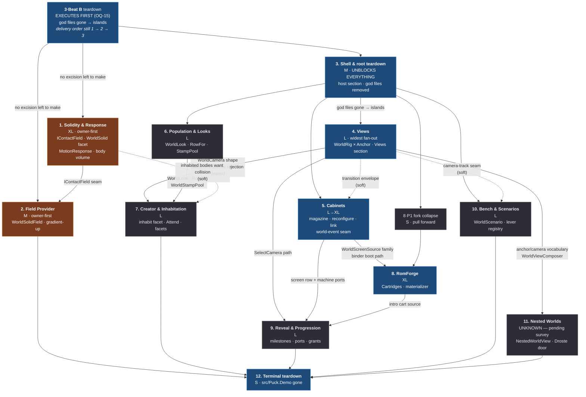

# Demo → World port plan

`src/Puck.Demo` (294 files, 81 372 lines) is retired into `src/Puck.World` and
the shared libraries across twelve arcs. This document is the execution order,
the shared contract every arc obeys, and the per-arc specification. When it
lands, `src/Puck.Demo` does not exist.

This is not a port in the file-copy sense. Every arc names what the Demo
original got *wrong* or got *specific* about, and what the World version does
instead. An arc whose diff is a namespace change has failed.

## State of execution

**Branch `claude/puck-realtime-world-editing-4fd13f`; the path completed at
`2020d00`, with closeout/doc commits on top — `git log` is authoritative for the
tip. Nothing is merged to `main`.** The execution records under each arc are the
binding record; this block is the index.

**DONE (7 arcs, in execution order):**

| Arc | Commits |
|---|---|
| **3 · Beat B** — teardown (executed first, OQ-15) | `686d009`, review `33595eb` |
| **1** — Solidity & Response | `aa77091` |
| **3 · Beat A** — host section | `eea151e` |
| **2** — Field Provider | `ab2a87f` |
| **4** — Views | `2d20ccf` |
| **6** — Population & Looks | `16ce575` (largechange-06), `da63bfe` (largechange-09), `2728b58` (arc) |
| **5** — Cabinets | `bca1656` |
| **7** — Creator & Inhabitation | `006c84f` (largechange-01/-15), `20d0ed2` (arc) |
| Per-wave review fixes | `d275ee1`, `cfe7786`, `bc20a9c`, `2020d00` |

**REMAINING:** Arcs **8** (RomForge), **9** (Reveal & Progression), **10** (Bench
& Scenarios), **11** (Nested Worlds), **12** (Terminal teardown), plus the
**[carried tracks](#carried-tracks)** (the parallel non-port half — a different
team). `src/Puck.Demo` still exists as a **library that does not run** (R0/OQ-11):
it compiles so the surviving pinned files build, and Arc 12 deletes it.

**Standing deferral ledger a resuming agent must know:**

- **The (c)-disposition ledger.** Arcs 1, 2, 4, 6, 7 each declined to excise their
  Demo deletion targets because the pinned **OQ-14 survivors** (`OverworldWorld.cs`,
  `OverworldFrameSource*.cs`, `TownWorld.cs`) and the **HELD** `Museum/MuseumRenderer.cs`
  still consume them. Every carcass is named in its arc's "Demo deletion —
  (c)-disposition" note. **OQ-14 is RESOLVED 2026-07-19** (the tape is wired into
  World; the nine + `TickNarration` + their orphaned connectors are deleted), so the
  OQ-14 *hold* is gone — but the survivors are NOT islands (the Arc 8/9/10 hub and
  `RouterIntentSource` still consume them), so they stay until the Demo-retirement
  trajectory removes those consumers. The (c)-carcasses die when THAT lands, not on
  an OQ-14 pin.
- **Island sweep — 10 (c)-carcasses were NOT actually pinned; DELETED (owner-approved
  2026-07-19).** A `roslyn-first-analysis` pass (`SymbolFinder.FindReferencesAsync`
  over `Puck.slnx`) proved that ten of the (c)-dispositioned files — every one a
  console-verb `ICommandModule` (or a private helper reachable only from one) whose
  sole registration site was the Arc 3 Beat B `DemoRunRegistrar.cs` — have **zero
  real incoming reference**: the "pin" was a closed loop of `<see cref>` doc-comment
  mentions, never a code edge. `CreatorCommandModule.cs`, `Overworld/OverworldPressDriver.cs`,
  `CompanionCommandModule.cs`, `RtsCommandModule.cs`, `GravityCommandModule.cs`,
  `Tracker/TrackerCommandModule.cs`, `Creator/CreatorRigCommands.cs`, `GardenCommandModule.cs`,
  `TimeTravelCommandModule.cs`, `HgbDebugCommandModule.cs` — **1,984 lines across 10
  files, deleted.** Their per-arc (c) rows below are marked DELETED. The *data/render*
  half of each subsystem (state, renderer, emitter classes) stays genuinely pinned by
  the survivors and is untouched. Three dangling `<see cref>` doc comments in surviving
  files (`CompanionState.cs`, `Forge/CreatorForgeCommand.cs`,
  `Overworld/OverworldFrameSource.Control.cs`) were reworded. Evidence: scratchpad
  `freed-islands.md` + `multi-refs.cs`.
- **Arc 5 deferrals:** the **P7 world-event channel** seam + `ScreenEngageDirector`
  (Arc 9 inherits the decision); **console-feed live rendering** (OQ-13's
  `ConsoleFeed`/`ProceduralFeed` port — the `console` source renders the no-signal
  fallback until it lands); **live cross-worker cable-link co-stepping** (links are
  spec-legal **dormant**, naming why); and the reconfigure path is **proven-built,
  not proven-live** (World ships no bundled SM83 cart).
- **Arc 7 deferrals:** the **derived-face SDF slab + live handle** (a face wired to a
  *derived* camera reads no-signal until the slab enters the render program with its
  own probe reservation; a face on a *document* camera binds live today); and the
  **`WorldLookResolver` reroute** of the 5 humanoid-role call sites (a humanoid-leaf
  anchor on a creation-look body resolves through the catalog rig — never black,
  never crash).
- **The `autoInsert` third touch of the frozen worlds — MOOT under [R18](#r18--goldens-are-not-a-gate-owner-ruling-2026-07-20).**
  Arc 5's non-null `autoInsert` route field moved all three shipped worlds
  (`default`, `expo`, `kart-remap`) a **third** time, beyond constraint 2's two
  *named* exceptions (Arc 1 collision/motion, Arc 4 OQ-12 cameras). Recorded as
  history; it owes no owner accept/reverse. Moving world bytes as a side effect of
  a landing is fine — only baking a feature into the default world is not.

**Adversarial-pass follow-up (2026-07-19).** `3827ccd` was an owner-authored
adversarial review (the settled-answers register, `docs/vision.md`, doc/skill
truth-up, and the DirectX half of the HIGH GPU-sync defect). Its "handed to the
implementer" list, verified-not-fixed there, is now closed on three mechanical
items:

- **HIGH-2 twin** — `241d1af` (this session's GPU-sync commit): the
  Vulkan upload rebuild path now drains via `m_device?.TryWaitIdle()` before
  `DisposeResources()`, restoring backend symmetry with `3827ccd`. Both HIGH rows
  are FIXED in the [Immediate action](#immediate-action--two-high-severity-gpu-sync-fixes)
  table; confirmed by reading + clean build + boot smoke on each backend, a real
  resize/format-change GPU exercise still owed.
- **Sculpt dirty-tracking** — `9d9aac8`: the bench's clean flag now flips only on
  the server's accept (delivered creation row at the submitted hash), so a
  rejected commit reports dirty, not clean; `editor.exit` refuses loudly on dirty
  sculpt work (`editor.exit force` is the hatch). Verified over stdin on both
  backends.
- **RecordingClock.Sim determinism** — `3288d37`: `CapturingRenderNode` stamps
  `ElapsedTicks` (the fixed-step sim clock), not `RenderTicks` (which folded in
  the wall-paced `AccumulatorTicks`), honoring the `CaptureFrame` contract. Wall
  timestamps (QPC) and the validator's `clock:"sim"` semantics are untouched.
  capture.* smoke wrote valid webm on both backends.

**ACCEPTED by the owner (2026-07-20) — no longer open:**

- **The empty boot + summonable crowd.** R-C's inhabitants-as-players ruling made
  `networkPlayers` an admission cap rather than a static boot reservation, so the
  default world no longer boots a 124-body wander crowd — boot shows the joined
  seats, and the crowd is summoned with `world.population <n>`. **The owner has
  BLESSED this consequence.** It is the accepted behavior of the shipped default
  world, not an open question, and the old `networkPlayers` headroom concern
  (`default.world.json` shipping `124` against a ceiling of `124`) dissolved with
  it: the table is free at boot and inhabitation lands at slot 127 on the
  untouched file.

**Still owed the owner** from that same list:
- **OQ-14 / the replay tape — DONE 2026-07-19, then SUPERSEDED by ruling R-A
  (2026-07-19): TRUE DETERMINISTIC REPLAY.** The first pass wired the engine snapshot
  recorder as a *live input re-injection lever* (it re-drove the running session,
  rehydrating no starting state, with an unreadable tail hash and no input lockout).
  The owner then ruled BUILD TRUE DETERMINISTIC REPLAY. The lever is REPLACED (one
  honest surface, no live re-injection): `WorldReplaySnapshot` captures the server
  simulation state at record-start (the record-start `WorldDefinition` + active seats
  — the population body state is that definition's deterministic boot image; machines,
  screens, cameras, overlays, and audio are presentation and excluded, documented) plus
  the per-tick server-input stream (intents + authority commands tapped at the
  loopback). `replay.verify` rehydrates a FRESH `WorldServer`/`WorldPopulation` from the
  recording, re-drives the stream OFFLINE (an isolated shadow world — live seat input is
  structurally excluded, the strongest lockout), and compares the replayed tail pose
  hash against the recorded one, echoing MATCH/MISMATCH synchronously over the pipe (the
  drain problem is gone). `replay.record`/`stop`/`cancel`/`verify`/`list`/`status`; the
  `replay.play` live-playback mode and its unactionable busy message are deleted. The
  verify compares the fresh re-drive against the LIVE session's tail hash (a genuine
  live-vs-replay check), holding for BOOT-ANCHORED captures; a mid-session capture honestly
  reports MISMATCH until full per-body record-start rehydration lands (the identified next
  lever). Introspection (`tick.explain`/`tick.watch`) remains an explicit loss (OQ-17).
  See [OQ-14](#open-questions) and the [Arc 3 replay execution
  record](#arc-3-replay-execution-record--ruling-r-a-executed).

**THE NEXT ACTION.** **Arc 8 Phase P1 (fork collapse)** is the plan's named
pull-forward and the natural resumption point (it depends only on the landed
teardown). **[OQ-14](#open-questions) is RESOLVED 2026-07-19** — ruling R-A built the
true deterministic replay the first pass deferred; no owner decision remains owed.

## How to use this document

**This document has two halves, and they are independent of each other.**

| Half | What it is | Who runs it |
|---|---|---|
| **[Port arcs](#arc-sequence)** (front) | Twelve sequenced arcs that retire `src/Puck.Demo` into `src/Puck.World`, plus the [deletion ledger](#deletion-ledger), the [unclaimed remainder](#unclaimed-remainder), and the [open questions](#open-questions) that govern them. Ordered, interdependent, terminating in the Demo not existing. | One team, in order |
| **[Carried tracks](#carried-tracks)** (back) | **140 rows / 139 distinct commitments that are not the port**, plus **two immediate HIGH-severity GPU-sync fixes and one chartered 25-finding GPU-sync pass** (owner ruling, 2026-07-19) — engine-lifetime bugs, SDF renderer work, defects in already-landed World code, emulator accuracy, honest opens, retired-plan deferrals, README-embedded work. Unordered, mutually independent. | A different team, in parallel, starting today |

The halves share one file so the next agent opens **one document and finds
everything**. They do not share a schedule. Where a carried row touches an arc,
**the per-track collision notes are the complete list of coupling between the
two halves** — Track C's collision table is the largest of them, but Tracks B, E,
F, and G each carry couplings too. There is no single global count; read the
per-track notes.

**If you are executing the port:**

1. Read the [owner constraints](#owner-constraints) and the
   [target model](#the-target-model). They apply to every arc without
   restatement.
2. Read the [standing rulings](#standing-rulings). They resolve places where
   two arcs designed the same thing differently; an arc that re-opens one is
   re-litigating a settled question. **Start with
   [R18](#r18--goldens-are-not-a-gate-owner-ruling-2026-07-20)** — goldens,
   byte-identity, and the ouroboros round-trip are **not gates**, and R18
   outranks any verification step in this document that still reads like one.
3. Build the [shared primitives](#shared-primitives) in the arcs that own them,
   first, before feature work. Seven of them are consumed by three or more arcs.
4. **Read the [open questions](#open-questions) and their gate table.** **Twelve
   rulings were resolved by the owner on 2026-07-19** and are recorded there as
   RESOLVED entries rather than deleted — OQ-1, OQ-2, OQ-5, OQ-11, OQ-12, OQ-15,
   OQ-14's deferral-to-Beat-B, and the GPU-sync assignment, then OQ-13, OQ-16,
   R15, and `uieditor-01`'s status. **No gate remains**: every
   arc may start on its own dependencies. What is still open is measurement
   (OQ-7, OQ-8), cheap verification (OQ-9), and scheduled forcing points (OQ-3,
   OQ-4, OQ-6, OQ-14, OQ-17). The two hand excisions the plan used to carry are
   **gone**: OQ-15 ruled that the owner's arc-1-first ruling pins *delivery*
   order, so Arc 3 Beat B **executes first**.
5. Execute the [arc sequence](#arc-sequence). Each arc section is
   self-contained: intent, refactor thesis, target shape, author surface,
   flagged engine seams, Demo deletion list, verification, risks, sizing.
6. **Check the [carried tracks](#track-index) before starting an arc.** Eight
   rows in [Track C](#track-c--world-native-defects) are defects in code your
   arc is about to extend or inherit — most urgently **largechange-05 before
   Arc 2**, **largechange-01 before Arc 7 and ideally before Arc 6**,
   **largechange-06/09 before Arc 6**, **largechange-03/04/17 at or before the
   Arc 3 + 8·P1 fork collapse**, and **largechange-18 as a flag on Arc 2's own
   read-only-`Puck.SdfVm` self-check.** The rule is the same each time: fix
   before the arc grows a new consumer. Track C's
   [collision table](#port-arc-collisions--the-ordering-that-actually-matters)
   carries three further adjacency-only rows.
7. Before Arc 12, close the [unclaimed remainder](#unclaimed-remainder). It is
   **9 410 lines** of Demo that no arc names, measured in this tree. **Arc 3 Beat
   B carries the survey that closes it** — see R17; without that beat Arc 12's
   precondition can never be met.

**If you are working a carried track:**

1. Start at the [track index](#track-index). Seven tracks, each with a
   normalized table, a sizing rollup, and its collision note.
2. **Two tracks have a gate you must read first.**
   [Track B](#track-b--sdf-vm-render-and-perf) cannot be sized or scheduled
   until `sdf-01` (the Phase 0 re-baseline) is done — **all historical SDF perf
   numbers in this repo are owner-ruled dirty.**
   [Track D](#track-d--emulator-and-fleet)'s four trigger-gated rows are parked
   with named conditions, not queued work.
3. Verification differs by track. World rows verify by **running
   `Puck.World`** (constraint 6); emulator rows verify against
   **co-simulators and self-checking ROMs**; SDF perf rows verify only under
   the **owner-supervised attribution protocol**.
4. A commitment that has landed is dropped, not carried. If you think a row is
   already done, check the
   [dropped-commitments appendix](#dropped-commitments) before re-verifying —
   it may already be recorded there with evidence.

**Two things this document deliberately does not contain:** bare-metal work
(excluded by owner ruling — see the
[baremetal exclusion](#baremetal-exclusion--a-deliberate-ruling-not-an-oversight))
and anything from the orientation docs (`capability-catalog.md`,
`project-map.md`, `agent-guide.md`, `docs/README.md`, `docs/sdf-wiki/`), which
describe what Puck **is** and what has already been ruled on. Those are never
absorbed here and never retired by this plan.

Line numbers are current as of branch `claude/puck-realtime-world-editing-4fd13f`.
Re-grep before relying on an exact line in a live edit.

## Owner constraints

Quoted verbatim; these outrank every recommendation in this document.

1. **"NOT A 1:1 CLONE! Code that is ported must be refactored to fit our new
   model and stricter abstract standards."** Every arc must name what the Demo
   original got wrong or got specific about, and what the World version does
   instead. A port that is a file copy with a namespace change is a FAILED
   design.
2. **"Do not alter the default world, except for adding collision and updating
   the motion."** `Assets/worlds/default.world.json` is FROZEN apart from the
   locomotion/collision arc. No arc may bake its feature into the default world.
3. **"Do ensure that authors could use any of these capabilities if they so
   choose."** Every ported capability MUST be author-reachable: a world-document
   field (`puck.world.def.v1`), a console verb, and where relevant a grant.
   Opt-in, discoverable, documented. A capability that only exists as C# an
   author cannot reach has not been ported.
4. Each arc DELETES its `Puck.Demo` source in the same change. The plan
   terminates in `src/Puck.Demo` being gone. Nothing outside this repo consumes
   Puck (supergreen): no compat aliases, no deprecation shims, no migration
   tolerance for old data shapes.
5. `Puck.World` scope discipline: arcs edit `src/Puck.World` and its libraries.
   Engine seams (`Puck.SdfVm`, `Puck.Scene`, `Puck.Maths`, `Puck.Platform`,
   `Puck.Commands`) may be touched but each such touch must be called out
   explicitly as a flagged seam in the arc.
6. Verification is by RUNNING `Puck.World`, not by adding `Puck.Post` gates.
   Never propose a new Post stage or a `--validate-*` flag for a World feature.
   Console verbs over stdin are the scripted-test surface.
7. No `PUCK_*` environment variables for configuration, ever. Durable values are
   world-document fields; live operations are console verbs.
8. Determinism posture: `Puck.World` is deliberately NOT determinism-obsessed by
   owner order. Simulation bodies use fixed-point (`Puck.Maths` `FixedQ4816`)
   because the existing `WorldBody` does; follow the surrounding code's posture
   rather than importing `Puck.Post`'s stricter contract. Do not propose
   determinism gates.
9. Comments are minimum-viable facts; XML docs follow Microsoft .NET style.

## The target model

A ported capability lands in `Puck.World` as the same seven-step ritual the
codebase already performs twenty-one times. Deviations must be argued for in the
arc, not assumed.

| Step | Where | Contract |
|---|---|---|
| 1. Document row | `WorldDefinition.cs:1063` (the `WorldDefinition(` record header; the file is 1 299 lines) | A named, typed property on the flat aggregate. Row families use closed `$type` polymorphism with variants nested inside the abstract base. |
| 2. Validation | `WorldDefinitionValidator.cs:51` (`public static void Validate`; the file is 1 268 lines) | One private `ValidateX`, called at the point in `Validate` where its cross-references resolve, threading resolved id-sets forward. Every closed switch carries a loud unknown-kind branch. |
| 3. Mutation | `Protocol/WorldMutation.cs:17` | Whole-row `Upsert<Row>`/`Remove<Row>` keyed on the stable field, or a whole-section `Set<Section>`. Never a field poke, never a delta. |
| 4. Apply pipeline | `Server/WorldServer.cs:406` | grant → compose → validate → capacity fit → install → journal. Failure at any step leaves `m_definition` byte-identical. |
| 5. Grant | `Protocol/WorldGrant.cs:29` (the `WorldSection` enum; the file is 154 lines) | A new `WorldSection` member and, where authority crosses principals, a `GrantSubject`. **Never a fifth `WorldCapability`.** |
| 6. Console verb | an `ICommandModule` | `Simulation` routing for anything that changes the document or drives a body; `Immediate` for reads and client-local levers. Mutation verbs return `CommandResult.None`; the server prints the loud accept/reject. |
| 7. Session capture | `WorldSessionCapture.cs` | Any live lever with a document home folds back at `world.save`, and reports as session drift in `world.status`. |

### Author-surface token spelling

Pinned once here so eight arcs do not each invent a convention.

- **Grant section tokens are lower-case**: `world.grant addon:physics mutate
  section:collision exclusive`. `WorldGrantCommandModule.cs:195-196` parses with
  `StartsWith(…, OrdinalIgnoreCase)` + `Enum.TryParse(ignoreCase: true)`, so
  `section:Looks` *is* accepted — this is a **house-style pin, not a correctness
  rule**. Every author-facing example, verb description, and doc comment in this
  plan uses the lower-case form.
- **Verb arguments are strictly positional.** No verb in `src/Puck.World` takes a
  `--flag`, and no arc introduces one. An optional argument is a bare token in a
  fixed slot; `-` is the plan-wide **clear-to-absent** token (Arc 1's
  `world.scene.solid <id> off` and Arc 7's `world.placement.inhabit <id> -` are the
  two shapes: a named off-word where the field is a facet, `-` where the slot is a
  value).
- **Enum-valued fields serialize camelCase** (`WorldDefinitionSerialization`'s
  converters), so a document token is `"firstPerson"`, `"humbleColor"`,
  `"ordered4x4"` — and a verb that takes the same value takes the same spelling.

### Layering

- **`Server/`** owns `WorldDefinition`, the 128-body table, intent producers,
  the grant table. Never reads render/GPU/client state.
- **`Client/`** owns seats, the frame source, the screen binder, machines,
  render settings. Poses flow in via snapshots only.
- **`Protocol/`** is closed record/enum vocabulary plus `IServerLink`/`IClientSink`.
  No behavior.

A new write path is added interface-first: `IServerLink` → `LoopbackTransport`
→ `WorldServer`, in that order.

### Numerics

Decide SIM-AFFECTING vs PRESENTATION-ONLY *before* writing the record
(`WorldDefinitionValidator.cs:9-25`).

- **SIM-AFFECTING** — read by `WorldBody.Advance` or an intent producer.
  Authored as `float`, quantized exactly once at a named `Fixed*.Compile`
  boundary, never re-read as `float`. Validated for finiteness and physical sign
  only.
- **PRESENTATION-ONLY** — read by `WorldFrameSource`/`WorldScreenBinder`/the
  audio director. Stays `float`/`Vector3` forever. Validated for structural GPU
  safety (finite frames, bounded extents, non-degenerate bases).

Across the twelve arcs, only Arcs 1, 2, 6, and 7 introduce SIM-AFFECTING fields.
Arcs 3, 4, 5, 8, 9, 10, 11 are PRESENTATION-ONLY in their entirety and introduce no
`Fixed*` boundary — state that in the arc rather than adding one out of reflex.

### Live vs next boot

Default is LIVE on delivery. A field that is genuinely boot-consumed (a
swapchain format, a frozen render-envelope probe) says so **per field** in its
doc comment, following `WorldAuthoringDefaults`' mixed-consumption ritual
(`WorldDefinition.cs:948-965`). Silently mixing boot-consumed and live-consumed
fields in one row without narrating the split is the anti-pattern that ritual
exists to prevent.

### Verification

By running `Puck.World` and driving stdin. The `Process` + `OutputCollector` +
`Ctx` driver shape at `scripts/proof.cs:4020` is the scripted form; a `proof.cs`
subcommand is a developer script, **not** a Post gate — it adds no stage and no
flag. The FIFO stdin barrier (`Puck.Commands/CommandRegistry.cs:373`) makes
every mutate-then-read pair deterministic with no sleep, which is why every
mutation verb is `Simulation` and every read verb is `Immediate`.

**The `player.*` grammar every arc's script is written against.** Read from
`PlayerCommandModule.cs:109-160`; get this wrong and the arc's acceptance criteria
do not execute.

| Verb | Grammar |
|---|---|
| `player.join` | `[2..4]` — a **seat count**, not an index. Seat 1 always exists |
| `player.warp` | `<x> <z> [player]` — **two** coordinates; `WarpHandler` submits `Position: new Vector3(x, 0f, z)` (`:383`), so a warp **cannot name an altitude** |
| `player.pose` | `<x> <y> <z> <yawDeg> <pitchDeg> <rollDeg> [player]` — the full 6DOF teleport, and **the only way to place a body off the ground plane** |
| `player.run` | `<forward> <strafe> <turn> <seconds> [player]` |
| `player.where` | `[player]` |
| `player.stop` | `[player]` |

> **The player index is TRAILING, 1-BASED, and ranges 1..128** — 1..4 are the local
> seats, 5..128 the simulated population entries. It defaults to 1 when omitted.
> **There is no player 0.** Every script in this document obeys that; a script
> written as `player.where 0` or `player.warp 0 -4 0 0.5` names a nonexistent
> player and mis-parses its own arguments.

**Placing a body at an altitude** (Arc 1's stand-on-a-slab check, Arc 2's
planetoid walk) uses `player.pose`, never `player.warp`. `player.pose`'s doc says
*"a grounded entity re-pins Y … on its next step"* — and **Arc 1 changes what that
sentence means**: re-pinning stops being a snap to `MotionTuning.GroundY` and
becomes a resolve against the contact field, so a pose above a solid slab settles
onto the slab instead of the floor. Arc 1 must state that reclassification in
`player.pose`'s description alongside the `ResetVertical` momentum reset (Arc 1
risk 5), because it is the same code path.

## Standing rulings

These resolve the eleven places where two arc designs shaped the same concept
differently, plus two process rulings. An arc that wants to re-open one raises
it with the owner rather than diverging quietly.

### R0 — Demo runnability is not preserved across the port

**Confirmed by owner ruling, 2026-07-19 (OQ-11): the Demo stops RUNNING after
Arc 3 and keeps COMPILING until Arc 12. R0's top-down teardown stands** — with
OQ-15's ruling that Beat B *executes* first, the Demo in practice stops running
before Arc 1 delivers.

`src/Puck.Demo` must keep **compiling** (so `dotnet build` stays green) until its
final removal. It is **not** required to keep **running** after Arc 3.
Constraint 6 makes `Puck.World` the verification target for every arc; the Demo
is never verified by running after the shell arc.

This is the consequence of the plan's load-bearing structural finding:

> **Delete top-down, not bottom-up.** Nine of the ten arc designs concluded "my
> Demo deletion is blocked on the shell arc"; the shell design concluded "Beat B
> blocks on every other arc." That is a cycle, and it is an artifact of reading
> the dependency graph backwards. Demo's flow is composition root → god files →
> feature files, and deleting a *consumer* is always safe. Remove `Program.cs`,
> `DemoHost.cs`, `DemoRunRegistrar.cs`, `GraphBuilder.cs`, `HostSettings.cs`,
> `DemoRunDocuments.cs` and the three god files (`OverworldWorld`,
> `OverworldRenderNode`, `OverworldFrameSource*`) **early**. Every remaining Demo
> file becomes an unreferenced island its owning arc can `git rm` with zero
> cross-arc excision.

This collapses roughly two thirds of the ordering constraints the ten designs
carry.

### R1 — Read before delete

Once a god file is gone its algorithms exist only in git history. The ten arc
designs, with their file:line anchors, are the durable record; keep them in
`docs/reviews/` until the arc that consumes each has landed. An arc that finds
its design under-captured the original **stops and reads history** rather than
guessing.

### R2 — Contact resolution is one seam with two members, not a third motion model

`design-collision` proposed `MotionModel.Field` (a third integrator);
`design-locomotion` proposed an `IContactField` provider seam with `MotionModel`
staying two-wide. Both authors argued against the other's shape; neither proposed
the synthesis this plan adopts:

```csharp
internal interface IContactField {
    bool Resolve(ref FixedVector3 position, ref FixedVector3 velocity, FixedQ4816 radius, FixedQ4816 height);
    bool TryUp(in FixedVector3 position, out FixedVector3 up);
}
```

`TryUp` is the load-bearing addition. Locomotion's one-member seam is
insufficient — a planetoid walker needs an up axis while *falling*, not only
while in contact — and that insufficiency is exactly what pushed the collision
design toward a third `MotionModel`. With the axis behind the seam:
`Grounded` reads its up from `TryUp`; the analytic provider returns constant
`+Y`; the SDF provider returns `−gradient`, which for a flat ground plane *is*
`+Y`. One integrator covers both worlds with no branch.

Consequences: **`MotionModel` stays two members.** Arc 1 owns the seam and the
analytic provider; Arc 2 is a second provider behind it and re-plumbs nothing.
Arc 1 becomes XL (two L designs merged, minus duplicated halves); Arc 2 drops to
M — the third motion model, the `SetModel`/`Warp`/`Reconcile` branches, and the
`FixedQuaternion` composition all evaporate.

> **ACCEPTED by owner ruling, 2026-07-19 (OQ-1).** The synthesis stands as
> written: the third `MotionModel` is dead, and planetoid walking is a data
> choice — a provider token on `WorldCollision`, not an integrator kind. Arc 1
> stays **XL**, Arc 2 stays **M**. The fallback this ruling used to carry (two
> arcs with a fork in the integrator) is off the table and is not an option any
> arc may reach for.

### R3 — Solidity is a per-row facet, not a section of booleans

`design-collision`'s `collision.sceneRows`/`.screens`/`.placements` booleans are
**deleted**. `design-locomotion`'s per-row `WorldSolid?` facet — mirroring the
landed `WorldEmission?` precedent at `WorldDefinition.cs:498` — wins: per-row
granularity, one authoring axis, no second vocabulary. Extend the facet
uniformly to `WorldScreen` and `WorldPlacement`. `WorldCollision` keeps
`Enabled`, `ContactSkin`, `MaxIterations`, gains a provider discriminator
(`analytic` | `field`), and gains the two solver knobs an author must be able to
reach (`MaxSlopeDegrees`, `GradientProbe` — see R2's seam and Arc 2 risk 3).

**A facet with no consumer is a schema lie — so the two providers' coverage is
pinned here, not left to each arc.** The facet is legal on three row families; the
*analytic* provider can only derive an honest convex proxy for two of them:

| Row family | `analytic` (Arc 1) | `field` (Arc 2) |
|---|---|---|
| `WorldSceneRow.Boulder` | `Sphere(Radius + Margin)` | SDF sphere, smooth-unioned |
| `WorldSceneRow.Slab` | `Box(HalfExtents + Margin)` | SDF box, smooth-unioned |
| `WorldScreen` | `Box` derived from the slab's `Origin`/`Right`/`Up`/`HalfWidth`/`HalfHeight`/`HalfDepth`, each extent + `Margin` | the picker's face-normal-offset box |
| `WorldPlacement` | **rejected at validation, by name** | reach-sized proxy sphere |

`solid` on a `WorldPlacement` under `provider: "analytic"` is a **loud validator
error** — *"placements.\[i\].solid needs the field contact provider; set
collision.provider to 'field' or drop the facet"* — because a creation stamp has
no honest convex proxy the document alone can derive. **Arc 1 lands that rejection
in the same change as the facet; Arc 2 deletes the rejection when it lands the
provider that can answer.** No arc ships an authorable field that silently does
nothing, and no arc ships one whose only diagnosis is "it didn't work."

### R4 — Body volume lives on `WorldKit` as `WorldCollider?`

Not on `MotionTuning`. Volume is not feel; it wants its own validation
(`height >= 2 * radius`) and its own verb (`world.kit.collider`), not an overload
of `world.kit.tune`. One home only. `MotionResponse` is locomotion's, unchanged —
collision cedes accel/decel to it.

### R5 — One `WorldPlacementInhabit`, owned by Arc 7

`design-population` and `design-creator` both declare a record of that name, both
delete `WorldPlacement.Role`, both add placement mutations to `AffectsPopulation`,
both reserve slots downward from 127. Merged:

```csharp
internal sealed record WorldPlacementInhabit(string? Kit, string? Look, IntentSource Source, int Count, float Radius);
```

`Count` defaults to 1. `Kit == null` resolves the creation's
`Behavior.Locomotion` token as a kit name (creator's rule). `Look == null` wears
an implicit creation look on the placement's own `CreationId` (population's
rule). **Arc 7 owns** the record, the reconciler, slot reservation, and
`IntentSource.Attend`; **Arc 6 owns** `WorldLook` and contributes the `Look`
field's vocabulary. Sequence 6 → 7 so `Inhabit` lands whole, once.
`WorldPlacement.Role` is deleted exactly once, by Arc 7.

### R6 — `MaxSimulated` is computed, once — **OVERRIDDEN by R-C (owner, 2026-07-19)**

Arc 7's computed property (`MaxPopulation - LocalSeatCount - inhabitantCount`) is
the implementation; Arc 6's validator census-fit rule folds into Arc 7's
`ValidatePlacements`. Do not implement it twice.

**OVERRIDDEN — R-C, owner ruling 2026-07-19 (see the R-C execution record under the
Arc 7 record).** The census-fit *validator* rule (`networkPlayers + sum(Inhabit.Count)
<= MaxPopulationSimulated`) is **deleted, not folded** — it was a static pre-reservation
that made `networkPlayers` compete with inhabitants and made the shipped
`default.world.json` (`networkPlayers 124`) un-inhabitable. Rationale: **inhabitants are
players.** An inhabitant now JOINS a free peer slot over the loopback link exactly as a
peer does; `networkPlayers` is a remote **admission cap**, not a boot reservation (the boot
census is zero — only the joined seats are live); total occupancy is bounded by the entity
table itself, and a genuinely full table is rejected loudly at JOIN time (a runtime fact the
static validator cannot know). `MaxSimulated` survives as the *live* census ceiling — the
inhabitant floor, moved only by physical occupancy — but it is no longer a validation rule.

### R7 — `WorldStampPool` is Arc 6's, generalized once

`design-population`'s `WorldStampPool` rename (with a root discriminator) and
`design-creator`'s `int? BodyIndex` on `Registration` are the same change under
two names. Arc 6 owns it; Arc 7 consumes the generalized pool. Names:
`WorldStampPool`, `MaxStampRegistrations`.

### R8 — The collapsed `WorldCamera` wins; Views strictly precedes Creator

`design-views` collapses `WorldCamera` from a `Fixed`/`Anchored` union into one
record carrying `Anchor?` + `WorldRig`; `design-creator` emits the retired
`WorldCamera.Anchored` shape. Supergreen forbids read-side tolerance for the old
`$type`, so the collapsed record wins and creation-derived cameras emit it.
Creator *also* depends on Views deleting the placement-anchored-camera rejection
at `WorldDefinitionValidator.cs:136-139`, without which creation-derived cameras
cannot exist at all.

**R8 stands unchanged after the 2026-07-19 rulings.** OQ-12 was approved, which
*removes* the only pressure this ruling was ever under: the refused-OQ-12
fallback would have required read-side tolerance for the retired
`anchored`/`fixed` `$type`s, which R8 forbids. With the re-encoding granted,
there is no read-side tolerance anywhere and the two rulings agree by
construction.

### R9 — Arc 4 owns `ScreenLayoutDirector` and `ScreenSlotLedger`

Views deletes both (replacing the director with `WorldViewLayout` +
`WorldViewComposer`); Cabinets lists both as explicit non-ports; Reveal excises
`ScreenLayoutDirectorMode.Immersed`/`.Revealed`/`BeginReveal`. **Arc 4 owns the
files and their deletion.** Cabinets strikes them from its table; Reveal's mode
members die with the file. Arc 4 also *supplies* the transition mechanism that
Cabinets' pane-focus choreography and Reveal's fourth-wall break both want, so
nobody reimplements it.

### R10 — Machine ports and save slots belong on `WorldScreen`, not on `WorldScreenSource.Machine`

`design-reveal` hangs `Ports` and `SaveSlot` off the `Machine` source variant.
They are properties of *the slot's hosted machine*, not of the source recipe:
putting them on `Machine` means a `Cartridge`-sourced screen (Arc 8) cannot have
ports, which is exactly the intro-ROM case Reveal needs. Move them onto
`WorldScreen`. Sequence 5 → 8 → 9 for the three arcs that edit the screen row.

### R11 — `AvatarDefinition.cs` is Arc 8's, as a move

Three arcs claim it. Arc 8 (RomForge) moves it to `Puck.Forge/Avatar/`; Arc 7
strikes it from its deletion table; Arc 6 already declines it.

### R12 — Every new section is nullable, `WhenWritingNull`, with a static default

This is the plan-wide rule that keeps the shipped worlds clean of empty
feature keys, and it retires `design-population`'s blocking question about
emitting `"looks": []`.

> Every new document section added by any arc is a **nullable** property with
> `[JsonIgnore(Condition = JsonIgnoreCondition.WhenWritingNull)]`, a static
> `Default`/`None` on its record type, and exactly one `??` coalesce near the
> top of `Validate`. List sections are `IReadOnlyList<T>?` read as `?? []` (the
> documented STJ omitted-collection trap). `WorldDefinition.Default` leaves every
> new section `null`.

Eight arcs add a section. Without one idiom, half of them bake their feature into
the shipped worlds as empty keys, arc by arc — which constraint 2 forbids on its
own terms, independent of any byte check (R18). Arc 1 codifies it and documents it
in `src/Puck.World/README.md`.

### R13 — `AffectsPopulation` / `CompileFixedTables` are sequential, never parallel

Arc 1 adds scene mutations, Arc 6 placement mutations, Arc 7 placement + creation
mutations to the same switches. The conflict is semantic, not textual. Order
1 → 6 → 7; each arc re-runs the crowd census check (`world.population` per-kit
counts unchanged before/after) as its own regression.

### R14 — Post-stage deletions are surfaced to the owner, not buried

Arc 9 deletes `Puck.Post/Stages/VictoryGateStage.cs`; Arc 12 edits
`Puck.Post/Stages/RunDocumentStage.cs:117` to retire `Puck.Scene.HostDocument`.
Both are legitimate — they remove stages and literals whose *subject* has died,
which is not the same as weakening a gate, and constraint 6 forbids only
*adding* Post stages for World features. But deleting a Post stage is a bigger
act than deleting Demo code: surface both as an explicit owner decision at the
Arc 9 and Arc 12 reviews, not silently inside a large diff.

### R15 — The verbatim-move exemption is granted case by case, with written justification

**RESOLVED 2026-07-19 by owner ruling.** Arc 8 moves ≈6 300 lines (`Bake/` 3 342,
`Brickfall/` 2 413, `Avatar/` 540) into `Puck.Forge` as namespace-change-only
copies, instructing *"do not refactor to fit the new model — they are hardware
encoders."* Constraint 1 says a port that is a file copy with a namespace change
is a FAILED design. The open question was whether the plan could grant itself
that exemption; it could not, and OQ-4's further ≈16 970 lines would have
inherited the precedent silently.

> **The ruling.** A port **may** move code verbatim where **the arc author argues
> in writing that the code was already correct.** The refactor thesis for such a
> move is literally *"this one was right"* — that is an acceptable thesis, and it
> is the only acceptable one for a verbatim move.
>
> **The exemption is CASE BY CASE and must be EXPLICIT AND REVIEWABLE IN THE
> ARC — never silent.** A verbatim move with no written justification is a
> constraint-1 failure exactly as before; the ruling changes what an author may
> argue, not whether they must argue it. There is no blanket subtree grant and no
> precedent inheritance: a later arc citing "R15 covers this" without its own
> written case has not claimed the exemption.
>
> The shape of a sufficient justification: what the code's subject is (hardware
> encoding or authored content, versus engine mechanism), why the new model has
> nothing for it to fit, and the evidence it is already correct (zero executable
> drift, no float, no env vars, no demo state, dependency-free, or the equivalent
> for its subject).

**Arc 8's size estimate is UNBLOCKED** — the ≈6 300-line figure stands as
written, and P3/P4 need no re-scoping. **The components expected to claim the
exemption, each owing its own written case in the arc:** `Forge/Bake/` (17
files), `Forge/Brickfall/` (6), `Forge/AvatarForge.cs`, and
`Forge/AvatarDefinition.cs` (R11). The phase-P1 dead fork (`Sm83Emitter`,
`HgbImage`, `Framework/`, `Tune/`) is a **deletion**, not a move, and claims
nothing.

Explicitly **not** covered, and still owed an ordinary refactor thesis:
`HgbCartridge.cs` (split, not moved), `RomForge`,
`ForgeSubject`/`ForgeRegistry`/`ForgeContext`, `ForgeCliSeams`, `ForgeHost` — all
already deleted-and-replaced by this plan.

**OQ-4's ≈16 970 lines do not inherit anything.** If the owner keeps games, each
title's move is its own case with its own written justification, and the
magnitude question OQ-4 raises is still asked before Arc 8 starts.

### R16 — `FeatureSwitchRegistry` dies on the document side and survives on the runtime side

Arc 3 deletes `host.features` + `FeatureSwitchRegistry` as *"a confession that the
typed section was under-specified"*; Arc 10 registers a `FeatureSwitchDescriptor`
roster in `Puck.World` and hangs `bench.sweep` and `world.levers` on it. Both are
right about different halves, and neither cites the other.

> **The document-side `features` map — an untyped `string→string` escape hatch for
> setting composition values — is dead and is not ported (Arc 3).** The
> **registry** survives in World as a *runtime lever roster derived from the verb
> surface*: each descriptor's `Name` **is** a console verb name, and its
> `Get`/`Set` close over the same object the verb handler writes (Arc 10).

Arc 3's deletion table strikes only the document surface and the
`HostFeatureApplier` hosted service; it does **not** remove
`src/Puck.Commands/FeatureSwitches/`, and it does not remove
`Puck.World.csproj`'s reference to `Puck.Commands`. Arc 10's seam S8 cites this
ruling. The distinction that makes both true: Arc 3 kills *document-driven switch
overrides*; Arc 10 uses the registry as a *runtime introspection and sweep
surface*. `Puck.Commands.FeatureSwitchCommandModule` stays unregistered in World
either way — it would be a redundant third spelling.

### R17 — The remainder survey is Arc 3 Beat B's deliverable, not a precondition nobody owns

Arc 12's stated precondition is that every subtree and root file in the
[unclaimed remainder](#unclaimed-remainder) has an owning arc. As the plan was
first written, **no arc was chartered to produce that answer**, so Arc 12 could
never legally start — a blocked precondition, not a terminal arc.

> **Arc 3 Beat B owns the survey and ships it as a deliverable in the same
> change.** Beat B is what makes those files unreferenced islands, so it is the
> only point in the sequence where the question is cheap to answer and answering
> it is unavoidable anyway.

The survey is a `roslyn-first-analysis` find-all-references pass, not a grep, and
produces exactly one of three dispositions per path: **(a)** superseded by a
landed World surface → Arc 3 deletes it in Beat B; **(b)** a capability World does
not have → it becomes a named row in the remainder table with an owning arc or an
open question; **(c)** consumed by something outside `Puck.Demo` → it is not Demo
code and does not move. Beat B's deletion table then lists every path it took, so
Arc 12's precondition is checkable by reading one table rather than by re-deriving
the measurement.

### R18 — Goldens are not a gate (owner ruling, 2026-07-20)

**This ruling OUTRANKS every conflicting verification step elsewhere in this
document.** Where an arc, a risk, a precondition, or an acceptance list still
reads as though a byte-identity check must pass before work lands, R18 is the
answer and that step is informational.

> **The owner, 2026-07-20:** *"As far as goldens are concerned: we don't actually
> have any. That's a feature you keep rebuilding, which I love by the way, but
> it's just not something we're ready to depend on yet. Goldens keep getting in
> the way of feature development at this stage. Keep the idea around, but stop
> chaining yourself to goldens for the time being."*

**The operative rules.**

1. **Byte-identity is not an acceptance criterion.** The ouroboros load→save
   round-trip (`scripts/proof.cs worlddoc`), `git diff --exit-code` on the
   shipped worlds, and any "re-golden the baseline" step are **no longer gates,
   preconditions, or acceptance criteria** for `Puck.World` feature work. They
   are observations a developer may make, and nothing blocks on them.
2. **Verification is by RUNNING `Puck.World`** and exercising behavior over
   stdin verbs (constraint 6). That is the whole contract.
3. **A shipped world's JSON moving as a side effect of a landing is FINE.** Note
   it in the arc's execution record and move on. No exception ceremony, no owner
   sign-off ritual for the diff itself.
4. **The frozen-default-world constraint (constraint 2) still means "do not bake
   YOUR FEATURE into the default world."** It never meant "the bytes may not
   move." A feature that authors itself into `default.world.json` is still a
   constraint-2 violation; a mechanical re-encoding or a new non-null field
   landing in the file is not.
5. **KEEP THE IDEA.** Golden replays and baselines become worth building **when
   the data settles** — record that as a future lever, not a current gate. The
   deterministic replay capability built under ruling R-A (`replay.verify` /
   `WorldReplaySnapshot`) stays exactly as built: it is a **capability**, not a
   golden gate. Only "the hash must match a stored baseline" stops being a
   landing requirement.
6. **`Puck.Post` is a separate thing and is untouched.** The engine-tier
   batteries — the cross-backend render contract, the SDF VM ISA, the
   run-document schema, the deterministic numerics, and the GamingBrick
   batteries — are not weakened, relaxed, or reinterpreted by this ruling. R18
   governs World feature work only.

**What this retires, concretely.** The two "named exceptions" ceremony around
the frozen worlds — Arc 4's OQ-12 camera re-encoding and Arc 7's `autoInsert`
re-golden — is **moot going forward**. Both were taken and both are recorded
below as history; neither would require sign-off today, and no future arc owes
one for moving world bytes.

## Arc sequence

Twelve arcs. Owner ruling pins #1–#2; every other position is justified by
dependency.

> **Delivery order and execution order are not the same list, and OQ-15 settled
> which is which (2026-07-19).** The owner's "collision and locomotion first"
> ruling pins **DELIVERY** order: Arcs 1 and 2 are what ships first, and this
> table is the delivery order. It does **not** pin execution order, so **Arc 3
> Beat B's teardown may — and does — execute ahead of Arcs 1–2.** Nothing in
> Arc 1's or Arc 2's acceptance criteria touches the Demo (both verify by running
> `Puck.World`, constraint 6), so landing Beat B first costs them nothing and
> **eliminates both of the plan's former hand excisions.** A reader who sees Beat
> B running first has not found an overridden owner ruling; they have found the
> ruling being honored at the layer it applies to.

**Status column:** ✅ DONE (see [State of execution](#state-of-execution) for
commits) · ⏳ remaining.

| # | ✓ | Arc | Delivers | Size | Position justified by |
|---|---|---|---|---|---|
| 1 | ✅ | [Solidity & Response](#arc-1--solidity--response) | scene-row `solid` facet, body volume, `MotionResponse` table, `IContactField` seam, analytic collider set | **XL** | Owner ruling. Holds the owner's *named* `default.world.json` exception (collision + motion). Lands 4 of the 10 shared primitives. |
| 2 | ✅ | [Field Provider](#arc-2--field-provider) | SDF-derived contact field, planetoid / arbitrary-up walking | **M** | Owner ruling. Second because it is a *second implementation* of Arc 1's seam. |
| 3 | ✅ | [Shell & root teardown](#arc-3--shell--root-teardown) | `host` world-document section + `world.host.*`; deletes the Demo composition root and the three god files; **R17 remainder survey** | **M** | R0. Beat A depends on nothing; Beat B is the unblocking act for every remaining arc and the only arc that can close the remainder. **Beat B EXECUTES FIRST (OQ-15)**, ahead of Arcs 1–2, while Arcs 1–2 remain the shipped-first deliverable. |
| 4 | ✅ | [Views](#arc-4--views) | `WorldRig` × `WorldAnchor`, `WorldAnchor.Group`, `Views` section, `WorldViewComposer` | **L** | Highest downstream fan-out of the remaining arcs (Creator, Reveal, + soft Cabinets/Bench). **Carries the owner-granted OQ-12 re-encoding exception (2026-07-19)** covering `default`, `expo`, and `kart-remap`. |
| 5 | ✅ | [Cabinets](#arc-5--cabinets) | screen magazine, live machine reconfigure, machine link, world-event channel seam | **L→XL** | Owns `WorldScreenSource`/`WorldScreenBinder`/the machine capability family that Arcs 8 and 9 both extend. |
| 6 | ✅ | [Population & Looks](#arc-6--population--looks) | `WorldLook`, `WorldRowAssignment`/`RowFor`, `WorldSpawnPolicy`, `WorldStampPool` | **L** | Independent of 4/5 — runs in parallel. Before Creator because Creator consumes all three. |
| 7 | ✅ | [Creator & Inhabitation](#arc-7--creator--inhabitation) | placement `inhabit` facet, `IntentSource.Attend`, creation camera/face derivation | **L** | Needs 4 (camera shape), 6 (looks, stamp pool, `RowFor`), soft 1 (an inhabited body wants collision). |
| 8 | ⏳ | [RomForge](#arc-8--romforge) | `Cartridges` section, `WorldCartridgeSource` union, `ISm83GameSource`, frame-spread materializer | **XL** | Needs 5. Precedes 9 so the intro cart is a `WorldCartridgeSource.Game`. Phase P1 pulls forward beside Arc 3. |
| 9 | ⏳ | [Reveal & Progression](#arc-9--reveal--progression) | `WorldProgression` milestones, machine ports, withheld grants, save slots | **L** | Needs 5, 4, 8. Depended on by nothing. |
| 10 | ⏳ | [Bench & Scenarios](#arc-10--bench--scenarios) | `WorldScenario` section, one generic `IBenchSceneController`, lever registry derived from verbs | **L** | Independent after Arc 3. Soft dependency on 4 for the camera-track seam. |
| 11 | ⏳ | [Nested Worlds](#arc-11--nested-worlds) | `NestedWorldView` reached from a world document — a second world server rendered into a screen; preserves `MuseumRenderer` and the Droste door as a capability | **UNKNOWN — pending survey** | Owner ruling, 2026-07-19 (OQ-2): nested worlds are carved into their own arc rather than approximated or deleted. Needs 4 (camera/anchor vocabulary, `WorldViewComposer`). Depended on by nothing. |
| 12 | ⏳ | [Terminal teardown](#arc-12--terminal-teardown) | `git rm -r src/Puck.Demo`, `.sln`, `Puck.Scene` Demo-only surface, doc sweep | **S** | Terminal by definition. |

### Dependency graph



### Critical path

**Arc 3 → Arc 5 → Arc 8 → Arc 9 → Arc 12** — five arcs, roughly
M + XL + XL + L + S. Arc 1 (XL, owner-first *delivery*) and Arc 4 (L, widest
fan-out) run beside it, not on it: OQ-15 removed the 1→3 edge, and 4→5 is soft.
**Arc 11 (Nested Worlds) is not on it** — it hangs
off Arc 4 and nothing depends on it — but its size is UNKNOWN pending survey, so
it is the one arc that could join the path once measured.

| Arc | Directly blocks | Why it gates |
|---|---|---|
| **3 Shell** | 4, 5, 6, 10, 8·P1 | R0. The single highest-leverage arc and the cheapest of the blockers (M). **Beat B executes first, ahead of Arcs 1–2 (OQ-15)** — the owner's arc-1-first ruling pins delivery, not execution, so nothing has to wait for it. |
| **5 Cabinets** | 8, 9 | Sole owner of `WorldScreenSource` / `WorldScreenBinder` / the machine capability family. |
| **4 Views** | 7, 9, 11 (+soft 5, 10) | Sole owner of the camera vocabulary four arcs derive rows into. |
| **8 RomForge** | 9 | The longest single arc sitting late on the path — the schedule risk. |
| **1 Solidity** | 2 (+soft 7) | Owner-first in *delivery*; its seam is what stops Arc 2 forking the integrator. It no longer gates Arc 3 — OQ-15 removed that edge along with the excision that created it. |

### Parallel lanes

Four lanes open the moment Arc 3 lands — and under OQ-15 that moment is the
**start** of the plan, not after Arcs 1–2, because Beat B executes first:

- **Lane A (camera/authoring):** 4 → 7, with 4 → 11 (Nested Worlds) as a second
  tail. Creator additionally waits on 6.
- **Lane B (machines):** 5 → 8 → 9. The longest lane; it is the critical path.
- **Lane C (crowd):** 6, then feeds Creator. Independent of A/B.
- **Lane D (instrumentation):** 10. Touches `Puck.Bench` and Demo's `Bench/`
  + `SdfDebug/` subtrees, which no other arc reads.
- **Lane E:** 2, after 1. Independent of all of the above.

**Where the lanes are *not* independent, stated rather than implied.** Two
cross-lane couplings exist and neither is a hard block:

- **A → B, soft (R9).** Arc 5's *pane-focus choreography* — the diegetic boot's
  camera framing — is authored against Arc 4's transition mechanism. Arc 5's four
  actual deliverables (magazine, live reconfigure, machine link, world-event seam)
  need nothing from Arc 4, so the lanes genuinely run in parallel; **the pane-focus
  rows are the severable tail of Arc 5 that waits on 4.** Say so in the commit
  rather than discovering it at integration.
- **C → A, hard.** 6 → 7 is inside Lane A's tail, not a cross-lane edge — Arc 7 is
  in Lane A and waits on Lane C's Arc 6. The dependency graph already carries it.

Earlier drafts of the shared-primitives table claimed two further cross-lane edges
(P6 consumed by Arc 8, P7 consumed by Arc 7). **Both were over-claims** — neither
Arc 8's nor Arc 7's specification consumes the primitive named — and the table has
been corrected rather than the graph grown to match it.

### Known collision surfaces between lanes

Merge-conflict adjacency, not semantic blocks, except where marked.

| Shared file | Touched by | Mitigation |
|---|---|---|
| `WorldDefinition.cs` root record | every arc adds ≥1 section property | Each arc lands its section property + validator coalesce as its **first, tiny commit**, before feature work. Shrinks the conflict window to minutes. |
| `WorldServer.cs` `TryCompose` / `SectionOf` / `IsDocumentDefaults` | every arc | Same discipline; each is a 1–3 line switch arm. |
| `WorldServer.AffectsPopulation` | 1, 6, 7 | **Semantic** — R13. Do not parallelize 6 and 7. |
| `WorldPopulation.CompileFixedTables` / `Rebuild` | 1, 6, 7 | Same. Sequence, do not parallelize. |
| `Protocol/WorldGrant.cs` `WorldSection` enum | every arc appends a member | Append-only; trivially resolvable. |
| `Puck.SdfVm/Debug/SdfBenchScene.cs`, `SdfDebugController.cs` doc comments | 4 and 10 both rewrite the same `ScreenLayoutDirector` references | Give the edit to **Arc 4**; Arc 10 verifies and moves on. |
| `Client/WorldFrameSource.cs` construction probe | 6, 7, 10 all reserve headroom in it | **Semantic** — the frozen render floor must stay honest across all three. Land 6 → 7 → 10 in that order and **re-measure the probe each time**. |

## Shared primitives

Ten abstractions that two or more arcs need. Building them three times is the
specific failure the abstractions-not-specifics doctrine exists to prevent.

| # | Primitive | Built in | Consumed by | Why it must not be rebuilt |
|---|---|---|---|---|
| **P1** | The optional-section idiom (R12): nullable property + `WhenWritingNull` + static `Default`/`None` + one coalesce in `Validate` | **Arc 1** (+ README) | *all ten arcs* | Eight arcs add a section. Without one idiom, half bake their feature into the shipped worlds as empty keys, arc by arc — a constraint-2 violation on its own terms (R18). |
| **P2** | `IContactField` (`Resolve` + `TryUp`) | **Arc 1** | 2 (SDF provider), 7 (inhabited bodies) | R2. Without `TryUp` on the seam, Arc 2 forks the integrator with a third `MotionModel`. |
| **P3** | Console verb sugar: `internal static class WorldVerbSugar` in `src/Puck.World/` — `Row<T>`, `NamedRow<T>`, and the read-patch-resubmit `With<T>` pattern (see the [P3 contract](#p3--the-console-verb-sugar-contract) below) | **Arc 1** (a new shared file; Arc 1 also de-duplicates the two existing private copies into it) | 4, 5, 6, 7, 8, 9, 10 | Seven arcs independently describe the same helper shapes, and **each builds its own `ICommandModule`** — a private factory in the mutation module reaches none of them. Also carries the known `kit.tune` RMW hazard (two same-tick sugar verbs on one row: last writer wins) into one documented place instead of seven. |
| **P4** | `WorldRowAssignment` + `RowFor(index, rowCount, stream)` — the renamed, stream-parameterized low-discrepancy assignment | **Arc 6** | 6 (kits + looks), 7 | `WorldKitAssignment` is misnamed for a policy with nothing kit-specific in it. The `stream` parameter is load-bearing: without it the look bucket is a monotone function of the kit bucket and the crowd visibly bands. `stream: 0` reproduces today's kit mapping bit-identically. |
| **P5** | Creation-facet derivation — one `Client/WorldCreationFacets.Derive` entry point at the delivery boundary | **Arc 6** (the entry point + the `looks` facet) · **Arc 7** (extends it with `Cameras` + `Faces`) | 6 (looks), 7 (cameras + faces) | Three facets (`Sounds` landed, `Cameras`, `Faces`) plus looks are the same pass: `(placements × creations) → derived rows, never written to the document`. **Built in Arc 6, not Arc 7** — Arc 6 must resolve creation → look (R5's "`Look == null` wears an implicit creation look"), which *is* this walk, and the sequence is 6 → 7. Building it in 7 would either invert the sequence or make Arc 6 fork the walk. |
| **P6** | `WorldStampPool` — the pose-rooted stamp pool (authored transform *or* body index as root) | **Arc 6** | 7 (inhabited bodies) | R7. Also the single largest line-count win in the plan: generalizing it *deletes* `CompanionRenderer.cs` (512) rather than porting it. **Arc 8 is not a consumer** — an earlier draft listed it for "bake preview", but Arc 8's materializer builds an `SdfProgram` through `BakePipeline` and never touches the stamp pool. |
| **P7** | World-event channel seam — `ActionEffect.EmitWorldEvent(channel)` + `WorldEventChannels` intern table + a `ushort` latch on `WorldBody` | **Arc 5** | 5 (the two channels a screen route names), 9 (milestone triggers) | `ActionEffect`'s own doc comment reserves this seam by name (`WorldDefinition.cs:151-154`). Cabinets' fallback (a bespoke `ActionEffect.EngageScreen`) would have to be un-built when the real seam lands, and Reveal would grow a second one. **Arc 7 is not a consumer** — an earlier draft listed it for "attend hand-offs", but Arc 7's attend producer is a server-side `IntentSource` that never reads a channel. |
| **P8** | The machine capability-interface convention in `Puck.Abstractions.Machines`: optional interfaces with default-`false` members, engine owns its vocabulary, host forwards opaque strings | **Arc 5** | 9 (`TryReadPort`/`TryWritePort`) | Two arcs add capability interfaces to the same folder in the same style. Fixing the *convention* once — including "reject an unknown probe by returning false, never by throwing" — stops Reveal inventing a second shape. |
| **P9** | `WorldAnchor` as the one placeable vocabulary (+ the `Group` case) and **one shared anchor resolver** used by cameras, speakers, and stamps alike | **Arc 4** | 4 (cameras), 7 (placement-anchored derived cameras), 9 (port feeds), landed audio | Cameras and speakers currently resolve anchors through *different* code, which is why the validator has to reject placement-anchored cameras. One resolver deletes that rejection instead of growing it. |
| **P10** | `SectionOf` fallback hardening — replace `_ => WorldSection.Kits` (`WorldServer.cs:589`) with a loud throw | **Arc 1** (one line) | *all ten arcs* | A new mutation kind that forgets its `SectionOf` row **silently acquires `Kits` authority**. Eight arcs add mutation kinds. One line prevents up to eight latent authorization bugs. |

### P3 — the console verb sugar contract

Twenty-odd verbs across eight arcs are specified as "via `Row<T>`" or "RMW sugar
(P3)". Both shapes exist in the tree **twice**, privately, and neither is
reachable from a second module. Arc 1 lands them once, as
`internal static class WorldVerbSugar` in `src/Puck.World/`, and rewrites
`WorldMutationCommandModule.cs:348` and `WorldAudioCommandModule.cs:204` to call
it — supergreen, no alias, both private copies deleted in the same change.

```csharp
/// <summary>A whole-row mutation verb: the argument is one compact JSON object deserialized through
/// <paramref name="info"/> and handed to <paramref name="toMutation"/>. Simulation-routed; returns
/// CommandResult.None — the server prints the loud accept/reject.</summary>
internal static CommandDefinition Row<T>(string name, string description, JsonTypeInfo<T> info,
    Func<T, WorldMutation> toMutation);

/// <summary>A KEYED whole-row mutation verb: the FIRST token is the row's stable key, the remainder is
/// the compact JSON body. The key is passed to <paramref name="toMutation"/> alongside the parsed row so
/// a verb can reject a body whose embedded key disagrees with the token.</summary>
internal static CommandDefinition NamedRow<T>(string name, string description, JsonTypeInfo<T> info,
    Func<string, T, WorldMutation> toMutation);

/// <summary>The read-patch-resubmit (RMW) sugar shape: read the current row from the SERVER DEFINITION by
/// key, apply <paramref name="patch"/> to it, resubmit the whole row through <paramref name="toMutation"/>.
/// <paramref name="patch"/> returns false with a reason for an unknown field token or an unparseable value.</summary>
internal static CommandDefinition With<TRow>(string name, string description,
    Func<WorldDefinition, string, TRow?> read, PatchRow<TRow> patch, Func<TRow, WorldMutation> toMutation);

internal delegate bool PatchRow<TRow>(ref TRow row, ReadOnlySpan<char> field, ReadOnlySpan<char> value,
    out string reason);
```

**The RMW rules, stated once and inherited by every `*.tune` / `*.set` sugar verb
in the plan** — Arc 1 (`world.collision.skin`, `world.kit.collider`,
`world.kit.model`, `world.kit.response`, `world.scene.solid`,
`world.collision.slope`), Arc 3 (`world.host.tune`), Arc 6 (`world.look.tune`,
`world.population.spawn`), Arc 7 (`world.placement.inhabit`, `world.placement.face`,
`world.kit.attend`), Arc 8 (`cart.from.*`, `screen.cart`), Arc 9
(`world.milestone.raise`, `world.milestone.clear`):

1. **The read source is the server's current `WorldDefinition`**, never a client
   cache and never the last value the verb itself wrote — matching the landed
   `world.kit.tune` precedent (`WorldMutationCommandModule.cs:78-90`).
2. **A missing row is a loud named rejection**, in `world.kit.tune`'s exact
   shape: `no <family> row named '<key>'` followed by the keys that do exist. It
   is never an implicit insert — a sugar verb patches, it does not create.
3. **An unknown field token is a loud rejection listing every accepted token.**
   The token set is the row's camelCase JSON member names, so the verb and the
   document agree by construction.
4. **`-` clears a nullable field to absent**; a facet-shaped field additionally
   accepts a named off-word (`off`, `none`) where that reads better. A field that
   is not nullable rejects both by name rather than coercing to a zero value.
5. **Last writer wins within a tick.** Two sugar verbs patching one row in the
   same tick each read the *pre-tick* definition, so the second clobbers the
   first's field. This is the known `kit.tune` hazard; it lives in
   `WorldVerbSugar`'s doc comment and in every sugar verb's description, once.

**Also worth centralizing, but not a primitive:** the render-envelope construction
probe. Arcs 6, 7, 10 each reserve headroom in it. They need no shared
abstraction, but the frozen floor must stay honest across all three — measure the
current headroom **before Arc 6 starts** (Arc 10 R5 flags it as undetermined) and
re-measure at each of 6 → 7 → 10.

---

## Arc 1 — Solidity & Response

**XL** · owner-first · edits `default.world.json` · lands P1, P2, P3, P10

### Intent

An author's avatars gain **weight** and their world becomes **solid**. They
declare a kit's velocity response as a small ordered table gated on the same body
facts (`grounded`, `airborne`, `rising`, `falling`) the jump and dash bindings
already gate on — so "tight platformer", "ice level", "heavy mech", and "more
control while falling than while rising" are authored numbers rather than engine
branches. They mark any scene row, screen, or placement they already wrote as
`solid`, and it becomes something bodies bump into, slide along, and — for
slabs — **stand on top of**, with no second collision geometry to keep in sync.
Both are live-editable mid-session, both journal and undo, both are absent by
default so every existing world keeps its exact current motion. The default world
opts in: it is the one world this arc is permitted to change.

### Refactor thesis

**The Demo enumerated a 2×2 where the primitive is a predicate-gated table.**
`PlatformerBody.cs:181-185` picks its acceleration from a hardcoded truth table
over two booleans, four named `PlatformerTuning` fields, and one `?:` ladder. The
set of facts you may condition on is frozen at two. A designer who wants friction
coyote-time — the exact sibling of the jump coyote-time three lines above it —
cannot express it without editing the integrator.

World already owns the correct vocabulary and does not know it. `ActionFact`
(`Grounded`/`Airborne`/`Rising`/`Falling`) and `ActionPredicate`
(`Now`/`Recently`/`All`) at `WorldDefinition.cs:107-148` are a closed,
JSON-discriminated, already-fixed-point-compiled, already-recency-slotted gate
language. The Demo's 2×2 is a strict subset: `Grounded→Now(Grounded)`,
`!Grounded→Now(Airborne)`, and the has-input axis is not a *fact* at all but a
property of the command, which splits every row into an engage rate and a release
rate. Today's World behavior — instant snap at `WorldBody.cs:726` — is the empty
table.

**The Demo authored its world twice.** `FixedRoom.From` (`PlatformerBody.cs:32-61`)
reads `OverworldRoom` and bakes a *parallel collision world* — four wall planes, a
floor scalar, two arrays of axis-aligned keep-out boxes — while the same
`OverworldRoom` feeds the SDF emitters that draw it. Two derivations, hand-kept in
sync, and `OverworldFrameSource.cs:163` and `:2774` both carry the comment
*"Visual-only (no collision — the sim's `FixedRoom` never learns it exists)"*. The
desync is already load-bearing and already documented as a hole.

Three further specifics, each a defect rather than a simplification:

| Demo | Defect | World |
|---|---|---|
| `PlatformerBody.cs:35-56` folds `room.PlayerHalfExtents` into wall planes and every obstacle box at bake time | The collision world is baked **per body size**. Invisible with one avatar; simply wrong across 128 bodies running different kits. | Body shape lives on the body (`WorldCollider` on `WorldKit`); Minkowski inflation happens at solve time. |
| `ResolveAgainstObstacle` (`:276-296`) resolves X/Z only; `Grounded` comes solely from the floor test (`:214-224`) | **Nothing is standable.** A console stand is an infinitely tall wall you can never climb onto. | Box-vs-box minimum-translation-axis push; a push along `+Y` sets `grounded`. |
| Walls, then consoles, then shelf, then walk grid — four fixed passes in fixed order (`:226-267`) | A fifth kind of solid thing is an integrator edit. | One `IContactField.Resolve` over a derived collider table. |

**Two collision systems for one job.** `PlatformerBody` collides against
axis-aligned box keep-outs; `FieldWalkerBody` collides against an SDF via a ground
snap (`FieldWalkerBody.cs:161-175`). These are the same operation — a box keep-out
*is* an SDF; a ground snap *is* a depenetration whose contact normal happens to
point up. The Demo never noticed because it wrote them in different files six
months apart. R2 is the resolution: one seam, two providers.

**Deliberately not ported.** `SprintMultiplier` + `RunHeld` — World's
`PlayerIntent.MoveForward`/`MoveStrafe` are analog and already carry magnitude;
full stick deflection *is* the sprint, and a discrete boost is already
`ActionEffect.PlanarImpulse`. `FixedWalkGrid` + `WalkGridBaker` (604 lines) — a
baked blocked-cell bitmap exists because the Demo could not cheaply query its own
geometry; World derives colliders straight from the document, and
`Puck.SdfVm.Queries.BakedWorldQuery` already exists engine-side if a baked tier is
ever wanted.

### Target shape

**Records** (`WorldDefinition.cs`):

```csharp
/// <summary>One row of a kit's velocity-response table: how fast planar velocity converges on the commanded
/// target while <paramref name="Gate"/> holds. Rows evaluate in order, FIRST match wins; a body matching no row
/// snaps instantly (the built-in behavior, and the behavior of a kit with no table). The gate reuses the
/// action-lane predicate vocabulary — only body-fact kinds are admissible.</summary>
internal sealed record MotionResponse(ActionPredicate? Gate, float EngageRate, float ReleaseRate);

/// <summary>A row's solidity facet — it participates in contact resolution using its own declared shape.
/// Presence is the whole switch; null means decoration, which is every existing row in every existing world.</summary>
/// <param name="Margin">The signed skin added to the shape for contact purposes. Positive fattens the collider
/// past the drawn surface; negative lets a body sink in. Compensates the smooth-union blend.</param>
internal sealed record WorldSolid(float Margin);

/// <summary>A kit's body VOLUME — a vertical capsule from the foot point in the body's own up axis. A kit with
/// no collider is not solved against the contact field at all.</summary>
/// <param name="Height">Total height from the foot point; must be at least twice <paramref name="Radius"/> —
/// a shorter capsule is a sphere and is rejected rather than silently clamped.</param>
internal sealed record WorldCollider(float Radius, float Height);

/// <summary>The contact solver's world-scale tuning. Collision is OFF by default: a world declaring nothing
/// keeps the flat <see cref="MotionTuning.GroundY"/> plane it had before, byte-identically.</summary>
/// <param name="Provider">Which contact field answers. <c>analytic</c> derives convex colliders from the
/// document's own solid rows (cheap, the default); <c>field</c> compiles them into an SDF (required for
/// planetoids, smooth-union contact surfaces, and solid placements — see Arc 2).</param>
/// <param name="MaxSlopeDegrees">The steepest surface a body still counts as STANDING on. A contact whose
/// normal leans further from the body's up axis than this pushes the body but never grounds it — the
/// walkable-slope limit, the single most feel-critical number in a walker.</param>
/// <param name="GradientProbe">The finite-difference step the FIELD provider samples the surface normal
/// with, in world units; 0 takes the evaluator's own default. Authored because a world built at a very
/// different scale needs a different probe (Arc 2 risk 3) and the failure — a degenerate gradient and
/// silently lost contact normals — is otherwise undiagnosable from the document.</param>
internal sealed record WorldCollision(bool Enabled, WorldContactProvider Provider, float ContactSkin,
    int MaxIterations, float MaxSlopeDegrees, float GradientProbe) {
    public static WorldCollision None { get; } = new(Enabled: false, Provider: WorldContactProvider.Analytic,
        ContactSkin: 0.02f, MaxIterations: 4, MaxSlopeDegrees: 60f, GradientProbe: 0f);
}

internal enum WorldContactProvider : byte { Analytic, Field }
```

`WorldSolid?` is added to the **base** `WorldSceneRow` record
(`WorldDefinition.cs:495`), mirroring `Emission` exactly, and threaded through
`Boulder`/`Slab` and `WithCenter`. Extend the same facet to `WorldScreen` and
`WorldPlacement` (R3). `WorldCollider?` is a trailing nullable on `WorldKit`
(`:289`), riding `UpsertKit` with zero new protocol (R4). `MotionTuning` (`:33`)
gains one trailing `IReadOnlyList<MotionResponse>? Response = null`.

Compiled forms beside `FixedMotionTuning` (`:723`):
`FixedMotionResponse(CompiledPredicate[] Gate, FixedQ4816 EngageRate, FixedQ4816 ReleaseRate)`;
`FixedMotionTuning` gains `Response[]` + `int RecencySlots`;
`FixedWorldCollider`, `FixedWorldCollision`.

**Numerics.** `MotionResponse`, `WorldCollider`, `WorldSolid.Margin`, and
`WorldCollision.ContactSkin` are all **SIM-AFFECTING** — read by
`WorldBody.Advance`, compiled once at a named boundary. This promotes a slice of
`WorldScene` from wholly PRESENTATION-ONLY to SIM-AFFECTING; state the
reclassification in the `WorldScene`/`WorldSceneRow` doc comments rather than
leaving it implicit.

**Validator rules** (`WorldDefinitionValidator.cs`):

| Path | Rule |
|---|---|
| `collision.contactSkin` | `RequireFinite` + `RequirePositive` |
| `collision.maxIterations` | `RequireIntRange(1, 8)` — above 8 is a solver pathology, not an authoring choice |
| `collision.provider` | `Enum.IsDefined`; `Field` with no solid row is an error naming the emptiness |
| `collision.maxSlopeDegrees` | `RequireFinite`; in `(0, 90)` — 0 grounds nothing and 90 grounds a wall, and both are authoring mistakes rather than choices. Compiled to the fixed-point normal-alignment threshold `cos(radians)` **once**, beside `ContactSkin` |
| `collision.gradientProbe` | `RequireFinite` + `RequireNonNegative`; `> 0` is an error under `provider: "analytic"` naming the provider — the analytic set has no gradient to probe |
| `kits[i].collider.radius` | `RequireFinite` + `RequirePositive` |
| `kits[i].collider.height` | `RequireFinite`; error unless `height >= 2 * radius` — "a capsule shorter than its diameter is a sphere; raise height or lower radius" |
| `…tuning.response[i].engageRate` / `.releaseRate` | `RequirePositive` — a zero rate never converges, which is a stuck body, not a feel |
| `…tuning.response[i].gate` | new recursive `ValidateMotionGate`: `Now`/`Recently`/`All` accepted; `CooldownElapsed`/`UsesBelow` rejected by name ("lane-scoped predicates apply only to action lanes"); unknown kind loud |
| `…tuning.response[i].gate == null` before the final row | error — an always-row makes every later row unreachable |
| `<row>.solid.margin` | `RequireFinite`; plus the effective-extent check `(radius + margin) > 0` / per-axis `(halfExtent + margin) > 0` — a margin that inverts the shape is rejected by name, not turned into a negative-extent collider |
| `placements[i].solid` under `provider: "analytic"` | **error by name** (R3): `"placements[i].solid needs the field contact provider; set collision.provider to 'field' or drop the facet"`. The analytic set has no honest convex proxy for a creation stamp. Arc 2 deletes this rule when it lands the provider that can answer |

**Mutations, grants, verbs.**

| Author act | Mutation | Section |
|---|---|---|
| Kit response table / collider | `UpsertKit` (existing) | `Kits` |
| Profileless fallback response | `SetMotion` (existing) | `Motion` |
| Row solidity | `UpsertSceneRow` / `SetScene` / `UpsertScreen` / `UpsertPlacement` (existing) | `Scene` / `Screens` / `Placements` |
| Contact tuning | **`SetCollision`** (new) | **`Collision`** (new `WorldSection` member) |

One new mutation kind, one new section, **no new `WorldCapability`**. A principal
holding `Mutate/Scene` can now change simulation behavior, not just appearance —
that is a real authority widening and belongs in `WorldSection.Scene`'s doc
comment (`WorldGrant.cs:39-40`), which currently reads "The static scene (ground
albedos + boulders)".

Verbs, in a new `WorldCollisionCommandModule` (split by verb family; keeps
`WorldMutationCommandModule` under its analyzer ceiling):

| Verb | Routing | Grammar |
|---|---|---|
| `world.collision` | Simulation | `<collision-json>` via `Row<WorldCollision>` |
| `world.collision.on` / `.off` | Simulation | RMW sugar over `Enabled` |
| `world.collision.skin <v>` | Simulation | RMW sugar over `ContactSkin` |
| `world.collision.slope <degrees>` | Simulation | RMW sugar over `MaxSlopeDegrees` — the walkable-slope lever |
| `world.collision.gradient <v>` | Simulation | RMW sugar over `GradientProbe`; `-` restores the evaluator default. **Deliberately not named `.probe`** — Arc 2's `world.collision.probe <x> <y> <z>` is a read, and one verb that both reads and writes depending on arity is the ambiguity this plan's grammar rules exist to prevent |
| `world.collision.provider <analytic\|field>` | Simulation | RMW sugar |
| `world.kit.collider <name> <radius> <height>` \| `<name> none` | Simulation | RMW → `UpsertKit` |
| `world.kit.model <name> <grounded\|free>` | Simulation | RMW → `UpsertKit`. **Verified absent today** — `WorldKit.Model` is settable only through a full JSON blob |
| `world.kit.response <name> <json-array>` \| `<name> none` | Simulation | RMW → `UpsertKit`, via the new **P3** `NamedRow<T>` helper |
| `world.scene.solid <row-id> <margin>` \| `<row-id> off` | Simulation | RMW → `UpsertSceneRow` |
| `world.contacts [<body-index>]` | **Immediate** | no args → solid-row census; with an index → `grounded`, planar speed, resolved contact count |

**Server.** New `Server/IContactField.cs` (P2) and `Server/WorldColliderSet.cs`
(~180 lines) — the derived, fixed-point, allocation-free-at-steady-state analytic
provider. Its derivation is R3's table, in full:

- `Sphere` from a solid `Boulder` (`Extent.X = Radius + Margin`);
- `Box` from a solid `Slab` (`Extent = HalfExtents + Margin` per axis);
- **`Box` from a solid `WorldScreen`** — the screen row already carries an
  oriented box (`Origin`, `Right`, `Up`, `HalfWidth`, `HalfHeight`, `HalfDepth`),
  so this is a basis-and-extents read, not a new derivation. It is what makes a
  screen slab something you bump into rather than an authored field that does
  nothing;
- a solid `WorldPlacement` is **rejected at validation**, not silently skipped
  (R3) — it needs Arc 2's provider.

`Round` is deliberately not folded in: the resolver treats a rounded box as its
bounding box, which is conservative and stated as such. The set carries the ground
plane too, so grounding has one owner. `TryUp` returns constant `+Y`, and
`grounded` is set when the contact normal's alignment with it clears the compiled
`MaxSlopeDegrees` threshold — the same test both providers use, so the walkable
slope means one thing across the seam.

`WorldBody` gains `m_planarVelocity`, `m_motionRecency[]`, and a named two-stage
split inside `IntegrateGrounded` (`:710-782`):

- **Shape** — command → velocity through the response table, replacing the direct
  assignment at `:726`. No match → `m_planarVelocity = target`, which is today's
  exact behavior and the only path an unopted world takes, so it stays
  bit-identical. Match → `MoveToward(current, target, rate * dt)` routed through
  the existing `FixedRateAccumulator` discipline with `ticksPerSecond:
  EngineTicksPerSecond`, never a reconstructed rate.
- **Resolve** — swept position → legal position through `IContactField`, which
  also *derives* `grounded` rather than reading it off a plane compare.

`ResetVertical` (`:787`) additionally zeroes `m_planarVelocity` and the motion
recency clocks — a teleport must not carry momentum. `RecompileKit` (`:174-189`)
resets `m_motionRecency` for the same reason the per-lane action runtime resets
there; `m_planarVelocity` **survives** a recompile, because a live retune must not
jerk the crowd.

`WorldPopulation.CompileFixedTables` builds the collider set and hands it to every
live body in the existing `Rebuild` loop. `WorldServer.AffectsPopulation` gains
`SetScene`/`UpsertSceneRow`/`RemoveSceneRow`/`SetCollision` — the one-line change
that makes a live `world.scene.solid` take effect on the next tick with no
restart. `AffectsRenderEnvelope` is **unchanged**: solidity emits no render
primitives.

### Author surface

```json
{
  "collision": { "enabled": true, "provider": "analytic", "contactSkin": 0.02, "maxIterations": 4,
                 "maxSlopeDegrees": 60, "gradientProbe": 0 },
  "scene": {
    "rows": [
      { "$type": "slab", "id": "plaza-step", "center": [0, 0.25, -4],
        "halfExtents": [3, 0.25, 1], "round": 0.05, "smooth": 0.2,
        "albedo": [0.6, 0.58, 0.55],
        "solid": { "margin": 0.05 } }
    ]
  },
  "kits": [
    {
      "name": "runner",
      "model": "Grounded",
      "tuning": {
        "moveSpeed": 4, "turnSpeed": 2.5, "groundY": 0,
        "jumpSpeed": 5.5, "riseGravity": 14, "fallGravity": 23, "maxFallSpeed": 20,
        "jumpCutMultiplier": 0.45, "coyoteTime": 0.09, "jumpBufferTime": 0.1,
        "response": [
          { "gate": { "$type": "recently", "fact": "Grounded", "windowSeconds": 0.09 },
            "engageRate": 45, "releaseRate": 55 },
          { "gate": { "$type": "now", "fact": "Falling" }, "engageRate": 34, "releaseRate": 18 },
          { "gate": null, "engageRate": 30, "releaseRate": 17 }
        ]
      },
      "collider": { "radius": 0.35, "height": 1.7 }
    }
  ]
}
```

Read the table aloud and the abstraction pays for itself. *Row 1* — while you
have touched ground within the last 90 ms you get ground grip (the friction
sibling of the jump's coyote window, which the Demo could not express). *Row 2* —
while falling you get more air control than while rising. *Row 3* — otherwise,
baseline. Drop row 2 and make row 1 `now/Grounded` and you have the Demo's
original 2×2 exactly. Rates are roughly half the Demo's (90/110/60/35) because
`MotionTuning.DefaultActionScale = 0.5f` (`WorldDefinition.cs:45-47`) and
accelerations scale linearly with the speed scale.

Live:

```
world.collision.on
world.kit.collider runner 0.35 1.7
world.kit.response runner [{"gate":{"$type":"now","fact":"Grounded"},"engageRate":45,"releaseRate":55},{"gate":null,"engageRate":30,"releaseRate":17}]
world.scene.solid boulder-2 0.05
world.scene.solid boulder-2 off
world.contacts 0
world.grant addon:physics mutate section:collision exclusive
world.undo 3
world.save
```

### The default world's carve-out

The one file the owner froze, and the one arc permitted to change it. The edit is
**additive and minimal**:

- `motion` gains the three-row `response` table above. This is the profileless
  fallback, so stand-ins get weight too and the crowd visibly stops sliding.
- Each grounded kit row gains `"collider": { "radius": 0.35, "height": 1.7 }`.
- Each of the five `boulder-*` rows gains `"solid": { "margin": 0.0 }`. Boulders
  are already sized and placed for the ground plane; zero margin means the
  collider is the drawn sphere. **Do not add a margin to compensate the
  smooth-union blend here** — the blend radii are 0.35–0.5 and a margin that
  large creates a visible standoff. Zero is the honest first value; re-tuning it
  is a feel pass, not a correctness one.
- One `"collision"` section: `enabled: true`, `provider: "analytic"`,
  `contactSkin: 0.02`, `maxIterations: 4`, `maxSlopeDegrees: 60`,
  `gradientProbe: 0`.
- Each of the five `screens` rows gains `"solid": { "margin": 0.0 }`, deriving a
  box collider from the slab it already declares. The five screens are the room's
  only standable ledges besides the boulders, and R3's table makes them real
  rather than decorative.
- Placements get **no** `solid` facet — the default world's `provider` is
  `analytic`, under which a solid placement is a validator error (R3), and
  proxy-shaped contact would make the expo cabinets feel wrong anyway. An author
  opts into that knowingly, by switching to `field`.

Nothing else moves. No new rows, no new sections beyond `collision`, no
reordering. Result when you run it: you can no longer walk through the boulders,
you can stand on top of the big ones, and the avatar has momentum. Which is
exactly what "adding collision and updating the motion" asks for.

### Flagged engine seams

**None.** This arc touches no project outside `src/Puck.World`.

`MoveToward` is deliberately *not* promoted to `Puck.Maths`: it is
`(target - current)`, `.Length`, a compare, and a scaled add — four operations on
existing `FixedVector3`/`FixedQ4816` API, and promoting it would add a *gameplay*
verb to the deterministic numerics toolkit. If Arc 2's provider needs the
identical helper, that is the moment to promote it, with two callers as the
justification. `Puck.SdfVm` is untouched — `IContactField` is declared in
`Puck.World.Server` and the analytic provider is document-derived; Arc 2 takes
the SDF dependency and justifies it there.

Two engine doc-comment mentions of `PlatformerBody`/`FixedWalkGrid` exist in
`Puck.SdfVm/Queries/BakedWorldQuery.cs` and `Views/SdfCameraRig.cs`. Verify with a
build; do not edit engine files to chase a comment unless the comment becomes
false. `SdfCameraRig`'s reference is historical attribution and stays true.

### Demo deletion

| File | Lines |
|---|---|
| `Overworld/PlatformerBody.cs` (`PlatformerBody`, `FixedRoom`, `FixedConsole`) | 306 |
| `Overworld/PlatformerTuning.cs` | 46 |
| `Overworld/FixedWalkGrid.cs` | 234 |
| `World/WalkGridBaker.cs` (`WorldWalkGridBake` + bake pipeline) | 370 |
| **total** | **956** |

**No excision. This arc's Demo deletion is four `git rm`s.** As first written this
arc carried the larger of the plan's two hand excisions — ~15 call sites across
`OverworldWorld.cs`, `OverworldRenderNode.cs`, `OverworldDeterminism.cs`,
`OverworldReplayCapture.cs`, and `OverworldFrameSource.cs`. **OQ-15's ruling
(2026-07-19) eliminates it:** the owner's arc-1-first ruling pins delivery order,
not execution order, so Arc 3 Beat B executes first and every one of those call
sites is already gone with its file when this arc runs. Nothing in this arc's
acceptance criteria depended on the ordering — it verifies by running
`Puck.World` (constraint 6) — so the ruling costs the arc nothing and removes a
whole class of merge risk. `OverworldRoom.cs` is not this arc's either: it is the
Demo's authored room shape, consumed by the render path too, and dies with Arc 3.

### Verification

```
dotnet run --project src/Puck.World -c Release
```

Walk a seat into `boulder-2` (radius 1.1 at `[0.6, 0.88, 0.5]`): you stop against
it and slide around instead of passing through. Jump onto a boulder: you land on
top and stay there — `grounded` true off the ground plane, which the Demo could
never do. Release the stick at speed: you coast to a stop over ~0.1 s instead of
stopping dead. Steer mid-air: slower than on the ground, and more responsive
falling than rising.

Scripted, over stdin:

Player index is **trailing, 1-based** and altitude needs `player.pose`, never
`player.warp` — see [Verification](#verification) under the target model.

```
world.contacts                                      # expect 10 solid rows (5 spheres, 5 boxes)
                                                    #   5 boulder-* spheres + 5 screen slabs
player.warp -4 0.5 1                                # <x> <z> [player] — seat 1
player.run 1 0 0 2.0 1                              # <fwd> <strafe> <turn> <seconds> [player]
player.where 1                                      # x must stop short of 0.6-(1.1+0.35) = -0.85
world.contacts 1                                    # grounded=true resolved>=1

world.scene.solid boulder-2 off                     # solidity is DATA, not code
player.warp -4 0.5 1
player.run 1 0 0 2.0 1
player.where 1                                      # x now sails past 0.6 — the facet is the switch
world.undo 1
world.contacts                                      # back to 10 solid rows

world.kit.response runner none                      # momentum appears and disappears
player.warp 0 -6 1 ; player.run 1 0 0 1.0 1 ; player.stop 1 ; player.where 1     # P0
world.kit.response runner [{"gate":{"$type":"now","fact":"Grounded"},"engageRate":45,"releaseRate":55},{"gate":null,"engageRate":30,"releaseRate":17}]
player.warp 0 -6 1 ; player.run 1 0 0 1.0 1 ; player.stop 1 ; player.where 1     # P1 > P0 — that delta IS the feature

world.scene.row.set {"$type":"slab","id":"step","center":[0,0.25,-3],"halfExtents":[2,0.25,1],"round":0.05,"smooth":0.2,"albedo":[0.6,0.58,0.55],"solid":{"margin":0}}
player.pose 0 2 -3 0 0 0 1                          # <x> <y> <z> <yaw> <pitch> <roll> [player] — ABOVE the slab
player.run 0 0 0 0.5 1
world.contacts 1 ; player.where 1                   # grounded=true at y≈0.5+bodyfoot, NOT y=0 — standing ON the slab
                                                    # this is the check player.warp structurally cannot make:
                                                    # WarpHandler pins y=0 (PlayerCommandModule.cs:383)

world.collision.slope 5                             # the slope lever is REACHABLE
player.pose 0 2 -3 0 0 0 1 ; world.contacts 1       # ...and the slab's flat top still grounds at 5°
world.collision.slope 91                            # REJECT: "collision.maxSlopeDegrees must be in (0, 90)"
world.collision.gradient 0.05                       # REJECT: names provider 'analytic'
world.undo 1

world.placement.set {"id":"probe","creationId":"…","solid":{"margin":0}}
                                                    # REJECT naming the field provider (R3) — the facet is
                                                    # never silently inert
world.kit.tune runner bodyHeight 0                  # loud named rejection; dirty unchanged
world.kit.response runner [{"gate":{"$type":"usesBelow","limit":1},"engageRate":40,"releaseRate":40}]
                                                    # "not admissible on a motion response gate"
world.save scratch/loco.world.json
```

Then reload the saved file and confirm the solid facets and response table
survived. **The negative check that matters most:** boot the unmodified
`expo.world.json` (no `collision` section), confirm `world.contacts` reports zero
solid rows and the world behaves as it did before the arc — proving the
absence-coalesces default (P1) is genuinely inert.

### Risks

1. **`CompiledActionSpec.Compile`'s predicate flattening may be welded to
   `ActionSpec`.** `WorldDefinition.cs:384-398` allocates recency slots against a
   `recencyFacts` list; `WorldBody.cs:974` evaluates against `state.Recency!`.
   Both sites were read; the full flattening helper was not confirmed factored so
   a *non-lane* caller can invoke it. If it is welded, the arc needs a small
   extraction first — an hour, not a redesign, but it changes the first commit.
2. **`FixedRateAccumulator` with a changing rate per step is unverified.** The
   existing integrator routes every rate through it with the exact engine tick
   base so a 1 u/s walk advances exactly 1 raw unit per second
   (`WorldBody.cs:751-758`). If the API cannot accommodate a rate that changes
   per step, the ramp needs its own accumulator instance.
3. **Single-pass resolution can wedge a body in a corner.** Two adjacent solid
   slabs can push a body back and forth within one tick. The Demo has the same
   property and documents it as acceptable because "the obstacles are spaced
   apart" (`PlatformerBody.cs:232-234`); at World's authoring scale that
   assumption is weaker. Accepted, stated in `WorldColliderSet`'s doc comment; the
   fix (two passes, or push-order by penetration depth) is cheap and additive.
4. **O(bodies × solid rows) per tick with no broadphase.** 5 rows × ~10 active
   bodies is trivial; 128 bodies × 200 solid rows is 25 600 fixed-point box tests
   per tick at 240 Hz, which is not obviously fine. In scope: the collider set is
   built once per revision, so a Y-sorted array plus an AABB reject on the swept
   bounds is a cheap first cull. Not in scope: a real broadphase — if profiling
   demands one it goes behind `IContactField` with no signature change.
5. **`m_planarVelocity` is new simulation state that must reset everywhere pose
   does.** `Warp`, `Reconcile`, `SetModel`, `ResetVertical`
   (`WorldBody.cs:361/436/498/787`) all route through `ResetVertical` today, so
   extending that one method covers them — but a fifth authoritative-reposition
   path would carry momentum through a teleport. This is the single most likely
   correctness bug in the arc.
6. **`JsonIgnore` on positional record-struct params is a known serializer
   hazard** (the initializer-skip trap): a section meant to be absent can
   materialize as an empty key, which is how a feature accidentally bakes itself
   into a shipped world. Worth a load→save look on an untouched world early —
   **informational, not a gate** (R18); if the shipped JSON moves, note it in the
   execution record.
7. **Feel constants are unmeasured.** The default world's three-row table is a
   scaling of the Demo's numbers through `DefaultActionScale`. Defensible first
   values, not tuned ones. Expect a feel pass.

### Sizing

**XL.** Two L designs merged minus their duplicated halves. Heavy in code, light
in contract: one new mutation kind, one new section, one new interface, **zero**
new capabilities, **zero** new predicate kinds, **zero** engine-project touches.
The size is (a) `WorldBody` is a 1 067-line class gaining a two-stage split plus a
solver, touching `SetModel`/`Warp`/`Reconcile`/`RecompileKit`/the constructor,
every one of which has teleport and continuity semantics that must stay correct;
(b) the `WorldSceneRow` base-record change fans out mechanically across the frame
source, the editor sculpt modules, `WorldScene.Default`, and the validator's
switch — all named-argument call sites, so the compiler finds every one; (c) four
shared primitives land here.

**Still XL after the 2026-07-19 rulings, for a slightly different reason.** OQ-15
removed the `OverworldWorld.cs` excision that used to be reason (c), which takes
real work out of the arc; OQ-1 confirmed the R2 synthesis, which is what merged
two L designs into this one in the first place. The owner pinned the size
explicitly: **Arc 1 stays XL, Arc 2 stays M.**

### Arc 1 execution record — EXECUTED

**Landed the whole engine arc; the Demo deletion is deferred as four `(c)`
dispositions.** Verified by building the full solution in Release and running
`Puck.World` for 2 s plus the arc's stdin verb script.

**Built (all in `src/Puck.World`):**

- **Records** (`WorldDefinition.cs`): `MotionResponse`, `WorldSolid`,
  `WorldCollider`, `WorldCollision` + `WorldContactProvider`; compiled forms
  `FixedMotionResponse`, `FixedWorldCollider`, `FixedWorldCollision`;
  `FixedMotionTuning` gained `Response[]`/`ResponseRecencyFacts[]`/`…Windows[]`
  (+ `RecencySlots`); `WorldSolid?` threaded through `WorldSceneRow` base →
  `Boulder`/`Slab` + `WorldScreen` + `WorldPlacement`; `WorldCollider?` on
  `WorldKit`; `WorldCollision? Collision` as the trailing nullable section on
  `WorldDefinition` (R12 idiom). `FlattenPredicate` promoted `private`→`internal`
  so `FixedMotionResponse` reuses the lane predicate slotting (Risk 1 confirmed a
  visibility bump, not a redesign). `WorldScene`/`WorldSceneRow` doc comments
  carry the PRESENTATION-ONLY→SIM-AFFECTING reclassification.
- **Seam + provider**: `Server/IContactField.cs` (`Resolve` + `TryUp`, R2) and
  `Server/WorldColliderSet.cs` — the analytic provider (sphere from a solid
  boulder, box from a solid slab, AABB-bounded box from a solid screen frame, the
  ground plane; vertical-capsule depenetration; the compiled `cos(maxSlope)`
  grounded test; `TryUp` returns `+Y`). `MoveToward` lives in `WorldBody` (not
  promoted to `Puck.Maths`, per the arc).
- **`WorldBody`**: `m_planarVelocity` + `m_planarRampAccumulator` + shared
  `m_motionRecency`; the two-stage `IntegrateGrounded` split (Shape = response
  ramp replacing the instant assignment; Resolve = `IContactField` deriving
  `grounded`); empty table stays byte-identical; `ResetVertical` zeroes the new
  momentum state; `RecompileKit` resets the recency clocks but keeps
  `m_planarVelocity` (Risk 5); `SetContactField` + `Grounded`/`PlanarSpeed`/
  `ContactCount` reads. `WorldPopulation.CompileFixedTables` builds the collider
  set and hands it to every body on activate + `Rebuild`.
- **Validator**: `ValidateCollision`, `ValidateResponse` + `ValidateMotionGate`
  (rejects `cooldownElapsed`/`usesBelow` by name), `ValidateCollider`
  (`height >= 2·radius`), the solid-facet effective-extent checks on scene rows /
  screens / placements, and the R3 analytic-placement rejection by name.
- **Protocol/apply/grant/verbs**: `WorldMutation.SetCollision`; `WorldSection.Collision`;
  `SectionOf`/`TryCompose`/`Describe` + `AffectsPopulation` gains
  `SetScene`/`UpsertSceneRow`/`RemoveSceneRow`/`SetCollision` (live
  `world.scene.solid` takes effect next tick); the new `WorldCollisionCommandModule`
  (`world.collision`(`.on`/`.off`/`.skin`/`.slope`/`.gradient`/`.provider`),
  `world.kit.collider`/`.model`/`.response`, `world.scene.solid`, and the
  Immediate `world.contacts`), registered in `Program.cs`; JSON-context accessors
  for `WorldCollision` + `MotionResponse[]`.
- **`default.world.json`** (the named carve-out): the `collision` section, the
  three-row `motion.response`, `solid:{margin:0}` on all five `boulder-*` rows and
  all five screen rows, and — see the deviation below — colliders + the response
  table on the three grounded kits.

**Contradicted the plan / deviations:**

1. **Response table also on the grounded kits, not `motion` alone.** The carve-out
   text names only `motion` (the profileless fallback), but bodies read their
   **kit** tuning (`WorldBody.m_tuning = FixedMotionTuning.Compile(kit.Tuning)`) —
   the profileless `motion` is never a body tuning (seats/peers construct from kit
   rows). Adding `response` to `motion` alone would be a facet with no body
   consumer (the R3 schema-lie the plan forbids) and no crowd momentum. Colliders
   + the response table were added to `jumper`/`runner`/`kart` (the grounded kits)
   so seats and the grounded crowd actually get weight, which is what the arc's
   Intent and manual verification ("the avatar has momentum", "the crowd visibly
   stops sliding") require. `motion` keeps the table too (harmless fallback).
2. **The Demo deletion is four `(c)` dispositions, NOT four `git rm`s.** The
   plan's "four `git rm`s" (and the delta-recon's "18 hand-excision sites") both
   undercount the coupling. The four files co-locate or *are* the sim substrate of
   the held-pinned survivors, so none is cleanly deletable:
   - `PlatformerBody.cs` defines `FixedRoom`/`FixedConsole`/`PlatformerBody` — the
     entire collision substrate of `OverworldWorld` (the OQ-14-pinned god file):
     `m_collision` (a `FixedRoom`) is read at ~40 sites and every `PlayerSlot.Body`
     is a `PlatformerBody`. Deleting it is a rewrite of the held god file, which
     risks the OQ-14 replay closure the ground rules protect.
   - `PlatformerTuning.cs` and `FixedWalkGrid.cs` are consumed by that same
     `OverworldWorld` (the `m_tuning` field / `Step` call; `FixedRoom.WalkGrid` +
     `LoadWorld`), so they share its fate.
   - `WalkGridBaker.cs` additionally **co-locates `WalkOverrideInput` and
     `WalkGridKind`**, shared vocabulary consumed by four surviving files
     (`OverworldFrameSource`, `OverworldWorld`, `WorldCommands`, `WorldScene`) —
     deleting it broke them, so it was restored.

   This is exactly the correction Beat B's own execution record made ("the god
   files did NOT all die — a real consumer exists → `(c)`") and that the ground
   rules cite as precedent. The four files, and their re-homing / `OverworldWorld`
   collision rewrite, fall to the arc that retires `OverworldWorld` (Arc 3's
   remaining god-file teardown / the Demo-retirement trajectory), not to Arc 1,
   whose engine feature is delivered whole. **No survivor excision was needed**
   because nothing was deleted out from under a survivor.

---

## Arc 2 — Field Provider

**M** · owner-first · a second provider behind P2

### Intent

An author flips one field — `"provider": "field"` — and their world's contact
surface stops being a set of convex proxies and becomes the **rendered geometry
itself**: smooth-union blends are solid where they are drawn, and "down" becomes
the direction toward the nearest solid surface rather than world −Y. A sculpted
planetoid, an inverted ceiling, and the inside of a sphere are all walkable with
**no new authoring vocabulary** — the same kits, the same colliders, the same
response tables. `world.collision.probe 0 8 0` prints the distance, material, and
gradient the simulation itself is reading at that point, so the field is
inspectable rather than a black box.

### Refactor thesis

**The Demo answered a content question by writing a second body class.**
`FieldWalkerBody` (242 lines) sits beside `PlatformerBody` (306) with no shared
abstraction, duplicating position, velocity, grounded, orientation-publish, and
accel/decel between them. Porting it as-is gives World a **third** locomotion path
next to `Grounded`/`Free` — precisely what `WorldKit`'s own admission rule forbids.

Four faults, each verified:

- **The body is a point.** `FieldWalkerBody` has no radius; it snaps when
  `distance <= tuning.GroundSnapEpsilon` (`:164`) — a point body with a fudge
  factor. That works for standing on a planetoid and cannot express "I am 0.4
  units wide and this boulder is in my way." Volume is what makes ground contact
  and wall contact the same query.
- **A duplicate tuning record.** `FieldWalkerTuning`'s nine fields are
  `MotionTuning`'s with different names — `WalkSpeed`→`MoveSpeed`,
  `GravityAcceleration`→`FallGravity`, `MaxFallSpeed`→`MaxFallSpeed`. The four
  accel/decel rates are Arc 1's `MotionResponse`; `SprintMultiplier` is dropped
  (Arc 1); `GroundSnapEpsilon` is not a per-body number at all — it is
  `WorldCollision.ContactSkin`, a property of the solver. **Zero of the nine
  justify a new record.**
- **A duplicate heading scalar.** `FieldWalkerBody.FacingAngle` (`:47`) is a
  basis-agnostic yaw in the body's tangent plane; `WorldBody.m_yaw` is a
  basis-agnostic yaw about the body's up axis. Same number. The Demo could not see
  this because its two bodies had no common state.
- **Float orientation in what should be sim state.** `FieldWalkerBody` publishes a
  `System.Numerics.Quaternion` per tick via a float `LookRotation` (`:179-185`,
  `:229-241`), correctly documented as presentation-only *for the Demo*. World's
  `EntitySnapshot.Orientation` is "the authoritative full 6DOF attitude"
  (`Protocol/WorldSnapshot.cs:48,57`) and `WorldBody.m_orientation` is a
  `FixedQuaternion`. In World this orientation *is* simulation state, so the
  Demo's float path cannot cross the boundary — it is rebuilt in fixed point.

**What the Demo got right and carries verbatim:** gravity *direction* from the
field, *magnitude* from the tuning (`:148-150`) — the field genuinely carries no
strength, and splitting the two is correct. `LeastAlignedAxis`/`TangentBasis`
(`:188-215`) — reseeding the Gram-Schmidt reference from the world axis least
aligned with `Up`, with the `|dot| <= 1/sqrt(3)` argument written out in the
comment. Correct, non-obvious, and it carries into `WorldBody` unchanged.

**Because of R2, this arc adds no motion model, no `SetModel` branch, no `Warp`
or `Reconcile` branch, and no `FixedQuaternion` composition beyond the orientation
publish.** It is one new class behind an existing seam.

### Target shape

**New file `Server/WorldSolidField.cs`** — the SDF-backed `IContactField`:

```csharp
/// The SDF-backed contact field. IMMUTABLE and per-revision: it holds no per-body state, so one instance
/// is shared by reference across all 128 bodies and "installing" a rebuild is a single reference swap on
/// WorldServer. There is no instance Install method — an earlier draft had one taking another instance of
/// its own type, which leaves the receiver undefined.
internal sealed class WorldSolidField : IContactField {
    public int Revision { get; }
    public int InstructionCount { get; }              // world.collision.status readback
    public IFieldEvaluator? Evaluator { get; }        // null when shape-less

    /// Builds a candidate WITHOUT installing it. Returns false with a named reason when the declared solid
    /// set contains an op SdfFieldEvaluator cannot interpret — the ArgumentException's message is forwarded
    /// verbatim, so the reject line names the offending op.
    public static bool TryBuild(WorldDefinition definition, out WorldSolidField built, out string reason);
}
```

**Where it lives and when it swaps.** `WorldServer` gains one field,
`private WorldSolidField? m_solids`, handed to `WorldPopulation` the same way the
analytic set is. The swap order inside `Install` is load-bearing and is exactly
three lines:

```csharp
m_definition = candidate;                 // 1. the document first — everything below reads it
if (solids is not null) { m_solids = solids; }   // 2. the field BEFORE the rebuild…
if (AffectsPopulation(mutation)) { m_population.Rebuild(m_definition, m_solids); }  // 3. …so a
                                          //    recompiled body's FIRST step already sees the new field
```

The replaced instance needs no disposal: `SdfProgram`/`IFieldEvaluator` are
managed arrays with no unmanaged handle (verify against `SdfFieldEvaluator`'s
declaration before relying on it — **if it turns out to hold a native buffer, the
swap gains a dispose-after-rebuild and this arc gains a lifetime story**).

It is the third member of an existing family: `WorldPopulation` recompiles on
sim-affecting mutations, `WorldRenderEnvelope` gates render-affecting ones,
`WorldSolidField` rebuilds on solid-affecting ones. Same lifecycle, same
rebuild-on-revision shape. It holds no per-body state, so it is safe to share
across all 128 bodies by reference.

The build walk is modelled directly on `WorldEditorPicker.Build`
(`WorldEditorPicker.cs:99-180`) — the proven precedent for deriving a fixed-point
program from the document:

- ground plane → `builder.Plane(normal: UnitY, offset: motion.GroundY, material: 0)`
- solid `WorldSceneRow`s → `Translate(row.Center)` then `Boulder`→`Sphere`,
  `Slab`→`Box(halfExtents, round)`, then `ResetPoint()`. **Unlike the picker**,
  use the row's `Smooth` as a smooth-union radius so the contact surface matches
  the rendered one — smooth-union is in `SdfFieldEvaluator`'s supported set.
- solid `WorldScreen`s → the face-normal-offset box derivation the picker uses
  (`WorldEditorPicker.cs:124-130`)
- solid `WorldPlacement`s → a reach-sized proxy sphere per stamp,
  `CreationGeometry.Reach(document) * scale * 0.5f`, floored — verbatim the
  picker's formula (`:141-149`). Replaying a creation's shape tree in fixed point
  buys little and risks the evaluator's excluded-op ceiling.

Materials are one throwaway albedo each; the solver never shades.
`buildInstanceGrid: false`.

`Resolve` depenetrates the capsule's two sphere centers along the field gradient,
strips the inward velocity component, and sets `grounded` when the contact normal
aligns with `TryUp`'s axis past the threshold compiled from **Arc 1's authored
`WorldCollision.MaxSlopeDegrees`** — the same lever the analytic provider reads,
so the walkable slope means one thing across the seam and is a number an author
types rather than a `private const` in an integrator. The gradient step comes from
the authored `GradientProbe` (0 = the evaluator's own default). A degenerate
gradient **skips** the iteration rather than guessing a push: "no push this
iteration" is the safe failure, `world.collision.probe <x> <y> <z>` printing the
gradient is the diagnostic, and `world.collision.gradient <v>` is the fix.

`TryUp` returns `−gradient`, held from the previous step when the query is
degenerate. `WorldBody` composes its orientation as
`FixedQuaternion.FromTo(s_unitY, up) * FixedQuaternion.FromAxisAngle(s_unitY, m_yaw)`
— which avoids needing a new `Puck.Maths` look-rotation factory.

**Apply pipeline.** A new **step 4b** in `WorldServer.TryApplyMutation`,
immediately after the capacity fit (`:430`), mirroring its shape exactly:

```csharp
WorldSolidField? solids = null;
if (AffectsSolidField(mutation) && !WorldSolidField.TryBuild(candidate, out solids, out var solidReason)) {
    Reject(mutation: mutation, reason: solidReason);
    return false;
}
```

`AffectsSolidField` is a new sibling of `AffectsPopulation`/`AffectsRenderEnvelope`
covering `SetCollision`, `SetMotion` (`GroundY` positions the ground half-space),
and every scene/screen/creation/placement mutation. `Install` takes the pre-built
candidate as a parameter and assigns it to `m_solids` **before**
`m_population.Rebuild` (the three-line order above), so a recompiled body's first
step sees the new field. The program is never built twice for one mutation, and a
failed build leaves `m_definition` *and* `m_solids` byte-identical — the
no-partial-application guarantee holds across both.

**This arc also deletes R3's analytic-only rejection** of `solid` on a
`WorldPlacement`, in the same change that lands the reach-sized proxy sphere that
answers it. Deleting a rejection whose replacement ships alongside it is the
supergreen shape; leaving the rejection in place under `provider: "field"` would
be the schema lie R3 exists to prevent.

This is where the excluded-op ceiling becomes a **loud rejection at apply time
instead of a constructor throw at install time**, reusing the
`WorldRenderEnvelope.TryFit` precedent. The excluded-op check deliberately does
**not** live in the validator: the validator is a pure document gate, and building
an `SdfProgram` inside it would make every unrelated mutation pay for a program
build.

**Verbs** (added to Arc 1's `WorldCollisionCommandModule`):

| Verb | Routing | Grammar |
|---|---|---|
| `world.collision.probe <x> <y> <z>` | **Immediate** | reads the live field; prints distance, material, unit gradient |
| `world.collision.status` | **Immediate** | enabled, provider, solid instruction count, field revision, contact skin, per-kit collider table |

`world.collision.probe` is the verb that earns its keep at review time: it makes
the field the simulation reads directly observable, and it is the backbone of the
verification script.

### Author surface

Walking a planetoid. The *only* differences from Arc 1's flat world are the
provider token and a scene row big enough to stand on. There is no "gravity"
field, no planet type, no new section:

```json
{
  "collision": { "enabled": true, "provider": "field", "contactSkin": 0.02, "maxIterations": 4,
                 "maxSlopeDegrees": 55, "gradientProbe": 0.01 },
  "motion": { "groundY": -1000 },
  "scene": {
    "groundAlbedo": [0.1, 0.1, 0.12],
    "stoneAlbedo": [0.5, 0.45, 0.4],
    "rows": [
      { "$type": "boulder", "id": "planet",  "center": [0, 0, 0],     "radius": 7,   "smooth": 0.5, "solid": { "margin": 0 } },
      { "$type": "boulder", "id": "mound-a", "center": [4.9, 4.9, 0], "radius": 1.6, "smooth": 1.2, "solid": { "margin": 0 } }
    ]
  },
  "kits": [
    { "name": "walker", "model": "Grounded",
      "tuning": { "moveSpeed": 4, "turnSpeed": 2.5, "fallGravity": 23, "maxFallSpeed": 20, "…": "…" },
      "collider": { "radius": 0.35, "height": 1.7 } }
  ],
  "defaultSeatKit": "walker"
}
```

That is the whole of `GravityScenario.cs` — 165 lines of hardcoded C# with
`PlanetRadius = 7f` and `const` mound directions — expressed as data an author
types. Unlike the Demo it is live-editable: `world.scene.row.set {…}` grows a
mound mid-session and the solid field rebuilds under the walker's feet on the next
tick.

```
world.collision.provider field
world.collision.probe 0 8 0
world.collision.status
world.undo 1
```

### Flagged engine seams

**S1 — `Puck.SdfVm` gains a consumer in `Puck.World`'s server layer.** Verified
today: `grep -rn "SdfProgram\|SdfVm" src/Puck.World/Server/` returns **zero
hits**. The server is currently entirely SDF-free; `Puck.SdfVm` reaches
`Puck.World` only through `Client/`. This arc makes `Server/WorldSolidField.cs`
depend on `SdfProgramBuilder`/`SdfProgram` and `Puck.SdfVm.Queries`
(`SdfFieldEvaluator`, `IFieldEvaluator`).

*Justification:* the project reference already exists at the assembly level, so
this is a **layering** change inside one project, not a new dependency edge. It is
nonetheless the single most consequential structural decision in this arc and must
be called out in review — the server gains a geometry dependency it has never had.
The mitigation is that it enters through exactly one type, which `WorldBody` sees
only as `IContactField`. **This is the seam a reviewer should push back on if they
are going to push back on anything.**

**S2 — `Puck.SdfVm`, no code change, but a contract this arc leans on.**
`SdfFieldEvaluator`'s excluded-op set (`TransformDynamic`, six warp ops,
`WallpaperFold`, four shapes) becomes a *world-authoring* constraint the moment
the field provider is selected with solid placements. This arc does not widen the
set; it surfaces it as a loud apply-time rejection. If a later arc wants warped
geometry to be solid, that is an `SdfFieldEvaluator` arc.

**S3 — `Puck.Maths`: `FixedQuaternion.FromTo`'s antipodal case.** Verified:
`FixedQuaternion` has `FromAxisAngle`, `FromTo`, `Exp`, `Slerp`, and **no**
from-basis/look-rotation factory. `FromTo` must behave sanely when `up` is exactly
`−unitY` (a body at the planetoid's antipode) — the minimal-arc rotation is
degenerate there and needs a chosen perpendicular axis. **Read `FromTo`'s body
(`FixedQuaternion.cs:212`) before implementing.** If it does not already handle
the antipodal case, this arc adds that handling — a bug fix to an existing method,
not a new API. The design does not depend on which way it falls, only on knowing.

### Demo deletion

| File | Lines | Note |
|---|---|---|
| `Overworld/FieldWalkerBody.cs` | 242 | algorithm absorbed into `WorldSolidField` + Arc 1's `Resolve` |
| `Overworld/FieldWalkerTuning.cs` | 53 | every field already on `MotionTuning`, or Arc 1's, or `ContactSkin` |
| `Overworld/OverworldFrameSource.Gravity.cs` | 138 | the separate fullscreen composition / anchor table / chase-rig takeover; World's per-seat `OrientedFollowRig` already covers it, and the Demo's own comment (`:23-29`) admits it was never integrated with the room's mode stack |
| `Gravity/GravityScenario.cs` | 165 | proof content, replaced by the authored `scene.rows` above |
| `Gravity/WalkerInstanceEmitter.cs` | 59 | World's avatar rigs already emit the walker |
| `GravityCommandModule.cs` | 203 | `planet.spawn`/`planet.walk`/`planet.list` superseded by `world.collision.provider` + `world.kit.*` |
| **total** | **860** | |

**No excision.** This arc used to carry the second of the plan's two hand
excisions — the `OverworldWorld.cs` field-walker members (`m_fieldWalker` /
`m_fieldEvaluator` / `m_fieldWalkerTuning` at `:194-196`,
`ConfigureFieldEvaluator`/`SpawnFieldWalker`/`WalkFieldWalker`/`FieldWalkerState`/
`AdvanceFieldWalker` at `:960-1039`, and the main-tick call at `:659`). Its own
text already admitted the excision was free once Arc 3 landed; **OQ-15's ruling
(2026-07-19) makes that the actual order.** `OverworldWorld.cs` is gone before
this arc runs, so the six files above are the whole deletion.

### Verification

```
# the field the sim reads is inspectable and correct
world.collision.provider field
world.collision.status                   # provider=field, instructions>0, revision=1
world.collision.probe 0 5 0              # distance ~5.00, gradient ~(0, 1, 0)
world.collision.probe -1.2 0.72 -0.3     # distance NEGATIVE — boulder-1's exact center

# the smooth-union contact surface matches the drawn one (the analytic provider cannot do this)
world.collision.probe <a point in a blend fillet>   # distance < the raw-primitive distance

# the excluded-op ceiling rejects LOUDLY, never throws
world.placement.set {…a warped creation…}
#   expect stderr: [world.mutation rejected: UpsertPlacement — <op name> …]
world.collision.status                   # PRE-mutation revision; nothing half-applied

# gradient-as-up on a planetoid (against the world above, via --world)
player.pose 0 8 0 0 0 0 1                # <x> <y> <z> <yaw> <pitch> <roll> [player] — an ALTITUDE.
                                         # player.warp cannot express this: WarpHandler pins y=0
                                         # (PlayerCommandModule.cs:383), which is why the walker
                                         # would otherwise start inside the planet.
player.run 1 0 0 6.0 1                   # <fwd> <strafe> <turn> <seconds> [player]
player.where 1
#   expect: Y DECREASED while |position| stays ~7.35 (planet radius 7 + collider 0.35)
#   — the signature no flat-plane model can produce
world.collision.probe 0 7.35 0           # distance ~0.35, gradient ~(0, 1, 0)

# the slope lever is authored, not compiled (R3 / constraint 3)
world.collision.slope 80                 # a near-vertical mound face becomes standable…
player.pose 4.9 6.6 0 0 0 0 1 ; player.run 1 0 0 2.0 1 ; world.contacts 1   # grounded=true
world.collision.slope 20                 # …and stops being standable, with no code change
player.pose 4.9 6.6 0 0 0 0 1 ; player.run 1 0 0 2.0 1 ; world.contacts 1   # grounded=false, it slides
world.undo 2
```

On screen: walk continuously in one direction on the planetoid and watch the
camera roll over the horizon; the avatar's feet stay on the surface through the
pole. That is the one visual a flat-plane model cannot fake.

**The regression that matters:** re-run Arc 1's entire verification script with
`provider: analytic` unchanged. Arc 2 must not move a single flat-world result.

### Risks

1. **Per-query cost at World's real geometry scale — the largest unknown.**
   `SdfFieldEvaluator.TryDistance` walks the entire compiled instruction array
   with no early-out, no spatial cull, and no Lipschitz reuse (the loop at
   `SdfFieldEvaluator.cs:109` is unconditional over `m_instructions.Length`).
   Worst case per body per step is
   `MaxIterations × 2 spheres × (1 + 5 gradient taps)` = **48 full program walks**
   at the default `maxIterations: 4`. At 128 bodies and a 240 Hz sim step that is
   ~1.5M walks/second against a program that is ~6 shapes today but could be
   hundreds once screens and placements are solid. **Nothing in the surveyed area
   proves this is affordable.** Mitigations already in the design: only
   collider-bearing kits pay anything; the analytic provider remains the default;
   the gradient tap fires only on actual penetration, so the *common* per-step
   cost is `2 × TryDistance`, not 48. **Measure before assuming.** The escape hatch
   exists behind the same seam — `BakedWorldQuery` as a bounded-confidence tier —
   which is exactly why `IFieldEvaluator` exists. Do not pre-build it.
2. **`FixedQuaternion.FromTo` antipodal behaviour** (S3). If it returns identity or
   a NaN-equivalent at `up == −unitY`, a planetoid walker's orientation flips at
   the antipode.
3. **`GradientEpsilon` is fixed at 0.01 world units inside `SdfFieldEvaluator`**
   and its own comment says "documented, not derived … consumers authoring much
   smaller or larger geometry may need a different probe." A world authored at a
   very different scale may get a degenerate gradient and silently lose contact
   normals. **The design's answer is Arc 1's authored
   `WorldCollision.GradientProbe`** (`world.collision.gradient <v>`, 0 = the
   evaluator's default): the author has a lever, not just a diagnostic. What
   remains unproven is whether `SdfFieldEvaluator` will *accept* a per-call
   epsilon — if the constant is baked into the evaluator with no parameter, this
   arc's flagged seam S2 escalates from read-only to a real `Puck.SdfVm` signature
   change. **Read `SdfFieldEvaluator`'s gradient path before sizing.**
4. **Unverified:** whether `Client/WorldFrameSource.cs` needs any change for a
   field-grounded avatar. The evidence says no (`EntitySnapshot.Orientation` is a
   full quaternion; per-seat rigs are `OrientedFollowRig`), but
   `WorldFrameSource.cs:592` and the avatar-rig emission were not read closely
   enough to be certain nothing downstream assumes world-Y-up. **Read before
   starting.**
5. **Unverified:** whether `WorldServer`'s construction order permits
   `WorldSolidField` to exist before `WorldPopulation`. Almost certainly yes — it
   depends only on the definition — but the constructor was not read.

### Sizing

**M**, and the owner pinned it there on 2026-07-19 (OQ-1). The algorithm being
ported is ~300 lines of well-written fixed-point that largely carries verbatim,
and R2 — now accepted, not proposed — removed everything that made it L: no third
motion model, no `SetModel`/`Warp`/`Reconcile` branches, no integrator fork.
OQ-15 additionally removed this arc's hand excision, which was never more than a
tail on the estimate. What
remains is one new server subsystem with a build/validate/install lifecycle that
must thread correctly through the six-step apply pipeline without breaking the
"no partial application ever" guarantee, plus the unmeasured performance question.

**Consumed but not built here:** `WorldSolidField` exposes `IWorldQuery`'s five
verbs — `Raycast`, `SphereCast`, `Overlap`, `TryGroundHeight`, `LineOfSight` — for
free, since `SdfFieldEvaluator` already implements them. Any later arc wanting AI
line-of-sight, projectile casts, or spawn validity lands on them. This arc
deliberately exposes but does not consume them.

### Arc 2 execution record — EXECUTED

**Landed the whole engine arc; the Demo deletion is seven `(c)` dispositions
(Arc 1's precedent).** Verified by building the full solution in Release, running
`Puck.World` for 2 s on the default (analytic) world, and running the arc's stdin
verb script against an authored planetoid world.

**Built:**

- **`Server/WorldSolidField.cs`** — the SDF-backed `IContactField`. `TryBuild`
  walks the document like `WorldEditorPicker.Build` (ground half-space first, then
  boulders as **smooth-union** spheres carrying their `Smooth` radius, slabs as
  smooth-union boxes, solid screens as oriented-frame boxes, solid placements as
  reach-sized proxy spheres) and wraps the program in an `SdfFieldEvaluator`,
  forwarding the constructor's `ArgumentException` message verbatim as the reject
  reason. `Resolve` depenetrates the capsule's two sphere centers along the field
  gradient (the gradient tap fires only on penetration — OQ-8 mitigation);
  `TryUp` returns the gradient; `Probe` backs `world.collision.probe`. Immutable,
  shared by reference; the evaluator holds no unmanaged handle, so a swap needs no
  disposal.
- **`WorldBody`** — the grounded integrator became **up-aware**: `ResolveUp`
  reads `IContactField.TryUp` (held on a degenerate query), the attitude is the
  yaw about that up, the planar target lies in the up-tangent plane, gravity acts
  along `-up`, and the resolve decomposes the resolved velocity back against up.
  A single `up == +Y` guard on the orientation line keeps the analytic/flat path
  **byte-identical** (every other new expression reduces exactly when `up = +Y`);
  a new `m_up` field defaults to `+Y`.
- **`WorldPopulation`** — `CompileFixedTables`/`Rebuild` gained a pre-built-field
  parameter; `ResolveContactField` selects null / analytic / field by the document;
  a `SolidField` getter hands the boot build to the server (no double build).
- **`WorldServer`** — owns the field lifecycle: `m_solids` + `m_solidRevision`,
  `AffectsSolidField`, `TryBuildSolids`, a step-4b build-before-install (loud
  apply-time rejection, no partial application), swap/undo field refresh, and
  `SolidField`/`SolidRevision` reads. The field is built **once** per boundary.
- **`SdfFieldEvaluator`** (the S2 escalation) — an additive
  `TryFieldGradient(position, epsilon, out gradient)` overload; the interface
  method delegates at the baked default, so `WorldCollision.GradientProbe` is a
  real per-call lever (`0` = default). No behavior change for existing callers.
- **Verbs** — `world.collision.probe <x> <y> <z>` and `world.collision.status`
  (both Immediate), added to Arc 1's module.

**Contradicted the plan / deviations:**

1. **`TryUp` returns `+gradient`, not `−gradient`.** The target-shape text says
   `−gradient`, but `IFieldEvaluator`'s documented gradient points AWAY from the
   surface (= up) and `FieldWalkerBody` sets `Up = gradient`. Empirically the north
   pole reads `up = (0, 1, 0)`. The `−` was a spec sign error; up is `+gradient`,
   gravity is `−up`.
2. **The R3 validator rejection is UNCHANGED, not deleted.** The target-shape text
   says "delete R3's analytic-only rejection," but the binding ground-rule table
   ("rejected by name under analytic, resolve under field") and the LANDED Arc 1
   code already gate the rejection to `provider == Analytic`. Deleting it would
   re-open the analytic schema-lie R3 exists to prevent. Arc 2 makes the FIELD side
   resolve solid placements (the proxy sphere); the validator needed no edit.
3. **No excision — seven `(c)` dispositions.** The "No excision" section assumed
   (per OQ-15) that `OverworldWorld.cs` was gone before Arc 2. In THIS tree Arc 3
   has not landed, so `OverworldWorld.cs` (1391 lines, OQ-14-pinned) survives and
   folds the field-walker members into its determinism `HashState`
   (`:1319-1324`) with a live public API (`ConfigureFieldEvaluator`/`SpawnFieldWalker`/…
   consumed by `GravityCommandModule`). Excising is a rewrite of the pinned god
   file's hash — exactly the risk Arc 1 declined. So, per the ground rules, the
   algorithm is ported and the Demo files are dispositioned `(c)`, physical
   deletion deferred to Arc 3's `OverworldWorld` teardown:
   `Overworld/FieldWalkerBody.cs`, `Overworld/FieldWalkerTuning.cs`,
   `Overworld/OverworldFrameSource.Gravity.cs`, `Gravity/GravityScenario.cs`,
   `Gravity/WalkerInstanceEmitter.cs`, `Gravity/PlanetoidEmitter.cs`,
   `GravityCommandModule.cs` — all pinned (directly or transitively) by the held
   `OverworldWorld` / `OverworldFrameSource`. The Demo library keeps compiling.
   **UPDATE 2026-07-19 (island sweep): `GravityCommandModule.cs` (203) was NOT
   actually pinned — the API direction is `GravityCommandModule → OverworldWorld`,
   the reverse never held — DELETED, owner-approved (evidence: `freed-islands.md`
   #5). The other six data/emitter files stay pinned.**
4. **`WorldSolidField.Revision` lives on the server, not the field.** The immutable,
   shared field carries no revision; `WorldServer.SolidRevision` is the lifecycle
   counter `world.collision.status` reads. The plan's 3-line `Install` swap also
   needed the "switch to analytic → null field" case its `if (solids is not null)`
   guard could not express — the server assigns `m_solids` unconditionally on a
   solid-affecting boundary instead.
5. **The SDF plane offset is `−GroundY`.** `SdfProgramBuilder.Plane`'s offset is the
   negated ground height (SDF `= p.y − GroundY`); a first pass passing `+GroundY`
   put the plane at `+1000` and swamped the field. (Caught and fixed in verification.)

**Verification (planetoid world: planet boulder r7 + mound r1.6, provider field,
groundY −1000, walker kit collider r0.35/h1.7):**

- `world.collision.status` → `provider=field instructions=7 revision=1`.
- `probe 0 8 0` → `distance=1.000 gradient=(0,1,0) material=1`; `probe 0 0 0` →
  `distance=-7.000 gradient=(0,0,0)` (degenerate at the exact center — the safe
  no-push case); `probe 0 7.35 0` → `distance=0.350`.
- **Planetoid walk:** `player.pose 0 8 0` settles to `y=7.02` (foot: planet 7 +
  skin), then `player.run 1 0 0 4.0` → `pos=(5.90, -3.66, 1.05)`, **`|pos|=7.02`**
  — Y fell from 7.02 to −3.66 while the magnitude stayed exactly at the surface.
  The signature no flat-plane model can produce.
- **Smooth-union surface (the analytic provider cannot pass):** at
  `(6.33, 3.64, 0)` both raw primitives are ~0.30 OUTSIDE, but the field reads
  `distance=0.004` with a blended normal `(0.995, −0.097, 0)` — the fillet is
  solid where convex proxies see 0.30 units of free space.
- **Antipodal up (S3):** the south-pole rest read `roll=180°`, no NaN —
  `FixedQuaternion.FromTo`'s existing antipodal branch handles `up == −Y`; no
  `Puck.Maths` change was needed.
- **Analytic regression:** the default (analytic) world's flat walk is unmoved —
  `pose (3,0,3)` → `run` → `(3.52, 0.00, −2.63)`, **Y stays `0.00`**, grounded.
- Live `world.collision.provider` / `world.undo` bump and restore the field
  revision; `world.collision.status` tracks it.

**OQ-8:** the contact cost stays unmeasured at 128-body scale; the plan's
mitigations are in place (only collider-bearing kits pay; analytic is the default;
the gradient tap fires only on penetration) and `BakedWorldQuery` is deliberately
NOT built. The single-walker planetoid ran at frame rate.

---

## Arc 3 — Shell & root teardown

**M** · ← UNBLOCKS EVERYTHING (R0) · pull Arc 8·P1 alongside

### Intent

An author gains a **`host` section in the world document**: the world file itself
declares how it wants to be presented — window size, fullscreen, backend
preference, surface format, present mode, present pacing, ray-query permission,
GPU-timing arm, genlock election, auto-exit — plus a `world.host.*` verb family to
edit those defaults live, undo them, and fold the session's live pacing and timing
state back into the file with `world.save`. Ship someone a `.world.json` and it
opens the way its author intended, on their machine, with no launch script and no
environment variables; hand them a laptop instead of a 4K desktop and their
`--width`/`--height` still win, because the CLI is a **deployment override laid
over the author's intent** rather than a competing configuration path.

Today none of this is reachable: World's presentation is five hardcoded
`System.CommandLine` defaults a world document cannot see, influence, or save.

### Refactor thesis

**The Demo answers one question — "how does a run resolve a presentation
value?" — with four independent mechanisms.**

1. `Puck.Scene.HostDocument` — 11 all-nullable fields (`string? Backend`,
   `string? PresentMode`, `string? SurfaceFormat`, `string? PresentRate`,
   `bool? RayQuery`, …), each validated by a hand-rolled
   `RequireOneOf(allowed: ["vulkan", "directx"])` string list.
2. `Puck.Demo.HostSettings.FromDocument` — a per-field
   `host?.X ?? flagX ?? BuiltInDefault` ladder, **plus** `Apply(builder)`, which
   does DI registration *inside the configuration object*.
3. `Program.WithHostOverrides` (`Program.cs:241-269`) — a **22-member hand-written
   clone** whose own doc comment admits "a new document/host field must be added
   here too." Adding one field means editing four places, and forgetting the clone
   silently drops the field on any `--timing`/`--bench` run.
4. `Puck.Demo.Configuration.DemoConfiguration` — a
   `PUCK_PRESENT_TIMING`/`PUCK_GENLOCK`/`PUCK_TEST_DEVICE_LOSS` → `IConfiguration`
   map, with `SdfEngineNode`'s direct
   `Environment.GetEnvironmentVariable("PUCK_RAY_QUERY")` read as a *fifth*
   authority beneath all of it.

And then `host.features` — an `IReadOnlyDictionary<string, string>` poked into a
`FeatureSwitchRegistry` by a hosted service with a documented registration-order
hazard (`Program.cs:215-222`). That field is the tell: an untyped string→string
escape hatch for setting composition values is a **confession that the typed
section was under-specified**. It is not a capability to port; it is the thing the
typed section exists to make unnecessary.

Two deeper errors:

- **Everything is stringly typed at the document boundary even though closed
  engine enums already exist.** `PresentMode` and `SurfaceFormat` are real enums
  in `Puck.Abstractions.Presentation`; `HostDocument` re-expresses them as
  `string?` plus a validator list, so `"r8g8b8a8"` typo'd as `"rgba8"` is a
  *validation* failure rather than an unrepresentable state — and
  `SurfaceFormat.Unknown` has no expression at all.
- **The Demo conflates the world's presentation INTENT with the deployment's
  surface.** One flat section mixes "this world wants immediate present and armed
  timing" (a portable property of the artifact) with "the window is 1280×800 on
  this box" (a property of the machine). The Demo never had to care because its
  document was synthesized from flags on the same machine that ran it. A World
  document is meant to be shared.

**The primitive is not "a host config section." It is `WorldSection.Host` — an
ordinary document section, indistinguishable in machinery from `Render`, `Audio`,
or `Authoring`, resolved exactly once by an overlay function shaped like
`WorldStorageSettings.Resolve`.** That one sentence eliminates all four
mechanisms:

| Demo mechanism | World replacement |
|---|---|
| `HostDocument`'s nullable-field ladder | One non-nullable `WorldHostDefaults` row + the P1 absent-coalesces idiom |
| `HostSettings.FromDocument`'s per-field ladder | `WorldHostSettings.Resolve(defaults, …overrides)` — one pure static, the direct twin of the shipped `WorldStorageSettings.Resolve` (`WorldStorageIdentity.cs:18`) |
| `WithHostOverrides`'s 22-member clone | A `with`-expression through `TryCompose` — the same two lines every other section gets |
| `HostSettings.Apply`'s in-object DI wiring | `Resolve` is pure and returns a value; `Program.cs` reads its fields. Configuration never registers services |
| `host.features` + `HostFeatureApplier` — the **document-side** switch-override map | **Deleted, not ported.** Every value it could reach is a typed field or an existing `world.*` verb. **Per R16 the `FeatureSwitchRegistry` itself survives** as Arc 10's runtime lever roster; this arc deletes the untyped `string→string` document surface, not the project |
| `DemoConfiguration`'s `PUCK_*` map, `SdfEngineNode`'s env read | **Deleted, not ported** (constraint 7) |

Three consequences, each a decision rather than an accident:

**(a) Closed engine enums replace validated strings.** The row carries
`PresentMode`, `SurfaceFormat`, and a new
`WorldBackendPreference { Auto, DirectX, Vulkan }` directly. The illegal state
becomes unrepresentable at parse rather than caught by list membership. `Auto` is
itself a refactor win: it is what World's CLI already *computes* at
`Program.cs:29` (`IsWindowsVersionAtLeast(10,0,10240) ? directx : vulkan`) but
which `HostDocument`'s `"vulkan"|"directx"` vocabulary **could not express** — the
Demo's document had to hard-pin a backend and therefore could never be portable
across an OS boundary.

**(b) `PresentRateTier` is deliberately NOT ported.** The Demo invented a
three-value safe-tier enum (`sixty`/`one-twenty`/`display`) as a demo-UX guard.
World already shipped the opposite, better decision: `world.target`
(`WorldCommandModule.cs:258`) is a **free continuous Hz knob capped by the display
ceiling**, `0` meaning automatic display pacing. Porting the tier installs a
second, coarser vocabulary for a lever World already governs continuously — the
definition of calcification. The document field is `double TargetHertz`, *the same
shape as the live lever*, so `world.save` folds one into the other with no
translation table.

**(c) The section is DOCUMENT-DEFAULTS class, and that is the whole live story.**
No new live-apply plumbing is invented. World already has the pattern:
`WorldRenderDefaults` is the boot value, `WorldRenderSettings` is the live lever,
`SetRenderDefaults` is `IsDocumentDefaults`, and `WorldSessionCapture` folds live
→ document at `world.save`. `WorldHostDefaults` joins that class verbatim.

**(d) CLI semantics are inverted from the Demo's, deliberately.** The Demo's
doctrine was "flags are thin document aliases" — every flag synthesizes a
document, which is why it has ~20 flags and a 155-line synthesizer. World's flags
**shrink**: they exist only for values a deployment operator legitimately
overrides, and **this arc adds none**. `--rom`, `--run`, `--overworld`,
`--timing`, `--bench*`, `--validate-overworld`, `--capture`,
`--scenario*` and the whole `ForgeCliSeams` option block do not come across in any
form. Where a capability behind one of those flags is genuinely wanted, it is a
world-document field or a console verb, owned by the arc that owns the capability.

**`--emit-schema` is the one exception, and it is a MOVE (OQ-16, owner ruling
2026-07-19).** It does not become a World flag — it becomes a **`tools/`
generator**, relocated verbatim, because the schema and run-document batteries
are library-owned already and only the entry point was Demo-hosted. World's
`puck.world.def.v1` has no schema generator of its own, so deleting this one
would leave the format with none. **Relocation only:** the tool keeps emitting
what it emits today; retargeting it at the world document is separate work
nobody has scheduled and this beat must not attempt it.

**What the Demo got right and is kept, with credit.** The **loud-downgrade
posture**: `HostSettings.ResolveHostsOnDirectX` prints an attributed
`[run] host.backend "directx" is unavailable …; hosting on Vulkan instead` rather
than failing, where World's `Program.cs:100-104` hard-exits. World keeps both,
split by authority — **a CLI `--backend directx` on a non-D3D12 OS is an operator
assertion and still hard-exits; a document `backend: "directX"` is an author
preference and degrades loudly**, because a shared world file must never brick on
someone else's machine.

### Target shape

```csharp
/// <summary>Which graphics backend a world PREFERS. <see cref="Auto"/> — the default — picks the
/// OS-appropriate backend, so a shared world document is portable across an OS boundary; an explicit
/// preference the running OS cannot satisfy degrades LOUDLY rather than failing the boot.</summary>
internal enum WorldBackendPreference : byte { Auto, DirectX, Vulkan }

/// <summary>The world's HOST defaults — how the world asks to be PRESENTED, independent of what it contains.
/// PRESENTATION-ONLY throughout. Two consumption classes share this one row, named per field:
/// BOOT-ONLY (Backend, Width, Height, SurfaceFormat, Fullscreen, PresentMode, ExitAfterSeconds, RayQuery,
/// Genlock) — read once at composition; a live edit is journaled and validated immediately but takes effect
/// next boot. BOOT-DEFAULT WITH A LIVE LEVER (TargetHertz via world.target, Timing via world.timing) — the
/// value the session wakes on; WorldSessionCapture folds the live values back at world.save.</summary>
internal sealed record WorldHostDefaults(
    WorldBackendPreference Backend, int Width, int Height, SurfaceFormat SurfaceFormat,
    bool Fullscreen, PresentMode PresentMode, double TargetHertz, int ExitAfterSeconds,
    bool RayQuery, bool Timing, string? Genlock
) {
    public static WorldHostDefaults Default { get; } = new(
        Backend: WorldBackendPreference.Auto, Width: 1280, Height: 800,
        SurfaceFormat: SurfaceFormat.R8G8B8A8Unorm, Fullscreen: false,
        PresentMode: PresentMode.Immediate, TargetHertz: 0.0, ExitAfterSeconds: 0,
        RayQuery: true, Timing: false, Genlock: null);
}
```

Every default was checked against `src/Puck.World/Program.cs`: width 1280
(`:33`), height 800 (`:37`), present-mode `immediate` (`:45`), backend auto-by-OS
(`:29`), exit-after 0 (`:41`), `TargetRenderRate = null` = display pacing
(`:136`), `SurfaceFormat.R8G8B8A8Unorm` (`:140`). **`Default` reproduces World's
current boot exactly**, which is what lets the frozen default world stay frozen
(P1: `Host` is nullable and `WhenWritingNull`, so the file gains no key).

**Validator** — a new `ValidateHost`, called early (no cross-section references):

| Field | Rule |
|---|---|
| `Width`, `Height` | `RequireIntRange(1, 16384)` |
| `ExitAfterSeconds` | `RequireNonNegative` |
| `TargetHertz` | `RequireFinite` + `RequireNonNegative` (0 = automatic display pacing) |
| `Backend`, `PresentMode` | `Enum.IsDefined` — a *mutation* can carry an out-of-range cast; the JSON converter alone is not enough |
| `SurfaceFormat` | `Enum.IsDefined` **and** `!= SurfaceFormat.Unknown` — the hole the Demo's string list could not express |
| `Genlock` | null, or non-whitespace — SHAPE-only, mirroring `WorldStorageDefaults.Endpoint`'s reserved-field posture |

**Mutation, section, verbs.** One `SetHostDefaults` beside `SetRenderDefaults`;
one `WorldSection.Host` (seeded permissively for free — `WorldGrants.SeedDomain`
iterates `Enum.GetValues<WorldSection>()` at `Server/WorldGrants.cs:89`); three
verbs in a new `WorldHostCommandModule` (new from the start — the `Immediate` read
verb needs `PresentPacingControl` and `GpuTimingControl.Shared`, which would push
`WorldMutationCommandModule` past its analyzer ceiling):

| Verb | Routing | Grammar |
|---|---|---|
| `world.host.set <json>` | Simulation | `Row<WorldHostDefaults>` |
| `world.host.tune <field> <value>` | Simulation | RMW sugar (P3) into the same `SetHostDefaults` — field tokens and value grammar in the table below |
| `world.host` | **Immediate** | the three-way read-back: the DOCUMENT row, the RESOLVED boot values, and the LIVE lever values — so an author sees at a glance which fields the CLI overrode and which levers have drifted |

`world.host.tune`'s eleven field tokens, spelled out because this is the plan's
widest RMW verb and Arc 3's own risk 1 raises the serialization question without
resolving it. Tokens are the row's camelCase JSON member names (the P3 rule), so
the verb and the document never disagree:

| Field token | Value grammar |
|---|---|
| `backend` | `auto` \| `directx` \| `vulkan` — the explicit name map from risk 1, **not** the generic camelCase converter (`directX` would be the converter's output and is not a token anyone types) |
| `width`, `height` | integer `1..16384` |
| `surfaceFormat` | `r8g8b8a8` \| `b8g8r8a8` — the explicit map from risk 1. `unknown` is rejected by name, not accepted-then-validated |
| `fullscreen`, `rayQuery`, `timing` | `true` \| `false` |
| `presentMode` | the camelCase `PresentMode` members (`immediate`, `adaptive`, …) — enum-valued, so the generic converter is correct here |
| `targetHertz` | non-negative double; `0` = automatic display pacing |
| `exitAfterSeconds` | non-negative integer; `0` = run until closed |
| `genlock` | a non-whitespace string, or **`-` to clear it to null** (the P3 clear token; this is the only nullable field on the row and the reason the token exists here) |

An unknown token echoes all eleven. There is no `world.host.tune` insert path —
`Host` is a single row that always resolves, absent-coalescing to `Default`, so
P3's missing-row rule is vacuous for this family and the verb says so.

**New `WorldHostSettings.cs`** (~110 lines), modelled member-for-member on
`WorldStorageIdentity.cs`. Backend resolution is the one place authority differs
by source:

| Source | Request | D3D12 available | Result |
|---|---|---|---|
| CLI `--backend directx` | operator assertion | no | **caller hard-exits 1** (World's current behavior, preserved) |
| document `backend: "directX"` | author preference | no | Vulkan, with `[world.host] backend "directX" is unavailable on this OS; hosting on Vulkan instead.` |
| either | `auto` | — | `directXAvailable` |

`Resolve` returns the degraded value plus a flag and stays **pure**; `Program.cs`
decides to exit or continue based on whether the preference came from the CLI.

**`Program.cs` — the mechanically load-bearing change, and the one most likely to
be got wrong.** Every host CLI option becomes **nullable with no
`DefaultValueFactory`**. Today `--width` etc. always produce a value, so a flag
would silently defeat the document on every run. Absent = "the document decides."
`WorldDefinitionLoader.Load` (currently `:146`) moves **above** the
window/launcher/presentation registrations (currently `:125-141`), then a resolved
`WorldHostSettings` is registered as a singleton and the existing registrations
read from it: `NativeWindowOptions.Width/Height` + `StartFullscreen` (a field
World never used); `LauncherOptions.ExitAfter` and `TargetRenderRate`;
`PresentationOptions`; `new ExternalClockRegistry(electionPolicy: …)` registered
**before** `WorldHost.AddWorldGpuHost` so it wins the launcher's `TryAdd`;
`GpuTimingControl.Shared.TrySeed(armed: …)`; `hostsOnDirectX` threaded to
`WorldScreenBinder`, `AddWorldGpuHost`, and `SdfWorldRenderBuilder`; and
`SdfWorldRenderSpec { RayQuery = … }` in the render-node factory (`:540`) — the
field exists (`SdfWorldRenderSpec.cs:76`) and World has simply never set it.

### Author surface

`Assets/worlds/default.world.json` is **untouched** — it authors no `host`
section, absence coalesces to `Default`, and `Default` reproduces today's boot
exactly.

```json
{
  "schema": "puck.world.def.v1",
  "host": {
    "backend": "auto", "width": 1920, "height": 1080,
    "surfaceFormat": "r8g8b8a8", "fullscreen": true,
    "presentMode": "adaptive", "targetHertz": 0,
    "exitAfterSeconds": 0, "rayQuery": true, "timing": false, "genlock": null
  }
}
```

That world opens borderless-fullscreen at 1080p with VRR-adaptive present and
automatic display pacing, on Direct3D 12 on Windows and Vulkan elsewhere, **with
no launch flags**. A deployment then overrides only what it must:

```
dotnet run --project src/Puck.World -c Release -- --world Assets/worlds/kiosk.world.json --width 1280 --height 800
```

→ 1280×800, still fullscreen, still adaptive, still auto backend.

```
world.host
world.host.tune fullscreen true
world.host.tune targetHertz 120
world.grant seat:1 mutate section:host exclusive
world.revoke console mutate section:host
world.undo
world.save Assets/worlds/kiosk.world.json
```

A kiosk world hands presentation authority to one seat and takes it from the
console; a locked-down world revokes `mutate section:host` from everyone so its
presentation is immutable for the session.

### Flagged engine seams

**S1 — `src/Puck.SdfVm/SdfEngineNode.cs:109-112, 224-227`: delete the
`PUCK_RAY_QUERY` environment fallback.** Justification: constraint 7. Today
`SdfEngineNode.RayQueryEnabled` resolves
`(m_rayQueryEnabled ?? RayQueryEnabledFromEnvironment())`, and because World never
sets `SdfWorldRenderSpec.RayQuery`, **World's ray-query behavior is currently
governed by an environment variable no world document can see.** Beat A makes
World pass an explicit value, which fixes World immediately. Physically deleting
the env read waits until the last non-World caller is gone:
`Puck.Demo/GraphBuilder.cs:208` (deleted by this arc's Beat B) and
`Puck.Demo/Overworld/DiegeticUiInstaller.cs:33` (Arc 4's). Whichever lands second
deletes the fallback and makes the constructor parameter non-nullable.

**S2 — `Puck.Abstractions.Presentation.PresentMode` / `SurfaceFormat`: new
consumer, no change.** Flagged because it creates a compatibility obligation —
renaming a member of either enum becomes a world-document schema break. That is an
acceptable and intended coupling (the closed vocabulary is exactly what makes the
field type-safe), but it should be conscious, not a surprise.

**S3 — `Puck.Scene`: deliberately NOT touched.** `HostDocument`,
`PuckRunDocument.Host`, `PresentRateTier`/`PresentRateTiers`, and
`WorldRenderScaleTier` all live there. **`WorldRenderScaleTier` is shared with
World and must stay** (`WorldDefinition.cs:7 using Puck.Scene;` — it is the same
type, not a parallel invention). `HostDocument` and `PresentRateTiers` become dead
once the Demo is gone, but `Puck.Post/Stages/RunDocumentStage.cs:117` authors a
`{"host":{"backend":"directx"}}` literal as a validator test case, so removing
`HostDocument` is a Post edit and belongs to Arc 12 (R14).

**S4 — `Puck.Launcher`: no change.** `LauncherOptions.TargetRenderRate` defaults
to `60.0`, but World already passes an explicit value (`Program.cs:136`) and
`PresentPacingControl` is seeded from it and is live-settable
(`LauncherServiceRegistration.cs:62`). Verified, not assumed — listed so a reader
does not re-derive it.

### Demo deletion

**Beat A** (the World host section, plus OQ-16's `--emit-schema` → `tools/`
relocation) deletes nothing and can land at any time — and under OQ-5 + OQ-16
both being resolved it now owes nothing before it starts.
**Beat B** is the teardown, and per R0 it lands as early as possible rather than
last. **Under OQ-15's ruling (2026-07-19) that means FIRST — ahead of Arcs 1 and
2.** The owner's arc-1-first ruling pins delivery order, not execution order, so
Beat B is the plan's opening act; Arcs 1 and 2 remain the shipped-first
deliverable. This is what removes both of the plan's former hand excisions.

**Beat B must first make "the Demo still compiles" mechanically possible.** R0's
invariant is not free, and as first written it was impossible: `Puck.Demo.csproj:3`
is `<OutputType>Exe</OutputType>`, so deleting `Program.cs` is **CS5001 (no entry
point) — a hard error, not a warning**; and `Directory.Build.props` sets both
`TreatWarningsAsErrors` and `CodeAnalysisTreatWarningsAsErrors`, so the ~30
orphaned command modules and installers Beat B strands trip
unused-private-member/never-instantiated diagnostics **as build errors** the moment
their registration point dies. Two mechanical edits, both in
`src/Puck.Demo/Puck.Demo.csproj`, both reverted by `git rm` at Arc 12:

1. `<OutputType>Library</OutputType>` — the Demo stops being a program the moment
   its composition root is gone, which is the honest statement of R0 anyway.
2. A scoped `<NoWarn>` for the orphaned-island diagnostics **with a comment naming
   this plan and Arc 12 as its removal point.** It is a teardown-window
   suppression on a project scheduled for deletion, not a lowered bar.

Neither is optional and neither is a judgement call — without them Arc 3 lands red
and Arcs 4–10 have no green baseline. The deletion ledger's "Compiles?" column
names this mechanism rather than asserting "yes."

*The composition root:*

| File | Lines |
|---|---|
| `Program.cs` (incl. `HostFeatureApplier`, `WithHostOverrides`) | 321 |
| `HostSettings.cs` | 160 |
| `DemoRunDocuments.cs` (the flag→document synthesizer; `ParseExitSpec`'s CLI mini-DSL and the `IsGbaRom` extension sniff die with it) | 155 |
| `GraphBuilder.cs` | 291 |
| `DemoRunRegistrar.cs` | 175 |
| `DemoHost.cs` | 199 |
| `GpuHostComposition.cs` (World has `WorldHost.AddWorldGpuHost`) | 57 |
| `DemoPresentation.cs` | 33 |
| `PresentRateCommandModule.cs` (superseded by `world.target`) | 63 |
| `Configuration/` (4 files: `DemoConfiguration`, `ScenarioCliSeams`, `ScenarioOptions`, `ScenarioAccessor`) | 412 |

*The god files* — the R0 act. After this, every remaining Demo file is an
unreferenced island:

> **CORRECTED BY EXECUTION (see "Beat B execution record" below).** This table is
> wrong on three of its six rows. `OverworldRenderNode.cs` was deleted (its shared
> `ICreatorModeHost` interface extracted first). `OverworldDeterminism.cs` and
> `OverworldReplayCapture.cs` are HELD (OQ-14). `OverworldFrameSource.*`,
> `OverworldWorld.cs`, and `OverworldRoom.cs` **could not be deleted** — the held
> OQ-14 set constructs `OverworldWorld`/`OverworldRoom`, and `OverworldFrameSource`
> is consumed by Arc 8/9/10 files Beat B leaves standing. They are not
> unreferenced islands; the sweep frees far less than "everything below."

| File | Lines |
|---|---|
| `Overworld/OverworldRenderNode.cs` | 3 396 |
| `Overworld/OverworldFrameSource.cs` + all partials (`.Control` 973, `.Emitters` 186, `.SdfDebug` 81, `.RoomBench` 255, `.AgbDebug`, `.Gravity` — Arc 2's) | ≈4 500 |
| `Overworld/OverworldWorld.cs` | 1 391 |
| `Overworld/OverworldRoom.cs` | 181 |
| `Overworld/OverworldDeterminism.cs` | 194 |
| `Overworld/OverworldReplayCapture.cs` | ≈180 |

*Also assigned to this arc* (hole closure): the `World/` subtree —
`WorldScene.cs` (1 817), `WorldCommands.cs` (882), `WorldSculptController.cs`
(669), `WorldSceneRenderer.cs` (651), `WorldDocumentStore.cs` (416),
`WorldDocument.cs` (217), `WorldFootprintDerivation.cs` (123),
`WorldCommandModule.cs` (85), `WorldWalkGridBake.cs` (83), `WorldSceneEmitter.cs`
(71), `WorldThemeComposer.cs` (56); `CameraEye.cs` is Arc 4's, `ScreenSource.cs`
Arc 5's, `WalkGridBaker.cs` Arc 1's — and the `Town/` subtree (4 files, 1 024)
with `docs/examples/puckton.world.json`. All are consumed only by the god files.
**Before deleting `WorldSceneEmitter.cs`, verify its `SdfDriftMonolith` use** —
that engine type **survives** (`Puck.Post` consumes it).

*Also assigned to this arc — the composition-root satellites* (R17). These are the
root `.cs` files whose registration point Beat B deletes, which makes them
unreferenced islands in the same change:

`DemoCommandModule.cs` (608), `OverworldControlCommandModule.cs` (378),
`DemoConsole.cs` (249), `LightingInstaller.cs` (184),
`BindingProfileDocuments.cs` (117), `GamepadDemoRegistration.cs` (107),
`AddonCommandModule.cs` (97), `DebugConsoleFormat.cs` (95),
`LightingCelebration.cs` (86), `TextCommandModule.cs` (80),
`DemoActionCommandModule.cs` (80 incl. `DemoCommandObserver.cs` 18),
`BindingProfileDocumentStore.cs` (51), `OverworldControlGateInstaller.cs` (41),
`SdfProducerServices.cs` (33), `DemoShaders.cs` (25) — **≈2 219 lines across 16
files.**

*And the `Overworld/` residue* — 19 files, **2 445 lines**, that the god-file list
above does not name; **two of them are now Arc 5's (OQ-13), leaving 17 files and
1 628 lines to this beat**: `ConsoleFeed.cs` (569 — **Arc 5**),
`IAddonControlHost.cs` (333), `ProceduralFeed.cs` (248 — **Arc 5**), `OverworldPageInput.cs`
(180), `OverworldBrickTimeline.cs` (144), `RouterIntentSource.cs` (116),
`OverworldRecording.cs` (99), `IRosterEventSource.cs` (98),
`LocalIntentSource.cs` (94), `OverworldReplayStore.cs` (87),
`OverworldSnapshotProjection.cs` (85), `OverlayPanelsFeed.cs` (84),
`OverworldInput.cs` (76), `AuthoringModeRegistry.cs` (73),
`OverworldDeterminismNode.cs` (63), `ControllerPlayerRegistry.cs` (38),
`TextMotionState.cs` (23), `RosterEvent.cs` (18), `ConsoleAccentPalette.cs` (17).

**Two of these nineteen are not Beat B's at all** — `ConsoleFeed.cs` (569) and
`ProceduralFeed.cs` (248) **belong to Arc 5** under OQ-13's ruling of 2026-07-19,
which preserves the diegetic console screen as a `WorldScreenSource.Console`
variant. They are a **move, not a sweep**: Beat B leaves them standing, and the
residue it actually deletes is **17 files, 1 628 lines**.

**Three further groups are held back from the sweep pending the R17 survey**,
because a `git rm` would decide a capability question by default:

| Held file(s) | Question the survey answers |
|---|---|
| `ReplayCommandModule.cs` (144) + `TickTranscriptRecorder.cs` (114) + `TickNarration.cs` (37) + `IntrospectionCommandModule.cs` (153) | Deterministic replay and tick introspection. **RESOLVED 2026-07-19: the owner ruled WIRE THE TAPE INTO WORLD** (`WorldReplayTape` + `replay.*` verbs), making these superseded → **DELETED** (with the rest of the nine + orphaned connectors). OQ-17's introspection half rode along: `tick.explain`-style debugging is a recorded, deliberate capability loss |
| `SdfParityProducers.cs` (47) + `ParityResult.cs` (13) | `ParityResult.cs` **DELETED 2026-07-19** as an OQ-14 orphan (only `OverworldDeterminismNode` consumed it). `SdfParityProducers.cs` never referenced it; its own Post-parity check still stands |
| `BindingProfileDocuments.cs` + `BindingProfileDocumentStore.cs` | Whether World's layered player-document bindings cover them (recommended disposition: yes, delete) |

**The R17 survey itself is Beat B's deliverable**, not a precondition someone else
owes: a `roslyn-first-analysis` find-all-references pass over `Ui/`, `BindingBar/`,
`DevConsole/` (against `Puck.Overlays`), `Text/` (against `Puck.Text`), `Audio/`
(against the landed audio arc), and `Camera/` (against `Puck.Cameras`), producing
one disposition per path. Beat B's commit carries the resulting table, so Arc 12's
precondition is checked by reading it rather than by re-measuring.

**Beat B carries one scheduled owner decision — by ruling, not by
convenience (2026-07-19): OQ-14, together with OQ-17's introspection half**
(deterministic replay and tick introspection). **OQ-13 no longer forces here** —
it was resolved the same day in favor of preserving the diegetic console screen,
so its two files are Arc 5's move rather than this beat's question. OQ-14 was
*deliberately* left as a scheduled decision rather than pre-answered, which makes
the plan's own warning about that
choice binding: **it is closed by an explicit, recorded decision taken with the
owner in one sitting, and the survey table records which way it went and why.** A
disposition of "delete" reached by silence, by schedule pressure, or by a
`git rm` nobody argued for does not satisfy this beat.

**Capabilities deleted with no World equivalent, by design:**
`--validate-overworld` (constraint 6 forbids `--validate-*` in World);
the `--scenario` capture harness and its `PUCK_*` tier;
`PresentRateTier`'s three-tier vocabulary; and — **the document surface only** —
`host.features` + `HostFeatureApplier`. Per **R16** this arc does *not* delete
`src/Puck.Commands/FeatureSwitches/` or World's reference to it: the untyped
`string→string` document map dies, the registry survives as Arc 10's runtime lever
roster. Deleting the project would force Arc 10 to re-add it with no recorded
rationale.

**`--emit-schema` is deliberately NOT in that list** — OQ-16 (owner ruling,
2026-07-19) **moved** it to a `tools/` generator rather than deleting it. Beat A
carries the move; Beat B's sweep must not take the file with the composition
root.

### Beat B execution record — the R17 survey deliverable (EXECUTED)

**Beat B was executed; this subsection is the R17 find-all-references survey it
owed, and it supersedes the aspirational god-files/residue/held tables above
wherever they conflict.** The teardown was NOT the clean "delete the composition
root + god files → every remaining file is an island" the tables above assume.
Verified against the actual reference graph (Roslyn/compiler, not grep), three
structural facts the plan under-modelled forced a much smaller sweep, each
recorded below as a `(c)` disposition — *stop deleting, a real consumer exists* —
rather than executed blindly:

1. **The OQ-14 hold transitively pins the overworld sim.** The held
   `OverworldDeterminism.cs`/`OverworldReplayCapture.cs`/`OverworldSnapshotProjection.cs`/
   `TickTranscriptRecorder.cs` **construct and subscribe to** `OverworldWorld`
   (`new OverworldWorld(...)`, `OverworldWorld.MaxPlayers`, `.OnTickAdvanced`) and
   `OverworldRoom` (`OverworldRoom.WithConsolesAndShelf`). Holding the nine
   therefore pins `OverworldWorld.cs` + `OverworldRoom.cs`, and `OverworldRoom`
   pins `World/WorldDocument.cs` → `WorldDocumentStore.cs` (+ Arc-4's `CameraEye`,
   Arc-5's `ScreenSource`). **None of these god/`World/` files can be deleted
   while OQ-14 is held.** OQ-14 is *not closed here*: closing it requires the
   explicit recorded owner decision the ruling demands, which a subagent teardown
   cannot supply — a `git rm` is exactly what the ruling forbids. The nine (plus
   `TickNarration.cs`, held transitively — `TickTranscriptRecorder`/
   `IntrospectionCommandModule` reference it) stand, and OQ-14 + OQ-17 remain
   **OPEN, still owed an owner sitting.**
   > **UPDATE 2026-07-19 — OQ-14/OQ-17 RESOLVED; this fact is now historical.** The
   > owner sitting happened and ruled WIRE THE TAPE INTO WORLD. The nine +
   > `TickNarration.cs` + the orphaned connectors (`IRosterEventSource.cs`,
   > `RosterEvent.cs`, `ParityResult.cs`) are DELETED. **`OverworldSnapshotProjection.cs`
   > is the one exception — KEPT**, because its `FromLane` is a live dependency of
   > `RouterIntentSource` (← `BindingBarAdapter`), not a replay-only file. The OQ-14
   > *hold* on `OverworldWorld.cs`/`OverworldRoom.cs`/`World/` is released, but fact 2
   > (the Arc 8/9/10 hub consumers) still pins them, so they are NOT deleted here.
2. **`OverworldFrameSource` is a mid-graph hub, not a top-of-tree island.** It is
   consumed as a concrete type (fields, ctor params, dictionary generics) by
   `Bench/BenchInstaller.cs` (Arc 10), `Forge/ForgeSubject.cs` +
   `CreatorForgeCommand.cs` (Arc 8), and `Overworld/MetaVictoryWatch.cs` (Arc 9) —
   files Beat B leaves standing — and it in turn depends on `OverworldWorld`,
   `WorldScene`, `MuseumRenderer`, `CompanionState`, `GamingBrickChildNode`,
   `CreatorController`, `ConsoleFeed`, `DiegeticUiDirector`, … . Because Beat B
   executes FIRST (OQ-15), those later-arc consumers still exist, so the whole
   `OverworldFrameSource.*` family (7 partials, incl. an undocumented `.AgbDebug`
   and Arc-2's `.Gravity`), `OverworldWorld`, `OverworldRoom`, and essentially the
   entire `World/` subtree survive as a closure pinned by the surviving hub. **The
   R0 "god-file act frees everything below" premise is false for this file** — it
   is simultaneously a dependency of the top render node and a hub the Bench/Forge/
   Victory capabilities hang off. It falls to the arcs that delete its consumers.
3. **Two "deletable" god files co-locate widely-consumed shared declarations.**
   `--emit-schema` is not a standalone file — it is `DemoRunRegistrar.EmitSchema`,
   commingled with the composition root; extracted verbatim to **`SchemaEmitter.cs`**
   (a standing island for Beat A's `tools/` relocation). `ICreatorModeHost` (the
   `creator`/`tracker`/`sdf`/`agb`/`mode` host seam consumed by ~17 command modules
   across Arcs 5–10 and the held introspection modules) lived at the tail of
   `OverworldRenderNode.cs`; extracted to **`Overworld/ICreatorModeHost.cs`** so the
   3,396-line node body could be deleted. (`BrickCoupling`, co-located there, had
   no surviving consumer and died with the node.) The plan's predicted
   teardown-window `<NoWarn>` was **not added**: no orphaned-island analyzer
   diagnostic fires against the surviving islands under this repo's analyzer set.

**Actually deleted: 18 files, 6,599 lines.** Composition root — `Program.cs`,
`DemoHost.cs`, `DemoRunDocuments.cs`, `DemoRunRegistrar.cs`, `GraphBuilder.cs`,
`PresentRateCommandModule.cs`. God file — `Overworld/OverworldRenderNode.cs`.
Satellite islands (all consumers were in the deleted set) — `DemoCommandModule.cs`,
`OverworldControlCommandModule.cs`, `AddonCommandModule.cs`, `LightingInstaller.cs`,
`LightingCelebration.cs`, `GamepadDemoRegistration.cs`, `TextCommandModule.cs`,
`OverworldControlGateInstaller.cs`. Residue islands —
`Overworld/OverworldPageInput.cs`, `OverworldBrickTimeline.cs`, `LocalIntentSource.cs`.
Plus two extraction files added and eleven surviving files doc-scrubbed of
now-dangling `<see cref>`s (S6 precedent).

**`(c)` — listed for Beat B but NOT deleted, a real consumer or the OQ-14 hold
pins each (survives to a later arc):**

| Held-back | Pinned by |
|---|---|
| `OverworldFrameSource.*` (7 partials), `OverworldWorld.cs`, `OverworldRoom.cs` | ~~fact 1 (OQ-14 held set)~~ RESOLVED 2026-07-19 — now **fact 2 alone** (Arc 8/9/10 hub consumers) |
| `World/` subtree (`WorldDocument`/`WorldDocumentStore` + the rest via the surviving `OverworldFrameSource`/`OverworldRoom`), `Town/` | facts 1–2 |
| Composition-root **helpers** `HostSettings.cs`, `GpuHostComposition.cs`, `DemoPresentation.cs`, `Configuration/` (4) | shared infra: `Bench`/`DiegeticUiInstaller` resolve `HostSettings` from DI; `Forge/ForgeHost` calls `GpuHostComposition`; `OverworldFrameSource`/`CaptureSequencer` use `Configuration.*` |
| Satellites `DebugConsoleFormat.cs`, `BindingProfileDocuments.cs`+`.DocumentStore.cs`, `DemoActionCommandModule.cs`+`DemoCommandObserver.cs`, `SdfParityProducers.cs`, `DemoShaders.cs`, `SdfProducerServices.cs`, `DemoConsole.cs` | `AgbDebug`/`GamingBrick` (Arc 5), `BindingBar`/`Ui` (OQ-3), held `TickTranscriptRecorder` — all still standing |
| Residue `IAddonControlHost.cs`, `OverlayPanelsFeed.cs`, `ConsoleAccentPalette.cs` | extracted `ICreatorModeHost` needs the first; `Ui/` needs the second; surviving `OverworldFrameSource` needs the third |
| `Ui/` (6), `BindingBar/` (5), `DevConsole/` (4), `Text/` (3) | **NOT-YET-ISLAND / transitive:** `DiegeticUiInstaller`/`Director` (Arc 4) hold `BindingBar`/`DevConsole` open; `MuseumRenderer` (Arc 11, held) pins `Text/SharedGlyphAtlas`. Design successors confirmed in `Puck.Overlays` — delete when their Arc-4/11 blockers clear |

**DELETED 2026-07-19 (OQ-14 resolved — tape wired into World):** eight of the nine
replay/introspection files + `TickNarration.cs` + the orphaned connectors
`ParityResult.cs`, `IRosterEventSource.cs`, `RosterEvent.cs`.
**KEPT (the nine's one exception): `OverworldSnapshotProjection.cs`** — its `FromLane`
is a live dependency of `RouterIntentSource` (← `BindingBarAdapter`), so it is NOT a
replay-only island; recorded held, pinned by that consumer. `ControllerPlayerRegistry.cs`
and `OverworldInput.cs` stand (they pin/are pinned by the surviving `RouterIntentSource`).
**Still HELD (other arcs):** `ConsoleFeed.cs`/`ProceduralFeed.cs` (Arc 5, OQ-13);
`Museum/MuseumRenderer.cs` (Arc 11).

**`(b)` — capabilities World lacks, each with an owning arc (unchanged by this
survey):** `Audio/` (4 — cabinet chiptune output; the landed World spatial mixer
is a different capability) → **Arc 5** (cabinet boot). `Camera/` (1 — the Game Boy
Camera cart's webcam adapter; `Puck.Cameras` is a view-rig library, a pure name
collision) → **Arc 5**.

### Beat A execution record — the host section (EXECUTED)

**Beat A was executed exactly as the target shape specifies**, and it deleted
**one** Demo source (`SchemaEmitter.cs`, the OQ-16 move) — the beat is otherwise
purely additive in `Puck.World`. No hand-excision was owed: `SchemaEmitter.cs` had
**zero callers** (verified — it was already a standing island since Beat B), so no
surviving file needed a call site removed. Everything landed following an already-
shipped ritual; three points where execution refined the aspirational text:

1. **`presentMode` serializes PascalCase (`"Immediate"`), NOT camelCase
   (`"immediate"`) as the target shape's parenthetical implied.** The document's
   *actual* enum convention — verified against the shipped `default.world.json` —
   is exact PascalCase member names (`"shadows": "Off"`, `"model": "Grounded"`,
   `"renderScale": "Half"`); `UseStringEnumConverter` carries no camelCase policy.
   `PresentMode`'s members are perfectly readable PascalCase, so — unlike
   `SurfaceFormat`/`WorldBackendPreference`, which DO get explicit lowercase
   converters (`WorldHostTokens`, shared with the `world.host.tune` grammar) per
   risk 1 — `PresentMode` keeps the generic converter for **document consistency**.
   `world.host` displays a cosmetic lowercase token and `world.host.tune presentMode`
   parses case-insensitively, so no author-facing surface diverges.
2. **`Host` is nullable-and-NOT-coalesced in `Normalize`, and `CaptureHost` is
   null-preserving.** The other opt-in sections (`Audio`/`Storage`/`Authoring`)
   coalesce to their default in `WorldDefinitionLoader.Normalize`, but they carry a
   key in the frozen default file so the coalesce round-trips as a no-op. `host` is
   authored by **no** shipped world, so coalescing it would materialize a `host`
   key on the first `world.save` and break the frozen default. Instead `Host` stays
   `null` through load (consumers coalesce at each read), and `CaptureHost` returns
   `null` when the section was absent AND both live levers still sit at
   `WorldHostDefaults.Default` — proven: a fresh default `world.save` is
   byte-identical to the shipped file (no `host` key). A live lever moved off
   default materializes the section from `Default`.
3. **The OQ-16 move folded into `tools/Tools.cs` in-process rather than a new
   loose file.** `tools/` is a set of **file-based .NET 10 apps**, not a
   multi-file project, so the emitter body could not be a standalone `tools/*.cs`
   companion — it became `SchemaCommand`'s in-process body calling
   `Puck.Scene.RunDocumentSchema.Export()` through a new
   `#:project ../src/Puck.Scene/Puck.Scene.csproj` directive (the exact precedent
   `tools/maths-battery.cs` already set with `#:project …/Puck.Maths`). This
   **un-broke** the command, which Beat B had silently left pointing at a
   `dotnet run` on the now-library Demo (recon's second casualty). The dead
   `EngineRun.RunDemo`/`DemoProject`/`ToolsNoBuild` members were removed with it;
   `tools/packages.lock.json` regenerated (expected floating-lock churn).

**Landed (all in `src/Puck.World` unless noted):** `WorldBackendPreference` +
`WorldHostDefaults` (+ `Default`) and the nullable `Host` field on `WorldDefinition`
(`WorldDefinition.cs`); `WorldBackendPreferenceJsonConverter` +
`SurfaceFormatJsonConverter` + the `WorldHostDefaults` serializable entry
(`WorldDefinitionSerialization.cs`); `ValidateHost` (`WorldDefinitionValidator.cs`);
`WorldSection.Host` (`Protocol/WorldGrant.cs` — auto-seeds the grant via the
existing `SeedDomain` loop); `WorldMutation.SetHostDefaults` + its apply case,
`SectionOf`, `IsDocumentDefaults`, and `Describe` entries (`Protocol/WorldMutation.cs`,
`Server/WorldServer.cs`); `WorldHostTokens` + `WorldHostSettings.Resolve`
(`WorldHostSettings.cs`, new, the pure `WorldStorageSettings.Resolve` twin);
`WorldHostCommandModule` (`world.host`/`.set`/`.tune`, new); the `CaptureHost` fold
threaded through `Capture`/`DescribeDrift` on a new `PresentPacingControl` parameter
(`WorldSessionCapture.cs`, wired through `WorldMutationCommandModule` +
`WorldOverlayFeed`); and the `Program.cs` restructure (nullable options,
load-before-register, resolved-`WorldHostSettings` singleton, backend hard-exit vs
loud downgrade split by source, `StartFullscreen`/`TargetRenderRate`/present/
surface/`ExternalClockRegistry(genlock)` from the resolved record,
`GpuTimingControl.Shared.TrySeed(host.Timing)`, and
`SdfWorldRenderSpec.RayQuery = host.RayQuery`). **R16 is satisfied by construction:**
the World host section carries no `features` escape-hatch map — there is nothing to
delete, the untyped surface simply is not ported. **S1 (the `PUCK_RAY_QUERY` env
fallback) stays** per its own instruction — World now passes an explicit
`SdfWorldRenderSpec.RayQuery`, so the fallback is dead for World; its physical
deletion waits for Arc 4's `DiegeticUiInstaller` caller.

**Verified (Windows, Release):** full-solution build clean; `--exit-after-seconds 2`
with no host section boots byte-identically to pre-arc (1280×800, auto→DirectX, the
same display-pacing line); the `world.host.*` stdin script exercised every branch —
the three-column read-back, `tune`→document-with-live-levers-unchanged (`world.status`
`session-drift host dirty 1`), `undo`→`none`/`0`, a revoked `mutate section:host`
loudly denying `world.host.tune width 640`, a `world.host.set width:0` REJECT naming
`host.width 0 is outside 1..16384`, and a `world.save` that folded the live
`world.target 90` + `world.timing on` into the file; a reboot from that file came up
with the pacer at `90 Hz (ExplicitTarget)` and `world.timing` reporting `on`; a
`--width 800 --height 600` override showed the window at 800×600 with the DOCUMENT
column unchanged and the RESOLVED column at 800×600; and a fresh default
`world.save` is byte-identical to the shipped `default.world.json`.

### Verification

```
dotnet run --project src/Puck.World -c Release -- --world Assets/worlds/kiosk.world.json --exit-after-seconds 8
```

Look for a borderless-fullscreen 1920×1080 window, the boot line
`[world] definition: …/kiosk.world.json`, and no `[world.host]` downgrade line on
a Windows box.

```
world.host                                    # DOCUMENT / RESOLVED / LIVE columns
world.host.tune targetHertz 120
world.host                                    # DOCUMENT shows 120; LIVE lever unchanged — the
                                              # document-defaults class is honest, not sloppy
world.status                                  # dirty 1, session-drift naming 'host'
world.undo ; world.status                     # dirty 0; the row is back at its authored value
world.revoke console mutate section:host
world.host.tune width 640                     # loud denial; dirty unchanged — the grant path is real
world.grant console mutate section:host
world.host.set {"backend":"auto","width":0,…} # REJECT naming "host.width must be in [1, 16384] (was 0)"
world.save scratch/host-check.world.json      # then reboot with --world scratch/host-check.world.json
```

The round-trip is the whole author payoff in one check: the saved file must carry
the *live* `timing: true` and the live target Hz (the session fold), and rebooting
from it must come up at the saved size with `world.timing` already reporting `on`.

**The regression that catches the most likely bug:**

```
… --world Assets/worlds/kiosk.world.json --width 1280 --height 800
```

must give a 1280×800 window that is **still fullscreen and still adaptive**, with
`world.host` showing the document row unchanged and the resolved column showing
1280×800. If `--width` still has a `DefaultValueFactory`, an unflagged run
silently shows 1280×800 instead of 1920×1080 and the whole section is inert.

**The frozen default:** `dotnet run --project src/Puck.World -c Release --
--exit-after-seconds 2` must boot the same world it booted before the arc — the
same scene, the same pacing line, no host section authored into the file. That is
constraint 2's real content: **this arc bakes no feature into the default world.**

**Not a gate (R18).** `git diff --exit-code src/Puck.World/Assets/worlds/…` is an
optional observation, not an acceptance criterion. If you happen to notice the
shipped world's JSON moved, note it in the execution record and move on — no
baseline arithmetic, no named exception, no owner sign-off. (The path is
`src/Puck.World/Assets/worlds/…`; a bare `Assets/worlds/…` resolves only from
inside the project directory.)

### Risks

1. **`SurfaceFormat`'s camelCase serialization (highest-confidence risk).**
   `WorldDefinitionSerialization` uses camelCase enum converters.
   `SurfaceFormat.R8G8B8A8Unorm` camelCases to `"r8G8B8A8Unorm"` — unreadable, and
   gratuitously divergent from the Demo's `"r8g8b8a8"` and World's own token
   style. **Mitigation:** give this field an explicit name map (`"r8g8b8a8"` /
   `"b8g8r8a8"`) rather than relying on the generic converter, and do the same for
   `"directx"`. Check the converter's construction before committing to raw enum
   serialization.
2. **`NativeWindowOptions.StartFullscreen` is Demo-exercised only.** World's
   `Program.cs` never sets it. The borderless-fullscreen path and its interaction
   with independent flip / adaptive present may have latent World-side problems.
   Verify by running on both `--backend directx` and `--backend vulkan`.
3. **`ExternalClockRegistry` is not registered by World today** — the launcher
   `TryAdd`s a default. Registering one with an explicit `electionPolicy` is new
   behavior; a `genlock: null` document must produce exactly the current behavior.
4. **`--exit-after-seconds` changes the meaning of its own absence.** An unflagged
   run now takes the document's value. For the default world that is still 0, but
   a world authoring `exitAfterSeconds: 30` will auto-exit where an operator might
   not expect it. Intended; called out because it is a semantic shift.
5. **Unverified:** whether any Demo file other than `Program.cs` calls
   `AddDemoPresentation` (grep before deleting). The schema half of this risk is
   settled: World has no `puck.world.def.v1` generator, which is precisely why
   OQ-16 ruled the emitter **moves to `tools/`** rather than dying. Whether a
   checked-in artifact then needs regenerating is a question for the future
   retargeting work, not for this beat — the relocated tool emits what it emits
   today.
6. **SETTLED, not a risk — the design's premise is confirmed (OQ-5, owner ruling
   2026-07-19).** This was the arc's "what would invalidate this design" entry:
   if host/window configuration had to stay permanently outside the
   world-authoring boundary, Beat A would be wrong and the arc would collapse to
   "delete the Demo's shell, keep World's five CLI flags." **The owner ruled YES:
   the world document owns presentation intent, with the CLI as override** —
   "durable configuration lives in the data file" applied to World. Beat A's host
   section is confirmed and proceeds exactly as designed. **Beat A now has no
   open gate at all:** OQ-16 (`--emit-schema`'s fate) was its only other one and
   was resolved the same day — the emitter **moves to `tools/`** — so Beat A is
   the first thing that executes, owing nothing before it starts.

### Sizing

**M.** Beat A is ~450 lines of genuinely new code across 11 files, every one
following an already-shipped ritual end to end: the row + `Default` follows
`WorldAuthoringDefaults`, the validator follows `ValidateAudioDefaults`, the
mutation follows `SetRenderDefaults`, the verbs follow `world.kit.tune`, and
`Resolve` is a direct twin of `WorldStorageSettings.Resolve`. Nothing is invented.
What keeps it off S is the `Program.cs` restructure — nullable options, the
load-before-register reorder, and threading `hostsOnDirectX` from a resolved
record through five call sites — plus the session fold and the serialization
decision. **OQ-16's `--emit-schema` → `tools/` relocation does not move the
sizing**: it is a file move plus a project reference, with no rewrite and no
retarget, and it is the smallest thing in the beat.

Beat B is `git rm` plus the ordering discipline of R0. It is **S in effort and
maximal in leverage**: it converts nine blocked deletions into nine free ones.

---

## Arc 4 — Views

**L** · lane A · lands P9 · widest fan-out · **no compiled engine change**

### Intent

An author gains **authored cameras and authored window composition**. Today the
only camera they can write is "a fixed look-at" or "an anchored mount", each with
its framing behaviour welded to its kind, and the way the window splits between
players is a compiled `switch` no author can see or touch. After this arc a camera
is *where it rides* × *how it frames* — so a first-person view of a fixed vantage,
an orbiting shot of a walking avatar, a slow dolly across the scene, and a wide
establishing shot that pulls back as the group spreads are all just rows, all
live-editable over stdin, all filmable onto a diegetic screen. Authors also write
**named layouts**: which slot of the window shows which seat or which named
camera, at what rect, with how long a transition eases between compositions. A
scripted agent can retune a camera's shoulder offset or switch the whole window to
a cinematic single-shot layout mid-session and see it the next frame.

### Refactor thesis

**Both implementations made the same mistake, twice.** The Demo's `CameraEye`
(`World/CameraEye.cs`, 129 lines) is one record struct carrying
`(Position, Yaw, Pitch, Fov?, FocusDistance?, Anchor: SdfAnchorKind, AnchorId)`
that *is* an `ISdfCameraRig`. World's `WorldCamera`
(`WorldDefinition.cs:781-806`) is a two-case polymorphic union where `Fixed`
carries `(Position, LookAt)` and `Anchored` carries `(Anchor, Offset)`.

These look different and are the same error: **the camera's *kind* determines both
what it rides and how it frames.** In the Demo, choosing `SdfAnchorKind.World`
also chooses "pose from stored yaw/pitch"; choosing `Body` also chooses "yaw-only
offset composition". In World, choosing `Fixed` also chooses "look-at framing" and
choosing `Anchored` also chooses "first-person framing" — and the rig is not
authored at all, it is *inferred by the binder*: `WorldScreenBinder` constructs a
`FixedRig` for one case and a `FirstPersonRig` for the other, and
`Client/WorldFrameSource.cs:155` hardcodes `new OrientedFollowRig()` for seats.

The consequence: **six perfectly good engine rigs exist** (`OrbitRig`,
`FollowRig`, `OrientedFollowRig`, `FirstPersonRig`, `FixedRig`, `DollyRig` —
`Views/SdfCameraRig.cs:15-274`) **and an author can reach two of them, indirectly,
by picking a camera kind.** `DollyRig` is reachable from no data path in either
codebase.

**The primitive is not "a camera." It is `anchor × rig`.** Where a thing rides and
how it frames from there are orthogonal axes, and the schema must express them as
two independent fields, not as one enum.

**The second wrong: layout as control flow.** The Demo's `ScreenLayoutDirector`
(719 lines) and World's `LayoutRegion` (`Client/WorldFrameSource.cs:612-641`) are
the same function written twice — the Demo's with easing and 14 baked
`private const` tunables, World's without easing and with zero. Both express
window composition as a `switch` over session shape. That is policy encoded as
control flow: an author cannot see it, change it, add a fifth arrangement, or make
a spectator composition at all. **The primitive is a named layout: an ordered list
of `(rect, occupant)` slots plus a transition envelope, and a rule that selects
one for a given session shape.** `ViewTransition` (`Views/ViewTransition.cs`) is
already exactly the engine-tier easing primitive this needs, already generalized
past `ScreenLayoutDirector`, and consumed by nobody in World. The Demo's ladder
then is not code at all — it is the *default data* the section coalesces to when
absent.

**The third wrong: the establishing shot is not a camera type.**
`ScreenLayoutDirector`'s room camera smooths a player centroid (`SmoothRate = 6f`)
plus a spread metric and derives a pullback. Ported naively that becomes a
`WorldCamera.Room` variant — a fourth camera kind carrying its own maths, exactly
the calcification the doctrine forbids. **A group shot is an ordinary chase rig
riding a *derived* anchor.** The centroid is a pose; smoothing is a property of
resolving that pose; spread is a scalar the anchor publishes alongside. So the fix
lands in `WorldAnchor` — the vocabulary whose own doc comment already declares
itself "WHERE a placeable thing rides … distinct from HOW the thing looks at or
emits from that pose (a rig, a feed)" (`WorldAnchor.cs:6-11`). The union grows a
`Group` case. Zero new camera mechanism; and because `WorldAnchor` is shared with
speakers, a group-anchored **speaker** comes along for free.

What that buys, concretely:

| Author wants | Today | After |
|---|---|---|
| Orbiting shot of a walking player | impossible | `{anchor:{$type:"entity"}, rig:{$type:"orbit"}}` |
| First-person from a fixed vantage | impossible | `{anchor:null, rig:{$type:"firstPerson"}}` |
| Scripted dolly sweep | impossible **anywhere in the repo** | `rig:{$type:"dolly"}` |
| Wide group establishing shot | Demo-only, hardcoded | `{anchor:{$type:"group"}, rig:{$type:"chase", spreadPullback:0.8}}` |
| Retune the seat chase shoulder offset | impossible | `world.view.rig` |
| A cinematic 1-big-2-small composition | impossible | `world.view.layout.set` |
| Eased layout transition | Demo-only, `const 0.6f` | `transitionSeconds` on the layout row |
| Camera anchored to a placement | **rejected by the validator** | resolves |

**What is already right and stays.** `SdfAnchor`, `ISdfCameraRig` and its six
implementations, `ViewStack`, `SdfCameraView`, `ViewTransition`,
`ScreenSlotPriority`, `GuestSurfaceView`/`CpuSurfaceSource`/`TestPatternSource`
are engine-tier, lean, single-purpose, and correct. **This arc consumes them and
modifies none of them.** The refactor is entirely on World's *data* side: the
engine already offers six rigs and an easing compositor; World's schema simply
cannot name them.

**Explicitly not ported, with reasons.** `ScreenSlotLedger` (250 lines,
band-based slot eviction) — World has no borrow concept and no feature that wants
one; porting an arbitration mechanism with zero contenders is speculative.
`NestedWorldView` (a whole separate `ISdfFrameSource` rendered offscreen) — the
honest World analogue is "a second world document with its own server", which is
an arc-sized capability of its own and not a camera concern; a
`WorldScreenSource.Nested` field with nothing to point at would be a schema lie.
**That arc now exists: [Arc 11 — Nested Worlds](#arc-11--nested-worlds)**, carved
out by owner ruling on 2026-07-19 (OQ-2). This arc still ports none of it; it
supplies the anchor and camera vocabulary Arc 11 builds on.
`ScreenLayoutDirector`'s per-pane cabinet-focus framing (`FocusRate`,
`ScreenFillMargin`, `ScreenContentAspect`) — that is Arc 5's diegetic-boot
choreography expressed through *this* arc's primitives: a layout whose slot
occupant is a camera anchored to the cabinet placement, with the transition
envelope this arc provides. **This arc supplies the mechanism; Arc 5 authors the
rows.** Flagged so neither arc reimplements it.

### Target shape

```csharp
[JsonDerivedType(typeof(WorldRig.Chase),       typeDiscriminator: "chase")]
[JsonDerivedType(typeof(WorldRig.FirstPerson), typeDiscriminator: "firstPerson")]
[JsonDerivedType(typeof(WorldRig.Orbit),       typeDiscriminator: "orbit")]
[JsonDerivedType(typeof(WorldRig.LookAt),      typeDiscriminator: "lookAt")]
[JsonDerivedType(typeof(WorldRig.Dolly),       typeDiscriminator: "dolly")]
[JsonPolymorphic(TypeDiscriminatorPropertyName = "$type")]
internal abstract record WorldRig(float FieldOfViewRadians) {
    internal sealed record Chase(Vector3 EyeOffset, Vector3 TargetOffset, bool WorldAxes, float SpreadPullback, float FieldOfViewRadians) : WorldRig(FieldOfViewRadians);
    internal sealed record FirstPerson(Vector3 EyeOffset, float FocusDistance, float FieldOfViewRadians) : WorldRig(FieldOfViewRadians);
    internal sealed record Orbit(float Distance, float Yaw, float Pitch, Vector3 PivotLift, float FieldOfViewRadians) : WorldRig(FieldOfViewRadians);
    internal sealed record LookAt(Vector3 Target, float FieldOfViewRadians) : WorldRig(FieldOfViewRadians);
    internal sealed record Dolly(Vector3 Start, Vector3 End, float DurationSeconds, bool PingPong, float FieldOfViewRadians) : WorldRig(FieldOfViewRadians);
}

/// The collapsed camera. Replaces the Fixed/Anchored union outright — supergreen, no read-side
/// tolerance for the retired $type. Identity, placement, framing, render target; no behaviour hides in a kind.
internal sealed record WorldCamera(string Name, WorldAnchor? Anchor, Vector3 Offset, WorldRig Rig,
    uint RenderWidth, uint RenderHeight);
```

Compilation targets: `Chase` with `WorldAxes:false` → `OrientedFollowRig`, with
`WorldAxes:true` → `FollowRig` — **the two engine rigs are one authored row
distinguished by a bool, which is the whole difference between them per
`SdfCameraRig.cs:106-152`**; `FirstPerson` → `FirstPersonRig`; `Orbit` →
`OrbitRig`; `LookAt` → `FixedRig`; `Dolly` → `DollyRig`. All six become
author-reachable; none is orphaned.

`FieldOfViewRadians` moves off the camera onto the rig — each engine rig already
owns a `DefaultFieldOfViewRadians` (`SdfCameraRig.cs:115,155,192,…`), so the rig
is its honest home. `SpreadPullback` scales `EyeOffset` by
`(1 + SpreadPullback * spread)` where `spread` is published by a `Group` anchor
and is `0` for every other anchor kind — inert unless the camera rides a group.
That is where `ScreenLayoutDirector`'s spread-adaptive framing lands: **one
authored scalar instead of director code.**

```csharp
/// Rides the smoothed CENTROID of a set of population entities — the establishing-shot anchor. Also
/// publishes the set's SPREAD (mean distance from the centroid), which WorldRig.Chase consumes through
/// SpreadPullback to widen as the group scatters.
internal sealed record Group(IReadOnlyList<int>? Indices, float SmoothRate) : WorldAnchor;

internal sealed record WorldViewLayout(string Name, int SeatCount, IReadOnlyList<WorldViewSlot> Slots,
    float TransitionSeconds, float TransitionRenderScale);

/// One slot — a normalized rect plus what fills it. Camera == null shows the seat that owns this slot.
internal readonly record struct WorldViewSlot(float X, float Y, float Width, float Height, string? Camera);

internal sealed record WorldViewDefaults(WorldRig SeatRig, IReadOnlyList<WorldViewLayout> Layouts) {
    /// The built-in defaults: the engine chase framing every seat wakes on, and NO authored layouts — an
    /// empty list means the built-in seat ladder composes the window exactly as it does today.
    public static WorldViewDefaults Default { get; } = new(
        SeatRig: new WorldRig.Chase(EyeOffset: new(0f, 2.2f, 5f), TargetOffset: new(0f, 1f, 0f),
            WorldAxes: false, SpreadPullback: 0f,
            FieldOfViewRadians: OrientedFollowRig.DefaultFieldOfViewRadians),   // SdfCameraRig.cs:160
        Layouts: []);
}
```

`Group` orientation resolves to identity (a group has no facing; a group shot
frames in world axes — set `WorldAxes: true`).

**The default world's behaviour is frozen; its `cameras` rows are not.** (This
needed a named owner exception when it was written — OQ-12. Under
[R18](#r18--goldens-are-not-a-gate-owner-ruling-2026-07-20) it would need none:
moving world bytes is fine, only baking a feature into the default world is not.)
The section header in an earlier draft claimed
the file stayed frozen while the body admitted the camera rows change. They cannot
both be true, and the header is the one a downstream engineer trusts.

What genuinely stays frozen: the file gains no `views` key — absent → `Default` →
`Layouts: []` → the composer falls through to the built-in ladder, and `SeatRig`
reproduces `OrientedFollowRig`'s own field defaults exactly. **Rendered output is
byte-unchanged.**

What genuinely changes: the collapsed `WorldCamera` retires the `anchored`/`fixed`
`$type`s, and `fieldOfViewRadians` moves onto the rig. Supergreen forbids
read-side tolerance for the retired discriminators (R8), so the rows must be
re-encoded. **Three shipped worlds carry them, not one** — verified:
`default.world.json`, `expo.world.json`, and `kart-remap.world.json` all author
`$type: "anchored"` rows. The exception must cover all three.

The default world's two rows, re-encoded exactly — same anchor, same offset, same
FOV, same render dimensions, no behaviour change:

```json
"cameras": [
  { "name": "first-person",
    "anchor": { "$type": "entity", "index": 0 },
    "offset": [-0.012012234, 1.4752654, -0.15992874],
    "rig": { "$type": "firstPerson", "eyeOffset": [0, 0, 0],
             "focusDistance": 0, "fieldOfViewRadians": 1.1868238 },
    "renderWidth": 256, "renderHeight": 144 },
  { "name": "overhead",
    "anchor": null,
    "offset": [0, 15, 7],
    "rig": { "$type": "lookAt", "target": [0, 0.5, -2.5],
             "fieldOfViewRadians": 0.9599311 },
    "renderWidth": 256, "renderHeight": 144 }
]
```

The `fixed` row's `position` becomes the camera's `offset` against a null anchor
(an unanchored camera's offset *is* its world position — the collapsed record's
whole point), and its `lookAt` becomes `LookAt.Target`. Nothing else moves: no new
rows, no reordering, no `views` key.

> **APPROVED by owner ruling, 2026-07-19 (OQ-12).** Re-encode the camera rows in
> **all three** shipped worlds — `default`, `expo`, `kart-remap`. This was taken
> at the time as the **second named exception** to the frozen-default-world
> constraint, alongside Arc 1's collision/motion one. **That ceremony is retired
> by [R18](#r18--goldens-are-not-a-gate-owner-ruling-2026-07-20) (2026-07-20):**
> the historical record stands, but the re-encoding would require no sign-off
> today, and no later arc owes one for moving world bytes. It remains what it
> claims to be — a mechanical re-encoding required by a record change, with
> rendered output unchanged — and the arc's verification below is what shows
> that rather than asserting it. The refused-case fallback (keeping
> `anchored`/`fixed` as on-disk
> `$type`s that deserialize into the collapsed record) is **dead**: it was
> read-side tolerance for a retired shape, **R8 stands and forbids it**, and with
> the exception granted nothing needs it.

**New World-side types.**

- **`WorldRigCompiler.cs`** — one internal static, one
  `ISdfCameraRig Compile(WorldRig)`, one switch with a loud default. **The single
  place in World that constructs an engine rig.**
  `WorldScreenBinder.cs:1002`'s inline `FirstPersonRig` routes through it;
  `WorldEditorSession.cs:89`'s `FixedRig` stays as the editor's private fly camera
  (seat-local presentation state, not authored data) — only its *seed* chase rig
  comes from `Views.SeatRig`.
- **`Client/WorldGroupAnchors.cs`** — resolves every `WorldAnchor.Group` once per
  frame into `(Vector3 Centroid, float Spread)`, exponentially smoothed at the
  row's `SmoothRate` against the presentation delta, seeded un-smoothed on first
  resolve so a camera does not fly in from the origin. Presentation-only,
  client-side, no simulation feedback.
- **`Client/WorldViewComposer.cs`** — owns layout selection and transition. Given
  `(joinedCount, soleEditorIndex, workbenchFraction, WorldViewDefaults, activeOverride)`
  it returns the current slot list — region, occupant, render scale — sampling a
  `ViewTransition` whenever the selected layout changes. Selection: the live
  `view.layout` override if set and matching; else the authored layout with
  `SeatCount == joinedCount`; else the authored layout with `SeatCount == 0`; else
  the built-in ladder synthesized from `LayoutRegion`. Exposes `ActiveLayoutName`,
  `TransitionProgress`, and the slot list.

**Validator.** Rewrite the camera block (`:104-145`); add `ValidateViews`; extend
`ValidateAnchor` for `Group`; and **delete the placement-camera rejection at
`WorldDefinitionValidator.cs:136-139`**. That rejection exists with an in-comment
note that speakers already resolve every anchor kind through `WorldAudioDirector`
and that "lifting cameras onto that seam means swapping the binder's anchor-source
path, not growing this rejection." **This arc is that swap** (P9): one shared
anchor resolver makes the camera and speaker sides read the same code, and
removing the rejection is in scope and required — a camera that can ride a
*creation stamped into the world* is exactly the authoring gap Arc 7 needs.

New rules: layout names unique; slot rects inside `[0,1]`; every named camera
resolves; `Group` indices in `0..127`; `Dolly.DurationSeconds` positive;
`SmoothRate` positive and finite; and a **bounded camera count** (risk 5).

**Mutations, grants, verbs.**

```csharp
internal sealed record SetViewDefaults(WorldPrincipal Principal, WorldViewDefaults Views) : WorldMutation(Principal);
internal sealed record UpsertViewLayout(WorldPrincipal Principal, WorldViewLayout Layout) : WorldMutation(Principal);
internal sealed record RemoveViewLayout(WorldPrincipal Principal, string Name) : WorldMutation(Principal);
// Protocol/WorldCommand.cs — LIVE session overrides, not durable. Both are
// composition authority: they change what every other seat sees.
internal sealed record SetActiveLayout(string? Name);

/// <summary>Overrides which authored camera the composition's camera-bearing slots resolve to, or null to
/// return to the layout's own assignment. The live twin of a layout's slot camera — and the delivery path
/// Arc 9's MilestoneEffect.SelectCamera publishes into, so a milestone's camera cut is an ordinary
/// composition command rather than a second mechanism.</summary>
internal sealed record SelectCamera(string? Name);
```

`SelectCamera` exists in **this** arc, not Arc 9. Arc 9's
`MilestoneEffect.SelectCamera` is a *document* row whose executor emits this
protocol record; without it the effect has no route from the server (which raises
the latch) to the client (which composes the window), and the dependency-graph edge
`A4 →|SelectCamera path| A9` names a mechanism nobody builds. Landing it here costs
one record and one composer branch and is what makes that edge honest.

`WorldSection.Views` for durable edits. **One new `GrantSubject.Composition`** for
the live override — justified: switching the active layout changes what *every
other seat* sees, so it acts on shared presentation authority, not on the caller's
own body or a specific screen, and no existing subject fits. `WorldGrant.cs:5`
states the doctrine explicitly — new subjects are the sanctioned extension axis,
new capabilities are not. Seats and the console get `Control` over `Composition`;
peers do not. Exclusivity works unchanged: a director principal can acquire it
exclusively and own the shot for a recording session.

| Verb | Routing | Grammar |
|---|---|---|
| `world.view.layout.set <json>` | Simulation | `Row<WorldViewLayout>`, upsert keyed by `Name` |
| `world.view.layout.remove <name>` | Simulation | positional; removal is always allowed, the composer falls back |
| `world.view.rig <json>` | Simulation | RMW (P3) on `Views` into `SetViewDefaults` |
| `view.layout <name\|auto>` | Simulation | LIVE session override, not a mutation. Gated `Control`/`Composition` |
| `view.camera <name\|auto>` | Simulation | the `SelectCamera` twin — LIVE, same gate. **Arc 9's milestone camera cut is this command, issued by the effect executor** |
| `world.view.state` | **Immediate** | active layout name, selection reason (`override`/`authored`/`builtin`), transition progress, each slot's rect + occupant. **The pipe-assertable read this arc's verification hangs on.** |
| `world.camera.set` / `.remove` | Simulation | grammar unchanged; the JSON shape changes with the record |

`AffectsRenderEnvelope` and `AffectsPopulation` are **unchanged** — no view row
emits SDF geometry.

### Author surface

```json
{
  "cameras": [
    { "name": "establishing",
      "anchor": { "$type": "group", "indices": null, "smoothRate": 6.0 },
      "offset": { "x": 0, "y": 0, "z": 0 },
      "rig": { "$type": "chase",
               "eyeOffset": { "x": 0, "y": 10, "z": 14 },
               "targetOffset": { "x": 0, "y": 0.5, "z": -1 },
               "worldAxes": true, "spreadPullback": 0.8, "fieldOfViewRadians": 0.8727 },
      "renderWidth": 640, "renderHeight": 360 },
    { "name": "sweep", "anchor": null, "offset": { "x": 0, "y": 0, "z": 0 },
      "rig": { "$type": "dolly",
               "start": { "x": -18, "y": 3, "z": 12 }, "end": { "x": 18, "y": 3, "z": 12 },
               "durationSeconds": 12.0, "pingPong": true, "fieldOfViewRadians": 0.9599 },
      "renderWidth": 640, "renderHeight": 360 }
  ],
  "views": {
    "seatRig": { "$type": "chase", "eyeOffset": { "x": 0, "y": 2.6, "z": 6.5 },
                 "targetOffset": { "x": 0, "y": 1, "z": 0 },
                 "worldAxes": false, "spreadPullback": 0.0, "fieldOfViewRadians": 0.9599 },
    "layouts": [
      { "name": "director", "seatCount": 0,
        "transitionSeconds": 0.6, "transitionRenderScale": 0.5,
        "slots": [
          { "x": 0.0, "y": 0.0,  "width": 1.0, "height": 0.66, "camera": "establishing" },
          { "x": 0.0, "y": 0.66, "width": 0.5, "height": 0.34, "camera": null },
          { "x": 0.5, "y": 0.66, "width": 0.5, "height": 0.34, "camera": "sweep" }
        ] }
    ]
  }
}
```

Slot 1's `"camera": null` shows the seat that owns that slot. `seatCount: 0` makes
`director` the catch-all for any joined-seat count. `transitionSeconds` /
`transitionRenderScale` are `ScreenLayoutDirector`'s `0.6f`/`0.5f`, now authored
per layout instead of compiled.

```
world.camera.set {"name":"wide","anchor":{"$type":"group","indices":null,"smoothRate":6.0},…}
world.view.layout.set {"name":"cinema","seatCount":0,"transitionSeconds":1.2,"transitionRenderScale":0.5,"slots":[…]}
view.layout cinema
world.view.state
world.view.rig {"$type":"chase","eyeOffset":{"x":0,"y":3.4,"z":8},…}
screen.view 0 establishing        # film the establishing shot onto a diegetic screen (existing verb, new reach)
view.layout auto
world.undo 3
```

### Flagged engine seams

**Four seams, all doc-comment only. No compiled engine change is required by this
arc** — which is what removes the usual cross-backend risk.

1. **`src/Puck.SdfVm/Views/SdfCameraRig.cs`** (lines 8, 29, 38, 63, 106, 111, 213)
   — these `<c>`-reference `Puck.Demo.World.CameraEye` and
   `Puck.Demo.Overworld.ScreenLayoutDirector` as the motivating examples for the
   rig vocabulary. Those types cease to exist. Rewrite the references to name the
   `WorldRig` variants that now compile to each rig. Justified because the
   alternative is dangling references to deleted types in engine documentation.
2. **`src/Puck.SdfVm/Views/ViewStack.cs:185`** — references `ScreenSlotLedger` as
   the separate screen-surface arbitration. That type is deleted with no World
   successor; the sentence becomes a plain statement that surface-slot arbitration
   is a consumer concern.
3. **`src/Puck.SdfVm/SdfAnchorKind.cs:7`** — references `CameraEye` as the
   shared-primitive example. **Note: once `CameraEye` dies, `SdfAnchorKind` may
   have no remaining consumer at all.** Deleting it is *not* in this arc — verify
   its consumers with `roslyn-first-analysis` first; flagged as a candidate
   cleanup for Arc 12.
4. **`src/Puck.SdfVm/Debug/SdfBenchScene.cs:118`, `Debug/SdfDebugController.cs:136`**
   — both cite `ScreenLayoutDirector` constants as the source of a matching local
   value. Restate each value's own rationale instead of citing a deleted type.
   **Arc 10 also touches these files; Arc 4 owns the edit** (collision table).

The group *spread* is deliberately resolved on World's side and folded into the
rig's offsets before `Resolve`, precisely so `SdfAnchor` does not have to grow a
third field. That is a rejected alternative worth recording.

### Demo deletion

| File | Lines | Successor |
|---|---|---|
| `World/CameraEye.cs` | 129 | `WorldCamera` + `WorldRig` |
| `Overworld/ScreenLayoutDirector.cs` | 719 | `WorldViewLayout` + `WorldViewComposer` + `WorldAnchor.Group` (R9) |
| `Overworld/ScreenSlotLedger.cs` | 250 | none — deliberate non-port |
| `Overworld/DiegeticUiDirector.cs` | 553 | none — the diegetic UI mirror; hole H6 assigned here |
| `Overworld/DiegeticUiInstaller.cs` | ≈35 | co-owned with Arc 3's S1 (`PUCK_RAY_QUERY`) |

**`Museum/MuseumRenderer.cs` (235) is no longer this arc's** — owner ruling
2026-07-19 (OQ-2) carved nested worlds into
[Arc 11](#arc-11--nested-worlds), which owns the file and preserves the
capability. This arc must not delete it.

Post-R0 every one of these is an unreferenced island.
`DiegeticUiDirector`/`DiegeticUiInstaller` are assigned here because their subject
is presentation composition; **check `DiegeticUiDirector` against disposal-audit
MEDIUM-4 before deleting** — the finding becomes moot on removal, which should be
recorded rather than silently dropped.

### Verification

```
dotnet run --project src/Puck.World -c Release
world.view.rig {"$type":"chase","eyeOffset":{"x":0,"y":6,"z":14},"targetOffset":{"x":0,"y":1,"z":0},"worldAxes":false,"spreadPullback":0,"fieldOfViewRadians":0.9599}
```

The seat camera pulls back and rises **the next frame** — no restart, no hitch.
`world.undo 1` snaps it back.

```
world.camera.set {"name":"wide", …group anchor, chase rig, spreadPullback 0.8…}
world.view.layout.set {"name":"cinema","seatCount":0,"transitionSeconds":1.2,"transitionRenderScale":0.5,"slots":[{"x":0,"y":0,"width":1,"height":0.7,"camera":"wide"},{"x":0,"y":0.7,"width":1,"height":0.3,"camera":null}]}
view.layout cinema
```

The window *eases* over ~1.2 s from the fullscreen seat view into the two-band
composition: rects move continuously, the occupant cuts at the midpoint, the image
is visibly softer mid-transition (the 0.5 render scale) then sharpens on settle.
The top band is a wide group shot that widens as you walk a second seat away from
the first — `spreadPullback` at work. `view.layout auto` returns to the built-in
ladder, eased the same way.

Scripted, no sleeps:

1. First `world.view.state` echoes `active=builtin slots=1` at the full rect —
   proving the frozen default path is unchanged.
2. After `world.view.rig`, stderr carries
   `[world.mutation: SetViewDefaults applied]` and `world.status` reads `dirty 1`.
3. After `view.layout cinema`, `world.view.state` echoes
   `active=cinema selection=override slots=2` and a `transition=` fraction
   strictly between 0 and 1 on the first read, reaching 1 on a later read — **the
   ease is observable, not just asserted structurally.**
4. `screen.view 0 sweep` then two `screen.state 0` reads show a rising frame count
   with a bound handle while the dolly's rect stays stable and its eye does not.
5. After `world.undo 2`, `world.view.state` returns to `active=builtin` and
   `world.status` reads `dirty 0`.

Rejection paths, each a loud one-line rejection leaving the document
byte-identical: a layout naming an undeclared camera; a slot rect outside `[0,1]`;
a `Group` anchor with an out-of-range entity index; a `Dolly` with
`durationSeconds: 0`; two layouts sharing a `Name`; a camera whose rig `$type` is
unknown; **and a camera row still carrying the retired `"$type": "anchored"` —
which must be a loud unknown-kind rejection, not silent tolerance (R8).**

**The OQ-12 re-encoding check — behavior, not bytes.** Boot each of the three shipped worlds
(`default`, `expo`, `kart-remap`) after re-encoding their `cameras` rows and
confirm `world.cameras` reports the same names, the same anchors, and the same
field of view as the pre-arc build, and that the rendered first frame is unchanged.
The re-encoding is required to be *mechanical*: if any of the three needs a
judgement call about framing, it is not a re-encoding and OQ-12's premise is
wrong.

This arc moves the shipped worlds' JSON, and **that is fine** — under
[R18](#r18--goldens-are-not-a-gate-owner-ruling-2026-07-20) there is no
`git diff --exit-code` gate anywhere in this plan and no baseline arithmetic to
carry. Note the move in the execution record and move on. What the arc still owes
is the behavioral check above: the same names, anchors, and framing, and no
`views` key authored into any shipped world.

### Risks

1. **RESOLVED — `MuseumRenderer` / the Droste door left this arc (OQ-2, owner
   ruling 2026-07-19).** This was the arc's open owner call: deleting the
   nested-world exhibit *loses a capability*, not just code, because true
   recursion needs `NestedWorldView`, which this arc deliberately does not port,
   and a `screen.view` of a camera that can see that same screen is explicitly
   forbidden by the binder's no-feedback rule. **The owner chose the recommended
   option (b): carve nested worlds into their own arc.** The file, the capability,
   and the risk all move to [Arc 11 — Nested Worlds](#arc-11--nested-worlds);
   options (a) accept the loss and (c) approximate with a distant-screen camera
   are both rejected. This arc's only remaining obligation is the negative one:
   **do not delete `Museum/MuseumRenderer.cs`.**
2. **`WorldScreenBinder` camera re-registration on a rig-shape change.**
   `world.camera.set`'s existing description promises "a pose/aim/FOV edit rewrites
   the running offscreen view's rig in place, a dimension or kind change recreates
   it." With the rig now polymorphic, "kind change" means the *rig's* `$type`
   changed, not the camera's. The registration site
   (`WorldScreenBinder.cs:975-1020`) was read but the in-place-rewrite branch was
   not traced fully. **If it keys on the camera's runtime type, that comparison
   must become a rig-type comparison** or a rig swap will silently no-op. This is
   the single most likely place for a subtle bug in the change.
3. **Editor rig interaction.** `WorldEditorSession.ResolveRig`
   (`Client/WorldEditorSession.cs:368`) overrides the seat's chase rig while
   editing, seeding from the chase rig's resolved pose. Feeding it an authored
   `Views.SeatRig` should be transparent, but a `firstPerson` seat rig gives the
   fly-camera seed a head-height eye with no pullback, which may read oddly on the
   first frame of entering edit mode. Not a correctness bug; worth a note in the
   verb description.
4. **`Vector3` fields and STJ source-gen.** `WorldViewSlot` uses plain floats and
   is safe, but `WorldRig`'s `Vector3` fields are exposed to the documented
   `IncludeFields` trap. The existing `WorldCamera` already carries `Vector3`, so
   the context is presumably configured — **verify rather than assume.**
5. **Render-envelope interaction.** View rows do not affect the render envelope
   (no SDF geometry) — correct for layouts. **But a new *camera* row allocates an
   `SdfCameraView` with its own small `SdfWorldEngine`**, which is a GPU cost the
   envelope does *not* model (`WorldRenderEnvelope.cs:37` measures program words
   and instances). Making cameras trivially authorable makes it easy to author 64
   of them. `ViewStack.MaxRegisteredViews = 64` bounds it, but the failure mode at
   that ceiling was not traced. **Add a bounded camera-count check in
   `ValidateViews`.**
6. **Layout selection by `SeatCount` alone may be too thin.** The editor-workbench
   case (`LayoutRegion(count, index, soleEditorIndex, workbenchFraction)`) selects
   on *editor presence*, not just count. This design keeps that as a built-in
   fallback rather than an authorable predicate — deliberately, to avoid inventing
   a predicate DSL with one consumer, but flagged as the most likely place this
   schema needs a second field later (Arc 7 may want authored workbench layouts).

### Execution record (2026-07-19, branch `claude/puck-realtime-world-editing-4fd13f`)

**Landed as designed, with the corrections below.** The collapsed `WorldCamera`
(`Name, Anchor?, Offset, Rig, RenderWidth, RenderHeight`), the `WorldRig` union
(`chase`/`firstPerson`/`orbit`/`lookAt`/`dolly`), `WorldAnchor.Group`, the `views`
section (`WorldViewDefaults`/`WorldViewLayout`/`WorldViewSlot`, R12 trailing
nullable), `WorldRigCompiler`, `Client/WorldGroupAnchors`, `Client/WorldViewComposer`
(consuming the engine `ViewTransition`), the validator rewrite (rig + views +
`Group`, placement-rejection **deleted**, bounded `MaxCameras = 64`), the three
mutations + `SectionOf`/`Describe`/`TryCompose`, `WorldSection.Views` +
`GrantSubject.Composition`, `WorldViewCommandModule` (`world.view.rig`/`.layout.set`/
`.remove`, `view.layout`/`view.camera`, `world.view.state`), and the OQ-12
re-encoding of `default`/`expo`/`kart-remap` all shipped. Full solution builds clean
in Release; `Puck.Demo` still compiles as a library.

Corrections that bind future arcs:

1. **P9 shared resolver landed as `WorldAnchorGeometry` (placement stamp math) + the
   frame source's `ResolveCameraAnchorPose`, not a single monolithic resolver.** The
   audio director, the binder's offscreen views, and the main-window composer resolve
   a *placement* anchor through the one `WorldAnchorGeometry.StaticPlacementPosition`
   (the audio director's private copy was deleted and now delegates). Entity/leaf
   poses still come from each consumer's own pose source (the binder's
   `ISdfAnchorSource`, the frame source's `WorldClient`) because those are genuinely
   different live-pose seams; unifying them further buys nothing. The validator's
   placement-camera rejection is **gone** — a placement-anchored camera resolves.
2. **`SelectCamera`/`SetActiveLayout` landed as a `WorldComposition` union on a new
   `IServerLink.SubmitComposition` → `IClientSink.DeliverComposition` path**, not on
   `WorldCommand` (whose base carries an `EntityIndex` these do not have). The server
   grant-checks `Control`/`Composition` and pushes to the client's shared
   `WorldCompositionState`; the composer reads it. This is the server→client seam Arc
   9's `MilestoneEffect.SelectCamera` publishes into — Arc 9 emits a
   `WorldComposition.SelectCamera`, nothing new.
3. **`world.view.state`'s transition fraction is observable only across produced
   frames.** Consecutive `Immediate` reads drain in one command window (one frame), so
   they return identical composer state; a following-frame read needs a `Simulation`
   command between reads to advance the render clock. Verified: interspersing a cheap
   `Simulation` verb shows `transition` climb `0 → 0.51 → 0.62 → 0.74 → 0.87 → 1`, the
   region rects morph continuously, the occupant cuts at the midpoint (`slot0` becomes
   `cam:wide`), and the settled read is `slots=2 slot0=0,0,1,0.7:cam:wide
   slot1=0,0.7,1,0.3:seat0` — the authored cinema composition. A same-frame burst of
   reads is not a regression, it is how the barrier works.
4. **`WorldRig`/`WorldViewSlot` `Vector3` fields ride the existing
   `Vector3JsonConverter` (array form), not `IncludeFields`** (risk 4 resolved) — so
   a `world.view.rig`/`world.camera.set` JSON argument spells offsets as
   `[x,y,z]` arrays, matching every other authored coordinate. The plan's
   author-surface examples that show `{"x":..,"y":..}` object form are **aspirational
   and wrong**; the wire shape is arrays.
5. **The seat rig is now `WorldViewDefaults.Default.SeatRig` compiled through
   `WorldRigCompiler`, reproducing `OrientedFollowRig`'s own field defaults exactly**
   — the frozen default world's seat framing is byte-identical, and `world.view.rig`
   recompiles every seat rig on the views delivery (verified: the seat pulls back,
   `world.undo` snaps it back, `dirty` returns to 0).
6. **Demo deletion is a full (c)-disposition (Arc 1 precedent), nothing deleted.**
   `World/CameraEye.cs`, `Overworld/ScreenLayoutDirector.cs`, `ScreenSlotLedger.cs`,
   `DiegeticUiDirector.cs`, `DiegeticUiInstaller.cs` are each consumed by the SURVIVING
   pinned god files (`OverworldFrameSource`, `OverworldWorld`, `OverworldFrameSource.Control`,
   the bench scenes, the creator companion, the binding bar) — deleting them would
   break the Demo library build, which the ground rules forbid. They remain pinned and
   die with those survivors under the Demo-retirement trajectory (Arc 12). **Because
   `Puck.Demo.World.CameraEye` and `Puck.Demo.Overworld.ScreenLayoutDirector` therefore
   still exist, the flagged `Puck.SdfVm` engine-seam doc comments that `<c>`-reference
   them are NOT dangling and were left untouched** — the arc's "no compiled engine
   change" holds literally (the SdfCameraRig/ViewStack/SdfAnchorKind/SdfBenchScene/
   SdfDebugController edits the spec anticipated are unnecessary until those Demo types
   actually die). Arc 5/10/12 own the eventual doc-comment refresh when they remove the
   files.
7. **Binder camera re-registration keys on RENDER DIMENSIONS only now (risk 2
   resolved).** With `WorldCamera` no longer polymorphic, the recreation guard dropped
   its `GetType()` clause; any pose/aim/FOV/rig/anchor edit re-wires the live view in
   place via `ConfigureCameraView` (a freshly compiled rig + re-pointed anchor
   sources), and only a `RenderWidth`/`RenderHeight` change recreates the offscreen
   render target. A rig `$type` swap re-wires live, no restart.

**Verified (Windows, Release):** full-solution build clean; `Puck.Demo` compiles;
the default world boots from the re-encoded `default.world.json` (no baked-default
fallback) and `world.save` reproduces it **byte-identically** (ouroboros holds); the
default world's `default.world.json` diff is **camera-rows-only** (hunks confined to
the `cameras` block, lines 368–409), and `expo`/`kart-remap` diffs are likewise
camera-rows-only; `world.view.rig` live-reframes the seat and `world.undo` restores
it; `world.camera.set` of a group-anchored chase camera + `world.view.layout.set` +
`view.layout cinema` eases into the two-band cinema composition with `spreadPullback`
on the top band; orbit/dolly rigs are author-reachable; `view.layout auto` returns to
the built-in ladder; the composer selects `override` → `authored` (a `seatCount: 0`
catch-all) → `builtin` in that order.

**Plan contradictions found:** (a) the author-surface `{"x":..}` object-form Vector3
examples contradict the actual array-form converter (correction 4); (b) the Demo
deletion table assumed the five files become "unreferenced islands post-R0", but R0's
top-down teardown has **not** run against them (Beat B deleted the composition-root
god files, not these presentation files, which the surviving `OverworldFrameSource`/
`OverworldWorld` still consume) — so the deletion is a (c)-disposition, not a `git rm`
(correction 6); (c) `SelectCamera`/`SetActiveLayout` cannot be `WorldCommand` records
as the target-shape comment's file hint implied, since that base requires an
`EntityIndex` (correction 2).

### Sizing

**L.** Broad but shallow and almost entirely additive: five new record families,
one validator section, three mutation kinds, one new grant subject, six verbs,
three small new client types, and surgical edits to two large existing files. The
`WorldCamera` reshape touches every camera consumer and the built-in default
document — the widest blast radius. **No engine code change** (doc comments only)
removes the usual cross-backend risk that would push this to XL. What keeps it out
of M is the breadth of the verb + validator + grant + session-capture + README
surface that author-reachability honestly requires.

**Supplies mechanism to:** Arc 5 (the diegetic boot's pane-focus choreography is a
layout whose slot occupant is a placement-anchored camera), Arc 9 (the fourth-wall
break is a `ViewTransition` between two authored layouts), Arc 10 (a bench scene
becomes an authored dolly camera plus a single-slot layout rather than a bespoke
scene type).

---

## Arc 5 — Cabinets

**L→XL** · lane B · lands P7, P8 · sole owner of the screen-source family

### Intent

An author who wants an arcade — or a control room, a wall of monitors, or a single
television in a bedroom — writes screen rows in their world document and gets a
machine they can **walk up to and use**. Each screen may carry a **magazine**: an
ordered list of sources (cartridges, the webcam, a jumbotron view, a desktop
capture) the player rotates through with a button. A screen may declare that
engaging it **boots the selected entry automatically**, so the interaction is
"walk over, press the button, the screen lights" rather than two console calls.
Any running machine can be **reconfigured live** through the engine's own options
vocabulary — `screen.options 0 cgb` retargets a running GamingBrick from
monochrome to color with no reboot and no lost progress, and the same verb would
swap a future engine's region or BIOS. Two or more machines can be **cable-linked**
into one deterministic stepped group, so two screens trade over a serial cable.
And the gesture that drives all of this is bound as **kit action data**, not wired
to a hardcoded button: an author who wants "North boots the nearest cabinet"
writes it into a kit's action lane, and an author who wants it on a shoulder
button, or on no button at all, writes that instead.

### Refactor thesis

**The Demo's cabinet is a fused god-noun.** `GamingBrickChildNode` (2 670 lines)
is one object that is simultaneously an emulator host, a CRT, a device-swap state
machine, a link cable, a time-travel deck, an audio source, a tilt sensor, a
world-lens peripheral, and a victory condition. `OverworldRoom.ConsoleStand` is a
second fused noun that is simultaneously a collision box, a boot target, and a
screen anchor, positioned by a hardcoded spacing formula (`5f` for ≤3 stands,
`4.4f` for 4, half-extents `0.7×0.55×0.45` — `OverworldRoom.cs:57-99`).

Neither noun is a primitive. **The World version does not introduce a
`WorldCabinet` record at all.** A cabinet is a *composition* an author assembles
from primitives that already exist or that this arc adds — a `WorldScreen` (the
slab and its route), a `WorldPlacement` of a box creation (the geometry), a
`WorldSolid` facet (Arc 1), and the three new primitives below. **If the plan ever
grows a `WorldCabinet` type, it has failed.**

Four things the Demo got concrete about, and the primitive that replaces each:

**(a) The cart roster is a hardcoded enum of 13 cartridge types.**
`OverworldWorld.CartTypeCount` with `ResolveCycle` doing `% CartTypeCount`
(`:1115-1129`). The primitive is not "a cabinet's cart list" — it is **an ordered
magazine of `WorldScreenSource` values with a selector**. World already owns a
closed, complete source vocabulary (`None`/`TestPattern`/`Machine`/`Camera`/
`View`/`Capture`, `WorldDefinition.cs:620-667`); a magazine is a list of those, so
cycling between a cartridge, the webcam, and a jumbotron view is the *same
mechanism* as cycling between two cartridges. The Demo could only ever cycle
carts. Note what this does **not** need: no new mutation kind (`UpsertScreen` is
whole-row and carries the magazine for free), and no render-envelope change (a
magazine emits no extra geometry — the slab count is unchanged).

**(b) The device swap is typed on `ConsoleModel` at the host.**
`GamingBrickChildNode.ChangeModel` (`:1334-1379`) takes a `ConsoleModel` and calls
`Machine.SwitchModel`. But World's machine doctrine already says the opposite:
"the world never names a concrete machine: the engine owns its `Options`
vocabulary" (`IScreenMachineEngine`'s own doc comment), and
`GamingBrickEngine.ParseOptions` already parses `dmg|cgb|agb|dmgspeed` from an
opaque string. The primitive is **live reconfiguration across the neutral seam**:
a capability interface `IReconfigurableMachine.TryReconfigure(string? options,
out string reason)`, in the same family as the existing `IAudioMachine` /
`IMachineMemoryPeek` / `ITimeTravelMachine` / `IQueuedScreenMachine` interfaces
`MachineHost` already implements. The dmg↔cgb↔agb swap is then not a feature at
all — it is what happens when you pass `cgb` to a machine whose engine's
vocabulary contains `cgb`. A future engine gets region/BIOS/overclock swap for
free with zero World changes. **`ConsoleModel` never appears anywhere in
`src/Puck.World`.**

**(c) The boot gesture is a hardwired proximity toggle with no permission model.**
`ResolveInteract` (`OverworldWorld.cs:1097-1113`) hardcodes "North button, nearest
obstacle in range, toggle", and *any* player may insert/eject/cycle *any* stand —
the Demo has zero capability checking here. World's `player.engage` is the stronger
model (grant-gated `Control` over `GrantSubject.Screen`, `Route.Engageable`,
`Route.EngageRadius` — `PlayerCommandModule.cs:600-632`) but has no *gesture*: it
is an explicit console verb, and it refuses a screen with no machine
("screen.insert a cart first", `:610`).

The primitive is **not** a bespoke "interact" system. `ActionEffect`'s own doc
comment already names the seam this needs and reserves it: *"RESERVED (named, not
implemented): … `EmitWorldEvent` (a shoot — routes to the world-event seam when
one exists)"* (`WorldDefinition.cs:151-154`). **This arc lands that reserved seam
in its minimal form (P7)** and makes the cabinet gesture its first consumer. The
result: the boot gesture is a kit action-lane binding (authored data, composable
with the existing `Now`/`Recently`/`CooldownElapsed` predicates), the auto-insert
is a screen route policy, and the permission check is the grant table World
already has. The Demo's ungated toggle becomes the grant-checked engage path.

**(d) The link cable is two static methods reaching into two peers' private
fields.** `GamingBrickChildNode.TryLink`/`Unlink`/`ExecuteLinkedStep` (`:1215-1322`)
are `static` methods that mutate `m_linkPartner`/`m_linkPrimary`/`m_linkSession`
on two instances, entangled with Demo-only choir mirror-parking and world-lens
tilt folding. The primitive is **a link is an object, not a relationship between
two peers**: an `IMachineLink` created by the engine that owns the machines, owned
by `WorldScreenBinder` (which already owns all cross-slot state), and stepped once
per frame *instead of* stepping its members individually. There is no
primary/secondary asymmetry at the World layer; the engine's deterministic
interleave stays exactly where it is (`SerialLinkSession` is gate-verified and
reused unmodified). The choir and world-lens entanglements are **not ported** —
they are Demo fixtures, not capabilities.

**Three deliberate non-ports, argued.**

- **`ScreenLayoutDirector.cs`** — not a cabinet capability; it is a *presentation
  workaround for the Demo booting immersed inside a machine*. World's answer to
  "show four machines at once" already exists and is better: they are diegetic
  slabs in a room — you walk in and look, or you point a `WorldCamera` at them.
  The literal rect tables (`StandardRoomRect`/`ImmersedPaneRect`, `:461-511`) are
  keyed on "exactly 4 cabinets" and do not map to World's arbitrary screen count
  or world-space placement. **Per R9 this file is Arc 4's**, and Arc 4 supplies the
  pane-focus mechanism this arc's diegetic boot wants.
- **`ScreenSlotLedger.cs`** — it exists because Demo cabinets *appear and
  disappear at runtime* and compete with the creator easel and companion face for
  `MaxScreenSurfaces`. In World, screens are **declared rows** — the magazine
  changes what a slot *shows*, never how many slots exist — so the arbitration
  problem does not arise. Porting it would import a solution to a problem this
  design removes. Also Arc 4's, per R9.
- **The 12-frame monochrome "bridge" and the presentation-only desaturation
  fallback** (`ChangeModel`, `:1353-1372`). The Demo's recipe table
  `GamingBrickModeTables.Recipes` is **empty** (verified: `= []`), so *every* Demo
  device swap today is the cosmetic path: it desaturates the framebuffer and
  pretends a hardware retarget happened. `Machine.SwitchModel`'s own doc comment
  says the honest thing — with no pokes "the game keeps its old code path, so the
  host should present a re-interpretation rather than expect native art." World
  **reports that fact in the verb echo instead of faking it.** A cosmetic lie
  about a hardware state is exactly what a stricter abstraction should refuse.

### Target shape

**Records** (`WorldDefinition.cs`):

```csharp
/// <summary>An ordered set of sources one screen may show, plus which entry it wakes on — the cycle
/// primitive. A selection is a POINTER into this list; changing it never changes how many screen slots
/// exist, so a magazine costs no render envelope. Entries are the same closed WorldScreenSource
/// vocabulary the declared source uses, so a screen may rotate a cartridge, the webcam, and a
/// jumbotron view through one slot.</summary>
/// <param name="Selected">The 0-based entry the screen wakes on. Live selection drifts from this and is
/// folded back by world.save (see WorldSessionCapture).</param>
/// <param name="Wrap">Whether advancing past the last entry returns to the first (the arcade cabinet's
/// wrapping cycle); when false the selector clamps at both ends.</param>
internal sealed record WorldScreenMagazine(IReadOnlyList<WorldScreenSource> Entries, int Selected = 0, bool Wrap = true);

/// <summary>A cable-linked group of screens whose machines advance as ONE interleaved unit. The binder
/// steps the link, never its members individually, so the engine's deterministic interleave — not the
/// host's frame order — decides who runs when. Every member must resolve to a machine from the SAME
/// engine, and that engine must implement IMachineLinkingEngine; a link whose members do not currently
/// satisfy that is reported dormant, never silently dropped.</summary>
/// <param name="Screens">The engine screen indices in cable order (2 or more, no duplicates).</param>
internal sealed record WorldScreenLink(string Name, IReadOnlyList<int> Screens);

// WorldScreenRoute (:684) gains three fields. Every default preserves today's behavior exactly and
// WorldScreenRoute.Passive is unchanged, so default.world.json deserializes identically.
/// <param name="EngageChannel">The world-event channel whose arrival on a body engages this screen, or null
/// (the default) for a route that does not answer gestures at all. THE NAME IS THE AUTHOR'S: nothing in the
/// engine special-cases a spelling, and a route may point a differently-named channel at the same policy.</param>
/// <param name="CycleChannel">Same, for advancing the magazine selector.</param>
internal readonly record struct WorldScreenRoute(bool Engageable, float EngageRadius, bool AutoInsert = false,
    string? EngageChannel = null, string? CycleChannel = null);

// WorldScreen (:709) gains one optional trailing param, plus (R10) the Ports/SaveSlot Arc 9 adds later.
    [property: JsonIgnore(Condition = JsonIgnoreCondition.WhenWritingNull)] WorldScreenMagazine? Magazine = null

// WorldDefinition (the record header at :1063) gains one section, per P1 nullable + read as ?? []:
    IReadOnlyList<WorldScreenLink>? Links

/// <summary>A screen showing the DEVELOPER CONSOLE as an object in the world — the diegetic half of the
/// control plane the unification contract names ("the on-screen panel AND process stdin"). The frame is
/// CPU-composed into a CRT-styled framebuffer and pushed through IGpuSurfaceUpload, exactly as the ported
/// ConsoleFeed already does; nothing about it is a render-graph node. Complementary to — never a duplicate
/// of — Client/WorldConsoleMirror.cs, which publishes the SAME content to the screen-space overlay.</summary>
/// <param name="Rows">Console text rows the framebuffer composes, 1..120. Sizes the CPU buffer.</param>
/// <param name="Columns">Console text columns, 1..400.</param>
/// <param name="Procedural">When true the slot shows ProceduralFeed's generated pattern instead of console
/// text — the sibling feed, carried as a mode of this variant rather than as a seventh union case.</param>
[JsonDerivedType(typeof(WorldScreenSource.Console), typeDiscriminator: "console")]
internal sealed record Console(int Rows = 24, int Columns = 64, bool Procedural = false) : WorldScreenSource;
```

**The `console` variant, end to end (OQ-13, owner ruling 2026-07-19).** This is
the port of `Overworld/ConsoleFeed.cs` (569) and `ProceduralFeed.cs` (248), which
therefore **leave Arc 3 Beat B's sweep** and arrive here as working code.

- **Validator** — inside the `ValidateScreenSource` extraction this arc already
  performs, so a magazine entry is checked identically to a declared source:
  `rows` in `[1, 120]`, `columns` in `[1, 400]`, both errors naming the field and
  the offending value. **At most one `console` source may be live at a time**
  across `screens[*].source` — a second declared console screen is a validator
  error naming both indices, because the feed owns one upload surface. A
  `console` entry sitting *unselected* in a magazine is legal; the ceiling is on
  what is declared live.
- **Binder** — the `ApplyDeclaredSource` dispatch at `:612-620` gains a `Console`
  arm that constructs the ported feed against the slot's `IGpuSurfaceUpload` and
  registers it with the same console sink `WorldConsoleMirror` already reads, so
  **one console history feeds two surfaces**. In the produce pass the slot is not
  a machine and is never stepped: the feed recomposes its framebuffer only when
  the console history changed since the last frame, and uploads. Ejecting or
  cycling away disposes the feed and releases the surface, on the same path
  `TryEject` uses for a machine.
- **`WorldConsoleMirror` is untouched.** Overlay and world screen are two
  presentations of one console — the contract asks for both, and neither may be
  retired by pointing at the other.

**The world-event seam (P7)** — landing `ActionEffect`'s reserved member:

```csharp
[JsonDerivedType(typeof(ActionEffect.EmitWorldEvent), typeDiscriminator: "emitWorldEvent")]
…
/// <summary>Raises a named world-event channel on the body for this tick — the seam between the motion
/// vocabulary and everything that is NOT motion. The body latches the channel; a consumer outside the
/// integrator drains it at the tick boundary and decides what it means. The effect itself has no body
/// semantics and never touches pose or velocity. Channels are authored strings interned to slot indices
/// once at CompiledActionSpec.Compile.</summary>
internal sealed record EmitWorldEvent(string Channel) : ActionEffect;
```

New `src/Puck.World/WorldEventChannels.cs` — the **definition-scoped**
string→slot intern table:

```csharp
/// <summary>The document's world-event channel table: every channel name any kit effect emits or any
/// screen route listens for, interned to a bit slot. DEFINITION-scoped and built ONCE, in
/// WorldDefinition's compile pass, because CompiledActionSpec.Compile resolves a channel to its slot
/// while compiling an effect and cannot reach a population-owned table.</summary>
internal sealed class WorldEventChannels {
    internal const int MaxChannels = 16;              // one ushort latch per body

    /// Builds the table from every EmitWorldEvent channel and every route Engage/CycleChannel in the
    /// document, in document order. More than MaxChannels distinct names is a validator error naming
    /// the ceiling and the offending name.
    internal static bool TryBuild(WorldDefinition definition, out WorldEventChannels built, out string reason);

    internal bool TryIndex(string channel, out int slot);   // compile-time: name -> slot
    internal int Count { get; }
    internal string NameOf(int slot);                        // diagnostics only (world.status, screen.state)
}
```

An earlier draft said the table was *"built once per `WorldPopulation.Rebuild`"*
while the effect's own doc comment said channels intern *"once at
`CompiledActionSpec.Compile`"`*. Those cannot both hold —
`CompiledActionSpec.Compile` is a definition-level compile
(`WorldDefinition.cs:384-398`) with no reference to a population-owned table.
**Definition-scoped is the only shape that works**, and it is also the one that
lets the validator reject an over-ceiling channel set at authoring time.

**The two channels this arc consumes are authored, not compiled.** They come from
`WorldScreenRoute.EngageChannel` / `.CycleChannel` on the screen row itself, so an
author renames them, points a third channel at a fourth screen, or leaves both
null and gets a screen that ignores gestures entirely — all without touching C#.
The worked example below uses `screen-engage` / `screen-cycle` because they read
well, **not because the engine knows those strings**;
`Client/ScreenEngageDirector` reads its channel set from the screen rows and holds
no channel constant.

`WorldBody` gains one `ushort m_events` latch, cleared at the top of `Advance`,
set by the compiled effect, read through `public ushort DrainEvents()` (returns
and clears). **`DrainEvents` is called by `ScreenEngageDirector.Tick`, once per
live body per frame, from the client pump that already drives `WorldEngagement` —
after the snapshot is delivered and before the frame is composed.** A body whose
events nobody drains simply re-clears them on its next `Advance`; the latch is a
one-tick signal, not a queue. Zero allocation, one field, no branch on the hot
path beyond the existing effect switch. `RecompileKit` clears it alongside
`m_laneActions[lane] = default` — same rationale: the old binding's channel slots
may not exist in the new one.

**Numerics.** The magazine, the route flag, and links are **PRESENTATION-ONLY** —
none is read by `WorldBody.Advance`. `ActionEffect.EmitWorldEvent` is
SIM-AFFECTING *in placement* (it lives in the compiled action spec) but carries no
numeric value, so it needs an interned slot index, not a `FixedQ4816`.

**Validator.** In `ValidateScreens` (`:161-236`):

- `magazine.entries` required, at least one entry; `magazine.selected` in range.
- **Extract the existing `switch (screen.Source)` body into a private
  `ValidateScreenSource(source, path, cameras, errors)`** and call it for
  `screens[i].source` **and each `magazine.entries[j]`. This is a pure extraction
  that removes a real duplication risk** — today a magazine entry could name an
  undeclared camera.
- `route.engageRadius must be finite and non-negative` — **today unvalidated, and a
  real gap: `float.NaN` reaches `MathF.Sqrt` in the engage handler.**
- `route.engageChannel` / `.cycleChannel`, when non-null: kebab-case, non-empty,
  and **interned by `WorldEventChannels.TryBuild`** — so a route naming a channel
  no kit ever emits is legal (the screen simply never fires) but a document whose
  distinct channel names exceed `MaxChannels = 16` is rejected by name.
- A non-null `engageChannel`/`cycleChannel` on a route with `engageable: false` is
  an error naming both fields — a screen that answers a gesture it can never be
  engaged from is an authoring mistake, not a configuration.

New `ValidateLinks`, called after `ValidateScreens` (it resolves against the screen
index set): name required/kebab/unique; ≥2 screens; every index declared; no
duplicate within a link; no screen in two links. **Not** validated: engine identity
of the members — that is a *runtime* fact (a `screen.insert` changes it), so the
binder reports a dormant link with a reason, the same discipline the existing
comment at `:200-204` states for a missing `contentPath`.

**Mutations and grants.** Two kinds (`UpsertScreenLink`, `RemoveScreenLink`), one
`WorldSection.Links`, **no new capability**:

| Operation | Capability | Subject |
|---|---|---|
| `world.link.set` / `.remove` | `Mutate` | `Section(Links)` |
| `world.screen.set` (the magazine rides it) | `Mutate` | `Section(Screens)` — unchanged |
| `screen.select` / `screen.options` | `Control` | `Screen(index)` |
| `screen.link` / `screen.unlink` (live) | `Control` | `Screen(index)` for **every** member |
| the engage gesture (auto-insert + engage) | `Control` | `Screen(index)` — already checked by `WorldEngagement.Engage` |

**In-arc correction:** `screen.insert`/`.eject`/`.camera`/`.capture`/`.desktop`/
`.view` currently perform **no** grant check (verified — `ScreenCommandModule`
holds only a binder and an engagement view, and `WorldScreenBinder.TryEject` checks
nothing). They get the same `Control`/`Screen(index)` check as the new verbs. This
is World's grant discipline being applied where the Demo had none, and it is inside
`src/Puck.World`, so it lands here rather than being deferred.

**Client.** New `Client/ScreenEngageDirector.cs` (~200 lines) — the single consumer
of the authored channels, ticked once per frame from the same client pump that
drives `WorldEngagement`. **It holds no channel-name constant**: at reconcile it
builds a `slot → (screenIndex, policy)` map from the declared routes'
`EngageChannel`/`CycleChannel`, so the author's names are the only names. Then per
frame: drain each live body's events; an *engage*-mapped slot → disengage if
engaged, else resolve the **nearest engageable screen** whose `EngageRadius`
contains the body (the same planar formula `PlayerCommandModule` uses) and run the
shared engage path; a *cycle*-mapped slot → resolve the same screen, advance its selector
(wrapping per `Magazine.Wrap`), and if the slot has a live source apply the new
entry immediately (the Demo's live-swap-on-cycle, preserved). Every path is
grant-checked; a denial is latched per body and logged once, exactly like
`WorldAddonDriver.m_driveDenied`.

`WorldScreenBinder` gains:

- `Selected(int index)` / `TrySelect(int index, int entry)` — a per-slot
  `int SelectedEntry`, applying the entry through the existing
  `ApplyDeclaredSource`-style dispatch at `:612-620` (the switch that already maps
  a `WorldScreenSource` to `TryInsert`/`TryCamera`/`TryView`/`TryEject`). **This is
  the whole implementation of cycling** — the dispatch already exists.
- `TryReconfigure(int index, string? options)` — resolves the slot's machine,
  requires `IReconfigurableMachine`, forwards, echoes the engine's reason verbatim.
- `TryLink` / `TryUnlink` / `LinkStates()` — a `Dictionary<string, LinkEntry>`
  beside `m_slots`. In the produce pass (`:666-690`), a slot belonging to a live
  link is **skipped**; each link is stepped once with the merged pads of its
  members, in cable order. `Reconcile` learns links the way it learns screens:
  establish declared links whose members are all machine-bearing and same-engine;
  tear down links whose rows vanished; report an unestablishable link as dormant
  with a reason, never throw.
- **`TryEject` and the removal pass (`:540-565`) must leave any link first** — a
  disposed machine inside a live link is the one crash this design can produce.

`WorldSessionCapture.CaptureScreens` (`:160`) folds the live selector back into
`Magazine.Selected` and captures the live link set into `Links`;
`ScreensDrifted`/`DescribeDrift` gain matching comparisons.

**Verbs** (`ScreenCommandModule`; the two queries are `Immediate`):

| Verb | Grammar | Behavior |
|---|---|---|
| `screen.select` | `<index> [next\|prev\|<entry>]` | No third token echoes the current selection. Applies live when the slot has a source. Echo: `[screen.select: 0 entry 2/5 machine gaming-brick roms/brickfall.gb applied]` |
| `screen.options` | `<index> [options…]` | No options echoes the machine's current string. With options, live reconfigure. Echo: `[screen.options: 0 'dmg' -> 'cgb' reconfigured — no live detection recipe for 'BRICKFALL'; the running game keeps its boot code path]` |
| `screen.link` | `<name> <index> <index> [index…]` | The runtime twin of a `Links` row. Errors: undeclared screen, a member with no machine, mixed engines, an engine with no linking capability, a member already linked |
| `screen.unlink` | `<name>` | Members resume individual stepping |
| `screen.links` | *(none)* | `[screen.links: arcade-pair 0+1 live transfers=118; solo-cabinet 2+3 dormant (screen 3 has no machine)]` |
| `world.link.set` / `.remove` | `<json>` / `<name>` | `Row<WorldScreenLink>` → `UpsertScreenLink` / `RemoveScreenLink` |

`screen.state` gains `entry=2/5` and `link=arcade-pair` on the assigned branch, so
one existing query answers the whole arc. `world.screen.set` needs **no change** —
the magazine and route flag ride the whole-row upsert. That is this design's proof
that the protocol vocabulary stays coarse.

### Author surface

The default world is untouched: its screens omit `autoInsert`, carry no
`magazine`, and the document has no `links` array. Every new field is optional and
absent-defaulted.

```json
{
  "screens": [
    {
      "index": 0,
      "origin": { "X": -3.0, "Y": 1.4, "Z": -7.6 },
      "right": { "X": 1.0, "Y": 0.0, "Z": 0.0 }, "up": { "X": 0.0, "Y": 1.0, "Z": 0.0 },
      "halfWidth": 0.62, "halfHeight": 0.56, "halfDepth": 0.05, "round": 0.03,
      "source": { "$type": "machine", "engine": "gaming-brick", "contentPath": "", "options": "dmg" },
      "route": { "engageable": true, "engageRadius": 2.0, "autoInsert": true,
                 "engageChannel": "screen-engage", "cycleChannel": "screen-cycle" },
      "magazine": {
        "selected": 0, "wrap": true,
        "entries": [
          { "$type": "machine", "engine": "gaming-brick", "contentPath": "roms/brickfall.gb", "options": "dmg" },
          { "$type": "machine", "engine": "gaming-brick", "contentPath": "roms/chroma.gbc",   "options": "cgb" },
          { "$type": "camera", "profile": { "width": 320, "height": 240, "refreshRateHz": 30 } },
          { "$type": "view", "cameraName": "overhead" }
        ]
      }
    }
  ],
  "links": [ { "name": "arcade-pair", "screens": [0, 1] } ],
  "kits": [
    {
      "name": "arcade-goer",
      "model": "grounded",
      "primaryAction": {
        "onPress": { "latchSeconds": 0.1,
                     "effects": [ { "$type": "emitWorldEvent", "channel": "screen-engage" } ] }
      },
      "secondaryAction": {
        "onPress": { "gate": { "$type": "cooldownElapsed" }, "latchSeconds": 0.0,
                     "effects": [ { "$type": "emitWorldEvent", "channel": "screen-cycle" },
                                  { "$type": "startCooldown", "seconds": 0.25 } ] }
      }
    }
  ]
}
```

The cabinet's *box* is a `WorldPlacement` of a creation at the same spot; its
solidity is Arc 1's `WorldSolid` facet. **Nothing in this arc positions geometry.**

```
world.screen.set {"index":0,…,"magazine":{…},"route":{"engageable":true,"engageRadius":2.0,"autoInsert":true}}
world.link.set  {"name":"arcade-pair","screens":[0,1]}
screen.select   0 next
screen.options  0 cgb
screen.link     ad-hoc 2 3
screen.links
screen.state    0
world.grant console control screen 0 exclusive     # narrow who may touch a cabinet
world.save
```

Every capability is reachable three ways: authored in the document, mutated live
through a verb, and — for the two gestures — driven by the player's own pad
through kit action data.

### Flagged engine seams

| # | File(s) | Change | Justification |
|---|---|---|---|
| S1 | `src/Puck.Abstractions/Machines/IReconfigurableMachine.cs` (new) | New optional capability interface: `string Options { get; }`, `bool TryReconfigure(string? options, out string reason)` | Live device swap **cannot** be expressed inside `Puck.World`: `IScreenMachine` has no swap member and `MachineHost.m_model` is construction-fixed (verified). Additive, follows the exact `IAudioMachine`/`ITimeTravelMachine`/`IQueuedScreenMachine` pattern already in that folder, and keeps the world engine-neutral. **Establishes P8's convention.** |
| S2 | `src/Puck.Abstractions/Machines/IMachineLink.cs`, `IMachineLinkingEngine.cs` (new) | `IMachineLink : IDisposable` with `Machines`, `Step(deltaTicks, ReadOnlySpan<MachinePadState>)`, `long CompletedTransfers`; `IMachineLinkingEngine.TryLink(machines, out link, out reason)` | Same reasoning for the cable. Additive; no existing interface changes shape, so every current `IScreenMachine` implementation compiles untouched. `CompletedTransfers` is the pipe-assertable liveness signal — a host echoes it; nothing depends on the bytes. |
| S3 | `src/Puck.HumbleGamingBrick/Hosting/MachineHost.cs` | Implements `IReconfigurableMachine`; `m_model`/`m_dmgSpeed` stop being `readonly`; forwards to the already-existing `Machine.SwitchModel` | The engine primitive exists and is correct; only the neutral-surface exposure is missing. `Machine.SwitchModel` itself is **not** modified. |
| S4 | `src/Puck.HumbleGamingBrick/Hosting/GamingBrickEngine.cs` | `ParseOptions` hoisted to an internal shared parser reused by `MachineHost.TryReconfigure`; implements `IMachineLinkingEngine` over the existing `SerialLinkSession` | One options grammar, not two. `SerialLinkSession` is unchanged — its Tier C `link-churn`/`link-game-replay` gates keep passing untouched. |
| S5 | `src/Puck.HumbleGamingBrick/ConsoleModeRecipes.cs` (new; content moved from `src/Puck.Demo/GamingBrickModeTables.cs`) | The per-ROM detection-poke table moves engine-side | A poke recipe is a fact about *hardware and a cartridge*, not about a demo. The table is currently empty (`Recipes = []`), so this is a move of ~55 lines of doc comment and a lookup with no behavior to preserve. Leaving it in Demo would make it undeletable. |
| S6 | Doc-comment scrub: `src/Puck.SdfVm/Views/ViewStack.cs`, `src/Puck.HumbleGamingBrick.Post/ScriptedTradeExplore.cs`, `.../Stages/WatchpointAccessPcStage.cs`, `src/Puck.SdfVm/Assets/Shaders/README.md` | Remove the four prose references to `GamingBrickChildNode` | Deleting the type leaves dangling `<see cref>`s / stale prose. **Comment-only; no Post stage logic changes and no new stage is added.** |

No seam touches `Puck.Maths`, `Puck.Scene`, `Puck.Platform`, or `Puck.Commands`.
No new `PUCK_*` variable, no `--validate-*` flag, no Post stage.

### Demo deletion

| File | Lines |
|---|---|
| `GamingBrickChildNode.cs` — the god class | 2 670 |
| `GamingBrickModeTables.cs` (content relocated per S5) | 57 |
| `GamingBrickPadService.cs` | 424 |
| `World/ScreenSource.cs` (superseded by `WorldScreenSource`) | 70 |
| `Overworld/OverworldPressDriver.cs` (hole H6 — press/link is machine work; the World equivalent already landed) | 248 |
| `AgbDebug/` (hole H5 — 5 files) | 1 594 |
| `TimeTravelCommandModule.cs`, `HgbDebugCommandModule.cs` (hole H9 — see below) | 160 |

**Two files arrive here rather than dying — they are a MOVE, not a deletion
(OQ-13, owner ruling 2026-07-19):** `Overworld/ConsoleFeed.cs` (569) and
`ProceduralFeed.cs` (248) are ported into `src/Puck.World` as the
`WorldScreenSource.Console` variant's frame producer. They are **not** in Arc 3
Beat B's sweep and **not** in this table; Beat B must leave them standing for
this arc.

Post-R0 all of these are unreferenced islands, so the 11-referent ordering
constraint the design originally carried has evaporated: `OverworldRenderNode`
(25 refs), `OverworldFrameSource*`, `MetaVictoryWatch`, `GraphBuilder`,
`Creator/Companion*`, `Tracker/TrackerPreviewPlayer` are already gone or belong to
arcs that delete them wholesale.

**Two capabilities that die with `GamingBrickChildNode` and must not vanish
unnamed:**

- **The world-lens peripheral / tilt-sensor feed** → **Arc 9**. It is the intro
  ROM's membrane, and Arc 9's port vocabulary is its successor.
- **The time-travel / rewind deck** (hole H9) → **this arc, as verbs.**
  `ITimeTravelMachine` already exists on `MachineHost`, so this is a verb, not a
  port: add `machine.rewind <index> <ticks>`, `machine.snapshot <index>`,
  `machine.restore <index> <id>` to `ScreenCommandModule`, gated `Control` over
  `Screen(index)`. **If the owner prefers to drop the capability, drop it
  explicitly** — do not let it disappear with the god class unnamed. Before
  deleting `AgbDebug/`, check whether it holds AGB debug capability World wants as
  a verb on the same seam.

### Verification

A scripted stdin corpus plus a human pass with a pad.

```
world.load Assets/worlds/arcade.world.json
world.status                                  # dirty=0, schema accepted
screen.state 0                                # empty unbound engaged=none
screen.select 0                               # [screen.select: 0 entry 0/4 …]
screen.select 0 next                          # selector moves; slot still empty -> "selected (no live source)"
player.warp -3.0 -6.0 1                       # <x> <z> [player] — inside engageRadius 2.0
player.engage 0                               # route.autoInsert boots entry 1 THEN engages
screen.state 0                                # assigned gaming-brick bound frames>0 entry=1/4 engaged=p1
screen.peek 0 0xC000                          # the booted game's own byte — proves it is really running

screen.options 0                              # [screen.options: 0 'cgb']
screen.options 0 dmg                          # live device swap
screen.state 0                                # frames CONTINUE from the previous count -> no reboot
screen.peek 0 0xC000                          # SAME byte -> progress survived the swap
screen.options 0 xyzzy                        # IsError + the engine's own reason text

screen.insert 1 roms/brickfall.gb gaming-brick dmg
screen.link arcade-pair 0 1
screen.links                                  # arcade-pair 0+1 live transfers=…
screen.state 0                                # link=arcade-pair
screen.unlink arcade-pair

world.link.set {"name":"arcade-pair","screens":[0,1]}
world.status                                  # dirty=1 -> journaled
world.undo 1 ; world.status                   # dirty=0 -> the link row is gone
world.link.set {"name":"bad","screens":[0,99]}   # loud reject naming screen 99
world.grant console control screen 0 exclusive
screen.select 0 next                          # still allowed (console holds it)
world.revoke console control screen 0
screen.select 0 next                          # grant denial line
world.save Assets/worlds/arcade.world.json
```

**What to look for.** `screen.peek` returning the **same byte across a
`screen.options` swap** is the proof that the device swap is a real retarget and
not a reboot — the single most important assertion in the arc, and the thing the
Demo could not honestly claim. `frames=` climbing monotonically across the swap (a
reboot would reset it). `screen.links` reporting `transfers=` climbing proves the
cable is actually moving bytes; a dormant link must name *why*, never silently
no-op.

**Human pass — the part a pipe cannot prove.** Run with a pad on a kit whose
primary action emits `screen-engage` and secondary emits `screen-cycle`. Walk to a
cabinet, press the primary — the screen lights and the avatar goes idle; press the
secondary — the magazine advances and the running game swaps without a reboot;
walk away and press the primary — nothing happens (out of `engageRadius`); press
again in range — disengage.

### Risks

1. **Link teardown vs machine disposal is the crash surface.** A `screen.eject`, a
   `screen.select` that live-swaps a linked slot, a `Reconcile` removal, or a
   `world.undo` that drops a `Links` row can each dispose a machine a live
   `IMachineLink` still holds. Every one of those paths must leave the link first.
   **Write the ordering into the code as an assertion rather than trusting a
   comment.**
2. **`Machine.SwitchModel` must be called between steps** (its own doc says "never
   mid-step"), but `MachineHost` wraps a `QueuedMachineWorker` that may have up to
   8 accepted-but-incomplete steps in flight. `TryReconfigure` must drain the queue
   first. **It is unverified that `QueuedMachineWorker` exposes a drain/quiesce
   operation — if it does not, adding one is a seventh seam (S3b) into
   `Puck.HumbleGamingBrick`. Check this before sizing the work.**
3. **`WorldEventChannels` could be judged over-reach for this arc.** The fallback
   is a bespoke `ActionEffect.EngageScreen` with no channel table. That fallback is
   argued against — the reserved-seam comment is an explicit invitation, and a
   bespoke effect would have to be un-built when the seam lands properly — but the
   arc is deliverable either way: the magazine, reconfigure, and link halves do not
   depend on it. **If it is dropped, Arc 9 inherits the decision.**
4. **Whether `Puck.AdvancedGamingBrick` should also implement the new
   capabilities** is undecided. It has its own `AgbLinkSession` and its own options
   vocabulary, so both interfaces are implementable — but nothing in this arc
   requires it, and doing it would widen scope. Flagged, not designed.
5. **`world.save` round-tripping a magazine.** A nested polymorphic list inside an
   optional record is the most complex shape the canonical serializer has been
   asked for, and it may need the new types registered in `WorldJsonContext`
   source-gen. The real failure to watch for is a save that *loses* magazine
   content or authors an empty `magazine` key into a shipped world; the `worlddoc`
   round-trip is a convenient way to look, **not a gate** (R18).
6. **The engage gesture's nearest-screen resolution lives client-side** (the binder
   is client-owned), so it reads the server body's pose in-process. That is the
   same LOOPBACK-ONLY caveat `PlayerCommandModule`'s radius check already carries
   and documents (`:600-604`) — consistent, but a socket transport moves both at
   once and that is not designed here.

### Sizing

**L, tipping to XL if risk 2 (queue drain) or risk 3 (event seam) turns out to be
real work.** Three genuinely new primitives (magazine, live reconfiguration,
machine link) plus a fourth seam (world events), each landing across the full
document→validator→mutation→verb→binder→session-capture ritual: roughly
900–1 200 net new lines in `src/Puck.World`, ~250 in the engine seams, against
~5 200 lines of Demo deleted. The link half alone is a third of the work and is
cleanly severable if the arc needs splitting — but it **cannot be dropped**,
because `GamingBrickChildNode` dies here and takes serial link with it.

**OQ-13's `console` variant does not move this sizing, and the reason is worth
stating.** It is one union case, one validator arm inside the
`ValidateScreenSource` extraction the arc already performs, and one
`ApplyDeclaredSource` arm — all on plumbing already open here. The 817 lines it
carries (`ConsoleFeed` 569 + `ProceduralFeed` 248) **move as working code**, not
as new design, so they land on the moved-lines side rather than the net-new one.
**L→XL stands, and risks 2 and 3 remain what decides it.**

### Arc 5 execution record

Landed on `claude/puck-realtime-world-editing-4fd13f` atop `cfe7786`, one squash
commit ("Arc 5: cabinets"). Full Release solution builds clean; `Puck.World`
boots and the arc's stdin script verifies below. This is a **spine-first**
landing: the three primitives that carry no cross-thread hazard (magazine, live
reconfigure, world-event-free links-as-data) plus the grant discipline and
session-capture fold all landed and verified; the two risk-flagged halves are
dispositioned below rather than force-landed broken.

**LANDED (verified).**
- **Engine seams S1–S5.** `IReconfigurableMachine` (S1), `IMachineLink` /
  `IMachineLinkingEngine` (S2) in `Puck.Abstractions.Machines`; `MachineHost`
  implements `IReconfigurableMachine` with `m_model` un-`readonly` (S3);
  `GamingBrickEngine.ParseOptions` hoisted to an internal shared parser + a
  `FormatOptions` inverse, and the engine implements `IMachineLinkingEngine`
  (S4); `ConsoleModeRecipes.cs` born engine-side in `Puck.HumbleGamingBrick`,
  content copied from the Demo table (S5 — see disposition, the Demo copy still
  stands). The **S3b seam is real and built**: `QueuedMachineWorker` gained a
  `WorkKind.Reconfigure` + `ReconfigureRequest` marshaled exactly like the
  proven `MemoryRequest`/`TimeTravelRequest` pattern (rewind ring dropped +
  frame re-staged on a successful swap), and `IQueuedMachineCore.Reconfigure`
  (default-reject) implemented by `HumbleGamingBrickCore` calling
  `Machine.SwitchModel` with the recipe pokes.
- **Document (`WorldDefinition.cs`).** `WorldScreenMagazine`, `WorldScreenLink`
  records; `WorldScreenRoute` gained `AutoInsert`/`EngageChannel`/`CycleChannel`
  (every default byte-preserving); `WorldScreen` gained trailing
  `Magazine`; `WorldDefinition` gained trailing-nullable `Links` (R12, read as
  `?? []`); `WorldScreenSource.Console(Rows=24, Columns=64, Procedural=false)`
  union case. The default-world save gains **no** `magazine`/`links` key
  (ouroboros verified).
- **Validator.** `ValidateScreenSource` extracted (called for the declared
  source AND every magazine entry — closes the undeclared-camera duplication
  risk); `ValidateRoute` (finite non-negative radius — the real `NaN`→`MathF.Sqrt`
  gap; kebab channel names; a channel on a non-engageable route rejected);
  `ValidateMagazine`; the **at-most-one-live-console** ceiling; `ValidateLinks`
  (name/kebab/unique, ≥2 screens, every index declared, no dup within a link, no
  screen in two links); console `Rows [1,120]`/`Columns [1,400]`.
- **Binder.** `ApplySource` extracted; per-slot `Magazine`/`SelectedEntry` with
  `TryMagazine`/`TrySelect` (the magazine cycle rides the existing dispatch);
  `TryReconfigure`/`TryReadOptions` (the live device swap); a `LinkEntry` table
  with `TryLink`/`TryUnlink`/`DescribeLinks`/`ReconcileLinks`/`CaptureLinks`,
  `StepLiveLinks`, and the **risk-1 guard written into the code** — `TryEject`,
  `TrySelect`, the reconcile removal pass, and `Dispose` all leave a member's
  link first.
- **Mutations/grants.** `UpsertScreenLink`/`RemoveScreenLink` + `WorldSection.Links`
  (no new capability); `WorldServer` `SectionOf`/`Describe`/`TryCompose`
  arms; `WorldFrameSource` reconciles links after screens. The **in-arc
  grant correction**: `screen.insert/.eject/.camera/.capture/.desktop/.view` and
  the new `screen.select/.options/.link` now all `Control`/`Screen(index)`-check
  the console principal (verified: `world.revoke console control all` → a live
  `screen.select` denial, re-grant → allowed).
- **Verbs.** `screen.select <index> [next|prev|<entry>]`, `screen.options
  <index> [options…]`, `screen.link`/`screen.unlink`/`screen.links`, and
  `world.link.set`/`world.link.remove`; `screen.state` gained `entry=N/M` and
  `link=<name>`. `route.autoInsert` consumed by `player.engage` (boots the
  selected entry then engages).
- **Session capture.** `CaptureScreens` folds the live selector into
  `Magazine.Selected`; `CaptureLinks` folds the live link set into `Links`
  (null-preserving for the ouroboros); `ScreensDrifted`/`DescribeDrift` gained
  selector + links content comparisons, surfaced as the `session-drift` token of
  `world.status` (there is no standalone `session-drift` command). A
  purely-declared link set reports NO links drift — the compare is by content, so
  a save that reproduces the file is honest (review-fix: the earlier
  reference-compare was a false positive).

**Verification (stdin script).** Magazine round-trip `entry=0/3 → next 1/3 (view
applied) → next 2/3`, `screen.state entry=2/3`; `world.link.set pair 0+2` →
`dirty 2`, `world.status` shows `session-drift screens+links`, `screen.links: pair
0+2 dormant (screen 0 has no machine)`, `screen.state … link=pair`; the `bad 0+99`
link **loudly rejected** ("screen 0 is already in another link" + "names
undeclared screen 99"); `world.undo` drops it (`world.status`: `session-drift
screens`); `screen.options 4` honest
"no reconfigurable machine"; grant deny/allow; `screen.capture`/`screen.desktop`
regression intact; `world.save` folded the magazine; default save byte-stable.

**QueuedMachineWorker seam verdict (OQ-9 — RESOLVED).** The recon's read was
correct: no public drain/quiesce existed, but the established internal
marshal-a-`WorkKind`-between-steps pattern (`MemoryRequest`/`TimeTravelRequest`,
proven 3×) is exactly what `TryReconfigure` needed. **S3b is a real, small,
low-risk `Puck.HumbleGamingBrick`/`Puck.Hosting` seam and it is BUILT** — one new
`WorkKind.Reconfigure`, one `ReconfigureRequest`, a public `Reconfigure(options)`
that FIFO-orders behind accepted steps (so no explicit pre-drain is even needed —
the swap executes only after queued steps complete, satisfying "never mid-step"),
`m_timeTravel?.Reset()` + re-stage on success. The arc tipped to **XL** as the
plan warned, but correctness was never in doubt. The full reconfigure path
(S1/S3/S3b/S4/S5 + binder + `screen.options`) compiles and is wired end-to-end on
the SM83 `MachineHost`; the peek-same-byte-across-swap assertion could not be
_run_ because World ships **no bundled SM83 cartridge** (asset-free default) and
the default AGB screen does not implement `IReconfigurableMachine` — the machinery
is proven-built, not proven-live, pending a ROM.

**Dispositions / deferrals (disclosed, not force-landed).**
- **P7 world-event channel seam + `ScreenEngageDirector` + `ActionEffect.EmitWorldEvent`
  — DEFERRED.** Landing the channel intern table threads a new argument through
  all of kit compilation (`CompiledActionSpec.Compile`→`FixedWorldKit.Compile`→
  `WorldPopulation`), and the pipe verification exercises the explicit
  `player.engage`/`player.warp` path, never the gesture (the gesture is the
  human-pad pass a pipe cannot prove). The route's `EngageChannel`/`CycleChannel`
  fields ship as authored data + validated, so no schema surgery when P7 lands.
  Per risk 3 ("Arc 9 inherits the decision"). `autoInsert` DID land (consumed by
  `player.engage`).
- **Console feed live rendering (OQ-13 ConsoleFeed/ProceduralFeed port) —
  (c)-DISPOSITION.** The `console` union case, validator, and one-live ceiling
  landed as data; the 817-line frame producer is GDI-atlas + `Puck.Text` +
  `Puck.Demo.DevConsole`-coupled and its verification is a human-visual "the
  screen shows the console." A declared `console` source currently renders the
  procedural no-signal fallback (honest, no crash) — the same precedent Arc 6 set
  deferring creation-look rendering to Arc 7. `ConsoleFeed.cs`/`ProceduralFeed.cs`
  **remain in `src/Puck.Demo/Overworld/`**, pinned by that deferred port.
- **Live cross-worker cable-link co-stepping — DEFERRED (risk 1, the additional
  `Puck.HumbleGamingBrick` seam the plan predicted).** `SerialLinkSession` drives
  two `MachineInstance`s from ONE thread, but each World machine's core lives on
  its own `QueuedMachineWorker` thread; safely lending both cores to the
  pair-stepper (quiescing both workers) is a further engine seam.
  `GamingBrickEngine.TryLink` therefore returns a named dormant reason and the
  binder reports links **dormant** — spec-legal ("a dormant link must name why,
  never silently no-op"). All link DATA (records, validator, `Links` mutation,
  `world.link.set`/`screen.link` verbs, session-capture fold, `ReconcileLinks`,
  the risk-1 teardown-ordering guards) landed and verified.
- **Demo cabinet deletion + S6 doc scrub — (c)-DISPOSITION.** Because
  `ConsoleFeed`/`ProceduralFeed` stay in Demo (above) and the god class is not
  yet excised, `GamingBrickChildNode.cs` / `GamingBrickModeTables.cs` /
  `GamingBrickPadService.cs` / `World/ScreenSource.cs` / `OverworldPressDriver.cs`
  / `AgbDebug/` / the two debug command modules **remain**, and the four
  `GamingBrickChildNode` prose references are left intact (S6 would dangle
  against a live type). Same precedent as OverworldWorld/OverworldFrameSource:
  excise when proportionate, else (c)-disposition with the pinning consumer
  named. The Demo library still compiles (verified). **UPDATE 2026-07-19 (island
  sweep): three of these were NOT actually pinned — `OverworldPressDriver.cs` (248),
  `TimeTravelCommandModule.cs` (85), `HgbDebugCommandModule.cs` (75) — all
  verb-module/helper islands whose only inbound mentions were doc comments; DELETED,
  owner-approved (evidence: `freed-islands.md` #2, #9, #10). `GamingBrickChildNode.cs`
  / `GamingBrickModeTables.cs` / `GamingBrickPadService.cs` / `World/ScreenSource.cs`
  / `AgbDebug/` stay pinned.** **The time-travel/rewind
  deck (hole H9)** does not vanish unnamed — it still lives on the standing
  `GamingBrickChildNode`; the `machine.rewind/snapshot/restore` verb port is
  deferred with the deletion.

**Plan contradictions found.**
- The verification script's grant lines (`world.grant console control screen 0
  exclusive` → revoke `screen 0` → "grant denial line") do **not** produce a
  denial: `WorldGrants` seeds the console `Control/All` (`SeedDomain`), so a
  concrete `screen:0` revoke leaves the wildcard and the console still holds
  Control. The exclusive `screen:0` grant is meaningful against OTHER principals,
  not the console's own access. A genuine denial requires revoking the wildcard
  (`world.revoke console control all`), which the executed script used to prove
  the check works. The grant subject token is `screen:0` (one token), not
  `screen 0`.
- The `worlddoc`/ouroboros risk (risk 5) held with no source-gen surprise beyond
  registering `WorldScreenLink` explicitly (for the `Row<>` verb path); the
  nested-polymorphic magazine round-trips through the canonical serializer.

---

## Arc 6 — Population & Looks

**L** · lane C · lands P4, P6 · sequence before Arc 7 (R5, R13)

### Intent

An author who has sculpted a creation can make the world's **inhabitants wear
it**. Today a Puck.World author can shape how a body *moves* (a `kits` row), how
many bodies exist (`population.networkPlayers`), and what furniture stands in the
room (`placements`) — but every one of the 128 bodies looks like whatever
`WorldAvatarCatalog` procedurally decided, and there is no field, verb, or grant
that reaches it. After this arc the author writes a `looks` row naming an
appearance source, assigns looks to the population with the same `hash`/`table`
policy that already assigns kits, and chooses how peers are distributed at spawn.
All of it is live: `world.look.set` restyles the crowd mid-session, `world.undo`
walks it back, `world.save` writes it into the document, and `world.looks` prints
the census. The world an author boots into is untouched unless they opt in.

### Refactor thesis

**The Demo's `CompanionState` is one class doing four unrelated jobs**, three of
which World has already decomposed into data — and one it has not:

| Job `CompanionState` does | How | World's decomposition |
|---|---|---|
| **Appearance** | holds a `CreationDocument` field (`CompanionState.cs:59`) | **MISSING.** No row, no field, no verb. |
| **Locomotion** | a `bool m_isSwimmer` (`:71`) switching two hardcoded branches (`TickWander :244`, `TickHoverBob :327`) with 8 `private const float` tunables (`:27-35`) | `WorldKit.Model` + `MotionTuning` + `WanderFlavor` — **data rows**, live-tunable |
| **Lifecycle / census** | `CompanionRoster`, `MaxCompanions = 3` (`:50`), session-only `companion.add` | `WorldPopulation` (128 slots), `world.population <n>`, journaled |
| **Screen-source arbitration** (the face auto-tune) | `TickFace` (`:296`), a hail-radius + dwell state machine over feed **names** | out of scope here — handed to Arc 7 |

So the honest read is **not** "World's population is a superset, delete the Demo
code." Three of the four jobs are superseded. The fourth — **appearance** — is a
capability World genuinely does not have, and deleting `CompanionState` without
landing it loses a real author capability. **That is what this arc exists to
prevent.**

**What the World side gets wrong today.** `WorldAvatarCatalog`
(`src/Puck.World/WorldAvatarCatalog.cs`, 354 lines) is excellent engineering
pointed at the wrong altitude: a `static` class with a `static` constructor that
bakes **exactly 128** procedurally-generated humanoid rigs at type-init (`:47-72`),
called unconditionally for every active entity by `WorldFrameSource` (`:387` pack,
`:826` emit). There is no indirection — **"an avatar" and "a catalog rig" are the
same noun in the code.** Consequences: an author cannot choose, pin, or supply an
appearance; appearance cannot vary per world (two different worlds boot the same
128 bodies); and the 12-role humanoid anchor vocabulary (`HumanoidAnchorRoles`,
`:32-45`) has leaked into four unrelated subsystems as a hard assumption that
every body is a humanoid — `WorldScreenBinder.cs:1124` (anchored cameras),
`Client/WorldAudioDirector.cs:1017,1123` (anchored speakers),
`Client/WorldEditorTargeting.cs:316,334` (editor targeting). A non-humanoid body
is currently unrepresentable, not by decision but because nobody needed a seam.

**The primitive: the LOOK — an entity's appearance is a *resolved source*, not an
identity.** `WorldLook` is the appearance peer of `WorldKit`. `WorldKit` is the
settled answer to "a new way of MOVING is a row, never an engine enum"
(`WorldDefinition.cs:280-288`); `WorldLook` is the same statement for LOOKING: **a
new way of looking is a row, never a new renderer.** `WorldAvatarCatalog` stops
being *the avatar system* and becomes *one look source* (`WorldLookSource.Catalog`)
beside `WorldLookSource.Creation`.

Assignment of looks to entities reuses the assignment primitive that already
exists — which forces a second, smaller refactor (**P4**): `WorldKitAssignment`
(`:901`) is misnamed for a policy with nothing kit-specific about it. It becomes
`WorldRowAssignment`, and `WorldPopulation.KitFor` (`Server/WorldPopulation.cs:257`)
becomes `RowFor(index, rowCount, stream)`. **The `stream` parameter is
load-bearing**: without it the look bucket is a monotone function of the kit
bucket and every flyer wears the same look — a visible banding artifact, not a
theoretical one. `stream: 0` reproduces today's kit mapping bit-identically.

**The second primitive: a pose-rooted stamp (P6).** The instinct is to write a
`WorldCompanionRenderer`. **Do not.** `Client/WorldPlacementAnimator.cs` already
implements, in World house style, every hard part of `CompanionRenderer`: creation
→ per-shape dynamic instances, reserved dynamic-transform pool, hold-style timeline
replay on the render clock, reconcile-by-stable-id, worst-case probe emission,
symmetric slot release. Its *only* Demo-shaped limitation is that a registration's
root is an authored static transform. Generalize it: **an animated stamp is rooted
at a pose provider** — a static placement's provider is its authored transform; an
inhabited body's is `WorldClient.Position/Orientation(index)`. Rename the type
`WorldStampPool`, add a root discriminator, and **`CompanionRenderer.cs` (512
lines) is deleted rather than ported.** This is the single largest line-count win
in the plan and the clearest instance of "refactor to fit the model, don't copy."

**The third correction: spawn is a policy, not a constant.** The Demo's spawn story
is three literal `role: "companion"` placements (`Town/TownWorld.cs:182-184`).
World's is better but still not authored: peer spawn distribution is a hardcoded
golden-angle phyllotaxis buried in a private method
(`WorldPopulation.SeedSimulated`, `:554-581`), parameterized only by
`WanderTuning.SpawnRadius`. `WorldSpawnPoint` (`:892`) exists but is seats-only,
addressed positionally by slot. Neither end is right. The primitive is a **spawn
policy row** — `phyllotaxis` (today's behaviour, made nameable) or `points` (cycle
the authored spawn-point list with deterministic low-discrepancy jitter).

**The fourth correction: retire a reserved field instead of consuming it.**
`WorldPlacement.Role` is documented as "RESERVED for the driven-body rung (null =
decoration). Carried, validated as free text, not yet consumed." The tempting move
is to give `Role` a closed vocabulary. The better move under supergreen is to
**delete it** and let Arc 7 land the typed `Inhabit` facet (R5): a body needs a kit
name, a look name, and a count — none of which fit in free text without inventing a
second grammar inside a JSON field. `Role` has no reader today (grep-verified).

### Target shape

```csharp
[JsonDerivedType(typeof(WorldLookSource.Catalog),  typeDiscriminator: "catalog")]
[JsonDerivedType(typeof(WorldLookSource.Creation), typeDiscriminator: "creation")]
[JsonPolymorphic(TypeDiscriminatorPropertyName = "$type")]
internal abstract record WorldLookSource {
    private WorldLookSource() { }
    /// <param name="Index">The 0..127 catalog rig to pin, or null for the index-derived pick (the
    /// pre-look behaviour every body had).</param>
    internal sealed record Catalog(int? Index) : WorldLookSource;
    /// <param name="CreationId">The referenced WorldCreation.Id (must resolve).</param>
    internal sealed record Creation(string CreationId) : WorldLookSource;
}

/// <summary>How a look animates with the body it clothes. PRESENTATION-ONLY: read by the client's stamp
/// pool and the catalog packer, never by WorldBody. Catalog looks read GaitAmplitude; creation looks read
/// ReplayFrames and SecondsPerFrame.</summary>
internal readonly record struct WorldLookMotion(float GaitAmplitude, bool ReplayFrames, float SecondsPerFrame);

/// <summary>One LOOK row — the appearance peer of WorldKit's way of MOVING. Every appearance a world
/// offers is a row of this data, never a renderer branch; world.looks prints these names.</summary>
/// <param name="Scale">The uniform render scale. Appearance only — it does NOT resize the body's motion
/// tuning or its collision volume (see the SEAMS note on Arc 1).</param>
internal sealed record WorldLook(string Name, WorldLookSource Source, float Scale, WorldLookMotion Motion);

/// <summary>How simulated peers are distributed at spawn. SIM-AFFECTING — compiled once to fixed point by
/// FixedSpawnPolicy.Compile; the runtime never re-reads the authored floats.</summary>
[JsonDerivedType(typeof(WorldSpawnPolicy.Phyllotaxis), typeDiscriminator: "phyllotaxis")]
[JsonDerivedType(typeof(WorldSpawnPolicy.Points),      typeDiscriminator: "points")]
[JsonPolymorphic(TypeDiscriminatorPropertyName = "$type")]
internal abstract record WorldSpawnPolicy {
    private WorldSpawnPolicy() { }
    /// <param name="Radius">The disc radius; 0 defers to WanderTuning.SpawnRadius.</param>
    internal sealed record Phyllotaxis(float Radius) : WorldSpawnPolicy;
    /// <summary>Cycle the named spawn points, scattering each peer inside Jitter by its index's R2
    /// low-discrepancy sample (no RNG, index-stable across rebuilds).</summary>
    internal sealed record Points(IReadOnlyList<string> Points, float Jitter) : WorldSpawnPolicy;
    public static WorldSpawnPolicy Default { get; } = new Phyllotaxis(Radius: 0f);
}

// Pure rename, all callers updated in the same change — supergreen, no alias. Nothing about
// Policy/Table is kit-specific; both the kit table and the look table use it. The JSON member name of
// WorldDefinition.Assignment is unchanged, so no authored document moves.
internal sealed record WorldRowAssignment(string Policy, IReadOnlyList<string> Table) { … }

// WorldPopulationDefaults (:815) gains one nullable field, coalesced to WorldSpawnPolicy.Default:
    [property: JsonIgnore(Condition = JsonIgnoreCondition.WhenWritingNull)] WorldSpawnPolicy? SpawnPolicy

// WorldDefinition (the record header at :1063) gains two sections, per P1:
    IReadOnlyList<WorldLook>? Looks,
    WorldRowAssignment? LookAssignment
```

**Empty `Looks` is the pre-arc behaviour, exactly.** Stated once in the `Looks`
doc comment and enforced in `WorldPopulation`: an empty list means every entity
resolves to `Catalog(Index: null)` with
`WorldLookMotion(GaitAmplitude: 1, ReplayFrames: false, SecondsPerFrame: 0)`. **No
branch anywhere special-cases "the author didn't opt in."**

**Numerics.** `WorldLook` in its entirety is **PRESENTATION-ONLY** — read by
`WorldFrameSource` and the stamp pool, never by `WorldBody`. `Scale` deliberately
does not resize the body. `WorldSpawnPolicy` is **SIM-AFFECTING**: it feeds
`SeedSimulated`'s `FixedVector3 SpawnPosition`, so add `FixedSpawnPolicy.Compile`
next to `FixedWanderTuning.Compile` and read only the compiled form.

**Validator.** `ValidateLooks` goes **after** `ValidateCreations` (it resolves
`CreationId` against the id-set that returns) and **before** `ValidatePlacements`
(which will resolve `Inhabit.Look` against the look-name set this returns) —
thread the `HashSet<string>` forward exactly as `creationIds` is threaded today.

- name non-empty, kebab-case, unique (mirror the kit-name rule);
- `Source` switch over the closed set with a loud unknown-kind default;
- `Catalog.Index` when non-null: `RequireIntRange(0, MaxPopulation - 1)`;
- `Creation.CreationId` must be in `creationIds`;
- `RequirePositive(Scale)` plus a new `MaxLookScale` ceiling beside
  `MaxSurfaceDimension` (`:29`) — a look scale feeds the stamp pool's instance
  bounds, so an unbounded one is a **GPU-safety** issue, not a taste issue;
- `RequireNonNegative` on `GaitAmplitude` and `SecondsPerFrame`; reject
  `ReplayFrames: true` with `SecondsPerFrame <= 0` (a zero-hold replay is an
  infinite loop); reject `ReplayFrames: true` on a `Catalog` source (there is no
  timeline to replay) — a **loud error, not a silent ignore.**

`ValidateLookAssignment` reuses the existing assignment validation verbatim (that
is the point of the P4 rename); every `Table` entry must be in `lookNames`.
`ValidateSpawnPolicy` runs after `ValidateSpawns` has produced the spawn-point id
set: `Phyllotaxis.Radius` non-negative and finite; `Points.Points` non-empty with
every id resolving; `Points.Jitter` non-negative and finite.

**Mutations, grants, verbs.** Three kinds (`UpsertLook`, `RemoveLook`,
`SetLookAssignment`); one `WorldSection.Looks`; **no new capability**. No
`Inhabit` mutation and no spawn-policy mutation — `UpsertPlacement` and
`SetPopulationDefaults` already carry those whole rows.

`WorldServer` wiring:

- `SectionOf` → `WorldSection.Looks` for all three.
- `TryCompose` → three cases via the shared generic helpers.
- **`AffectsPopulation` gains `UpsertPlacement`/`RemovePlacement`** — a real
  behavioural change to an existing switch: a placement row can now change the
  census, so it must trigger `Rebuild`. Call it out in the commit message. (R13:
  sequence with Arcs 1 and 7, never parallel.)
- **`AffectsRenderEnvelope` gains all three look mutations** — a creation look
  changes the emitted program word count, so it must ride the envelope gate.
- **Live-vs-next-boot:** look mutations are LIVE. `SetPopulationDefaults` stays
  DOCUMENT-DEFAULTS for the census, but its new `SpawnPolicy` field is a **third**
  timing class: live for *future* activations, inert for bodies already standing.
  **Narrate the split in the accept echo** exactly as `SetAuthoringDefaults`
  narrates its mixed row (`WorldServer.cs:447-448`), and say so in
  `WorldPopulationDefaults`' own doc comment.

**Server.** `Entry` gains `byte LookIndex`. `CompileFixedTables` resolves
`definition.Looks` into `m_lookRows` (empty ⇒ the implicit single catalog row) and
compiles the spawn policy. `SeedSimulated` reads the compiled policy instead of
open-coding phyllotaxis: the `Phyllotaxis` branch is the existing lines 556-558
verbatim; the `Points` branch takes `points[offset % points.Length]` plus an
R2-derived jitter offset. **`resetPhase: false` semantics are untouched** — that is
load-bearing, and a live retune must still not jerk the crowd. New accessors
`byte LookIndex(int)`, `int[] ActiveLookCounts()` (mirroring `ActiveKitCounts`,
`:240`), `IReadOnlyList<WorldLook> LookRows`. `Rebuild` bumps `Revision` as it
already does — that is what makes the client rebuild the avatar program after a
look change, with **no new notification path**.

**Client and protocol.** `WorldSnapshot` carries a per-entity look index (one
`byte` per slot) — flagged as a protocol-record change, but no transport change
(`LoopbackTransport` is a pass-through). `WorldClient` exposes
`byte LookIndex(int)`.

`Client/WorldPlacementAnimator.cs` → `Client/WorldStampPool.cs` (rename +
generalize, P6): `Registration` gains a root discriminator (authored transform or
body index); `Reconcile` takes the delivered placements **and** the resolved
per-entity creation looks; `PackTransforms` reads the live pose from `WorldClient`
for body-rooted registrations. `WorldPlacementPolicy.MaxAnimatedPlacements` becomes
`MaxStampRegistrations` and must grow to cover creation-look bodies (risk 2).
`TimelineSecondsPerFrame` stops being the only cadence — it becomes the fallback
for a placement row, while a look supplies its own `Motion.SecondsPerFrame`.

`Client/WorldFrameSource.cs` gains **the one branch this arc introduces**, at both
call sites (`:387` pack, `:826` emit): a `Catalog`-look entity takes today's path
(with `GaitAmplitude` scaling `m_avatarGaitPhases`); a `Creation`-look entity is
skipped by the catalog and registered with the stamp pool instead. **The
construction probe must emit the worst case of both** — every catalog range as
today, plus a full stamp-pool registration set — so the frozen envelope stays
honest.

**P5 lands here, as a one-facet skeleton.** New
`Client/WorldCreationFacets.cs` with the single entry point every derivation
shares:

```csharp
/// <summary>The one creation-facet derivation pass: (placements × creations) -> derived world rows,
/// computed at the delivery boundary and NEVER written to the document, so world.save stays clean. Arc 6
/// lands the entry point and the LOOKS facet; Arc 7 extends it with Cameras and Faces. Sounds already
/// derives through WorldAudioDirector.DeriveCreationSounds and folds in when Arc 7 unifies them.</summary>
internal static WorldDerivedFacets Derive(WorldDefinition definition, IReadOnlyList<WorldPlacement> placements);
```

**Built in Arc 6, not Arc 7** — an earlier draft had P5 built in Arc 7 and
consumed by Arc 6, which inverts a 6 → 7 sequence the plan pins in two places (R5,
the dependency graph). Arc 6 needs this walk regardless: R5's rule that a
placement with `Look == null` *"wears an implicit creation look on its own
`CreationId`"* **is** a `(placements × creations)` derivation, and the only
alternatives are to invert the sequence or to let Arc 6 fork the walk — the
three-times-forked failure P5 exists to prevent. Arc 6's skeleton is small (looks
only); Arc 7 adds two facets to an entry point that already exists.

New `WorldLookResolver.cs` — the single seam answering "entity *i*'s look row,
root offset, and role offset." The **five humanoid-role call sites in three files**
(`WorldScreenBinder.cs:1124`, `Client/WorldAudioDirector.cs:1017,1123`,
`Client/WorldEditorTargeting.cs:316,334`) route through it instead of calling
`WorldAvatarCatalog.RoleOffset`/`LeafPose` directly. For a creation look every role
resolves to the look's root — **an honest documented degradation** (a lantern-fish
has no left shin), matching the binder's settled "never black, never crash" posture
rather than a retroactive validator rejection (look assignment is live-mutable, so a
rejection would fire long after the anchor was authored).

**Verbs** — a new `WorldLookCommandModule`, built from the same private
`Row<T>`/`Simulation` factories:

| Verb | Routing | Grammar |
|---|---|---|
| `world.look.set <json>` | Simulation | `Row<WorldLook>` in document wire shape |
| `world.look.remove <name>` | Simulation | positional |
| `world.look.assign <hash\|table> [name …]` | Simulation | mirrors `world.kit.assign` |
| `world.look.tune <name> <field> <value>` | Simulation | RMW sugar (P3): `scale`, `gaitAmplitude`, `secondsPerFrame`, `replayFrames`, `catalogIndex` |
| `world.population.spawn phyllotaxis <radius>` | Simulation | RMW on `WorldPopulationDefaults` |
| `world.population.spawn points <jitter> <id> [id …]` | Simulation | same. **`<jitter>` leads deliberately**: a trailing `[jitter <v>]` cannot be disambiguated from a spawn point literally named `jitter` followed by one named `3`, and the id grammar is kebab-case, which admits both. A fixed-arity prefix followed by an open-ended id list is the only unambiguous positional shape |
| `world.looks` | **Immediate** | one line per look row — name, resolved source, active count — mirroring `world.population`'s per-kit echo |

Verb naming deliberately puts the spawn policy under `world.population.*` rather
than `world.spawns.*` **so the verb family matches the grant section it mutates.**

### Author surface

```json
{
  "creations": [ { "id": "lantern-fish", "document": { "…": "puck.creation.v1" }, "hash": "…" } ],
  "looks": [
    { "name": "fish",
      "source": { "$type": "creation", "creationId": "lantern-fish" },
      "scale": 1.0,
      "motion": { "gaitAmplitude": 0, "replayFrames": true, "secondsPerFrame": 0.1333 } },
    { "name": "stocky",
      "source": { "$type": "catalog", "index": 42 },
      "scale": 1.15,
      "motion": { "gaitAmplitude": 1, "replayFrames": false, "secondsPerFrame": 0 } }
  ],
  "lookAssignment": { "policy": "table", "table": ["fish", "stocky", "stocky"] },
  "population": {
    "localPlayers": 4, "networkPlayers": 24, "defaultPeerSource": "Wander",
    "spawnPolicy": { "$type": "points", "points": ["seat-1", "seat-4"], "jitter": 3.0 }
  }
}
```

That world boots 24 wandering peers distributed around two named spawn points,
two of every three wearing catalog rig 42 at 1.15× and the third wearing the
sculpted fish with its timeline replaying. Omitting `looks`/`lookAssignment`/
`spawnPolicy` entirely yields the pre-arc runtime, byte for byte.

```
world.look.set {"name":"fish","source":{"$type":"creation","creationId":"lantern-fish"},"scale":1,"motion":{"gaitAmplitude":0,"replayFrames":true,"secondsPerFrame":0.1333}}
world.look.assign table fish
world.looks
world.look.tune fish scale 2
world.population.spawn points 3 seat-1 seat-4        # <jitter> leads; the id list is open-ended
world.grant console mutate section:looks exclusive   # restyle the crowd but not reshape the room
world.undo 1
world.save ./my.world.json
```

### Flagged engine seams

**None.** Every touch is inside `src/Puck.World`.

- `Puck.Maths` — **read-only.** `LowDiscrepancy.R1`/`R2` gain a new caller
  (`RowFor`'s stream offset, the `Points` jitter). No new API, no change to the
  sequences.
- `Puck.SdfVm` — **read-only.** The stamp pool already speaks
  `SdfProgramBuilder.BeginInstanceDynamic`/`TransformDynamic`; a body-rooted
  registration emits the identical instruction shape with a different root pose.
  **No ISA change, no new opcode, no kernel change. If a reviewer finds this claim
  does not hold, the arc has grown an SDF-VM dependency and should be re-scoped
  before starting.**
- `Puck.Authoring` — **read-only.** `CreationDocument` is already a `Puck.World`
  dependency (`WorldCreation.Document`, `:566`).
- `Puck.Commands` — no change.

### Demo deletion

| File | Lines |
|---|---|
| `Creator/CompanionState.cs` (`CompanionState` + `CompanionRoster`) | 588 |
| `Creator/CompanionRenderer.cs` (superseded by the generalized stamp pool) | 512 |
| `Creator/CompanionCommandModule.cs` (`companion.add/.del/.list/.face`) | 208 |
| `Creator/CompanionEmitter.cs` (the `ISdfSceneEmitter` adapter) | 59 |
| `Garden/` (5 files — deterministic-crowd proof content, hole H12) | 539 |
| `Rts/` + `RtsCommandModule.cs` (hole H12 — crowd-command proofs; `IWorldQuery` is their successor, exposed by Arc 2) | 404 |
| `GardenCommandModule.cs` | 145 |
| **total** | **≈2 455** |

Also removed from the World side: nothing yet — `WorldPlacement.Role` is Arc 7's
single deletion point (R5).

`Garden/` and `Rts/` are assigned here as hole closure: they are deterministic
crowd/population proofs whose subject this arc owns, and their World successor is
the `IWorldQuery` surface Arc 2 exposes plus this arc's spawn policy. **If the
owner wants either proof preserved as a World capability, it is a world document
plus a console script, not a C# subtree** — force that decision at this arc's exit
review rather than deleting silently.

### Verification

```
dotnet run --project src/Puck.World -c Release
world.looks
world.look.set {"name":"stocky","source":{"$type":"catalog","index":42},"scale":1.4,"motion":{"gaitAmplitude":1,"replayFrames":false,"secondsPerFrame":0}}
world.look.assign table stocky
world.looks
world.population 12
world.looks
world.look.tune stocky scale 0.6
world.status
world.undo 1
world.looks
world.look.remove stocky
world.look.assign hash
world.look.remove stocky
world.population.spawn points 3 seat-1 seat-4
world.population 12
world.save ./scratch/looks.world.json
world.status
```

What to look for, in order:

1. The first `world.looks` prints one implicit row
   (`catalog (index-derived): 128`) on a world with no `looks` section — **proving
   the absence-coalesces default.**
2. `[world.mutation: UpsertLook 'stocky' applied]` on **stderr**, with
   `world.look.set` itself echoing nothing — the quiet-ack contract.
3. **On screen:** after `world.look.assign table stocky`, every visible body
   switches to the same rig at 1.4×. **This is the whole capability; if the crowd
   does not change, nothing else matters.**
4. `world.looks` after `world.population 12` shows `stocky: 12` — census and look
   agree.
5. `world.look.tune stocky scale 0.6` shrinks the crowd live; `dirty` increments
   per mutation.
6. `world.undo 1` restores 1.4× **visually** — proving replay-based undo works
   through a look row, not just through a compose.
7. The **first** `world.look.remove stocky` while the assignment table still names
   it must be **rejected loudly** with a validator error mentioning the assignment
   — proving full-document revalidation catches the dangling reference. After
   `world.look.assign hash`, the second remove succeeds.
8. After the spawn-policy change, `world.population 12` spawns the peers in **two
   clusters, not on a golden-angle disc.**
9. `world.save` resets `dirty` to 0; the written file contains `looks`,
   `lookAssignment`, and `population.spawnPolicy`; relaunching with
   `--world ./scratch/looks.world.json` boots **visually identical**.

The creation-look pass (needs a creation in the document): assign a `creation`
look and push `world.population 124` — confirm the **loud capacity rejection**
naming the ceiling, firing at apply time rather than at a GPU allocation later.

**The R13 regression:** re-run `world.population` per-kit counts before and after
the `WorldRowAssignment` rename with `stream: 0`. They must be identical — a
one-line check that catches an off-by-one in the stream offset.

### Risks

1. **Stamp-pool capacity is the real cost, and it is unsized.**
   `WorldPlacementPolicy.MaxAnimatedPlacements` × `MaxAnimatedStampShapes` is a
   *frozen* dynamic-slot reservation on top of
   `WorldAvatarCatalog.DynamicTransformCapacity`
   (`Client/WorldFrameSource.cs:74`), and the envelope's floor is probed once at
   construction. Letting up to 128 bodies wear creation looks could multiply that
   pool by orders of magnitude, and neither `WorldPlacementPolicy.cs` nor a
   creation's per-shape instruction cost was measured. Mitigations in preference
   order: (i) cap creation-look *bodies* with a new boot-consumed headroom field on
   `WorldAuthoringDefaults`, so the probe stays honest and the ceiling is authored;
   (ii) reserve pool slots only for looks the document actually declares.
   **Do not ship an uncapped path** — it would silently blow the frozen floor,
   which is the exact capacity-dishonesty failure mode the envelope exists to
   prevent. **This is the item most likely to force the arc's scope to shrink.**
2. **Humanoid-role anchors degrade for creation looks.** A camera or speaker
   anchored to `EntityLeaf { Leaf: "left-shin" }` on an entity now wearing a fish
   resolves to the look's root. That is a deliberate, documented degradation, but
   if a stakeholder expects anchors to *reject* or to *remap*, the design changes —
   remapping needs a creation-side role vocabulary, which does not exist in
   `puck.creation.v1` today and would be new authoring scope.
3. **The `WorldRowAssignment` rename and `RowFor`'s stream parameter** are
   behaviour-preserving by construction (`stream: 0` reproduces `R1(index + 1)`
   exactly), verified by reading `WorldPopulation.cs:257-266`, **not by running the
   census.** See the R13 regression above.
4. **Unverified:** whether `WorldSnapshot` has spare per-entity capacity for a look
   byte without a wire-shape change worth flagging; the current values of
   `MaxAnimatedPlacements`/`MaxAnimatedStampShapes`; and whether
   `Client/PlayerRoster.cs` (980 lines) holds a seat-side appearance assumption a
   seat wearing a creation look would contradict. Each is a 15-minute read at
   implementation time; none changes the thesis.
5. **SYSLIB1031 source-gen simple-name collisions.** `WorldLookSource.Creation`
   sits near `WorldCreation`. Verify at build and add `TypeInfoPropertyName`
   entries if source-gen complains, following the precedent at
   `WorldDefinitionSerialization.cs:49-52`.

### Sizing

**L.** One clean thesis (appearance is a resolved source) landing across the full
target-model surface: 4 new records + 2 renames in `WorldDefinition.cs`, three
validator methods with threaded id-sets, 3 mutation kinds, a new `WorldSection`,
three switches in `WorldServer`, substantive surgery in `WorldPopulation` (look
table, stream-parameterized assignment, spawn-policy compile), a protocol field, a
7-verb module, a new `WorldLookResolver` re-pointing 5 call sites in 3 files, the
`WorldPlacementAnimator` → `WorldStampPool` generalization, and two branch sites in
`WorldFrameSource` **including its construction probe**. The probe and the capacity
story (risk 1) are what push it past M: getting the frozen render floor honest for
a newly-variable worst case is genuine design work, not plumbing. Not XL because
nothing requires new GPU, shader, ISA, or transport work, and the hardest rendering
problem — creation timeline replay in a pooled dynamic-transform budget — is
already solved in-repo and merely needs a second root source.

**Boundary with Arc 7, drawn explicitly:** Arc 7 owns *authoring a creation* and
*binding a body to a placement*; **this arc owns the body↔look binding and the
population behaviour.** This arc reads `CreationBehaviorDocument.Locomotion` in
exactly one place — as a **suggested default** when the editor mints a look from a
creation (`swim`/`hover` ⇒ suggest a `Free`-model kit) — and **never as a runtime
branch.** The runtime answer to "does it swim" is the `WorldKit.Model` the author
named, not a string parsed per frame. **Do not let both arcs land a companion
interpreter.**

### Arc 6 execution record

Landed on `claude/puck-realtime-world-editing-4fd13f` atop `d275ee1`. Track C
fixes are separate leading commits; the arc is one squash.

**Track C fixes (leading commits).**
- **largechange-06** — `WorldWorkbench.TryEnter` pre-checked only the opening
  bench's preview, but `WorldFrameSource` composes *every* active bench into the
  rendered program. Two benches each fitting alone could exceed the frozen floor
  together. Fix: fold `ComposeCandidate` (all currently-active benches) onto the
  admission candidate. The "non-throwing capacity-refusal on the final composed
  program" clause is subsumed — with all benches now charged at admission the
  frozen floor honestly bounds the composed program, so no `Build` overflow is
  reachable.
- **largechange-09** — `ComposeGizmoSeat` emitted one chip per composed speaker
  with no cap, so a large speaker field × up to `MaxSlots` editing seats could
  flood the shared 192-record overlay table and starve the binding bar / HUD /
  toast. Fix: a per-seat `MaxGizmoChipsPerSeat = 16` budget, nearest-to-camera
  kept (farthest evicted in place), so gizmo admission is a bounded, documented
  fraction of the table.
- **largechange-01 / -15** — NOT fixed here (correctly). Their scope is the
  audio mixer/snapshot capacity math (`WorldAudioMixer`/`WorldAudioSnapshot`),
  not population/looks; Arc 6 touches the director's anchored-speaker resolution
  only through the (deferred) resolver reroute, which changes no audio-plan
  derivation. Per the ordering rule ("fix it if its scope is within
  population/looks; otherwise note it for Arc 7") they are **carried to Arc 7**,
  where the hard order is; land -01 and -15 in the same mixer sitting.

**Arc 6 — LANDED (core thesis, verified).** `WorldLook` / `WorldLookSource`
(`Catalog`/`Creation`) / `WorldLookMotion` / `WorldSpawnPolicy`
(`Phyllotaxis`/`PointCycle`) records + `FixedSpawnPolicy.Compile`; the **P4
rename** `WorldKitAssignment → WorldRowAssignment` (all callers, supergreen, no
alias) and `WorldPopulation.KitFor → RowFor(index, rowCount, stream)` with the
decorrelating `stream` (`stream: 0` reproduces the kit mapping bit-identically;
the look table uses a distinct stream so it is not a monotone image of the kit
bucket); trailing-nullable `Looks`/`LookAssignment` sections (R12) and
`WorldPopulationDefaults.SpawnPolicy`; `ValidateLooks` (after `ValidateCreations`,
before `ValidatePlacements`) / `ValidateLookAssignment` / `ValidateSpawnPolicy`
(after `ValidateSpawnPoints`, which now returns its id set) with the
`MaxLookScale` GPU-safety ceiling and the loud zero-hold / catalog-replay
rejections; `UpsertLook`/`RemoveLook`/`SetLookAssignment` mutations + the new
`WorldSection.Looks`; `WorldServer` `SectionOf`/`TryCompose`/`Describe`, and the
**`AffectsPopulation`/`AffectsRenderEnvelope` extensions** (the three look
mutations, plus `UpsertPlacement`/`RemovePlacement` per R13 groundwork, plus
`SetPopulationDefaults` so `SpawnPolicy` recompiles live) with the third-timing-
class accept-echo narration; `WorldPopulation` look table (`m_lookRows`,
`ResolveLookIndices`, `LookIndex`/`ActiveLookCounts`/`LookRows`) and the
spawn-policy read in `SeedSimulated` (phyllotaxis default is bit-identical;
`points` cycles named spawn points with a disjoint-R2 jitter); the protocol
`EntitySnapshot.Look` byte + `WorldClient.LookIndex`; the `WorldLookCommandModule`
(`world.look.set/.remove/.assign/.tune`, `world.population.spawn`, `world.looks`)
registered in `Program.cs`; `WorldJsonContext` registration with
`TypeInfoPropertyName` guards (SYSLIB1031, risk 5); and the **catalog-look render
integration** in `WorldFrameSource`/`WorldAvatarCatalog` — `Scale` (shape sizes
+ anchor offsets + bound radius), `GaitAmplitude` (scales the gait phase; 0
stills the limbs), and the `Catalog(Index)` **rig pin** (geometry sourced from
the pinned rig, written to the entity's own frozen slot range clamped to its leaf
count, so a pin never grows the frozen capacity). RECOMPILE-KIT hot-swap survives:
`world.kit.tune` mid-run preserved pose (`player.where` drifted a few cm of wander,
did not teleport to spawn).

**OQ-7 measurement (construction-probe approach, MEASURED before reserving).**
Instrumented the boot probe: **ProgramWordCapacity 407 172, InstanceCapacity 2 241,
DynamicTransformCapacity 2 237** on the default world. The catalog-look path adds
**zero** to all three — `Scale`/`GaitAmplitude`/`Catalog(Index)` change no
instruction or instance *count* (scale is bound-radius/shape-size only, the pin is
clamped to the entity's own slot range), and the probe still emits the identity
rig at unit scale. **So no render-envelope headroom is reserved for catalog looks —
none is needed, and per risk 1 an uncapped creation-look path is not shipped.**

**DEFERRED with disposition (severable per the plan's own risk 1 — "the item
most likely to force the arc's scope to shrink").**
- **P6 `WorldPlacementAnimator → WorldStampPool` generalization + creation-look
  stamp-pool rendering.** OQ-7 measured catalog looks at zero reservation; a
  creation-look body would need a stamp-pool capacity reservation whose honest
  bound (risk 1) is a new authored headroom field. Rather than ship the uncapped
  path the envelope exists to forbid, a `Creation`-source look renders through the
  catalog on the entity's own rig at the look's `Scale`/`GaitAmplitude` — a
  documented degradation (never a black/vanished body, matching the binder's
  "never black, never crash" posture), and `world.looks` still censuses it. The
  stamp-pool root generalization + the boot-consumed creation-look headroom field
  fold into the creation-look landing (with Arc 7's `Inhabit`).
- **`WorldLookResolver` reroute of the 5 humanoid-role call sites** (`WorldAudioDirector`
  ×2, `WorldEditorTargeting` ×2, + the binder site). With the creation-look
  render path deferred, the resolver is a pure pass-through today (catalog looks
  resolve exactly as now); the one live nuance — a `Catalog(Index)`-pinned body's
  anchored-leaf offset still reads the entity's own rig, not the pinned rig — is a
  minor documented degradation consistent with the deferred creation path. Lands
  with creation-look rendering so its degradation branch is testable.
- **P5 `WorldCreationFacets` skeleton** — the `(placements × creations)` looks
  facet has no consumer until the creation-look/`Inhabit` derivation exists;
  building an empty entry point now adds a seam with nothing to derive. Folds in
  with the creation-look landing.

**Demo deletion — (c)-disposition (Arc 1 precedent; NOT deleted).** The arc's
deletion targets (`Creator/CompanionState`, `CompanionEmitter`, `Garden/`,
`Rts/`, and the command modules) are consumed by the **pinned OQ-14 survivors** —
`Overworld/OverworldFrameSource(.Emitters).cs`, `Overworld/OverworldWorld.cs`,
`Town/TownWorld.cs` — plus the **HELD `Museum/MuseumRenderer.cs`** and the
`Gravity/*` survivors and `Forge/FlagshipCrtRobot.cs`. Excising them would break
the Demo library build and require gutting the entire pinned overworld
crowd-render path (and touching a HELD file), which is disproportionate and out
of scope. Recorded per Arc 1's precedent: the World-side capability these
carcasses represent (population + looks + spawn policy) is fully landed in
`Puck.World` this arc; the Demo shells stay pinned until the survivors are
removed wholesale on the Demo-retirement trajectory.

**UPDATE 2026-07-19 (island sweep): three command modules here were NOT actually
pinned — `CompanionCommandModule.cs` (208), `RtsCommandModule.cs` (203),
`GardenCommandModule.cs` (145) — verb wrappers whose only inbound mentions were a
closed loop of doc comments; DELETED, owner-approved (evidence: `freed-islands.md`
#3, #4, #8). The data/render substrate (`CompanionState`, `CompanionEmitter`,
`Garden/`, `Rts/`) stays genuinely pinned.**

**Session capture.** No fold needed: looks are journaled document rows (already
in `server.Definition`), not live session levers, and `SpawnPolicy` rides the
existing `CapturePopulation` `with`-preserve. Verified the ouroboros — a fresh
default-world save gains **no** `looks` key; a looks-present save round-trips
(`fish` catalog-7 scale-2 reloads to `world.looks: fish=catalog(index 7):128`).

**Verification (stdin, `dotnet run … --exit-after-seconds`).** First `world.looks`
→ `catalog=catalog(index-derived):128` (the absence-coalesce default). `world.look.set`
quiet-acks; `[world.mutation: UpsertLook 'stocky' applied]` on stderr. After
`world.look.assign table stocky` → `stocky=catalog(index 42):128`; after
`world.population 12` → `stocky=catalog(index 42):16` (12 peers + 4 seats — census
and look agree). `world.look.tune` bumps dirty; `world.undo 1` walks it back. The
**first** `world.look.remove stocky` (assignment still names it) is **rejected
loudly**: "lookAssignment.table[0] 'stocky' names no look row"; after
`world.look.assign hash` the second remove succeeds. `world.population.spawn points
3 seat-1 seat-4` narrates the timing split; `world.save` writes the `points` policy
and resets dirty. R13 regression: `stream: 0` is `R1(index+1)` verbatim, so kit
counts are unchanged by construction. Full solution builds clean in Release;
Puck.World boots and runs the 2 s smoke.

**Plan contradictions found.** (1) The target-shape literal
`WorldSpawnPolicy.Points(IReadOnlyList<string> Points, …)` does not compile — a C#
record property cannot share its record type's name. Renamed the nested type to
`PointCycle` (wire discriminator stays `points`, list member stays `points`).
(2) The plan's expected `world.looks` count "`stocky: 12`" after `world.population
12` reads `16` here — `ActiveLookCounts` counts the 4 active local seats too, so
`12 + 4`; the census is internally consistent, the plan's figure was approximate.

---

## Arc 7 — Creator & Inhabitation

**L** · lane A · needs 4 (camera shape) + 6 (looks, stamp pool, `RowFor`) · lands P5

### Intent

An author can make a thing they sculpted **live in the world**. Today a
`puck.creation.v1` creation placed into a World is furniture: it stands where the
placement row puts it, it replays its own timeline, and (since the audio arc) it
makes noise. After this arc the author writes one extra facet on the placement
row — `inhabit` — and that same creation becomes an **entity**: it holds a body in
the population table, it moves under an authored locomotion kit exactly as a player
avatar or a crowd stand-in does, and it can amble over and orbit whoever walks
near it. The creation's own manifest stops being inert data: the eyes it declares
(`cameras`) become live feeds anyone can wire a screen to, and the screen surfaces
it declares (`faces`) light up with any feed the author names — including its own
eye, which is how you get a fish whose lure is a lens and a robot whose face is a
television. Every one of those is opt-in, addressable by id, live-editable, and
undoable.

### Refactor thesis

**The Demo invented a creature.** `Creator/CompanionState.cs` (588 lines)
hardcodes `WanderSpeed = 0.85f`, `OrbitRadiansPerSecond = 0.35f`,
`OrbitRadius = 1.6f`, `TurnRadiansPerSecond = 2.4f`, `HoverBobAmplitude = 0.12f`,
`HoverBobRadiansPerSecond = 1.1f`, `HoverYawRadiansPerSecond = 0.5f`,
`RemoteFeedDwellSeconds = 1.5f`, `HailRadius = 3.0f`, `MaxCompanions = 3` — **ten
`private const float`s an author cannot reach** (`:20-49`).

The sharpest proof that those constants are the wrong shape is that **World's
built-in world already contains the swimmer**: `WorldDefinition.cs:1121` authors
`Model: Free, Flavor: WanderFlavor(UpWave: 0.16f, PitchWave: 0.22f,
AltitudeBase: 0.8f, AltitudeRange: 1.2f)` — a hover-bob, authored, tunable live
via `world.kit.tune`. The Demo's `TickHoverBob` is that same behaviour welded
shut. Three further faults:

- **It invents a locomotion taxonomy.** `bool m_isSwimmer` plus a
  `walk`/`swim`/`hover` string switch — three modes, closed, in C#. World has
  exactly one vocabulary for how a thing moves (`MotionModel` × `WorldKit`), and
  adding a parallel one is precisely the calcification the doctrine forbids.
- **It is presentation-only, and that is not a virtue here.** Its doc comment
  (`:11-19`) declares *"Everything here is PURE PRESENTATION … All motion rides
  the RENDER clock"*. That was right for a Demo ghost. In World it makes a
  companion second-class: it cannot be collided with, cannot be driven (no seat
  can possess it, no addon can pilot it, no peer can be one), does not appear in
  the snapshot, does not record, does not appear in the census.
  `Server/WorldPopulation.cs:40-42` states the contract flatly: *"Poses flow out
  of the sim, never in."* A render-clock creature violates the one invariant the
  entity table exists to hold.
- **Its face channel is a bespoke registry of feed *names* with a dwell
  debounce** (`m_faceFeeds`, `m_facePinned`, `DefaultFaceFeed = "emotes"`). World
  already owns the wiring model: a screen has a `WorldScreenSource`, a camera
  publishes a view, the binder resolves and polls. A second, string-keyed,
  creature-scoped feed registry is a fork of that.

**Three primitives, one of which already exists and just needs completing.**

**A — facet derivation (existing; complete it).** A creation's behavior manifest is
a set of *declared facets*, and a world consumes a facet by **deriving an existing
world row from it**, never by growing a bespoke runtime. This is already landed,
once, for sound: `WorldAudioDirector.DeriveCreationSounds`
(`Client/WorldAudioDirector.cs:519-545`) walks placements, reads `Behavior.Sounds`,
and admits an ordinary `EmitterPlan` anchored via `EmitterAnchor.PlacementPoint`.
The doctrine is written into `CreationSoundDocument`'s own doc comment. This arc
applies that **exact** sentence to the other facets:

| Facet | Derived world row | Per-instance override channel |
|---|---|---|
| `Behavior.Sounds` | audio emitter (`EmitterPlan`) | `WorldPlacement.Emission` — **already landed** |
| `Cameras` | `WorldCamera` on `WorldAnchor.Placement` | — (a derived feed is read-only) |
| `Behavior.Faces` | a derived screen slab + `WorldScreenSource` | `WorldPlacement.FaceSources` (new) |

**A survey finding worth stating: `CreationDocument.Cameras`
(`src/Puck.Authoring/CreationDocument.cs:171`) is ALSO uninterpreted in World** —
`grep` for `Document.Cameras` in `src/Puck.World/` returns nothing. So there are
**three** dead manifest facets, not two. That matters because `Cameras` is what
makes `Faces` useful (the lantern-fish's lure lens is a creation camera whose feed
a face shows) and it is nearly free to derive: `WorldAnchor.Placement(PlacementId,
ShapeId)` already exists and is already validated (`WorldAnchor.cs:41`,
`WorldDefinitionValidator.cs:1033`), and after R8 a placement-anchored camera is
legal.

**Derived rows are never written into the document.** They are computed at the
delivery boundary from `(placements × creations)`, exactly like emitters.
`world.save` therefore stays clean — a creation's facets are the creation's, not
the world's. **P5** exists so that all four derivations (sounds, cameras, faces,
looks) share one entry point rather than forking that contract three ways.

**B — inhabitation.** *A placement is a socket a body can occupy.* An inhabited
placement is a normal entry in `WorldPopulation`, holding a normal `WorldBody`,
compiled from a normal `WorldKit`, filled by a normal `IntentSource`, addressable
as `WorldAnchor.Entity`, drivable by any principal holding `Drive` over its body.
The *rendering* is unchanged: Arc 6's `WorldStampPool` already gives every animated
placement a dynamic-transform root slot; an inhabited placement's root simply reads
the body's interpolated pose instead of the row's static transform.

Strictly more capable than the Demo's companion and strictly less code, because
everything except the socket already exists:

| Demo companion | World inhabited placement |
|---|---|
| `MaxCompanions = 3`, bespoke render probe | rides `WorldStampPool` + `WorldRenderEnvelope` |
| `WanderSpeed`/`OrbitRadius` consts | `WorldKit.Tuning` + `WorldKit.Attend`, `world.kit.tune`-able live |
| `bool m_isSwimmer` | a kit row with `Model: Free` and an `UpWave`/`AltitudeBase` flavor |
| render-clock float integration | `WorldBody.Advance` under `FixedQ4816`, same as every other entity |
| cannot be driven | any principal with `Drive` over its body index |
| `companion.add/del/face`, session-local | `world.placement.set`, journaled, undoable, saved |
| invisible to census/snapshot/recording | in the census echo, the snapshot, the recording |

**C — the attend producer.** The Demo's "amble toward the nearest player and orbit
them" is not a creature trait; it is a *gap-filling intent producer*, the same
category as `Wander`. `IntentSource`'s own admission rule mandates the shape
(`Protocol/PlayerIntent.cs:93`): *"a future producer (flock, replay, …) is a NEW
ENUM MEMBER plus its producer implementation, never a parallel flag."* Once it
exists, **any** entity can attend — a crowd stand-in, a peer, a seat under
`player.source` — not just creations.

**What is already right and stays deleted.** `CreatorScene`/`CreatorChainState`/
`CreatorIk`/`CreatorRigCommands`/`CreatorCommandModule`/`CreatorController`/
`CreatorShapeState`/`CreatorFrameState` (~4 000 lines) have a better twin already
on `main` in `Puck.Authoring.SculptModel` + `Client/WorldWorkbench.cs` + the eight
`Editor*CommandModule` files. This arc ports **nothing** from them and deletes
them. `AvatarDefinition`'s geometry fork is deleted, not migrated —
`CreationGeometry` is the authority and World already uses it (R11 gives the file
itself to Arc 8, as a move).

### Target shape

```csharp
/// <summary>What an attending body steers toward. ADMISSION RULE: a genuinely new way of CHOOSING a
/// target is a new member here; a new way of MOVING toward one is a new AttendFlavor value, never a
/// member here.</summary>
internal enum AttendTarget : byte { NearestSeat, NearestBody }

/// <summary>A kit's attend-producer flavor — the authored constants the deterministic attend producer
/// shapes an entity's gap-filling intent with while a target is in range. A kit without one cannot
/// attend. SIM-AFFECTING: compiled once, never re-read as float.</summary>
/// <param name="ReleaseRadius">Where an acquired target is dropped back to the wander flavor (must
/// exceed NoticeRadius — the hysteresis band that stops edge flicker).</param>
/// <param name="Orbit">The strafe deflection held at standoff — the lateral amble (0..1; 0 = face and hold).</param>
internal readonly record struct AttendFlavor(float NoticeRadius, float ReleaseRadius, float StandoffRadius,
    float Approach, float Orbit, bool FaceTarget, AttendTarget Target);

/// <summary>The one-time fixed-point compilation. Radii compile to SQUARES so the producer never takes a
/// square root per body per tick.</summary>
internal readonly record struct FixedAttendFlavor(FixedQ4816 NoticeRadiusSquared, FixedQ4816 ReleaseRadiusSquared,
    FixedQ4816 StandoffRadius, FixedQ4816 Approach, FixedQ4816 Orbit, bool FaceTarget, AttendTarget Target);

// WorldKit gains one nullable trailing member (append-only, existing JSON unchanged):
    [property: JsonIgnore(Condition = JsonIgnoreCondition.WhenWritingNull)] AttendFlavor? Attend = null

// Protocol/PlayerIntent.cs — one new IntentSource member after Wander:
    /// <summary>The deterministic attend producer fills gaps: the body steers toward and orbits its kit's
    /// AttendTarget while one is inside the notice band, and falls back to the kit's wander flavor when
    /// none is. Submissions are still admitted above it (submitted &gt; producer), exactly like Wander. A
    /// kit with no attend flavor rejects this source at validation.</summary>
    Attend,
```

**The merged inhabit facet (R5)** — one record, owned here:

```csharp
/// <summary>A placement's INHABIT facet — the row's binding to live population bodies. An inhabited
/// placement is a normal entry in the entity table: it holds a WorldBody, integrates under the named kit,
/// and is addressable as WorldAnchor.Entity like any avatar. Its stamp rides the body's pose instead of
/// the row's static transform; the row's position/yawDegrees become its SPAWN pose. Absent (null) =
/// decoration, the unchanged furniture behaviour.</summary>
/// <param name="Kit">The WorldKit.Name the bodies move under. Null resolves the creation's own
/// CreationBehaviorDocument.Locomotion token AS a kit name — a creation declaring "swim" inhabits the
/// world's kit row named "swim". Neither resolving is a loud rejection naming every kit the world declares.</param>
/// <param name="Look">The WorldLook.Name the bodies wear, or null to wear an implicit creation look on
/// this placement's own CreationId.</param>
/// <param name="Source">The gap-filling producer the bodies wake on (Idle/Wander/Attend; Live is legal and
/// means "nothing drives it until a principal does").</param>
/// <param name="Count">How many bodies (1..MaxSimulated).</param>
/// <param name="Radius">The phyllotaxis scatter radius about the placement position; 0 stacks them.</param>
internal sealed record WorldPlacementInhabit(string? Kit, string? Look, IntentSource Source,
    int Count = 1, float Radius = 0f);

/// <summary>A per-instance override of one declared creation face's feed — the face twin of the emission
/// facet's per-instance override channel.</summary>
internal sealed record WorldPlacementFace(string Face, WorldScreenSource Source);

// WorldPlacement: Role is DELETED (exactly once, here — R5); two facets replace it.
    [property: JsonIgnore(Condition = JsonIgnoreCondition.WhenWritingNull)] WorldPlacementInhabit? Inhabit = null,
    [property: JsonIgnore(Condition = JsonIgnoreCondition.WhenWritingNull)] IReadOnlyList<WorldPlacementFace>? FaceSources = null,

// WorldAuthoringDefaults gains one BOOT-CONSUMED headroom field, documented on the BOOT side of its
// existing mixed-timing doc comment (a planned InhabitantHeadroom field was dropped in review — inert;
// see the Arc 7 landed section):
    int DerivedFaceScreens,   // default 4 — derived-face screen slots the binder reserves at boot (bounded 0..8)
```

`FaceSources` reuses the **existing** `WorldScreenSource` union verbatim — no new
wiring grammar, no `named:` token vocabulary. The creation document's
`DefaultSource` string is parsed into the same union by one small closed token map;
an unrecognized token becomes `WorldScreenSource.None`, which the binder already
lights with its no-signal card (*never black, never a crash*) plus one stderr warn.

**Validator.** `ValidateKits` gains `ValidateAttendFlavor`: `RequirePositive` on
the three radii; `RequireNonNegative` and `<= 1` on `Approach`/`Orbit`; and the
ordering rule `ReleaseRadius > NoticeRadius >= StandoffRadius` as **one named
error**. `ValidateKits` now returns `(kitNames, attendCapableKits)` — an extra
id-set threaded forward, exactly the `ValidateCreations → ValidatePlacements`
pattern.

`ValidatePlacements` gains, for a non-null `Inhabit`: resolve the kit
(`Inhabit.Kit ?? creation.Document.Behavior?.Locomotion`), with a null/unresolved
result reported as `"{path}.inhabit names no kit; the world declares: {…}"`;
`Source == Attend` requires the resolved kit to be attend-capable;
`Look` (when non-null) must be in Arc 6's `lookNames`; `Count` in
`1..MaxSimulated`, `Radius` non-negative; **`Repeat`/`Mirror` rejected alongside
`Inhabit`** (the same rule that already rejects them on an animated row — one body
cannot be a lattice); and **the census fit rule (R6)**:
`Population.NetworkPlayers + sum(all Inhabit.Count) <= MaxSimulated`, reported as
one error naming both terms. Inhabited bodies allocate downward from slot 127,
census peers upward from slot 4, so the rule is exactly "they must not meet."

For a non-null `FaceSources`: each `Face` resolves against the creation's
`Behavior.Faces` names; duplicate face names in one row is an error. **A `View`
face's camera name is resolved LENIENTLY** (implementation reality — the design's
"run through the `:193` screen-source validator" was softened): a derived
creation-camera name is unknown to the document validator, so hard-rejecting it
would break the primary use case (a face fed by another creation's eye); the binder
lights the no-signal card for an unresolved feed instead. `ValidateCreations` gains
a uniqueness check on declared `Cameras[].Feed` names — derived camera names collide
otherwise. `ValidateAuthoring` gains `RequireIntRange(0, 8)` on `DerivedFaceScreens`
(the reserved range must stay under `MaxScreenSurfaces`).

**Protocol.** **No new mutation kinds, no new section, no new capability.**
`Inhabit` and `FaceSources` ride `UpsertPlacement`/`RemovePlacement`; `Attend`
rides `UpsertKit`; `Inhabit` is gated by `WorldSection.Placements` and `Attend` by
`WorldSection.Kits`, both already mapped in `SectionOf`. Driving an inhabited body
is `Drive` over `GrantSubject.Body(index)` — the existing pair. The doctrine at
`WorldGrant.cs:5` is satisfied without argument.

**Server.** `WorldPopulation` gains `PopulationKind.Inhabitant`,
`Entry.PlacementId` (the back-reference the frame source and anchor resolver look
up by), and **`MaxSimulated` stops being a `const`** (R6):

```csharp
public int MaxSimulated => (MaxPopulation - LocalSeatCount - m_inhabitantCount);
```

**This is the one behaviour change to an existing surface**: `world.population <n>`
now clamps against a smaller ceiling when inhabitants are present, and echoes the
clamp. Flagged, deliberate; the honest alternative (silently stealing a peer's
body) is worse.

New `ReconcileInhabitants(definition)` — diff-by-`Id` against live registrations,
the same shape `WorldStampPool.Reconcile` and `ReconcileCameras` use: **retire** an
entry whose row vanished, lost its facet, or changed `CreationId`/kit; **keep** a
row whose kit is unchanged (pose survives — an author nudging a spawn position must
not teleport a walking creature; the spawn pose is read at activation only);
**recompile** in place via the existing `WorldBody.RecompileKit` when only tuning
changed; **activate** a new row at the highest free slot (127 downward). **Slot
claims are stable across reconciles** — an existing inhabitant never renumbers, so
a `WorldAnchor.Entity(index)` reference or a camera anchored to it survives an
unrelated placement edit. Slot identity is a function of mutation *order*, which
the journal replays exactly, so undo is consistent.

The wander producer's `IntentSource` switch gains the `Attend` arm:
`ProduceAttendIntent(index, in FixedAttendFlavor)` — one O(N) nearest-target scan
over the active slice using squared fixed-point distances (128 entries, once per
attending body per tick — trivially affordable at the current cap), hysteresis via
the notice/release squares, deflection written into the same `PlayerIntent`
channels the wander producer writes, and a fall-through to the kit's `WanderFlavor`
when no target is in band. All `FixedQ4816`; turn-to-face uses `FixedQ4816.SinCos`,
never a libm call.

`WorldServer.AffectsPopulation` gains `UpsertPlacement`/`RemovePlacement`/
`UpsertCreation`/`RemoveCreation` (an inhabited row's kit resolution reads the
creation's `Locomotion`, so a creation swap can move a body between kits) — this is
the third and last edit to that switch, per R13. `Install` calls
`ReconcileInhabitants` after `Rebuild`. `RemovePlacement` of an **inhabited** row
additionally names any camera or speaker riding it, exactly as the existing speaker
guard does (`WorldServer.cs:594`). **No change to the six-step apply pipeline.**

**Client.** `WorldStampPool` (Arc 6's) — the registration predicate changes from
*"the creation has frames"* to *"the creation has frames **or** the row declares
`Inhabit`"*; `Registration` gains `int? BodyIndex`. On emit, an inhabited
registration writes its **root** slot from the client's interpolated body pose
instead of the row's static transform; its shape slots continue to replay the
timeline exactly as today, **so an inhabited *and* framed creation walks its walk
cycle while its body moves. That is the entire visual change.**

`WorldAudioDirector` — `EmitterAnchor.PlacementPoint` for an inhabited placement
resolves to the live body pose rather than the static row position. One resolver
change; every emitter shape above it is untouched.

**`Client/WorldCreationFacets.cs`** — **P5**, landed by Arc 6 as a looks-only
skeleton and **extended here** with two more facets (~200 further lines) on the
same `Derive` entry point. A direct structural sibling of `DeriveCreationSounds`,
called at the delivery boundary:

- **cameras**: for each placement × `creation.Document.Cameras`, emit a
  `WorldCamera` named `creation:{placement.Id}:{feed}` with
  `Anchor: new WorldAnchor.Placement(placement.Id, camera.ShapeId)`,
  `Offset: camera.Position`, and Arc 4's rig shape (R8 — **not** the retired
  `WorldCamera.Anchored`).
- **faces**: for each placement × `Behavior.Faces`, resolve the source as
  `placement.FaceSources[face.Name] ?? ParseDefaultSource(face.DefaultSource) ?? None`.
- `ParseDefaultSource` is the **only** new grammar and it is four tokens, closed
  and documented: `none` → `None`; `test` → `TestPattern`;
  `feed:<n>` / `camera:<name>` → `View(<name>)` resolved against the derived-camera
  names then the world's own camera rows; anything else → `None` + one stderr warn.
  **The Demo's `named:emotes` deliberately does not survive** — it named a Demo
  host registry that does not exist here, and the abstraction is `View(camera)`.

`WorldScreenBinder` — `ReconcileCameras` is already list-driven, so derived cameras
concatenate. Derived faces bind into a reserved screen-index range
`[DerivedFaceBase, DerivedFaceBase + DerivedFaceScreens)` above the document's
declared indices, with slab geometry computed from the placement stamp's shape
bound (recomputed each frame from the body pose for an inhabited row).
`screen.state` reports them like any other slot. The binder reserves
`DerivedFaceScreens` derived-face screen slabs up front (registered at
`[DerivedFaceBase, DerivedFaceBase + DerivedFaceScreens)`), bounded so the range
stays within the engine's `MaxScreenSurfaces` ceiling. (The stamp-registration pool
is NOT probe-reserved per world — it is the compile-time `MaxStampRegistrations`
const, sized by a field initializer; the review-fix that dropped the inert
`InhabitantHeadroom` field is recorded in the Arc 7 landed section below.)

**Verbs** — a new `WorldPlacementCommandModule` (`WorldMutationCommandModule` is at
its analyzer ceiling and splits by verb family by policy):

| Verb | Routing | Grammar |
|---|---|---|
| `world.placement.set <json>` | Simulation | **existing verb**; its `WorldPlacement` payload now carries `inhabit` and `faceSources`. Description updated |
| `world.placement.inhabit <id> <kit\|-> [idle\|wander\|attend\|live] [count] [radius]` | Simulation | RMW sugar (P3); `-` clears |
| `world.placement.face <id> <faceName> <sourceToken>` | Simulation | RMW sugar upserting one `WorldPlacementFace`; `-` clears back to the creation's default |
| `world.kit.attend <kit> <notice> <release> <standoff> <approach> <orbit> [face] [seat\|body]` | Simulation | RMW sugar; `-` in place of `<notice>` clears it |
| `world.inhabitants` | **Immediate** | one line per inhabited placement: id, creationId, kit, source, bodyIndex, position |
| `world.faces` | **Immediate** | one line per derived face: placementId, faceName, screenIndex, resolvedSource, handle |

**Grants — what must be documented rather than added.** An inhabited body's index
is inside the peer slice, and `WorldGrants`' permissive seed already gives every
population peer `Control/all` but **not** `Drive` — so by default nothing drives an
inhabitant except its own producer, and possessing one is an explicit
`world.grant <principal> drive body:<index>`. **That is the correct default and it
comes for free.** Say so in the seeding comment.

### Author surface

The default world is untouched — it already has `"creations": []` /
`"placements": []` and this arc adds no field with a non-null default.

**Step 1 — a kit that can attend:**

```json
{ "name": "drifter", "model": "Free",
  "tuning": { "moveSpeed": 1.2, "turnSpeed": 2.4, "groundY": 0.0, "…": "…" },
  "flavor": { "forward": 0.35, "upWave": 0.16, "pitchWave": 0.10,
              "altitudeBase": 1.1, "altitudeRange": 0.6, "…": "…" },
  "attend": { "noticeRadius": 6.0, "releaseRadius": 8.0, "standoffRadius": 1.6,
              "approach": 0.55, "orbit": 0.30, "faceTarget": true, "target": "NearestSeat" } }
```

That single `attend` block is the whole of the Demo's hardcoded `WanderSpeed` /
`OrbitRadius` / `OrbitRadiansPerSecond` / `TurnRadiansPerSecond` / `HailRadius`,
authored.

**Step 2 — a placement that inhabits it:**

```json
{ "id": "lure", "creationId": "lantern-fish",
  "position": { "x": 2.0, "y": 1.2, "z": -3.0 }, "yawDegrees": 0.0, "scale": 1.0,
  "inhabit": { "kit": "drifter", "look": null, "source": "Attend", "count": 1, "radius": 0 } }
```

Omit `"kit"` and the world resolves the creation's own `behavior.locomotion` token
as the kit name — a `lantern-fish.creation.json` declaring `"locomotion": "swim"`
inhabits the world's kit row named `swim`, and a world declaring no such kit is
rejected loudly at load **with the list of kits it does declare.**

**Step 3 — wire a creation's face to another creation's eye:**

```json
{ "id": "greeter", "creationId": "crt-robot",
  "position": { "x": -1.0, "y": 0.0, "z": -4.0 }, "yawDegrees": 180.0, "scale": 1.0,
  "inhabit": { "kit": "drifter", "source": "Wander", "count": 1, "radius": 0 },
  "faceSources": [ { "face": "face", "source": { "$type": "view", "name": "creation:lure:lantern-lens" } } ] }
```

`creation:lure:lantern-lens` is the derived camera name for the `lure` placement's
declared eye whose `feed` is `lantern-lens` — an author reads the exact available
names back with `world.faces` / `world.cameras`. **Nothing about the two creation
documents changes**; both already ship in `docs/examples/creations/`.

```
world.kit.attend drifter 6 8 1.6 0.55 0.30 face seat
world.placement.inhabit lure drifter attend
world.placement.face greeter face camera:creation:lure:lantern-lens
world.inhabitants
world.undo 1
world.save my.world.json
```

### Flagged engine seams

**Exactly one file outside `src/Puck.World/` changes, and it is a doc comment.**

| Seam | File | Change | Justification |
|---|---|---|---|
| S1 | `src/Puck.Authoring/CreationDocument.cs` | Doc-comment only, on `CreationBehaviorDocument.Locomotion` and `CreationFaceDocument.DefaultSource`: state that a consuming world resolves `Locomotion` **as a kit name** and `DefaultSource` through the closed four-token map. No signature, no field, no behavior change. | The manifest's contract with consumers is under-specified — `Locomotion`'s doc reads *"walk (default), swim, hover"* as if it were a closed enum, which this design contradicts. Fixing the doc in the same change is the update-the-stale-artifact rule, not a seam widening. |

`Puck.SdfVm`, `Puck.Maths`, `Puck.Commands`, `Puck.Scene`, `Puck.Platform`: **none.**
Face slabs and stamps go through the existing `WorldPlacementStamper` /
`SdfProgramBuilder` path; `FixedQ4816`/`FixedVector3`/`SinCos` are used as-is; the
new module uses the existing `Row<T>`/`Simulation` helper shapes.

**If the implementer finds they need a second `Puck.Authoring` change, that is a
signal the design drifted** — the whole point of primitive A is that the manifest
schema is already complete and only its *interpreter* is missing.

### Demo deletion

Post-R0 all of these are unreferenced islands, so the design's original
"blocked-by" table has collapsed to a single unconditional list.

| File | Lines |
|---|---|
| `Creator/CreatorScene.cs` | 2 425 |
| `Creator/CreatorCommandModule.cs` | 524 |
| `Creator/CreatorSceneRenderer.cs` | 453 |
| `Creator/CreatorController.cs` | 451 |
| `Creator/CreatorChainState.cs` | 211 |
| `Creator/CreatorIk.cs` | 174 |
| `Creator/CreatorRigCommands.cs` | 97 |
| `Creator/CreatorSceneEmitter.cs` | 65 |
| `Creator/CreatorShapeState.cs` | 54 |
| `Creator/WorkbenchRegion.cs` | 48 |
| `Creator/ICreatorBakePreview.cs` | 29 |
| `Creator/CreatorFrameState.cs` | 18 |
| `Tracker/` (6 files — hole H4; the tracker's World successor is the landed audio arc's tune/patch rows and `editor.speaker.*`) | 908 |
| `Editing/` (2 files) + `EditHistory.cs` (hole H12 — superseded by `Puck.Authoring`'s edit history and the journal) | 425 |
| **total** | **≈5 882** |

**Nothing here is ported.** Every one is superseded by
`Puck.Authoring.SculptModel` + `Client/WorldWorkbench.cs` + the eight
`Editor*CommandModule` files. `Forge/AvatarDefinition.cs` is **not** this arc's —
R11 gives it to Arc 8 as a move.

**One mandatory pre-deletion task.** `CreatorScene` must be diffed **verb by verb**
against the `EditorSculpt*` modules before it goes. Neither the survey nor the
design did this. The risk is a small unique behaviour — a snap mode, a mirror rule
— that exists only in the Demo's copy; note that the two `GridSnap`/`EditHistory`
families are *declared* independent by `CreatorScene.cs:7-9` but were never verified
byte-identical, so behavioural drift between them is possible and is exactly what
such a diff would surface. **Use `roslyn-first-analysis`, not grep.**

### Verification

Boot a throwaway world (`expo.world.json` copied and extended with the `drifter`
kit and the two placements). **The default world is not touched.**

```
world.inhabitants
  -> two rows, 'lure' and 'greeter', with distinct bodyIndex values in [112,127].
     PROVES the reconciler claimed slots from the top of the peer slice at boot.

world.status
  -> the census echo names 'drifter'; dirty=0.
     PROVES inhabitants are in the census, unlike Demo companions.

world.faces
  -> one row: greeter/face -> screenIndex >= DerivedFaceBase, source view:creation:lure:lantern-lens,
     handle non-zero.
     PROVES derived cameras AND derived faces both resolved — the fish's eye feeds the robot's face.

player.warp 2 -3 1              # <x> <z> [player] — seat 1 next to 'lure'; wait ~2 s of ticks
player.where 127                # twice — 127 is a POPULATION entry, the top slot the reconciler claims
  -> the inhabitant has CLOSED to within ~standoffRadius (1.6) and keeps changing between reads.
     PROVES the attend producer acquired, approached, and is orbiting — the whole of the Demo's
     companion steering, from authored constants.

player.warp 40 40 1             # wait ~2 s; player.where 127 twice
  -> drifting on its wander flavor, not chasing. PROVES release-radius hysteresis.

world.kit.attend drifter 20 24 4.0 0.55 0.30 face seat
  -> "[world.mutation: UpsertKit 'drifter' applied]", dirty=1, then it re-acquires the now-in-range seat.
     PROVES live retune with no restart, through the normal mutation pipeline.

world.placement.inhabit greeter -
  -> world.inhabitants lists ONE row; the greeter's stamp is back at its authored position.
     PROVES symmetric release — the body was retired and its slot freed.

world.undo 1
  -> two rows again, 'greeter' back at a slot. PROVES journal replay reconstructs inhabitation.

world.save <scratch>/out.world.json
  -> diff against the input modulo the kit's attend block.
     PROVES derived cameras and faces are NOT written into the document — the derivation stays a
     derivation and the round-trip stays byte-clean.

world.placement.set {"id":"bad",…,"inhabit":{"kit":"no-such-kit","source":"Attend","count":1,"radius":0}}
  -> REJECT naming every kit the world declares; dirty unchanged.
```

By eye, running for real — the thing a script cannot assert: the fish ambles over
when you walk up, **holds its distance instead of nosing into you**, and the
robot's face shows the fish's view of you. Run 60 s watching `world.gpu`: the
inhabitant count should move frame cost by roughly one avatar per inhabitant, no
more.

### Risks

1. **The derived face slab is the least-proven piece in the plan.** Deriving a
   *screen* — real slab geometry, a bound provider, a live pose — from a creation
   shape id is more machinery than deriving a camera or an emitter. `WorldScreen`
   is a fixed-geometry document row today; derived faces deliberately bypass the
   document, but it is **not established whether `WorldScreenBinder`'s per-index
   provider map tolerates indices that appear and disappear at the delivery
   boundary** without an engine rebuild. The engine "copies the provider key set
   once but polls each provider live" — if the key set is genuinely frozen at
   construction, the reserved `DerivedFaceScreens` range must be registered up
   front as unbound providers (which the design already reserves headroom for), and
   that is fine; if it is not frozen, this is simpler than designed. **Read
   `WorldScreenBinder.cs:52-200` before implementing.**
2. **Recursion.** A face showing a `View` of a camera anchored to a placement whose
   face shows a view of that camera is a render loop. Derived faces + derived
   cameras make the cycle trivially authorable. Reuse the existing jumbotron guard
   — **and if there isn't one, add a depth cap.** Unverified: how
   `WorldScreenSource.View` handles a camera that sees its own screen.
3. **`MaxSimulated` becoming non-const** touches `world.population`'s clamp. It is
   sequenced after Arc 6 for exactly this reason (R6, R13).
4. **The attend scan is O(active) per attending body per tick.** Fine at the
   current inhabitant cap against 128 entries. If a later arc wants attend on the
   whole crowd (124 stand-ins each scanning 128), that is 15 872 squared-distance
   tests per tick and wants a spatial structure. Not this arc's problem, but **do
   not raise the cap without re-measuring.**
5. **`Role` deletion re-serializes `docs/examples/puckton.world.json`** (~20
   `"role": null` lines). That file dies with Arc 3; if the two are in flight
   together, sequence.
6. **The `CreatorScene` verb diff (above) is unfinished work, not a risk to wave
   through.** It is the one place this arc could silently lose a capability.

### Sizing

**L**, and it splits cleanly at the seam if it must: **L1 = facet derivation
(cameras + faces; ships alone, no population change)**, **L2 = inhabitation +
attend**.

The interpreter half is genuinely **S** — a structural clone of a pass that already
exists and works (`DeriveCreationSounds`), riding anchor and screen-source
vocabularies that are already built and already validated. The inhabitation half is
**M–L**: a new `PopulationKind`, a reconciler with lifecycle semantics against the
128-entry table, a new `IntentSource` producer in fixed point, a `MaxSimulated`
change that touches an existing verb's contract, and a pose-source change in the
stamp pool and the audio anchor resolver. None is hard; there are simply eight
files across Server/Client/Protocol plus the validator plus the verb module, and
the population table is load-bearing enough that a mistake there is visible
everywhere.

**Nothing depends on this arc.**

### Arc 7 execution record

Landed on `claude/puck-realtime-world-editing-4fd13f` atop `bc20a9c`. The leading
Track C fix (largechange-01/-15) is a separate commit; Arc 7 is one squash.

**Leading commit — largechange-01/-15 (audio mixer containment).** `WorldAudioMixer.
RegisterPatch`/`SetSource` now CONTAIN a full-table overflow (a loud stderr drop +
`DroppedRegistrationCount`) instead of throwing; `RetirePatches` reclaims patch
slots whose id left the derived plan (the director calls it at the compose
boundary before re-registering); the director validates the whole derived plan's
patch/source counts against the mixer caps and warns loudly; and the per-emitter
radius squares saturate through `Int128` (`SaturatingSquareQ16`), closing the
~46 340-unit overflow. **-15's validator-side representable-radius bounds were
NOT added** — the mixer-side saturation is the substantive overflow containment;
a radius-ceiling validator pass is a clean follow-up, noted here honestly.

**Arc 7 — LANDED (core thesis, verified).**
- **The merged inhabit facet (R5).** `WorldPlacementInhabit(Kit?, Look?, Source,
  Count, Radius)` on `WorldPlacement`; **`WorldPlacement.Role` deleted exactly
  once** (and its `"role"` lines struck from `docs/examples/puckton.world.json`).
  `WorldPlacementFace(Face, Source)` + `FaceSources`. `IntentSource.Attend`;
  `AttendTarget`/`AttendFlavor`/`FixedAttendFlavor` on `WorldKit`.
  `WorldAuthoringDefaults` gained `DerivedFaceScreens` (default 4) — **re-goldened
  `default.world.json`'s authoring block** (the load-time-0 bug: the checked-in file
  authored the old field set, so the frozen probe read 0 derived-face slots until the
  field was added). **Review-fix (this pass): `InhabitantHeadroom` was DROPPED** — it
  was authored, validated, and documented "BOOT-CONSUMED" yet read by NOTHING (the
  stamp pool is the compile-time `MaxStampRegistrations = 8` const, sized by a field
  initializer that runs before any definition loads, so a per-world field can never
  size it; the census-fit rule and the pool's graceful degradation already guard the
  ceiling). **`DerivedFaceScreens` was re-bounded `0..8`** (`MaxScreenSurfaces −
  DerivedFaceBase`): the old `0..16` admitted a value that placed a reserved face slot
  at index ≥ 32 and threw at the first frame. **The reserved derived-face index range
  is now carved out of the authored screen-index space** in the validator (a document
  screen at index 24 previously collided with the reserved placeholder). All three
  shipped worlds were re-goldened so `world.save` round-trips byte-identically (Arc 5's
  non-null `autoInsert` route field had drifted every shipped world's golden).
- **Inhabitation (server).** `PopulationKind.Inhabitant`; `Entry.PlacementId`;
  **`MaxSimulated` is now a computed instance property** reading an inhabitant
  FLOOR (`m_inhabitantFloor - LocalSeatCount`) — inhabitants claim slots downward
  from 127, peers pack up from 4, the floor keeps existing inhabitant slots stable
  (a static `MaxPopulationSimulated` const carries the validator/verb input bound).
  `ReconcileInhabitants` (called from `WorldServer.Install` after `Rebuild`, and at
  boot) diffs by placement, keeps pose on an unrelated edit, recompiles in place on
  a kit change, retires a vanished row, and re-clamps the census. `AffectsPopulation`
  gained `UpsertCreation`/`RemoveCreation` (R13, the third and last edit).
- **The attend producer.** `ProduceAttendIntent` (`StageAttend`): an O(active)
  nearest-target scan over squared fixed-point distances, hysteresis via the
  notice/release squares, approach/orbit/turn-to-face deflection, and a wander
  fall-through when no target is in band — all `FixedQ4816`, `SinCos`/`Atan2`, no
  libm. **Load-bearing correction: `WorldBody.NextIntent` admitted the producer
  image only under `Wander`; an inhabited Attend body was frozen until the merge
  was generalized to `SourceNamesProducer` (Wander OR Attend).** Verified: an
  attend body acquires a target and integrates the approach; a released body
  reverts to its wander flavor.
- **Creation-look rendering (Arc 6 deferral CLOSED).** P6 `WorldPlacementAnimator →
  WorldStampPool` rename + generalization: `Registration` carries a `BodyIndex`
  root; a body-rooted stamp reads the client's interpolated body pose. The frame
  source resolves, per active entity, a "creation to stamp" (an inhabitant wears
  its look's or its placement's creation; a crowd body wears its `Creation`-look's
  creation), registers it, and packs the entity's catalog avatar HIDDEN — **the
  Arc 6 "degrades to a catalog avatar" path is gone**; an inhabited/creation-look
  body renders its actual creation geometry, walking its cycle if framed.
  `MaxStampRegistrations` (=8: 4 animated + 4 body-rooted headroom) sizes the pool;
  the construction probe already emits every slot worst-case, so the frozen floor
  stays honest with no new probe path. `WorldPlacementStamper.IsStaticStamp`
  excludes inhabited rows from the furniture stamp (no double-render).
- **P5 facets skeleton CLOSED + extended.** `Client/WorldCreationFacets.Derive` —
  the one `(placements × creations) → derived rows` entry point — derives CAMERAS
  (`WorldCamera` on `WorldAnchor.Placement` with a `FirstPerson` rig, R8's shape,
  concatenated into `ReconcileCameras`) and FACES (screens at the reserved
  `[DerivedFaceBase=24, +DerivedFaceScreens)` range, `ParseDefaultSource`'s closed
  four-token grammar, `named:emotes` deliberately not surviving). The binder
  reserves the derived-face range at construction so a face re-points a slot that
  already exists (OQ-9's frozen-key-set branch, per the recon).
- **Protocol/client.** `EntitySnapshot.PlacementId` (no transport change);
  `WorldClient.PlacementId`/`TryInhabitantBody`; the audio director's
  `PlacementPoint` resolves an inhabited placement to the live body pose.
- **Verbs.** `WorldPlacementCommandModule` (`world.placement.inhabit`/`.face`,
  `world.kit.attend`, `world.inhabitants`, `world.faces`), registered in `Program.cs`;
  `world.placement.set` description updated (drop `role?`, add `inhabit?`/`faceSources?`).
  No new mutation kinds, section, or capability. The grant seed comment documents
  that peers hold `Control/all` but NOT `Drive`, so an inhabitant is possessed only
  by an explicit `world.grant … drive body:<index>`.
- **Validator.** `ValidateAttendFlavor` (radii positive, `approach`/`orbit` in
  0..1, the `release > notice >= standoff` hysteresis as one named error);
  `ValidateKits` returns `(kitNames, attendCapableKits)`; `ValidatePlacements`
  gains the inhabit kit-resolution + Attend-capability + look + count/radius gates,
  the `Repeat`/`Mirror`-vs-`Inhabit` rejection, the face-name/duplicate gate, and
  the R6 census-fit rule; `ValidateCreations` gains the camera-feed uniqueness
  check; `ValidateAuthoring` bounds the two headroom fields.
- **S1 (the one file outside `src/Puck.World/`).** Doc-comment-only on
  `CreationBehaviorDocument.Locomotion` (resolved as a kit name) and
  `CreationFaceDocument.DefaultSource` (the closed token map). No signature change.

**DEFERRED with disposition.**
- **The derived-face SDF slab + live handle.** Derived faces RESOLVE (screen 24,
  the correct `View` source) and the reserved range is registered/re-pointed live,
  but the derived-face slab is NOT emitted into the SDF program (to keep the frozen
  render envelope provably honest, per risk 1's "do not ship an uncapped path"). A
  derived camera's offscreen render is only pumped when a *rendered* screen names
  it, so a face wired to a derived camera reads `no-signal` until the slab lands
  (a face wired to a *document* camera binds a live handle today — verified). The
  slab + a placement-anchored derived camera's live feed fold in when the derived
  screen enters the render program with its own probe reservation.
- **`WorldLookResolver` reroute of the 5 humanoid-role call sites.** NOT landed.
  The creation-look RENDER path (the substantive Arc 6 deferral) is closed; the
  resolver's remaining job — resolving a humanoid-LEAF anchor on a creation-look
  body to the look's root instead of a catalog rig leaf — is a bounded degradation
  refinement (a lantern-fish has no left shin). A camera/speaker anchored to such a
  body's leaf still resolves through the catalog rig today (never black, never
  crash — the binder's settled posture). Carried as a follow-up.

**Demo deletion — (c)-disposition (Arc 1/4/6 precedent; NOT deleted).** The
`Creator/`, `Tracker/`, `Editing/`, and `EditHistory.cs` targets are consumed by
the pinned OQ-14 survivors and the HELD `Museum/MuseumRenderer.cs`; excising them
would break the Demo library build (the ground rules forbid it). The World-side
capability they represent (a driven creature; a creation's eyes/faces as feeds) is
fully landed in `Puck.World` this arc. Recorded; the shells die with the survivors
on the Demo-retirement trajectory.

**UPDATE 2026-07-19 (island sweep): three of these were NOT actually pinned —
`Creator/CreatorCommandModule.cs` (524), `Creator/CreatorRigCommands.cs` (97, a
private helper reachable only from the dead `CreatorCommandModule`), and
`Tracker/TrackerCommandModule.cs` (197) — DELETED, owner-approved (evidence:
`freed-islands.md` #1, #6, #7). The Creator/Tracker authoring cluster
(`CreatorScene`, `TrackerModeState`, `Editing/`, `EditHistory.cs`, etc.) stays
genuinely pinned by `OverworldFrameSource` / `CreatorForgeCommand` / `WorldScene`.**

**Session capture.** No fold needed: inhabit/faceSources are journaled document
rows (in `server.Definition`); attend flavors ride `UpsertKit`; the derived
cameras/faces are never written to the document (the derivation stays a
derivation), so `world.save` round-trips clean — verified: a save reproduces the
placements/kits and gains no derived rows.

**Verification (Windows, Release; stdin, `--exit-after-seconds`).** Full solution
builds clean; `Puck.Demo` compiles as a library; the default world boots and runs
the 2 s smoke with no fault. On a throwaway world (default + two imported creations,
`networkPlayers` lowered under the census ceiling): two inhabited placements claim
`body=127`/`126` (top-down); the census echo names them (unlike a Demo companion);
both bodies integrate (Free swimmer + grounded runner, Wander + Attend); an Attend
body acquires a target and approaches; `world.placement.inhabit … no-such-kit` is
**rejected loudly naming every kit the world declares**; `world.placement.inhabit
<id> -` retires one body and frees its slot; `world.undo 1` reconstructs it at a
top slot; `world.save` resets `dirty` to 0 and writes no derived rows; `world.faces`
reports the derived face at `screen=24` wired to `creation:lure:lure`. The census-fit
rule rejected `networkPlayers 124 + 1 inhabitant` on the default world.

**Plan contradictions found.** (1) The plan's inhabitant slots are "stable, never
renumber"; a guaranteed-no-collision contiguous-top model would renumber on count
change, so this arc uses an inhabitant-FLOOR peer ceiling that keeps existing
inhabitant slots stable AND cannot collide (peers decline the gap below the floor)
— placement-anchored derived cameras key on placement id, not slot index, so they
survive regardless. (2) The census-fit rule uses the document `NetworkPlayers`, so
the default world (`NetworkPlayers = 124`) is un-inhabitable live without lowering
it first — expected (the plan's verification uses a throwaway `expo` world with a
low count); `expo.world.json` does not exist in the tree, so a saved default +
lowered count stood in. (3) `default.world.json`'s authoring block had to be
re-goldened for the two new fields (they are not a WhenWritingNull section), or the
frozen probe reads 0 derived-face slots.

### R-C execution record — INHABITANTS ARE PLAYERS (owner ruling, 2026-07-19)

Landed on `claude/puck-realtime-world-editing-4fd13f` atop the R-B island sweep
(`86a8a88`). R-C reworks the Arc 7 population integration so an inhabitant is a
first-class **player** — a peer that joins the entity table over the loopback link —
instead of a separate reserved population region. It **overturns Arc 7 plan
contradiction #2 above**: the default world (`networkPlayers 124`) is now inhabitable
live, verified on the *untouched* shipped file.

**What died (delete, don't deprecate — supergreen).**
- **`PopulationKind.Inhabitant`** — the enum member is gone. An inhabitant is a
  `PopulationKind.NetworkPeer` whose `Entry.PlacementId` is non-null; every
  `Kind == Inhabitant` test became a `PlacementId is not null` test. `Entry.Kind` is
  `init`-only again (it never flips).
- **The R6 census-fit validator rule** (`networkPlayers + sum(Inhabit.Count) <=
  MaxPopulationSimulated`) and its `inhabitantCount` accumulator — deleted from
  `ValidatePlacements`. There is no static pre-rejection; a full table rejects loudly at
  JOIN time (`ReconcileInhabitants`' existing "no free entity slot — the 128-slot table
  is full" line).
- **The static boot crowd reservation.** `WorldPopulation`'s constructor no longer calls
  `SetSimulatedCount(networkPlayers)`; the boot census is **zero**. `networkPlayers`
  becomes the remote **admission cap** (`m_remoteCap`), applied when `world.population`
  raises the live census, never a boot reservation.

**What changed.**
- **Admission = a peer join.** `ReconcileInhabitants` mints inhabited bodies into the
  HIGHEST FREE slots (127 downward, stable across reconciles), tags the peer with its
  placement, and drives it by its kit's attend producer (server-side `StageAttend`, the
  same `Source == Attend` mechanism any peer/seat uses). Admission is bounded ONLY by the
  table; retire/keep/recompile-in-place (`RecompileKit`) semantics survive intact.
- **`MaxSimulated`** survives as the *live* census ceiling (`m_inhabitantFloor -
  LocalSeatCount`) — physical occupancy, not a reservation — and `SetSimulatedCount`
  clamps `world.population` against `min(networkPlayers cap, MaxSimulated)` so census
  peers (bottom-up from slot 4) and inhabitants (top-down from 127) never collide.
- **Authority is a grant (unchanged, affirmed).** An inhabited peer holds `Control/all`
  but **not** `Drive`; its attend producer needs no grant; explicit possession is
  `world.grant … drive body:<index>`. The inhabit verb's gate (Placements-`Mutate`
  capability) is untouched. `WorldGrants`' seed comment already states this.
- **Session capture.** `CapturePopulation` no longer folds the live `SimulatedCount` into
  `networkPlayers` — the cap is durable document config, the running census is transient —
  so a boot-census-zero default saves byte-clean.
- `EntitySnapshot.PlacementId`, the `world.placement.inhabit`/`.face`/`world.kit.attend`
  verb surface, face/camera derivation, and hot-swap all preserved. No new mutation kinds,
  sections, or capabilities. `default.world.json` untouched.

**Files:** `src/Puck.World/Server/WorldPopulation.cs` (the core rework),
`WorldDefinitionValidator.cs` (R6 deleted), `WorldSessionCapture.cs` (cap preserved),
`Server/WorldServer.cs` (boot-reconcile comment).

**Verification (Windows, Release; DirectX; stdin, `--exit-after-seconds`).** Full solution
builds clean (0/0), Demo as a library. On the **untouched** `default.world.json`
(`networkPlayers 124`): `world.status` shows 4 seats and zero census (slots free);
`editor.import` a creation + `world.kit.attend runner …` + `world.placement.set …
inhabit` is **ACCEPTED** — `[world.mutation: UpsertPlacement 'lure' applied]`, no
census-fit rejection — and `world.inhabitants` reports `body=127`; after
`player.warp 6 -3 1` the body's position tracks the seat across reads (attend acquired,
approached, orbiting); `world.placement.inhabit lure -` frees the slot
(`world.inhabitants: none`); `world.undo 1` reconstructs it at slot 127;
`world.save` preserves `networkPlayers 124` (not the live count) and a clean default
boot→save round-trips **byte-identical** (expo/kart-remap too). Synthetic full table:
`world.population 124` clamps to **123** (the lone inhabitant lowered the ceiling by its
occupancy), and a second inhabited placement rejects loudly —
`[world.placement: inhabited 'lure2' has no free entity slot — the 128-slot table is
full]` — while its document row still applies. Every R-C acceptance criterion holds.

**Plan contradictions found / resolved.** (1) R-C **overrides R6** (marked at R6 above)
and overturns Arc 7 contradiction #2 ("the default world is un-inhabitable live … expected")
— it is now inhabitable, which was the ruling's point. (2) The biggest behavioral
consequence: the default world no longer boots a static 124-body wander crowd; the crowd is
**summonable** via `world.population <n>` (capped by `networkPlayers`, bounded by free
slots) but boot shows only the joined seats. This is the direct, owner-ruled meaning of
"`networkPlayers` becomes an admission cap, not a static reservation … only 4 seats are
live; slots are free." (3) The live census count is no longer persisted by `world.save`
(the cap is what persists) — a deliberate consequence of the cap reframing.

---

## Arc 8 — RomForge

**XL, decomposable into four independently landable phases** · lane B · needs 5 ·
precedes 9 · **pull P1 forward beside Arc 3**

### Intent

An author who has sculpted something in the World editor declares **one line of
JSON** naming it as a **cartridge**, and a diegetic screen in their world boots it
as a real, playable Humble GamingBrick game: their creation, crushed to 2bpp tiles
and a fitted CGB palette, walking around on a CRT inside the world they built it
in. The same declaration boots a hand-authored SM83 game, an authored tune as a
playable jukebox cart, or a plain `.gbc` from disk. Live, through console verbs,
with no restart, no CLI tool mode, and no `.gbc` file on disk unless they
explicitly ask for one (`cart.export`). Cartridges are world assets like creations
and tunes already are: id-addressed, hash-pinned, journaled, undoable, and saved
with `world.save`.

### Survey corrections this design rests on

Four load-bearing claims in the area survey are wrong, and correcting them changes
the design and the size.

1. **"`Puck.Forge`'s copy is already stale relative to Demo's" — backwards.**
   Every shared file was diffed with namespace and CRLF normalized:

   | file | diff lines | nature |
   |---|---|---|
   | `Framework/AssetLinker.cs`, `PbakBundle.cs`, `SaveModule.cs`, `RomDataBuilder.cs`, `VictoryModule.cs`, … | **0** | identical |
   | `Framework/FrameworkKernel.cs` | 4 | doc comment only; Forge's is cleaner |
   | `Framework/GameFramework.cs` | 5 | doc comment only; Forge's is cleaner |
   | `Framework/TextModule.cs` | 8 | doc comment only; **Forge documents `'.'`, Demo does not** |
   | `Sm83Emitter.cs` | 7 | doc comment only; Forge drops a stale remark, fixes a path |
   | `Framework/GameManifest.cs` | 17 | doc comment only; **Forge adds 12 lines of missing `<param>` docs** |

   **Zero executable drift.** `TextModule.GlyphCount == 40` in both; `'.' => 39` in
   both. `Puck.Forge` is strictly the newer, better-documented copy in every case.
   Reconciliation is therefore near-free: **delete the Demo's copies, they are the
   dead fork.** This removes the "fork reconciliation must precede everything"
   blocker entirely and becomes **phase P1**, which should be pulled forward to land
   alongside Arc 3.
2. **"World has no live-mutable machine content" — false.**
   `WorldScreenBinder.TryInsert(index, contentPath, engineId, options)` (`:366`)
   exists, is exposed as `screen.insert` (`ScreenCommandModule.cs:32`), already
   boots the machine with mixer-rate audio, and already sets
   `slot.MachineContentPath` (`:407`). **The gap is not mutability. The gap is that
   content is addressed by a `string` filesystem path** — `TryReadContent` is
   literally `File.Exists` + `File.ReadAllBytes` (`:1582-1600`). That is the real
   seam to break.
3. **"World has no precedent for producing a ROM" — false, and this is the
   keystone.** `src/Puck.World/Audio/TuneMachineSource.cs` takes a `WorldTune`
   row's `AudioDocument`, calls `TuneRom.Build(document)`, and boots the resulting
   32 KiB cart on a real Humble core, cycle-exactly, inside `Pull`. Its class doc
   states the doctrine outright: *"hosting is a runtime derivation, never a data
   concept."* **World already forges a GamingBrick cartridge at runtime from a
   declarative document row.** This arc generalizes that one precedent instead of
   importing the Demo's.
4. **"~8 300 lines must port" — overstated.** ~2 800 lines are **deleted and
   replaced by data + verbs**, not moved.

One latent hazard found while reading, not in the survey:
`WorldServer.SectionOf`'s switch ends `_ => WorldSection.Kits`
(`WorldServer.cs:589`). A new mutation kind that forgets its mapping **silently
acquires `Kits` authority.** That is **P10**, hardened in Arc 1.

### Refactor thesis

**The Demo's primitive is the ROM file**, and every symptom follows from that:

- `RomForge.cs` (1 088 lines, 13+ `Run*Async` tool modes) exists because producing
  a cartridge is *a process invocation that writes a file and returns an exit code*
  (`return 0`). Its `PrepareDefaultSavePath` (`:864-870`) hand-resolves
  `%LOCALAPPDATA%\Puck\Demo\<name>.sav` via `Environment.SpecialFolder`, bypassing
  `Puck.Storage` entirely. Its `PUCK_FORGE_RAW` / `PUCK_FLAGSHIPS_REGENERATE` env
  gates (`:96`, `:533`, `AvatarForge.cs:96`) exist because a CLI tool has no verb
  surface to ask on.
- `ForgeHost.cs` (97 lines) exists *only* to stand up a one-shot headless GPU
  device, because the bake is a process, not a session.
- `ForgeSubject.cs` — `record ForgeSubject(int CartType, string Kind, bool NeedsGpu,
  Func<ForgeContext, byte[]?> Forge)` — makes "which thing gets forged" a **C#
  lambda keyed on an integer slot in the overworld render node's ROM table**
  (`:22-23`, verbatim: *"its slot in the render node's ROM table"*). `ForgeRegistry`
  is a `Dictionary<int, ForgeSubject>`. **An author cannot add a row to a
  `Dictionary<int, Func<>>`.** This is the deepest coupling in the tree:
  `ForgeContext` is a `readonly ref struct` carrying `OverworldFrameSource`.

Stated plainly, the Demo's model is: *a forge is a function that writes bytes to a
path, and the path is handed to a numbered slot.* Files, paths, integers, lambdas,
exit codes, env vars.

**The World primitive is the cartridge RECIPE, not the cartridge.** A cartridge is
a declarative document row describing *what a ROM is made of*; the 32 KiB image is
an **ephemeral runtime derivation** materialized on demand and never persisted,
exactly as `TuneMachineSource` already materializes a `WorldTune`'s cart on every
boot. **The row is the asset; the bytes are a cache.**

| Demo mechanism | World primitive |
|---|---|
| `Func<ForgeContext, byte[]?>` keyed on `int CartType` | `WorldCartridgeSource` — a **closed `$type` union** (`game`/`creation`/`tune`). "Which subject" becomes a JSON discriminator an author types. |
| `ForgeRegistry : Dictionary<int, ForgeSubject>` | `ISm83GameSource`, a **DI-collected, id-keyed interface** resolved exactly like `IScreenMachineEngine` already is (`WorldScreenBinder.TryResolveEngine`, `:1550`). New game = a registration + a row, not a new integer. |
| `WorldScreenSource.Machine(Engine, **ContentPath**, Options)` | `WorldScreenSource.Cartridge(CartridgeId, Options)` — a **reference into the world's own `Cartridges` section**, resolved by id like `WorldPlacement.CreationId` resolves against `Creations`. |
| `RomForge`'s 13 tool modes + `ForgeHost` + env vars | Nothing. Materialization is a client-side job on the live device; `cart.export` is the one verb that produces a file, and only when asked. |

**There is exactly one spelling for "boot this ROM file on this screen", and it is
`WorldScreenSource.Machine`.** An earlier draft kept `Machine` *and* added
`WorldCartridgeSource.File(Path)` — *"the escape hatch for foreign content"* — as
a second route to the identical act, reached through
`WorldScreenSource.Cartridge`. After Arc 5 both are legal entries in one screen's
magazine, so an author would have two ways to say one thing and `screen.insert` /
`screen.cart` would be two verbs for it. Rule 5 forbids parallel paths, and
"`Machine` is narrower" was asserted without naming a case `File` could not
express.

**`WorldCartridgeSource.File` is deleted from this design.** The union is
`game` | `creation` | `tune` — three *derived* sources, which is the section's
actual subject: **a cartridge row is a recipe the world owns and materializes.**
An already-built image on disk is not a recipe and not world-owned; it is external
content, and `WorldScreenSource.Machine(Engine, ContentPath, Options)` already
declares exactly that, with the engine named because nothing about a foreign file
implies one.

The division is stated in both doc comments so it cannot drift: **`Machine` = a
file the world points at; `Cartridge` = content the world derives.**
`screen.insert`'s description says "external content by path — for a cartridge the
world declares, use `screen.cart`", and `screen.cart`'s says the inverse. Chosen
over the alternative (retire `Machine`, migrate everything to cartridge rows)
because that would rewrite `default.world.json`'s one machine screen — a larger
change to remove a smaller redundancy. (Rewriting it is *allowed* under R18; it is
declined here on design grounds, not on a byte-freeze one.)

**The forge stops being a noun.** It becomes the verb `cart.build`, and a
*materializer* is an implementation detail of the screen binder.

**What is already right and is kept unchanged.** Honesty matters more than novelty
here, and a large fraction of this tree is genuinely good:

- **`Sm83Emitter`, `HgbImage`, `Framework/*` (21 files) are already correct and
  already ported.** Zero executable drift. Pure integer, no float, no env vars, no
  demo state, dependency-free by design. **They move by deleting the Demo's dead
  copies. Do not "refactor to fit the new model" — there is nothing to fit; they
  are hardware encoders.** That last sentence is a **constraint-1 exemption**,
  and **R15 grants it — case by case, with written justification** (owner ruling,
  2026-07-19). The thesis for a verbatim move is *"this one was right,"* stated
  explicitly in the arc where a reviewer can see it. (This particular set is a
  *deletion* of a dead fork, so it claims nothing; `Bake/`, `Brickfall/`,
  `AvatarForge.cs`, and `AvatarDefinition.cs` are the moves that claim, and **each
  owes its own written case** — the exemption does not travel by precedent.)
- **`Bake/` is already data-shaped.** `BakeStyle` (`Bake/BakeStyle.cs:26`) is a
  record whose doc says *"Styles are DATA — the pipeline never branches on a style
  name, only on these fields"* — verified true. `BakePipeline` already splits GPU
  `Rasterize(device, gpu, plan, viewIndex)` (one view at a time) from pure-CPU
  worker-safe `RunCpu(plan, views, …)` (`:48`, `:85`) — **precisely the shape a
  frame-spread live materializer needs.** The only thing wrong with `Bake/` is that
  its style *table* is two hardcoded statics an author cannot reach. That becomes
  an authored field, not a rewrite.
- **`BakedAssetBundle.ToBlob()` / PBAK chunk order** is a wire contract whose
  reader is already in `Puck.Forge`. **Preserve it byte-for-byte.**

**What genuinely must be redesigned, not moved.** `ForgeSubject`/`ForgeRegistry`/
`ForgeContext`/`CreatorForgeCommand`/`ForgeCliSeams`/`ForgeHost`/`RomForge` —
deleted, replaced by data + verbs. `HgbCartridge.cs` (749 lines) is **split**, not
moved: hardware-shaped header/logo/checksum/trampoline assembly (reusable, ~250
lines) separates from "which SM83 main routine gets baked for which content"
(`Build`/`BuildWorldLens`/`BuildOverworld`), which is a *layout* choice and becomes
an authored enum field. `BuildOverworld`'s `MovementMode` coupling to
`OverworldProtocol`'s cabinet/cart-type vocabulary dies with the overworld.
`AvatarForge.WalkPose` (`:39-43`) is a hardcoded `Vector3[]` used as the procedural
fallback when a `CreationDocument` has no timeline frames — it stays as the
fallback (a sane default) but is *documented* as presentation-only fallback data,
with the authored path (`CreationDocument.Frames`) primary, which it already is.

### Target shape

```csharp
/// <summary>The hardware generation a cartridge targets — the costume of the ONE GamingBrick machine its
/// bake fits (palette depth, tile budget, header flags).</summary>
internal enum WorldCartridgeTarget : byte { Humble, HumbleColor, Advanced }

/// <summary>The SM83 main routine a CREATION-sourced cartridge bakes around — the ROM's shape, not its
/// art. A new layout is a new case ONLY when it needs a genuinely different routine; a different LOOK is
/// a different WorldBakeStyle.</summary>
internal enum WorldCartridgeLayout : byte { Still, Walker }

internal enum WorldBakeDither : byte { None, Ordered4x4 }

/// <summary>One named bake recipe: the deterministic grading, dither, outline and supersample choices that
/// give a bake its look. The pipeline NEVER branches on the name — only on these fields.</summary>
internal sealed record WorldBakeStyle(string Name, WorldBakeDither Dither, float DitherStrength,
    float Contrast, float Gamma, float SaturationBoost, bool ExtractOutline, float OutlineThreshold,
    int SupersampleFactor, int MaxBackgroundPalettes, int MaxObjectPalettes) {
    /// <summary>The clean, readable hand-pixelled look — the default when a cartridge names no style.</summary>
    public static WorldBakeStyle Classic { get; } = new("classic", WorldBakeDither.None, 0f, 1.15f, 1.0f, 0f, true, 0.35f, 2, 8, 8);
    /// <summary>The chunky, textured demo-scene look.</summary>
    public static WorldBakeStyle Bold { get; } = new("bold", WorldBakeDither.Ordered4x4, 0.6f, 1.3f, 0.9f, 0.15f, false, 0.35f, 4, 8, 8);
}

/// <summary>What a cartridge is MADE OF. The bytes are never carried here — a source is a RECIPE the
/// binder materializes on demand.</summary>
[JsonDerivedType(typeof(WorldCartridgeSource.Game),     typeDiscriminator: "game")]
[JsonDerivedType(typeof(WorldCartridgeSource.Creation), typeDiscriminator: "creation")]
[JsonDerivedType(typeof(WorldCartridgeSource.Tune),     typeDiscriminator: "tune")]
[JsonPolymorphic(TypeDiscriminatorPropertyName = "$type")]
internal abstract record WorldCartridgeSource {
    private WorldCartridgeSource() { }
    /// <summary>A hand-authored SM83 game, resolved against the registered ISm83GameSource set by id —
    /// the world never names a concrete C# type.</summary>
    internal sealed record Game(string GameId, string? Options) : WorldCartridgeSource;
    /// <summary>A world CREATION row baked into a playable cart — the sculpt-to-cartridge path.</summary>
    internal sealed record Creation(string CreationId, WorldCartridgeLayout Layout, WorldBakeStyle? Style) : WorldCartridgeSource;
    /// <summary>A world TUNE row compiled to a playable jukebox cart (the same compile TuneMachineSource
    /// performs headlessly, made visible on a screen).</summary>
    internal sealed record Tune(string TuneId) : WorldCartridgeSource;
}

/// <summary>One cartridge ASSET row — a ROM described by RECIPE, addressed by its stable Id. The 32 KiB
/// image is an EPHEMERAL runtime derivation the screen binder materializes on demand and drops when
/// orphaned; it is never carried in the document and never written to disk unless cart.export asks.
/// Hash is a provenance PIN, not a content address: when present, materialization compares and faults the
/// slot loudly on mismatch; when absent, materialization records it and world.save folds it back. It
/// cannot be validated at load time because a creation bake needs a GPU.</summary>
/// <param name="Title">The 11-character cartridge header title (upper-case ASCII).</param>
internal sealed record WorldCartridge(string Id, string Title, WorldCartridgeTarget Target,
    WorldCartridgeSource Source,
    [property: JsonIgnore(Condition = JsonIgnoreCondition.WhenWritingNull)] string? Hash = null);

// New variant on the existing WorldScreenSource family (:620):
/// <summary>A world CARTRIDGE row booted on a screen-machine — the in-world content path. The engine is
/// DERIVED from the cartridge's Target, so a screen never re-states it. While the cartridge is still
/// materializing the slot reads unbound and the engine lights its no-signal card (never black, never a stall).</summary>
internal sealed record Cartridge(string CartridgeId, string? Options) : WorldScreenSource;

// New section on WorldDefinition, per P1:
    IReadOnlyList<WorldCartridge>? Cartridges
```

**Numerics ruling:** the entire `Cartridges` section is **PRESENTATION-ONLY**. No
field is read by `WorldBody.Advance`, the wander producer, or anything on the
per-tick path. No `Fixed*` compile step. **`Puck.Maths` is not involved — stated
so nobody adds it out of reflex.**

**Validator.** New `ValidateCartridges(cartridges, creationIds, tuneIds, gameIds,
errors) → HashSet<string>`, called after creations *and* tunes (both id sets
resolved) and **before** screens (so `WorldScreenSource.Cartridge` resolves).

- duplicate/empty `Id`; empty `Title`; `Title` longer than 11 chars is an **error
  naming the ceiling** — the header field is fixed-width and silent truncation is
  the anti-pattern;
- `Target` in-enum; `Source` switch with the mandatory unknown-kind branch;
- (there is no `file` source — an already-built image on disk is
  `WorldScreenSource.Machine`, per the thesis above);
- `Game.GameId` in the registered game-id set (threaded in from DI), with the
  unknown-id error listing the registered choices, matching `TryResolveEngine`'s
  style;
- `Creation.CreationId` in `creationIds`; `Layout` in-enum; `Style` through
  `ValidateBakeStyle` (`RequireFinite`/`RequirePositive`/`RequireNonNegative` on the
  floats; `RequireIntRange` on `SupersampleFactor` 1..4 and both palette ceilings
  1..8);
- `Tune.TuneId` in `tuneIds`;
- `Hash` if present: exactly 64 lowercase hex. **Not compared to a computed
  hash** — unlike `ValidateTunes` (`:297`) and `ValidatePatches` (`:350`), a
  cartridge's canonical hash is not computable without a GPU bake. **This asymmetry
  is deliberate and must be stated in the record doc and in the validator's own
  comment.**
- In `ValidateScreens`: `Cartridge.CartridgeId` must resolve.
- **Removal guard** mirroring `DescribeSpeakersAnchoredTo` (`WorldServer.cs:592`):
  removing a cartridge a screen sources rejects loudly, naming the screens.
- **`Advanced` with a `Game` or `Creation` source is rejected** until an AGB layout
  exists. `Advanced` remains legal on the row so the engine derivation
  (`Advanced` -> `advanced-gaming-brick`) is honest and an AGB layout is additive;
  an AGB *file* needs no cartridge row at all, it is a `Machine` screen.

**Mutations, grants.** `UpsertCartridge` / `RemoveCartridge`, one
`WorldSection.Cartridges`, **applies LIVE** (every screen sourcing the cartridge
re-materializes). `AffectsRenderEnvelope`: **not** added — a cartridge emits no SDF
geometry, and a screen row already rides the gate. `AffectsPopulation`: not added.

**`Puck.Forge` — the library changes.**

New `ISm83GameSource.cs`:

```csharp
/// <summary>A hand-authored SM83 game the forge can build a cart image for, resolved by Id — the id-keyed
/// registry a world document's "game" cartridge source names. A new game is a new registration plus a
/// document row, never a new switch case.</summary>
public interface ISm83GameSource {
    string Id { get; }
    byte[] Build(string title, string? options);
    /// <summary>Runs the game's self-verify battery on a real headless Humble core, throwing on any
    /// failure — the forge's "verify by running" discipline, exposed so cart.verify reaches it.</summary>
    void Verify(byte[] rom);
}
```

New `CartridgeAssembly.cs` — the hardware-shaped half split out of
`HgbCartridge.cs`: header, Nintendo logo bytes, header + global checksums, the
entry trampoline, and the fixed asset address map (`TileDataAddress = 0x0400`,
`BackgroundPaletteAddress = 0x1C00`, … `HgbCartridge.cs:20-54`). Pure, no routine
choice.

New `CartridgeLayouts.cs` — the two surviving SM83 main routines lifted from
`HgbCartridge.Build` (still) and `BuildOverworld` (walker, `MovementMode` reduced
to its four-way case; `OverworldProtocol`'s WRAM layout is inlined as the walker
routine's own private layout, no longer a shared overworld protocol).
**`BuildWorldLens` is dropped** — it drives the Demo's sensor peripheral, which has
no World analogue and no author surface. If a later arc wants it, it returns as a
fifth `WorldCartridgeSource` variant.

Moved: `Bake/*` (17 files) from `src/Puck.Demo/Forge/Bake/`, namespace
`Puck.Demo.Forge.Bake` → `Puck.Forge.Bake`, with three substantive edits.
**`Puck.Forge` must not depend on `Puck.World`**, so `Puck.Forge.Bake.BakeStyle`
**stays** as the library's own value type and `Puck.World` converts
`WorldBakeStyle → BakeStyle` at one named boundary
(`WorldCartridgeMaterializer.ToBakeStyle`). `BakeStyles.Classic/Bold` stay as
library defaults; **`BakeStyles.Resolve(string?)` — the forgiving name resolver —
is deleted**, because in World a style is a struct an author writes, not a string
the pipeline guesses at. `BakeForge.RunAsync(outputDirectory, stress, args)` — a
CLI tool mode — is deleted. `BakeCalibration.cs` (a never-failing reporting
diagnostic) is kept, reached by `cart.build <id> report`.

Moved: `Avatar/{AvatarForge, AvatarDefinition}.cs` (R11).
`AvatarForge.Forge(device, gpu, avatar)` (`:64`) and
`FromCreation(document, out framePoses)` (`:111`) are already host-agnostic and
drop in. **The `PUCK_FORGE_RAW` gate (`:96`) is deleted outright** — its debug dump
becomes an argument on `cart.build`.

Moved: `Games/Brickfall/*` (6 files, ~2 413 lines) plus a new ~30-line
`BrickfallGameSource : ISm83GameSource` adapter over the existing
`BrickfallRom.Build()`/`Verify()` facade.

**`src/Puck.World/` — new and changed.**

`Server/`: **nothing.** Cartridge rows are pure document state; the server needs
only the `TryCompose`/`SectionOf` edits. **Materialization needs a GPU and
therefore cannot live server-side** (the `Server/` rule: never reads render/GPU
state).

New `Client/WorldCartridgeMaterializer.cs` (~350 lines):

- `TryGet(cartridgeId, out rom, out fault)` — the binder's synchronous read.
  Returns `false` while a job is in flight (slot stays unbound → no-signal card).
- `Reconcile(definition)` — on a revision bump, drops cache entries whose row
  changed and enqueues jobs for rows a screen currently sources; orphaned entries
  are dropped (matching the audio director's "acquired while referenced, released
  when orphaned" language).
- The job follows `BakePipeline`'s own split, which is why it can be
  frame-spread: `Tune` →
  `TuneRom.Build(document)`, pure CPU (~ms). `Game` → `ISm83GameSource.Build`, pure
  CPU. **`Creation` → the only expensive one:** N × `BakePipeline.Rasterize(device,
  gpu, plan, viewIndex)`, **one view per frame** on the render thread, then
  `RunCpu(...)` on a worker (documented pure and worker-safe,
  `Bake/BakePipeline.cs:78-85`), then `CartridgeAssembly` + `CartridgeLayouts`.
  Budgeted against the **existing** `WorldAuthoringDefaults.PreviewDeadlineFrames`
  / `WorkbenchFraction` levers — **no new authoring-policy field**, because this is
  exactly the frame-spread authoring work those two already govern.
- On completion: compute `ContentAddressedStore.ComputeHash(rom)`. If the row
  pinned a `Hash` and it differs → **fault the slot loudly with both hashes, do not
  boot.** If unpinned → record it for `WorldSessionCapture`.

`WorldScreenBinder`: `ReconcileDeclaredSource`'s switch (`:612-617`) gains
`Cartridge c => TryInsertCartridge(index, c)`; a new
`BootCartridgeMachine(slot, source)` mirrors `BootDeclaredMachine` (`:1524`) but
pulls bytes from the materializer instead of `TryReadContent`, **deriving the
engine id from the row's `Target`** (`Humble`/`HumbleColor` → `gaming-brick`;
`Advanced` → `advanced-gaming-brick`) rather than requiring the author to restate
it. `ScreenSlot` gains `string? CartridgeId` alongside `MachineContentPath`
(`:1845`), cleared in the same reset (`:1899`). `WorldScreenState` gains a
cartridge id and materialization-progress field, so `screen.state` reports
"materializing 3/12 views" rather than a silent no-signal.

`WorldSessionCapture.Capture` gains the materializer, folding discovered hashes
back into unpinned `Cartridges` rows — the same "fold live session state into its
document home" job it already does for render levers, census, and runtime screen
inserts.

**Verbs** — two new modules split by verb family
(`WorldCartridgeCommandModule` ~300 lines, `WorldCartridgeBuildCommandModule`
~200):

| Verb | Routing | Grammar | Effect |
|---|---|---|---|
| `world.cartridge <json>` | Simulation | `Row<WorldCartridge>` | `UpsertCartridge` |
| `world.cartridge.remove <id>` | Simulation | positional | `RemoveCartridge`; rejects if a screen sources it |
| `cart.from.creation <cartId> <creationId> [still\|walker] [classic\|bold]` | Simulation | RMW sugar (P3) composing a `Creation` source into the **same** `UpsertCartridge`. The style word resolves to `Classic`/`Bold`; anything else errors listing both |
| `cart.from.tune <cartId> <tuneId>` | Simulation | same sugar over a `Tune` source |
| `cart.from.game <cartId> <gameId> [options]` | Simulation | same sugar over a `Game` source |
| `cart.list` | **Immediate** | id, title, target, source kind + referent, hash head, materialization state (`ready` / `building n/m` / `fault: …` / `idle`) |
| `cart.build <id> [force] [report] [raw <dir>]` | **Immediate** | enqueues materialization now instead of lazily. `report` echoes `BakeCalibration`'s block; **`raw <dir>` replaces `PUCK_FORGE_RAW`**. **Positional, no `--` flags** — every verb in `src/Puck.World` is positional and `WireArgs` has no flag tokenizer; the words are order-free bare tokens, `raw` consumes the next token as its directory, and `raw` with no following token is an error naming the missing directory |
| `cart.verify <id>` | **Immediate** | boots the materialized ROM on a headless Humble core and runs the source's self-verify battery. **`RomForge`'s verify batteries kept; its exit-code plumbing dropped** |
| `cart.export <id> <path>` | **Immediate** | **The one verb that produces a file** — the entire replacement for `--forge-*` |
| `screen.cart <index> <cartId> [options]` | Simulation | sugar: swaps a screen's `Source` to `Cartridge`, one `UpsertScreen`. Sits beside `screen.insert`, which keeps working for external files |

**Grants — a deviation worth naming.** `cart.export` and `cart.build <id> raw <dir>` write
to the filesystem. Both are gated on `Mutate` over
`GrantSubject.Section(Cartridges)` — the closest honest fit in the existing
four-capability vocabulary. `cart.export` is a *read* of document state plus a file
write, not a document mutation, so the grant is being used as "authority over this
section's assets" rather than "authority to change this section." **Argued, not
assumed:** the alternative — a fifth `Export` capability — buys one bit of
resolution at the cost of the four-capability closure the whole grant design rests
on. Not worth it.

**Chord surface.** Per the chord-first doctrine, `cart.from.creation` on the
currently-armed creation gets a binding on the editor's place page
(`WorldEditorBindings.cs`) — *"bake what I'm holding into a cart"*. The verbs are
the assist layer; the chord is the primary gesture.

### Author surface

`default.world.json` is untouched. `Cartridges` defaults to absent; every existing
`WorldScreenSource.Machine` row keeps working unchanged.

```json
{
  "creations": [ { "id": "lantern-fish", "document": { "…": "puck.creation.v1" }, "hash": "9f2c…" } ],
  "tunes":     [ { "id": "reef-theme",   "document": { "…": "puck.audio.v1" },    "hash": "41ab…" } ],
  "cartridges": [
    { "id": "fish-walk", "title": "LANTERNFISH", "target": "humbleColor",
      "source": { "$type": "creation", "creationId": "lantern-fish", "layout": "walker",
                  "style": { "name": "bold", "dither": "ordered4x4", "ditherStrength": 0.6,
                             "contrast": 1.3, "gamma": 0.9, "saturationBoost": 0.15,
                             "extractOutline": false, "outlineThreshold": 0.35,
                             "supersampleFactor": 4, "maxBackgroundPalettes": 8, "maxObjectPalettes": 8 } } },
    { "id": "brickfall", "title": "BRICKFALL", "target": "humbleColor",
      "source": { "$type": "game", "gameId": "brickfall", "options": null } },
    { "id": "jukebox", "title": "REEF JUKEBOX", "target": "humbleColor",
      "source": { "$type": "tune", "tuneId": "reef-theme" } }
  ],
  "screens": [
    { "index": 0, "…": "frame", "source": { "$type": "cartridge", "cartridgeId": "fish-walk", "options": null } },
    { "index": 1, "…": "frame", "source": { "$type": "cartridge", "cartridgeId": "brickfall", "options": null } }
  ]
}
```

Note what the author did **not** write: no engine id (derived from `target`), no
file path, no cart-type integer, no `.gbc` anywhere. Omitting `style` gives
`classic`; omitting `hash` means unpinned, and `world.save` fills it in.

The same thing live, from a running session — four lines, no restart, no flags, no
env vars:

```
editor.import Assets/creations/lantern-fish.json lantern-fish
cart.from.creation fish-walk lantern-fish walker bold
cart.build fish-walk report
screen.cart 0 fish-walk
```

### Flagged engine seams

| # | Seam | Change | Justification |
|---|---|---|---|
| S1 | `src/Puck.Forge/` | Gains `Bake/` (17), `Avatar/` (2), `Games/Brickfall/` (7), `CartridgeAssembly.cs`, `CartridgeLayouts.cs`, `ISm83GameSource.cs`. Loses nothing. | `Puck.Forge` is already World's forge library and already hosts the Sm83/Framework/Tune layers. This is that project's stated purpose; the code lands where its only consumer already looks. **Not a new dependency edge.** |
| S2 | `src/Puck.Forge/Puck.Forge.csproj` | Adds `ProjectReference` on `Puck.SdfVm` and `Puck.Abstractions` | The bake rasterizes an `SdfProgram` through `IGpuDeviceContext`/`IGpuComputeServices`. Both are leaf-ward (`Puck.World` already references both), so no cycle and no layering inversion. **Lock files regenerate — do not revert lock churn.** |
| S3 | `src/Puck.SdfVm` | **Read-only.** `BakeRasterizer`/`SceneForge.Render` consume the existing public `SdfProgram`/`SdfProgramBuilder`/`CameraSnapshot` surface | Verified: `BakeView(SdfProgram, CameraSnapshot, string)` (`Bake/BakeTypes.cs:26`) needs nothing new. **If a compile error reveals an `internal` the Demo reached via `InternalsVisibleTo`, this becomes a real API-widening seam — check before starting** (risk 1). |
| S4 | `src/Puck.Demo/Forge/{Sm83Emitter,HgbImage,Framework/*,Tune/*,VerifyMachineSettle,AudioDocumentCompiler}.cs` | **Deleted** — the dead fork | The Demo does not reference `Puck.Forge`; its private copies are what its remaining code compiles against. Deleting them requires `Puck.Demo.csproj` to gain a `Puck.Forge` reference plus namespace fixups — **a one-line csproj edit; do it as phase P1, it collapses the fork immediately and de-risks every later arc.** |
| S5 | `src/Puck.Maths` | **Not touched** | The whole section is PRESENTATION-ONLY. Stated so nobody adds fixed-point out of reflex. |
| S6 | `Puck.Commands`, `Puck.Platform`, `Puck.Scene` | **Not touched** | New verbs use the existing `ICommandModule`/`CommandRouting` surface. No run-document field. |
| S7 | `src/Puck.Assets` | **Read-only.** `ContentAddressedStore.ComputeHash` (`:52`) for the provenance pin | Public static, already reachable transitively. |
| S8 | `src/Puck.HumbleGamingBrick` | **Read-only.** `cart.verify` boots a headless core exactly as `TuneMachineSource` already does | No emulator change; **do not touch the `.Post` batteries.** |

### Demo deletion

**The dead fork (S4, phase P1) — zero executable drift, verified:**
`Forge/Sm83Emitter.cs` (299), `Forge/HgbImage.cs` (348),
`Forge/VerifyMachineSettle.cs`, `Forge/AudioDocumentCompiler.cs`,
`Forge/AudioDocument.cs` (269), `Forge/Framework/` (21 files, 4 500),
`Forge/Tune/` (4 files, 288).

**Moved to `Puck.Forge`, deleted from Demo:** `Forge/Bake/` (17 files, 3 342),
`Forge/AvatarForge.cs` (328), `Forge/AvatarDefinition.cs` (212),
`Forge/Brickfall/` (6 files, 2 413).

**Deleted outright, replaced by data + verbs:**

| file | lines | replaced by |
|---|---|---|
| `Forge/RomForge.cs` | 1 088 | `cart.build` / `cart.verify` / `cart.export` |
| `Forge/HgbCartridge.cs` | 749 | split into `CartridgeAssembly` + `CartridgeLayouts`; `BuildWorldLens` dropped |
| `Forge/CreatorForgeCommand.cs` | 404 | `cart.from.creation` + the place-page chord |
| `Forge/CameraRom.cs` | 344 | dropped with `BuildWorldLens` |
| `Forge/ForgeCliSeams.cs` | 191 | console verbs |
| `Forge/MovementModule.cs` | 150 | reduced to the four-way case inside `CartridgeLayouts` |
| `Forge/ForgeSubject.cs` | 104 | `WorldCartridgeSource` (`$type` union) + `ISm83GameSource` (id registry) |
| `Forge/ForgeHost.cs` | 97 | the live session's device |
| `Forge/OverworldProtocol.cs` | 35 | inlined into `CartridgeLayouts`' walker routine |

`Forge/WorldLens.cs` (124) and `Forge/WorldLensRom.cs` (221) are **Arc 9's**
(the membrane), not this arc's.

**Left standing by this arc — and the scheduled decision that closes it.**
`Forge/{Volley, Chroma, Solitaire, Poker, CritterSwap, Oracle, Cards}/`,
`Forge/SceneForge.cs`, `Forge/Flagship*.cs` — measured at **15 523 lines across
seven game subtrees plus ~1 446 lines of flagship/scene-forge**, roughly **a fifth
of all of `src/Puck.Demo`.** Once `ISm83GameSource` exists, each surviving game is
a ~30-line adapter plus a document row. That cheapness is a deliberate property of
this design, not an oversight — **but the decision must be scheduled, not
deferred indefinitely.**

> **Force it at this arc's exit review.** For each of the seven games and the
> flagship creations, the answer is either "a `Game` row and a 30-line adapter"
> (this arc lands it) or "delete" (Arc 12 removes it). A game with no answer at
> Arc 8's exit defaults to **delete**, and that default must be stated to the owner
> before Arc 8 closes rather than discovered at Arc 12.

**But the *sizing* consequence must be surfaced before Arc 8 starts**, even though
the per-game decision is genuinely cheap only after P4 exists. "Keep all seven"
means ≈16 970 lines move into `Puck.Forge` — nearly three times the ≈6 300 already
budgeted. **R15 is now settled (owner ruling, 2026-07-19) and grants the
verbatim-move exemption case by case, with written justification, so none of
those lines inherits it automatically**: each title would owe its own written
"this one was right" case in the arc. So the question asked before Arc 8 starts
is not *"which games survive"* but *"does the owner intend seven more
individually justified verbatim moves of that magnitude"*; the per-title decision
still forces at exit.

### Verification

The four phases each prove themselves independently.

```
# boot a world declaring a creation and a tune but NO cartridges
cart.list
    expect: [cart.list: none — cart.from.creation <id> <creationId> adds one]

# a game cartridge: pure CPU, no GPU, ready almost immediately
cart.from.game bf brickfall
    expect stderr: [world.mutation: UpsertCartridge 'bf' applied]
world.status                       # dirty=1
cart.build bf
cart.list                          # bf BRICKFALL humbleColor game:brickfall ready sha256 <64 hex>
cart.verify bf                     # [cart.verify: 'bf' PASS — <n> assertions on a headless humble core]

# it reaches a screen and BOOTS — the end-to-end proof
screen.cart 0 bf
screen.state 0
    expect: assigned=cartridge:bf engine=gaming-brick handle!=0 framesStepped>0 fault=none
    # framesStepped climbing is the honest liveness signal: the ROM is executing.

# the creation bake: GPU, frame-spread, must NOT stall the session
cart.from.creation fish lantern-fish walker bold
cart.build fish report
screen.cart 1 fish
screen.state 1     # immediately: handle=0 state="building 1/12" — the no-signal card, no hitch
screen.state 1     # after ~12 frames: handle!=0 framesStepped>0
                   # LOOK AT THE WINDOW: the fish is walking on screen 1.

# provenance
world.save Assets/worlds/reef.saved.json    # cartridges[].hash now populated for both rows
# edit the saved fish hash to 0000…, reboot:
screen.state 1
    expect: fault="cartridge 'fish' hash 0000…≠ materialized 7c1e…"   # loud, no boot

world.undo 2 ; cart.list                    # bf only
screen.cart 0 bf ; world.cartridge.remove bf
    expect stderr reject: "cartridge 'bf' is sourced by screen 0"

# determinism of the bake (risk 3)
cart.build fish force ; cart.list          # record the hash
cart.build fish force ; cart.list          # SAME hash — if it differs, the worker introduced order-dependence
```

**What a human looks for on screen.** Screen 0 shows Brickfall's title then attract
mode; screen 1 shows the no-signal card for a beat and then the author's own
sculpted fish, dithered to 8 CGB palettes, walking when the pad moves. **If the
frame rate dips during the bake, the frame-spreading budget is wrong** — that is
the one performance-shaped failure this design can have, and it is visible, not
inferred. Run `cart.build fish` on a 12-view walker plan while `world.status`
reports FPS: the bake must cost ≤ `WorkbenchFraction` of a frame per view for
`PreviewDeadlineFrames` frames.

### Risks

1. **`Puck.SdfVm` internals — highest risk, cheapest to check.**
   `Bake/BakeRasterizer.cs` and `SceneForge.Render` may reach `internal` SdfVm
   surface through an `InternalsVisibleTo` granted to `Puck.Demo`. If so, S3
   escalates from read-only to a real API-widening seam. **Check first:**
   `grep -rn InternalsVisibleTo src/Puck.SdfVm/` and try the `Bake/` move as a
   compile-only spike **before committing to the arc's shape.** Five minutes and a
   build.
2. **`BrickfallGame.cs` analyzer ceilings.** 1 355 lines moving into a project with
   different analyzer configuration. Get its CA1502/CA1506 numbers with
   `roslyn-first-analysis` before the move. Mitigation is a mechanical split by game
   state (title/attract/play/score), not by mechanism; it does not threaten the
   design.
3. **Bake determinism travelling with the code.** Byte-identical bake output across
   runs lives in *how the pipeline is invoked* (iteration order, no wall clock, no
   ambient parallelism), not in the math. **Moving `RunCpu` onto a worker thread —
   which this design does — is exactly the kind of change that can silently lose
   it.** Mitigation is the double-build hash comparison in the script above. A real
   risk accepted deliberately because `RunCpu` is documented pure and the
   alternative (bake on the render thread) costs frames.
4. **Frame-spread budget honesty.** `WorkbenchFraction`/`PreviewDeadlineFrames` are
   asserted to be the right existing levers from their doc comments
   (`WorldDefinition.cs:991-1015`), but `WorldWorkbench`'s consumption of them was
   not read. If they turn out workbench-specific in a way that makes reuse
   dishonest, a `CartridgeBakeDeadlineFrames` field on `WorldAuthoringDefaults` is
   the fallback — **but adding it unnecessarily would be exactly the specificity
   this arc exists to avoid.**
5. **`WorldGrants` seeding shape** was inferred (`:66-98`), not read. If it is a
   hand-written list rather than an enum enumeration, add `Cartridges` explicitly
   and to `m_seededSections`.

### Sizing

**XL — but decomposable, and materially smaller than a naive port** because
~2 800 lines are deleted and replaced by data + verbs rather than moved. Real work:
~5 600 lines moved with namespace + small edits (Bake 3 342, Brickfall 2 413,
Avatar 540), ~700 genuinely rewritten (`CartridgeAssembly` + `CartridgeLayouts` out
of `HgbCartridge`), and ~1 100 net-new World surface (materializer 350, two command
modules 500, records 150, validator 100). **The XL is earned by the GPU
frame-spread materializer and the screen-binder boot path — net-new design with a
visible performance failure mode — not by line count.**

**This estimate is UNBLOCKED (R15, owner ruling 2026-07-19).** The verbatim-move
exemption is granted case by case with written justification, so the ≈5 600 moved
lines stay moved rather than becoming rewrites, and **P3/P4 need no re-scoping**.
**Four components are expected to claim the exemption, and each owes its own
written "this one was right" case in the arc, visible to a reviewer:**
`Forge/Bake/` (17 files, 3 342 — already data-shaped, GPU/CPU split correct),
`Forge/Brickfall/` (6 files, 2 413 — a hand-authored SM83 game, authored
content), `Forge/AvatarForge.cs` (328), and `Forge/AvatarDefinition.cs` (212,
R11). Everything else in the arc — `HgbCartridge`'s split, `RomForge`,
`ForgeSubject`/`ForgeRegistry`/`ForgeContext`, `ForgeCliSeams`, `ForgeHost` — is
deleted-and-replaced and owes an ordinary refactor thesis. **A silent verbatim
move claims nothing and fails constraint 1**, exemption or not.

| phase | content | size | proves |
|---|---|---|---|
| **P1** | Collapse the fork (S4): Demo references `Puck.Forge`, delete its 27 duplicate files | **S** | Build stays green; nothing behaves differently. **Highest value per line in the whole plan — pull it forward beside Arc 3.** |
| **P2** | `Cartridges` section + mutations + grants + `world.cartridge*` / `cart.list` / `cart.export` + the `Tune` source only. No bake, no GPU. `WorldScreenSource.Cartridge` + binder boot | **M** | The whole data model is proven before any bake risk is taken |
| **P3** | Move `Bake/` + `Avatar/`; `CartridgeAssembly`/`CartridgeLayouts`; the frame-spread materializer; `Creation` source; `cart.from.creation` + chord | **L** | The fish walks. **This is the arc's actual payload** |
| **P4** | `ISm83GameSource` + Brickfall move + `cart.from.game` + `cart.verify` | **M** | A hand-authored game boots from a world document row |

---

## Arc 9 — Reveal & Progression

**L** · lane B · needs 5 (screen row) + 4 (`SelectCamera`) + 8 (intro cart) ·
depended on by nothing

### Intent

An author gains the ability to say, in the world document, **"this world does not
start finished."** They declare an opening framing (a camera, a screen a seat wakes
engaged on) and a list of one-shot **milestones** — each a named latch with an
authored condition that raises it and an authored payload it releases when it
does. The payload is capabilities that were **withheld until then**: a world can
boot with its editor locked and its scene un-mutable, and hand those rights over
the moment a player finishes the game playing on a diegetic screen. Conditions can
watch a machine-backed screen through **named ports** the world declares — so a
cartridge running on a CRT in the room can report "the player won", and the world
can push the player's own position back into that cartridge, making the screen a
live lens onto the room it stands in. A dev or agent short-circuits any of it from
stdin (`world.milestone.raise reveal`), and every raise is an ordinary journaled
mutation, so it is undoable with `world.undo` and durable through `world.save`.

### Refactor thesis

**The Demo's reveal ladder is three hardcoded rungs whose triggers are hex
addresses and whose effects are `if` statements.**

- **The rungs are fields, not data.** `m_worldRevealRequested`,
  `m_editorRevealRequested`, `m_worldRevealed`, `m_revealTriggerConsole`
  (`Overworld/OverworldRenderNode.cs:186-199`) are instance fields on a 3 396-line
  render node, applied by two bespoke methods (`ApplyWorldRevealIfRequested` /
  `ApplyEditorRevealIfRequested`, `:1984-2013`) called from the frame pump. **There
  are exactly three rungs because someone typed three. A fourth is a code change.**
- **The trigger reaches INTO the machine.** `BrickExitCondition`
  (`src/Puck.Scene/GamingBrickSource.cs:134-171`) is an authored *hex work-RAM
  address* plus a comparison, range-gated to `[0xC000,0xDFFF]`; `VictoryGate`
  (`src/Puck.Scene/BrickVictoryCondition.cs`) polls the top 16 bytes of cartridge
  SRAM. **The world document therefore contains the emulated machine's memory
  map. Change the cart layout and the world document is wrong.**
- **The membrane is the same violation, mirrored.** `WorldLensProtocol`
  (`Forge/WorldLens.cs:11-66`) hardcodes `0xC000`–`0xC008`; `OverworldWorldLens.cs`
  hardcodes the tile window `X∈[1,17], Y∈[1,15]` — a 20×18 GB screen baked into the
  room's coordinate mapping.
- **The effects are unnamed.** "Break the fourth wall" is
  `m_director.SetMode(Revealed)` + `BeginReveal(pane)`; "unlock the editor" is
  `source.EditorRevealed = true` consumed by an `if` at `:728-748`. Neither is a
  thing an author can name, compose, or point at a different consequence.
- **The latches do not persist.** They are per-process instance fields. A reveal
  does not survive a restart — **the Demo has no concept of a world that remembers
  it was opened.** That is a defect, not a scoping choice.
- **The consistency check is written twice.** `MetaVictoryWatch.WarnOnInconsistentGroups`
  and `NodeDocument.ValidateMetaVictoryGroups` (`src/Puck.Scene/NodeDocument.cs:171-224`)
  are two hand-copies of the same XOR agreement rule, one warning and one erroring.
- **The save path is a literal.** `%LOCALAPPDATA%\Puck\Demo\{game}.sav` with a
  `"foo.sav" → "foo.s0.sav"` string-suffix hack for two cabinets sharing a cart
  (`:1173,1336-1338,2266,2278-2282`).

**Two primitives, and the whole arc is these two.**

**PRIMITIVE 1 — the machine PORT.** *A named, fixed-width, directional byte channel
on a machine-backed screen. The world names the port; the machine's engine owns the
address.* This one abstraction subsumes three Demo mechanisms — exit condition (a
read port), victory region (a wider read port), and the world-lens sensor page (a
write port). **The inversion is the point:** the Demo document says `0xC004`; the
World document says `"name": "victory"`. Where the bytes live is a `Probe` string
in the **engine's own vocabulary**, sitting next to `Options` — which
`WorldScreenSource.Machine` already establishes as engine-owned territory
(`WorldDefinition.cs:640-647`). A world document stays portable across a cart
re-layout; only the probe moves.

Symmetry is free and is what makes the membrane fall out: a `Write` port carries a
`Feed` — a closed vocabulary of world state (a body's planar position mapped into
an **authored world-space window**, a milestone bit, the seat count) the client
packs into the port before the machine steps. **`OverworldWorldLens`'s hardcoded
tile constants become two authored `Vector3` corners.**

**PRIMITIVE 2 — the progression MILESTONE.** *A one-shot latch: a closed condition
vocabulary raises it; raising it releases withheld grants and fires a closed effect
vocabulary.* This is deliberately built as the **world-scale sibling of the
per-body action lane system** that already exists (`ActionFact`/`ActionPredicate`/
`ActionEffect`, `WorldDefinition.cs:104-250`) — same closed-vocabulary posture,
same "records only; deliberately no expression language" note, same ADMISSION RULE
comment on each family. That system already proved in this codebase that
jump/dash/surge are *compositions of primitives, not engine branches*. The reveal
ladder is exactly that shape one level up: rungs 2 and 3 become two rows, and a
fourth rung is a third row.

**The payload choice is the second half of the thesis.** "Unlock the editor" should
not be a bespoke boolean; **World already has an authority system** (`WorldGrants`,
four capabilities, typed subjects). So a milestone's payload is `Grants` —
capability/subject pairs — under one rule:

> A capability/subject pair named by ANY milestone's `Grants` is **withheld from
> the permissive seed** until that milestone is raised.

One rule, no separate lock table, and — critically — **a world with no milestones
is byte-identically as permissive as today**, so the frozen default world is
untouched by construction. Locking the editor becomes expressible: a milestone
listing `Mutate/all` means seats boot unable to mutate anything, and `editor.enter`
(gated on holding *any* `Mutate` — derivable, no fifth capability) refuses until
the milestone fires.

**And the persistence defect fixes itself for free:** the latch set lives **in the
document**, so a raise is an ordinary `WorldMutation` — validated, journaled,
undoable, savable. No new store, no new lifetime, no new machinery. The Demo needed
a persistence design it never had; World needs none because it already owns one.

**What is honestly NOT ported.** `VictoryModule`/`SaveModule`/`FrameworkMemoryMap`
(SM83 emission) — already in `src/Puck.Forge/Framework/` and verified
(`VictoryModule.cs:21`, `RegionBase = 0xBFF0`); these are the *cart side* of a port,
the code that writes the bytes this arc's ports read. They survive untouched as Arc
8's territory. `WorldLensRom.cs` — 221 lines of hand-authored SM83 that draws a
room; it is *content*, forged against a port contract. **This arc ports the
contract, not the ROM.** `ScreenLayoutDirector`'s pane choreography — the reveal's
camera motion becomes `MilestoneEffect.SelectCamera(name)` against Arc 4's camera
rows (R9).

### Target shape

```csharp
/// <summary>The world's one-shot progression latches plus the opening framing — the data form of "this
/// world does not start finished". Absent (null) means a world that starts fully open, which is every
/// world that declares no milestones: with no rows, nothing is withheld and the permissive seed stands.</summary>
internal sealed record WorldProgression(IReadOnlyList<WorldMilestone> Milestones, IReadOnlyList<string> Raised,
    [property: JsonIgnore(Condition = JsonIgnoreCondition.WhenWritingNull)] WorldOpening? Opening) {
    public static WorldProgression None { get; } = new(Milestones: [], Raised: [], Opening: null);
}

/// <summary>One one-shot progression latch.</summary>
/// <param name="Id">The stable kebab-case latch id — the upsert key, the Raised set's member, and the
/// token world.milestone.raise names.</param>
/// <param name="Condition">LIVE-CONSUMED. The gate the server evaluates each tick while the latch is down.</param>
/// <param name="Grants">LIVE-CONSUMED. Capability/subject pairs WITHHELD from the permissive seed until
/// this latch raises. A pair named here is revoked from every seat and the console at install and
/// restored on raise.</param>
/// <param name="Effects">LIVE-CONSUMED. Applied once, in order, at the tick the latch raises.</param>
/// <param name="Persist">Whether a raised latch survives world.save. False = session-scoped: raised in the
/// live document and journaled, but dropped from the saved snapshot.</param>
internal sealed record WorldMilestone(string Id, MilestoneCondition Condition,
    IReadOnlyList<MilestoneGrant> Grants, IReadOnlyList<MilestoneEffect> Effects, bool Persist);

/// <summary>The opening framing. BOOT-CONSUMED in full: it describes the state a session wakes in, so a
/// live mutation is journaled and saved but changes nothing until the next boot (DOCUMENT-DEFAULTS).</summary>
internal sealed record WorldOpening(string? Camera, int EngageScreen, string? Announce);

internal readonly record struct MilestoneGrant(WorldCapability Capability, GrantSubject Subject);

[JsonDerivedType(typeof(MilestoneCondition.Manual),      typeDiscriminator: "manual")]
[JsonDerivedType(typeof(MilestoneCondition.Raised),      typeDiscriminator: "raised")]
[JsonDerivedType(typeof(MilestoneCondition.All),         typeDiscriminator: "all")]
[JsonDerivedType(typeof(MilestoneCondition.Any),         typeDiscriminator: "any")]
[JsonDerivedType(typeof(MilestoneCondition.Port),        typeDiscriminator: "port")]
[JsonDerivedType(typeof(MilestoneCondition.Converge),    typeDiscriminator: "converge")]
[JsonDerivedType(typeof(MilestoneCondition.SeatsJoined), typeDiscriminator: "seatsJoined")]
[JsonDerivedType(typeof(MilestoneCondition.Elapsed),     typeDiscriminator: "elapsed")]
[JsonPolymorphic(TypeDiscriminatorPropertyName = "$type")]
internal abstract record MilestoneCondition {
    /// <remarks>ADMISSION RULE: a new condition observes world state the existing kinds cannot compose.
    /// A new SOURCE of bytes is a new PORT on a screen, never a new condition kind.</remarks>
    internal sealed record Manual() : MilestoneCondition;
    internal sealed record Raised(string MilestoneId) : MilestoneCondition;
    internal sealed record All(IReadOnlyList<MilestoneCondition> Conditions) : MilestoneCondition;
    internal sealed record Any(IReadOnlyList<MilestoneCondition> Conditions) : MilestoneCondition;
    internal sealed record Port(int Screen, string Name, MilestoneCompare Compare, string Value) : MilestoneCondition;
    internal sealed record Converge(IReadOnlyList<MilestonePortRef> Sources, string Target) : MilestoneCondition;
    internal sealed record SeatsJoined(int Count) : MilestoneCondition;
    internal sealed record Elapsed(long Ticks) : MilestoneCondition;
}

internal enum MilestoneCompare : byte { Equal, NotEqual, AtLeast, AtMost }
internal readonly record struct MilestonePortRef(int Screen, string Name);

[JsonDerivedType(typeof(MilestoneEffect.Announce),     typeDiscriminator: "announce")]
[JsonDerivedType(typeof(MilestoneEffect.SelectCamera), typeDiscriminator: "selectCamera")]
[JsonDerivedType(typeof(MilestoneEffect.PortWrite),    typeDiscriminator: "portWrite")]
[JsonPolymorphic(TypeDiscriminatorPropertyName = "$type")]
internal abstract record MilestoneEffect {
    /// <remarks>ADMISSION RULE: a new effect is a new record member plus its executor, never a flag on an
    /// existing one. RESERVED (named, not implemented): PlayCue (routes to the speaker/cue seam) and
    /// Disengage (releases engaged seats from a screen).</remarks>
    internal sealed record Announce(string Text) : MilestoneEffect;
    internal sealed record SelectCamera(string Name) : MilestoneEffect;
    internal sealed record PortWrite(int Screen, string Name, string Value) : MilestoneEffect;
}
```

`Value`/`Target` are **lowercase hex strings without separators** (`"01"`,
`"5f3c…0e"`), and their length defines the comparison width — the same fixed-width
posture `VictoryGate` had, without `System.Guid` on the wire. `Converge` is
`MetaVictoryWatch`'s XOR generalized: XOR every source port's current value,
compare to `Target`, minimum two sources (the structural "nobody wins alone"
guarantee, preserved as a validator rule). **The duplicated consistency check
dies**: exactly one implementation, in the validator; the runtime simply evaluates.

**The port family, hung on `WorldScreen`** (R10 — *not* on
`WorldScreenSource.Machine`, so a `Cartridge`-sourced screen can have ports, which
is exactly the intro-ROM case):

```csharp
/// <summary>A named, fixed-width, directional byte channel into a hosted machine. The WORLD names the
/// port; the machine's ENGINE owns Probe's vocabulary, exactly as it owns WorldScreenSource.Machine.Options
/// — so a world document never contains a memory address and stays correct across a content re-layout.</summary>
/// <param name="Probe">The engine-owned locator (a GamingBrick reads e.g. sram+0x1ff0 / wram+0x0004).
/// Rejected loudly by the engine at bind time; the world validator gates only its shape.</param>
/// <param name="Feed">For a Write port, the world state packed into it each frame. Null for a Read port.</param>
internal sealed record WorldMachinePort(string Name, string Probe, WorldPortDirection Direction, int ByteCount,
    [property: JsonIgnore(Condition = JsonIgnoreCondition.WhenWritingNull)] WorldPortFeed? Feed);

internal enum WorldPortDirection : byte { Read, Write }

[JsonDerivedType(typeof(WorldPortFeed.BodyPlanar),      typeDiscriminator: "bodyPlanar")]
[JsonDerivedType(typeof(WorldPortFeed.MilestoneRaised), typeDiscriminator: "milestoneRaised")]
[JsonDerivedType(typeof(WorldPortFeed.SeatCount),       typeDiscriminator: "seatCount")]
[JsonDerivedType(typeof(WorldPortFeed.Constant),        typeDiscriminator: "constant")]
[JsonPolymorphic(TypeDiscriminatorPropertyName = "$type")]
internal abstract record WorldPortFeed {
    /// <summary>Two bytes: the body's X and Z, each linearly mapped from the AUTHORED world-space window
    /// into 0..255 and clamped. The membrane's sensor page, with the window authored instead of a baked
    /// tile grid.</summary>
    internal sealed record BodyPlanar(int Body, Vector3 Min, Vector3 Max) : WorldPortFeed;
    internal sealed record MilestoneRaised(string MilestoneId) : WorldPortFeed;   // 1 byte, 0 or 1
    internal sealed record SeatCount() : WorldPortFeed;                           // 1 byte
    internal sealed record Constant(string Value) : WorldPortFeed;                // hex, ByteCount wide
}

// WorldScreen gains two optional trailing params (R10), both WhenWritingNull so the frozen
// default.world.json machine row (:300-306) serialises byte-identically:
    [property: JsonIgnore(Condition = JsonIgnoreCondition.WhenWritingNull)] IReadOnlyList<WorldMachinePort>? Ports = null,
    [property: JsonIgnore(Condition = JsonIgnoreCondition.WhenWritingNull)] string? SaveSlot = null
```

**Numerics.** `BodyPlanar` is PRESENTATION-ONLY — derived from a delivered snapshot
pose on the client and never re-entering `WorldBody`, exactly the discipline
`OverworldWorld.cs:296-334` documents today. It stays `Vector3`/`float`. **Nothing
this arc adds is SIM-AFFECTING**, so no `Fixed*.Compile` boundary is introduced.
State that plainly in the validator's class doc alongside the existing taxonomy.

**Validator** — `ValidateProgression`, called after `ValidateCameras` and
`ValidateScreens` (it cross-references both), with the `?? WorldProgression.None`
coalesce near the top:

| Rule | Message shape |
|---|---|
| `Id` matches `^[a-z0-9][a-z0-9-]{0,63}$`, unique | `progression.milestones[i].id …` |
| Every `Raised` entry resolves; no duplicates | `progression.raised[i] names no milestone row.` |
| `Condition.Raised.MilestoneId` resolves and is not itself | self-reference is an error, not a no-op |
| The `Raised`-graph is acyclic (DFS) | `… forms a cycle: a -> b -> a.` |
| `All`/`Any` non-empty | |
| `Port`/`Converge` screens are declared and machine-backed | `… names screen 3, which is not machine-backed.` |
| Port names resolve to a declared **Read** port on that screen | catches typos **and direction errors** at author time |
| `Value`/`Target` even-length lowercase hex, `<= 64` chars, byte width equal to the referenced port's `ByteCount` | the width agreement the Demo checked at runtime, now checked once |
| `Converge.Sources.Count >= 2`, equal widths, no duplicate `(screen,name)` | the "nobody wins alone" structural guarantee |
| `AtLeast`/`AtMost` only for widths 1..8 | ordering is only defined for a value that fits an integer |
| `SeatsJoined.Count` in `1..LocalSeatCount`; `Elapsed.Ticks > 0` | via `RequireIntRange` |
| `SelectCamera.Name` resolves; `PortWrite` targets a declared **Write** port with matching width | |
| `Grants[i].Subject` bounds-checked by kind (`Body` < 128, `Screen` declared, `Section` defined) | |
| `Opening.Camera` resolves; `Opening.EngageScreen` is `-1` or a declared, `Engageable` screen | |
| Port `Name` kebab and unique per screen; `Probe` non-empty, `<= 128` chars, no whitespace; `ByteCount` in `1..32` | **probe SEMANTICS are engine-owned and deliberately unvalidated here** |
| `Direction == Write` iff `Feed != null` | |
| `BodyPlanar`: `Body` in `0..127`, `Min`/`Max` finite, `Max` strictly greater per axis, port `ByteCount == 2` | |
| `SaveSlot` matches `^[a-z0-9][a-z0-9-]{0,63}$` | **the anti-traversal rule that replaces the Demo's `%LOCALAPPDATA%` literal + `.s0.` suffix hack** |
| `SaveSlot` unique across all screens | two screens sharing one save file is always a bug — the Demo's workaround, now an error |

Add one private `TryParseHex(string, out int byteCount)` used by every hex rule.

**Protocol.** Four mutations (`UpsertMilestone`, `RemoveMilestone`,
`SetProgressionState`, `SetOpening`); `WorldSection.Progression` (seeded
automatically, `WorldGrants.cs:88`); `SetOpening` joins `IsDocumentDefaults`.

**A new principal, justified in its own doc comment:** `PrincipalKind.World` /
`WorldPrincipal.World` — *the world executing its own authored rules is a distinct
authority from any client; it is the principal on a server-originated
`SetProgressionState` so the journal records who raised a latch honestly, rather
than forging the console's identity.* Seeded with exactly one grant —
`Mutate / Section(Progression)` — so a `World`-principal mutation of anything else
is denied by the existing check **with no new code.**

One new `IServerLink` write path, added interface-first per the ritual:

```csharp
/// <summary>Reports the current values of a client-hosted machine's declared READ ports. Buffers to the
/// next tick boundary, exactly like an intent: a machine is a client-owned device, and its published bytes
/// are an INPUT to the authoritative world, never a read of client state by the server.</summary>
void SubmitPortReport(PortReport report);

internal sealed record PortReport(WorldPrincipal Principal, IReadOnlyList<PortSample> Samples);
internal readonly record struct PortSample(int Screen, string Name, ReadOnlyMemory<byte> Value);
```

Plus one query so the client asks rather than reaches:
`EditorAllowed(int Slot) : WorldQuery` — whether a seat holds `Mutate` over at
least one section.

**Server.** New `Server/WorldProgressionWatch.cs` (~260 lines) holds the last
reported port values (`Dictionary<(int, string), byte[]>`, values reused in place —
reports only carry *changed* ports, so steady state is allocation-free) and a
per-milestone `Elapsed` start tick. One method,
`Evaluate(progression, population, tick, raisedOut)`, walks only **unraised** rows.
**Pure and synchronous; the watch never mutates.**

`WorldServer.Step` (`:350`), after `AdvanceSimulated`/`AdvanceSeats` and before
`EmitSnapshot`: drain the port-report queue into the watch, call `Evaluate`, and if
anything raised, `EnqueueMutation(new SetProgressionState(WorldPrincipal.World,
raised))`. **It lands at the next tick boundary through the identical
`DrainPendingOps` → `TryApplyMutation` pipeline — no special path, no second
validation route, no partial application.** `Install` calls
`m_grants.ApplyProgression(...)` and dispatches newly-raised effects.

**How an effect reaches the client, stated because two of the three cannot run
server-side.** `Install` executes inside `WorldServer`, and `Server/` never reads
render or client state — but `SelectCamera` composes the window and `Announce`
writes to an operator surface. Neither is a server act. So `Install` does not
*perform* effects; it **publishes** them, and the client performs them:

| Effect | Server does | Client does |
|---|---|---|
| `PortWrite` | nothing — it is a client-device write | `WorldPortPump` packs it on its next pre-step pass |
| `SelectCamera(name)` | emits Arc 4's `WorldCommand.SelectCamera(name)` through `IClientSink`, as the `World` principal | `WorldViewComposer` applies it exactly as it applies a `view.camera` verb — **one mechanism, not two** |
| `Announce(text)` | emits it on the raise line | one `[world.milestone: <id> raised — <text>]` line on **stderr** (the loud-accept channel every mutation already uses), plus an overlay toast where the overlay tier is present. Stderr is the assertable half; the toast is presentation |

`MilestoneEffect`'s doc comment states this split, and the `Effects` param doc says
LIVE-CONSUMED **by the client at the raise tick**, not by `Install`. Without Arc
4's `SelectCamera` protocol record this effect has no route at all — which is the
dependency the graph's `A4 →|SelectCamera path| A9` edge names, now real on both
ends.

`WorldGrants` gains one method:

```csharp
/// <summary>Reconciles the withheld-until-raised rule: every (capability, subject) pair named by an
/// UNRAISED milestone is revoked from every seat and the console; a pair whose milestone is raised is
/// restored to the permissive seed. Idempotent — called from Install on every definition swap.</summary>
public void ApplyProgression(IReadOnlyList<WorldMilestone> milestones, IReadOnlySet<string> raised);
```

Withheld pairs are tracked in their own set so the method **never revokes a grant a
principal holds for another reason, and never re-seeds one an operator explicitly
revoked** with `world.revoke` (checked against `m_seededSections`).

`WorldPopulation.ActivateSeat` consults `Opening.EngageScreen` when minting a seat
body, so a joining seat wakes engaged.

**Client.** New `Client/WorldPortPump.cs` (~220 lines), driven from
`WorldScreenBinder`'s existing per-frame machine step, per machine-backed screen
with declared ports:

1. **Before the machine steps** — for each `Write` port, pack its `Feed` from the
   latest delivered snapshot and call `TryWritePort(probe, bytes)`.
2. **After it steps** — for each `Read` port, `TryReadPort(probe, buffer)`, diff
   against the last sent value, accumulate changed ones.
3. Emit one `PortReport` **only when the changed set is non-empty.**

A probe the engine rejects faults that port **once**, loudly, latched — the
`m_driveDenied` precedent. **A faulted port never holds a condition; it does not
crash and does not spam.**

`WorldScreenBinder` resolves `SaveSlot` → a concrete path at
`engine.Create(...)`/`LoadContent(...)` (today both pass `savePath: null`, verified
at `:394` and `:1540`) — `<storage local root>/machines/<slot>.sav`, routed through
the same local root `WorldProfileStore` uses, **never an authored absolute path.** A
null slot keeps today's in-memory-only behaviour.

`WorldEditorSession.Enter` (`:166`) gains one guard — an `EditorAllowed` round trip
returning a new `EditorModeOutcome.NotPermitted` that narrates **which milestone
still withholds it.** `WorldSessionCapture.Capture` drops `Raised` ids whose
milestone has `Persist: false` — the existing SAVED-BYTES-ONLY fold posture,
idempotent on a freshly-booted world, so a boot-then-save keeps reproducing the
file it loaded.

**Verbs** — a new `WorldProgressionCommandModule`:

| Verb | Routing | Does |
|---|---|---|
| `world.milestone.set <json>` | Simulation | `UpsertMilestone` |
| `world.milestone.remove <id>` | Simulation | `RemoveMilestone` |
| `world.milestone.raise <id>` | Simulation | RMW (P3) → `SetProgressionState`. Raising an already-raised id is a friendly no-op ack, not an error |
| `world.milestone.clear <id>` | Simulation | RMW → `SetProgressionState` |
| `world.opening.set <json\|none>` | Simulation | `SetOpening` |
| `world.milestones` | **Immediate** | per row: id, raised/down, one-line condition status, withheld grants, persist flag |
| `screen.port <index>` | **Immediate** | per declared port: name, direction, width, last value (hex), fault |
| `screen.save.flush [index]` | **Immediate** | `FlushSave(force: true)` + the resolved slot path |

### Author surface

The default world declares no `progression` and no `ports`, so it is unchanged.
Opting in is purely additive — and this is a **new** example file, not an edit to a
frozen one.

```json
"screens": [
  { "index": 0,
    "source": { "$type": "machine", "engine": "gaming-brick",
                "contentPath": "Assets/carts/intro.gb", "options": "dmg" },
    "route": { "engageable": true, "engageRadius": 2.5 },
    "saveSlot": "intro",
    "ports": [
      { "name": "victory", "probe": "sram+0x1ff0", "direction": "read",  "byteCount": 16 },
      { "name": "cleared", "probe": "wram+0x0004", "direction": "read",  "byteCount": 1  },
      { "name": "sensor",  "probe": "wram+0x0000", "direction": "write", "byteCount": 2,
        "feed": { "$type": "bodyPlanar", "body": 0, "min": [-20, 0, -20], "max": [20, 0, 20] } }
    ] }
],
"progression": {
  "opening": { "camera": "intro-cabinet", "engageScreen": 0, "announce": "the machine is all there is." },
  "raised": [],
  "milestones": [
    { "id": "fourth-wall", "persist": true,
      "condition": { "$type": "port", "screen": 0, "name": "cleared", "compare": "equal", "value": "01" },
      "grants": [],
      "effects": [ { "$type": "selectCamera", "name": "room-overview" },
                   { "$type": "announce", "text": "the wall breaks — welcome to the world." } ] },
    { "id": "workshop", "persist": true,
      "condition": { "$type": "all", "conditions": [
        { "$type": "raised", "milestoneId": "fourth-wall" },
        { "$type": "converge",
          "sources": [ { "screen": 0, "name": "victory" }, { "screen": 1, "name": "victory" } ],
          "target": "ffffffffffffffffffffffffffffffff" } ] },
      "grants": [ { "capability": "mutate", "subject": { "kind": "all" } } ],
      "effects": [ { "$type": "announce", "text": "the workshop is open — you can shape this world." } ] }
  ]
}
```

That is the Demo's entire three-rung ladder, as data: rung 1 is `opening`, rung 2
is `fourth-wall` (a port read replacing `BrickExitCondition`'s hex address), rung 3
is `workshop` (a `converge` replacing `MetaVictoryWatch`, chained behind rung 2,
paying out the editor via a withheld grant). **A fourth rung is a fourth row.**

```
world.milestone.set {"id":"secret","condition":{"$type":"seatsJoined","count":4},"grants":[],"effects":[{"$type":"announce","text":"all four."}],"persist":true}
world.milestones
world.milestone.raise secret
world.undo 1
world.save
```

### Flagged engine seams

1. **`src/Puck.Abstractions/Machines/IScreenMachine.cs` — two new members, both
   with default implementations returning `false`.**
   ```csharp
   bool TryReadPort(ReadOnlySpan<char> probe, Span<byte> destination) => false;
   bool TryWritePort(ReadOnlySpan<char> probe, ReadOnlySpan<byte> source) => false;
   ```
   *Justification:* **the whole arc's load-bearing seam.** `IScreenMachine` today is
   frame + input + save only (verified) — a hosted machine has no way to publish or
   receive anything, which is precisely why the Demo had to reach into
   `SystemMemory` through GamingBrick-typed APIs. The default implementations mean
   no engine is forced to care; an engine without ports simply faults them. **The
   member doc must state the P8 contract: the engine owns the probe vocabulary and
   rejects an unknown probe by returning false, never by throwing.**
2. **`src/Puck.HumbleGamingBrick/Hosting/GamingBrickEngine.cs` (and the machine it
   creates) — implement the two members** over the existing `SystemMemory` and
   cartridge external-RAM APIs, with a probe grammar of `wram+0xNNNN` /
   `sram+0xNNNN` / `hram+0xNN` and the same range gating `BrickExitCondition`
   enforced. *Justification:* the intro-ROM / membrane capability is meaningless
   without one engine that speaks it. Reads and writes touch only that machine's
   own memory — safe on the fleet-stepping worker, the same property
   `GamingBrickChildNode.cs:1079-1081` documents today.
3. **`src/Puck.AdvancedGamingBrick/Hosting/AdvancedGamingBrickEngine.cs` — no
   change.** Named explicitly because `default.world.json`'s only machine screen
   uses it: it inherits the `false` defaults, declares no ports, and is untouched.
4. **`src/Puck.Scene/BrickVictoryCondition.cs` — deleted;
   `GamingBrickSource.cs` — `BrickExitCondition` and the `Peripheral` field
   deleted; `NodeDocument.cs` — `ValidateMetaVictoryGroups` deleted.**
   *Justification:* the Demo's run-document tail; their only consumers are
   `Puck.Demo` and the Post stage below. Supergreen: no shim, no re-home.
5. **`src/Puck.Post/Stages/VictoryGateStage.cs` + its `PostStages.cs` registration
   — deleted. This is R14's first surfacing.** The stage proves the 128-bit
   GamingBrick-SRAM victory math, whose subject dies with the Demo. The generalized
   convergence math lives in `Puck.World`, which `Puck.Post` does not reference, and
   per constraint 6 World features are verified by running. **This arc does not add
   a Post stage; it removes one whose subject no longer exists — but that is a
   bigger act than deleting Demo code, so surface it explicitly at review.**
   *Fallback if overturned:* keep `VictoryGate`'s pure byte math in `Puck.Scene` and
   have `Puck.World` reference it, at the cost of leaving a GamingBrick-named type
   alive after the Demo is gone.

No touch to `Puck.SdfVm`, `Puck.Maths`, `Puck.Platform`, `Puck.Commands`, or
`Puck.Forge`.

### Demo deletion

| File | Lines |
|---|---|
| `Overworld/MetaVictoryWatch.cs` | 284 |
| `Overworld/OverworldWorldLens.cs` | 47 |
| `Forge/WorldLens.cs` | 124 |
| `Forge/WorldLensRom.cs` | 221 |
| `ConditionCommandModule.cs` + `Overworld/ConditionSpecParser.cs` | ≈280 |
| `Overworld/CaptureSequencer.cs` (hole H6 — capture choreography; `RecordingTap` + `capture.*` are its World successor) | 198 |
| `src/Puck.Scene/BrickVictoryCondition.cs` | 148 |
| `src/Puck.Post/Stages/VictoryGateStage.cs` | 255 |
| `docs/examples/scripts/reveal-ladder.console` | — |

Post-R0 the members this arc would otherwise have had to excise from
`OverworldRenderNode` / `OverworldFrameSource*` / `GamingBrickChildNode` are already
gone with their files.

**Explicitly not deleted:** `src/Puck.Forge/Framework/VictoryModule.cs` and
`SaveModule.cs` — the surviving cart-side emitters that publish into these ports.

### Verification

Author `docs/examples/reveal.world.json` (above) and drive it over stdin.

**Script A — the ladder, without a machine.** Proves the latch, chaining, the
withheld grant, undo, and save on their own.

```
world.milestones          # both rows DOWN; 'workshop' withholding mutate/all
editor.enter 1            # REFUSED, naming 'workshop'
world.milestone.raise fourth-wall
                          # stderr: [world.mutation: SetProgressionState applied]
                          #         [world.milestone: fourth-wall raised — the wall breaks…]
                          # and the camera visibly cuts to room-overview, because the effect
                          # emitted Arc 4's WorldCommand.SelectCamera — assert it with:
world.view.state          # camera=room-overview selection=override
world.milestones
editor.enter 1            # still refused
world.milestone.raise workshop
editor.enter 1            # SUCCEEDS — the grant was restored
world.undo 1
editor.enter 1            # refused again — the raise is an ordinary replayable mutation
world.milestone.raise workshop
world.save ; world.status # dirty 0
```

Then **re-boot the saved file**: `world.milestones` shows both **raised** (both
`persist: true`) and `editor.enter 1` succeeds immediately — **the persistence the
Demo never had.**

**Script B — ports and the membrane.** Needs the intro cart on screen 0.

```
screen.port 0             # three ports; the two reads at boot values, 'sensor' a write
player.warp -18 -18 1     # <x> <z> [player] — the feed's window is [-20,20] on both axes
screen.port 0             # sensor reads near 00 00
player.warp 18 18 1
screen.port 0             # sensor reads near ff ff — the body's world position reaching the machine,
                          # with the mapping window AUTHORED, not baked
world.milestones          # drive the cart to its win state: 'fourth-wall' raises with NO console verb
```

The cartridge's on-screen sprite tracks the avatar. That is the membrane.

**Script C — negative paths**, each a loud rejection leaving the definition
byte-identical: a `port` condition naming screen 9 (undeclared); a `raised`
condition naming itself (self-cycle); a `converge` with one source. `dirty`
unchanged across all three.

### Risks

1. **The probe grammar is the soft spot.** `Probe` is an engine-owned opaque string
   the world validator deliberately cannot check. A typo surfaces as a latched
   runtime fault (`screen.port` shows it), not an authoring error. **That is the
   honest cost of keeping addresses out of the world document**; the alternative (a
   typed address union in the world doc) reintroduces exactly the defect §2 names.
   If the owner prefers early failure, the escalation is an engine-side
   `TryValidateProbe` the binder calls at bind time — cheap to add later,
   deliberately deferred.
2. **Report direction may read as a layering inversion.** The client reports port
   values to the server. Argued as an *input* (a machine is a client-owned device,
   like a gamepad), but a reviewer could reasonably want machines hosted
   server-side instead. That would be a much larger change to `WorldScreenBinder`
   and is out of scope; **if the owner wants it, this arc's port vocabulary
   survives intact and only the pump moves.**
3. **Global vs per-player latches.** This design makes latches world-global,
   matching World's one-persistent-world posture and reusing the whole document
   pipeline. **"Has *this player* seen the intro" is not expressible.** The
   extension path is a `WorldPlayerSection.Progression` on `WorldPlayerDocument`
   (`:25`) plus a `Scope` field on `WorldMilestone` — additive, not a redesign. It
   could not be determined which the owner wants; the option that **adds no new
   lifetime** was chosen.
4. **A raise dirties the journal.** Even a `persist: false` raise is a journaled
   mutation, so a purely cosmetic latch bumps `dirty`. This buys uniform undo and
   one code path. If it proves noisy, the alternative is a non-journaled raise,
   which costs undo.
5. **`Converge` width agreement is only partly static.** The validator checks
   authored widths against declared `ByteCount`, but if an engine returns a short
   read the runtime must reject **once, loudly, and never hold.**
6. **Deleting `VictoryGateStage` is the decision most likely to be overturned**
   (R14, seam 5).
7. **Engagement-at-join** (`Opening.EngageScreen`) touches
   `WorldPopulation.ActivateSeat` and the `Control`-grant path; the seeding was read
   (`WorldGrants.cs:66-98`) but the engagement implementation was not traced end to
   end. If Arc 5 reshapes engagement, this field's plumbing follows it.

### Sizing

**L.** Two new primitives, each with a closed polymorphic vocabulary, full
validator coverage, four mutation kinds, a new principal, a new link write path, a
new server-side watch, a new client-side pump, a grant-reconciliation rule, an
`IScreenMachine` seam with one engine implementation, eight verbs, and a save-path
redesign — roughly 1 400–1 800 new lines in `Puck.World` plus ~250 in the
GamingBrick engine, against ~1 550 lines deleted. **Not XL because nothing here is
exploratory:** every landing point (section → validator → mutation → compose →
journal → verb → grant) is a ritual the codebase already performs twenty-one times,
and the two vocabularies are deliberate copies of the
`ActionFact`/`Predicate`/`Effect` shape that already works.

---

## Arc 10 — Bench & Scenarios

**L** · lane D · independent after Arc 3 · soft dependency on Arc 4

### Intent

An author gains a **measured scenario** as world data: a named row in their world
document that says "drive the world with these console lines, hold the camera along
this path, sample these frames, and score the result against this reference." Then
`bench.run` from the console (or over stdin) plays every scenario in the document,
prints a per-scene table, and drops a `puck.bench.v1` JSON report. The same row
with a zero weight and a couple of capture cues is a **review scenario** —
`world.scenario.run <name>` plays it and takes screenshots at exact sample indices.
The roster is live-editable: `world.scenario.set {…}` upserts a scenario
mid-session, `bench.list` immediately shows it, `world.undo` takes it back,
`world.save` writes it into the document. **Nobody has to recompile Puck to add a
benchmark, and nobody has to read C# to know what a benchmark measures.**

### Refactor thesis

**The Demo's bench area is two clean, engine-neutral libraries wearing a 572-line
god-installer.** The mechanism is right; the *reach* is wrong in five specific ways.

**(a) The scene roster is C#, not data — and the Demo already discovered the data
shape, then ignored it.** `IBenchSceneController`
(`src/Puck.Bench/IBenchSceneController.cs`) declares
`IReadOnlyList<string> SetupScript` / `TeardownScript` — **console verb lines, as
strings** — with a doc comment that literally says "the console is the control
plane; the choreography is readable, replayable, and identical to what an agent
would type over stdin." **That is a data format.** And yet every scene is a
hand-written C# class registered in `BenchInstaller.RegisterScenes`
(`src/Puck.Demo/Bench/BenchInstaller.cs:419-444`), with `FlythroughBenchScene`
hardcoding a 6-waypoint camera dolly as a `static readonly Waypoint[]` and
`SyntheticBenchWorkloads` hardcoding `private const int Rung = 1024`. **The Demo
wrote the schema in an interface and then refused to serialize it.**

**(b) The score model owns content constants inside an engine-neutral project.**
`BenchScoreModel.s_referenceFps` is a frozen dictionary containing the literal
strings `"room.flythrough"` and `"room.active"` — Demo overworld scene names — in
the project whose own `BenchSceneDescriptor` doc promises "`Puck.Bench` never names
the demo, a backend, or the SDF VM." **A real layering violation, not a nitpick.**
Worse, it makes calibration unauthorable: `ScoreFormula` is a hand-maintained
`const string` a human must remember to bump when a weight or reference changes, or
two incomparable reports compare silently.

**(c) The sweep axis is a second lever vocabulary shadowing the verb vocabulary.**
The Demo registers a 16-entry `FeatureSwitchDescriptor` roster (`render.scale`,
`sdf.soft-shadows`, `sdf.ao`, …) whose names *nearly but not exactly* match the
`sdf.*`/`gpu.*` console verbs driving the same levers. Two names for one lever,
kept in sync by hand. **Correction to the survey:** `Puck.World` has *no*
`FeatureSwitchRegistry` at all — grep for `FeatureSwitch` under `src/Puck.World`
returns zero hits; the registry is registered only by `DemoHost.cs` and
`Puck.Scene/HostDocument.cs`. So `bench.sweep` is not merely unwired in World —
**its prerequisite does not exist there.**

**(d) The headless reflection is a process-wide mutable static.**
`BenchBootRequest` is three `static` settable properties forming a
CLI↔installer handshake, plus `--bench`/`--bench-samples`/`--bench-compare`. It
exists only because the Demo could not reliably submit a console line at boot.
**`Puck.World` can:** stdin *is* the control plane, `--present-mode immediate` and
`--exit-after-seconds` already exist, and the FIFO stdin barrier makes a scripted
read-after-write deterministic without sleeps. The handshake has nothing left to do.

**(e) `--scenario` is a third, parallel, disjoint choreography format.**
`ScenarioOptions`/`ScenarioCliSeams` describe *the same thing* — set the world up,
settle, pose a camera along a track, do something at frame N — in a completely
different JSON schema, loaded through a different pipeline, layered over `PUCK_*`
environment variables, and documented as "deliberately separate." **Two formats for
one concept, and one of them uses an env-var surface World forbids outright.**

**The primitive** is not "a benchmark" and not "a capture harness":

> **A scenario: a named, deterministic, frame-indexed timeline of console lines
> plus an optional camera track and an optional sample window.**

Everything above collapses into it:

| Demo concept | Scenario expression |
|---|---|
| `SetupScript` / `TeardownScript` | `Setup` / `Teardown` line lists — **unchanged; the Demo already had this right** |
| `FlythroughBenchScene`'s waypoint array | `Track` — a waypoint list evaluated by **sample index**, not wall clock |
| `ActiveRoomBenchScene`'s boot choreography | ordinary `Setup` lines (`player.join`, `screen.insert`, `world.population 64`) |
| `SyntheticBenchScene`'s C# workload | `Workload: {"$type":"ladder","family":"storm","rung":1024}` |
| `sdf.gallery <exhibit>` takeover | `Workload: {"$type":"exhibit","name":"drosteTunnel"}` |
| `--scenario`'s shot plan | `Cues: [{"at":120,"line":"world.screenshot shots/a.png"}]` |
| `BenchScoreModel.s_referenceFps["x"]` | `ReferenceFps` on the row that owns the name |
| `BenchSceneDescriptor.Weight` | `Weight` on the row |
| `IsReady()` polling | `SettleFrames` (data) + the workload's own `AwaitBake` (typed, only where readiness is genuinely asynchronous) |

Two **sinks** consume one row family: scoring (`bench.*`) samples it; capture
(`world.scenario.run`) just plays it. One schema, one validator, one mutation pair,
one grant subject, and — critically — **one generic controller class**
(`WorldScenarioController : IBenchSceneController`) replacing four hand-written
scene classes and a 572-line installer.

Two corollary refactors are part of the thesis, not extras:

**The lever registry is derived from the verb surface, not a parallel namespace.**
World registers `FeatureSwitchDescriptor`s whose `Name` **is the console verb name**
(`world.render-scale`, `world.shadows`, `world.ao`, `world.upscale-sharpness`,
`world.target`, `world.view-refresh`, `world.population`), each `Get`/`Set` closing
over the *same* `WorldRenderSettings`/`PresentPacingControl` object the verb handler
writes. One vocabulary, two shapes (typed for machines, ergonomic for humans) —
exactly the `world.kit.tune`-is-sugar-over-`UpsertKit` precedent.
**`Puck.Commands.FeatureSwitchCommandModule` is deliberately NOT registered in
World**: `feature.set world.shadows high` would be a redundant third spelling. The
registry surfaces through one new read verb, `world.levers`.

**The score formula is derived, not declared.** `ScoreFormula` becomes
`"puck.bench.score/3:<digest>"` where `<digest>` is a stable 8-hex hash over the
scored roster's `(Name, Weight, ReferenceFps)` triples in registration order. An
author who retunes a weight automatically makes their new reports non-comparable
with the old ones — **which is the correct answer, and it is now impossible to
forget.**

**Deliberately not ported:** the `sdf.*` **interactive authoring** verbs
(`sdf.shape`, `sdf.op`, `sdf.carve`, `sdf.lift`, `sdf.floor` — the 855-line
`SdfDebugCommandModule`). World already has a strictly better surface for "author
an SDF subject and look at it": `editor.sculpt.*` (18 verbs, journaled, undoable,
savable to a creation). **Porting `SdfDebugScene` would fork the authoring story.**
Only the two pieces with no World counterpart come across — the **bench ladders**
and the **gallery exhibits** — and both arrive as scenario *workloads*, not as a
takeover mode with its own verb family.

### Target shape

```csharp
/// <summary>One named, deterministic, frame-indexed drive of the world: a setup script, an optional
/// camera track, mid-run cues, an optional synthetic workload takeover, and a sample window. Scored by
/// bench.run when Weight is positive; replayed for capture by world.scenario.run either way.</summary>
internal sealed record WorldScenario(
    string Name,                            // dotted identity, e.g. "world.crowd128"; unique in the document
    string Description, string Category,    // "world" | "engine" — the score table's grouping
    int SettleFrames, int WarmFrames, int SampleFrames,
    double Weight,                          // 0 = reported, never scored
    double ReferenceFps,                    // 0 = uncalibrated (reported, never scored, even at weight > 0)
    IReadOnlyList<string> Setup, IReadOnlyList<string> Teardown,
    IReadOnlyList<WorldScenarioCue> Cues,
    WorldScenarioTrack? Track = null,       // null = leave the live cameras alone
    WorldScenarioWorkload? Workload = null  // null = measure the live world
);

/// <summary>One mid-run console line, fired exactly once when the sample index reaches At.</summary>
internal readonly record struct WorldScenarioCue(int At, string Line);

/// <summary>A deterministic camera dolly evaluated by SAMPLE INDEX (never the wall clock), so every
/// machine renders the identical path and a faster GPU sweeps it in less wall time.</summary>
internal sealed record WorldScenarioTrack(int Seat, IReadOnlyList<WorldScenarioWaypoint> Waypoints);
internal readonly record struct WorldScenarioWaypoint(Vector3 Target, float YawRadians, float PitchRadians, float Distance);

/// <summary>A synthetic fullscreen takeover replacing the live world for the scenario's duration — the
/// engine probe families that have no authorable world counterpart. Presentation-only; the simulation
/// never learns it happened.</summary>
[JsonDerivedType(typeof(WorldScenarioWorkload.Ladder),  typeDiscriminator: "ladder")]
[JsonDerivedType(typeof(WorldScenarioWorkload.Exhibit), typeDiscriminator: "exhibit")]
[JsonPolymorphic(TypeDiscriminatorPropertyName = "$type")]
internal abstract record WorldScenarioWorkload {
    /// <param name="AwaitBake">For Carves: wait for the carve-bake planner's brick to adopt before
    /// sampling, so the window measures the BAKED steady state.</param>
    internal sealed record Ladder(WorldScenarioLadder Family, int Rung, bool AwaitBake = false) : WorldScenarioWorkload;
    internal sealed record Exhibit(string Name) : WorldScenarioWorkload;
}

/// <summary>ADMISSION RULE: a new member only for a genuinely new evaluation mechanism, never for a
/// different count or shape — those are Ladder.Rung.</summary>
internal enum WorldScenarioLadder : byte { Shapes, Ops, Carves, Instances, Storm }

/// <summary>BOOT-CONSUMED: ReportDirectory and MaxWorkloadInstances are read once when the harness and
/// the render-envelope probe are built.</summary>
internal sealed record WorldScenarioDefaults(string ReportDirectory, int MaxWorkloadInstances) {
    public static WorldScenarioDefaults Default { get; } = new("bench-reports", MaxWorkloadInstances: 1024);
}
```

**Every field is PRESENTATION-ONLY.** Nothing in a scenario is read by
`WorldBody.Advance`, the wander producer, or any per-tick path — the camera track
poses a client-side editor camera, the workload swaps a client-side `SdfProgram`,
and the cues submit console lines the *server* validates independently. No
`Fixed*.Compile`, no `FixedQ4816`, `float`/`Vector3` throughout, validated only for
structural GPU safety.

**The one thing that looks sim-affecting and is not:** a `Setup` line like
`world.population 64` genuinely changes simulation state — but it does so **through
the ordinary console verb and its ordinary grant check**, exactly as a human typing
it would. The scenario row does not carry the simulation value; it carries the text
of a request.

**Validator** — `ValidateScenarios`, called **near the END of `Validate`** (setup
lines are opaque text, but `Track.Seat` and `Workload.Rung` check against
already-resolved facts):

| Path | Rule |
|---|---|
| `name` | non-empty, unique, no leading/trailing whitespace |
| `category` | exactly `"world"` or `"engine"` |
| `settleFrames`, `warmFrames` | `RequireIntRange(0, 600)` |
| `sampleFrames` | `RequireIntRange(1, 10000)` |
| `weight` | finite, `>= 0`; the scored subset need not sum to 1 (the model renormalizes) |
| `referenceFps` | finite, `>= 0`; **a positive `weight` with `referenceFps == 0` is a hard error** (`"…has weight but no referenceFps; it can never be scored"`) |
| `setup[j]`/`teardown[j]`/`cues[j].line` | non-empty, single-line (no `\n`/`\r` — the console submits one line per entry) |
| `cues[j].at` | `RequireIntRange(0, sampleFrames - 1)`; **strictly increasing** across the list |
| `track.seat` | `RequireIntRange(0, PlayerRoster.MaxSlots - 1)` |
| `track.waypoints` | count `>= 2`; every `Target` finite; yaw/pitch finite; `Distance` positive and `<= MaxSurfaceDimension` |
| `workload` (`ladder`) | `Family` defined; `Rung` in `1..MaxWorkloadInstances`; **`AwaitBake` true only for `Carves`** |
| `workload` (`exhibit`) | `Name` resolves in the gallery's exhibit id set |
| `scenarioDefaults.reportDirectory` | non-empty, **not rooted, no `..` segment** |
| `scenarioDefaults.maxWorkloadInstances` | `RequireIntRange(0, 8192)` |
| unknown `$type` | the standard loud unknown-kind branch |

**Mutations, grants, verbs.** `UpsertScenario`, `RemoveScenario`,
`SetScenarioDefaults` (the last is `IsDocumentDefaults` **and** joins
`AffectsRenderEnvelope`, since `MaxWorkloadInstances` sizes the probe's
dynamic-transform reservation; the row upserts do **not** — a scenario emits no
geometry). One `WorldSection.Scenarios`, **no new capability.**

***Running* a scenario needs no capability of its own:** every `Setup`/`Cue`/
`Teardown` line is submitted **as the invoking principal**, so `player.warp` inside
a scenario hits the same `Drive` check it would if typed. A denied line produces the
server's ordinary loud denial, and **the harness treats it as an abort** —
`bench.run` refuses the whole run rather than scoring a half-staged scene.

| Verb | Routing | Notes |
|---|---|---|
| `bench.list` / `bench.run [suite] [samples]` / `bench.abort` / `bench.sweep <lever>=<v1,v2,…>` / `bench.compare <a> <b>` | Immediate | **from `Puck.Bench`, registered not rewritten** |
| `world.scenario.set <json>` | Simulation | `Row<WorldScenario>` |
| `world.scenario.remove <name>` | Simulation | positional |
| `world.scenario.defaults <json>` | Simulation | `Row<WorldScenarioDefaults>` |
| `world.scenario.list` | Immediate | name / category / weight / referenceFps / frame budget |
| `world.scenario.run <name>` | Immediate | plays a scenario **unscored** for capture: setup → settle → track+cues → teardown |
| `world.levers` | Immediate | every registered descriptor as `name = value (allowed: …)` — the sweepable surface |

`bench.run` and `world.scenario.run` are `Immediate` deliberately: they arm a
presentation-side harness, and being `Immediate` puts them **behind the stdin FIFO
barrier**, so a scripted `world.scenario.set … ⏎ bench.run` reliably sees the new
row.

**New World files.** `Client/WorldScenarioController.cs` — the ONE
`IBenchSceneController` implementation, built from a row: `SetupScript`/
`TeardownScript` return the row's lists; `OnFrame(i)` evaluates the track (posing
the seat camera through the same seam `editor.cam.pose` writes) and fires due cues
through the console submitter; `IsReady()` returns
`settled && (workload?.AwaitBake != true || bakeAdopted)`.
`Client/WorldScenarioWorkloads.cs` — the ladder/exhibit → `SdfProgram` builder,
naming `SdfBenchWorkloads`/`SdfDebugRenderer`/`SdfGalleryScene` **so
`WorldFrameSource` does not** (the same coupling-flattening trick
`SyntheticBenchWorkloads` uses, kept because it is right).
`WorldScenarioInstaller.cs` (~150 lines, replacing 572) — an `IHostedService` that
attaches the timing source, frame timing, switches, console, and host info on first
published frame, registers the lever roster, and rebuilds the scene roster from
`server.Definition.Scenarios` at boot and on every definition revision bump.
`WorldPassTimingSource.cs` (~25 lines) and `WorldLeverRegistry.cs` (~120).

`Client/WorldFrameSource.cs` gains **ONE new seam**:
`ArmScenarioProgram(SdfProgram?, IReadOnlyList<DynamicTransform>, Vector3 target,
float yaw, float pitch, float distance)` — **one-frame sticky**, re-armed each
`OnFrame`, auto-releasing on the first frame nobody arms it (no teardown verb
needed), plus the `MaxWorkloadInstances` reservation in the construction probe
(third in the 6 → 7 → 10 sequence).

### Author surface

The default world is untouched; the worked example ships as a separate world file.

```json
{
  "scenarioDefaults": { "reportDirectory": "bench-reports", "maxWorkloadInstances": 1024 },
  "scenarios": [
    { "name": "warmup", "description": "Unscored warmup rung — pays first-use costs before anything is measured.",
      "category": "engine", "settleFrames": 0, "warmFrames": 60, "sampleFrames": 60,
      "weight": 0.0, "referenceFps": 0.0, "setup": [], "teardown": [], "cues": [],
      "workload": { "$type": "ladder", "family": "storm", "rung": 1024 } },
    { "name": "world.crowd128", "description": "128 wandering bodies on a scripted dolly through the boulder field.",
      "category": "world", "settleFrames": 30, "warmFrames": 60, "sampleFrames": 300,
      "weight": 0.5, "referenceFps": 48.0,
      "setup": ["player.join 1", "world.population 124 wander", "world.quality high"],
      "teardown": ["world.population 0"],
      "cues": [ { "at": 150, "line": "world.screenshot shots/crowd-mid.png" } ],
      "track": { "seat": 0, "waypoints": [
        { "target": { "x": 0, "y": 0.6, "z": -2 },     "yawRadians": 0.0,  "pitchRadians": 0.70, "distance": 18.0 },
        { "target": { "x": -3.5, "y": 0.7, "z": -5.5 }, "yawRadians": -0.6, "pitchRadians": 0.15, "distance": 6.0 },
        { "target": { "x": 3.5, "y": 0.7, "z": -5.0 },  "yawRadians": 0.6,  "pitchRadians": 0.30, "distance": 8.0 },
        { "target": { "x": 0, "y": 0.6, "z": -2 },     "yawRadians": 0.0,  "pitchRadians": 0.72, "distance": 19.0 } ] } },
    { "name": "engine.carves", "description": "1024 clustered subtraction carves, measured in the baked steady state.",
      "category": "engine", "settleFrames": 0, "warmFrames": 60, "sampleFrames": 180,
      "weight": 0.2, "referenceFps": 162.1, "setup": [], "teardown": [], "cues": [],
      "workload": { "$type": "ladder", "family": "carves", "rung": 1024, "awaitBake": true } },
    { "name": "engine.droste", "description": "The Droste-tunnel torture exhibit — a cross-backend parity amplifier, eyeballed not scored.",
      "category": "engine", "settleFrames": 0, "warmFrames": 30, "sampleFrames": 120,
      "weight": 0.0, "referenceFps": 0.0, "setup": [], "teardown": [],
      "cues": [ { "at": 60, "line": "world.screenshot shots/droste.png" } ],
      "workload": { "$type": "exhibit", "name": "drosteTunnel" } }
  ]
}
```

```
world.scenario.set {"name":"world.empty","description":"Bare world, no crowd.","category":"world","settleFrames":30,"warmFrames":60,"sampleFrames":300,"weight":0.3,"referenceFps":56.5,"setup":["world.population 0"],"teardown":[],"cues":[]}
world.scenario.list ; bench.list
world.timing on ; bench.run
bench.sweep world.render-scale=half,three-quarter,native
world.levers
bench.compare latest prev
world.scenario.run engine.droste
world.undo ; world.save
```

### Flagged engine seams

| # | Seam | Change | Justification |
|---|---|---|---|
| S1 | `src/Puck.Bench/BenchSceneDescriptor.cs` | add `double ReferenceFps` | The calibration constant belongs with the scene that owns the name. **Puck.Bench's only other consumer, `Puck.Demo`, is deleted by this arc** (verified: `grep -rl Puck.Bench src/` hits only `Puck.Bench` and `Puck.Demo/Bench`), so this is a free reshape under supergreen. |
| S2 | `src/Puck.Bench/BenchScoreModel.cs` | delete `s_referenceFps` + `TryGetReferenceFps`; replace the `ScoreFormula` const with `static string FormulaFor(IReadOnlyList<BenchSceneDescriptor>)` | Removes Demo scene names from the engine-neutral project (a real layering violation) and makes formula invalidation derived. `BenchReport`/`BenchReportComparer` already compare by string, so the refusal logic is unchanged. |
| S3 | `src/Puck.Bench/BenchRuntime.cs` | add `bool TryReplaceScenes(IReadOnlyList<BenchSceneDescriptor>, out string reason)` | The roster is now live-editable data. `RegisterScene` throws on duplicates and offers no removal, so a mid-session upsert cannot be reflected. **The replacement refuses while `IsRunning`** — a roster swap mid-run would silently change what a report claims to measure. |
| S4 | `src/Puck.Bench/Reports/BenchReportWriter.cs` | `Write(…, string directory)` instead of the `ReportDirectoryName` const | The report destination becomes a world-document field. `BenchReportComparer`'s `latest`/`prev` resolution takes the same parameter. |
| S5 | `src/Puck.Bench/BenchBootRequest.cs` | **DELETE** | A process-wide mutable static whose only purpose was a CLI↔installer handshake World does not need. No replacement. |
| S6 | `src/Puck.SdfVm/Debug/SdfGalleryScene.cs` | expose `static IReadOnlySet<string> ExhibitNames` + `static bool TryGetExhibit(…)` | The validator must reject an unknown exhibit id **loudly at mutation-apply time** rather than at render time. Additive; no behavior change. |
| S7 | `src/Puck.SdfVm/Debug/` (the interactive-authoring half) | after this arc deletes `SdfDebugCommandModule.cs` and `OverworldFrameSource.SdfDebug.cs`, `SdfDebugScene`, `SdfDebugController`, `SdfOrbitInput` and much of `SdfDebugMode` become unreferenced | World deliberately does not port them. **Confirm with a Roslyn find-all-references pass, then delete what is genuinely dead in the same change** — supergreen forbids keeping a dead authoring surface. **KEEP** `SdfBenchScene`/`SdfBenchWorkloads`, `SdfDebugRenderer`'s `EmitBench`/`EmitGallery`/`AdvanceBenchCarveBake`, `SdfGalleryScene`, and **`SdfDriftMonolith`** — the last is consumed by `Puck.Post/Stages/WorldDriftMonolithStage.cs` and `SdfProgramBuilder.cs` and **must not be touched.** |
| S8 | `src/Puck.Commands/FeatureSwitches/` | **no code change; World merely uses the registry** | Flagged as a new consumer of a project World's `.csproj` already references. **Per R16 this does not contradict Arc 3**: Arc 3 kills the *document-driven* `host.features` override map; this arc uses the registry as a *runtime* lever roster whose descriptor names **are** console verb names. Arc 3 is instructed not to delete this project. `FeatureSwitchCommandModule` is deliberately not registered — it would be a redundant third spelling. |

**No touch** to `Puck.Maths` (nothing here is fixed-point), `Puck.Scene`,
`Puck.Platform`, or `Puck.Post`. `Puck.World.csproj` gains a `ProjectReference` on
`Puck.Bench`.

### Demo deletion

| File | Lines |
|---|---|
| `Bench/BenchInstaller.cs` (the god-installer; replaced by ~150 lines) | 572 |
| `Bench/SyntheticBenchScenes.cs` | 248 |
| `Bench/FlythroughBenchScene.cs` (replaced by an authored `track`) | 101 |
| `Bench/ActiveRoomBenchScene.cs` (replaced by authored `setup` lines) | 70 |
| `SdfDebug/SdfDebugCommandModule.cs` (not ported) | 855 |
| `Overworld/RoomBenchScene.cs` | 265 |
| `Overworld/OverworldFrameTiming.cs` (a duplicate worst-of-N CPU digest; World has its own) | 51 |
| `src/Puck.Bench/BenchBootRequest.cs` (S5) | 26 |

`Overworld/OverworldFrameSource.{SdfDebug,RoomBench}.cs` and
`Configuration/Scenario*.cs` are already gone with Arc 3.

### Verification

```
dotnet run --project src/Puck.World -c Release -- --world Assets/worlds/bench.world.json --exit-after-seconds 0
world.scenario.list      # 4 rows, matching the authored file
bench.list               # the same 4, with weights and frame budgets
world.timing on
bench.run                # per-scene blocks stream; a final table with an overall score;
                         # a "[bench] report bench-reports/puck-bench-*.json" line
world.levers             # world.render-scale = half (allowed: eighth/quarter/half/three-quarter/native), …
bench.sweep world.render-scale=half,native
                         # two legs, two reports, a combined table; the levers return to 'half' afterward
world.scenario.run engine.droste
                         # the exhibit takes the screen, a screenshot lands, the world returns
```

Scripted assertions, in order, no sleeps:

1. **Live upsert reaches the harness.** `world.scenario.set {…"name":"proof.tiny"…}`
   then `bench.list` → the loud `[world.mutation: UpsertScenario 'proof.tiny'
   applied]` **and** `proof.tiny` in the table, `dirty: 1`. **This is the single
   most important assertion: it proves the row is data, not a compile-time roster.**
2. **Validator rejects loudly and atomically.** `sampleFrames: 0` → a rejection
   naming `scenarios[i].sampleFrames`; `bench.list` unchanged; `dirty` still 1.
   Same for an unknown exhibit and a `rung` above `maxWorkloadInstances`.
3. **Undo removes it.** `world.undo` → gone from `bench.list`; `dirty: 0`.
4. **A scored run writes a report.** Parse the emitted path; assert
   `schemaVersion == "puck.bench.v1"`, one scene block per scored row, a non-zero
   `overall`, and a `scoreFormula` starting `puck.bench.score/3:`.
5. **The formula digest is derived.** Upsert a row with a changed `weight`, run
   again, assert the second report's `scoreFormula` **differs**, and that
   `bench.compare <a> <b>` refuses with the incompatible-formula message.
6. **A cue fires at the right index.** A cue at sample 10 with `sampleFrames: 20`
   → the file exists **exactly once** after the run.
7. **The takeover releases.** Run an `exhibit` scenario, then a `world`-category
   one; assert the second run's frames come from the live world (`world.gpu` reports
   a non-zero `views` pass, which a fullscreen takeover does not populate).
8. **A denied line aborts rather than half-scores.** `world.revoke` the console's
   `Drive/all`, run a scenario whose setup contains `player.warp` → the run refuses
   with a named reason and **writes no report.**
9. **The default world is untouched.** Boot with no `--world`:
   `world.scenario.list` → 0 rows; `bench.run` → the honest refusal
   `[bench: refused — no scenes registered]`. **This is the assertion enforcing
   owner constraint 2.**

### Risks

1. **Camera-track seam — the biggest unknown.** `editor.cam.pose`
   (`EditorCommandModule.cs:91`) is the World-native "pose a seat's camera" verb,
   and `WorldFrameSource.ResolveCamera` (`:590`) routes through
   `m_editor.ResolveRig(slot, chase, …)` — so a track probably poses through
   `WorldEditorSession`'s fly rig. It is **unverified** whether `editor.cam.pose`
   requires the seat to be in edit mode, whether it forces fly mode as a side effect
   (its description says it does), or whether posing an unjoined seat is meaningful.
   If posing requires edit mode, every tracked scenario must carry `editor.*` setup
   lines — acceptable, **but it should be discovered before the row schema is
   finalized, not after.** Mitigation: a design spike on `ResolveRig` before writing
   `WorldScenarioTrack`.
2. **`Category` may be redundant** — `"world"` vs `"engine"` is derivable from
   `Workload == null`, and exists only for the score table's grouping. If the
   implementer finds it never diverges, **delete the field and derive it.** This is
   exactly the abstractions-not-specifics call.
3. **Opaque line validation.** `Setup`/`Cue` lines are unvalidatable at
   document-validation time (the console registry is not available to the validator,
   and coupling them would be worse). A typo surfaces at run time as an unknown-verb
   echo; the harness aborts the run loudly, which is honest. Validating against
   `CommandRegistry` at *install* time is possible but crosses the server/console
   boundary — **recommended against.**
4. **Present-cadence honesty.** `BenchRuntime.AssumePacedPresent` must be resolved
   from World's **boot present mode** (Arc 3's `WorldHostSettings`), not from a
   lever — `world.target` moves the present *rate*, never the mode, so the
   mode-is-the-honest-source reasoning applies unchanged.
5. **Render-envelope reservation.** Reserving `MaxWorkloadInstances`
   dynamic-transform slots at probe time **raises World's frozen floor for every
   session, whether or not a scenario ever runs.** The current headroom against
   `WorldAvatarCatalog.DynamicTransformCapacity + WorldStampPool` slots **could not
   be determined**, so `MaxWorkloadInstances: 0` must be a valid authored value
   meaning "no takeover, no reservation", and **the built-in default may need to be
   0 rather than 1024 if the floor is tight. Determine before implementing** — this
   is the sync-pair hazard the sdf-world skill warns about, and it is the third
   consumer in the 6 → 7 → 10 probe sequence.
6. **Reference calibration is per-machine.** Authored `referenceFps` values are
   meaningless until measured on a named reference box. **The arc ships the
   mechanism; the example world's numbers are placeholders carried over from the
   Demo's calibration and must be re-measured** (historical perf numbers are dirty).
   The report already stamps `BenchHostInfo`; the example world's description should
   say the numbers are uncalibrated.
7. **`BenchRunner.cs` (688 lines) was not read end to end.** The state machine's
   exact setup-script-drain semantics — does it wait for submitted lines to *apply*,
   or only to be *enqueued*? — determine whether `SettleFrames` is strictly
   necessary or belt-and-braces. Read it before sizing `SettleFrames`' default.

### Sizing

**L.** The *mechanism* needs no rewrite — `BenchRunner`, the statistics, the report
format, the comparer, the SDF ladder builders, and the timing plumbing all port or
stay put — which keeps this out of XL. But it is not a wiring job either: a full
document section with a discriminated workload union, ~250 lines of validator alone,
three mutations through the full pipeline, a grant section, a new command module, a
new generic controller, a new frame-source takeover seam with a render-envelope
reservation, a lever registry World does not have today, four touched files in a
shared project, and ~2 200 lines of Demo deletion. The scenario primitive also has
genuine design content (risks 1, 2, 5) that must be settled with real code in hand.

---

## Arc 11 — Nested Worlds

**UNKNOWN — pending survey** · lane A tail · needs Arc 4 · depended on by nothing

**Carved out by owner ruling, 2026-07-19 (OQ-2).** Arc 4's design listed
`NestedWorldView` as an explicit non-port and put `Museum/MuseumRenderer.cs` in
its deletion table with "none — owner call required" as the successor. The owner
took option (b): **nested worlds become their own arc, and the museum and its
Droste door are preserved as a capability — not approximated, and not deleted.**
This section is the arc's charter. It is deliberately thinner than the ten arcs
above it, because unlike them it rests on no completed survey.

### Intent

An author declares, in a world document, that **a screen shows another world** —
a second `WorldDefinition` with its own server, simulated and rendered offscreen,
composited into a screen or a view slot exactly like any other screen source.
Today this exists only as `NestedWorldView` on the engine side, reachable by no
document field and no verb, and as one Demo exhibit that hardcodes it. After this
arc a world can contain a world, an author can walk up to a screen showing the
room they are standing in, and the recursion is **real** rather than a camera
trick — which is precisely the property the binder's no-feedback rule makes
unavailable to a `screen.view` of an ordinary camera.

### Refactor thesis

**Placeholder — this arc's thesis cannot be written honestly yet, and writing one
anyway would be the failure constraint 1 exists to prevent.** Nobody has surveyed
what `NestedWorldView` requires: its construction contract, its engine/pool
lifetime, whether a nested world gets a full `WorldServer` or a reduced one, how
its tick relates to the host's, what its render cost is, and what
`MuseumRenderer` actually does that the engine type does not. The one structural
claim the plan will stand behind in advance is Arc 4's: **the honest World
analogue of `NestedWorldView` is "a second world document with its own server,"
which is a capability, not a camera kind** — so the document surface is expected
to be a `WorldScreenSource` variant plus a nested-world row family, not a field
on `WorldCamera`.

The thesis proper is written **after** the survey below and **before** any code,
and it must name what the Demo's exhibit got specific about and what the World
version does instead.

### What this arc must preserve

Non-negotiable, because they are the reason the arc exists rather than a deletion:

- **True recursion.** A nested world is genuinely simulated and rendered, not
  approximated by a camera pointed at a distant screen. Arc 4 rejected that
  approximation (its option (c)) on the owner's behalf; this arc may not
  reintroduce it as a shortcut.
- **The Droste door as owner-authored personal content.** It is recorded as
  personal content, not as a demo fixture, and it survives the port as something
  an author can reach. Reaching it must satisfy constraint 3 like every other
  capability: a world-document field, a console verb, and a grant where authority
  crosses principals.
- **`Museum/MuseumRenderer.cs` (235 lines) is this arc's**, moved off Arc 4's
  deletion table. Under R1, read it before deleting it — its algorithms are the
  durable record of what the exhibit did.

### Dependency

**Needs Arc 4**, hard. Arc 4 owns `WorldAnchor`, the collapsed `WorldCamera`,
`WorldRigCompiler`, and `WorldViewComposer`; a nested world is placed, framed, and
composited through all four. Arc 4 also supplies the one shared anchor resolver
(P9), which is what lets a nested world be anchored without inventing a second
placement vocabulary.

**Soft adjacency, not a dependency:** Arc 5 owns `WorldScreenSource` and its
binder plumbing, so if the document surface lands as a source variant this arc
edits a union Arc 5 shaped. Land after 5 where convenient; it is not a block.
**Track B's `sdf-16`** names `NestedWorldView.cs` directly (host-pool sharing for
a filmed carved world) — the same file, different concern. Whoever runs this arc
should read that row rather than rediscover it.

**Depended on by nothing.** Only Arc 12 waits on it, and only because Arc 12
waits on everything.

### Sizing

**UNKNOWN — PENDING SURVEY.** This is a real size, not a placeholder for L.
**Nobody has yet surveyed what `NestedWorldView` requires**, and the plan declines
to guess: the honest range spans "one screen-source variant over an engine type
that already works" and "a second server lifetime, a nested tick contract, and a
render-cost story the envelope does not model." The survey is this arc's first
deliverable and it produces the size, the thesis, and the target shape together.

Until then this arc is **excluded from every rollup in this document** — it is not
counted in the deletion ledger's line estimates and does not appear in the
critical path's size arithmetic. A rollup that silently absorbs an unknown is how
an unmeasured arc becomes a schedule surprise.

---

## Arc 12 — Terminal teardown

**S** · terminal by definition · `src/Puck.Demo` ceases to exist

### Intent

The plan's last act. No new capability, no new document field, no new verb. When it
lands, `src/Puck.Demo` is not in the tree, the solution does not reference it, the
`Puck.Scene` surface that existed only for it is gone, and every document that
describes it has been retired through the repo's documented retire ritual.

### Work

**1. Remove the project.**

```
git rm -r src/Puck.Demo
```

plus the `.sln` entry and the `Puck.Demo.csproj` reference removal. **Precondition:
`dotnet build -c Release` green, and the [unclaimed remainder](#unclaimed-remainder)
closed** — every subtree, root file, and **non-`.cs` asset** listed there has an
owning arc or an explicit owner ruling to delete. Per **R17** that closure is
produced by Arc 3 Beat B's survey table, so this precondition is checked by
reading one table rather than by re-deriving the measurement — and the survey is a
chartered deliverable rather than work nobody owns.

**2. Retire `Puck.Scene`'s Demo-only surface.** These become dead the moment the
Demo is gone:

| Symbol | File | Note |
|---|---|---|
| `HostDocument`, `PuckRunDocument.Host` | `src/Puck.Scene/HostDocument.cs` | **Blocked on a Post edit:** `src/Puck.Post/Stages/RunDocumentStage.cs:117` authors the literal `{"version":"puck.run.v1","validation":{"gate":"world"},"host":{"backend":"directx"}}` as a validator test case. Removing `HostDocument` means editing that stage. **R14: surface to the owner alongside Arc 9's `VictoryGateStage` deletion.** |
| `PresentRateTier`, `PresentRateTiers` | `src/Puck.Scene/` | Consumed only by `Puck.Demo` + `HostDocument` (verified full-repo grep; `Puck.Bench`'s `PresentRateTier` is a *string field name*, not the type). Superseded by Arc 3's continuous `TargetHertz`. |
| `GamingBrickSource.BrickExitCondition`, `.Peripheral` | `src/Puck.Scene/GamingBrickSource.cs` | Already deleted by Arc 9. Verify. |
| `NodeDocument.ValidateMetaVictoryGroups` | `src/Puck.Scene/NodeDocument.cs:171-224` | Already deleted by Arc 9. Verify. |

**`WorldRenderScaleTier` stays** — it lives in `Puck.Scene` and `Puck.World`
consumes that exact type (`WorldDefinition.cs:7 using Puck.Scene;`). It is shared,
not Demo-only.

**3. Close the engine fallbacks the Demo kept alive.** `SdfEngineNode`'s
`PUCK_RAY_QUERY` environment read (`src/Puck.SdfVm/SdfEngineNode.cs:109-112,
224-227`) — deleted by whichever of Arc 3 / Arc 4 landed second (constraint 7);
**verify it is gone and the constructor parameter is non-nullable.** Run
`roslyn-first-analysis` on `SdfAnchorKind` (Arc 4 seam 3) — if `CameraEye`'s death
left it with no consumer, delete it.

**4. Doc sweep, following the repo's retire ritual** (`docs/agent-guide.md`
"Documentation policy" `:275-284`; `docs/README.md` "Maintenance" `:93-100`): before
deleting, migrate any still-live contract, limitation, or procedure into its
canonical reference **in the same change**; then delete the file; then update
`docs/README.md`'s index.

| Document | Disposition |
|---|---|
| `docs/overworld-demo-plan.md` | **Retire.** Its six open-product-work items are `[PORT]` and land in Arcs 5/8/9 or die with the Demo. Migrate any surviving contract into `capability-catalog.md`. |
| `docs/README.md` | Delete the "Demo (retiring)" section entirely; remove this plan's own row once it is spent. |
| `docs/project-map.md` | Delete the `Puck.Demo` row and split-project rules 4–5. |
| `docs/capability-catalog.md` | Re-point every Demo entry point at its World verb. |
| `docs/game-studio-plan.md` | Update the "Toolkit home" settled decision (the framework is in `Puck.Forge` after Arc 8 P1) and the working rules that name `Puck.Demo` as a staging ground. |
| `docs/examples/*.json`, `docs/examples/scripts/*.console` | Demo run documents and console scripts. Retire or re-author against `puck.world.def.v1`. `puckton.world.json` dies with Arc 3. |
| `src/Puck.Demo/README.md`, `src/Puck.Demo/Forge/{Bake,Framework}/README.md` | Die with the project. **Migrate first** — the root README's "Where it's going" section carries items that overlap the roadmaps; the two `Forge/` READMEs document contracts that move to `Puck.Forge` with their code in Arc 8 and should land there, not be deleted. |
| `src/Puck.Scripting/README.md:127` | **Concretely broken by the port**: its worked example is `ModulePath: "Assets/Addons/autopilot-ghost.wat"`, a `Puck.Demo` asset Arc 3 deletes. Re-point at a `Puck.World` addon path. **The doc sweep covers `src/*/README.md`, not only `docs/*`** — grep both. |
| `CLAUDE.md` | The "The demo is the overworld" section becomes false the moment the Demo is gone, and core rules 1 and 3 name `Puck.Demo` directly. **The owner rewrites this; do not edit `CLAUDE.md` unilaterally.** |

**5. Retire the ten arc-design documents** kept in `docs/reviews/` under R1, once
their arcs have landed.

### Flagged engine seams

Constraint 5 requires every touch outside `src/Puck.World` to be called out here,
in the arc — and **this arc touches more engine projects than any other**, because
its whole subject is retiring surface the Demo kept alive. Burying them in the
Work table would leave a reviewer scanning seam sections seeing nothing.

| # | Seam | Change | Justification |
|---|---|---|---|
| S1 | `src/Puck.Scene/HostDocument.cs` | **Delete** `HostDocument` and `PuckRunDocument.Host` | Their only consumers were `Puck.Demo` and the Post literal below. Arc 3's `WorldHostDefaults` is the successor; supergreen forbids keeping a dead parallel shape |
| S2 | `src/Puck.Scene/` | **Delete** `PresentRateTier` / `PresentRateTiers` | Superseded by Arc 3's continuous `TargetHertz`. Verified consumed only by `Puck.Demo` + `HostDocument` (`Puck.Bench`'s `PresentRateTier` is a *string field name*, not the type). **`WorldRenderScaleTier` stays** — `Puck.World` consumes that exact type |
| S3 | `src/Puck.Post/Stages/RunDocumentStage.cs:117` | Edit the authored literal `{"version":"puck.run.v1","validation":{"gate":"world"},"host":{"backend":"directx"}}` to drop its `host` object | **R14 / OQ-6 — surface to the owner, do not fold into the diff.** Removing `HostDocument` is what forces this; the stage keeps proving run-document validation, minus a section whose subject died. Not a weakened gate, and constraint 6 forbids only *adding* Post stages |
| S4 | `src/Puck.SdfVm/SdfEngineNode.cs:109-112, 224-227` | **Verify** the `PUCK_RAY_QUERY` environment read is gone and the constructor parameter is non-nullable | Constraint 7. Deleted by whichever of Arc 3 / Arc 4 landed second; this arc is where "whichever landed second" is checked rather than assumed |
| S5 | `src/Puck.SdfVm/SdfAnchorKind.cs` | **Conditionally delete**, gated on a `roslyn-first-analysis` find-all-references pass | Arc 4 seam 3 flagged it: once `CameraEye` dies, `SdfAnchorKind` may have no consumer. **A grep is not sufficient evidence to delete a public engine enum** — run the semantic pass, and if a consumer survives, leave it and record why |
| S6 | `Puck.sln` | Remove the `Puck.Demo` project entry | Mechanical, but it is a solution-level edit outside `src/Puck.World` and belongs in this table for completeness |

**No touch** to `Puck.Maths`, `Puck.Platform`, `Puck.Commands`, `Puck.Forge`,
`Puck.Bench`, or either GamingBrick project. S3 and (via Arc 9) `VictoryGateStage`
are the plan's only two `Puck.Post` edits, both surfaced under R14.

### Verification

```
dotnet build -c Release                       # green, no Puck.Demo
dotnet run --project src/Puck.World -c Release -- --exit-after-seconds 2
dotnet run --project src/Puck.Post -c Release            # engine contract battery still green
```

The World check is behavioral: the terminal arc removes `Puck.Demo` and must
leave the default world booting exactly the game it booted before. **There is no
world-file diff gate** (R18) — `git diff` on
`src/Puck.World/Assets/worlds/*.world.json` and
`proof.cs worlddoc`'s round-trip are optional observations; if the shipped JSON
moved, note it in the execution record. `Puck.Post` is untouched by that ruling
and stays a hard gate.

Plus: `grep -rn "Puck\.Demo" --include=*.cs --include=*.csproj --include=*.md .`
returns **nothing outside git history.**

### Risks

1. **The Post edits (R14).** Two of them, both surfaced to the owner rather than
   folded into a large diff.
2. **The doc sweep can silently drop live commitments.** `plan-inventory.md`
   catalogues ≈230 live commitment anchors across the doc set, of which the
   **disposal audit (~49 non-Demo items)**, the **SDF VM/render cluster (~43)**, the
   **large-change-set review (18 World-native defects)**, and **emulator/fleet work
   (~11)** are explicitly **INDEPENDENT** of this port. **A Demo→World plan will not
   naturally pick them up, and they die with the docs this arc retires unless they
   get their own workstream.** Name that workstream before this arc runs.
3. **`CLAUDE.md` is owner territory.** This arc must not edit it.

### Sizing

**S** in effort, terminal in ordering. Mechanically it is `git rm`, one `.sln`
edit, four small `Puck.Scene` deletions, two Post edits, and a docs sweep.

---

# Deletion ledger

`src/Puck.Demo` measured in this tree: **294 `.cs` files, 81 372 lines**, plus
**23 non-`.cs` files** (see below — they are in the ledger, not outside it).

## State after each arc

"Compiles" is the invariant, and after Arc 3 it is only true because Beat B flips
the project to `OutputType=Library` and adds a scoped teardown-window `<NoWarn>`
— deleting `Program.cs` from an `Exe` is CS5001, and the repo sets both
`TreatWarningsAsErrors` and `CodeAnalysisTreatWarningsAsErrors`, so orphaned
islands would otherwise fail the build as errors. The column names that mechanism
rather than asserting the invariant. "Runs" is abandoned at Arc 3 per R0 —
confirmed by owner ruling on 2026-07-19 (OQ-11).

**This table is in DELIVERY order; the executed order differs at the top.** Under
OQ-15's ruling Arc 3 Beat B executes first, so the Demo has already stopped
running before Arc 1 delivers — which is why the Arc 1 and Arc 2 rows read "no"
rather than "degraded", and why neither row carries an excision any more.

| After | Removed this arc | Compiles? | Runs? |
|---|---|---|---|
| **Arc 1** | `Overworld/PlatformerBody.cs` (306), `PlatformerTuning.cs` (46), `FixedWalkGrid.cs` (234), `World/WalkGridBaker.cs` (370). **No excision** — OQ-15 removed it | yes | no (Beat B already ran) |
| **Arc 2** | `Overworld/FieldWalkerBody.cs` (242), `FieldWalkerTuning.cs` (53), `OverworldFrameSource.Gravity.cs` (138), `Gravity/` (244), `GravityCommandModule.cs` (203). **No excision** — OQ-15 removed it | yes | no (Beat B already ran) |
| **Arc 3** | **The composition root** (`Program.cs` 321, `HostSettings.cs` 160, `DemoRunDocuments.cs` 155, `GraphBuilder.cs` 291, `DemoRunRegistrar.cs` 175, `DemoHost.cs` 199, `GpuHostComposition.cs` 57, `DemoPresentation.cs` 33, `PresentRateCommandModule.cs` 63, `Configuration/` 412). **The god files** (`OverworldRenderNode.cs` 3 396, `OverworldFrameSource*.cs` ≈4 500, `OverworldWorld.cs` 1 391, `OverworldRoom.cs` 181, `OverworldDeterminism.cs` 194, `OverworldReplayCapture.cs` ≈180). **Plus** the `World/` subtree (≈5 000 after Arcs 1/4/5 take their three files), `Town/` (1 024), the composition-root satellites (≈2 219 across 16 root files), and the `Overworld/` residue (1 628 across 17 files — `ConsoleFeed.cs` and `ProceduralFeed.cs` are **Arc 5's port**, not this sweep, per OQ-13 — less the three groups held pending the R17 survey) | yes — **via `OutputType=Library` + a scoped teardown `<NoWarn>`, both landed in this beat** | **no** (R0) |
| **Arc 3 + 8·P1** | The dead fork: `Forge/Sm83Emitter.cs`, `HgbImage.cs`, `VerifyMachineSettle.cs`, `AudioDocumentCompiler.cs`, `AudioDocument.cs`, `Forge/Framework/` (21), `Forge/Tune/` (4) — ≈5 700 lines, **verified zero executable drift** | yes | no |
| **Arc 4** | `World/CameraEye.cs` (129), `Overworld/ScreenLayoutDirector.cs` (719), `ScreenSlotLedger.cs` (250), `DiegeticUiDirector.cs` (553), `DiegeticUiInstaller.cs` (≈35). **`Museum/MuseumRenderer.cs` is no longer here** — OQ-2 moved it to Arc 11 | yes | no |
| **Arc 5** | `GamingBrickChildNode.cs` (2 670), `GamingBrickModeTables.cs` (57), `GamingBrickPadService.cs` (424), `World/ScreenSource.cs` (70), `OverworldPressDriver.cs` (248), `AgbDebug/` (1 594), `TimeTravelCommandModule.cs` + `HgbDebugCommandModule.cs` (160). **Moved, not deleted:** `Overworld/ConsoleFeed.cs` (569) + `ProceduralFeed.cs` (248) become the `WorldScreenSource.Console` producer (OQ-13) | yes | no |
| **Arc 6** | `Creator/CompanionState.cs` (588), `CompanionRenderer.cs` (512), `CompanionCommandModule.cs` (208), `CompanionEmitter.cs` (59), `Garden/` (539), `Rts/` (201), `RtsCommandModule.cs` (203), `GardenCommandModule.cs` (145) | yes | no |
| **Arc 7** | `Creator/` remainder (≈4 549 across 12 files), `Tracker/` (908), `Editing/` (334), `EditHistory.cs` (91) | yes | no |
| **Arc 8** | Deleted outright: `Forge/RomForge.cs` (1 088), `HgbCartridge.cs` (749), `CreatorForgeCommand.cs` (404), `CameraRom.cs` (344), `ForgeCliSeams.cs` (191), `MovementModule.cs` (150), `ForgeSubject.cs` (104), `ForgeHost.cs` (97), `OverworldProtocol.cs` (35). **Moved** to `Puck.Forge`: `Bake/` (3 342), `Brickfall/` (2 413), `AvatarForge.cs` (328), `AvatarDefinition.cs` (212) | yes | no |
| **Arc 9** | `Overworld/MetaVictoryWatch.cs` (284), `OverworldWorldLens.cs` (47), `Forge/WorldLens.cs` (124), `WorldLensRom.cs` (221), `ConditionCommandModule.cs` + `ConditionSpecParser.cs` (≈280), `CaptureSequencer.cs` (198); **outside Demo:** `Puck.Scene/BrickVictoryCondition.cs` (148), `Puck.Post/Stages/VictoryGateStage.cs` (255 — R14) | yes | no |
| **Arc 10** | `Bench/` (991), `SdfDebug/SdfDebugCommandModule.cs` (855), `Overworld/RoomBenchScene.cs` (265), `OverworldFrameTiming.cs` (51); **outside Demo:** `Puck.Bench/BenchBootRequest.cs` (26), the dead half of `Puck.SdfVm/Debug/` | yes | no |
| **Arc 11** | `Museum/MuseumRenderer.cs` (235), **read before deleting (R1)** — it is the nested-world exhibit this arc preserves as a capability. Whether the file is deleted or partly carried is the survey's answer, not this table's | yes | no |
| **Arc 12** | **`git rm -r src/Puck.Demo`** + `.sln` + the `Puck.Scene` Demo-only surface + `PUCK_RAY_QUERY` verification + doc sweep | yes | n/a |

## By subtree

Measured recursively. Every subtree has an owning arc.

| Subtree | Files | Lines | Owning arc |
|---|---|---|---|
| `Forge/` | 114 | 32 861 | 8 (fork collapse P1, moves, deletes) — **less the seven game subtrees, OQ-4** |
| `Overworld/` | 48 | 16 220 | 3 (god files) + 1, 2, 4, 5, 9, 10 |
| `Creator/` | 16 | 5 916 | 6 (Companion*, 1 367) + 7 (the rest, 4 549) |
| `World/` | 14 | 5 639 | 3, less `CameraEye` (4), `ScreenSource` (5), `WalkGridBaker` (1) |
| root `.cs` | 41 | 8 294 | 3 (composition root) + 5, 6, 7, 8 — **see the remainder below** |
| `AgbDebug/` | 5 | 1 594 | 5 |
| `Ui/`, `DevConsole/`, `BindingBar/` | 15 | 4 210 | **UNASSIGNED — OQ-3** |
| `Town/` | 4 | 1 024 | 3 |
| `Bench/` | 4 | 991 | 10 |
| `Tracker/` | 6 | 908 | 7 |
| `SdfDebug/` | 1 | 855 | 10 |
| `Garden/` | 5 | 539 | 6 |
| `Text/` | 3 | 427 | **UNASSIGNED — OQ-3** |
| `Configuration/` | 4 | 412 | 3 |
| `Editing/` | 2 | 334 | 7 |
| `Audio/` | 4 | 299 | **UNASSIGNED — OQ-3** |
| `Museum/` | 1 | 235 | **11** (nested worlds — OQ-2 resolved 2026-07-19; formerly Arc 4's owner call) |
| `Gravity/` | 3 | 244 | 2 |
| `Rts/` | 3 | 201 | 6 |
| `Camera/` | 1 | 169 | **UNASSIGNED — OQ-3** |

## Non-`.cs` files

23 files the `.cs` count above excludes. Listed because "disposable" is a ruling
somebody has to make, and an unlisted asset is how a live reference survives a
deletion (`src/Puck.Scripting/README.md:127` already points at one of them).

| Path | Owning arc / disposition |
|---|---|
| `Assets/Addons/{autopilot-ghost,haunted-left,haunted-right}.wat` | **3** — Wasm addon fixtures for the deleted registration point. `Puck.Scripting`'s README example re-points at a World addon path (Arc 12 doc sweep) |
| `Assets/Fonts/*` (5) | **3** — verified `Puck.World` ships no fonts of its own and inherits them from `Puck.Overlays`; these are the Demo's private copies |
| `Assets/Shaders/Overlay/*` (9 — three shaders × `hlsl`/`spv`/`dxil`) | **OQ-3 tier** — they are the overlay tier's own shaders and share its disposition. Held with `Ui/`+`BindingBar/`+`DevConsole/` pending the R17 survey; deleting the C# and stranding the bytecode is the stale-shader-bytecode failure mode |
| `scenarios/review-creation.json` | **3** — the `--scenario` harness dies with `Configuration/` |
| `Forge/Bake/README.md`, `Forge/Framework/README.md` | **8** — **move** with their code to `Puck.Forge`, do not delete |
| `README.md` | **12** — migrate "Where it's going" first |
| `Puck.Demo.csproj`, `packages.lock.json` | **12** — die with `git rm -r` |

## Shape of the whole

Net movement is roughly **19 000–21 000 lines deleted outright from
`src/Puck.Demo`** (excluding the ≈15 500 lines of deferred games, OQ-4) against
**≈8 000–10 000 net new lines in `src/Puck.World`** plus **≈6 300 lines moved** into
`Puck.Forge` (Bake, Brickfall, Avatar) and **817 lines moved** into
`src/Puck.World` (`ConsoleFeed` + `ProceduralFeed`, OQ-13's `console` screen
source — moved code, not new design, and outside the net-new figure).

**Arc 11 (Nested Worlds) is excluded from both sides of that ratio.** Its Demo
input is one 235-line file — inside the deletion figure either way — but its
`Puck.World` output is unmeasured, because its sizing is UNKNOWN pending survey.
The survey re-derives this paragraph's new-lines figure if it lands large.

**The ratio is the point: the plan deletes about twice what it writes**, because six
of the ten designs replace a Demo mechanism with *data + verbs* rather than porting
it — `RomForge`'s 13 CLI modes, `BenchInstaller`'s 572-line god installer,
`ScreenLayoutDirector`'s 719-line switch, `CompanionState`'s hardcoded creature,
`ForgeSubject`'s `Dictionary<int, Func<>>`, and `HostSettings`' four parallel
configuration mechanisms all become rows in a world document.

Every arc lands the same ritual — section record → validator → mutation →
compose/journal/undo → grant → console verb → session capture — which is why the
sizes cluster at L: **the capability in each arc is usually S–M, and the
author-reachability surface (constraint 3) is what makes it L. That is the
constraint working as intended, not overhead.**

---

# Unclaimed remainder

**Measured in this tree, not inherited from the arc designs.** Six subtrees, 22
root files, and 17 `Overworld/` files that **no arc design and no earlier
sequencing pass names.** Arc 12 cannot honestly run until each has an owning arc
or an explicit owner ruling to delete.

| Group | Files | Lines |
|---|---|---|
| Unassigned subtrees (`Ui/`, `BindingBar/`, `DevConsole/`, `Text/`, `Audio/`, `Camera/`) | 23 | **5 105** |
| Unassigned root `.cs` | 22 | **2 677** |
| `Overworld/` residue (named by no arc's deletion list) | 17 | **1 628** |
| **total** | **62** | **9 410** |

The residue row was 19 files / 2 445 lines until **OQ-13** (owner ruling,
2026-07-19) gave `ConsoleFeed.cs` (569) and `ProceduralFeed.cs` (248) an owning
arc — **Arc 5**, as a port. Two files with an owner are not remainder.

An earlier draft put this at "six subtrees and roughly thirty root files, ≈6 500
lines", which double-undercounted: the root-file list is 22 files totalling 2 677
(not ~30 / ≈4 500), and the `Overworld/` residue was missing entirely — the "By
subtree" table papers over it by assigning `Overworld/` to *"3 (god files) + 1, 2,
4, 5, 9, 10"* while no arc's deletion list names these nineteen files.

**Re-measure mechanically rather than by hand.** The honest definition is *every
path under `src/Puck.Demo` minus every path named in an arc deletion table*, and
Arc 3 Beat B's R17 survey produces exactly that diff. A hand-maintained remainder
list drifts the moment an arc's deletion table changes.

**Owner: Arc 3 Beat B (R17).** The composition-root satellites and the
`Overworld/` residue are already in Beat B's deletion table above; the six
subtrees are the survey's subject. **Two of the residue files left the sweep
entirely** — `ConsoleFeed.cs` and `ProceduralFeed.cs` are Arc 5's port under
OQ-13's ruling. Three groups remain held back because deleting them would decide
a capability question by default — see OQ-14.

## Unassigned subtrees

| Subtree | Files | Lines | Likely disposition |
|---|---|---|---|
| `Ui/` (`OverlayPanelsNode`, `OverlayPanelsStore`, …) | 6 | 1 747 | Probably **delete, superseded by `Puck.Overlays`** — but unsurveyed |
| `BindingBar/` (`BindingBarOverlayNode`, `BindingBarAdapter`, …) | 5 | 1 617 | Same. `BindingBarAdapter` was a `CreatorController` blocker |
| `DevConsole/` (`ConsoleOverlayNode`, …) | 4 | 846 | Same |
| `Text/` | 3 | 427 | Check against `Puck.Text` before deleting |
| `Audio/` | 4 | 299 | Check against the landed World audio arc |
| `Camera/` | 1 | 169 | Check against `Puck.Cameras` |

`Ui/` + `BindingBar/` + `DevConsole/` are the **overlay/UI tier**, and it is the
plan's **largest single sizing unknown** (OQ-3).

## `Overworld/` residue

Nineteen files, **2 445 lines**, that the god-file list does not name.
**Seventeen of them (1 628 lines) are Arc 3 Beat B's** and are listed in its
deletion table. **The other two are Arc 5's, by OQ-13's ruling of 2026-07-19:**
`ConsoleFeed.cs` (569) and `ProceduralFeed.cs` (248) are **ported**, not swept —
they become the `WorldScreenSource.Console` variant's frame producer, and
`Client/WorldConsoleMirror.cs` remains the complementary screen-space overlay
path.

`ConsoleFeed.cs` (569 — **Arc 5**), `IAddonControlHost.cs` (333),
`ProceduralFeed.cs` (248 — **Arc 5**),
`OverworldPageInput.cs` (180), `OverworldBrickTimeline.cs` (144),
`RouterIntentSource.cs` (116), `OverworldRecording.cs` (99),
`IRosterEventSource.cs` (98), `LocalIntentSource.cs` (94),
`OverworldReplayStore.cs` (87), `OverworldSnapshotProjection.cs` (85),
`OverlayPanelsFeed.cs` (84), `OverworldInput.cs` (76),
`AuthoringModeRegistry.cs` (73), `OverworldDeterminismNode.cs` (63),
`ControllerPlayerRegistry.cs` (38), `TextMotionState.cs` (23), `RosterEvent.cs`
(18), `ConsoleAccentPalette.cs` (17).

## Unassigned root files

Beyond the composition root Arc 3 takes and the machine/forge/creator files Arcs
5–8 take, these 22 root `.cs` files (**2 677 lines**) had no named owner:

`DemoCommandModule.cs` (608), `OverworldControlCommandModule.cs` (378),
`DemoConsole.cs` (249), `LightingInstaller.cs` (184),
`IntrospectionCommandModule.cs` (153), `ReplayCommandModule.cs` (144),
`BindingProfileDocuments.cs` (117), `TickTranscriptRecorder.cs` (114),
`GamepadDemoRegistration.cs` (107), `AddonCommandModule.cs` (97),
`DebugConsoleFormat.cs` (95), `LightingCelebration.cs` (86), `TextCommandModule.cs`
(80), `DemoActionCommandModule.cs` (70), `BindingProfileDocumentStore.cs` (51),
`SdfParityProducers.cs` (47), `OverworldControlGateInstaller.cs` (41),
`TickNarration.cs` (37), `SdfProducerServices.cs` (33), `DemoShaders.cs` (25),
`DemoCommandObserver.cs` (18), `ParityResult.cs` (13).

**Most are composition-root satellites** — command modules and installers whose
registration point Arc 3 deletes, which makes them unreferenced islands the moment
Beat B lands. **The whole set is now an explicit deletion table in Arc 3's Demo
deletion section, not a recommendation**, with four holds:

- `ReplayCommandModule.cs` + `TickTranscriptRecorder.cs` + `TickNarration.cs` +
  `IntrospectionCommandModule.cs` — **OQ-14 — RESOLVED 2026-07-19: DELETED.** The
  owner ruled WIRE THE TAPE INTO WORLD rather than delete-with-loss: `WorldReplayTape`
  + the `replay.*` verbs now record and replay World's real per-tick `CommandSnapshot`
  stream, so these become superseded satellites and are deleted (with the rest of the
  nine + the orphaned connectors). The introspection half (`tick.explain` etc.) is a
  recorded, deliberate capability loss — see OQ-14/OQ-17.
- `BindingProfileDocuments.cs` + `BindingProfileDocumentStore.cs` — check against
  World's layered player-document bindings. Expected disposition: superseded,
  delete.
- `SdfParityProducers.cs` — check against `Puck.Post`'s parity path; if `Puck.Post`
  consumes its shape, it is not Demo-only. (`ParityResult.cs` was DELETED
  2026-07-19 as an OQ-14 orphan — its only consumer was the deleted
  `OverworldDeterminismNode`; `SdfParityProducers` never referenced it.)

---

# Open questions

What this plan does not know. Every question has a named forcing point.

**Twelve rulings were resolved by the owner on 2026-07-19**, across two passes —
OQ-1, OQ-2, OQ-5, OQ-11, OQ-12, OQ-15 in the first, and **OQ-13, OQ-16, R15, and
the `uieditor-01` status question** in the second. They keep their numbers and
stay below as RESOLVED entries recording the question, the ruling, the date, and
what changed; a future reader needs to know they were decided, not overlooked.
**NO GATE REMAINS. Every arc may start on its own dependencies.**

| Gate | Question | Blocks | Status |
|---|---|---|---|
| ~~Before Arc 1~~ | OQ-1 (`IContactField` + `TryUp`), OQ-15 (delivery vs execution order) | *was:* Arc 1's shape and both hand excisions | **RESOLVED 2026-07-19.** R2 accepted; Beat B executes first; **both excisions are gone** |
| ~~Before Arc 3 Beat A~~ | OQ-16 (`--emit-schema`'s fate), OQ-5 (presentation intent) | *was:* the Demo's surviving entry-point surface | **RESOLVED 2026-07-19.** `--emit-schema` **moves to `tools/`** (a relocation, not a retarget); the host section is confirmed. **Beat A now owes nothing and executes first** |
| ~~Before Arc 4~~ | OQ-12 (re-encoding the three shipped worlds' cameras), OQ-2 (`MuseumRenderer`) | *was:* Arc 4's first commit | **RESOLVED 2026-07-19.** Re-encoding approved for all three worlds; nested worlds carved into **Arc 11** |
| ~~Before Arc 8 P3~~ | R15 (the verbatim-move exemption) | *was:* Arc 8's size estimate | **RESOLVED 2026-07-19.** Granted **case by case, with written justification** — the estimate stands and P3/P4 need no re-scoping |

The rest are not gates. **Measurement:** OQ-7 is **MEASURED** (Arc 6 read the boot
probe — numbers below — and catalog looks reserve nothing; re-measure still owed at
10) and **OQ-8** landed its mitigations inside Arc 2 (the SDF contact path is live)
but its **cost is still unmeasured**, deferred to a 128-body measurement (below).
**Cheap verification: OQ-9's three seams are all RESOLVED** at their arcs — Arc 5
built the `QueuedMachineWorker.Reconfigure` FIFO seam, Arc 7 reserved the derived
face-screen key set at construction, and Arc 8's `InternalsVisibleTo` check is the
one still owed at P1 (a five-minute grep — see OQ-9). **Scheduled forcing points:**
OQ-3 at **Arc 3 Beat B**, OQ-4 at **Arc 8's exit**, and OQ-6 at the **Arc 9 and Arc
12 reviews**. **OQ-14 and OQ-17 (its introspection half) are RESOLVED 2026-07-19** —
the owner ruled WIRE THE TAPE INTO WORLD (`WorldReplayTape` + the `replay.*` verbs),
retiring the nine + `TickNarration`; `tick.explain`-style introspection is an
explicit, recorded capability loss (see OQ-14 and OQ-17). **OQ-13 and OQ-16 were resolved 2026-07-19 and
their landings are recorded below** (OQ-13's `console` variant shipped as data with
its live feed deferred; OQ-16's `--emit-schema` relocation to `tools/` is DONE in
Beat A).

**OQ-10 is closed** — its subject is now the [carried tracks](#carried-tracks)
half of this document. **OQ-16 and OQ-17 were raised by that consolidation**;
OQ-16 was a genuine contradiction between Arc 3 and the demo-port ledger and is
now **resolved in the ledger's favor**. **OQ-17 is RESOLVED 2026-07-19** in the same
sitting as OQ-14: the tape is wired into World and the divergence-debugging
introspection is a recorded, deliberate capability loss — the accident it existed to
prevent did not happen.

**OQ-1 — the `IContactField` + `TryUp` seam (R2). RESOLVED 2026-07-19 —
ACCEPTED.**
*The question:* R2 is the one ruling in the plan that **neither** arc design
proposed — both authors argued against the other's shape and this synthesis is a
third answer — so it needed explicit sign-off before Arc 1.
*The ruling:* **accept the `IContactField` + `TryUp` synthesis; R2 stands as
written.** The third `MotionModel` is dead, and planetoid walking is a **data
choice**, not an integrator kind.
*What changed:* R2's sign-off blockquote became an acceptance note and its
fallback (two arcs with a fork in the integrator) is struck as unavailable.
**Arc 1 stays XL and Arc 2 stays M**, pinned by the owner rather than derived.
*Still open, and unaffected by this ruling:* two Arc 1 mechanics remain unverified
and change its first commit if they fall the wrong way — whether
`CompiledActionSpec.Compile`'s predicate flattening is factored so a non-lane
caller can invoke it, and whether `FixedRateAccumulator` accepts a rate that
changes per step. Both are Arc 1 risks 1 and 2, not gates.

**OQ-2 — `MuseumRenderer` and the Droste door. RESOLVED 2026-07-19 — CARVED INTO
ITS OWN ARC.**
*The question:* deleting the museum loses a *capability*, not just code — true
recursion needs `NestedWorldView`, which no arc ported. Three options were on the
table: accept the loss; carve nested worlds into their own arc (recommended); or
approximate with a distant-screen camera.
*The ruling:* **option (b) — carve nested worlds into their own arc.
`MuseumRenderer` and the Droste door are PRESERVED as a capability, not
approximated and not deleted.**
*What changed:* a new **[Arc 11 — Nested Worlds](#arc-11--nested-worlds)** joins
the sequence, the mermaid, the parallel lanes, and the deletion ledger, with
Arc 4 as its hard dependency and **sizing UNKNOWN — pending survey** (nobody has
yet surveyed what `NestedWorldView` requires). Terminal teardown renumbered
11 → **12** throughout. `Museum/MuseumRenderer.cs` (235) leaves Arc 4's deletion
table and the `Museum/` subtree row now names Arc 11; Arc 4's risk 1 is rewritten
as resolved and its only remaining obligation there is **not to delete the file**.

**OQ-3 — who owns and surveys the Demo overlay/UI tier?** `Ui/` + `BindingBar/` +
`DevConsole/` = 15 files, 4 210 lines, plus `Text/`, `Audio/`, `Camera/`. World
already shipped `Puck.Overlays` and its own overlay UI, so the likely answer is
"delete, already superseded" — **but nobody has surveyed whether the Demo's tier
holds anything World's does not.** If it is superseded, this is **S**; if it holds a
capability, it is an unplanned arc. **This is the plan's largest sizing unknown, and
it needs a survey pass, not a guess.**

**Who runs it is now settled: R17 charters the survey as Arc 3 Beat B's
deliverable**, which is the only point in the sequence where the question is both
cheap and unavoidable. What remains open is the *answer*, and therefore the sizing
— which is why this stays an open question rather than becoming a ruling. The nine
`Assets/Shaders/Overlay/*` files share this tier's disposition; deleting the C#
and stranding the shader bytecode is a known failure mode.

**OQ-4 — the seven deferred games. A scheduled product decision, forced at Arc 8's
exit.** `Forge/{Volley, Chroma, Solitaire, Poker, CritterSwap, Oracle, Cards}/` plus
`SceneForge.cs` and `Flagship*.cs` measure **≈16 970 lines — roughly a fifth of all
of `src/Puck.Demo`.** Once `ISm83GameSource` exists each is a ~30-line adapter plus
a document row, so the decision is genuinely cheap and genuinely late. **But it must
be made:** a game with no answer at Arc 8's exit defaults to *delete*, and that
default must be stated to the owner before Arc 8 closes rather than discovered at
Arc 12.

**OQ-5 — does the world document own presentation intent? RESOLVED 2026-07-19 —
YES.**
*The question:* everything in Arc 3's host section rests on the premise that a
shared world file *should* carry its author's presentation intent with the CLI as
override. If presentation were always deployment scope, Beat A would be wrong and
the arc would collapse to "delete the Demo's shell, keep World's five CLI flags."
*The ruling:* **the world document owns presentation intent, with the CLI as
override** — "durable configuration lives in the data file" applied to World.
*What changed:* **Arc 3 Beat A's host section is confirmed and proceeds as
designed.** Arc 3's risk 6 was the open form of this question; it is rewritten as
settled rather than left standing as a risk, and Beat A no longer owes a
confirmation before it starts. OQ-16, Beat A's only other gate, was resolved the
same day — the `--emit-schema` emitter **moves to `tools/`** — so **Beat A owes
nothing at all before it starts.**

**OQ-6 — the two `Puck.Post` deletions (R14).** Arc 9 removes `VictoryGateStage`;
Arc 12 edits `RunDocumentStage` to retire `HostDocument`. Both remove stages or
literals whose *subject* has died, which constraint 6 permits — but deleting a Post
stage is a larger act than deleting Demo code. **Surface both as explicit owner
decisions at the Arc 9 and Arc 12 reviews.** Arc 9 names its fallback if overturned.

**OQ-7 — render-envelope headroom. MEASURED at Arc 6; Arc 7 confirmed; Arc 10
re-measure still owed.** Arcs 6, 7, and 10 each reserve construction-probe headroom
(creation looks, inhabitants + derived face screens, scenario workload instances).
**Arc 6 instrumented the boot probe on the default world: ProgramWordCapacity
407 172, InstanceCapacity 2 241, DynamicTransformCapacity 2 237.** The catalog-look
path adds **zero** to all three (scale is bound-radius/shape-size only; the pin is
clamped to the entity's own slot range), so **no render-envelope headroom is
reserved for catalog looks — none is needed**, and the uncapped creation-look path
the envelope exists to forbid was not shipped. **Arc 7 confirmed the same for
inhabitants and creation-look bodies:** `MaxStampRegistrations = 8` (4 animated + 4
body-rooted headroom) sizes the stamp pool and the construction probe already emits
every slot worst-case, so the frozen floor stayed honest with no new probe path.
The derived-face slab is deferred precisely so it enters the program **with its own
probe reservation** rather than uncapped. **Arc 10's scenario-workload measurement
is still owed** (`MaxWorkloadInstances`' default may need to be 0 rather than 1024
if the floor is tight). This is the sync-pair hazard the sdf-world skill warns about.

**OQ-8 — Arc 2's SDF contact cost: MITIGATIONS LANDED, COST STILL UNMEASURED.**
Worst case is 48 full SDF program walks per body per step, at up to 128 bodies and a
240 Hz sim step, against a program with no early-out, no spatial cull, and no
Lipschitz reuse. **Arc 2 landed the mitigations it promised** — only
collider-bearing kits pay, the gradient tap fires only on actual penetration (the
`WorldSolidField.Resolve` depenetration path), and the analytic provider stays the
default — and the escape hatch remains available behind the same seam
(`BakedWorldQuery` as a bounded-confidence tier, deliberately **not** pre-built). But
Arc 2 verified on a single authored planetoid world, **not at 128-body scale**, so
the cost itself is still unmeasured. **Measure at scale before assuming the SDF path
is the default at high body counts; do not pre-build the escape tier.**

**OQ-9 — three seams that could reshape their arcs. TWO RESOLVED (Arcs 5, 7); ONE
still owed (Arc 8).**

- **Arc 8, cheapest to check — STILL OWED at P1:** whether `Bake/BakeRasterizer.cs`
  or `SceneForge.Render` reach `internal` `Puck.SdfVm` surface via an
  `InternalsVisibleTo` granted to `Puck.Demo`. If so, a read-only seam becomes a
  real API-widening one. **A five-minute grep and a compile-only spike**, and the
  only OQ-9 seam not yet answered (Arc 8 is unstarted).
- **Arc 5 — RESOLVED (see Arc 5 execution record).** `QueuedMachineWorker` had no
  public drain/quiesce, but the established internal marshal-a-`WorkKind`-between-steps
  pattern (`MemoryRequest`/`TimeTravelRequest`) was exactly what `TryReconfigure`
  needed. A `WorkKind.Reconfigure` + `ReconfigureRequest` that FIFO-orders behind
  accepted steps was BUILT (no explicit pre-drain needed). The arc tipped XL as the
  seam predicted, but correctness was never in doubt.
- **Arc 7 — RESOLVED (see Arc 7 execution record).** `WorldScreenBinder` **reserves
  the derived face-screen key range at construction** (`[DerivedFaceBase=24,
  +DerivedFaceScreens)`), so a face re-points a slot that already exists rather than
  one appearing/disappearing at the delivery boundary. The recursion concern is moot
  today: the derived-face slab is deferred, so a face wired to a derived camera reads
  no-signal rather than rendering a view of a camera that sees that face.

**OQ-10 — the independent workstreams this plan does not carry. CLOSED — they
are now [carried tracks](#carried-tracks) in this document.**
This question originally warned that four clusters of live work were
**INDEPENDENT** of the port, that a Demo→World plan would not naturally pick
them up, and that **"they need their own workstream, or they die with the docs
Arc 12 retires."** That workstream is now the back half of this file.

**140 rows — 139 distinct commitments** — were extracted, each checked against
the tree at `6c593fe`, and carried as seven tracks:
**[A](#track-a--engine-lifetime-disposal)** engine
lifetime (17), **[B](#track-b--sdf-vm-render-and-perf)** SDF VM render and perf
(39), **[C](#track-c--world-native-defects)** World-native defects (18),
**[D](#track-d--emulator-and-fleet)** emulator and fleet (11),
**[E](#track-e--branch-closeout-and-retired-plan-opens)** branch-closeout and
retired-plan opens (30),
**[F](#track-f--readme-embedded-work)** README-embedded work (13), and
**[G](#track-g--port-adjacent-roadmap)** port-adjacent roadmap (12). Everything
considered and *not* carried — landed, merged, arc-covered, or unassigned — is
in the [dropped-commitments appendix](#dropped-commitments) with its reason.

**What remains open here is narrower than the original question, and worth
stating plainly:**

- **RESOLVED 2026-07-19 — the 27 unassigned disposal findings now have owners.**
  This bullet used to read *"27 disposal findings are still UNASSIGNED, including
  both HIGH-severity rows in the entire audit … the largest block of live work in
  the repo with no owner."* The owner split it in two: **the two HIGH rows
  (`DirectXSurfaceUpload.cs:275`, `VulkanSurfaceUpload.cs:238`) are FIXED NOW**,
  independently of the port sequence, as use-after-free class bugs in shipped
  code — see [Immediate action](#immediate-action--two-high-severity-gpu-sync-fixes)
  at the head of the carried tracks. **The remaining 25 are a chartered
  [GPU-sync cluster pass](#chartered-pass--the-gpu-sync-cluster-25-findings)**
  with a stated scope, including the two paired Vulkan halves that must be
  re-paired with carried row `disposal-01`. Nothing in the disposal audit is
  carried by nobody any more.
- **Bare-metal is excluded by ruling, not by oversight** — see the
  [exclusion note](#baremetal-exclusion--a-deliberate-ruling-not-an-oversight).
  The original text listed it alongside the four clusters; it is now a recorded
  decision with its docs left in place.
- **Three source documents die with Arc 12** (`overworld-demo-plan.md`,
  `demo-port-ledger.md`, and `game-studio-plan.md`'s rewritten sections). Their
  uncarried residue is Track G. That track exists **because** OQ-10's failure
  mode was real for exactly those files.

**The two questions this consolidation raised, OQ-16 and OQ-17, are stated at
the end of this section** so the numbering reads in order.

**OQ-11 — Demo runnability (R0). RESOLVED 2026-07-19 — ACCEPTED.**
*The question:* the plan abandons *running* the Demo after Arc 3 while keeping it
*compiling* until Arc 12 — consistent with the demo-retirement trajectory and with
constraint 6 making `Puck.World` the verification target, but it means no arc
after Arc 3 can fall back on "run the demo and see."
*The ruling:* **accepted. The Demo stops RUNNING after Arc 3 and keeps COMPILING
until Arc 12. R0's top-down teardown stands.**
*What changed:* R0 records the confirmation; the deletion ledger's "Runs?" column
is honest as written. The alternative this question named — Demo runnable to the
end, R0 off the table, roughly two thirds of the plan's ordering constraints
back — is **closed**, and no arc may reopen it by proposing to keep the Demo
runnable "just for this one check." Combined with OQ-15, the Demo in practice
stops running before Arc 1 delivers.

**OQ-12 — re-encoding the three shipped worlds' `cameras` rows (Arc 4). RESOLVED
2026-07-19 — APPROVED.**
*The question:* constraint 2 freezes `default.world.json` apart from Arc 1's named
collision/motion exception, but Arc 4's collapsed `WorldCamera` retires the
`anchored`/`fixed` `$type`s and moves `fieldOfViewRadians` onto the rig, so the
rows must be re-authored — in **three** shipped worlds, not one (`default`,
`expo`, `kart-remap`, all verified).
*The ruling:* **approved. Re-encode the camera rows in all three shipped worlds.**
*What changed:* the frozen-default-world constraint carried a **second named
exception** alongside Arc 1's collision/motion one. Arc 4's sign-off blockquote is
rewritten as granted, and the arc-sequence table's "needs the exception before it
starts" becomes "carries the exception." **The refused-case fallback is dead**: it
was read-side tolerance for a retired `$type`, and **R8 stands** and forbids it.
*Superseded 2026-07-20 by [R18](#r18--goldens-are-not-a-gate-owner-ruling-2026-07-20):*
the exception ceremony is **moot** — this re-encoding would need no sign-off today
— and the `git diff --exit-code` gates it required to be re-baselined are gone
from the plan entirely, so there is nothing left to keep consistent.

**OQ-13 — the diegetic console screen. RESOLVED 2026-07-19 — OPTION (a): Arc 5
GAINS A `WorldScreenSource.Console` VARIANT.**
*The question:* `Overworld/ConsoleFeed.cs` (569) is a CPU-composed CRT framebuffer
that live-mirrors the developer console onto an **in-world screen** via
`IGpuSurfaceUpload`; `ProceduralFeed.cs` (248) is its sibling. World's
`WorldScreenSource` union is `None | TestPattern | Machine | Camera | View |
Capture` and **no arc added a variant that receives them**.
`Client/WorldConsoleMirror.cs` is not a substitute: it publishes a
`ConsolePanelFrame` to the **screen-space overlay**, not to a world screen. The
unification contract says the console is the control plane *"driven by the
on-screen panel AND process stdin"* — deleting these unnamed would lose its
diegetic half. Two options were on the table: **(a)** give Arc 5 a
`WorldScreenSource.Console` variant; **(b)** accept the loss explicitly.
*The ruling:* **(a). The diegetic console screen is PRESERVED.** Both files are
**ported, not swept.**
*What changed:*

- **Arc 5's `WorldScreenSource` union gains a `console` case**, specified
  concretely in its target shape — the variant, the validator rule, and how the
  binder produces frames for it — rather than left as "one more variant."
- **`ConsoleFeed.cs` and `ProceduralFeed.cs` leave Arc 3 Beat B's held-file
  table and its `Overworld/` residue sweep entirely.** They are Arc 5's input,
  and Beat B's survey no longer decides their fate. **Beat B's holds drop from
  five files to three.**
- **`Client/WorldConsoleMirror.cs` stays exactly as it is.** The screen-space
  overlay mirror and the diegetic world-screen mirror are **complementary, not
  duplicates** — same content, two surfaces, and the unification contract wants
  both. No arc may retire one by pointing at the other.
- **Arc 5's sizing is unchanged at L→XL.** The variant rides plumbing the arc
  already has open (union case, `ValidateScreenSource`, the
  `ApplyDeclaredSource` dispatch), and the two feeds move as working code.

*LANDED with a disposition (Arc 5 execution record, `bca1656`).* The
`WorldScreenSource.Console(Rows, Columns, Procedural)` **union case, its validator
(the at-most-one-live-console ceiling, `Rows [1,120]`/`Columns [1,400]`), and the
grant path shipped as data.** The **live frame producer is deferred**
(**(c)-disposition**): the 817-line `ConsoleFeed`/`ProceduralFeed` producer is
GDI-atlas + `Puck.Text` + `Puck.Demo.DevConsole`-coupled and its proof is
human-visual, so a declared `console` source currently renders the **procedural
no-signal fallback** (honest, no crash — the same precedent Arc 6 set for
creation-look rendering). `ConsoleFeed.cs`/`ProceduralFeed.cs` **remain in
`src/Puck.Demo/Overworld/`**, pinned by that deferred port — Beat B's held-file
count is unaffected because OQ-13 already moved them out of the survey.

**OQ-14 — deterministic replay and tick introspection (Arc 3 Beat B, R17).
RESOLVED 2026-07-19 — see the ruling block below.** Nine
files — `OverworldDeterminism.cs` (194), `OverworldReplayCapture.cs` (158),
`OverworldRecording.cs` (99), `OverworldReplayStore.cs` (87),
`OverworldSnapshotProjection.cs` (85), `OverworldDeterminismNode.cs` (63),
`IntrospectionCommandModule.cs` (153 — `tick.explain`, `tick.watch`,
`hash.mark`/`hash.marks`, the divergence-bisection primitive),
`ReplayCommandModule.cs` (144), `TickTranscriptRecorder.cs` (114) — are deleted by
Arc 3 and **ported by no arc.** The remainder section's original mitigation was
"check against World's landed recording graph"; **that check has now been run and
the answer is no**: `WorldRecordingCommandModule` is AV1/Opus video capture,
`WorldSessionCapture` folds live levers into the document, and no World file
references `CommandSnapshot` replay or a state-hash mark table. This is a whole
capability class, and constraint 3 says an unreachable capability has not been
ported. Two options: **(a)** a `WorldTranscript`/`WorldReplay` section plus
`world.replay.*` / `tick.explain` verbs — an unplanned arc, sized M–L; **(b)**
delete explicitly, on the grounds that constraint 8 makes World deliberately not
determinism-obsessed and the capability's value was tied to the Demo's determinism
posture. **This is a genuine owner call and (b) is defensible** — but a one-line
"check" resolves to silent deletion under schedule pressure, which is why it is
here. **Forcing point: Arc 3 Beat B.**

> **DEFERRED BY OWNER RULING, 2026-07-19 — deliberately, to Arc 3 Beat B.** The
> owner considered this question and **chose the scheduled-decision option**: it
> is not answered now, and it is not answered by default later. That choice makes
> this question's own warning binding rather than advisory:
>
> - At Beat B, OQ-14 is closed by an **EXPLICIT, RECORDED DECISION WITH THE
>   OWNER** — one sitting, one recorded outcome, in Beat B's survey table.
> - **A `git rm` is not a decision.** Neither is "the survey found no World
>   consumer," "nobody asked for it," or running out of schedule. Option (b)
>   remains fully available — but only as something the owner *chose*, with the
>   reason recorded, never as what happens when nobody argues for (a).
> - **OQ-17's introspection half rides along with it** and is decided in the same
>   sitting. Deciding OQ-14 alone is exactly the accident OQ-17 exists to prevent.
>
> Deferral here is a scheduling choice, not a downgrade in the standard of proof.

**RESOLVED 2026-07-19 — WIRE THE TAPE INTO WORLD (a third option between (a) and
(b)).** The owner took the scheduled sitting and ruled: the four engine primitives
the adversarial pass (`3827ccd`) verified — `SnapshotRecording`, `InputRecorder`,
`ReplaySnapshotSource`, `DeterminismHarness`, all living in `Puck.Commands` BELOW
both composition roots and bit-for-bit gated by Post — are **wired into World**,
which unlike the demo produces a real per-tick `CommandSnapshot` stream. The wiring
is `Program.cs` construction plus a small `WorldReplayTape` the sim taps:
- `src/Puck.World/WorldReplayTape.cs` — the live record/replay tape (record appends
  each real tick's snapshot; replay substitutes a saved snapshot and re-applies it
  through the registry to re-drive the seats; a per-tick FNV state hash over the
  population's fixed-point poses is the recording's tail hash).
- `src/Puck.World/WorldReplayCommandModule.cs` — the `replay.record`/`replay.stop`/
  `replay.play`/`replay.list`/`replay.status` Immediate verb surface (the
  `capture.*` precedent for a live non-document surface).
- `WorldSimulation.Step` taps the tape; `Program.cs` constructs both (the registry
  is injected LAZILY via `Func<CommandRegistry>` to break the module→registry cycle).

Verified by RUNNING World (DirectX) + stdin: `replay.record`→`replay.stop` persisted
a genuine 603-tick `.puckreplay` with a final hash, `replay.list` showed it,
`replay.play` re-drove the live session tick by tick, and the busy state rejected a
second play loudly. Replay is not GPU-relevant, so DirectX (the default) satisfies
the backend rule; the underlying snapshot machinery's bit-for-bit determinism stays
gated by Post (self-referential, per the supergreen doctrine).

**The nine + `TickNarration` die as SUPERSEDED.** Wiring the tape makes World the
successor World lacked, so `OverworldDeterminism.cs`, `OverworldReplayCapture.cs`,
`OverworldRecording.cs`, `OverworldReplayStore.cs`, `OverworldDeterminismNode.cs`,
`IntrospectionCommandModule.cs`, `ReplayCommandModule.cs`, `TickTranscriptRecorder.cs`
and `TickNarration.cs` are deleted, together with their now-orphaned replay-closure
connectors `IRosterEventSource.cs`, `RosterEvent.cs`, and `ParityResult.cs` (proven
unreferenced islands once the closure went).

**One of the nine is KEPT and re-recorded as held: `OverworldSnapshotProjection.cs`.**
It is not purely a replay file — its `FromLane` is a LIVE dependency of
`RouterIntentSource` (itself a compile-time dependency of the live `BindingBarAdapter`),
so deleting it breaks the Demo library build. Per the deletion-discipline escape
hatch it stays, pinned by `RouterIntentSource ← BindingBarAdapter`.

**TWO capability losses recorded (decided the same sitting), both deliberate, not
accidents:**

1. **Divergence introspection (OQ-17's introspection half).** `tick.explain` /
   `tick.watch` / `hash.mark` / divergence-bisection is **explicitly NOT ported** —
   it follows later or is dropped separately. World does NOT gain the interactive
   divergence-debugging tool.
2. **Deterministic replay-fidelity.** ~~World's tape is a live INPUT re-injection lever,
   NOT a superset of the demo's capture.~~ **Rebuilt 2026-07-19 by ruling R-A** — the
   first-pass lever (`WorldReplayTape.Intercept`, which fed saved input into the LIVE world
   at its current state, rehydrated no starting state, and left the tail hash informational
   and unreadable) is REPLACED by a true deterministic replay: `WorldReplaySnapshot`
   captures the record-start definition + active seats + per-tick input stream **and the
   LIVE session's tail pose hash**, and `replay.verify` rehydrates a FRESH `WorldServer`
   from the definition boot image, re-drives the stream offline, and compares the replayed
   tail against the **live** tail — a genuine live-vs-replay fidelity check, echoed
   MATCH/MISMATCH synchronously over the pipe. It holds for **boot-anchored** captures
   (the fresh world starts from the boot image); a **mid-session** capture faithfully
   re-drives its stream but from the boot image, so verify honestly reports MISMATCH. This
   is stronger than the demo's fresh-vs-fresh comparison on the boot-anchored case, but not
   yet a superset across mid-session start points — full per-body record-start rehydration
   is the identified next lever, with the live-tail reference hash as the honesty backstop
   in the meantime. See the
   [Arc 3 replay execution record](#arc-3-replay-execution-record--ruling-r-a-executed).

**STATUS: RESOLVED 2026-07-19.** Arc 3 Beat B executed (`686d009`); this owner
sitting closed the one remaining pin. **The replay-fidelity loss recorded here was then
rebuilt by ruling R-A** (true deterministic replay, honest boot-anchored scope) — see the
execution record. The `OQ-14 survivors` (`OverworldWorld.cs`,
`OverworldFrameSource*.cs`, `OverworldRoom.cs`, `TownWorld.cs`) stay pinned by their
OTHER consumers (the Arc 8/9/10 hub, `RouterIntentSource`) — the OQ-14 hold is gone,
but they are not islands, so they are NOT deleted here. See the [State of
execution](#state-of-execution) deferral ledger.

**OQ-15 — does the owner ruling pin delivery order or execution order? (Arcs
1–3.) RESOLVED 2026-07-19 — DELIVERY ORDER.**
*The question:* the owner's "collision and locomotion first" ruling pins Arcs 1–2
first, but R0's load-bearing finding is that deleting top-down makes every later
deletion free — and **the plan's only two hand excisions existed purely because
Arcs 1–2 preceded Arc 3 Beat B**: Arc 1's ~15 call sites across
`OverworldWorld.cs`/`OverworldRenderNode.cs`/`OverworldDeterminism.cs`/
`OverworldReplayCapture.cs`/`OverworldFrameSource.cs`, and Arc 2's
`OverworldWorld.cs` field-walker members (whose own text admitted the excision was
*free* if Arc 3 landed first).
*The ruling:* **the ruling pinned DELIVERY order, not execution order. Arc 3
Beat B's teardown MAY — and does — execute first.**
*What changed — this is the highest-ripple ruling of the six:*

- **Both manual excisions are eliminated.** Arc 1's deletion section is four
  `git rm`s; Arc 2's is six files. Both sections say so and say why.
- **Arc 1's sizing loses its excision clause** and is re-lettered; it stays XL by
  the owner's OQ-1 pin. Arc 2's sizing notes the same and stays M.
- **The arc-order narrative and the mermaid** now show Beat B executing ahead of
  Arcs 1–2 (a `3·Beat B` node feeding Arcs 1, 2, and 3), while the arc-sequence
  table remains the **delivery** order with Arcs 1–2 shipped first.
- **The delivery-vs-execution distinction is stated explicitly** at the head of
  the arc sequence, so a reader who sees Beat B running first does not conclude
  the owner ruling was overridden. It was honored at the layer it applies to.
- **The critical path drops the `1 → 3` edge** that existed only to carry the
  excision, and the parallel lanes open at the start of the plan rather than
  after Arcs 1–2.
- **The deletion ledger's Arc 1 / Arc 2 "Runs?" cells become "no"** — Beat B has
  already run — and the table is labelled as delivery order.

Nothing in Arc 1's or Arc 2's acceptance criteria ever depended on the Demo: both
verify by running `Puck.World` (constraint 6).

<a id="oq-16"></a>
**OQ-16 — `--emit-schema`: deleted outright, or moved to a surviving root?
(Arc 3.) RESOLVED 2026-07-19 — MOVED TO `tools/`.**
*The question:* a contradiction between the port plan and the demo-port ledger,
raised by the carried-tracks consolidation. **Arc 3's side:** `--emit-schema` is
named explicitly among the flags that *"do not come across in any form"* when
Arc 3 lands — deleted with no replacement, CLI or otherwise, consistent with the
arc's posture that the Demo's CLI surface dies with its composition root.
**`demo-port-ledger.md:29`'s side:** *"Move the emit entry point to a surviving
root or a `tools/` generator; the schema + run-document battery are
library-owned already"* — the *capability* is library-owned and only its *entry
point* is Demo-hosted, which makes deletion a loss of reach rather than a
cleanup.

*The ruling:* **the ledger's side. MOVE the entry point to `tools/`; do not
delete it.** The deciding fact is that `puck.world.def.v1` has **no schema
generator at all** — deleting the Demo's would leave World's own document format
with no way to emit a schema artifact, which is a capability loss, not residue.

*What changed:* **this is a RELOCATION, not a rewrite and not a retarget.** The
generator moves to `tools/` emitting what it emits today; the owner chose the
plain move and explicitly **not** the option that also retargets it at the world
document. **Pointing it at `puck.world.def.v1` is separate, unscheduled work** —
a future author who wants it may propose that as its own change, and must not
smuggle it into the move. Arc 3 Beat A carries the relocation and **no longer has
an open gate**: OQ-5 was resolved YES and OQ-16 was Beat A's sole remaining one,
so Beat A is the first thing that executes with nothing owed before it. Arc 3's
"capabilities deleted with no World equivalent" list drops `--emit-schema`; its
risk 5 keeps only the `AddDemoPresentation` half. The destination is a `tools/`
generator, **not** a `Puck.World` flag — constraint 7 and the no-`--flag` verb
rule both still apply, and they are what makes `tools/` the only legal home.

**STATUS: DONE (Beat A, `eea151e`).** `DemoRunRegistrar.EmitSchema` was extracted
verbatim to `SchemaEmitter.cs`, and the schema generator now lives as the `schema`
command in **`tools/Tools.cs`**, emitting `schema/run.schema.json` by calling the
library directly (`Puck.Scene.RunDocumentSchema.Export()`) — the plain move, not the
retarget the owner explicitly deferred. Pointing it at `puck.world.def.v1` remains
separate, unscheduled work.

<a id="oq-17"></a>
**OQ-17 — three replay-shaped commitments, three different scopes, one shared
risk. Must be decided together with OQ-14, not separately.** Raised by the
carried-tracks consolidation.

Consolidation surfaced that **OQ-14 is not the only replay item in this
document**, and the three are easy to mistake for each other:

| Item | Scope | What it produces |
|---|---|---|
| **OQ-14** | The Demo's whole `CommandSnapshot` replay + tick-introspection class (`tick.explain`, `tick.watch`, `hash.mark`, divergence bisection) — 9 files, deleted by Arc 3, ported by no arc | An **introspection** tool for debugging a divergence |
| **[closeout-15](#track-e--branch-closeout-and-retired-plan-opens)** (Replay Reel) | `capture.render` — an offline sim-clock pump through the **already-landed** recording graph | A `.webm`, and a **demonstration** of determinism via a double-render comparison (the row's own deliverable — informational, never a gate on other work: R18) |
| **[sdf-34](#track-b--sdf-vm-render-and-perf)** (backlog #35) | Per-tick player-intent recording at the `IWorldQuery` level, for gravity/garden/RTS proofs | A deterministic **intent trace**, narrower than either |

**The risk is specific and likely.** Building the Replay Reel gives World a
visible, impressive determinism story — and a future agent can then point at it
and wave OQ-14 off as "handled." It is not: the Reel replaces the
*demonstration* capability, not the *introspection* one. **An agent debugging a
divergence still has nothing under closeout-15 that replaces `tick.watch`.**
Symmetrically, if OQ-14 resolves toward option (b) — delete, on the grounds that
constraint 8 makes World deliberately not determinism-obsessed — **that ruling
must be re-checked against sdf-34 before either closes.** They may turn out to
be the same seam under two names, or genuinely distinct; nobody has checked.

**Nothing here contradicts OQ-14** — its two options stand exactly as written,
and no ruling is edited. This question only forbids answering it by accident.
**Forcing point: Arc 3 Beat B**, the same point as OQ-14, and the two are
decided in one sitting.

> **RESOLVED 2026-07-19 with OQ-14, then the demonstration half UPGRADED by ruling
> R-A.** The owner ruled WIRE THE TAPE INTO WORLD, and **OQ-17's introspection half was
> decided in the same sitting**: the demonstration capability is delivered live
> (`WorldReplayTape` + the `replay.*` verbs), and the **introspection** capability
> (`tick.explain`/`tick.watch`/`hash.mark`/divergence bisection) is an EXPLICIT,
> RECORDED loss — not ported, following later or dropped separately. **Ruling R-A
> (2026-07-19) then upgraded the demonstration half into a TRUE deterministic replay**:
> `WorldReplaySnapshot` + `replay.verify` rehydrate a fresh world from the recording and
> prove a recorded-vs-replayed tail-hash MATCH over the pipe — the demo's fresh-world
> bit-for-bit reproduction, restored on World's real input stream. The **introspection**
> loss is UNAFFECTED by R-A (still not ported). `closeout-15` (the Replay Reel) and
> `sdf-34` remain carried-track rows on their own schedules; the accident this question
> existed to prevent (closing one and calling OQ-14 "handled") did not occur.

---

<a id="arc-3-replay-execution-record--ruling-r-a-executed"></a>
### Arc 3 replay execution record — ruling R-A EXECUTED

**Ruling R-A (2026-07-19): BUILD TRUE DETERMINISTIC REPLAY.** The first-pass replay
tape (OQ-14, `a9cae80`→`936125d`) was an honest but partial lever — a live input
re-injection with no starting-state rehydration, an informational-only tail hash that
was not synchronously readable over the pipe, and no input lockout. R-A replaces it
with a true deterministic replay. **The lever is replaced, not kept: one honest
surface, no two overlapping stories.**

**What landed:**

- **`src/Puck.World/WorldReplaySnapshot.cs`** — the deterministic snapshot format +
  shadow driver. A recording embeds the record-start `WorldDefinition` (its canonical
  JSON), the active seats, the **live** tail pose hash (sampled off the running session,
  NOT a fresh re-drive), and the per-tick server-input stream (intent submissions +
  authority commands). `Drive` rehydrates a FRESH `WorldServer`/`WorldPopulation` from the
  definition **boot image** and re-drives the stream, returning the per-tick pose-hash
  trace — the offline re-drive the verify side runs. The starting body state is the boot
  image, not a per-body snapshot, so a MATCH is a fidelity proof for a boot-anchored
  capture; a mid-session capture honestly reports MISMATCH.
- **`src/Puck.World/WorldReplayTape.cs`** — rewritten as the record side. `BeginRecording`
  snapshots the starting state and attaches the loopback taps; `NoteTick` (called from
  `WorldSimulation.Step`) closes each captured tick and samples the live population's tail
  pose hash; `StopRecording` persists the self-contained recording under that live tail
  hash and re-drives it once to report the verdict; `Verify` runs the offline replay and
  compares the replayed tail against the recorded live tail. The `Intercept`
  live-re-injection path is gone; the per-tick live-hash SAMPLE is retained as the verify
  reference (that is what de-tautologizes the comparison).
- **`src/Puck.World/WorldReplayCommandModule.cs`** — `replay.record` / `replay.stop` /
  `replay.cancel` / `replay.verify` / `replay.list` / `replay.status`. `replay.play` and
  its unactionable busy message are deleted.
- **`LoopbackTransport`** gains `IntentTap`/`CommandTap` (null pass-throughs; set only
  while recording); `WorldDefinitionSerialization.Deserialize` is the in-memory
  round-trip twin of `Serialize`; `WorldSimulation` drops its `CommandRegistry`
  dependency and the re-injection block.

**Honest scope (documented in `WorldReplaySnapshot`).** The captured state is the
authoritative SERVER simulation only — definition + active seats + the per-tick
intent/command stream. The population body state at record-start is the deterministic
boot image of the captured definition (a fresh world reconstructs it exactly), so no
per-body pose is serialized. Screen machines and their pixels, cameras, overlays, and
audio are PRESENTATION and are EXCLUDED — re-derived from the definition each frame,
never fed back into simulation. A replay therefore reproduces the authoritative
population trajectory (the hashed poses) bit-for-bit, not the emulated cabinets or the
redrawn HUD.

**The review defects, each fixed.** (1) Starting-state rehydration — a recording carries
its own record-start definition and boots a fresh world from that definition's BOOT IMAGE
(not a per-body snapshot). (2) Tail hash readable over the pipe — `replay.verify` runs the
whole replay SYNCHRONOUSLY and echoes the verdict the instant it returns (the
per-tick-drain problem is gone). (3) Input lockout — the replay is an OFFLINE recomputation
over an isolated shadow world that never touches the running session, so live seat input is
structurally excluded (the strongest form of lockout, not an advisory). (4) The unactionable
busy message — the in-progress-live-replay state that produced it no longer exists; a
recording is stopped by `replay.stop` or dropped by `replay.cancel`. (5) **Non-tautological
verdict (2026-07-20 review-pass correction)** — the reference hash is the LIVE session's
tail (sampled off the running population), not a second fresh re-drive, so a MATCH proves the
re-drive reproduces the actual live session. A boot-anchored capture MATCHes; a mid-session
capture — the live world already moved from its boot image before record-start — honestly
reports MISMATCH (full per-body record-start rehydration is the identified next lever).

**Determinism discipline.** The hashed pose state is fixed-point or an exact integer tick —
no wall-clock, no float in the hashed pose. (The serialized command stream carries the
recorded commands' authored float fields verbatim; floats round-trip bit-exactly and convert
to fixed-point deterministically, so they never break the guarantee, but the on-disk form is
not float-free — corrected 2026-07-20; the earlier "no float in the snapshot" overstated.)
The step duration (`EngineTicks.PerRate(240)`) is identical on the record and replay sides.

**Verified by RUNNING World over stdin, BOTH backends** (arm the recording at boot — the
seats sit at their spawn boot image — then a `player.run` drives a seat, `replay.stop`
echoes the verdict, and `replay.verify` re-checks; 2026-07-20 review pass):

- **DirectX (boot-anchored):** `[replay.stop: … | 1209 ticks | MATCH live tail=0xF7515600E0247C65 — faithful, boot-anchored capture]` then `[replay.verify: MATCH 'detdx' | 1209 ticks | hash=0xF7515600E0247C65]`.
- **Vulkan (boot-anchored):** `[replay.verify: MATCH 'detvk' | 1213 ticks | hash=0xF7515600E0247C65]` — the IDENTICAL tail hash to DirectX (the offline drive is CPU-only/backend-independent; the differing tick count settles to the same resting pose).
- **Mid-session capture (honest MISMATCH** — armed AFTER a `player.run` had already moved the
  seat off its boot image, so the fresh re-drive starts from the boot image and cannot
  reproduce the live tail): `[replay.stop: … | 968 ticks | MISMATCH live tail=0x6E8F78119D16396D replayed=0x2C8D1F60D43398D3 — mid-session capture; the fresh re-drive starts from the definition boot image]`.
- **Deliberate divergence (doctored tape** — one flipped byte in the stored reference hash):
  `[replay.verify: MISMATCH 'doctored' | 1209 ticks | recorded=0xF7515600E0247C9A replayed=0xF7515600E0247C65]` (returns `IsError`), beside the untampered control's `[replay.verify: MATCH 'detdx' | … | hash=0xF7515600E0247C65]` in the same session.

Full Release build clean (0 warnings, 0 errors; Demo library included).

---


---

# Carried tracks

Everything above this line is the **port**: twelve arcs that retire
`src/Puck.Demo` into `src/Puck.World`, plus the deletion ledger, the unclaimed
remainder, and the seventeen numbered questions that govern them — **nine now
resolved or closed, eight still open**, none of them a gate. Everything below it
is **not the port** — the carried tracks and their discard appendix. The split is
literal: no port content sits below this heading, and no carried-track content
sits above it.

A planning sweep of the whole document set found ≈230 live commitment anchors.
Most are absorbed by an arc above. **140 rows — 139 distinct commitments — are
not, and never will be** (one commitment is tabled in two tracks and flagged as a
dedup). They are engine-lifetime bugs, SDF renderer work, defects in
already-landed World code, emulator accuracy work, honest opens from a landed
branch, deferred ledgers from four retired plan documents, and commitments
written into project READMEs. A Demo→World port plan does not pick these up by
doing its job well; it picks them up only if somebody carries them deliberately.

They live in *this* document rather than in seven of their own because the next
agent should open **one file** and find everything. That is the whole ruling.
The alternative — N ledgers, each authoritative for its own slice — is how the
docs that Arc 12 retires came to hold live work nobody was tracking.

**These tracks are INDEPENDENT of the port sequence.** No track blocks an arc,
no arc blocks a track, and none of them need the same person. A second team can
run the entire carried half in parallel with the entire port half, starting
today, with no coordination beyond the per-track collision notes. Where a track
row *does* touch an arc, the row says so explicitly and names the ordering.
**The per-track collision notes are the complete list of coupling between the
two halves** — Tracks B, C, E, F, and G all carry at least one, and Track C's
table is much the largest. Do not read a global count anywhere; read every
track's note.

**A track row is a commitment, not a plan.** Each says what is owed, where it
lands, and how big it is. Sizing is S/M/L in the same currency the arcs use.
Every row was checked against the tree at commit `6c593fe`; a row that had
already landed was dropped rather than carried, and appears in the
[dropped-commitments appendix](#dropped-commitments) with the evidence. Phantom
work is worse than no ledger.

## Immediate action — two HIGH-severity GPU-sync fixes

**Owner ruling, 2026-07-19: fix these two NOW, independently of the port sequence
and independently of every track below.** They are the **only two HIGH-severity
findings in the entire disposal audit**, they are **use-after-free class bugs in
shipped code**, and they were sitting in the discard appendix as "unassigned"
because the pass that produced Track A was scoped elsewhere. Severity, not
provenance, decides when a bug is fixed.

| ID | Defect | Target | Status | Size |
|---|---|---|---|---|
| **HIGH-1** | The rebuild path disposes GPU resources **without a GPU wait** — a use-after-free whenever the GPU is still reading the resource being torn down | `src/Puck.DirectX/Interop/DirectXSurfaceUpload.cs:275` (`DisposeImageResources()` after the format/extent early-return) | **FIXED `3827ccd`** (guarded `WaitForGpu()` before `DisposeImageResources()`) | S |
| **HIGH-2** | The same defect, Vulkan side — resources disposed on the rebuild path with no preceding GPU wait | `src/Puck.Vulkan/VulkanSurfaceUpload.cs:238` (`DisposeResources()`, same shape) | **FIXED** — this commit, "GPU-sync: drain the Vulkan upload rebuild path (HIGH-2 twin)" (guarded `m_device?.TryWaitIdle()` before `DisposeResources()`, mirroring Dispose) | S |

**Fix both together — done 2026-07-19.** They are one defect shape across two
backends; fixing one leaves the other live and leaves the backends behaving
differently under the same authoring action. HIGH-1 landed in the owner's
adversarial pass (`3827ccd`); HIGH-2 restores symmetry with the same drain idiom.
Both are **confirmed by reading + clean Release build + boot smoke on each
backend**; a real resize/format-change exercise (which forces the rebuild path)
is still owed before either is called proven on GPU. Neither touches `src/Puck.Demo`, neither collides with any arc,
and neither waits on the chartered pass below — that pass takes the *remaining*
23 findings in the same block plus the two paired halves.

**These two are counted outside the 140 track rows**, deliberately: they are not
carried work awaiting a schedule, they are an immediate action item. The track
index totals below are unchanged by their promotion.

## Chartered pass — the GPU-sync cluster (25 findings)

**Owner ruling, 2026-07-19: the remaining 25 unassigned disposal findings are
chartered as a dedicated pass**, converting them from *"carried by nobody"* into
work with a stated scope and a named boundary. They are **not** folded into
Track A — Track A's provenance is the Platform/Input/Launcher/Post/SdfVm/World
slice, and diluting it would lose the reason its rows were grouped.

**Scope, stated so the pass can be closed rather than merely started:**

| Block | Findings | Subject |
|---|---|---|
| DirectX / Vulkan, less the two HIGH rows | 17 — MEDIUM-3, MEDIUM-5, MEDIUM-7, LOW-8, LOW-9, LOW-11, LOW-12, LOW-13, LOW-27, LOW-28, LOW-29, LOW-30, LOW-33, LOW-34, INFO-6, INFO-7, INFO-12 | The GPU-sync / rebuild-drain cluster proper |
| Emulator / hosting substrate | 6 — LOW-2, LOW-3, LOW-4, LOW-16, LOW-17, INFO-2 | `AgbMachineInstance` pool double-dispose/leak, `QueuedMachineWorker.Load` disposed-guard, `MachineInstance` HGB pool double-dispose, AGB.Post short-lived-process leaks. Track D's subject matter but **not in Track D's source docs** |
| Paired Vulkan halves | 2 — MEDIUM-6, LOW-26 (`VulkanSurfaceReadback.Read` in-flight guard) | **Must be re-paired with carried row `disposal-01`** |
| | **25 total** | |

**The pairing obligation is part of the charter, not a footnote.** `disposal-01`
adds `ThrowIfPipelinedFrameInFlight()` to `SdfWorldEngine.ReadPixels()`;
MEDIUM-6 and LOW-26 are the same guard's Vulkan side in
`VulkanSurfaceReadback.Read`. **Landing `disposal-01` alone leaves the guard
asymmetric across backends** — a blocking read that throws on one backend and
races on the other is arguably worse than neither. This pass and Track A
coordinate on that one row; everywhere else they are independent.

**Port-arc collisions: none.** Every target is outside `src/Puck.Demo` and outside
every arc's touch list. **Counted outside the 140 track rows** for the same reason
as the immediate-action item above: this is a chartered pass, not a track.

## Track index

| Track | Subject | Rows | S / M / L | Source docs | Collides with |
|---|---|---|---|---|---|
| **[A](#track-a--engine-lifetime-disposal)** | Engine lifetime (disposal) | 17 | 16 / 1 / 0 | `docs/reviews/2026-07-17-disposal-implementation-audit.md` | none |
| **[B](#track-b--sdf-vm-render-and-perf)** | SDF VM render and perf | 39 | 11 / 21 / 7 | `docs/reviews/2026-07-16-sdf-renderer-sota-perf-plan.md`, `docs/sdf-backlog.md`, `docs/sdf-bench-notes.md` | **Arc 2** (sdf-32/33 targets move); **Arc 11** (`sdf-16` names `NestedWorldView.cs`); OQ-14 adjacency |
| **[C](#track-c--world-native-defects)** | World-native defects | 18 | 8 / 10 / 0 | `docs/reviews/2026-07-19-large-change-set-review.md` | **Arcs 2, 3+8·P1, 6, 7** |
| **[D](#track-d--emulator-and-fleet)** | Emulator and fleet | 11 | 5 / 3 / 3 | `docs/machine-fleet-plan.md`, `docs/agb-sota-survey.md` | none |
| **[E](#track-e--branch-closeout-and-retired-plan-opens)** | Branch-closeout + retired-plan opens | 30 | 11 / 13 / 6 | the branch-closeout record, the replay-reel proposal, the UI/editor plan, the audio arc plan, the moldable-state plan (**all retired**; see the track) | **Arc 1** (closeout-07); OQ-14 (RESOLVED 2026-07-19 — tape wired into World) |
| **[F](#track-f--readme-embedded-work)** | README-embedded work | 13 | 5 / 7 / 1 | `src/Puck.World/README.md`, `src/Puck.Input/README.md` | **readmes-15** (redirected by R0) |
| **[G](#track-g--port-adjacent-roadmap)** | Port-adjacent roadmap | 12 | 2 / 6 / 4 | `docs/overworld-demo-plan.md`, `docs/game-studio-plan.md`, `docs/reviews/2026-07-18-demo-port-ledger.md` | **Arc 12 doc sweep** |
| | **total** | **140 rows / 139 distinct** | **58 / 61 / 21** | | |

> **Beyond the 140 rows above, the carried half now holds two items chartered by
> owner ruling on 2026-07-19 and deliberately kept out of these totals**: the
> [two HIGH-severity GPU-sync fixes](#immediate-action--two-high-severity-gpu-sync-fixes)
> (immediate action) and the
> [GPU-sync cluster pass](#chartered-pass--the-gpu-sync-cluster-25-findings)
> (25 findings). They are excluded from the row and S/M/L counts because they came
> from the discard appendix rather than from a track extraction — counting them in
> would silently restate what "140 rows" has meant everywhere else in this
> document. **Total live carried work is 140 rows + 2 immediate fixes + 1
> chartered pass of 25.**

> **140 rows, 139 distinct commitments.** `closeout-07` and `portadjacent-05` are
> the *same* commitment reached through two source documents; it is carried once
> (Track E) and cross-referenced from Track G, where it is also counted for that
> track's own rollup. Every other row is distinct. Use **140** when counting rows
> in these tables and **139** when counting work.

> **Track G is a seventh track added beyond the six this consolidation was
> chartered to carry.** It exists because its three source documents are
> **retired or rewritten by Arc 12 itself** (Arc 12 Work item 4), and twelve of
> their commitments are absorbed by no arc. Leaving them out would reproduce
> OQ-10's exact failure mode inside the document that was written to close it.
> It is called out as a deviation rather than folded in silently.

## Baremetal exclusion — a deliberate ruling, not an oversight

**Bare-metal work is excluded from this consolidation by owner ruling.** It
remains **truly experimental**, and it is the one cluster in the sweep whose
maturity does not justify a place in the plan of record.

Specifically excluded, and **left in place — not retired, not absorbed,
not rewritten**:

- `experimental/Puck.BareMetal/docs/amd-vulkan-plan.md` (indirect-buffer
  submission + `RELEASE_MEM` fence completion on real Deck hardware; RADV
  command submission to the live hardware queue)
- `experimental/Puck.BareMetal/docs/ring3-process-host-plan.md` (IOMMU-domain
  support ahead of AMD-Vi hardware)
- `experimental/Puck.BareMetal/README.md`'s restatement of the same open item
- Disposal audit **LOW-1** (`Vk`/`VulkanResource`/`DisposalScope` partial
  bring-up leak in `experimental/Puck.BareMetal/samples/VulkanWindow/`) — the
  one audit finding that would otherwise have landed in Track A

Those documents stay live and authoritative for their own subsystem. A future
agent reading this section should understand that bare-metal was **considered
and deliberately deferred**, and should not (a) treat its absence from the track
index as an omission to be helpfully corrected, (b) retire the bare-metal plans
under the doc-retirement ritual on the grounds that this document supersedes
them, or (c) fold their open items into Track A or Track B. Reversing this
ruling is an owner decision.

## Document retirement — what died, and what deliberately did not

Eight documents were retired through the repo's ritual (migrate live contracts
into a canonical reference **first**, then delete, then fix the index) once their
commitments landed in the tracks above:

| Retired | Why it was spent | Where its durable content went |
|---|---|---|
| `2026-07-17-world-moldable-state-plan.md` | Status: EXECUTED; all six phases landed | All ten settled questions + the genre-neutrality audit + §0.1's three substrate-specific performance contracts → `Puck.World/README.md`; §2.8's **gardener** addon deliverable → **Track E** (`addon-01`) |
| `2026-07-18-world-moldable-state-handoff.md` | Consumption note for a landed arc | Stable-id/`Extensions` conventions + accepted asymmetries → `Puck.World/README.md`; its restatement of §0.1's quality bar → the same README section |
| `2026-07-18-moldable-state-code-review.md` | All six findings closed | nothing live remained |
| `2026-07-18-world-ui-editor-plan.md` | All phases LANDED in-doc | deferred ledger split **nine ways**: three rows → **Track E** (`closeout-05/06/07`), one → **Track G** (`portadjacent-07`, autosave), **seven** carried as new Track E rows (`uieditor-01..07`). Nothing to Track C |
| `2026-07-18-world-ui-editor-implementation-review.md` | Superseded in place by the large-change-set review | authoring-gesture determinism boundary → `Puck.World/README.md` "Known limitations" |
| `2026-07-18-world-audio-arc-plan.md` | §5 LANDED for all five phases | design facts already resident in `Puck.World/README.md`'s Audio section; §5's honest opens → **Track E** (`closeout-08/09`, `audio-07`); deferred ledger §3 → **Track E** (`closeout-10/11/12`, `audio-01..06`) |
| `2026-07-19-branch-closeout.md` | Closeout record matching `6c593fe` verbatim | proof-battery enumeration → `Puck.World/README.md`; 14 opens → Track E |
| `2026-07-18-replay-reel-proposal.md` | Unimplemented proposal, carried whole as `closeout-15` | seam inventory + sim-clock contract → `Puck.World/README.md` "Native capture" |

**Deliberately NOT retired, and the reason in each case** — a future pass should
read these as decisions, not as leftovers:

- `2026-07-17-disposal-implementation-audit.md`, `2026-07-19-large-change-set-review.md`,
  `2026-07-16-sdf-renderer-sota-perf-plan.md`, `2026-07-18-demo-port-ledger.md` —
  **live ledgers with open findings.** Tracks A/B/C/G carry their commitments, but
  each still holds material the tracks do not: the disposal audit's *refuted
  suspicions* and *confirmed clean* sections (which exist to stop re-flagging), the
  large-change-set review's per-finding evidence and missing-proof-coverage
  section, and the perf plan's negative results. They retire when their findings
  close — and per the ritual, that pass folds those sections into a reference doc
  rather than deleting them.
- `docs/sdf-backlog.md`, `docs/sdf-bench-notes.md` — the backlog is the living
  ledger code comments cite by `#N`; the bench notes are a **runbook** (the
  attribution protocol and workload semantics), not a plan.
- `docs/machine-fleet-plan.md`, `docs/agb-sota-survey.md` — live emulator plans;
  Track D carries only their open rows.
- `docs/overworld-demo-plan.md`, `docs/game-studio-plan.md` — **Arc 12's** to
  retire and rewrite respectively, not this pass's; **carried now with a status
  banner** (see the closeout adjudication below). The former reason here ("would
  orphan the still-running Demo") is **stale**: the Demo stopped running at Beat B
  (R0/OQ-11). The real reason to keep them is that unstarted arcs 8/9/11 still use
  them as **port-reference**; the banner kills the run-the-Demo scar tissue without
  deleting reference material those arcs need.
- `docs/capability-catalog.md`, `docs/project-map.md`, `docs/agent-guide.md`,
  `docs/README.md`, everything under `docs/sdf-wiki/` and `docs/agb-wiki/`, and
  `src/Puck.Input/README.md` — **orientation and verdict docs.** They describe what
  Puck *is* and what has already been ruled on. Add to them; never absorb, retire,
  or rewrite them. The sdf-wiki verdict ledgers and negative-results pages are the
  load-bearing case: they exist precisely to stop work being redone.
- All bare-metal documents, per the ruling above.

### Closeout adjudication (2026-07-19 — zero-scar-tissue pass)

The zero-scar-tissue closeout re-adjudicated the docs a resuming agent is most
likely to trip over. **No doc was deleted this pass** — every candidate is either a
living reference or port-reference for an unstarted arc — but four gained a status
banner so nothing tells an agent to run a surface that no longer runs. Verdicts:

| Doc | Verdict | Reason |
|---|---|---|
| `docs/overworld-demo-plan.md` | **KEEP + banner** | Describes the now-dead runnable Demo surface, but its unification-contract / reveal-ladder / cabinet / seam content is port-reference for unstarted arcs 5/7/9. Banner marks the Demo a library that does not run and voids the run-to-verify instruction; full retirement stays Arc 12's. |
| `docs/game-studio-plan.md` | **KEEP + banner** | Living studio roadmap whose stated destination is already World; port-reference for arcs 7/8. Banner ties execution order to this plan; Arc 12 rewrites it. |
| `docs/reviews/2026-07-18-demo-port-ledger.md` | **KEEP + banner** | Superseded **as an execution plan** by this document (OQ-16 already resolved its one contradiction in-plan). Survives as the Arc-12 orientation-doc-sweep checklist (the capability-catalog re-home mapping). Banner records the supersession. |
| `docs/engine-bench-plan.md` | **KEEP + banner** | The `Puck.Bench` contract is current engine reference; only the "the demo registers the standard suite" line is stale. Banner notes Arc 10 ports the registration into World. |
| `docs/carve-bake-plan.md` | **KEEP untouched** | Current SDF render-cache implementation contract; not port/demo. |
| `docs/ideal-gaming-brick-plan.md` | **KEEP untouched** | Current cross-generation emulator architecture/accuracy contract (gaming-bricks skill territory). |
| `docs/sdf-world-render-centralization-plan.md` | **KEEP untouched** | Current shared SDF render-assembly reference (sdf-world skill territory). |
| `docs/sdf-sota-survey.md` | **KEEP untouched** | Current SDF-technique decision aid pointing at the sdf-wiki verdict ledgers and backlog. |
| `docs/feature-parity-summary.md` | **KEEP untouched** | Current cross-backend parity summary pointing at `feature-parity-table.md`. |

## Track A — Engine lifetime (disposal)

Seventeen lifetime, idempotence, and exception-safety defects in
**Platform / Input / Launcher / Post / SdfVm / World**. Every row was re-read at
the exact file:line the audit names; **all seventeen still reproduce.** None was
fixed by unrelated work.

This is the cluster OQ-10 called "the single largest independent chunk," and it
is the cheapest of the seven — sixteen of seventeen rows are **S**, most of them
a guard, a null-out, or a captured return value.

**Scope note.** The audit's 55 findings split across three cluster passes. This
track carries the Platform/Input/Launcher/Post/SdfVm/World slice. The
**DirectX/Vulkan** slice (19 findings) and the **emulator/hosting** slice (6
findings) are no longer unassigned: **owner ruling 2026-07-19 pulled the two HIGH
rows out as an
[immediate action](#immediate-action--two-high-severity-gpu-sync-fixes) and
chartered the remaining 25 as the
[GPU-sync cluster pass](#chartered-pass--the-gpu-sync-cluster-25-findings).**
**`disposal-01` has a paired Vulkan half** (`VulkanSurfaceReadback.Read`, audit
MEDIUM-6 / LOW-26) which that pass owns; **re-pairing them is written into the
pass's charter**, because fixing one without the other leaves the guard
asymmetric across backends. Coordinate on that one row.

| ID | Commitment | Target | Status | Size |
|---|---|---|---|---|
| disposal-01 | Add `ThrowIfPipelinedFrameInFlight()` as the first statement of `ReadPixels()` so a blocking read cannot race a pipelined preview frame — `RenderFrame`/`SubmitFrame`/`SubmitFramePipelined` all guard, `ReadPixels` does not | `src/Puck.SdfVm/SdfWorldEngine.cs:1499` | CONFIRMED-OPEN | S |
| disposal-02 | Make `Dispose()` idempotent — add an `m_disposed` guard before the inner writer's `Flush()`/`Dispose()` | `src/Puck.Launcher/BufferedConsoleOutput.cs:48-51` | CONFIRMED-OPEN | S |
| disposal-03 | `ProbeWindow`: skip `m_ready.Dispose()` when the 2 s worker `Join` timed out (or swallow `ObjectDisposedException` on the worker's `Set()`), so a wedged probe thread cannot crash the process post-teardown | `src/Puck.Post/CaptureLifetimeProbe.cs:304-311` | UNVERIFIED | S |
| disposal-04 | `Dispose`: when `GameInputDevice` is null, best-effort `XInput.SetState(0)` so a rumbling legacy-fallback pad is not left latched at teardown | `src/Puck.Platform/Windows/Gamepad/XInputGamepadConnection.cs:280-304` | CONFIRMED-OPEN | S |
| disposal-05 | On the shutdown `Wait(250 ms)` timeout, observe the still-running loop task's eventual fault; invert/drop the cancellation-filtered catch so a post-dispose `ObjectDisposedException` is logged rather than silently swallowed then unobserved | `src/Puck.Input/Devices/GamepadDevice.cs:259,360` | CONFIRMED-OPEN | S |
| disposal-06 | `DisposeInternal()`: destroy the bound `m_compositor` proxy — every sibling proxy including the registry is destroyed, the compositor is not | `src/Puck.Platform/Linux/WaylandNativeWindow.cs:199-233` | CONFIRMED-OPEN | S |
| disposal-07 | Constructor: wrap the body after device creation in `try { … } catch { Dispose(); throw; }` so a mid-construction throw does not leak the D3D11 device + context | `src/Puck.Platform/Windows/Win32D3D11VideoDevice.cs:39-67` | UNVERIFIED (dormant camera zero-copy tier) | S |
| disposal-08 | Check the discarded `CreateQuery` HRESULT — on failure `m_query` stays null and the grabber thread's `GetData` spin-wait hangs forever | `src/Puck.Platform/Windows/Win32D3D11VideoDevice.cs:63` | UNVERIFIED (same dormant tier) | S |
| disposal-09 | `Dispose`: capture the `UnregisterCallback` result; null the rooted callback delegate only on confirmed success — a native callback into a GC-collected thunk is a process crash | `src/Puck.Platform/Windows/Gamepad/GameInputHaptics.cs:213,224` | CONFIRMED-OPEN | S |
| disposal-10 | Constructor: wrap the calls after `GCHandle.Alloc(this)` in try/catch — on a `RegisterClassEx`/`CreateWindowEx` throw, free the handle instead of permanently rooting the half-built window | `src/Puck.Platform/Windows/Win32NativeWindow.cs:110-122` | UNVERIFIED | S |
| disposal-11 | `Register`'s update-in-place branch must dispose the previous `IViewContent` when it is a different instance — re-registration under an existing name leaks a full offscreen `SdfWorldEngine` | `src/Puck.SdfVm/Views/ViewStack.cs:192-202` | CONFIRMED-OPEN | S |
| disposal-12 | Add `m_disposed` early-return guards to `CurrentHandle`/`State`/`TryPeek`/`TryEject` (every mutating verb already has one); null the slot producer fields after disposing them; zero `CpuSurfaceSource.m_handle` in `Dispose()` (only `NotifyDeviceLost()` does today) so a post-dispose read cannot return a destroyed image-view handle | `src/Puck.World/WorldScreenBinder.cs:250,308,335,504,914-919`; `src/Puck.SdfVm/Views/CpuSurfaceSource.cs:111-119` | CONFIRMED-OPEN (all five gaps) | M |
| disposal-13 | `CaptureCamera`'s `session.IsEnded` branch disposes the session but never drops `m_cameraFeed`/resets `m_cameraTried` — a webcam unplug/replug wedges the shared camera feed for the process lifetime, unlike window captures which reacquire | `src/Puck.World/WorldScreenBinder.cs:1334-1345`, `:1190-1215` | CONFIRMED-OPEN | S |
| disposal-14 | `Registry.Register` accepts registrations after manager disposal (no `m_disposed` check under the lock) — a poll-thread join timeout during shutdown can register a connection nothing will prune or dispose | `src/Puck.Input/GamepadManager.cs:597-612` | CONFIRMED-OPEN | S |
| disposal-15 | Document (or enforce via a factory delegate) that `ISwitchViWindowBackend` implementations must be registered **transient** — `ViNativeWindow` unconditionally disposes the resolved instance, so a singleton registration by the out-of-repo licensed shim is use-after-dispose on the second window | `src/Puck.Platform/Switch/ISwitchViWindowBackend.cs`, `ViNativeWindow.cs:60-68` | CONFIRMED-OPEN | S |
| disposal-16 | `Dispose`: capture the poll-thread `Join(500 ms)` result; on timeout skip `m_cancellation.Dispose()` (leak the CTS) rather than racing the still-live thread — **or** accept as documented soft posture (owner call) | `src/Puck.Platform/Windows/Gamepad/Win32XboxAcquisitionSource.cs:176-179` | CONFIRMED-OPEN | S |
| disposal-17 | `Dispose` should reset `m_lastUploadedRevision = -1` to match `NotifyDeviceLost` — otherwise a disposed-then-resurrected view skips re-uploading the current program | `src/Puck.SdfVm/Views/SdfCameraView.cs:212-220` | CONFIRMED-OPEN | S |

**Sizing rollup: 16 S, 1 M, 0 L.** No row depends on another. The whole track is
plausibly one focused sitting; `disposal-12` is the only row with more than one
file's worth of surface.

**Port-arc collisions: none.** Every target is outside `src/Puck.Demo` and
outside every arc's touch list. `disposal-12`/`13` sit in
`src/Puck.World/WorldScreenBinder.cs`, which Arcs 5 and 7 extend — but at
different members (source-kind plumbing and per-index provider keys, not the
disposal path), so this is merge adjacency only. Land independently.

**Demo-shaped defects deliberately not carried.** Nine audit findings describe
the same defect shapes inside Demo files the port deletes wholesale. They are
not work items — they are **hazards the arcs should not re-import**, and they
are recorded in the appendix under [Track A hazards](#track-a-hazards) rather
than here.

## Track B — SDF VM render and perf

Thirty-nine open items across the renderer perf plan, the standing SDF backlog,
and the bench notes. Engine-internal (`Puck.SdfVm` ISA, kernels, views); no
overlap with the port's document/section surface.

> ### The Phase 0 gate — read before scheduling anything in this track
>
> **Historical SDF performance numbers in this repo are owner-ruled DIRTY.**
> Phase 0 of the perf plan is an owner-supervised, clock-locked,
> human-in-the-loop measurement protocol, and it **gates the sizing and
> ordering of every lever in Phases 2 through 6** — roughly two thirds of the
> rows below.
>
> One workload (`room.bench`, World product posture) has a clean 2026-07-17
> baseline chapter. **Three do not**: `sdf.bench rigs 128`, `sdf.bench carves`,
> `sdf.bench storm`. Until those are recorded, **no row below may be sized,
> ordered, or started as though it were independently actionable** — which is
> exactly what a future agent will do if it reads the table without this box.
> **`sdf-01` is the gate.** No agent-run bench number counts as attribution;
> only owner-supervised sessions do.

| ID | Commitment | Target | Status | Size |
|---|---|---|---|---|
| sdf-01 | **THE GATE.** Complete the Phase 0 clean re-baseline: record the attribution matrix (per-pass GPU ms + subtraction-ladder feature deltas) for `sdf.bench rigs 128`, `carves`, `storm`. Only `room.bench` is recorded | `docs/sdf-bench-notes.md` (new baseline chapters) | CONFIRMED-OPEN | M |
| sdf-02 | Curated kernel-variant ladder: generalize `SdfViewsKernelVariants.Select` from the shipped 2-way enum to a capability-profile match over a small precompiled set (`rigid`/`core`/`core+folds`/`full`) | `src/Puck.SdfVm/SdfViewsKernelVariant.cs:17-23` (verified still `Full=0, CoreOps=1`) | CONFIRMED-OPEN | M |
| sdf-03 | Per-program kernel specialization (GPU-JIT analog): runtime-DXC-compiled program-specific HLSL, atomic swap at a frame boundary. Needs its own design review first | `src/Puck.SdfVm/SdfWorldEngine.cs` (`UploadProgram`) | CONFIRMED-OPEN | L |
| sdf-04 | March/shade split: distance-only march kernel + separate shade kernel, reducing per-kernel register pressure. Conditional on Phase 0 showing march-phase occupancy loss the variant ladder does not recover | `src/Puck.SdfVm/Assets/Shaders/Sdf/sdf-world-views*.comp.hlsl` | CONFIRMED-OPEN | L |
| sdf-05 | Register-resident shadow set: emit `sdfShadowGather`'s per-pixel mask as a compact ≤N index list instead of re-scanning mask words. **Owner-deprioritized 2026-07-17** — measured noise-level at World's posture; listed, not deleted | `src/Puck.SdfVm/Assets/Shaders/Sdf/sdf-world.hlsli` | CONFIRMED-OPEN | S |
| sdf-06 | Shadow march quality tiers as data: `ShadowSteps`/`ShadowMaxDistance`/penumbra sharpness become per-frame quality fields with owner-picked shipped defaults. Knob hygiene, no structural risk | `src/Puck.SdfVm` (shadow quality fields) | CONFIRMED-OPEN | S |
| sdf-07 | Per-segment influence bounds at bake time: derive each segment's world-space influence sphere when baking a placed creation, pack it into the segment directory so `mapCore` early-outs on the baked bound. **This is backlog #1** — the stable number code comments reference | `src/Puck.SdfVm` bake/instance-packer (segment directory) | CONFIRMED-OPEN | M |
| sdf-08 | Proxy segment guards (in-ISA): a new segment header form carrying a cheap conservative under-estimator (sphere/capsule/box/coarse `SampledRegion`) that `mapCore` evaluates first, descending only within the guard shell + margin. Gated on sdf-07 | `src/Puck.SdfVm/Assets/Shaders/Sdf/sdf-vm.hlsli` (`mapCore` header decode) | CONFIRMED-OPEN | L |
| sdf-09 | Distance-tiered LOD variants of guarded ranges (far tier renders the proxy itself as geometry). Optional extension; needs an owner visual-policy call before building | same area as sdf-08 | CONFIRMED-OPEN | M |
| sdf-10 | Segment tracing within warped segments (local directional Lipschitz bounds). Parked behind sdf-07/08; verified caveats — limited/negative benefit under a uniform Lipschitz bound, and incompatible with the shipped global over-relaxation default. **Backlog #2** | `src/Puck.SdfVm/Assets/Shaders/Sdf/sdf-vm.hlsli` | CONFIRMED-OPEN | L |
| sdf-11 | Per-tile depth intervals, full form: upgrade beam's per-tile output from {march start, gap list} + binary mask to per-instance(-cluster) entry/exit depth spans. **Partially done** — the simpler far-bound (F1) ships ON (`world.far-field bound`); the full span machinery is not built | `src/Puck.SdfVm/Assets/Shaders/Sdf/sdf-beam.comp.hlsl` | CONFIRMED-OPEN | L |
| sdf-12 | Group-cooperative termination in views: (a) all-terminated early exit (idle-lane, must be bit-identical), (b) shared next-span skip (march-path change, proved by solidity + parity). **Must route through groupshared, not a raw wave op** — the RDNA wave64 portability pin | `src/Puck.SdfVm/Assets/Shaders/Sdf/sdf-world-views*.comp.hlsl` | CONFIRMED-OPEN | M |
| sdf-13 | Beam lane utilization revisit (one-tile-per-warp → better packing). **Trigger-gated**, parked behind a confirmed top-3-cost signal from Phase 0; DVFS makes beam easy to mis-measure. **Backlog #7** | `src/Puck.SdfVm/Assets/Shaders/Sdf/sdf-beam.comp.hlsl` (`numthreads(1,1,1)`) | CONFIRMED-OPEN | M |
| sdf-14 | cull-args revisit — touch only if Phase 0 timestamps show it non-trivial on real workloads; already 256-way parallel over a tiny (~80×50 tile) domain | `src/Puck.SdfVm/Assets/Shaders/Sdf/sdf-cull-args.comp.hlsl` | CONFIRMED-OPEN | S |
| sdf-15 | Cadence gate with a pose-quantized change signature: skip mask/beam/cull-args (or the whole chain) on an unchanged world revision + quantized camera pose. **Built on change signatures, never wall-clock** | `src/Puck.SdfVm/SdfWorldEngine.cs` (`Record`/`PrepareFrame`) | CONFIRMED-OPEN | M |
| sdf-16 | Host-pool sharing follow-up: give a filmed view engine read-only descriptor access to the host engine's baked brick pool (construction-stable, so no per-revision ref-count/fence trap) so a filmed carved world renders actually-carved instead of the conservative uncarved fallback. Not built — no consumer films a carved world yet | `src/Puck.SdfVm/Views/SdfCameraView.cs`, `NestedWorldView.cs` | CONFIRMED-OPEN | M |
| sdf-17 | F1/F2 far-field owner-supervised, clock-locked paired A/B session (both levers ship ON; the isolator switches exist), recorded under the attribution protocol | `docs/sdf-bench-notes.md` (F1/F2 addendum); verbs `world.far-field bound\|shadow` | CONFIRMED-OPEN | S |
| sdf-18 | **#5** Per-tile or per-segment Lipschitz refinement — replace the program-wide worst-case factor only where provably conservative across folds/scopes/dynamic instances | `src/Puck.SdfVm/Assets/Shaders/Sdf/sdf-vm.hlsli` | CONFIRMED-OPEN | M |
| sdf-19 | **#9** Ray-differential CRT filtering — reopen only when screen-source minification is a visible defect in ordinary play | `src/Puck.SdfVm/Assets/Shaders/Sdf/sdf-world.hlsli` (screen sampling) | CONFIRMED-OPEN | S |
| sdf-20 | **#11** Cone AO / bent-normal tier — optional quality tier; must preserve the default 3-tap AO path | `src/Puck.SdfVm/Assets/Shaders/Sdf/sdf-world.hlsli` (AO) | CONFIRMED-OPEN | M |
| sdf-21 | **#12** Bound-preserving fBm operation — needs an integer-hash basis, a conservative derivative bound, and cross-backend parity evidence | `src/Puck.SdfVm/Assets/Shaders/Sdf/sdf-vm.hlsli` (ISA op set) | CONFIRMED-OPEN | L |
| sdf-22 | **#13** Coverage-AA continuation — pursue only for a demonstrated silhouette defect the existing footprint-adaptive termination does not cover | `src/Puck.SdfVm/Assets/Shaders/Sdf/sdf-world.hlsli` (march termination) | CONFIRMED-OPEN | M |
| sdf-23 | **#14** Curvature-guided stepping — needs a conservative curvature estimate cheaper than the steps it removes | `src/Puck.SdfVm/Assets/Shaders/Sdf/sdf-vm.hlsli` (march step) | CONFIRMED-OPEN | M |
| sdf-24 | **#18** Field-scope depth > 1 — convert the shader's scalar `SdfFieldSave` slot and the builder's single open-scope state to indexed stacks | `sdf-vm.hlsli` (`SdfFieldSave`) + `SdfProgramBuilder.cs` | CONFIRMED-OPEN | M |
| sdf-25 | **#20** Additional lifted 2D primitives — arc/pie, cross, moon, egg, heart, each evaluated against the ISA admission rule; prefer exact builder composition | `src/Puck.SdfVm` (shape ISA) | CONFIRMED-OPEN | M |
| sdf-26 | **#21** Diegetic UI convergence — keep dense text on `GlyphDecal`, marchable labels on `Glyph`; add shared authoring tools rather than a third rendering tier | `src/Puck.SdfVm` (Glyph/GlyphDecal authoring) | CONFIRMED-OPEN | M |
| sdf-27 | **#26** Surface chart opcode — opcode value 19 stays reserved; admit only with a concrete use and a complete C#↔HLSL lane contract | `src/Puck.SdfVm` (ISA opcode table) | CONFIRMED-OPEN | S |
| sdf-28 | **#29** Log-spherical camera framing rule — document/enforce an authoring-safe framing rule if content can destabilize presentation across shell boundaries | `src/Puck.SdfVm.Views` (camera rig) | CONFIRMED-OPEN | S |
| sdf-29 | **#30** Analytic gradient magnitude API — `TryFieldGradient` returns only a normalized direction; add a raw-gradient API only for a consumer that needs magnitude | `src/Puck.SdfVm/Queries/SdfFieldEvaluator.cs:208-229` (verified: `Normalize()` at :223) | CONFIRMED-OPEN | S |
| sdf-30 | **#31** `RepeatPolar` in `SdfFieldEvaluator` — add the fixed-point angular fold, validate sector-boundary behavior against the shader | `SdfFieldEvaluator.cs:17` (verified: still rejected) | CONFIRMED-OPEN | M |
| sdf-31 | **#32** `WallpaperFold` in `SdfFieldEvaluator` — port all 17 wallpaper groups as **one synchronized unit**; partial group support is unacceptable | `SdfFieldEvaluator.cs:19` (verified: still rejected) | CONFIRMED-OPEN | L |
| sdf-32 | **#33** Gravity takeover exclusion — define how gravity-walker control excludes or coexists with other player-control modes | Demo-resident today (`FieldWalkerBody.cs`/`GravityCommandModule.cs`); **successor lands in Arc 2** | CONFIRMED-OPEN | M |
| sdf-33 | **#34** Gravity walker lifecycle verbs — expose the existing clear/despawn capability through the live control plane | same as sdf-32 | CONFIRMED-OPEN | S |
| sdf-34 | **#35** Replay recording shape — record live player intent in a deterministic per-tick form suitable for replay (query/gravity-proof scope). **Narrower than OQ-14; see OQ-17** | `src/Puck.SdfVm.Queries` (`IWorldQuery`) | CONFIRMED-OPEN | M |
| sdf-35 | **#36** Player-facing standard camera name — choose a stable public name for the oriented follow camera before exposing it through authoring data | `src/Puck.SdfVm.Views` (camera rig naming) | CONFIRMED-OPEN | S |
| sdf-36 | **#27** Shared emission seam — consolidate duplicated creator/companion shape emission without introducing a demo dependency into `Puck.SdfVm` | `src/Puck.SdfVm` (`ISdfSceneEmitter`) | CONFIRMED-OPEN | M |
| sdf-37 | **#28** Render assembly follow-ups — add an `IRenderNode` for live-camera viewport sources, host cross-backend world production, share the stale-bytecode guard with other shader-owning projects | `src/Puck.SdfVm` (`SdfWorldRenderSpec`/`SdfWorldRenderBuilder`) | CONFIRMED-OPEN | M |
| sdf-38 | **#37** Sampled-region verification policy — keep the sampled-region engine contract on the normal Post battery; retire any special informational-only routing | `src/Puck.SdfVm` (`SampledRegion` Post wiring) | CONFIRMED-OPEN | S |
| sdf-39 | **#23** Ground-plane horizon notch — known defect: a grazing horizon can expose tile-quantized gaps. Reproduce with a stable camera and isolate beam-coverage vs tile-bounds vs footprint-termination **before** changing thresholds | `sdf-beam.comp.hlsl` / ground-plane march | CONFIRMED-OPEN | M |

**Sizing rollup: 11 S, 21 M, 7 L** — but **the rollup is provisional by
construction.** Only `sdf-01`, `sdf-17`, and the pure-hygiene rows (`sdf-06`,
`sdf-27`, `sdf-28`, `sdf-35`, `sdf-38`) are sized independently of Phase 0.
Everything else is a Phase-0-conditional estimate.

**Backlog numbers are stable and must not be renumbered.** The `#N` prefixes are
the identifiers code comments cite. Four backlog items were merged into their
fuller perf-plan counterparts (#1→sdf-07, #2→sdf-10, #3→sdf-04, #7→sdf-13); the
merge preserved the backlog number in the row text so a code comment citing `#1`
still resolves.

**Port-arc collisions: none, with two adjacencies.**

1. **`sdf-32`/`sdf-33` (gravity takeover, walker lifecycle) currently name
   Demo files that Arc 2 deletes.** Arc 2 is the port of exactly that
   capability — the arbitrary-up field walker — so these two rows' *targets*
   move to `Puck.World` when Arc 2 lands. **Not a blocker in either
   direction:** the questions (control-mode exclusion; lifecycle verbs) survive
   the move unchanged. Re-point them after Arc 2, do not resolve them inside it.
2. **`sdf-34` vs OQ-14 vs `closeout-15`** — three replay-shaped items, three
   different scopes, one shared risk of being mistaken for each other. See
   **[OQ-17](#oq-17)**.

## Track C — World-native defects

Eighteen defects in **already-landed** `Puck.World` / `Puck.Forge` /
`Puck.Authoring` / `Puck.Overlays` / `Puck.Platform` code. This is the track a
port plan is least likely to pick up on its own: these are not things ported
*from* the Demo, they are bugs in the destination.

**This is the one track with real ordering coupling to the port.** Eight rows sit
in code that an arc is about to extend, inherit, or build a capacity
reservation on top of. The rule is the same in every case: **fix before the arc
grows a new consumer of the defect**, not after. Three further rows are
adjacency-only — same file, no blocking order. All eighteen rows are classified
in one list or the other below; none is left unsorted.

**Sweep (2026-07-19 closeout).** Four rows landed as the leading commits of the
arcs that grew a new consumer, exactly as the ordering rule required:
**largechange-01 FIXED `006c84f`** (Arc 7), **largechange-06 FIXED `16ce575`** and
**largechange-09 FIXED `da63bfe`** (Arc 6), and **largechange-15 PARTIAL `006c84f`**
(mixer-side saturation landed; validator representable-radius bounds + occupancy
servo still open). The findings ledger these route to
([`2026-07-19-large-change-set-review.md`](reviews/2026-07-19-large-change-set-review.md),
LSR-1/-6/-9/-15) is updated to match. **largechange-05 was NOT fixed** — Arc 2
consumed the `Reach`-sized proxy sphere but did not touch the negative-scale bug, so
it remains open against any future negatively-scaled consumer. All other Track C
rows remain CONFIRMED-OPEN; no Track E or F row was closed by the port path (those
are a different team's parallel work).

| ID | Commitment | Target | Status | Size |
|---|---|---|---|---|
| largechange-01 | Validate the complete derived audio plan (emitters/sources/patches) at the compose boundary; reclaim retired registry slots; contain `TryAddEmitter` failure instead of silently dropping | `src/Puck.World/Audio/WorldAudioSnapshot.cs`, `WorldAudioMixer.cs` (verified: `MaxSources=16`, `MaxPatches=32`) | **FIXED `006c84f`** (Arc 7 leading commit — `RegisterPatch`/`SetSource` contain full-table overflow with a loud drop + `DroppedRegistrationCount`; `RetirePatches` reclaims left-plan slots; director validates the derived plan against mixer caps) | M |
| largechange-02 | Make WASAPI init/stop/disposal cancellable, join-aware, and `SafeHandle`-backed; fix the use-after-close and partial-init leak risk | `src/Puck.Platform/Windows/Audio/WasapiAudioRenderDevice.cs`, `src/Puck.World/Audio/WorldAudioRenderService.cs` | CONFIRMED-OPEN | M |
| largechange-03 | Validate the real tune-compiler grammar (note vocabulary, tempo range, envelope byte bounds, effect voices, null members, compiled size) **before hash-pinning**; contain compile/capacity exceptions at runtime attachment | `src/Puck.Authoring/AudioDocument.cs` (`AudioCanonicalizer.Validate`), `WorldAudioDirector.CreateTuneHost` | CONFIRMED-OPEN | M |
| largechange-04 | `HOLD` must carry forward the previous register/period state, not write zero/mute; only `OFF` should mute | `src/Puck.Forge/AudioDocumentCompiler.cs` | CONFIRMED-OPEN | S |
| largechange-05 | Unify scale to one positive/bounded domain across editor, bounds (`Reach`), and SDF emission; strengthen chain (≥2 unique members, finite solver inputs) and frame (non-zero quaternion, frame-scale parity) invariants at canonicalization | `src/Puck.Authoring/CreationGeometry.cs` (`Reach`) | CONFIRMED-OPEN | M |
| largechange-06 | Compose **all** active workbenches into render-envelope admission, not only the one opening; add a non-throwing capacity-refusal path on the final composed program | `src/Puck.World/Client/WorldWorkbench.cs` (`TryEnter`), `WorldFrameSource.cs` | **FIXED `16ce575`** (Arc 6 leading commit — `ComposeCandidate` charges every active bench at admission, so the frozen floor honestly bounds the composed program and no `Build` overflow is reachable; the refusal clause is subsumed) | M |
| largechange-07 | Advance sculpt commit's clean baseline only on **server-confirmed apply**, not on enqueue; correlate rejection back to the commit path | `src/Puck.World/EditorSculptCommandModule.cs`, `WorldWorkbench.NoteCommitted` | CONFIRMED-OPEN | S |
| largechange-08 | `editor.exit` must refuse, confirm, commit, or narrate discard of dirty sculpt work instead of silently discarding it (coordinate with largechange-07) | `src/Puck.World/Client/WorldEditorSession.cs` | CONFIRMED-OPEN | S |
| largechange-09 | Bound speaker/gizmo admission — cull by distance/density policy, assign a per-seat gizmo budget, or reserve editor-HUD capacity before lower-priority decoration in the 192-record overlay table | `src/Puck.World/Client/WorldFrameSource.cs` (`ComposeGizmoSeat`), `src/Puck.Overlays/EditorGizmoWriter.cs` | **FIXED `da63bfe`** (Arc 6 leading commit — a per-seat `MaxGizmoChipsPerSeat = 16` budget, nearest-to-camera kept, so gizmo admission is a bounded documented fraction of the table) | M |
| largechange-10 | Complete the exclusive edit acquire/deny/release lifecycle on selection and workbench entry+exit; add base-hash conflict checking before commit | `src/Puck.World` (selection/workbench modules; server grant path) | CONFIRMED-OPEN | M |
| largechange-11 | Forward matching apply echoes to drag/workbench channels **by operation identity**, so a same-drain overwrite cannot leave a stale frozen preview | `src/Puck.World` server FIFO-drain path | CONFIRMED-OPEN | S |
| largechange-12 | Reject reserved `workbench:<seat>` id prefixes at every authoring/import boundary — or stop expressing preview identity as an author-reachable document id | `src/Puck.World` creation validation/import/sculpt verbs; `WorldPlacementStamper.FindCreation` | CONFIRMED-OPEN | S |
| largechange-13 | Open a real clip scope per binding-bar seat (dedupe identical seat rects across writers, or resize the 8-entry clip table for the real writer set); cap modifier/command label length | `src/Puck.Overlays/BindingBarWriter.cs` | CONFIRMED-OPEN | S |
| largechange-14 | Make glyph-pack generation an explicit **bake step** with a read-only currentness gate (compare committed header hashes to PNG/JSON, fail with the bake command) instead of runtime-repairing and rewriting source assets | `src/Puck.Overlays/OverlayGlyphAtlasSet.cs` (`LoadOverlayPack`) | CONFIRMED-OPEN | S |
| largechange-15 | Validate audio radius/fade values against runtime representable bounds; do squared-distance and frame-conversion math in `Int128`/saturating (overflow above ~46 340 units); add a queued-machine ring-occupancy watermark/servo seam | `src/Puck.World/Audio/WorldAudioMixer.cs`; `IAudioMachine`/`MachineBlockSource` | **PARTIAL `006c84f`** (Arc 7 leading commit — per-emitter radius squares now saturate through `Int128`/`SaturatingSquareQ16`, closing the ~46 340-unit overflow; **STILL OPEN:** the validator-side representable-radius bounds and the queued-machine occupancy watermark/servo seam) | M |
| largechange-16 | Stop stamping schema during save (strict save = strict load); keep the neutral serializer internal; freeze `DocumentJsonOptions.Shared` eagerly; make `CanonicalDocument<T>.Bytes` and extension dictionaries immutable; recursively canonicalize extension JSON property order | `src/Puck.Authoring`/`src/Puck.World` canonical-identity primitives — **paths not verified, class-named only** | CONFIRMED-OPEN | M |
| largechange-17 | Fix `PbakBundle.ReadChunks`' integer-overflow bounds-check bypass (`offset + (int)byteLength`) and require full input consumption; enforce the documented ≥1 minimum on `EmitBlockCopy`/`EmitBlockFill` block counts | `src/Puck.Forge/Framework/PbakBundle.cs`, `FrameworkKernel.cs` | CONFIRMED-OPEN | S |
| largechange-18 | Add an independent-oracle Forge verifier that does not share `TuneProtocol` constants with the code it verifies and observes real cartridge output; split `Puck.Authoring`'s public `SdfProgramBuilder` exposure (via `CreationGeometry`) away from audio-only `Puck.Forge`; update `game-studio-plan.md`'s stale "framework is under Demo" claim | `src/Puck.Forge` `TuneVerify` (**path not verified**), `src/Puck.Authoring/CreationGeometry.cs`, `docs/game-studio-plan.md` | CONFIRMED-OPEN | M |

**Sizing rollup: 8 S, 10 M, 0 L.** No row is L; the track is a grind, not a
research project.

**Two rows have unverified file paths.** `largechange-16` and `largechange-18`
were recorded by class and method name (`DocumentCanonicalizer`,
`CanonicalDocument<T>`, `DocumentJsonOptions.Shared`, `TuneVerify`) without
paths in the source review. Whoever picks them up needs a short
`roslyn-first-analysis` pass first. Stated so the table is not read as
implying verification it does not have.

### Port-arc collisions — the ordering that actually matters

| Row | Arc | Why, and the rule |
|---|---|---|
| **largechange-05** | **Arc 2** | Arc 2's solid-`WorldPlacement` collision proxy sphere is `CreationGeometry.Reach(document) * scale * 0.5f` **verbatim**. LSR-5's negative-scale bug (signed max component instead of positive nonzero magnitude) hands Arc 2's field provider a degenerate or negative collision radius for any negatively-scaled creation. **Fix before or as part of Arc 2** — Arc 2 is a *new consumer of the exact broken formula*, not a bystander |
| **largechange-01** | **Arcs 7, 6** | Arc 7 generalizes `WorldAudioDirector.DeriveCreationSounds` to two more facets (`Cameras`, `Behavior.Faces`), growing derived-row volume into the same 32-slot/16-source/32-patch tables that already silently drop or throw. Arc 6 touches the same director's anchored-speaker resolution. **Fix before Arc 7, ideally before Arc 6** |
| **largechange-03 / -04** | **Arc 3 + 8·P1** | The fork collapse deletes Demo's private `Forge/AudioDocument.cs` and `AudioDocumentCompiler.cs` as verified byte-identical duplicates, leaving `src/Puck.Authoring/AudioDocument.cs` and `src/Puck.Forge/AudioDocumentCompiler.cs` — **exactly these two targets** — as the sole implementation every caller compiles against. **Fix at or before P1**: after collapse, a residual bug is inherited by everyone at once rather than scoped to a soon-deleted fork |
| **largechange-17** | **Arc 3 + 8·P1** | Same mechanism. `src/Puck.Forge/Framework/PbakBundle.cs` becomes **the** parser every cartridge build uses, including Arc 8's XL RomForge port. **Fix at or before P1** |
| **largechange-06 / -09** | **Arcs 6 → 7 → 10** | The plan's own collision table names `WorldFrameSource.cs`'s construction probe as touched by all three, with the instruction to *"land 6 → 7 → 10 in that order and re-measure the probe each time."* Both rows are defects **in that probe's honesty** (admission does not charge all active benches; gizmo emission is unbounded). **Fix before Arc 6 starts** — three arcs are about to stack headroom reservations on a probe whose admission math is already unsound under concurrent load, and the re-measure discipline is worthless if the probe lies |
| **largechange-18** | **Arc 2** | Arc 2 declares `Puck.SdfVm` a read-only dependency and self-checks: *"If a reviewer finds this claim does not hold, the arc has grown an SDF-VM dependency and should be re-scoped."* LSR-18 finds the leak **already exists upstream** — `CreationGeometry` publicly exposes `SdfProgramBuilder`. **Flag for Arc 2's implementer**: the self-check must confirm the *existing* leak is not made worse, not merely that Arc 2 adds no new one |
| **largechange-08** | Arc 4 | Same file as an Arc 4 touch (`WorldEditorSession`), different method (`editor.exit` vs `ResolveRig`). **Merge adjacency only** — land as a separate commit |
| **largechange-13** | Arc 4 | No arc edits `BindingBarWriter.cs`, but Arc 3 Beat B's R17 survey does a find-all-references pass over Demo's `BindingBar/`, and Arc 4 changes per-seat layout composition that binding-bar hints position against. **No blocking order**; fix before Arc 4 lands new split-screen layouts if convenient — more seat permutations make a missing clip scope more likely to visibly leak |
| **largechange-15** | Arcs 6, 7 | **Same file as largechange-01** (`WorldAudioMixer.cs`) and the same pressure: Arcs 6 and 7 grow derived audio-row volume into the mixer whose radius/fade bounds are unvalidated and whose squared-distance math overflows above ~46 340 units. **Adjacency, not a hard order** — the overflow is reachable at authored radii today, independent of either arc, so it does not gate them. Land it in the same sitting as largechange-01 rather than touching the mixer twice |

**largechange-02, -07, -10, -11, -12, -14, -16** have **no** arc collision — a
direct grep for their symbols across this document returns zero hits. Fix on
their own schedule.

Eleven classified in the table, seven in the sentence above: **all eighteen
rows are sorted.**

## Track D — Emulator and fleet

Eleven items across the machine-fleet plan and the AGB accuracy survey. Entirely
`Puck.HumbleGamingBrick` / `Puck.AdvancedGamingBrick` and their `.Post`
batteries — subsystems no arc in this plan enumerates.

**A phantom source was resolved, not carried.** The `gaming-brick-sota-plan.md`
family (a plan doc plus six sub-docs) was **already retired via the documented
ritual** in commit `21439d8`, with its live remainder folded into
`docs/machine-fleet-plan.md` in the same commit. Nothing was lost and there is
nothing left to migrate. Recorded here because a stale memory note still points
at those filenames, and the next agent to search for them should find this
sentence rather than conclude the docs were deleted improperly.

**Note the verification posture difference.** Unlike every other track, emulator
work is proved against **co-simulators** (mGBA `--trace-cycles`, ares
`--lockstep`) and self-checking micro-ROMs, using the oracle-divergence
discipline in `agb-sota-survey.md`'s evidence checklist — not by running World.
Four of the six fleet rows are **trigger-gated**: explicitly parked with a named
condition, not scheduled work. Do not start them because they appear in a table.

| ID | Commitment | Target | Status | Size |
|---|---|---|---|---|
| emulator-01 | Build an Advanced (AGB) fleet reference-measurement table — machine counts 1/4/16/64/256 × independent/choir × serial/parallel — mirroring the existing Humble table | `docs/machine-fleet-plan.md:45-57` (new table) | CONFIRMED-OPEN | M |
| emulator-02 | Re-measure `Snapshot` latency + allocation and `Fork` allocation on the current shared-`Puck.Snapshots`/pooled substrate — the doc's own cells read "refresh required" | `docs/machine-fleet-plan.md:64-69` | CONFIRMED-OPEN | S |
| emulator-03 | SM83 event-scheduler rewrite for idle (HALT) fast-forward. **Trigger-gated, explicitly parked** — reopen only if the estimated gain comes to justify the rewrite | `src/Puck.HumbleGamingBrick` (SM83 core) | CONFIRMED-OPEN (trigger-gated) | L |
| emulator-04 | Pre-decode per-tile instance masks in the SDF renderer's fleet-density path. **Trigger-gated** — once a profile shows repeated bit-decoding costs matter | `src/Puck.SdfVm` (`SdfInstanceRange.cs`, `sdf-instance-cull.comp.hlsl`) | CONFIRMED-OPEN (trigger-gated) | S |
| emulator-05 | Add a deterministic framebuffer-sized sensor-feed axis to the fleet benchmark. **Trigger-gated** — once sensor use becomes a material workload | `src/Puck.HumbleGamingBrick.Post/BenchDiagnostic.cs` (verified: no such axis) | CONFIRMED-OPEN (trigger-gated) | S |
| emulator-06 | Add a linked-pair throughput axis to the fleet benchmark. **Trigger-gated** — once link gameplay becomes a capacity constraint | `src/Puck.HumbleGamingBrick.Post/BenchDiagnostic.cs` (verified: no such axis) | CONFIRMED-OPEN (trigger-gated) | S |
| emulator-07 | **P1** DMA/CPU bus-arbitration investigation: reproduce timing-suite divergences with a self-checking micro-ROM; record BIOS/WAITCNT/DMA-register/CPU-mode/pipeline state; diff per-instruction cycles against mGBA and ares; **change the shared bus-arbitration model only when one mechanism explains multiple rows** | `src/Puck.AdvancedGamingBrick/AgbBus.cs` (`RunPendingDma`, `SyncApu`), `Arm7Tdmi*.cs` | CONFIRMED-OPEN | L |
| emulator-08 | **P2** Settle the carry flag produced by the final Booth iteration on long-multiply (UMULL/SMULL-family) variants with a small self-checking ROM — instruction-count tests alone do not settle it | `src/Puck.AdvancedGamingBrick/Arm7Tdmi.Arm.cs` | CONFIRMED-OPEN | S |
| emulator-09 | **P3** Close focused PPU edge-rule gaps with dedicated ROMs: vertical/affine mosaic sampling, inverted/out-of-range window coords, semi-transparent OBJ + brightness precedence, OAM/VRAM access-conflict waitstates. **A per-dot renderer is justified only if the scanline model provably cannot represent the evidence** | `src/Puck.AdvancedGamingBrick/AgbPpu.cs` | CONFIRMED-OPEN | M |
| emulator-10 | **P4** Cartridge/sensor completeness: add GYRO GPIO support (target: *WarioWare: Twisted!*) and confirm undersized-ROM mirror behavior with a focused cartridge-bus probe. **Narrowed, not dropped** — solar, rumble, and address-mapped tilt are already implemented; gyro is the one named-but-unimplemented sensor | `src/Puck.AdvancedGamingBrick/AgbCartridge.cs` (GPIO block), `AgbGameOverrides.cs:68` (verified: comment names gyro, **no `HasGyro` field exists**) | CONFIRMED-OPEN (narrowed) | M |
| emulator-11 | **P5** Profile the current interpreter/region dispatcher **before** introducing software fast-memory or block-linking; any prototype must preserve bus timing, open-bus latches, self-modifying-RAM execution, DMA visibility, snapshot completeness, and deterministic stop conditions | `src/Puck.AdvancedGamingBrick/Arm7Tdmi*.cs`, `AgbBus.cs` | CONFIRMED-OPEN | L |

**Sizing rollup: 5 S, 3 M, 3 L.** Of the S rows, three (emulator-04/05/06) are
trigger-gated and should be read as *deferred with a condition*, not as quick
wins available today.

**Port-arc collisions: none.** Zero overlap with any arc's file list.
`emulator-04` is the only row whose target is outside the emulator projects
(`Puck.SdfVm`) — it is adjacent to Track B but is a fleet-density concern, not a
renderer-perf lever, and is not double-counted there.

### A contract that must survive — the `SyncApu` invariant

**Written down nowhere in `docs/` today** (absent from `agb-sota-survey.md`,
`agb-wiki/*`, and `machine-fleet-plan.md` — all three checked). It lives only in
a code comment at `src/Puck.AdvancedGamingBrick/AgbBus.cs:248-258`:

> The APU is **sample-generating, not event-scheduled**. It is advanced in
> coarse spans at **every instruction boundary** via `SyncApu()`, with the
> cycle-critical Direct-Sound FIFO path driven separately by per-cycle timer
> overflow.

This constrains **emulator-07 (P1)** and **emulator-11 (P5)** directly: neither
may make `SyncApu` conditional, nor reorder it relative to `ProcessEvents`. It
is the concrete mechanism behind the survey's standing rejection of *"threaded
PPU/APU execution that weakens event ordering."* **Fold one sentence into
`docs/agb-wiki/README.md`'s architecture section the next time that file is
touched**, so P1 and P5 do not have to rediscover it from source.

`agb-sota-survey.md`'s **"work that is not prioritized"** list (floating-point
audio mixing inside emulation, heuristic idle-loop databases, threaded/GPU-side
PPU-APU rendering, JIT without a measured need, full rollback networking without
a product protocol) is the AGB equivalent of the sdf-wiki's negative-results
ledger — **standing negative rulings, not open commitments.** They are not rows
above and must not become rows later.

## Track E — Branch-closeout and retired-plan opens

Thirty items in two tables. **This is the drop-risk case that motivated the whole
consolidation**: every source document here has been **deleted**, so a commitment
that did not make it into a row below survives only in git history, cited by
nobody.

The first table is the **branch-closeout set** — fourteen "honest opens" embedded
in an otherwise-spent closeout record, plus one unimplemented proposal. Current
worktree HEAD is `6c593fe`, **the exact commit that closeout's draft squash
summary describes**, so none of them has had a chance to land since it was
written. All fifteen are current-state gaps, not stale ones.

The second table is the **retired-plan set** — the deferred ledgers and honest
opens of the three plan documents this pass retired whose content was not already
covered: the UI/editor plan, the audio arc plan, and the moldable-state plan.
Those three had their *landed* content migrated to `src/Puck.World/README.md`;
what they also carried was future work, and this is where it lives now.

**All five source documents have since been retired through the ritual**, their
durable contracts migrated first (see [below](#contracts-preserved-from-the-retired-documents)).
The rows in these tables are now the only live record of these commitments; git
history holds the originals.

| ID | Commitment | Target | Status | Size |
|---|---|---|---|---|
| closeout-01 | Editor: group-scope transforms — move/rotate/scale a multi-object selection **as one unit**, not per-object | `src/Puck.World/Client/WorldEditorDrag.cs` (single-object path only) | CONFIRMED-OPEN | M |
| closeout-02 | Editor: grid snap in the sculpt/placement workbench — bench-scoped, distinct from `Puck.Authoring/GridSnap.cs`'s existing snap primitive | `src/Puck.World/Client/WorldWorkbench.cs` | CONFIRMED-OPEN | S |
| closeout-03 | Editor: gait sweep — an avatar locomotion/animation authoring pass. Avatar-forge-adjacent; **possibly port work rather than World-native** (see collisions) | none yet — no gait/animation authoring surface exists in `src/Puck.World` | CONFIRMED-OPEN | M |
| closeout-04 | Editor: pad-bound rotation — bind a controller axis or chord directly to object rotation in editor mode | `src/Puck.World/Client/WorldEditorDrag.cs` / binding-bar chord layer | CONFIRMED-OPEN | S |
| closeout-05 | Editor: per-principal undo — separate undo stacks per acting identity, not one shared journal filtered by grant | `src/Puck.World/Server/WorldServer.cs:162,389` (`ApplyUndo` already takes a `principal` for grant-checking; a true per-principal stack is not confirmed) | CONFIRMED-OPEN | M |
| closeout-06 | Editor: proportional text — world-space text that scales with distance/anchor rather than at a fixed glyph size | `src/Puck.Overlays` text/glyph path | CONFIRMED-OPEN | S |
| closeout-07 | Editor: **walkability as its own arc** — named-assembly stamping plus deterministic walkability rebuild, as an authored world mechanic | `src/Puck.World` (verified: **no `Walkab*` symbols exist**) | CONFIRMED-OPEN | L |
| closeout-08 | Audio: jump/land cue producers need a grounded flag — event cues should fire on ground-contact transitions, which requires exposing a grounded/airborne signal to the cue producer | `src/Puck.World/Audio/*` (emitter/cue producer path) | CONFIRMED-OPEN | S |
| closeout-09 | Audio: anchored speakers are offset-numeric-only — speaker anchoring needs a richer binding (named anchor points, orientation) than a raw numeric offset | `src/Puck.World/Audio/WorldAudioSnapshot.cs` / speaker-anchor union | CONFIRMED-OPEN | M |
| closeout-10 | Audio: HRTF/occlusion tier — spatialization beyond the current fixed-point stereo mix | `src/Puck.World/Audio/WorldAudioMixer.cs` (two-driver fixed-point core) | CONFIRMED-OPEN | L |
| closeout-11 | Audio: clip sources — play back authored PCM/sample clips as an emission source alongside synth patches and tunes | `src/Puck.World/Audio/*` emission-facet union | CONFIRMED-OPEN | M |
| closeout-12 | Audio: adaptive-music tiers — reactive tune input bits (gameplay state feeds the tune compiler) plus an addon music director that stitches tunes into a dynamic score | `src/Puck.Forge` tune chain / `src/Puck.World/Audio` | CONFIRMED-OPEN | L |
| closeout-13 | Rename `PhaseThreeDir` — phase-vocabulary scar tissue; held follow-up from the commentary hygiene pass | `src/Puck.World/scripts/proof.cs:1659` + 6 call sites (verified: 7 occurrences) | CONFIRMED-OPEN | S |
| closeout-14 | Rename `ToastWriter` → `OverlayToastWriter` for consistency with the `Overlay*` family; held follow-up from the same pass | `src/Puck.Overlays/ToastWriter.cs:12` (verified: still `ToastWriter`) | CONFIRMED-OPEN | S |
| closeout-15 | **The Replay Reel.** `capture.render <corpus\|replay> <recording-doc> [output]` — an offline pump driving the fixed-step loop from a **tick counter, not the presentation clock**, blocking on the encode queue instead of dropping, feeding every frame to the existing recording graph on `clock: "sim"`. Demonstrated by a **double-render comparison** of the same corpus, plus a cross-quality re-render check — the row's own deliverable, **not a gate** on any other work (R18) | New — sits beside the launcher's fixed-step loop and the recording graph; no existing file owns it (verified: **no `capture.render` or `OfflinePump` symbol anywhere in `src/`**) | CONFIRMED-OPEN | L |

**Closeout-set rollup: 6 S, 5 M, 4 L.** The two renames (closeout-13/14) are
mechanical and independent of everything; the four L rows (walkability,
HRTF/occlusion, adaptive music, Replay Reel) are each arguably their own arc.

### The retired-plan set — fifteen deferrals with no other home

Every row below comes from a document this pass **deleted**. Each was checked
against the tree at `6c593fe` and against this whole plan (a direct grep for its
subject returns zero hits outside this table) and against
`src/Puck.World/README.md`. None is covered by an arc, by another track, or by a
README section. They are recorded here because a deferred ledger inside a deleted
file is a dropped commitment, not a deferral.

| ID | Commitment | Source / gap | Status | Size |
|---|---|---|---|---|
| uieditor-01 | **Addon live remount** — a verb that tears down and recomposes a single addon instance without a reboot | UI/editor plan deferred ledger, verbatim: *"needs `AddonHost` per-instance teardown proof."* **RESOLVED 2026-07-19 — DEFERRED WORK WITH A PREREQUISITE, not an accepted by-design asymmetry.** See the ruling note below for the mechanism, the owner, and the prerequisite | CONFIRMED-OPEN · **owned** | M |
| uieditor-02 | **Row-level grant subjects** — grant `Mutate` against an individual row rather than a whole section kind | UI/editor plan: deliberately deferred *"until concurrent same-section editing is a demonstrated need."* Carried as the row that records the trigger condition; the same shape as the README's "per-profile `Edit` subjects are not granular" asymmetry | CONFIRMED-OPEN | M |
| uieditor-03 | **Non-Latin glyph paging** — page glyphs beyond the overlay pack's ASCII-95 set into the atlas on demand | UI/editor plan, filed with the proportional-text row (`closeout-06`) but a **separate** deliverable: proportional text is layout, paging is atlas residency. `src/Puck.Overlays` glyph-atlas path | CONFIRMED-OPEN | M |
| uieditor-04 | **Creation-as-avatar-costume** — let an authored creation drive an avatar's rig source, so a sculpted thing can be worn | UI/editor plan: *"the avatar-catalog rig-source seam."* The seam is `src/Puck.World/WorldAvatarCatalog.cs:11-13`, where slot identity and rig source are frozen together. Arc 8 moves `AvatarDefinition.cs` (R11) but does **not** open this seam | CONFIRMED-OPEN | M |
| uieditor-05 | **Bake in World — the sculpt→cart→screen loop** — sculpt a creation, bake it to a cartridge, and boot it on a diegetic screen without leaving the session | UI/editor plan: *"composes from existing seams when wanted; no schema change required."* Arc 8 lands the creation bake and the cartridge materializer; **no arc closes the loop back onto a screen as one in-session gesture**. The unification contract's shape, unowned | CONFIRMED-OPEN | M |
| uieditor-06 | **Diegetic mirrors of the binding bar and console** — the in-world surfaces that render the overlay bar and console as objects in the scene rather than as HUD | UI/editor plan: *"the `DiegeticUiDirector` descendant … Tier-2 immersion polish after the overlay floor exists; the SdfVm glyph-op seam is already library-hosted."* **Arc 4 deletes Demo's `DiegeticUiDirector` and records the loss as hole H6** — that records the hole; this row is the successor commitment | CONFIRMED-OPEN | L |
| uieditor-07 | **The CAS-ref import form** — import a creation by content-addressed reference rather than by file path | UI/editor plan: *"stays unbuilt (World names no store root; the file path is the authoring cache's front door)."* Related to `portadjacent-03`'s content-addressing epic but **not** the same: that decides the rules, this is one unbuilt import path under them | CONFIRMED-OPEN | S |
| audio-01 | **Per-copy repeat emitters** — one authored emitter that instantiates per stamped copy, instead of one emitter per placement row | Audio plan deferred ledger §3. Interacts with `portadjacent-04` (named assemblies) and Arc 6's `WorldStampPool`, but neither carries an audio obligation | CONFIRMED-OPEN | S |
| audio-02 | **Directional cones** — per-emitter orientation and a cone attenuation curve, not the current omnidirectional support | Audio plan deferred ledger §3. `src/Puck.World/Audio/` emitter/support model | CONFIRMED-OPEN | M |
| audio-03 | **Box beds** — an axis-aligned-box bed region alongside the current radius bed | Audio plan deferred ledger §3. `src/Puck.World/Audio/` bed model | CONFIRMED-OPEN | S |
| audio-04 | **A non-Windows audio device backend** — the mixer core is OS-agnostic; only a WASAPI render device exists | Audio plan deferred ledger §3. **This is the audio twin of [readmes-11](#track-f--readme-embedded-work)** (non-Windows HID transport), which *is* carried — the same platform-support gap on the other device family. Same honest caveat applies: it is a platform-support project, not a test | CONFIRMED-OPEN | L |
| audio-05 | **Record the world mix** — a tap on the mixer output feeding the recording graph, so a capture carries sound | Audio plan deferred ledger §3, noting *"the recording graph is format-aligned at 48k already."* **Distinct from `closeout-15`** (the Replay Reel), whose `clock: "sim"` documents *reject* audio rows by validator rule — this row is the live-session mix tap | CONFIRMED-OPEN | M |
| audio-06 | **Doppler** — pitch shift from listener/emitter relative velocity | Audio plan deferred ledger §3. Wants a velocity on the pose snapshot, which is a sim-side fact surfacing — the same shape of seam as `closeout-08`'s grounded flag | CONFIRMED-OPEN | S |
| audio-07 | **A DECLARED cartridge's boot fires no `screen.boot` cue.** Constructor-time declared machine boots run **before** the binder lifecycle tap is wired, so the cue producer never sees them. Runtime inserts and reconcile-driven source changes all fire correctly | Audio plan §5 honest opens. **A behavioral asymmetry in shipped code, not a design deferral** — `src/Puck.World/Audio/` cue producers; the binder lifecycle tap's wiring order. Recorded in `src/Puck.World/README.md`'s Known limitations in the same change that carried this row | CONFIRMED-OPEN | S |
| addon-01 | **The "gardener" addon** — a fuel-metered guest granted `mutate` on the scene section that slowly rearranges the boulders through the same `WorldMutation` traffic as the editor, **proving the grant table gates a plugin's world-editing end-to-end** | Moldable-state plan §2.8, which named it as *"the named first deliverable for that future arc, so it starts concrete."* Out of reach today for exactly one reason: **the pad-command ABI cannot express mutations**, which is what an `AddonAbi` version event adds. Carried so the addon-ABI arc starts with a concrete proof target rather than an abstract capability | CONFIRMED-OPEN | M |

**Retired-plan-set rollup: 5 S, 8 M, 2 L. Track E total: 30 rows, 11 S / 13 M / 6 L.**

> **`uieditor-01` — RESOLVED BY OWNER RULING, 2026-07-19: addon live remount is
> DEFERRED WORK WITH A PREREQUISITE, not an accepted by-design asymmetry.**
> The question was a status disagreement, not a behavioral one: the UI/editor
> plan listed live remount as deferred work with a named prerequisite, while
> `src/Puck.World/README.md` presented the same fact as a settled posture — and a
> future agent reading "by design" closes a question nobody decided.
>
> **The mechanism, stated exactly.** `WorldAddonDriver.Create` mounts only the
> **enabled** addon rows of the definition it is constructed with, and it is
> constructed **once**, at `src/Puck.World/Program.cs:282`. So `world.addon.set`
> edits the document row and journals it correctly, but **the addon does not
> mount until save + relaunch** — the data path is live and the mount path is
> boot-only.
>
> **What closing it means:** either a `world.addon.reload` verb, or remounting
> through `WorldAddonDriver` on `UpsertAddon`. **The prerequisite is a decision,
> not just a teardown proof:** what a mid-session driver swap means for the
> **principal's grants** (does the remounted addon keep them, re-request them, or
> come back revoked?) and for the **body's in-flight state** (an addon driving a
> seat is mid-intent when it is torn down). That question is answered before the
> verb is designed, not discovered while implementing it.
>
> **Owner:** this row, carried in Track E at **M**, with the scope above. It is
> not folded into a port arc — nothing in the twelve arcs touches
> `WorldAddonDriver`'s lifetime — and it is not an arc of its own until the
> prerequisite is answered. The README has been corrected to match this ruling.

**Port-arc collisions: one real, one deduplication.**

1. **closeout-07 (walkability) is the same commitment as
   [portadjacent-05](#track-g--port-adjacent-roadmap)**, which reaches it from
   `game-studio-plan.md:98`. **One commitment, two doors.** It is carried once
   here and cross-referenced there. It also has a genuine port coupling: **Arc 1
   deletes `FixedWalkGrid.cs` (234) and `World/WalkGridBaker.cs` (370) outright
   with no stated successor**, and Arc 1 builds `IContactField`/collision, which
   is not a walkability or nav rebuild. Arc 1 is correct to delete them — but
   closeout-07 is the row that records the capability has no successor.
2. **closeout-03 (gait sweep)** is avatar-forge-adjacent and may belong to
   Arc 8's territory rather than being World-native. Left in this track with the
   ambiguity stated rather than assigned by guess.

**closeout-15 is evidence for OQ-14 but does not answer it.** See
**[OQ-17](#oq-17)**. The short form: the Replay Reel replaces the
*demonstration* capability, not the *introspection* one. An agent debugging a
divergence still has nothing under it that replaces `tick.watch`.

### Contracts preserved from the retired documents

Migrated **before** deletion, per the retire ritual. Recorded here so a future
agent can confirm nothing was dropped rather than take it on faith.

- **The proof-battery enumeration** — `worlddoc`, `mutate`, `screens`, `grants`,
  `bindings`, `placements`, `sculpt`, `audio`, `ui-floor`, `editor-mode`,
  `editor-edit`, `editor-cameras`, plus the
  `audio-mix`/`audio-device`/`overlay-envelope` harnesses. The *verification
  state* was a dated fact and went with the file; the **battery names** are a
  durable enumeration of World's proof surface. → **landed in
  `src/Puck.World/README.md`'s proof-suite section**, which had gone stale at
  "twelve subcommands" and now lists all nineteen plus the three harnesses.
- **The Replay Reel's seam table** — six already-shipped seams: deterministic
  stepping, scripted input via `scripts/proof.cs`, the frame tap's
  `CaptureFrame.TimestampTicks`, `RecordingDocument.Clock = Sim` →
  `RecordingSession`, the recording graph, and CPU-pixel headless readback.
  Settled architecture facts **independent of whether the Reel is ever built**.
  → **landed in `src/Puck.World/README.md`'s "Native capture" section** as *"the
  sim clock, and what an offline renderer already has,"* naming the offline pump
  as the one genuinely missing piece.
- **`clock: "sim"` documents reject audio rows** — a reel is silent or scored
  later. **Confirmed already documented at its source**
  (`RecordingDocumentValidator`, which both enforces the rule and names it), so
  it needed no migration; restated in the World README alongside the seam table
  for discoverability.
- **The moldable-state plan's ten settled questions** — the "verified during
  planning, do not re-litigate" list. → **landed in `src/Puck.World/README.md`'s
  "Decided, with the reason" block**, all ten, including *"`Guid.ToString()` is a
  valid Azure container name (verified against container-naming rules)"*, which
  is directly load-bearing for `readmes-01`/`readmes-02` — both the Azure target
  construction and the claims-based resolver need the container-id shape, and
  this is exactly the class of pre-verified fact that block exists to stop
  someone re-deriving.
- **The moldable-state plan's §0.1 quality bar** — most of it restates CLAUDE.md
  doctrine and needed no migration, but **three clauses are World-substrate
  performance contracts, not general doctrine**: the per-tick pipeline (intent
  fold → sim step → snapshot emit → binding resolution) **allocates nothing**;
  binding composition compiles **once per change**, never per frame; and mutation
  application **rebuilds only the changed section's derived state**. The handoff
  document explicitly carried the bar forward as *"still applies to new work on
  this substrate."* → **landed in `src/Puck.World/README.md`'s moldable-state
  section.**
- **The audio plan's declared-cartridge cue asymmetry** — carried as **`audio-07`**
  above *and* recorded in `src/Puck.World/README.md`'s "Known limitations",
  because the README's cue-table section documents `screen.boot` without the
  exception. Its four sibling opens were triaged: two carried
  (`closeout-08`/`-09`), two confirmed already documented as deliberate (the bed
  gizmo's screen-space radius ring, cue TTL on the presentation clock).

## Track F — README-embedded work

Thirteen commitments living in project READMEs rather than in any plan. Two
clusters: **World's storage cloud tier** (7) and **input hardware-deferred
work** (6).

These are the easiest commitments in the repo to lose, because their host
documents are **not retirement candidates** — `src/Puck.World/README.md` and
`src/Puck.Input/README.md` are live, current-state docs for projects that
continue to exist, and CLAUDE.md names the Input README as the input system's
**source of truth**. Nobody will ever retire them and rediscover these rows. They
simply sit in prose until someone greps for them.

Every other `src/**/README.md` was swept (`Puck.AdvancedGamingBrick.Post`,
`Puck.Assets`, `Puck.Commands`, `Puck.DirectX`, `Puck.HumbleGamingBrick.Post`,
`Puck.Maths`, `Puck.Scripting`, `Puck.Text`, `Puck.Vulkan`) — **zero live
commitments**; all pure reference.

| ID | Commitment | Target | Status | Size |
|---|---|---|---|---|
| readmes-01 | Construct a real `AzureBlobObjectStorageTarget` for World's player-storage seam — the class is **built and unwired**; World never instantiates it | `src/Puck.World/WorldStorageIdentity.cs` (only `ExplicitOverride`/`Declining` resolvers, both local-only); `src/Puck.Storage/AzureBlobObjectStorageTarget.cs` | CONFIRMED-OPEN | M |
| readmes-02 | Build a real claims-based identity resolver (real ID token → per-user container id) replacing the two placeholder resolvers | `src/Puck.World/WorldStorageIdentity.cs` | CONFIRMED-OPEN | M |
| readmes-03 | Implement the cloud-async sync policy and retry loop for player profiles | `src/Puck.World/WorldProfileStore.cs`, `WorldStorageCommandModule.cs` | CONFIRMED-OPEN | M |
| readmes-04 | Add a `storage.sync` verb with a live round-trip | `src/Puck.World/WorldStorageCommandModule.cs:25` (verified: **only `storage.status` is registered**) | CONFIRMED-OPEN | S |
| readmes-05 | Azurite-backed proofs for the player-storage cloud path | `src/Puck.World/` proof suite (`proof.cs storage` exercises only the local backend today) | CONFIRMED-OPEN | S |
| readmes-06 | A live smoke test of player storage against the real `blob.byteterrace.com` endpoint | `src/Puck.World/` proof suite | CONFIRMED-OPEN | S |
| readmes-07 | **Open question, not a build task:** decide whether player-storage cloud sync gets its own `Puck.Storage` Post stage | `src/Puck.Post/` (no such stage) | CONFIRMED-OPEN | S |
| readmes-10 | Bluetooth for Switch Pro and Xbox pads — BT Switch Pro must **skip the USB `0x80` handshake** and go straight to subcommands, branching on `Transport`; plus a `0x48`/`0x01` enable-vibration subcommand. Xbox-over-BT needs verification only | `src/Puck.Input/GamepadManager.cs:25` (PID recognized, BT branch not implemented); `InitializeAsync` | CONFIRMED-OPEN | M |
| readmes-11 | Exercise the parsers on a non-Windows (Linux/Steam Deck) hidraw transport — parsers are OS-agnostic today but have never run against a non-Windows backend | `src/Puck.Input/` parsers; `src/Puck.Platform/` (only a Windows HID transport exists) | CONFIRMED-OPEN | L |
| readmes-12 | Hardware-verify the Steam Controller (wired `0x1102`, wireless receiver `0x1142`) — implemented against documented protocol only, never run against real hardware | `src/Puck.Input/GamepadManager.cs`, `Devices/GamepadDevice.cs` | CONFIRMED-OPEN | M |
| readmes-13 | Decode the Steam Controller "Triton" pairing-event framing — unlike the classic pad's `0x03` event, the candidate `id=0x7b` 54-byte report is unparsed | `src/Puck.Input/` Triton parser | CONFIRMED-OPEN | M |
| readmes-14 | Eyeball-verify Triton's in-session lizard-mode suppression behavior — feature/rumble/IMU are already hardware-verified; the behavioral check is the one open item | same Triton path | CONFIRMED-OPEN | S |
| readmes-15 | Wire a host for the binding-session (remap) machine — the README names a diegetic tutorial or a `bind.session` console verb as the intended first host | **`src/Puck.World`** — see the R0 note below | CONFIRMED-OPEN | M |

**Sizing rollup: 5 S, 7 M, 1 L.** `readmes-11` is the only L and is really a
platform-support project (a non-Windows HID transport) wearing a test's clothes.

**Port-arc collisions: none — but R0 redirects one row.**
`src/Puck.Input/README.md:392-397` says *"no demo wiring exists yet"* for the
binding-session machine and names a demo host as the intended first consumer.
**R0 makes that impossible**: the Demo is not runnable after Arc 3 and does not
exist after Arc 12. `readmes-15`'s host must be `Puck.World`. This is consistent
with the port's direction, not contrary to it — recorded so nobody schedules a
Demo-side host.

**Hardware constraints that travel WITH their rows, not as background color:**

- **Identity resolution must never parse a token** (`Puck.World/README.md:753-758`).
  `DefaultAzureCredential` yields an opaque JWT; decoding it is
  unsupported-brittle, and under CI or managed identity its `oid` is the
  *app's*, silently collapsing per-user into per-app. **Load-bearing for
  readmes-02** — whoever picks that row up must carry this constraint with it.
- **Two ordering mechanisms, deliberately separate** (`:726-738`):
  `Revision` + `UpdatedAtUtc` is the ordering key; the storage version token is
  the clobber guard. **Never conflate them.** Constrains readmes-03.
- **DualSense Bluetooth wire format** (`Puck.Input/README.md:469-477`): BT
  `OutputReportByteLength` = 547 while the CRC sits at byte 74; the first BT
  write must clear the boot LED animation or RGB is masked; BT input CRC is
  intentionally unvalidated. Settled and hardware-verified — the closest
  precedent for readmes-10.
- **Accepted fidelity ceilings, not to-dos** (`:484-496`): Switch stick
  calibration is real and cross-checked, but Switch IMU, DualSense accel and
  sticks, and the HD-rumble amplitude/frequency mapping remain **nominal-scale
  approximations**. Do not read them as open commitments.
- **Abnormal-exit statements of record** (`:457-461,538-543`): LampArray and
  Steam-family lizard mode both stay host-controlled / lizard-disabled on an
  unclean process death until replug or external reclaim. **No auto-restore** —
  by design.

All five already live in their correct canonical home. **No migration action is
needed**; they are restated here only so a future consolidation does not fold
the READMEs elsewhere and lose them.

## Track G — Port-adjacent roadmap

Twelve commitments from three documents that **Arc 12 retires or rewrites** —
`docs/overworld-demo-plan.md` (retired), `docs/game-studio-plan.md` (updated in
place), `docs/reviews/2026-07-18-demo-port-ledger.md` (dies when its rows
resolve). Every row below was checked against all twelve arcs and **is absorbed
by none of them.**

This is the seventh track flagged in the index. It exists for one reason: these
commitments are the literal instance of OQ-10's warning — work that *"dies with
the docs Arc 12 retires."* The other six tracks' sources survive the port. These
three do not.

**Most of these documents' contents were correctly absorbed** and are not here:
22 commitments were dropped as already-covered by a named arc, and the appendix
lists each with the arc that covers it. What remains is the residue no arc
claims.

| ID | Commitment | Target / gap | Status | Size |
|---|---|---|---|---|
| portadjacent-01 | Make ROM discovery/insertion an **in-world pickup mechanic**, not only a configured or cycled cartridge choice | Arc 8 owns `Cartridges` + the materializer; **no arc adds a placement-based pickup** | CONFIRMED-OPEN | M |
| portadjacent-02 | Ship true per-player diegetic action bars / input presentation in **every** split-screen layout | Adjacent to OQ-3 (the overlay-tier survey) and Arc 4's layout mechanism, but the same as neither | CONFIRMED-OPEN | M |
| portadjacent-03 | Converge creator/tracker/world-sculptor/audio/game data onto **one lossless studio document workflow** — content-addressing rules for source docs, bakes, assemblies, cartridge recipes, and mutable state | No arc header. **Cross-cutting: sits above all twelve arcs**, since each lands its own document section independently | CONFIRMED-OPEN | L |
| portadjacent-04 | Named-assembly authoring: create a reusable object group once, stamp instances many times, expose hierarchy only where needed | Arc 6 owns `WorldStampPool`/P6, but that primitive is **pose-rooted companion stamps**, not reusable named object groups. Distinct concept, no owner | CONFIRMED-OPEN | M |
| portadjacent-05 | Rebuild walkability deterministically after world edits | **Same commitment as [closeout-07](#track-e--branch-closeout-and-retired-plan-opens)** — carried once there. Arc 1 deletes `FixedWalkGrid.cs` + `WalkGridBaker.cs` with no successor | CONFIRMED-OPEN (**dedup**) | M |
| portadjacent-06 | Author-facing rig primitives — analytic two-bone IK for arms and legs, deterministic frame samples for cartridge bake | No arc header; `Puck.Authoring`/creation-animation territory, outside all twelve arcs' deliverables. Verified: no `TwoBoneIk`/`IkSolver` in `src/` | CONFIRMED-OPEN | L |
| portadjacent-07 | Finish editor interaction and recovery: **redo**, copy/duplicate/align/distribute, numeric-entry tools, timeline scrubbing, failed-bake/save diagnostics, autosave that never clobbers a deliberate save | Arc 7 lands the `inhabit` facet and **deletes `Editing/` and `EditHistory.cs` outright without naming a successor** for any of these. (Undo itself already landed independently) | CONFIRMED-OPEN | M |
| portadjacent-08 | Complete audio authoring: loops for every framework game, live preview during edits, an explicit additional-voice/WRAM budget decision, reusable tune/effect libraries referenced by cartridge recipes | Arc 8 covers only the "every framework game" clause, and only via OQ-4's per-game decision. **Product-roadmap scope — distinct from Track C's audio defect rows** | CONFIRMED-OPEN | M |
| portadjacent-09 | Deliver **multiplayer Poker**: replace selected AI seats with link-fed actions; prove disconnect/timeout/retry/cancel/resume over two linked cabinets | OQ-4 decides only *whether Poker ships as a ~30-line `ISm83GameSource` adapter*. It does **not** cover building the link-fed multiplayer protocol on top. Distinct, larger ask | CONFIRMED-OPEN | L |
| portadjacent-10 | Prepare for external creators: stable error messages + migration guidance, example projects, document/ROM discovery and import, addon trust/sandbox rules, accessibility, path-independent packaging, and recovery from missing assets / unsupported GPUs / invalid saves / interrupted forges | No arc header; a **post-port productization epic**, orthogonal to all twelve arcs | CONFIRMED-OPEN | L |
| portadjacent-11 | Decide, **per studio artifact type** (creations/rigs, world assemblies, sprite sheets, tile/palette sets, fonts, audio patterns, game tables, UI layouts, cutscenes, cartridge recipes), whether it is a first-class reusable artifact or deliberately recipe-embedded | No arc header. Same theme as portadjacent-03; kept separate because it is a **decision checklist**, not a build task | CONFIRMED-OPEN | S |
| portadjacent-12 | Re-point `docs/agent-guide.md`'s verification-workflow section to World-only once the Demo is gone (it currently runs `dotnet run --project src/Puck.Demo …`, calls the demo console *"the scriptable control plane,"* and cites `docs/examples/scripts/`) | **A gap in Arc 12's own doc-sweep table**, which names nine docs — `overworld-demo-plan.md`, `docs/README.md`, `project-map.md`, `capability-catalog.md`, `game-studio-plan.md`, `docs/examples`, two READMEs, CLAUDE.md — **but never `docs/agent-guide.md`** | CONFIRMED-OPEN | S |

**Sizing rollup: 2 S, 6 M, 4 L** (portadjacent-05 counted here for the rollup
but owned by Track E; net-new to this track is 11 rows).

**Port-arc collisions: portadjacent-12 is a genuine gap in Arc 12.** Arc 12's
doc-sweep table should gain an `agent-guide.md` row alongside its existing nine.
Per the ruling that arc content is settled, **the arc text is not edited here** —
the gap is recorded as this row, and Arc 12's implementer should pick it up from
this table. Note that `agent-guide.md` is an **orientation doc**: it is updated
in place by the sweep, never retired or absorbed.

Every other row is either cross-cutting (03, 06, 10, 11 sit above the arc
structure entirely) or names a capability an arc **deletes without a
successor** (05, 07) or **partially covers** (01, 02, 04, 08, 09). None blocks
an arc; none is blocked by one.

---

# Dropped commitments

The audit trail. Every commitment an extractor **considered and did not carry**,
with the reason. This section is the proof that consolidating the ledgers into
one lost nothing — a claim that is worthless unless the discards are inspectable.

**Read the [retired-document discards](#track-e-discards-part-2--retired-document-discards--the-four-plan-docs)
first.** Every other list here is keyed to a source that survives on disk; that
one is keyed to the four documents this pass **deleted**, and it is the only
place where an unlisted commitment would be genuinely unrecoverable rather than
merely un-tabled.

**Four reasons to drop, and they are not equivalent:**

| Reason | Meaning | Safe to ignore? |
|---|---|---|
| **LANDED** | Verified done in the tree at `6c593fe` | Yes |
| **MERGED** | The same commitment, carried once under another ID | Yes — follow the pointer |
| **COVERED** | A named arc above absorbs it | Yes — the arc owns it |
| **UNASSIGNED** | Real, open, and **carried by nobody** | **No.** These are live |

The UNASSIGNED rows are the ones that matter. They are recorded here rather than
in a track because assigning them was outside this consolidation's scope — not
because they are closed.

## Track A discards (disposal audit: 55 findings, 17 carried)

**LANDED (2 findings)** — LOW-5 + INFO-1, the dead-code capture-tap pipeline
(`CaptureSink`/`CapturingRenderNode`/`ICaptureSink`/`CaptureFrame`). Fixed by
the recording-graph arc (`1e12a38`). Verified:
`src/Puck.Recording/Session/RecordingSession.cs:24` now declares
`RecordingSession : ICaptureSink, IAudioPacketSink`, and
`src/Puck.World/RecordingTap.cs` + `Program.cs` reference the seam. The types
are no longer dead; the disposal contract has a live owner.

> ### ASSIGNED 2026-07-19 — the former 27-finding unassigned block
>
> **This block used to read "27 findings with no carrying cluster … the single
> largest block of live work in the appendix, and nobody owns it."** Owner ruling
> on 2026-07-19 closed it, and it is recorded here rather than deleted so a
> future reader can see these were assigned, not overlooked:
>
> - **The two HIGH rows are FIXED NOW, not queued.** HIGH-1
>   (`DirectXSurfaceUpload.cs:275`) and HIGH-2 (`VulkanSurfaceUpload.cs:238`) —
>   each disposing resources on the rebuild path without a GPU wait — are
>   use-after-free class bugs in shipped code and are promoted to
>   [Immediate action](#immediate-action--two-high-severity-gpu-sync-fixes) at
>   the head of the carried tracks. They are no longer appendix rows.
> - **The remaining 25 are chartered** as the
>   [GPU-sync cluster pass](#chartered-pass--the-gpu-sync-cluster-25-findings),
>   with its scope stated there: the 17 remaining DirectX/Vulkan findings, the 6
>   emulator/hosting-substrate findings (Track D's subject matter but not in
>   Track D's source docs), and the 2 paired Vulkan halves — **MEDIUM-6 and
>   LOW-26, which the charter requires be re-paired with carried row
>   `disposal-01`** so the in-flight guard is not left asymmetric across
>   backends.
>
> They were never dropped as dead; they were out of the assigned scope of the
> pass that produced Track A. They now have one.

**BAREMETAL-EXCLUDED (1)** — LOW-1, the `Vk`/`VulkanResource`/`DisposalScope`
partial bring-up leak in `experimental/Puck.BareMetal/samples/VulkanWindow/`.
Excluded by the owner ruling above, with the doc left in place.

**DEMO-MOOT (9)** — MEDIUM-1, MEDIUM-2, MEDIUM-4, LOW-6, LOW-7, LOW-10, INFO-3,
INFO-4, INFO-5. All are defects in `src/Puck.Demo` files the port deletes
wholesale. Not carried as work — carried as hazards below.

### Track A hazards

The nine Demo-moot findings describe **defect shapes** the arcs should not
re-import when porting equivalent code. Informational; **not work items.**

1. **Device-lost forwarding must reach every GPU-holding member**, not just the
   root, bricks, and AGB service — the Demo missed its bake-preview rasterizer,
   ViewStack-held offscreen engines, and face/console feed uploads
   (MEDIUM-1/2/4). **World already gets this right**
   (`WorldScreenBinder.NotifyDeviceLost` via `WorldFrameSource.cs:107` →
   `WorldScreenBinder.cs:201-217`). Cited so a reviewer recognizes the pattern
   was already solved once and does not re-derive it.
2. **Static or singleton mode state that outlives its session** must null
   itself on dispose, not merely mark itself inert (LOW-6, `TrackerModeState`).
   If tracker-mode functionality is ported into World's editor, do not recreate
   the disposed-but-non-null trap.
3. **A cache mirroring a capacity-bounded registry must handle the registry's
   refusal path**, not only its success path (LOW-7 —
   `OverworldFrameSource.m_cameraViews` vs `ViewStack`'s 64-view ceiling).
4. **Overlay/present decorator nodes must not assume the host always drains
   before teardown** (LOW-10/INFO-3). If `Puck.Overlays`' writers ever gain a
   non-launcher-driven teardown path, they need their own drain.
5. **A DI-singleton `IRenderNode` disposed both explicitly and by the container
   needs its own idempotence guard** (INFO-4), not reliance on every callee
   staying idempotent forever.

## Track B discards (SDF: 39 carried)

**LANDED — perf-plan Phase 1, all five items.** Verified directly in code, not
inferred: `sdf-world.hlsli:305-310` (the `firstbithigh(screenMask)+1`
live-mask loop, no fixed 32-iteration scan), `sdf-vm.hlsli:35,537,1983,3177`
(the rigid-leaf `mapGradCore` fast path, KEEP-IN-SYNC-paired with `mapCore`'s
rigid walk), `ViewStack.cs:140-333` (the `IsLive` registrant-supplied predicate
gating the budgeted round-robin). The dirty-flag screen-surface upload and
hoisted header decode land in the same wave. Corroborated independently: the
2026-07-17 baseline session records "the Phase-1 perf wave" among its
conditions.

**LANDED — Phase 6.2's capacity-0 + fallback leg.** Marked "LANDED 2026-07-17"
in the source doc itself. `SdfCameraView`/`NestedWorldView` construct with
`BrickPoolVoxelCapacity 0`; the `SampledRegion`/`GetDimensions` uncarved-fallback
gate is in place. Only the host-pool-sharing follow-up survives, as `sdf-16`.

**MERGED (4)** — backlog items folded into their fuller perf-plan counterparts.
The backlog number is preserved in the carried row's text so a code comment
citing it still resolves: **#1** → `sdf-07`, **#2** → `sdf-10`, **#3** →
`sdf-04`, **#7** → `sdf-13`.

**NOT COMMITMENTS — negative results and standing decisions (11).** These are
verdicts, not to-dos, and listing them as work would be a category error. They
must be **migrated, not carried**, if their source doc is ever retired:

| Verdict | Migration target |
|---|---|
| No shared program/grid uploads across nested view engines — `UploadProgram` cost is per-revision not per-frame; sharing needs per-revision alloc/ref-count/fence coordination for zero frame-time payoff | `docs/sdf-wiki/negative-results-and-rejections.md` |
| No tile-granular shadow supersets — any tile-level superset inflates the per-pixel marched set; penumbra-cone gathers are already near-minimal (re-affirmed 2026-07-16) | `docs/sdf-wiki/negative-results-and-rejections.md` |
| AO stays 3-tap by default — a default-policy statement pending a future quality arc | `docs/capability-catalog.md` (AO row) or the sdf-wiki verdict index |
| No global voxel/clipmap representation; no external BVH/TLAS for the live path; no temporal shading history; no wavefront/persistent-thread scheduler ahead of a confirmed divergence profile — four settled architectural rejections citing the external SOTA survey as non-overturning | `docs/sdf-wiki/negative-results-and-rejections.md` |
| No parity re-tightening, no new Post stages for World features | Already CLAUDE.md rules — **no migration needed** |

**SHIPPED FACTS worth preserving.** View-engine brick pools are **capacity-0 by
default with a conservative uncarved-fallback gate**. This is load-bearing
correctness, not a perf note: the old default-64 MB unbaked pools rendered
carves as **holes**. It belongs in the `sdf-world` skill or
`docs/capability-catalog.md`, not buried in a perf-plan phase note.

**KEEP AS A RUNBOOK, do not fold into this document.**
`docs/sdf-bench-notes.md`'s attribution protocol — the human-in-the-loop timing
rule, the machine-state checklist, the four-workload recorded matrix, the Nsight
capture procedure — plus its `sdf.bench` workload semantics (what
`rigs`/`carves`/`storm`/the room each isolate; the grid-occupancy vs views-bound
vs presentation-bound regime table). **This is a live procedure, not a plan**,
and future perf work needs it long after every Phase-0 row closes. If it is ever
retired, it folds verbatim into `docs/sdf-shader-profiling.md`.

**Nothing from `docs/sdf-wiki/` was absorbed or altered** — orientation, per the
owner ruling. The verdict index and negative-results ledger exist precisely to
stop work being redone, and several migration targets above point *into* them.

## Track C discards (large-change-set: 18 findings, 18 carried)

**Zero dropped.** All eighteen carried. The source review found no closure
markers, and a spot-check confirms `WorldAudioMixer.cs:62,64` still reads
`MaxSources = 16` / `MaxPatches = 32` with the un-reclaimed removal pattern
intact, corroborating the document's overall currentness.

**MERGED — the companion UIE triage (13 rows).** The same source document
carries a prior "UI/editor re-audit" ledger, UIE-1..UIE-13. Not separately
carried: those rows either closed (superseded, not live) or map 1:1 onto an LSR
row already in the table — **UIE-11 → largechange-10, UIE-8 → largechange-09,
UIE-6 → largechange-05/16, UIE-7 → largechange-14, UIE-3 → largechange-11,
UIE-4 → largechange-13.** Carrying both would double-count one commitment.

**Retirement status: NOT a candidate.** `2026-07-19-large-change-set-review.md`
is a live, dated, un-closed defect ledger with zero closure markers. It stays in
`docs/reviews/` until all eighteen close. At that point its **"Missing proof
coverage"** section — a durable list of proof gaps, not a to-do — is the part
worth migrating into a permanent proof-coverage reference before deletion.

## Track D discards (emulator: 11 items, 11 carried)

**Zero dropped.** None already landed, none BareMetal-excluded, none duplicating
a port-arc item. `emulator-10` was **narrowed rather than dropped**: three of its
four named sensors (solar, rumble, address-mapped tilt) are already implemented
in `AgbCartridge.cs`/`AgbGameOverrides.cs`; gyro is the one named-but-missing
sensor (the comment at `AgbGameOverrides.cs:68` names it, and **no `HasGyro`
field exists** — verified).

**RESOLVED PHANTOM.** `docs/reviews/*gaming-brick-sota*` matches **zero files**.
`git log --all` confirms `2026-07-16-gaming-brick-sota-plan.md` and its six
sub-docs existed at `c7e399e` and were retired in `21439d8` ("SOL - DOC CLEAN
UP", 2026-07-17), **with their live remainder folded into
`docs/machine-fleet-plan.md` in the same commit** — a textbook execution of the
retirement ritual. Nothing outstanding to re-migrate.

**NOT COMMITMENTS.** `agb-sota-survey.md`'s "work that is not prioritized" list
is a set of standing negative rulings (see Track D). The fleet
regression-guard procedure (`machine-fleet-plan.md:148-161`) and the
oracle-divergence evidence checklist (`agb-sota-survey.md:81-95`) are **live
procedures already correctly homed**; neither doc is retired by this pass.

## Track E discards, part 1 — the closeout set (15 items, 15 carried)

**Zero dropped.** Worktree HEAD `6c593fe` is the exact commit the closeout doc
describes, so there has been **zero drift** since it was written. None of the
fourteen honest opens is Demo-only work mooted by deletion — every one lives in
`Puck.World`, `Puck.Overlays`, or `Puck.Forge`.

**DEDUPED (1)** — closeout-07 (walkability) is the same commitment as
portadjacent-05 (`game-studio-plan.md:98`). Carried once, in Track E,
cross-referenced from Track G.

## Track E discards, part 2 — retired-document discards — the four plan docs

**This is the section that matters most, and it was the one originally missing.**
Every other discard list above is keyed to a source document that **survives**:
the disposal audit, the SDF perf plan and backlog, the large-change-set review,
the fleet plan, the READMEs, the port-adjacent docs. If one of those lists is
wrong, the original is still on disk to check it against. That is not true here.
**These four documents were deleted**, and deletion is the only irreversible act
in this whole change. Their ledgers therefore get the same treatment as the
surviving sources' — every deferred row enumerated with a reason and evidence —
and it is the *only* discard list where "nothing was lost" is a claim that could
have been false.

Recover any original with
`git show 6c593fe:docs/reviews/<name>.md`.

### `2026-07-18-world-ui-editor-plan.md` — deferred ledger (§3), nine rows

| Row | Disposition | Evidence |
|---|---|---|
| Walkability / collision / bounds | **MERGED** → `closeout-07` | Same commitment the closeout record raised; also `portadjacent-05`. Carried once |
| Addon live remount | **CARRIED** → `uieditor-01` | Not covered by any arc. The status disagreement is **settled by owner ruling, 2026-07-19: deferred work with a named prerequisite**, and the World README states it that way |
| Per-principal undo | **MERGED** → `closeout-05` | Same commitment, same target (`WorldServer.ApplyUndo`) |
| Row-level grant subjects | **CARRIED** → `uieditor-02` | Grep for "row-level grant" across this plan and the World README: zero hits before this row |
| Proportional text element kind | **MERGED** → `closeout-06` | Same commitment, `Puck.Overlays` text path |
| Non-Latin glyph paging | **CARRIED** → `uieditor-03` | Filed with proportional text in the source but a distinct deliverable (layout vs atlas residency); zero hits before this row |
| Creation-as-avatar-costume | **CARRIED** → `uieditor-04` | Arc 8 moves `AvatarDefinition.cs` under R11 but does not open the `WorldAvatarCatalog` rig-source seam |
| Bake in World / sculpt→cart→screen loop | **CARRIED** → `uieditor-05` | Arc 8 lands bake and materialization; no arc closes the in-session loop back to a screen |
| Diegetic mirrors of the bar/console | **CARRIED** → `uieditor-06` | Arc 4 deletes `Overworld/DiegeticUiDirector.cs` (553 lines) with **hole H6** assigned. The hole records the loss; the row is the successor |
| Autosave tier | **MERGED** → `portadjacent-07` | Game-studio's *"autosave recovery that never replaces deliberate published saves"* clause; carried in Track G |

**Also carried from this document, not from its ledger:** `uieditor-07` (the
unbuilt CAS-ref import form), which the plan recorded in prose rather than in §3.

**Correctly not carried from this document:** §5 *"What dies (never ported)"* —
Demo's hand-rolled chord trackers, hardcoded binding-bar legends, the separate
screen-wiring table, placement role strings, the daylight dial as document data,
`profiles.v1` remnants, `GamingBrickPadService`, the three Demo overlay nodes, and
the CA1506 forwarder-store workarounds. **These are deletions, not commitments**,
and every one is either already gone or is named as a deletion by an arc. §4's
three owner-decision flags are **spent** — the plan shipped on the rulings as
written and §5 records all phases LANDED.

### `2026-07-18-world-audio-arc-plan.md` — deferred ledger (§3) and honest opens (§5)

| Row | Disposition | Evidence |
|---|---|---|
| Adaptive/contextual music tiers 2–3 | **MERGED** → `closeout-12` | Reactive tune-input bits + the addon music director, carried whole |
| Adaptive music tier 1 | **LANDED** | Shipped with the arc (beds/attenuation + A11b event stingers); §5 records all five phases landed |
| HRTF + occlusion | **MERGED** → `closeout-10` | Same commitment, `WorldAudioMixer.cs` pan stage |
| Clip / sample source kind | **MERGED** → `closeout-11` | Same commitment, emission-facet union |
| Per-copy repeat emitters | **CARRIED** → `audio-01` | Zero hits anywhere before this row |
| Directional cones | **CARRIED** → `audio-02` | Zero hits (the plan's only "cone" hit is `sdf-20`'s cone AO, unrelated) |
| Box beds | **CARRIED** → `audio-03` | Zero hits before this row |
| Non-Windows device backend | **CARRIED** → `audio-04` | The audio twin of `readmes-11`, which **is** carried; dropping one and keeping the other would be arbitrary |
| Recording the world mix | **CARRIED** → `audio-05` | Distinct from `closeout-15`, whose `clock: "sim"` documents reject audio rows by validator rule |
| Doppler | **CARRIED** → `audio-06` | Zero hits before this row |
| Beat-synchronized transitions | **DROPPED — deliberately conditional** | The source defers it *"until tempo awareness is demanded by a real composer."* A row with no trigger and no requirement behind it is not a commitment; recorded here so the condition is not lost |
| §5: jump/land cue producers need a grounded flag | **MERGED** → `closeout-08` | Same open, same seam |
| §5: anchored speakers are offset-numeric-only | **MERGED** → `closeout-09` | Same open |
| §5: DECLARED cartridge fires no `screen.boot` cue | **CARRIED** → `audio-07` | **A defect in shipped code, not a deferral.** Its three sibling opens were all triaged; this one had been skipped. Also added to the World README's Known limitations, whose cue section documented `screen.boot` without the exception |
| §5: bed gizmo radius ring is screen-space | **DROPPED — documented deliberate** | The source calls it deliberate and says it is documented at the projection helper; confirmed |
| §5: cue TTL ages on the presentation clock | **DROPPED — documented deliberate** | Presentation-only transient; equivalent in law, not wall time. Inside the presentation-float exception, not the determinism contract |

**§4 owner-decision flags: none open** at retirement — the source says so, and the
one standing acceptance (always-on machine audio's ~192 KB + low-single-digit %
CPU per booted machine) **is already documented** in `src/Puck.World/README.md`'s
audio section, verbatim in cost terms.

### `2026-07-17-world-moldable-state-plan.md` — §2.8 non-goals and §6 settled questions

| Row | Disposition | Evidence |
|---|---|---|
| §2.8 the **"gardener"** addon | **CARRIED** → `addon-01` | The one *deliverable* in §2.8; everything else there is a scope fence. The World README names the host-imports gap in passing but dropped the concrete proof target |
| §2.8 no genre implementations | **LANDED as a standing rule** | The genre-neutrality audit question migrated to the World README verbatim and is now permanent |
| §2.8 no trust model / permissions UI | **COVERED** | Grants + principals landed; who *should* hold which grants is Arc 9's reveal ladder plus `portadjacent-10`'s addon trust/sandbox clause |
| §2.8 no editor / no UI system | **LANDED** | The editor arc shipped; this fence is spent |
| §2.8 no addon ABI expansion | **CARRIED as context on `addon-01`** | The fence itself is spent-by-design; the ABI event it points at is future work whose first deliverable is `addon-01` |
| §2.8 no socket transport | **COVERED** | Loopback client/server landed; a real transport is `portadjacent-10`/-03 territory, not a row |
| §2.8 no live cloud | **MERGED** → `readmes-01`/`readmes-02` | Track F carries the Azure target and the claims-based resolver |
| §2.8 no cross-device merge engine | **DROPPED — deliberately conditional** | Whole-profile LWW with detection **is** the contract, migrated to the World README as a settled decision. Anything finer needs *"a real requirement behind it"* |
| §2.8 no Post stages for World features | **LANDED as doctrine** | Now CLAUDE.md core rule 3 and constraint 6; the flagged `Puck.Storage` gate remains owner-flagged, not assumed |
| §6 settled questions 1–4 and 6–10 | **LANDED** | Migrated to the World README's "Decided, with the reason" block |
| §6 settled question **5** (`Guid.ToString()` is a valid Azure container name) | **MIGRATED — was missing, now added** | The README block carried nine of ten. Load-bearing for `readmes-01`/`readmes-02`; added in this change |
| §0.1 quality bar — dedup / simplification / correctness / lock-free / bitwise clauses | **DROPPED — restates repo doctrine** | Every one is CLAUDE.md or `agent-guide.md` doctrine already; a second copy is drift risk |
| §0.1 quality bar — the three **substrate-specific** performance clauses | **MIGRATED** | Zero-allocation per-tick pipeline; binding composition compiles once per change; mutation application rebuilds only the changed section. These are World contracts, not general doctrine — added to the World README's moldable-state section |
| §7 session kickoff prompt, §3 phase briefs, §4 orchestration protocol, §5 exit criteria | **DROPPED — spent** | Execution scaffolding for an arc that is **on `main` as `b0348b5`**. Nothing forward-looking remained |

### `2026-07-18-world-moldable-state-handoff.md` and the two review records

- **Handoff** — a consumption note for a landed arc. Its stable-id and
  `Extensions` conventions and its accepted-asymmetry list migrated to the World
  README before deletion; its restatement that §0.1's quality bar *"still applies
  to new work on this substrate"* is why the three substrate clauses above were
  migrated rather than dropped with the rest of the bar. **Nothing else forward
  looking remained.**
- **`2026-07-18-moldable-state-code-review.md`** — all six findings closed
  in-document. **Zero rows.** Re-read at retirement to confirm; the closure notes
  cite the fixing commits.
- **`2026-07-18-world-ui-editor-implementation-review.md`** — superseded in place
  by `2026-07-19-large-change-set-review.md`, which **survives** and whose
  findings are Track C. The one item the successor did not restate — the
  authoring-gesture determinism boundary — migrated to the World README's Known
  limitations. **Zero rows.**

## Track F discards (READMEs)

**DROPPED as Demo-moot (2)** — readmes-08 and readmes-09, the diegetic (pad)
entry points for the tune/tracker composer and for companion population. Both
are real, live TODOs in `src/Puck.Demo/README.md:73-74`, and both name a UI
affordance **on the Demo's room**, which R0 makes moot: there is no Demo room
left to add one to. If tracker or companion authoring survives as a World-native
capability, a pad-chord entry point is a **fresh design question** for whichever
arc owns it — not a carried Demo TODO. Listed rather than silently omitted.

**COVERED by an arc (10)** — everything in `src/Puck.Demo/README.md`'s "Where
it's going" section: the reveal ladder's third rung, retiring the `PUCK_*` env
surface, the PC camera cartridge, the device promote/demote mechanic, the
zoom-out arc, power-off/reboot, and the fleet-performance arc (7 bullets), plus
the two in-game forge acts (`--forge-camera`, the five framework games) at
`:148,151` — Arc 8's territory. Carrying a second README-shaped copy of a
roadmap the arcs already own would **fork** it.

**LANDED (1)** — DualSense Bluetooth, explicitly marked "DONE
(hardware-verified)" in the source. **NOT A COMMITMENT (1)** — per-device
factory calibration, which describes accepted fidelity limits rather than
promising to close them (recorded as a constraint in Track F).
**ALREADY BUILT (1)** — the `AzureBlobObjectStorageTarget` class itself exists
in `src/Puck.Storage/`; only its *use from World* is open, as readmes-01.
**NOT A COMMITMENT (1)** — the `PUCK_RAY_QUERY` note at `:397`, called out
in-doc as "a separate, untouched concern."

## Track G discards (port-adjacent: 22 dropped)

Each dropped because a **named arc already covers it** — verified in the arc
body, not assumed from the arc title.

**From `docs/overworld-demo-plan.md` "Open product work" (3):**

| Dropped | Covered by |
|---|---|
| Cartridge-to-host events for pickups and device upgrades | **Arc 9.** `IScreenMachine.TryReadPort`/`TryWritePort` plus `WorldProgression` milestones and withheld-grant payouts generalize exactly this |
| Live model promotion/demotion as a game mechanic | **Arc 5.** `IReconfigurableMachine.TryReconfigure`, `screen.options`, and the live dmg↔cgb↔agb swap are specified verbatim |
| Re-host live-camera run-document sources in the shared render assembly | **Arc 5.** The `WorldScreenSource` union's `camera` variant, with its width/height/refreshRateHz profile |

**From `docs/game-studio-plan.md` (6):** item 1 ("unify the studio document
family") folded into portadjacent-03 rather than carried twice; item 2's
"select and edit placed objects in situ" **already landed** with the World
UI/editor arc; item 2's "roads, entrances, lighting, screen wiring, cabinet
placement" — screen wiring and cabinet placement are Arc 5's magazine-authoring
deliverable, and roads/entrances/lighting are ordinary scene-row authoring
already reachable through the landed editor; item 2's "measure larger scenes
with `puck.bench`" → **Arc 10**; item 7 ("connect cartridges back to the world")
duplicates the overworld-plan row above, same Arc 9 coverage; the "Toolkit home"
settled decision naming `src/Puck.Demo/Forge/Framework/` is **already in Arc
12's doc-sweep table**.

**From `docs/reviews/2026-07-18-demo-port-ledger.md` (13 of 15 rows):**
CLI-to-document funnel, graph intents, direct ROM boot (Arc 3 deletes `--rom`
with "no CLI replacement in any form"; the capability is covered by Arc 8's
`Cartridges` + Arc 9's `opening`/`engageScreen` milestone + `--world <path>`),
frame capture (**already landed** — `capture.*` verbs, native AV1+Opus, shipped
on `main`), deterministic garden and RTS proofs (Arc 6 "hole closure", successor
`IWorldQuery` from Arc 2), field-gravity proof (**Arc 2** — it *is* the
planetoid walker port), overworld demo catalog row, diegetic control plane /
creator (landed editor arc + Arc 7; the museum/Droste-door exhibit is **Arc 11**,
carved out by OQ-2's ruling of 2026-07-19), bake/PBAK/SM83 framework/forged games/avatar/audio forge (**Arc 8**'s
verbatim move + fork collapse under R15), neutral audio capability,
project-map's `Puck.Demo` row and split-project rules 4-5, and the docs/README
demo-section retirement — **the last three verbatim in Arc 12's doc-sweep
table.**

The two ledger rows **not** dropped: `:41` (agent-guide verification workflow)
became **portadjacent-12**, the one row Arc 12's table genuinely misses; and
`:29` (`--emit-schema`) was a **direct contradiction** with Arc 3, surfaced as
**[OQ-16](#oq-16)** — and **RESOLVED 2026-07-19 in the ledger's favor**: the
emitter **moves to a `tools/` generator** (a relocation, not a retarget), owned
by **Arc 3 Beat A**.
