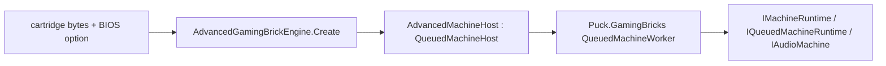

# Embedding the Advanced Gaming Brick

Puck.AdvancedGamingBrick models AGB hardware with a native ARM7TDMI machine:
CPU (ARM and Thumb instruction sets), PPU, APU, DMA, timers,
interrupts, cartridge, and link cable. It shares no CPU core with the SM83
compatibility machine in `Puck.HumbleGamingBrick`—only the master-clock and
link abstractions are shared where the hardware itself shares them. Snapshot,
fork, and queued off-thread hosting come from `Puck.GamingBricks`; this
project supplies only the AGB hardware itself.

Start with [Quick start](#quick-start) to run a cartridge in your own loop.
Read [Hosting](#hosting) for firmware, startup, and save behavior. The
[shared hosting contract](../shared/machine-hosting.md) owns threading, pacing,
output buffers, snapshots, and queued execution.

## Machine construction

- *A complete machine from one DI scope:* `AdvancedGamingBrickMachine` binds
  the CPU, bus, PPU, APU, timers, DMA, interrupt controller, serial
  controller, and cartridge from one scope, so a machine never shares
  stateful peripherals with another and a snapshot can capture it completely.
- *Direct boot or BIOS boot:* a cartridge can start at
  `AdvancedGamingBrickMachine.CartridgeEntryPoint` (0x08000000) with the CPU's
  registers seeded to their post-BIOS state, or execute native firmware from
  reset. The screen engine defaults to bundled Puck firmware and cold startup;
  fast startup and external firmware are independent choices.
- *Cartridge detection with a documented override table:*
  `AgbCartridge` scans the ROM for save-type strings; `AgbGameOverrides`
  corrects the known-broken minority (anti-piracy decoy strings,
  EEPROM-backed carts that bait with an SRAM string) by the 4-character game
  code, and also keys GPIO sensor presence (rumble, solar, tilt) off the same
  code.
- *A deterministic, instruction-atomic link cable:* `AgbLinkSession` connects
  two to four machines and steps whichever is furthest behind its own
  cumulative target, one instruction or halted idle cycle at a time, ties to the lowest index—a
  state-free rule, so a linked run replays identically. `Suspend`/`Resume`
  give a credit-preserving reconnect that requires every console to be
  transfer-idle first.
- *Queued, backpressured hosting:* `AdvancedGamingBrickEngine`
  (engine id `advanced-gaming-brick`) creates an `AdvancedMachineHost` that forwards
  the neutral machine surface to `Puck.GamingBricks`'s `QueuedMachineWorker`.

## Hosting



`AdvancedGamingBrickEngine` (`Id = "advanced-gaming-brick"`) is the
`IMachineEngine` implementation a host resolves by id. Its options
string accepts `cold` (the default), `fast`, and an optional final `bios=<path>`.
Without a path, the runtime package supplies Puck firmware; `bios=puck` selects
it explicitly. An external path consumes the remaining text, allowing spaces.
`direct`, unknown tokens, conflicting modes, and zero-filled BIOS files are
rejected. Fast startup skips the presentation but retains the selected BIOS
for software interrupts and IRQ dispatch during cartridge execution.

`stub` explicitly selects a zero-filled image for BIOS-independent diagnostics
and polling cartridges. It implements no BIOS services or IRQ handler and
always selects fast startup. Callers constructing `AdvancedMachineHost`
directly supply `biosImage` and may select `bootMode`; an explicit zero-filled array has the same
limitations as `stub`. Nonzero replacement BIOS images are accepted, but
their service completeness is the caller's responsibility.

The [native firmware guide](../../../src/Puck.AdvancedGamingBrick/Firmware/README.md) owns implementation coverage,
provenance and remaining compatibility limits. The image is dual-licensed
under Apache-2.0 or MIT and
embedded in the runtime package; an application does not need Forge, LLVM or
a separate BIOS download. `AgbFirmware.GetImage()` returns a private copy.
`AgbBiosKind.Puck` verifies exact bundled bytes, not retail cycle parity.

Battery saves use a flushed temporary file beside the destination followed
by replacement, so a failed write preserves the previous save and remains
pending for retry. Restoring or rewinding requests a flush independently of
the snapshot's dirty flag: the disk does not rewind with emulated memory.
A forced flush persists the current save even when its emulated flag is clean.

## Quick start

For a .NET 10 application with its own update loop, reference
`ByteTerrace.Puck.AdvancedGamingBrick` and construct the synchronous core.
NuGet supplies its managed dependencies; no Puck application, DI registration,
window, GPU backend, worker thread, or environment configuration is required.

```csharp
using Puck.AdvancedGamingBrick;
using Puck.Abstractions.Machines;

using var core = new AdvancedGamingBrickCore(
    cartridgeRom: File.ReadAllBytes(args[0])); // bundled firmware, native cold startup

core.ConfigureAudio(sampleRate: 48_000);
core.ApplyInput(input: new MachinePadState());
core.RunCycles(cycles: 280_896); // one nominal native frame at 16,777,216 Hz
uint[] pixels = core.Framebuffer.ToArray(); // 240 × 160, packed 0x00RRGGBB
short[] audio = new short[4096];
int sampleCount = core.DrainAudioSamples(destination: audio); // interleaved L/R
```

Supply `savePath` to opt into file-backed saves. With its default `null`,
saves stay in memory; `core.Instance.GetRequiredService<AgbCartridge>()`
exposes `SaveData` and `LoadSave` for a host's own persistence service.
The shared [core hosting contract](../shared/machine-hosting.md#synchronous-core-hosting)
covers threading, buffer lifetime, cycle pacing, audio and snapshots.

Pass `bootMode: MachineBootMode.Fast` to skip startup. For an external BIOS,
use `AgbFirmware.CreateConfiguration(cartridgeRom, bios: image, bootMode: mode)`.
The existing explicit `AgbMachineConfiguration(bios, rom)` and two-image core
constructor retain their fast diagnostic default; the lower-level machine
factory still leaves explicit boot execution to its caller.

`AgbMachineConfiguration.Options` takes an immutable `AgbMachineOptions`.
`DisableRtc` and `DisablePrefetch` are diagnostic hardware overrides, both
off by default. `BusTrace` is an optional synchronous `Action<string>`;
route it to your own logging sink. Each machine gets its own settings and
forks retain them. Effective RTC and prefetch behavior participates in typed
snapshot identity; the observational trace sink does not. A shared trace sink
must handle concurrent calls if the host steps forks concurrently.

Alternatively, this complete example creates Puck’s queued screen-machine adapter:

```csharp
using Puck.Abstractions.Machines;
using Puck.AdvancedGamingBrick;

IMachineEngine engine = new AdvancedGamingBrickEngine();

using IMachineRuntime machine = engine.Create(
    options: "fast",                // bundled BIOS, seeded cartridge handoff
    contentBytes: File.ReadAllBytes(args[0]),      // the cartridge ROM image
    savePath: null,            // in-memory battery saves for this example
    audioSampleRate: 48_000
);
machine.Advance(deltaTicks: Puck.Hosting.EngineTicks.PerSecond / 60UL);
```

`AgbMachineFactory.Create` is the lower-level path `AdvancedMachineHost`
itself builds on: it takes an `AgbMachineConfiguration` (BIOS + ROM bytes + options)
and an optional composition callback for pre-registering a decorating or
test-only subsystem—a tracing bus, a flat test bus—before the standard
`TryAddScoped` registrations defer to it. The factory returns an unbooted
machine; call `DirectBoot` for the seeded cartridge handoff or step it from
reset to execute the supplied BIOS. The synchronous core follows its configured
startup mode; its bundled-firmware convenience constructor defaults to cold boot.

## Core types

| Area | Types | Role |
|---|---|---|
| Machine | `AdvancedGamingBrickMachine`, `AgbMachineConfiguration`, `AgbMachineFactory`, `AdvancedGamingBrickServiceRegistration` | The composition root and per-machine startup configuration. |
| CPU | `Arm7Tdmi`, `Arm7Tdmi.Alu`, `Arm7Tdmi.Arm`, `Arm7Tdmi.Thumb`, `IArmCpu`, `ArmDisassembler`, `CpuMode`, `ShiftType` | The ARM7TDMI core, both instruction sets, and its disassembler. |
| Bus | `AgbBus`, `IAgbBus`, `BusAccessType`, `AgbScheduler` | The cycle-scheduled system bus every subsystem reads and writes through. |
| Video/audio | `AgbPpu`, `IAgbPpu`, `AgbApu`, `IAgbApu`, `ApuPulseChannel`, `ApuWaveChannel`, `ApuNoiseChannel` | The PPU and four-channel APU. |
| Timing/interrupts | `AgbTimerController`, `IAgbTimerController`, `AgbInterruptController`, `IAgbInterruptController`, `InterruptSource`, `AgbDmaController`, `IAgbDmaController` | Timers, the interrupt controller, and DMA. |
| Cartridge | `AgbCartridge`, `CartridgeBackup`, `AgbGameOverride`, `AgbGameOverrides` | ROM signature scanning and header game-code overrides for save/RTC/GPIO detection. |
| BIOS | `IBios`, `ReplacementBios`, `AgbBiosProfile`, `AgbFirmware` | The BIOS image contract, owned image storage, content-hash identification, and bundled firmware configuration. |
| Link | `AgbLinkCable`, `AgbLinkSession`, `AgbLinkResumeToken`, `IAgbLink`, `NullAgbLink`, `AgbSerialController`, `IAgbSerialController` | The deterministic, instruction-atomic multi-machine link cable. |
| Hosting | `AdvancedMachineHost`, `AdvancedGamingBrickEngine`, `AdvancedGamingBrickCore`, `AdvancedPad`, `AdvancedGamingBrickLookahead` | The `IMachineEngine` adapter over `Puck.GamingBricks`'s queued-host substrate. |

## Verification and further reading

The [AGB Post battery](../../../src/Puck.AdvancedGamingBrick.Post/README.md) owns
tiers, assets, diagnostics, and run instructions; embedding exercises the
synchronous core without a worker or graphics/audio device. Shared substrate
checks live in [Puck.GamingBricks.Tests](../../../tests/Puck.GamingBricks.Tests/README.md).

- [Advanced Gaming Brick](README.md) — hardware topics and evidence.
- [Performance techniques](performance-techniques.md) — execution equivalence and architectural constraints.
- [Machine hosting runtime](../shared/machine-hosting.md) — shared host obligations.
- [Project map](../../project-map.md) — dependency ownership.
- [GamingBricks license](../../../src/Puck.GamingBricks/LICENSE.md) — shared legal terms.
