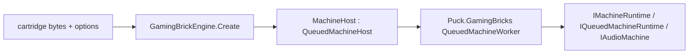

# Embedding the Humble Gaming Brick

Puck.HumbleGamingBrick is the shared SM83 machine that plays every DMG, MGB,
SGB, CGB, and AGB-compatibility hardware revision on one core—CPU, PPU, APU,
timers, DMA, cartridge mappers and battery saves, and serial/infrared/printer
link. Hardware differences (Color palette RAM, HDMA, double speed, the boot
handoff, the fetcher's row latch) are expressed as named capability gates read
off `ConsoleModel`, never as a forked implementation per console. Snapshot,
fork, and queued off-thread hosting come from `Puck.GamingBricks`; this project
supplies only the SM83-family hardware itself.

Start with [Quick start](#quick-start) to run a cartridge in your own loop.
Read [Hosting](#hosting) for engine options and [Firmware and startup](#firmware-and-startup)
for reset behavior. The [shared hosting contract](../shared/machine-hosting.md)
owns threading, pacing, output buffers, snapshots, and queued execution.

## Hardware selection

- *One core, every revision:* `ConsoleModel` is revision-valued
  (`Dmg0`…`DmgC`, `Mgb`, `Sgb`, `Sgb2`, `Cgb0`…`CgbE`, `Agb`, `Ags`), and
  components ask `ConsoleModelExtensions` a named question —
  `SupportsColor`, `LatchesFetchRowAtTileStep`, `HasAgbBootHandoff`,
  `SensesOwnInfraredLight`, `SeedsWaveRamOnBoot`, `LeavesBootChimeSounding`,
  `DeselectsJoypadOnBoot`—instead of comparing against a member. Each
  question's documentation states the hardware fact it answers.
- *A live, no-reboot device swap:* `Machine.SwitchModel` re-gates every
  color-path component and applies the per-ROM `ModePoke` recipes
  (`ConsoleModeRecipes`) that flip a cartridge's own cached hardware-detection
  bytes, so a running game re-renders natively on its new hardware with its
  shared-RAM progress untouched.
- *Queued, backpressured hosting:* `GamingBrickEngine` (engine id `gaming-brick`)
  creates the `MachineHost` runtime, which forwards the neutral
  `IMachineRuntime`/`IQueuedMachineRuntime`/`IAudioMachine`/`IFeedbackMachine`
  surface to `Puck.GamingBricks`'s `QueuedMachineWorker`, converting engine
  ticks to LCD-dot budgets through a remainder-carrying accumulator.
- *Deterministic peripheral link:* `SerialLinkSession` and `IrLinkSession`
  interleave two machines instruction-atomically, and `GamePrinterLinkSession`
  hands one machine's budget to the printer, so a cable, infrared, or printer
  session replays identically. The serial and infrared sessions are the one
  `LinkSession<TPort>` over their port, so both carry the same pacing credits
  through a suspend or a coupled rewind.
- *Exact timing:* `TickResolution` runs the timeline at sub-cycle granularity
  (quarter ticks by default), and `Ppu`/`HdmaController` reproduce the
  STAT/memory-lock schedule dot for dot.

## Hosting



`GamingBrickEngine` (`Id = "gaming-brick"`) is the `IMachineEngine`
implementation a host resolves by id; its options string is an
order-independent, space-separated token set—a model keyword plus an optional
`dmgspeed` fairness pin that holds the tick-to-cycle budget fixed regardless of
the KEY1 double-speed latch. A family token (`dmg`/`cgb`/`agb`, default `dmg`)
selects that family's target revision—`DmgC`, `CgbE`, `Agb`—and a revision
token (`dmg0`, `dmgb`, `dmgc`, `mgb`, `sgb`, `sgb2`, `cgb0`, `cgba`, `cgbb`,
`cgbc`, `cgbd`, `cgbe`, `ags`) names one exactly.

### Firmware and startup

The screen engine and the convenience `HumbleGamingBrickCore(model, cartridgeRom)`
constructor cold-boot through bundled Puck firmware. Each hardware revision has
its own generated image, embedded in the runtime package: consumers do not need
Forge, an assembler, or a separate firmware download. `HgbFirmware.GetImage(model)`
returns a private copy. Its generation and native presentation are owned by the
[Forge firmware guide](../../../src/Puck.HumbleGamingBrick.Forge/README.md).

Add `fast` to engine options, or pass `bootMode: MachineBootMode.Fast`, to begin
at the seeded handoff. The selected firmware still participates in snapshot
identity. `cgb fast bios=C:/Firmware Files/boot.bin` uses an external image;
the final `bios=` path consumes the remaining text. Ordinary cartridges and
Puck-authored cartridges use the same bundled firmware: header branding is not
an admission policy.

The low-level `MachineConfiguration` remains explicit for diagnostics. Without
an image it seeds the handoff; supplying an image defaults to executing it.
Its optional `bootMode` can skip execution while retaining that image. Cold
startup without an image is refused. Live model reconfiguration does not
replace the construction-fixed firmware or restart the machine.
Changing the model is refused while the boot ROM is still mapped; wait for
cartridge handoff first. Repeating the current model remains harmless during boot.

### Linked execution

GamingBrickEngine implements IMachineLinkingEngine for a point-to-point cable:
exactly two running machines are admitted. SerialLinkGroupCore connects their
SerialComponents and uses SerialLinkSession’s instruction-atomic interleave.
The [shared linked-group contract](../shared/machine-hosting.md#cable-linked-groups)
owns lending, per-seat input, publication, backpressure, severing, and coupled
time travel.

The group snapshot includes both machine snapshots, the session's `PacingCredits`,
and the medium’s completed-transfer count and traffic fingerprint. Those group
values are absent from either machine’s snapshot, so saving the members alone
cannot resume the cable. Cross-process transport is not implemented.

## Quick start

For a .NET 10 application with its own update loop, reference
`ByteTerrace.Puck.HumbleGamingBrick` and construct the synchronous core.
NuGet supplies its managed dependencies; no Puck application, DI registration,
window, GPU backend, worker thread, or environment configuration is required.

```csharp
using Puck.HumbleGamingBrick;
using Puck.Abstractions.Machines;

using var core = new HumbleGamingBrickCore(
    configuration: new MachineConfiguration(
        model: ConsoleModel.DmgC,
        cartridgeRom: File.ReadAllBytes(args[0])),
    dmgSpeed: true); // keep the reported pacing rate at the hardware dot rate

core.ConfigureAudio(sampleRate: 48_000);
core.ApplyInput(input: new MachinePadState());
core.RunCycles(cycles: 70_224); // one nominal DMG frame at 4,194,304 Hz
uint[] pixels = core.Framebuffer.ToArray(); // 160 × 144, packed 0x00RRGGBB
short[] audio = new short[4096];
int sampleCount = core.DrainAudioSamples(destination: audio); // interleaved L/R
```

The `MachineConfiguration` used in this example seeds the selected model's post-boot state. Supply `bootRom`
in `MachineConfiguration` to execute your own boot image from reset.
Supply the core's `savePath` to opt into file-backed saves; its default `null`
keeps saves in memory. For a custom persistence service, resolve
`Interfaces.ICartridge` from `core.Instance` and use
`ExportExternalRam`/`ImportExternalRam` plus
`ExportPersistentClock`/`ImportPersistentClock` for cartridges with clocks.
The shared [core hosting contract](../shared/machine-hosting.md#synchronous-core-hosting)
covers threading, buffer lifetime, cycle pacing, audio and snapshots.

Alternatively, this complete example creates Puck’s queued screen-machine adapter:

```csharp
using Puck.Abstractions.Machines;
using Puck.HumbleGamingBrick;

IMachineEngine engine = new GamingBrickEngine();

using IMachineRuntime machine = engine.Create(
    options: "cgb dmgspeed",       // the target Color revision, fixed-speed fairness pin
    contentBytes: File.ReadAllBytes(args[0]),     // the cartridge ROM image
    savePath: null,           // in-memory battery saves for this example
    audioSampleRate: 48_000
);
machine.Advance(deltaTicks: Puck.Hosting.EngineTicks.PerSecond / 60UL);
```

Constructing a `MachineConfiguration` and calling `MachineFactory.Create`
directly is the lower-level path `MachineHost` itself builds on. Omitting
`compose` selects the standard component set. A supplied callback owns
component registration; call `AddHumbleGamingBrickComponents()` there along
with custom registrations. Forks retain the configuration and composition.

## Peripherals and link

The bus hosts a cartridge (`RomOnlyCartridge`/`Mbc1`–`Mbc7`/`HuC1`/`HuC3`/
`Mmm01`, selected by `Cartridge.Load` from the ROM header) plus the serial
port, infrared port, and OAM/HDMA DMA controllers. `InfraredPort` is the one
infrared transceiver the CGB RP register and the HuC1/HuC3 cartridge IR windows
share; it carries a light level rather than a clocked bit, so it is a medium of
its own beside the serial cable. `GamePrinterDevice`/`GamePrinterLinkSession`
model the thermal printer as a device peer on the serial cable.
`CameraCartridge`/`GradientCameraSensor`/`SensorImage` and
`TiltSensorComponent` model the sensor-cartridge peripherals; `BootDivPrediction`
reproduces the per-revision boot-DIV seed a game can read to detect the console
at power-on. Its tables are also what the forge's authored boot ROMs
(`BootRomBuilder`) time themselves against, so the prediction and the program
that has to satisfy it read the same data.

## Core types

| Area | Types | Role |
|---|---|---|
| Machine | `Machine`, `ConsoleModel`, `ConsoleModelExtensions`, `MachineConfiguration`, `MachineFactory`, `MachineServiceRegistration` | The composition root and per-machine startup configuration. |
| Live swap | `ModePoke`, `ConsoleModeRecipes` | The boot-shim byte pokes that retarget a running cartridge's cached hardware-detection state. |
| CPU/bus | `Sm83`, `Sm83.Alu`, `Sm83.Decode`, `Sm83Disassembler`, `SystemBus`, `SystemMemory`, `MemoryMap` | The SM83 core and its addressable memory map. |
| Video | `Ppu`, `HdmaController`, `Framebuffer` | The STAT-accurate pixel pipeline and DMA-driven video RAM transfer. |
| Audio | `ApuComponent`, `ApuGeneratorClock`, `AudioOutputComponent` | The four-channel APU and its host-facing output ring. |
| Cartridges | `Cartridge`, `CartridgeHeader`, `CartridgeBase`, `MapperKind`, `RomOnlyCartridge`, `Mbc1Cartridge`…`Mbc7Cartridge`, `HuC1Cartridge`, `HuC3Cartridge`, `Mmm01Cartridge`, `CameraCartridge` | Header-selected mapper implementations and the camera peripheral. |
| Link | `LinkSession<TPort>`, `LinkResumeToken`, `SerialComponent`, `SerialLinkSession`, `InfraredPort`, `IrLinkSession`, `IInfraredPeer`, `IInfraredCartridge`, `GamePrinterDevice`, `GamePrinterLinkSession` | The deterministic serial/infrared/printer link sessions. |
| Hosting | `MachineHost`, `GamingBrickEngine`, `HumbleGamingBrickCore`, `BrickPad`, `HumbleGamingBrickLookahead`, `SerialLinkGroupCore` | The `IMachineEngine`/`IMachineLinkingEngine` adapter over `Puck.GamingBricks`'s queued-host and cable-link substrate. |

## Verification and further reading

The [HGB Post battery](../../../src/Puck.HumbleGamingBrick.Post/README.md) owns
tiers, assets, diagnostics, and run instructions; embedding exercises the
synchronous core without a worker or graphics/audio device. Shared substrate
checks live in [Puck.GamingBricks.Tests](../../../tests/Puck.GamingBricks.Tests/README.md).

- [Humble Gaming Brick](README.md) — hardware topics and evidence.
- [Machine hosting runtime](../shared/machine-hosting.md) — shared host obligations.
- [Project map](../../project-map.md) — dependency ownership.
- [GamingBricks license](../../../src/Puck.GamingBricks/LICENSE.md) — shared legal terms.
