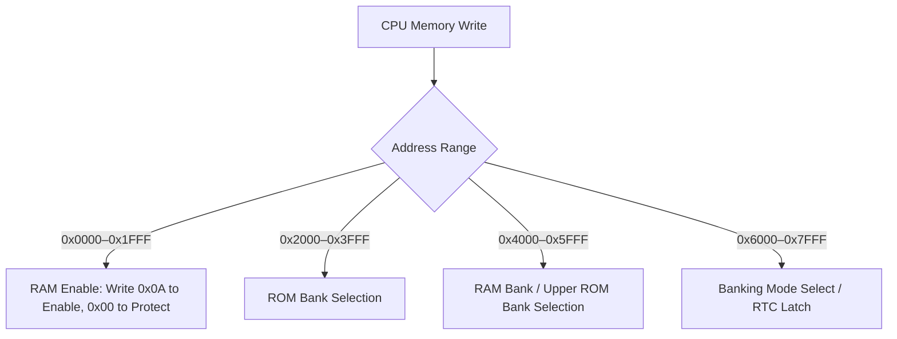

# MBC Mappers & Memory Banking

The Game Boy's 16-bit address bus allocates only **32 KB for ROM** (`0x0000–0x7FFF`) and **8 KB for external cartridge RAM** (`0xA000–0xBFFF`). To accommodate larger commercial games, cartridges incorporate **Memory Bank Controllers (MBCs)**—custom integrated circuits that intercept bus writes and dynamically switch ROM and RAM banks into the CPU's address space.

---

## Universal Mapper Principles

All standard Game Boy mappers adhere to common bus conventions:

1. **Write-Only Control**: Mapper registers are mapped to ROM address space (`0x0000–0x7FFF`). Writing to these addresses modifies mapper state without altering ROM data.
2. **RAM Write Protection**: External battery-backed SRAM is disabled by default. Games must write value `0x0A` to `0x0000–0x1FFF` to enable read/write access. Any other value write-protects the RAM, preventing corruption during power-down.

---

## Supported Mappers in `Puck.HumbleGamingBrick`

### 1. ROM-Only (`RomOnlyCartridge`)
- **ROM Capacity**: Exactly 32 KB (Banks 00 and 01 mapped continuously at `0x0000–0x7FFF`).
- **RAM Capacity**: None or 8 KB non-banked SRAM at `0xA000–0xBFFF`.
- Used in early launch titles (*Tetris*, *Dr. Mario*).

### 2. MBC1 (`Mbc1Cartridge`)
The first and most widespread banking chip, supporting up to **2 MB ROM** (128 banks) and **32 KB RAM** (4 banks):
- **Bank 0 Bug**: The ROM bank register cannot select Bank 0. Writing `0x00` automatically translates to Bank `0x01`. Consequently, banks `0x20`, `0x40`, and `0x60` cannot be mapped because their 5-bit register translates to `0x21`, `0x41`, and `0x61`.
- **Mode Select (`0x6000–0x7FFF`)**:
  - **Mode 0 (16M/8K)**: The 2-bit secondary register controls upper ROM bits (A19, A20), allowing 2 MB ROM with 8 KB RAM.
  - **Mode 1 (4M/32K)**: The 2-bit register controls RAM banking (Banks 0–3 at `0xA000–0xBFFF`), while also remapping Bank 0 in the lower slot `0x0000–0x3FFF`.
- **Multicart Wiring**: Custom multicart variants wire address lines differently, swapping 512 KB compilation boundaries.

### 3. MBC2 (`Mbc2Cartridge`)
Designed for cost-sensitive games (*Kirby's Pinball Land*, *Final Fantasy Legend*):
- **Integrated RAM**: Built-in 512 × 4-bit nibble RAM at `0xA000–0xA1FF`. Upper 4 bits of each byte return open bus values.
- **Address Bit A8 Register Demux**:
  - Writes to `0x0000–0x3FFF` with `A8 = 0` control the RAM enable latch.
  - Writes to `0x0000–0x3FFF` with `A8 = 1` control the 4-bit ROM bank register (16 banks, up to 256 KB ROM).

### 4. MBC3 (`Mbc3Cartridge`)
The standard for large RPGs (*Pokémon Red/Blue/Gold/Silver*):
- **ROM Capacity**: Up to 2 MB ROM and 32 KB RAM.
- **Real-Time Clock (RTC)**: Integrates an independent hardware clock running from a 32.768 kHz quartz crystal:
  - `0x08`: RTC Seconds (0–59)
  - `0x09`: RTC Minutes (0–59)
  - `0x0A`: RTC Hours (0–23)
  - `0x0B`: RTC Day Counter Low (Bits 0–7)
  - `0x0C`: RTC Day Counter High (Bit 0: Day bit 8, Bit 6: Halt flag, Bit 7: Day carry overflow flag)
- **RTC Latch Sequence**: Writing `0x00` followed by `0x01` to `0x6000–0x7FFF` latches current time into read registers, allowing atomic multi-byte clock reads.

### 5. MBC5 (`Mbc5Cartridge`)
The modern workhorse mapper, supporting up to **8 MB ROM** and **128 KB RAM**:
- **9-bit ROM Banking**: Low 8 bits written to `0x2000–0x2FFF`; 9th bit written to `0x3000–0x3FFF`.
- **True Bank 0 Mapping**: Completely removes the MBC1 bank-translation bug. Bank 00 can be cleanly mapped to `0x4000–0x7FFF`.
- **High-Speed RAM**: Supports 16 RAM banks (up to 128 KB) switched via `0x4000–0x4FFF`.

### 6. MBC7 — Accelerometer Tilt Sensor (`Mbc7Cartridge`)
Featured in *Kirby Tilt 'n' Tumble* and *Command Master*:
- Integrates an analog 2-axis accelerometer and a 256-byte 93LC56 SPI EEPROM.
- Cartridge reads return acceleration vectors along X and Y axes, mapped directly into Puck's input and physics bindings.

### 7. HuC-1 & HuC-3 — Infrared Transceiver Mappers (`HuC1Cartridge`, `HuC3Cartridge`)
Developed by Hudson Soft (*Pokémon Card GB*):
- Incorporates an infrared LED emitter and photodiode receiver directly into the cartridge shell.
- HuC-3 adds a sound synth chip and an internal microcontroller handling RTC functions.

### 8. MMM01 — Multi-Game Compilation Mapper (`Mmm01Cartridge`)
Used in compilation cartridges (*Taito Variety Pack*, *Momotarou Collection*):
- Boots in an initialization mode where the mapper registers configure the base address and size of a sub-cartridge.
- Once the bootloader selects a game, it locks the mapper configuration; the cartridge subsequently behaves as an immutable MBC1 or ROM-only game until the next hard reset.

### 9. Game Boy Camera (`CameraCartridge`)
- Integrates a 128×128 pixel CMOS image sensor matrix (`Mitsubishi M64282FP`).
- Features programmable exposure time registers, matrix gain, edge enhancement algorithms, and 2D dithering matrices.
- In Puck, the Camera cartridge binds to diegetic world textures or virtual camera feeds, allowing in-game characters to take real camera photos of the signed-distance world!
