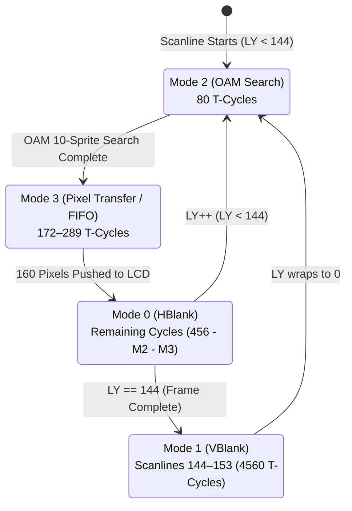

# PPU Scanlines & Pixel FIFO

The **Picture Processing Unit (PPU)** generates the Game Boy's video signal. It outputs a 160×144 pixel display refreshed at approximately 59.7275 Hz. Rather than drawing full frames in a single pass, the PPU operates as an exact raster scanline state machine synchronized to the dot clock.

---

## Scanline State Machine & Timing

A single video frame comprises **154 scanlines** (numbered 0 to 153). Each scanline consumes exactly **456 T-cycles**, yielding **70,224 T-cycles per frame**:



### 1. Mode 2 — OAM Search (80 T-cycles)
At the start of lines 0–143, the PPU searches Object Attribute Memory (`0xFE00–0xFE9F`, 40 sprite slots):
- It evaluates 2 sprites every M-cycle (4 T-cycles).
- It selects up to **10 sprites** whose vertical span ($Y \le \text{LY} + 16 < Y + \text{SpriteHeight}$) intersects the current scanline.
- Any remaining sprites on the line are dropped (sprite limit).
- **Bus Lockout**: The CPU cannot read or write OAM during Mode 2; reads return `0xFF`.

### 2. Mode 3 — Pixel Transfer & FIFO (172–289 T-cycles)
The PPU renders the 160 pixels of the scanline using a hardware **Pixel FIFO**:
- **Variable Duration**: Mode 3 is not fixed in length. Its duration depends on:
  - Fine horizontal scroll offset (`SCX % 8` causes 0 to 7 discarded pixels).
  - Window activation penalties (re-fetching tile rows causes pipeline stalls).
  - Sprite penalties: each active sprite requires pausing the background fetcher for up to 6 cycles to fetch sprite tile patterns.
- **Bus Lockout**: The CPU cannot read or write VRAM, OAM, or CGB Palette RAM during Mode 3.

### 3. Mode 0 — Horizontal Blanking (87–204 T-cycles)
Mode 0 covers the remaining cycles of the scanline after pixel 160 is displayed:
- The CPU has unrestricted access to VRAM and OAM.
- On Game Boy Color, Mode 0 triggers **HBlank DMA (HDMA)** transfers (copying 16 bytes per scanline).

### 4. Mode 1 — Vertical Blanking (4,560 T-cycles)
Lines 144 to 153 comprise VBlank. The beam resets to the top-left of the screen:
- At cycle 0 of line 144, the VBlank interrupt flag (`IF` bit 0) is set.
- The CPU has full unrestricted access to all display memory throughout Mode 1.

---

## The Pixel FIFO Architecture

Physical Game Boy hardware does not rasterize tiles linearly into a frame buffer; it uses an 8-pixel **FIFO queue** connected to a background fetcher and sprite overlay mixer:

```mermaid
flowchart LR
    subgraph Tile Fetcher
        TF[Tile Index Fetch] --> TLow[Tile Data Low Fetch]
        TLow --> THigh[Tile Data High Fetch]
        THigh --> Push[Push 8 Pixels to FIFO]
    end

    subgraph Pixel FIFO
        Push --> BGFIFO[Background/Window FIFO (8-16 pixels)]
        BGFIFO --> Mixer[Pixel Mixer]
        SpriteFIFO[Sprite FIFO] --> Mixer
        Mixer --> LCD[LCD Output (1 pixel / dot)]
    end
```

### The 4-Step Fetcher Loop
The fetcher runs every 2 M-cycles (8 T-cycles) to load the next 8 pixels:
1. **Get Tile Index**: Reads tile number from background map (`0x9800` or `0x9C00`).
2. **Get Tile Data Low**: Reads the low bitplane byte from VRAM tile pattern table.
3. **Get Tile Data High**: Reads the high bitplane byte from VRAM tile pattern table.
4. **Sleep / Push**: Waits until the FIFO has 8 or fewer pixels, then unpacks the two bitplanes into 8 color indices (0–3) and enqueues them.

### Sprite Mixing & Priority
When an active sprite reaches the current X coordinate, the fetcher stalls to load sprite tile patterns into the `Sprite FIFO`. The `Pixel Mixer` outputs the winning color:
- If a sprite pixel has non-zero color and priority over the background (or background pixel is color 0), the sprite pixel is rendered.
- Otherwise, the background/window pixel is rendered.
- On DMG, ties between overlapping sprites are broken by lowest X coordinate (or lowest OAM index if X is identical). On CGB, ties are strictly broken by OAM index order.

---

## Palette Systems & Color Conversion

| Feature | DMG (Monochrome) | CGB (Game Boy Color) |
|---|---|---|
| **Palette Registers** | `BGP`, `OBP0`, `OBP1` (`0xFF47–0xFF49`) | `BCPS/BCPD`, `OCPS/OCPD` (`0xFF68–0xFF6B`) |
| **Color Depth** | 2-bit index mapping to 4 grayscale shades | 15-bit RGB555 (32,768 colors) |
| **Palette Count** | 1 BG palette, 2 Sprite palettes | 8 BG palettes, 8 Sprite palettes (64 total colors) |
| **VRAM Capacity** | 8 KB (1 bank) | 16 KB (2 banks of 8 KB each, switched via `VBK`) |

On CGB, VRAM Bank 1 stores tile attribute bytes defining:
- Bits 0–2: Palette number (0–7).
- Bit 3: Tile VRAM bank source (Bank 0 or Bank 1).
- Bit 5: Horizontal flip (`X-Flip`).
- Bit 6: Vertical flip (`Y-Flip`).
- Bit 7: Background-to-OBJ priority flag.

---

## Direct Memory Access (DMA)

### Standard OAM DMA (`0xFF46`)
Writing address byte $XX$ to `0xFF46` triggers a high-speed transfer of 160 bytes from source address `$XX00–$XX9F` into OAM (`0xFE00–0xFE9F`):
- Takes exactly **160 M-cycles** (640 T-cycles).
- During transfer, the CPU can only execute instructions from High RAM (`HRAM`, `0xFF80–0xFFFE`).

### CGB General DMA (GDMA) & HBlank DMA (HDMA)
Controlled via registers `HDMA1–HDMA5` (`0xFF51–0xFF55`):
- **GDMA**: Copies blocks of 16 to 2,048 bytes from ROM/RAM to VRAM continuously, stalling the CPU until transfer completes.
- **HDMA**: Copies 16 bytes during each HBlank period (Mode 0), allowing games to stream full animated tile patterns without screen tearing or stalling active gameplay.
