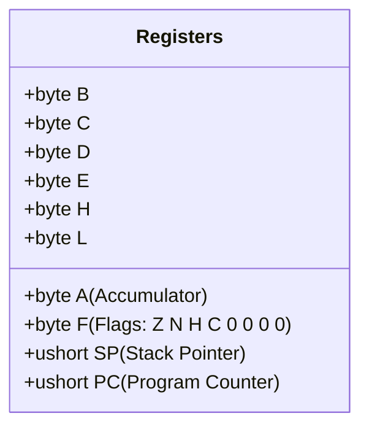

# SM83 CPU & Instruction Timing

The **Sharp SM83** is the custom 8-bit processor powering the Game Boy family. A hybrid between the Intel 8080 and Zilog Z80, it omits the Z80's shadow registers (`AF'`, `BC'`, etc.), index registers (`IX`, `IY`), and dedicated I/O instructions (`IN`/`OUT`), while introducing unique 16-bit autoincrement memory addressing (`LD [HL+], A`, `LD [HL-], A`) and high-page I/O access (`LDH [C], A`, `LDH [a8], A`).

---

## Register File & Flag Architecture

The SM83 provides eight 8-bit general-purpose registers that can be paired into 16-bit composite registers:



### The Flags Register (`F`)
The lower 4 bits of register `F` are hardwired to zero. The upper 4 bits indicate arithmetic status:
- **Bit 7 — Zero Flag (`Z`)**: Set if an ALU result is zero.
- **Bit 6 — Subtraction Flag (`N`)**: Set if the preceding operation was a subtraction (`SUB`, `SBC`, `CP`, `DEC`).
- **Bit 5 — Half Carry Flag (`H`)**: Set if carry occurred from bit 3 to bit 4 in an 8-bit operation, or from bit 11 to bit 12 in a 16-bit operation (`ADD HL, rr`).
- **Bit 4 — Carry Flag (`C`)**: Set if carry occurred from bit 7 (overflow) or bit 15 in 16-bit additions.

### Decimal Adjust Accumulator (`DAA`)
The `DAA` instruction adjusts the binary result of an addition or subtraction into valid Packed Binary Coded Decimal (BCD). Puck's `Sm83.Alu.cs` evaluates the exact hardware correction table:
- If $N=0$ (addition): add $0\text{x}06$ to `A` if $H=1$ or $(A \ \& \ 0\text{x}0\text{F}) > 9$; add $0\text{x}60$ to `A` and set $C$ if $C=1$ or $A > 0\text{x}99$.
- If $N=1$ (subtraction): subtract $0\text{x}06$ from `A` if $H=1$; subtract $0\text{x}60$ from `A` if $C=1$.

---

## Cycle Timing & Instruction Decoding

All SM83 execution timings are exact multiples of **4 T-cycles** (1 M-cycle). The CPU cannot advance or interact with memory faster than 1 M-cycle:

| Instruction Class | M-Cycles | T-Cycles (DMG) | T-Cycles (CGB 2x) | Example |
|---|---|---|---|---|
| Register-to-Register | 1 | 4 | 2 | `LD A, B`, `ADD A, C`, `NOP` |
| Immediate / Memory Read | 2 | 8 | 4 | `LD A, d8`, `LD A, [HL]` |
| 16-bit ALU / Conditional Jump (Untaken) | 2 | 8 | 4 | `ADD HL, BC`, `JR NZ, r8` (untaken) |
| Conditional Jump (Taken) / Memory Write | 3 | 12 | 6 | `JR NZ, r8` (taken), `LD [HL], d8` |
| Subroutine Call / Push | 4 | 16 | 8 | `CALL a16`, `PUSH BC` |
| Subroutine Return | 4 | 16 | 8 | `RET` |
| Conditional Return (Taken) | 5 | 20 | 10 | `RET Z` (taken) |

### Prefix 0xCB Bit Operations
Opcode `0xCB` switches the decoder to an alternate 256-instruction table:
- `RLC`, `RRC`, `RL`, `RR`: Rotate through/without carry.
- `SLA`, `SRA`, `SRL`: Arithmetic and logical shifts.
- `SWAP`: Swaps the high and low 4-bit nibbles of a byte.
- `BIT b, r`: Tests bit $b$; sets $Z$ flag, preserves $C$, sets $H$, clears $N$.
- `RES b, r`: Clears bit $b$.
- `SET b, r`: Sets bit $b$.

---

## The Hardware HALT Bug

The `HALT` instruction enters a low-power mode, pausing instruction execution until an interrupt occurs. However, physical SM83 silicon contains a famous pipelining bug:

> [!WARNING]
> **The HALT Bug**: When `HALT` executes while the Interrupt Master Enable flag is **disabled** (`IME = 0`) but an interrupt is already **pending** (`IE & IF != 0`), the CPU fails to enter low-power sleep and **fails to increment `PC` on the subsequent instruction fetch**.

As a result, the opcode byte immediately following `HALT` is fetched twice:
1. The CPU reads the byte at `PC` and executes it.
2. The `PC` remains unchanged.
3. The CPU reads the exact same byte at `PC` again as the start of the next instruction.

Puck's `Sm83.cs` faithfully replicates this hardware glitch dot-for-dot; commercial games (and Mooneye test ROMs) that rely on the double-read glitch execute with bit-for-bit parity.

---

## Interrupt Controller Architecture

The SM83 features 5 maskable hardware interrupt sources prioritized by address vector:

```mermaid
flowchart LR
    Sources[Interrupt Sources<br/>VBlank, STAT, Timer, Serial, Joypad] --> IF[IF Register (0xFF0F)]
    IF --> AND{AND}
    IE[IE Register (0xFFFF)] --> AND
    AND --> IME{IME == 1?}
    IME -->|Yes| Dispatch[Interrupt Service Routine Dispatch]
    Dispatch --> PushPC[Push PC to Stack (2 M-cycles)]
    PushPC --> JumpVector[Jump to Vector (1 M-cycle)]
```

| Priority | Interrupt Name | Vector Address | Trigger Condition |
|---|---|---|---|
| **1 (Highest)** | VBlank | `0x0040` | PPU enters VBlank (scanline 144). |
| **2** | LCD STAT | `0x0048` | Selected STAT condition met (HBlank, VBlank, OAM, LY=LYC). |
| **3** | Timer | `0x0050` | `TIMA` overflow (transition from `0xFF` to `0x00`). |
| **4** | Serial | `0x0058` | Serial link 8-bit shift transfer completes. |
| **5 (Lowest)** | Joypad | `0x0060` | High-to-low pin transition on P10–P13 keypad lines. |

### The 5 M-Cycle Dispatch Schedule
When an interrupt is serviced:
1. **Cycle 1–2**: Internal latency waitstates; `IME` is reset to zero.
2. **Cycle 3**: High byte of `PC` is pushed onto the stack; `SP` decrements.
3. **Cycle 4**: Low byte of `PC` is pushed onto the stack; `SP` decrements.
4. **Cycle 5**: `PC` is loaded with the interrupt vector address (`0x0040`–`0x0060`); the corresponding bit in `IF` is automatically cleared.

---

## Double-Speed Mode (`KEY1` & `STOP`)

On Game Boy Color hardware, the CPU can operate at **8.388608 MHz** (double speed):
1. Software writes `0x01` to register `KEY1` (`0xFF4D`), arming the speed switch.
2. Software executes the `STOP` instruction.
3. The oscillator PLL locks onto the high frequency, pausing for approximately 2,050 M-cycles while the hardware re-locks clocks.
4. Execution resumes with bit 7 of `KEY1` set (`CurrentSpeed = 1`). In double speed, CPU M-cycles take only 2 base master clock cycles instead of 4, while the PPU and APU remain locked to their standard 4.194304 MHz clock domains.
