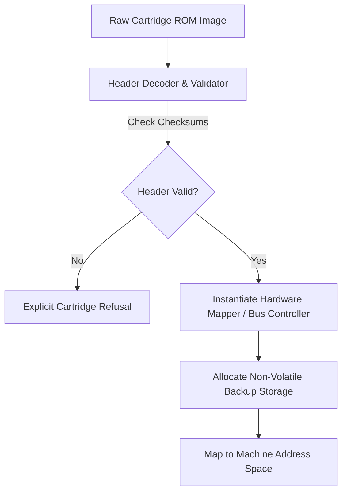

# Universal cartridge contracts and storage

Humble Gaming Brick (HGB) and Advanced Gaming Brick (AGB) cartridges enter
their machines through different header formats and bus maps. This page names
the fields that admission validates and describes how mapper state and
persistent storage reach the hosted machine.

This document outlines how ROM cartridges, header metadata, memory mapping, and persistent battery saves are validated and hosted across Puck's Gaming Bricks.

---

## Cartridge header contracts

Every cartridge loaded into a Gaming Brick must supply valid header metadata. The loader uses this metadata to instantiate the correct memory mapper, allocate backup storage, and configure hardware capability gates:

### 1. 8-bit cartridge headers (HGB / SM83)
Located at addresses `0x0100–0x014F` in ROM:
- **`0x0100–0x0103`**: Entry point jump instruction (`nop; jp 0x0150`).
- **`0x0104–0x0133`**: Nintendo logo bitmap bytes (validated by cold-boot firmware).
- **`0x0134–0x0143`**: Title string, CGB flag (`0x80` = backwards compatible, `0xC0` = CGB-only).
- **`0x0144–0x0145`**: New licensee code (ASCII).
- **`0x0146`**: SGB flag (`0x03` = SGB enhanced functions).
- **`0x0147`**: Cartridge type (specifies ROM-only, MBC1, MBC2, MBC3, MBC5, MBC7, HuC1, etc.).
- **`0x0148`**: ROM size code ($32\text{ KB} \times 2^N$).
- **`0x0149`**: RAM size code (None, 2 KB, 8 KB, 32 KB, 64 KB, 128 KB).
- **`0x014D`**: Header checksum: 8-bit negative sum of bytes `0x0134–0x014C`. Must pass or the boot ROM halts.

### 2. 32-bit cartridge headers (AGB / ARM7TDMI)
Located at addresses `0x08000000–0x080000BF` in ROM:
- **`0x00–0x03`**: 32-bit ARM branch instruction to game entry point.
- **`0x04–0x9F`**: Compressed Nintendo logo bitmap.
- **`0xA0–0xAB`**: Game title (12 uppercase ASCII characters).
- **`0xAC–0xAF`**: Game code (4 characters, e.g. `BPEE` for Pokémon Emerald).
- **`0xB0–0xB1`**: Maker code.
- **`0xB2`**: Fixed value (`0x96`).
- **`0xBD`**: Complement check (validated by AGB BIOS during boot handoff).

---

## Memory banking and bus mapping

Cartridges interface with the emulated machine via a memory bus that partitions address space into fixed segments and bankable windows:

| Address Range (HGB) | Bus Allocation | Behavior |
|---|---|---|
| `0x0000–0x3FFF` | ROM Bank 00 | Fixed primary code bank (mirrored/swapped in some multicarts). |
| `0x4000–0x7FFF` | ROM Bank 01–NN | Switched via mapper registers; bank size 16 KB. |
| `0xA000–0xBFFF` | External RAM / RTC | Battery-backed save RAM (8 KB banks) or Real-Time Clock registers. |

| Address Range (AGB) | Bus Allocation | Behavior |
|---|---|---|
| `0x08000000–0x09FFFFFF` | Game Pak ROM (Waitstate 0) | Up to 32 MB linear address space. Access timings governed by `WAITCNT`. |
| `0x0E000000–0x0E00FFFF` | Game Pak SRAM / Flash | 8-bit bus window for backup memory controllers. |

---

## Backup storage persistence

The host persists player save data per cartridge using the following modeled
storage paths:

1. **Storage Formats**:
   - **SRAM**: Linear byte arrays (typically 8 KB to 64 KB), persisted directly to disk companion files.
   - **Flash Memory**: 64 KB (512 kbit) or 128 KB (1 Mbit) with sector-erase, chip-erase, and manufacturer ID state machines.
   - **EEPROM**: 512-byte (4 kbit) or 8 KB (64 kbit) serial memory driven by
     the cartridge's serial command protocol.
   - **Real-Time Clock (RTC)**: Latched timestamp registers with persistent base epoch offsets, advancing on recorded tick steps.
2. **Crash-Resilient Flushing**: Save RAM flushes occur on designated timer intervals, cartridge ejection, or machine shutdown using atomic temporary file swaps to prevent corruption.
3. **Replay Immutability**: During deterministic replay runs, backup memory is sandboxed: replay tapes record initial save state hashes and external inputs, executing without overwriting live player save data.
