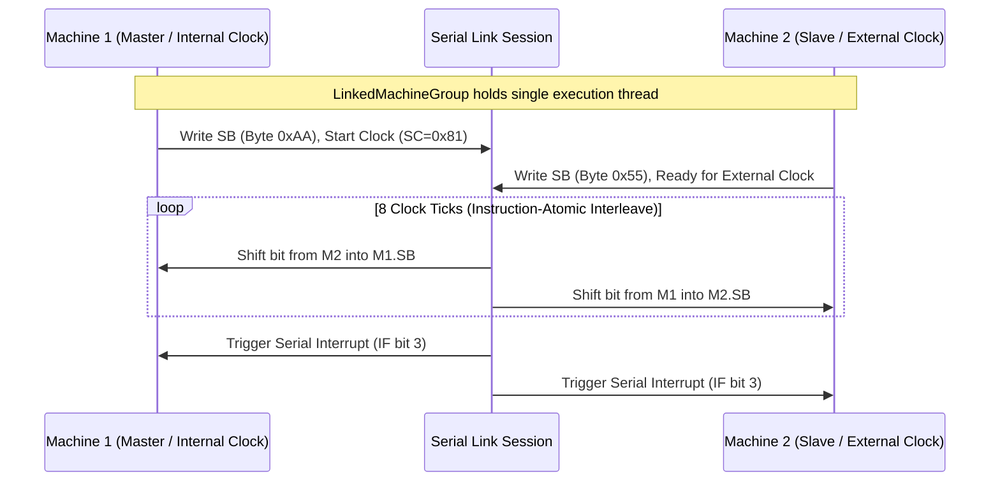

# Serial link cables and multi-device sessions

Puck models serial links as part of the emulated bus. A linked session owns a
deterministic interleave for its machines, exchanges the low-level byte shifts
exposed by the serial hardware, and keeps each host's video, audio, and input
surfaces separate.

---

## Serial cable architecture

In physical hardware (e.g., the Game Boy Serial Port or GBA Serial Communication Port), two consoles connect via a cable containing serial clock (`SC`), serial data in (`SI`), serial data out (`SO`), and ground lines.

### The linked machine group

When two machines link (e.g. two players sitting at connected arcade cabinets or holding tethered handhelds), the engine constructs a `LinkedMachineGroup`:

1. **Worker Quiescence**: The host quiesces each machine's individual `QueuedMachineWorker` at a frame boundary.
2. **Unified Link Thread**: Both cores lend their execution state to a single shared execution thread.
3. **Instruction-Atomic Interleaving**: `SerialLinkSession` advances the two machines instruction-by-instruction. When one machine triggers a serial transfer, both cores step in lockstep until the 8-bit shift register exchange completes.
4. **Individual Output Publishing**: Each linked console continues publishing its own framebuffer, audio stream, and input state through its existing host instance. Spatial audio and display surfaces remain separate in the world.
5. **Severing the cable**: Disposing the link detaches the serial peers and
   returns both machines to their independent worker threads. Any unfinished
   transfer driven by an external clock remains pending on the port, matching
   the modeled port state.

---

## Pacing credits and overshoot compensation

Because the two emulated consoles may have minor variations in interrupt timing or execution speed, `SerialLinkSession` employs a deterministic pacing credit system (`SerialLinkSession.PacingCredits`):

- If one machine advances slightly ahead while waiting for a serial handshake, it earns overshoot credits.
- Once a handshake begins, the faster machine stalls its clock cycles until the slower machine catches up.
- Snapshot captures (`SerialLinkGroupCore.CaptureState`) include both machines' full memory states, the pacing credit balance, and the completed transfer count. Replaying the link session reproduces the exact same byte transfers without desynchronization.

---

## Infrared and peripheral emulation

Beyond standard copper link cables, Puck emulates non-serial peripherals through dedicated session adapters:

### Infrared link (`IrLinkSession`)
- Emulates the CGB built-in infrared transceiver (`InfraredPort`) and cartridge-based transceivers (`HuC1Cartridge`, `HuC3Cartridge`).
- Handles LED pulse modulation, line-of-sight signal attenuation, and half-duplex packet transmission.

### Game Boy Printer (`GamePrinterDevice`)
- Emulates the external thermal printer connected via serial cable (`GamePrinterLinkSession`).
- Decodes the printer packet protocol: Magic bytes (`0x88, 0x33`), Commands (`Initialize`, `Print`, `Transfer Data`), 2-bit tile data decompression, exposure/contrast settings, and printout generation (`GamePrintout`).
- Emitted printouts can be held as physical paper items in the player's world inventory or pinned to corkboards in the game environment.
