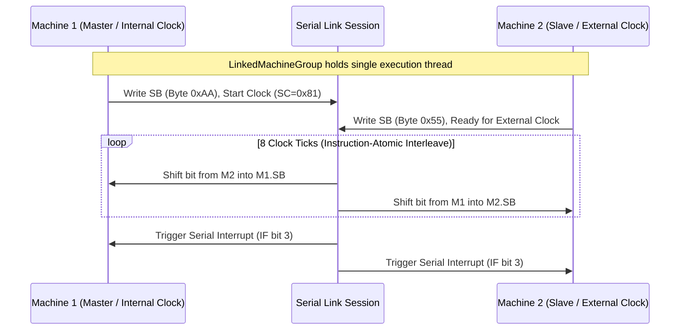

# Serial link cables and multi-device sessions

Puck models serial links as part of the emulated bus. A linked session owns a
deterministic interleave for its machines, exchanges the low-level byte shifts
exposed by the serial hardware, and keeps each host's video, audio, and input
surfaces separate.

---

## Serial cable architecture

In physical hardware (e.g., the Game Boy Serial Port or GBA Serial Communication Port), two consoles connect via a cable containing serial clock (`SC`), serial data in (`SI`), serial data out (`SO`), and ground lines.

### The linked machine group

When two machines link (e.g. two players sitting at connected arcade cabinets or holding tethered handhelds), the engine constructs a `LinkedMachineGroup`:

1. **Worker Quiescence**: The host quiesces each machine's individual `QueuedMachineWorker` at a frame boundary.
2. **Unified Link Thread**: Both cores lend their execution state to a single shared execution thread.
3. **Instruction-Atomic Interleaving**: `SerialLinkSession` advances the two machines instruction-by-instruction. When one machine triggers a serial transfer, both cores step in lockstep until the 8-bit shift register exchange completes.
4. **Individual Output Publishing**: Each linked console continues publishing its own framebuffer, audio stream, and input state through its existing host instance. Spatial audio and display surfaces remain separate in the world.
5. **Severing the cable**: Disposing the link detaches the serial peers and
   returns both machines to their independent worker threads. Any unfinished
   transfer driven by an external clock remains pending on the port, matching
   the modeled port state.

---

## Pacing credits and overshoot compensation

`SerialLinkSession` and `IrLinkSession` are the one `LinkSession<TPort>` over
their port, and both pace the pair the same way:

- Each budget moves both machines' cumulative targets forward by the same
  number of T-cycles, and the furthest-behind machine steps one instruction at
  a time until both reach their targets.
- An instruction usually ends a few cycles past its target. That overshoot is
  the machine's pacing credit, and it carries into the next budget instead of
  accumulating as drift.
- The credits are session state, not machine state. `Suspend` severs the link
  and returns them as a `LinkResumeToken` for the resume constructor. A live
  link reads them through `PacingCredits` and restores them through
  `ReanchorPacing`, which is the path a coupled rewind takes.
- A hosted serial link's snapshot (`SerialLinkGroupCore.CaptureState`)
  includes both machines' full states, the pacing credits, the completed
  transfer count, and a traffic fingerprint. Replaying the link session
  reproduces the exact same byte transfers without desynchronization.

---

## Infrared and peripheral emulation

Two more media ride the same pacing: an infrared link between two machines, and
a printer on one machine's serial cable.

### Infrared link (`IrLinkSession`)

- Each machine has one infrared transceiver, `InfraredPort`. The CGB infrared
  register (RP, `0xFF56`) and the HuC1/HuC3 cartridge IR windows are two
  register views of it: a cartridge implementing `IInfraredCartridge` is handed
  the machine's transceiver rather than modelling its own.
- Infrared carries a light level, not a clocked bit stream, so there is no
  shift edge to arbitrate. A machine emits light when its RP LED bit or a
  cartridge IR-mode LED write is set. It receives its linked peer's emitted
  light, as that peer stood at its last instruction boundary, OR-ed with its
  own emitted light where the hardware senses its own LED.
- The light is digital. Puck does not model the receiver's analog warm-up and
  decay, distance, or line-of-sight attenuation, and it does not packetize the
  exchange; the game software times its own pulses.
- `IrLinkSession` is `LinkSession<InfraredPort>`, so it carries the pacing
  credits above through `Suspend` and a coupled rewind. Disposing it returns
  both received lines to dark.
- `IrLinkSession` pairs two machines directly. The hosted linked machine group
  wires only the serial cable (`SerialLinkGroupCore`), and the Humble battery's
  infrared stages exercise the infrared link.

### Game Boy Printer (`GamePrinterDevice`)
- Emulates the external thermal printer connected via serial cable (`GamePrinterLinkSession`).
- Decodes the printer packet protocol: Magic bytes (`0x88, 0x33`), Commands (`Initialize`, `Print`, `Transfer Data`), 2-bit tile data decompression, exposure/contrast settings, and printout generation (`GamePrintout`).
- No world surface displays a `GamePrintout` yet; the Humble battery's printer stage exercises the protocol.
