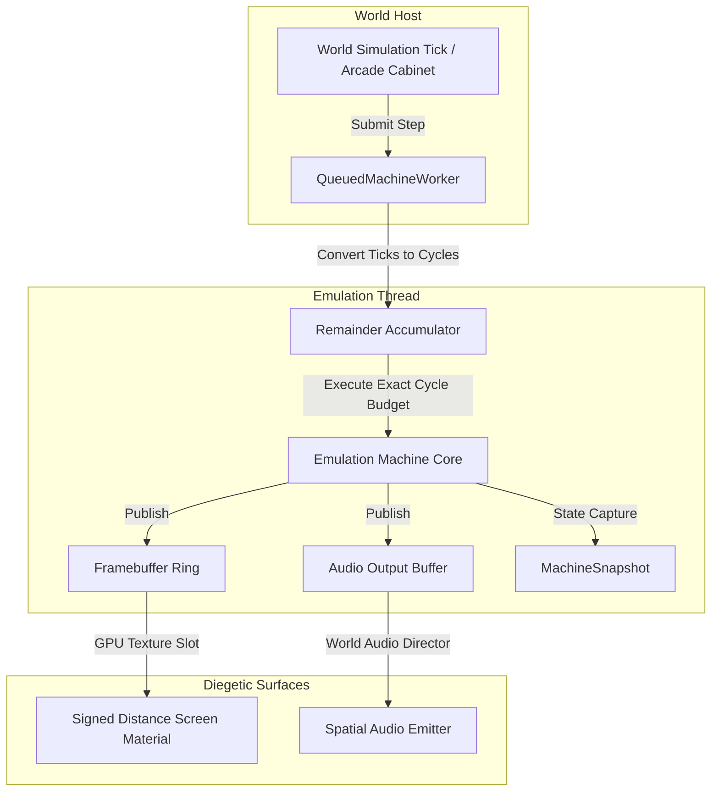

# Machine Hosting Runtime

The `Puck.GamingBricks` hosting layer bridges between Puck's continuous signed-distance world simulation and the discrete, cycle-exact timing requirements of emulated retro consoles.

---

## The Hosting Model

Every emulated machine in Puck implements the universal runtime interfaces defined in `Puck.GamingBricks`:

### Core Interfaces

- **`IMachineEngine`**: Factory interface responsible for discovering available machine types (`gaming-brick`, `advanced-gaming-brick`), validating engine options, and creating machine instances.
- **`IMachineRuntime`**: Base execution surface providing lifecycle control (`Start`, `Stop`, `Reset`, `Step`), input submission, and memory peek/poke capabilities.
- **`IQueuedMachineRuntime`**: Asynchronous execution surface managing thread-isolated execution queues and backpressured step submission.
- **`IAudioMachine`**: Exposes the machine's native sample ring buffer and audio drain rate to `WorldAudioDirector`.
- **`IFeedbackMachine`**: Exposes tactile/haptic feedback events (rumble motor state, sensor requests).

---

## Tick-to-Cycle Translation

Puck's world engine operates on fixed-interval world ticks (typically 60 Hz integer ticks). However, emulated hardware requires precise sub-microsecond cycle budgets:
- **AGB**: 16,777,216 Hz (280,896 cycles per 59.7275 Hz frame).
- **HGB (Normal)**: 4,194,304 Hz (70,224 T-cycles per 59.7275 Hz frame).
- **HGB (Double Speed)**: 8,388,608 Hz (140,448 T-cycles per frame).

### The Remainder Accumulator
To prevent cumulative clock drift without resorting to floating-point timing, `QueuedMachineWorker` maintains an integer remainder accumulator:

$$\text{cycles} = \left\lfloor \frac{\text{stepTicks} \times \text{CoreFrequency} + \text{remainder}}{\text{TickFrequency}} \right\rfloor$$
$$\text{remainder} \leftarrow (\text{stepTicks} \times \text{CoreFrequency} + \text{remainder}) \pmod{\text{TickFrequency}}$$

This guarantees that over any arbitrary duration, the total CPU cycles executed by the core match the theoretical hardware timeline with zero lost or duplicated cycles.

---

## Thread Isolation & Concurrency

Each running machine is assigned a dedicated execution worker (`QueuedMachineWorker`). The worker owns the CPU, bus, PPU, APU, and memory state.

1. **Lock-Free Presentation**: The emulated machine publishes framebuffers to a double- or triple-buffered presentation ring. The renderer samples the latest committed frame without blocking the emulation loop.
2. **Backpressured Submission**: If the world engine advances faster than the machine's real-time rate, step submissions queue up to a bounded threshold. If the queue overflows, execution throttles to preserve deterministic step boundaries.
3. **Marshal on Mutation**: Direct memory writes, cartridge hotswaps, and peripheral attachments marshal onto the worker thread at instruction boundaries, preventing race conditions with CPU execution.

---

## Snapshots, Rewind & Runahead

Full-machine snapshotting is an architectural invariant across all Gaming Bricks:

- **State Completeness**: A `MachineSnapshot` captures the entire register set, internal pipeline registers, cycle scheduler latches, open-bus values, timers, and unread APU/PPU latches.
- **Deterministic Restore**: Restoring a snapshot restores the exact state machine; advancing from a restored state produces bit-for-bit identical framebuffers and audio outputs compared to continuous execution.
- **Runahead Latency Reduction**: Input frames can be processed immediately by taking an ephemeral snapshot, applying user input, stepping the core $N$ frames ahead to render the current frame, and rolling back to preserve real-time multiplayer alignment.
- **Save State Format**: Humble Gaming Brick serializes state using the cross-emulator Bess format; Advanced Gaming Brick serializes complete machine states with cryptographic checksums.
