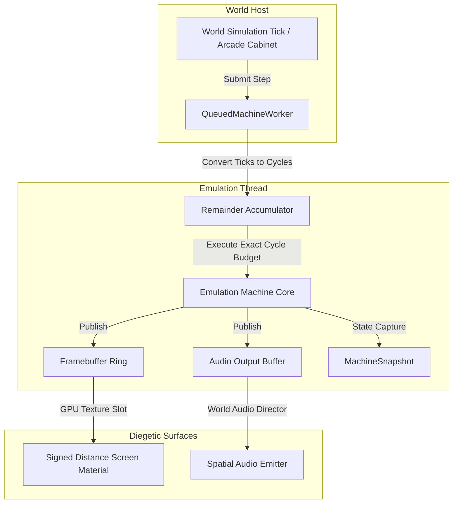

# Machine hosting runtime

Puck's shared hosting layer turns an integer tick budget into work for an
emulated machine. The core runs on its owning worker, and completed video,
audio, and state observations cross explicit host-facing contracts.

The shared `Puck.GamingBricks` layer connects that runtime surface to the
discrete timing of the emulated consoles. Here, a core is the hardware model
that owns the CPU, picture processing unit (PPU), audio processing unit (APU),
bus, and cartridge state; see the [Humble](../hgb/README.md) and
[Advanced](../agb/README.md) entries for those implementations. The shared
layer doesn't own their console-specific rules.

---

## The hosting model

Every hosted machine exposes the neutral runtime interfaces from
`Puck.Abstractions.Machines`. The concrete Gaming Brick adapters add these
capabilities over the shared queued worker:

### Core interfaces

- **`IMachineEngine`**: Resolves an engine by its stable identifier, validates
  its configuration, and creates an `IMachineRuntime`.
- **`IMachineRuntime`**: Reports whether a machine is empty, running, stopped,
  or faulted, and synchronously advances it by an exact integer tick budget.
- **`IQueuedMachineRuntime`**: Adds ordered asynchronous submission. A finite
  pending-segment window applies producer backpressure; an accepted segment is
  executed once in FIFO order, never dropped or coalesced.
- **`IAudioMachine`**: Reports the construction-fixed output rate and drains
  interleaved signed 16-bit stereo samples. Audio is an optional,
  presentation-side capability.
- **`IFeedbackMachine`**: Reports the loaded cartridge's sampled rumble motor
  level. Sensor input is part of the machine input surface, not this output
  capability.

---

## Tick-to-cycle translation

The engine tick domain has 50,400 integer ticks per second. A world simulation
may submit those ticks at a 60 Hz update rate, while emulated hardware needs a
precise cycle budget:
- **AGB**: 16,777,216 Hz (280,896 cycles per 59.7275 Hz frame).
- **HGB (Normal)**: 4,194,304 Hz (70,224 T-cycles per 59.7275 Hz frame).
- **HGB (Double Speed)**: 8,388,608 Hz (140,448 T-cycles per frame).

### The remainder accumulator
To prevent cumulative clock drift without resorting to floating-point timing, `QueuedMachineWorker` maintains an integer remainder accumulator:

$$\text{cycles} = \left\lfloor \frac{\text{stepTicks} \times \text{CoreFrequency} + \text{remainder}}{\text{EngineTicksPerSecond}} \right\rfloor$$
$$\text{remainder} \leftarrow (\text{stepTicks} \times \text{CoreFrequency} + \text{remainder}) \pmod{\text{EngineTicksPerSecond}}$$

Over a sequence of submissions, the carried remainder makes the accumulated
cycle budget equal to the integer-rational timeline. Each individual budget is
rounded down; the remainder carries the fractional part into the next call.

---

## Thread isolation and concurrency

Each running machine normally has a dedicated execution worker
(`QueuedMachineWorker`) that owns its CPU, bus, PPU, APU, and memory state. A
linked group can temporarily lend those cores to one deterministic link thread;
the linked-session contract describes that exception.

1. **Complete-frame publication**: The worker swaps a complete native frame into
   synchronized host storage. A consumer leases an immutable frame for upload,
   so a slow GPU operation doesn't hold the worker's frame lock.
2. **Backpressured submission**: When the finite pending-segment window is full,
   submission waits for capacity. No accepted input segment is dropped or
   coalesced.
3. **Marshaled mutation**: Memory access, content changes, reconfiguration, and
   save operations use the worker or linked boundary, keeping them ordered with
   emulation. The synchronous core remains available when an application owns
   its own execution thread.

---

## Snapshots, rewind, and runahead

Full-machine snapshotting is an architectural invariant across all Gaming Bricks:

- **State completeness**: A core's machine snapshot carries its registers,
  pipeline and scheduler state, bus latches, timers, memory, and peripheral
  state. The exact sections are core-specific.
- **Deterministic restore**: Restoring a complete snapshot and replaying the
  same inputs and budgets produces the same machine state and deterministic
  outputs. A comparison remains bounded by the state and output surface that
  was captured.
- **Runahead latency reduction**: The time-travel layer can advance a separate
  lookahead instance by a configured number of native frames. The authoritative
  machine remains the source of audio and the tick-locked state.
- **Save state formats**: Humble's BESS import/export covers the format's
  modeled scope and is distinct from a complete machine snapshot. Advanced
  snapshots cover the complete machine state and carry typed identity for
  restore validation.
