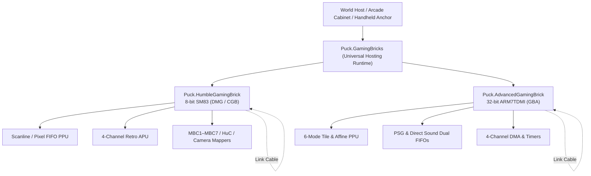

# Gaming Bricks: Virtual Hardware & Machine Emulation

The Gaming Bricks represent Puck's hardware emulation substrate. Rather than presenting mini-games as external native scripts or simulated abstractions, Puck models retro handheld consoles as diegetic, physical machines embedded within the 3D signed-distance world. Players can walk up to arcade cabinets, insert cartridges into handhelds, link consoles with simulated cables, and observe screen surfaces rendered live via signed-distance materials.

---

## Architectural Tiers

Puck implements two virtual machine tiers sharing a unified hosting and execution abstraction (`Puck.GamingBricks`):

| Tier | Hardware Architecture | Clock Frequency | Display & Audio | Memory & Cartridge Model |
|---|---|---|---|---|
| **[Humble Gaming Brick (HGB)](hgb/README.md)** | Sharp SM83 (8-bit modified Z80/8080) | 4.194304 MHz (Normal) 8.388608 MHz (Double Speed) | 160×144 2-bit DMG / 15-bit CGB 4-channel APU (2 pulse, wave, noise) | 64 KB address space MBC1–MBC7, HuC1/3, Camera, Bess saves |
| **[Advanced Gaming Brick (AGB)](agb/README.md)** | ARM7TDMI (32-bit ARMv4T) | 16.777216 MHz (2^24 Hz) | 240×160 15-bit color (Modes 0–5) PSG + Direct Sound dual FIFOs | 32 MB address space (256 KB EWRAM, 32 KB IWRAM) SRAM, Flash 64K/128K, EEPROM |

---

## Shared Infrastructure

Both machine tiers share an execution and determinism architecture in `Puck.GamingBricks`:

- **[Machine Hosting & Worker Runtime](shared/machine-hosting.md)** — Thread-isolated workers, tick-to-cycle translation with remainder accumulation, and backpressured step submission.
- **[Serial Link Cables & Peripherals](shared/link-cables.md)** — Instruction-atomic interleaving for two-player multiplayer link cables, infrared transceivers, and the Game Boy Printer device.
- **[Universal Cartridge Format](shared/cartridge-format.md)** — Cartridge header validation, memory map registration, ROM banking, and persistent battery save state storage.

---

## Determinism & Emulation Creed

All Gaming Brick implementations operate under strict engine invariants:

1. **Integer Clock Timing**: All core timers, bus waitstates, and component schedulers operate on exact integer tick ratios. One AGB frame is precisely 280,896 CPU cycles; one HGB frame is precisely 70,224 T-cycles.
2. **Zero Nondeterministic Inputs**: Emulated state contains zero wall-clock time, zero unrecorded random inputs, and zero floating-point arithmetic. Real-Time Clocks (RTC) and hardware sensors (gyros, light sensors) advance exclusively through recordable input events.
3. **Bit-Exact Memory Snapshots**: Full-machine snapshots capture every register, scheduler latch, pipeline stage, and open-bus remainder, enabling perfect rewinding, runahead input latency reduction, and deterministic replay verification.
4. **Presentation Decoupling**: Framebuffer rendering and audio resampling run after execution commits and never feed back into emulation state.

---

## Knowledge Vault Index

### [Humble Gaming Brick (8-bit)](hgb/README.md)
- [SM83 CPU & Instruction Timing](hgb/sm83-cpu-and-timing.md)
- [PPU Scanlines & Pixel FIFO](hgb/ppu-scanlines-and-fifo.md)
- [APU & Sound Channels](hgb/apu-and-sound-channels.md)
- [MBC Mappers & Banking](hgb/mbc-mappers-and-banking.md)
- [Post Harness & Conformance Testing](hgb/post-and-conformance.md)

### [Advanced Gaming Brick (32-bit)](agb/README.md)
- [CPU Pipeline, Prefetch & Waitstates](agb/cpu-pipeline-prefetch-waitstates.md)
- [PPU Rendering Models](agb/ppu-rendering-models.md)
- [APU & Direct Sound](agb/apu-and-direct-sound.md)
- [DMA, Timers, Interrupts & Open Bus](agb/dma-timers-interrupts-open-bus.md)
- [Cartridge Saves, RTC & Peripherals](agb/cartridge-saves-rtc-peripherals.md)
- [Determinism, Savestates & Replay](agb/determinism-savestate-replay.md)
- [Performance Techniques](agb/performance-techniques.md)
- [Emulator Landscape](agb/emulator-landscape.md)
- [Test ROMs & Evidence](agb/test-roms-and-evidence.md)
- [Verdict Index](agb/verdict-index.md)

### [Shared Infrastructure](shared/README.md)
- [Machine Hosting Runtime](shared/machine-hosting.md)
- [Serial Link Cables & Multi-Device Sessions](shared/link-cables.md)
- [Universal Cartridge Contracts](shared/cartridge-format.md)
