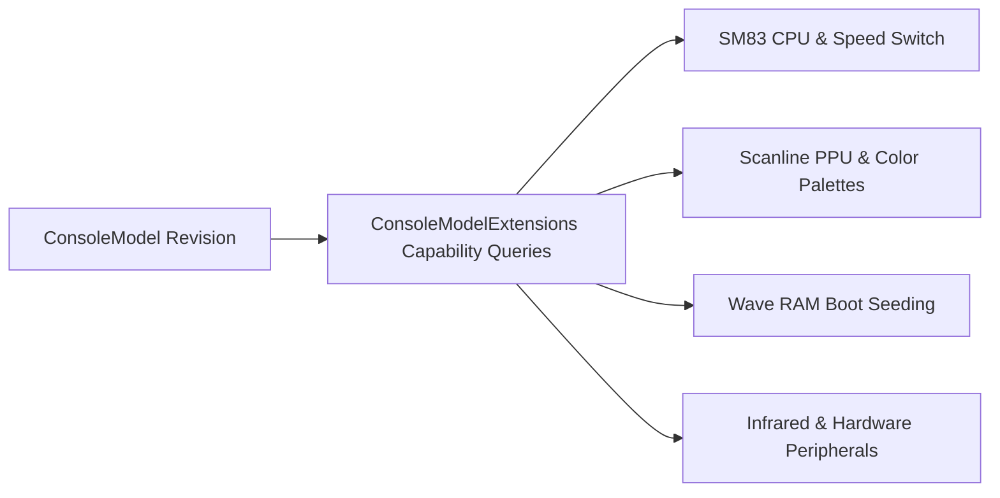

# Humble Gaming Brick (HGB) Architecture

The **Humble Gaming Brick** (`Puck.HumbleGamingBrick`) is Puck's 8-bit retro gaming core. It implements the entire Sharp SM83 machine family—spanning original monochrome Game Boy (DMG), Game Boy Pocket (MGB), Super Game Boy (SGB/SGB2), Game Boy Color (CGB), and Game Boy Advance backwards-compatibility costumes (AGB/AGS)—within a single, highly-optimized hardware core.

---

## One Core, Every Revision

Rather than maintaining separate, forked emulators for monochrome and color consoles, `Puck.HumbleGamingBrick` models console differences through **fine-grained capability gates** on `ConsoleModel`:

### Supported Revisions

- **DMG**: `Dmg0`, `DmgA`, `DmgB`, `DmgC` (Original Dot Matrix Game Boy revisions).
- **Pocket**: `Mgb` (Game Boy Pocket, with cleaner LCD response and revised boot registers).
- **Super Game Boy**: `Sgb`, `Sgb2` (SNES cartridge adapter with custom border frame and precise 4.295454 MHz clock).
- **Color**: `Cgb0`, `CgbA`, `CgbB`, `CgbC`, `CgbD`, `CgbE` (Dual-speed CPU, 32 KB WRAM, 16 KB VRAM, CGB palette RAM, HDMA).
- **Advance Backward-Compatibility**: `Agb`, `Ags` (GBA hardware executing SM83 code with distinctive initial register footprints and sound volume levels).

### Named Capability Gates
Components query hardware behavior via semantic predicates (`ConsoleModelExtensions`), such as:
- `SupportsColor()`: Gates CGB-specific registers (`KEY1`, `HDMA`, `BCPS/BCPD`, `SVBK`, `VBK`).
- `LatchesFetchRowAtTileStep()`: Distinguishes fine-grained tile row latching between early and late PPU revisions.
- `HasAgbBootHandoff()`: Sets initial register values matching the GBA boot sequence (`B=0x01` on AGB vs `B=0x00` on DMG).
- `SensesOwnInfraredLight()`: Replicates phototransistor self-sensing quirks on physical CGB IR ports.
- `SeedsWaveRamOnBoot()`: Replicates uninitialized pseudo-random patterns in Channel 3 Wave RAM.

---

## Live Hardware Switching (No-Reboot Hot Swap)

A distinctive feature of Puck's HGB implementation is `Machine.SwitchModel`:

- **Seamless Transition**: A running machine can transition from a monochrome DMG to a Game Boy Color mid-game without resetting memory, stopping audio, or reloading the cartridge.
- **Mode Poking (`ConsoleModeRecipes`)**: Many cartridges detect hardware at boot and store a hardware flag in working RAM. When switching from DMG to CGB mode, the engine re-gates the PPU/CPU and automatically applies non-destructive memory updates (`ModePoke`), allowing games like *The Legend of Zelda: Link's Awakening DX* to instantly switch from monochrome palettes to full color graphics while preserving the player's active position and health.

---

## Clock Domains & Timing Granularity

- **Master Clock**: 4,194,304 Hz (DMG) / 8,388,608 Hz (CGB Double Speed).
- **Machine Cycles (M-Cycles)**: 1 M-Cycle = 4 T-Cycles (1,048,576 M-cycles/sec).
- **Sub-Cycle Resolution**: `TickResolution` evaluates bus events and PPU dot transitions at fractional T-cycle intervals, ensuring exact edge-case accuracy for STAT write glitches and mid-scanline register writes.

---

## Knowledge Vault Index

- **[SM83 CPU & Timing](sm83-cpu-and-timing.md)** — Instruction decode, ALU flags, T-cycles, halt bug, and interrupt service routines.
- **[PPU Scanlines & Pixel FIFO](ppu-scanlines-and-fifo.md)** — Modes 0–3, pixel fetcher FIFO, OAM search, CGB palette RAM, and HDMA transfers.
- **[APU & Sound Channels](apu-and-sound-channels.md)** — 4-channel retro audio synthesizer, frame sequencer, Wave RAM, and noise LFSR.
- **[MBC Mappers & Banking](mbc-mappers-and-banking.md)** — Cartridge memory controllers: MBC1, MBC2, MBC3 (RTC), MBC5, MBC7 (tilt), HuC, and Camera.
- **[Post Harness & Conformance Testing](post-and-conformance.md)** — Bess save state spec, hash divergence probing, Mooneye/Blargg test suites, and regression gates.
