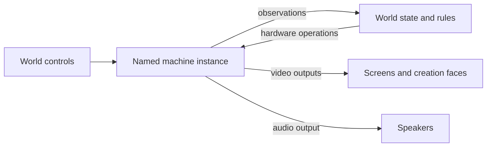

# Screens and machine extensions

This is a proposed cross-project implementation plan. The DSL examples describe
the proposed contract; they are not examples the current runtime accepts.
The objective is to make the Gaming Bricks ordinary extensions while preserving
physical screens, convenient cabinet authoring, and gameplay that directly
observes and controls machine hardware.

## The decision

Keep screens. A screen is a useful authored object: a display surface with a
position, dimensions, a source, and an optional interaction route. Creation
faces remain another way to place that display on a more elaborate object.
Neither needs to disappear or become a universal object graph.

Give a running machine its own named identity and lifetime. Screens, speakers,
controls, and hardware bindings reference that instance. A cabinet can package
those relationships into one authoring unit, and interacting with its screen
can still feel like interacting with the whole device.

The architectural test is whether installing another machine requires changes
to the host's hardware vocabulary. A neutral machine-hosting capability is
reasonable engine infrastructure. Cartridge formats, console models, memory
maps, cable protocols, and forge implementations belong to its providers.

Three approaches were considered:

| Approach | Consequence | Recommendation |
|---|---|---|
| Move the existing assemblies behind extension registration, retaining screen-owned machines | Improves packaging, but audio, memory, lifetime, and identity still depend on a display | Necessary packaging work, insufficient as the final design |
| Replace screens and machines with a universal ports-and-nodes language | Can express the relationships, but makes every ordinary cabinet an infrastructure exercise and expands the project substantially | Do not pursue |
| Keep screen and cabinet authoring; separate named machine instances and optional capabilities underneath | Preserves the physical vocabulary and permits shared displays, invisible machines, and direct hardware interaction | Pursue |



## What the current implementation establishes

These observations explain the boundary being changed; they are not defects
merely because they differ from the proposal.

- [The screen schema](../src/Puck.World.Schema/WorldScreen.cs) combines physical
  geometry and routing with a machine source that carries content, options,
  cartridge-document detection, and cable declarations. Screen rows also carry
  memory bindings. A source magazine can deliberately function as a cartridge
  selector today; its replacement must preserve that authored intention.
- [The machine host](../src/Puck.World.Machines/WorldMachineHost.cs) keys runtime
  slots by screen index. Removing a screen disposes its machine, and selecting
  a non-machine magazine entry clears the existing machine. The server already
  owns stepping, including on headless boots.
- [Speaker sources](../src/Puck.World.Schema/WorldSpeaker.cs) identify a
  machine's audio through its screen index. The
  [memory schema](../src/Puck.World.Schema/WorldScreenMemory.cs) admits one- or
  two-byte little-endian windows and caps the bus address at 0xFFFF.
- The [memory-access contract](../src/Puck.Abstractions/Machines/IMachineMemoryPeek.cs)
  distinguishes side-effect-free inspection from debug pokes. Compiler-backed
  analysis of the World project closure finds the Humble host implementing it;
  that does not establish equivalent Advanced hardware access. Wider addresses
  and register control need implementation evidence, not a renamed interface.
- [Memory synchronization](../src/Puck.World.Server/WorldServer.MachineMemory.cs)
  runs after world rules and before machine advance. Reads observe the preceding
  machine step; writes send changed world values into the machine. The mirror
  and the direct rule read therefore have different visibility timing for rules.
- [The renderer's frame contract](../src/Puck.SdfVm/SdfScreenSourceFrame.cs)
  already consumes an image handle and optional retirement information. Its
  neutrality should survive this work.
- [Boot registration](../src/Puck.World/WorldDataHookInstaller.cs) names both
  bricks and their compilers. The generic
  [machine-extension registry](../src/Puck.World.Machines/WorldMachineExtensionLoader.cs)
  depends on contracts in the forge package. The
  [Tune audio host](../src/Puck.World/Audio/TuneMachineSource.cs) also constructs
  a Humble core directly. Packaging closure includes those paths.

## Authoring: separate identity, keep the physical vocabulary

Use a named `machines` section for hosted machine instances. The host owns the
row's identity, engine selection, lifecycle, capability bindings, and references.
The provider owns its configuration document and supported hardware operations.
This section is specifically for machine runtimes; it does not replace WASM
`addons` or host-approved external-service configuration.

The proposed canonical shape uses the existing DSL's arrays, blocks, constants,
and discriminator calls. It needs schema and vocabulary work, not new parser
keywords. This fragment assumes that `heroX`, `cartDone`, and the `arcadePad` kit
are declared elsewhere in the world:

```puck
machines [
    {
        name: "brook"
        engine: "gaming-brick"
        configuration {
            schema: "puck.gaming-brick.config.v1"
            model: "cgb"
            content { path: "../../cartridges/hgb-mirror.cgb.cartridge.json" }
        }
        memory [
            {
                name: "hero-x"
                direction: "Write"
                space: "bus"
                address: 0xC200
                format: "u8"
                row: "heroX"
                access: "patch"
                update: "onChange"
                conversion: "truncate"
            }
            {
                name: "finished"
                direction: "Read"
                space: "bus"
                address: 0xC205
                format: "u8"
                row: "cartDone"
            }
        ]
    }
]

screens [
    {
        name: "brook-panel"
        origin [0, 1.5, 0]
        right [-1, 0, 0]
        up [0, 1, 0]
        halfWidth: 1.6
        halfHeight: 1.44
        halfDepth: 0.03
        round: 0
        source: machine(instance: "brook", output: "video")
        route { engageable: true, engageRadius: 2.2, kit: "arcadePad" }
    }
]

rule "open-on-completion" {
    when cartDone == 1 as Int
    // Ordinary world effects go here.
}
```

The addresses illustrate raw hardware access, not a claim that this cartridge
exports a completion flag at 0xC205. Production examples must use the actual
cartridge's exported symbols or verified address map. Symbol bindings resolve
against the mounted content's compiler metadata; raw address bindings remain
fully supported for arbitrary ROMs and hardware experiments.

A second screen references `brook` and its `video` output. It does not construct
another machine. An audio source references that instance's `audio` output.
A multi-display machine supplies distinct output names. An audio-only or
headless machine has no obligation to publish a video output.

For the ordinary single-controller cabinet, an engageable route derives its
input target from its machine source when that source identifies exactly one
compatible input port. An explicit input target handles several controllers,
shared control surfaces, or a display showing something other than the device
being controlled. Ambiguity is a validation error. Derivation does not mint
authority or give a passive monitor control of its producer.

Offer the simple cabinet as an ordinary reusable `.puck` template or imported
module that emits the machine, display, route, and optional speaker together.
Do not introduce a second canonical JSON form that secretly constructs a
machine inside a screen source. First prove the template/module expansion
against the existing lowering and merge behavior. The comparison worlds can
keep their explicit separate machine and screen rows, where that separation
helps the author.

Template expansion does not create runtime ownership metadata. If a cabinet
offers a remove/reset-all action, its module must author the affected row set
and operation explicitly. Mere proximity, identical ROM hashes, or the last
display disappearing never imply ownership or garbage collection of a machine.

### Names, imports, and author tools

Named screens replace authored GPU indices in the completed design. Indices
remain derived renderer resources with the existing capacity checks. Allocate
through one catalog covering explicit screens, creation faces, and reserved
authoring headroom. Runtime references use identity-to-slot lookup; a new
display must not retarget a command or a replay entry through a recycled index.
Slot allocation and resource leases are presentation details, not machine state.

Register machine, screen, binding, and connection names and references with the
existing [module name machinery](../src/Puck.World.Schema/WorldModuleNamespace.cs).
Importing the same cabinet module under two aliases must produce two independent
devices and displays, with local memory-row and control references rewritten
together. A deliberate shared reference remains explicit. Preserve the existing
alias grammar; do not invent dot-qualified names.

Provider metadata must identify configuration fields that contain document
references, asset paths, and declarations. An opaque JSON payload cannot safely
participate in import rewriting, relocation, or asset pinning without this
information. Prefer ordinary host reference fields for cross-world-row links;
do not make core import code recognize GamingBrick property names.

The provider's descriptor supplies configuration validation, fields, ports,
operations, hardware spaces, and descriptions to runtime validation, JSON
Schema tooling, CLI, and language-server completion. Use one descriptor source.
Diagnostics should identify the instance and authored field, for example:
`brook: address 0x02000040 is outside space 'bus' for this configuration`.
Unknown fields, unsupported outputs, ambiguous control targets, and dangling
references fail before admission. Offline parsing can preserve unknown provider
data, but semantic validation must report an unavailable descriptor rather than
claim success. A document must not load arbitrary code to obtain completion.

Generated world and cartridge JSON retains its existing owner: edit `.puck`
where present and regenerate the companion JSON. JSON-only modules remain valid
authored data. Saving a live world writes its canonical definition; it must not
overwrite a template-based source by decompiling JSON and pretending to recover
its constants, imports, or templates.

## Player experience and live authoring

Approach a cabinet, engage, play, switch cartridges, and disengage remain direct
in-world actions. The player need not encounter package names, schema tags, or
the machine/display distinction unless inspecting or authoring the device.

| Action | Proposed effect |
|---|---|
| Move, resize, hide, or remove a display | Changes the display; leaves the machine's execution intact |
| Change the displayed feed or cycle its source magazine | Selects an output; leaves the producers intact |
| Insert, eject, reset, or reconfigure hardware | Addresses a named machine and applies its provider's operation |
| Cycle a cabinet's cartridges | Selects content on that machine; boots/resets according to the cartridge provider's declared behavior |
| Invoke a cabinet's authored removal action | Removes its specified declarations together after validation; shared users must be rebound or removal refused |
| Add a monitor or speaker | Adds an output consumer; does not duplicate stepping or destructively drain the same audio queue twice |

Keep contextual `screen` commands where they match what the person selected.
A screen-local insertion command may resolve its machine and forward the same
operation as the machine command. Read-back names the resolved instance. A
camera-only or ambiguous display refuses that operation clearly. Provider-owned
forge commands participate through the same route and retain their authority
and content-pinning checks.

The screen source magazine and the cartridge magazine have different owners.
Migrate each existing use according to its intention. A mixed selector can
still mean “switch away and eject” when the authored cabinet action explicitly
performs both steps. Never convert a source switch into an unintended population
of simultaneously running cartridges. Machine rows have an explicit running or
stopped initial state; configured ordinary machines default to running, while
an empty cabinet or an authored start-on-engage action can remain stopped.

Display inspection shows source, signal state, and bound controls. Machine
inspection shows running/stopped/empty/faulted state, mounted content, hardware
configuration, bindings, links, and execution backlog. A stopped machine and a
missing framebuffer are distinct conditions. Shared outputs show the same fault
without creating separate faulting machines.

## Direct hardware interaction

Hardware access is a supported gameplay contract. Keep memory-based predicates,
world-to-machine writes, addon watches, console inspection, live model controls,
and linked-machine behavior. The extension owns the interpretation of each
operation; the host owns ordering, authority, budgets, and reproduction.

Separate three access semantics explicitly:

1. **Inspect:** coherent, side-effect-free reads suitable for rules and watches.
2. **Patch:** deliberate state edits, including the current RAM-poke behavior.
3. **Bus or device operation:** hardware-visible accesses, register changes,
   peripheral input, or execution controls whose side effects the provider models.

Do not implement register writes by relabeling a RAM-only poke. Providers
advertise their address spaces, widths, byte order, supported access modes,
bank selection, and operation constraints. Address storage must cover the
provider's declared range; the world must lose its fixed 0xFFFF ceiling. Named
symbols are conveniences over those same spaces and access modes. Unsupported
access reports a refusal, distinct from an empty machine or a successfully read
zero. Loading different content revalidates symbol resolutions and bindings.

Observation APIs expose availability alongside the value. An empty or faulted
machine does not satisfy a hardware predicate merely because a fallback byte
equals zero. A state mirror leaves the last accepted cell unchanged on a failed
read and exposes its validity/fault for rules and inspection. Direct memory
predicates retain their direct observation path and phase; they need not create
an intermediate world cell. Migrate their targets to instance identity and
preserve raw-address and named-symbol access, with explicit availability gates
where an author needs to distinguish absence from a real value.

Bindings also declare update semantics. “Write when the world value changes”
allows the guest to change that byte afterward; “hold this value every tick”
does not. An edge-triggered bus operation must not silently become either.
Keep current on-change behavior during extraction. Preserve current truncation
only through an explicit conversion policy in migrated data; new bindings use
checked conversion by default. Multiple writes to the same range need explicit
ordered composition or a refusal. Named binding identity, configuration, and
machine generation determine observation-cache identity, so replacing a machine
cannot suppress the first write because the previous instance saw that value.

### Timing and determinism

First characterize and preserve the existing phase order: world rules, binding
synchronization in authored order, then machine advance with this tick's folded
input. State mirrored just before advance becomes visible to a later rule
evaluation; direct reads already inspect the previous completed machine state.
Moving the mirror earlier to eliminate that latency is a separate behavioral
decision with its own proof, not part of a structural extraction.

Drain a queued worker to the required deterministic boundary before a gameplay
observation. Multi-byte inspection must be coherent; a hardware multi-byte
operation must follow the provider's real access order, which need not be
atomic. Link groups advance once as a coupled group and preserve their exact
integer-clock interleave. Neither display visibility nor presentation cadence
controls authoritative advancement. Audio consumers fan out one produced stream.

World-tick snapshots cannot detect every short-lived transition inside a guest
step. For gameplay that requires such conditions, expose bounded provider-side
watch/event capture at guest execution boundaries, with tick-relative cycle
offsets and a deterministic event order. Likewise, cycle-positioned input or
register operations need the provider's explicit scheduling capability. An
unsupported watch or precision requirement refuses; a full event queue reports
failure/backpressure under a specified policy rather than dropping a winning
condition. This capability is implemented when its hardware gameplay scenario
lands, without changing the screen or world-rule vocabulary.

Never block a guest worker waiting for the same world tick to consume its
events. Admission bounds the work/event window, and the tick barrier reports a
deterministic overflow fault if the promised bound cannot be met. Cross-machine
same-cycle feedback belongs in the provider's coupled execution group; ordinary
world rules consume the ordered results at a documented world boundary.

Read observations return through existing state and rule machinery. Authored
hardware writes and console operations enter the ordered authority domain with
their actor and target instance generation. External inputs are recorded once;
deterministically derived rule/binding operations are re-executed once. A raw
debug mutation either uses that same recorded route or explicitly invalidates
the affected rewind/replay history. Input-target derivation and extension
registration never bypass grants. Reuse existing capabilities, with a named
machine subject where required; do not add a separate security model per brick.

## Runtime and package boundary

Use the existing machine host as the home of neutral scheduling and bindings,
and the existing extension lifetime/replay contract as its shared foundation.
Keep deterministic machine stepping separate from recorded service workers;
advertising a replay policy cannot make arbitrary code deterministic.

Split mandatory machine lifetime and advancement from optional video, audio,
pad/device input, hardware access, linking, state capture, and reconfiguration
capabilities. Extend the existing capability approach instead of requiring all
providers to implement a large universal hardware interface. A neutral video
adapter owns GPU upload and device loss, and consumes leased/copied frames
without making the core itself depend on a GPU. Preserve the synchronous core
embedding APIs and their no-worker/no-device use.

Move the machine extension entry contract out of the cartridge-forge package.
Use a host-scoped registration set for the executable, CLI, validators, replay
hosts, and instances. Remove unconditional module-initializer registration and
process-global validation state. Provider-specific configuration, cartridge
compilation, symbol maps, commands, and Tune-to-Humble hosting live with their
extensions. Core persistence carries a generic content/implementation receipt;
it does not reference a cartridge compilation type.

A distribution may bundle both bricks and register them statically. Optional
packaging is the test: a World distribution without either brick must build and
run camera, view, QR, text, and test-pattern screens, and admit a different
machine provider through the same contract. Dynamic discovery is an additional
registration mechanism, not the definition of extensibility. Preserve static
composition for AOT/browser deployments; unsupported dynamic loading must not
disable statically available providers. The loader shares neutral contract
assemblies, with no special treatment for a forge package.

Provider operations travel through one validated machine-operation envelope:
instance identity/generation, provider operation identifier, typed payload
schema, and ordered execution position. Implementations register validators
and handlers; the core protocol does not grow a discriminated-union arm for
each console or peripheral. Retain synchronous ordering where a compound
engage/start action requires the next command to observe the successful start.
Do not force the unrelated addon and service protocols into this envelope.

Rules invoke these operations through one generic, schema-validated effect
form. Dynamic arguments use the existing state-expression compiler and declared
parameter types; they do not introduce an extension-specific expression parser
or execute strings from an arbitrary configuration payload. Observations,
commands, and rule effects must resolve the same registered operation metadata.

Document edits prepare a candidate, validate references/capabilities and
capacity, then commit atomically. A failed configuration or replacement must
leave the live instance usable. Source changes do not call the machine lifecycle
path. Machine/link removal checks dependents and authority; stale queued work
cannot address a replacement that reused a name. Budgets count instances,
guest memory, queued work, watches, links, and output resources independently
of the display count. Retain bounded admission and measure any new ceiling.

## Versioning, saving, and replay

Keep these identities distinct:

| Identity | What it establishes |
|---|---|
| World/DSL document shape | How the host reads declarations and relationships |
| Provider configuration and operation schema | What hardware settings and operation payloads mean |
| Host capability contract | Whether a registered implementation satisfies the host's requirements |
| Implementation and content receipt | Exactly which code, configuration, firmware, content, and compiler output produced this run |
| Provider snapshot format | Whether opaque machine state can be restored by this implementation |

Follow the [development-version ruling](../.agents/skills/puck-world/references/replay.md):
World remains v1 during development. Change the current schema and tape shape
directly, regenerate documents, and re-record affected evidence. Do not add old
readers, compatibility aliases, automatic fallback to retired shapes, or a v2
ceremony for this work. Provider configuration tags in the example are proposed
contracts; they do not imply support for multiple historical implementations.

Even while the public development tag stays v1, replay needs exact execution
identity. Record deterministic digests of the provider artifact closure,
canonical configuration, firmware/ROM assets, and compiled output. For a forged
cartridge include source and compiler identity too. Hash reproducible content,
not install paths, timestamps, or renderer indices. A package version label
alone is insufficient. Resolve providers and assets before stepping, and refuse
missing or mismatching receipts by name. A new package must not silently replace
the implementation a recording requires.

World save folds authored/live configuration, cartridge selection, routes, and
links into their proper document homes. It is not a CPU snapshot. A resume save
or checkpoint additionally needs provider state plus host timing remainders,
binding/watch history, pending deterministic operations, instance generations,
and coupled-link state. Snapshot admission checks the receipt and snapshot
format before any live instance changes. Presentation resources are rebuilt.

The [current checkpoint gate](../src/Puck.World.Server/WorldServer.Checkpoint.cs)
refuses machine-bearing history it cannot capture. Preserve that refusal until
the complete machine and host state actually round-trips; an interface alone
does not close it. Boot-anchored replay remains a valid initial strategy. Add
machine and hardware-binding state evidence to verification: a matching world
population hash cannot prove that an otherwise unobserved guest register or
link state reproduced correctly.

Authoritative instances are scoped to their world authority, not to a process
or content hash. Two imports or two worlds booting the same ROM get independent
state unless they deliberately reference a shared owner. Remote clients consume
delivered outputs and submit authorized operations; they do not become a second
authority by recreating the machine locally. Provider installation never implies
transporting arbitrary native machine state across authorities.

## Implementation sequence and closure

Each stage lands with its affected human, API, generated-source, and agent
documentation synchronized. Keep unrelated dirty source work out of this change.
No new packages or persistent verification framework are needed for the plan.

1. **Characterize the user-visible contracts.** Exercise the existing comparison
   and mirror worlds, the arcade cabinets, forge insertion, memory reads/writes,
   model changes, links, audio, and replay. Identify which source magazines mean
   feed selection and which mean cartridge replacement. Use the existing
   [machine-memory laws](../tests/Puck.World.Tests/MachineMemoryLawTests.cs),
   [host transaction laws](../tests/Puck.World.Tests/MachineHostTransactionLawTests.cs),
   and real executable sessions to pin phase order and failure behavior. Produce
   one worked cabinet module in both current and proposed data before changing
   the runtime. Resolve the default control/lifecycle rules against that example.

2. **Extract provider ownership with behavior intact.** Introduce neutral
   registration/capability descriptors in existing contract projects. Move the
   concrete registration, forge compilation, and Tune integration behind them.
   Keep the current screen-facing adapter temporarily inside the implementation
   branch, then remove it when the new model lands. Prove a no-bricks distribution
   and a small non-brick provider using the same entry point. No hardware-address
   or cartridge-format knowledge may remain in the generic loader.

3. **Land instance identity through one complete path.** Add named machine and
   screen rows, reference validation, namespace rewriting, derived render slots,
   generic operations, authority subjects, prepare/commit reconciliation, and
   receipt serialization together. Migrate source, speaker, control, link, save,
   replay, memory-binding, addon-watch, and rule references. Route the screen commands through
   the new identities. Migrate the checked-in corpus once; delete retired data
   shapes rather than preserving two authoring models. Adding a second monitor
   must preserve a live machine's progress, and removing one must leave it running.

4. **Preserve and deepen hardware access.** Complete instance bindings with
   explicit widths, address spaces, conversion, update policy, and coherent
   observation. Preserve the characterized phase order. Verify raw and symbolic
   access against real cores, implement Advanced access where required, and add
   provider-owned register/peripheral operations with actual side-effect checks.
   Exercise an address above 0xFFFF and an on-change versus held-value case.
   Add cycle-level watches with the first scenario requiring transient detection;
   do not advertise that precision before the scenario passes.

5. **Complete author and player surfaces.** Update schema generation, DSL
   lowering/decompilation, language-server metadata, imports/exports, schema-aware
   editing, commands, diagnostics, cabinet templates, and forge play. A simple
   cabinet should still be one reusable authoring unit. Check the comparison
   worlds and arcade in the real app, including source selection, cartridge
   selection, multi-seat control, faults, and live save/reload.

6. **Close reproduction and distribution.** Test external-operation recording
   versus deterministic re-execution, content/code mismatch refusal, link
   replay, invisible machines, and machine state evidence. Complete optional
   snapshot support only with the full restoration test; otherwise retain the
   named checkpoint refusal. Update deployment manifests and static/dynamic
   registration paths so bundled and absent bricks both behave as declared.

Use the affected existing World, Schema, Protocol, and Transpiler test projects,
then run actual headless and rendered World sessions through the normal command
surface. Shared hosting, snapshot, or clock changes run both GamingBrick Post
batteries in Release; link changes also run their Tier C coverage. Follow each
battery's current asset/accuracy routing and report skips. Use existing test and
canary infrastructure; any new permanent runner would be a separate decision.

The decisive acceptance cases are:

- A single authored cabinet is as straightforward to place and play as today.
- Two displays and two speakers observe one instance without duplicate execution
  or competing destructive audio reads.
- A display-free machine drives world state, and world state drives its hardware;
  the same trajectory reproduces with rendering disabled.
- A provider with several video outputs, and one with no video output, fit the
  same host. Wider memory and a hardware-side-effect operation need no core
  console-specific case.
- Two aliased copies of the cabinet module do not share names, render slots,
  inputs, memory bindings, link groups, or machine state accidentally.
- Feed changes preserve execution; deliberate cartridge/reset actions change it;
  failed edits and unauthorized operations preserve the prior live state.
- Reboot/replacement reapplies initial bindings, rejects stale operations, and
  invalidates old symbol resolutions. Missing capability or signal never
  masquerades as a successful zero-valued observation.
- A recording refuses changed implementation/content before execution and detects
  a deliberately perturbed machine state. Checkpoint support, if enabled, restores
  pending timing, bindings, watches, and linked state as well as CPU memory.
- World without the GamingBricks still boots and displays other sources. Adding a
  provider requires its package, descriptor, registration, and authored data,
  without editing the renderer or adding a hardware-specific core union arm.

The first implementation slice is provider extraction plus a worked cabinet
module and characterization evidence. The end-to-end identity change follows
from those artifacts. A wholesale screen rewrite, a new graph editor, and a
general extension marketplace are outside this plan.

## Decisions to settle through the first worked module

The recommended defaults above are concrete enough to implement a prototype.
Before migrating the corpus, demonstrate three remaining choices in that
prototype: that composing a cabinet requires no repetitive wiring; that a
source switch releases or retargets an existing control application explicitly
without leaving held input on the old machine; and that unconfigured content,
failed content, and intentionally stopped execution remain distinct in the
player and author interfaces. Exact field and command spellings may change in
that exercise. Independent machine identity, retained screens, direct hardware
access, and explicit execution/replay semantics are the invariants it must meet.
