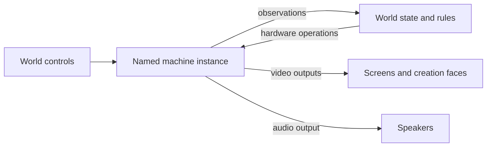

# Screens and machine extensions

This is the agreed cross-project design and implementation plan. The runtime
implements part of it; the complete DSL examples below still describe the target
contract. The parallel implementation schedule at the end defines the remaining
work, worker briefs, integration boundaries, and acceptance gates.
The objective is to make the Gaming Bricks ordinary extensions while preserving
physical screens, convenient cabinet authoring, and gameplay that directly
observes and controls machine hardware.

## The decision

Keep screens. A screen is a useful authored object: a display surface with a
position, dimensions, a source, and an optional interaction route. Creation
faces remain another way to place that display on a more elaborate object.
Neither needs to disappear or become a universal object graph.

Give a running machine its own named identity and lifetime. Screens, speakers,
controls, and hardware bindings reference that instance. A cabinet can package
those relationships into one authoring unit, and interacting with its screen
can still feel like interacting with the whole device.

The architectural test is whether installing another machine requires changes
to the host's hardware vocabulary. A neutral machine-hosting capability is
reasonable engine infrastructure. Cartridge formats, console models, memory
maps, cable protocols, and forge implementations belong to its providers.

Three approaches were considered:

| Approach | Consequence | Recommendation |
|---|---|---|
| Move the existing assemblies behind extension registration, retaining screen-owned machines | Improves packaging, but audio, memory, lifetime, and identity still depend on a display | Necessary packaging work, insufficient as the final design |
| Replace screens and machines with a universal ports-and-nodes language | Can express the relationships, but makes every ordinary cabinet an infrastructure exercise and expands the project substantially | Do not pursue |
| Keep screen and cabinet authoring; separate named machine instances and optional capabilities underneath | Preserves the physical vocabulary and permits shared displays, invisible machines, and direct hardware interaction | Pursue |



## What the current implementation establishes

The [machine host README](../src/Puck.World.Machines/README.md) describes the
implemented contracts. Use those contracts as the starting point, and rerun
the affected tests against the integration base supplied to each worker.

- Host-scoped catalogs, provider descriptors, structured construction, prepared
  content, and optional runtime capabilities already exist in the neutral
  contracts. Extend them; do not create another extension registry.
- Named `machines` rows already own independent runtime generations, running
  state, staged replacement, removal, undo, and memory bindings. The existing
  [lifetime laws](../tests/Puck.World.Tests/NamedMachineLifetimeLawTests.cs) and
  [memory laws](../tests/Puck.World.Tests/NamedMachineMemoryLawTests.cs) exercise
  this path. They do not establish completion of the display migration.
- Both brick hosting adapters expose coherent hardware inspection and explicit
  patch/bus semantics, including Advanced addresses above 0xFFFF. Retain the
  existing worker barriers and synchronous embedding APIs.
- [Screen sources](../src/Puck.World.Schema/WorldScreen.cs) still carry engine,
  content, options, and cable declarations. The host still has screen-indexed
  runtime slots alongside named instances, and
  [speaker sources](../src/Puck.World.Schema/WorldSpeaker.cs) still identify
  machine audio through a screen. This coexistence is the principal unfinished
  migration, not an intended second authoring model.
- [Screen operations](../src/Puck.World.Protocol/Protocol/WorldScreenOp.cs)
  still form a closed, screen-indexed lifecycle union. Direct rule observations,
  control routes, links, and replay must move with instance identity.
- Provider field metadata exists, but its import, relocation, author-tool, and
  complete execution-receipt consumers still need integration. The World
  executable also retains direct bundled brick/forge references; optional
  distribution needs a build-and-run proof.

## Authoring: separate identity, keep the physical vocabulary

Use a named `machines` section for hosted machine instances. The host owns the
row's identity, engine selection, lifecycle, capability bindings, and references.
The provider owns its configuration document and supported hardware operations.
This section is specifically for machine runtimes; it does not replace WASM
`addons` or host-approved external-service configuration.

The proposed canonical shape uses the existing DSL's arrays, blocks, constants,
and discriminator calls. It needs schema and vocabulary work, not new parser
keywords. This fragment assumes that `heroX`, `cartDone`, and the `arcadePad` kit
are declared elsewhere in the world:

```puck
machines [
    {
        name: "brook"
        engine: "gaming-brick"
        configuration {
            schema: "puck.gaming-brick.config.v1"
            model: "cgb"
            content { path: "../../cartridges/hgb-mirror.cgb.cartridge.json" }
        }
        memory [
            {
                name: "hero-x"
                direction: "Write"
                space: "bus"
                address: 0xC200
                format: "u8"
                row: "heroX"
                access: "patch"
                update: "onChange"
                conversion: "truncate"
            }
            {
                name: "finished"
                direction: "Read"
                space: "bus"
                address: 0xC205
                format: "u8"
                row: "cartDone"
            }
        ]
    }
]

screens [
    {
        name: "brook-panel"
        origin [0, 1.5, 0]
        right [-1, 0, 0]
        up [0, 1, 0]
        halfWidth: 1.6
        halfHeight: 1.44
        halfDepth: 0.03
        round: 0
        source: machine(instance: "brook", output: "video")
        route { engageable: true, engageRadius: 2.2, kit: "arcadePad" }
    }
]

rule "open-on-completion" {
    when cartDone == 1 as Int
    // Ordinary world effects go here.
}
```

The addresses illustrate raw hardware access, not a claim that this cartridge
exports a completion flag at 0xC205. Production examples must use the actual
cartridge's exported symbols or verified address map. Symbol bindings resolve
against the mounted content's compiler metadata; raw address bindings remain
fully supported for arbitrary ROMs and hardware experiments.

A second screen references `brook` and its `video` output. It does not construct
another machine. An audio source references that instance's `audio` output.
A multi-display machine supplies distinct output names. An audio-only or
headless machine has no obligation to publish a video output.

For the ordinary single-controller cabinet, an engageable route derives its
input target from its machine source when that source identifies exactly one
compatible input port. An explicit input target handles several controllers,
shared control surfaces, or a display showing something other than the device
being controlled. Ambiguity is a validation error. Derivation does not mint
authority or give a passive monitor control of its producer.

Offer the simple cabinet as an ordinary reusable `.puck` template or imported
module that emits the machine, display, route, and optional speaker together.
Do not introduce a second canonical JSON form that secretly constructs a
machine inside a screen source. First prove the template/module expansion
against the existing lowering and merge behavior. The comparison worlds can
keep their explicit separate machine and screen rows, where that separation
helps the author.

Template expansion does not create runtime ownership metadata. If a cabinet
offers a remove/reset-all action, its module must author the affected row set
and operation explicitly. Mere proximity, identical ROM hashes, or the last
display disappearing never imply ownership or garbage collection of a machine.

### Names, imports, and author tools

Named screens replace authored GPU indices in the completed design. Indices
remain derived renderer resources with the existing capacity checks. Allocate
through one catalog covering explicit screens, creation faces, and reserved
authoring headroom. Runtime references use identity-to-slot lookup; a new
display must not retarget a command or a replay entry through a recycled index.
Slot allocation and resource leases are presentation details, not machine state.

Register machine, screen, binding, and connection names and references with the
existing [module name machinery](../src/Puck.World.Schema/WorldModuleNamespace.cs).
Importing the same cabinet module under two aliases must produce two independent
devices and displays, with local memory-row and control references rewritten
together. A deliberate shared reference remains explicit. Preserve the existing
alias grammar; do not invent dot-qualified names.

Provider metadata must identify configuration fields that contain document
references, asset paths, and declarations. An opaque JSON payload cannot safely
participate in import rewriting, relocation, or asset pinning without this
information. Prefer ordinary host reference fields for cross-world-row links;
do not make core import code recognize GamingBrick property names.

The provider's descriptor supplies configuration validation, fields, ports,
operations, hardware spaces, and descriptions to runtime validation, JSON
Schema tooling, CLI, and language-server completion. Use one descriptor source.
Diagnostics should identify the instance and authored field, for example:
`brook: address 0x02000040 is outside space 'bus' for this configuration`.
Unknown fields, unsupported outputs, ambiguous control targets, and dangling
references fail before admission. Offline parsing can preserve unknown provider
data, but semantic validation must report an unavailable descriptor rather than
claim success. A document must not load arbitrary code to obtain completion.

Generated world and cartridge JSON retains its existing owner: edit `.puck`
where present and regenerate the companion JSON. JSON-only modules remain valid
authored data. Saving a live world writes its canonical definition; it must not
overwrite a template-based source by decompiling JSON and pretending to recover
its constants, imports, or templates.

## Player experience and live authoring

Approach a cabinet, engage, play, switch cartridges, and disengage remain direct
in-world actions. The player need not encounter package names, schema tags, or
the machine/display distinction unless inspecting or authoring the device.

| Action | Proposed effect |
|---|---|
| Move, resize, hide, or remove a display | Changes the display; leaves the machine's execution intact |
| Change the displayed feed or cycle its source magazine | Selects an output; leaves the producers intact |
| Insert, eject, reset, or reconfigure hardware | Addresses a named machine and applies its provider's operation |
| Cycle a cabinet's cartridges | Selects content on that machine; boots/resets according to the cartridge provider's declared behavior |
| Invoke a cabinet's authored removal action | Removes its specified declarations together after validation; shared users must be rebound or removal refused |
| Add a monitor or speaker | Adds an output consumer; does not duplicate stepping or destructively drain the same audio queue twice |

Keep contextual `screen` commands where they match what the person selected.
A screen-local insertion command may resolve its machine and forward the same
operation as the machine command. Read-back names the resolved instance. A
camera-only or ambiguous display refuses that operation clearly. Provider-owned
forge commands participate through the same route and retain their authority
and content-pinning checks.

The screen source magazine and the cartridge magazine have different owners.
Migrate each existing use according to its intention. A mixed selector can
still mean “switch away and eject” when the authored cabinet action explicitly
performs both steps. Never convert a source switch into an unintended population
of simultaneously running cartridges. Machine rows have an explicit running or
stopped initial state; configured ordinary machines default to running, while
an empty cabinet or an authored start-on-engage action can remain stopped.

Display inspection shows source, signal state, and bound controls. Machine
inspection shows running/stopped/empty/faulted state, mounted content, hardware
configuration, bindings, links, and execution backlog. A stopped machine and a
missing framebuffer are distinct conditions. Shared outputs show the same fault
without creating separate faulting machines.

## Direct hardware interaction

Hardware access is a supported gameplay contract. Keep memory-based predicates,
world-to-machine writes, addon watches, console inspection, live model controls,
and linked-machine behavior. The extension owns the interpretation of each
operation; the host owns ordering, authority, budgets, and reproduction.

Separate three access semantics explicitly:

1. **Inspect:** coherent, side-effect-free reads suitable for rules and watches.
2. **Patch:** deliberate state edits, including the current RAM-poke behavior.
3. **Bus or device operation:** hardware-visible accesses, register changes,
   peripheral input, or execution controls whose side effects the provider models.

Do not implement register writes by relabeling a RAM-only poke. Providers
advertise their address spaces, widths, byte order, supported access modes,
bank selection, and operation constraints. Address storage must cover the
provider's declared range; the world must lose its fixed 0xFFFF ceiling. Named
symbols are conveniences over those same spaces and access modes. Unsupported
access reports a refusal, distinct from an empty machine or a successfully read
zero. Loading different content revalidates symbol resolutions and bindings.

Observation APIs expose availability alongside the value. An empty or faulted
machine does not satisfy a hardware predicate merely because a fallback byte
equals zero. A state mirror leaves the last accepted cell unchanged on a failed
read and exposes its validity/fault for rules and inspection. Direct memory
predicates retain their direct observation path and phase; they need not create
an intermediate world cell. Migrate their targets to instance identity and
preserve raw-address and named-symbol access, with explicit availability gates
where an author needs to distinguish absence from a real value.

Bindings also declare update semantics. “Write when the world value changes”
allows the guest to change that byte afterward; “hold this value every tick”
does not. An edge-triggered bus operation must not silently become either.
Keep current on-change behavior during extraction. Preserve current truncation
only through an explicit conversion policy in migrated data; new bindings use
checked conversion by default. Multiple writes to the same range need explicit
ordered composition or a refusal. Named binding identity, configuration, and
machine generation determine observation-cache identity, so replacing a machine
cannot suppress the first write because the previous instance saw that value.

### Timing and determinism

First characterize and preserve the existing phase order: world rules, binding
synchronization in authored order, then machine advance with this tick's folded
input. State mirrored just before advance becomes visible to a later rule
evaluation; direct reads already inspect the previous completed machine state.
Moving the mirror earlier to eliminate that latency is a separate behavioral
decision with its own proof, not part of a structural extraction.

Drain a queued worker to the required deterministic boundary before a gameplay
observation. Multi-byte inspection must be coherent; a hardware multi-byte
operation must follow the provider's real access order, which need not be
atomic. Link groups advance once as a coupled group and preserve their exact
integer-clock interleave. Neither display visibility nor presentation cadence
controls authoritative advancement. Audio consumers fan out one produced stream.

World-tick snapshots cannot detect every short-lived transition inside a guest
step. For gameplay that requires such conditions, expose bounded provider-side
watch/event capture at guest execution boundaries, with tick-relative cycle
offsets and a deterministic event order. Likewise, cycle-positioned input or
register operations need the provider's explicit scheduling capability. An
unsupported watch or precision requirement refuses; a full event queue reports
failure/backpressure under a specified policy rather than dropping a winning
condition. This capability is implemented when its hardware gameplay scenario
lands, without changing the screen or world-rule vocabulary.

Never block a guest worker waiting for the same world tick to consume its
events. Admission bounds the work/event window, and the tick barrier reports a
deterministic overflow fault if the promised bound cannot be met. Cross-machine
same-cycle feedback belongs in the provider's coupled execution group; ordinary
world rules consume the ordered results at a documented world boundary.

Read observations return through existing state and rule machinery. Authored
hardware writes and console operations enter the ordered authority domain with
their actor and target instance generation. External inputs are recorded once;
deterministically derived rule/binding operations are re-executed once. A raw
debug mutation either uses that same recorded route or explicitly invalidates
the affected rewind/replay history. Input-target derivation and extension
registration never bypass grants. Reuse existing capabilities, with a named
machine subject where required; do not add a separate security model per brick.

## Runtime and package boundary

Use the existing machine host as the home of neutral scheduling and bindings,
and the existing extension lifetime/replay contract as its shared foundation.
Keep deterministic machine stepping separate from recorded service workers;
advertising a replay policy cannot make arbitrary code deterministic.

Split mandatory machine lifetime and advancement from optional video, audio,
pad/device input, hardware access, linking, state capture, and reconfiguration
capabilities. Extend the existing capability approach instead of requiring all
providers to implement a large universal hardware interface. A neutral video
adapter owns GPU upload and device loss, and consumes leased/copied frames
without making the core itself depend on a GPU. Preserve the synchronous core
embedding APIs and their no-worker/no-device use.

Move the machine extension entry contract out of the cartridge-forge package.
Use a host-scoped registration set for the executable, CLI, validators, replay
hosts, and instances. Remove unconditional module-initializer registration and
process-global validation state. Provider-specific configuration, cartridge
compilation, symbol maps, commands, and Tune-to-Humble hosting live with their
extensions. Core persistence carries a generic content/implementation receipt;
it does not reference a cartridge compilation type.

A distribution may bundle both bricks and register them statically. Optional
packaging is the test: a World distribution without either brick must build and
run camera, view, QR, text, and test-pattern screens, and admit a different
machine provider through the same contract. Dynamic discovery is an additional
registration mechanism, not the definition of extensibility. Preserve static
composition for AOT/browser deployments; unsupported dynamic loading must not
disable statically available providers. The loader shares neutral contract
assemblies, with no special treatment for a forge package.

Provider operations travel through one validated machine-operation envelope:
instance identity/generation, provider operation identifier, typed payload
schema, and ordered execution position. Implementations register validators
and handlers; the core protocol does not grow a discriminated-union arm for
each console or peripheral. Retain synchronous ordering where a compound
engage/start action requires the next command to observe the successful start.
Do not force the unrelated addon and service protocols into this envelope.

Rules invoke these operations through one generic, schema-validated effect
form. Dynamic arguments use the existing state-expression compiler and declared
parameter types; they do not introduce an extension-specific expression parser
or execute strings from an arbitrary configuration payload. Observations,
commands, and rule effects must resolve the same registered operation metadata.

Document edits prepare a candidate, validate references/capabilities and
capacity, then commit atomically. A failed configuration or replacement must
leave the live instance usable. Source changes do not call the machine lifecycle
path. Machine/link removal checks dependents and authority; stale queued work
cannot address a replacement that reused a name. Budgets count instances,
guest memory, queued work, watches, links, and output resources independently
of the display count. Retain bounded admission and measure any new ceiling.

## Versioning, saving, and replay

Keep these identities distinct:

| Identity | What it establishes |
|---|---|
| World/DSL document shape | How the host reads declarations and relationships |
| Provider configuration and operation schema | What hardware settings and operation payloads mean |
| Host capability contract | Whether a registered implementation satisfies the host's requirements |
| Implementation and content receipt | Exactly which code, configuration, firmware, content, and compiler output produced this run |
| Provider snapshot format | Whether opaque machine state can be restored by this implementation |

Follow the [development-version ruling](../.agents/skills/puck-world/references/replay.md):
World remains v1 during development. Change the current schema and tape shape
directly, regenerate documents, and re-record affected evidence. Do not add old
readers, compatibility aliases, automatic fallback to retired shapes, or a v2
ceremony for this work. Provider configuration tags in the example are proposed
contracts; they do not imply support for multiple historical implementations.

Even while the public development tag stays v1, replay needs exact execution
identity. Record deterministic digests of the provider artifact closure,
canonical configuration, firmware/ROM assets, and compiled output. For a forged
cartridge include source and compiler identity too. Hash reproducible content,
not install paths, timestamps, or renderer indices. A package version label
alone is insufficient. Resolve providers and assets before stepping, and refuse
missing or mismatching receipts by name. A new package must not silently replace
the implementation a recording requires.

World save folds authored/live configuration, cartridge selection, routes, and
links into their proper document homes. It is not a CPU snapshot. A resume save
or checkpoint additionally needs provider state plus host timing remainders,
binding/watch history, pending deterministic operations, instance generations,
and coupled-link state. Snapshot admission checks the receipt and snapshot
format before any live instance changes. Presentation resources are rebuilt.

The [current checkpoint gate](../src/Puck.World.Server/WorldServer.Checkpoint.cs)
refuses machine-bearing history it cannot capture. Preserve that refusal until
the complete machine and host state actually round-trips; an interface alone
does not close it. Boot-anchored replay remains a valid initial strategy. Add
machine and hardware-binding state evidence to verification: a matching world
population hash cannot prove that an otherwise unobserved guest register or
link state reproduced correctly.

Authoritative instances are scoped to their world authority, not to a process
or content hash. Two imports or two worlds booting the same ROM get independent
state unless they deliberately reference a shared owner. Remote clients consume
delivered outputs and submit authorized operations; they do not become a second
authority by recreating the machine locally. Provider installation never implies
transporting arbitrary native machine state across authorities.

## Implementation sequence and closure

Each stage lands with its affected human, API, generated-source, and agent
documentation synchronized. Keep unrelated dirty source work out of this change.
No new packages or persistent verification framework are needed for the plan.

1. **Characterize the user-visible contracts.** Exercise the existing comparison
   and mirror worlds, the arcade cabinets, forge insertion, memory reads/writes,
   model changes, links, audio, and replay. Identify which source magazines mean
   feed selection and which mean cartridge replacement. Use the existing
   [machine-memory laws](../tests/Puck.World.Tests/MachineMemoryLawTests.cs),
   [host transaction laws](../tests/Puck.World.Tests/MachineHostTransactionLawTests.cs),
   and real executable sessions to pin phase order and failure behavior. Produce
   one worked cabinet module in both current and proposed data before changing
   the runtime. Resolve the default control/lifecycle rules against that example.

2. **Extract provider ownership with behavior intact.** Introduce neutral
   registration/capability descriptors in existing contract projects. Move the
   concrete registration, forge compilation, and Tune integration behind them.
   Keep the current screen-facing adapter temporarily inside the implementation
   branch, then remove it when the new model lands. Prove a no-bricks distribution
   and a small non-brick provider using the same entry point. No hardware-address
   or cartridge-format knowledge may remain in the generic loader.

3. **Land instance identity through one complete path.** Add named machine and
   screen rows, reference validation, namespace rewriting, derived render slots,
   generic operations, authority subjects, prepare/commit reconciliation, and
   receipt serialization together. Migrate source, speaker, control, link, save,
   replay, memory-binding, addon-watch, and rule references. Route the screen commands through
   the new identities. Migrate the checked-in corpus once; delete retired data
   shapes rather than preserving two authoring models. Adding a second monitor
   must preserve a live machine's progress, and removing one must leave it running.

4. **Preserve and deepen hardware access.** Complete instance bindings with
   explicit widths, address spaces, conversion, update policy, and coherent
   observation. Preserve the characterized phase order. Verify raw and symbolic
   access against real cores, implement Advanced access where required, and add
   provider-owned register/peripheral operations with actual side-effect checks.
   Exercise an address above 0xFFFF and an on-change versus held-value case.
   Add cycle-level watches with the first scenario requiring transient detection;
   do not advertise that precision before the scenario passes.

5. **Complete author and player surfaces.** Update schema generation, DSL
   lowering/decompilation, language-server metadata, imports/exports, schema-aware
   editing, commands, diagnostics, cabinet templates, and forge play. A simple
   cabinet should still be one reusable authoring unit. Check the comparison
   worlds and arcade in the real app, including source selection, cartridge
   selection, multi-seat control, faults, and live save/reload.

6. **Close reproduction and distribution.** Test external-operation recording
   versus deterministic re-execution, content/code mismatch refusal, link
   replay, invisible machines, and machine state evidence. Complete optional
   snapshot support only with the full restoration test; otherwise retain the
   named checkpoint refusal. Update deployment manifests and static/dynamic
   registration paths so bundled and absent bricks both behave as declared.

Use the affected existing World, Schema, Protocol, and Transpiler test projects,
then run actual headless and rendered World sessions through the normal command
surface. Shared hosting, snapshot, or clock changes run both GamingBrick Post
batteries in Release; link changes also run their Tier C coverage. Follow each
battery's current asset/accuracy routing and report skips. Use existing test and
canary infrastructure; any new permanent runner would be a separate decision.

The decisive acceptance cases are:

- A single authored cabinet is as straightforward to place and play as today.
- Two displays and two speakers observe one instance without duplicate execution
  or competing destructive audio reads.
- A display-free machine drives world state, and world state drives its hardware;
  the same trajectory reproduces with rendering disabled.
- A provider with several video outputs, and one with no video output, fit the
  same host. Wider memory and a hardware-side-effect operation need no core
  console-specific case.
- Two aliased copies of the cabinet module do not share names, render slots,
  inputs, memory bindings, link groups, or machine state accidentally.
- Feed changes preserve execution; deliberate cartridge/reset actions change it;
  failed edits and unauthorized operations preserve the prior live state.
- Reboot/replacement reapplies initial bindings, rejects stale operations, and
  invalidates old symbol resolutions. Missing capability or signal never
  masquerades as a successful zero-valued observation.
- A recording refuses changed implementation/content before execution and detects
  a deliberately perturbed machine state. Checkpoint support, if enabled, restores
  pending timing, bindings, watches, and linked state as well as CPU memory.
- World without the GamingBricks still boots and displays other sources. Adding a
  provider requires its package, descriptor, registration, and authored data,
  without editing the renderer or adding a hardware-specific core union arm.

The first implementation slice is provider extraction plus a worked cabinet
module and characterization evidence. The end-to-end identity change follows
from those artifacts. A wholesale screen rewrite, a new graph editor, and a
general extension marketplace are outside this plan.

## Decisions to settle through the first worked module

The recommended defaults above are concrete enough to implement a prototype.
Before migrating the corpus, demonstrate three remaining choices in that
prototype: that composing a cabinet requires no repetitive wiring; that a
source switch releases or retargets an existing control application explicitly
without leaving held input on the old machine; and that unconfigured content,
failed content, and intentionally stopped execution remain distinct in the
player and author interfaces. Exact field and command spellings may change in
that exercise. Independent machine identity, retained screens, direct hardware
access, and explicit execution/replay semantics are the invariants it must meet.

## Parallel implementation schedule

Use three implementation workers, each running `gpt-5.6-luna` with reasoning
effort `high`. The coordinator is the fourth active agent. Start workers with
fresh context (`fork_turns: none`) and the common brief plus exactly one packet
below. Do not copy the accumulated conversation into them, give a worker the
entire refactor as an open-ended task, or recursively spawn more workers.
Reuse the workers for subsequent packets after their prerequisites pass.

The coordinator owns interface decisions, integration, review, and the final
real-application checks. Luna owns implementation in all three lanes. This
separates implementation work while giving shared contracts one decision maker.

### Dispatch preparation and shared contracts

Before dispatch, resolve the current integration commit, inspect dirty files,
and reserve ownership with the other active tasks. `DSL Refinement` is now
working on the shader pipeline, including shared World schema/emitter glue;
agree machine-specific edits before assigning those files. Coordinate hosting
and authority changes with `Gaming Brick Firmware`, which also owns the
membership/group foundation and server cartridge-admission policy. Its BIOS
sources, CPU/bus internals, and conformance fixes are outside these packets. Preserve unrelated world and
renderer work. A task being idle does not transfer ownership of its edits.

Give each worker an isolated worktree from the same verified integration base,
including an explicit overlay of any prerequisite changes not yet committed.
The first command in each worktree follows `boy-scout`'s `worktree-base` check.
Worktrees isolate source edits, generated outputs, compiler snapshots, and test
reports. They do not authorize commits. Integrate exact reviewed diffs, including
an explicit list of new files, and refresh each worker's base between packets.
Do not copy whole directories back over the shared checkout.

Settle the following contracts in the dispatch brief before workers implement
their consumers. A worker may propose a correction, but must identify its
affected consumers and wait for the coordinator to redistribute the decision.

| Contract | Decision for implementation |
|---|---|
| Authored machine | Retain `WorldMachine(Name, Engine, Configuration, Running, Memory)` and its current generation/lifetime semantics. Move the existing cable endpoint declaration to the machine row; derive ordered groups from machine names. No separate universal connection graph. |
| Display and speaker source | `WorldScreenSource.Machine(Instance, Output)` and `WorldSpeakerSource.Machine(Instance, Output)` reference an existing producer. They never create, reset, advance, or dispose it. |
| Screen identity | Authored screen `Name` replaces `Index`. One derived catalog allocates explicit screens, creation faces, and headroom. Commands and authority retain names; GPU slots stay inside presentation lookup. |
| Controls | A route can name an explicit machine instance and input port. Omission resolves only a sole compatible port. Feed changes release the old held input before rebinding; passive observation grants no control. |
| Operations | One machine-operation payload carries instance, expected generation, provider operation id, and descriptor-validated payload. Actor, ordering, and submission receipts use the existing authority envelope. Do not duplicate the actor or invent another scheduler. |
| Hardware observations | Retain status plus value/reason and unsigned addresses. A failed read does not produce a valid zero. Direct predicates and mirrored values keep their existing distinct phases. |
| Provider assets | The existing field descriptor/walker owns configuration path and reference semantics. Asset preparation yields exact source, firmware, and compiled-image identities; core code contains no cartridge field-name tests. |
| Replay | A neutral receipt identifies provider artifact closure, canonical configuration, firmware/content, compiler/output, and any snapshot format. Verify required identities before advancing. External operations are recorded once; deterministic rule/binding work is re-executed once. |

The operation capability belongs on the engine/provider beside its descriptor.
Preparation takes the current `MachineCreationRequest` and an operation id/payload,
then returns a replacement configuration, a prepared runtime action with optional
configuration to adopt on success, or an explicit refusal. Preparation reads no
files and mutates no runtime. The host prepares/admit-checks replacement assets,
validates authority and generation, applies the operation, and only then reports
it applied. `content.insert`, `content.eject`, and `machine.reset` use replacement
preparation; reset forces a new incarnation even when configuration is equal.
`device.model` may preserve supported live state through a prepared runtime action
and retains the firmware/model refusal guard. It updates canonical configuration
only after success. Unknown operations report unsupported; malformed payloads
for known operations report refusal.

Host execution has a separate preparation and commit boundary. Its prepared
operation exposes the current and candidate machine rows and owns staged
resources. The server checks authority, prepares the operation, and validates
the candidate world before the host applies it. A live provider refusal leaves
both the runtime declaration and the world definition unchanged. After an
applied result, the server publishes the already-prepared definition so later
edits cannot restore an old cartridge or model configuration. Save and drift
checks read the host's ordered current machine declarations; they never decode
provider options from a display.

The firmware/group task supplies the immutable content-admission policy. The
machine host invokes it after trusted content preparation and before creation,
including operation replacements and restoration. Its request distinguishes
content from auxiliary assets through descriptor roles and includes exact source
and execution bytes plus a format id emitted after successful provider parsing.
A filename, a client-supplied tag, or the presence of prepared metadata cannot
establish source provenance. Policy changes use separate authority from ordinary
cartridge submission.

This is a short contract checkpoint, not another architecture study. Complete
compiler reference inventories for the breaking symbols at the supplied base,
and give workers those results and the concrete signatures. Do not make every
worker repeat the same repository-wide investigation. Initial independent
provider and metadata work can run while the display cutover is implemented;
dependent consumers start only after its integration gate.

### Waves and integration gates

| Wave | Luna A: runtime and displays | Luna B: operations and hardware | Luna C: authoring and reproduction | Coordinator gate |
|---|---|---|---|---|
| 1 | A1: named producer/display cutover and shared outputs | B1: provider operation capability and real handlers | C1: descriptor-aware imports, paths, and validation | Integrate A1, then B1/C1; compile the combined graph and run one real cabinet using named sources. |
| 2 | A2: control routes, named links, and removal of screen-owned execution | B2: ordered operations, rules, observations, and authority | C2: receipts, recording, replay, and save semantics | One playable cabinet; two displays/two speakers share one machine; headless hardware gameplay and replay pass. |
| 3 | A3: cabinet module, command/forge UX, and remaining corpus migration | B3: adversarial integration checks and bounded admission | C3: optional packaging and author-tool/generated-source completion | Run the complete acceptance matrix, remove all retired paths, and provide the user a reproducible test recipe. |

A wave is a dependency grouping, not a barrier that idles every worker. A worker
whose packet passes may begin an independent next packet. The coordinator must
first refresh its base and confirm that the needed contracts have landed.
Never assign work that requires an unimplemented API and count placeholder
methods or disabled tests as completion.

The first milestone is deliberately visible: a real cabinet with a named
machine and display, including a second monitor that does not duplicate its
execution. Subsequent work extends that same path to controls, hardware rules,
replay, and distribution. Do not defer all runnable integration until wave 3.

### Common implementation brief

Every dispatch includes this brief, the selected packet, the actual worktree
path/base, exact owned files, prerequisite diff, and test commands appropriate
to those files:

1. **Objective.** Finish the agreed machine-extension extraction. Keep physical
   screens and convenient cabinets. Direct control of unusual hardware is a
   supported gameplay use, including raw addresses and world/machine state flow.
2. **Starting point.** Read `CLAUDE.md`, `boy-scout`, `content-search`, and the
   packet's owning skills. Read this plan's relevant contracts and the cited
   current files. Named lifetime, staged replacement, prepared content, hardware
   access, and memory binding implementations already exist; preserve and use them.
3. **Ownership.** Edit only the packet's assigned files. New partials belong to
   the same owner as their implementation. For a shared-file change, send the
   coordinator an exact proposed patch and its reason; do not race another writer.
   The coordinator assigns the mechanical callers of a renamed symbol explicitly.
4. **Scope.** World remains v1. Migrate existing data and remove old shapes;
   no compatibility readers, aliases, duplicate registries, universal graph,
   new projects/packages, persistent verification scripts, or unrelated cleanup.
   `.puck` owns companion JSON. Keep static composition available.
5. **Execution.** Preserve integer timing, coherent worker barriers, transactional
   admission, generation checks, and the rules → bindings → machine-advance order.
   No screen-driven stepping, silent zero on failure, direct external write
   bypass, or duplicate audio drains. Retain the firmware task's model/FF50 guard.
6. **Evidence.** Use Puck content search and compiler-backed references for C#
   migrations. Do not edit source while a compiler snapshot over that worktree
   is running. Build the affected graph and run meaningful packet tests once;
   repeat only after a relevant change or failure. The coordinator owns broad
   integration and real rendered checks. No experimental builds or Post revival.
7. **Documentation.** Update the changed API comments and owned source docs.
   Report exact edits required in shared READMEs/skills to the coordinator.
   Regenerate machine-owned output through its normal owner; do not hand-edit it.
8. **Communication.** Report a contract conflict or outside dependency as soon as
   it is found, with the smallest proposed resolution. Continue independent work.
   Do not redesign an adjacent subsystem to avoid reporting the dependency.
9. **Handoff.** Return the behavior delivered, changed/new/deleted files, exact
   verification commands and results, the counterexample each new test protects,
   remaining dependencies, and the diff from the supplied base. Name incomplete
   behavior plainly. A successful build alone does not close a packet.

### Luna A brief: runtime, displays, and player interaction

**Purpose:** make the named instance the sole execution owner and preserve the
physical cabinet experience as its consumers migrate.

**Read first:** `puck-world` and its engagement/mutation references, `sdf-world`,
and `gaming-bricks` for linking/hosting changes. Begin with
`WorldMachineHost.cs`, `WorldMachineHost.Instances.cs`,
`WorldMachineHost.Bindings.cs`, `IWorldMachineHost.cs`,
`WorldScreen.cs`, `WorldSpeaker.cs`, the screen binder, `WorldAudioDirector.cs`,
and the named lifetime/transaction laws. Inspect the existing render resource
catalogs before introducing any new allocation structure.

**A1 — named displays and output sharing.** Own the screen/speaker schema
cutover, derived screen catalog, renderer/binder consumers, machine runtime
lifetime implementation, and output fan-out. The coordinator reserves central
definition/serialization glue and assigns cross-project mechanical callers.
Resolve outputs by instance, generation, and output identity. Adding/removing
or retargeting a display must leave producers alive. Share one video publication
and one audio drain across consumers, preserving resource retirement/device loss.
Test a non-brick multi-output provider and an audio-only/headless provider in
the existing test projects. Supply a real named-source cabinet for the gate;
do not claim source migration complete while old inline machine sources load.

**A2 — controls and coupled execution.** Own engagement routing, input folding,
held-input release, cable group construction, and the host advance loop. Use B's
operation executor for lifecycle actions. Link endpoints use machine identities
in authored order; advance each live group once and skip its members in the
individual loop. Validate unsupported or inconsistent running/link states before
commit. Refused relinks/replacements preserve the live topology. Test seat
separation, ambiguous port refusal, feed retargeting while a button is held,
stale generations, and linked progress without any display. Run the required
link battery coverage when its implementation changes.

Delete screen-owned slots and lifecycle reconciliation, legacy screen memory
ownership, and the legacy options-based requirement on `IMachineEngine` once
their callers have moved. Concrete synchronous embedding overloads may remain
where standalone core consumers use them. Prove deletion with compiler evidence.

**A3 — authored cabinet and commands.** Own machine-related screen commands,
engagement UX, forge forwarding, live capture of screen/cabinet configuration,
and migrated world/module sources. Coordinate transpiler edits through C.
Preserve the intention of every magazine: feed selection keeps producers;
cartridge selection explicitly changes the selected machine. Read-back names
the resolved machine and distinguishes stopped, empty, unavailable, and faulted.
Use an ordinary reusable module/template and actual exported symbols or verified
addresses. Prove two aliased cabinet copies and save/reload in the real app.

### Luna B brief: operations, authority, and hardware gameplay

**Purpose:** make provider operations and observations fully usable by gameplay
without extending the core protocol for each console or peripheral.

**Read first:** `puck-world` authority/rules/console/replay references,
`gaming-bricks`, and `maths-usage` before changing simulation arithmetic.
Start with `MachineEngineDescriptor.cs`, the brick Hosting adapters,
`WorldScreenOp.cs`, the ordered submission path, `WorldServer.NamedMachineMemory.cs`,
direct machine rule facts, addon watches, and `WorldMachineCommandModule.cs`.
The completed Maths coverage repair is a baseline, not another task to reopen.

**B1 — provider capability.** Own the neutral operation capability and brick/Tune
handler implementations and descriptor entries. Reuse existing content,
reconfiguration, input, and hardware capabilities; do not create a competing
factory or introduce console names into the generic host. Validate payloads
against the same descriptors used for discovery. Cover insert/eject/reset and
supported model/device operations with concrete results and refusals. Preserve
the existing boot/model guards and synchronous embedding APIs. Keep firmware
implementation files under their current owner's control.

**B2 — authoritative execution and rules.** Own the generic machine operation
payload, server execution/authority code, machine command module, generic rule
effect, direct observation path, and addon watch adaptation. Use the existing
ordered submission position and principals, with expected instance generation
checked at execution. Provider operations that prepare replacement content use
A's transaction and C's pin/receipt seams. Keep compound engage/start ordering.
Rules use the existing typed expression compiler; do not parse executable
strings from provider JSON. Mirror validity and direct hardware validity must
be queryable without treating an unavailable read as zero. Raw and symbolic
addresses remain supported. Coordinate shared protocol codecs and central
compiler switches through the coordinator; do not also own replay persistence.

Test unauthorized and stale operations, unsupported access, read-vs-write phase
visibility, unavailable-to-real-zero transitions, replacement reapplying an
unchanged world value, checked/truncated conversion, and an actual hardware
side effect. A client/console operation must appear once in the ordered record;
recomputed rule/binding effects must not appear again as external inputs.

**B3 — bounds and adversarial integration.** Close instance/work/memory/link and
operation-payload admission through existing policy mechanisms, independently
of screen capacity. Derive or measure limits rather than inventing constants.
Test capacity refusal before allocation/commit, failed multi-object edits,
queued replacement races, and retirement of old targets. Audit remaining
hardware-specific protocol arms and bypasses. Full cycle-level event capture
is not part of this extraction unless a selected gameplay case requires it;
unsupported precision must refuse, not silently approximate.

### Luna C brief: authoring, receipts, and optional distribution

**Purpose:** make extensions composable by authors and reproducible by hosts,
including when Gaming Bricks are absent.

**Read first:** `documentation`, `puck-world` document/replay references, and
`rom-forge` for compiler/content boundaries. Start with
`MachineConfigurationFields.cs`, `MachineConfigurationValidation.cs`,
`WorldModuleNamespace.cs`, `WorldNameRegistry.cs`, `WorldDefinitionFileSource.cs`,
semantic validation, the replay tape/snapshot codecs, and composition roots.
The coordinator mediates files concurrently owned by `DSL Refinement`.

**C1 — metadata-aware composition.** Own provider configuration field walking,
descriptor structural checks, import/reference rewriting, document-relative
asset relocation, and the corresponding validator/tool metadata consumers.
Nested objects and arrays must behave consistently. Cache identity includes
the relevant host catalog; no process-global default. Preserve unknown provider
data for structural editing while semantic validation reports the missing
descriptor. Test two aliases, intentional shared references, nested local
declarations, relative firmware/content paths, and different catalogs reading
the same document. Keep normal alias grammar. Deliver the authoring side of
the first cabinet module with A; no new parser language is needed.

**C2 — execution identity and reproduction.** Own neutral receipt data and its
serialization, CAS/pinning integration, replay persistence/drive, and machine
save metadata. Coordinate host asset capture through the agreed read-only seam
and B's operation records. Use existing hashing/storage machinery. Pin actual
provider artifacts and their relevant dependency closure, canonical config,
firmware/content, compiler, and compiled output; paths and version labels are
not execution identity. Refuse a mismatch before the first machine advance.
Add machine-state evidence that detects a changed guest register even if world
population state matches. Require that evidence for a provider admitted to
verified replay; an unsupported capability produces a named refusal.

Keep boot-anchored replay as the initial strategy. Preserve the checkpoint
refusal until complete provider and host state can actually be restored;
implementing general mid-run snapshots is not required to close this plan.
Test source/firmware/code mismatch, external operation replay exactly once,
deterministic bindings, named links, and machine-bearing save/reload semantics.

**C3 — distribution and generated consumers.** Own extension registration,
composition/build selection, Tune-to-Humble placement, and provider-specific
forge wiring. Use existing projects and static extension registration. A build
with no bundled brick references must still boot ordinary non-machine sources
and accept a non-brick provider through the same contract. Audit the resolved
dependency closure, not just direct csproj references; include CLI, silo,
browser/static/AOT consumers where applicable. Dynamic loading remains optional.
Finish machine-specific schema emission, editor/CLI/LSP metadata and generated
consumers with their owners. A owns authored world changes; C regenerates them
from `.puck` once the agreed source batch is stable. Never concurrently regenerate
the same output or overwrite another task's source work.

### Coordinator review and completion

The coordinator keeps an explicit file reservation for every active packet.
Shared definition/serializer registries, mutation kinds, grant vocabulary,
central rule/codec switches, session capture, and composition entry points get
one writer at a time. These are integration sites, not permission for the
coordinator to take over each worker's implementation. Resolve conflicts against
the shared contract and rerun the affected acceptance case before proceeding.

Each packet returns a small complete behavior change with its own test evidence.
Review it immediately. If its scope grows into a second subsystem, split the
next acceptance case into a new packet instead of letting an agent investigate
indefinitely. Report progress in terms of usable behavior and remaining gates,
not number of files changed or tests that are unrelated to the milestone.

The final gate is the decisive acceptance list above, with these concrete
observations recorded through existing infrastructure:

- The same running machine/generation backs two displays and two speakers;
  adding, removing, or selecting a display does not reset or double-step it.
- Two aliased cabinet modules have independent input, bindings, links, and state.
  A held control is released on retarget; cartridge replacement is explicit.
- A display-free Advanced machine reads and writes an address above 0xFFFF;
  direct predicates and mirrors preserve their documented timing and availability.
- Invalid configuration, dependencies, authority, generation, and capacity all
  refuse without replacing the live device or consuming an unrecorded operation.
- Replay verifies code/content/firmware identity before execution and detects a
  deliberately altered machine state. Unsupported checkpoint restoration refuses.
- The no-bricks distribution builds and boots; a non-brick provider works with
  the same catalog, operation, output, and authoring contracts.
- The migrated corpus compiles through its normal source owners. Compiler
  references confirm removal of screen-owned runtime slots and retired protocol
  shapes; the new source shape has no fallback to embedded machine construction.

Run affected World, Schema, Protocol, Transpiler, and hosting tests. Run Maths
only when required by its owning change/routing, and run both brick Release
batteries for changed shared hosting/clock contracts, including required link
coverage. Finally launch real headless and rendered World sessions with an
isolated state directory and private executable output when another user app
holds the normal output. Never terminate that app to unblock a build.

Deliver the runnable cabinet/world path, exact launch command, the short
interaction sequence the user can try, and any genuine unsupported capability.
Do not mark the extraction complete while the two ownership paths coexist or
while the only evidence is a successful build. Once these gates pass, stop;
unrelated performance work, a new extension marketplace, full machine snapshots,
and unrequested transient-watch scenarios are separate work.
