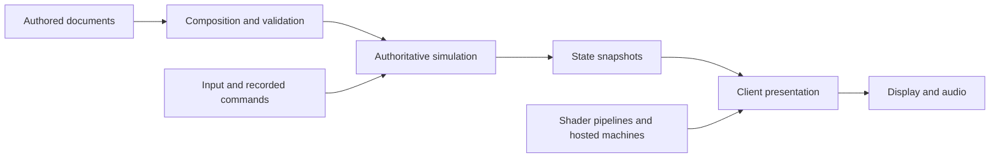

# Engine overview

Puck is a C# engine for document-defined interactive worlds. It combines
simulation, GPU rendering, shader pipelines and handheld-console emulation.
`Puck.World` is the application that brings these libraries together. Its
worlds and behavior are described by JSON documents; the Puck DSL provides a
more concise way to author those documents.

## What you can work with

A world document describes content and its relationships: objects, cameras,
screens, rules, hosted machines and permissions. You can load a world, change
it through console commands, and record inputs for replay. The same document
model is used by authoring tools and the running application.

The engine includes several systems that can also be studied independently:

- **Simulation:** fixed-step state updates, physics, rules and recorded input.
- **Rendering:** a signed-distance field (SDF) renderer, where shapes are
  described by distance functions, and programmable compute/fullscreen shader
  pipelines. Vulkan and Direct3D 12 provide the GPU implementations.
- **Emulation:** Game Boy/Game Boy Color and Game Boy Advance machine cores,
  with cartridge authoring and hosting in World.
- **World services:** authority, permissions, networking, storage and transfers
  between worlds.

The [project map](project-map.md) connects these responsibilities to the
repository's individual projects. Each project README owns its API-specific
explanations and usage details.

## From a document to a frame

A **definition** is the authored document. It can compose other documents and
must pass validation before it becomes active. The server then advances the
world in fixed steps, applying input and rules to its authoritative state.
Authoritative means that this server decides the accepted state of that world.

The client receives snapshots of that state and prepares the presentation:
cameras, rendered objects, screen images and audio. A hosted emulator or shader
pipeline can supply an image to a screen without changing how that screen is
placed in the world. Console commands provide an interface for both people
and automation to inspect and operate the running application.

The [architecture guide](architecture/README.md) explains these boundaries and
the more detailed relationships between worlds.

## Reproducible simulation

At a fixed code version, the same document and recorded inputs are intended to
produce the same simulation state. Fixed-point arithmetic stores fractional
values using integers with a defined scale. Random choices use reproducible
streams; external observations enter through recorded boundaries.

This guarantee does not require identical pixels on every GPU. Presentation
uses floating-point calculations, interpolation and display-specific behavior.
Rendering checks compare suitable observable results separately from exact
simulation-state checks. A deliberate change to simulation behavior can also
change a replay's result across code versions.

## Working with Puck

Use [getting started](getting-started.md) to build and run the application.
The [authoring guide](authoring/README.md) then helps you choose a world, shader
or cartridge workflow. For implementation work, follow
[development](development/README.md) to the relevant project and checks.

The current rendering path and the proposed hybrid mesh/SDF work are described
separately in the [rendering guide](rendering/README.md) and
[pipeline evolution plan](plans/shader-pipeline-evolution.md). Proposed features
and dated verification results are not a promise that every configuration is
supported. Check the relevant subsystem guide for restrictions before depending
on a capability.
