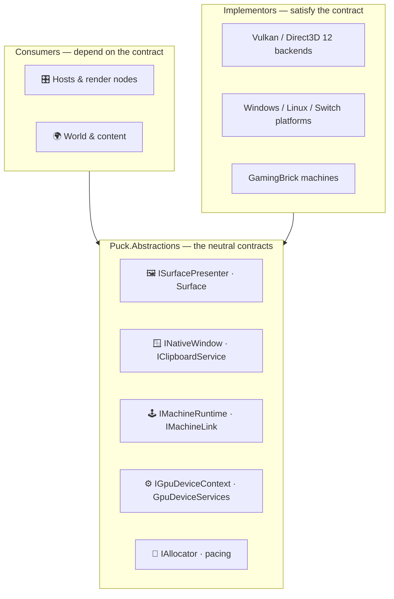

# Seam abstractions

Puck.Abstractions is the engine's neutral contract layer: the backend- and
platform-agnostic interfaces and small value types that everything else in the
engine is written against. A render node asks for a *surface presenter*, not for
Vulkan or Direct3D 12; a host drives an *`IMachineRuntime`*, not a specific
emulator; a component allocates through an *`IAllocator`*, not through a
particular platform heap. The concrete implementations live in the backend,
platform, and content projects; this project is only the shape they agree on.

It sits at the bottom of the dependency graph beside Puck.Maths, the one engine
project it references, so every other project can reference it without pulling
in a backend or a host. That is the whole point: the seam is what lets a Vulkan and a
Direct3D 12 backend, a Windows and a Linux window, or a real machine and a
headless stand-in be swapped without touching the code that drives them.

## Key features

- *One seam per capability:* presentation, windowing, machine runtimes, GPU
  compute, capture, recording, lamp arrays, allocation, pacing, and work
  counting each get a small, explicit contract instead of a concrete
  dependency.
- *Backend- and platform-neutral:* no GPU API types, no OS handles in the public
  surface—those stay inside the backend and platform projects that implement
  these interfaces.
- *One extension contract:* `IPuckExtension`, `PuckExtensionSet`, and the
  `[PuckExtension]` attribute let any host compose installed capabilities the same
  way; [Extensions](extensions.md) explains the model.
- *Bottom of the dependency graph:* references only Puck.Maths, another leaf,
  so it can be shared everywhere without creating a cycle or dragging in a
  backend.
- *Value types carry no behavior:* the records and enums here (surface formats,
  present modes, lamp colors, pad state) are plain data the contracts exchange.
- *Determinism-friendly by construction:* the machine and pacing seams
  are shaped around whole-tick, host-owned advancement rather than wall-clock
  callbacks.

## The contract seam

Shared code depends *down* onto a contract; a backend, platform, or host
implements it *up*. Nothing in this project reaches sideways to another engine
project.



## What each group contracts

| Group | Primary contracts | Implemented by |
|---|---|---|
| **Presentation** | `ISurfacePresenter`, `Surface`, `SurfaceFormat`, `PresentMode`, `PresentationOptions`, present-timing and device-lost feedback, `PresentationWork` (a presenter's `presentation.skipped` counter source), `OffscreenRenderBudget` (the one per-produced-frame offscreen-submit budget the view stack's refresh share and the world validator's window ceiling both read) | the GPU backends and their presentation projects |
| **Windowing** | `INativeWindow`, `INativeWindowFactory`, `IClipboardService`, per-platform `NativeSurfaceBinding` (Win32, Wayland, Xcb, Vi) | `Puck.Platform` |
| **Machines** | `IMachineRuntime`, `IMachineEngine`; optional `IMachineVideoOutputs`, `IMachineAudioOutputs`, `IMachineInputPorts`, `IMachineContentSlot`, `IMachineLink`, `ITimeTravelMachine`, `IReconfigurableMachine`, and descriptor-validated `IMachineOperationProvider` | the GamingBrick emulators and other hosted machines |
| **Gpu** | `IGpuDeviceContext`, whose `Services` (`GpuDeviceServices`: the recorder, bindings, queue submitter and every factory, each bound to the context and taking no device argument) the backend creates with the context and every consumer reaches the device through, whose `Identity` (`GpuDeviceIdentity`: backend, adapter, PCI ids, driver and API versions) the backend records when it creates the device, for readouts only, whose `Capabilities` (`GpuDeviceCapabilities`: descriptor sets or root-signature words, push-constant bytes, per-stage descriptor limits, and Direct3D 12's binding tier, root signature version, shader model and heap sizes) it records beside the identity, and whose `MemoryProfile` (`GpuMemoryProfile`: coherent unified memory, device-local bytes, the largest device-local heap, host-visible device-local bytes) it fills at the same time for residency; `GpuResidency.Select`, the pure choice of a `GpuResidencyPolicy` (in place, ring or staged) from a profile and a region's size; `GpuRegion`, a region the host writes and GPU work reads under any policy, with `GpuUploadRuns` tracking the ranges each buffer owes | the GPU backends; `GpuResidency` and `GpuRegion` are backend-neutral |
| **Counting** | `WorkKind` (each kind declares its `WorkClass`: deterministic, per-backend-deterministic or pacing), `WorkCount`, `IWorkCounterSource` (each source has a stable dotted `Name`), `WorkCounterSet` (a named source over a fixed list of kinds that any thread counts into), `WorkCounterSources` (the shared `TryReadSingle` a source that counts exactly one kind answers `TryRead` with), `ForwardingWorkCounterSource` (one stable source over the instances its owner replaces or runs side by side, summing the live ones and carrying each retired instance's totals), `AllocationWindow`, and `WorkCounterReport`, the text and JSON form every counter readout prints; for GPU work, `GpuWorkLedger`, `GpuWorkSample`, the pass-through wrappers of `GpuWorkCounting`, `GpuWorkReport`, and `IGpuWorkRegistry`, the host's list of render nodes | any engine service that counts deterministic work; render nodes for GPU work; `world.counters` reads both |
| **Sources** | `ImageSourceDescriptor` (producer, transport, extent, `ImagePixelFormat`, `ImageColorEncoding`, `ImageSourceCadence`, `ImageSourceStamp`, `ImageContentClass`, capture fill), `IImageSourceProducer` and `ImageSourceProducerRegistry<TProducer>` (producers by id), `ImageSourceUploadLayout` (an uploaded source's region), `ImageSourceConversion` (the CPU reference of the shipped conversion kernels), `IImageSourceReference` and `ImageSourceVerdict` (the exact verdict of a deterministic source) | the World's image producers; the conversion kernels in `Puck.Shaders` |
| **Capture / Recording** | `IFrameCaptureSource`, `ICaptureSink`, `IVideoEncoder`, `IAudioCaptureSource`, `RecordedPacket` | `Puck.Platform` and `Puck.Recording` |
| **Lighting** | `ILampArrayDevice`, `LampColor`, `LampInfo`, `LampPurposes` | `Puck.Platform` |
| **Memory / Pacing** | `IAllocator`, `IPrecisionWaiter`, `IDisplayTimingInfo` | `Puck.Platform` |

## Depending on a contract

Machine content admission is also a host-selected contract:
`IMachineContentAdmissionPolicy` evaluates pinned bytes and provider-verified
source formats. `MachineContentAdmissionPolicy` supplies open, format-based,
and exact executable-hash modes. See the [GamingBrick preset and host
obligations](../emulation/shared/machine-hosting.md#host-selected-content-admission).

Consumers take the interface and stay ignorant of the implementation. A render
node that needs to present a frame asks for an `ISurfacePresenter`; whichever
backend the host composed in satisfies it.

```csharp
using Puck.Abstractions.Presentation;

// The render node holds the neutral seam, never a backend type.
public sealed class RenderNode(ISurfacePresenter presenter)
{
    public void Present(Surface surface) =>
        presenter.Present(surface: surface);
}
```

The composition root—`Puck.Launcher` or `Puck.World`—is the one place that
chooses the concrete `ISurfacePresenter`, `INativeWindowFactory`, and machine
implementations and hands them to the code that only knows the contracts.

## Where the implementations live

- **GPU backends**—`Puck.Vulkan`, `Puck.DirectX` and their `*.Presentation`
  projects implement `ISurfacePresenter`, `IGpuDeviceContext`, and the services
  in its `GpuDeviceServices`.
- **Platform**—`Puck.Platform` implements windowing, clipboard, capture, lamp
  arrays, allocation, and pacing against the current OS.
- **Machines**—`Puck.HumbleGamingBrick` and `Puck.AdvancedGamingBrick`
  implement runtime and optional hardware/presentation contracts; `Puck.Hosting` drives them.
