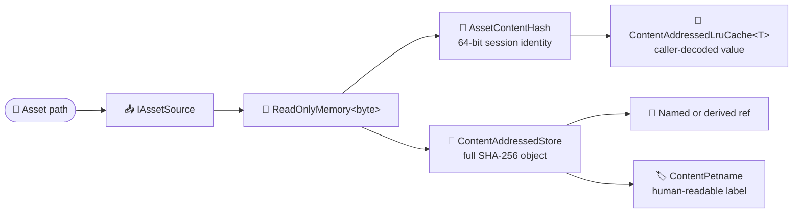

# Content addressing and assets

Puck.Assets gives asset pipelines a small place to agree on bytes and identity
before format-specific code takes over. An **asset source** turns a path into a
complete byte payload. A compact content hash identifies that payload during a
process, and a bounded cache lets a loader reuse the decoded object when the
same bytes appear again under the same or a different path.

The library also carries the persistent form of the same idea. A
`ContentAddressedStore` writes immutable objects under their full SHA-256
digest, while named **refs**—small text files that point to an object—give
people and tools stable names for content that may change. `ContentPetname`
turns a hash into a short label such as `Willow-Lantern-Nine` when raw hex would
be awkward to read aloud.

The library carries five codec families. `PngEncoder` and `PngDecoder` round-trip 8-bit
RGBA stills and APNG animations for capture frames and baked font atlases.
`Puck.Assets.Textures` compresses texture levels to BC4, BC5, BC6H and BC7 and
builds their tile-aware mip chains, with an exact decoder beside each encoder.
`QrEncoder` goes the other direction—a payload string in, a scannable module
grid out; there is no QR decoder here. `AutomaticIntegerSequenceCodec` carries
compiled numeration/DFAO programs as compact, deterministic, versioned binary,
validating the byte structure under explicit allocation ceilings.
`ChunkContainer` is the one container Puck's binary products share: a format's
magic and header, then content-hashed, 8-byte-aligned chunks, written with the
same canonical primitives (`CanonicalBinaryWriterExtensions`,
`CanonicalBinaryReader`) the automatic-sequence codec uses. Puck.Assets
does not decode fonts, shaders, or documents, and it does not mount archives,
layer sources, or normalize paths.

`dotnet pack` produces `ByteTerrace.Puck.Assets`; the first NuGet.org release
has not been published yet. The package targets .NET 10, depends on the
`System.IO.Hashing` package (CRC-32 for the PNG codec), and references
`Puck.Maths` (the QR encoder's Reed–Solomon error correction).

This reference is the human entry point. The
[generated API reference](../api/index.md) owns complete member signatures,
parameters, return values, and exceptions.

## Key features

- *Source-independent loading:* `IAssetSource` lets a loader consume a path
  without knowing whether the bytes came from the local file system, an
  archive, an embedded resource, or another source.
- *Identity by content:* `AssetContentHash` gives equal payloads the same small
  key even when their paths differ.
- *Bounded reuse:* `ContentAddressedLruCache<TValue>` retains recently used
  decoded values and evicts the least recently used value at a fixed capacity.
- *One pin grammar:* `ContentPin` (`sha256/<hex64>`) and `AssetContentHash`
  (`sha256-64/<hex16>`) are the only code that computes, parses, and prints a
  content pin, and both refuse anything but lowercase canonical text.
- *Persistent deduplication:* `ContentAddressedStore` writes one immutable
  object for each full SHA-256 digest and avoids rewriting bytes already held.
- *Stable names and derivations:* named refs point to stored objects, while
  derived refs remember the output produced from a particular input hash.
- *Readable diagnostics:* `ContentPetname` maps a hash to a deterministic
  three-word label for logs and operator-facing output.
- *A minimal PNG/APNG codec:* `PngEncoder` and `PngDecoder` write and read
  8-bit RGBA stills and full-frame APNG animations—just enough to round-trip
  the files Puck itself writes and bakes, not a general image library.
- *Deterministic block compression:* `Bc4Codec`, `Bc5Codec`, `Bc6hCodec` and
  `Bc7Codec` encode 4x4 blocks with the same bytes on every machine, and
  `TextureMipChain` filters a tiled atlas into mips that never mix tiles.
- *A spec-correct QR encoder:* `QrEncoder` builds ISO/IEC 18004 byte-mode
  symbols—auto version selection, all four error-correction levels, and a
  CPU-rasterizable module grid—from a payload string.
- *Canonical automatic-sequence artifacts:* `AutomaticIntegerSequenceCodec`
  preserves positional or quadratic-Ostrowski numeration, the reachable DFAO
  graph, and its arbitrary-width output alphabet. Re-encoding decoded bytes is
  byte-identical, so the full SHA-256 digest is a stable persistent identity.
- *One chunk container:* `ChunkContainer` stores keyed, content-hashed,
  8-byte-aligned chunks under a format's own magic and header. A compiled world
  and a `PBAK` bake are both one; a decode reads a container whole or refuses it.
- *A small dependency surface:* the package depends on the .NET base class
  library, `System.IO.Hashing`, and `Puck.Maths` (the QR encoder's field
  arithmetic), and does not perform dependency-injection wiring.

## How bytes move through the library

The in-process path and the persistent path begin with the same bytes but use
different identities. A process-lifetime cache wants a small, cheap key; a
store that may accumulate objects for years keeps the complete digest.



The cache never decodes a value itself. Its `valueFactory` belongs to the
consumer, so a shader loader can cache bytecode while a font loader caches a
font atlas without adding either format to this package.

## Quick start

This example reads a UTF-8 asset from disk, hashes its bytes, and decodes it
only on a cache miss:

```csharp
using System.Text;
using Puck.Assets;

var source = new FileSystemAssetSource();
var decodedText = new ContentAddressedLruCache<string>(capacity: 128);

var bytes = source.Read(path: "assets/dialogue/intro.txt");
var hash = AssetContentHash.Compute(content: bytes.Span);

var text = decodedText.GetOrAdd(
    hash: hash,
    valueFactory: () => Encoding.UTF8.GetString(bytes.Span));

Console.WriteLine($"{hash}: {text}");
```

When the bytes must survive the process, put them in a persistent store and
give the object a ref:

```csharp
using Puck.Assets;

var store = new ContentAddressedStore(
    root: Path.Combine(Path.GetTempPath(), "puck-objects"));

var objectHash = store.Put(content: bytes.Span);

store.SetRef(
    category: "dialogue",
    name: "intro",
    hash: objectHash);

if (
    store.TryResolveRef(category: "dialogue", name: "intro", hash: out var resolvedPin) &&
    store.TryGet(pin: resolvedPin, content: out var storedBytes)
) {
    Console.WriteLine($"{ContentPetname.From(hashHex: resolvedPin.Hex)}: {storedBytes.Length} bytes");
}
```

`Put` returns the object's `ContentPin`, whose text form is
`sha256/{64 lowercase hex characters}`. Writing identical bytes again returns
the same pin and keeps the existing object.

## Supplying bytes

`IAssetSource` is deliberately small:

```csharp
bool Exists(string path);
ReadOnlyMemory<byte> Read(string path);
```

`Read` returns the complete payload. The interface is synchronous, so it is a
good boundary for local assets that a loader needs in full before decoding.
Implementations for remote or streamed data should usually perform that work
outside the loading hot path and expose the resulting local bytes through this
contract.

Paths are opaque. An asset source receives exactly the string the caller
supplies; joining a base directory, choosing search roots, and normalizing
separators are caller responsibilities. `FileSystemAssetSource` follows this
rule by passing the path directly to `System.IO.File`.

Both `FileSystemAssetSource` methods reject a null, empty, or whitespace path.
`Exists` reports whether a file is present, while `Read` returns its bytes or
lets the file-system exception describe why it could not be read.

## Choosing a content identity

Puck.Assets has two SHA-256 representations because they solve different
problems:

| Representation | Text form | Use it for |
|---|---|---|
| `AssetContentHash` | `sha256-64/{16 lowercase hex characters}` | Compact in-memory identities, cache keys, document pins, and diagnostics. |
| `ContentPin` | `sha256/{64 lowercase hex characters}` | Persistent objects, named refs, derived artifacts, release files and manifests, and interchange between runs. |

Each type is the one place its form is computed, parsed, and printed.
`ContentPin.Compute` hashes a span or a stream, `ContentPin.OfFile` streams a
file, and `ContentPin.FromDigest` wraps a digest a caller built incrementally.
`ContentPin.TryParse` and `AssetContentHash.TryParse` admit only the canonical
text: the exact prefix followed by lowercase hexadecimal digits of the exact
length. Uppercase digits, whitespace, and any other length are refused, so a
pin that one reader admits, every reader admits, and it names the same object
path on a case-sensitive file system. `ContentPin.TryParseHex` reads the bare
64 digits that an object file name or a derived-cache key carries.

`AssetContentHash.Compute` hashes the payload and stores the first eight digest
bytes in a `ulong`. The 64-bit result is intentionally compact: it is suitable
for deduplication and caching, but collisions become plausible around 2³²
distinct payloads. It is not an authentication or tamper-evidence mechanism.

The persistent store keeps all 256 bits. That makes accidental collisions
negligible for a store that grows over time, but the digest alone still does
not say who supplied the bytes. When authenticity matters, the expected digest
must arrive through a trusted or signed channel.

## Caching decoded values

`ContentAddressedLruCache<TValue>` maps `AssetContentHash` values to whatever a
consumer produced from the bytes. Reading, adding, or replacing an entry marks
it most recently used. When the cache exceeds its fixed capacity, it removes
the least recently used entry.

| Member | Behavior |
|---|---|
| `GetOrAdd(hash, valueFactory)` | Returns an existing value or invokes the factory, stores its result, and returns it. |
| `TryGet(hash, out value)` | Reports a hit and refreshes that entry's recency. |
| `Set(hash, value)` | Adds or replaces a value and evicts from the oldest end when necessary. |
| `Clear()` | Removes every entry. |
| `Capacity` / `Count` | Report the fixed limit and current number of entries. |

The optional eviction callback runs whenever a value leaves the cache: capacity
eviction, replacement under an existing hash, and `Clear` all use the same
path. It is the natural place to dispose native handles or return pooled
buffers. The cache is not thread-safe; a caller that shares one instance across
threads must synchronize access.

## Persisting objects and refs

A `ContentAddressedStore` creates three directories beneath its root:

```text
objects/sha256/ab/ab…   immutable object bytes, fanned out by the first two hex digits
refs/<category>/<name>  a one-line sha256/<hex> pointer
tmp/                    write staging before an object or ref is promoted
```

`ContentAddressedStore.ObjectPath(root, pin)` and
`ContentAddressedStore.ObjectRelativePath(pin)` state that layout once. A
reader that shares the tree without opening a store, such as a launcher release
source or an HTTP mirror of the tree, addresses objects through them.

Object writes are staged in `tmp/` and moved into place. If another writer has
already stored the same object, the duplicate temporary file is discarded.
Objects are never overwritten because their address is derived from their
bytes.

Refs provide mutable names over those immutable objects. `SetRef` replaces a
ref atomically, `TryResolveRef` reads it, and `ListRefs` returns the names in a
category in ordinal sort order. A category may itself contain path segments,
which is how the derived-cache helpers use `derived/<kind>`.

`SetDerived(kind, inputHash, outputHash)` records the output produced from one
input. `TryResolveDerived` performs the inverse lookup, allowing a build tool
to skip work while the input content remains unchanged.

## Replacing a file atomically

`AtomicFile` replaces one file so that a reader, or a process that crashes
mid-write, never finds half of it behind the real name. `WriteAllBytes` and
`WriteAllText` take the whole content; `Write` hands a stream to a writer that
produces it incrementally. Each writes a temporary file beside the destination,
flushes it to disk, and renames it over the destination:

```csharp
AtomicFile.WriteAllText(
    contents: manifest.Version,
    path: Path.Combine(cacheRoot, "current"));
```

A missing parent directory is created. A write that fails at any step, including
a writer that throws, leaves the old file in place and deletes its temporary
file. A reader that holds the old file memory-mapped keeps seeing the old bytes
and does not block the replacement: when Windows refuses the rename over a
mapped file, `AtomicFile` falls back to `File.Replace`, which moves the old file
aside. On Unix the replacement keeps the destination's file mode, or takes the
`unixCreateMode` the caller names, such as owner-only for a private key. A
destination spelled in another case than the entry a case-insensitive file
system already holds keeps that entry's name.

The store does not use `AtomicFile` for its own writes. It stages in `tmp/` so
that `ListRefs` never sees a temporary file beside a ref.

## Naming content for people

`ContentPetname.From` turns the leading bytes of a hexadecimal hash into three
words selected from fixed lists:

```csharp
string label = ContentPetname.From(
    hashHex: "sha256/00112233445566778899aabbccddeeff00112233445566778899aabbccddeeff");

// "Willow-Bucket-Three"
```

The same hash always gets the same label on every machine and build. A petname
is only a compact aid for conversation and logs: many hashes share one, so it
must always remain paired with the real content hash when identity matters.

## PNG stills and animations

`PngEncoder.Write` takes tightly packed 8-bit RGBA pixels (row-major, no row
padding) and writes them as color-type-6 PNG: no row filtering, zlib-compressed
scanlines. `PngEncoder.WriteAnimation` writes the same pixel shape as an APNG—
`acTL`/`fcTL`/`fdAT`, every frame full-size at a uniform delay, looped
`playCount` times (0 loops forever).

`PngDecoder.Decode` reads 8-bit, non-interlaced PNGs back to tightly packed
RGBA: color types 0 (grayscale), 2 (RGB), 4 (grayscale + alpha), and 6 (RGBA),
all five standard scanline filters, every chunk CRC-checked, `tRNS`
transparent-color metadata applied, and unknown critical chunks refused.
`PngDecoder.DecodeAnimation` reads an APNG's frames the same way; a
non-animated PNG decodes as one zero-delay frame. Only full-size,
source-blended APNG frames are supported—sub-rectangle and `over`-blended
frames are refused.

This is a minimal codec pair, not a general image library: just enough to
round-trip the files Puck itself writes and bakes, including `Puck.Text`'s
font atlas artifacts (`FontAtlasArtifactWriter` / `FontAtlasImageDataLoader`)
and `Puck.Recording`'s capture stills (`CaptureSink`).

## Block-compressed textures

`Textures/` compresses texture levels for GPU sampling. A level is stored in a
`GpuPixelFormat` from `Puck.Abstractions`, the one pixel-format vocabulary a GPU
upload also takes: the uncompressed `R8Unorm`, `R8G8Unorm`, `R8G8B8A8Unorm` and
`R16G16B16A16Float`, and the block formats. `GpuPixelFormats` gives a level's
extent and byte size, and each block format's block size, which the codecs read.
`TextureCompression` encodes and decodes a whole level block by block, repeating
edge texels into a partial block, and names the uncompressed format each block
format encodes (`TextureCompression.SourceOf`); the codecs work one block at a
time:

| Codec | Encodes | Decoder reads | Stored exactly |
|---|---|---|---|
| `Bc4Codec` | One 8-bit channel: the better of the eight-value and six-value palettes over the block's extremes | Both palettes | One or two distinct values |
| `Bc5Codec` | Two 8-bit channels, each a BC4 block | Both palettes | One or two values a channel |
| `Bc6hCodec` | Three unsigned halves in the one-region modes 11 to 14 or the two-region modes 1 to 10, whichever decodes nearest | Every mode; reserved modes as zero | One value |
| `Bc7Codec` | RGBA8 in the one-subset modes 6 and 5 or the partitioned modes 7, 3, 1, 2 and 0, whichever decodes nearest | Every mode | One color |

Each encoder is integer arithmetic plus, for its least-squares endpoint refit,
scalar double arithmetic in a written order, so its bytes are the same on every
machine. Each decoder is exact to its format, so it is the encoder's test
oracle. BC7's partitioned modes fit the `Bc7Codec.PartitionCandidates`
partitions whose subsets vary least, ranked by exact integer variance with the
lower partition number first among equals; modes 0 to 3, which hold no alpha,
are tried only for a block whose alpha is 255 throughout. A tie in decoded
error keeps the earlier mode in the order 6, 5, 7, 3, 1, 2, 0. BC6H's
two-region modes split a block by the first 32 of the same two-subset
partitions, ranked the same way, and fit the `Bc6hCodec.PartitionCandidates`
best after the one-region modes, in the order 1 to 10, an earlier candidate
keeping a tie. Modes 1 to 9 store three endpoints as signed deltas from the
first: the encoder orders each region's endpoints for its anchor, clamps a delta
the mode cannot hold toward the first endpoint, and picks every index against
the stored endpoints. The unsigned format is the only one: no texture declares
signed BC6H.

`TextureMipChain` builds a mip chain over an atlas of square power-of-two tiles:
each level halves with a 2x2 box inside one tile, and the chain ends where a
tile is one texel. Its filters average unsigned-normalized codes, average sRGB
color in linear light through the exact `ImageSourceConversion.Srgb8ToLinear`
and `LinearToSrgb8`, renormalize octahedral normals, keep the majority of an
identity, and average halves; coverage weights keep empty texels out of the
average. `OctahedralNormal` stores a unit direction in two 8-bit codes. The SDF
baker stores its textures through these types
([prototype bakes](../rendering/sdf/handbook/bricks-and-baking.md#prototype-bakes)).

## QR encoding

`Qr/` is a deterministic, spec-correct ISO/IEC 18004 byte-mode encoder:
`QrEncoder.TryEncode` picks the smallest version (1..10) that holds a payload
at the requested error-correction level (`QrErrorCorrectionLevel`), builds the
interleaved data+EC codeword sequence (`QrReedSolomon`, generic Reed–Solomon
over `Puck.Maths.ReedSolomon`/`BinaryField<T>`), and places it into a
`QrMatrix`—all eight mask patterns scored by the spec's four penalty rules,
correct format/version info bits, and a nearest-neighbor B8G8R8A8 raster
(`QrMatrix.RenderPixels`) for CPU-side upload. Pure integer math throughout:
the same payload and level always build the identical matrix, so a caller can
also ask `QrEncoder.TryFindVersion` whether a payload FITS a level without
building the matrix—the question a document validator asks before an
authoring-time refusal, and the question `QrEncoder.TryEncode` asks itself
before building.

The field arithmetic is `Puck.Maths`'s: `QrReedSolomon` binds the standard's
own choice of field (`GF(256)` under `t⁸+t⁴+t³+t²+1`, `0x11D`—a different
modulus from the catalog's `BinaryFields.Degree8`, `0x11B`) and generator
convention to the shared carrier. What stays here is what is genuinely the
standard's: the block-count and capacity tables, the alignment-pattern
coordinates, the format/version BCH codes, masking, and matrix placement.

## Chunk containers

`ChunkContainer` is the one binary container every chunked Puck product uses: a
compiled world (`Puck.World.CompiledWorld`, magic `PWLD`) and a Game Boy art
bake (`PbakBundle`, magic `PBAK`). A format supplies its four-byte magic, a
format version, and a header whose bytes it owns; the container supplies the
chunk layout and the refusals. Every integer is written by
`CanonicalBinaryWriterExtensions`—minimal little-endian base-128 unsigned
integers, sign-and-magnitude integers, length-prefixed UTF-8 text, and
little-endian 64-bit words—and `CanonicalBinaryReader` accepts only that
spelling, so equal containers are equal bytes.

```text
magic[4]  formatVersion:varuint  headerLength:varuint  header  chunkCount:varuint
chunk:
  code[4]  version:varuint
  inputCount:varuint  { name:text  present:byte  [hash:u64] }  (ascending ordinal name order)
  payloadLength:varuint  payloadHash:u64
  zero padding to the next multiple of 8, counted from the container's first byte
  payload
```

A chunk's `ChunkCode` is four printable ASCII characters naming the chunk and the
derivation that wrote it. Its version is that derivation's version, and its
inputs (`ChunkInput`) are what the derivation read beyond what the header keys,
each named as the derivation spells it, with the input's 64-bit content hash or
its absence. The payload's `AssetContentHash` is checked on every decode. The
container keeps chunks in the order they were written and lets a code repeat; a
format that allows each code once, such as a compiled world, refuses a repeat
itself. `ChunkContainer.Decode` refuses, with `InvalidDataException`, a wrong
magic, a noncanonical integer, nonzero padding, a payload whose hash disagrees,
inputs out of order, a count or length the remaining bytes cannot hold, a
container past its byte ceiling, and trailing bytes, so a decode never allocates
more than the bytes it was given can justify. Decoded headers and payloads are slices of the bytes the
caller supplied, never copies.

## Core types

This table is the conceptual map. The
[generated API reference](../../docs/api) owns the complete member-by-member
surface.

| Type | Role |
|---|---|
| `IAssetSource` | Supplies complete byte payloads by opaque path. |
| `FileSystemAssetSource` | Reads an `IAssetSource` from the local file system. |
| `AssetContentHash` | Holds the compact 64-bit SHA-256-derived identity used for process-lifetime caching. |
| `ContentAddressedLruCache<TValue>` | Retains a fixed number of decoded values by content identity. |
| `ContentAddressedStore` | Persists immutable objects under full SHA-256 addresses and manages named and derived refs. |
| `AtomicFile` | Replaces one file atomically through a temporary file beside it, leaving nothing behind on failure. `world.save`, the forge console's cartridge and draft writes, an owned world's synced basis-chain and tip documents, and the `.puck` compile cache's persisted entries all write through it. |
| `ContentPetname` | Produces a deterministic three-word label from a hexadecimal content hash. |
| `PngEncoder` / `PngDecoder` | Write and read 8-bit RGBA PNG stills and full-frame APNG animations. |
| `PngImage` / `PngAnimation` / `PngAnimationFrame` | The decoded still and animation shapes `PngDecoder` returns. |
| `TextureColorSpace` | Whether a texture's values are linear or sRGB-encoded. |
| `Bc4Codec` / `Bc5Codec` / `Bc6hCodec` / `Bc7Codec` / `TextureCompression` | Encode and decode block-compressed blocks and whole levels. |
| `TextureMipChain` / `TextureMipFilter` / `OctahedralNormal` | Build tile-aware mip chains and store unit directions in two channels. |
| `QrEncoder` | Builds an ISO/IEC 18004 byte-mode `QrMatrix` from a payload string and error-correction level. |
| `QrMatrix` | The resolved module grid—placement, masking, and a B8G8R8A8 raster. |
| `QrErrorCorrectionLevel` / `QrErrorCorrection` | The four EC levels and their one canonical letter spelling/parse. |
| `QrCapacityTable` / `QrReedSolomon` | The version/level block-and-capacity tables and the standard's Reed–Solomon binding. |
| `ChunkContainer` / `ContainerChunk` / `ChunkCode` / `ChunkInput` | The shared chunk container, one keyed and content-hashed chunk, its four-character code, and one input a chunk's derivation read. |
| `CanonicalBinaryWriterExtensions` / `CanonicalBinaryReader` | Write and read the canonical binary primitives the automatic-sequence codec and the chunk container share. |

## Design notes

- **Bytes stay mostly untyped.** Beyond the PNG and texture codecs, decoders,
  serializers, GPU uploaders, and format validation belong to consumers.
- **Paths stay with the caller.** There is no virtual file system, mount table,
  fallback search, or normalization policy in this package.
- **The two hash widths are deliberate.** A process cache uses the compact
  `AssetContentHash`; durable storage uses the full digest returned by
  `ContentAddressedStore`.
- **Cache eviction is synchronous.** The callback runs on the thread that
  caused the removal, so it should perform bounded cleanup.
- **Storage operations are local and synchronous.** The object store is a
  file-system building block, not a remote object-store client.
- **Atomic files do not make a transaction.** Object promotion and individual
  ref replacement are atomic, but a caller coordinating several refs or other
  state must supply its own transaction boundary.

## Verification

```powershell
dotnet test tests/Puck.Assets.Tests/Puck.Assets.Tests.csproj
```

`PngCodecLawTests` builds hand-crafted chunk streams to exercise the decoder's
chunk and CRC handling directly, alongside encode/decode round-trips for both
stills and animations. `QrCodecLawTests` pins a known payload's matrix
fingerprint and proves the fingerprint is sensitive to the input by flipping
one codeword byte. `AutomaticSequenceCodecTests` pins both binary artifact
digests, checks byte-identical re-encoding for save and network crossings,
exercises positional and Ostrowski programs, and proves that malformed or
over-limit input is refused before mathematical verification.
`TextureCodecLawTests` round-trips every representable block exactly (every
uniform value, and two-endpoint blocks each format holds), reads hand-built
blocks field by field, bounds the error on a natural test image, and pins each
encoder's bytes for that image by SHA-256. `TextureMipChainLawTests` proves no
level mixes tiles under any filter, and checks the linear-light sRGB average,
renormalized and coverage-weighted normals, the majority identity, and the
octahedral pair's angle.
`ChunkContainerLawTests` round-trips a container byte for byte with every payload
aligned, and refuses a wrong magic, a changed payload, nonzero padding, a
noncanonical integer, trailing and missing bytes, a container past its byte
ceiling, and a count no remaining bytes could hold.

## Building the package

```text
dotnet build src/Puck.Assets/Puck.Assets.csproj -c Release
dotnet pack src/Puck.Assets/Puck.Assets.csproj -c Release
```

The package includes this README, the repository's licensing files, symbols,
and XML API documentation through the shared packaging policy.

## Documentation

- [API reference](../api/index.md)
- [Engine overview](../overview.md)
- [Contributing to Puck](../development/contributing.md)
