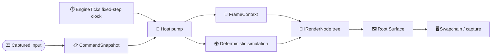

# Hosting and fixed-step simulation

Puck.Hosting is the shared host substrate between deterministic simulation and
presentation. A **host** owns the outer loop: it measures time, advances the
simulation in fixed steps, routes services and exclusive capabilities through a
tree of render nodes, and publishes completed surfaces without letting GPU or
capture work become simulation state.

It depends on `Puck.Abstractions` for presentation, machine, capture, and GPU
contracts, on [Commands and input](commands.md) for fixed-step
input snapshots and console sessions, and on
[Dialect-agnostic wire substrate](networking.md) for bounded framing and local
capability authentication.

## Key features

- *One recursive render contract:* `IRenderNode` produces a `Surface`, may host
  children, and receives device-loss notifications without changing simulation
  state.
- *Deterministic fixed-step context:* `EngineTicks` provides an integer time
  base that divides common update rates exactly. `FrameContext` keeps
  authoritative simulation ticks separate from presentation-only wall time and
  interpolation.
- *Scoped host services:* inherited capabilities flow to descendants, while
  held capabilities such as terminal control and input focus form explicit,
  revocable ownership chains.
- *The terminal's console tape:* `ConsoleTape` records the console exchange
  (submitted lines, result echoes, panel visibility) into a bounded scrollback
  ring and publishes immutable `ConsoleTapeFrame` snapshots through
  `ConsoleTapeStore`; `ConsoleLineEditor` owns the prompt row's caret-addressed
  buffer and command history. Renderers read `IConsoleTapeSource`; the window
  host bridges keystrokes in (`ConsoleInputSink` in `Puck.Launcher`).
- *Safe parallel stepping:* `ISteppableRenderNode` separates serial shared-state
  preparation from parallel private-state execution; GPU work stays on the
  render thread.
- *Presentation observability:* frame capture, latest-value publication, and
  emitted light remain outside the simulation trajectory.

## The host boundary

The fixed-step simulation is authoritative. Rendering, capture, and GPU
upload observe or present its state; they do not decide what the state
becomes.



## Quick start: a render node

An `IRenderNode` can return CPU pixels or a GPU image-view handle. This minimal
node produces a one-pixel CPU surface and has no device-owned resources to
release:

```csharp
using Puck.Abstractions.Presentation;
using Puck.Hosting;

sealed class StatusPixelNode : IRenderNode {
    private readonly byte[] pixels = [0x20, 0x80, 0xE0, 0xFF];

    public NodeDescriptor Descriptor { get; } = new(
        Name: "status-pixel",
        SurfaceId: SurfaceId.New());

    public Surface ProduceFrame(in FrameContext context) => Surface.CpuPixels(
        pixels: pixels,
        width: 1,
        height: 1,
        format: SurfaceFormat.R8G8B8A8Unorm);

    public void Dispose() { }
}
```

The outer host constructs one `FrameContext` per rendered frame. Its
`ElapsedTicks` advances only by completed fixed steps; its `AccumulatorTicks`
holds the fractional remainder used for interpolation:

```csharp
var context = new FrameContext(
    Host: HostContext.Empty,
    ElapsedTicks: elapsedTicks,
    DeltaTicks: stepsThisFrame * stepTicks,
    FrameDeltaTicks: wallTicks,
    AccumulatorTicks: accumulatorTicks,
    StepTicks: stepTicks,
    TargetWidth: width,
    TargetHeight: height);

Surface surface = root.ProduceFrame(context: in context);
```

`RenderTicks` is `ElapsedTicks + AccumulatorTicks`, and
`InterpolationAlpha` is the remainder divided by `StepTicks`. They are useful
for smooth presentation, but neither value authorizes another simulation step.

## Host contexts and capability ownership

`IHostContext` exposes two deliberately different policies:

| Policy | Lookup | Propagation | Typical use |
|---|---|---|---|
| Inherited capability | `TryResolveCapability<T>` | Flows through descendant contexts | Shared services, registries, factories |
| Held capability | `HoldsCapability<T>` | Belongs to one holder; a child receives it only through a grant | Terminal control, input focus, exclusive authority |

`HostContext` stores both kinds. `ChainedHostContext` tries its primary then its
fallback context for inherited capabilities, but checks only the primary for
held capabilities. That rule prevents an exclusive authority from leaking
through a convenient service fallback.

`HeldCapabilityGrants` creates a delegation chain. Revoking an ancestor grant
invalidates every descendant lease, including a descendant grant described as
irrevocable from that descendant's point of view:

```csharp
var childGrants = new HeldCapabilityGrants();
ICapabilityTakeBack? takeBack = childGrants.Grant<ITerminalControl>(
    grantor: parentContext);

var childContext = new HostContext(
    capabilities: new Dictionary<Type, object>(),
    heldGrants: childGrants);

// Later: remove this delegation and every subgrant rooted in it.
takeBack?.Revoke();
```

Two standard held capabilities keep unrelated authority separate:

- `ITerminalControl` is the baton for requesting application exit.
- `IInputFocus` claims and releases individual input devices, or all devices,
  for the current holder.

Composition code can collect `HostCapabilityContribution` values before it
builds the root context. Each contribution states its runtime type, instance,
and whether the capability is held.

## Clocks and fixed-step timing

`EngineTicks.PerSecond` is 50,400. Common simulation rates—including 24, 25,
30, 48, 50, 60, 72, 90, 120, 144, and 240 updates per second—divide that base
without a fractional tick. `EngineTicks.PerRate(rate)` returns the exact step
size and rejects a rate that does not divide the base.

Hosting uses several clocks because they answer different questions:

| Type | Question answered | Rule |
|---|---|---|
| `TickClock` | How much wall time elapsed since the previous host sample? | Converts `Stopwatch` time to engine ticks and carries conversion remainder |
| `InputClock` | When did an input arrive? | Process-wide monotonic capture clock shared by input backends |
| `OsTimeCorrelator` | Where does a native 32-bit millisecond event stamp belong on the input timeline? | Handles wraparound and clamps the result to the observed engine-time window |
| `FrameContext` | What fixed-step instant is being presented? | Integer ticks are authoritative; seconds and interpolation are derived at the presentation seam |

`IFixedStepSimulation.RatePerSecond` must divide `EngineTicks.PerSecond`
exactly. For each completed step, the launcher constructs a
`FixedStepContext`, builds and applies one `CommandSnapshot`, and then calls
`Step`. A render frame may contain zero, one, or several fixed steps.

The fields most often confused in `FrameContext` have distinct meanings:

| Field | Meaning |
|---|---|
| `ElapsedTicks` | Simulation time after all completed steps |
| `DeltaTicks` | Whole fixed-step advancement performed for this rendered frame |
| `FrameDeltaTicks` | Clamped wall interval for presentation and diagnostics only |
| `AccumulatorTicks` | Unconsumed engine ticks, always less than one normal step |
| `StepTicks` | Fixed update period |
| `RenderTicks` | Interpolated presentation instant: elapsed plus accumulator |

## Render lifecycle and publication

Every `IRenderNode` has a stable `NodeDescriptor`, produces one `Surface`, and
is disposable. Hosting nodes that own children forward `OnDeviceLost` through
the tree. Nodes that own device resources release stale handles there and
rebuild them on a later frame; device loss must not advance or reset simulation.

For hosts that parallelize CPU stepping, `ISteppableRenderNode` divides the
work into three phases:

1. `PrepareStep(in FrameContext)` runs serially and may drain shared input or
   timelines. It reports whether the node has work.
2. `ExecuteStep()` may run in parallel, but touches only the node's private
   state.
3. `ProduceFrame(in FrameContext)` remains on the render thread and performs
   GPU work.

`FrameCaptureController` owns an optional capture session, including its
engine-time cadence, frame indexing, budget, and capture-only fault isolation.
The launcher hands it the exact root surface and matching `FrameContext`
immediately before presentation. CPU-backed surfaces need no conversion; GPU
surfaces use the active presenter's optional readback capability. Capture
timestamps use authoritative `ElapsedTicks`, while cadence follows continuous
`RenderTicks` so it does not assume a fixed host presentation rate.

`ProduceFrame` must never wait for slow GPU object creation, because the same
thread drains the console and steps the simulation. `BackgroundBuild<T>` is how a
node moves that work off: it starts a build on the thread pool, the node polls
`TryTake` once per produced frame and installs the result at that frame
boundary, and until then it presents what it already has. A newer request
cancels the pending build with `Cancel`, and the discarded result is released
when the build finishes. Before the device goes away, `CancelAndWait` blocks
until the build's current unit of work returns, so nothing is created on a
device being torn down. The SDF engine's pipelines and live shader-pipeline
compilations both use it.

A node that samples an image another producer keeps writing, such as a camera
ring slot or a HUD frame, receives it as a `GpuImageLease`: an image-view
handle with an optional release callback and token. The node holds each such
lease in a `LeaseRetireList` until a fence wait proves the submission that
sampled it has finished, then retires the list, which runs every release once
in the order the leases were held. A node with frames in flight keeps one list
per frame-ring slot and moves each frame's list into its slot when it submits.
The SDF engine node and the unified overlay both use it.

`RenderGraphScheduler` decides which views render in a frame. Every view is a
`RenderGraphInstance`: a name, a refresh (a frame divisor or a rate in hertz),
the passes one render records, and the instances it may read.
`RenderGraphInstanceSet.TryCreate` validates a set and orders it so every
producer renders before the consumers that read it in the same frame. A read of
the instance's own output, or a read declared previous-frame, takes the
producer's last completed frame instead. A loop of same-frame reads is refused
with `SameFrameCycle`, naming every instance in the loop. `Schedule` is a pure
function of the set, a `RenderGraphFrame`, and the previous frame's
`RenderGraphHistory`. The frame carries the display's extent and rate, the
instances the display shows (`RenderGraphRoot`), how much of each rendering
instance's image another instance's output covers (`RenderGraphFootprint`),
and the frame's pass-pixel budget:

- An instance renders only when the display or an instance rendering this frame
  shows it, and at most once a frame however many consumers read it.
- It renders at its largest footprint: the consumer's own extent times the
  fraction the producer covers. `RenderGraphExtent` rounds that up to one of
  sixteen steps in its power-of-two octave, and keeps the allocation through
  a shrink of less than an eighth.
- It renders only when its refresh is due. A consumer of an instance that is
  not due reads that instance's latest completed output and never waits for it.
- The instances the display does not show directly spend at most the budget,
  priced as passes times pixels. The stalest due instance goes first, so an
  instance the budget defers is first in line on the next frame.

The schedule lists every instance with its status, extent, divisor, passes and
price, the renders in order, and the frame of its output each rendering
consumer reads. The caller owns it: `Schedule` fills a `RenderGraphSchedule`
created for the set, together with the history the next frame reads
(`RenderGraphSchedule.Next`). Scheduling into a schedule replaces everything it
held, and a refused frame leaves it unchanged. The next frame goes into another
schedule, because a schedule's own `Next` cannot be its input. A host that
alternates two schedules schedules a steady frame without allocating once their
read lists have grown to the frame's reads, and `RenderGraphFrame` is a value,
so describing each frame over the same root and footprint lists allocates
nothing either. Nothing renders through it yet: the live renderer still
composes its views itself, and moving it onto the scheduler is P11b in
[the rendering programme](../plans/rendering.md#p11--the-frame-graph-document-and-nested-views).

`RenderGraphHitWalk` follows a hit through nested instances. Each instance
reports, through `IRenderGraphHitScene`, the source placements in its world
(`Puck.Commands.SourceMapping`) and the camera it renders from. `Walk` casts a
ray into an instance's world and meets the nearest surface placement. When that
placement shows another instance's output, the walk casts a new ray through the
producer's camera from the hit's point on the image, and repeats in the
producer's world. `WalkDisplay` starts from the topmost pane under a display
point. A walk continues at most the limit it is given, which is normally
`RenderGraphInstanceSet.NestingDepth`, the longest chain of same-frame reads.
It ends on a producer's pixels, on an instance's world, off a source, at the
limit, on an image the showing instance does not read, or at an instance with
no camera. Every step maps in fixed point, so the same inputs walk the same
path on every run.

`PublishBuffer<T>` is the smaller handoff for immutable latest-state values. A
single writer swaps a holder reference and readers snapshot the newest value.
It is not a FIFO and retains no history, so use it only when skipping obsolete
intermediate publications is correct.

## Core types

| Area | Types | Purpose |
|---|---|---|
| Render tree | `IRenderNode`, `ISteppableRenderNode`, `NodeDescriptor`, `SurfaceId` | Recursive surface production and lifecycle |
| Fixed-step time | `EngineTicks`, `TickClock`, `FrameContext`, `FixedStepContext`, `IFixedStepSimulation` | Integer simulation time and presentation context |
| Input time | `InputClock`, `OsTimeCorrelator` | Monotonic capture timestamps and native event correlation |
| Host scope | `IHostContext`, `HostContext`, `ChainedHostContext`, `HostCapabilityContribution` | Inherited services and exclusive held capabilities |
| Delegation | `HeldCapabilityGrants`, `ICapabilityTakeBack`, `IHeldCapabilityLeaseSource` | Revocable held-capability chains |
| Standard authority | `ITerminalControl`, `IInputFocus` | Exit ownership and device focus |
| Observation | `FrameCaptureController`, `PublishBuffer<T>` | Capture sessions and latest-value handoff |
| Background work | `BackgroundBuild<T>` | A candidate built on the thread pool and installed at a frame boundary |
| Sampled images | `GpuImageLease`, `LeaseRetireList` | An image a submission samples, released once that submission retires |
| View scheduling | `RenderGraphInstance`, `RenderGraphInstanceSet`, `RenderGraphScheduler`, `RenderGraphExtent` | Which views render in a frame, at what extent, rate and price |
| Nested hits | `RenderGraphHitWalk`, `IRenderGraphHitScene`, `RenderGraphHitPath` | Where a pick through views that show other views lands |
| Child processes | `ChildProcess`, `ChildProcessResult` | Tool runs and driven companions started from an argument vector |

`ChildProcess` starts the tools that the CLI, the shader compiler and the
emulator diagnostics run. `RunAsync` takes an argument
vector, never a shell expression. It reads both captured streams while the child
runs, so a child that fills a pipe buffer on either stream still runs to exit, and
it returns only after both reads finish, so the tail of the output is never lost.
The run is bounded by an optional timeout on a caller-supplied `TimeProvider` and
by cancellation. Either bound kills the whole process tree and drains both
streams. A timeout is reported as `TimedOut` in the result, while cancellation
throws `OperationCanceledException`. `StartRedirected` starts a companion that
the caller drives itself. That caller owns all three redirected streams and must
drain every output stream it keeps open.

Extension discovery and its load contexts (`PuckExtensionDiscovery`,
`PuckExtensionLoadContext`) and the `HostedControl` contribution also live in
this project; [Extensions](extensions.md) explains them.

The machine-neutral queued-host substrate (`QueuedMachineWorker`,
`IQueuedMachineCore`, `MachineTimeTravel<TInput>`, `QueuedHostContractProbe`)
lives in [Machine hosting runtime](../emulation/shared/machine-hosting.md), which depends
on this project for `EngineTicks`.

## Local console attachment

`LocalControlServer` attaches a trusted operator to a running host's existing
console and capture seams. The host supplies its `TextCommandSource` and a short
capture-arming delegate; `ConsoleControlSession` orders both through the ordinary
command pump. `LocalControlClient` owns one ordered attachment. There is no MCP,
World, GPU-backend or cloud dependency here; the optional
`Puck.Mcp` extension supplies stdio and authenticated HTTP tools.

The opt-in endpoint binds only IPv4 loopback, admits at most four connections
including handshakes, and uses Networking's user-only Windows/Linux x64
local endpoint capability. It publishes its attachment file in the user's
temporary directory, where an adapter following the newest World looks, unless
the host names another directory.
Creating an instance starts the listener; the host owns its disposal.
An in-process extension can use `IControlSessionHost` instead. `DescribeAsync`
returns the identity's admitted command help and renderer availability without
opening a session. Targets remain fixed for each session; the host closes their
ingress at retirement. This interface introduces no MCP dependency into the host.

### Wire and lifetime

Private messages use Networking's `WireFrame` grammar:
`[u32 following-length][u8 kind][UTF-8 JSON]`. The length counts the kind plus
payload; kinds are 0 for capability authentication, 1 for requests and 2 for
responses. Operation JSON is source-generated. Unknown or duplicate members,
missing required fields, invalid nulls and depth beyond eight are refused.
The client also validates response identity, status, output and image placement;
an authenticated peer cannot silently change those result semantics.
Request IDs increase strictly from one within a connection. Duplicate/out-of-order
IDs close it. There is no retry cache or automatic replay after disconnect.
Client-side admission refusals carry ID zero and do not advance that sequence.

| Boundary | Limit |
|---|---|
| Connections, including authentication | 4 |
| Authentication | 5 seconds |
| Admitted work | 1 operation per connection |
| Request JSON payload | 16 KiB |
| Console line | 8192 UTF-16 code units, also subject to encoded frame limit |
| Console output | 65536 UTF-16 code units |
| Completed PNG | 16 MiB |
| Response JSON payload | 24 MiB |
| Request deadline | 1–120000 milliseconds; client default 30000 |

Every deadline runs on a `TimeProvider`, the system clock unless one is passed.
The clock given to `LocalControlClient.ConnectAsync` bounds connecting and
authenticating, then each call on that attachment. The clock given to
`LocalControlServer` bounds each connection's authentication and each request,
and the clock given to `ConsoleControlSession` bounds each request it runs. No
deadline on either side reads wall time on its own, so a test can drive every
one of them from a clock it advances.

Call serially. An additional frame while an operation waits closes and cancels
that ingress. One bounded read observes disconnect during the wait. Oversized
frames, partial EOF, invalid authentication and expired deadlines close the
connection. Blank/comment-only lines and literal multiline batches are refused
before the unbounded text source.

Console errors preserve `IsError`, `Output` and `ClearTranscript`. Empty output is
conservatively `submitted`; even `completed` is a console handler result, not a
new authoritative mutation receipt. Cancellation disposes only this text session:
queued work is refused, but already-dispatched commands may have effects.
The server enforces deadlines even when a supplied session ignores cancellation,
disposes the session once, and observes late task failures. An invalid host result
or unexpected operation failure reports `unknown`, with no automatic retry.
Direct `ConsoleControlSession` callers also get one-operation admission and
deadlines; disposing it cancels an accepted capture wait promptly.

Captures arm through `TextCommandSession.InvokeAsync`, then await the exact
`FrameCaptureRequest.Completion` off the pump. Cancellation after arming leaves
the capture alive, with a cleanup continuation owning its unique, user-only temporary directory
until completion. Successful reads and failed captures also clean that path.
A process crash can leave a temporary artifact; crash recovery is not promised.
Headless hosts retain exec but refuse capture. Existing synchronous console
handlers and GPU readback retain their pump cost.

Disposal closes connections and removes discovery. It does not stop World,
cancel recordings or issue an implicit gameplay action.
