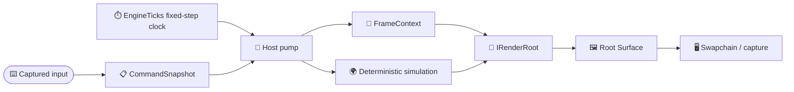

# Hosting and fixed-step simulation

Puck.Hosting is the shared host substrate between deterministic simulation and
presentation. A **host** owns the outer loop: it measures time, advances the
simulation in fixed steps, routes services and exclusive capabilities to its
render root, and publishes completed surfaces without letting GPU or capture
work become simulation state.

It depends on `Puck.Abstractions` for presentation, machine, capture, and GPU
contracts, on [Commands and input](commands.md) for fixed-step
input snapshots and console sessions, and on
[Dialect-agnostic wire substrate](networking.md) for bounded framing and local
capability authentication.

## Key features

- *One render root:* `IRenderRoot` produces the `Surface` a host presents and
  receives device-loss notifications without changing simulation state. The
  World's root is the render graph runtime's node, so everything a frame shows
  is an instance of that graph rather than a child of the root.
- *Deterministic fixed-step context:* `EngineTicks` provides an integer time
  base that divides common update rates exactly. `FrameContext` keeps
  authoritative simulation ticks separate from presentation-only wall time and
  interpolation.
- *Scoped host services:* inherited capabilities flow to descendants, while
  held capabilities such as terminal control and input focus form explicit,
  revocable ownership chains.
- *The terminal's console tape:* `ConsoleTape` records the console exchange
  (submitted lines, result echoes, panel visibility) into a bounded scrollback
  ring and publishes immutable `ConsoleTapeFrame` snapshots through
  `ConsoleTapeStore`; `ConsoleLineEditor` owns the prompt row's caret-addressed
  buffer and command history. Renderers read `IConsoleTapeSource`; the window
  host bridges keystrokes in (`ConsoleInputSink` in `Puck.Launcher`).
- *Presentation observability:* frame capture, latest-value publication, and
  emitted light remain outside the simulation trajectory.
- *Source-watch debounce:* `DependencyWatch` polls comparable dependency facts
  at a bounded interval and requests work after a quiet period. Refreshing the
  dependency set preserves pending edits, including a dependency changed while
  compilation was running. The caller supplies presentation timestamps; a
  source watch never changes simulation state directly.

## The host boundary

The fixed-step simulation is authoritative. Rendering, capture, and GPU
upload observe or present its state; they do not decide what the state
becomes.


```mermaid
graph LR
    Input(["⌨️ Captured input"]) --> Commands["📋 CommandSnapshot"]
    Clock["⏱️ EngineTicks fixed-step clock"] --> Pump["🔁 Host pump"]
    Commands --> Pump
    Pump --> Simulation["🌍 Deterministic simulation"]
    Pump --> Context["🧭 FrameContext"]
    Context --> Root["🌳 IRenderRoot"]
    Simulation --> Root
    Root --> Surface["🖼️ Root Surface"]
    Surface --> Present["🖥️ Swapchain / capture"]
```

## Quick start: a render root

An `IRenderRoot` can return CPU pixels or a GPU image-view handle. This minimal
root produces a one-pixel CPU surface and has no device-owned resources to
release:

```csharp
using Puck.Abstractions.Gpu;
using Puck.Abstractions.Presentation;
using Puck.Hosting;

sealed class StatusPixelRoot : IRenderRoot {
    private readonly byte[] pixels = [0x20, 0x80, 0xE0, 0xFF];

    public RootFrame ProduceFrame(in FrameContext context) => new(
        Render: FrameRender.Rendered,
        Surface: Surface.CpuPixels(
            pixels: pixels,
            width: 1,
            height: 1,
            format: GpuPixelFormat.R8G8B8A8Unorm));

    public void Dispose() { }
}
```

The outer host constructs one `FrameContext` per rendered frame. Its
`ElapsedTicks` advances only by completed fixed steps; its `AccumulatorTicks`
holds the fractional remainder used for interpolation:

```csharp
var context = new FrameContext(
    Host: HostContext.Empty,
    ElapsedTicks: elapsedTicks,
    DeltaTicks: stepsThisFrame * stepTicks,
    FrameDeltaTicks: wallTicks,
    AccumulatorTicks: accumulatorTicks,
    StepTicks: stepTicks,
    TargetWidth: width,
    TargetHeight: height);

RootFrame frame = root.ProduceFrame(context: in context);
```

A `RootFrame` carries the surface and whether it shows the frame asked for
(`FrameCompletion`): `Rendered`, `NotYetRenderable` with a reason (a pipeline
still building, a graph rebuilding, an input with no output for the frame), or
`Refused` with the refusal that stops it. A root that cannot render the frame
may still hand out an older frame's surface. The windowed host presents
whatever surface it gets; the offscreen host steps on only past a rendered or
refused frame (see [host pacing](#host-pacing)).

`RenderTicks` is `ElapsedTicks + AccumulatorTicks`, and
`InterpolationAlpha` is the remainder divided by `StepTicks`. They are useful
for smooth presentation, but neither value authorizes another simulation step.

## Host contexts and capability ownership

`IHostContext` exposes two deliberately different policies:

| Policy | Lookup | Propagation | Typical use |
|---|---|---|---|
| Inherited capability | `TryResolveCapability<T>` | Flows through descendant contexts | Shared services, registries, factories |
| Held capability | `HoldsCapability<T>` | Belongs to one holder; a child receives it only through a grant | Terminal control, input focus, exclusive authority |

`HostContext` stores both kinds. `ChainedHostContext` tries its primary then its
fallback context for inherited capabilities, but checks only the primary for
held capabilities. That rule prevents an exclusive authority from leaking
through a convenient service fallback.

`HeldCapabilityGrants` creates a delegation chain. Revoking an ancestor grant
invalidates every descendant lease, including a descendant grant described as
irrevocable from that descendant's point of view:

```csharp
var childGrants = new HeldCapabilityGrants();
ICapabilityTakeBack? takeBack = childGrants.Grant<ITerminalControl>(
    grantor: parentContext);

var childContext = new HostContext(
    capabilities: new Dictionary<Type, object>(),
    heldGrants: childGrants);

// Later: remove this delegation and every subgrant rooted in it.
takeBack?.Revoke();
```

Two standard held capabilities keep unrelated authority separate:

- `ITerminalControl` is the baton for requesting application exit.
- `IInputFocus` claims and releases individual input devices, or all devices,
  for the current holder.

Composition code can collect `HostCapabilityContribution` values before it
builds the root context. Each contribution states its runtime type, instance,
and whether the capability is held.

## Clocks and fixed-step timing

`EngineTicks.PerSecond` is 50,400. Common simulation rates—including 24, 25,
30, 48, 50, 60, 72, 90, 120, 144, and 240 updates per second—divide that base
without a fractional tick. `EngineTicks.PerRate(rate)` returns the exact step
size and rejects a rate that does not divide the base.

Hosting uses several clocks because they answer different questions:

| Type | Question answered | Rule |
|---|---|---|
| `TickClock` | How much wall time elapsed since the previous host sample? | Converts a `TimeProvider`'s timestamps to engine ticks and carries the conversion remainder |
| `InputClock` | When did an input arrive? | Process-wide monotonic capture clock shared by input backends |
| `OsTimeCorrelator` | Where does a native 32-bit millisecond event stamp belong on the input timeline? | Handles wraparound and clamps the result to the observed engine-time window |
| `FrameContext` | What fixed-step instant is being presented? | Integer ticks are authoritative; seconds and interpolation are derived at the presentation seam |

`IFixedStepSimulation.RatePerSecond` must divide `EngineTicks.PerSecond`
exactly. For each completed step, the launcher constructs a
`FixedStepContext`, builds and applies one `CommandSnapshot`, and then calls
`Step`. A windowed frame may contain zero, one, or several fixed steps; an
offscreen frame contains exactly one, or none when it composes an owed frame
again.

The fields most often confused in `FrameContext` have distinct meanings:

| Field | Meaning |
|---|---|
| `ElapsedTicks` | Simulation time after all completed steps |
| `DeltaTicks` | Whole fixed-step advancement performed for this rendered frame |
| `FrameDeltaTicks` | The interval the frame's presentation spans, for presentation and diagnostics only: the clamped wall interval on the windowed host, the simulation time the frame advanced offscreen |
| `AccumulatorTicks` | Unconsumed engine ticks, always less than one normal step |
| `StepTicks` | Fixed update period |
| `RenderTicks` | Interpolated presentation instant: elapsed plus accumulator |

## Host pacing

`Puck.Launcher` has three host loops, and each drives the one
`FixedStepPump`. They differ only in what decides when a step runs:

| Host | Time | Rule |
|---|---|---|
| Windowed | The wall clock, paced to the display | Each frame hands `FixedStepPump.Advance` the wall interval it sampled, and the pump runs every whole step that interval covers. After a slow frame it catches up, composing one frame for several ticks, because a player's simulation keeps real time. |
| Headless (`host.presentation: none`) | The wall clock, on a waitable-timer grid | The same `Advance` rule. A headless authority serving remote clients keeps real time, because its peers send input and expect snapshots in real time; it renders nothing, so no frame needs a tick of its own. `--unpaced` takes one step an iteration through `TryStep` and waits for nothing. |
| Offscreen (`host.presentation: offscreen`) | Its tick count | Each iteration calls `FixedStepPump.TryStep`, which runs at most one step whatever the interval was, then composes the frame that step owes, and steps the next tick only once the root reports that frame rendered. Every tick has exactly one rendered frame, so the tick each frame shows is a function of the script, never of how long a frame took. |

Offscreen, a slow frame (the first render, a rebuild, a hitch) delays the next
tick rather than bursting several ticks into one iteration. A frame the root
reports `NotYetRenderable` holds its tick: the host composes the same tick
again, steps none, and narrates the hold once on standard error
(`[offscreen] holding tick T until its frame renders: <reason>`), until the
root renders it. A cold pipeline build, a graph rebuilding at a new extent and
an input that produced nothing for the frame each hold the tick, so no frame
shows an older image for a newer tick. A refused frame releases the tick, since
nothing the host does can render it; the root names the refusal. A refusal is
something only a change to what a build was made from retries: a node's
refused graph, or a package's refusal of its instance, such as an SDF
residency whose tables' build was refused. Each is reported as `Refused`, never
as a wait the host would hold forever.

Producers answer the same three ways (`FrameRender`): an external producer's
`Produce`, an uploaded source's `Write` and a World feed's `Publish` or `Write`
each return rendered, waiting with a reason, or refused with one. The rule is
that **a source waits only for what waiting can deliver**: it answers waiting
only while composing the same tick again can bring its image (a conversion
still building, a compositor's or a probe's first frame arriving on another
thread, a seat that may take a camera). A feed that ended or could not open (a
window or monitor that is gone, a probe whose ring cannot be provisioned)
refuses, and so does a source whose image is a function of the simulation with
none for this tick (a machine that is not running or has completed no frame),
since only a later tick can change it. Offscreen, external content renders its
capture fill, so an external source waits only for its fill to convert, and a
refused fill conversion refuses the frame. A filled source publishes the fill
without publishing its live feed. A capture's CPU tier answers from its
converted image rather than the pixels it captured, so a captured frame whose
conversion refuses refuses too. Camera CPU tiers forward the same conversion
answer. A captured CPU frame keeps converting when its source has no newer
frame; losing the source forgets its old image while submitted frames retain
their leases. A GPU capture answers from the current ring's published image,
so a replacement ring waits for its own first copy. An instance with no installed graph,
or an uploaded source whose opening or descriptor has no conversion graph,
also refuses the frame until its inputs change. Completion follows the
scheduled same-frame reads, including buffers, external producers and package
screen reads; an unshown input and a previous-frame read do not hold a tick.
A refusal takes precedence over an input still building. A device loss
holds the tick whose frame it lost. A script that waits N ticks has N rendered
frames behind it, and each frame reprojects from the frame of the tick before
it. A tick's first composition carries one step of `DeltaTicks` and
`FrameDeltaTicks`; composing it again, while its frame has not rendered or a
capture still owes it, advances nothing, so presentation moves once a tick
however many attempts its frame takes. `AccumulatorTicks` is always zero. The wall clock only keeps the loop from
running faster than the simulation's rate: the loop waits for its next period,
and an iteration already a period late starts the next one at once with no
steps owed. The interval an iteration measured decides no step. Whatever it
exceeds its one step by rebases the input pin, so input captured during a slow
frame is due in the next step, and while the host holds its clock for a capture
the interval is the host time the hold spends. A frame hold spends an owed
capture's hold budget as a withheld step does, and the capture is refused once
that budget is spent, while the frame hold itself continues until the frame
renders. An offscreen client of a remote
authority steps its own ticks the same way while the authority keeps its own
wall clock, so a client script reads what the authority did, never a tick count
of it.

All three hosts and their shared input capture clock read the same registered
`TimeProvider`, which defaults to the system clock. Device recovery uses it for
its reacquire budget and waits too. `OffscreenTickPacingLawTests` runs the real
loop over a manual clock whose frames cost seconds and holds every frame to one
tick, and a capture to the tick its frame composed; each law replays the same
frame costs through `Advance` as its red leg, and holds a tick its root cannot
render yet to one rendered frame, against one step an iteration as its red leg.
The World's root reports its completion from the render graph runtime
(`RenderGraphRuntime.Render`): the root's image shows the frame only when
the root rendered it and every instance it reads within the frame rendered it
too, or stands unchanged on purpose (a refresh divisor, an unchanged view, a
paused pipeline, including one held at time scale zero). A paused instance's
last image is its output for every frame until it is stepped or resumed, so
what reads it renders the frame over that image. `RenderGraphRuntimeLawTests`
holds a cold build and a producer that keeps its older output to it, and a root
reading a paused instance renders.

Each launcher host registers its pacing (`HostPacing`): `OneTickPerFrame`
for the offscreen host, `WallClock` for the windowed and headless hosts.
Whatever steps on a host's behalf reads it, so a fast-forwarding replay fork
advances one authority tick per host step under `OneTickPerFrame` and its
whole burst under `WallClock`. A non-boot world instance steps on its own
accumulator at its own rate, so it keeps its bursts. The tape retains its cursor between steps, so the offscreen limit
changes pacing without dropping recorded input.

## Render lifecycle and publication

A host has one `IRenderRoot`, which produces one `RootFrame` a frame (a surface
and its completion) and is disposable. A root that owns device resources releases stale handles in
`OnDeviceLost` and rebuilds them on a later frame, and a root holding an armed
capture refuses it (`CaptureRequestSlot.RefuseForDeviceLoss`); device loss must
not advance or reset simulation. The World's root, `RenderGraphRuntimeNode`,
forwards the loss to its runtime, which releases every instance's node and
producer. The host disposes its root while the device is still alive, so the
root also disposes the services it is handed as holdings
(`RenderGraphRuntimeNode.Holdings`), such as the screen binder's camera feeds,
which the container would otherwise release after the device.

Both GPU hosts recover from a loss through one policy, `DeviceLossRecovery` in
`Puck.Launcher`. It writes a `[device-lost] reason 0x…` line to standard error,
drains what the device still runs, calls `OnDeviceLost` on the render root
while the lost device still exists, and then rebuilds the device in place
through an `IDeviceRebuild`, retrying every 250 ms for up to 10 seconds while
the adapter is absent. The windowed host rebuilds through its presenter
(`PresenterDeviceRebuild`). The offscreen host rebuilds through the rebuild
the World's offscreen GPU activation registers: on Vulkan the presenter
rebuilds on the hidden window's surface, and on Direct3D 12 the device context
is recreated with no swap chain. More than eight losses with no frame between
them, a device that does not return in time, or a host with nothing to rebuild
through ends the run; the windowed host closes, and the offscreen host faults.
A run that ends has still drained and released the render root first, so every
capture armed at the loss is refused by name rather than left unserved.
After recovery the offscreen host retries the completed step's frame with the
same frame context before it takes another step.

On Direct3D 12 both hosts follow one retry rule, in
`DirectXDeviceContext.Recreate`: a rebuild that fails in Direct3D 12 itself,
the device's creation or the windowed host's new swap chain, has not got its
device back yet and is retried within the budget; any other failure ends the
recovery. Every call a removal can reach on a frame or capture path, the
command allocator, list and committed-resource creates included, answers
through `DirectXCommandCalls`, so a removed device surfaces as the neutral
device loss rather than a `COMException` the policy never sees. A surface
upload, readback or import stays on the device it first created its objects on
(`DirectXDeviceOwnership`, the peer of `VulkanDeviceOwnership`): its owner
releases it before the device goes, and a holder that outlives a loss refuses
the replacement device and its own late release by name.

The operator's `gpu.faults lose [<n>]` loses the device on the nth frame a GPU
host produces from then on, on a healthy GPU: each host counts its frames
against the faults inside the frame body the policy guards, and the armed frame
throws the device loss there, so the recovery runs exactly as for a real one.
The `device-loss` and `device-loss-windowed` canaries run it on both backends
with a capture armed at the loss.

`FrameCaptureController` owns an optional capture session, including its
engine-time cadence, frame indexing, budget, and capture-only fault isolation.
The launcher hands it the exact root surface and matching `FrameContext`
immediately before presentation. CPU-backed surfaces need no conversion; GPU
surfaces use the active presenter's optional readback capability. Capture
timestamps use authoritative `ElapsedTicks`, while cadence follows continuous
`RenderTicks` so it does not assume a fixed host presentation rate.

`ProduceFrame` must never wait for slow GPU object creation, because the same
thread drains the console and steps the simulation. `BackgroundBuild<T>` is how a
node moves that work off: it starts a build on the thread pool, the node polls
`TryTake` once per produced frame and installs the result at that frame
boundary, and until then it presents what it already has. A newer request
cancels the pending build with `Cancel`, and the discarded result is released
on the pool after the build and its cancellation callbacks finish. Callback
failures are observed along with detached build failures. Before the device
goes away, `CancelAndWait` blocks until both finish, so nothing is created on a
device being torn down. An owner with nothing to present until the build
finishes, such as an offscreen host producing its first frame, blocks on
`WaitFinished` between frames instead of producing empty ones: it takes
nothing, so the next `TryTake` sees the result or the failure as a polling
owner would. The SDF pipeline set's build and live shader-pipeline
compilations both use it.

A build that waits for other work is asynchronous: it starts through the
`Start` overload that takes a task, and awaits each wait, so a waiting build
holds no pool thread. A render node's graph build awaits each pass pipeline's
lease (`GpuBuildLease.WaitAsync`) and each package's `BuildAsync`; an SDF view's
passes await their residency's tables (`SdfWorldResidency.WaitReadyAsync`); a
kernel reload awaits its replacements. `GpuBuildCache` gives each build one of
its turns before it creates anything: at most its concurrency of builds create
at once, a build waiting for a turn holds no thread, and a cancel ends that
wait at once. A cold set of more pipelines than turns therefore occupies only
the threads whose creations are in the driver. A cancel runs the token's
callbacks on the thread pool, so a canceled build's continuation never runs on
the frame thread that canceled it. A compilation or a bake only works, so it
starts through the synchronous overload.

A node that samples an image another producer keeps writing, such as a camera
ring slot or a HUD frame, receives it as a `GpuImageLease`: an image-view
handle with an optional release callback and token. Its `Publication` identifies
the actual writing stream by object identity and one successful write by a
monotonic sequence. The producer supplies that pair with the acquired slot and
fence; another acquisition or a standing image keeps the pair, and a storage
handle or release token cannot replace it. The node holds each such
lease in a `LeaseRetireList` until a fence wait proves the submission that
sampled it has finished, then retires the list, which runs every release once
in the order the leases were held. A node with frames in flight keeps one list
per frame slot and moves each frame's list into its slot when it submits.
Every graph instance's `ShaderPipelineRenderNode` uses it: an SDF view's passes
take each screen's lease into their node's list, and the overlay package moves
its HUD frames' leases into its node's list.

`RenderGraphScheduler` decides which views render in a frame. Every view is a
`RenderGraphInstance`: a name, a refresh (a frame divisor or a rate in hertz),
the passes one render records, the instances it may read, and what its output
carries: an image, or a buffer such as the world's SDF brick pool. Each read
carries a kind too, the same `ShaderPipelineResourceKind` a graph version
declares. `RenderGraphInstanceSet.TryCreate` validates a set and orders it so
every producer renders before the consumers that read it in the same frame,
whatever the read carries. A read of the instance's own output, or a read
declared previous-frame, takes the producer's last completed frame instead and
demands nothing of the producer. A
loop of same-frame reads is refused with `SameFrameCycle`, naming every
instance in the loop, and a read whose kind is not what its producer's output
carries is refused with `KindMismatch`, naming the consumer and the producer.
`Schedule` is a pure
function of the set, a `RenderGraphFrame`, and the previous frame's
`RenderGraphHistory`. The frame carries the display's extent and rate, the
instances the display shows (`RenderGraphRoot`), how much of each rendering
instance's image another instance's output covers (`RenderGraphFootprint`),
and the frame's pass-pixel budget:

- An instance renders only when the display or an instance rendering this frame
  shows it, and at most once a frame however many consumers read it.
- It renders at its largest footprint: the consumer's own extent times the
  fraction the producer covers. `RenderGraphExtent` rounds that up to one of
  sixteen steps in its power-of-two octave, and keeps the allocation through
  a shrink of less than an eighth.
- It renders only when its refresh is due. A consumer of an instance that is
  not due reads that instance's latest completed output and never waits for it.
- A root asks for its instance at most as often as its own refresh
  (`RenderGraphRoot.Refresh`, every frame unless set). An instance shown only by
  roots renders no more often than the most frequent root's refresh, nor its own,
  and on its first frame whatever either says. A consumer's same-frame read
  exempts the producer from that, since the consumer needs the frame.
- The instances the display does not show directly spend at most the budget,
  priced as passes times pixels. The stalest due instance goes first, so an
  instance the budget defers is first in line on the next frame.
- A buffer read has no footprint. A consumer that renders reads it, so the
  producer is demanded whenever a consumer is, renders at most once a frame
  before its same-frame readers, and renders at no extent for no pass-pixels.
  A root or footprint that names a buffer is refused.
- A source is an external instance whose package is `source.<producer id>`
  (`RenderGraphInstance.Source`), which reads nothing and carries its
  producer's settings. It is demanded as any shown producer is and renders at
  most once a frame, but at what its producer declares in the frame's
  `RenderGraphSourceState`: its cadence and its negotiated extent, never a
  refresh or a footprint. A static source renders once, a tick source at most
  once per completed simulation tick (`RenderGraphFrame.Tick`), and a rate
  source at most its rate, counted in presented frames at the display's rate
  (`RenderGraphFrame.DisplayHertz`, which a host takes from
  `FrameContext.DisplayHertz`, the rate its pacer targets). While the
  display's rate is unknown (zero, as offscreen) a rate source is refused: it
  does not render, and its row reads `RenderGraphInstanceStatus.Refused`. A
  source whose producer declares nothing or no extent does not render. An
  imported source still answers its availability when no extent or display
  cadence can be scheduled: an unopened feed refuses, a first frame arriving
  on another thread waits, and an offscreen capture fill renders once it has converted.
  These rows read `IRenderGraphSourceProducer.Answer`, which produces no work;
  only scheduled rows call `Produce`. Repeated answers reuse their named diagnostics.
  The runtime declares an upload's state and a source producer's
  (`IRenderGraphSourceProducer.Descriptor`) itself, after the host's. Cadence is
  counted in ticks and frames, never the wall clock.
  `RenderGraphHistory.Withdraw` takes back a render the producer could not
  complete, so its cadence counts from its last completed frame.

The schedule lists every instance with its status, extent, divisor, passes and
price, the renders in order, and the frame and kind of the output each
rendering consumer reads. The caller owns it: `Schedule` fills a `RenderGraphSchedule`
created for the set, together with the history the next frame reads
(`RenderGraphSchedule.Next`). Scheduling into a schedule replaces everything it
held, and a refused frame leaves it unchanged. The next frame goes into another
schedule, because a schedule's own `Next` cannot be its input. A host that
alternates two schedules schedules a steady frame without allocating once their
read lists have grown to the frame's reads, and `RenderGraphFrame` is a value,
so describing each frame over the same root and footprint lists allocates
nothing either. The main view and the `views.graphs` panes render through it
(`RenderGraphRuntime` in `Puck.Shaders`), and so do the source instances the
screens show and the camera and session views, which an `sdf.world` view's
passes sample through the reads the runtime binds for them; screens themselves
render inside the SDF frame.

`RenderGraphHitWalk` follows a hit through nested instances. Each instance
reports, through `IRenderGraphHitScene`, the source placements in its world
(`Puck.Commands.SourceMapping`) and the camera it renders from. `Walk` casts a
ray into an instance's world and meets the nearest surface placement. When that
placement shows another instance's output, the walk casts a new ray through the
producer's camera from the hit's point on the image, and repeats in the
producer's world. `WalkDisplay` starts from the topmost pane under a display
point, or, where no pane holds it, from the view the display itself shows when
that view is no pane (a lone view covering the whole display). A walk continues through at most the limit of
screens it is given, which is normally `RenderGraphInstanceSet.NestingDepth`; entering a pane's instance from the
display passes through no screen and counts nothing. A set's nesting depth is declared by whoever composes it (a World
from its boot document's `views.nestingDepth`), 3 when it declares none, from 0 through
`RenderGraphInstanceSet.MaxNestingDepth`, 8; a set declaring another depth is refused as `NestingDepthInvalid`. It is
never read off the reads, so two views reading each other's previous frames, or two portals facing each other, end at
it.
It ends on a producer's pixels, on an instance's world, off a source, at the
limit, on an image the showing instance does not read, or at an instance with
no camera. Every step maps in fixed point, so the same inputs walk the same
path on every run. A World host walks its runtime's live instance set from the
pane mappings it publishes each frame, with each view's seat camera and each
pane's paired camera; each view's world producer and each camera view reports
the screens standing in the boot world, so the walk continues from a pane through
a screen into its source, or into the view the screen films; any other instance
reports none, so a ray cast into it ends on its world.

`PublishBuffer<T>` is the smaller handoff for immutable latest-state values. A
single writer swaps a holder reference and readers snapshot the newest value.
It is not a FIFO and retains no history, so use it only when skipping obsolete
intermediate publications is correct.

## Core types

| Area | Types | Purpose |
|---|---|---|
| Render root | `IRenderRoot` | The surface a host presents each frame, and its device-loss and teardown lifecycle |
| Fixed-step time | `EngineTicks`, `TickClock`, `FrameContext`, `FixedStepContext`, `IFixedStepSimulation` | Integer simulation time and presentation context |
| Input time | `InputClock`, `OsTimeCorrelator` | Monotonic capture timestamps and native event correlation |
| Host scope | `IHostContext`, `HostContext`, `ChainedHostContext`, `HostCapabilityContribution` | Inherited services and exclusive held capabilities |
| Delegation | `HeldCapabilityGrants`, `ICapabilityTakeBack`, `IHeldCapabilityLeaseSource` | Revocable held-capability chains |
| Standard authority | `ITerminalControl`, `IInputFocus` | Exit ownership and device focus |
| Observation | `FrameCaptureController`, `PublishBuffer<T>` | Capture sessions and latest-value handoff |
| Background work | `BackgroundBuild<T>` | A candidate built on the thread pool and installed at a frame boundary |
| Sampled images | `GpuImageLease`, `LeaseRetireList` | An image a submission samples, released once that submission retires |
| View scheduling | `RenderGraphInstance`, `RenderGraphInstanceSet`, `RenderGraphScheduler`, `RenderGraphExtent`, `RenderGraphSourceState` | Which views and sources render in a frame, at what extent, rate or cadence, and price |
| Nested hits | `RenderGraphHitWalk`, `IRenderGraphHitScene`, `RenderGraphHitPath` | Where a pick through views that show other views lands |
| Child processes | `ChildProcess`, `ChildProcessResult` | Tool runs and driven companions started from an argument vector |

`ChildProcess` starts the tools that the CLI, the shader compiler and the
emulator diagnostics run. `RunAsync` takes an argument
vector, never a shell expression. It reads both captured streams while the child
runs, so a child that fills a pipe buffer on either stream still runs to exit, and
it returns only after both reads finish, so the tail of the output is never lost.
A read ends only when every process holding the pipe has closed it. A process the
child started with inherited handles, such as a build node or a compiler server,
can hold it long after the child exits. Once the child exits, the reads therefore
get `ExitDrainGrace` to finish on the run's clock. Release cancels the pending byte
read, consumes a snapshot of the bytes still buffered in the pipe, and presents EOF
to the text decoder. This preserves output even when a reader has not been scheduled
before the grace expires, including a final line without a newline.
`OpenOutputReader` and `DrainAfterExitAsync` apply the same bound to a caller that
pumps its own streams. Caller cancellation ends the grace early and still joins
the pumps before disposing their streams.
The run is bounded by an optional timeout on a caller-supplied `TimeProvider` and
by cancellation. Either bound kills the whole process tree and drains both
streams. A timeout is reported as `TimedOut` in the result, while cancellation
throws `OperationCanceledException`. `StartRedirected` starts a companion that
the caller drives itself. That caller owns all three redirected streams and must
drain every output stream it keeps open.

Extension discovery and its load contexts (`PuckExtensionDiscovery`,
`PuckExtensionLoadContext`) and the `HostedControl` contribution also live in
this project; [Extensions](extensions.md) explains them.

The machine-neutral queued-host substrate (`QueuedMachineWorker`,
`IQueuedMachineCore`, `MachineTimeTravel<TInput>`, `QueuedHostContractProbe`)
lives in [Machine hosting runtime](../emulation/shared/machine-hosting.md), which depends
on this project for `EngineTicks`.

## Local console attachment

`LocalControlServer` attaches a trusted operator to a running host's existing
console and capture seams. The host supplies its `TextCommandSource` and a short
capture-arming delegate; `ConsoleControlSession` orders both through the ordinary
command pump. `LocalControlClient` owns one ordered attachment. There is no MCP,
World, GPU-backend or cloud dependency here; the optional
`Puck.Mcp` extension supplies stdio and authenticated HTTP tools.

The opt-in endpoint binds only IPv4 loopback, admits at most four connections
including handshakes, and uses Networking's user-only Windows/Linux x64
local endpoint capability. It publishes its attachment file in the user's
temporary directory, where an adapter following the newest World looks, unless
the host names another directory.
Creating an instance starts the listener; the host owns its disposal.
An in-process extension can use `IControlSessionHost` instead. `DescribeAsync`
returns the identity's admitted command help and renderer availability without
opening a session. Targets remain fixed for each session; the host closes their
ingress at retirement. This interface introduces no MCP dependency into the host.

### Wire and lifetime

Private messages use Networking's `WireFrame` grammar:
`[u32 following-length][u8 kind][UTF-8 JSON]`. The length counts the kind plus
payload; kinds are 0 for capability authentication, 1 for requests and 2 for
responses. Operation JSON is source-generated. Unknown or duplicate members,
missing required fields, invalid nulls and depth beyond eight are refused.
The client also validates response identity, status, output and image placement;
an authenticated peer cannot silently change those result semantics.
Request IDs increase strictly from one within a connection. Duplicate/out-of-order
IDs close it. There is no retry cache or automatic replay after disconnect.
Client-side admission refusals carry ID zero and do not advance that sequence.

| Boundary | Limit |
|---|---|
| Connections, including authentication | 4 |
| Authentication | 5 seconds |
| Admitted work | 1 operation per connection |
| Request JSON payload | 16 KiB |
| Console line | 8192 UTF-16 code units, also subject to encoded frame limit |
| Console output | 1048576 UTF-16 code units, delivered whole; longer output is cut with a marker |
| Completed PNG | 16 MiB |
| Response JSON payload | 24 MiB |
| Request deadline | 1–120000 milliseconds; client default 30000 |

Every deadline runs on a `TimeProvider`, the system clock unless one is passed.
The clock given to `LocalControlClient.ConnectAsync` bounds connecting and
authenticating, then each call on that attachment. The clock given to
`LocalControlServer` bounds each connection's authentication and each request,
and the clock given to `ConsoleControlSession` bounds each request it runs. No
deadline on either side reads wall time on its own, so a test can drive every
one of them from a clock it advances.

Call serially. An additional frame while an operation waits closes and cancels
that ingress. One bounded read observes disconnect during the wait. Oversized
frames, partial EOF, invalid authentication and expired deadlines close the
connection. Blank/comment-only lines and literal multiline batches are refused
before the unbounded text source.

Console errors preserve `IsError`, `Output` and `ClearTranscript`. Empty output is
conservatively `submitted`; even `completed` is a console handler result, not a
new authoritative mutation receipt. Output longer than the console-output limit
is cut by `ControlResponse.Bounded` to a head ending in a marker that names the
full length, with `Truncated` set and the status, error flag and transcript
request kept: a long answer is a completed read, never an unknown outcome.
`ConsoleControlSession` and the server both apply it, so any session's long
answer crosses the wire that way. JSON escapes a code unit to at most six bytes,
so the longest output encodes to 6 MiB, inside the response payload limit. Cancellation disposes only this text session:
queued work is refused, but already-dispatched commands may have effects.
The server enforces deadlines even when a supplied session ignores cancellation,
disposes the session once, and observes late task failures. An invalid host result
or unexpected operation failure reports `unknown`, with no automatic retry.
Direct `ConsoleControlSession` callers also get one-operation admission and
deadlines; disposing it cancels an accepted capture wait promptly.

Captures arm through `TextCommandSession.InvokeAsync`, then await the exact
`FrameCaptureRequest.Completion` off the pump. Cancellation after arming leaves
the capture alive, with a cleanup continuation owning its unique, user-only temporary directory
until completion. Successful reads and failed captures also clean that path.
A process crash can leave a temporary artifact; crash recovery is not promised.
Headless hosts retain exec but refuse capture. Existing synchronous console
handlers and GPU readback retain their pump cost.

Disposal closes connections and removes discovery. It does not stop World,
cancel recordings or issue an implicit gameplay action.
