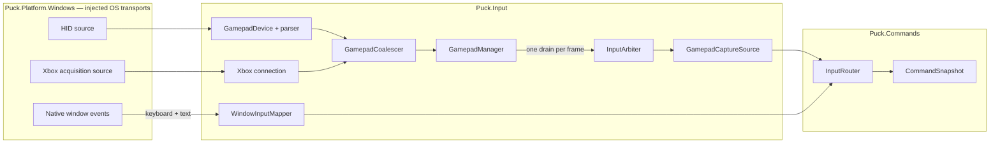

# Device input

Puck.Input turns controller reports and window keyboard or text events into one
provider-neutral input stream. It owns controller protocols, hotplug and player
slots, per-frame coalescing, sub-frame timestamps, motion fusion, haptics, and
the physical-control vocabulary. `Puck.Commands` owns the next step: binding
those physical controls to named commands and producing a fixed-step snapshot.

The project contains no operating-system transport. `Puck.Platform.Windows`
supplies HID and Xbox acquisition through injected interfaces; another
platform package can implement the same interfaces without changing a parser.
Absolute cursor position remains presentation-side browsing state; relative
mouse motion, wheel motion, and mouse buttons are ordinary bindable sources.

Use [Quick start](#quick-start) to inspect devices in the running host. For
an embedding application, start with [How device input reaches a command](#how-device-input-reaches-a-command)
and the [gamepad pipeline](#the-gamepad-pipeline). The [API reference](../api/index.md)
owns member signatures, parameters, return values, and exceptions.

## How device input reaches a command

Two acquisition transports feed one manager. HID devices own an asynchronous
read/write loop; the Windows Xbox backend polls separately and publishes the
same `IGamepadConnection` surface. The manager's `Drain` is destructive, so
`InputArbiter` performs it at most once for each host frame key.



`GamepadSnapshotInputCapture` is the standard host-loop contribution. It asks
the arbiter to drain the current frame, then passes the drained devices to
`GamepadCaptureSource`, which appends timestamped `InputSignal`s to an
`InputRouter`. `Puck.World` composes this path and focus-gates it through
`IInputFocus.IsActiveFor`.

Registered arbiter lanes provide alternate views without draining again:

| Lane mode | Resolution |
|---|---|
| `Multicast` | One representative state with buttons OR-ed across connected pads. |
| `PerPlayer` | The device currently assigned to one player seat. |
| `Owned` | A device explicitly assigned through `SetLaneDevice`; neutral until assigned. |
| `Suppressed` | Always neutral. Any other lane can also be muted temporarily. |

## Device support

| Family | Transport | Input | Motion | Output |
|---|---|---|---|---|
| **Switch Pro** | HID over USB | buttons, sticks, digital triggers | gyro, accelerometer, fused orientation | approximate HD rumble; player LEDs at initialization |
| **Xbox** | XInput + GameInput | buttons including Guide, sticks, analog triggers |—| four-motor rumble including impulse triggers |
| **DualSense** | HID over USB or Bluetooth | buttons, sticks, analog triggers, two touches | calibrated gyro, accelerometer, fused orientation | rumble, RGB and player LEDs, adaptive triggers |
| **Steam Controller** | HID over USB or classic receiver | buttons, analog trigger stages, stick, two trackpads | nominal gyro and accelerometer scales, fused orientation | coarse dual-pad haptic pulses |
| **Steam Controller Triton** | HID through the 2026 receiver | buttons, four paddles, analog triggers, two sticks, two trackpads | nominal gyro and accelerometer scales, fused orientation | dual-motor rumble |

Support means that a parser and acquisition path exist. The [limits and hardware
evidence](#limits-and-hardware-evidence) distinguish implementation coverage from
reported device observations.

## Quick start

Build the platform-neutral project, then run the live Windows host:

```sh
dotnet build src/Puck.Input/Puck.Input.csproj -c Release
dotnet run --project src/Puck.World -c Release -- --exit-after-seconds 30
```

While the host runs, `world.devices` and `world.players` show the connected set
and seat assignments. Controller diagnostics use `[gamepad]` or `[gameinput]`
lines on stderr. Bindings are data in `Puck.World`; they are not hard-coded in
this project.

## The gamepad pipeline

### Per-device I/O and coalescing

Each HID connection initializes its parser, waits asynchronously for reports,
stamps every successful parse with an arrival tick and sequence number, and
folds the state into `GamepadCoalescer`. The same loop serializes queued output
writes for that handle. Streaming reads use a 16-millisecond bounded wait so
scheduled effects, rumble expiry, and receiver-silence detection keep moving
when input pauses. Each output queue retains at most 64 commands, and the loop
services at most 32 before returning to input; a full queue rejects the request
instead of growing without bound or starving reports.

Between frame drains the coalescer keeps the latest continuous values, ORs all
button press and release edges, records the first press time for each button,
and averages gyro samples. A short tap therefore survives even if it begins and
ends between two rendered frames.

### Connection lifecycle

`GamepadManager` rescans HID interfaces about every 1.5 seconds. A supported
interface is opened, assigned the lowest free player slot, and started. A
faulted connection is removed at the next drain or rescan, and disposal occurs
outside the manager lock.

Classic and Triton Steam receivers expose several input collections, most of
which can be empty. Those collections start dormant: they hold no player slot,
are excluded from public connection queries, and do not run the ordinary
five-second first-report watchdog. The first parsed state activates a slot.
The classic receiver reports a disconnect event and can return to dormancy.
Triton disconnect framing is not decoded, so the device loop also parks any
active receiver whose parsed state stream is silent for one second. Parking
clears coalesced state, pending output, scheduled effects, rumble, motion-fusion
history, and the player slot before that receiver carries another controller.

### Motion fusion

The motion-capable parsers map their sensor frames to a common right-handed
frame before calling `ImuOrientationTracker`. DualSense uses its report counter
for `dt`; Switch integrates three fixed five-millisecond samples per report;
Triton derives `dt` from its microsecond sensor timestamp, while the classic
Steam Controller uses a nominal four milliseconds per report. The clock-free tracker
integrates angular velocity, estimates stationary gyro bias, and corrects pitch
and roll toward accelerometer gravity. Capture the resulting orientation with
the input snapshot; replay consumes that orientation rather than recomputing
motion fusion from live hardware.

DualSense reads factory gyro calibration from feature report `0x05`. Switch
reads factory or user stick calibration from SPI flash and falls back to its
nominal scale if a read is missing or implausible. Switch IMU calibration and
both Steam families currently use nominal scales.

## Keyboard, mouse commands, text, and pointer browsing

`InputSources` is the single vocabulary for keyboard, mouse, and gamepad control
names. `InputSourceVocabulary` resolves those names case-insensitively, in the
reflection-derived declared tables and in every parametric family alike
(keyboard letters and digits, function and numpad keys, numbered mouse buttons,
`probe.<name>`), because `Puck.Commands`' `BindingProfile` compiles a page's
sources into a case-insensitive table and dispatches through the same one: a
case-sensitive catalog beside a case-insensitive compiler would refuse working
rows as unknown controls. A source id's case is authored-document noise, never
identity, and case-insensitivity widens nothing, since an id no member and no
family declares stays unknown in every casing. `WindowInputMapper` converts
neutral window events from `Puck.Platform` into `InputSignal`s, mirroring the
gamepad capture path. Left and right Control,
Shift, Alt, and Super remain distinct ordinary controls; number-row and numpad
digits remain distinct too, including when programmable mouse buttons emit them.

Absolute cursor position, hover, capture, and visibility remain presentation
state in the window-observer path. Relative motion (`mouse.motion`), two-axis
wheel notches (`mouse.wheel`), and numbered buttons (`mouse.button1` and upward)
also project into the command path. Button numbering has no five-button model
ceiling; a backend preserves every stable ordinal it can report. Windows' generic
mouse messages expose the conventional five, while programmable devices such as
the Naga commonly expose their larger grid as number-row or numpad keyboard
controls; both families are bindable here. Mouse motion and wheel samples are
transient impulses, never persistent analog holds.

`HeldDigitalInputState` retains keyboard and mouse-button first-down order and
emits per-frame digital `Active` samples after the original press frame. That
lets binding reloads and per-player modality changes cancel first, then recover
channels and modifier pages through the current profile without synthesizing an
edge verb.

Bindings, chord pages, toggles, sequences, interactive rebinding, and the
binding document format belong to [Commands and input](commands.md).
This project contributes only `InputSourceLabels`, which describes a physical
source using the connected family's labels—for example, the south face button
is B on Switch, A on Xbox or Steam, and X on DualSense.

## Keyboard focus and passthrough sources

A window captured into a pane, such as an editor, can take the keyboard.
`SourceFocus` decides where each window event goes, before
`WindowInputMapper` sees it:

- `Press` reports a pointer press and the `SourceMapping` it landed on (the
  published source mapping in `Puck.Commands`). Focus moves to that source when
  the mapping takes the `Passthrough` destination, the local user opened it,
  and the press lands on its pixels. A press anywhere else returns focus to the
  game.
- `Route` sends a key or text event to the focused source, or to the game when
  no source has focus. A key's release goes wherever its press went, so neither
  side is left holding a key after focus moves. Pointer events are routed by
  the mapping a hit lands on, never by focus.
- The reserved chord, Control and Alt held with Escape pressed, returns focus to
  the game whenever a source has it, and that Escape reaches neither the game
  nor the source. While the game has focus the chord has nothing to return, so
  its Escape is the game's like any other key.

A world document never creates a passthrough source: the world validator
refuses a screen whose `input` is `Passthrough`. Focus sits inside the input the
engine already holds, so it is separate from `IInputFocus` in `Puck.Hosting`,
which decides whether the terminal routes a device to the engine at all.

`SourcePassthroughRouter` hosts `SourceFocus` for a window. The host publishes
the pane mappings its display shows, and the router reads each raw window event
in order:

- A pointer event over a pane whose mapping takes `Passthrough`, was opened by
  the local user and lands on its source goes to that source's window at
  `SourcePassthrough.ToClient`'s client point. A button press there also
  focuses the source. A press on the captured frame's border or title bar
  focuses it without reaching the client area.
- Keys and text follow `SourceFocus`. A key released after focus moved to
  another source still reaches the window its press did, and a button pressed
  on a source is released there at the point its drag reached.
- Losing the window's own focus releases every key and button a source's
  window holds.
- A source that holds focus, a key or a button but no longer has a
  passthrough pane among the published panes is revoked before the event
  routes (`Revoke`): its window receives the release of each key and button it
  holds, and focus returns to the game. The host revokes a source the same way
  when it closes it.

The router tells the pump which events the game must not see. The window pump
in `Puck.Launcher` offers every raw event to an optional `IWindowInputFilter`
before the `IWindowInputObserver` and the command router. An event the filter
consumes reaches neither of them. A pointer position is never consumed, so the
game keeps drawing its cursor over a passthrough pane.

A source's window is an `ISourcePassthroughWindow`. On Windows a window
capture's feed supplies it (`INativeImageCaptureFeed.Window`,
`Win32PassthroughWindow`), and it sends window messages to the captured window
with `SendNotifyMessage`, so the window need not be in the foreground and
receives them in order. A sent message skips the window's `TranslateMessage`,
so a typed key arrives as a keyboard's would: `WM_KEYDOWN`, then `WM_CHAR` from
the text event, then `WM_KEYUP`, with no text heard twice. A pointer message
goes to the deepest visible, enabled child window under the point, in that
child's client coordinates, and while a button is held the child it was pressed
on keeps every pointer message until the last release. A key or text message
goes to the window thread's keyboard focus. Each side of each modifier is
tracked apart, and Alt counts as held across its own press and release, so an
Alt chord's press and release are `WM_SYSKEYDOWN` and `WM_SYSKEYUP`.
Coordinates are read in physical pixels for the captured frame and in the
window's own DPI context for the client point, so a DPI-unaware, system-aware
or per-monitor-aware window each receives its own units. Keys outside `KeyCode`, such as Delete
or Home, never reach the engine, so they never reach a source either.

The World host opens a passthrough source only through `source.passthrough`,
which only its own console may run as typed text (see
[the World guide](../../src/Puck.World/README.md)). A recorded run on real
hardware, in which a click reaches a captured editor window at the mapped point,
is [deferred to the end](../plans/rendering.md#deferred-to-the-end) of the
rendering programme.

## Output and haptics

`IGamepadOutput` accepts typed output commands and a raw-report escape hatch.
The connection advertises capabilities from the interfaces its parser actually
implements. Switch and DualSense throttle equal-or-weaker rumble updates to a
minimum 30-millisecond cadence while allowing starts, stops, and intensity
increases through immediately.

Rumble duration is finite by contract: a zero-millisecond request stops every
motor immediately. Backends clamp finite intensities to `0..1` and map non-finite
values to rest before encoding a report.

Xbox output writes through both GameInput and XInput. GameInput reaches wireless
devices and the impulse-trigger motors; the XInput write remains useful when an
overlay has captured the GameInput endpoint.

DualSense uses one persistent output image for rumble, LEDs, and both adaptive
triggers. USB writes use report `0x02`; Bluetooth writes use report `0x31` with
its logical 78-byte framing and trailing CRC even when Windows advertises a
larger output buffer. A later rumble or LED update therefore preserves the
current trigger effects on either transport.

## Dynamic lighting

The bind legend is presentation-only. `Puck.Abstractions` defines the neutral
LampArray contract, `Puck.Platform.Windows` implements the Windows HID LampArray
transport, and this project composes colors from the host's current binding
state:

```text
lamp geometry + palette + live bindings
    -> LightLegendComposer
    -> LightLegendDriver
    -> dirty lamp writes at no more than 30 Hz
```

`LightLegendDriver` takes host control on its first tick and restores autonomous
mode when disposed. If the process is killed before disposal, a lamp array can
remain frozen on its last host-controlled frame until the operating system,
vendor software, or a replug reclaims it.

The transport and composer have been exercised on a Logitech G915 LampArray
(115 lamps, 33-millisecond minimum update), a G502 mouse, and a POWERPLAY pad.

## Limits and hardware evidence

The hardware observations below were recorded without a dated build identifier.
They describe reported results, while the transport-fake suite checks current
code. A release qualification needs its own recorded hardware run.

- **DualSense USB and Bluetooth are hardware-verified.** Input, motion, rumble,
  LEDs, and adaptive triggers share the current output path. Bluetooth input
  CRC is left to the link layer; output supplies the required seeded CRC.
- **Switch Bluetooth is not supported.** The current initializer performs the
  USB handshake and has not implemented the Bluetooth-specific vibration setup.
- **Xbox Bluetooth is expected to flow through XInput and GameInput but has not
  been recorded as hardware-verified here.**
- **Only the Windows HID transport exists.** The parsers are platform-neutral,
  but no Linux `hidraw` implementation has exercised them.
- **Classic Steam Controller support is protocol-derived and not verified on
  physical classic hardware.** Lizard-mode control, raw IMU, state parsing,
  receiver events, and haptic framing are implemented.
- **Triton has hardware evidence for feature writes, rumble, steady-state IMU,
  and roughly 265 Hz input.** Its pairing/status report is not decoded; a
  one-second parsed-stream silence watchdog releases a slot after power-off.
  IMU axes and scales remain nominal, and decoded pressure and
  capacitive-touch fields have no `GamepadState` carrier.
- **Steam lizard mode and LampArray host control restore only during clean
  disposal.** An abnormal process exit can leave the device in the last mode
  until another driver or a replug resets it.
- **Switch HD-rumble uses a perceptible linear approximation rather than the
  complete perceptual frequency/amplitude table.**

For receiver diagnostics, match Steam VID `0x28DE` and the supported PID on
vendor input usage `0xFF00/0x01`. Classic control messages use their classic
feature framing. Triton feature messages use report id 1 and
`[type][length][payload]`; report id 0 is rejected with Win32 error 87.

## Core types

| Type | Role |
|---|---|
| `GamepadManager` | Enumerates, hotplugs, slots, queries, drains, and owns connection lifetimes. |
| `InputArbiter` | Performs the single destructive drain and resolves registered lanes. |
| `GamepadSnapshotInputCapture` | Connects the arbiter's frame drain to the snapshot input pump. |
| `GamepadCaptureSource` | Converts drained normalized states into timestamped `InputSignal`s. |
| `GamepadDevice` | Hosts one HID parser and owns that handle's asynchronous I/O loop. |
| `IGamepadParser` | Defines initialization and report parsing for a controller family. |
| `GamepadCoalescer` / `GamepadDrain` | Bridge high-rate acquisition to a loss-aware per-frame view. |
| `GamepadState` / `GamepadButtons` | Define the normalized controller state and button vocabulary. |
| `ImuOrientationTracker` | Holds complementary-filter orientation and gyro-bias state. |
| `InputSources` / `WindowInputMapper` | Own physical source names and neutral keyboard/mouse/text mapping. |
| `HeldDigitalInputState` | Retains edge-reported held controls in press order and produces safe per-frame reassertions. |
| `SourceFocus` | Routes keys and text between the game and a focused passthrough source, and holds the reserved focus chord. |
| `SourcePassthroughRouter` / `IWindowInputFilter` | Host `SourceFocus` for a window: deliver a passthrough source's pointer and keys to its window and withhold them from the game. |
| `IGamepadOutput` / `TriggerEffectSpec` | Expose capability-gated controller output. |
| `LightLegendComposer` / `LightLegendDriver` | Compose and deliver presentation-side LampArray legends. |

The concrete controller parsers are `NintendoSwitchController`,
`DualSenseController`, `SteamController`, and `SteamControllerTriton`.
Windows implementations of `IHidDeviceSource`, `IHidDevice`, and the Xbox
acquisition source live in `src/Puck.Platform.Windows`.

## Verification

The [Input test suite](../../tests/Puck.Input.Tests/README.md) owns the test
coverage and run instructions. Live hardware checks use the [Quick start](#quick-start)
inspection path, stderr diagnostics, and physical output observation.

## Further reading

- [Commands and input](commands.md) — bindings, dispatch, and fixed-step snapshots.
- [Reference](README.md) — the manual’s library and schema index.
