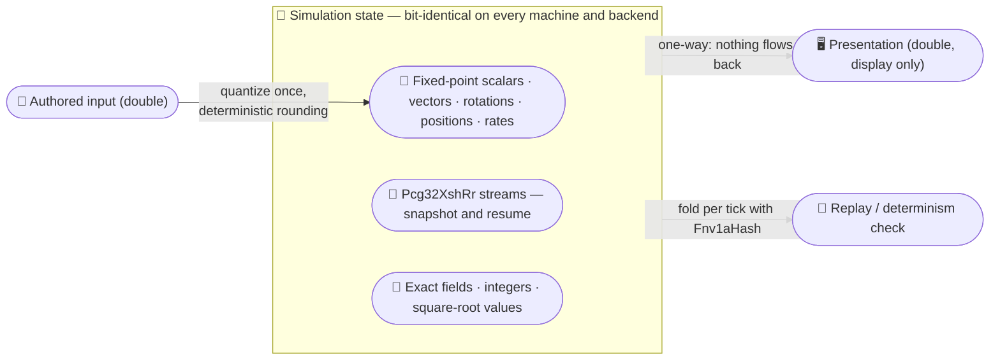
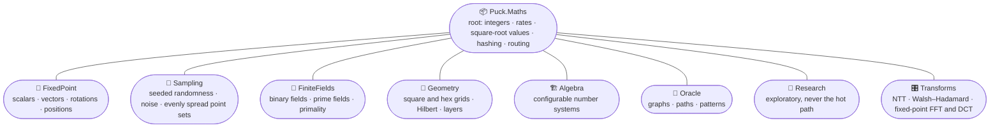

# Deterministic numerics

Puck.Maths supplies the numbers and operations used in reproducible simulation:
fixed-point scalars, vectors, rotations, and positions; resumable random streams;
and exact integer and algebraic tools. Determinism means that identical inputs
to the deterministic operations produce identical bits across supported machines.
A simulation must also preserve its input order, random stream state, and
rounding boundaries. This is a guarantee at a fixed code version; deliberate
algorithm changes can change recorded results.

**Fixed-point** values store numbers as scaled integers. Operations that cannot
retain an exact result round according to their documented rule. **Finite
fields** provide exact arithmetic within a finite set of values. Seeded generators
produce repeatable sequences whose state can be saved and resumed.

Start with [Three small programs](#three-small-programs), or use
[What do I reach for?](#what-do-i-reach-for) to choose a primitive. The
[orientation](#orientation) links to the specialized references, and
[root-level types](#root-level-types) covers operations outside those folders.
Read [Deliberately not reproducible](#deliberately-not-reproducible) for the
analysis, display, and security helpers excluded from simulation use.

The deterministic paths do not depend on the clock or current culture. Some
routines select faster instructions from the CPU feature set; those paths must
return the same bits as their portable fallbacks.

## The determinism boundary

The library follows one rule: `double` may enter once at an authoring boundary
and leave for display, but simulation state itself is fixed-point, exact, or
seeded—and nothing computed for presentation ever flows back:



## Deliberately not reproducible

Three surfaces are deliberately *not* reproducible, and none may be used in
simulation state:

- [`SecureRandom`](../../src/Puck.Maths/Sampling/README.md#securerandom), which draws from the
  platform's cryptographic generator.
- [`ProbabilityFunctions`](../../src/Puck.Maths/Sampling/README.md#probabilityfunctions), a `double`
  quantile function meant for analysis and display.
- [`ConeDirectionTable`](../../src/Puck.Maths/Sampling/README.md#conedirectiontable), which is
  same-machine only: it builds its table with the platform's `Math.Cos`,
  `Math.Sin` and `Math.Tan`, so two machines can disagree in the last bits.
  Never place a built table in replay state; if you need one across machines,
  generate and version the constants instead of rebuilding them.

One more exclusion, narrower but easy to trip over: **`GetHashCode` is not part
of the bit-identical promise.** `RealQuadratic` and `QuadraticAlgebra` fold
their hashes through the framework's `HashCode`, which .NET randomizes per
process. The same value may therefore produce a different number in another
process, within the ordinary `GetHashCode` contract. Hashes are for hash tables.
Never use one as a replay fingerprint, a state hash, an ordering key or a
snapshot field; use the value's own components, which *are* reproducible.

Types that fold through `Fnv1aHash` instead—the algebra values among them—
happen to be stable across processes, but do not rely on that either: it is not
a contract, and any of them may move to the framework fold. If you need a stable
digest, take one explicitly.

Everything is in namespace Puck.Maths except part of Research, which uses
Puck.Maths.Research. The [project declaration](../../src/Puck.Maths/Puck.Maths.csproj)
and [project map](../project-map.md) own dependency information.

The hot scalar and vector paths are allocation-free. Generic integer algorithms
sit on `System.Numerics` interfaces, so one implementation serves several widths.
Table construction and large prime-counting operations may allocate or rent.

---

## Orientation

The library is organized into eight folders plus a set of root-level types.
Each folder has its own README carrying the detailed contracts for its types:
what each operation guarantees, the invariants, and how the folder is verified.
Begin with the map and table below, then follow the link into the folder you
need.



| Folder | What lives in it | Read when you need |
|---|---|---|
| [`FixedPoint/`](../../src/Puck.Maths/FixedPoint/README.md) | The fixed-point scalars—signed and unsigned Q48.16, meaning 48 integer bits and 16 fraction bits, plus the signed Q16.48 that splits the same word the other way for reciprocal quantities—the three unit-interval fractions, vectors, the planar trio (complex, dual, split), quaternions, rigid transforms, the hierarchical world position, the rate accumulators. | Any value a simulation advances, compares, hashes or replays. |
| [`Sampling/`](../../src/Puck.Maths/Sampling/README.md) | The seeded generator, weighted choice, spatial noise, low-discrepancy sequences and digital nets (point sets that spread evenly by construction), and the two non-simulation paths (`SecureRandom`, `ProbabilityFunctions`). | Anything random, scattered, or noisy. |
| [`FiniteFields/`](../../src/Puck.Maths/FiniteFields/README.md) | Binary fields over fixed-size bit patterns, prime fields and their extensions, error-correction arithmetic, and exact primality on `ulong`. | Error-correcting codes, checksums, and modular arithmetic. |
| [`Algebra/`](../../src/Puck.Maths/Algebra/README.md) | Configurable number systems that can add a root, add generators, raise a degree, or double an existing number type. | A relationship chosen at runtime, or a proof that the same operation agrees across number types. |
| [`Geometry/`](../../src/Puck.Maths/Geometry/README.md) | Square and hex grids, the locality-preserving Hilbert curve, layered index spaces, and exact integer geometry. | A grid, a space-filling order, or a layered index. |
| [`Oracle/`](../../src/Puck.Maths/Oracle/README.md) | One configurable product operation evaluated with different rules for combining values, then used to build graphs, geometric algebras, planar tangles, divisor arithmetic, and pattern languages. | Reachability, shortest paths, pattern matching, holes in a structure, or group words. |
| [`Research/`](../../src/Puck.Maths/Research/README.md) | Exploratory exact tools: continued-fraction and radical tails, positional and Ostrowski automatic sequences, Sturmian and quasicrystal words, Fibonacci and metallic-mean arithmetic, odd-cyclic incidence, and real-quadratic orders. Partly in `namespace Puck.Maths.Research`; that folder README says which types. | Research questions and compiled random-access integer patterns, never the simulation hot path. |
| [`Transforms/`](../../src/Puck.Maths/Transforms/README.md) | The exact number-theoretic transform over `PrimeField64` and the exact Walsh–Hadamard transform over any binary integer; the fixed-point FFT over `FixedComplex` and the fixed-point DCT over `FixedQ4816`—one plan-then-in-place shape, cached twiddle plans, cyclic convolution on both spectral transforms. | A frequency-domain or sequency-domain transform, or a cyclic convolution. |

The [root-level type map](#root-level-types) below introduces the types that do
not belong to one of those folders: integer routines, exact discrete rates,
exact real quadratics, hashing, and deterministic routing.

---

## What do I reach for?

Start with the value or operation you need. Pick a row, then follow its link
for the detailed contract.

| I need… | Reach for | Where |
|---|---|---|
| A probability, a certainty, a weight that can say "all the way" | `UnitInterval32`—the closed `[0, 1]` on a `2⁻³²` grid, with a real `1` | [FixedPoint](../../src/Puck.Maths/FixedPoint/README.md#unitinterval32) |
| A fraction in `[0, 1)`—blend factor, normalized coordinate, sub-pixel offset | `UnitFraction16` (16-bit) or `UnitFraction32` (32-bit). There is no `1.0` in either, by design | [FixedPoint](../../src/Puck.Maths/FixedPoint/README.md#unitfraction16-and-unitfraction32) |
| A general scalar with an integer part | `FixedQ4816` signed, `UFixedQ4816` unsigned. Choose signedness deliberately | [FixedPoint](../../src/Puck.Maths/FixedPoint/README.md#choosing-a-scalar) |
| A direction, a velocity, a displacement | `FixedVector2` / `FixedVector3`. A vector is a **displacement**, never a position | [FixedPoint](../../src/Puck.Maths/FixedPoint/README.md#fixedvector2-and-fixedvector3) |
| A world position at planet scale | `FixedPosition`—a coarse 64-bit cell index plus a small centred local offset, so precision is the same everywhere on the map | [FixedPoint](../../src/Puck.Maths/FixedPoint/README.md#fixedposition) |
| A 2D rotation | `FixedComplex`—`FromAngle`, `*` composes turns, `Rotate` applies one | [FixedPoint](../../src/Puck.Maths/FixedPoint/README.md#fixedcomplex) |
| A 3D rotation | `FixedQuaternion`; add a translation and it becomes `FixedRigidTransform` | [FixedPoint](../../src/Puck.Maths/FixedPoint/README.md#fixedquaternion) |
| To interpolate or clamp | `FixedQ4816.Lerp` / `FixedQ4816.Clamp`, `FixedVector2.Lerp` / `FixedVector3.Lerp`, `FixedQuaternion.Slerp`, `FixedRigidTransform.ScLerp` (the screw) | [FixedPoint](../../src/Puck.Maths/FixedPoint/README.md#fixedq4816) |
| Drift-free rate integration (velocity → position, acceleration → velocity) | `FixedRateAccumulator` / `FixedVector3RateAccumulator`—the division remainder carries across ticks | [FixedPoint](../../src/Puck.Maths/FixedPoint/README.md#fixedrateaccumulator-and-fixedvector3rateaccumulator) |
| A pole-matched second-order response—a target that eases, overshoots, or anticipates instead of snapping | `SecondOrderDynamics`—`Create(f, ζ, r)` derives the coefficients, `Compile`+`Step` for per-tick advance, `Evaluate` for a closed-form read from initial conditions | [FixedPoint](../../src/Puck.Maths/FixedPoint/README.md#secondorderdynamics) |
| A curve authored by knot curvature rather than control points | `CurvatureSpline.Compile`—knots declare position, tangent direction, and signed curvature; the compiled tangent lengths and a Simpson arc-length table come out exactly. `CompiledCurvatureSpline.Evaluate(arcLength)` samples position, tangent, and curvature per tick | [FixedPoint](../../src/Puck.Maths/FixedPoint/README.md#curvaturespline) |
| A seeded RNG you can snapshot and resume | `Pcg32XshRr`—one stream per system | [Sampling](../../src/Puck.Maths/Sampling/README.md#pcg32xshrr) |
| To shuffle a list reproducibly | `Pcg32XshRr.Shuffle`—in-place Fisher–Yates from the high end down | [Sampling](../../src/Puck.Maths/Sampling/README.md#pcg32xshrr) |
| A weighted pick | `WeightedSampler.Create` once at load, then `AliasTable<T>.Sample` in constant time with two generator advances | [Sampling](../../src/Puck.Maths/Sampling/README.md#weightedsampler-and-aliastabletelement) |
| Smooth spatial noise | `FieldNoise`—a pure function of `(seed, position)`, nothing to persist | [Sampling](../../src/Puck.Maths/Sampling/README.md#fieldnoise) |
| Points that spread out without clumping | `LowDiscrepancy.R1`/`R2` for an even-looking spread; `DigitalNetSampler` when supported subdivisions must contain an exact share of the samples | [Sampling](../../src/Puck.Maths/Sampling/README.md#choosing-a-primitive) |
| Cryptographic randomness | `SecureRandom`—and never in simulation state; it is not reproducible | [Sampling](../../src/Puck.Maths/Sampling/README.md#securerandom) |
| Arithmetic over fixed-size bit patterns, written `GF(2^k)` | `BinaryField<T>` over a chosen modulus, or the canonical `BinaryFields.Degree8/16/32/64/128` | [FiniteFields](../../src/Puck.Maths/FiniteFields/README.md#binaryfieldt) |
| Error-correction symbols over a binary field, and reading a codeword back | `ReedSolomon.BuildGenerator` once, then `ComputeCheckSymbols` per message and `ComputeSyndromes` to verify | [FiniteFields](../../src/Puck.Maths/FiniteFields/README.md#reedsolomon) |
| Modular arithmetic mod an odd prime, exact square roots, exact primality on `ulong` | `PrimeField64`, or `QuadraticExtensionField64` when each value needs two prime-field parts | [FiniteFields](../../src/Puck.Maths/FiniteFields/README.md#primefield64) |
| An exact cyclic convolution, or a frequency-domain transform over a finite field | `NumberTheoreticTransformPlan.Create` once, then `NumberTheoreticTransform.Forward` / `.Inverse` / `.Convolve` | [Transforms](../../src/Puck.Maths/Transforms/README.md#numbertheoretictransform) |
| A fixed-point FFT—forward/inverse over `FixedComplex`, or a real sequence via `ForwardReal`/`InverseReal` | `FixedFourierTransformPlan.Create` once, then `FixedFourierTransform.Forward` / `.Inverse` | [Transforms](../../src/Puck.Maths/Transforms/README.md#fixedfouriertransform) |
| A plan-free exact ±1 transform over integer lanes | `WalshHadamardTransform.Forward` / `.Inverse` | [Transforms](../../src/Puck.Maths/Transforms/README.md#walshhadamardtransform) |
| A fixed-point DCT-II/DCT-III pair over real values | `FixedCosineTransformPlan.Create` once, then `FixedCosineTransform.Forward` / `.Inverse` | [Transforms](../../src/Puck.Maths/Transforms/README.md#fixedcosinetransform) |
| Reachability, shortest paths, walk counts, best-probability routes | A `Presentations.Quiver` with the matching material—the rules used to combine path values | [Oracle](../../src/Puck.Maths/Oracle/README.md#choosing-an-entry-point) |
| Pattern matching represented by algebra values | `TokenPattern` then `PatternMatcher.TryCompile` | [Oracle](../../src/Puck.Maths/Oracle/README.md#the-language-axis) |
| An exact integer allocation over intervals (jobs per frame, samples per video frame) | `DiscreteMeasure`, compiled to `CompiledDiscreteMeasure64` for the hot path | [below](#root-level-types) |
| An exact value involving a square root—no floating point, no drift | `RealQuadraticField` names the field, `RealQuadratic` carries the value | [below](#root-level-types) |
| Proof that a quantized slope reproduces exact Beatty floors—and the exact index where it first stops | `BeattyQuantization.CertifySlope`; `ContinuedFraction.Convergents` supplies the worst-case indices | [Research](../../src/Puck.Maths/Research/README.md) |
| The fraction with the smallest denominator inside an interval | `SimplestRational.InOpenInterval` | [below](#root-level-types) |
| A hex grid whose 60° rotations are exact | `HexagonalCoordinate` | [Geometry](../../src/Puck.Maths/Geometry/README.md#hexagonalcoordinate) |
| Dense hex-disk storage with a continuous neighbour walk and ring symmetries | `HexagonalIndex` | [Geometry](../../src/Puck.Maths/Geometry/README.md#hexagonalindex) |
| Signed square-grid cells with exact quarter turns and checked Gaussian arithmetic | `SquareCoordinate` | [Geometry](../../src/Puck.Maths/Geometry/README.md#squarecoordinate) |
| Dense centered square storage with a continuous cardinal walk and direct symmetries | `SquareIndex` | [Geometry](../../src/Puck.Maths/Geometry/README.md#squareindex) |
| Dense nonnegative square coordinates with direct swap, common translation, scale and component queries | `ElegantPair` / `ElegantUnpair` and `ElegantSwap`, `ElegantTranslate`, `ElegantScale`, `ElegantMinimum`, `ElegantMaximum`, `ElegantDifference`, `ElegantSum` | `UnsignedNumberFunctions` |
| Cache-coherent tile/chunk ordering | `HilbertCurve` (locality-preserving) rather than Morton order | [Geometry](../../src/Puck.Maths/Geometry/README.md#hilbertcurve) |
| A layered index space—rings, shells, shards | `LayerSequence`—constant-time index → layer, exact integer result | [Geometry](../../src/Puck.Maths/Geometry/README.md#layersequence) |
| One algebraic relationship over several number types, or a proof that two number systems agree | `QuadraticAlgebra<TScalar>` and the rest of the configurable algebra types | [Algebra](../../src/Puck.Maths/Algebra/README.md) |
| To fold a per-tick state hash for a determinism or replay check | `Fnv1aHash`—allocation-free, endianness-independent | [below](#root-level-types) |
| A restriction that can only narrow—a capability mask under AND, a quantity under minimum, or both paired as one value | `MeetMask64`, `MeetQuantity64`, `MeetProduct<TFirst, TSecond>` | [below](#root-level-types) |
| Bit tricks, GCD, integer roots, pairing functions, prime factorization | `BinaryIntegerFunctions`, `UnsignedNumberFunctions`, `PrimeExtensions` | [below](#root-level-types) |
| Integer square roots, inverses, primality, or factorization beyond 64 bits | `BigIntegerFunctions`; its API documentation states where primality and factorization are proved or refused | [below](#root-level-types) |

---

## Three small programs

Run these examples in a console project referencing Puck.Maths. Each illustrates
one boundary: authoring conversion, random-state persistence, or rate integration.

**Fixed-point: constructing values and computing with them.**

```csharp
using Puck.Maths;

// Three ways to construct a value. The double form is for authored input: it
// quantizes once, by a deterministic rounding rule, and gives the same answer
// on every machine.
var speed  = FixedQ4816.FromInteger(value: 12);        // 12.0
var half   = FixedQ4816.FromRawBits(value: 1L << 15);  // 0.5, from the raw bits
var tuning = FixedQ4816.FromDouble(value: 0.35);

// Dot accumulates all three products exactly and rounds once at the end.
var velocity = new FixedVector3(X: speed, Y: half, Z: tuning);
var forward  = new FixedVector3(X: FixedQ4816.Zero, Y: FixedQ4816.Zero, Z: FixedQ4816.One);
var closing = FixedVector3.Dot(left: velocity, right: forward);

// Converting to double is for display only. Converted values must never flow
// back into simulation state.
var forDisplay = (double)closing;
```

**Sampling: a seeded stream you can save and resume.**

```csharp
using Puck.Maths;

// Stream ids are small and consecutive, all derived from the run's master seed.
const ulong masterSeed = 0xC0FFEEUL;
var loot = Pcg32XshRr.Create(state: masterSeed, stream: 3UL);

// Build the distribution once at load; each sample takes constant time and
// advances the generator exactly twice.
ReadOnlySpan<(string Element, ulong Weight)> drops =
    [("common", 70UL), ("rare", 25UL), ("epic", 5UL)];
var table = WeightedSampler.Create(entries: drops);

var drop = table.Sample(generator: ref loot);

// Generator state IS simulation state. Persist all three words with the world…
var (increment, multiplier, state) = (loot.Increment, loot.Multiplier, loot.State);
// …and a restored generator continues the exact same sequence.
var resumed = Pcg32XshRr.FromRawBits(
    increment: increment,
    multiplier: multiplier,
    state: state
);
```

**Rate integration without drift.**

```csharp
using Puck.Maths;

// A 120 Hz time base. One unit per second, integrated as 120 single-tick steps.
var integrator = new FixedRateAccumulator(ticksPerSecond: 120L);
var travelled  = FixedQ4816.Zero;

for (var tick = 0; (tick < 120); ++tick) {
    travelled += integrator.Integrate(ratePerSecond: FixedQ4816.One, elapsedTicks: 1UL);
}
// travelled is exactly FixedQ4816.One — the sub-unit division remainder carried
// across every step instead of being rounded away 120 times.
// integrator.Remainder is authoritative state: snapshot it with the world.
```

---

## Four rules

These four rules protect the determinism promise. Each is stated briefly here
and explained fully—with the evidence behind it—in the folder that owns it.

1. **No floating point in simulation state.** A `double` may enter at an
   authoring boundary and leave at a presentation boundary, but the presentation
   boundary is one-way: nothing a renderer or a diagnostic computed may flow
   back into state. The [FixedPoint README's opening](../../src/Puck.Maths/FixedPoint/README.md)
   lists the conversions that form these boundaries.

2. **One stream per system.** Derive each consumer's `Pcg32XshRr` from the run's
   master seed with its own small stream id; sharing one generator couples
   systems through draw order. This and the three rules beside it (snapshots,
   seeking by generator advances rather than method calls, and alias-table
   ordering) are
   [the rules a consumer inherits](../../src/Puck.Maths/Sampling/README.md#the-rules-a-consumer-inherits).

3. **Do not reassociate a rounded product.** .NET's generic `INumber<T>`
   interface says which operations a type supports; it does not prove that
   multiplication is associative. `(a·b)·c` and `a·(b·c)` are different at some
   operands, and the combined operations exist so a whole expression rounds
   *once*. Field products in
   [`FiniteFields/`](../../src/Puck.Maths/FiniteFields/README.md) are the exception: exact, therefore
   safe to reassociate. The
   [FixedPoint README](../../src/Puck.Maths/FixedPoint/README.md#load-bearing-invariants) explains
   the one-rounding rule and the tests that demonstrate why it matters.

4. **Do not reimplement what is already here.** The operations most often
   reimplemented are already shipped: `FixedQ4816.Lerp` / `.Clamp` (and
   `FixedVector3.Lerp`, `FixedQuaternion.Slerp`,
   `FixedRigidTransform.ScLerp`),
   `UnsignedNumberFunctions.SquareRoot`,
   `BinaryIntegerFunctions.GreatestCommonDivisor`, and `FixedRateAccumulator`
   for anything integrating a rate. A second implementation rounds differently
   somewhere, and the two will eventually disagree. If what you need really is
   missing, add it to the library rather than beside it.

---

## Running the tests

The [Maths test suite](../../tests/Puck.Maths.Tests/README.md) owns the Default,
Deep, and exhaustive run instructions, coverage rules, and verification limits.

---

## Root-level types

This table is a conceptual map for the types that live at the project root. The
[generated API reference](../api) owns the complete member-by-member
surface, including parameters, return values, and exceptions.

| Type | Role |
|------|------|
| `Rational` / `RealQuadraticField` / `RealQuadratic` / `ContinuedFraction` | The exact rational (reduced on construction); the descriptor of a real quadratic field `ℚ(√d)`, its radicand canonicalized once; the exact value `(a + b·√d)/c` of such a field, with conjugate, norm and trace; and the repeating continued-fraction expansions of those values—including the convergents, the best rational approximations—without floating point. |
| `SimplestRational` | Locate the minimal-denominator fraction strictly inside an exact interval, by Stern–Brocot descent. |
| `CostBound` / `CostModelProfile` | Preserve known, unmodeled, and overflowed costs; compute exact budgets and deadline conversions under an authored service-rate policy. These abstract cycles do not measure a processor's frequency or certify hardware performance. |
| `DiscreteMeasure` / `CompiledDiscreteMeasure64` / `DiscreteMeasureCompilationFailure` | Allocate an exact integer amount across integer intervals, then compile supported measures into a bounded, allocation-free form for frequently run code. |
| `NumberTheoryFunctions` / `BigIntegerFunctions` | Provide prime enumeration, modular roots and inverses, primality, and factorization when the calculation needs arbitrary-width integers. |
| `Combinatorics` | Count subsets and permutations exactly, and give them dense integer identities; see [combination and permutation ranks](#combination-and-permutation-ranks). |
| `MonotonicPartitioner` / `MonotonicPartitionerMetrics` | Route a value to one of 1–1024 buckets while minimizing movement when another bucket is added, and report when that value moves. |
| `CyclicRotation` / `SymmetryLattice` / `SymmetryWord` | Provide a bit-exact rotation loop (the thirty-step table, or any order's root of unity), the fixed, symmetric node set behind it in eight dimensions with its exact root pairing and ring walks, and a word of its reflections baked to a permutation with a derived order and a constant-time counted power. |
| `Fnv1aHash` | Accumulate an explicit, stable 64-bit digest for replay and determinism checks. |
| `IMeetSemilattice<TSelf>` / `MeetMask64` / `MeetQuantity64` / `MeetProduct<TFirst, TSecond>` | Combine restrictions so the result never grants more than either input, whether the restriction is a bit mask, a quantity, or a pair of both. |
| `BinaryIntegerFunctions` / `UnsignedNumberFunctions` / `PrimeExtensions` | Supply generic bit and decimal-digit operations, integer roots and pairing, and exact 32-bit primality and factorization. |

The chooser above is the quickest way into these types. The API reference is
the place to check a particular overload or failure condition.

`ElegantPair` follows alternating square shells: for `m = max(x, y)`, the
index is `m(m + 1) + (m odd ? x - y : y - x)`. Shell `m` occupies exactly
`m²` through `(m + 1)² - 1`, and successive indices are grid neighbours.
`ElegantSwap` exchanges the coordinates; `ElegantTranslate(k)` adds the same
nonnegative `k` to both; `ElegantScale(k)` multiplies both by `k`. These direct
transforms retain the unsigned carrier and throw `OverflowException` if the
encoded result cannot fit. `ElegantMinimum`, `ElegantMaximum`,
`ElegantDifference` (absolute difference), and `ElegantSum` query the components
from the shell and its displacement from the diagonal. The original
`ElegantPair<TInput, TResult>` requires the caller to choose a result width
large enough; `ElegantUnpair` similarly requires sufficient component width.

For example, `2u.ElegantPair<uint, ulong>(1u)` is `5UL`; its swap is `7UL`,
translation by one is `13UL`, and scale by two is `18UL`. These operations
act on coordinates; adding two raw indices does not add their coordinates.

For repeating bit patterns, `BinaryIntegerFunctions.ReplicationMask<T>` places
one bit at the bottom of each block: `8.ReplicationMask<uint>()` gives
`0x01010101`. Multiplying by a pattern that fits in one block copies it across
the word; `0xABu.RepeatBits(8)` gives `0xABABABAB`. Both functions require a block
width that divides the fixed word width exactly. Signed types carry the same
bits, so the repeated result can be negative; a whole-word block returns the
input unchanged. `BigInteger` has no fixed word width and is refused. The
[source documentation](../../src/Puck.Maths/BinaryIntegerFunctions.cs) derives the replication
constant from a geometric series.

The internal Fermat masks used by bit permutations share these repetition
primitives. For 128-bit words, proper blocks repeat within a 64-bit half first,
then that half is copied. This keeps wide division and multiplication out of
mask construction and allows constant masks to fold into constant loads.

### Combination and permutation ranks

`Combinatorics` assigns consecutive `ulong` identities to finite subsets and
permutations. A combination forgets selection order; a permutation preserves
it. Supply zero-based ordinals, with a stable mapping from your domain's keys.
The library does not sort keys or infer that mapping.

```csharp
ReadOnlySpan<int> hand = [0, 1, 2, 3, 5];
ulong hands = Combinatorics.Binomial(52, 5);             // 2,598,960
ulong identity = Combinatorics.CombinationRank(52, hand); // 1
Span<int> restored = stackalloc int[5];
Combinatorics.CombinationUnrank(52, identity, restored);
int largest = Combinatorics.CombinationElement(52, 5, identity, 4); // 5

ReadOnlySpan<int> order = [2, 0, 1];
ulong permutation = Combinatorics.PermutationRank(order); // 4 of 3! = 6
Span<int> restoredOrder = stackalloc int[3];
Combinatorics.PermutationUnrank(permutation, restoredOrder);
```

Combination input must be strictly increasing, with each element below `n`.
Ranks use **colexicographic order**: compare the largest differing element
first. Thus the pairs start `[0,1], [0,2], [1,2], [0,3]`. For elements `a[i]`,
the rank is `Σ Binomial(a[i], i + 1)`. Increasing `n` preserves a subset's rank
as long as the complete space still fits. This follows the combinatorial
number system described by
[Derrick Stolee](https://computationalcombinatorics.wordpress.com/2012/09/10/ranking-and-unranking-of-combinations-and-permutations/).
Poker hand identity means the particular set of cards, not its poker strength
or an equivalence class under suit changes.

Permutation input contains every ordinal in `[0, length)` exactly once.
Ranks use ordinary **lexicographic order**, with each Lehmer digit counting
the still-available smaller ordinals. The digits have factorial place values;
[Keith Schwarz's factoradic explanation](https://www.keithschwarz.com/interesting/code/factoradic-permutation/FactoradicPermutation)
develops that correspondence. Arbitrary keyed rows must first be mapped to
these ordinals by their consumer.

All public results are exact. `Binomial(n, k)` accepts nonnegative `int`
arguments, returns zero for `k > n`, and throws on `ulong` overflow.
Combination encoding and decoding require the **entire** `Binomial(n, k)`
space to fit, even when an individual rank would fit. `Factorial` fits through
20!, and permutation operations accept lengths 0 through 20. Larger complete
permutation spaces require a wider encoding than these APIs provide. Empty
combinations and permutations each form a one-element space with rank zero.
Invalid ranks are refused before writing any output; destination length
determines how many elements to decode.

Successful calls allocate no managed memory. Binomial arithmetic stays in
64 bits when its intermediate product fits and uses an exact 128-bit
intermediate otherwise. Combination unranking updates binomial coefficients
by recurrence for universes through 128 elements and uses binary search for
larger universes, so a large universe does not require a linear scan.
`CombinationElement` decodes from the
largest position down to the requested one; it is useful for a single query,
while `CombinationUnrank` avoids repeating that work when all elements are
needed. Permutation ranking uses a bit set and population counts.

The registered laws compare ordering against independent enumeration, check
large counts with `BigInteger`, and exercise invalid inputs and unchanged
destinations on failure. The Deep tier checks every five-card hand.
`CombinationQueries` and `PermutationQueries` in the
[Maths benchmark harness](../../src/Puck.Cli/README.md#puck-benchthe-puckmaths-microscope)
measure representative small and wide spaces, including an independent
quadratic permutation-ranking baseline.

---

## Further reading

- [Specialized references](#orientation)—the eight source-folder references
  own their detailed type contracts; they are linked here, not copied.
- [Maths test suite](../../tests/Puck.Maths.Tests/README.md)—the law
  suite, and `LawRegistry.cs` inside it is the executable index of what is proved.
- [API reference](../api)—member-by-member docs.
- [Reference](README.md)—related library and schema contracts.
