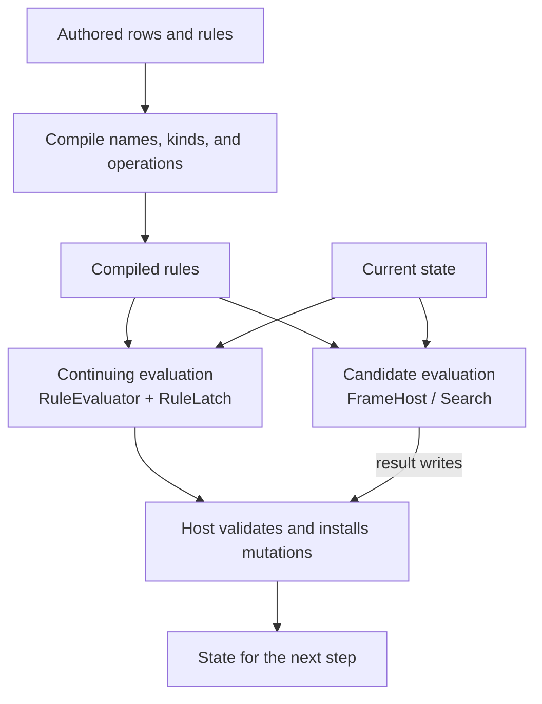

# State and rules

Puck.State gives a simulation a shared model of named data and rules for changing
it. It can support a card game, a board-game judge, a turn-based resolver, or
another deterministic application with its own host. Puck.World builds on these
same contracts and adds world-specific concepts.

Start with four ideas: **rows describe data**, **rules propose changes**,
**a host accepts and installs changes**, and **frames let rules explore a
candidate without changing installed state**.

## See the whole system



**Compilation** resolves names and validates rule operations. **Evaluation**
reads the current values and attempts the effects of rules whose conditions
hold. **Installation** makes an accepted change authoritative: the host treats
it as the current state, records it, and exposes the appropriate observations.

These are separate stages. Compiling a rule does not run it. Judging a candidate
does not commit it. The host owns time, admission, persistence, and any concepts
outside the library's state vocabulary.

## Learn the concepts in order

| Chapter | The question it answers |
|---|---|
| [1. Rows, cells, and domains](state/data-model.md) | How do I represent a balance, a piece, a board, or a pile? |
| [2. Reads and expressions](state/expressions.md) | How do I read live values and combine them into a question? |
| [3. Rules and transactions](state/rules.md) | When does a rule fire, in what order, and which writes succeed together? |
| [4. Frames and scheduling](state/frames.md) | How can I try a change privately, and when is a cached answer safe? |
| [5. Generators and draw sites](state/generators.md) | How do random values remain reproducible and independently resumable? |
| [6. Search](state/search.md) | How do rules judge legal moves and compare possible futures? |
| [7. Hosting and extension](state/hosting.md) | What must my application implement, validate, and checkpoint? |

Try the small example below before choosing a deeper chapter.

## Build a small game's vocabulary

A **row** is a named collection of values of one kind. A **cell** is one
value addressed by a key inside its row. A **gate** is the condition of a
rule; an **effect** is a change attempted when the rule fires.

| Game idea | Representation | What rules can do with it |
|---|---|---|
| One player's balance | An Int slot named `coins` | Test the balance, add a reward, or spend it. |
| A location per piece | A keyed Int row named `pieceCell` | Read or change the cell ordinal of a named piece. |
| Occupancy on a board | A row over a topology, optionally derived from piece positions | Test occupied locations without storing a second independent position. |
| Cards in a hand | An ordered row whose keys come from the card domain | Inspect an endpoint or transfer a card between piles. |

A **topology** supplies locations and their connections. A **domain** says
how a row's cells are addressed. Neither decides what a legal move is:
rules and host admission provide that meaning.

Numeric expressions use integers or [Q48.16 fixed-point values](maths.md);
rows also support booleans and text. The encoding and addressing rules belong
to the [data-model chapter](state/data-model.md).

## Evaluate a small rule

This complete C# program adds one coin to an integer slot. Run it in a console
project referencing Puck.State, or place it in a checkout project with a project
reference to the library. The [getting-started guide](../getting-started.md)
owns the repository setup.

```csharp
using Puck.State;

StateRow[] rows = [new(
    Name: CellName.Parse("coins"),
    Kind: CellKind.Int,
    Cells: [new StateCell(Key: StateRow.SlotKey, Value: 2)])];
var section = new StateSection(Rows: rows);
var catalog = StateCatalog.Compile(section);
var context = new RuleCompileContext(
    section: section, catalog: catalog, tables: null, patterns: null,
    generators: null, simulationRateHz: 60, vocabulary: RuleVocabulary.Core);
var rules = RuleCompiler.CompileAll(
    rules: [new Rule(
        Name: CellName.Parse("award"),
        Effects: [new ActionEffect.AddState(State: "coins", Value: 1m)])],
    context: context);

var layout = new FrameLayout(rows: rows, topology: static _ => null);
var host = new FrameHost(layout, rows, catalog, CompiledPatterns.Empty, []);
host.Frame.Load(new RowStore(rows));
host.Judge(rules, tick: 1UL);
host.Frame.TryStored(rows[0], StateRow.SlotKey, out long coins, out _);
Console.WriteLine(coins); // 3
Console.WriteLine(rows[0].Cells![0].Value); // 2: the source row is unchanged
```

Read the program in three stages:

1. Describe the row and rule, then build a catalog and compile context. The
   catalog resolves the name `coins`; its handles belong to that catalog.
2. Build a layout and load the frame from a `RowStore`. This supplies the
   candidate's starting value of two.
3. Judge the rule and read the frame. The candidate now holds three, while
   the original row still holds two. Loading it again from the unchanged
   row store would reset the candidate to two.

With no gate, the rule always fires. With no explicit mode, it uses Level and
fires on every evaluation.

A frame is useful for hypothetical evaluations and search. It supports existing
numeric cells and the transforms listed under [The store and the
frame](state/frames.md#the-store-and-the-frame); it refuses cell removal and generator draws,
and skips host-specific effect arms. Restrict judge rules to the operations the
frame can answer. Each `Judge` call clears its edge latch. A continuing simulation
instead keeps a `RuleLatch` and calls `RuleEvaluator.Evaluate` through its host,
retaining the latch between steps so Edge rules fire once per gate crossing.

## Choose your next step

Use [Rules and transactions](state/rules.md) to add conditions and grouped effects.
Read [Frames](state/frames.md) before using the judge for hypothetical moves,
and [Hosting](state/hosting.md) before building a continuing simulation.

The [world schema](../../src/Puck.World.Schema/README.md) owns world-specific
fields and authoring contracts. The [API reference](../api/index.md) owns member
signatures. [State tests](../../tests/Puck.State.Tests/README.md) own verification
scope and run instructions.

[Reference index](README.md)
