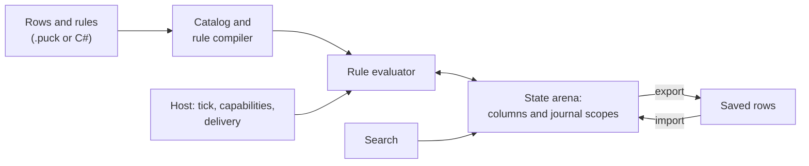
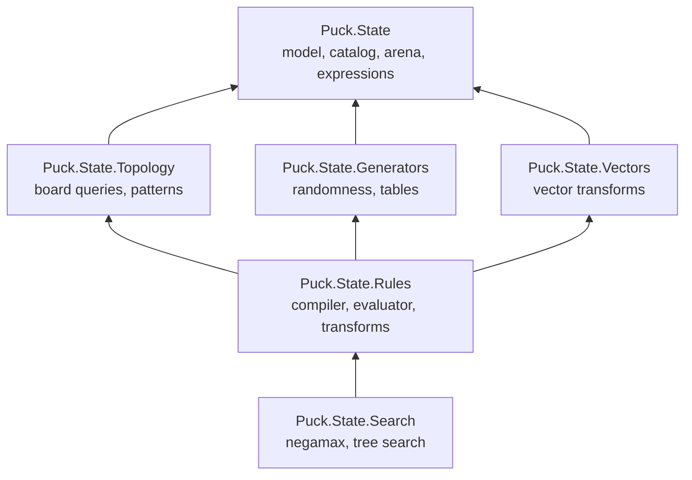

# State and rules overview

Puck's state system holds the data a simulation reasons about and the rules that
change it. You describe your game's data as named rows of values, write rules
that read those values and propose changes, and let a host run the rules once per
tick. The same libraries power a card game, a board-game move judge, a
turn-based resolver, and every world that Puck.World runs.

This article introduces the system: what you can build with it, the ideas it's
built on, how its parts fit together, and where to read next. If you'd rather
start with code, try the [quickstart](state/quickstart.md) first and come back.

## What you can build

The state system is general enough for most rule-driven simulations. Here are a
few of the things it's used for, and the part of the system that does the work:

| You want to… | You use… |
|---|---|
| Track a score, a timer, a hand of cards, or a board | [Rows, cells, and values](state/data-model.md) |
| Make a value refill over time, ease toward a target, or stay hidden from some players | [Row and cell behavior](state/traits.md) |
| Spawn and remove bounded sets of units, each with typed fields | [Records, pools, and handles](state/records-and-pools.md) |
| Model a grid, a hex board, a map of territories, or an aperiodic tiling | [Topologies and boards](state/topologies.md) |
| Ask "can this piece move there?" or "does this hand form a run?" | [Reads and expressions](state/expressions.md) and [Patterns](state/patterns.md) |
| Spend coins and award a card in one step that either fully happens or doesn't | [Rules and firing](state/rules.md) |
| Shuffle a deck, move cards between piles, flip a line of discs | [State transforms](state/transforms.md) |
| Resolve a chain reaction, walk through the phases of a turn, or undo a move | [Rule groups and turn undo](state/rule-groups.md) |
| Roll dice or deal cards reproducibly | [Generators and draw sites](state/generators.md) |
| Let characters remember events and recall the ones that fit the moment | [Vectors and embedding spaces](state/vectors.md) |
| Find legal moves or pick a computer opponent's best move | [Search](state/search.md) |
| Save, restore, and hash the whole state | [The state arena](state/arena.md) |
| Find rules whose order decides a result, or price a tick's worst-case work | [Rule analysis, scheduling, and work budgets](state/analysis.md) |

## Key concepts

These terms appear throughout the manual. Each article defines the terms it
uses again, so you can start anywhere. The [glossary](state/glossary.md) collects
every term in one place.

- A **row** is a named collection of values of one kind, such as `coins` or
  `pieceCell`. A **cell** is one value in a row, found by its **key**. A row
  with a single value is a **slot**.
- The **catalog** compiles row declarations into compact **handles**, so the
  running system addresses rows by number instead of by name.
- The **arena** stores every value in columns and records changes in **journal
  scopes** that can be committed or rewound.
- A **rule** has a **gate** (a condition) and **effects** (the changes it
  attempts). One gate opening is one **firing**, and a firing is atomic.
- A **host** is the application that runs the rules: it supplies the tick,
  serves the capabilities rules ask for, and delivers anything that leaves the
  arena, such as a sound cue or a save.

## How the pieces fit together

The following diagram follows state from the author's declarations to a running
simulation.

1. **Declare.** You describe rows and rules, either in a `.puck` source that a
   world compiles or directly as C# records.
1. **Compile.** The catalog turns row names into handles. The rule compiler
   resolves every name a rule mentions, checks that each operation fits the row
   it touches, and records what the rule needs from its host.
1. **Admit.** Before a rule runs, the host confirms that it can serve every
   capability the rule declared. A rule that needs something the host can't
   provide is rejected before evaluation starts.
1. **Evaluate.** Each tick, the evaluator runs the rules in order. Every firing
   opens a journal scope on the arena. If all of its effects succeed, the scope
   commits; if any is refused, the scope rewinds and nothing the firing did
   remains.
1. **Save and load.** The arena exports its contents back to the row list
   you declared, which is how a world is saved, sent to clients, and loaded
   again.

Search uses the same arena and the same rules. It opens a scope, tries a
candidate move, lets the rules judge it, and rewinds, without copying the state.

## Guarantees

The state system makes a few promises that the rest of Puck builds on.

- **Deterministic.** The same declarations and the same inputs produce
  bit-identical state on every run and every machine, whichever GPU backend
  presents it. Simulation values use
  integers and [Q48.16 fixed-point numbers](maths.md) (64-bit integers scaled by
  65,536) in place of floating point, and nothing reads the wall clock.
- **Atomic.** A rule firing's writes to the arena land together or not at all.
  Effects that leave the arena, such as a sound cue or a save, are checked
  before the firing commits and carried out after it.
  [Rules and firing](state/rules.md) explains which of them share the
  all-or-nothing promise.
- **Bounded.** Every row, pool, pattern, and search declares or inherits a
  ceiling, checked before anything runs. The rule analysis prices each
  rule's worst-case work, and Puck.World refuses a document whose rules could
  exceed the per-tick work ceiling when it loads.
- **Host-neutral.** The libraries know nothing about bodies, cameras, or
  networks. A host teaches the compiler its own concepts through registered
  extensions, and Puck.World is one such host.

> [!NOTE]
> Determinism holds at a fixed code version. When a calculation or a rule is
> corrected on purpose, state hashes move, and the baselines that recorded the
> old values are re-recorded in the same change. [Verify state changes](state/testing.md)
> covers the checks.

## The projects

The state system is six .NET projects in the engine services layer. Each
project references only the projects below it in this diagram.

| Project | What it contains |
|---|---|
| `Puck.State` | The data model (rows, cells, `CellValue`, domains, traits, records and pools), the catalog and the arena, compiled topologies, the expression language, the authored rule model, and the base types for facts and host capabilities. It references `Puck.Abstractions`, `Puck.Assets`, and `Puck.Maths`. |
| `Puck.State.Topology` | Board queries (rays and shapes) and pattern matching over arena values. |
| `Puck.State.Generators` | The randomness engine: draw sites, generator sources, Penrose patches, and static lookup tables. |
| `Puck.State.Vectors` | Typed access to vector columns and the `mix`, `mean`, `nearest`, and `remember` transforms. |
| `Puck.State.Rules` | The rule compiler, the evaluator, rule groups, the latch, the state transforms, and rule analysis and budgets. |
| `Puck.State.Search` | Game-tree search over arena journal scopes: negamax with alpha-beta pruning, and UCB1 tree search. |

A few types live in `Puck.State` even though their main users are in another
project, because the arena itself needs them: the compiled topology that lays
out board columns, the pattern tree that the parser reads, and the draw and
generator declarations that rows carry. The [project map](../project-map.md)
owns the repository-wide layering and the build check that enforces it.

## Find your way

The manual is organized by what you're trying to do.

### Get started

- [Quickstart: compile and run a rule](state/quickstart.md)
- [State in Puck.World](state/worlds.md)

### Understand the model

- [Rows, cells, and values](state/data-model.md)
- [Row and cell behavior](state/traits.md)
- [Records, pools, and handles](state/records-and-pools.md)
- [Topologies and boards](state/topologies.md)
- [Vectors and embedding spaces](state/vectors.md)
- [The state arena](state/arena.md)

### Read and change state

- [Reads and expressions](state/expressions.md)
- [Patterns](state/patterns.md)
- [Rules and firing](state/rules.md)
- [State transforms](state/transforms.md)
- [Rule groups and turn undo](state/rule-groups.md)
- [Generators and draw sites](state/generators.md)
- [Search](state/search.md)

### Build a host

- [Host and extend the state engine](state/hosting.md)
- [Rule analysis, scheduling, and work budgets](state/analysis.md)
- [Verify state changes](state/testing.md)

### Look things up

- [Limits and capacities](state/limits.md)
- [Glossary](state/glossary.md)
- [API reference](../api/index.md)

## Next steps

- [Quickstart: compile and run a rule](state/quickstart.md): build a tiny shop
  and watch a firing roll back.
- [Rows, cells, and values](state/data-model.md): learn how to represent your
  game's data.
- [State in Puck.World](state/worlds.md): see how a world declares, runs,
  saves, and verifies its state.

## See also

- [State and the authoring language: decisions](../decisions/state-and-language.md#the-rebuild):
  the reasoning behind the arena, atomic firing, and typed host capabilities.
- [World schema](../../src/Puck.World.Schema/README.md): every field of a world
  document's `state`, `rules`, and `search` sections.
- [Deterministic numerics](maths.md): the fixed-point and integer math that
  state values use.
