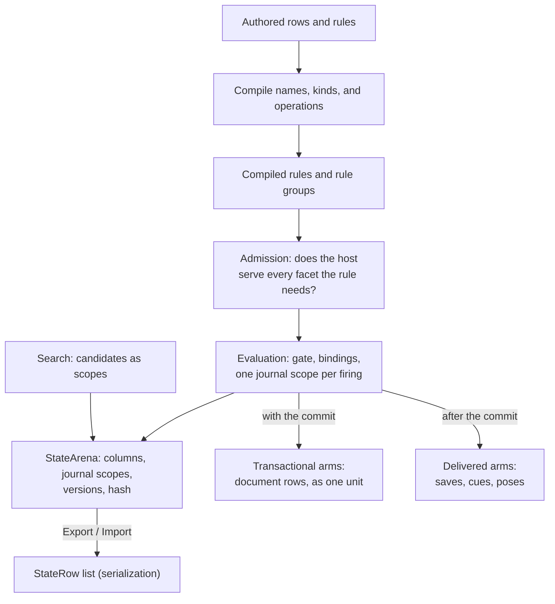

# State and rules

Puck.State gives a simulation a shared model of named data and rules for changing
it. It can support a card game, a board-game judge, a turn-based resolver, or
another deterministic application with its own host. Puck.World builds on these
same contracts and adds world-specific concepts.

Start with four ideas:

- **Rows describe data.** A row is a named collection of values of one kind,
  and a cell is one value addressed by a key inside it.
- **One arena holds every value.** `StateArena` is a columnar store: every row
  and cell lives in a typed column, and every read and write on the tick path
  addresses a column position rather than a name.
- **Rules propose changes, and a firing is atomic.** One gate opening is one
  journal scope on the arena. Either every reversible effect in it lands, or
  the scope rewinds and none of them do.
- **A host serves facets and owns what cannot be rewound.** The host supplies
  the tick, answers the capabilities a rule declared it needs, installs a
  firing's transactional arms as one unit with its commit, and delivers every
  other arm that leaves the arena only after it.

## See the whole system



**Compilation** resolves names and validates rule operations. **Admission**
compares a rule's declared needs against what the host advertises, and
refuses by facet name when the host cannot serve one. **Evaluation** reads
the current values through the arena and attempts the effects of rules whose
gates hold. **Export** turns the arena's columns back into the authored row
list, which is how a document is saved and loaded.

These are separate stages. Compiling a rule does not run it. Judging a candidate
does not commit it. The host owns time, admission, persistence, and any concepts
outside the library's state vocabulary.

## Learn the concepts in order

| Chapter | The question it answers |
|---|---|
| [1. Rows, cells, and domains](state/data-model.md) | How do I represent a balance, a piece, a board, or a pile? |
| [2. Reads and expressions](state/expressions.md) | How do I read live values and combine them into a question? |
| [3. Rules, firing, and groups](state/rules.md) | When does a rule fire, which writes succeed together, and how do several rules run as one step? |
| [4. The arena](state/frames.md) | Where do values live, how does a scope rewind, and when is a cached answer safe? |
| [5. Generators and draw sites](state/generators.md) | How do random values remain reproducible and independently resumable? |
| [6. Search](state/search.md) | How do rules judge legal moves and compare possible futures? |
| [7. Hosting and extension](state/hosting.md) | What must my application implement, validate, and checkpoint? |

Try the small example below before choosing a deeper chapter.

## Build a small game's vocabulary

A **row** is a named collection of values of one kind. A **cell** is one
value addressed by a key inside its row. A **gate** is the condition of a
rule; an **effect** is a change attempted when the rule fires.

| Game idea | Representation | What rules can do with it |
|---|---|---|
| One player's balance | An Int slot named `coins` | Test the balance, add a reward, or spend it. |
| A location per piece | A keyed Int row named `pieceCell` | Read or change the cell ordinal of a named piece. |
| Occupancy on a board | A row over a topology, optionally derived from piece positions | Test occupied locations without storing a second independent position. |
| Cards in a hand | An ordered row whose keys come from the card domain | Inspect an endpoint or transfer a card between piles. |

A **topology** supplies locations and their connections. A **domain** says
how a row's cells are addressed. Neither decides what a legal move is:
rules and host admission provide that meaning.

Numeric expressions use integers or [Q48.16 fixed-point values](maths.md);
rows also support booleans and text. The encoding and addressing rules belong
to the [data-model chapter](state/data-model.md).

## Evaluate a small rule

This complete C# program adds one coin to an integer slot. Run it in a console
project referencing Puck.State and Puck.State.Rules, or place it in a checkout
project with project references to both. The
[getting-started guide](../getting-started.md) owns the repository setup.

```csharp
using Puck.State;
using Puck.State.Rules;

StateRow[] rows = [new StateRow(
    Name: CellName.Parse("coins"),
    Kind: CellKind.Int,
    Cells: [new StateCell(Key: StateRow.SlotKey, Value: CellValue.Int(2L))])];
var section = new StateSection(Rows: rows);
var catalog = StateCatalog.Compile(section: section);
var context = new RuleCompileContext(
    section: section, catalog: catalog, tables: null, patterns: null,
    generators: null, simulationRateHz: 60, vocabulary: RuleVocabulary.Core);
var rules = RuleCompiler.CompileAll(
    rules: [new Rule(
        Name: CellName.Parse("award"),
        Effects: [new ActionEffect.AddState(State: "coins", Value: 1m)])],
    context: context);

var arena = new StateArena(catalog: catalog, section: section, time: ArenaTime.Origin);
var host = new ArenaEffectHost(arena: arena);

host.Advance(tick: 1UL, engineTick: 1UL);
new RuleEvaluator(host: host).Evaluate(
    rules: rules, latch: new RuleLatch(), stepTicks: 1UL);

catalog.TryResolve(lane: StateLane.Document, name: "coins", handle: out var coinsHandle);
catalog.Keys.TryResolve(name: StateRow.SlotKey, key: out var slotKey);
host.Arena.TryRead(rowOrdinal: coinsHandle.Ordinal, key: slotKey, value: out var coins);
Console.WriteLine(coins.AsInt);                 // 3
Console.WriteLine(rows[0].Cells![0].Value.AsInt); // 2: the authored row is unchanged
```

Read the program in three stages:

1. Describe the row and rule, then build a catalog and compile context. The
   catalog resolves the name `coins`; its handles belong to that catalog.
2. Build an arena over that catalog and seed it from the section. This supplies
   the starting value of two.
3. Evaluate the rule and read the arena. It now holds three, while the authored
   row still holds two. Loading the section again would reset the arena to two.

With no gate, the rule always fires. With no explicit mode, it uses Level and
fires on every evaluation.

A journal scope on the arena is what a hypothetical evaluation and a search
candidate use: a rewound scope leaves the arena byte-identical, a committed one
does not. A caller that judges many independent positions calls
`RuleLatch.Reset` before each judge, so every crossing is a first one; a
continuing simulation retains the latch between steps so Edge rules fire once
per gate crossing.

## The six projects

The state system is one layer split by concern. Every project declares
`<PuckLayer>Engine services</PuckLayer>`, and its project references point only
down this list.

| Project | What it owns |
|---|---|
| `Puck.State` | The model — rows, cells, `CellValue`, the catalog, the arena, compiled lattice topology, authored randomness's document facet, the pattern algebra's authored tree, the expression IR, the authored rule vocabulary, and the fact and facet base types. |
| `Puck.State.Topology` | The board-query and pattern layer over an arena: rays and board shapes through one span kernel, and the compiled pattern automaton's incremental resume over an arena-read word. |
| `Puck.State.Generators` | The authored-randomness engine over an arena: drawing a site's next value, a generator's declared table data, and a seeded Penrose patch. |
| `Puck.State.Vectors` | The vector half of the state graph: the typed view over a row's vector column, and the `mix`/`mean`/`nearest`/`remember` transforms over an arena. |
| `Puck.State.Rules` | The rule compiler, the evaluator, rule groups, the latch, the transforms, and the work budget. |
| `Puck.State.Search` | Negamax, tree search, and the candidate walk over arena journal scopes. |

`Puck.State` references only `Puck.Abstractions`, `Puck.Assets`, and
`Puck.Maths`; several of its own types — the compiled topology `ArenaLayout`
lays a lattice row's columns out with, the pattern node `PatternSpelling`
parses and prints, `Draw`/`StateGenerator` the document row schema types on —
stay in core rather than in Topology or Generators because a core file
consumes them directly, not because either satellite project is optional.
Topology, Generators, and Vectors each reference `Puck.State`;
`Puck.State.Rules` references those three; `Puck.State.Search` references
`Puck.State.Rules`. [The project map](../project-map.md) owns the
repository-wide layering, the gate that checks it, and each project's full
responsibility.

## Choose your next step

Use [Compile and run rules](state/rules.md) to add conditions, grouped
effects, and rule groups. Read
[Evaluate a candidate and reuse a proven answer](state/frames.md) before using
a judge for hypothetical moves, and [Hosting and extension](state/hosting.md)
before building a continuing simulation.

The [world schema](../../src/Puck.World.Schema/README.md) owns world-specific
fields and authoring contracts. The [API reference](../api/index.md) owns member
signatures. [State tests](../../tests/Puck.State.Tests/README.md) own verification
scope and run instructions.

[Reference index](README.md)
