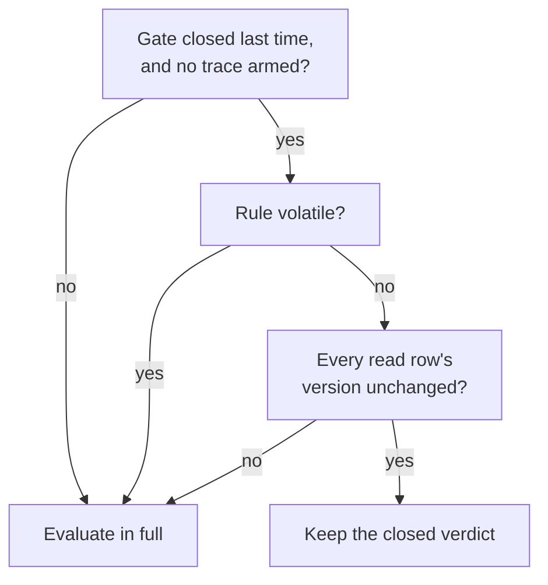

# Rule analysis, scheduling, and work budgets

Every compiled rule can say which cells it reads, which it writes, and how much
work one evaluation can cost. Several analyses read those answers: one finds
pairs of rules whose document order silently decides a result, one prices the
worst-case work a tick can do and refuses a document that exceeds the ceiling,
and one lets the evaluator skip a rule whose inputs haven't changed. This
article explains each analysis, what its numbers mean, and where each stops.
It's for authors reading `world.rule.hazards` and `world.budget.rules`, and for
host developers whose own facts feed these analyses.

## The example

The fragment below is a complete world that compiles and validates. It has an
Int slot `coins`, a `cards` slot, and a `phase` slot, and three rules.

```puck
schema: "puck.world.definition.v1"
documentId: "shop-analysis"

state {
  world {
    slot coins = 0 bounds(0..99)
    slot cards = 0 bounds(0..52)
    slot phase = 0 bounds(0..2)
  }
}

rule "buy-card" {
  when coins >= 3
  coins = coins - 3
  cards += 1
}

rule "income" {
  when phase == 1
  coins += 1
}

rule "bankrupt" {
  when phase == 2
  coins = 0
}
```

The sections below use these three rules to show what each analysis reports.

## Read and write sets

`RuleDataflow` walks a compiled rule and lists every cell it touches as a
`CellAccess`: a row ordinal, an interned cell key, and, for a write, whether it
replaces the cell (`IsSet`) or accumulates into it. A key the compiler can't
name at compile time (a key read from another cell, a reduction, a push, a
transform) is recorded as the invalid key, meaning "any cell of this row".

For the example:

| Rule | Reads | Writes |
|---|---|---|
| `buy-card` | `coins` | `coins` (set), `cards` (add) |
| `income` | `phase` | `coins` (add) |
| `bankrupt` | `phase` | `coins` (set) |

A rule's reads include its gate, its locals, its effect sources, and every
cell a key indirection reads through. A host's own facts add theirs through
`CollectReads` and `CollectWrites` (see [Host and extend the state engine](hosting.md)).

## Find order-sensitive pairs

Rules in one tick run as a sequence in document order, and a committed firing
is visible to the next rule. That order can decide a result without anyone
noticing. `RuleHazards.Analyze` lists the pairs where it does:

- A **write-after-read** hazard: an earlier rule reads a cell a later rule
  writes, so the reader sees the previous tick's value.
- A **write-after-write** hazard: two rules write one cell in the same tick and
  at least one of them sets it. Two sets mean the later one wins. A set after an
  add discards the add, and an add after a set lands on the new value. Two adds
  commute, so they aren't a hazard.

For the example, `world.rule.hazards` lists `buy-card` against `income`
(`buy-card` reads `coins` before `income` adds to it, and `income`'s add lands
on the value `buy-card` set) and `buy-card` against `bankrupt` (both set
`coins`, so `bankrupt` wins).

It doesn't list `income` against `bankrupt`. Their gates pin the literal cell
`phase` to disjoint ranges (1 and 2), so they can never both fire in one tick
and their order decides nothing. A **pin** comes from a gate that is one
comparison, or a top-level conjunction of comparisons, of a literal-keyed cell
against a constant. Ranges on one cell intersect, and `!=` pins nothing.

A hazard isn't an error. It tells you that moving one of the two rules could
change an answer. If you want the other answer, reorder the rules yourself; the
engine always keeps document order.

## Price a tick's rules

The **work sheet** bounds the worst-case work the document's rules can do in
one tick, in heuristic work units. `RuleWorkBudget` builds it from each fact's
own `Cost`.

### What one line costs

`CompiledRule.CostBreakdown` returns a `RuleCost` with three parts:

- **Setup**: what one sweep costs before its first evaluation, one unit per key
  a `forEach` snapshots.
- **Check**: what one evaluation costs whether or not its gate holds: locals,
  the gate, and any row selection.
- **Effects**: what one firing costs.

`RuleWorkBudget.Contributor` turns that into a **contributor line**. The
line's **multiplier** is the number of evaluations per tick: 1 for a rule
evaluated once, the iterated row's capacity for a `forEach` rule, the zone
table's entry count for a rule over zones, and, in Puck.World, the carrier or
pair count for an interaction. Its check units are `Setup + Multiplier ×
Check`, and its firing units are `Multiplier × Effects`.

A region interaction's carrier count is bounded by disc packing. Membership is
by a body's centre, so at most `floor(((R + r)/r)^2)` carriers fit inside a
region of radius `R`, clamped to the population capacity. The footprint radius
`r` is the smallest over every kit, because a property tag carries no static
link to a kit and any body could be the one standing in the region. When the
region is absent or no solid-only kit footprint resolves, the bound falls back
to the population capacity (`WorldRuleWorkBudget.RegionCapacityBound`).

A few prices worth knowing:

- An expression costs the sum of its operations and live operand reads. A fold
  runs its body once per cell its row can hold, so it is priced at the row's
  capacity whatever cells the row was authored with, and it reads that one row
  for scheduling. A shared subprogram is priced once per numeric kind and
  reused at every call site.
- A transform is priced by the operands it addresses (`TransformWork`): a
  fixed door, then the scratch its kernel leases, the cells it visits, and the
  journal entries its writes record. Rows it never touches don't change its
  price. A reordering transform includes a stable insertion sort over its
  capacity (`InsertionSortWork`), and a runtime sort is priced by
  `IntrosortWork`.
- Transforms, pool effects, and a `rewindGroup` share one unit, the element
  operation: one per journal entry, per vector component, per cell visited,
  and per scratch element leased. A text value is journaled by reference, so
  its length is memory the journal's byte ceiling bounds, never work.
- A `rewindGroup` is priced by the work of restoring its group's widest turn
  (`StateArena.EstimateRewindWork`), which its group's compilation binds; a
  rewind compiled without its groups is unmodeled. In Puck.World,
  `WorldRuleWorkBudget.Measure` and `Contributors` compile the whole document,
  groups included, so they return the sheet admission held.
- A `transaction` costs one unit more than its steps and its `onFailure`
  branch, each once: a savepoint fires each step once, commits them where they
  stand, and on a refusal fires the failure branch once.
- `TransformWorkLawTests` holds each transform's price between the work one
  firing over its costliest operand does, as the arena counts it, and the fixed
  door plus sixteen times that work. The arena counts journal entries, vector
  components, draw samples, and two of the `ArenaWork` counters it reports as
  the source `state.arena`: the scratch
  elements it leases (`state.arena.scratch-leased-elements`) and the lanes it
  visits (`state.arena.visits`).
- A `RuleEvaluator` counts its own work, as the source `state.rules`, under the
  `RuleWorkKinds` kinds: one
  evaluation per rule and binding it judges (`state.rules.evaluations`), one
  skip per closed verdict the schedule keeps without running the gate
  (`state.rules.skips`), and one firing per committed firing that moved the
  arena (`state.rules.firings`). Puck.World reads them through
  `WorldRuleHost.RuleWork`; `GoMoveLawTests` pins a Go move's tick by them.
- A pattern over a board costs its ray visits plus one step per cell. When the
  rule asks for the position or length of an occurrence, it adds the square of
  the longest ray in the read's direction, or of the cell count for `any`. A
  pattern over a keyed row or zone costs the source row's capacity times one
  match step plus the per-token expression, and again times the capacity for an
  occurrence search. Its read set includes the source row, the attribute row,
  the key indirection, and the token expression's reads.
- An operation the operator table doesn't price is **unmodeled**, and a sum
  no `long` holds is an **overflow**. Both carry through every sum and product
  they take part in, so a total that includes one is never mistaken for a
  number.

### Let exclusive rules share an allowance

Summing every line would over-count rules that can't fire together. The tally
builds an **exclusion trie** from each line's pinned cells: a line's firing
cost sits at the node its pins spell. A node's worst case is its own lines plus,
for each further cell its children pin, the costliest values of that cell.
Children that pin different cells aren't exclusive and sum. Checks and setup
always sum, because a closed gate still costs its check.

The discount has to account for writes during the tick. `CountWriters` counts,
per cell, how many evaluations per tick can write it; a write whose key isn't
literal counts against every cell of its row, pinned cells included. For each
of those writers, the tally takes one more of the costliest values, because a
cell that changes mid-tick can let a second exclusive rule fire later in the
same tick.

In the example, `income` and `bankrupt` pin `phase` to 1 and 2, and nothing
writes `phase`, so the sheet charges the costlier of their two firings once.
`buy-card`'s firing is charged in full, and all three checks are charged.

### The ceiling

`RuleCapacity.MaxWorkUnitsPerTick` is 4,000,000. A world whose sheet is
unmodeled, overflowed, or above the ceiling is refused, and the refusal names
the three costliest lines. The value was sized against a 30 Hz tick: it
reserves roughly a fifth of a 33.3 ms tick for the rule sweep's worst case, at
about 1.7 ns a unit.

A `forEach` line's multiplier is its row's capacity, so the usual fix for a
refused sheet is to author the capacity the row really needs.
`world.budget.rules` lists every line, costliest first, with its multiplier,
setup, check, fire, and total, and the pinned ranges it's priced under.
`world.budget.rules --why <rule>` prints one line's derivation: where the
multiplier comes from and each effect's own cost.

Puck.World also reports contradictory gates, where a gate pins a cell to an
empty range and can never hold (`WorldRuleWorkBudget.ContradictoryGates`).

## What a work unit means

A work unit is a heuristic weight that the compiler assigns to each operation.
The units are exact, deterministic, and machine-independent, and a sheet
describes a static worst case. Units aren't calibrated against CPU time, so a
sheet under the ceiling doesn't guarantee how long a tick takes. The engine
also doesn't count the units a tick actually spends.

A separate model prices operations in reference cycles. `CostModel` is a
portable abstract service policy whose coefficients come from one evidence
manifest, `src/Puck.State/ReferenceSchedule.json`. The manifest pins the
evidence targets, the per-target instruction service, the reference kernels
with the source digests their evidence was read against, and a memory-service
profile.

- `ReferenceSchedule.OperationCostBound(op, kind)` answers a reference-cycle
  price only for an operation the manifest prices, and returns
  `CostBound.Unmodeled` with its reason for everything else.
- `ReferenceSchedule.Coverage` lists, per registered vocabulary, how many
  operations are priced and which are still unmodeled.
- The memory coefficients are unmodeled throughout, so
  `CostModel.MemoryCycles` returns a known price only for an empty operation.
- `RuleCost.ToBound()` is always unmodeled. Heuristic units have no calibrated
  conversion to reference cycles, and the two never add.

Admission runs on heuristic units. The trailing line of `world.budget.rules`
shows the reference model, its evidence digest, the cycle bound, and whether
that bound is certified. To replay or recapture the instruction evidence, use
[`puck bench state-evidence`](../cli.md#puck-bench-state-evidence). The evidence
still needed before admission can move to reference cycles is described in
[the abstract-machine costing plan](../../plans/abstract-machine-costing.md).

## Skip rules whose inputs haven't changed

A rule whose gate closed last time, and whose inputs haven't changed, will
close again. The evaluator uses that to skip work without changing any answer.



The first time a rule is evaluated, `RuleSchedule.Build` collects the distinct
row ordinals its reads touch. It works from the fully constructed rule, so a
host's own `CollectReads` override is included. Each time the gate closes, the
latch records the version of every one of those rows
(`IStateReader.TryRowVersion`, which reads `StateArena.RowVersion`). On the next
evaluation, if every version matches, the rule keeps its closed verdict without
running its locals or its gate. A local's value is memoized the same way. An
open gate always runs, and a traced evaluation always runs in full.

A **row version** is a per-row change counter that moves when a commit leaves
the row's bytes different (see
[The state arena](arena.md#row-versions-and-generations)). An unchanged version
proves the stored values are unchanged, but it can't prove the answer to a read
that depends on anything else. A rule's schedule is **volatile**, and the rule
is never skipped, when it:

- reads `$tick` or `$search:ply`;
- reads a host fact through a facet, or reads a host-owned row;
- names a row the compiler couldn't resolve, or reads an ordinal the arena's
  layout doesn't carry;
- reads a row whose row or cells declare a value-over-time trait (advance,
  cycle, dynamics, or a cell behavior), since the live value moves every tick
  from the same stored bits.

A `$local:` read follows the source local's dependencies transitively, so a
chain of locals can't hide a volatile source.

`RuleEvaluator.SchedulingEnabled` is `true` by default. Tests turn it off to
prove the skip changes no observable result.

> [!IMPORTANT]
> Scheduling caches are acceleration. They live in `RuleLatch`, per rule and
> iteration binding, and never enter `AppendStateHash`, `Flatten`, or
> `Restore`. Each cache belongs to the exact `RuleSchedule` instance that
> captured it, and a schedule belongs to one compiled rule instance, so
> recompiling a rule under the same name can't match an old cache. When a host
> replaces its arena, it calls `RuleLatch.InvalidateScheduler`, which keeps the
> edge-held bindings and forgets the versions the old arena counted.

A caller that evaluates many unrelated positions, such as a search judge, resets
the latch before each one so no memo carries one position's value into the next.
See [Keep the latch with the state it describes](rules.md#keep-the-latch-with-the-state-it-describes).

## When merged content collides with a capacity

Every ceiling in the state engine bounds one whole document: the work sheet's
`RuleCapacity.MaxWorkUnitsPerTick`, the arena's byte ceiling, and declaration
counts such as `StateCapacity.MaxRows` (1,024). A world that imports several
districts or games merges them into one document, so content that fits
comfortably on its own can cross a ceiling once it's merged. When that happens,
raise the ceiling that was hit by changing the constant and whatever it sizes,
and keep the content as it is. [Limits and capacities](limits.md) lists every
ceiling and how they behave.

## Limitations

- Hazard analysis works per cell and per literal pin. It can prove two gates
  exclusive only through disjoint ranges on one literal cell, so it can list
  pairs that never fire together in practice.
- The work sheet is a static worst case. It says nothing about how long a tick
  takes on a particular machine.
- An analysis is only as complete as the facts' own `CollectReads`,
  `CollectWrites`, and `Cost`. An omitted access isn't detected.
- The reference-cycle model is uncalibrated for memory, and many operations are
  still unmodeled, so admission can't use it yet.

## Key types

| Type | Project | Purpose |
|---|---|---|
| `CellAccess` | `Puck.State` | One cell a fact reads or writes, by ordinal and key. |
| `RuleWork` | `Puck.State` | A heuristic bound: known, unmodeled, or overflowed. |
| `RuleCapacity` | `Puck.State` | Hard bounds on rule programs, including the per-tick work ceiling. |
| `CostModel`, `ReferenceSchedule` | `Puck.State` | The reference-cycle pricing model and its evidence manifest. |
| `RuleDataflow` | `Puck.State.Rules` | Collects read and write sets and scheduling facts. |
| `RuleHazards`, `RuleHazard` | `Puck.State.Rules` | Order-sensitive rule pairs. |
| `RuleCost`, `RuleWorkBudget`, `RuleWorkContributor`, `RulePinnedCell` | `Puck.State.Rules` | Line costs, the exclusion trie, writer counts, and the tally. |
| `RuleSchedule` | `Puck.State.Rules` | A rule's read rows and whether they're volatile. |
| `RuleLatch` | `Puck.State.Rules` | Edge memory plus the scheduler's caches. |
| `WorldRuleWorkBudget` | `Puck.World.Schema` | The world's sheet, including interactions and admission's refusal. |

## Next steps

- [Rules and firing](rules.md): the evaluation these analyses describe.
- [Host and extend the state engine](hosting.md): how your own facts report
  their reads, writes, and cost.
- [Search](search.md): how a judge run is priced against what the sheet leaves.

## See also

- [Limits and capacities](limits.md)
- [The abstract-machine costing plan](../../plans/abstract-machine-costing.md)
