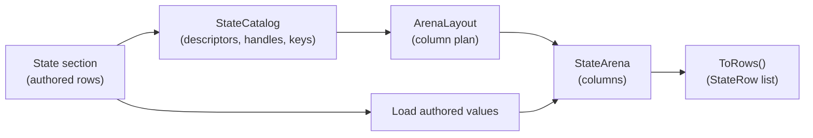
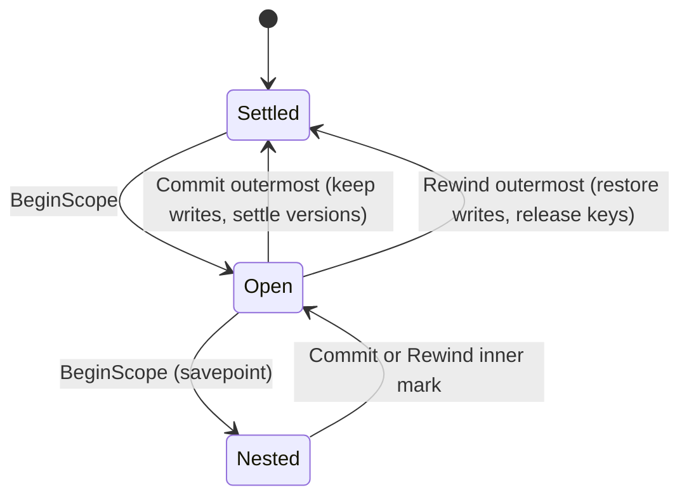

# The state arena

The state arena is where a simulation's values live while it runs. This article
explains how `StateArena` lays rows out, how a compiled address reaches a cell,
how journal scopes let you try a change and take it back, and what the arena
hashes, exports, and charges against its memory ceiling. It's written for host
developers who drive the arena from C#, and for authors who want to know why a
document is refused for size or why a candidate move leaves no trace.

## How the arena stores state

Take the small card and board game this manual uses throughout. It declares an
Int slot `coins`, a keyed row `pieceCell` that maps each piece to a board cell,
an ordered pile `hand`, a `board` row over an 8×8 grid topology, and a `units`
pool whose records carry an `hp` field. The document describes those rows. The
arena stores their values.

A **state arena** is a columnar store: instead of keeping one object per row, it
keeps one contiguous column for every combination of lane, row shape, and cell
kind, and gives each row a run of **cell slots** inside the column that matches
it. `coins` sits in the Int slot column, `pieceCell` in the Int keyed column,
`hand` in the Int ordered column, and `board` in the Int lattice column. Beside
those value columns, the arena keeps a column for every piece of runtime state a
cell can carry: a presence bit, the key that occupies a slot, clock epochs,
provenance, a visibility restriction, and so on. `ArenaColumn` names each of
them.

Every row belongs to one of three **lanes**:

| Lane | Owner | Example |
|---|---|---|
| `Document` | The world document. Every authored row, plus the rows a pool generates for its fields. | `coins`, `pieceCell`, `board`, the rows behind `units.hp` |
| `Participant` | One seat in the session. Each slot holds one value per participant ordinal. | A per-player score counter |
| `Identity` | One durable identity. Each slot holds one value per identity ordinal. | A timer that follows a player across sessions |

Participant and identity slots are declared once and answer for every ordinal
the lane admits. `ArenaOptions` sets how many ordinals each lane holds (256 by
default). A host admits an ordinal with `TryJoin` and releases it with
`TryLeave`, which zeroes or clears every slot that ordinal answers.

A row whose `HostOwned` mark is set gets a descriptor and no columns. The arena
answers `false` to every read of it and refuses every write, because a host
facet serves that row instead. For the row shapes and cell kinds themselves, see
[Rows, cells, and values](data-model.md).

## From declarations to storage

The arena is built in three steps: compile the section into a catalog, lay out
columns for that catalog, then load the section's authored values. The following
diagram shows that path, and the export path back to rows.



`StateCatalog.Compile` turns the section into descriptors. `ArenaLayout.Build`
assigns each row its column and cell slots. The `StateArena` constructor seeds
the columns from the section and admits every authored value through the same
check a write uses. If the document authors a value that no write could store,
construction fails, and the reason names the row and cell. `ToRows` reads the
columns back out as the row list a section serializes.

Layout is a function of the catalog and the authored rows alone. Two hosts that
load the same document lay it out identically, which is what lets a hash folded
in layout order compare across machines.

### The catalog and its descriptors

A **catalog** (`StateCatalog`) is the compiled, immutable description of one
section. It holds no values. For each declaration it holds a `StateDescriptor`
that records:

- the declaration's name and its `StateLane`;
- its `RowShape` (`Slot`, `Keyed`, `Ordered`, `Lattice`, or `Ring`), which
  `RowShapes.FromDomain` derives from the row's `StateDomain`;
- the `CellKind` its values are stored in;
- its `StateParticipantRole` (`Counter` or `Timer` on a lane slot, `None` on a
  document row);
- whether a lowering generated it and whether a host facet owns it;
- its ordinal within its lane.

Descriptor ordinals are assigned in document, participant, then identity
declaration order. The catalog also holds each lane's extent as a
`StateLaneDescriptor`, the declared enums, each declared family resolved to a
`RowFamily` (the contiguous ordinal range of its member rows), the compiled
pools, and a `CellKeyTable` of the key names the declarations spell.

### Handles and their lifetime

A **handle** (`StateHandle`) is a catalog-bound reference to one descriptor. A
compiler resolves a name once, keeps the handle, and reads through the catalog
indexer on the tick path instead of looking the name up again. The handle knows
which catalog minted it. Presented to another catalog, `TryGetDescriptor`
answers `false` and the indexer throws.

A handle lives as long as its catalog. If a document update changes only
values, the declaration shape is unchanged, the host can keep the catalog, and
every handle stays valid. `StateCatalog.MatchesShape` answers that question for
a candidate section without allocating, and `HasSameShape` compares two
catalogs. A change to the declaration shape (a row added, removed, reordered, or
given a new kind) produces a replacement catalog, and the old handles are
refused. Pool instance handles follow the same rule; see
[Records, pools, and handles](records-and-pools.md).

Handles are minted only for rows the rule compiler has proved present, and a
host that installs a document recompiles every rule against it. An installed
document therefore never holds a rule whose handle addresses a vanished row, so
a handle read that fails throws instead of returning a neutral value.

## Cell keys and the key ledger

Cells are addressed by row and key. The key `rook` in `pieceCell[rook]` is
interned: a `CellKeyTable` maps each distinct name to a `CellKey`, and compiled
reads and writes carry the `CellKey` instead of the string. Interning is global
to a table, so the name `rook` used by three rows occupies one entry.

There are two tables to keep apart:

- `StateCatalog.Keys` holds the compiler's symbols: every key the declarations
  spell, plus any literal a rule compiler binds later.
- `StateArena.Keys` is the arena's own table. It starts with the authored names
  sealed when the catalog was built and owns every name added at run time.

A runtime operation that creates a cell, such as appending a card to `hand` or
minting a new key in a keyed row, **mints** its name into the arena's table.
Reads never mint; they resolve names that already exist. A compiler literal that
no runtime operation has admitted stays a compiler symbol, costs the arena
nothing, and doesn't enter its hash. Because of that, building an arena before
or after a rule binds a new literal produces the same state. Compiled keys still
resolve by name in an arena built before the compiler added them. Runtime
callers resolve and render keys through `StateArena.Keys`.

The arena's table is a **key ledger**: once a name is committed, it stays
reserved for the arena's lifetime, even after the last cell using it is
removed. Two limits bound the ledger. `StateCapacity.MaxCellKeys` (65,536)
bounds the number of distinct names, and each retained name charges 96 bytes
plus two bytes per UTF-16 code unit against the arena's byte ceiling. A mint
that would cross either limit is refused, and the reason names the limit.

A **speculative mint** is one made inside a journal scope. Rewinding the scope
releases the name, its bytes, and its place in the ledger, and any `CellKey`
returned by that mint stops resolving. A later mint may reuse the same ordinal,
but it carries a new generation, so the old key never revives. Committing the
outermost scope keeps the name for good.

Hashing the ledger costs constant time. The arena folds the retained name count
and a wrapping sum of per-name digests, and the sum changes only when a name is
admitted or released, so no sorting or allocation happens at hash time. Ring
slot names are compiled addresses and aren't ledger reservations.

## Read a cell

Suppose a host wants to know where the rook stands. It resolves `pieceCell` to a
row ordinal and `rook` to a key once, then reads.

| Method | What it answers |
|---|---|
| `TryRead(row, key, out CellValue)` | The stored value in the row's own kind, resolving the cell once. |
| `TryReadLive(row, key, in ArenaTime, out CellValue)` | The value a rule sees at that time: stored value advanced or rotated by the cell's trait. |
| `TryReadLiveNumber(row, key, in ArenaTime, out long)` | The same live value as a number, without building a carrier. |
| `TryReadAt(row, position, out CellValue)` | The stored cell at one position: a pile position, a lattice cell ordinal, a ring slot, or a declaration position. |
| `TryReadLiveNumberAt(row, position, in ArenaTime, out long)` | The live number at one position. |
| `TryReadRawAt(row, position, out long)` | The stored number at one position, for a ring slot or a board cell, which no trait can govern. |
| `TryReadBoard(row, Span<long>)` | Every cell of a lattice row by cell ordinal, with the row's `Empty` value for absent cells. |
| `ReadWord(row, …)` | A row's values as the word a pattern walks. |
| `CellCount(row)`, `TryNextCell(row, ref cursor, out key)` | How many cells a row holds, and each held cell in storage-slot order. |

A live read applies `StateAdvance` and `StateCycle` and never eases a
`StateDynamics` cell, so rules and search read stored truth. Every read a rule,
transform, operand, or search makes of a cell that can carry a trait is a live
read at the evaluation's `ArenaTime`, and every write it makes to such a cell
goes through `TryWriteLive`, which rebases the cell's clock. The stored reads
serve checkpoints, exports, hashes, and text or vector cells, whose stored value
is the live one. How each trait
computes its value is explained in [Row and cell behavior](traits.md). Pool rows
aren't read positionally; they're read through instance handles.

`StateReader` is the (row, key) → value computation over a list of `StateRow`
records, the installed document's rows, instead of the arena's columns. It
applies the same traits, adds the eased read (`TryReadEased`) a presentation
binding uses, and computes reductions and arg-extrema. Console read-backs,
presentation bindings, and validators read through it; rule evaluation reads the
arena.

When a cell is missing, each read answers the way its shape defines:

- A lattice cell that was never written reads as the row's `Empty` value. The
  presence bit still tells an authored cell holding the empty value apart from
  a cell that holds nothing.
- A declared keyed cell that the row doesn't currently hold reads as integer
  zero in a rule.
- A dynamic key that names nothing, such as the last card of an empty `hand`,
  reads as absent. [Reads and expressions](expressions.md) explains how an
  expression handles an absent read.

## Write a cell

A numeric write names a row ordinal, a key, an operand, and a `StateWriteKind`
of `Set` or `Add`. This fragment assumes `coins` and `slot` were resolved as the
example in [Journal scopes](#journal-scopes) shows:

```csharp
var admitted = arena.TryWrite(
    rowOrdinal: coins.Ordinal,
    key: slot,
    operand: -3L,
    write: StateWriteKind.Add,
    reason: out var reason
);
```

Every value entering a row passes through `StateRow.TryAdmitWrite`. That
includes a rule's write, a mint, a ring push, the landing of a transfer, a board
combine, an imported row, and the section a construction seeds from. It checks
the row's envelope, its overflow policy, and its enum, so every path agrees on
what a row accepts. [Row and cell behavior](traits.md) describes those checks.
A refused write leaves the cell unchanged and returns the reason, naming the row
and cell.

A few writes are refused before admission:

- A write to a pool's generated row, which only the pool's own claim, release,
  and field writes may change.
- A numeric write to a `Text` or `Vector` row, which take `TryWriteText` and
  `TryWriteVector`.
- A cell write to a participant or identity slot, which takes `TryWriteSlot`
  with a lane ordinal, or to a ring, which only takes `TryPush`.
- A write to a host-owned row, or to a board derived from token and code rows
  through `StateInverse`. The arena recomputes a derived board whenever either
  source row changes, and after every load.

Other write methods cover the runtime state beside values: clocks, behavior
overrides, provenance, visibility, observations, draw cursors, drawn masks, ring
history cursors, and phase sequences. Membership changes use `TryMint`,
`TryInsert`, `TryRemove`, `TryPush`, `TryTransfer`, `TryTransferEnd`, and
`TryReorder`. `TryMintEvicting` mints like `TryMint` and also names the cell
that a full evicting row dropped to make room.

A write that should create its cell when the cell is missing uses
`TryWriteOrMint`, which writes through the stored door, or
`TryWriteLiveOrMint`, which writes through `TryWriteLive` and so rebases a
traited cell. Either one mints only when a keyed or ordered row holds no cell
under the key. Any other shape is refused by the write door, which names the
address. When the cell already exists and the write is refused, the refusal
gives the write's own reason, such as the envelope, and never a mint's.

## Journal scopes

A **journal scope** is a region of writes you can keep or take back as a unit.
While a scope is open, every write records the column position it overwrote and
the value that was there. Committing keeps the writes. Rewinding restores every
recorded position, newest first, so a cell written twice in one scope returns to
what it held before the first write.

This example tries a purchase, checks the result, and takes it back. It assumes
a section that declares `coins`:

```csharp
var catalog = StateCatalog.Compile(section: section);
var arena = new StateArena(
    catalog: catalog,
    section: section,
    time: ArenaTime.Origin
);

_ = catalog.TryResolve(
    handle: out var coins,
    lane: StateLane.Document,
    name: "coins"
);
_ = arena.Keys.TryResolve(
    key: out var slot,
    name: StateRow.SlotKey
);

var before = arena.ComputeHash();
var mark = arena.BeginScope();

if (!arena.TryWrite(
    key: slot,
    operand: -3L,
    reason: out var reason,
    rowOrdinal: coins.Ordinal,
    write: StateWriteKind.Add
)) {
    Console.WriteLine(value: reason);
}

arena.Rewind(mark: mark);
Debug.Assert(condition: (arena.ComputeHash() == before));
```

1. `BeginScope` opens a scope and returns its mark.
2. `TryWrite` changes `coins` and records the old value in the journal.
3. `Rewind` restores the old value and closes the scope.
4. The hash after the rewind equals the hash before the scope opened.

The following diagram shows how scopes close. A scope must close with the mark
that opened it, innermost first, and `EnsureCloses` refuses any other mark
before anything moves.



### Nest scopes as savepoints

Scopes nest. An inner scope works as a **savepoint**: a rule evaluator opens one
around each firing, so a refused firing rewinds its own writes while the outer
scope continues and later commits. Committing an inner scope folds its record
into the enclosing one. The writes become final when the outermost scope
commits, and the arena discards the record at that point, since no open scope
remains that could roll them back.

A rewind does more than restore values. It rebuilds the key-to-slot index of
every row whose membership it restored, releases keys first interned inside the
scope, drops cached topology and ring addresses when a key was released, and
returns the visibility bytes and vector snapshot space the scope used. A closed
scope keeps no reference to the text, visibility, or provenance it recorded.

A write made while no scope is open isn't journaled and can't be rewound.

### The journal ceiling

The journal's record is bounded by `ArenaCapacity.MaxJournalBytes` (16 MiB). The
record counts 24 bytes per entry, every vector component it snapshotted, and the
payload of every overwritten reference it keeps alive: a replaced string costs
32 bytes plus two per UTF-16 code unit, and a replaced visibility its measured
size. The rule evaluator checks the ceiling between effects, so the record may
pass it by the writes of the one effect that crossed. That firing is then
refused with `RuleEffectRefusal.JournalCeiling` and rewound.
`ArenaJournal.OverCeiling` reads the record as it stands, so rewinding a
savepoint that brings the record back under the ceiling clears it.

The journal's buffers grow to the largest scope the arena has run and are then
reused, so a scalar write, scope, and rewind allocate nothing after warm-up.

## Evaluate a candidate

A **candidate** is one proposed change that the compiled rules judge without
leaving it installed. It answers questions such as "what would happen if the
rook moved to cell 12?" A candidate is a journal scope on the live arena. The
evaluator opens a scope, applies the move, runs the rules, reads the result, and
rewinds. Only the cells the candidate touched are recorded, so the cost of
judging a candidate follows what it changes, whatever the size of the state.

Search and scoped judges build on this. How search orders and bounds its
candidates is covered in [Search](search.md), and what a host must provide to
evaluate inside a scope is covered in
[Host and extend the state engine](hosting.md).

## Row versions and generations

The arena keeps two counters per row. Each answers a different question, and
they aren't interchangeable.

| Counter | Moves when | Use it to |
|---|---|---|
| `RowVersion` | A committed change leaves the row's bytes different from what they held when the outermost scope opened, or an unscoped write changes a byte. | Prove a row's content unchanged between two evaluations. |
| `RowGeneration` | Any mutation of the row, including a write of the same value and a rewind. | Invalidate a cached answer derived from the row's storage. |

A **row version** is a change counter. Versions settle when the
outermost scope commits: the arena walks the record from the end, compares each
position's final value with the value it held when the scope opened, and moves
the version of each row that differs. Writing a value and then writing it back,
a no-op write, and a rewound scope all leave the version where it was. While
scopes are open, `FlagOpenRows` reports which rows they've written, since those
rows may differ from what their version last proved.

An unchanged version proves that stored values are unchanged. It doesn't prove
that a tick-dependent or host-dependent read gives the same answer. Construction
starts every counter at zero, and a relayout moves each counter above every
value any row held before. `IStateReader.TryRowVersion` exposes the version to a
rule evaluator; how the scheduler uses it is in
[Rule analysis, scheduling, and work budgets](analysis.md).

## State hashing

`ComputeHash` folds the whole arena into one 64-bit FNV-1a value. It's how two
hosts, or a replay and its recording, prove they hold the same state.

What the hash covers:

- Every column of every lane, in a fixed column order, with each column's own
  ordinal folded between runs. The fold reads each position's logical value, so
  a clock that was never written hashes the same as one written back to zero.
- Member keys by name digest in slot order, independent of intern ordinals. Two
  rows with the same fields fold the same regardless of the order their keys
  were allocated in, while the order of a pile's members stays part of its
  content.
- The key ledger's name count and digest sum, because an orphan name still
  affects which future mints are admitted.
- The retained undo history of rule groups, when undo is configured.

What the hash leaves out:

- Host-owned rows. They have no columns, and their facet hashes what it serves.
- Scratch storage, journal buffers, and caches. They save work without changing
  any answer.

`ComputeColumnHash` folds one column alone, and `AddRowTo` folds everything the
arena stores for one row into a running hash. A caller that keys a cache by a
set of rows folds each row through `AddRowTo` rather than reading values back.

## Export, import, relayout, and checkpoints

### Export and import

`ToRows` exports the document lane as the `StateRow` list a section serializes,
in catalog ordinal order. Each row's declaration (kind, envelope, domain,
traits, visibility) is carried from the row the arena was built over; only what
the arena stores is read back out of the columns. A host-owned row exports its
declaration alone, and a cell whose clock is all zeros exports no clock. Pool
rows are left out of `ToRows`; `ToPools` and `ToPairPools` export the pools with
their allocator state.

`TryLoad` is the inverse. It replaces the stored state of every row the list
names and keeps what the arena holds for every row the list omits. Every
refusal is decided before one byte moves: a row the catalog doesn't declare, a
kind or shape disagreement, a vector of the wrong width, a key no position
addresses, a duplicate key, or a value the row wouldn't admit. A refused load
interns no key names. A loaded cell with a timed behavior and no clock of its
own starts its clock at the load time. Derived boards are recomputed after the
load, whatever the list carried for them. `TryValidateLoad` runs the same
checks without changing anything.

Export followed by import is the identity over every row and cell field. A ring
is a useful case to keep in mind: `TryNextCell` visits its physical slots, while
`ReadWord` reads its history from the oldest push to the newest, and exporting
and rebuilding a ring keeps both its key ledger and its hash.

### Relayout

`TryRelayout` rebuilds the arena over a re-declared section and its new
catalog, carrying every value across by row name and cell key:

- A row both declarations carry keeps its values. A row the new declaration
  drops loses them. A row only the new declaration carries holds what the
  section seeds it with.
- A change to a row's kind or shape fails the relayout, and the reason names
  the row. Every carried value passes the same admission check a write uses. If
  the re-declared row won't admit a value, the relayout fails with a reason that
  names the row and cell, and the arena stays as it was.
- The whole committed key ledger crosses by name, orphan names included.
- The participant and identity lanes cross whole, because they belong to the
  host's session. `CopyLanesTo` copies them into an arena built fresh instead.
- Relayout waits for the outermost scope to close, because journal positions
  are layout-relative.

The per-row key-to-slot index and the change-walk scratch are rebuilt. Spans
handed out by `TryReadVector` alias storage the relayout replaces, runtime keys
must be resolved again through the new key table, and compiled keys stay usable
only if the new layout uses their source catalog. Retained undo history is
cleared.

### Checkpoints

A checkpoint captures what's needed to continue from where the arena stood.
Exported rows alone aren't enough, because they don't carry orphan key names. A
complete checkpoint is:

1. The exported rows (`ToRows`, and `ToPools`/`ToPairPools` for pools).
2. The key ledger (`Keys.Names`), restored with `TryRestoreKeys` at a settled
   boundary with no scope open. Restoring refuses a ledger past the name or
   byte limits and changes nothing on refusal.
3. The retained undo history (`ExportUndoSnapshot`), when rule groups keep
   one. See [Rule groups and turn undo](rule-groups.md).

## Byte accounting

An arena has a single memory ceiling, `ArenaCapacity.MaxBytes` (64 MiB), and
everything a document's state occupies counts against it. `StateArena.Bytes` is
the measure checked against the ceiling, and `world.state` in Puck.World prints
the two side by side.

`ArenaLayout.Bytes` is the reservation the layout makes up front:

- every column at its full width, plus an eight-byte change stamp and a flag
  per position for version settling;
- the row, key-to-slot, and pool-occupancy indexes, and a fixed allowance per
  row for its layout record, counters, and key map;
- vector components;
- a provenance string for every cell slot at its 256-character ceiling, and a
  text for every slot of a `Text` row at its 1,024-character ceiling.

`StateArena.Bytes` adds what the arena retains beyond the layout:

- **Visibility payloads.** A visibility restriction admits at most 32 explicit
  readers, each at most 256 characters, and a `readersFrom` name at most
  `SafeName.MaxLength` (244) characters. The arena copies reader lists into
  immutable, tightly sized storage, so later edits by the caller can't change
  the admitted policy or its charge. It charges the actual bounded payload
  rather than reserving the largest policy for every cell. A cell's visibility
  is charged twice, since the declaration snapshot and the live column each
  retain it; a row's visibility is charged once.
- **Key names.** The key ledger's charge, described above.

A section that lays out past the ceiling is refused at the row that crossed it.
Construction, imports, and visibility writes refuse a total past the ceiling,
and an import is measured as a whole before any row changes. Key mints draw on
whatever the layout and visibility leave.

The counts beside the byte ceiling, such as `StateCapacity.MaxRows` (1,024 rows
per section), bound what one declaration may ask for and name the storage they
size. They're engine constants: none is a preallocated buffer, and a world
can't set its own. Several content areas that each fit comfortably on their own
can together pass a ceiling once they're merged into one document. When that
happens, the fix is to raise the engine constant that was hit, instead of
cutting one area to fit. [Limits and capacities](limits.md) lists every
ceiling.

## Rules for addressing shortcuts

On the tick path, the arena reaches cells by ordinal and interned key instead of
looking names up. These shortcuts follow a few rules, and any new shortcut has
to follow them too:

- **State stays bit-identical.** A shortcut changes only how a read reaches a
  value. The state hash of any world at any tick is the same with or without
  it, because determinism fixes the mapping from document and input to state.
- **Rules don't know the layout.** A compiled rule knows the catalog it was
  compiled against and nothing about how the arena lays rows out. Anything that
  depends on the layout lives in the layout and is rebuilt with it.
- **The document keeps answering.** Every read the arena answers must also
  have an answer through the installed document's rows, because readers outside
  the tick's rule evaluation (console read-backs, presentation bindings,
  validators) read the document through `StateReader`.
- **Absence reads the same way.** A board cell equal to the row's `Empty` value
  reads as present only when the row authored it, a declared keyed cell the row
  doesn't hold reads as integer zero, and an empty zone endpoint reads as absent.
- **Each caller uses one entry point.** A tick-path caller that reads by
  ordinal doesn't also keep a name-keyed call for the same read. The name-keyed
  entry points serve console read-backs, presentation bindings, and validators,
  which run outside the tick.

For the reasoning behind this design, see
[State and the authoring language: decisions](../../decisions/state-and-language.md).

## Limitations

- The arena, its key table, and its scratch storage aren't synchronized. The
  thread that owns the arena performs every mutation and every evaluation.
- A write made while no scope is open can't be rewound. Open a scope before any
  change you might need to take back.
- A relayout can't run while a scope is open, and it invalidates runtime keys,
  vector spans, and retained undo history.
- `RowVersion` proves stored bytes unchanged; it says nothing about reads that
  depend on the tick or on a host facet.
- Exported rows don't carry orphan key names. A checkpoint that omits the key
  ledger restores to a different hash.
- Every cell slot reserves room for a full-length provenance string, so wide
  rows spend the byte budget quickly even when they store small numbers.

## Key types

| Type | Project | Purpose |
|---|---|---|
| `StateArena` | Puck.State | The columnar store: reads, writes, scopes, counters, hashing, export, and import. |
| `StateCatalog` | Puck.State | The compiled, immutable description of a section's declarations. |
| `StateDescriptor` | Puck.State | One declaration's lane, shape, kind, role, and marks. |
| `StateHandle` | Puck.State | A catalog-bound reference to one descriptor. |
| `StateLaneDescriptor` | Puck.State | The ordinal extent of one lane in a catalog. |
| `RowShape`, `RowShapes` | Puck.State | The storage shape axis, derived from a row's domain. |
| `CellKey`, `CellKeyTable` | Puck.State | Interned cell keys and the tables that mint them. |
| `ArenaLayout`, `ArenaRowLayout`, `ArenaColumnRange` | Puck.State | The column plan and each row's place in it. |
| `ArenaColumn` | Puck.State | The storage columns a journal entry names. |
| `ArenaJournal`, `ArenaJournalEntry` | Puck.State | The undo record of open scopes. |
| `ArenaCapacity`, `ArenaOptions` | Puck.State | The arena's byte and journal ceilings, and its lane widths. |
| `ArenaTime` | Puck.State | The tick pair and dynamics rows a live read or write evaluates against. |
| `ArenaScratch` | Puck.State | Working buffers an evaluation borrows and returns. |
| `StateReader` | Puck.State | The (row, key) → value computation over a document's rows. |
| `IStateReader` | Puck.State | What every host answers during evaluation, including the arena and the tick pair. |

## Next steps

- [Topologies and boards](topologies.md): how lattice rows get their cells and
  adjacency.
- [Reads and expressions](expressions.md): how a rule reads the arena.
- [Host and extend the state engine](hosting.md): how a host wires the arena
  into its own mutation boundary.

## See also

- [Rows, cells, and values](data-model.md)
- [Rule groups and turn undo](rule-groups.md)
- [Limits and capacities](limits.md)
