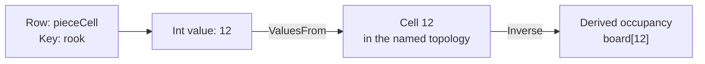

# Model state with rows and cells

A state model gives a simulation a shared vocabulary. In a small board game,
`coins` might hold one balance, `pieceCell` might record each piece's location,
and `hand` might hold cards in pile order. Rules read and change those values;
the names themselves do not give them game behavior.

Start by answering three separate questions for each row:

| Question | Example | State concept |
|---|---|---|
| What does each value mean? | A whole-number balance or a piece's location | `CellKind` chooses the value encoding. |
| How do I address a value? | One slot, a piece name, or a board-cell ordinal | `StateDomain` chooses the address space. |
| What additional behavior applies? | A capacity, accumulating value, or visibility policy | Row and cell traits supply the constraints and metadata. |

## Read an address

Every ordinary cell address has two parts: **row name and cell key**.
The expression spelling `pieceCell[rook]` addresses key `rook` in row
`pieceCell`. The value stored there might be `12`, meaning that this piece
occupies board cell 12. Its key and its value serve different purposes.



A **slot** holds one value. Its C# cell uses `StateRow.SlotKey`; an authored
effect's omitted `Key` selects that slot. Omission never selects the first
member of a keyed row. A declared `Capacity` expresses table intent even
when the row currently contains only one cell.

In C#, `StateCell.Value` is one `CellValue` — a closed union with one case per
`CellKind`: `CellValue.Int` and `CellValue.Fixed` each carry a raw `long`
(Q48.16 bits for `Fixed`), `CellValue.Bool` a `bool`, `CellValue.Text` a
`string`, and `CellValue.Vector` the component memory a `StateVector` wraps.
There is no implicit conversion between cases — a raw `long` means Int in one
row and Q48.16 bits in another, so every construction site spells its case
by name, and a cell whose `Value.Kind` disagrees with its row's declared
`Kind` is refused by name (`StateRow.TryAdmitKind`). Reading a case a carrier
does not hold — `Raw`, `AsInt`, `AsFixed`, `AsBool`, `AsText`, `AsVector` —
throws rather than answering a neutral value that would read as a real one, so
a reader checks `Value.Kind` (or `HasValue`, for the default carrier that
holds no case at all) before choosing which accessor to call. Q48.16 stores a
number as an integer scaled by 65,536; a raw value of `65536` means one.
Human-facing numeric literals are converted at ingress. An integer and a
fixed-point number therefore cannot be interchanged by copying their raw
bits. Vector components are normalized signed 8-bit integers (`sbyte[]`)
scaled to radius 127, preserving bit-exact reproducibility across execution
hosts.

## Choose an addressing shape

| Domain | What a key names | Example |
|---|---|---|
| `slot` | The row's single reserved cell | `coins` or `turn`. |
| `keys` | An author-chosen identifier | The declared pieces `rook`, `king`, and `pawn`. |
| `keysOf` | A key drawn from another row | A value per piece; with `Ordered = true`, an ordered pile of cards. |
| `cellsOf` | A cell of a named topology | Occupancy or a legal-move marker at each board location. |
| `ring` | A bounded history slot | The last several pushed values, read by age through `$history:`. |

A **topology** defines locations and connections: which squares are neighbors,
for example. A row over that topology supplies values at those locations.
Several rows can use the same topology: occupancy, visibility, and legal moves
can describe one board without copying its geometry.

A token row with `ValuesFrom` says that its integer values name locations.
A board row with `Inverse` derives occupancy from those token positions.
Write the token position and let the inverse be recomputed; independently
maintaining both would give the same position two possible answers.

## Group fields into bounded instances

A record declares typed fields, defaults, and bounds. A pool provides a bounded
set of live instances of that record. `claim` chooses the lowest free slot;
`release` removes the instance and advances that slot's generation. Fields and
allocator metadata participate in the same journal, so a refused initializer
rolls back the whole claim.

Storage reserves a fixed position per identity slot and marks live instances with
presence bits. Claim and release do not move other instances. Generic C# row
iteration must skip holes; see [pool storage and iteration](../state.md#store-bounded-records-and-relationships).

`poolName[slot].field` addresses the slot's current occupant. A lexical binding
from a claim or iteration holds a specific generation instead; release and
reclaim cannot make that binding refer to the replacement. Iteration snapshots
handles in ascending slot order and skips stale entries. Dead-slot generations
remain in snapshots and hashes because they determine whether held handles are
valid; equal live values alone do not mean equal allocator state.

Numeric fields can declare `advance(perSecond: ...)`. Each live instance has
its own clock, born at claim time. Pool snapshots carry the stored base and
clock together, preserving accumulation across publication and reload. C#
callers use the time-aware pool APIs for effective values and rebasing writes.

World interactions bind a pool through `properties.carriers`, naming an enum
field and mapping each member to a local seat, a named inhabited placement, or
an explicit detached state. Every enum member needs exactly one mapping. The
field and mapping compile once; live reads use ordinals, and placement bindings
follow the population's current body assignment. Several instances may share
one body; each remains a separate interaction participant and spends its own
evaluation budget. Release removes a carrier; reclaim resolves the new instance's own
default or initialized binding. Physical body indices never enter pool state.

## Choose behavior deliberately

| Need | Trait or mechanism | Consequence for the host |
|---|---|---|
| Bound a value or table | `Min`/`Max`, `Overflow`, `Capacity` | Admit writes against the row's envelope, capacity, and overflow policy. |
| Keep the newest inserted entries | `Evicts` with `Capacity` | Evict by insertion order; updating an existing key does not make it newer. |
| Accumulate between writes | `StateAdvance` | Read from a base and an exact per-second rate, evaluated over elapsed engine ticks; explicit writes rebase the carrying cell's clock. |
| Follow a target smoothly | `StateDynamics` | Preserve the follower's state and its declared dynamics; presentation reads ease toward the target, while rules and simulation read stored truth. |
| Cycle through a spatial symmetry | `StateCycle` | Derive the phase or lattice value from the requested tick. |
| Draw a value | `Draw` | Preserve the site's cursor and exhaustion state; see [Generators](generators.md). |
| Control what observers learn | `StateVisibility`, `StateKnowledge` | Apply observation policy when producing a recipient's view. |
| Reject a stale submission | `StatePhase`, `PhaseGuard` | Admit against the current generation and advance it on success. |

`Min` and `Max` are each independently optional — a one-sided range (a floor
with no ceiling, or the reverse) is legal, and both are legitimate only on an
`Int`/`Fixed` row. `Overflow` names what happens when a write's exact result
(computed without wrapping) would leave that range, or overflows 64-bit
storage: `Refuse` (the default, including on a row that declares no envelope
at all) refuses the write by name, because a silent clamp can hide an
authoring error; `Saturate` clamps it to the crossed bound,
or to the storage limit on a side with no declared bound. `StateRow.TryAdmitWrite`
is the one method every write path — the rule frame, mutation compose, ring
push, board combine, write sets — decides through, so every path agrees. A
saturating write still submits the rule's own operand as the mutation, so
replay reproduces the same clamped result.

Time traits describe computed reads. `StateAdvance` is authored per second
and evaluated over elapsed engine ticks (`FixedTickConversion.TicksPerSecond`,
50,400 per second) rather than simulation ticks, so a live change to the
world's own `simulation.rateHz` moves no epoch and skews no accumulation.
If an accumulating cell stores 10 at engine tick 0 and advances by 60 per
second, its Int read one full second later (engine tick 50,400) is 70. The
stored base can still be 10. Adding three at that engine tick must start from
the current 70, then establish a new base of 73 at that engine tick. This is
why readers and writers use the shared state helpers. A world authored at
`simulation.rateHz: 0` never steps, so its engine tick never advances either:
an `advance` row there is legal, not refused, and simply never accrues past
whatever base its last explicit write left it at. `StateDynamics` and
`StateCycle` stay on simulation ticks — only `StateAdvance` reads the engine
clock. The arena's live read applies advance and cycle but never eases: a
rule gate, an arithmetic write operand, an effect source, a reduction, and a
search judge all read a `StateDynamics` cell's stored truth.
`StateReader.TryReadEased`, read over a document's exported rows rather than
the arena, is the one eased read — the one a plain presentation binding (a
HUD readout, a look, a gait driver) takes.

A row's `Advance`/`Dynamics`/`Cycle` is the default behavior of every cell it
carries, including a key a later write mints — `EffectiveBehavior.Resolve`
is the one place every consumer (readers, the validator, rebase, JSON
conversion, save capture) decides which trait governs a cell. A cell replaces
that default wholesale with its own `Advance`/`Dynamics`/`Cycle` (never two of
the three at once), or opts out entirely with `StateCell.Behavior =
StateCellBehavior.None`; neither is legitimate on the reserved slot key, since
a slot's one cell has no separate default to override. Timing state — the
epoch, a dynamics follower's sampled position and velocity, a cycle's carried
substep — lives on the cell itself (`StateCellClock`), not on the trait: a key
minted later starts its own clock from the tick (and engine tick) it was
created. `StateCellClock` carries two independent epochs: `EpochTick` (a
simulation tick, for `Dynamics`/`Cycle`) and `EpochEngineTick` (an engine
tick, for `Advance`) — the two clocks never share a coordinate. A cell
authored with a `Dynamics` behavior and no `StateCellClock` at all reads its
own stored value as the follower's position, at rest, rather than easing in
from zero. Re-authoring a
row's default or a cell's own behavior settles every affected cell at the
change tick, per the transition each behavior pair follows (a parameter
change keeps the live value and moves the epoch; switching behaviors, or to
none, freezes the old behavior's current value and zeroes velocity/substep).
A declaration carries the *stored* value, which for a timed cell is a base or
a phase rather than what a reader sees, so restating that value is not a write
of it: changing a row's default rate leaves a cell that declares its own rate
accumulating, uninterrupted. A `StateCycle` cell is the one case where the two
readings differ in kind — its stored value is a phase and its read value the
output that phase drives, so settling it into another cycle carries the phase,
while settling it into any other behavior (including none) stores the value it
was displaying.
These traits have other compatibility rules too — a slot cannot both
accumulate and draw, for one.

Visibility also differs from gameplay permission. An observation policy says
what a reader learns; it does not authorize that reader to mutate the state.
Row and cell restrictions intersect. Hidden cells can disappear, contribute
only a count, or appear as anonymous placeholders. A knowledge row is keyed by
the stable token identity shared with its source-property and position rows.
`observe` tests each token's current position against a board mask and remembers
the source property with its observation tick. Moving a revealed token therefore
keeps what was learned about it; hiding its new cell clears `Visible` without
discarding the remembered value. Omitting the positions row selects the direct
board projection for location knowledge: source, mask, and knowledge then share
one topology and observations remain keyed by cell.

A phase guard answers a narrower question: “Does this submission still refer
to generation 7?” Once an accepted guarded submission advances the generation,
another submission carrying 7 is stale. Rules and host admission still decide
who may act and what a turn means.

## Keep definitions, storage, and reads distinct

The section describes rows. The catalog resolves their names into
catalog-bound handles. A store supplies the values currently being read.
`StateReader` combines a stored value with its authored behavior at a tick.
Replacing a catalog invalidates its handles; preserving the declaration shape
can let a host retain the catalog during value-only updates.

State sections are immutable snapshots. Pool expansion is shared by section
identity, so layout, rules, and admission reuse one expansion. A replacement
section gets its own expanded values even when its declaration shape allows the
catalog to survive. Shape comparison reads declarations rather than constructing
every pool slot again; loading the replacement still validates its population.

[Candidates](frames.md) explain how the same rows and compiled rules can read a
different store while exploring a possible move.

Several pairs of mechanisms recur across the model because they share a name,
a storage shape, or an implementation, not because either is redundant:

| Pair | What keeps them distinct |
|---|---|
| Board masks / board rows | A mask addresses at most 64 cells; board operations cover larger topologies and preserve cell values. A loop of single-cell writes also lacks an atomic board transform's publication boundary. |
| `pushState` / transform `push` | One resolves an authored numeric source; the other carries its already-resolved raw mutation. They meet at the transform door, but the mutation boundary stays separate. |
| `shuffle` / `arrange` | A draw-consuming shuffle and a deterministic rank-selected permutation differ in randomness, bounds, and cursor advancement. |
| State ring / topology ring | A bounded history buffer and a spatial or cyclic adjacency structure are different domains despite the shared name. |
| Live zones / dynamic keys | Both select an address component, but a live-zone gap closes the whole evaluation before the gate; a dynamic key's evaluation timing is its own. |
| Bindings / state rows | A per-evaluation value and persistent, mutable simulation state have different lifetimes and observability; they are not interchangeable. |
| Own-value / attribute sorting | One authored `sort(row: scores, by: [{ row: scores }])` orders a row's own values. Naming attribute rows in `by` instead orders a pile over their shared token domain. Compilation selects the storage-specific kernel; both preserve stable ties and per-key direction. |

World wrappers such as `WorldStateRow` and `WorldRule` forward a base row's or
rule's constructor fields; that duplication is maintenance surface, not a
second state engine. A trait declared before its slot has any authored
value is never normalized into a zero-valued cell — normalization must not
manufacture existence or initial-fill behavior the author didn't write.

## The state section

`IStateSection` is the contract every reader and
compiler consumes—the document-owned `Rows`, the `Lattices` they may lie
over, two per-participant slot lanes (`ParticipantSlots`,
`IdentitySlots`, each an `IStateSlot` declaring a `StateParticipantRole` of
`Counter` or `Timer`), the `Enums` a row may name, and the `Families` that group
consecutive rows. `StateSection` is the standalone
document's own record of it; a document project declares its own record
over the same interface and adds what only it can name.

## Rows and cells

`StateRow` describes a collection of `StateCell` values. A document project can
derive its own row to add traits. `StateCapacity` and `StateReservedCells`
define shared limits and reserved cells; `StateRows` supplies lookup helpers. The row
converter `StateRowJsonConverter<TRow>` owns the wire shape (`value`-vs-
`cells`, the decimal fixed-point spelling) and exposes two hook points a
derived row's converter writes its own members at.

`CellValue` is the one carrier `StateCell.Value` holds: a closed union over
`CellKind` with one case each for `Int`, `Fixed`, `Bool`, `Text`, and `Vector`,
stored inline rather than boxed. The `Vector` case carries opaque signed 8-bit
components; the typed view over them belongs to the vector space that owns
them.

## Domains

The `StateDomain` union chooses how a row is addressed: `slot`, `keys`,
`keysOf`, `cellsOf`, or `ring`. Its cases use the `[Union]` marker in `Union.cs`.
A token-domain declaration is an ordinary `keys` row whose `capacity` is the
domain size — there is no separate facet marking it as a token domain, so a
hash that covers a row's domain shape cannot distinguish that row from any
other capacity-bounded keyed row. Whether every key in a domain belongs to
exactly one grouping (a zone, a pile) is authored as an ordinary rule over the
row's own cells, never enforced as domain-shape law.

## Symbolic values and families

A `StateEnum` names a closed set of member names in value order, so member *i*
is the value *i*. An `Int` row names one through its `enum` member; the write
door then admits only a value the enum names, and a console listing or a
decompiled source prints the member name in place of the number. An enum and its
members are local to the document, so an aliased import prefixes neither.

A `StateFamily` names *size* consecutive rows spelled `<family>0` through
`<family><size-1>` — the shape a `tableau[8]` declaration lowers to. The catalog
resolves each one to a `RowFamily`, the contiguous ordinal range its members
occupy, and refuses by name when a member is missing, out of order, or of a
different `CellKind` from member zero.

A row also carries two marks that describe it rather than being authored on the
wire: `Generated`, set when a lowering or the runtime synthesized the row, and
`HostOwned`, set when a host facet serves the row instead of the store. A
host-owned row is admitted only for the `Slot` and `Lattice` shapes, which a
host can serve without an ordering contract.

## Traits

Rows can carry behavior and observation traits: `StateAdvance` (exact per-second
rational accumulation over engine ticks — `PerSecondNumerator`/
`PerSecondDenominator`, JSON `perSecondNumerator`/`perSecondDenominator`), `StateDynamics`
(a second-order follower over a `DynamicsRow`), `StateCycle`/`CycleOutput`
(a tick-indexed rotation through a symmetry-lattice word), `StateVisibility`/
`HiddenCells`/`StateKnowledge`/`StateObservation` (observation policy),
`StatePhase`/`PhaseGuard` (a guarded submission generation), `StateInverse`
(a `cellsOf` row declaring itself the inverse of a keyed token row, recomputed
by `StateArena`). A cell's own `StateCellBehavior` and `StateCellClock` carry
its opt-out and its timing state; see `EffectiveBehavior.Resolve`.

## Topologies

`LatticeTopology` declares a discrete space: `grid`, `ring`, `hex`,
`box`, `graph`, or `tiling`. A host can register its dense `field`
case as a derived record. `TopologyKind`, `TopologyWrap`,
`TopologyDirection`, and `TopologyElementAlias` describe the space's
kind, boundaries, directions, and named elements.

`TopologyCompilation` validates, normalizes, and compiles a topology, including
an anchor offset when needed, and supports finding an unanchored topology.
`CompiledTopology` supplies adjacency, opposite directions, symmetry images,
element aliases, cell centres, position-to-cell lookup, and axial offsets.
A symmetry image says where a cell lands after a permitted rotation or reflection.
A direction's opposite is read from a table built once at compile time by
negating the direction's own step vector and matching it against the declared
set, never derived from ordinal arithmetic — pairing directions by index
offset only works when a kind's directions happen to be authored as reciprocal
ordered pairs, and a `TopologyKind.Box` orders its 26 directions planar first,
then up-shifted, then down-shifted. `TopologyCompilation.MaxDirections` bounds
a direction vocabulary; the
[world schema guide](../../../src/Puck.World.Schema/README.md#discrete-boards-cards-and-turns)
states the authored `directions` rules and the ceiling they meet. Capacity
ceilings here are derived from the
representation they bound rather than restated as their own constants: a hex
topology's own radius ceiling is the greatest radius whose cell count
(`1 + 3r(r + 1)`) still fits `MaxCells`, and a `transfer` state transform's
own count ceiling (`StateTransferCapacity.MaxTransferCount`) is `MaxCells`
itself, since a transfer can move at most as many tokens as a domain can hold.

### Hex cells

A hex topology uses `HexagonalIndex` as its cell order: cell i is index i,
with rings progressing outward and consecutive indices adjacent.
Its six directions are `HexagonalCoordinate.Direction(0..5)`, named
E, SE, SW, W, NW, NE.

For axial coordinates (q, r), the cell centre is:

```text
origin + cellSize × (q − r/2, 0, r×√3/2)
```

### Authored graphs

A graph supplies its adjacency directly. Cells have ids and centres relative
to the origin in world units. Each direction names its opposite. An edge
specifies `from`, `to`, `direction`, and optional `oneWay`; it fills
one (cell, direction) slot and ordinarily the reverse slot.

Use a graph for a territory map, a star board, or geometry emitted by a tool.
Position-to-cell chooses the nearest centre within half a `cellSize`.
Graphs provide no axial offset, and their symmetry group contains only the
identity transformation.

### Generated tilings

`TilingGenerator` creates a graph within a radius from uniform unit cells:
triangular, kagome, truncated-square, rhombitrihexagonal, truncated-hexagonal,
elongated-triangular, and truncated-trihexagonal tilings. It also generates
Penrose P3 rhombs by Robinson-triangle inflation from a sun arrangement.

Tiles become cells ordered outward from the origin. Shared sides supply
adjacency, and edge normals such as `a0` and `a30` name the direction slots.

## Embedding spaces and vectors

An **embedding space** (`StateSpace`) establishes the model identity, revision, and
dimensionality for semantic state vectors:

- `Name`: a valid identifier referencing the space (e.g. `lore`).
- `Model`: the model name (e.g. `puck-fixture` or `text-embedding-3-small`).
- `Revision`: model revision string (e.g. `"1"`).
- `Dimensions`: dimensionality in `[8, 1024]`.

Every `Vector` table or slot must reference a declared space (`space: "lore"`);
in `.puck` source, the row's own `space(...)` modifier is what infers the `Vector`
kind — a row's kind is never authored (see [world-vocabulary.md](../world-vocabulary.md)).
Vector components are stored in `StateVector` as unit-normalized signed 8-bit integers
(`sbyte[]`) on radius 127:

```puck
state {
    spaces {
        space lore { model: "puck-fixture" revision: "1" dimensions: 256 }
    }
    world {
        table events space(lore) {
            ambush = "Bandits ambushed the caravan on the north road"
        }
        table memories capacity(128) evicts space(lore) { }
        slot situation space(lore) = "Travellers approach the gate at dusk"
    }
}
```

### Quantized drift and mean

Quantized vector mutations preserve unit length on radius 127. Operations like
`mix` compute weighted integer sums and re-project to the unit sphere using
`SignedByteVectorFunctions.TryNormalize`, preventing drift or scale collapse over long
simulation runs.

### Model-change recovery

Changing an embedding model or revision changes vector coordinates. Authored text
in `.puck` sources is locked in `.embeddings.json` companion files via `puck embed`.
When an embedding model changes, regenerating the lock file with `puck embed`
re-embeds all authored text, preserving semantic intent under the new model without
manual vector surgery.

### What a vector row cannot carry

A `Vector` row is a keyed table or a slot; `capacity`, `evicts`, `visibility`,
and `space` apply to it, but the validator and the transpiler refuse every
other row trait on it by name — `min`, `max`, `overflow`, `advance`,
`dynamics`, `cycle`, `draw`, `valuesFrom`, `inverse`, `phase`, `phaseOf`,
`gatesDrive`, and `field` — every domain other than a slot or a keyed table,
`addState`/`scheduleState`/`pushState`, and a HUD binding. A
row's cell ceiling times its space's dimensions must not exceed 65,536, and a
document's vector rows together must not exceed 4 MiB.

The simulation never runs an embedding model itself, so several capabilities
authors might expect are deliberately absent rather than merely unbuilt:

- No model inference happens in the tick, the compiler, the linter, the
  formatter, or the language server; only offline `puck embed` and an
  operator-approved runtime host service produce vectors.
- No model runs in-process (no ONNX or similar); the fixture and
  `azure-openai` providers are the ones that ship.
- No provider authenticates with an API key; every provider authenticates
  with identity.
- No provider returns generated text — a provider returns vectors only.
- No approximate nearest-neighbour index exists; `nearest` and `mean` scan
  their candidate table exactly.
- A vector has no place in a general expression — no binding, component
  read, or arithmetic reaches it — and there is no distance or norm function
  beyond `dot`, `similarity`, and `identical`.
- A scoped judge (the browser session and search) refuses `nearest`, `remember`,
  and any vector write that would mint a key, by name; it has no runtime
  embedding connection and cannot gain one from the browser session or a
  remote-client boot.
- An addon guest or a cartridge cannot write a vector cell; the addon
  mutation decoder and the cartridge vocabulary both refuse `Vector` by name.

### Patterns authors build with vectors

| Pattern | How it is built |
|---|---|
| An NPC remembers and recalls what matters now | `remember` stores an event in an evicting table unless a near-duplicate exists; `nearest` recalls the memories closest to the current situation. |
| Factions, moods, or relationships drift | `mix` for fast drift; `mean` over an evicting history table for exact slow drift; a `similarity` threshold gates behavior. |
| Move away, contrast, or draw an analogy | `mix` with negative weights. |
| Items, recipes, or hints find their kin | `nearest` over a catalog, with `where` to restrict candidates and `exclude` to skip the item itself. |
| Dialogue that fits the moment | A `Text` table declared `embeds(vectorRow)`; `nearest` writes the best key into a `Text` slot, which then reads the line. |
| An NPC understands a player | A chat table doubles as a runtime embedding request table; its vectors feed `nearest`. |
| Semantic word games | Guesses scored with `similarity`, including `farthest` for "coldest". |
| A check against an inline concept | A gate comparing `similarity(stance[guards], embed("danger"))` against a threshold. |
| An agent with world memory | An agent writes a vector or a `Text` note, and reads back what `nearest` recalled. |

A search `Score` program can read `dot` and `similarity`. Authors tune
thresholds with `puck embed probe` and the `world.state.similar` console
verb; a rule's trace prints every similarity it computed.

## The catalog and the reader

`StateCatalog` compiles a section into
`StateDescriptor`s and catalog-bound `StateHandle`s. A descriptor names its
`StateLane` (`Document`, `Participant`, `Identity`), its `RowShape` (derived
from the row's `StateDomain` by `RowShapes.FromDomain`, the library's one shape
axis), the `CellKind` its values are stored in, its `StateParticipantRole`
(`Counter` or `Timer` on a slot lane, `None` on a document row), and whether a
lowering generated it or a host facet owns it. Beside the descriptors the
catalog holds the lane extents (`StateLaneDescriptor`), the `CellKeyTable` that
interns authored keys and compiled key symbols to a `CellKey`, the declared `StateEnum`s a row may name,
and each declared `StateFamily` resolved to the contiguous `RowFamily` ordinal
range of its member rows.

Each `StateArena.Keys` table starts with the authored cell and topology names
sealed when its catalog was constructed, and owns its runtime additions.
Compiler-only symbols do not consume the arena's key or byte budget or enter
its hash until a runtime operation admits the name. Constructing an arena
before or after binding a compiler literal therefore gives the same state.
A speculative mint consumes room only in that arena; rewinding its
scope releases the name and rejects any retained handle from that mint. A
later mint can reuse the ordinal without reviving the old handle. Compiled
keys continue to resolve by name even when compilation introduces a symbol
after the arena was constructed. Runtime callers resolve and render keys
through `StateArena.Keys`, not the catalog's symbol table.

Member hashes fold names in cell order. The full arena hash also covers its
retained key-name count and a wrapping sum of per-name digests, because a committed name still
uses key budget after its last cell is removed. Relayouts and checkpoints retain this ledger;
exported rows alone do not retain orphan names. Both distinct-key count and
retained key bytes are bounded, and `StateArena.Bytes` includes the key charge.
Each retained name charges 96 bytes plus two bytes per UTF-16 code unit;
spare table capacity is bounded separately by `StateCapacity.MaxCellKeys`.
The digest sum changes only for admitted or released names, so hashing the
ledger is constant time and requires no sorting or temporary allocation.
Removing a committed cell still retains its name: distinct names admitted
over the arena's lifetime remain bounded by that ledger. Reads resolve keys
without admitting names.

`StateReader` is the one (row, key) → raw-value computation (advance, cycle,
eased reads, reductions, arg-extrema); `StateArena` is the one cell-write
store, and owns FIFO eviction. `StateArena.TryRead` answers one keyed read as a
`CellValue` in the row's own kind, so a keyed read resolves the cell once.
A `StateHandle` is minted only against a row the compiler has already proved
present in the candidate document, and every document install revalidates by
recompiling every handle-holding reader against the new candidate — so an
installed document can never carry a handle addressing a row that has
vanished. A handle read throws rather than returning a neutral value it
should never need to.

## Identifiers

`SafeName` and `CellName` validate identifiers at construction and refuse invalid
names. `SafeName.MaxSuffixLength` reserves space for a file suffix a document
project may append. Their JSON converters share the
`TryParseStringJsonConverter<T>` shape.

---

[State and rules](../state.md) · Next: [Read values and build expressions](expressions.md)
