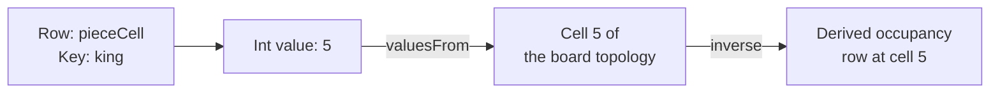
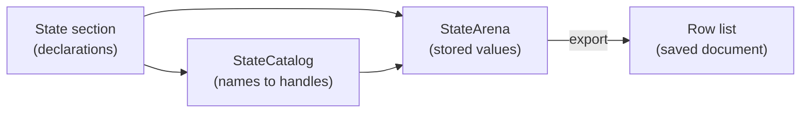

# Rows, cells, and values

Every piece of simulation state in Puck lives in a **row**: a named collection of
values that all share one kind. This article explains how you declare rows, how
you address the cells inside them, which values a cell can hold, and how the
declarations you write relate to the values the engine stores. It's for authors
writing `.puck` worlds and for host developers building a state section in C#.

## Model a small game

Suppose you're building a small card and board game. You need a coin balance, a
board position for each piece, and an ordered hand of cards. In a `.puck` world
you declare those rows inside the `state` section:

```puck
state {
  lattices [
    grid(name: "board", origin: [0, 0, 0], cellSize: 1, width: 4, depth: 4, wrap: None)
  ]

  world {
    slot coins = 3 bounds(0..99)

    table pieces capacity(3) {
      rook = 0
      king = 0
      pawn = 0
    }

    row {
      name: "pieceCell"
      kind: "Int"
      domain: keysOf(row: pieces)
      valuesFrom: "board"
      cells [
        { key: "rook", value: 0 }
        { key: "king", value: 5 }
        { key: "pawn", value: 9 }
      ]
    }

    table cards capacity(5) {
      ace = 1
      two = 2
      three = 3
    }

    pile hand of cards capacity(3) {
      ace
      three
    }

    row {
      name: "recentRolls"
      kind: "Int"
      domain: ring(capacity: 8, empty: 0)
    }
  }
}
```

This fragment is the `state` section of a world document. It declares:

1. `coins`, a **slot**: a row with a single cell. Its kind is inferred as
   `Int` from the literal `3`, and `bounds(0..99)` limits it.
2. `pieces`, a keyed table whose keys (`rook`, `king`, `pawn`) name the game's
   pieces. Other rows reuse these keys.
3. `pieceCell`, a row keyed by the pieces. Each value is an ordinal of a cell on
   the `board` topology, so `pieceCell[king]` is `5`.
4. `hand`, an ordered **pile** over the `cards` keys. The order of its cells is
   the order of the cards in the hand.
5. `recentRolls`, a ring that keeps the last eight values pushed into it.

The `slot`, `table`, `pile`, and `grid` declarations are shorthand. Each one
lowers to the explicit `row { }` form used for `pieceCell` and `recentRolls`,
which accepts every member a row can carry. The
[world vocabulary](../world-vocabulary.md) lists what each shorthand accepts.

## Rows and cells

A row has a name, a kind, and zero or more cells. A **cell** is one value
addressed by a key inside its row. In C#, a row is a `StateRow` and a cell is a
`StateCell` whose `Value` is a `CellValue`.

Every ordinary address has two parts, a row name and a cell key. The expression
`pieceCell[king]` addresses the key `king` in the row `pieceCell`. The value
stored there, `5`, means the king stands on board cell 5. The key says which
piece you're asking about, and the value is the answer.



The diagram follows one read. The address selects a cell, and the cell holds an
integer. Because `pieceCell` declares `valuesFrom: "board"`, that integer names a
cell of the `board` topology. A board row that declares an `inverse` over
`pieceCell` derives its occupancy from those positions, so you write a piece's
position once and read occupancy from the derived row.
[Row and cell behavior](traits.md) explains `valuesFrom` and `inverse`.

### Slots and keyed rows

A slot holds one cell under the reserved key `$value`, which C# exposes as
`StateRow.SlotKey`. When a rule writes a slot, it omits the key; the omitted key
selects the slot's cell. On a keyed row an omitted key addresses nothing, and the
rule compiler refuses it. An omitted key never falls back to a keyed row's first
cell.

A row that declares no domain has its shape inferred from what it carries. It's
keyed when it declares a `capacity`, carries more than one cell, carries one cell
under a key other than `$value`, or declares a `phase`. Otherwise it's a slot.
Declaring a capacity always declares a keyed row, even if the row currently holds
a single cell.

The `$` prefix is reserved for names the engine mints. An authored row name
can't start with `$`, and an authored cell key can start with `$` only when the
row's own shape mints that key. For an ordinary row, that key is `$value`; a
verdict row also mints `$firedTick` and its `$status` key.

A `$` further inside a name marks one Puck generated by joining parts, such as
a pool's backing row `$pool$pieces$live`, a `stabilize` member `turn$east`, or
a test's verdict row `expect$1`. An authored name never carries `$` past its
first character, so a generated name can't collide with one.
[Generated names](../dsl.md#generated-names) lists every form.

## Cell kinds and values

A row's `CellKind` decides what every cell in it holds:

| Kind | Holds | Authored spelling | Example |
|---|---|---|---|
| `Int` | A signed 64-bit integer. | A whole number. | `coins = 3` |
| `Fixed` | A Q48.16 fixed-point number. | A decimal number. | `speed = 1.5` |
| `Bool` | `true` or `false`. | `true` or `false`. | `open = false` |
| `Text` | A string of at most 1,024 UTF-16 code units. | A quoted string. | `status = "ready"` |
| `Vector` | A normalized signed 8-bit embedding vector. | A string embedded through a lock file. | See [Vectors and embedding spaces](vectors.md). |

There's no floating-point kind. Simulation state stays free of floats so that the
same inputs produce bit-identical state on every machine. A fractional value is
stored as `Fixed`.

In `.puck` you don't write a row's kind for the shorthand declarations. The
compiler infers it from the values and modifiers:

- A `space(...)` modifier, or an `embed(...)` or `vector(...)` value, makes the
  row `Vector`.
- A string makes it `Text`, and `true` or `false` makes it `Bool`.
- Whole numbers make it `Int`. A fraction or a unit anywhere among the values,
  or a fractional `bounds` or `advance` argument, widens it to `Fixed`.
- With no signal at all, the row is `Int`.

The explicit `row { }` form states the kind with `kind: "Int"` and so on.

### The CellValue union

In C#, `CellValue` is a closed union with one case per kind. You create a value
with the factory for its case and read it with the matching accessor:

```csharp
using Puck.State;

var coins = CellValue.Int(value: 3L);
var speed = CellValue.Fixed(rawBits: 98_304L);   // 1.5 in Q48.16
var open = CellValue.Bool(value: false);
var status = CellValue.Text(value: "ready");

if (coins.Kind == CellKind.Int) {
    Console.WriteLine(coins.AsInt);              // 3
}

Console.WriteLine(speed.Raw);                    // 98304
Console.WriteLine(default(CellValue).HasValue);  // False
```

The rules for working with the union are:

- **No implicit conversion.** A raw `long` means a whole number in an `Int` row
  and Q48.16 bits in a `Fixed` row, so every construction names its case.
- **Accessors throw on a mismatch.** `AsInt`, `AsFixed`, `AsBool`, `AsText`, and
  `AsVector` throw `InvalidOperationException` when the carrier holds a different
  case. Check `Kind` first, or use `TryGetValue<T>`.
- **The default carrier holds nothing.** `default(CellValue)` has `HasValue`
  false, and reading its `Kind` throws.
- **`Raw` covers the numeric cases.** It returns an `Int`'s value, a `Fixed`'s
  raw bits, or a `Bool` as 0 or 1, and throws for `Text` and `Vector`.
- **Equality compares case and payload.** Text compares ordinally and vectors
  compare component by component. `GetHashCode` is for dictionaries only; state
  hashes fold the stored columns instead.

Values are stored inline. A numeric case never allocates, which matters because
cells are read every tick. The `Vector` case carries its components as opaque
signed bytes; the typed view belongs to [the vector library](vectors.md).

### Kind admission

A cell's value must hold its row's declared kind. `StateRow.TryAdmitKind` decides
that, and every path that admits a cell calls it: the arena's import, a live
mint, an insert, and a write. A carrier holding no case is refused the same way
as a carrier holding the wrong case. A numeric write then goes through the row's
envelope, which [Row and cell behavior](traits.md) describes.

### Fixed-point numbers

A `Fixed` value is a [Q48.16 fixed-point number](../maths.md): an integer scaled
by 65,536. The raw value `65536` means one, and `98304` means one and a half.
The arithmetic is exact and deterministic, which is why simulation state uses it
in place of floating point.

People never write raw bits. A document, a console argument, a refusal message,
and a read-back all spell a fixed value as a decimal (`"12.5"`). The conversion
happens where the value enters the system. `CellValue.TryParse` applies the
authored grammar for a kind: a decimal for `Fixed`, `true` or `false` for `Bool`,
and a plain integer for `Int`. It refuses `Text` and `Vector` tokens, which carry
their own payloads.

```csharp
if (CellValue.TryParse(kind: CellKind.Fixed, token: "1.5", value: out var parsed, reason: out var why)) {
    Console.WriteLine(parsed.AsFixed);   // 98304
}
```

Because the two numeric kinds encode differently, you can't turn an `Int` into a
`Fixed` by copying its raw bits. Convert through the value instead.

## Choose an addressing shape

A row's **domain** decides which keys its storage admits. `StateDomain` is a
closed union, marked `[Union]`, with five cases:

| Domain | What a key names | Running example | `.puck` spelling |
|---|---|---|---|
| `slot` | The single reserved cell. | `coins` | `slot coins = 3` |
| `keys` | An author-chosen identifier. | `pieces`, `cards` | `table pieces capacity(3) { … }` |
| `keysOf` | A key drawn from another row. | `pieceCell`, `hand` | `domain: keysOf(row: pieces)` or `pile hand of cards` |
| `cellsOf` | A cell of a named topology. | A board occupancy row | `domain: cellsOf(topology: board)` or `grid` |
| `ring` | A slot in a bounded history. | `recentRolls` | `domain: ring(capacity: 8, empty: 0)` |

The domain derives one storage shape, `RowShape`: `Slot`, `Keyed`, `Ordered`,
`Lattice`, or `Ring`. Every store and compiler switches on that shape; you never
declare it separately.

### Keys and keysOf

A `keys` row names its own keys. A **token domain** is an ordinary `keys` row
whose capacity is the number of tokens. Nothing in a row's shape, or in the hash
of its shape, marks it as a token domain; other rows reuse its keys through
`keysOf`.

A `keysOf` row has two modes:

- **Unordered** (`keysOf(row: pieces)`): one value per token, with no meaning in
  the cell order. `pieceCell` is an attribute row of this kind.
- **Ordered** (`keysOf(row: cards, ordered: true)`): the cell order is pile
  order, so the first and last cells mean something. The `pile` declaration
  writes this shape, with `Bool` cells holding `true`.

Whether every token belongs to only one pile, zone, or group isn't something
the domain enforces. If your game needs that rule, write it as an ordinary rule
over the rows' cells.

### cellsOf

A `cellsOf` row holds one value per cell of a topology declared in
`state.lattices`. Its `empty` value is what a cell reads before anything writes
it. Several rows can lie over one topology, so occupancy, visibility, and legal
moves can all describe the same board without copying its geometry.
[Topologies and boards](topologies.md) owns the topology kinds.

A topology supplies locations and their connections, and a domain says how a
row's cells are addressed. Neither decides what a legal move is; your rules and
the host's admission supply that meaning.

### Ring

A `ring` row keeps the last `capacity` pushed values in slots keyed `0` through
`capacity - 1`, overwriting the oldest first. Its `empty` value is what an age
older than the ring holds reads as. You read a ring by age through the `$history`
channel, which [Reads and expressions](expressions.md) covers. A ring holds
`Int` or `Fixed` values, and Puck.World admits a capacity from 1 to 4,096.

Don't confuse a state ring with a ring *topology*. A state ring is a bounded
history of values. A ring topology is a cyclic arrangement of locations with
adjacency, declared in `state.lattices`, that `cellsOf` rows lie over.

### Cell ceilings

Every row has a cell ceiling, so no row can grow without bound:

| Row | Ceiling |
|---|---|
| `slot` or `keys` with a declared `capacity` | The capacity, at most 4,096. |
| `slot` or `keys` without a capacity | 128 cells of growth room. |
| `keysOf` or `cellsOf` | The declared capacity, or 4,096. |
| `ring` | The ring's capacity. |

The 4,096 figure is `StateCapacity.MaxCellsPerRow`, which equals the most cells
a topology can have. An authored capacity can narrow it but never widen it.

## Enums

A **state enum** (`StateEnum`) names a closed set of members in value order, so
member *i* is the value *i*. An `Int` row or record field can name an enum. The
stored value is still an ordinary integer; the enum adds a range that a write is
admitted against and a name the console reads and prints in place of the number:
`world.state` prints a cell by its member's name, and `world.state.cell.set`
takes a member name as well as the number.

```puck
state {
  enum Team {
    Red
    Blue
  }

  record Unit {
    team: Team = Team.Red
  }

  pool units of Unit capacity(8)

  world {
    slot serving: Team = Blue
    table scores: Team {
      first = Red
    }
  }
}
```

In `.puck`, `enum` members are compile-time constants (`Team.Blue` is `1`), and a
member also reads bare (`Blue`). A bare member may not share its spelling with a
`let` or a module parameter. Two enums may declare the same member; each reads it
qualified, and a bare read of the shared member is refused (PUCK115), since it
names no one value.

A record field and a row name their enum the same way, after the name: a record
field as `team: Team`, and a `table`, `slot` or `grid` as `slot serving: Team`.
A row that names an enum is `Int`, whatever its values spell. An explicit
`row { }` names one with `enum: Team`. The compiler writes every enum a world
document declares into its `state.enums`, and a document with a `basis` reads
its basis's enums, so its members read in the child as they read in the basis.
A name no `enum` of the composed world declares is refused once, where it is
written (PUCK119), by the validation of the composed world, for a row and a
record field alike. A cell kind written in its place (`slot hp: Int`, PUCK107)
is refused too, since a row's kind is inferred.

An enum must declare at least one member, no more than 1,024, and no duplicates.
A write that would store a value outside `0` through `Count - 1` is refused, and
under a saturating envelope the clamped value is checked against the enum too.
Enums and their members are local to the document, so an aliased import qualifies
neither.

## Row families

A **row family** (`StateFamily`) gives one name to a group of sibling rows, so a
rule can select a member with a computed index. The `tableau[8]` shorthand
declares a family of eight rows named `tableau0` through `tableau7`.

A family can take three forms:

- **Conventional**: `Size` rows named `<family>0` through `<family><Size-1>`,
  declared consecutively.
- **Indexed**: an `Indices` list gives each member its family index, and gaps are
  allowed. `Pile0` and `Pile2` through `Pile12` can be one family.
- **Named**: a `Members` list names the member rows outright, which frees them
  from both the naming convention and contiguity.

The catalog resolves each family to a `RowFamily`, which maps a family index to a
catalog ordinal. A contiguous family is a bounds check and an addition; a gapped
one uses a lookup table where a gap selects no row. The catalog refuses a family
whose member is missing, a conventional family whose members aren't consecutive,
a family whose members don't share member zero's kind, and an index declared
twice.

## Generated and host-owned rows

Two marks describe a row without being authored:

- **`Generated`** is set when a lowering or the runtime synthesized the row. The
  pool storage rows described in [Records, pools, and handles](records-and-pools.md)
  are generated. Console listings, HUD bindings, the decompiler, and the schema
  treat a generated row as an implementation detail, while the state hash and
  checkpoints still cover it. An authored row can't carry the mark; the catalog
  refuses a section that tries.
- **`HostOwned`** is set when a host facet serves the row instead of the store. A
  host-owned row has a descriptor and no storage: rules read it through the facet,
  no rule writes it, and its owner covers it in place of the store's hash. Only
  `Slot` and `Lattice` rows can be host-owned, because a host can serve those
  without an ordering contract. The mark has no wire form; the document project
  derives it.

## Names

Row names and cell keys are `CellName` values. A `CellName` can't be empty and
can't contain control characters, a dot, a backquote, or any of `"`, `<`, `>`,
`|`, `:`, `*`, `?`, `/`, or `\`. The dot is excluded so that a HUD binding such
as `state.pieceCell.king` splits into row and key without ambiguity. The
backquote is excluded because an expression quotes a name in backquotes, which
have no escape, so every row and key can be written in an expression. `SafeName`
applies the same character rules to world and instance identifiers, allows dots,
refuses `.` and `..`, and limits length to 244 characters (255 minus the 11
characters of a `.world.json` suffix).

Both types validate at construction. `Parse` throws `FormatException` for an
invalid name, and `TryParse` returns the reason instead. Holding a `CellName` is
proof that the name is valid, so downstream code doesn't check again. Their JSON
converters share one shape, `TryParseStringJsonConverter<T>`, and refuse an
invalid name while reading.

## The state section

The **state section** is the whole declared state of a document. `IStateSection`
is the contract every compiler and reader consumes, and `StateSection` is the
standalone record that implements it for a host with no document type of its own.
A document project, such as Puck.World, implements the interface on its own
record.

| Member | What it holds |
|---|---|
| `Rows` | The document's rows. |
| `Lattices` | The topologies that `cellsOf` rows lie over. |
| `Spaces` | The embedding spaces vector rows belong to. |
| `Enums` | The symbolic domains rows and record fields may name. |
| `Families` | The declared row families. |
| `Records`, `Pools`, `PairPools` | Typed record declarations and the bounded pools that instantiate them. |
| `ParticipantSlots` | Per-participant state the host declares, each an `IStateSlot`. |
| `IdentitySlots` | Per-identity durable state the host declares. |

A section is an immutable snapshot. `StateSection` copies every list it receives
at construction and on every `with`, so changing your array afterward can't
change the section. Compilation results are cached by section identity; to
change a declaration or a value, build a new section.

### Participant and identity slots

The two slot lanes hold state that belongs to one participant or to one durable
identity instead of to the document. Each slot has a name and a
`StateParticipantRole`. A `Counter` is stored as `Fixed` and a `Timer` as `Int`;
the role decides the kind, so a slot never declares one. What a participant is,
and when its slots reset, is up to the host.

## The JSON wire shape

A row's JSON shape is owned by `StateRowJsonConverter<TRow>`. Here's `coins` and
`hand` from the running example as `puck compile` writes them:

```json
[
  { "kind": "Int", "max": 99, "min": 0, "name": "coins", "value": 3 },
  {
    "capacity": 3,
    "cells": [
      { "key": "ace", "value": true },
      { "key": "three", "value": true }
    ],
    "domain": { "$type": "keysOf", "ordered": true, "row": "cards" },
    "kind": "Bool",
    "name": "hand"
  }
]
```

The converter enforces these rules and refuses a violation with a message that
names the member:

- `name` and `kind` are required. An unknown member is refused.
- A row writes either `value` (one cell under `$value`) or `cells`, never both,
  and never `value` beside `capacity`.
- A cell's value uses its kind's spelling: a JSON number for `Int`, a decimal
  string for `Fixed` (`"12.5"`, never raw bits), a boolean for `Bool`, a string
  for `Text`, and an unpadded base64url string for `Vector`.
- A slot's timing state is written as a row-level `clock` beside `value`; a
  keyed cell carries its own `clock`.
- Pairs of time traits that can't combine are refused while reading, before any
  validator runs.

A document project that derives its own row type extends the converter. It
claims its extra members by name, validates them alongside the shared ones, and
writes them at two hook points that keep the canonical member order. The
standalone `StateRowJsonConverter` serves `StateRow` itself.

Record defaults, pool seeds, and pool snapshots use a different, tagged shape:
`{ "kind": "Int", "value": 3 }`. In that shape a `Fixed` value is its raw Q48.16
bits and a `Vector` is an array of signed bytes. `CellValueJsonConverter` owns it.

## Declarations, the catalog, and stored values

A section, its catalog, and an arena are three separate objects. Knowing which
one holds what explains most of the system's behavior:



- The **section** declares rows, their kinds, domains, traits, and starting
  values.
- The **catalog** compiles the section once. It resolves each name to a
  catalog-bound handle and ordinal, interns keys, and resolves families.
- The **arena** stores the values being read and written right now. It's seeded
  from the section and exported back to a row list when the document is saved.

A rule that changes `coins` changes the value in the arena, and the declaration
keeps its authored value. Loading the same section again resets the arena to the
declared values. Handles belong to the catalog that minted them, so a replacement
catalog invalidates them; keeping the declaration shape the same lets a host keep
its catalog across value-only updates.
[The state arena](arena.md) owns storage, journaling, and hashing.

## Limitations

- **No floating point.** State holds `Int`, `Fixed`, `Bool`, `Text`, and `Vector`
  only. Presentation code converts at its own boundary.
- **Text is short.** A text cell holds at most 1,024 UTF-16 code units.
- **Every row is bounded.** No row holds more than 4,096 cells, and a section
  holds at most 1,024 rows after pool expansion.
- **Domains don't enforce membership rules.** Exclusive membership across piles
  or zones is a rule you write.
- **Enums apply to `Int` values only.** Up to 256 enums of up to 1,024 members
  each.
- **Families are bounded.** Up to 256 families per section.

## Key types

| Type | Project | Purpose |
|---|---|---|
| `IStateSection`, `StateSection` | Puck.State | The declared state of a document. |
| `StateRow`, `StateCell` | Puck.State | One row and one cell. |
| `CellKind` | Puck.State | The five value kinds. |
| `CellValue` | Puck.State | The closed union a cell's value is held in. |
| `StateDomain`, `RowShape` | Puck.State | How a row is addressed, and the storage shape it derives. |
| `StateEnum` | Puck.State | A closed set of symbolic integer values. |
| `StateFamily`, `RowFamily` | Puck.State | A declared group of sibling rows and its compiled ordinals. |
| `CellName`, `SafeName` | Puck.State | Validated row, key, and identifier names. |
| `StateRowJsonConverter<TRow>` | Puck.State | The row's JSON shape and its extension points. |
| `CellValueJsonConverter` | Puck.State | The tagged value shape used by records and snapshots. |
| `StateCapacity` | Puck.State | The shared ceilings for rows, cells, and values. |
| `StateReservedCells` | Puck.State | Decides which `$`-prefixed cell keys a row may carry. |
| `StateRows` | Puck.State | Allocation-free row and cell lookup helpers. |

## Next steps

- [Row and cell behavior](traits.md): bound a value, accumulate it over time, or
  control who can see it.
- [Records, pools, and handles](records-and-pools.md): group typed fields into
  bounded instances such as the game's units.
- [Reads and expressions](expressions.md): read cells, including the difference
  between `row.key` and `row[key]`.

## See also

- [The state arena](arena.md)
- [Topologies and boards](topologies.md)
- [World schema: the state document](../../../src/Puck.World.Schema/README.md)
- [State and language decisions](../../decisions/state-and-language.md)
