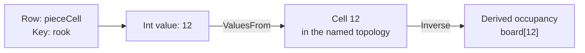

# Model state with rows and cells

A state model gives a simulation a shared vocabulary. In a small board game,
`coins` might hold one balance, `pieceCell` might record each piece's location,
and `hand` might hold cards in pile order. Rules read and change those values;
the names themselves do not give them game behavior.

Start by answering three separate questions for each row:

| Question | Example | State concept |
|---|---|---|
| What does each value mean? | A whole-number balance or a piece's location | `CellKind` chooses the value encoding. |
| How do I address a value? | One slot, a piece name, or a board-cell ordinal | `StateDomain` chooses the address space. |
| What additional behavior applies? | A capacity, accumulating value, or visibility policy | Row and cell traits supply the constraints and metadata. |

## Read an address

Every ordinary cell address has two parts: **row name and cell key**.
The expression spelling `pieceCell[rook]` addresses key `rook` in row
`pieceCell`. The value stored there might be `12`, meaning that this piece
occupies board cell 12. Its key and its value serve different purposes.



A **slot** holds one value. Its C# cell uses `StateRow.SlotKey`; an authored
effect's omitted `Key` selects that slot. Omission never selects the first
member of a keyed row. A declared `Capacity` expresses table intent even
when the row currently contains only one cell.

In C#, `StateCell.Value` is a raw `long`: Int uses the integer directly,
Fixed uses Q48.16 bits, and Bool uses zero or one. Text uses `StateCell.Text`,
and Vector uses `StateCell.Vector` (`StateVector`).
Q48.16 stores a number as an integer scaled by 65,536; a raw value of
`65536` means one. Human-facing numeric literals are converted at ingress.
An integer and a fixed-point number therefore cannot be interchanged by
copying their raw bits. Vector components are normalized signed 8-bit integers (`sbyte[]`)
scaled to radius 127, preserving bit-exact reproducibility across execution hosts.

## Choose an addressing shape

| Domain | What a key names | Example |
|---|---|---|
| `slot` | The row's single reserved cell | `coins` or `turn`. |
| `keys` | An author-chosen identifier | The declared pieces `rook`, `king`, and `pawn`. |
| `keysOf` | A key drawn from another row | A value per piece; with `Ordered = true`, an ordered pile of cards. |
| `cellsOf` | A cell of a named topology | Occupancy or a legal-move marker at each board location. |
| `ring` | A bounded history slot | The last several pushed values, read by age through `$history:`. |

A **topology** defines locations and connections: which squares are neighbors,
for example. A row over that topology supplies values at those locations.
Several rows can use the same topology: occupancy, visibility, and legal moves
can describe one board without copying its geometry.

A token row with `ValuesFrom` says that its integer values name locations.
A board row with `Inverse` derives occupancy from those token positions.
Write the token position and let the inverse be recomputed; independently
maintaining both would give the same position two possible answers.

## Choose behavior deliberately

| Need | Trait or mechanism | Consequence for the host |
|---|---|---|
| Bound a value or table | `Min`/`Max`, `Overflow`, `Capacity` | Admit writes against the row's envelope, capacity, and overflow policy. |
| Keep the newest inserted entries | `Evicts` with `Capacity` | Evict by insertion order; updating an existing key does not make it newer. |
| Accumulate between writes | `StateAdvance` | Read from a base and an exact per-second rate, evaluated over elapsed engine ticks; explicit writes rebase the carrying cell's clock. |
| Follow a target smoothly | `StateDynamics` | Preserve the follower's state and its declared dynamics. |
| Cycle through a spatial symmetry | `StateCycle` | Derive the phase or lattice value from the requested tick. |
| Draw a value | `Draw` | Preserve the site's cursor and exhaustion state; see [Generators](generators.md). |
| Control what observers learn | `StateVisibility`, `StateKnowledge` | Apply observation policy when producing a recipient's view. |
| Reject a stale submission | `StatePhase`, `PhaseGuard` | Admit against the current generation and advance it on success. |

`Min` and `Max` are each independently optional — a one-sided range (a floor
with no ceiling, or the reverse) is legal, and both are legitimate only on an
`Int`/`Fixed` row. `Overflow` names what happens when a write's exact result
(computed without wrapping) would leave that range, or overflows 64-bit
storage: `Refuse` (the default, including on a row that declares no envelope
at all) refuses the write by name; `Saturate` clamps it to the crossed bound,
or to the storage limit on a side with no declared bound. `StateRow.TryAdmitWrite`
is the one method every write path — the rule frame, mutation compose, ring
push, board combine, write sets — decides through, so every path agrees. A
saturating write still submits the rule's own operand as the mutation, so
replay reproduces the same clamped result.

Time traits describe computed reads. `StateAdvance` is authored per second
and evaluated over elapsed engine ticks (`FixedTickConversion.TicksPerSecond`,
50,400 per second) rather than simulation ticks, so a live change to the
world's own `simulation.rateHz` moves no epoch and skews no accumulation.
If an accumulating cell stores 10 at engine tick 0 and advances by 60 per
second, its Int read one full second later (engine tick 50,400) is 70. The
stored base can still be 10. Adding three at that engine tick must start from
the current 70, then establish a new base of 73 at that engine tick. This is
why readers and writers use the shared state helpers. A world authored at
`simulation.rateHz: 0` never steps, so its engine tick never advances either:
an `advance` row there is legal, not refused, and simply never accrues past
whatever base its last explicit write left it at. `StateDynamics` and
`StateCycle` stay on simulation ticks — only `StateAdvance` reads the engine
clock.

A row's `Advance`/`Dynamics`/`Cycle` is the default behavior of every cell it
carries, including a key a later write mints — `EffectiveBehavior.Resolve`
is the one place every consumer (readers, the validator, rebase, JSON
conversion, save capture) decides which trait governs a cell. A cell replaces
that default wholesale with its own `Advance`/`Dynamics`/`Cycle` (never two of
the three at once), or opts out entirely with `StateCell.Behavior =
StateCellBehavior.None`; neither is legitimate on the reserved slot key, since
a slot's one cell has no separate default to override. Timing state — the
epoch, a dynamics follower's sampled position and velocity, a cycle's carried
substep — lives on the cell itself (`StateCellClock`), not on the trait: a key
minted later starts its own clock from the tick (and engine tick) it was
created. `StateCellClock` carries two independent epochs: `EpochTick` (a
simulation tick, for `Dynamics`/`Cycle`) and `EpochEngineTick` (an engine
tick, for `Advance`) — the two clocks never share a coordinate. A cell
authored with a `Dynamics` behavior and no `StateCellClock` at all reads its
own stored value as the follower's position, at rest, rather than easing in
from zero. Re-authoring a
row's default or a cell's own behavior settles every affected cell at the
change tick, per the transition each behavior pair follows (a parameter
change keeps the live value and moves the epoch; switching behaviors, or to
none, freezes the old behavior's current value and zeroes velocity/substep).
These traits have other compatibility rules too — a slot cannot both
accumulate and draw, for one.

Visibility also differs from gameplay permission. An observation policy says
what a reader learns; it does not authorize that reader to mutate the state.
Row and cell restrictions intersect. Hidden cells can disappear, contribute
only a count, or appear as anonymous placeholders. A knowledge row records
what was last observed through a mask, including its observation tick; a hidden
location need not reveal its current authoritative value.

A phase guard answers a narrower question: “Does this submission still refer
to generation 7?” Once an accepted guarded submission advances the generation,
another submission carrying 7 is stale. Rules and host admission still decide
who may act and what a turn means.

## Keep definitions, storage, and reads distinct

The section describes rows. The catalog resolves their names into
catalog-bound handles. A store supplies the values currently being read.
`StateReader` combines a stored value with its authored behavior at a tick.
Replacing a catalog invalidates its handles; preserving the declaration shape
can let a host retain the catalog during value-only updates.

[Frames](frames.md) explain how the same rows and compiled rules can read a
different store while exploring a possible move.

## The state section

`IStateSection` is the contract every reader and
compiler consumes—the document-owned `Rows`, the `Lattices` they may lie
over, and two per-participant slot lanes (`ParticipantSlots`,
`IdentitySlots`, each an `IStateSlot`). `StateSection` is the standalone
document's own record of it; a document project declares its own record
over the same interface and adds what only it can name.

## Rows and cells

`StateRow` describes a collection of `StateCell` values. A document project can
derive its own row to add traits. `StateCapacity` and `StateReservedCells`
define shared limits and reserved cells; `StateRows` supplies lookup helpers. The row
converter `StateRowJsonConverter<TRow>` owns the wire shape (`value`-vs-
`cells`, the decimal fixed-point spelling) and exposes two hook points a
derived row's converter writes its own members at.

## Domains

The `StateDomain` union chooses how a row is addressed: `slot`, `keys`,
`keysOf`, `cellsOf`, or `ring`. Its cases use the `[Union]` marker in `Union.cs`.

## Traits

Rows can carry behavior and observation traits: `StateAdvance` (exact per-second
rational accumulation over engine ticks — `PerSecondNumerator`/
`PerSecondDenominator`, JSON `perSecondNumerator`/`perSecondDenominator`), `StateDynamics`
(a second-order follower over a `DynamicsRow`), `StateCycle`/`CycleOutput`
(a tick-indexed rotation through a symmetry-lattice word), `StateVisibility`/
`HiddenCells`/`StateKnowledge`/`StateObservation` (observation policy),
`StatePhase`/`PhaseGuard` (a guarded submission generation), `StateInverse`
(a `cellsOf` row declaring itself the inverse of a keyed token row—see
`DerivedBoards`). A cell's own `StateCellBehavior` and `StateCellClock` carry
its opt-out and its timing state; see `EffectiveBehavior.Resolve`.

## Topologies

`LatticeTopology` declares a discrete space: `grid`, `ring`, `hex`,
`box`, `graph`, or `tiling`. A host can register its dense `field`
case as a derived record. `TopologyKind`, `TopologyWrap`,
`TopologyDirection`, and `TopologyElementAlias` describe the space's
kind, boundaries, directions, and named elements.

`TopologyCompilation` validates, normalizes, and compiles a topology, including
an anchor offset when needed, and supports finding an unanchored topology.
`CompiledTopology` supplies adjacency, opposite directions, symmetry images,
element aliases, cell centres, position-to-cell lookup, and axial offsets.
A symmetry image says where a cell lands after a permitted rotation or reflection.

### Hex cells

A hex topology uses `HexagonalIndex` as its cell order: cell i is index i,
with rings progressing outward and consecutive indices adjacent.
Its six directions are `HexagonalCoordinate.Direction(0..5)`, named
E, SE, SW, W, NW, NE.

For axial coordinates (q, r), the cell centre is:

```text
origin + cellSize × (q − r/2, 0, r×√3/2)
```

### Authored graphs

A graph supplies its adjacency directly. Cells have ids and centres relative
to the origin in world units. Each direction names its opposite. An edge
specifies `from`, `to`, `direction`, and optional `oneWay`; it fills
one (cell, direction) slot and ordinarily the reverse slot.

Use a graph for a territory map, a star board, or geometry emitted by a tool.
Position-to-cell chooses the nearest centre within half a `cellSize`.
Graphs provide no axial offset, and their symmetry group contains only the
identity transformation.

### Generated tilings

`TilingGenerator` creates a graph within a radius from uniform unit cells:
triangular, kagome, truncated-square, rhombitrihexagonal, truncated-hexagonal,
elongated-triangular, and truncated-trihexagonal tilings. It also generates
Penrose P3 rhombs by Robinson-triangle inflation from a sun arrangement.

Tiles become cells ordered outward from the origin. Shared sides supply
## Embedding spaces and vectors

An **embedding space** (`StateSpace`) establishes the model identity, revision, and
dimensionality for semantic state vectors:

- `Name`: a valid identifier referencing the space (e.g. `lore`).
- `Model`: the model name (e.g. `puck-fixture` or `text-embedding-3-small`).
- `Revision`: model revision string (e.g. `"1"`).
- `Dimensions`: dimensionality in `[8, 1024]`.

Every `Vector` table or slot must reference a declared space (`space: "lore"`).
Vector components are stored in `StateVector` as unit-normalized signed 8-bit integers
(`sbyte[]`) on radius 127:

```puck
state {
    spaces {
        space lore { model: "puck-fixture" revision: "1" dimensions: 256 }
    }
    world {
        table events : Vector {
            ambush = "Bandits ambushed the caravan on the north road"
        }
        table memories : Vector capacity(128) evicts { }
        slot situation : Vector = "Travellers approach the gate at dusk"
    }
}
```

### Quantized drift and mean

Quantized vector mutations preserve unit length on radius 127. Operations like
`mix` compute weighted integer sums and re-project to the unit sphere using
`SignedByteVectorFunctions.TryNormalize`, preventing drift or scale collapse over long
simulation runs.

### Model-change recovery

Changing an embedding model or revision changes vector coordinates. Authored text
in `.puck` sources is locked in `.embeddings.json` companion files via `puck embed`.
When an embedding model changes, regenerating the lock file with `puck embed`
re-embeds all authored text, preserving semantic intent under the new model without
manual vector surgery.

## The catalog and the reader

`StateCatalog` compiles a section into
`StateDescriptor`s and catalog-bound `StateHandle`s by `StateLane`
(`Document`, `Participant`, `Identity`) and `StateStorageShape`;
`StateReader` is the one (row, key) → raw-value computation (advance, cycle,
eased reads, reductions, arg-extrema); `StateCellWriter` the one cell-write
composition with FIFO eviction. `StateStore.TryStored` can return stored values
and authored behavior metadata together, so keyed reads resolve the cell once.

## Identifiers

`SafeName` and `CellName` validate identifiers at construction and refuse invalid
names. `SafeName.MaxSuffixLength` reserves space for a file suffix a document
project may append. Their JSON converters share the
`TryParseStringJsonConverter<T>` shape.

---

[State and rules](../state.md) · Next: [Read values and build expressions](expressions.md)
