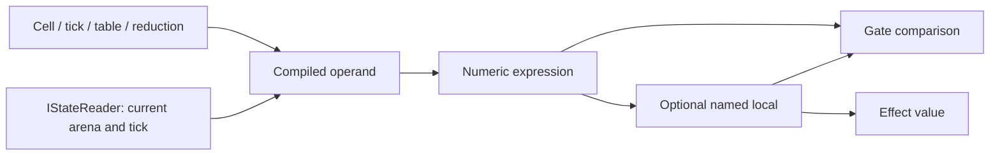

# Read values and build expressions

A rule needs answers before it can decide what to do. An **operand** supplies
one answer, such as a cell value, the current tick, or a sum. An **expression**
combines numeric answers. A **predicate** compares them to decide whether a
rule's gate holds. The [rules chapter](rules.md) explains what happens after
that decision.

## Follow a value from its source



Compilation resolves names and checks kinds once. Evaluation asks the reader
for live values. The same operand can therefore read an installed row through
a host or a candidate value through a frame.

## Choose the kind of read

These are expression or channel fragments, not complete document fields.

| Read | Meaning | Useful for |
|---|---|---|
| `coins` | The slot value of a declared row | One counter. |
| `pieceCell[rook]` or `pieceCell.rook` | A named cell's value | One piece's location. |
| `$tick` | The evaluation tick | Compare against a deadline. |
| `$local:cost` | A value computed earlier in this rule evaluation | Reuse an expression across gate and effects. |
| `$reduce:sum:coinsByPlayer` | Sum the row's numeric values | A total. |
| `$zone:hand:last` | The original string key of the last member | Address a card's attributes or transfer that card. |

The last entry is a **dynamic key**, not a numeric card value. Use it where
an operation expects a key. [Live zones and absent endpoints](rules.md#the-facts)
explain what happens when the pile is empty.

In a world JSON document, a plain row or cell name is a string. A reserved
channel is an object: `$tick` is `{ "channel": "tick" }`, for example.
If present, `arguments` must be an array. Each element is a word, a Decimal
number, or an object containing exactly one `zone` or `expression` program.
Malformed shapes and numbers outside Decimal's range are refused; fields are
never silently discarded. Imported fragments follow the same refusal contract.

`row.key` and `row[key]` parse to the same read for a literal key: the dot
form takes exactly one dot on an unreserved, unquoted name (more than one, or
a key half that is itself reserved — `row.$each` — is a parse error naming the
fix). A dynamic key, `$each`, a local, or any other expression still needs
bracket form. A reserved (`$`-prefixed) or backquoted name never splits at a
dot — its dotted segments stay part of the name.

## Expressions

The expression pipeline has one owner for each job:

| Type | Responsibility |
|---|---|
| `ExpressionProgram` and `Instruction` | The postfix IR: instructions in evaluation order, plus the shared subprograms a fold or call indexes into. |
| `InstructionPayload` | What an instruction addresses beyond its operation — a constant, a state read, a board query, a vector call, a fold, a call, or a call's argument. A closed union. |
| `ExpressionSpelling` | Parse and print infix syntax and its inverse, without a second evaluator. |
| `ExpressionProgramJsonConverter` | Read and write the IR, which is the one shape `puck.world.def.v1` holds. |
| `ExpressionSpellingJsonConverter` | Read and write a program as infix text, which is the shape `puck.cartridge.v1` holds. |
| `ExpressionOp` | The compiled operation code. |
| `ExpressionArithmetic` | Evaluate Int and Q48.16 operations without per-operation allocation. |
| `RuleExpressions` | The one operator dispatch a gate, a local, an effect source, and the compiler's own constant folder share; it lives in `Puck.State.Rules`. |
| `ExpressionOperators` | One row per operation carrying its spelling, arity, kind signature, payload shape, and pricing, consumed by the parser, compiler, folder, printer, and evaluator. |

Every operation has exactly one operator-table row, so no operation is
described in two places. Arithmetic domain checks remain in the evaluator.

### Infer a local's kind

An untyped local first chooses an Int or Fixed **carrier** for its operands.
Reading a Fixed row, or using a fractional literal without an Int row that
sets the scale, selects Fixed so `1.5` stays exact. The local stores the kind
of the expression's result. A comparison and `sign` consume numeric operands
but leave an Int, so both `1.5 == 1.5` and `sign(0.5)` bind the Int value `1`.
That value can feed a later local, gate, or effect without turning a fixed
literal into an integer first. Declare `kind` when the destination itself must
be Fixed or Int; an explicit kind remains a required result kind.

### The IR on the wire

A world document holds the IR and only the IR: an expression-valued member is
an object carrying `instructions`, each an object whose `op` names the
operation and whose remaining members are that operation's payload, plus the
optional shared `subprograms` a fold or a call indexes into.

```json
{ "instructions": [ { "op": "Operand", "name": "hp" }, { "op": "Constant", "value": 1 }, { "op": "Subtract" } ] }
```

`puck compile` parses the authored infix text into the IR and `puck decompile`
prints the IR back through `ExpressionSpelling`, so print-then-parse is the
identity over every program a document can carry. A cartridge document spells
a program as that infix text instead, because its own vocabulary is authored
and read as text.

### Reduce a family

`all(family, member -> expr)` and its siblings `any`, `count`, and `sum` fold
a family in one pass: the body becomes a subprogram of the program the fold
belongs to and is evaluated once per member, with the member in flight read by
the binder's own name. A fold is priced as the family's size times its body's
cost, and nests at most once.

A program carries at most 64 subprograms, each bounded by the same 256-token
ceiling as the program itself, and a function takes at most 16 arguments. The
compiler compiles each subprogram once and every call site shares that body,
refuses a cycle by the subprogram's name, and so bounds how deep a chain of
calls can nest at evaluation. Sharing makes a chain cheap to write and not to
run: a function that calls the level below twice doubles at every level, so a
body carries the count of tokens one call evaluates, the compiler folds a
constant subtree only when that count is small, and the work sheet prices the
chain at what it runs, which admission refuses when it overflows.

### Answer an absent read

`isAbsent(operand)` reads whether a dynamic key named no cell, and
`operand ?? fallback` replaces the absence with a value. Every other operation
consuming an absent read still refuses, naming these two.

### Periodic bit masks

`replicationMask(width)` places one bit at the bottom of each block.
`repeatBits(pattern, width)` repeats a block across the 64-bit value.

| Expression | Result |
|---|---|
| `replicationMask(8)` | `0x0101010101010101` |
| `repeatBits(127, 8)` | `0x7F7F7F7F7F7F7F7F` |
| `repeatBits(3, 4)` | `0x3333333333333333`, a Fermat-style mask |

Both functions are Int-only and accept live expressions. Width must be
1, 2, 4, 8, 16, 32, or 64, and the pattern must fit its block. Invalid
arguments refuse evaluation. Width 64 repeats the entire word unchanged,
including negative bit patterns.

### Constant folding and faults

After validating every authored token, the compiler evaluates successful
constant subexpressions once using the runtime evaluator. This includes
literal calls and immutable topology operations. Live reads remain live.
Invalid constant subexpressions still refuse at runtime, even in an unselected
conditional branch: `select` does not hide an invalid expression.
Work budgets price the resulting program.

### Function families

Alongside arithmetic, comparisons, bit and board operations, and `select`,
the following families expose [Puck.Maths](../maths.md) operations.
A packed index stores several coordinates or choices in one integer.

| Family | Calls and meaning |
|---|---|
| Pairing | `pair`, `pairX`, `pairY`; `pairSwap`, `pairMax`, `pairMin`, `pairSum`, `pairDifference`, `pairTranslate`, `pairScale`. |
| Morton order | `morton`, `mortonX`, `mortonY`. |
| Hilbert order | `hilbert(order, x, y)`, `hilbertX`, `hilbertY`. |
| Hex coordinates | Over `HexagonalIndex`: `hex(q, r)`, `hexQ`, `hexR`, `hexRadius`, `hexEuclideanSquared`, `hexDistance`, `hexNeighbor`, `hexRotate`, `hexMirror`, `hexSwap`, `hexAdd`, `hexSubtract`, `hexMultiply`, `hexScale`, `hexTranslate`. |
| Square coordinates | Over `SquareIndex`: `square(x, y)`, `squareX`, `squareY`, `squareRadius`, `squareLength`, `squareEuclideanSquared`, `squareDistance`, `squareChebyshev`, `squareNeighbor`, `squareRotate`, `squareMirror`, `squareSwap`, `squareAdd`, `squareSubtract`, `squareMultiply`, `squareScale`, `squareTranslate`. |
| Integer factors and cycles | `gcd`, `lcm`, floored `mod(a, m)`, `cycleForward(a, b, m)`, `cycleDistance(a, b, m)`. |
| Sets and primes | `smallestMissing(mask)`, exact bounded 64-bit `isPrime(n)`, and `prime(i)` over the first 256 primes, derived once. |
| Combinations | `choose(n, k)`, `factorial(n)`; `subsetRank(n, mask)`, `subsetAt(n, k, rank)`, `subsetMember(n, k, rank, i)`. |
| Permutations | `arrangementRank(n, packed)`, `arrangementAt(n, rank)`, `arrangementMember(n, rank, i)`. |
| Layer sequences | Over `LayerSequence`: `layer`, `layerOffset`, `layerStart`, `layerSize`, each taking `(index-or-layer, start, step, seed)`. |
| Roots and trigonometry | `sqrt` computes an integer floor root or a fixed root; `sin` and `cos` take fixed radians. |

Square radius and `squareChebyshev` use Chebyshev distance (the largest axis
difference). Square length and `squareDistance` use Manhattan distance (the
sum of axis differences). Square neighbors are E, N, W, S, and rotation uses
quarter turns.

`smallestMissing` finds the smallest non-negative integer absent from a
64-bit set. Prime lookup is bounded; a next-prime or arbitrary n-th-prime search
belongs to a generator source rather than unbounded work inside an expression.

`factorial` accepts n ≤ 20. Subsets use a bitmask with n ≤ 64 and
colexicographic ranking, which orders subsets by their largest differing member.
A five-card poker hand is one rank below `choose(52, 5)`.
Arrangements use n ≤ 16, packed with position i in bits 4i through 4i+3.
Their lexicographic Lehmer code ranks each permutation by counting the
smaller remaining choices at successive positions.

Every listed function is Int-only except `sqrt`, `sin`, and `cos`.
An invalid domain, such as a negative index, a component beyond its cell, or
a Hilbert order outside 1..31, fails the expression rather than wrapping.

## Vector expressions

Rules can evaluate vector similarity, dot product, and identity between Vector cells
belonging to the same embedding space:

| Function | Signature | Return kind | Meaning |
|---|---|---|---|
| `similarity(a, b)` | `(Vector, Vector)` | Fixed (Q48.16) | Quantized cosine similarity in `[-1.0, 1.0]`. |
| `dot(a, b)` | `(Vector, Vector)` | Int | Raw integer sum of component products `∑(a_i * b_i)`. |
| `identical(a, b)` | `(Vector, Vector)` | Bool (0 or 1) | Bit-exact component equality across all dimensions. |

Authored vector operands can also compare against embedding literals:
`embed("danger and betrayal")`, which resolve through companion lock files.

### The cosine distinction

Because `StateVector` components are quantized to signed 8-bit integers normalized on radius 127:
- `similarity` uses `SignedByteVectorFunctions.CosineQ16` to produce a true cosine metric
  scaled into standard fixed-point (Q48.16), compensating for slight quantization error.
  A similarity of `1.0` means parallel unit vectors; `0.0` means orthogonal; `-1.0` means antiparallel.
- `dot` evaluates the unscaled integer accumulator `Dot(left, right)`. For two unit-normalized vectors
  of radius 127, the maximum dot product is approximately `127 * 127 = 16,129`. `dot` is preferred
  when comparing relative rankings without fixed-point division overhead.

## Reductions

`$reduce:<max|min|sum|count>:<row>` aggregates a row's cells.
Append `:between:<lower>:<upper>` to admit only live values within an inclusive
range, for example `$reduce:count:pieceCell:between:0:63`. Bounds use the source
row's units and normal numeric-literal rounding; `count` still returns an Int.
The existing `:where:<filterRow>` admits keys with nonzero filter values. Both
filters may appear once, in either order, and their conditions intersect.
Missing filter keys are excluded; an empty result is zero. Bounds must be
representable and ordered. `arrangementRank` takes neither filter. A range
reduction costs three work units per candidate capacity (read and two comparisons).
Filtered and unfiltered reads share one accumulator; plain `count` stays constant-time.
Sparse filters use an index scoped to the read, so replacing cells or transferring
frame membership cannot leave a stale index. Large indexes rent scratch storage;
small ones use the stack. Dense frame filters retain their topology key reads.

## Patterns

Patterns classify ordered numeric values. A `PatternSymbol` names an inclusive
range in the pattern's Int or Fixed kind; ranges may overlap, and compilation
refines the alphabet so the overlap has a consistent meaning.

A zone can supply its own values, values from an `Attribute` row, or a `Value`
expression evaluated for each token in pile order. Attribute and expression
forms are mutually exclusive. An expression can combine attributes, such as
`suit * 16 + rank`; `$token` names the current token and `$previous` the preceding
one. There is no preceding token at the beginning of the word.

Here a **word** means the whole sequence being tested. A pattern for two red
cards followed by one black card accepts that three-card sequence. It does not
automatically accept a longer hand containing the sequence somewhere inside it.
Use the declared sequence and repetition operators to express the intended extent.

| Pattern operation | What it accepts |
|---|---|
| `symbol`, `any`, `except` | One value in a named range, any value, or a value outside a named range. |
| `sequence` | Its items in order. |
| `choice` | Any one of its alternatives. |
| `all` | A word accepted by every item. |
| `not` | A word the inner pattern does not accept. |
| `optional`, `star`, `plus`, `repeat` | Zero or one, zero or more, one or more, or a bounded count of repetitions. |
| `empty` | The empty word. |
| `none` | No word, including the empty word. |

`PatternRow`, `PatternSymbol`, and `PatternNode` describe patterns. Compilation
produces `CompiledPattern`/`CompiledPatterns`, a Brzozowski-derivative machine
bounded by `PatternCapacity`: it tracks the patterns that can still match after
each input symbol. The compiled table advances one indexed step per token.
`MaxStates` bounds the compiled machine; exceeding it refuses compilation.
`PatternCapacity` also bounds the alphabet, repetitions, rows, and input length.

## Tables

Static lookup tables use `TableDocument` (`puck.table.v1`), `TableEntryDocument`, and
`TableCanonicalizer` (validate → normalize → canonicalize), with
`TableRow` as the name/source/hash reference a document pins one by and
`CompiledTable` as the sorted, binary-searched loaded form.

## Literals and spellings

`NumericLiteral` converts authored decimal constants and table values to Q48.16.
`StateSpelling` owns how a refusal spells a kind, a generator source, or a cycle
output.

---

[State and rules](../state.md) · Next: [Compile and run rules](rules.md)
