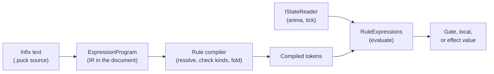

# Reads and expressions

A rule needs answers before it can decide what to do. This article explains
how a rule reads state (a cell, the tick, a reduction, a table, a board) and how
it combines those reads in numeric expressions, from the infix text you write to
the value the evaluator produces, and includes the full function reference. It's
for authors writing rules in `.puck` and for host developers who compile or
evaluate expressions from C#.

## Follow a value from its source

An **operand** supplies one answer, such as a cell value, the current tick, or a
sum. An **expression** combines numeric answers. A rule's gate compares
expressions, and its locals and effects compute with them. Here's a rule from
the running card and board game:

```puck
rule "buy-card" {
  when coins >= 3 and $tick < deadline
  local price = minimum(coins, 3) + count(hand)
  local top = cards[zone(hand, last)] ?? 0
  coins = coins - price
  spent = spent + price + top
}
```

This fragment assumes Int slots `coins`, `deadline`, and `spent`, a keyed row
`cards` of card values, and an ordered pile `hand` over `cards`. It reads:

1. `coins` and `deadline`, two slot cells, and `$tick`, the completed-tick
   counter.
2. `count(hand)`, a reduction that counts the cards in the pile.
3. `cards[zone(hand, last)]`, the value of whichever card is last in the pile.
   `zone(hand, last)` is a dynamic key; when the pile is empty it names no
   cell, and `?? 0` supplies a fallback.
4. `price` and `top`, locals computed earlier in the same evaluation.

The following diagram shows the path from what you write to what the evaluator
reads.



Compilation resolves every name and checks every kind once, when the document
is installed. Evaluation asks the reader for live values at each firing. The same
compiled operand therefore reads the installed state or a candidate's changes
inside a journal scope, whichever the arena holds when it runs; see
[The state arena](arena.md).

## Choose the kind of read

Each read has a `.puck` spelling and the document spelling it lowers to. In the
world document, a plain row or cell name is a string, and every reserved channel
is an object with a `channel` and its `arguments`.

| `.puck` | Document | Reads |
|---|---|---|
| `coins` | `"coins"` | A slot's value. |
| `pieceCell[rook]` or `pieceCell.rook` | `name` and `key` | One keyed cell. |
| `$tick` | `{ "channel": "tick" }` | The completed simulation-tick counter. |
| `price` (a local's name) | `{ "channel": "local", "arguments": ["price"] }` | A value computed earlier in this evaluation. |
| `count(hand)`, `sum(row)`, `min(row)`, `max(row)` | `$reduce:count:hand` and so on | A reduction over a row's cells. See [Reductions](#reductions). |
| `count(units)` | `$reduce:count:units` | The number of live instances in a pool. |
| `reduce(arrangementRank, hand)` | `$reduce:arrangementRank:hand` | An ordered pile's order as one Lehmer rank. |
| `zone(hand, last)`, `zone(hand, first)` | `$zone:hand:last` | A dynamic key: the original key of the pile's endpoint member. |
| `history(recent, 0)` | `$history:recent:0` | A history ring by age; 0 is the newest push. |
| `table(moves, power)[local(move)]` | `$table:moves:power:$local:move` | A static table value. See [Tables](#tables). |
| `board(neighbour, board, E)[cell]` | `$board:neighbour:board:E` | A board query. See [Topologies and boards](topologies.md). |
| `match(line, board, E, distance)[cell]` | `$match:line:board:E:distance` | A pattern match. See [Patterns](patterns.md). |
| `phase(turn)` | `$phase:turn` | A phase row's generation. |
| `symmetry(ring, row)[key]` | `$symmetry:ring:row` | A symmetry-lattice node read through one of the lattice's maps. |
| `search(ply)` | `$search:ply` | The hypothetical search ply; 0 during live evaluation. |
| `piece.hp`, `units[0].hp` | `{ "binding": … }`, `{ "pool": … }` | A pool field through a binding or a static slot. See [Records, pools, and handles](records-and-pools.md). |

The `.puck` spellings follow one rule: a document channel `$name:a:b` is written
as the call `name(a, b)`. There are three refinements. A local is written by its
bare name, the four reductions take named options (`where:`, `atLeast:`,
`atMost:`), and `$tick`, which has no arguments, keeps its `$` spelling. Writing the
colon form in `.puck` is refused with diagnostic PUCK106, which names the call
spelling to use instead.

Puck.World adds host channels (body positions, line of sight, a music clock, and
others) through the same mechanism. Those are listed in
[State in Puck.World](worlds.md). A rule can also select its row live from a
zone table with `$zones[index]`; see
[Serve several piles with one rule](rules.md#serve-several-piles-with-one-rule).

### Keys

A key names a cell inside a row. Inside brackets:

- A bare name is a literal key: `pieceCell[rook]`.
- A number is a numeric key: `board[9]`.
- A name indexed once more is an indirection, read live from that cell:
  `board[pieceCell[rook]]` is the board cell the rook stands on. The document
  spells it `$cell:pieceCell:rook`.
- A binding token reads the key bound for this evaluation: `$each` in a
  `forEach` rule, `$left` and `$right` in pairwise evaluation, and `$token` and
  `$previous` in a pattern's value expression.
- Any other expression computes the key: `board[(from + 1)]`. The compiler turns
  it into an implicit local evaluated before the gate and counts it against the
  local ceiling.
- A local used as a key is written as the call `local(move)`, since a bare name
  in brackets is a literal key.

`row.key` is the same read as `row[key]` for a literal key. The dot form takes
a single dot on an unreserved, unquoted name. More than one dot, or a key
half that is itself reserved (`row.$each`), is a parse error that names the
fix. A dynamic key, a binding token, a local, or an expression needs brackets.
A reserved (`$`) name or a backquoted name never splits at a dot; its dotted
segments stay part of the name. A name containing characters an
[identifier](../dsl.md#names) can't hold, such as a hyphen or a non-ASCII
letter, is written in backquotes: `` `seat-1` ``. So is a row named like a
function or a fold (`` `count` ``), which a bare word would call. Backquotes
have no escape, so no name holds one and none is empty: a state row or cell
key refuses a backquote where it is declared, and an operand that would name
nothing is refused where it is built. Inside brackets nothing is reserved, so
`pieceCell[count]` is the literal key `count`. The same dot also reads a pool field through a lexical binding
(`piece.hp`); the compiler tells the two apart by what the name before the dot
refers to.

A read of a cell the row doesn't declare is refused at compile time with
`RuleRefusal.StateCellUndeclared`, because an undeclared cell would read zero
forever. A declared cell that the row doesn't currently hold reads zero at run
time. How each dynamic key resolves during an evaluation is described in
[Resolve a cell key](rules.md#resolve-a-cell-key).

### Channel objects in world JSON

A hand-written world document spells a reserved channel as an object:

```json
{ "channel": "reduce", "arguments": ["sum", "pieceCell", "where", "onBoard"] }
```

If present, `arguments` must be an array. Each element is a word (a string), a
number that fits `Decimal`, or an object whose only member is a `zone` or
`expression` holding an expression program. The reader refuses a
malformed shape, a number outside `Decimal`'s range, an unknown member, and a
plain string that spells a reserved channel; it never drops a field. Imported
fragments follow the same rules.

A pool field is `{ "binding": "piece", "field": "hp" }` for a lexical binding or
`{ "pool": "units", "slot": 0, "field": "hp" }` for a static slot.

## The expression pipeline

Every numeric expression in a world document, from a rule's gate to a pattern's
value expression, uses the same intermediate representation (IR): an
`ExpressionProgram`. Several types each handle one step along the way.

| Type | Project | Purpose |
|---|---|---|
| `ExpressionProgram`, `Instruction`, `Subprogram` | Puck.State | The postfix IR: instructions in evaluation order, plus the shared subprograms a fold or call indexes into. |
| `InstructionPayload` | Puck.State | What an instruction addresses beyond its operation: a constant, a state read, a board mask operation, a vector call, a fold, a call, or a call's argument. A closed union. |
| `ExpressionOp` | Puck.State | The operation code. |
| `ExpressionOperators`, `ExpressionOperator` | Puck.State | One row per operation: spelling, arity, kind signature, payload shape, and cost. The parser, compiler, constant folder, printer, and evaluator all read it. |
| `ExpressionSpelling` | Puck.State | Parses infix text to the IR and prints it back. It's syntax only; it doesn't evaluate. |
| `IdentifierSpelling` | Puck.State | The one identifier rule every Puck source language reads names by. See [Names](../dsl.md#names). |
| `ExpressionProgramJsonConverter` | Puck.State | Reads and writes the IR, the shape a world document holds. |
| `ExpressionSpellingJsonConverter` | Puck.State | Reads and writes a program as infix text, the shape a cartridge document holds. |
| `ExpressionVocabulary` | Puck.State | The named functions, projected from the operator table, which the `.puck` document language also reads. |
| `ExpressionArithmetic` | Puck.State | Evaluates Int and Q48.16 operations without per-operation allocation. |
| `RuleExpressions` | Puck.State.Rules | The operator dispatch that gates, locals, effect sources, and the constant folder all evaluate through. |

Each operation has a single row in `ExpressionOperators`, so its spelling,
arity, and cost live in one place. Domain checks, such as division by zero,
remain in the evaluator. Evaluation allocates nothing once warm: the value
stack is leased from the arena's scratch storage at the program's own length.

### The IR on the wire

A world document stores every expression as IR. An expression-valued member is an
object carrying `instructions`, each an object whose `op` names the operation
and whose other members are its payload, plus optional shared `subprograms`:

```json
{ "instructions": [ { "op": "Operand", "name": "coins" }, { "op": "Operand", "name": { "channel": "local", "arguments": ["price"] } }, { "op": "Subtract" } ] }
```

`puck compile` parses the infix text you write into this IR, and
`puck decompile` prints it back through `ExpressionSpelling`. Printing and
parsing again gives back the same program for everything the infix grammar can
spell. A cartridge document (`puck.cartridge.v1`) stores programs as infix
text instead, because its vocabulary is authored and read as text.

Infix text uses C precedence: the ternary `? :` binds loosest, then `??`, then
`|`, `^`, `&`, equality, relational comparison, shifts, `+` and `-`, then `*`,
`/`, and `%`, then the prefix `-` and `~`. Every level but the ternary's is the
`Binding` column of `ExpressionOperators`, which the document parser reads too. Literals are decimals (`12`, `0.25`) or
hexadecimal masks (`0xFF00`), and a leading minus folds into the literal. A
spelling is at most 16,384 characters and nests at most 256 levels deep.

> [!TIP]
> Because the bit operators bind looser than comparisons, `mask & 1 == 1` reads
> as `mask & (1 == 1)`. Parenthesize: `(mask & 1) == 1`.

## Locals and their kinds

A `local` computes a value once per evaluation, after any `forEach` key is bound
and before the gate reads it, so the gate, other locals, and effects can share
it. A rule declares at most 64 locals, counting the implicit locals computed
keys create.

In `.puck` you never write a local's kind; the compiler infers it, and a `: Int`
or `as Fixed` annotation is refused. Inference works in two steps:

1. The local picks a numeric **carrier**, Int or Fixed, for its operands. It
   tries Int first, unless the expression is made only of constants and one of
   them has a fraction, in which case it starts with Fixed so `1.5` stays exact.
   If the first carrier doesn't compile (for example, the expression reads a
   Fixed row), the compiler tries the other.
2. The local stores the kind of the expression's result. A comparison and
   `sign` read numeric operands but produce Int, so `1.5 == 1.5` and `sign(0.5)`
   both bind the Int value 1. That value can feed a later local, gate, or effect
   without turning a Fixed literal into an Int.

A hand-written document may set `kind` on a local. The kind then becomes a
required result kind, which is how a destination that must be Fixed or Int
states it.

## Fold over a row

`all(row, x -> expr)`, `any`, `count`, and `sum` fold a row's cells in one pass.
The body becomes a subprogram of the enclosing program and runs once per cell,
with the cell in flight read by the binder's name:

```puck
local anyFar = any(pieceCell, c -> c > 3)
```

`all`, `any`, and `count` produce Int; `sum` produces the row's own kind and
requires the enclosing expression to compute in that kind. The folded row must
be Int or Fixed. A fold nests at most once, so one binder is in scope at a
time. The work sheet prices a fold as the row's capacity times its body's cost.

`count(hand)` with no body is the reduction described in
[Reductions](#reductions); `count(hand, c -> c > 2)` is a fold.

## Subprograms and calls

A program carries at most 64 subprograms (`RuleCapacity.MaxSubprograms`), and
each is bounded by the same 256-token ceiling as the program itself
(`RuleCapacity.MaxExpressionTokens`). A `Call` instruction invokes a subprogram
with its arguments, which the body reads through `Argument`; a function takes at
most 16 arguments (`RuleExpressions.MaxArguments`).

The compiler compiles each subprogram once, and every call site shares that
body. It refuses a call cycle, and the refusal names the subprogram. With no
cycles, 64 subprograms also bound how deeply calls can nest at evaluation.
Sharing keeps a deep call chain small in the document, but its run time still
grows: a function that calls the level below twice doubles its work at each
level. To account for that, each body records how many tokens one call
evaluates. The compiler folds a constant subtree only when that count is small,
and the work sheet prices a chain at what it runs. Admission refuses
the rule when that count overflows.

The infix grammar doesn't spell a call. A fold's body is the subprogram form
`.puck` produces; a `Call` instruction exists only in an IR built directly, in
JSON or in C#. A `.puck` `derive` declaration is a compile-time substitution:
the document carries its expansion at each use.

## Answer an absent read

A read is **absent** when a dynamic key names no cell, such as the last card of
an empty pile, `$previous` on a pattern's first token, or a table key the table
doesn't carry. Two operations accept
an absent value:

- `isAbsent(operand)` produces 1 when the read is absent and 0 otherwise.
- `operand ?? fallback` produces the fallback when the read is absent.

Every other operation that consumes an absent value fails the expression with
the `Absent` fault. What a failed expression does to a gate or a firing is
explained in [Rules and firing](rules.md).

## Constant folding and faults

After validating every token, the compiler evaluates each constant subexpression
once, using the same evaluator that runs at firing time. That includes calls on
literals and operations over a topology's fixed tables. Reads of live state,
fold members, and call arguments stay live, as do folds themselves. A subtree
longer than `RuleWorkBudget.MaxFoldSteps` (65,536 tokens) isn't folded; the work
sheet prices it instead.

A constant subexpression that fails keeps its failure. Expressions are eager,
so an invalid expression still fails at run time even inside the unselected arm
of a conditional. Work budgets price the program after folding.

An expression that fails reports one of these `ExpressionFault` values:

| Fault | Cause |
|---|---|
| `Domain` | Overflow, division by zero, a function argument outside its domain, or an invalid stack result. |
| `Absent` | An operand's dynamic key named no cell, or a table read named a key the table doesn't carry. |
| `Forever` | An operand produced a fact that carries no number. |

Arithmetic never wraps. Int addition, subtraction, and multiplication compute
the exact result and fail if it doesn't fit 64 bits. Int division truncates
toward zero. Fixed multiplication and division round the exact result once; see
[Deterministic numerics](../maths.md). A shift count must be 0 to 63.

## Function reference

Every function is defined over Int unless the table says otherwise. The names
are the exact spellings the parser accepts.

| Family | Functions | Kinds |
|---|---|---|
| Arithmetic | `+`, `-`, `*`, `/`, `%`, unary `-`, `minimum(a, b)`, `maximum(a, b)`, `clamp(value, min, max)`, `absolute(x)`, `floor(x)`, `ceiling(x)`, `round(x)`, `squareRoot(x)` | Int and Fixed |
| Sign and comparison | `sign(x)`; `==`, `!=`, `<`, `<=`, `>`, `>=` | Int or Fixed in, Int out |
| Selection | `condition ? whenTrue : whenFalse`, the one spelling, right-associative | An Int condition; arms of one kind |
| Absence | `isAbsent(operand)`, `operand ?? fallback` | See [Answer an absent read](#answer-an-absent-read) |
| Bits | `&`, `\|`, `^`, `~`, `<<`, `>>`, `>>>` (logical), `setBitCount`, `leadingZeroCount`, `trailingZeroCount`, `lowestSetBit`, `clearLowestSetBit`, `byteSwap`, `reverseBits`, `rotateLeft(value, count)`, `rotateRight(value, count)`, `parallelBitExtract(value, mask)`, `parallelBitDeposit(value, mask)`, `bitField(value, offset, width)`, `bitInsert(value, field, offset, width)` | Int |
| Periodic masks | `replicationMask(width)`, `repeatBits(pattern, width)` | Int |
| Board masks | `boardShift(mask, topology, direction)`, `boardRay(mask, topology, direction)`, `boardImage(mask, topology, element)` | Int; topologies of at most 64 cells |
| Pairing | `pair(x, y)`, `pairX`, `pairY`, `pairSwap`, `pairMaximum`, `pairMinimum`, `pairSum`, `pairDifference`, `pairTranslate(p, delta)`, `pairScale(p, factor)` | Int |
| Morton order | `mortonIndex(x, y)`, `mortonX`, `mortonY` | Int |
| Hilbert order | `hilbertIndex(order, x, y)`, `hilbertX(order, index)`, `hilbertY(order, index)` | Int |
| Hex coordinates | `hexIndex(q, r)`, `hexQ`, `hexR`, `hexRadius`, `hexEuclideanSquared`, `hexDistance(a, b)`, `hexNeighbor(cell, direction)`, `hexRotate(cell, turns)`, `hexMirror`, `hexSwap`, `hexAdd`, `hexSubtract`, `hexMultiply`, `hexScale`, `hexTranslate(cell, dq, dr)` | Int |
| Square coordinates | `squareIndex(x, y)`, `squareX`, `squareY`, `squareRadius`, `squareLength`, `squareEuclideanSquared`, `squareDistance(a, b)`, `squareChebyshev(a, b)`, `squareNeighbor(cell, direction)`, `squareRotate(cell, turns)`, `squareMirror`, `squareSwap`, `squareAdd`, `squareSubtract`, `squareMultiply`, `squareScale`, `squareTranslate(cell, dx, dy)` | Int |
| Factors and cycles | `greatestCommonDivisor(a, b)`, `leastCommonMultiple(a, b)`, `floorModulo(a, m)`, `cycleForward(a, b, m)`, `cycleDistance(a, b, m)` | Int |
| Sets and primes | `smallestMissing(mask)`, `isPrime(n)`, `primeAt(i)` | Int |
| Combinations | `binomialCoefficient(n, k)`, `factorial(n)`, `subsetRank(n, mask)`, `subsetAt(n, k, rank)`, `subsetMember(n, k, rank, i)` | Int |
| Permutations | `arrangementRank(n, packed)`, `arrangementAt(n, rank)`, `arrangementMember(n, rank, i)` | Int |
| Layer sequences | `layer`, `layerOffset`, `layerStart`, `layerSize`, each `(indexOrLayer, start, step, seed)` | Int |
| Trigonometry | `sine(radians)`, `cosine(radians)` | Fixed |
| Vectors | `dot`, `similarity`, `identical` | See [Vectors and embedding spaces](vectors.md) |

A **packed index** stores several coordinates or choices in one integer, which
is what the pairing, Morton, Hilbert, hex, square, and permutation families
produce and take apart. They expose operations from
[Deterministic numerics](../maths.md): the hex family works over
`HexagonalIndex` and the square family over `SquareIndex`.

These notes cover the details that affect results:

- `%` keeps the sign of the dividend (a truncated remainder), while
  `floorModulo(a, m)` is floored and takes the sign of `m`. `cycleForward` and
  `cycleDistance` measure steps from `a` to `b` around a cycle of `m`.
- `floor`, `ceiling`, and `round` are the identity on Int. On Fixed, `round`
  breaks ties to even, the same rule the document language uses.
- `squareRoot` takes the integer floor root on Int and a fixed root on Fixed; a
  negative argument fails.
- `squareRadius` and `squareChebyshev` use Chebyshev distance (the largest axis
  difference); `squareLength` and `squareDistance` use Manhattan distance (the
  sum of axis differences). Square neighbors are E, N, W, S, and square rotation
  turns by quarter turns.
- `smallestMissing(mask)` is the smallest non-negative integer whose bit is
  clear. `isPrime` is exact over the whole non-negative 64-bit range.
  `primeAt(i)` reads the first 256 primes, derived once. A next-prime or
  arbitrary n-th prime search belongs in a generator.
- `factorial` accepts n up to 20. Subsets are bitmasks with n up to 64, ranked
  in colexicographic order, which compares subsets by their largest differing
  member; a five-card hand is one rank below `binomialCoefficient(52, 5)`.
  Arrangements hold n up to 16, packed four bits per position (position i in
  bits 4i through 4i+3), and rank by their lexicographic Lehmer code.
- `pair` components must be 0 to 3,037,000,498, Morton components at most
  2^31 − 1, and a Hilbert `order` 1 to 31.

An argument outside its domain, such as a negative index or a component beyond
its range, fails the expression with the `Domain` fault. Nothing wraps.

### Periodic bit masks

`replicationMask(width)` places one bit at the bottom of each block of `width`
bits. `repeatBits(pattern, width)` repeats a block across the 64-bit value.

| Expression | Result |
|---|---|
| `replicationMask(8)` | `0x0101010101010101` |
| `repeatBits(127, 8)` | `0x7F7F7F7F7F7F7F7F` |
| `repeatBits(3, 4)` | `0x3333333333333333` |
| `replicationMask(3)` | `0x9249249249249249` |
| `repeatBits(3, 3)` | `0xB6DB6DB6DB6DB6DB` |

Both take live arguments. The width may be any value from 1 through 64. A width
that does not divide 64 still starts a block at every multiple of the width, so
the last block is cut off at bit 63. The pattern must fit its block; anything
else fails the expression. A width of 64 repeats the whole word unchanged,
including negative bit patterns.

## Reductions

A **reduction** aggregates a row's cells into one value. `count(row)`,
`sum(row)`, `min(row)`, and `max(row)` are its `.puck` spellings; the document
channel is `$reduce:<op>:<row>`.

```puck
local onBoardTotal = sum(pieceCell, where: onBoard, atLeast: 0, atMost: 63)
```

This fragment assumes `onBoard`, a numeric row keyed like `pieceCell`. It sums
the cells of `pieceCell` whose key has a nonzero value in `onBoard` and whose
own value lies in 0..63. The document spells it
`$reduce:sum:pieceCell:where:onBoard:between:0:63`.

- `sum`, `min`, and `max` produce the row's kind; `count` always produces Int.
  An empty result is 0. `sum` saturates at the 64-bit limits.
- Every candidate is read live, so a row of advancing cells reduces over their
  current values.
- `where:` admits keys whose value in the filter row is nonzero. A key the
  filter row doesn't hold is excluded. The filter must be a keyed numeric row,
  and the reduced row must be keyed.
- `atLeast:` and `atMost:` (the document's `:between:<lower>:<upper>`) admit
  values in an inclusive range, written in the source row's units with the
  usual literal rounding. The bounds must be representable and ordered.
- Each filter may appear once, in either order, and both apply together.
- `count` of a pool (`count(units)`) counts live instances.
- `reduce(arrangementRank, hand)` ranks an ordered pile's order relative to its
  token domain, over k! for k tokens. It takes no filters, and reads -1 when the
  pile holds more than 20 tokens or a token its domain doesn't declare.

At run time, an unfiltered `count` reads the row's cell count directly, and
every other reduction visits the row's held cells once. The work sheet prices a
reduction at one work unit per cell of the row's capacity, or three when a range
filter is present (a read and two comparisons).

## Tables

A **table** is static lookup data outside simulation state. It's a separate
`puck.table.v1` document (`TableDocument`) of integer keys and values, and a
world references it with a `TableRow`: a name, a source path, and the SHA-256
hash that pins the document's canonical bytes.

```json
{
  "schema": "puck.table.v1",
  "kind": "int",
  "columns": ["power", "cost"],
  "entries": [
    { "key": 1, "values": [3, 2] },
    { "key": 2, "values": [5, 4] }
  ]
}
```

A table's `kind` is `int` or `fixed`. A single-value table gives each entry a
`value`; a column table declares `columns` and gives each entry `values`, one
per column. `TableCanonicalizer` validates the document (schema tag, kind,
distinct non-empty column names, at least one entry, unique keys, the right
value shape, and values representable in the kind), normalizes it by sorting
entries by key, and serializes the canonical bytes the hash is taken over.
`CompiledTable` is the loaded form: keys sorted ascending, one raw value column
per declared column, read by binary search.

A rule reads a single-value table as `table(name, key)` (`$table:<name>:<key>`)
and a column table as `table(name, column, key)`
(`$table:<name>:<column>:<key>`). The key is an integer literal, an indirection,
a binding token such as `$each`, or a local written in brackets:
`table(moves, power)[local(move)]`. A literal key the table doesn't carry is
refused at compile time with `RuleRefusal.StateCellUndeclared`. A dynamic key
the table doesn't carry reads as absent, so `?? fallback` or `isAbsent` handles
it the way [Answer an absent read](#answer-an-absent-read) describes. A lookup
costs 2 plus the base-2 logarithm of the entry count.

Nothing writes a table, and it's never hashed into the tick or checkpointed.

## Literals

`NumericLiteral` converts an authored decimal to the Q48.16 fixed-point carrier.
Every constant, table value, and Fixed literal goes through this conversion, so
they all round the same way, and a literal outside the Q48.16 range is refused. An IR `Constant` holds the exact decimal; the compiler converts it to
the program's kind. `StateSpelling` renders a kind, a generator source, a cycle
output, or a value the way the author wrote it, so every refusal message quotes
the document's own spelling.

## Limitations

- An expression holds at most 256 postfix tokens and 64 subprograms, and a
  function takes at most 16 arguments. A rule declares at most 64 locals.
- Expressions compute in Int or Fixed. A `Bool` cell reads as Int 0 or 1, and a
  `Text` cell can't be read in an expression. Vectors reach expressions only
  through the vector functions.
- A fold nests at most once, and there's no `.puck` spelling for a subprogram
  call.
- Board mask functions and `board(mask, …)` handle topologies of at most 64
  cells, because an expression value is one 64-bit word.
- `primeAt` covers the first 256 primes; `factorial` stops at 20; subsets stop
  at 64 elements and arrangements at 16.
- Tables have integer keys and Int or Fixed values only.

## Key types

| Type | Project | Purpose |
|---|---|---|
| `StateChannelRef`, `ChannelCall`, `ChannelArgument` | Puck.State | A document's reference to a row, key, pool field, or reserved channel. |
| `RuleFacts` | Puck.State | The reserved channel prefixes (`$tick`, `$local:`, `$reduce:`, …). |
| `BoundKey`, `RuleBindingTokens` | Puck.State | The binding tokens `$each`, `$left`, `$right`, `$token`, `$previous`. |
| `StateReduceOp` | Puck.State | The reduction operations. |
| `NumericLiteral` | Puck.State | Converts authored decimals to Q48.16. |
| `StateSpelling` | Puck.State | Authored spellings for refusal messages. |
| `TableRow`, `TableDocument`, `TableEntryDocument`, `TableCanonicalizer` | Puck.State, Puck.State.Generators | A table reference and the table document with its validation. |
| `CompiledTable` | Puck.State.Generators | A loaded table read by binary search. |
| `RuleCapacity` | Puck.State | The token, subprogram, and local ceilings. |
| `ExpressionFault` | Puck.State.Rules | Why an expression failed. |

The pipeline types are listed in [The expression pipeline](#the-expression-pipeline).

## Next steps

- [Rules and firing](rules.md): how a gate, locals, and effects use these reads.
- [Patterns](patterns.md): match a row's values against a regular language.
- [Rule analysis, scheduling, and work budgets](analysis.md): how expressions are
  priced.

## See also

- [Topologies and boards](topologies.md)
- [Vectors and embedding spaces](vectors.md)
- [World schema: tables](../../../src/Puck.World.Schema/README.md)
