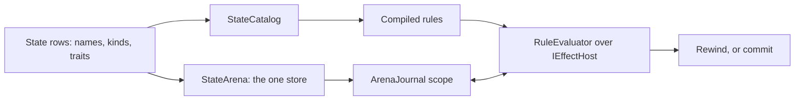

# Evaluate a candidate and reuse a proven answer

A **candidate** is one proposed change the same compiled rules judge without
leaving it installed. It lets a caller ask "What would happen if this piece
moved?" and then take the answer back. A candidate is a journal scope on the
arena, not a copy of it.

## Separate the installed state from the candidate

The catalog gives the compiler stable addresses within one declaration set.
The arena stores every cell those addresses name. A scope opened before the
first write remembers only the cells the scope changed, so rewinding restores
them and committing keeps them — no whole-store copy per candidate.

A rewind also moves the row versions it restores. Otherwise an evaluator could
see the same version after values had changed and reuse an answer from the
abandoned candidate.

## Decide whether a rule can be judged in a scope

| Requirement | Scoped behavior |
|---|---|
| Read and write an existing numeric cell | Supported; the arena is the same store the installed state lives in. |
| Maintain an inverse board after a token move | The arena recomputes the moved token's own two board cells. |
| Move membership between ordered zones | Uses the arena's current membership. |
| Consume a generator draw | Refused by a host that serves no draw site. |
| Fire a registered host-specific effect | Refused by name (`StateEffectRefusal.ArmUnbound`) on a host that serves no arm of that kind. |
| Evaluate host-only operands | Requires a host implementing the facet the fact's declaration names. |

A judge that relies on a refused arm cannot prove the move would succeed in the
real host. Admit judge rules against the host first (`RuleNeeds.Admit`), which
refuses a rule naming a facet the host does not serve rather than discovering it
mid-tick.

## Understand the two kinds of remembered state

`RuleLatch` holds both firing history and scheduling caches, but only the
firing history affects the simulation's meaning.

| Remembered information | Why it exists | Persistence |
|---|---|---|
| Edge gate state | Know whether this is a new crossing | Hash and checkpoint it in a continuing simulation. |
| Last seen row versions | Prove input rows have not changed | Rebuildable cache. |
| Memoized binding values | Avoid recalculating an unchanged expression | Rebuildable cache. |

A **row version** is a change counter, not a timestamp. A write to any cell in
the row changes the version. An unchanged version can prove ordinary stored
values unchanged; it cannot prove the answer to a tick-dependent or
host-dependent read unchanged.

A caller that judges many independent positions rather than continuing one
simulation calls `RuleLatch.Reset` before each judge: the latch then reads as
empty, every crossing is a first one, and no binding memo carries a previous
position's value forward. `Reset` keeps the storage each rule has grown, so
judging many positions allocates nothing per position. `Clear` forgets the
storage too, for a latch that is hashed or checkpointed.

## Scheduling

Scheduling can reuse a previously closed gate or a binding only when all
tracked dependencies prove safe. An open gate still runs, as does a traced
evaluation. An advance or cycle trait, `$tick`, an unresolved row, or a
host-only read prevents that proof. This makes scheduling an optimization of
the same answer, rather than another rule execution policy.

`IStateReader.TryRowVersion` exposes a row's version by ordinal, reading
`StateArena.RowVersion`.

### Build the dependency proof

`RuleSchedule.Build` is cached per compiled rule and local, against the fully
constructed rule — including a host's own `CollectReads` override.

The schedule collects row ordinals and checks for dependencies that versions
cannot cover: a host read, a tick read, an unresolved row, and slot or keyed
`StateAdvance`/`StateCycle` traits.

A `$local:` read includes the source local's dependencies transitively, so
chaining locals cannot hide a volatile source.

### Reuse an answer only within its owner

`RuleEvaluator.SchedulingEnabled` defaults to true. It permits reuse of a
previously closed gate and of memoized binding values when every dependency's
version matches and no volatile dependency remains. Open gates and traced
evaluations run fully.

Caches live in `RuleLatch`, per rule and iteration binding, and belong to the
exact `RuleSchedule` instance that captured them. Recompiling a rule under
the same name creates a new schedule, so the old cache cannot match by name
alone. These caches never enter `AppendStateHash`, `Flatten`, or `Restore`:
they save recomputation without changing the answer.

## Constraints every addressing shortcut keeps

Every ordinal or interned-key shortcut answers to the same rules:

- **State stays bit-identical.** A shortcut is a representation change; the
  state hash of any world at any tick is the same with or without it, because
  determinism pins the mapping from document and input to state, not how a
  read reaches it.
- **Rules stay layout-blind.** A compiled rule knows the catalog it was
  compiled against and nothing about how the arena lays rows out. Anything
  that depends on a layout lives in the layout and rebuilds with it.
- **The document keeps answering.** Every read the arena answers must also
  have an answer through the installed document's rows, because readers
  outside the tick's own rule evaluation — console read-backs, presentation
  bindings, validators — see the installed document.
- **Absence semantics do not move.** A board cell whose value equals the row's
  `Empty` reads present only when the row authored it; a declared keyed cell
  the row does not hold reads as integer zero; an empty zone endpoint reads as
  absent.
- **No parallel doors.** When a tick-path caller moves to an ordinal entrance,
  the name-keyed call it replaces is deleted from that caller. The name-keyed
  entrance itself stays for console read-backs, presentation bindings, and
  validators, which run off-tick.

---

[State and rules](../state.md) · Next: [Draw reproducible values](generators.md)
