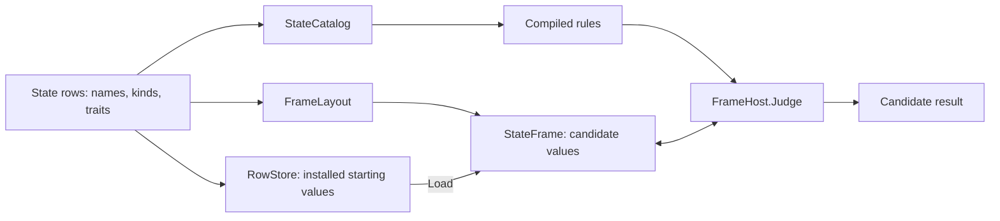

# Evaluate hypothetical state with frames

A **frame** is a candidate store of values arranged for repeated evaluation.
It lets the same compiled rules answer “What would happen if this piece moved?”
without changing the installed rows. A frame is the basis of the quick-start
example, transaction rollback inside `FrameHost`, and [search](search.md).

## Separate the definition from the candidate

The catalog gives the compiler stable addresses within one declaration set.
The layout assigns the cells that can be framed to positions in storage.
Loading the frame supplies their initial values. Evaluating changes the frame;
it does not replace the authored rows or perform the host's installation work.

For example, an installed `coins` slot can stay at 2 while a frame's candidate
becomes 3. Loading that frame again from the unchanged `RowStore` returns it
to 2. Copying a frame gives another candidate with the same layout; changing
the declaration shape requires rebuilding the matching layout and catalog.

## Decide whether a rule can be judged in a frame

| Requirement | Frame behavior |
|---|---|
| Read and write an existing numeric cell | Supported through the matching layout and catalog. |
| Read Text or a host field row | Reads through to the underlying cells; no private framed storage for those rows. |
| Maintain an inverse board after a token move | Updates the old and new occupancy cells. |
| Move membership between supported ordered zones | Uses the frame's current membership. |
| Remove a keyed cell or consume a generator draw | Refused. |
| Fire a registered host-specific effect | Skipped by `FrameHost`. |
| Evaluate host-only operands | Requires a host that supplies those facts; a plain frame cannot invent them. |

A judge that relies on a skipped effect cannot prove the move would succeed
in the real host. Inspect `HostOnly` and `ReadsHost` facts when admitting
rules to search, and restrict candidates to the supported transforms listed below.

## Rewind only the writes made in a scope

A frame's **undo journal** remembers the cells a preflight scope changed.
Ending the scope restores those cells; committing keeps them. Nested scopes
can therefore explore a candidate and return to their own starting point
without making a whole-frame copy for each effect.

A rewind also changes row versions. Otherwise, an evaluator could see the
same version number after values had changed and accidentally reuse an answer
from the abandoned candidate.

## Understand the two kinds of remembered state

`RuleLatch` holds both firing history and scheduling caches, but only the
firing history affects the simulation's meaning.

| Remembered information | Why it exists | Persistence |
|---|---|---|
| Edge gate state | Know whether this is a new crossing | Hash and checkpoint it in a continuing simulation. |
| Last seen row versions | Prove input rows have not changed | Rebuildable cache. |
| Memoized binding values | Avoid recalculating an unchanged expression | Rebuildable cache. |

A **row version** is a change counter, not a timestamp. A write to any framed
cell in the row changes the version. An unchanged version can prove ordinary
stored values unchanged; it cannot prove the answer to a tick-dependent or
host-dependent read unchanged.

Scheduling can reuse a previously closed gate or a binding only when all
tracked dependencies prove safe. An open gate still runs, as does a traced
evaluation. An advance or cycle trait, `$tick`, an unresolved row, or a host-only read
prevents that proof. This makes scheduling an optimization of the same answer,
rather than another rule execution policy.

## The store and the frame

`StateStore` provides the stored values under a section's row definitions.
`RowStore` reads the section's cells through `IRuleReader.Store`.
`StateFrame` uses positions established by `FrameLayout`:

| Row shape | Framed representation |
|---|---|
| Slot or keyed row | Numeric cells at fixed layout positions. |
| Board | Values indexed by topology cell ordinal. |
| Ring | History values and cursor. |
| Ordered zone | Count, member ordinals in pile order, and member values up to capacity. |
| Text or field row | Read through to the underlying cells. |

A transfer changes the frame's zone membership. `StateStore.CellCount` and
`TryKeyAt` enumerate that live membership for counts, filtered reductions,
and `$match` words. Arrangement rank instead reads the zone's stored domain
positions directly through `StateFrame.TryZoneOrdinals`, carrying the resolved
row ordinal from the operand. It therefore avoids converting positions to keys
and back again. The document-store path retains its existing key-based lookup.

`TryZoneOrdinals` exposes those positions in current pile order as a borrowed
span. Consume it before the frame is written, loaded, copied, rebound, or
rewound. Ranking supports at most 20 members, even when the zone itself is larger.

### Reuse domain positions within one binding

Each frame lazily builds a key-to-position dictionary for each token domain
its zones use. `Load` shares that dictionary across zones. `ZonePosition` uses
it to find a token's domain position, then searches for that position in the
zone's current pile order. Domain position and pile position are distinct:
moving a card between piles changes its membership without changing its identity.

Domain keys and their order must remain unchanged until `Rebind`. Rebinding
retains frame values but clears built dictionaries, preserving their allocated
capacity for lazy rebuilding. A rebuilt dictionary needs more storage only when
its domain outgrows that capacity. These dictionaries belong to the frame's
current binding, because a shared layout can still fit rows with different keys
or a different domain order.

### Keep compiled addresses aligned with replay

Handle reads and writes use document-lane row ordinals checked against the
catalog's row names. A pre-resolved mutation address must match its row and key
strings, which the host retains for replay.

Both `pushState` and the `push` transform retain their compiled row handle
through frame application; the replay transform retains its row name.
Compilation refuses a missing push handle. Evaluation throws if a compiled
write or push handle identifies a different destination. Cell counts,
filter-key indexes, and row-version checks also use ordinals when available.

The layout records which rows have time traits. Reads by key or position skip
trait metadata when there is none; board reads still check empty-cell presence.

### Apply candidate changes

Frame values copy with one span copy. A frame refuses a key outside its layout.
It applies `boardCombine`, `writeSet`, `push`, `clearEnclosed`, and
`transfer` densely. Transfer can select first, last, or a key; it cannot draw.

`boardCombine`, `writeSet`, and `clearEnclosed` still resolve row names
inside the frame; dense storage does not remove every lookup.

An inverse board is never written directly. `FrameLayout` resolves its
token and code row ordinals once. A token write recomputes only the old and
new board cells. `DerivedBoards.Compose` provides the equivalent
whole-document result for a host composing an installation candidate.

### Judge and rewind

`FrameHost` implements `IRuleHost` with its own evaluator and latch.
`Judge` evaluates the supplied rule array as one tick with every edge
initially closed. Host-specific effect arms are skipped.

Preflight uses `BeginJournalScope`, `RewindJournalScope`, and
`CommitJournalScope`. The journal records only cells actually written in
the scope, so rewinding does not copy the whole frame or touch unrelated cells.

`OperandFact.HostOnly`, `KeyFact.HostOnly`, `EffectFact.ReadsHost`,
and `RuleDataflow.ReadsHost` identify dependencies a plain frame cannot answer.

## Scheduling

`StateFrame` increments a row's version on cell writes, whole-span transform
writes, and journal rewinds. `IRuleReader.TryRowVersion` exposes that version
by handle. Its default implementation cannot prove anything unchanged, so
evaluation proceeds. `FrameHost` reports framed versions and refuses version
queries for Text and field rows.

### Build the dependency proof

`RuleSchedule.Build` is cached per compiled rule and binding through
`CompiledRule.Schedule` and `CompiledRuleBinding.Schedule`. It runs against
the fully constructed rule, including a host's `CollectReads` override.

The schedule collects row handles and checks for dependencies that versions
cannot cover: `RuleDataflow.ReadsHost`, `RuleDataflow.ReadsTick`,
unresolved rows, and slot or keyed `StateAdvance`/`StateCycle` traits.

A `$bind:` read includes the source binding's dependencies transitively.
`BindingOperand.Source`, `CollectReads`, and `HostOnly` carry that
information. Chaining bindings cannot hide a volatile source.

### Reuse an answer only within its owner

`RuleEvaluator.SchedulingEnabled` defaults to true. It permits reuse of a
previously closed gate and of memoized binding values when every dependency's
version matches and no volatile dependency remains. Open gates and traced
evaluations run fully.

Caches live in `RuleLatch`, per rule and iteration binding, and belong to the
exact `RuleSchedule` instance that captured them. Recompiling a rule under
the same name creates a new schedule, so the old cache cannot match by name alone.
These caches never enter `AppendStateHash`, `Flatten`, or `Restore`:
they save recomputation without changing the answer.

---

[State and rules](../state.md) · Next: [Draw reproducible values](generators.md)
