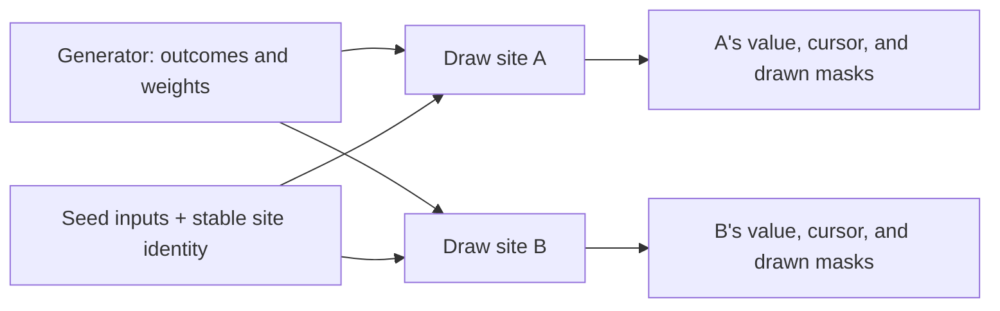

# Draw reproducible values

A **generator** describes how to choose a value. A **draw site** is the row
that consumes it and remembers its progress. Keeping those concepts separate
lets two dice use the same six-sided distribution without sharing a cursor.

## Share a distribution, keep separate histories

Drawing from B does not advance A. The source may be named in the document
or supplied inline; both forms use the same generator family.
`GeneratorEngine` derives a stream from seed inputs and the stable site
descriptor. A site's position in a list is not its identity.

The cursor counts consumed samples. The declared `Skip` is an initial seek
offset and does not rewrite that count. Sources have fixed generator work per
sample so a host can seek to a saved cursor rather than replay every earlier draw.
A Markov text emission can consume several samples because it chooses several
tokens.

## Decide what exhaustion means

For sources that support exhausting an entry set, the mode is an authored choice.

| Mode | After choosing an entry | When the set is exhausted |
|---|---|---|
| `WithReplacement` | It remains available | There is no exhaustion. |
| `WithoutReplacement` | Its unit is marked drawn | The emission refuses. |
| `RestartOnExhaustion` | Its unit is marked drawn | Clear the mask and begin another pass. |

A mask records which units were consumed, not just the last displayed value.
Two sites can show the same value while having different possible next draws.
Persist the masks and cursor with the site's value.

## Choose when drawing is allowed

`DrawTiming.Boot` is the settle-at-first-fill path. `TickPeriod` and `Event`
permit later `generate` effects. These names do not install a scheduler:
ordinary rules decide when a period or event calls for another draw.

Sources include numeric ranges, weighted numeric outcomes, raw stream draws,
bounded text transitions, and the extended generator vocabulary. For text,
a Markov source chooses an alternative in the current context and follows its
declared next context; reaching a context with no alternatives ends the emission.
`GeneratorCapacity` bounds the work and sizes.

The range source deliberately uses a fixed-work multiply-high mapping rather
than a variable-length rejection loop. It is not exactly uniform for every
possible range size. Consult the source's API contract when that distinction
matters; reproducibility alone does not establish a distribution's properties.

## Separate a real draw from a possible outcome

A host applies a `Mutation` of kind `MutationKind.Generate` and installs the
resulting value and bookkeeping together. A scoped judge refuses generator mutations.
Search can instead receive a bounded, precomputed
[chance-outcome table](search.md#account-for-chance) and evaluate hypothetical
outcomes without consuming the live site's history.

## Authored randomness

Authored randomness uses `Draw`/`DrawTiming` to describe the draw site,
`StateGenerator` with its context/alternative/weighted-outcome rows,
`GeneratorMode`/`GeneratorSource`/`GeneratorCapacity`, `ClosedBitset256`
(drawn masks), and `GeneratorEngine` (the seed ladder, the fixed-cost
advance-per-sample seek, every source's emission).

---

[State and rules](../state.md) · Next: [Search possible moves](search.md)
