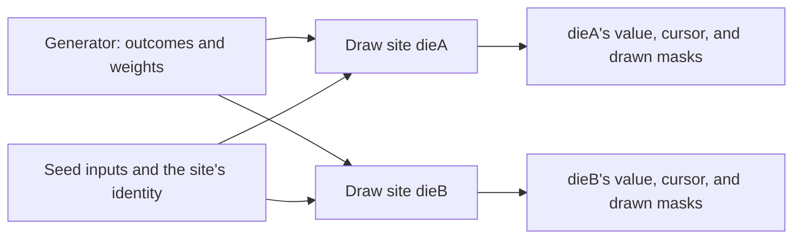

# Generators and draw sites

Puck's randomness is authored and reproducible. A **generator** describes how to
choose a value; a **draw site** is the state row that receives the value and
remembers how far it has drawn. This article explains how to declare both, how a
site is seeded and resumed, what each source family draws, and how a rule or a
host fires a draw. After reading it, you can add dice, loot tables, shuffles, and
generated text to a world and know which values they will produce on every run.

## Share a distribution, keep separate histories

Two dice in the running card game share one six-sided distribution:

```puck
generators [
  {
    name: "d6"
    generator {
      source: UniformRange
      rangeMin: 1
      rangeMax: 6
    }
  }
]

state {
  world {
    slot rollRequested = 0
    row {
      name: "dieA"
      kind: "Int"
      draw { source: "d6" timing: "Event" }
    }
    row {
      name: "dieB"
      kind: "Int"
      draw { source: "d6" timing: "Event" }
    }
  }
}

rule roll {
  when rollRequested == 1
  mode: Edge
  generate(row: dieA)
}
```

`d6` is declared once in the document's `generators` section. Each die is a draw
site: a row with a `draw` facet naming the source. The sites share the source's
shape, and each keeps its own position. Rolling `dieA` doesn't advance `dieB`, and adding a
third site that names `d6` can't change the sequence either die produces.

The following diagram shows what each site combines to produce its values:



A site's value, its **cursor** (how many samples it has consumed), and its
**drawn masks** (which entries it has used up) live in the arena beside the row.
The source holds no position at all.

## Declare a source

A `Draw` facet names either `source` (a `GeneratorRow` in the
document's `generators` section) or `generator` (an inline source). Both forms
compile to the same `StateGenerator` record, so every source can be written
either way:

```puck
row {
  name: "startingGold"
  kind: "Int"
  draw {
    generator {
      source: "UniformRange"
      rangeMin: 10
      rangeMax: 20
    }
  }
}
```

A document declares at most 256 named sources. A reference that names a source
that doesn't exist, a source whose output the site's kind can't hold, or a source
the site's timing can't drive is refused when the document is validated.

The two forms differ in one practical way. The arena sizes a site's mask storage
from its declaration, and it doesn't read the `generators` section, so a site
that names a source reserves room for the maximum of 256 drawn masks (8 KiB),
while an inline source reserves only the masks it can use.

## Source families

`GeneratorSource` names one of five shapes. Each reads its own fields and
refuses fields that belong to another shape.

| Source | Fields | Writes | Advances per sample | Can exhaust |
|---|---|---|---|---|
| `Markov` | `start`, `bound`, `contexts`, `mode` | `Text` | 2 per token | Yes, per context |
| `UniformRange` | `rangeMin`, `rangeMax` | `Int` or `Fixed` | 1 | No |
| `WeightedNumeric` | `weighted`, `mode` | `Int` or `Fixed` | 2 | Yes |
| `StreamDraw` | none | `Int` or `Fixed` | 1 | No |
| `SymmetryOrbit` | `ring`, or `node` with optional `word`; `mode` | `Int` or `Fixed` | 2 | Yes |

A Markov source writes a `Text` site, and every other source writes an `Int` or
`Fixed` site. `GeneratorEngine.TryCheckTargetKind` makes that check, and
document validation, a rule's `generate` at compile time, the boot resolver, and
the live draw all call it, so they can't disagree.

- **`UniformRange`** draws one value from the closed range `rangeMin..rangeMax`.
  Both bounds are present or neither, both lie in the signed 32-bit range, and
  both are in the destination's raw encoding (raw Q48.16 bits for a `Fixed`
  site), because a source isn't bound to one site's kind.
- **`WeightedNumeric`** draws one of its `weighted` outcomes with an alias table.
  Each outcome has a raw `value`, a `weight` (at least one nonzero), and an
  optional `multiplicity`. It declares at most 256 outcomes.
- **`StreamDraw`** is one raw, unshaped 32-bit draw widened into the site's raw
  value. It's the entropy a [shuffle or random transfer](transforms.md) samples.
- **`SymmetryOrbit`** draws one node of the symmetry lattice: one of the 30 nodes
  of `ring` (0 to 7), or the orbit of `node` (0 to 239) under `word`, a list of
  one to eight mirror nodes. With no word, the orbit is the node's ring. An `Int`
  site stores the node index; a `Fixed` site stores it as a whole number, the
  phase a cycle trait reads.

### Generate text with a Markov source

A Markov source walks weighted transitions between named contexts:

```puck
generators [
  {
    name: "greeting"
    generator {
      source: Markov
      start: open
      bound: 4
      contexts [
        {
          key: open
          alternatives [
            { token: "Well" weight: 1 next: who }
            { token: "Oh" weight: 2 next: who }
          ]
        }
        {
          key: who
          alternatives [
            { token: "traveller." weight: 1 next: end }
            { token: "friend." weight: 1 next: end }
          ]
        }
        { key: end }
      ]
    }
  }
]
```

One emission starts at `start`. In each context it picks an alternative by
weight, appends the alternative's token, and moves to its `next` context. A
context with no alternatives is terminal and ends the emission. The tokens are
joined with single spaces, so this source writes text such as `Oh friend.` into
a `Text` site. The current context is all the walk remembers, so a chain that
needs more history encodes it in its context keys.

Each token is one sample, so an emission of three tokens advances the cursor by
three. A walk that has emitted `bound` tokens (1 to 256) without reaching a
terminal context refuses the whole emission rather than truncating it. A source
holds at most 64 contexts, a context at most 256 alternatives, and a token at
most 64 characters; the joined text is bounded by the row's text ceiling.

### The range source's mapping

`UniformRange` maps one raw 32-bit draw onto the range with a multiply-high:
the offset is `((n × draw) >> 32)` for a range of `n` values. That costs one
generator advance, so every sample costs the same and the cursor stays
seekable. The trade-off is uniformity. Each outcome claims either ⌊2³²/n⌋ or
⌈2³²/n⌉ of the 2³² possible draws, a relative deviation of at most n/2³², and
none when `n` divides 2³². A six-sided die is off by less than two parts in a
billion. Reproducibility doesn't prove a distribution's properties, so when that
bound matters, check it against your range.

## Seeds, cursors, and seeking

Every site draws from its own `Pcg32XshRr` stream. `GeneratorEngine.ComputeSeedState`
folds four rungs, in order, into the stream's starting state:

1. an engine constant that no document can change, so these streams can't
   collide with another seeded system over the same document values;
1. the document seed, the author's lever for rerolling every site at once (in
   Puck.World, `generation.worldSeed`);
1. the running instance's identity, so several instances of one document draw
   differently while each stays reproducible;
1. the site descriptor, which separates one site from another.

Each text rung is folded with its length first, so no two different rung
sequences produce the same input. The stream id comes from the site descriptor
alone (`ComputeStreamId`), masked to 16 bits; two sites that share a stream id
still have different seeds.

The site descriptor is the site's **identity**, which stays the same when other
sites come and go. A position in a list would move whenever a site is added,
removed, or settled, silently re-pointing a live site's stream while its cursor
kept counting. `ArenaEffectHost.DrawSite` reads the site table the host was
constructed with (its `sites` parameter), or the row's catalog name when there's
no table. Every host that draws for one document, including a search host, takes
the same table, so a site draws the same stream wherever it fires. Puck.World
builds its table with `WorldDrawSites.Of`, which names a document row's site
`state.<row>` so it can't collide with a site of another kind.

A host folds its seeds once, when it's built: `ArenaDrawSeeds` folds the first
three rungs once and each site descriptor once, and keeps each site's
`DrawSeed` (its starting state and stream id) by catalog ordinal. A draw reads
that pair instead of hashing the instance identity and the descriptor again, so
its cost doesn't depend on how long either string is.
`GeneratorEngine.ComputeDrawSeed` returns the same pair for one site.

**Seeking.** Every source costs a fixed number of generator advances per
sample, so resuming a site at cursor *c* is one jump of `(skip + c) × advances`,
and the earlier draws aren't replayed. A rule that redraws a site every tick
costs the same at cursor 1,000,000 as at cursor 0. The cursor counts samples
from zero. A site's `skip` is an authored, non-negative seek
offset: the site starts `skip` samples into its stream, and `skip` never changes
the persisted cursor.

## Decide what exhaustion means

`WeightedNumeric`, `SymmetryOrbit`, and each context of a `Markov` source draw
from a set of **units**. An entry contributes `multiplicity` units (one by
default), and a set holds at most 256 units. The `mode` says what drawing does to
that set, and it defaults to `WithReplacement`:

| Mode | After a unit is drawn | When every unit is drawn |
|---|---|---|
| `WithReplacement` | It stays available; a multiplicity only scales its weight. | The set never exhausts. |
| `WithoutReplacement` | It's marked drawn for this pass. | The emission refuses. |
| `RestartOnExhaustion` | It's marked drawn for this pass. | The mask clears and the draw continues from the full set in the same emission: a shuffle bag. |

The marks are the site's **drawn masks**, each a `ClosedBitset256` with one bit
per unit: one mask per context for an exhausting Markov source, and one for an
exhausting numeric or orbit source. A mask records every unit consumed in the
current pass, so two sites can show the same value and still have different
possible next draws. Persist the masks with the cursor and the value; the arena
does this for you. A site that reserves fewer masks than its source
needs refuses to draw.

An exhausting draw still costs two advances, whether it draws from the
full set or from the undrawn remainder, so seeking stays exact.

## Choose when a site draws

A site's `timing` is a `DrawTiming`:

| Timing | First fill | Later redraws |
|---|---|---|
| `Boot` (the default) | Draws once. | Refused. The value is settled. |
| `TickPeriod` | Draws once. | Allowed through `generate`. |
| `Event` | Draws once. | Allowed through `generate`. |

**First fill** is the host's job. Puck.World draws every site once when a world
instance first fills its state (at load, or at a fresh `world.instance.start`)
and settles a `Boot` site into a literal, which is why a `Boot` site has no
cursor left to advance ([State in Puck.World](worlds.md) covers the world's
side). `TickPeriod` and `Event` behave the same; they record the author's
intent. Neither installs a scheduler: an ordinary rule decides when a period has
passed (`$tick >= nextRoll`) or an event has happened.

## Draw from a rule

The `generate` effect redraws one site. It names only the row, because a site's
source is its own facet:

```puck
rule roll {
  when rollRequested == 1
  mode: Edge
  generate(row: dieA)
}
```

The compiler refuses `generate` with `RuleRefusal.GeneratorUnknown` when the row
declares no draw, when the site's timing is `Boot`, or when its source doesn't
resolve, and with `StateCellUnaddressable` when the source can't write the row's
kind. At runtime, the effect reaches the host as a `Mutation` of kind
`MutationKind.Generate`. The host resolves the source, fires one emission, and
installs the value, the advanced cursor, and the updated masks together.
`ArenaEffectHost` writes the value into the site's slot cell. A draw always
counts as movement, even when it repeats the value the cell already held,
because the cursor moved.

Because the cursor and masks are ordinary arena state, a draw inside a firing
that rewinds is rewound with it: the next draw produces the same value again.
The same holds for a draw inside a transaction's failed savepoint.

A host decides how an emission lands on other kinds of site. Puck.World also
supports keyed sites, which draw one sample per cell, and board rows painted by
a draw; see [State in Puck.World](worlds.md).

## Fire a draw from C#

`GeneratorEngine` is a pure function of what you give it. This fragment rolls a
six-sided die three times at one site:

```csharp
var d6 = new StateGenerator(Source: GeneratorSource.UniformRange, RangeMin: 1, RangeMax: 6);
var seed = GeneratorEngine.ComputeSeedState(documentSeed: 42UL, instanceIdentity: "table-1", site: "dieA");
var stream = GeneratorEngine.ComputeStreamId(site: "dieA");

for (var cursor = 0L; cursor < 3L; cursor++)
{
    if (GeneratorEngine.TryFire(
            generator: d6, targetKind: CellKind.Int, seedState: seed, stream: stream,
            cursor: cursor, masks: null, result: out var roll, reason: out var reason))
    {
        Console.WriteLine($"roll {cursor}: {roll.Numeric}");
    }
}
```

`TryFire` returns a `FireResult`: the text or the number, the samples consumed
(the amount the cursor advances), and the masks to persist. Running it again
with the same inputs prints the same three rolls. `ArenaDraws.TryFire` does the
same against an arena, from the site's `DrawSeed`: it reads the site's cursor and masks from the arena's
columns, draws, and writes the advanced cursor and masks back through the arena.
It doesn't write the drawn value; install `result.Numeric` or `result.Text` into
the site's cell yourself. Call it inside a journal scope when the draw should
rewind with a refusal.

`GeneratorEngine.TryResolveSource` resolves a `Draw` to its source; validation
and every firing path share that resolution. `AdvancesPerSample` returns a
source's fixed cost, and `MasksAfter` says which masks a site keeps after an
emission, so a site whose source stops exhausting sheds the masks its previous
source left.

## Draw a whole field at once

`GeneratorEngine.TryFireBatch` fills a span with consecutive samples of a
numeric source: cell *k* receives the sample a single draw at cursor + *k* would
produce, with an exhausting source's mask threaded from cell to cell. One pass
over a field is one run of the site's stream. `TryAdvanceBatch` consumes the same
samples without writing values, to compute the masks a pass leaves, and
`TryCheckBatchCapacity` checks that a pass can complete from the current masks.
A Markov source is refused in a batch.

When the number of samples isn't known in advance, open a stream instead.
`ArenaDraws.TryOpen` seeks the site once at the cursor the arena holds and
returns a `GeneratorEngine.DrawStream`; each `TryNext` draws the sample a single
draw one cursor further on would produce, in constant work, and
`ArenaDraws.TryClose` stores the advanced cursor and masks. Nothing is written
between the open and the close. A random `transfer` and a `shuffle` draw
through a stream, so a 104-card shuffle seeks once and then takes 103 generator
steps. An extended source draws in place from its cached generator, so no other
draw of the same source may run while its stream is open.

## Keep draws private

A site may declare a `secret`, a 256-bit key the authority provisions before
simulation. Each sample of a secret site is an HMAC-SHA256 of the seed, the
stream id, and the cursor under that key, so a client that knows the document
and the seed still can't predict the draws. The secret is never sent in
observations. A secret site must be an `Int` site over a `StreamDraw` source
drawn `WithReplacement`, and neither `skip` nor an `extended` table applies to
it. The cursor still addresses every sample directly, so resuming stays
constant-time.

## Extend a source's equidistribution

A source's `extended` facet replaces its self-seeded generator with a
`Pcg32Extended` table of `k` words, a power of two from 2 to 4,096. A site
drawing from it is equidistributed in *k* dimensions rather than one. You author
either the whole `table`, or a `script` of up to `k` values in the source's own
output space that becomes the site's first draws, in order, after which the site
continues like a normally seeded one. Only `StreamDraw` and `UniformRange` accept
a script, because only they map one wanted value back to one raw draw. The
engine caches the built generator beside the cursor it matches, so a site drawn
every tick draws in place without rebuilding the table.

## Enumerate what a source can produce

`TryEnumerateOutcomes` returns every distinct value a numeric source can
produce, and `TryEnumerateEmissions` every distinct text a Markov source can
produce, independent of seed, cursor, and masks. Weights aren't read, so a
zero-weight entry still counts as possible. Both refuse rather than truncate: an
enumeration past its ceiling, a Markov graph with a cycle, and a `StreamDraw`
source (whose band is the whole 32-bit range) each refuse with a reason. Analysis
tools use these to prove what a drawn field can hold.

## Draws and search

A search judge evaluates rules against candidate positions inside a scope it
always rewinds. A `generate` inside a judge fires against the candidate and is
rewound with it, so the live site's cursor is untouched when the search ends.
That draw doesn't predict the live one; in Puck.World the search host names its
sites differently from the live host.

To reason about what a draw might produce, a search job declares a **chance
row**: its own `UniformRange` or `WeightedNumeric` generator is baked into a
bounded outcome table, and the search evaluates each outcome with its weight
instead of sampling. [Search](search.md) describes chance nodes.

## Penrose patches

`PenrosePatch` cuts a connected patch out of a Penrose rhomb tiling. `TryDraw`
picks the start tile with a `UniformRange` draw on the site's own seed ladder and
grows the patch breadth-first to the requested tile count, so one seed yields one
board. A patch answers each tile's rhomb kind, the two ribbons running through
it, and the thin chain it belongs to, and it can emit each of those as a
generated board row. `TryDescribe` describes a tiling's whole patch without a
draw. It lives in this project because it needs both the tiling generator and
the seed ladder.

## Tables

`Puck.State.Generators` also holds `TableDocument` and `CompiledTable`, the
static lookup tables a document pins and a rule reads with `$table:`.
[Reads and expressions](expressions.md) describes them.

## Limitations

- **A range draw is nearly uniform.** The multiply-high map is off by at most
  n/2³² per outcome, the price of a fixed-cost, seekable draw.
- **Bounded sources.** A document declares at most 256 sources; a Markov source
  at most 64 contexts of 256 alternatives each and 256 tokens per emission; a
  weighted source at most 256 outcomes; a range bound fits in 32 bits; and a
  drawn set holds at most 256 units.
- **Timing is intent.** `TickPeriod` and `Event` don't schedule anything; a rule
  must fire `generate`.
- **One value per emission.** A library host writes a site's slot cell. Keyed and
  board sites depend on the host.
- **Secrets are narrow.** Only an `Int` `StreamDraw` site drawn with replacement
  can be private.

For the reasoning behind the fixed-cost draw and the 256-unit masks, see [State
and the authoring language: decisions](../../decisions/state-and-language.md).

## Key types

| Type | Project | Purpose |
|---|---|---|
| `Draw`, `DrawTiming` | `Puck.State` | A draw site's facet and when it may draw. |
| `StateGenerator`, `GeneratorRow`, `GeneratorSource`, `GeneratorMode` | `Puck.State` | An authored source, its named row, its shape, and how it consumes entries. |
| `GeneratorContext`, `GeneratorAlternative`, `GeneratorWeightedNumeric`, `GeneratorExtended` | `Puck.State` | The parts of a source. |
| `GeneratorCapacity` | `Puck.State` | The source ceilings. |
| `ClosedBitset256` | `Puck.State` | A drawn mask, and a site's secret. |
| `GeneratorEngine`, `GeneratorEngine.DrawStream` | `Puck.State.Generators` | Seeding, seeking, every source's emission, and a site's samples drawn in order after one seek. |
| `DrawSeed`, `ArenaDrawSeeds` | `Puck.State.Generators` | A site's starting state and stream id, and a host's table of them folded once. |
| `ArenaDraws` | `Puck.State.Generators` | A site's cursor and masks read from and written to the arena. |
| `PenrosePatch` | `Puck.State.Generators` | Seeded Penrose tiling patches. |
| `TableDocument`, `CompiledTable` | `Puck.State.Generators` | Pinned lookup tables. |

## Next steps

- [State transforms](transforms.md): shuffle a pile or transfer a random card
  with a stream draw site.
- [Rules and firing](rules.md): gate a redraw on a clock or an event.
- [Search](search.md): plan moves over the outcomes of a chance row.
