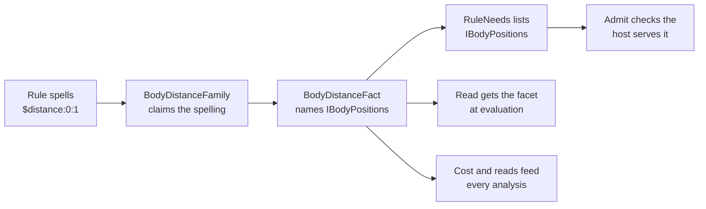

# Host and extend the state engine

A **host** is the application code that runs the state engine: it owns the
arena, decides which rules run and when, admits and installs changes, and
persists what matters. An **extension vocabulary** teaches the rule compiler
facts and effects only that application understands. This article shows how
the engine and a host divide the work, which interfaces a host implements, how
to add a new operand without touching the engine, and what a host must save
for a checkpoint. It's for developers building a host, such as a headless card
game resolver, or extending Puck.World's own.

## Divide the work between the engine and your host

The state libraries hold no world, body, or wire concept. A host brings those,
and supplies every decision about authority and delivery.

| The state engine supplies | Your host supplies |
|---|---|
| Rows, cells, the catalog, and the arena with its write path, envelopes, and journal | The document model and its complete validation |
| Compilation and evaluation of rules | Which rules run, in what order, and the simulation tick |
| One journal scope per firing, with a preflight protocol for effects that leave the arena | Who may make a change, installation outside the arena, journaling of the document, and delivery |
| Search over candidate scopes | Which rules a candidate may run, and how a search's answer is installed |
| Generator mechanics and draw-site seeding | Stable seed inputs and where draws are persisted |
| Latch, search, and pool checkpoint structures | One consistent checkpoint of all authoritative state |

Every write reaches the arena through the arena's own write checks, so a row's
envelope, overflow policy, eviction, and symbolic domain are decided the same
way whoever asks. The engine doesn't decide whether the asker was allowed to
make the change. Your host makes that authority check, and it should apply the
same check to a console command and to a rule-driven change, because compiling
an effect doesn't give it any authority.

## Start from `ArenaEffectHost`

The smallest host is `ArenaEffectHost` in `Puck.State.Rules`. It's a complete
`IEffectHost` for rules that read and write the arena and nothing else: the
state-only game with no document project behind it. It serves draws, arena
transforms (`IArenaTransformHost`), and retained-turn undo (`IArenaUndoHost`),
and it refuses any registered arm it doesn't know.

This fragment assumes a compiled `section`, its `catalog`, and a set of
compiled rules named `rules`. It evaluates them once per simulation step.

```csharp
using Puck.State;
using Puck.State.Rules;

var arena = new StateArena(catalog: catalog, section: section, time: ArenaTime.Origin);
var host = new ArenaEffectHost(arena: arena, ticksPerSecond: 30);
var evaluator = new RuleEvaluator(host: host);
var latch = new RuleLatch();

for (var tick = 1UL; tick <= 300UL; tick++) {
    // Engine ticks run at 50,400 per second; one 30 Hz step spans 1,680 of them.
    host.Advance(tick: tick, engineTick: (tick * 1_680UL));
    _ = evaluator.Evaluate(rules: rules, latch: latch, stepTicks: 1_680UL);
}
```

`Advance` moves the tick pair every read answers as of. The evaluator never
advances time itself: rules in one step are a sequence, and a committed firing
is visible to the next rule's gate. A host owns one `RuleEvaluator` and one
`RuleLatch` per family of rules it evaluates. Puck.World keeps separate latches
for its rules and its interactions.

When you need more, derive from `ArenaEffectHost` (its members are virtual) or
implement the interfaces yourself:

- **`IStateReader`** is what every operand reads through: the arena, the
  catalog, the tick pair, the evaluation's bound keys and locals, and scratch
  space. Every member is read on the tick path and allocates nothing.
- **`IEffectHost`** widens the reader with `Apply`, which runs library-owned
  writes, and `Fire`, which runs the effect arms your host registered.
- **`IRuleOwner`**, **`IRuleRefusalSink`**, and one **facet** per family of
  host facts are optional. The sections below cover each.

## Serve host facts through facets

A **facet** is an interface, marked with `IFacet`, that your host implements to
answer reads only it can answer: a body's position, a region's occupants, a
clock. A compiled fact names the facet it needs as the type argument of its
base class: `OperandFact<TFacet>`, `EffectFact<TFacet>`, or `KeyFact<TFacet>`.
The evaluator hands the facet to the fact as a typed argument, so a fact can't
reach a capability it didn't declare.

The compiler reads each rule's facets off those declarations into its
**`RuleNeeds`**, together with whether it reads the tick, which host-owned rows
it reads, and whether any effect is irreversible. A fact author can't add to or
remove from that list by hand; it follows from the fact types.

Before a host evaluates a rule, usually when it installs the rule set, it calls
`RuleNeeds.Admit(needs, reader, out refusal)`. This check is called
**admission**. It asks `IStateReader.Advertises<TFacet>()` for each facet in the
order the compiler found them, and refuses with the first facet the host
doesn't serve: "the host does not serve the facet 'IBodyPositions'". A missing
capability shows up as a named refusal when the rules are installed, instead of
as a failure partway through a tick. The search host advertises no facets,
which is how a search refuses judge rules that read host-only facts (see
[Search](search.md#what-a-scoped-judge-can-evaluate)).

> [!NOTE]
> `IStateReader` has no accessor that returns a facet by type. A fact reaches
> its facet through the typed argument its base class passes it, and the only
> facet question a reader answers is `Advertises<TFacet>()`.

## Implement the mutation boundary

One rule firing is one journal scope on the arena. Your host takes part at a
fixed set of points in that firing, and each point has one job.

| Member | When it runs | What your host does |
|---|---|---|
| `Apply(in Mutation, out EffectRefusal)` | For every library-owned write, inside the open scope | Runs the write through your own write path. A later read in the same firing sees it, and a refused firing rewinds it. Return `false` with no refusal when the write was admitted but left the cell as it was. |
| `Preflighting()` | Before a firing's queued arms are checked | Resets whatever you carry from one arm's preflight to the next. |
| `Fire(effect, firing with Preflight = true, …)` | For each arm that leaves the arena, in authored order | Judges the arm against the state the firing proposes, including what earlier arms of the same firing would leave. Acts on nothing. |
| `PrepareTransactional(firing, …)` | Once, after every preflight passes, before the commit, if any transactional arm was queued | Decides everything that can refuse the transactional arms as one unit. A refusal rewinds the firing. |
| `Committed(scope)` | Once the scope commits | Observes the commit. |
| `CommitTransactional(firing)` | After `Committed` | Installs the prepared unit. It can't refuse. |
| `Fire(effect, firing, …)` | After the commit, for each delivered arm, in authored order | Acts. A refusal here is one counted refusal that undoes nothing. |

Your host doesn't need its own copy of arena state to judge a firing against,
because the firing's open scope already holds the proposed writes. The two
kinds of arm that leave the arena, and what each may promise, are explained
with a sequence diagram in [Rules and firing](rules.md#effects-that-leave-the-arena).
A host with no transactional arm keeps the default `PrepareTransactional` and
`CommitTransactional`, which do nothing.

The default `IEffectHost.Fire` refuses every arm with
`StateEffectRefusal.ArmUnbound` and names the arm's kind, so an arm your host
doesn't serve shows up as a counted refusal.

> [!IMPORTANT]
> `CommitTransactional` must not fail. Put every check that could refuse the
> unit in `PrepareTransactional`, where the firing can still rewind. That's what
> lets transactional arms share the firing's all-or-nothing promise.

## Publish arena changes in one place

During a tick, the arena is the authoritative state. Some parts of your
application keep their own copy of a state value: a cached gate, a physics
input, a UI binding. Update those copies in one **publication** routine that
runs when the arena's changes are installed, and end every value mutation in
that same routine. Don't update a copy at one of the places a value can arrive
from (a rule effect, a console write, a search landing), because the next
entry point you add will miss it.

Row versions make publication cheap. A row's version moves only when a commit
leaves its bytes different, so a publication can read back only the rows whose
version moved since the last one (`IStateReader.TryRowVersion`) and keep the
rest. Build the proposal in a step that installs nothing, and have a preflight
judge that same proposal, open scope included, so what was judged is what gets
installed.

Puck.World's publication is `WorldServer.PublishArena`, which ends in
`WorldDocument.ReconcileStateConsumers` (see [State in Puck.World](worlds.md)).
For the reasoning behind the single boundary, see decision D4a in
[State and the authoring language: decisions](../../decisions/state-and-language.md).

## Serve rows from your own storage

A **host-owned row** has a descriptor in the catalog and no storage in the
arena. Your host serves it through a facet instead. Rules may read it, and no
rule writes it. Only slot-shaped and lattice-shaped rows can be host-owned,
because a host can serve those without an ordering contract.

`StateRow.HostOwned` has no wire form. A document project derives it; Puck.World
marks every row carrying the physical `field` trait as host-owned. Because the
arena stores nothing for these rows:

- the arena's own hash skips them, so your host folds them into its state hash
  and checkpoint;
- a rule that reads one records it in `RuleNeeds.HostOwnedRows` and is
  volatile, so the scheduler never reuses its closed verdict;
- a retained-turn undo group may not include one, since the arena can't rewind
  it.

## Evaluate rule kinds only your host understands

Implement **`IRuleOwner`** when your host has rule kinds the library doesn't
evaluate itself. Before evaluating a rule, `RuleEvaluator.EvaluateRule` offers
it to `TryEvaluateOwn`. Return `true` to claim it; return `false` to let the
library evaluate it once, or once per key of the row it iterates.

When you claim a rule, run each evaluation back through
`RuleEvaluator.EvaluateOnce(rule, latch, bindings, binding, stepTicks, out
applied)`. That keeps the latch, the trace, and the refusal ledger one
mechanism. Puck.World claims its interactions and its decisions this way. For
an evaluation that binds pool instances, `TrySetInstanceBinding` and
`ClearInstanceBinding` set a lexical instance register around the call.

## Receive refusals

The evaluator keeps an exact, saturating count of every runtime refusal
category in its ledger. Implement **`IRuleRefusalSink`** to hear about the
first occurrence of each category through `RefusalRecorded`. Narrate the
refusal at that moment, so a Level rule that refuses every tick doesn't produce
an unbounded stream of messages. Read the running counts back from the ledger; Puck.World's
`world.rule.failures` verb reads them.

## Extend the vocabulary

You extend the compiler by registering families and deriving from its types.
You don't edit the state libraries themselves.

### Register families

A **`RuleVocabulary`** holds the families your document project adds. The
compiler consults registered families before its own. Build one vocabulary per
project and share it across every compile.

| Family | Registers | Compiles to |
|---|---|---|
| `OperandFamily` | The reserved spellings it answers (`Spellings`, quoted in refusals) | An `IRuleOperand`, or `false` to let the next family try |
| `KeyFamily` | A dynamic cell-key spelling beside the library's `$cell:` and bound keys | A `CompiledCellRef` |
| `EffectFamily` | An `ActionEffect`-derived record and its `$type` discriminator | An `IRuleEffect` |
| `PredicateFamily` | An `ActionPredicate`-derived record and its discriminator | One `GateToken`; it may refuse where the arm isn't allowed |

Registering an effect family says nothing about transactions. The compiled
effect declares its own needs instead. Every firing is one journal scope, so an
effect whose work the scope can't rewind declares `EffectNeeds.Irreversible`,
and also `EffectNeeds.Transactional` if the host commits it together with the
firing. The compiler queues such an arm instead of running it in place, and
the firing sequence decides when it's checked and delivered.

Install `RuleVocabulary.ExtendJson` as a `JsonTypeInfo` modifier in your
document serializer's options. It appends the registered effect and predicate
arms to `ActionEffect`'s and `ActionPredicate`'s polymorphism, so newly
authored arms read and write under their discriminators.

### Derive the compile context

Derive **`RuleCompileContext`** to anchor what only your document knows. Two
members are virtual:

- `FindTopology(name)` finds a discrete topology. Puck.World overrides it to
  anchor the topology in the frame a placement declares.
- `FindDraw(row)` finds the draw a `generate` effect redraws through. Puck.World
  overrides it to answer a row painted by a lattice fill.

A family can cache per-compile data in `Scope`, which the compiler clears
between rules. Puck.World's derived context is `WorldFactsCompileContext`.

### Override a compiled rule's analyses

`CompiledRule` is a non-sealed record. A document project's rule overrides
`CollectReads`, `CollectWrites`, `Cost`, and `CostBreakdown` to add the branches
it alone carries, and every analysis follows: scheduling, hazards, work
budgets, and search judge scoping all read those answers.

> [!WARNING]
> A read or write your fact leaves out of `CollectReads` or `CollectWrites` is
> invisible to scheduling. The scheduler may then reuse a closed verdict after
> the state it depended on changed, and a search judge can drop a rule that
> mattered. Report every cell a fact touches, using a `CellAccess` with the
> invalid key when you can't name the cell.

### Add row and topology cases

A polymorphic base declared in `Puck.State` lists only the cases the state
library owns. `LatticeTopology` has grid, ring, hex, box, graph, and tiling;
Puck.World adds `WorldFieldTopology` under the `field` discriminator through its
own JSON modifier. `StateRow` is non-sealed on the same terms: derive a row to
add traits, and derive `StateRowJsonConverter<TRow>` to write its members at the
converter's two hook points.

### The fact families

A compiled **fact** is an object that answers a read or describes an effect.
There are two families, each a class hierarchy a host can extend.

| Family | Core cases in `Puck.State.Rules` |
|---|---|
| `IRuleOperand` | `StateCellOperand`, `LocalOperand`, `TableOperand`, `TickOperand`, `ReductionOperand`, `SymmetryOperand`, `BoardOperand`, `PhaseOperand`, `PatternOperand`, `HistoryOperand`, `InstanceFieldOperand`, `StaticInstanceFieldOperand`, `VectorCallOperand`, `SearchPlyOperand` |
| `IRuleEffect` | `WriteEffect`, `GenerateEffect`, `RemoveStateCellEffect`, `ScheduleStateEffect`, `TransactionEffect`, `TransformStateEffect`, `PushStateEffect`, `IfEffect`, `RewindGroupEffect`, `ClaimEffect`, `ReleaseEffect`, `ClaimPairEffect`, `ForEachPoolEffect`, `InstanceFieldWriteEffect`, `StaticInstanceFieldWriteEffect`, `InstanceFieldScheduleEffect`, `InstanceFieldVectorWriteEffect`, and the vector effects (`VectorCopyEffect`, `VectorMixEffect`, `VectorMeanEffect`, `VectorNearestEffect`, `VectorRememberEffect`) |

Operands implement `Read(IStateReader)` and report what they read through
`CollectReads`. Effects report what they read and write through `CollectReads`
and `CollectWrites`. Both report a `Cost`, and every access is a `CellAccess`. Key resolution has a third, smaller family,
`IRuleKey`, with the core cases `LocalKeyFact` and `ZoneEndKey`.

Each family's cases are sealed classes. Nothing at runtime compares two
operands or two effects for equality, and a union boxes its stored case on
write anyway, so record or struct value semantics would add cost without a
benefit. `src/Puck.State/Union.cs` supplies the `[Union]` attribute, which marks
a closed case set (for example `ArenaSearchWrite` and the `Mutation` carrier),
and the `IUnion` interface, whose `Value` exposes a carrier struct's live case.

## Example: add a distance operand

Suppose a board game host wants a rule to compare the distance between two
pieces: `when $distance:0:1 <= 2`. The state engine has no positions, but a host
can register an operand family for the spelling.



The family recognizes and validates the spelling at compile time. It produces
a fact whose type names the facet it needs, so the rule's needs list that facet
and admission refuses a host that doesn't serve it. At evaluation, the fact
reads through the facet the evaluator passes it, and the ordinary gate, latch,
trace, and refusal machinery uses the answer. The fact's cost and read set feed
the work budget, scheduling, and hazard analysis.

This is a sketch: it follows the shape of Puck.World's own `$distance:` operand
(`BodyDistanceOperand` in `Puck.World.Schema`) but hasn't been compiled as
written.

```csharp
using Puck.Maths;
using Puck.State;
using Puck.State.Rules;

// The facet: reads only this host can answer.
public interface IBodyPositions : IFacet {
    FixedQ4816 Distance(int bodyA, int bodyB);
}

// The compiled fact. Its type argument is its facet, so RuleNeeds records IBodyPositions.
public sealed class BodyDistanceFact(int bodyA, int bodyB) : OperandFact<IBodyPositions>(valueKind: CellKind.Fixed), IRuleOperand {
    public override RuleWork Cost(IRuleCostContext context) => 1L;
    public override RuleFact Read(IStateReader reader, IBodyPositions facet) => RuleFact.Finite(value: facet.Distance(bodyA: bodyA, bodyB: bodyB));

    // Admission proved the host serves the facet before any rule naming it ran.
    RuleFact IRuleOperand.Read(IStateReader reader) => Read(reader: reader, facet: (IBodyPositions)reader);
}

public enum DistanceRefusal : byte {
    Malformed,
}

// The family: claims $distance:<a>:<b> and leaves every other spelling to the next family.
public sealed class BodyDistanceFamily : OperandFamily {
    public override IReadOnlyList<string> Spellings { get; } = ["$distance:<a>:<b>"];

    public override bool TryCompile(StateChannelRef reference, StateChannelRef? cell, in OperandSite site, RuleCompileContext context, out IRuleOperand? fact) {
        fact = null;

        if (reference.Call is not { Channel: "distance" } call) {
            return false;
        }

        RuleCompiler.RefuseKeyOnReservedChannel(key: cell, ruleName: site.RuleName, name: reference.Spelling, keyFieldLabel: site.KeyFieldLabel);

        if ((call.Count != 2) || !int.TryParse(s: call.Text(index: 0), result: out var bodyA) || !int.TryParse(s: call.Text(index: 1), result: out var bodyB)) {
            throw new RuleException(refusal: DistanceRefusal.Malformed, ruleName: site.RuleName, detail: $"'{reference.Spelling}' does not spell '$distance:<a>:<b>'");
        }

        fact = new BodyDistanceFact(bodyA: bodyA, bodyB: bodyB);

        return true;
    }
}

// The host: an arena host that also serves the facet.
public sealed class BoardHost(StateArena arena, FixedQ4816[,] distances) : ArenaEffectHost(arena: arena), IBodyPositions {
    public FixedQ4816 Distance(int bodyA, int bodyB) => distances[bodyA, bodyB];
}
```

To use it:

1. Build `new RuleVocabulary(operands: [new BodyDistanceFamily()], effects: [],
   predicates: [], keys: [])` once, and pass it to every `RuleCompileContext`.
2. Compile rules as usual with `RuleCompiler.Compile`.
3. Before evaluating, call `RuleNeeds.Admit(rule.Needs, host, out var refusal)`
   for each rule. A `BoardHost` passes, because it implements `IBodyPositions`.
   An `ArenaSearchEffectHost` doesn't, so a search refuses a judge that reads
   `$distance:`.

A fact that reads a facet makes its rule volatile: the scheduler can't prove the
answer unchanged from row versions, so it always re-evaluates the rule. An
effect family follows the same path through `EffectFamily` and
`EffectFact<TFacet>.TryFire`, with its `Needs` declaring whether it's
irreversible or transactional.

## Save meaning, rebuild acceleration

A consistent checkpoint captures everything whose loss would change what the
simulation does next, and nothing that can be rebuilt from it.

| Save | Rebuild |
|---|---|
| Every row's stored cells, and the time-trait state that goes with them | Compiled catalogs and compiled rules |
| The simulation tick and engine tick | Rule schedules (`RuleSchedule`) |
| Edge latch bindings (`RuleLatch.Flatten` and `Restore`) | Row-version marks and memoized binding values |
| Draw cursors and drawn masks | Search judges and resolved plans |
| Pool snapshots, including dead-slot generations | The arena's scratch and the evaluator's per-call buffers |
| Rule-group progress and retained turns | |
| Search progress (`ArenaSearch.Capture`), transposition tables included | |
| Your host's own authoritative state and seed identities, and any host-owned rows | |

Keep lifetimes aligned. A `StateInstanceHandle` belongs to the catalog that
minted it, so persist a pool instance by pool name, slot, and generation, and
mint a new handle after resolving the name in the current catalog. A cached
scheduling answer belongs to the exact compiled schedule that captured it, and a
row version belongs to the arena that counted it. When you replace the arena
with an equivalent layout, call `RuleLatch.InvalidateScheduler`: it keeps every
edge-held binding and forgets the version observations, which describe an
arena that no longer exists.

## Limitations

- Nothing in the state engine checks authority. A host that skips its
  authority check for rule-driven changes gives rules more power than the
  console has.
- A delivered arm's refusal can't undo the firing it belongs to. Only
  transactional arms share the all-or-nothing promise.
- A fact that under-reports its reads or writes makes scheduling and search
  scoping unsound, and no analysis can detect the omission.
- Rules in one step run as a sequence in document order, and each rule sees the
  firings committed before it. A host that wants a different order reorders the
  rules; the engine doesn't solve for one.

## Key types

| Type | Project | Purpose |
|---|---|---|
| `IStateReader` | `Puck.State` | What every operand reads through. |
| `IEffectHost` | `Puck.State` | The reader plus `Apply` and `Fire`. |
| `Mutation` | `Puck.State` | One library-owned write, addressed by ordinal and key. |
| `EffectFiring`, `EffectRefusal`, `EffectNeeds` | `Puck.State` | How an effect fires, why it didn't, and what it needs. |
| `IFacet`, `FacetRef` | `Puck.State` | A host capability and its named reference. |
| `OperandFact<TFacet>`, `EffectFact<TFacet>`, `KeyFact<TFacet>` | `Puck.State` | Fact bases that declare their facet by type. |
| `RuleNeeds`, `RuleNeedsBuilder` | `Puck.State` | What a rule needs from its host, and admission. |
| `ArenaEffectHost` | `Puck.State.Rules` | A complete arena-only host to start from. |
| `RuleEvaluator`, `RuleLatch` | `Puck.State.Rules` | Evaluation and per-family edge memory. |
| `IRuleOwner`, `IRuleRefusalSink` | `Puck.State.Rules` | Host-owned rule kinds and first-refusal notification. |
| `RuleVocabulary`, `OperandFamily`, `KeyFamily`, `EffectFamily`, `PredicateFamily` | `Puck.State.Rules` | Registration of a document project's families. |
| `RuleCompileContext` | `Puck.State.Rules` | The compile context a project derives. |
| `CompiledRule` | `Puck.State.Rules` | A compiled rule whose analyses a project can extend. |
| `IRuleOperand`, `IRuleEffect`, `IRuleKey` | `Puck.State.Rules` | The compiled-fact families. |
| `UnionAttribute`, `IUnion` | `Puck.State` | Markers for a closed case hierarchy. |

## Next steps

- [Rules and firing](rules.md): the firing sequence and the promise each kind
  of arm makes.
- [Rule analysis, scheduling, and work budgets](analysis.md): what your facts'
  read sets and costs feed.
- [State in Puck.World](worlds.md): a full host built on these interfaces.

## See also

- [Search](search.md)
- [The state arena](arena.md)
- [State and the authoring language: decisions](../../decisions/state-and-language.md)
