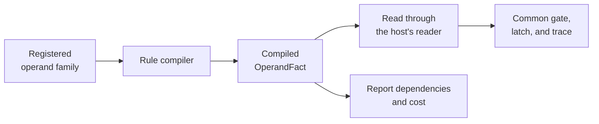

# Host and extend State

A **host** connects the state evaluator to a running application's storage,
admission rules, and persistence. An **extension vocabulary** teaches the
compiler about facts and effects that only that application can understand.
A headless card-game resolver and Puck.World can share the state engine while
making different choices at those boundaries.

## Assign each responsibility

| State supplies | The application supplies |
|---|---|
| Row and cell vocabulary, shared read/write helpers | Its document model and complete validation. |
| Compilation and evaluation of registered rules | Which rules run, their order, and the simulation tick. |
| State-neutral mutations and a preflight protocol | Admission, installation, journaling, and delivery. |
| Frame evaluation and search | Which rules are safe for candidates and how results are applied. |
| Generator mechanics | Stable seed inputs, draw-site state, and installation of draws. |
| Latch and search checkpoint structures | A consistent checkpoint of all authoritative state. |

## Implement the mutation boundary

`TryApply` has two meanings selected by `preflight`. In preflight it validates
and composes a private candidate; outside preflight it performs the application's
normal installation. Later reads within a scope must see the candidate already
composed by earlier effects.

`BeginPreflight` opens a nested scope. `EndPreflight` discards it and restores
the previous view. `TryCommitPreflight` installs the whole candidate as one
mutation; a scope containing no changes installs nothing.
The [transaction diagram](rules.md#make-several-effects-succeed-together)
shows the evaluator's use of this protocol.

Use the same admission and write composition rules for external commands and
rule-driven mutations. The evaluator compiling an effect does not grant it
authority. Apply capacity checks, value envelopes, FIFO eviction, time-trait
rebasing, and journaling through the application's chosen mutation boundary.

## Add a concept without forking the evaluator

Suppose a host wants a rule to read the distance between two bodies.
The core library has no bodies, but the host can register an operand family:

1. The family recognizes the reserved spelling and validates it at compile time.
2. It produces an `OperandFact` with the correct kind, read dependencies,
   cost, and host-only classification.
3. At evaluation, that fact reads through the host's extended reader interface.
4. The common gate, latch, trace, and refusal machinery uses the answer.

An effect family follows the corresponding path to an `EffectFact` and
`FireEffect`. Explicit transaction admission is part of its contract.
A compiled fact's read/write sets matter beyond evaluation: hazard checks,
work budgets, scheduling, and frame suitability depend on them. Omitting a
dependency can make a later analysis reach the wrong conclusion.

The registration and derivation points are specified below. JSON registration
belongs to the document's serializer as well as its compiler so newly authored
arms can round-trip under their declared discriminators.

## Save meaning, rebuild acceleration

A consistent host checkpoint includes current rows, time-trait state, the
simulation tick, continuing Edge latches, draw cursors and masks, and active
search progress where used. Add any host-specific authoritative state and
seed identities needed for continuation.

Compiled catalogs, rule schedules, row-version snapshots, and memoized bindings
can be rebuilt from their inputs. Keep their lifetimes aligned: a handle belongs
to the catalog that minted it, and a cached scheduling answer belongs to its
exact compiled schedule.

## Diagnose order and cost before scaling up

`RuleDataflow` describes what a rule reads and writes. `RuleHazards` identifies
order-sensitive read/write and write/write pairs. A hazard explains why moving
one rule before another could matter; it is not automatically an invalid program.

`RuleWorkBudget` estimates bounded work, including gate checks for rules whose
effects do not fire. Proven mutually exclusive gates can share effect allowance.
These are heuristic work units. They are not measured CPU cycles and do not
establish a wall-clock latency guarantee.

## How a document project extends it

Extension is by registration and derivation, never by an edit inside this
package:

- A `RuleVocabulary` registers the families a document project adds: an
  `OperandFamily` claims the reserved spellings it answers and compiles them
  to its own `OperandFact`s; an `EffectFamily` owns an `ActionEffect`-derived
  arm, its `$type` discriminator, its explicit `AllowsTransaction` admission,
  and its compile to an `EffectFact`; a `PredicateFamily` owns a predicate arm
  (which may refuse in rule scope); a `KeyFamily` answers a dynamic-key
  spelling with a `KeyFact`. Registered families are consulted before the
  library's own. `RuleVocabulary.ExtendJson` is the `JsonTypeInfo` modifier a
  document project's serializer installs so the registered arms read and
  write under their discriminators.
- A `RuleCompileContext` is derived to anchor what only the document knows
  (`FindTopology` in a placement's frame, `FindDraw` through a lattice fill)
  and to carry the per-compile scope the families cache into.
- A host implements `IEffectHost` — `IStateReader` widened with the arena
  door (`Apply`, journalled by the firing's own scope), `Fire` for the effect
  arms it registered, and `Committed` — plus `IRuleOwner` for the rule kinds
  only it understands (which run each evaluation back through
  `RuleEvaluator.EvaluateOnce`, so latch, trace, and ledger stay one mechanism)
  and `IRuleRefusalSink` for the refusal ledger. It implements one facet
  (`IFacet`) per family of facts it serves; a compiled fact receives the facet
  its own declaration names. A host owns one `RuleEvaluator` and one
  `RuleLatch` per family it evaluates.
- `CompiledRule` is non-sealed: a document project's rule overrides
  `CollectReads`, `CollectWrites`, and `Cost` to add the branches it alone
  carries, and every analysis follows.
- A polymorphic base declared here (`LatticeTopology`) lists only the cases
  this package owns; a document adds its own case as a derived record through
  the same modifier. `StateRow` is non-sealed on the same terms, with
  `StateRowJsonConverter<TRow>` as its converter base.

## What stays a host's

Applying a `Mutation` against a row—eviction, a numeric upsert's
advance/dynamics rebase, envelope validation, the journal—is each host's
door; the pieces are here (`StateArena`, `StateAdvance`,
`StateRow.ClampToEnvelope`), the pipeline is not. Pairwise interactions and
timed decisions are host-evaluated kinds until a pair domain over rows is
designed.

## Analyses

Compiled facts support `RuleDataflow` (a rule's read and write sets), `RuleHazards`
(the write-after-read and write-after-write pairs document order decides,
skipping pairs whose gates pin one cell to disjoint ranges), and
`RuleWorkBudget` (the pinned-cell exclusion trie, contributor lines, writer
counts, gate/expression/effect costs) over the facts' own answers. A non-board
pattern is priced by its source row's declared capacity times one match step
plus the actual per-token expression cost, with saturating arithmetic.
Its read set includes the source, attribute row, key indirection, and token
expression dependencies.

## Work budgets

Rule budgeting currently uses heuristic work units. `RuleCost` separates the
checks every candidate may perform from effects that fire, allowing mutually
exclusive effects to share a budget without discarding closed-gate work.
`CostModel` defines a portable abstract service policy. Its coefficients are
read from the reference schedule's one owning evidence manifest,
`src/Puck.State/ReferenceSchedule.json`, which pins the offline evidence
targets, the per-target instruction service, the reference kernels with the
source digests their evidence was read against, and the memory-service profile.
`ReferenceSchedule.OperationCostBound` answers a reference-cycle price only for
an operation the manifest prices, and `CostBound.Unmodeled` with the recorded
reason everywhere else; the memory coefficients are unmodeled throughout, so
`CostModel.MemoryCycles` prices only a proved empty operation. Heuristic
weights cannot be converted to reference cycles, and admission still runs on
them. The [costing brief](../../plans/abstract-machine-costing.md) describes
the evidence needed before cycle-based admission.

A document meets two real limits. `RuleCapacity.MaxWorkUnitsPerTick` bounds the
static work one tick may do. `ArenaCapacity.MaxBytes` (64 MiB) bounds what the
document's state may occupy: `ArenaLayout.Bytes` measures every column at its
full width, with the change stamps and indexes beside them, and a section that
lays out past the ceiling is refused at the row that crossed. `world.state`
prints the measure beside the ceiling. While scopes are open, the undo record
they hold is bounded too (`ArenaCapacity.MaxJournalBytes`, 16 MiB): a firing
whose writes pass it is refused as `JournalCeiling` and rewound. The counts
beside these, `StateCapacity.MaxRows` (1,024) and the rest, bound what one
declaration may ask for, and each names the storage it sizes. None is a
fixed-size buffer or a per-world tunable. Several content lanes that each fit
comfortably under both limits in isolation can still sum past one or both once
merged into a single document — a document-capacity collision the per-lane work could not
see, not a defect in any one lane's own design. The fix for a genuine
collision is to widen the ceiling that was hit, never to cut a lane to fit
under an unchanged one.

## Where the rest lives

The world's registered families (`WorldFactsVocabulary`, `WorldFactsCompileContext`,
`IWorldFacts`), its rule and decision records, and the validators live in
[`src/Puck.World.Schema`](../../../src/Puck.World.Schema/README.md); `WorldRuleHost` is the
host (`WorldRuleHost.cs` in
[`src/Puck.World.Server`](../../../src/Puck.World.Server/README.md)).
`tests/Puck.State.Tests` proves the expression syntax, the function families,
the hex topology, the evaluator, and the search runtime over a headless host
(a row list, no world); the converter and schema facts that need the world
document's JSON context stay in `tests/Puck.World.Schema.Tests`. The `search`
document section (`WorldSearchSection`/`WorldSearchRow`/`WorldSearchShape`)
and the compiler that resolves it into a `SearchPlan` (`WorldSearchCompilation`,
reading the document's placements and topologies to fill in what a row leaves
implicit) live in `src/Puck.World.Schema`; `WorldServer` holds the runtime and
translates its landed `ArenaSearchWrite`s into the world's own mutation door
(`WorldServer.cs`, `WorldTick.Step.cs` in
[`src/Puck.World.Server`](../../../src/Puck.World.Server/README.md)); the game laws that
boot a server stay in `tests/Puck.World.Tests`.

---

[State and rules](../state.md) · [State test suite](../../../tests/Puck.State.Tests/README.md)
