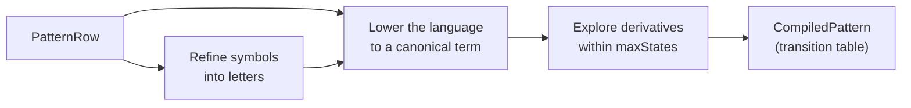

# Patterns

A pattern describes a sequence of values the way a regular expression describes
text. Rules use patterns to ask questions such as "does this ray of discs end in
one of mine?" or "are these cards a run?" This article explains how you declare
a pattern, what sequence a pattern reads, what a match answers, how a pattern
compiles into a small state machine, and where its limits are. It's for authors
writing board and card rules and for host developers who run patterns from C#.

## Declare a pattern

In the running example, the board holds 1 for the player's own discs and 2 for
the opponent's. A move is legal along a ray when the ray starts with one or more
opponent discs and then reaches one of the player's own:

```puck
pattern line: Int {
  symbols {
    mine = 1
    theirs = 2
  }
  match: theirs+ mine any*
}
```

A pattern has three parts:

1. A **kind**, `Int` or `Fixed`, which is the kind of the values it reads.
2. An **alphabet** of named **symbols**. Each symbol stands for one value
   (`mine = 1`) or an inclusive range (`low = 1..2`), written in the pattern's
   kind.
3. A **language**, written after `match:`, that combines symbols with sequence,
   choice, and repetition. `theirs+ mine any*` means one or more `theirs`, then
   one `mine`, then anything.

A rule then reads the pattern with `match`. This local counts the directions in
which a disc placed on the rook's cell would bracket opponent discs:

```puck
local brackets = match(line, board, any, count)[pieceCell[rook]]
```

`PatternRow` is the declaration as the document stores it, `PatternSymbol` one
symbol, and `PatternNode` the language tree. A document holds at most 256
pattern rows.

## Symbols and the refined alphabet

A value belongs to a symbol when it lies in that symbol's range, and symbols may
overlap. Before compiling, Puck **refines** the alphabet: it cuts the value line
into the maximal runs that fall inside the same set of symbols, and each run
becomes one **letter**. Values in no symbol share one more letter, the
remainder.

Consider this pattern over card ranks:

```puck
pattern pair: Int {
  attribute: "rank"
  maxStates: 16
  symbols {
    low = 1..2
    high = 2..4
  }
  match: low high | "high" low
}
```

Refinement gives four letters: 1 (only `low`), 2 (both `low` and `high`), 3 and
4 (only `high`), and every other value (the remainder). A 2 therefore matches
both `low` and `high`, consistently everywhere the pattern mentions them. An
alphabet holds 1 to 32 symbols, which cut the line into at most 63 interior runs
plus the remainder, so every letter fits one bit of a 64-bit mask.

A symbol name that collides with a reserved word (`any`, `empty`, `except`,
`none`) or isn't a bare identifier is written in quotes in the language, as
`"high"` shows.

## Where a pattern's values come from

A pattern reads a **word**: the whole sequence of values a source row produces.
Which values form the word depends on the source:

| Source | The word is | Key |
|---|---|---|
| A board row, one direction | The cells along the ray from the origin, excluding the origin, until the edge or a return to the origin. | The origin cell. |
| A board row, `any` | Each direction's ray, read separately. | The origin cell. |
| An ordered pile | One value per token in pile order, from an `attribute` row or a `value` expression. | Optional: the token the word starts at. |
| A keyed row | The row's own cells in cell order. | Optional: the token the word starts at. |
| A history ring | The ring's values from the oldest push to the newest. | None. |

A board ray or keyed row supplies its own values. A `Bool` source reads as Int 0
and 1. The source's kind must equal the pattern's kind.

A pile holds tokens, so a pattern over a pile must say which value each token
contributes. It names one of two sources, and validation refuses a pattern that
names both:

- **`attribute`** names a numeric row keyed over the pile's token domain. Each
  token's letter is its value in that row, and a token the row doesn't hold
  reads 0.
- **`value`** is an expression, in the pattern's kind, evaluated once per token
  in pile order. Inside it, `$token` keys the current token and `$previous` the
  token before it, and each must address a row keyed over the pile's token
  domain. `$previous` names no cell on the first token, so a read through it is
  absent there. An expression that fails on a token reads that letter as 0.

A `value` expression can combine several attributes into one letter, such as
`suit * 16 + rank`, or compare neighbors. This pattern accepts a run: any first
card, then one or two cards each one rank above the card before it.

```puck
pattern run: Int {
  value: "rank[$token] - (rank[$previous] ?? 0)"
  symbols {
    step = 1
  }
  match: any step{1,2}
}
```

The first token has no previous card, so `?? 0` makes its letter its own rank,
and `any` accepts it. How `??` and absent reads work is described in
[Reads and expressions](expressions.md).

## What a word matches

A pattern accepts or rejects the whole word. A pattern for two opponent discs
followed by one of yours accepts that three-value word. It doesn't accept a
longer ray that contains those values somewhere inside it. Say what
may come before or after with the language's own operators, as `any*` does at
the end of `line`.

When you need part of a word, use a facet that looks at prefixes or at
occurrences instead:

- The **longest accepted prefix** is the longest run from the start of the word
  that the pattern accepts.
- An **occurrence** is a non-empty stretch of the word the pattern accepts,
  found by trying each start in order and taking the longest accepted prefix
  there. Occurrences are numbered from 0 in start order, and they may overlap.

## Pattern operations

The language has these operations. The `.puck` column is the infix spelling
after `match:`; the document column is the node's JSON `$type`.

| `.puck` | Document | Accepts |
|---|---|---|
| `name` | `symbol` | One value in the named symbol. |
| `any` | `any` | One value, whatever letter it reads as, remainder included. |
| `except(name)` | `except` | One value outside the named symbol. |
| `a b` | `sequence` | Its items in order. |
| `a \| b` | `choice` | Any one of its alternatives. |
| `a & b` | `all` | A word every item accepts. |
| `~a` | `not` | A word the item doesn't accept. |
| `a?` | `optional` | Zero or one of the item. |
| `a*` | `star` | Zero or more of the item. |
| `a+` | `plus` | One or more of the item. |
| `a{m}`, `a{m,n}` | `repeat` | Between m and n repetitions of the item. |
| `empty` | `empty` | The empty word. |
| `none` | `none` | No word at all; the empty word is excluded too. |

Operators bind loosest first in this order: `|`, `&`, sequence, `~`, then the
postfix repetitions. Parentheses group. Because complement and intersection are
built in, "no two adjacent kings" or "holds a 2 and a 5" is one pattern, with no
rule arithmetic around it. `PatternSpelling` parses and prints this text; the
`.puck` `match:` line runs to the end of its line so that a `{m,n}` count can't
be mistaken for a block.

## Read a match

A rule reads a pattern with `match(pattern, row, …)`. The arguments after the
row choose a direction (board sources only), a facet, and an occurrence
ordinal; the key in brackets is a board source's origin or a word's start
token. The document stores it as `$match:<pattern>:<row>[:<direction>|:any][:<facet>][:<n>]`.

This fragment assumes the `line`, `run`, and `pair` patterns above, the `board`
and `pieceCell` rows from [Topologies and boards](topologies.md), a pile `hand`
over `cards`, and a rank row keyed over `cards`:

```puck
rule "read-patterns" {
  when coins > 0
  local isRun = match(run, hand)
  local runStart = match(run, hand, at)
  local brackets = match(line, board, any, count)[pieceCell[rook]]
  local directions = match(line, board, any, mask)[pieceCell[rook]]
  local reach = match(line, board, E, prefix)[0]
  local blocker = match(line, board, E, cell)[0]
  local secondAt = match(pair, hand, at, 1)
  result = isRun + runStart + brackets + directions + reach + blocker + secondAt
}
```

Every facet produces an Int:

| Facet | Sources | Result |
|---|---|---|
| (none) | All | 1 when the whole word is accepted, else 0. |
| `prefix` | One direction, or a word | The length of the longest accepted prefix; 0 when only the empty word is accepted; `-1` when no prefix is. |
| `cell` | One direction | The cell one step past the longest accepted prefix, which is the first cell the pattern rejects; `-1` when the whole ray is accepted. |
| `distance` | One direction | The step count to that cell; `-1` on the same terms. |
| `at`, `at, n` | One direction, or a word | Where occurrence `n` (default 0) starts: a board cell on a ray, or a zero-based position in a word; `-1` when it doesn't exist. |
| `length`, `length, n` | One direction, or a word | The length of occurrence `n`; 0 when it doesn't exist. |
| `mask` | `any` | A bitmask with bit d set when the ray in direction d is accepted. |
| `count` | `any` | How many directions' rays are accepted. |

Only `at` and `length` take an occurrence ordinal, and only `mask` and `count`
apply over `any`. A board origin that names no cell reads the empty word, which
the pattern decides like any other. A start token that isn't in the pile also
reads the empty word. A history ring takes no key.

A board ray's first blocker and its distance come from `cell` and `distance`,
and an n-in-a-row check is a run-length pattern read with the plain facet or
`prefix`. The pattern generalizes the blocking test from "the first occupied
cell" to any authored value range.

## How a pattern compiles

Each pattern compiles once into a `CompiledPattern`, a deterministic machine
that reads one letter per step with one table lookup. The following diagram
shows the stages.



The machine is built from the pattern's **Brzozowski derivatives**. The
derivative of a language by a letter is the language of whatever may still
follow once that letter has been read. Each machine state is one derivative:
the start state is the whole pattern, and reading a letter moves to the
derivative by that letter. A state accepts when its derivative accepts the
empty word.

To keep the number of states finite, terms are kept canonical: unions and
intersections are flattened, sorted, and deduplicated, empty languages are
absorbed, and letter sets are merged. This holds for every pattern, complement
and intersection included. The compiler explores derivatives breadth-first and
refuses the row when it needs more states than the row's `maxStates` (default
64, at most 1,024).

A compiled machine's table costs four bytes per transition plus one byte per
state, and all of a document's tables together may take at most 4 MiB.
`CompiledPatterns.TryCompileAll` compiles a document's pattern rows, reports
every refusal by row, stops at the row that crosses the table budget, and
refuses a duplicate name. Walking a word allocates nothing.

## Read a word

A `match` operand reads its word at every evaluation and walks it from the
first letter; nothing carries over between reads. Each letter is the cell's
live value at the evaluation's time, the same value any other rule read of that
cell sees, so a zone read through an attribute row that advances or cycles
matches on what the attribute holds now, not on its stored base.
`StateArena.ReadWord` reads a row's word at an `ArenaTime`, and
`ArenaBoards.TryReadRay` reads one ray of a board. Each fills a caller's buffer
and returns the filled part. The `world.match` console verb reads its word
through the same calls at the rule host's time, so it narrates what a rule
matches.

## Patterns in transforms

Two state transforms walk a pattern outward from an origin and change what they
find. `setRay` replaces the longest outward run a pattern accepts, excluding the
origin, and refuses when the accepted prefix is empty; Reversi uses it to flip
bracketed discs. `pushRay` moves a live pool token and the tokens ahead of it
one cell, using a `pushPattern` to select occupants that join the moving run, a
`stopPattern` to block it, and an overall `pattern` that must accept the mover,
the pushed occupants, and what they stop against. Both are described in
[State transforms](transforms.md).

## Cost of a pattern read

The work sheet prices a `match` from its source. A board source costs the
query's visit count plus one unit per cell. An `at` or `length` facet adds the
square of the longest ray in the read's direction, because it tries every start
along that ray; a read over `any` direction adds the cell count squared. A word
source costs the
row's capacity times one plus the value expression's cost, multiplied by the
capacity again for `at` or `length`. How those units are admitted is covered in
[Rule analysis, scheduling, and work budgets](analysis.md).

## Limitations

- A pattern reads Int or Fixed values only. `Bool` sources read as Int; `Text`
  and `Vector` rows can't be matched.
- An alphabet holds 1 to 32 symbols (`PatternCapacity.MaxSymbols`).
- A machine has at most `maxStates` states, and `maxStates` is at most 1,024
  (`PatternCapacity.MaxStates`). A pattern that needs more is refused.
- A `repeat` unrolls at most 128 copies (`PatternCapacity.MaxRepeat`).
- A document holds at most 256 patterns (`PatternCapacity.MaxRows`), and their
  tables together take at most 4 MiB (`PatternCapacity.MaxTableBytes`).
- A word is at most 4,096 letters (`PatternCapacity.MaxWord`), the size of the
  largest row, so every read is decided.
- A pile source needs an `attribute` or a `value`. A keyed row or history ring
  is read without either.

## Key types

| Type | Project | Purpose |
|---|---|---|
| `PatternRow`, `PatternSymbol` | Puck.State.Topology | A declared pattern and one symbol of its alphabet. |
| `PatternNode` | Puck.State | The pattern language tree. |
| `PatternSpelling` | Puck.State | Parses and prints the infix pattern language. |
| `PatternCapacity` | Puck.State | The pattern ceilings. |
| `CompiledPattern`, `CompiledPatterns` | Puck.State.Topology | A compiled machine, and every compiled pattern of a document. |
| `MatchFacet` | Puck.State | What a `match` operand answers about its word. |

## Next steps

- [State transforms](transforms.md): `setRay` and `pushRay`.
- [Topologies and boards](topologies.md): the boards a ray reads.
- [Reads and expressions](expressions.md): combine match results in a rule.
