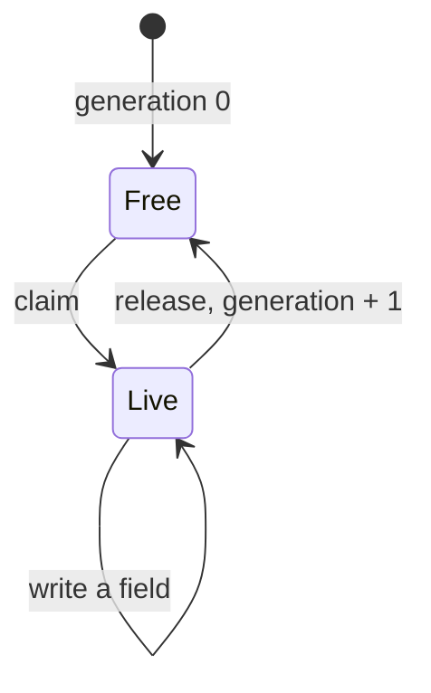

# Records, pools, and handles

Some game state doesn't fit a single row. A unit has health, a team, a name, and
a move count, and units come and go during play. A **record** groups typed fields
into one shape, and a **pool** holds a bounded set of live instances of that
record. This article explains how to declare records and pools, how instances
are claimed and released, how rules and C# hosts address them, and how pools are
saved and restored. It assumes you know [rows and cells](data-model.md).

## Declare a record and a pool

In the running example, the game fields a squad of units. Each unit has a team,
a name, hit points that regenerate, and a number of moves:

```puck
state {
  enum Team {
    Red
    Blue
  }

  record Unit {
    team: Team = Team.Red
    name: Text = "recruit"
    hp: Int bounds(0..10, overflow: Saturate) advance(perSecond: 1) = 10
    moves: Int bounds(0..3) = 3
  }

  pool units of Unit capacity(8) = [{ team: Team.Blue, name: "captain" }]

  world {
    slot coins = 3 bounds(0..99)
  }
}
```

This fragment declares:

1. `Unit`, a record with four fields. A field names its kind (`Int`, `Fixed`,
   `Bool`, `Text`, or `Vector`) or an enum, and can carry `bounds(...)`,
   `advance(...)`, `space(...)` for a vector field, and a default after `=`.
2. `units`, a pool of at most eight `Unit` instances.
3. One instance that starts live. The initial list seeds slots in order, so the
   captain occupies slot 0, and every field it doesn't mention takes the
   record's default.

A field with no default starts at its kind's zero value: `0`, `false`, or the
empty string. The catalog checks every default against its field when the section
compiles: the kind must match, an enum default must name a member, text must fit
1,024 code units, and a numeric or `Bool` default must lie inside the field's
bounds. An advancing field must be `Int` or `Fixed` with a positive denominator.

## Claim, release, and generations

A pool has a fixed number of **identity slots**, one per instance it can hold.
Each slot has a **generation**, a counter that tells one lifetime of the slot
from the next:



- **Claiming** chooses the lowest free slot, installs every field's default, and
  returns a handle carrying the pool, the slot, and the slot's current
  generation. A claim on a full pool is refused.
- **Releasing** removes the instance and advances the slot's generation by one.
  The slot keeps its generation while it's free.
- **Reclaiming** the same slot produces a handle with the new generation.

A handle from an earlier lifetime is **stale**. It can't read or write the
reclaimed slot, even though the slot number matches. That's what lets a rule hold
onto a unit and be sure it's still the same unit. A generation that reaches
`long.MaxValue` can't advance, so releasing that slot is refused and nothing
changes.

Instances never move. Each identity slot has a fixed storage position, and
presence bits mark which slots are live. Releasing slot 2 of 8 leaves a hole at
slot 2 and doesn't shift slots 3 through 7. Claim, release, and rewind journal
only the slot they touch, so their cost doesn't grow with the number of live
instances. Finding a free slot scans the occupancy words, 64 slots at a time.

## Use pools in rules

Rules reach pool instances through **bindings**, which are lexical names that
each hold a generation-checked handle, and through static slots such as
`units[0]`.

```puck
rule "recruit" {
  when coins >= 2
  coins += -2
  claim units as fresh {
    fresh.team = Team.Red
    fresh.hp = 6
  }
}

rule "wear-down" {
  when coins == 0
  for each unit in units {
    unit.hp += -1
    if unit.hp == 0 {
      release unit
    }
  }
}

rule "captain-bonus" {
  when units[0].moves < 3
  units[0].moves = 3
}
```

The rule forms are:

| Form | What it does |
|---|---|
| `claim pool as x { … }` | Claims a fresh instance, installs its defaults, then runs the body with `x` bound to it. |
| `release x` | Releases the instance `x` holds. |
| `for each x in pool { … }` | Runs the body once for each instance live when the loop starts. |
| `rule "r" for each x in pool { … }` | Evaluates the whole rule once per live instance. It can't be combined with a row `forEach`. |
| `x.field` | Reads or writes a field of the instance `x` holds. |
| `pool[slot].field` | Reads or writes a field of whichever instance occupies that slot now. |
| `count(pool)` | Reads how many instances are live. |
| `schedule pool[slot].field in 1s` | Writes a future tick into a field, like `schedule` on a row. |

### Bindings and atomic claims

A claim, including its body, is part of the rule's firing. If the pool is full,
if a body write is refused, or if anything later in the firing is refused, the
whole firing rewinds: the allocation, the generation, and every field go back to
how they were.

A binding exists only inside its body, and binding names can't shadow each other.
After `release x`, the compiler rejects any later use of `x` in that scope and
reports "pool binding 'x' is not live at this use". A rule can hold at most 32
bindings at once, counting nested claims and loops.

The two ways of naming an instance behave differently when a slot is reclaimed:

- **A lexical binding** (`fresh`, `unit`) holds a specific generation. A release
  and reclaim can't make it refer to the replacement; at runtime, releasing a
  stale binding refuses the firing.
- **A static slot** (`units[0]`) resolves the slot's current live generation on
  every read and write. Reading an empty slot reads as absent, and writing one
  refuses the firing.

A `for each` loop snapshots the live handles in ascending slot order before it
starts. It skips an entry that the body has released, and it never visits an
instance claimed during the loop, even one that reuses a released slot.

A binding's fields can key another row, on either side of an assignment:
`board[t.cell] = board[t.cell] | properties[t.noun]`. A key that reads a
binding is evaluated when its effect runs, once per instance, so it sees the
instance the loop or claim has bound.

### Pool fields in compiled documents

Pool field references stay typed when a document is compiled. The dotted source
spelling becomes a JSON object with separate members:

| Source | Compiled |
|---|---|
| `unit.hp` | `{ "binding": "unit", "field": "hp" }` |
| `units[0].hp` | `{ "pool": "units", "slot": 0, "field": "hp" }` |

Dotted strings exist only in source. Keeping the binding, field, and slot as
separate members preserves them through validation and decompilation. The
effects themselves compile to `claim`, `release`, `forEachPool`, and `claimPair`
entries, and a rule-level loop to a `poolForEach` member. In C#, a reference is a
`StateChannelRef` whose `PoolField` holds a `StatePoolFieldRef`.

### Text fields

A text field takes a literal write, or a copy from another text row or field.
This fragment assumes a text slot `lastName = ""` in the world's rows:

```puck
rule "name-recruit" {
  when coins == 10
  claim units as fresh {
    fresh.name = "squire"
    lastName = fresh.name
  }
}
```

If the source of a copy is missing or stale, the copy does nothing and the
destination keeps its value. Rules compare numbers only, so a gate or numeric
expression that reads a text field is refused, and so is `+=` on a text field.

### Work and pricing

Claims and releases are priced before a rule runs, in the same element
operations as every other effect: one per journal entry the fixed slot and each
field record, one per vector component, the occupancy-word scan, and, for a
release, the scan of dependent pair pools and each relationship it releases. A
text field is journaled by reference, so its length adds nothing to the price;
the journal's byte ceiling bounds it instead.
[Rule analysis, scheduling, and work budgets](analysis.md) explains the budget.

## Relationships with pair pools

A **pair pool** stores a record for a relationship between two live instances:
an alliance between two units, a card attached to a creature, a debt between two
players.

```puck
state {
  record Bond {
    strength: Int bounds(0..5) = 1
  }

  pairPool allies record Bond left units right units maxLive 16 directed false allowSelf false
}

rule "pair-recruits" {
  when coins >= 4
  coins += -4
  claim units as scout {
    claim units as guard {
      claim pair allies between scout, guard as bond {
        bond.strength = 2
      }
    }
  }
}
```

A pair pool declares the record, the pool each endpoint comes from, and the most
relationships that can be live at once. Claiming a pair requires both endpoint
handles to be live and to come from the declared pools.

### Pair identity

A pair's slot is computed from its endpoints' slots, so the same two instances
always map to the same pair slot: `leftSlot × rightCapacity + rightSlot`. The pool
has one identity slot for every possible pair, even though at most `maxLive` are
live.

- **Directed** pairs (the default) keep endpoint order, so (a, b) and (b, a) are
  different relationships.
- **Undirected** pairs (`directed false`) must use the same pool on both sides.
  The endpoints are put in slot order, so (a, b) and (b, a) are the same pair.
- **`allowSelf`** controls whether an instance can pair with itself. It's false by
  default.

A pair claim is refused when the pair already exists, when `maxLive` pairs are
live, when an endpoint is stale, or when it would pair an instance with itself
without `allowSelf`. Like any refusal, it rewinds the firing.

### Cascading release

Releasing an instance releases every pair it's an endpoint of, as part of the same
journaled operation. An endpoint pool can itself be a pair pool, so a relationship
can depend on another relationship; releasing an instance then releases the
pairs that depend on it, and the pairs that depend on those. The catalog refuses
a set of pair pools whose endpoint dependencies form a cycle.

## Identity universe and live capacity

Two limits apply to every pool, and they answer different questions:

| Limit | Ordinary pool | Pair pool |
|---|---|---|
| Identity universe | `Capacity`, 1 to 4,096. | Left capacity × right capacity, at most 4,096. |
| Live instances | Up to `Capacity`. | Up to `MaxLive`, 1 to the universe size. |

The identity universe sizes storage: one fixed position per identity slot in each
of the pool's rows. The live limit caps how many identities are present. Two
units pools of 64 each could form 4,096 possible pairs, which fits, while
`maxLive` might allow only 16 of them at once.

## Generated storage rows

The catalog expands each pool into ordinary rows the arena stores:

| Row | Holds |
|---|---|
| `$pool$units$live` | Membership: one cell per live slot, holding its generation. |
| `$pool$units$generation` | Every slot's generation, live or free. |
| `$pool$units$field$hp` (one per field) | The field's value for each live slot. |

Each name joins the pool's name and the part with `$`, the
[generated-name](../dsl.md#generated-names) joiner, so no pool, field, or pair
of them can generate another's row. A pool or record field whose own name
carries `$` is refused.

These rows are **generated** and protected:

- Authored rules, transforms, and search plans can't name them, including through
  a channel object. Use pool bindings, static slots, and pool iteration instead.
- Generic row writes and imports refuse them with "owned by a state pool".
- Positional reads and key lookups throw `InvalidOperationException`, because a
  pool row has identities rather than member positions.
- They're private to the authority, and the catalog preinterns every slot key,
  `0` through the universe size minus one.

Every generated row counts toward the section's 1,024-row limit: two per pool,
plus one per field. A pool whose name matches an authored row is refused, and so
is a generated name that collides with any other row. The compiler keeps the
generated rows by ordinal for handle evaluation, dataflow, and costing.

The catalog expands a section's pools once per section instance, so layout, rule
compilation, and admission all share one expansion. A replacement section gets its
own expanded values, even when its declaration shape is unchanged and the host
keeps its catalog. Checking whether the shape is unchanged reads the declarations
without expanding every slot, and loading the replacement still validates its
population.

## Work with pools from C#

A host addresses instances through `StateArena` and the handles it returns. This
program claims a unit, damages it, releases it, and claims the slot again:

```csharp
using Puck.State;

var section = new StateSection(
    Records: [new StateRecord(
        Name: CellName.Parse(candidate: "Unit"),
        Fields: [new StatePoolField(
            Name: CellName.Parse(candidate: "hp"),
            Kind: CellKind.Int,
            Default: CellValue.Int(value: 10L),
            Min: 0L,
            Max: 10L)])],
    Pools: [new StatePool(
        Name: CellName.Parse(candidate: "units"),
        Record: CellName.Parse(candidate: "Unit"),
        Capacity: 4)]);
var catalog = StateCatalog.Compile(section: section);
var arena = new StateArena(catalog: catalog, section: section, time: ArenaTime.Origin);

catalog.TryGetPool(name: CellName.Parse(candidate: "units"), pool: out var units);
var hp = units!.Fields[0].Ordinal;

arena.TryClaim(poolOrdinal: units.Ordinal, handle: out var first, reason: out var reason);
Console.WriteLine((first.Slot, first.Generation));   // (0, 0)

arena.TryWrite(handle: first, fieldOrdinal: hp, operand: -3L, write: StateWriteKind.Add, reason: out reason);
arena.TryReadLiveRaw(handle: first, fieldOrdinal: hp, time: ArenaTime.Origin, raw: out var health);
Console.WriteLine(health);                           // 7

arena.TryRelease(handle: first, reason: out reason);
Console.WriteLine(arena.TryReadLiveRaw(handle: first, fieldOrdinal: hp, time: ArenaTime.Origin, raw: out _));  // False

arena.TryClaim(poolOrdinal: units.Ordinal, handle: out var second, reason: out reason);
Console.WriteLine((second.Slot, second.Generation)); // (0, 1)
```

Each `Try` method returns false and a reason instead of throwing when it refuses.
Every claim, release, and write is journaled, so it rewinds with the scope the
caller opened. `TryClaimPair` claims a relationship from two live endpoint
handles.

### Read a field through a handle

Every handle read checks, through the arena's flat address table, that the handle
belongs to this arena's catalog, that its slot is live, and that its generation
matches. Then it addresses the field directly.

| Method | Returns | Use it for |
|---|---|---|
| `TryRead` | The stored `CellValue`. | Any field, including text and vector. |
| `TryReadLive` | The `CellValue` with the field's traits applied at a time. | A field with `advance`. |
| `TryReadLiveRaw` | The effective number at a time as a `long`. | Numeric fields, without building a carrier. |
| `TryReadVector` | The components as a span. | Vector fields. |

The number read returns the value in the field's own kind (raw Q48.16 bits for a
`Fixed` field, 0 or 1 for `Bool`), and refuses text and vector fields. It uses
the same evaluator as the carrier read, so a field without a trait reads its
stored number at any time. A vector span is
invalidated by a relayout or a structural edit of the pool.

The write methods mirror the reads: `TryWrite` with a `CellValue`, `TryWrite` with
a number and a `StateWriteKind`, `TryWriteLive` to write against the effective
value and rebase its clock, and `TryWriteVector`. `TryResolvePoolSlot` returns the
handle of whatever lifetime occupies a slot now.

### Iterate live instances

- `CellCount` on the pool's membership row returns how many instances are live.
- `TryNextCell` visits the held cells of any row in ascending slot order, starting
  from cursor zero and skipping holes, without allocating. A structural change or
  relayout invalidates the cursor.
- `CopyPoolSnapshot` copies the live handles in slot order into storage you own.
  It returns the count, or the required count as a negative number if your
  storage is too short. `SnapshotPool` returns the same handles as a new list.

```csharp
var live = new StateInstanceHandle[units.Capacity];
var count = arena.CopyPoolSnapshot(poolOrdinal: units.Ordinal, destination: live);

foreach (var unit in live.AsSpan(start: 0, length: count)) {
    arena.TryReadLiveRaw(handle: unit, fieldOrdinal: hp, time: ArenaTime.Origin, raw: out var unitHp);
}
```

Copy the handles before you change membership. Releasing inside a loop over a
live cursor invalidates the cursor; a snapshot stays valid, and its stale entries
fail to resolve.

## Timed fields

A numeric field can declare `advance(perSecond: ...)`, as `hp` does. Each live
instance has its own clock, born when the instance is claimed. `TryClaim` and
`TryClaimPair` take an `ArenaTime` to stamp that clock; the overloads without one
use time zero. Writes through rules rebase the clock the same way they do for a
row, and a pool snapshot carries each timed field's stored base together with its
clock. [Row and cell behavior](traits.md) explains advance, rebasing, and clamping.

## Snapshots and persistence

A pool declaration carries either its **initial** population (`Initial`, a list of
`StatePoolSeed`) or a complete **runtime snapshot** (`Snapshot`), never both. A
`StatePoolSnapshot` holds:

- `Generations`: one non-negative generation for every slot, including free ones.
- `Live`: a seed for every live slot, carrying every field's value and, for a
  timed field, its clock.

`StateArena.ToPools()` and `ToPairPools()` export every declaration with a complete
snapshot, which is how a host saves pool state. Loading validates a snapshot as a
whole. The catalog refuses a generation count that doesn't match the pool's
identity universe, a negative generation, a duplicate or out-of-range slot, a
missing or undeclared field, and, for pairs, a pair naming a free endpoint, a
non-canonical or forbidden self slot, or more pairs than `maxLive`. A snapshot
can't introduce a partial instance or write values directly into the generated
rows.

The generations of free slots are part of the state. They decide whether a saved
handle is still valid, so they're included in snapshots, checkpoints, and the
state hash. Two arenas with equal live values aren't identical if their
generations differ: a slot reclaimed at generation 1 isn't the same as a fresh
slot at generation 0. A relayout carries pool continuation across and refuses the
whole replacement if the new shape can't hold it.

### Persist a reference to an instance

A runtime handle is bound to the catalog that minted it. Arenas that share one
catalog can exchange handles; a replacement catalog refuses them, even one
compiled from an equal section. To save a reference, store the pool's name, the
slot, and the generation. To load it, resolve the name in the current catalog and
mint a fresh handle:

```csharp
var saved = (Pool: "units", second.Slot, second.Generation);

if (catalog.TryGetPool(name: CellName.Parse(candidate: saved.Pool), pool: out var pool)) {
    var handle = catalog.CreateInstanceHandle(poolOrdinal: pool.Ordinal, slot: saved.Slot, generation: saved.Generation);
    var stillLive = arena.TryResolve(handle: handle, position: out _);
}
```

`TryResolve` answers false if that lifetime has since been released, so a saved
reference can never pick up a replacement instance.

## Pools in Puck.World

Puck.World builds on pools to attach instances to bodies (`properties.carriers`
and attachments), to carry owned identity records (`identity.records`), and to
match pools in interactions. [State in Puck.World](worlds.md) covers those.

## Limitations

- **Pools are bounded.** An ordinary pool holds at most 4,096 instances, and a
  pair pool's identity universe must fit 4,096 slots.
- **Generated rows count.** Each pool adds two rows plus one per field toward the
  section's 1,024-row limit.
- **Free-slot search and cascades scan.** Finding a free slot scans occupancy
  words, and releasing an endpoint scans every dependent pair pool. Both are
  bounded and priced, and neither is constant time.
- **Text fields aren't compared.** Rules copy and write text fields but don't
  compare them.
- **Vector fields take whole values.** A rule can assign a vector field from a
  vector literal or from another vector in the same space, as in
  `fresh.mood = scout.mood` for a `mood: Vector space(lore)` field. A gate or arithmetic can't read a vector field, and `+=` on one
  is refused with `VectorEffectNotAdmitted`. A host writes one with
  `TryWriteVector`.
- **No positional access to pool storage.** Use handles, cursors, and snapshots.

## Key types

| Type | Project | Purpose |
|---|---|---|
| `StateRecord`, `StatePoolField` | Puck.State | A record's typed fields and their defaults. |
| `StatePool`, `StatePairPool` | Puck.State | Bounded pools of instances and of relationships. |
| `StatePoolSeed`, `StatePoolValue` | Puck.State | One seeded instance and one field override. |
| `StatePoolSnapshot` | Puck.State | A pool's complete allocator continuation. |
| `StateInstanceHandle` | Puck.State | A catalog-bound, generation-checked reference to one lifetime. |
| `StatePoolDescriptor`, `StatePoolFieldDescriptor` | Puck.State | A compiled pool's ordinals and field storage. |
| `StateChannelRef`, `StatePoolFieldRef` | Puck.State | A typed pool-field reference in a rule. |
| `ClaimEffect`, `ReleaseEffect`, `ClaimPairEffect`, `ForEachPoolEffect` | Puck.State.Rules | The compiled pool effects. |

## Next steps

- [Rules and firing](rules.md): how a refused claim rewinds the whole firing.
- [The state arena](arena.md): journal scopes, relayout, and hashing.
- [State in Puck.World](worlds.md): carriers, attachments, and identity records.

## See also

- [Row and cell behavior](traits.md)
- [State and language decisions](../../decisions/state-and-language.md)
