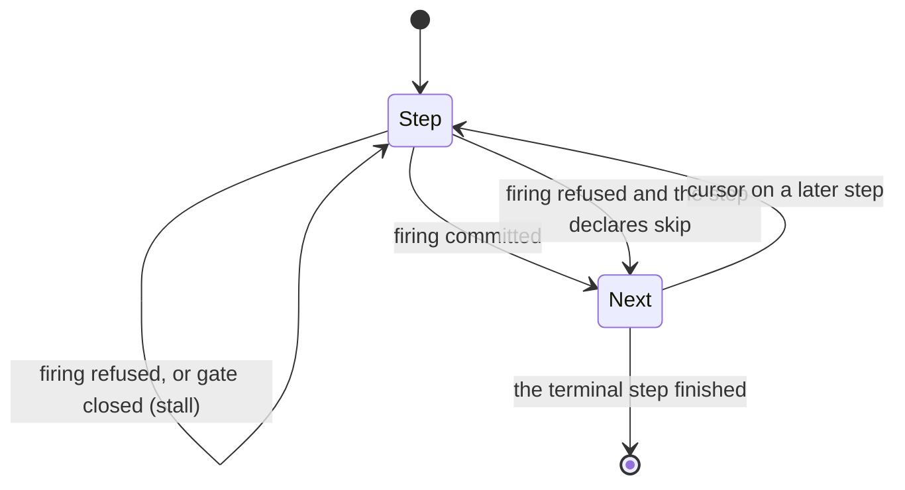

# Rule groups and turn undo

A **rule group** claims a set of compiled rules and runs them as one unit
instead of leaving each to fire on its own. A fixpoint group repeats its members
until the state settles; a staged group walks through ordered steps. An
undo-enabled group also keeps a bounded history of completed turns that a rule
can rewind. This article explains both group shapes, how they're triggered and
checkpointed, and how turn undo works and where it stops. It assumes you've
read [Rules and firing](rules.md).

## Run rules as a group

In the running card game, buying cards can cascade: while `coins` is above 10,
ten of them become a card. A `stabilize` block runs that cascade to a fixpoint,
and a `workflow` block walks a player's turn through its stages:

```puck
stabilize settle maxPasses(16) until unstable == 0 {
  rule "collapse" {
    when coins > 10
    coins = coins - 10
    cards = cards + 1
  }
  rule "calm" {
    when coins <= 10
    unstable = 0
  }
}

workflow turn {
  step move {
    when pieceCell[rook] < 7
    pieceCell[rook] = pieceCell[rook] + 1
  }
  step bonus skip {
    score = score + 1
  }
  step finish {
    coins = coins + 1
  }
}
```

This fragment assumes Int slots `coins`, `cards`, `score`, and `unstable`, and a
keyed Int row `pieceCell` with a cell `rook`.

Each block lowers to one `ruleGroups` entry plus the rules it claims, named
`<group>$<member>`: `settle$collapse`, `settle$calm`, `turn$move`, `turn$bonus`,
and `turn$finish`. The `$` marks a [generated name](../dsl.md#generated-names),
so no rule an author writes can take a member's name. Those are ordinary rules in the document's `rules` array. A
rule belongs to at most one group, and a claimed rule runs only through its
group.

| Shape | `.puck` block | How it runs |
|---|---|---|
| `Fixpoint` | `stabilize` | One pass per tick over every member, in authored order, until a pass changes nothing or the pass ceiling is reached. |
| `Staged` | `workflow` | A cursor over ordered steps; each tick evaluates only the step under the cursor. |

## Fixpoint groups

A fixpoint group runs one pass per simulation tick. A pass evaluates every
member in authored order, as ordinary rules run, so a member sees the
writes of the members before it. The group's **write set** is every row its
members can write. After the pass, the group compares the write set's bytes
with the bytes before the pass:

- **Nothing changed.** The group has settled. Its progress resets, and the next
  tick starts a fresh set of passes.
- **Something changed.** The group counts the pass and runs again next tick.
- **The pass ceiling is reached.** The group reports one
  `RuleEffectRefusal.GroupPassCeiling` refusal naming the group.

The comparison is by net change across the whole pass. A member that wrote and
then rewound isn't progress, and neither is a pass whose members clear a
derived row and rebuild it with the same values. A group can therefore
recompute a table from scratch every pass and still settle. The passes count
ticks: a cascade that needs five passes takes five ticks.

The pass ceiling is `maxPasses(n)`, from 1 to 256, and defaults to 8. What
happens after a breach depends on the trigger. A group with a trigger latches
the breach and doesn't run again until its trigger has read false and then holds
once more. A group with no trigger is always armed, so latching would end it for
the rest of the run; instead it reports the breach and starts a fresh set of
passes on the next tick.

A `stabilize` body is a rule scope: a `when`, a `local`, or a property written
directly in the body applies to every member, and each `rule` block is one
member. `until G` arms the group while `G` reads false, so it lowers to a
trigger of `not G`.

## Staged groups

A staged group holds a **cursor** over its steps. Each tick, it evaluates only
the rule under the cursor, then decides whether the cursor moves:



The cursor advances when the step's firing commits. A step whose gate is closed,
or whose firing is refused, **stalls**: the cursor stays and the step is tried
again next tick. A step declared with `skip` advances past its own refusal
instead. The last step is **terminal**: when it advances, the group's progress
resets, and the next tick starts again at the first step if the group is still
armed. A step's `Edge` or `Level` mode applies as it does to any rule. An
`Edge` step's latch keeps its last value while the cursor is elsewhere, so if
its gate is still open when the cursor comes back to it, the step doesn't fire
and the workflow stalls there until the gate closes and opens again.

A `workflow` step's body is one rule's body: its `when`, `local`, and effect
statements are written directly, and a nested `rule` block is refused. The
`repeatStep` and `forEachStep` statements parse and are refused, because a cursor
advances one step per committed firing and carries no loop of its own.

## Trigger a group

A group's `Trigger` is a gate, compiled the same way as a rule's. With no trigger,
the group is always armed. The trigger is evaluated fresh every tick, including
any locals its expression keys minted, and a trigger that faults reads closed.

When the trigger reads false, the group doesn't run that tick and its progress
resets: a fixpoint group forgets its pass count, and a staged group's cursor
returns to the first step. An undo turn that was still open is cancelled, as
described in [What a turn is](#what-a-turn-is).

A group carries `RuleNeeds` read off its trigger, the same way a rule does, so a
host admits it with `RuleNeeds.Admit` and refuses a trigger naming a facet the
host doesn't serve before evaluation starts. In `.puck`, `stabilize` spells its
trigger with `until`. `workflow` has no trigger spelling; a `ruleGroups` entry
written in the document's explicit form can carry one.

## Group progress is simulation state

`RuleGroupState` holds each group's `RuleGroupProgress`: the staged cursor's
`Step` (or the fixpoint pass count), whether a staged group is `Running`, and
whether a fixpoint group has `Breached`. It sits beside the `RuleLatch` and is
simulation state in the same way:

- `AppendStateHash` folds it into a state hash in compiled order, so two hosts
  holding the same progress hash the same.
- `Flatten` and `Restore` write and read it for a checkpoint.
- `Prune` drops progress for groups a recompile removed, and `Clear` forgets
  everything.

Progress is never a row, so the arena doesn't carry it. Persist and restore it
wherever you persist the latch.

## Compile and run groups from C#

`RuleCompiler.CompileGroups` compiles `RuleGroupDeclaration` records against an
already compiled rule array. `RuleCompiler.Ungrouped` returns the rules no group
claims. A host evaluates that array directly and the groups through
`RuleEvaluator.EvaluateGroups`. Evaluating the whole rule array beside the
groups would fire every member twice.

```csharp
RuleGroupDeclaration turn = new(
    Name: CellName.Parse("turn"),
    Shape: RuleGroupShape.Staged,
    Steps: [
        new RuleGroupStep(Rule: CellName.Parse("move")),
        new RuleGroupStep(Rule: CellName.Parse("bonus"), OnRefusal: RuleGroupStepPolicy.Skip),
        new RuleGroupStep(Rule: CellName.Parse("finish")),
    ],
    Undo: new RuleGroupUndo(Rows: [CellName.Parse("pieceCell"), CellName.Parse("score")], Depth: 8));

var compiled = RuleCompiler.CompileAll(rules: authored, context: context);
var groups = RuleCompiler.CompileGroups(groups: [turn], rules: compiled, context: context);
var ungrouped = RuleCompiler.Ungrouped(rules: compiled, groups: groups);
var progress = new RuleGroupState();

for (var tick = 1UL; tick <= 10UL; tick++)
{
    host.Advance(tick: tick, engineTick: tick);
    evaluator.Evaluate(rules: ungrouped, latch: latch, stepTicks: 1UL);
    evaluator.EvaluateGroups(rules: compiled, groups: groups, state: progress, latch: latch, stepTicks: 1UL);
}
```

This fragment assumes the context, host, evaluator, and latch from the
[quickstart](quickstart.md), and authored rules named `move`, `bonus`, and
`finish`. The host decides whether ungrouped rules run before or after the
groups within a tick.

`CompileGroups` refuses a declaration with `RuleRefusal.RuleGroupMalformed` when:

- the group declares no members, or more than 256;
- a member names a rule the document doesn't declare, or a rule another group
  already claims;
- the group's name is a rule's name, is missing, repeats, or starts with `$`;
- a fixpoint group declares a ceiling outside 1 to 256, or a step policy;
- a staged group declares a pass ceiling.

A `CompiledRuleGroup` carries the member indices, their step policies, the
write set, the pass ceiling, the compiled trigger and its locals, the terminal
step's index, the group's needs, and its resolved undo plan.

## Let players take back a turn

An **undo-enabled group** retains the state its turns overwrote, so a rule can
put that state back. You declare which rows belong to a turn and how many
completed turns to keep:

```puck
workflow turn undo({ rows ["pieceCell", "score"] depth: 8 }) {
  step move {
    when pieceCell[rook] < 7
    pieceCell[rook] = pieceCell[rook] + 1
  }
  step finish {
    score = score + 1
  }
}

rule undoMove {
  when undoRequested == 1
  mode: Edge
  rewindGroup(group: turn)
}
```

This fragment assumes Int slots `score` and `undoRequested`, and a keyed Int
row `pieceCell` declared with `capacity(2)`.

The undo policy is an ordinary rule: whoever can open `undoMove`'s gate may
undo. A world can let any player undo, require both seats to agree, or never
open the gate at all. The engine adds no policy of its own.

### Choose the rows a turn owns

`rows` names ordinary rows or pools. A pool name brings its whole state: the
membership row, the generation row, every field row, and every pair pool that
depends on it, transitively. Every row must be a document row; the compiler
refuses a host-owned row.

A turn retains the first value each position held when the turn began. A
position here is any stored column of a row: values, presence, member keys and
counts, trait clocks, a ring's cursor, and a draw site's cursor and drawn masks.
Include a draw site's row in `rows` and a rewind puts its cursor back too.

The compiler also refuses an undo group whose members contain an irreversible
arm, an effect that needs a host facet, a write to a host-owned row, or a
`rewindGroup`. A rewind can only restore arena state, so a member that reaches
outside the arena would leave a turn that can't be taken back.

### What a turn is

A **turn** is one complete run of the group, even when it spans several ticks:

- A staged group's turn begins when the armed group first evaluates, and ends
  when its terminal step advances.
- A fixpoint group's turn begins with its first pass and ends when a pass changes
  nothing, or when the pass ceiling is breached.

Ordinary firing scopes still commit or rewind within their tick; only the
retained record stays open across ticks. The group's writes are attributed to it
only while its own pass is running. A turn that leaves its rows as they were
takes no retained slot, even when its members wrote and rebuilt them, so an
idle or refused turn can't evict a meaningful one.

When a completed turn is kept, it joins a ring of at most `depth` turns, and the
oldest drops off when the ring is full. If the group's trigger reads false while
a turn is still open, the open turn is cancelled: its writes stay in the arena,
nothing is retained for it, and if it had written anything, the newest retained
turn becomes unrewindable because the state after it changed.

### Rewind a turn

`rewindGroup(group: turn)` restores the newest rewindable turn of the named group
and removes it from the ring, so firing it again steps back one more turn. The
compiler requires that `rewindGroup`:

- is the rule's sole top-level effect, outside every `if` and `transaction`;
- belongs to a standalone rule outside every group;
- names a group that declares `undo`.

At runtime, the rewind refuses (as `MutationRejected`, with the reason in the
ledger) when:

| Condition | Reason |
|---|---|
| The host has no retained undo arena | The host doesn't implement `IArenaUndoHost`. |
| An arena scope is open | A rewind can't run inside a firing or a candidate scope. |
| Another group's pass is running | The rewind would interleave with its writes. |
| The group's turn is unsettled | The newest turn hasn't finished yet. |
| The ring is empty | There's nothing to rewind. |
| The newest turn isn't rewindable | It wrote outside its declared rows, or a later write changed its rows. |

A turn becomes unrewindable when a member writes a row outside the group's
`rows`, when anything outside the group's pass writes one of its rows, or when
another group's rewind changes one of them. That protection means a rewind never
overwrites a newer, unrelated edit.

After a successful rewind, the group is skipped for the rest of that simulation
tick, including any later group evaluation at the same tick, so the turn you
took back doesn't replay immediately. The evaluator also drops its
scheduling caches, since the rewind moved row versions.

Search judges can't include `rewindGroup`: a search plan whose judge rules
contain it is refused, because a rewind needs a settled, authoritative turn
boundary. See [Search](search.md).

### What a rewind restores, and what it doesn't

A rewind writes each retained position back, newest turn only, re-indexes the
rows it touched, and moves their row versions. Keys the turn minted stay
reserved in the arena's key ledger; a rewind doesn't reclaim names that other
rows may use.

A `rewindGroup` is priced by that work at its widest
(`StateArena.EstimateRewindWork`): every position one turn of the group can
retain, restored with its bookkeeping, each vector component, and each keyed or
ordered row's key index rebuilt. The price depends on the rows the group owns,
not on its `depth`, and the clock lanes of a row no trait rebases don't count,
since no write in a turn can reach them.

A rewind doesn't turn back:

- rule latches, so an `Edge` rule that fired during the turn doesn't re-arm;
- group progress, including the group's own cursor;
- the simulation clock;
- host state and anything an irreversible arm did;
- rows outside the group's `rows`.

Put gameplay progress that must rewind in the declared rows.

### Retained history is simulation state

The ring and any unfinished turn are part of the arena's state hash and its
[checkpoint](arena.md#checkpoints). `StateArena.ExportUndoSnapshot` exports
them as an
`ArenaUndoSnapshot`, `ValidateUndoSnapshot` checks one against the configured
plans without changing the arena, and `TryImportUndoSnapshot` restores it. A
relayout, which rebuilds the arena for a changed declaration set, drops all
retained history.

`RuleEvaluator.EvaluateGroups` configures the host's undo plans from the
compiled groups. Configuring the same plan again keeps a group's history, and a
changed plan replaces it.

### Size the history

Undo depth is bounded in bytes. The compiler estimates the worst
case, one retained entry for every position of every owned row plus one open
turn per group, and refuses the groups when the total across all undo groups
exceeds `ArenaCapacity.MaxJournalBytes` (16 MiB). The arena checks the same
figure again when it configures the plans.

Only the columns a rule can write are reserved: a cell's value and presence,
member keys, trait clocks, cursors, and a knowledge row's observations. A
cell's provenance, behavior and audience arrive only through an import, so no
turn reserves them. If a write does reach one inside a turn, that turn becomes
unrewindable. With this sizing, each [rulepush](../../../worlds/rulepush/README.md)
level keeps 32 turns of its board, its tokens and its derived tables. Rows without an authored capacity still reserve room for many
cells ([Byte accounting](arena.md#byte-accounting) explains what each row
reserves), so author a `capacity` on the rows a turn owns.

## Limitations

- A rule belongs to at most one group, and a group holds at most 256 members.
- A fixpoint group runs one pass per tick, so a long cascade takes many ticks.
- `workflow` has no `.puck` trigger spelling.
- Turn undo restores arena rows only. Latches, group progress, the clock, host
  state, and irreversible effects stay as they are.
- A rewind can't run inside a scope or inside a search judge.
- Retained history is lost on relayout.

For the reasoning behind groups and undo, see [State and the authoring language:
decisions](../../decisions/state-and-language.md).

## Key types

| Type | Project | Purpose |
|---|---|---|
| `RuleGroupDeclaration`, `RuleGroupStep`, `RuleGroupUndo` | `Puck.State.Rules` | The authored group, its steps, and its undo declaration. |
| `RuleGroupShape`, `RuleGroupStepPolicy`, `RuleGroupCapacity` | `Puck.State.Rules` | Shapes, step policies, and group ceilings. |
| `CompiledRuleGroup` | `Puck.State.Rules` | A compiled group. |
| `RuleGroupState`, `RuleGroupProgress` | `Puck.State.Rules` | Group progress, beside the latch. |
| `RewindGroupEffect` | `Puck.State.Rules` | A compiled `rewindGroup`. |
| `IArenaUndoHost` | `Puck.State.Rules` | What a host serves for undo-enabled groups. |
| `ArenaUndoPlan`, `ArenaUndoSnapshot` | `Puck.State` | A group's retained rows and depth, and its checkpoint form. |

## Next steps

- [Rules and firing](rules.md): review how each member fires and how its latch
  behaves.
- [Rule analysis, scheduling, and work budgets](analysis.md): see how group
  members are priced within a tick.
- [The state arena](arena.md): learn how journal scopes, row versions, and
  checkpoints work underneath groups and undo.
