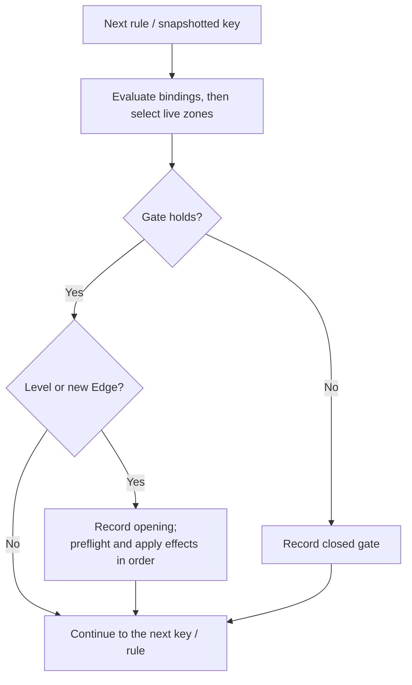
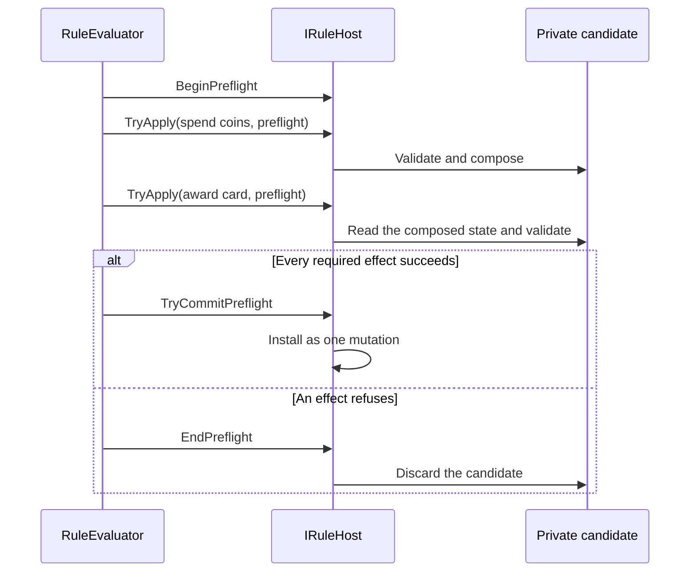

# Compile and run rules

A rule connects a question to an action: “If the player has at least three
coins, spend three coins and award one card.” Its **gate** asks the question;
its **effects** describe the attempted changes. The host decides whether those
changes can be installed.

Use the [small running example](../state.md#evaluate-a-small-rule) first.
This chapter follows a rule through compilation, iteration, latching, and
mutation admission.

## Read the parts of a rule

| Part | Role | Example |
|---|---|---|
| Name | Stable identity for compilation, tracing, and latching | `buyCard`. |
| Bindings | Numeric expressions evaluated in declaration order | Bind a price once for the gate and effects. |
| Gate | A predicate that must hold | `coins >= 3`. |
| Mode | Decide whether a held gate fires repeatedly | Level or Edge. |
| ForEach | Evaluate for each key in a row | One status update per piece. |
| Effects | Ordered attempts to change state | Spend coins, then award a card. |
| Zones | An indexed set of ordered piles | Select the source and destination at runtime. |

## Follow one evaluation



This diagram shows the ordinary library evaluation path; a host can supply
special rule kinds through the [extension contract](hosting.md).
Bindings run before the gate, so a binding can fault even when the eventual
gate would have been closed.

Rules observe earlier accepted writes in the same pass. If rule A increments
`coins` from 2 to 3 and rule B tests `coins >= 3`, B sees 3. This is an
ordered evaluation, so reordering rules can change the result.

## Choose Level or Edge

**Level** fires each time the gate is evaluated as true. **Edge** fires when
the evaluator observes a transition from false to true. It becomes eligible
again only after an evaluation observes false.

| Evaluation | Gate | Level fires | Edge fires |
|---|---|---|---|
| 1 | false | No | No |
| 2 | true | Yes | Yes |
| 3 | true | Yes | No |
| 4 | false | No | No |
| 5 | true | Yes | Yes |

A `RuleLatch` remembers those crossings, including the evaluator's iteration
binding. Preserve it across simulation steps and checkpoints. Edge records
the opening before firing effects: a refused write does not turn a continuously
true gate into a new crossing on the next step.

An always-open Level rule adds a coin every evaluation. An always-open Edge
rule adds one coin on its first opening. A recurring judge call has different
lifetime semantics: `FrameHost.Judge` clears its latch for each candidate.
See [Frames](frames.md) before using it as a continuing simulation.

## Make several effects succeed together

Two ordinary effects have separate preflight and installation steps. If spending
coins succeeds but awarding a card is refused, the first write can remain.
A transaction gives the host one private candidate to validate and install.



The following rule fragment assumes declared Int slots `coins` and `cards`.
It wraps the two changes in one transaction; it is not a complete host program.

```csharp
var buyCard = new Rule(
    Name: CellName.Parse("buyCard"),
    Gate: new ActionPredicate.CompareState(
        State: "coins", Comparison: ActionStateComparison.GreaterOrEqual, Value: 3m),
    Mode: ActionTriggerMode.Edge,
    Effects: [new ActionEffect.Transaction(Effects: [
        new ActionEffect.AddState(State: "coins", Value: -3m),
        new ActionEffect.AddState(State: "cards", Value: 1m)
    ])]);
```

The compiler admits only effect families that support transactions. A custom
effect that sends an irreversible notification, for example, cannot promise
rollback simply by returning success from preflight. The
[host protocol](hosting.md#implement-the-mutation-boundary) owns installation,
validation, journaling, and delivery.

## Branch on a condition

An `if` effect chooses one of two effect lists by a predicate — the same
grammar a gate compiles. `then` fires when the condition holds; the optional
`else` fires when it does not. A condition that cannot evaluate (an
arithmetic fault, or a missing table key) runs neither branch and is reported
the same way a failing top-level effect is; a condition that evaluates to
false, with no branch left to run, is not a failure.

```csharp
var claimBonus = new Rule(
    Name: CellName.Parse("claimBonus"),
    Gate: new ActionPredicate.CompareState(
        State: "$tick", Comparison: ActionStateComparison.GreaterOrEqual, Value: 1m),
    Mode: ActionTriggerMode.Edge,
    Effects: [new ActionEffect.If(
        Condition: new ActionPredicate.CompareState(
            State: "streak", Comparison: ActionStateComparison.GreaterOrEqual, Value: 3m),
        Then: [new ActionEffect.SetState(State: "bonusAwarded", Value: 1m)],
        Else: [new ActionEffect.SetState(State: "bonusAwarded", Value: 0m)]
    )]);
```

Each branch effect is its own boundary — preflighted and installed
individually, exactly like a top-level effect (or, inside a `transaction`,
any other step); a branch is not itself a transaction. A `transaction` may
appear inside an `if`'s branch, but only when that `if` is not itself inside
one — transactions never nest, whether directly or through an intervening
`if`. A registered effect family opts out of appearing inside any `if`
branch, at any nesting depth, through `EffectFamily.AllowsInsideBranch`; the
library's own effects all allow it.

A rule's trace shows which branch a captured evaluation took (`then`,
`else`, `neither`, or `condition failed`) beside the `if` effect's own
applied/refused/skipped verdict.

## Iterate keys without changing the loop beneath it

`ForEach` snapshots the selected row's keys before evaluating them. Effects
can change values, but newly added keys do not join that already-started
iteration. `$each` means the bound key, not whatever cell later occupies the
same position. A Text row can provide iteration keys even though numeric
reductions cannot aggregate its text.

For a rule that serves several piles, its `Zones` table associates an index
with a row. `$zones[game[to]]` selects the destination row from a live value;
`$zone:hand:last` selects one member's key from a particular ordered row.
The distinction is **which row** versus **which cell in a row**.
The detailed [facts contract](#the-facts) covers gaps, empty endpoints,
and the trace's resolved-zone display.

## Distinguish a closed gate from a refusal

A closed gate is an ordinary answer: the condition does not hold.
A refusal means a requested operation could not be compiled or evaluated.

| Stage | Signal | First thing to inspect |
|---|---|---|
| Compilation | `RuleException` with a `RuleRefusal` or host category | Name, cell kind, declared key, and supported effect family. |
| Arithmetic evaluation | `ExpressionFault` counted as an arithmetic refusal | Input range, division, function domain, or absent operand. |
| Mutation admission | Host refusal reason | Envelope, capacity, authority, and transform requirements. |
| Unexpected firing or skipping | Rule trace and latch lifetime | Array order, bound key, live zones, and Edge versus Level. |

The evaluator retains exact counts by refusal category and notifies the host
on a category's first occurrence. Arm a named rule's trace to see its evaluation;
a traced run evaluates fully even when scheduling could otherwise reuse an answer.

## Compile, evaluate, and commit

Compile against one section, catalog, vocabulary, and simulation rate. The
compiler resolves operands and validates their kinds. During evaluation,
bindings run before the gate, rules run in array order, and earlier accepted
writes are visible to later rules. An ordinary effect preflights and installs
individually. Use a transaction when several effects must succeed together;
the host must support its candidate and rollback protocol.

Persist authoritative rows and edge-latch state together with any generator
state the host owns. Scheduling caches can be rebuilt: they only avoid work
whose inputs are proven unchanged. The host also owns validation and installation
of its document; compiling rules does not supply a complete application's
mutation, authority, or persistence pipeline.

## Rules

The authored model consists of `Rule` and `RuleBinding`, `ActionPredicate`
(`compareState`, `compareValue`, `all`, `any`, `not`), `ActionEffect`
(`setState`, `addState`, `pushState`, `transformState`, `countdownState`,
`generate`, `removeStateCell`, `scheduleState`, `transaction`, `if`),
`ActionTarget`, `ActionStateComparison`, and
`ActionTriggerMode`—the last two shared with `Puck.Physics`' compiled
per-body predicates, so neither can grow an arm the other lacks.
Transactions contain ordinary effects with compiler-enforced admission;
registered families opt in only when their host supports bounded rollback.

## The compiler

`RuleCompiler` compiles a `Rule` against a
`RuleCompileContext` (the section, its catalog, its pinned `TableSource`s,
patterns, generators, and the simulation rate) into a `CompiledRule`—
`GateToken`s, `EffectFact`s, `CompiledRuleBinding`s, `CompiledExpressionToken`s.
Every piece (`CompileGate`, `CompileEffects`, `CompileExpression`,
`CompileBindings`, `ResolveOperand`, `TryResolveDynamicKey`) is public so a
document project composes them with its own arms. `RuleRefusal` names every
compile-time refusal; a `RuleException` carries one, or a document project's
own enum.

## The facts

A compiled **fact** is an object that knows how to answer a read or describe an
effect. These are class hierarchies so a host can extend them:

| Family | Core facts |
|---|---|
| `OperandFact` | `StateCellOperand`, `BindingOperand`, `TableOperand`, `TickOperand`, `ReductionOperand`, `SymmetryOperand`, `BoardOperand`, `PhaseOperand`, `PatternOperand`, `HistoryOperand`. |
| `EffectFact` | `WriteEffect`, `CountdownEffect`, `GenerateEffect`, `RemoveStateCellEffect`, `ScheduleStateEffect`, `TransactionEffect`, `TransformStateEffect`, `PushStateEffect`, `IfEffect`. |

Operands implement `Read(IRuleReader)`. Facts also report cost and read/write
dependencies through `Cost`, `CollectReads`, and `CollectWrites`, using
`RuleAccess` lists. [Host analyses](hosting.md#analyses) consume those answers.

### Resolve a key

`CompiledCellRef` carries key indirection: `$cell:`, a bound key,
`$bind:`, a `$zone:` endpoint, or a host's `KeyFact`.
An `$expr:` key compiles into a shared implicit binding and is read back
through `BindingKeyFact`.

### Select a row from a live zone table

`LiveZone` provides the corresponding indirection for a row. A rule's
`Zones` table contains ordered zones over one token domain and kind, in
index order. An empty entry leaves a gap.

Any row position can select `$zones[<index>]`: the index is an infix
expression such as `game[from]`, `$each`, or `$bind:destination`.
This works in `compareState`, `$reduce:`, `$match:`, a `$zone:`
endpoint, transfer ends, and expression row reads.
`forEach: "$zones"` iterates the table's non-empty indices.

Before the gate, the evaluator resolves each distinct live spelling once through
`ZoneTable.References`. Every selection must name a populated entry.
An out-of-range index or gap closes the gate without recording a refusal:
the table declares which piles this rule serves. The trace shows selections,
for example `zones [$zones[game[to]] -> pile3, ...]`.

`RuleFacts.SplitChannel` keeps bracketed indices intact while splitting a
channel. The infix lexer likewise keeps `$zones[...]` inside a reserved name.

### Read an empty endpoint

`$zone:<ordered-zone>:first|last` returns the member's original string key
from the active store, including an uncommitted frame transfer.
An empty zone has no endpoint. That is an absent fact
(`RuleFact.IsAbsent`), not a value of zero.

| Operation using the absent endpoint | Result |
|---|---|
| Compare its value | No comparison holds, including `NotEqual`. |
| Use its value in an expression | Evaluation refuses. |
| Copy from it | The effect does not fire. |
| Write to the cell it names | The write refuses. |

Outside a rule evaluation, an unselected live zone has the same absent behavior;
a transfer through it refuses by name.

### Resolve an effect's source

Numeric `setState`, `addState`, and `pushState` share source resolution.
A direct source is read once per execution pass; an ordinary write still has
separate preflight and live passes. Absent and `forever` sources skip the
effect, while expression faults retain their diagnostic behavior.
Here `forever` is a fact representing positive infinity, not an unusually
large stored integer.

## Evaluation

`RuleEvaluator` runs a compiled rule family over an `IRuleHost`.
The evaluation context holds the tick, bound iteration key and participants,
and binding values. The host's `IRuleReader` forwards that context to operands.
`RuleEvaluation` supplies the shared `GateHolds`,
`TryEvaluateExpression`, `ResolveKey`, and state-read operations.

### Mutation and iteration contracts

Core effects produce four mutation shapes: `UpsertCell`, `RemoveCell`,
`Generate`, and `Apply` a transform. Top-level effects preflight and
install individually. A transaction preflights its branch as one candidate,
then calls the host's `TryCommitPreflight`.

The evaluator visits rules in array order and binds values before the gate.
Its `RuleLatch` preserves Edge/Level history per evaluation binding, including
hashing and checkpoint flatten/restore. Iteration snapshots keys before its
first evaluation. Any keyed kind, including Text, can supply those keys;
numeric reductions still require numeric rows.

A compiled iteration handle avoids name lookup. A caller omitting it resolves
the row through the current catalog. The position shortcut verifies the live
key before reading, so removal or reordering cannot redirect `$each`.
Literal operands preserve null-as-slot and empty-as-absent semantics while
using pre-parsed keys where available.

### Trace and refusal reporting

`RuleTraceEvaluation` is armed per rule name. `RuleRuntimeDiagnostic`
records exact counts per category, with the host notified on the first occurrence.
An arithmetic fault in a binding, effect, or `compareValue` conjunct is
reported as `RuleEffectRefusal.Arithmetic`; `ExpressionFault` identifies
the cause. A missing table key uses the evaluator's table-key diagnostic
instead of adding a second arithmetic report.

## State transforms

An ordinary cell write changes one address. A transform describes a structured
change whose selection, ordering, and associated bookkeeping must agree.

| Transform | Use it to… |
|---|---|
| `transfer` | Move selected tokens between ordered zones while preserving their identities. Random selection advances its draw only when the whole transfer commits. |
| `setRay` | Replace the longest outward run accepted by a pattern, excluding the origin. An empty accepted prefix refuses. |
| `shuffle` | Reorder a keyed row or zone using a named stream draw; n members consume n − 1 samples. |
| `sortZone` | Stably order a pile by numeric attribute rows in declared precedence. |
| `sortKeyed` | Stably order a numeric keyed row by its own values. |
| `writeSet` | Write a value to board cells selected by an integer bitmask, for a topology of at most 64 cells. |
| `boardCombine` | Combine membership from boards over one topology, including boards larger than a single mask. |
| `arrange` | Reorder an ordered zone by a permutation rank. |
| `push` | Append a history value, overwriting the oldest ring slot when full. |
| `clearEnclosed` | Clear adjacent groups in an inclusive value range that have no empty neighboring cell. |
| `observe` | Refresh a knowledge board from its source and visibility mask under authority control. |

`boardCombine` treats a cell as a member when its value differs from the board's
empty value. It writes the declared result value to members and the empty value
elsewhere. This is membership algebra, not arithmetic addition of board values.

The `arrange` transform supports up to 20 tokens, with rank zero giving the
token domain's order and ranks at or beyond k! refused. The packed integer
expression functions have their separate 16-element limit because each element
occupies four bits; see [permutation expressions](expressions.md#function-families).

Transform support depends on the host. In particular, [frames](frames.md#apply-candidate-changes)
implement a subset, so admitting a transform in an installed document does not
automatically make it available to a search judge.

`StateTransform` models these operations. `ZoneSelector` and `SortKey`
describe selection and ordering. `clearEnclosed`'s `from` and `writeSet`'s
`setKey`, and a transfer's `key` accept a dynamic key (`TransformStateEffect.KeyRef`,
resolved live in `RuleEvaluator.Effects.Fire` before the mutation
submits) alongside a literal cell: a rule gated on the held token paints
`plan` from `legal[$cell:held:token]` after a `boardCombine clear`.

---

[State and rules](../state.md) · Next: [Evaluate hypothetical state with frames](frames.md)
