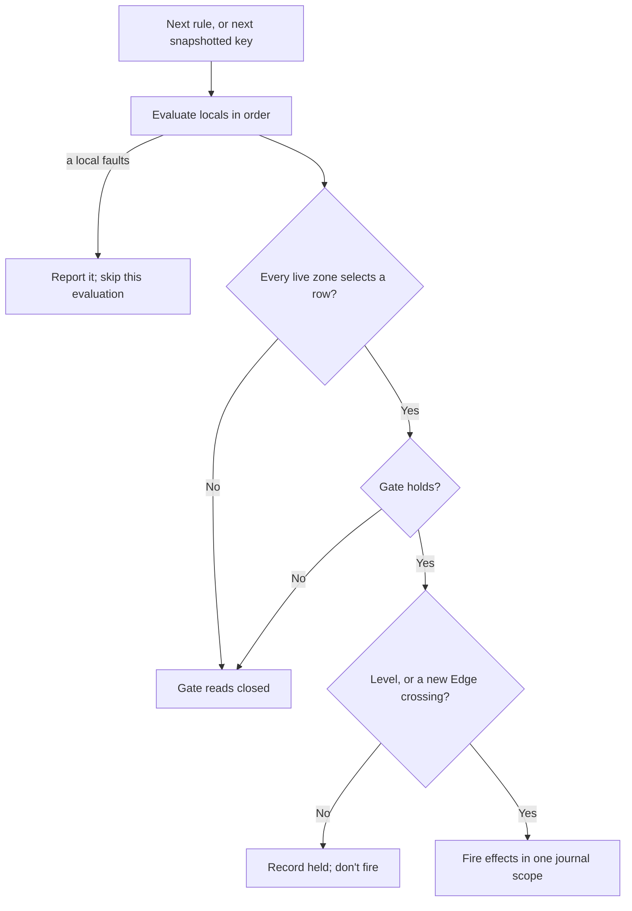
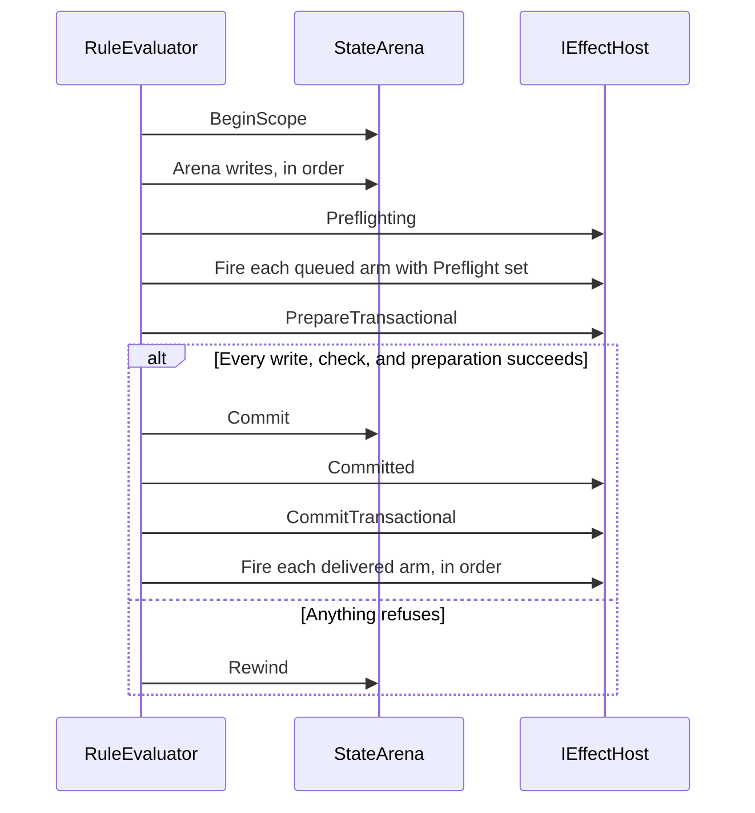

# Rules and firing

A rule is the unit of behavior in Puck's state engine: a condition over state and
the changes that follow when it holds. This article explains how you author a
rule, how the compiler checks it, what happens when the evaluator runs it, and
how a firing either lands completely or leaves no trace. It's written for world
authors who write `.puck` rules and for host developers who compile and run
rules from C#.

## The parts of a rule

The running example is a small card game. The player has an Int slot `coins`
and a card counter `cards`, and buys a card whenever they can afford one:

```puck
rule buyCard {
  when coins >= price
  mode: Edge
  local price = 3
  coins = coins - price
  cards = cards + 1
}
```

Every rule has a name and at least one effect. The rest is optional:

| Part | What it does | In the example |
|---|---|---|
| Name | Identifies the rule for compilation, tracing, latching, and group membership. It's unique in the document, and a leading `$` is refused. | `buyCard` |
| Locals | Values computed once per evaluation, in declared order, before the gate. The gate and every effect can read them. A local is never stored; it lives for one evaluation. | `price` |
| Gate | The predicate that must hold. A rule with no gate always holds. | `coins >= price` |
| Mode | Whether a holding gate fires on every evaluation (`Level`, the default) or only when it opens (`Edge`). | `Edge` |
| Iteration | `forEach: row` evaluates the rule once per key of a keyed row, `forEach: $zones` once per entry of the rule's zone table, and `rule name for each x in pool` once per live pool instance. | none |
| Effects | The ordered changes the rule attempts when it fires. | two assignments |
| Zones | A table of ordered piles the rule can select from at runtime. | none |

When `coins` reaches 3, the gate opens, the rule fires once, and both
assignments land together. Because the mode is `Edge`, the rule doesn't fire
again until the gate has closed and opened again.

A `rules` block gives several rules a shared header. Its name prefixes every
member's name, and its `when` gate is conjoined with each member's own gate.

### Author a rule in C#

The same model is a set of records in `Puck.State`. This fragment builds a rule
that deals a card from `deck` to `hand` and charges a coin, or clears the
request when the deal can't complete. It assumes an Int slot `dealRequested`,
the slot `coins`, and two ordered piles `deck` and `hand` over one token domain.

```csharp
var dealHand = new Rule(
    Name: CellName.Parse("dealHand"),
    Gate: new ActionPredicate.CompareState(
        State: "dealRequested", Comparison: ExpressionOp.Equal, Value: 1m),
    Mode: ActionTriggerMode.Edge,
    Effects: [
        new ActionEffect.Transaction(
            Effects: [
                new ActionEffect.TransformState(new StateTransform.Transfer(
                    From: "deck", To: "hand", Selector: ZoneSelector.First)),
                new ActionEffect.AddState(State: "coins", Value: -1m),
            ],
            OnFailure: [new ActionEffect.SetState(State: "dealRequested", Value: 0m)]),
    ]);
```

A string converts to a `StateChannelRef` through `StateChannelRef.Parse`, so a
reserved spelling such as `"$tick"` or `"$zones[game[from]]"` works wherever a
row name does.

## The authored model

| Type | Role |
|---|---|
| `Rule` | One rule: `Name`, `Effects`, `Gate`, `Mode`, `ForEach`, `Locals`, `Zones`, and `PoolForEach`. |
| `RuleLocal` | One local: a name, an `ExpressionProgram`, and an optional kind (`Int` or `Fixed`). When you omit the kind, the compiler uses `Int` if the expression compiles as one, and `Fixed` otherwise. |
| `RulePoolIteration` | A whole-rule pool sweep and its lexical binding. A rule declares `ForEach` or `PoolForEach`, never both. |
| `ActionPredicate` | The gate grammar: `compareState`, `compareValue`, `all`, `any`, and `not`. |
| `ActionEffect` | The effect arms, listed below. |
| `ExpressionOp` (comparison subset, `ExpressionComparisons.All`) | `Equal`, `NotEqual`, `Less`, `LessOrEqual`, `Greater`, `GreaterOrEqual`. A `comparison` member names exactly one of these; any other operation name, another casing, or a number is refused. |
| `ActionTriggerMode` | `Level` or `Edge`. |
| `ActionTarget` | Which participant an effect addresses. At rule scope only `Self` is admitted; the other members serve a host's per-participant action programs. |

The comparisons and `ActionTriggerMode` are shared with `Puck.Physics`,
whose compiled per-body triggers ask the same questions, so neither vocabulary
can grow a case the other lacks.

A **`compareState`** compares one state cell (or reserved channel such as
`$tick`) against either a literal `value` or a second cell named by
`comparandState` and `comparandKey`. A **`compareValue`** compares two numeric
expressions in one kind. A declared `kind` is used as written. Without one, the
kind is inferred as a local's is: `Int`, unless both sides are constants and
one holds a fraction, and `Fixed` when the sides don't compile as `Int`. Neither
side is converted to the other's kind. In `.puck`, a plain read compared with a
literal or with another plain read lowers to `compareState`; anything else, or
a comparison suffixed with `: Int` or `: Fixed`, lowers to `compareValue`.

The effect arms, with their `.puck` spellings:

| Arm | `.puck` spelling | What it does |
|---|---|---|
| `setState` | `row[key] = rhs` | Replaces a cell from a literal, a duration, another cell, an expression, text, or a vector. |
| `addState` | `row[key] += rhs` | Adds to a numeric cell. |
| `pushState` | `push row = rhs` | Pushes one value onto a history ring. |
| `transformState` | `transform name(…)`, `draw`, `deal`, `shuffle` | Runs a structured [state transform](transforms.md). |
| `generate` | `generate(row: site)` | Redraws a [draw site](generators.md). |
| `removeStateCell` | `remove row[key]` | Removes a cell from the row. The key leaves the row's key set, and a later read of that cell answers zero. |
| `scheduleState` | `schedule row[key] in 2s` | Writes an absolute due tick into an Int cell. |
| `transaction` | `transaction { … } onFailure { … }` | A savepoint inside the firing. |
| `if` | `if Gate { … } else { … }` | Chooses one of two effect lists. |
| `claim`, `claimPair`, `release`, `forEachPool` | `claim`, `claim pair`, `release`, `for each` | Pool lifetime effects; see [Records, pools, and handles](records-and-pools.md). |
| `rewindGroup` | `rewindGroup(group: name)` | Rewinds an undo-enabled group's newest turn; see [Rule groups and turn undo](rule-groups.md). |

A document project adds its own predicate and effect arms through
`RuleVocabulary`; [Host and extend the state engine](hosting.md) covers that.

## Compile rules

`RuleCompiler` turns authored rules into `CompiledRule` records. You compile
against a `RuleCompileContext`, which holds everything a name can resolve to:
the state section and its compiled catalog, the pinned tables, patterns,
generator rows, the simulation rate in ticks per second, and the
`RuleVocabulary`.

```csharp
var context = new RuleCompileContext(
    section: section, catalog: catalog, tables: null, patterns: null,
    generators: null, simulationRateHz: 60, vocabulary: RuleVocabulary.Core);
CompiledRule[] rules = RuleCompiler.CompileAll(rules: authored, context: context);
```

This fragment assumes a `StateSection` named `section`, its `StateCatalog`, and
an `authored` array of `Rule`.

`CompileAll` checks that every name is present, unique, and free of the `$`
prefix, then compiles each rule in document order. A compiled rule addresses
every read and write by catalog row ordinal and interned cell key, so nothing
on the tick path looks up a name. It carries its flattened gate (`GateToken[]`),
its effects (`IRuleEffect[]`), its locals (`CompiledRuleLocal[]`), its zone
table, and its **needs** (`RuleNeeds`): the host facets its facts name, whether
it reads the clock, and which host-owned rows it reads. A host checks those
needs with `RuleNeeds.Admit` before running the rule.

Every piece of the compiler is public so a document project can compose its own
arms from it: `Compile`, `CompileGate`, `CompileEffects`, `CompileEffect`,
`CompileExpression`, `CompileLocals`, `ResolveOperand`, `TryResolveDynamicKey`,
`TryResolveLiveRow`, and `TryResolveTransform`. A world host compiles each rule
twice: once when it validates the document, so a malformed rule is reported
against its line, and again when it installs the rules it will run.

### Read a compile refusal

A rule that can't compile throws a `RuleException`. Its `Refusal` is a member
of `RuleRefusal` (or a document project's own tagged enum), its
`Detail` says what was wrong in your own vocabulary, and its `Path` locates the
refusal inside the rule, such as `gate`, `locals[0]`, or
`effects[2].then[0]`. A caller that knows the rule's position prepends
`rules[i].`, which is how `puck compile --validate` reports a line.

| Refusal | Typical cause |
|---|---|
| `NameMissing`, `NameDuplicated`, `NameReserved` | A rule or group with no name, a repeated name, or a leading `$`. |
| `PredicateKindInadmissible` | A gate arm with no rule-scope meaning, a gate over 1,024 tokens, or nesting deeper than 64. |
| `EffectKindInadmissible` | An effect with no rule-scope meaning, an empty effect list, a nested transaction, or a declaration past a rule ceiling. |
| `StateRowUnknown` | A name that is neither a declared row nor a reserved channel. |
| `StateCellUnaddressable` | A keyed row with no key, a text row used as a number, or a malformed dynamic key. |
| `StateCellUndeclared` | A read of a cell its row doesn't declare. Writes are exempt because a write mints its cell. |
| `ComparandAmbiguous`, `ComparandKindMismatch` | A `compareState` with both or neither comparand, or two sides of different kinds. |
| `EffectSourceAmbiguous`, `EffectSourceKindMismatch` | An effect with more or fewer than one value source, or a copy between kinds. |
| `TargetInadmissible` | A participant target other than `Self`. |
| `GeneratorUnknown` | A `generate` of a row with no draw, or of a `Boot` draw site. |
| `DurationNotExactEngineTicks`, `DurationEngineTicksOutOfRange` | A duration that is negative or isn't a whole number of engine ticks, or one past the 64-bit carrier. |
| `ReduceChannelMalformed`, `SymmetryChannelMalformed`, `ArgRowNotKeyed` | A malformed reserved channel, or a key-yielding read over an unkeyed row. |
| `ZoneTableMalformed` | An empty zone table, an entry that isn't an ordered zone, entries over different token domains or kinds, or `forEach: $zones` with no table. |
| `RuleGroupMalformed` | A malformed rule group or undo declaration. |
| `IrreversibleResultRead` | A later effect reads what an irreversible arm writes. |
| `Vector…` | A vector operand, mix, filter, or destination refused; see [Vectors and embedding spaces](vectors.md). |

`RuleException` lives in `Puck.State` so every compiler that shares the rule
machinery can throw it.

### How a comparison with a literal compiles

Every comparison against a literal lowers through
`RuleCompiler.LowerConstantComparison`, whether you spell it as a
`compareState` or as a `compareValue` over two expressions, so both spellings
behave the same. An integral literal
compares as itself, and a `Fixed` cell keeps its exact fixed-point literal. A
fractional literal against an `Int` or `Bool` cell becomes the equivalent
integer comparison:

| Authored | Compiled |
|---|---|
| `coins > 1.5` | `coins >= 2` |
| `coins >= 1.5` | `coins >= 2` |
| `coins < 1.5` | `coins <= 1` |
| `coins <= 1.5` | `coins <= 1` |
| `coins == 1.5` | never holds |
| `coins != 1.5` | always holds |

A `compareState` against a literal accepts this conversion. A `compareState`
between two cells refuses when their kinds differ (`ComparandKindMismatch`),
because mixing scales silently would move the gate.

A host can expose a channel whose value exceeds every number, called
**`forever`**. A comparison treats it as positive infinity: it's greater than
every finite value and equal only to itself. Because it's a separate kind of
fact and not a large stored integer, no literal can equal it by accident. A gate
that compares a `forever` fact directly isn't faulted and reports nothing. A
numeric expression can't compute with a `forever` fact and faults instead.

## Follow one evaluation

`RuleEvaluator` runs compiled rules over an `IEffectHost`, the object that
serves every read and installs every write. The host also carries the evaluation
in flight: the tick pair, the bound key, the pool bindings, and the local
values, so every operand reads them through the host. The following diagram shows what
happens for one rule, or for one key of a rule that iterates.



Step by step:

1. **Bind.** For an iterating rule, the evaluator binds the next key it
   snapshotted before the sweep began.
1. **Evaluate locals.** Each local runs in declared order and can read the ones
   before it. A local that faults (overflow, division by zero, an absent read)
   is reported as `RuleEffectRefusal.Arithmetic`, and this evaluation stops. A
   local can fault even when the gate would have been closed.
1. **Select live zones.** Every `$zones[…]` spelling in the rule resolves to a
   row. If any selects nothing, the gate reads closed without being consulted
   and nothing is reported.
1. **Test the gate.** A conjunct that can't evaluate reads false and is
   reported, so you can always see why a gate stopped holding.
1. **Check the mode.** The latch records whether the gate held. A `Level` rule
   fires whenever the gate holds; an `Edge` rule fires only when the previous
   evaluation of the same binding didn't hold.
1. **Fire.** The effects run in authored order inside one journal scope, as
   described in [Make a firing atomic](#make-a-firing-atomic).

`EvaluateRule` returns a `RuleOutcome` for the rule as a whole: `Fired` when a
firing committed, `Refused` when any firing rewound, and `Idle` otherwise. A
host that owns a rule kind the library doesn't know, such as a world's
`decision` rule, implements `IRuleOwner` and runs each evaluation back through
`EvaluateOnce`, so the latch, trace, and refusal ledger stay shared.

### Ordering and visibility of earlier writes

Rules in one pass run as a sequence. `Evaluate` visits rules in array order,
and a committed firing is visible to every later rule's locals and gate in the
same pass. If `earn` raises `coins` from 2 to 3, a later
`buyCard` sees 3 on the same tick. Reordering rules can change the result, and
document order makes that deterministic. Within one firing, each effect reads
what the earlier effects of the same firing wrote, including an `if` condition.

The tick every read answers as of belongs to the host. A caller advances the
host (for example `ArenaEffectHost.Advance`) and then evaluates.

### Iterate the keys of a row

`forEach: pieceCell` evaluates the rule once for each key the row holds, with
`$each` bound to that key:

```puck
rule markMoved {
  when pieceCell[$each] > 0
  forEach: pieceCell
  pieceMoved[$each] = 1
}
```

The evaluator snapshots the row's keys before the first evaluation. Effects can
change values and add or remove keys, but a key minted during the sweep joins
the next sweep, and a removed key is still visited in this one. `$each` names
the bound key itself, so reordering or removal can't redirect it to another
cell. Any keyed row can supply keys, including a `Text` row, even though a
numeric reduction can't aggregate text.

## Choose Level or Edge

**Level** fires every evaluation in which the gate holds. **Edge** fires when an
evaluation observes the gate open after an evaluation that observed it closed.
It becomes eligible again only after the gate reads closed.

| Evaluation | Gate | Level fires | Edge fires |
|---|---|---|---|
| 1 | closed | No | No |
| 2 | open | Yes | Yes |
| 3 | open | Yes | No |
| 4 | closed | No | No |
| 5 | open | Yes | Yes |

An always-open `Level` rule that adds a coin adds one every evaluation. An
always-open `Edge` rule adds one coin, once. A rule that writes a row usually
wants `Edge`, since a `Level` write lands on every tick the gate holds.

An `Edge` rule latches its whole gate, not any one input the gate reads. A
gate is open or closed as a unit, so the crossing that fires the rule is
whichever term opens the gate last. Suppose a gate reads a held button and a
second condition. If the button is already held when the second condition
turns true, the rule fires at that moment, partway through the press, not when
the button went down. When a rule must fire only on the press itself, gate it on
a value that records the press as it happens, not on the button's held level.

A **`RuleLatch`** remembers the crossings, per rule name and per binding. A
binding is the evaluation's `LatchKey`: none for a rule evaluated once, the
interned key for a `forEach` rule, and the slot plus its generation for a pool
sweep, so releasing and reclaiming a slot can't revive the earlier instance's latch entry. At the
end of each sweep, the latch drops every binding the sweep didn't visit, which
re-arms a key that left the row.

The latch records the opening before any effect runs. If the firing is refused,
a gate that stays open is still not a new crossing on the next tick, so an
`Edge` rule doesn't retry. A gate closed by an unselected zone counts as closed.
When a local faults, the evaluation ends before the latch is updated. For a rule
evaluated once, the latch keeps its previous entry. For an iterating rule, the
faulted binding counts as unvisited, so the end of the sweep drops it and the
next open gate for that key is a first crossing.

Two common patterns use `Edge` with the clock:

```puck
rule heartbeat {
  when $tick >= nextBeat
  mode: Edge
  nextBeat = nextBeat + 30
  coins = coins + 1
}

rule useAbility {
  when $tick >= nextAllowed and coins > 0
  mode: Edge
  coins = coins - 1
  schedule nextAllowed in 2s
}
```

`heartbeat` is "every 30 ticks": a moving threshold the rule's own effect
advances. The advance lands in the same pass, so the gate closes on the next
tick; a period of one tick never closes and wants `Level`. `useAbility` is a
cooldown: `schedule` stores the absolute tick the cooldown ends.

### Keep the latch with the state it describes

The latch is simulation state. `AppendStateHash` folds it into a state hash in
compiled order with bindings sorted, so two hosts holding the same latch hash
the same. `Flatten` and `Restore` write and read it for a checkpoint. A
binding's `Left` is an interned key ordinal, so a caller that restores into a
different catalog persists the key's name and re-interns it. `Prune` drops
entries for rules a recompile removed.

`Reset` forgets every crossing while keeping the storage each rule has grown.
A caller that judges many independent positions, such as a search judge, resets
before each one so every crossing is a first one and no position allocates. A
reset latch still lists each rule it has seen, so a latch that is hashed or
checkpointed uses `Clear`, which forgets the storage too. When the arena behind
the latch is replaced, `InvalidateScheduler` keeps every held bit and drops the
scheduling caches described in the next section.

### Two kinds of remembered state

The latch holds both firing history and scheduling caches. Only the firing
history changes what the simulation means:

| Remembered information | Why it exists | Persistence |
|---|---|---|
| Whether each binding's gate held | Decide whether an open gate is a new crossing | Simulation state: hash it and checkpoint it. |
| Row versions a closed gate last read | Prove the gate's inputs haven't changed | Rebuildable cache, never hashed. |
| Memoized local values | Avoid recomputing an unchanged local | Rebuildable cache, never hashed. |

With `SchedulingEnabled` (on by default), the evaluator keeps a closed verdict,
or reuses a local, when none of the rows it reads has changed since the last
evaluation. A rule that reads the clock or a host fact always runs, and so does
a traced evaluation. [Rule analysis, scheduling, and work
budgets](analysis.md#skip-rules-whose-inputs-havent-changed) explains row
versions, the proof behind the skip, and what defeats it.

## Make a firing atomic

A **firing** is one gate opening for one binding. Every write it makes lands in
one journal scope on the arena, and that scope commits only when every effect
succeeds. If spending coins succeeds and awarding a card is refused, the scope
rewinds and the coins are back. The evaluator counts one refusal naming the
effect that refused, and the rule reports `Refused`. You don't need a special
construct for this; it's how every rule runs.

Some outcomes aren't refusals. An effect whose source is `forever` is skipped.
A remove of a cell the row doesn't hold is skipped outside a transaction. A write
that leaves its cell unchanged is admitted and reports that nothing moved. In a
trace these read as `skipped (could not move the destination)`.

The journal also bounds a firing. Between effects, the evaluator checks the undo
record against `ArenaCapacity.MaxJournalBytes` (16 MiB). A firing whose writes
pass it is refused as `RuleEffectRefusal.JournalCeiling` and rewound. The check
runs between effects, so one effect's writes can carry the record past the
ceiling before the refusal.

### Effects that leave the arena

A journal can rewind arena writes, but not a sound cue, a document row, or a
save. An effect whose compiled form declares `EffectNeeds.Irreversible` is an
**arm**: the evaluator queues it instead of firing it, at whatever depth it
sits, checks it before the commit, and handles it after. There are two kinds,
and the firing's all-or-nothing promise covers only the first:

| Kind | Declares | What the firing promises |
|---|---|---|
| Transactional arm | `EffectNeeds.Irreversible \| EffectNeeds.Transactional` | The host prepares every such arm of the firing, in order, as one unit against the state the firing proposes, and decides everything that can refuse before the scope commits. It installs the unit after the commit through a step that can't refuse, so the arms land with the firing's writes or not at all. |
| Delivered arm | `EffectNeeds.Irreversible` | It's checked before the commit and fired after it, in authored order. A delivery that refuses is one counted `IrreversibleArmFailed` refusal. It undoes nothing, and later deliveries still run. |

Queued arms are checked in order, as one sequence. A later arm is judged against
what the earlier arms of the same firing would leave, so removing the same
placement twice refuses the firing before it commits, while removing a placement
an earlier arm creates is admitted.

The following sequence shows one firing that queued arms:



`Preflighting` tells the host a sequence of checks is starting.
`PrepareTransactional` and `CommitTransactional` run only when the firing queued
a transactional arm. If anything throws out of an effect, a check, or the host,
the scope rewinds and the queue is discarded before the exception propagates.
What the host does at each of these calls is described in [Host and extend the
state engine](hosting.md#implement-the-mutation-boundary).

### Read after a deferred write

A deferred arm writes only after the commit, so a later effect in the same
firing can't read its result. The compiler refuses that with
`RuleRefusal.IrreversibleResultRead`. Deferral belongs to the arm itself, and an
`if` or `transaction` that holds one stays inside the firing's scope, so the
check follows arms into branches: a later sibling that reads what a branch's
arm writes is refused, and so is a later effect inside the same branch.

## Recover from a refused step

The firing as a whole is already atomic. A `transaction` adds a **savepoint**
inside it, which lets part of the firing fail without failing the rest.

```puck
rule dealHand {
  when dealRequested == 1
  mode: Edge
  transaction {
    draw deck to hand
    coins = coins - 1
  } onFailure {
    dealRequested = 0
  }
}
```

If `deck` is empty, the `draw` refuses. The savepoint rewinds its own writes,
then `onFailure` runs in the firing's own scope, and the firing commits with
`dealRequested` cleared. The rules are:

- A refused step rewinds only the savepoint. Effects before the transaction
  survive, and effects after it still run.
- `onFailure` runs in the firing's scope. A refusal inside `onFailure`, or in a
  later sibling, rewinds the whole firing.
- With no `onFailure`, the refusal propagates once the savepoint has rewound,
  so the firing rewinds as a whole.
- Arms queued inside a failed savepoint are discarded with it.
- Inside a transaction, removing a cell the row doesn't hold is submitted and
  refused, so a step that can't do its work rolls the savepoint back.
- A transaction holds 1 to 256 effects, and its `onFailure` at most 256.
  Transactions never nest, directly or through an intervening `if`.

`transaction` is the only way to scope a partial failure. There is no implicit
grouping of neighboring effects and no per-effect isolation flag.

## Branch on a condition

An `if` effect chooses one of two effect lists by a predicate compiled with the
same grammar as a gate:

```puck
rule claimBonus {
  when cards >= 1
  mode: Edge
  if streak >= 3 {
    bonus = 1
  } else {
    bonus = 0
  }
}
```

The condition reads the state at the `if`'s own position, so it sees the
writes of earlier effects in the same firing. `then` fires when the condition
holds, and `else` when it doesn't. A condition that can't evaluate (an
arithmetic fault or an absent read) runs neither branch and is reported the way
a gate conjunct is; the firing continues. A false condition with no `else` isn't
a failure. An `else if` chain lowers to one nested `if` per level.

A branch isn't a savepoint. An effect inside a branch that refuses rewinds the
firing, the same as a top-level effect. A `transaction` may sit inside a branch
when the `if` isn't itself inside a transaction. Every effect family, including a
document project's, may appear inside a branch; an `EffectFamily` declares
nothing about transactions or branches.

## Where an effect's value comes from

`setState`, `addState`, and `pushState` each name one source. The compiler
turns each into a `CompiledValueSource`: a literal already in the destination's
raw encoding, a live operand, or a compiled expression. Gates and locals read
through the same type, so every read shares one path for dependencies, cost,
and failure. The source still keeps the distinctions its author chose:

| Source | `.puck` | Behavior |
|---|---|---|
| `value` | `coins = 3` | Converted once at compile time. A fractional literal into an `Int` row rounds half to even, so `2.5` stores 2. A `Bool` row stores 1 for any nonzero literal. |
| `valueSeconds` | `timer = 0.5s` | For an `Int` row only: the duration as whole engine ticks at 50,400 ticks per second. A duration with no exact tick count is refused and the refusal names the nearest exact durations. |
| `fromState`, `fromKey` | `bonus = streak`, or `setState(state: origPoint, key: w0, fromState: checkerPoint, fromKey: w0)` | Reads the source cell live at every firing. The source and destination kinds must match. A bare slot read on the right lowers to `fromState`; a keyed read lowers to an expression. A `Text` destination copies only through `fromState`. |
| `expression` | `coins = coins - price` | Evaluated in the destination's kind; a `Bool` destination computes in `Int` and stores 0 or 1. |
| `text` | `label = "gold"` | For a `Text` row only. |
| `vector` | `situation = events[ambush]` | For a `Vector` row; see [Vectors and embedding spaces](vectors.md). |

A source that reads `forever` skips the effect without a refusal. A source that
reads [absent](#absent-reads-and-empty-endpoints), or an expression that faults,
refuses the effect and rewinds the firing.

`pushState` (`push coinLog = coins * 2`) appends its value to a history row, a
row whose domain is a `ring(capacity:)`. Once the ring is full, the push
overwrites the oldest slot, and every push advances the ring's cursor, so the
firing reports movement even when the value repeats. It is the one way to
append to a ring; no transform does it.

`scheduleState` takes a non-negative `DelaySeconds`, converts it once at compile
time to simulation ticks at the document's rate, rounding up so it never fires
early, and stores `firing tick + delay` in an `Int` cell. A companion rule gates
on `$tick >= cell` and removes the cell after handling it.

Two kinds of cell change what a write means. A write to a cell the row doesn't
hold mints the cell with the operand, so `setState` and `addState` land the same
value there (an add starts from zero). A write to a cell under a trait lands on
the value a reader sees: an add to an advancing cell adds to its displayed value
and rebases its clock, and a write to a cycling cell addresses its stored phase.
[Row and cell behavior](traits.md) describes the traits.

## Resolve a cell key

An address with no key names a slot row's single cell; a keyed row requires a
key, and the compiler refuses a keyed row addressed without one. A literal key is
interned at compile time, so it always names a cell. A dynamic key is a
`CompiledCellRef`, resolved at every evaluation:

| `.puck` spelling | Document spelling | Resolves to |
|---|---|---|
| `row[$each]` | `$each` | The bound iteration key. |
| `row[cell(selected, piece)]` | `$cell:selected:piece` | The key whose name is the value of another cell: an `Int` cell's number, or a `Text` cell's text. |
| `row[local(seat)]` | `$local:seat` | The key whose name is an `Int` local's value. |
| `row[(turn + 1)]` | `$expr:…` | An expression's integer, compiled into an implicit local. |
| `row[zone(hand, last)]` | `$zone:hand:last` | A pile endpoint's member key. |

A bare name in key position is a literal key: `seatScore[seat]` addresses the
cell named `seat`. To address the cell a local names, write `local(seat)` or
`(seat)`. The compiler reuses one implicit local for a repeated `$expr:` spelling,
and implicit locals count against the 64-local ceiling together with declared
ones. A document project adds key spellings through a `KeyFamily`; see [Host
and extend the state engine](hosting.md).

A key that names a cell no key table has interned reads zero. A key that names
nothing, such as an empty pile's endpoint or a `Text` pointer holding no valid
name, reads [absent](#absent-reads-and-empty-endpoints). Some transforms accept
a dynamic key too; see [State transforms](transforms.md).

## Serve several piles with one rule

A rule's **zone table** lists ordered piles by index. A row position spelled
`$zones[index]` selects one of them at evaluation time, so one rule serves every
pile of a game:

```puck
rule playTop {
  when count($zones[game[from]]) > 0
  zones [
    hand
    discard
  ]
  draw $zones[game[from]] to $zones[game[to]]
}
```

This fragment assumes `hand` and `discard` are ordered piles over one token
domain, and a keyed Int row `game` with cells `from` and `to`.

- Every entry is a declared ordered zone. All entries share one token domain and
  one kind, and none repeats. An empty entry (`""`) is a **gap**, an index no
  zone answers.
- The index is any integer key spelling: a cell (`game[from]`), `$each`, a local,
  or an expression.
- `$zones[…]` works wherever a row goes: a `compareState` row, `$reduce:` and
  `$match:` rows, a `zone(…)` endpoint's pile, a transfer's `from` and `to`, and
  expression row reads.
- `forEach: $zones` iterates the table's non-empty indices with `$each` bound to
  each.

Before the gate, the evaluator resolves each distinct spelling once. If any
spelling selects an index outside the table or at a gap, the gate reads closed
and nothing is reported: the table's gaps state which piles the rule is for.
A transfer or write re-resolves its selection when it fires, so an earlier effect
that changes `game[from]` changes which pile the later effect addresses. A
write through a selection that resolves to nothing at fire time is refused. A
trace lists each selection, for example `zones [$zones[game[from]] -> hand]`.

A declared row family (`Pile[i]`) is also selected live, one member row by
index; see [Rows, cells, and values](data-model.md). A family index that
selects no member doesn't close the gate: a read through it is absent, and a
write through it is refused.

## Absent reads and empty endpoints

`zone(hand, last)` reads the key of the last card in `hand` from the arena,
including a transfer made earlier in the same firing. An empty pile has no
endpoint. A read through one produces an **absent** fact
(`RuleFact.IsAbsent`), which is different from zero: a read of a cell the row
doesn't hold reads zero, while a read that names no cell at all is absent. You
decide what an absence means with `isAbsent(operand)` or `operand ?? fallback`
([Reads and expressions](expressions.md)):

```puck
rule revealLast {
  when (cardRank[zone(hand, last)] ?? 0) == 13 : Int
  bonus = 2
}
```

| Operation on an absent read | Result |
|---|---|
| Compare it in a gate or condition | No comparison holds, including `NotEqual`. The conjunct faults and the refusal names `isAbsent` and `??`. |
| Use it in an expression | The expression faults, naming the same two operations. In a local, the evaluation stops; in an effect source, the firing rewinds. |
| Copy it with `fromState` | The copy is refused and the firing rewinds. |
| Write to the cell it names | The write addresses no cell and is skipped. |
| Use it as a transform's dynamic key | The transform refuses and the firing rewinds. |

A missing `$table:` key also reads absent and is reported through the same
arithmetic category.

## A closed gate versus a refusal

A closed gate is an ordinary answer: the condition doesn't hold. A **refusal**
means an operation couldn't compile, couldn't evaluate, or couldn't land. When a
rule does something you don't expect, start from the stage:

| Stage | Signal | What to inspect |
|---|---|---|
| Compilation | `RuleException` with a `RuleRefusal` or a host category | The located `Path`, the row's kind and keys, and the effect family. |
| Evaluation | `RuleEffectRefusal.Arithmetic` in the ledger | Input ranges, division, function domains, and absent reads. |
| Mutation | `MutationRejected` or a host's own category | The row's envelope and capacity, authority, and transform requirements. |
| After commit | `IrreversibleArmFailed` | The host that delivers the arm. |
| Groups | `GroupPassCeiling` | A fixpoint that didn't settle; see [Rule groups and turn undo](rule-groups.md). |
| Unexpected firing or silence | The rule's trace and its latch | Rule order, the bound key, zone selections, and `Edge` versus `Level`. |

## Trace a rule and read the refusal ledger

`ArmTrace(rule, evaluations)` captures the next 1 to 256 evaluations of one
rule; `ArmTraceAll(maxEvaluations)` captures every rule's evaluations up to a
total. Tracing only observes, so a traced run hashes the same as an untraced
one. Each `RuleTraceEvaluation` records:

| Field | Contents |
|---|---|
| `Tick`, `Rule`, `EachKey` | When it ran, which rule, and the bound key. |
| `Locals` | `name=value`, or `name=refused`. |
| `Zones` | Each live spelling and the row it selected, or `none`. |
| `Conjuncts` | Each comparison with both values and its verdict, and each `all`, `any`, and `not`. |
| `GateOpen`, `EdgeHeld` | Whether the gate held, and whether an `Edge` rule held without firing. |
| `Effects` | Each effect's spelling, the value it computed, and its outcome: `applied`, `refused (reason)`, `emitted`, `queued`, or `skipped (could not move the destination)`. An `if` shows `then`, `else`, `neither`, or `condition failed` beside its outcome. |

`DescribeTrace(verb)` formats a single-rule capture as a header and one line
per evaluation; read `TraceCaptured` directly after `ArmTraceAll`.
`DisarmTrace` discards the capture.

```csharp
evaluator.ArmTrace(rule: "buyCard", evaluations: 4);
// ... advance the host and evaluate a few ticks ...
Console.WriteLine(evaluator.DescribeTrace(verb: "trace"));
foreach (var entry in evaluator.Diagnostics())
{
    Console.WriteLine($"{entry.Rule}: {entry.Refusal} x{entry.Count} at tick {entry.LastTick} ({entry.Detail})");
}
```

This fragment assumes the evaluator from the [quickstart](quickstart.md).

The **refusal ledger** keeps one `RuleRuntimeDiagnostic` per refusal category,
in first-occurrence order: the category, an exact saturating count, and the
latest tick, rule, effect, and detail. A host that implements
`IRuleRefusalSink` is told about each category's first occurrence only, so a
`Level` rule refusing every tick never becomes an unbounded stream. The
evaluator's own categories are `RuleEffectRefusal` members:
`Arithmetic`, `MutationRejected`, `IrreversibleArmFailed`, `GroupPassCeiling`,
and `JournalCeiling`. The vector transforms report their data-dependent
refusals, `VectorMixZero` and `VectorMeanEmpty`, with the same enum. A host that serves no arm of an effect's kind
reports `StateEffectRefusal.ArmUnbound`. `ExpressionFault` names why an
expression failed: `Domain`, `Forever`, or `Absent`.

## Mutation shapes

The library's own effects reach the host as a `Mutation`, a closed union with
one case per shape. Every address is a row ordinal and an interned key:

| `MutationKind` | Produced by | Meaning |
|---|---|---|
| `Write` | `setState`, `addState`, `scheduleState` | A numeric set or add on one cell, minting it when the row admits one. |
| `WriteText` | `setState` with text | A text set on one cell of a `Text` row. |
| `Remove` | `removeStateCell` | Removes one cell of a keyed or ordered row. |
| `Push` | `pushState` | Pushes one value onto a history ring. |
| `Generate` | `generate` | One emission of a draw site. |

The host receives each mutation through `IEffectHost.Apply`, inside the
firing's open scope. Transforms don't travel as a mutation: they reach an
`IArenaTransformHost` as a resolved `ArenaTransform`. Pool effects and vector
writes use the arena's own write methods, and a document project's arms go
through `IEffectHost.Fire`. [Host and extend the state engine](hosting.md)
covers what a host does with each call.

## Limitations

- **Every firing is one scope.** You can't commit part of a firing except
  through `transaction` and `onFailure`.
- **No reordering.** Evaluation order is document order. The compiler doesn't
  reorder rules, and it doesn't infer invariants such as "these flags are
  exclusive."
- **Bounded rules.** A rule holds at most 64 locals (declared and implicit
  together), 256 top-level effects, and 256 effects per transaction branch. A
  gate compiles to at most 1,024 tokens nested at most 64 deep, and an
  expression to at most 256 tokens and 64 shared subprograms.
- **A bounded tick.** A document's rules are priced statically at their worst
  case, and the whole sheet must stay within 4,000,000 work units per tick; the
  compiler doesn't accept an average-case estimate. See [Rule analysis,
  scheduling, and work budgets](analysis.md).
- **No stepping debugger.** A trace records one line of facts per evaluation;
  there is no call stack to step through.
- **No built-in game nouns.** The engine knows nothing about cards, pieces, or
  turns; a document defines them. There is no `copyCells` transform (use
  `forEach`), and a bot has no privileged mutation: a search job's move uses the
  same command path a player does. Put a question such as "is the king mated?"
  in a search job instead of unrolling it into per-piece rules.
- **One spelling per construct.** Each construct has a single `.puck` spelling.
  Some spellings are shorthand that lowers to a smaller form; for example,
  `draw` and `deal` lower to `transfer`.

For the reasoning behind these choices, see [State and the authoring language:
decisions](../../decisions/state-and-language.md).

## Key types

| Type | Project | Purpose |
|---|---|---|
| `Rule`, `RuleLocal`, `RulePoolIteration` | `Puck.State` | The authored rule. |
| `ActionPredicate`, `ActionEffect` | `Puck.State` | The gate grammar and effect arms. |
| `ExpressionComparisons`, `ActionTriggerMode` | `Puck.State` | Comparisons (the `ExpressionOp` comparison subset: flip, symbol, evaluation) and modes shared with `Puck.Physics`. |
| `RuleException`, `RuleCapacity` | `Puck.State` | The compile refusal and the rule ceilings. |
| `RuleCompiler`, `RuleCompileContext` | `Puck.State.Rules` | Compilation and what names resolve against. |
| `CompiledRule`, `GateToken`, `CompiledValueSource`, `CompiledCellRef` | `Puck.State.Rules` | The compiled program. |
| `RuleRefusal` | `Puck.State` | Every compile refusal the library raises. |
| `RuleEvaluator`, `RuleOutcome`, `IRuleOwner` | `Puck.State.Rules` | Evaluation. |
| `RuleEvaluation`, `RuleExpressions`, `RuleReads` | `Puck.State.Rules` | The shared read side: gate folding and value sources, expression evaluation, and key resolution and cell reads. |
| `RuleLatch`, `LatchKey` | `Puck.State.Rules` | Edge history and scheduler caches. |
| `RuleTraceEvaluation`, `RuleRuntimeDiagnostic`, `IRuleRefusalSink` | `Puck.State.Rules` | Tracing and the refusal ledger. |
| `RuleEffectRefusal` | `Puck.State` | Runtime refusal categories. |
| `ExpressionFault` | `Puck.State.Rules` | Why an expression failed. |
| `IEffectHost`, `Mutation`, `EffectNeeds`, `EffectFiring` | `Puck.State` | The host boundary a firing writes through. |
| `ArenaEffectHost` | `Puck.State.Rules` | A host for rules that touch the arena and nothing else. |

## Next steps

- [State transforms](transforms.md): move tokens, reorder piles, and rewrite
  boards in one effect.
- [Rule groups and turn undo](rule-groups.md): run rules to a fixpoint or as a
  staged workflow, and let players take back a turn.
- [Host and extend the state engine](hosting.md): implement `IEffectHost` and
  register your own operands, keys, predicates, and effects.

## See also

- [Reads and expressions](expressions.md)
- [Rule analysis, scheduling, and work budgets](analysis.md)
- [World vocabulary](../world-vocabulary.md) for every `.puck` construct
