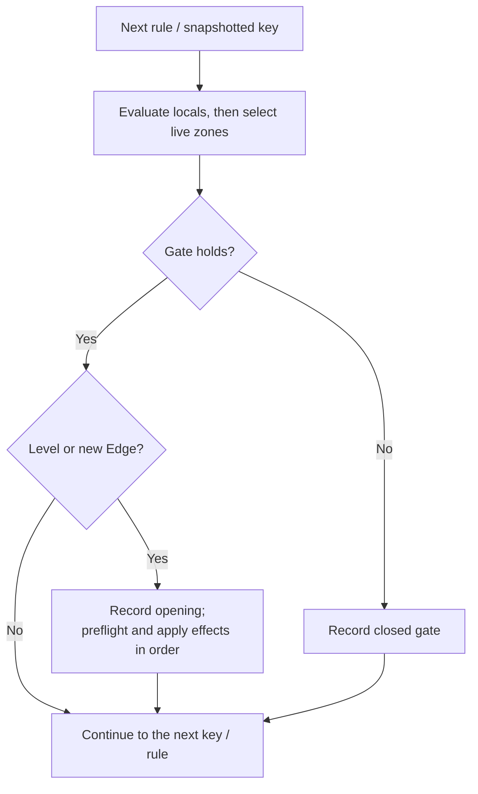
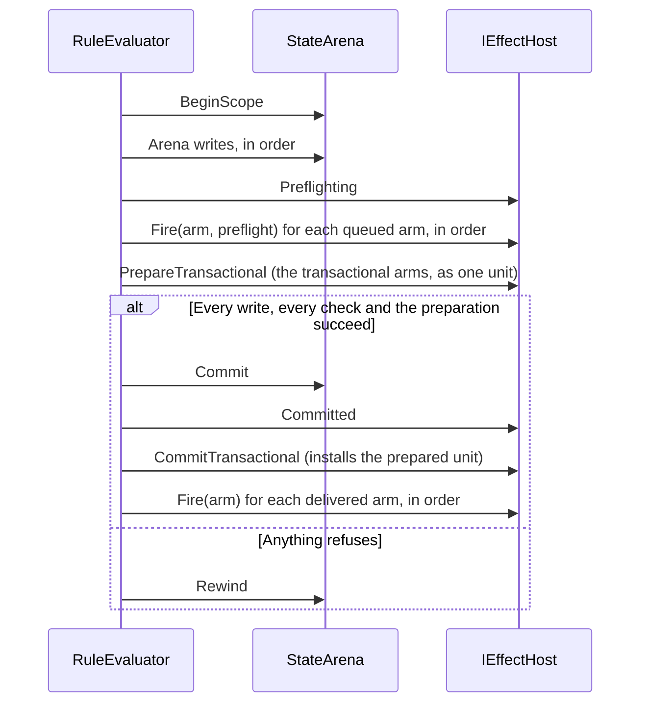

# Compile and run rules

A rule connects a question to an action: “If the player has at least three
coins, spend three coins and award one card.” Its **gate** asks the question;
its **effects** describe the attempted changes. The host decides whether those
changes can be installed.

Use the [small running example](../state.md#evaluate-a-small-rule) first.
This chapter follows a rule through compilation, iteration, latching, and
mutation admission.

## Read the parts of a rule

| Part | Role | Example |
|---|---|---|
| Name | Stable identity for compilation, tracing, and latching | `buyCard`. |
| Bindings | Numeric expressions evaluated in declaration order | Bind a price once for the gate and effects. |
| Gate | A predicate that must hold | `coins >= 3`. |
| Mode | Decide whether a held gate fires repeatedly | Level or Edge. |
| ForEach | Evaluate for each key in a row | One status update per piece. |
| Effects | Ordered attempts to change state | Spend coins, then award a card. |
| Zones | An indexed set of ordered piles | Select the source and destination at runtime. |

## Follow one evaluation



This diagram shows the ordinary library evaluation path; a host can supply
special rule kinds through the [extension contract](hosting.md).
Locals run before the gate, so a local can fault even when the eventual
gate would have been closed.

Rules observe earlier accepted writes in the same pass. If rule A increments
`coins` from 2 to 3 and rule B tests `coins >= 3`, B sees 3. This is an
ordered evaluation, so reordering rules can change the result.

## Choose Level or Edge

**Level** fires each time the gate is evaluated as true. **Edge** fires when
the evaluator observes a transition from false to true. It becomes eligible
again only after an evaluation observes false.

| Evaluation | Gate | Level fires | Edge fires |
|---|---|---|---|
| 1 | false | No | No |
| 2 | true | Yes | Yes |
| 3 | true | Yes | No |
| 4 | false | No | No |
| 5 | true | Yes | Yes |

A `RuleLatch` remembers those crossings, including the evaluator's iteration
binding. Preserve it across simulation steps and checkpoints. Edge records
the opening before firing effects: a refused write does not turn a continuously
true gate into a new crossing on the next step.

An always-open Level rule adds a coin every evaluation. An always-open Edge
rule adds one coin on its first opening. A caller that judges many independent
positions instead of continuing one simulation has different lifetime
semantics: it calls `RuleLatch.Reset` before each judge, so every crossing is a
first one.

## Make several effects succeed together

One firing is one journal scope on the arena. Every write the firing makes
lands when the scope commits, or none does: if spending coins succeeds and
awarding a card is refused, the scope rewinds and the coins are back.

An effect that leaves the arena cannot be rewound by the journal, so it is
queued instead of fired, checked before the commit, and handled after it. There
are two kinds, and the firing's all-or-nothing promise covers only the first.

| Kind | Declares | What the firing promises |
|---|---|---|
| Transactional arm | `EffectNeeds.Irreversible \| EffectNeeds.Transactional` | The host composes every such arm of the firing, in order, against one speculative state while they are checked, decides everything that can refuse the unit before the scope commits, and installs it when the scope commits. The install cannot refuse, so the arms land with the firing's writes or not at all. |
| Delivered arm | `EffectNeeds.Irreversible` | It is checked before the commit and fired after it, in authored order. A delivery that refuses is one counted refusal. It undoes nothing, and later deliveries still run. |

The arms are checked as the sequence they are. A later arm is judged against
what the earlier arms of the same firing would leave, so removing the same
placement twice refuses the firing before it commits, and removing a placement
an earlier arm creates is admitted.



The following rule fragment assumes declared Int slots `coins` and `cards`.
It wraps the two changes in one transaction; it is not a complete host program.

```csharp
var buyCard = new Rule(
    Name: CellName.Parse("buyCard"),
    Gate: new ActionPredicate.CompareState(
        State: "coins", Comparison: ActionStateComparison.GreaterOrEqual, Value: 3m),
    Mode: ActionTriggerMode.Edge,
    Effects: [new ActionEffect.Transaction(Effects: [
        new ActionEffect.AddState(State: "coins", Value: -3m),
        new ActionEffect.AddState(State: "cards", Value: 1m)
    ])]);
```

A custom effect that sends a notification cannot promise rollback by returning
success from its check: it is a delivered arm, and the table above is what it
may rely on. The [host protocol](hosting.md#implement-the-mutation-boundary)
owns installation, validation, journaling, and delivery.

A transaction is a savepoint inside the firing, not the firing's own boundary.
A refused step rewinds only the savepoint, so the effects before the
transaction survive; an optional `onFailure` list then runs in the firing's
own scope and the effects after the transaction still run. A refusal inside
`onFailure`, or in a later sibling effect, rewinds the whole firing — the
same as any other top-level effect refusing. A transaction with no `onFailure`
simply propagates its refusal outward once its own savepoint has rewound.

`transaction` is the only atomic group: every other top-level effect is its
own boundary, so one piece of a rule refusing (a capture, a write past a
ceiling) refuses only that effect, never its neighbours'. An implicit
contiguous-run atomicity — treating a rule's whole effect list as one group
by position rather than by an explicit `transaction` — is a second, invisible
atomicity mechanism for the same thing and is refused; making the boundary
explicit is what a rule author reads back.

Refused elsewhere in the compiler, each for a mechanism a rule can already
express without it: an SMT solver behind the work budget (interval
intersection over literal cells is the whole of what the work sheet can
honestly claim; an invariant such as "these flags are exclusive" is the
author's to state, not the compiler's to infer); reordering rules for the
author (evaluation order is authored, not solved); a fixed C# "recipe
executor" naming game nouns inside the engine; a `copyCells` transform,
derivable from `forEach`; a per-effect `isolate` flag, since making an
atomic boundary explicit through `transaction` already closes the gap it
would have covered; loosening the work budget to an average-case estimate,
since a bound that can be exceeded is not a bound; a stepping debugger, since
a rule's evaluation is one line of facts with no call stack; a mate detector
or other domain logic unrolled into per-piece rules, when a general search
job already answers the same question; a privileged bot mutation, when a
search job's candidate issues through the same command path a human uses;
and a compatibility shim between an old and a new spelling at any phase.

## Branch on a condition

An `if` effect chooses one of two effect lists by a predicate — the same
grammar a gate compiles. `then` fires when the condition holds; the optional
`else` fires when it does not. A condition that cannot evaluate (an
arithmetic fault, or a missing table key) runs neither branch and is reported
the same way a failing top-level effect is; a condition that evaluates to
false, with no branch left to run, is not a failure.

```csharp
var claimBonus = new Rule(
    Name: CellName.Parse("claimBonus"),
    Gate: new ActionPredicate.CompareState(
        State: "$tick", Comparison: ActionStateComparison.GreaterOrEqual, Value: 1m),
    Mode: ActionTriggerMode.Edge,
    Effects: [new ActionEffect.If(
        Condition: new ActionPredicate.CompareState(
            State: "streak", Comparison: ActionStateComparison.GreaterOrEqual, Value: 3m),
        Then: [new ActionEffect.SetState(State: "bonusAwarded", Value: 1m)],
        Else: [new ActionEffect.SetState(State: "bonusAwarded", Value: 0m)]
    )]);
```

Each branch effect is its own boundary — preflighted and installed
individually, exactly like a top-level effect (or, inside a `transaction`,
any other step); a branch is not itself a transaction. A `transaction` may
appear inside an `if`'s branch, but only when that `if` is not itself inside
one — transactions never nest, whether directly or through an intervening
`if`. A registered effect family opts out of appearing inside any `if`
branch, at any nesting depth, through `EffectFamily.AllowsInsideBranch`; the
library's own effects all allow it.

A rule's trace shows which branch a captured evaluation took (`then`,
`else`, `neither`, or `condition failed`) beside the `if` effect's own
applied/refused/skipped verdict.

## Iterate keys without changing the loop beneath it

`ForEach` snapshots the selected row's keys before evaluating them. Effects
can change values, but newly added keys do not join that already-started
iteration. `$each` means the bound key, not whatever cell later occupies the
same position. A Text row can provide iteration keys even though numeric
reductions cannot aggregate its text.

For a rule that serves several piles, its `Zones` table associates an index
with a row. `$zones[game[to]]` selects the destination row from a live value;
`$zone:hand:last` selects one member's key from a particular ordered row.
The distinction is **which row** versus **which cell in a row**.
The detailed [facts contract](#the-facts) covers gaps, empty endpoints,
and the trace's resolved-zone display.

## Distinguish a closed gate from a refusal

A closed gate is an ordinary answer: the condition does not hold.
A refusal means a requested operation could not be compiled or evaluated.

| Stage | Signal | First thing to inspect |
|---|---|---|
| Compilation | `RuleException` with a `RuleRefusal` or host category | Name, cell kind, declared key, and supported effect family. |
| Arithmetic evaluation | `ExpressionFault` counted as an arithmetic refusal | Input range, division, function domain, or absent operand. |
| Mutation admission | Host refusal reason | Envelope, capacity, authority, and transform requirements. |
| Unexpected firing or skipping | Rule trace and latch lifetime | Array order, bound key, live zones, and Edge versus Level. |

The evaluator retains exact counts by refusal category and notifies the host
on a category's first occurrence. Arm a named rule's trace to see its evaluation;
a traced run evaluates fully even when scheduling could otherwise reuse an answer.

## Compile, evaluate, and commit

Compile against one section, catalog, vocabulary, and simulation rate. The
compiler resolves operands and validates their kinds. During evaluation,
locals run before the gate, rules run in array order, and earlier accepted
writes are visible to later rules. An ordinary effect preflights and installs
individually. Use a transaction when several effects must succeed together;
the host must support its candidate and rollback protocol.

Persist authoritative rows and edge-latch state together with any generator
state the host owns. Scheduling caches can be rebuilt: they only avoid work
whose inputs are proven unchanged. The host also owns validation and installation
of its document; compiling rules does not supply a complete application's
mutation, authority, or persistence pipeline.

## Run several rules as one step

A **rule group** claims a set of already-compiled rules and runs them as one
unit instead of leaving them to fire independently in array order. A rule
belongs to at most one group; an ungrouped rule still runs the ordinary way.

| Shape | How it runs | Closes or advances when |
|---|---|---|
| `Fixpoint` | One pass per tick over every member, in authored order. | A pass leaves no row in the group's combined write set changed, or the authored pass ceiling (default 8, at most 64) is reached — a counted refusal naming the group. |
| `Staged` | A cursor over ordered steps; only the step under the cursor evaluates. | The step's effects commit. A refused step stalls the cursor there for a later tick, unless that step declares `skip`, in which case the cursor advances past the refusal. The last step is terminal. |

A group's own `Trigger` is a gate, compiled and admitted exactly like a rule's:
`RuleNeeds.Admit` refuses a group naming a facet the host does not serve, by
facet name, before evaluation ever starts. With no declared trigger the group
is always armed.

Group progress — a fixpoint group's pass count, a staged group's cursor
position — is checkpoint state beside `RuleLatch`, hashed with it. It is
never a row: a host that persists authoritative state and the latch together
persists group progress by the same act.

`stabilize` and `workflow` are the authored spellings that lower to a
`Fixpoint` and a `Staged` group respectively; a rule a lowering generates for
one carries the `Generated` mark described in
[rows and cells](data-model.md#rows-and-cells), the same as any other
synthesized row.

## Rules

The authored model consists of `Rule` and `RuleLocal`, `ActionPredicate`
(`compareState`, `compareValue`, `all`, `any`, `not`), `ActionEffect`
(`setState`, `addState`, `pushState`, `transformState`, `countdownState`,
`generate`, `removeStateCell`, `scheduleState`, `transaction`, `if`),
`ActionTarget`, `ActionStateComparison`, and
`ActionTriggerMode`—the last two shared with `Puck.Physics`' compiled
per-body predicates, so neither can grow an arm the other lacks.
Transactions contain ordinary effects with compiler-enforced admission;
registered families opt in only when their host supports bounded rollback.

## The compiler

`RuleCompiler` compiles a `Rule` against a
`RuleCompileContext` (the section, its catalog, its pinned `TableSource`s,
patterns, generators, and the simulation rate) into a `CompiledRule`—
`GateToken`s, `EffectFact`s, `CompiledRuleLocal`s, `CompiledExpressionToken`s.
Every piece (`CompileGate`, `CompileEffects`, `CompileExpression`,
`CompileLocals`, `ResolveOperand`, `TryResolveDynamicKey`) is public so a
document project composes them with its own arms. `RuleRefusal` names every
compile-time refusal; a `RuleException` carries one, or a document project's
own enum.

## The facts

A compiled **fact** is an object that knows how to answer a read or describe an
effect. These are class hierarchies so a host can extend them:

| Family | Core facts |
|---|---|
| `IRuleOperand` | `StateCellOperand`, `BindingOperand`, `TableOperand`, `TickOperand`, `ReductionOperand`, `SymmetryOperand`, `BoardOperand`, `PhaseOperand`, `PatternOperand`, `HistoryOperand`. |
| `IRuleEffect` | `WriteEffect`, `CountdownEffect`, `GenerateEffect`, `RemoveStateCellEffect`, `ScheduleStateEffect`, `TransactionEffect`, `TransformStateEffect`, `PushStateEffect`, `IfEffect`. |

Operands implement `Read(IStateReader)`. Facts also report cost and read/write
dependencies through `Cost`, `CollectReads`, and `CollectWrites`, using
`CellAccess` lists. [Host analyses](hosting.md#analyses) consume those answers.

Each family's cases are sealed classes, never records or structs: a union
boxes its stored case on write, and nothing at runtime compares two operands
or two effects for equality or identity, so a case gains nothing from value
semantics and only pays their cost. `src/Puck.State/Union.cs` polyfills the
`[Union]` attribute and `IUnion` interface that mark a closed hierarchy until
the toolchain supplies the real pair.

### Resolve a key

`CompiledCellRef` carries key indirection: `$cell:`, a bound key,
`$local:`, a `$zone:` endpoint, or a host's `KeyFact`.
An `$expr:` key compiles into a shared implicit local and is read back
through `LocalKeyFact`.

### Select a row from a live zone table

`ZoneTable` provides the corresponding indirection for a row. A rule's
`Zones` table contains ordered zones over one token domain and kind, in
index order. An empty entry leaves a gap.

Any row position can select `$zones[<index>]`: the index is an infix
expression such as `game[from]`, `$each`, or `$local:destination`.
This works in `compareState`, `$reduce:`, `$match:`, a `$zone:`
endpoint, transfer ends, and expression row reads.
`forEach: "$zones"` iterates the table's non-empty indices.

Before the gate, the evaluator resolves each distinct live spelling once through
`ZoneTable.References`. Every selection must name a populated entry.
An out-of-range index or gap closes the gate without recording a refusal:
the table declares which piles this rule serves. The trace shows selections,
for example `zones [$zones[game[to]] -> pile3, ...]`.

`RuleFacts.SplitChannel` keeps bracketed indices intact while splitting a
channel. The infix lexer likewise keeps `$zones[...]` inside a reserved name.

### Read an empty endpoint

`$zone:<ordered-zone>:first|last` returns the member's original string key
from the arena, including an uncommitted transfer inside the current journal
scope. An empty zone has no endpoint. That is an absent fact
(`RuleFact.IsAbsent`), not a value of zero.

An operation reading it refuses and names the two expression operations that
answer an absence, `isAbsent(operand)` and `operand ?? fallback`
([Answer an absent read](expressions.md#answer-an-absent-read)), so what an
empty endpoint means is the author's choice rather than the engine's.

| Operation using the absent endpoint | Result |
|---|---|
| Compare its value | No comparison holds, including `NotEqual`; the conjunct faults and the refusal names the two operations. |
| Use its value in an expression | Evaluation refuses, naming the two operations. |
| Copy from it | The effect does not fire; the refusal names the two operations. |
| Write to the cell it names | The write refuses. |

A copy's refusal leaves the firing's other effects alone: the copy does not
fire, and an enclosing transaction's other effects still apply.

Outside a rule evaluation, an unselected live zone has the same absent behavior;
a transfer through it refuses by name.

### Resolve an effect's source

Numeric `setState`, `addState`, and `pushState` share source resolution.
A direct source is read once per execution pass; an ordinary write still has
separate preflight and live passes. Absent and `forever` sources skip the
effect — an absent one refusing by name, a `forever` one silently — while
expression faults retain their diagnostic behavior.
Here `forever` is a fact representing positive infinity, not an unusually
large stored integer.

A common compiled value source represents a literal, an operand, or an
expression behind one shared read, dependency, cost, and failure path, but it
does not erase the distinctions a source's author chose:

- A fact comparison and an expression comparison agree on a fractional
  literal against an integer: both lower it to the exact integer comparison,
  so `compareState` against `< 0.5` and `compareValue` over `pick` and `0.5`
  both hold for an integer slot holding zero.
- A fact comparison can compare `forever`; a numeric expression evaluation
  refuses it.
- An absent zone endpoint makes a direct comparison false, including
  `NotEqual`, and an expression reading it evaluates to nothing; both fault,
  and both refusals name `isAbsent(operand)` and `operand ?? fallback`.
- Text copies are not numeric expressions.
- `countdownState` consumes engine-step width and handles the final partial
  step; `scheduleState` writes an absolute simulation-tick deadline with an
  upward-rounded delay.
- `add` and `set` differ on a missing cell and on a cycling cell, which
  stores a phase but reads a transformed value.

Author conveniences can lower into a smaller common representation. Removing
an operator merely because an author could emulate it with several rules can
increase program size, exceed a work limit, or change atomicity.

### Vector transforms

Rules can transform, search, and combine vectors directly within simulation state using four
specialized transform statements:

```puck
rule "remember-ambush" {
    mode: Edge
    when caravanAttacked == 1
    transform remember(into: memories, key: "ambush", from: "events[ambush]", unlessWithin: 0.9)
    situation = events[ambush]
    transform mix(into: "stance[guards]", terms: [
        { from: "stance[guards]", weight: 3 }
        { from: "events[ambush]", weight: 1 }
    ])
    transform nearest(from: memories, query: "situation", into: recalled, k: 3, threshold: 0.5)
    transform nearest(from: lineVectors, query: "situation", into: reply, k: 1)
}
```

| Transform | Primary parameters | Function |
|---|---|---|
| `nearest` | `from`, `query`, `into`, `k`, `[threshold]` | Performs cosine k-nearest-neighbors search across vector cells in a row against a query vector, writing matching keys, scores, or values into the target. |
| `mix` | `into`, `terms: [{from, weight}, ...]` | Computes a weighted sum of vectors and renormalizes to unit radius 127 in destination. |
| `remember` | `into`, `key`, `from`, `[unlessWithin]` | Inserts vector into memory table unless an existing vector is within cosine threshold `unlessWithin`. |
| `mean` | `from`, `into`, `[where]` | Writes the normalized mean of a table's candidate vectors, optionally restricted to keys where a keyed Bool row reads true. |

Vector copies can also be written directly: `situation = events[ambush]`.

### Text key indirection

When paired with `embeds(targetVectorRow)` declarations, Text rows and Vector rows share identical keys.
`nearest` can query against the vector row and write directly into a Text slot or table, translating
semantic vector proximity back into human-readable dialogue or intents without string embedding at runtime.

## Evaluation

`RuleEvaluator` runs a compiled rule family over an `IEffectHost`.
The evaluation context holds the tick, bound iteration key and participants,
and local values. The host's `IStateReader` forwards that context to operands.
`RuleEvaluation` supplies the shared `GateHolds`,
`TryEvaluateExpression`, `ResolveKey`, and state-read operations.

### Mutation and iteration contracts

Core effects produce four mutation shapes: `UpsertCell`, `RemoveCell`,
`Generate`, and `Apply` a transform. Each is written inside the firing's
journal scope through `IEffectHost.Apply`. A transaction is a savepoint inside
that scope.

The evaluator visits rules in array order and binds values before the gate.
Its `RuleLatch` preserves Edge/Level history per evaluation binding, including
hashing and checkpoint flatten/restore. Iteration snapshots keys before its
first evaluation. Any keyed kind, including Text, can supply those keys;
numeric reductions still require numeric rows.

A compiled iteration handle avoids name lookup. A caller omitting it resolves
the row through the current catalog. The position shortcut verifies the live
key before reading, so removal or reordering cannot redirect `$each`.
Literal operands preserve null-as-slot and empty-as-absent semantics while
using pre-parsed keys where available.

### Trace and refusal reporting

`RuleTraceEvaluation` is armed per rule name. `RuleRuntimeDiagnostic`
records exact counts per category, with the host notified on the first occurrence.
An arithmetic fault in a local, effect, or `compareValue` conjunct is
reported as `RuleEffectRefusal.Arithmetic`; `ExpressionFault` identifies
the cause. A missing table key uses the evaluator's table-key diagnostic
instead of adding a second arithmetic report.

## State transforms

An ordinary cell write changes one address. A transform describes a structured
change whose selection, ordering, and associated bookkeeping must agree.

| Transform | Use it to… |
|---|---|
| `transfer` | Move selected tokens between ordered zones while preserving their identities. Random selection advances its draw only when the whole transfer commits. |
| `setRay` | Replace the longest outward run accepted by a pattern, excluding the origin. An empty accepted prefix refuses. |
| `shuffle` | Reorder a keyed row or zone using a named stream draw; n members consume n − 1 samples. A board or a ring carries no order of its own to permute, and naming one is refused. |
| `sortZone` | Stably order a pile by numeric attribute rows in declared precedence. |
| `sortKeyed` | Stably order a numeric keyed row or zone by its own values, under the same row-shape rule as `shuffle`. |
| `writeSet` | Write a value to board cells selected by an integer bitmask, for a topology of at most 64 cells. |
| `boardCombine` | Combine membership from boards over one topology, including boards larger than a single mask. |
| `arrange` | Reorder an ordered zone by a permutation rank. |
| `push` | Append a history value, overwriting the oldest ring slot when full. |
| `clearEnclosed` | Clear adjacent groups in an inclusive value range that have no empty neighboring cell. |
| `observe` | Refresh a knowledge board from its source and visibility mask under authority control. |

`boardCombine` treats a cell as a member when its value differs from the board's
empty value. It writes the declared result value to members and the empty value
elsewhere. This is membership algebra, not arithmetic addition of board values.

`$board:mask` reads a board's occupancy as a plain `Int`: a 64-bit cell set is
one expression value, and an expression value is one word, so `writeSet`'s
64-cell ceiling follows from that representation rather than from a separate
limit. No multi-word cell-set type exists in the expression language — the bit
operators (`bitAnd`/`bitOr`/`bitXor`/`bitNot`/`popCount`/`lowestSetBit`) are
ordinary generic `Int` operations that happen to compose masks, not a second
value kind. `boardCombine` is the answer once a topology exceeds 64 cells: it
runs the same set algebra over whole board rows instead of a single mask word.

The `arrange` transform supports up to 20 tokens, with rank zero giving the
token domain's order and ranks at or beyond k! refused. The packed integer
expression functions have their separate 16-element limit because each element
occupies four bits; see [permutation expressions](expressions.md#function-families).

Transform support depends on the host. In particular, [a scoped judge](frames.md#decide-whether-a-rule-can-be-judged-in-a-scope)
implement a subset, so admitting a transform in an installed document does not
automatically make it available to a search judge.

`StateTransform` models these operations. `ZoneSelector` and `SortKey`
describe selection and ordering. `clearEnclosed`'s `from` and `writeSet`'s
`setKey`, and a transfer's `key` accept a dynamic key (`TransformStateEffect.KeyRef`,
resolved live in `RuleEvaluator.Effects.Fire` before the mutation
submits) alongside a literal cell: a rule gated on the held token paints
`plan` from `legal[$cell:held:token]` after a `boardCombine clear`.

---

[State and rules](../state.md) · Next: [Evaluate a candidate and reuse a proven answer](frames.md)
