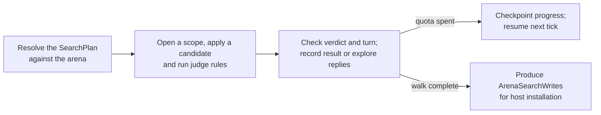

# Search possible moves

Search repeatedly asks a set of rules to judge possible changes to a
[candidate scope](frames.md). It can enumerate legal moves or compare futures.
A **candidate** is one proposed change; a **ply** is one move deeper into
a future. The installed state stays under the host's control.

## Follow one candidate



The acceptance convention is explicit: the judge must leave the verdict slot
equal to `SearchPlan.Accept` and change the turn slot from the candidate's
base turn. A changed piece position alone does not establish a legal move.

The host resolves a plan against its rows and topologies. The runtime receives
those resolved names, compiled candidate shapes, and judge rules; it does not
understand a world's wire format or mutation permissions.

## Choose what to enumerate

| Shape | Candidate change |
|---|---|
| Relocate | Move a token to another cell, with the declared displacement policy. |
| Drop | Place an off-board token into an empty cell. |
| Jump | Follow an allowed direction over an occupied cell, optionally as a bounded chain. |
| Promote | Relocate while trying one of the declared replacement codes. |
| Pair | Relocate a token and its fixed companion together. |
| Transfer | Move an endpoint token between declared ordered zones. |

The shape supplies possible changes; judge rules supply the game's acceptance
conditions. A geometric relocation can therefore be considered and rejected
without making it an authoritative move.

Outputs can include accepted-destination masks, per-token counts, a reach board
for the held token, and a best-move answer. A single-word legal mask has a board
size limit; size-independent counts and the runtime's wider destination storage
serve other outputs. See `SearchPlan` and `SearchCapacity` for the exact bounds.

## Choose how to compare futures

| Mode | How it chooses | Suitable question |
|---|---|---|
| Enumeration without a score | Visit root candidates and collect accepted results | Which moves are legal? |
| Negamax with `Score` | Compare a two-sided score, reversing perspective between sides | Which move has the best reply-adjusted score? |
| Negamax with `Scores` | Maximize the mover's own seat score (max-n) | Which move benefits this seat in a multi-seat game? |
| Tree search | Use UCB1 selection and seeded playouts; land the most-visited root move | Which move looks promising under a bounded sampling budget? |

**Alpha-beta pruning** skips reply branches that cannot improve the current
choice. A **transposition table** remembers evaluations of positions reached
by more than one path. **Iterative deepening** completes progressively deeper
passes. The root enumeration still visits every candidate so legal-move outputs
remain complete independently of scoring.

**UCB1** balances trying less-visited choices against revisiting successful ones.
A playout follows one sampled future; it is evidence for a choice, not exhaustive
proof that the choice is optimal. The tree has a bounded node pool and an authored
iteration limit. Per-seat `Scores` and tree search are not combined.

## Apply an opponent's answer

A job can name an integer `enabled` slot. Zero pauses candidate work; changing
it back to a nonzero value resumes against the current inputs. A job can also
name an integer `revision` slot. Its `best` row must then include a `revision`
cell as well as `token`, `to`, and `score`. The runtime copies the input revision
into the completed answer. Increment the input revision when accepting a new
position, and apply an answer only while both revisions match. Disabling a job
does not erase its previous output, so the apply rule must also check the enable
condition.

Pure judge rules can read `$search:ply`: it is zero on the live world host and
the candidate's depth on a search host. This lets a game's judge finish compound
candidates, such as moving the rook for castling, before validating them. Those
changes remain inside the candidate scope and are rewound with it. Physical
effects still run only on the live host. The `poseCell` world effect places a
body at a live topology cell plus an authored offset, resolving the topology's
current board anchor before moving the body.

Transposition keys include this move depth as well as the relevant state.
Reaching the same stored position at another depth can produce a different
judgment or score. Chance draws do not advance the move depth; cached results
remain reusable when both the position and move depth agree.

### Chess opponent

The chess world keeps two-human play as its default. Set its `aiSide` slot from
the console to choose the opponent:

```text
world.state.cell.set aiSide $value 1
```

Use `0` for an opponent playing White, `1` for Black, or `-1` to disable it.
The opponent waits for a settled, legal board, evaluates legal moves using
material, central occupation, and pawn progress, then moves the physical pieces.
Castling moves both pieces, captures move the victim beside the board, and en
passant removes the correct pawn. Promotion chooses a queen. The evaluator is
one ply deep: it is a basic opponent and does not anticipate the opponent's
reply or search underpromotions. Its promoted pawn retains its physical pawn
model; `pieceCode` carries the new queen identity.

## Account for chance

A `SearchChancePlan` supplies a bounded table of possible values and weights.
Two six-sided dice have 36 joint outcomes. Negamax averages the outcome values
using their weights; tree search samples an outcome from the job's stream.
The plan's `AtDepth` uses absolute ply numbering for negamax and 1-based
playout numbering for tree search, so the two interpretations must be chosen
deliberately.

The document compiler bakes the outcomes before execution. The search runtime
does not invoke a live generator to discover them.

## Keep work and progress deterministic

`Nodes` limits the candidate work performed each tick. No search blocks a
tick: the runtime suspends its explicit search stack and resumes it on later
ticks rather than making a decision according to elapsed wall-clock time.
Relevant input changes restart the job so a finished answer does not describe
an abandoned position. A candidate is a journal scope on the arena, never a
copy of it — see [candidates](frames.md).

A game is a judge, and a ply is a candidate state the judge accepts and that
changes the turn slot; an interaction-shaped host fits the same definition
with its gates standing in for the judge.

Unlike a rule scheduling cache, search progress is simulation state: node
cursors, scopes, depth passes, stored position results, and tree progress
participate in hashes and checkpoints. Persist it when continuation must resume
the same work. A finished job emits `ArenaSearchWrite.Cell` and
`ArenaSearchWrite.ClearBoard`; the host translates those writes into its own
validated mutation pipeline.

## Search (`Search/`)

`SearchPlan` declares every (shape, token, target or direction) candidate a job
walks. `ArenaSearchPlan` resolves those names against a catalog and
`ArenaSearch` (in `Puck.State.Search`) walks them—negamax with alpha-beta and a
transposition table, or UCB1 tree search—judging each through a document
project's own compiled rules over a journal scope on the arena; a
finished job lands as `ArenaSearchWrite`s (`Cell`, `ClearBoard`), never a
document project's own mutation vocabulary. `SearchShapePlan`/`SearchShapeKind`
compile the six candidate shapes (relocate, drop, jump, promote, pair,
transfer); `SearchCapacity` holds its bounds. A document project resolves
its own authored rows into a `SearchPlan[]` (row and topology references,
by name), compiles its own judge rules, and translates a landed job's
writes into its own wire vocabulary—the runtime holds no world, document,
or wire concept.

A world's job is judged by the rules that can reach it, not by the world's
whole sheet. `WorldSearchCompilation.JudgeRules` starts from the rows the job
names and the rows its score reads, keeps every arena-only rule that writes one
of them, and adds what each kept rule reads and iterates until nothing more
joins. Reaching a derived board also reaches its inverse token and code rows:
a rule that changes either input can change the board without writing it
directly. This closure is computed when the job is planned, before candidate
work begins. A rule outside that set writes nothing the job can observe, so dropping
it changes no answer. In a world that imports several games, one game's search
therefore pays for that game's rules: a judge run is priced, and admitted
against the tick's allowance, on the scoped set.


---

[State and rules](../state.md) · Next: [Host and extend State](hosting.md)
